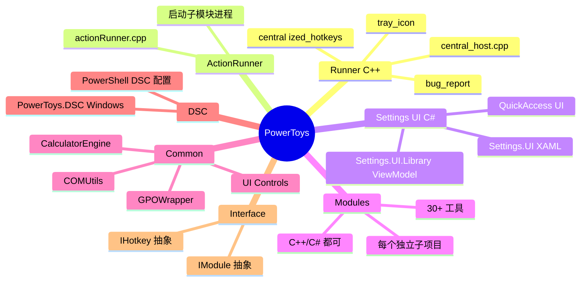
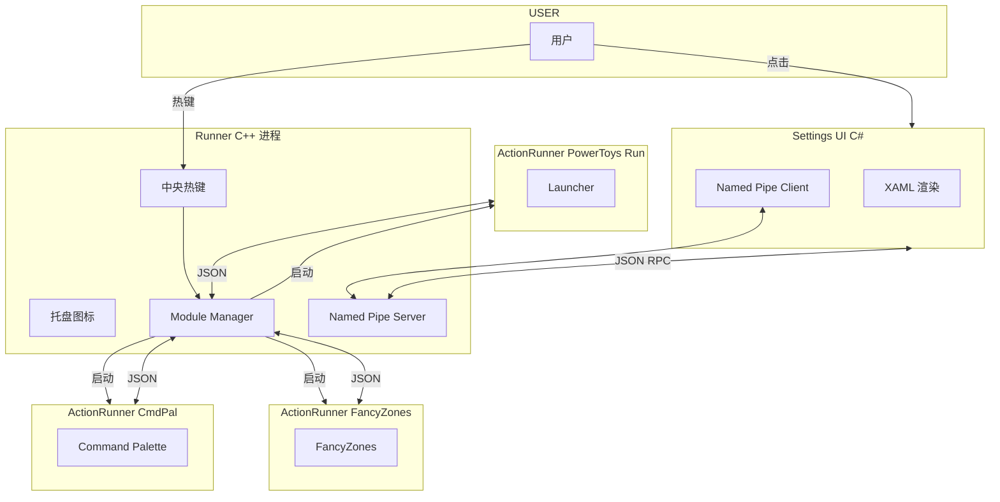
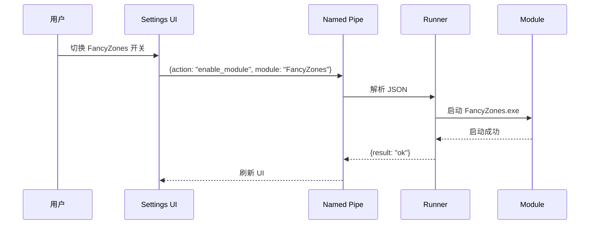
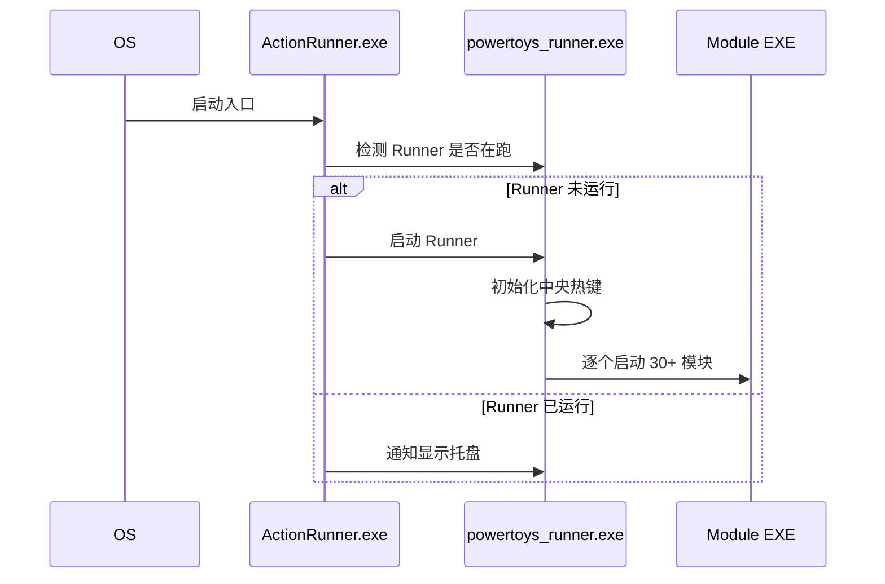
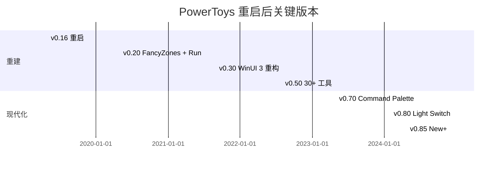
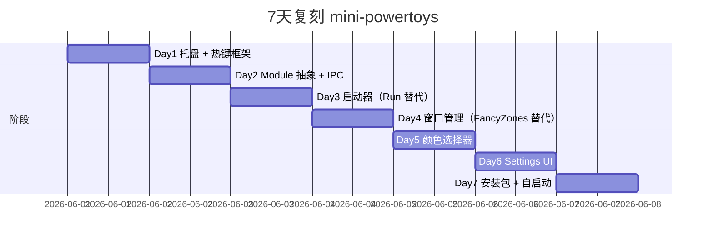
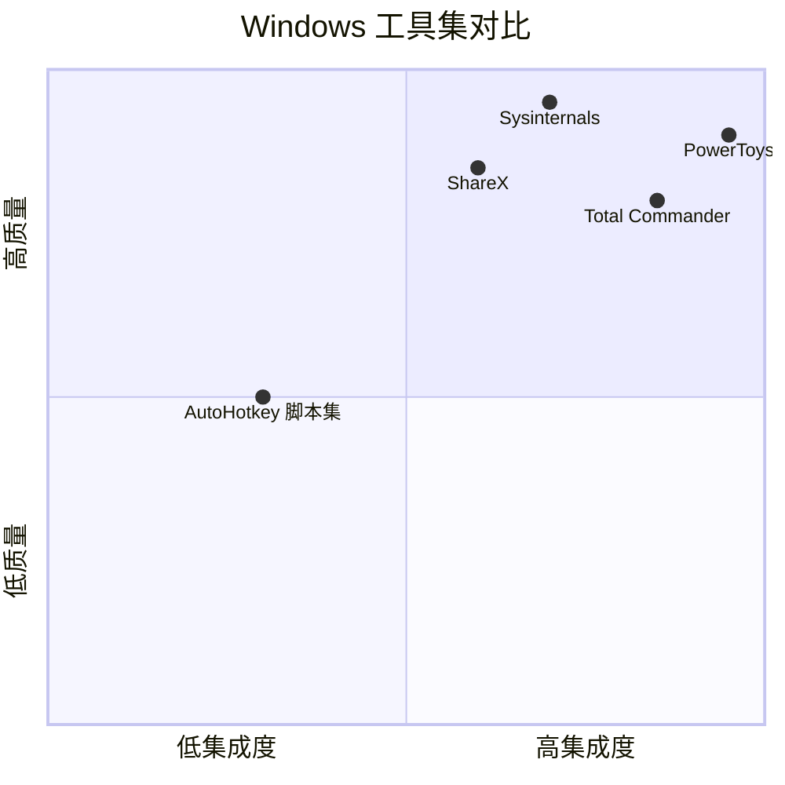

# powertoys · 项目深度解析

> 微软官方维护的 Windows 高级用户效率工具集，30+ 工具共享一个 Runner + Settings 体系
> 来源：G:\实战案例\GitHub顶尖项目\powertoys\

## 写在前面：解析哲学

PowerToys 是少数由"商业公司（微软）"主导的开源桌面工具集。本笔记不会逐个工具讲解（30+ 个会耗尽字数），而是从**架构层面**拆解：30 个工具怎么在同一个进程里共存？热键怎么全局拦截？Settings UI 怎么与 C++ 模块通信？Runner、ActionRunner、Module、Interface 四个角色各自的边界是什么？掌握这套"多工具宿主"架构后，任何"一组相关小工具打包发布"的需求都能套用。

## 0. 解析前的 5 个准备

1. **克隆**：`git clone https://github.com/microsoft/PowerToys.git`
2. **分类**：Windows 系统工具集 / 进程内多模块宿主 / C# + C++ 混合 / WinUI 3 前端
3. **问题清单**：① 全局热键怎么拦？② 30+ 模块怎么同进程跑？③ C++ 模块怎么和 C# Settings UI 通信？④ 启动 / 关闭顺序？⑤ 故障模块怎么隔离不挂掉？
4. **速查表**：`src/runner/`（C++ 宿主）/ `src/ActionRunner/`（MSIX 启动）/ `src/settings-ui/`（C# WinUI 3）/ `src/modules/`（30+ 工具）/ `src/common/`（共享 lib）
5. **锁定 commit**：v0.85+（2025）

## 1. 开发计划书（Project Charter）

| 项 | 内容 |
|---|---|
| 项目名 | Microsoft PowerToys |
| 定位 | Windows 高级用户 / 开发者 / 设计师的效率工具集 |
| 核心问题 | Windows 自带工具对高级用户不够用；零散开源工具质量参差 |
| 用户 | Power user、开发者、设计师、IT 管理员 |
| 商业模式 | 微软官方项目，MIT 协议，不直接变现（带飞 Windows 口碑） |
| 复刻难度 | ★★★★（多语言 + 30 工具 + Win32 / WinUI 双栈） |
| 状态 | 活跃；每月 1-2 个 minor release |
| 团队 | 微软 + 100+ 社区贡献者；核心维护者 @crutkas @dhowett |
| 里程碑 | 1990 v1 · 2019 重启 · 2020 v0.20 FancyZones/PowerToys Run · 2022 WinUI 3 重构 · 2024 Command Palette v0.84 · 2025 Light Switch / New+ |

## 2. 项目框架（Repo Skeleton Map）



**核心角色**：
- **Runner**（C++ 桌面进程）：常驻系统托盘，调度所有模块
- **ActionRunner**（C++ 工具进程）：每个模块独立 EXE，被 Runner 启停
- **Settings UI**（C# WinUI 3）：配置面板，与 Runner 通过 named pipe 通信
- **DSC**：Desired State Configuration，IT 管理员用 PowerShell 部署

**代码入口**：
- `src/runner/powertoys_runner.cpp`：Runner main
- `src/ActionRunner/actionRunner.cpp`：Module 进程 main
- `src/settings-ui/Settings.UI/SettingsXAML/App.xaml.cs`：Settings main

## 3. 项目画像（Profile）

| 指标 | 数值 / 描述 |
|---|---|
| 总文件数 | ~6000 |
| 主语言 | C++ (~50%) / C# (~40%) |
| 涉及语言 | C++ / C# / XAML / PowerShell / Python（测试）/ Rust（部分模块） |
| Star | 117k+ |
| License | MIT |
| Docker | 否（桌面应用） |
| K8s | 否 |
| CI | Azure DevOps + GitHub Actions |
| 有测试 | 是；xUnit + C++ Google Test |

## 4. 架构设计（Architecture Deep Dive）

### 4.1 多进程宿主模型



**WHY 多进程**：一个模块崩溃不会拖死 Runner；可单独升级某个模块；UAC 权限可独立控制。

### 4.2 IPC 通信

Runner ↔ Settings UI、Runner ↔ Module 都用 **Named Pipe + JSON**：

- `\\.\pipe\PowerToysSettings`（Runner 监听）
- `\\.\pipe\PowerToys.InterProcessCommunication`（Runner ↔ Module）



### 4.3 热键拦截

`src/runner/centralized_hotkeys.cpp` + `centralized_kb_hook.cpp`：
- **全局热键**：用 `RegisterHotKey()` Win32 API（只支持 modifier+单键）
- **全局按键 hook**：用 `SetWindowsHookEx(WH_KEYBOARD_LL, ...)`，必须 DLL 注入
- **停靠区 / Snippet 触发**：用低层 hook + 状态机

**WHY 双策略**：`RegisterHotKey` 简单但功能受限；`WH_KEYBOARD_LL` 强大但有 64-bit/32-bit 兼容问题。

### 4.4 核心架构看点（3 条）

1. **多进程 Runner + IPC**：让 30+ 模块隔离，单模块崩溃不影响全局；用 Named Pipe + JSON 做接口，跨语言无摩擦。
2. **中央热键注册表**：所有模块的热键集中到 Runner，UI 里能看到全局冲突，**避免热键抢占**。
3. **DSC（Desired State Configuration）**：把"哪些模块默认启用"做成 IT 策略，企业部署不用 GUI 一台台点。

### 4.5 关键 ADR

- **2020**：从 Electron 切到 WinUI 3，减少内存占用（一个 Settings 进程从 400MB 降到 80MB）
- **2021**：所有模块从"Runner 内部 dll" 拆为独立 EXE
- **2023**：Command Palette 模块引入，挑战 macOS Spotlight / Raycast 模式
- **2024**：放弃 C++/WinRT 旧 IPC，改用 C#/WinRT 自动生成

## 5. 代码深度解析（带 WHY）⭐

### 5.1 找骨架代码

Runner 启动链：`powertoys_runner.cpp: main()` → `centralized_hotkeys::register_hotkey()` 列表 → `module_manager::load_all()` → 逐个 fork ActionRunner。

### 5.2 单文件分析卡

#### `src/runner/centralized_hotkeys.cpp`

所有模块热键注册到 Runner 的中央表。**WHY 集中**：避免热键冲突，UI 能在 Settings 里展示"已被占用"。

```cpp
// 注册示例
Hotkey hk;
hk.key = 0xC0; // VK_OEM_3 (`)
hk.modifiers = {MOD_WIN, MOD_ALT};
centralized_hotkeys::register_hotkey("FancyZones", hk);
```

#### `src/runner/centralized_kb_hook.cpp`

低层键盘 hook（DLL），回调由 Runner 注入。**WHY 单独 DLL**：Win32 钩子必须驻留在可注入的 DLL 中；Runner EXE 无法被注入。

#### `src/modules/launcher/`（PowerToys Run）

"启动器"模块：Win + R 替代品。架构：
- `Wox`/`Everything` SDK 索引文件
- `FuzzyMatcher` 模糊匹配
- `PluginLoader` 加载 C# 插件

#### `src/modules/fancyzones/`

窗口分屏：Hook `WM_WINDOWPOSCHANGED` + `WM_ENTERSIZEMOVE` 把窗口吸附到 zone。

**WHY hook 这么多消息**：Windows 没有官方"窗口落位"API，只能 hack WM。

#### `src/modules/cmdpal/`

Command Palette 2024 引入，模块化启动器：每条命令是一个 `ICommandItemProvider` C# 类，DI 注入。

```csharp
public class CalculatorProvider : ICommandItemProvider {
    public IEnumerable<CommandItem> Query(string query) => 
        CalculatorEngine.Evaluate(query).Select(r => new CommandItem(r));
}
```

### 5.3 设计模式

- **Plugin Architecture**：Module 是独立 EXE，Settings 是 ViewModel 集合
- **Mediator**：Runner 是中央调度
- **Strategy**：每个模块是 IModule 接口实现
- **Decorator**：热键叠加（win+shift+alt+...）

### 5.4 反模式

1. **WIN32 hook 滥用**：FancyZones hook 了 10+ 窗口消息，性能敏感
2. **JSON RPC over Named Pipe**：手写序列化器易错，应改用 gRPC 或 FlatBuffers
3. **Settings UI 双 Library 双 ViewModel**：`Settings.UI` 和 `QuickAccess.UI` 有 60% 代码重复
4. **`#pragma once` + 巨无霸头文件**：`interface.h` 800+ 行

### 5.5 独特看点

- **轻量模块 + 中央调度**：30 工具共享一套 Settings + Hotkey 体系，零散做不可能
- **DSC for IT admin**：Windows 唯一支持原生 PowerShell DSC 的桌面工具集
- **WinUI 3 + Win32 混合**：新代码 WinUI 3，老代码原生 Win32，迁移路径平滑

## 6. 运行机制（Bring It Up）

### 6.1 本地构建

```powershell
# 用 Visual Studio 2022 + Windows App SDK
# 打开 PowerToys.sln
# Set as Startup: PowerToys (Native)
# Build & Run
```

### 6.2 Smoke test

```powershell
# 启动 Runner 后，托盘有 PowerToys 图标
# Win+Ctrl+` 打开 PowerToys Run
# 输入 "calc" 启动计算器
# Win+Ctrl+Shift+T 切换 Light Switch
```

### 6.3 启动链路



## 7. 演进历史



## 8. 质量保障

- **单元测试**：C++ Google Test + C# xUnit
- **UI 测试**：Appium + WinAppDriver
- **Fuzzing**：自研 FuzzTest
- **Telemetry**：用户可关闭，符合微软隐私
- **性能预算**：每个模块启动 < 200ms
- **Code Coverage**：Azure DevOps 报告

## 9. 生态依赖

```mermaid
flowchart LR
  P[PowerToys] --> WinAppSDK
  P --> WinUI3
  P --> Wox
  P --> Everything SDK
  P --> Boost
  P --> WIL
  P --> .NET 8
  P --> Terminal.GUI
  P -.可选.-> SQLite
  P -.可选.-> PowerShell
  P -.可选.-> WPF
```

## 10. 生产实践

| 能力 | 是否支持 | 备注 |
|---|---|---|
| 配置热更新 | 是 | Settings 改完立即生效 |
| 优雅停服 | 是 | Runner 监听 SIGTERM/CTRL_C |
| 限流 | N/A | 桌面应用 |
| 链路追踪 | 部分 | ETW 事件 |
| 健康检查 | N/A | 桌面应用 |
| 结构化日志 | 是 | Serilog + ETW |

## 11. 社区文化

- **治理**：微软官方 + community 维护者
- **维护者**：@crutkas (Craig) @dhowett (Dustin) @yaohaizh @htcfreek
- **RFC**：GitHub issue + `rfcs/` 目录
- **沟通**：GitHub Discussions + Discord
- **议题活跃**：日均 100+ issue；月度 release

## 12. 教训总结

### 12.1 必偷 3 件

1. **多进程模块宿主**：让一组相关工具"共享 Settings + 热键 + 升级机制"的可复用模式
2. **中央热键注册表**：避免多模块抢同一快捷键
3. **DSC / 策略层**：IT 友好的部署接口是开源工具进企业的关键

### 12.2 必避 3 坑

1. **不要把 30 工具塞一个进程**：单点崩溃全盘挂
2. **不要手写 JSON-RPC over Named Pipe**：上 gRPC 或 ZeroMQ
3. **不要在 Win32 钩子链中做重活**：卡全系统

### 12.3 7 天复刻 mini-powertoys



### 12.4 打分卡

| 维度 | 分数 | 评语 |
|---|---|---|
| 架构清晰 | 9 | 多进程 + IPC 设计工整 |
| 代码可读 | 7 | 跨语言风格不统一 |
| 文档 | 8 | aka.ms/powertoys-docs 完善 |
| 测试 | 6 | UI 测试覆盖偏弱 |
| 性能 | 7 | 启动慢，待优化 |
| 上手难度 | 4 | 需懂 Win32 + WinUI + C# 三栈 |

## 13. 学习萃取

**一句话价值**：PowerToys 用"中央 Runner + 多进程模块 + 中央热键 + DSC"四件套，把 30 个零散小工具变成企业级产品形态。

### 3 核心洞察

1. **多进程比多线程更适合"工具集宿主"**：隔离性 + 升级粒度
2. **中央热键注册表是 UX 关键**：用户能看见"已占用"，避免猜谜
3. **DSC / 策略层 = 开源工具进企业**：技术 80% 之外的最后 20%

### 5 段必读代码

1. `src/runner/centralized_hotkeys.cpp` —— 中央热键注册
2. `src/runner/centralized_kb_hook.cpp` —— 全局键盘 hook
3. `src/modules/cmdpal/Microsoft.CmdPal.UI/Program.cs` —— Command Palette 主进程
4. `src/modules/fancyzones/lib/WindowEventHook.cpp` —— 窗口 hook 实现
5. `src/settings-ui/Settings.UI.Library/ViewModels/SettingsViewModel.cs` —— Settings 主体 ViewModel

### 1 反模式

- 单进程 30 模块：隔离失败就全盘挂

### 1 可复用模式

- **多进程模块宿主 + 中央热键 + Named Pipe IPC**：可移植到任何"工具集"项目

### 3 立刻能用

1. PowerToys Run (`Alt+Space`) 是 Win+R 替代品，已安装的用户应该 100% 在用
2. FancyZones 配合多显示器，能让窗口管理从 1 天痛点降到 0
3. 用 `Win+Ctrl+Shift+T` 切 Light Switch，熬夜护眼

## 14. 项目特点速查

- 独特看点：唯一微软官方维护的开源桌面工具集，30+ 工具共享 Runner
- 同类对比：



## 附：仓库元信息

- 路径：G:\实战案例\GitHub顶尖项目\powertoys\
- 大小：~600 MB
- 总文件：~6000
- 解析时间：2026-06-02

## 一句话总结

解析 PowerToys = 拆开 Runner + 跑通 FancyZones + 偷走多进程模块宿主模式。
