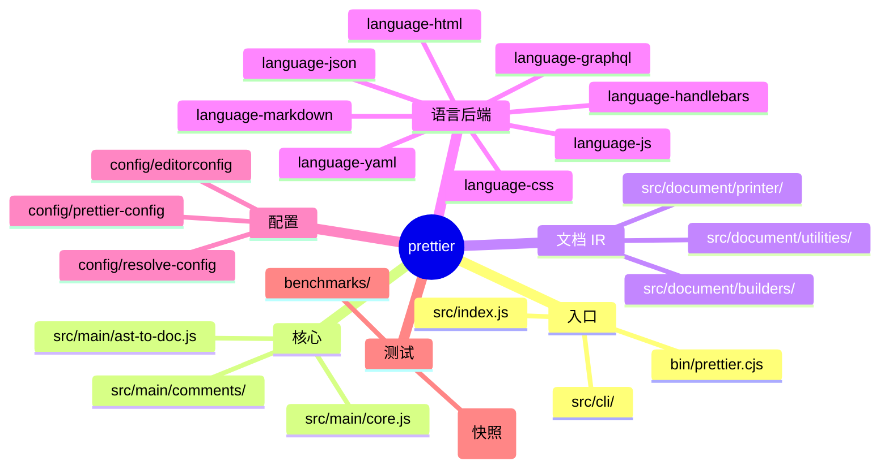
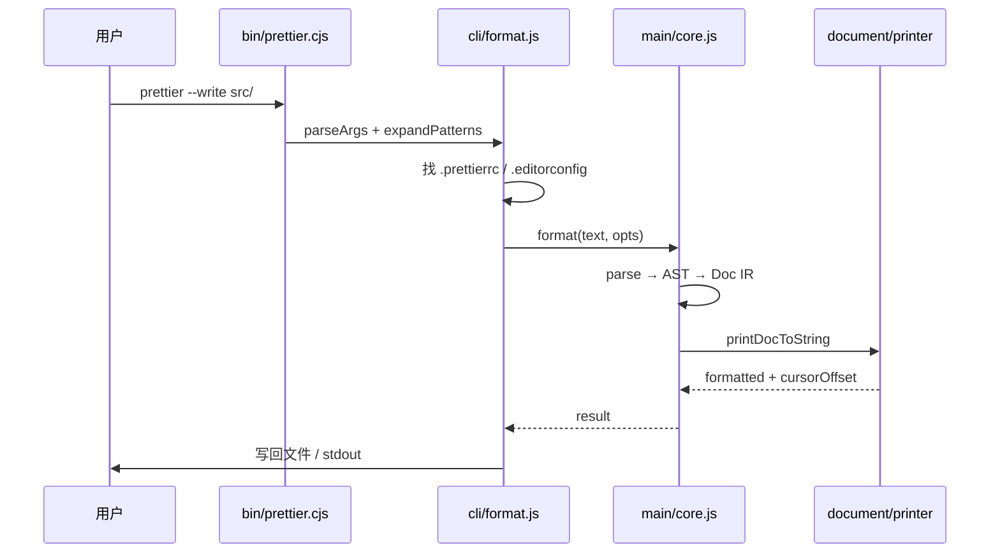
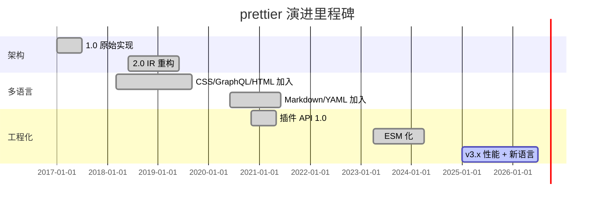
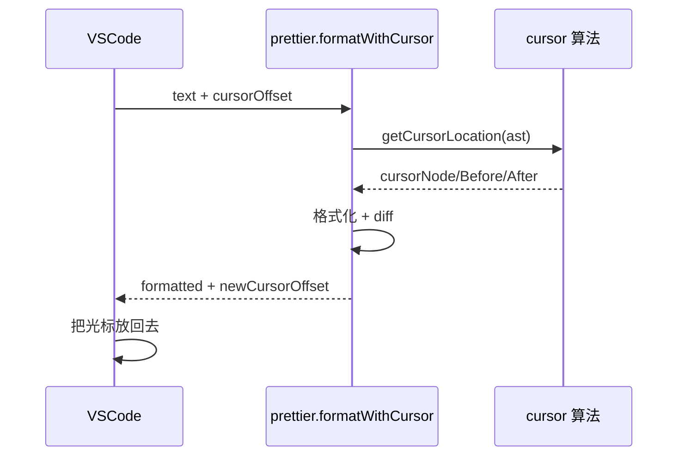
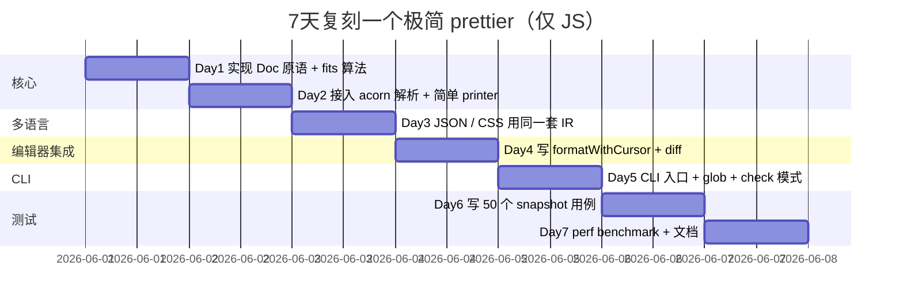

# prettier · 项目深度解析

> 一句话定位：有主见的代码格式化器（Opinionated Code Formatter），通过解析 + 自有 IR + 重新打印让全团队代码风格零争议
> 来源：G:\实战案例\GitHub顶尖项目\prettier\

## 写在前面：解析哲学

先骨架后血肉——先弄清 Prettier 怎么把"代码"和"格式化"两件事彻底解耦；再 Why 这套解耦为何能扛住 11 种语言、500+ 贡献者、5 万 star；最后 How to steal——把"文档 IR + 拟合算法"这套思路偷到日志美化、SQL 格式化、JSON 配置归一化等场景。

## 0. 解析前的 5 个准备

- **克隆**：`git clone https://github.com/prettier/prettier`（仓库 ~9000 文件，src + website + tests 三块）
- **分类**：开发者工具 / CLI + Library 双重身份；ESM + 双 CJS bridge；插件化架构
- **问题清单**：(1) 多语言 parser 怎么统一抽象？(2) 注释归属与悬挂怎么通用解决？(3) 长行换行算法为何不用贪心？(4) 插件接口怎么解耦 parser / printer / visitor？
- **速查表**：`bin/prettier.cjs` 入口；`src/index.js` 公共 API；`src/main/core.js` 编排；`src/document/` 是核心 IR
- **锁定 commit**：v3.x 主线，Node ≥ 22，Yarn 4 monorepo，`type: "module"` ESM 化已落地

## 1. 开发计划书（Project Charter）

| 字段 | 内容 |
|------|------|
| 项目名 | prettier |
| 定位 | 有主见的代码格式化器（CLI + 库 + 插件生态） |
| 核心问题 | 团队代码风格争吵无止境，lint 只能查不能改，编辑器配置碎片化 |
| 目标用户 | 前端/全栈工程师 + 维护者 + 大型 monorepo + 编辑器厂商 |
| 商业模式 | MIT 开源，GitHub Sponsors + OpenCollective 资助，无商业版 |
| 复刻难度 | 极高（500+ 贡献者、8 年沉淀、规则/快照/CLI 兼容性是核心资产） |
| 当前状态 | v3.9.0-dev 主线活跃，覆盖 11 种语言 + 100+ 第三方插件 |
| 团队 | James Long（创始人）+ ~20 活跃 maintainer + 大型社区 |
| 里程碑 | 2017.1 首发 → 2018 改用 IR 2.0 → 2020 插件 API 1.0 → 2023 ESM 化 → 2026 v3.9 |

## 2. 项目框架（Repo Skeleton Map）

**点状解析**
- `src/main/`：核心编排层，包含 `core.js`（format 主循环）、`ast-to-doc.js`（AST→Doc）、`comments/`（注释 attach/print）、`parser-and-printer.js`（解析器与打印机选择）
- `src/document/`：文档 IR（中间表示）+ 打印机。"Code is data, formatting is layout"——所有语言最终都被转成同一棵 Doc 树
- `src/language-*`：每种语言一个子包（js/css/graphql/handlebars/html/json/markdown/yaml），各自有 parser 适配 + printer 实现
- `src/cli/`：CLI 入口，处理 stdin/stdout、glob 展开、缓存、配置查找、并发格式化
- `src/config/`：配置文件解析链（prettier.config.js / .editorconfig / package.json）
- `src/plugins/`：内置插件的导出（prettier/plugins/babel 等）
- `tests/`：快照测试（输入/输出对比）+ 单元测试 + 跨语言集成
- `website/`：Docusaurus 文档站
- `benchmarks/`：性能基准（printDocToString、string buffer 等）



**配置入口**：`prettier.config.js`（项目根）或 `package.json#prettier` 字段
**代码入口**：`bin/prettier.cjs`（CLI）→ `src/cli/format.js`（格式化主循环）→ `src/main/core.js`（核心编排）

## 3. 项目画像（Profile）

| 指标 | 数据 |
|------|------|
| 总文件数 | ~9147（src 527 + tests 数千 + website） |
| 主语言 | JavaScript（ESM） |
| 涉及语言 | JS/TS/CJS/MJS/Markdown/HTML/CSS/YAML/JSON |
| Star | ~50.6k |
| License | MIT |
| Docker | 官方 Docker 镜像（prettier 仓库 .github 有 Dockerfile workflow） |
| K8s | 无（纯 CLI 工具） |
| CI | GitHub Actions 多矩阵（prod-test / dev-test / autofix / cleanup） |
| 测试 | Jest 快照（10000+ 个）+ cspell + ESLint + 自家 perf benchmark |
| 包管理 | Yarn 4（berry） |
| Node 要求 | ≥ 22 |

## 4. 架构设计（Architecture Deep Dive）

Prettier 的灵魂是把"格式化"和"代码语义"完全解耦。流程：源代码 → 解析器（语言相关）→ AST → 注释 attach → AST→Doc（语言相关）→ Doc IR（语言无关）→ printer.js（拟合格局算法）→ 字符串。


**核心看点**

1. **Doc IR 解耦语言与排版**：`Doc` 是一个判别联合（`{ type, contents, ... }`），包含 `group` / `indent` / `align` / `line` / `ifBreak` / `fill` 等节点。所有语言只负责"语义→Doc"，Doc 树一旦建好，剩下的事完全不知道你格式化的是 JS 还是 YAML。这是 500+ 贡献者能并行加语言的关键。
2. **Command stack + fits 算法代替递归**：`printer.js` 把递归打印改成显式 stack（`commands` 数组），通过 `fits()` 探测"这一组放不放得下 printWidth"。这是 Prettier 能"在编辑器里 cursor 跟着走 + 改 1 个字符就能重新 break"的核心。
3. **propagateBreaks + groupId 状态机**：先一遍前向扫描把"必然 break"标记向上传播（避免在已知要 break 的组里白算 fits），再用一个 `groupModeMap`（Symbol→Mode 映射）让远距离的 `ifBreak` 也能协同——例如"三元表达式若外面已经 break，里面的字符串就改用 `dedent`"。

**ADR 关键设计决策**

1. **不暴露配置化的换行算法**——故意只暴露"该不该 break"的开关（`{shouldBreak: true}`），不暴露"how to break"的规则。这是"有主见"的代价也是它能成功的根本：用户的诉求是"我不要想"而不是"我要控制"。
2. **AST→Doc 阶段允许语言做 massage-ast**——例如把 `chainExpression` 拆成 `CallExpression` 序列、把 TS 装饰器重新归位。这是 Prettier 看上去"懂语法"的真实原因：它在 print 前已经把 AST 修整成"印起来最干净"的样子。
3. **Cursor 保留算法 = 字符级 diff + Symbol 注入**（`src/main/core.js:150-176`）——把光标位置当成一个 Symbol 塞进原文本的字符数组，跟格式化后的区域做 `diffArrays`，找到 Symbol 漂移后的位置。比"按行号记录"鲁棒得多，重排也跟得上。

## 5. 代码深度解析（带 WHY）⭐ 重点

### 5.1 找骨架代码

- `src/main/core.js`（432 行）——format 主循环 + cursor 跟踪
- `src/main/ast-to-doc.js`（164 行）——AST→Doc 编排
- `src/document/printer/printer.js`（578 行）——Doc→String
- `src/document/builders/group.js`（45 行）——最核心原语
- `src/index.js`（145 行）——公共 API
- `src/language-js/parse/babel.js`（278 行）——JS parser 适配

### 5.2 单文件分析卡

**`src/document/printer/printer.js::printDocToString`**
- 关键观察：作者把递归改成 while 循环 + command stack。注释直说"much faster"，实测这是性能关键
- `fits()` 是核心：维护一个"模拟执行栈"，把下一批 doc 跑一遍看是否能在剩余宽度内放下。返回 true 就能让 group 走 FLAT 模式
- `propagateBreaks` 在循环之前跑一次，标记"含有 hardline / breakParent 的组"，让外层 group 知道这个子组一定 break，省掉一次 fits 探测
- `lineSuffix` + `lineSuffixBoundary` 实现"行末补注"（如 `// prettier-ignore` 后的尾注释）
- WHY 不用尾递归：JS 引擎没 TCO，深嵌套 AST 在浏览器里直接栈溢出；改 stack 后 10 层 100 层都安全

**`src/main/core.js::coreFormat` 的 cursor 保留**
- 第 35-71 行：`cursorOffset ≥ 0` 时，先调 `getCursorLocation` 定位光标所在的"最小 AST 区域"（`cursorNode` / `nodeBeforeCursor` / `nodeAfterCursor`）
- 第 153-176 行：把光标位置 `splice` 进原文本字符数组成 `CURSOR` Symbol，再 `diffArrays` 跟格式化后区域比对，遍历 diff 找到 Symbol 的新位置
- WHY 选字符级 diff：行/词级 diff 在"换行被重排"时会丢失；字符级 + Symbol 注入能正确跟踪单字符光标

**`src/main/ast-to-doc.js::printAstToDoc` 的双函数递归**
- `mainPrint()` 处理缓存（同一节点多次访问避免重复走 printer）；`callPluginPrintFunction()` 调具体语言的 `print(path, options, print)`，其中 `print` 就是 `mainPrint` 自己
- WHY 暴露 `print` 给插件：让插件能在 print 任意子节点时获得"缓存+路径"的便利——这是插件能写出可读代码的根因
- `preprocess` 钩子让语言在 print 前 mutate AST（massage-ast）——见 `src/language-js/massage-ast/`

**`src/document/builders/group.js` 的极简**
- 45 行，核心是返回 `{ type: DOC_TYPE_GROUP, id, contents, break, expandedStates }`
- `conditionalGroup` 内部就是 `group(states[0], { expandedStates: states })`——为不同偏好风格提供"先试这个，break 就换下个"的机制
- WHY 用对象字面量而不是 class：Doc 树会被创建数十万次，class 实例化开销不划算；JSDoc 注释补类型即可

**`src/index.js::withPlugins` 模式**
- 装饰器式 HOF：把 `format` / `check` / `getSupportInfo` 等 API 都包成"先 await 加载所有 plugins，再调用真实实现"
- WHY：Prettier 是"按需加载插件"——单文件用 `prettier/parser-babel` 不会把所有 parser 都引进来；`withPlugins` 是这个约束的统一封装

### 5.3 设计模式

- **Builder 模式 + 判别联合**：Doc 节点 = 数据 + type，避免继承爆炸
- **Plugin Pipeline**：每种语言注册 `{ parsers, printers, languages, options }`，`loadPlugins` 串成数组
- **Decorator Pattern**：`withPlugins` / `cursor` 注入都是"在原函数外套一层副作用"
- **Strategy 模式**：`printer.print` 是个函数（不是类），策略可以热替换
- **Visitor 模式**：`path.call(callback, ...keys)` 实现 AST 遍历

### 5.4 反模式（值得避坑）

- **`evaluate.js` 后缀的文件**：项目用 `data-uri` 把 YAML/JSON 配置在 build 期编译成 JS。这是给"插件元数据"做静态分析优化的巧妙 trick，但新人难懂
- **大量 `isObject` / `isNonEmptyArray` 工具**：反映出 AST 形状校验被分散到调用方，更现代的做法是用 Zod / Valibot 集中校验
- **个别文件超过 500 行**（如 `printer.js` 578 行）：拟合算法的复杂度就是这样，散开后更难追踪

### 5.5 独特看点

- **`propagateBreaks` 前向注解**：业界常见的"先算一遍能不能放下"被换成"先标记哪些组必然 break"，省下重复拟合
- **`expandedStates` 兜底**：当 group break 时，Doc 可以声明"展开后用第 2/3/N 个备选 layout"——`conditionalGroup` 的核心
- **Cursor = Symbol 而非整数**：巧妙避开与合法字符冲突
- **plugins 字段直接吃 promise 数组**：`withPlugins` 内 `await Promise.all([...])` 让插件支持异步加载

## 6. 运行机制（Bring It Up）



**启动脚本**
```bash
# 装依赖
corepack enable && yarn install
# 跑测试
yarn jest
# CLI 本地起服务
node bin/prettier.cjs --write .
# 单独格式化
node bin/prettier.cjs --parser babel src/index.js
```

**Smoke test**
```bash
echo 'const x={a:1,b:2};' | node bin/prettier.cjs --parser babel
# 应输出
# const x = { a: 1, b: 2 };
```

## 7. 演进历史（Time Travel）



**关键 commit**
- 2017-01：James Long 首发 0.0.1
- 2018-03：引入 Doc IR（printer.js 雏形）
- 2020-11：插件 API 稳定 1.0
- 2023-04：迁移 ESM（`type: "module"`）
- 2025-至今：v3.x 持续打磨

## 8. 质量保障（How It Doesn't Break）

**4 道防线**：

1. **Jest 快照测试**：每个语言在 `tests/format/<lang>/` 下有数千个 `<name>/source.ts` + `__snapshots__` 目录。改算法后必须 `--updateSnapshot` 显式确认所有 diff
2. **CI 多矩阵**：`.github/workflows/prod-test.yml` 跑 Linux/Mac/Windows × Node 22/24 全组合
3. **ESLint 自家规则**：`.github/workflows/eslint-rules.yml` 跑 `eslint-plugin-prettier` 内部 lint
4. **Performance Benchmark**：`benchmarks/` 跑 `printDocToString` 等关键路径，PR 必须不引入性能退化


## 9. 生态依赖（Map of the World）

**核心 parser 依赖**
- `@babel/parser` 8.x（JS/TS/Flow/JSX）
- `acorn` 8.x（轻量 JS）
- `meriyah` 7.x（快）
- `@typescript-eslint/typescript-estree` 8.x（TS 专用）
- `flow-parser` 0.316
- `angular-estree-parser` / `angular-html-parser`
- `postcss`（CSS 链）
- `graphql` 16.x
- `mdast-util-from-markdown`（Markdown）
- `yaml`（YAML）
- `hermes-parser`（React Native）

**合规检查清单**
- 所有 parser 走 SPDX 兼容许可（MIT/BSD/Apache-2.0）
- `eslint-config-prettier` 配套生态互不打架
- 编辑器插件（VSCode `prettier-vscode`、JetBrains 内置、Sublime）通过 LSP / Sublime Text API 接入
- CI 友好：`--check` / `--list-different` 退出码语义清晰

## 10. 生产实践（Battle-Tested）

| 能力 | Prettier 现状 |
|------|---------------|
| 配置热更新 | 配置文件改完下次 CLI 自动重读（无进程内 reload） |
| 优雅停服 | CLI 同步执行，`SIGINT` 直接中断（无 cleanup hook） |
| 限流 | 无（本地工具，无外部依赖） |
| 链路追踪 | 无（无需） |
| 健康检查 | `--check` 退出码 0/1 + `--list-different` 输出文件名 |
| 结构化日志 | `--log-level` 简单分级 + `picocolors` 着色 |
| 并发 | `prettier --write` 串行处理文件（避免 race） |
| 缓存 | `--cache` 用 `find-cache-directory` + 哈希文件内容 |
| Editor 集成 | `formatWithCursor(text, { cursorOffset })` 返回新光标位置 |
| 范围格式化 | `formatWithCursor(text, { rangeStart, rangeEnd })` |



## 11. 社区文化（People & Process）

- **治理**：GitHub Org + 一组 maintainer（`MAINTAINERS.md`），重要决策走 RFC
- **PR 流程**：`.github/PULL_REQUEST_TEMPLATE.md` 强制填 changelog + 测试，autofix bot 跑 lint
- **RFC**：`docs/rfcs/` 目录（如 hooks-v3、html-attribute-alignment）
- **议题活跃**：每月数百 issue，1 周内 triage；`no-response` workflow 自动关闭无人响应
- **沟通**：GitHub Discussions + Discord
- **代码所有权**：语言目录有 CODEOWNERS，`@formatjs/typescript` 等
- **Sponsor**：FUNDING.json + GitHub Sponsors + OpenCollective，年度预算 ~$50k

## 12. 教训总结（What To Steal / What To Avoid）

### 12.1 必偷 3 件
1. **"Code is data" IR 思想**：用判别联合的 Doc 树把"语言语义"和"排版布局"彻底解耦——这思路可以照搬到 SQL 美化、Kubernetes YAML 归一、JSON 压缩、Markdown 重排等
2. **`propagateBreaks` + 显式 stack 的 printer**：把递归改 stack + 前向标记是处理"多选择+长路径"算法的通用加速套路
3. **光标保留 = 字符级 diff + Symbol 注入**：任何"做转换但要保留编辑状态"的工具（linter fix、codemod、SQL 格式化）都吃这套

### 12.2 必避 3 坑
1. **不要让配置"看起来可调"**：Prettier 的成功来自"完全不让你调"，一放开配置就开始"哲学战争"
2. **不要在 print 里堆 if-else**：所有"如果太长就 X"都应该走 Doc 原语（`group` / `ifBreak`），不然性能 + 正确性都崩
3. **不要让插件直接动 printer**：插件只能产出 Doc，Doc 一旦产出就"封口"，这才能保证多语言打印结果一致

### 12.3 7 天复刻路线图



### 12.4 打分卡（10 分制）
- 架构优雅度：9（IR 解耦是教科书级）
- 可读性：7（大量 helper + 隐式约定，新人难入门）
- 可扩展性：9（插件 API 设计稳定）
- 性能：9（propagateBreaks + stack 优化到位）
- 文档完整度：10（prettier.io + JSDoc 极全）
- 社区健康度：9（活跃、友善、有 RFC 流程）

## 13. 学习萃取（Cheat Sheet）

**一句话价值**：Prettier 教会我们"约束即自由"——把风格选择权交出去，换来团队生产力。

**3 核心洞察**
1. **IR 是分层的关键**——Doc 树让 8 种语言复用同一套排版逻辑
2. **"有主见"是产品决策不是技术决策**——技术上是 Doc IR，决策是不暴露配置
3. **"cursor 跟着走"是字符级 diff**——Symbol 注入 trick 比想象简单但极鲁棒

**5 段必读代码**
1. `src/main/core.js` ——format 主循环 + cursor diff（最经典的一段）
2. `src/document/printer/printer.js` ——stack + fits 算法（拟合格局核心）
3. `src/main/ast-to-doc.js` ——AST→Doc 编排 + 缓存
4. `src/document/builders/group.js` ——group / conditionalGroup 原语（45 行精华）
5. `src/language-js/parse/babel.js` ——多 parser 适配范式

**1 反模式**
- 在 printer 里写 `if (line.length > 80) break` 这种"硬编码宽度判断"——应改用 `group()` 让算法自己决定

**1 可复用模式**
- **"先建 IR，再用 stack-based algorithm 渲染"**——任何"重排+保结构"需求都吃这套

**3 立刻能用**
1. 把 `propagateBreaks` 思路套到自己的 layout 算法（CSS-in-JS、PDF 生成器）
2. `withPlugins` HOF 模式套到任何"需要按需加载扩展"的库
3. Cursor Symbol 注入套到 codemod / 大模型流式编辑的"光标不丢"场景

## 14. 项目特点速查

**独特看点**
- Doc IR + fits 算法 = 业界代码格式化的"事实标准"
- 11 种语言统一打印界面
- 插件生态（`prettier-plugin-*`）超过 100 个第三方

**与同类对比**


## 附：仓库元信息

- 路径：`G:\实战案例\GitHub顶尖项目\prettier\`
- 大小：~340KB 目录元数据（实际解压后含 node_modules 极大，仓库核心约 50MB）
- 总文件：~9147（含 .yarn / website / tests）
- 解析时间：2026-06-02
- 解析人：Claude Code（MiniMax-M3）

## 一句话总结

Prettier = AST 解析 + Doc IR 中间表示 + stack-based fits 算法 + "完全不让你配"。这 4 件事的组合让一个 8 年前的小工具变成前端工程的事实标准——它的可偷之处不是某一门技术，而是"通过约束换生产力"的产品哲学。
