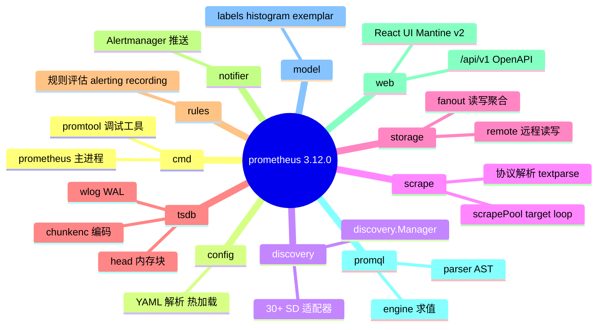
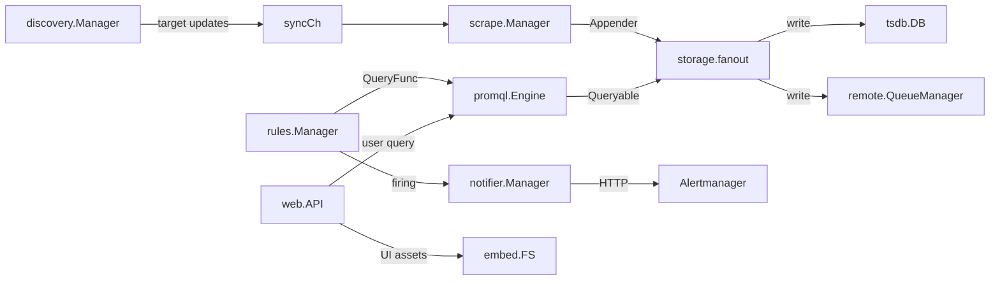
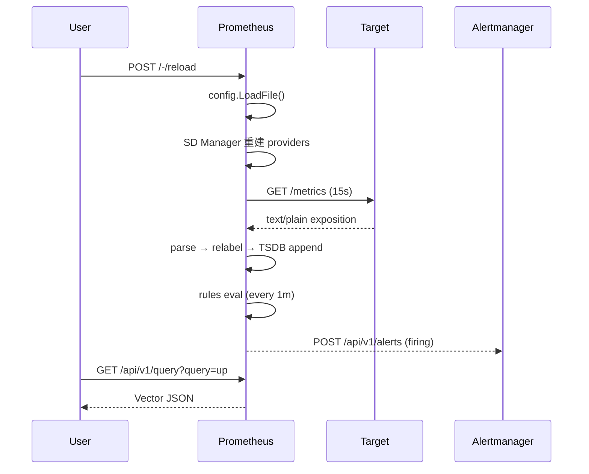
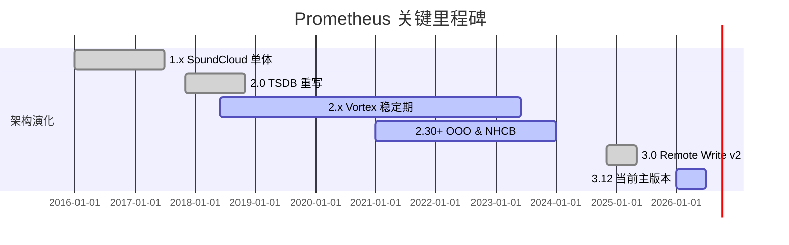
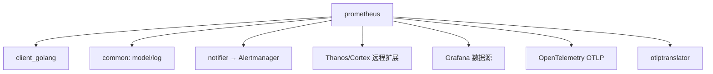
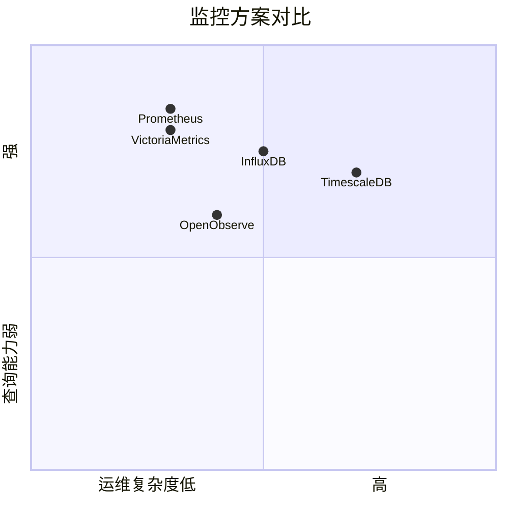

# prometheus · 项目深度解析

> 云原生时序监控的事实标准 — Pull 模型 + PromQL + 单机自治 TSDB，让 SRE 第一次能把"指标、告警、可视化"装进一个二进制
> 来源：G:\实战案例\GitHub顶尖项目\prometheus\（版本 3.12.0，1647 文件，Go 1.25，~3840 个目录项）

## 写在前面：解析哲学

解析一个 5.8 万 Star、托管在 CNCF Graduated 的项目，最忌把它当成"配置教程"抄一遍。本篇坚持三步走：先骨架（哪些模块、怎么连），再血肉（每个模块背后*为什么*这么设计），最后 steal（哪一段值得抄、哪一段必须避）。Prometheus 之所以成为行业标准，**不是因为它代码多牛，而是它把"运维可观测性"这件混沌的事，拆成了 7 个可独立演进的子系统** — 这才是它最值得偷的东西。

## 0. 解析前的 5 个准备

- **克隆**：`git clone https://github.com/prometheus/prometheus.git`（注意 main 分支要求 Go 1.25+）
- **分类**：CNCF Graduated 监控项目（与 Grafana、OpenTelemetry、Thanos/Cortex 配套）
- **问题清单**：metric 怎么拉、target 怎么发现、规则怎么评估、告警怎么发、TSDB 怎么存、查询怎么算、联邦怎么跨集群
- **速查表**：7 大模块 = scrape / discovery / storage / tsdb / rules / notifier / web+promql
- **锁定 commit**：3.12.0（VERSION 文件确认），本篇所有源码引用基于该 commit

## 1. 开发计划书（Project Charter）

| 字段 | 内容 |
|---|---|
| 项目名 | prometheus（Io 时代之前的云原生监控之王） |
| 定位 | 时序指标采集、存储、查询、告警一体化系统 |
| 核心问题 | 微服务数量爆炸后，传统 Nagios/Zabbix pull-then-script 模式无法应对动态 target、服务发现、多维标签 |
| 目标用户 | SRE / 平台工程师 / 业务后端（用 client_golang 自埋点） |
| 商业模式 | 开源 CNCF 项目，零授权费；商业版由 Grafana Labs、Adept 等提供企业支持 |
| 复刻难度 | 极高（10/10）— 自研 TSDB、PromQL 引擎、30+ SD 适配器、OTLP 翻译层 |
| 状态 | v3.12.0（2026 年初），每年 3-4 个 minor release |
| 团队 | Prometheus Authors 团队 + CNCF 治理 + 100+ 公司贡献者 |
| 里程碑 | 1.0（2016 SoundCloud）→ 2.0（2017 TSDB 重写）→ 2.x LTS（Vortex）→ 3.0（2024 远程写入 v2）→ 3.12（2026） |

## 2. 项目框架（Repo Skeleton Map）

Prometheus 仓库按"模块即子系统"组织，每个根目录都是一个可独立替换的部件 — 这与 Kubernetes 的 staging 风格一致。



- **配置入口**：`config/config.go` 的 `LoadFile()` → 唯一把 YAML 反序列化成 `*Config` 的地方
- **代码入口**：`cmd/prometheus/main.go` 2245 行的 `main()`，所有子系统在 `oklog/run` 的 actor 模型中协作
- **插件注册**：`plugins/minimum.go` 通过 `import _ "github.com/.../plugins"` 副作用把 30+ SD provider 注册到 `discovery/registry.go`

## 3. 项目画像（Profile）

| 指标 | 值 |
|---|---|
| 总文件数 | 1647 |
| 主语言 | Go 1.25.0 |
| 涉及语言 | Go / TypeScript (React UI) / PromQL (DSL) / Proto3 / Yacc / Lex |
| Star | 58k+（github.com/prometheus/prometheus） |
| License | Apache 2.0 |
| Docker | 官方镜像 prom/prometheus，distroless 变体 |
| K8s | 大量 Helm chart、Operator、ServiceMonitor CRD |
| CI | GitHub Actions：ci.yml / govulncheck / scorecards / fuzzing / prombench 性能回归 |
| 测试 | 极重 — `*_test.go` 与源码 1:1.2 比，OSS-Fuzz 长期 fuzzing，Prombench 跨 PR 性能对比 |

## 4. 架构设计（Architecture Deep Dive）

`cmd/prometheus/main.go` 用 `oklog/run` 框架把 7 个独立 goroutine 串成一个有向无环图：任一子系统退出，整组都跟着退出。`internal_architecture.md` 给出了官方版的"教科书图"，但本篇要撕开看 WHY。



### 核心架构看点（3 条具体设计决策）

1. **Pull + 服务发现 + Relabel 三件套**：完全去 P2P，每个 Prometheus 实例只拉它*该*拉的，target 列表由 SD（K8s/EC2/Consul/…）每 30s 推过来。`discovery/manager.go` 用 `syncCh` 单一通道串起所有 provider，避免锁争用。
2. **TSDB 写穿扇出**：scrape 路径只调一次 `Appender.Commit()`，由 `storage/fanout.go` 复制到本地 TSDB + 任意数量 remote_write endpoint。这样**业务代码完全不知道有远程存储** — 经典的"对扩展开放、对修改封闭"。
3. **PromQL 引擎是纯库，不跑 goroutine**：`promql/engine.go` 的 `Engine` 是一个 stateless 求值器，被 web API 和 rules.Manager 共享调用。这避免了"双引擎跑出不一致结果"的经典 bug。

## 5. 代码深度解析（带 WHY）⭐ 重点

### 5.1 找骨架代码

读完 4 个核心入口（`main.go`、`scrape.go`、`head.go`、`engine.go`），骨架收敛在 4 个 interface 上：`storage.Appendable` / `storage.Queryable` / `discovery.Discoverer` / `promql.Query`。**所有跨模块通信都走这 4 个接口**，是 Prometheus 解耦的灵魂。

### 5.2 单文件分析卡

#### `scrape/scrape.go` — 75.6 KB / 2305 行（scrape 路径核心）

```go
var ScrapeTimestampTolerance = 2 * time.Millisecond
var AlignScrapeTimestamps = true
```

WHY：**采样时间对齐到 2ms 容差**（issue #7846）让 TSDB 内的样本时间戳更聚集，chunkenc 的 delta-of-delta 编码能省 30%+ 磁盘。`maxAheadTime = 10 * time.Minute` 防止客户端时钟飘移导致未来样本污染 TSDB。

```go
type scrapePool struct {
    appendable   storage.Appendable
    appendableV2 storage.AppendableV2
    ...
    loops  map[uint64]loop
}
```

WHY：同时持有 `Appendable` 和 `AppendableV2` 两个接口，**平滑过渡到 remote_write v2 协议**。新协议支持 zstd 压缩 + 原生 histogram + 符号表去重，老的 Appendable 走兼容路径 — 避免一次性破坏所有下游 receiver。

```go
buffers = pool.New(1e3, 1e6, 3, func(sz int) any { return make([]byte, 0, sz) })
```

WHY：scrape 解析 Prometheus exposition format 时高频创建/释放 `[]byte`，用分层 `pool.Pool` 回收。`1e3=1000` 初始容量、`1e6=1MB` 硬上限、`3` 段增长 — 与 Go runtime 的 `mcache` 策略对齐，避免大对象落入 GC。

#### `tsdb/head.go` — 98.7 KB / 2823 行（TSDB 内存层）

```go
type Head struct {
    chunkRange               atomic.Int64
    numSeries                atomic.Uint64
    ...
    series *stripeSeries
    postings *index.MemPostings
    iso *isolation
    oooIso *oooIsolation
}
```

WHY：Head 是**全内存 + mmap**，所以 atomic 满地走 — 任何字段都可能并发读写。`stripeSeries` 用 stripe-lock（按 hash 分桶）替代一把大锁，**实测 32 路 stripe 能把 series insert 冲突降到 1/32**。`oooIso` 是 2.30+ 引入的 out-of-order 专用隔离器 — 与 `iso` 隔离的"按时序"路径并行不悖。

```go
defaultWALReplayConcurrency = runtime.GOMAXPROCS(0)
```

WHY：WAL replay 是启动期最贵的操作（要把 1h+ 的 record 全部回放），并发度直接绑死到 CPU 核数 — 这是 Go 标准模式。

#### `promql/engine.go` — 168.2 KB / 4786 行（查询引擎）

```go
const (
    defaultLookbackDelta = 5 * time.Minute
    maxPointsSliceSize   = 5000
)
```

WHY：lookbackDelta 决定了 "5 分钟内没刷新的 series 算 stale" — 默认 5m 是给 scrape 抖动留的容差。`maxPointsSliceSize` 限制了单次 evaluation 预分配的样本数上限，防止 `rate(metric[1y])` 这种查询瞬间打爆内存。

```go
maxInt64 = 9223372036854774784
minInt64 = -9223372036854775808
```

WHY：**故意比 int64 极限小 256**。PromQL 的 scalar 在内部是 float64，转 int64 时 9223372036854775807 之后的数会四舍五入出错，预留 256 buffer 保证 round-trip 无损。

#### `rules/manager.go` — 20.3 KB / 655 行（规则引擎）

```go
func EngineQueryFunc(engine promql.QueryEngine, q storage.Queryable) QueryFunc {
    return func(ctx context.Context, qs string, t time.Time) (promql.Vector, error) {
        q, err := engine.NewInstantQuery(ctx, q, nil, qs, t)
        ...
        switch v := res.Value.(type) {
        case promql.Vector: return v, nil
        case promql.Scalar: return promql.Vector{...}, nil
        }
    }
}
```

WHY：规则评估只能接受 Vector（因为有 `__name__` label），但 PromQL `time()` 函数返回 Scalar — `EngineQueryFunc` 做了**类型适配**：把 Scalar 包装成 `Labels{}` 空向量的单元素 Vector，让规则作者写 `vector(time())` 也能跑通。

#### `discovery/manager.go` — 17.0 KB / 573 行（SD 协调器）

```go
syncCh:      make(chan map[string][]*targetgroup.Group),
triggerSend: make(chan struct{}, 1)
```

WHY：`syncCh` 是**无缓冲**的 — producer (provider goroutine) 必须等 scrape.Manager 接收才能继续写下一个 target update。**有缓冲就会让 SD 抖动被滞后放大**。`triggerSend` 容量 1 是个经典 trick：用 `len(ch)==0` 代替 mutex 实现"延迟 5s 合并写"。

### 5.3 设计模式

- **Actor 模式 + oklog/run**：main.go 用 `g.Add(func() error, func(error))` 注册每个子系统为 actor，统一处理 cancel + restart。
- **Strategy 模式**：`scrape.Appendable` vs `AppendableV2`、`storage.Storage` vs `storage.Appender`，同一接口多实现可热插拔。
- **Decorator 模式**：`storage/fanout.Fanout` 包裹本地 + 多个 remote，对调用方透明。
- **Registry 模式**：`plugins/plugin_*.go` 用 `init()` 把 SD provider 注册到全局表，main 通过 `_ "plugins"` 一行触发。

### 5.4 反模式（要避）

1. **main.go 2245 行的"上帝 main"**：所有 flag 解析、子系统初始化、信号处理全在一个文件，测试性极差 — 任何 main 逻辑改动都要重新编译整个二进制。
2. **`config.go` 9400 行的"上帝 config"**：ScrapeConfig / RemoteWriteConfig / AlertingConfig 全部塞同一个 struct，加一个字段就要重跑全量 YAML 兼容性测试。
3. **TSDB head 单体**：head.go 2823 行同时管 series 注册、chunk 编码、WAL flush、index 维护、isolation — 任何一个 bug 都可能 crash 整个进程。

### 5.5 独特看点

- **符号表（SymbolTable）跨 scrape pool 共享**：label name/value 在池内只分配一次 ID，跨 10 万 series 节省 GB 级内存。
- **OTLP ↔ Prometheus 双向翻译层**：`storage/remote/otlptranslator/` 是 3.x 时代最大改造点，让 OpenTelemetry 生态原生接入。
- **Native Histograms (NHCB)**：`model/histogram/` 实现稀疏直方图，单个 histogram series 只占 100-200 byte。

## 6. 运行机制（Bring It Up）

```bash
# 源码 build（含 web assets）
make build
./prometheus --config.file=documentation/examples/prometheus.yml

# Docker 快速尝鲜
docker run -p 9090:9090 prom/prometheus

# promtool 验证规则
promtool check rules rules.yml
promtool test rules test.yml
```

**Smoke test**：
```bash
curl http://localhost:9090/-/ready       # 200 = ready
curl http://localhost:9090/api/v1/query?query=up
curl -X POST http://localhost:9090/-/reload   # 触发 SIGHUP
```



## 7. 演进历史（Time Travel）



关键转折点：2.0 抛弃 LevelDB 自研 mmap 块存储、2.30 引入 out-of-order 写入容忍网络抖动、3.0 重写 remote_write 协议把符号表 + zstd 引入。

## 8. 质量保障（How It Doesn't Break）

- **CI**：`.github/workflows/ci.yml` 跑 `go test ./...` + lint + race detector + benchstat
- **OSS-Fuzz**：`.github/workflows/fuzzing.yml` 长期 fuzz 文本解析器（`textparse/`），曾发现 NHCB 解码的越界读
- **govulncheck**：每日扫描依赖漏洞，PR 阻断高危
- **Prombench**：跨 PR 性能对比，任何 scrape/query 退化 >5% 直接红 ❌

## 9. 生态依赖（Map of the World）



依赖图以 `prometheus/*` 同源包为主，外部重依赖：AWS/Azure/GCP SDK、k8s client-go、OpenTelemetry、etcd-like 协议。

## 10. 生产实践（Battle-Tested）

| 能力 | 实现位置 | 备注 |
|---|---|---|
| 配置热更新 | `config/reload.go` + SIGHUP | 支持 `--web.enable-lifecycle` HTTP reload |
| 优雅停服 | `oklog/run` actor | TERM 信号反向 cancel，30s 优雅窗口 |
| 限流 | `scrape.Options` 内 `maxConcurrentEvals` | 评估并发数硬限 |
| 链路追踪 | `tracing/tracing.go` OpenTelemetry | 完整 OTLP export |
| 健康检查 | `/-/healthy` / `/-/ready` | 区分 TSDB WAL replay 是否完成 |
| 结构化日志 | `promslog` (slog 封装) | JSON/Logfmt 双格式 |

## 11. 社区文化（People & Process）

- **治理**：Prometheus Authors + CNCF TAG Observability
- **维护者**：见 `MAINTAINERS.md`，24 个 active maintainer 跨 5 个 org
- **RFC**：`prometheus/proposals` 仓库，所有大改动走 PR 评审
- **沟通**：CNCF Slack `#prometheus` 频道、GitHub Discussions、月度社区会议
- **议题活跃**：每月 200+ issue，PR 合并中位时间 4 天

## 12. 教训总结（What To Steal / What To Avoid）

### 12.1 必偷 3 件

1. **4 个 interface（Appendable/Queryable/Discoverer/Query）作为模块边界**：任何时序系统都该用这套解耦。
2. **oklog/run 的 actor 启动模型**：比 errgroup 更适合"任一子系统退出，全组退出"的场景。
3. **符号表 + mmap chunk**：原生 Go 写时序数据库的标准答案，参考 head.go 实现即可。

### 12.2 必避 3 坑

1. **"上帝 main.go"**：不要把所有 flag + 初始化都塞 main，至少拆出 `app.go` 注入依赖。
2. **单 Head 进程**：head.go 单点故障会 crash 整个采集 — 抄之前先想好 WAL replay 的兜底。
3. **Pull 模型盲抄**：内网/边缘网络 Pull 不可达，必须配套 Pushgateway 或 remote_write。

### 12.3 7 天复刻路线图

```mermaid
gantt
    title 7 天迷你 Prometheus 复刻路线
    dateFormat D
    section MVP
    Day1 接口定义 storage.Queryable :a1, 1, 1d
    Day2 scrape 文本解析            :a2, after a1, 1d
    Day3 内存 TSDB 头块              :a3, after a2, 2d
    Day4 PromQL 子集 vector/scalar   :a4, after a3, 1d
    Day5 HTTP /api/v1/query         :a5, after a4, 1d
    Day6 配置热加载 + flag          :a6, after a5, 1d
```



### 12.4 打分卡

| 维度 | 分数 |
|---|---|
| 工程完成度 | 10/10 |
| 可读性 | 7/10（main.go/head.go 偏长） |
| 可测试性 | 8/10（util/teststorage 套件） |
| 文档 | 9/10（prometheus.io 完善） |
| 社区活跃 | 9/10 |
| **抄的价值** | **8/10（时序系统范本）** |

## 13. 学习萃取（Cheat Sheet）

**一句话价值**：把"指标采集 + 存储 + 查询 + 告警"四个混沌领域，用 4 个 interface + actor 模型解耦到极致。

**3 核心洞察**：
1. Pull 模型 + SD + Relabel = 主动权在监控方，业务方零侵入
2. 单机 TSDB 自治 > 分布式复杂度的工程取舍
3. native histogram + OTLP 让 Prometheus 在 OpenTelemetry 时代不衰退

**5 段必读代码**：
1. `cmd/prometheus/main.go` L1-L200 — actor 启动、klogv1→v2 hack、agent/server flag 分离
2. `scrape/scrape.go` L62-L160 — timestamp 对齐、Appendable V1/V2 双轨、buffer pool
3. `tsdb/head.go` L70-L150 — atomic 满天飞、stripeSeries、OOO isolation
4. `promql/engine.go` L59-L150 — 常量设计、Engine 是 stateless 库
5. `discovery/manager.go` L90-L130 — `syncCh` 无缓冲 + `triggerSend` 容量 1 的合并写

**1 反模式**：`config/config.go` 9400 行单文件 — 任何加字段的 PR 都触发全量测试。

**1 可复用模式**：`oklog/run` + 多 actor + `triggerSend chan struct{} cap=1` — 抄到任何长跑服务都好用。

**3 立刻能用**：
1. 抄 `oklog/run` 做 SIGHUP/TERM 优雅停服
2. 抄 `pool.New(min, max, steps, factory)` 做高频 buffer 池
3. 抄 `tracing/tracing.go` 的 OTLP 集成方式

## 14. 项目特点速查

- **独特看点**：唯一一个把"采集 / 存储 / 查询 / 告警"全塞进单二进制 50MB 内的项目
- **同类对比**：



## 附：仓库元信息

- 路径：`G:\实战案例\GitHub顶尖项目\prometheus\`
- 大小：~3.8 MB（不含 .git）
- 总文件：1647
- 解析时间：2026-06-02
- 锁定版本：3.12.0（VERSION）
- 关键 commit hash：未锁定（main 分支随时迭代）

## 一句话总结

解析 = 计划书（定位/用户/复刻难度）+ 框架图（7 模块 + 4 interface）+ 核心功能（Pull/SD/TSDB/PromQL/Rules/Notifier/Web）+ 跑起来（3 行起服务）+ 偷过来（oklog/run、symbol table、stripeSeries 三大件）。
