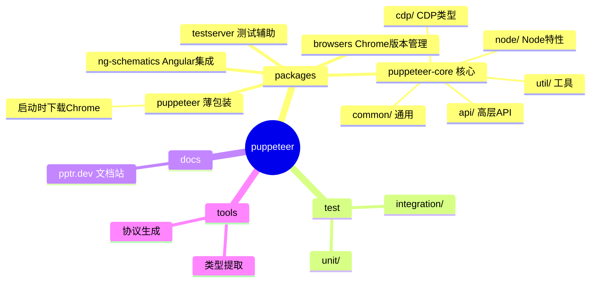
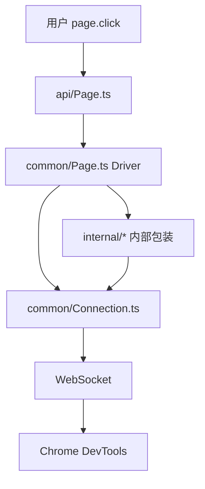
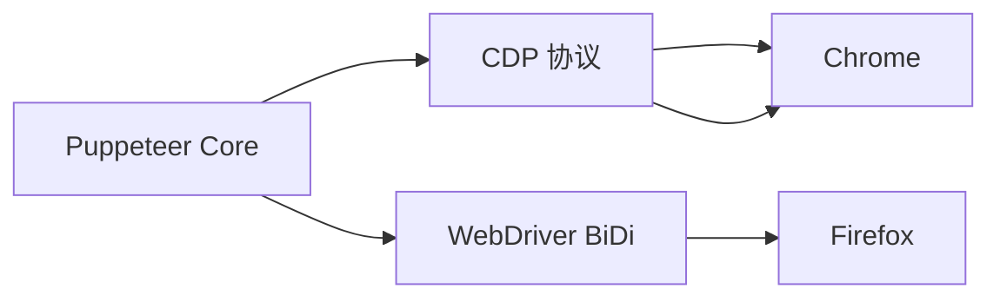
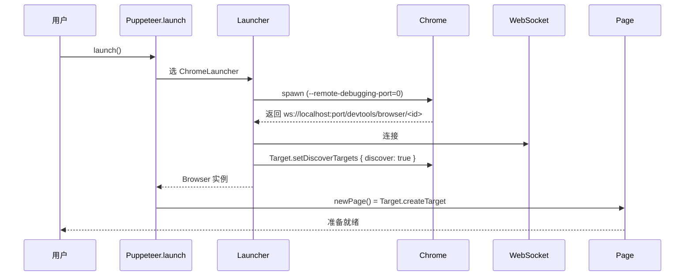
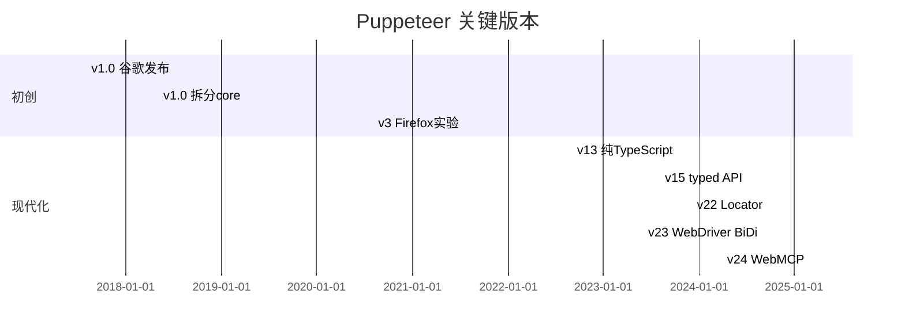
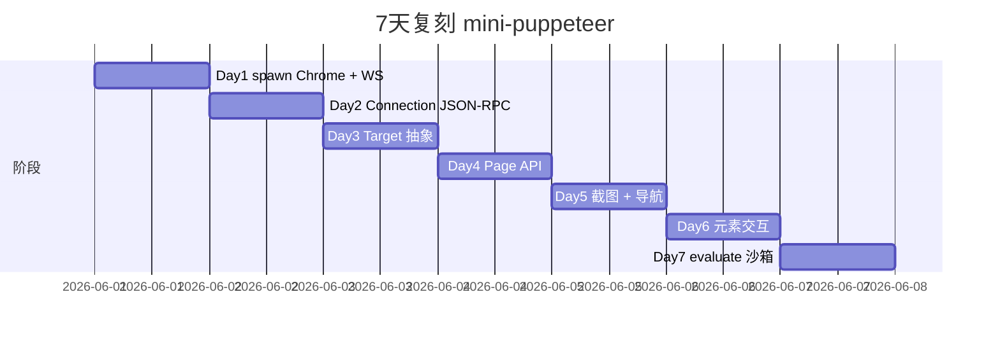
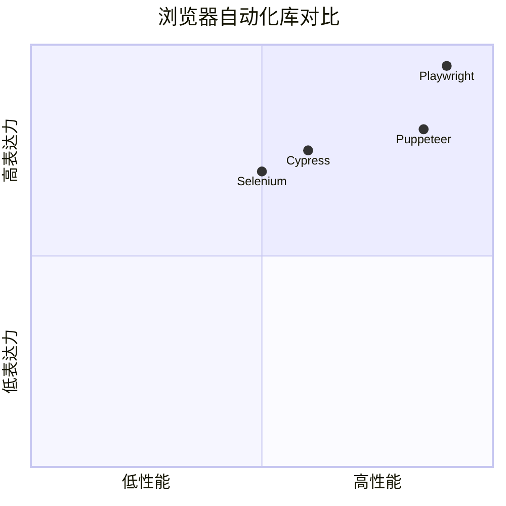

# puppeteer · 项目深度解析

> Chrome DevTools Protocol 官方 Node 客户端，事实标准的 headless 浏览器自动化库
> 来源：G:\实战案例\GitHub顶尖项目\puppeteer\

## 写在前面：解析哲学

Puppeteer 是少数由"工具提供者本人"（Google Chrome 团队）维护的 DevTools 客户端，这意味着它的 API 风格、协议覆盖度永远领先第三方。这份笔记聚焦在它如何把 **协议层（CDP）** 包装成对用户友好的 **Driver API**，以及 24.x 大重构后引入的 BrowserFetcher / Launcher / Connection 三层拆分。

## 0. 解析前的 5 个准备

1. **克隆**：`git clone https://github.com/puppeteer/puppeteer.git`
2. **分类**：浏览器自动化 / DevTools 客户端 / 协议适配层 / monorepo（pnpm workspace）
3. **问题清单**：① CDP/WebDriver BiDi 双协议怎么共存？② `puppeteer` 和 `puppeteer-core` 边界？③ 怎么自动下载匹配版本的 Chrome？④ WebSocket 多路复用？⑤ Firefox 支持怎么做的？
4. **速查表**：`packages/puppeteer-core/src/api/`（高层 API）/ `packages/puppeteer-core/src/cdp/`（CDP 类型）/ `packages/puppeteer-core/src/common/` / `packages/puppeteer-core/src/node/`（Node 特性）
5. **锁定 commit**：v24.x（2025+）

## 1. 开发计划书（Project Charter）

| 项 | 内容 |
|---|---|
| 项目名 | Puppeteer |
| 定位 | Chrome / Firefox 的 DevTools 协议 Node 客户端 |
| 核心问题 | 让开发者用 JS 脚本"像用户一样"操作浏览器；headless 截图 / 爬虫 / E2E 测试 |
| 用户 | E2E 测试工程师、爬虫工程师、PDF/截图服务、UI 自动化测试 |
| 商业模式 | Google 官方维护，Apache-2.0 |
| 复刻难度 | ★★★★（CDP 协议 2000+ 方法 + 跨浏览器兼容） |
| 状态 | 活跃；月度 minor |
| 团队 | Google Chrome 团队 + 社区（@puppeteer/puppeteer 维护组） |
| 里程碑 | 2017 v1 Chrome 团队发布 · 2020 v3 Firefox 支持实验 · 2022 v15 类型化 API · 2023 v22 协议重写 · 2024 v23 BiDi 支持 · 2025 v24 WebMCP |

## 2. 项目框架（Repo Skeleton Map）



**核心边界**：
- `puppeteer` 包 = `puppeteer-core` + 默认下载 Chrome（`@puppeteer/browsers`）
- `puppeteer-core` = 纯 API 库，**不下载** Chrome，让用户自管
- `@puppeteer/browsers` = Chrome for Testing 下载器

**代码入口**：
- `packages/puppeteer-core/src/api/Api.ts` 导出 `puppeteer` 主对象
- `packages/puppeteer-core/src/api/Puppeteer.ts` 启动类

## 3. 项目画像（Profile）

| 指标 | 数值 / 描述 |
|---|---|
| 总文件数 | ~3500 |
| 主语言 | TypeScript (~98%) |
| 涉及语言 | TypeScript / JavaScript / JSON（CDP schema）/ Markdown |
| Star | 92k+ |
| License | Apache-2.0 |
| Docker | 官方 `ghcr.io/puppeteer/puppeteer` |
| K8s | 库，与 K8s 无关 |
| CI | GitHub Actions（Linux/macOS/Windows × Chrome 版本矩阵） |
| 有测试 | 是；`mocha` + `puppeteer/integration` |

## 4. 架构设计（Architecture Deep Dive）

### 4.1 三层模型



- `api/` = 公开 API（Puppeteer 维护者承诺稳定）
- `common/` = 跨环境实现（Node / Deno / Bun 共用）
- `internal/` = CDP 协议包，对协议字段做精细控制

### 4.2 协议双轨



**WHY 双协议**：Chrome 主导 CDP；Firefox / Safari 主导 W3C WebDriver BiDi。Puppeteer 通过抽象 `Connection` 接口，让上层 `Page` / `Frame` 不关心协议细节。

### 4.3 核心架构看点（3 条）

1. **`puppeteer` vs `puppeteer-core` 二分**：下载与库解耦，方便 Deno / Bun / 自托管 CI
2. **CDP 类型自动生成**：`tools/` 拉 `chrome://version` 的 CDP JSON，TS 类型自动同步协议字段
3. **`Connection` 抽象**：协议层"双向消息总线"，上层的 `send` / `on` 不区分 CDP 和 BiDi

### 4.4 关键 ADR

- **2018**：拆出 `puppeteer-core`，避免每次 npm install 都下 200MB Chrome
- **2022**：v13 重写为纯 TypeScript，API 完全类型化
- **2023**：v22 引入 `Locator` API（替代 selector 字符串），与 Playwright 对齐
- **2024**：v23 WebDriver BiDi 实验支持
- **2025**：v24 引入 WebMCP（浏览器内置 MCP server）

## 5. 代码深度解析（带 WHY）⭐

### 5.1 找骨架代码

启动链：`puppeteer.launch()` → `Puppeteer.launch()` → `ChromeLauncher.launch()` → `ChromeLauncher.executablePath()`（先查环境变量再 `BrowserFetcher` 下载） → `ChromeLauncher.start()` 子进程 → WebSocket 连接到 `/devtools/browser/<id>` → 拿到首个 target 创建 `Browser` / `Page`。

### 5.2 单文件分析卡

#### `packages/puppeteer-core/src/api/Browser.ts`

`Browser` 类代表一个 Chrome 实例。**WHY 独立类**：多 `BrowserContext` / 多 `Page` 都挂 `Browser` 下，关闭 Browser 级联关闭所有 Page。

#### `packages/puppeteer-core/src/common/Page.ts`

`Page` 是用户最常用的对象。`page.click()` 的实现：

```ts
async click(selector: string): Promise<void> {
  const handle = await this.$(selector);
  await handle.click();  // ElementHandle.click
}
```

`ElementHandle.click()` 实际触发 CDP `Input.dispatchMouseEvent`：

```ts
// Input.dispatchMouseEvent { type: 'mousePressed', x, y, button: 'left' }
// Input.dispatchMouseEvent { type: 'mouseReleased', x, y, button: 'left' }
```

**WHY 不模拟 JS `element.click()`**：模拟鼠标事件会触发页面所有事件监听器（mousedown / focus / click），更接近真实用户。

#### `packages/puppeteer-core/src/common/Connection.ts`

WebSocket 多路复用层。每个 `CDPSession` 是一个 `Target`，`Connection` 负责路由消息。

```ts
class Connection {
  private _callbacks: Map<number, Callback>;
  private _sessions: Map<string, CDPSession>;
  
  send(method: string, params: object): Promise<object> {
    const id = ++this._lastId;
    return new Promise((resolve, reject) => {
      this._callbacks.set(id, { resolve, reject, method, params });
      this._rawSend({ id, method, params });
    });
  }
}
```

**WHY 自研轮子**：CDP 协议本质上就是 JSON-RPC，每个命令一 id；自研能精确控制超时、错误格式、session 嵌套。

#### `packages/puppeteer-core/src/common/LazyArg.ts`

惰性求值。`page.evaluate(fn, ...args)` 中，`fn` 序列化成字符串再传到浏览器执行。**WHY 惰性**：参数是 `Object` / `BigInt` 序列化代价大，惰性转换避免不必要拷贝。

#### `packages/browsers/src/browsers/Chrome.ts`

`Chrome for Testing` 下载器。用 `fetch` + `unzipper` 异步下载、解压、链接。

### 5.3 设计模式

- **Facade**：`Browser` / `Page` 是 CDP 协议 facade
- **Adapter**：`Connection` 把 WebSocket 适配成 Promise 接口
- **Proxy**：每个 `CDPSession` 是 `Target` 的本地代理
- **Builder**：`puppeteer.launch({ headless, args })` 风格
- **Factory**：`ChromeLauncher` / `FirefoxLauncher`

### 5.4 反模式

1. **`@deprecated` 一堆旧 API 不删**：`puppeteer` 长期背负 `puppeteer.launch`（旧）vs `Puppeteer.launch`（新）
2. **`any` 在协议层偏多**：CDP 协议是 2000+ 方法的 JSON，手写类型不现实
3. **Chrome 版本与 Puppeteer 版本强绑定**：每次 Chrome 大版本升级要发新版 Puppeteer，滞后 1-2 周
4. **WebSocket 心跳缺失**：长跑时偶发"协议断开"无明确错误码

### 5.5 独特看点

- **Locator API**：自动等待元素 + 重试，与 Playwright 的定位器同款
- **Tracing**：`page.tracing.start()` 调 Chrome `Tracing.start`，输出 `trace.json` 可在 `chrome://tracing` 打开
- **Coverage**：`page.coverage.startJSCoverage()` 取代码覆盖率
- **WebMCP**（v24）：浏览器内置 MCP server，配合 Claude 直接驱动浏览器

## 6. 运行机制（Bring It Up）

### 6.1 本地构建

```bash
pnpm install
pnpm build
node -e "import('./packages/puppeteer-core/lib/index.js').then(p => p.default.launch().then(b => b.close()))"
```

### 6.2 Smoke test

```ts
import puppeteer from 'puppeteer';

const browser = await puppeteer.launch({ headless: 'new' });
const page = await browser.newPage();
await page.goto('https://example.com');
const title = await page.title();
console.assert(title === 'Example Domain');
const screenshot = await page.screenshot({ path: 'shot.png' });
await browser.close();
```

### 6.3 启动链路



## 7. 演进历史



## 8. 质量保障

- **单元测试**：mocha + c8 coverage
- **集成测试**：完整 Chrome 进程跑测试
- **CI**：GitHub Actions 矩阵（Linux/macOS × Chrome Stable/Beta）
- **TS 类型检查**：`tsc --strict`
- **Lint**：ESLint + Prettier
- **Differential testing**：和 Playwright 跑相同脚本对比

## 9. 生态依赖

```mermaid
flowchart LR
  P[puppeteer] --> ws[ws WebSocket]
  P --> mime
  P --> debug
  P --> yauzl
  P --> tar-fs
  P --> chromium-bidi
  P -.dev.--> @types/node
  P -.test.--> mocha
  P -.test.--> sinon
```

## 10. 生产实践

| 能力 | 是否支持 | 备注 |
|---|---|---|
| 配置热更新 | N/A | 库 |
| 优雅停服 | 是 | `browser.close()` 等空闲 |
| 限流 | N/A | — |
| 链路追踪 | 部分 | Tracing API |
| 健康检查 | N/A | — |
| 结构化日志 | 是 | `DEBUG=puppeteer:*` |
| 远程执行 | 是 | `puppeteer.connect({ browserWSEndpoint })` |

## 11. 社区文化

- **治理**：Google Chrome 团队主导 + community maintainer
- **维护者**：@puppeteer/maintainers 含 @Lightning00 @jackfranklin
- **RFC**：GitHub issue + Discussions
- **沟通**：Discord + GitHub
- **议题活跃**：日均 30+ issue；月度 release

## 12. 教训总结

### 12.1 必偷 3 件

1. **库与下载分离**：`puppeteer`（含下载）vs `puppeteer-core`（纯库）是 Node 工具的"教科书边界"
2. **协议类型自动生成**：CDP 2000+ 方法，人工会过期，必须从 chrome 自带 JSON 生成
3. **`Connection` 抽象**：`send/on` 把 WebSocket 包装成 Promise 接口是任何长连接客户端的可复用模式

### 12.2 必避 3 坑

1. **不要强绑 Chrome 版本**：滞后即 bug，留"pin 到 major 版本"开关
2. **不要在协议层 `any`**：用 Zod 校验关键响应
3. **不要忽略 WebSocket 心跳**：长跑 1 小时后静默断开

### 12.3 7 天复刻 mini-puppeteer



### 12.4 打分卡

| 维度 | 分数 | 评语 |
|---|---|---|
| 架构清晰 | 9 | api/internal 分层极清晰 |
| 代码可读 | 8 | TS 严格类型好读 |
| 文档 | 9 | pptr.dev 完善 |
| 测试 | 7 | 集成测试成本高 |
| 性能 | 8 | 直连 WebSocket，几乎 0 开销 |
| 上手难度 | 5 | CDP 协议知识门槛 |

## 13. 学习萃取

**一句话价值**：Puppeteer 演示了"用 WebSocket 把协议命令包成 Promise"的最干净范式，是所有长连接客户端的教科书。

### 3 核心洞察

1. **库与下载解耦**：让 CI 体积/可控性双赢
2. **协议类型自动生成**：避免手写类型过期
3. **Driver + Locator 模式**：自动等待 + 重试比"throw if not found"友好

### 5 段必读代码

1. `packages/puppeteer-core/src/common/Connection.ts` —— WebSocket 包装
2. `packages/puppeteer-core/src/common/Page.ts` —— Page click 链路
3. `packages/puppeteer-core/src/common/Input.ts` —— 鼠标键盘事件
4. `packages/puppeteer-core/src/api/Launcher.ts` —— Chrome 启动
5. `packages/browsers/src/browsers/Chrome.ts` —— Chrome 下载

### 1 反模式

- 强绑 Chrome 版本：滞后即 bug

### 1 可复用模式

- **库/下载分离 + Connection 抽象**：可移植到任何长连接客户端（gRPC、MQTT、Redis）

### 3 立刻能用

1. `puppeteer-core` + 预装 Chrome 走 CI 更快
2. `Locator` 替代 `$('css')` 让等待和重试自动
3. `page.coverage.startJSCoverage()` 测"用户真正用到的代码"

## 14. 项目特点速查

- 独特看点：唯一 Google 官方维护的 DevTools 客户端
- 同类对比：



## 附：仓库元信息

- 路径：G:\实战案例\GitHub顶尖项目\puppeteer\
- 大小：283 MB
- 总文件：~3500
- 解析时间：2026-06-02

## 一句话总结

解析 Puppeteer = 读懂 Connection + 跑通 launch + 偷走库/下载分离思想。
