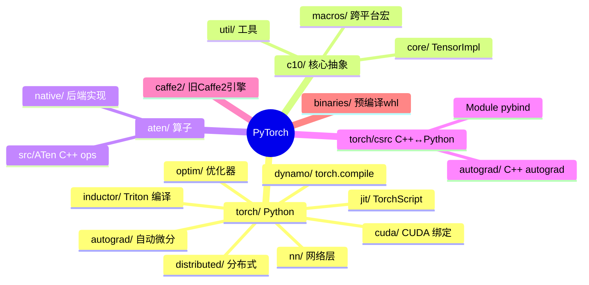
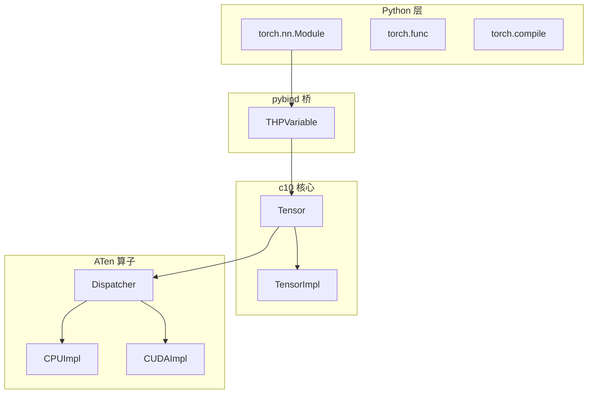
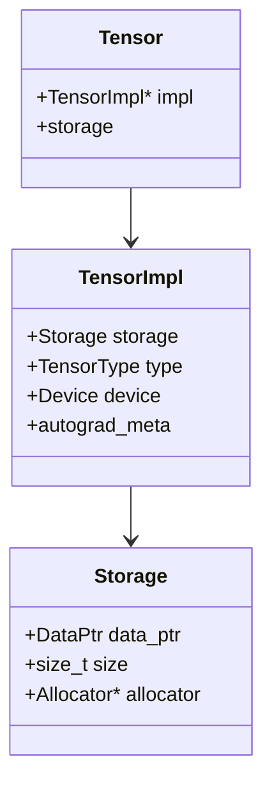
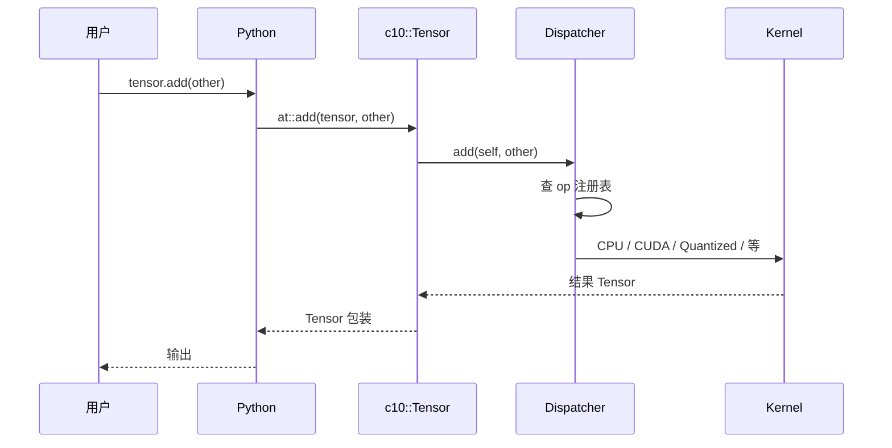
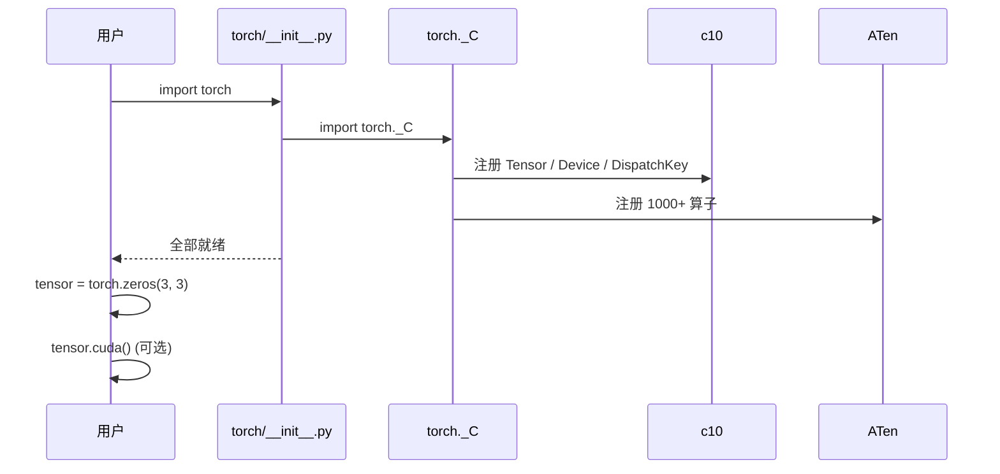
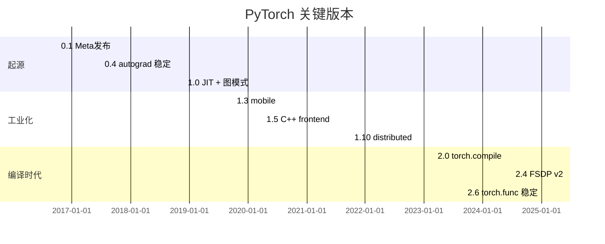
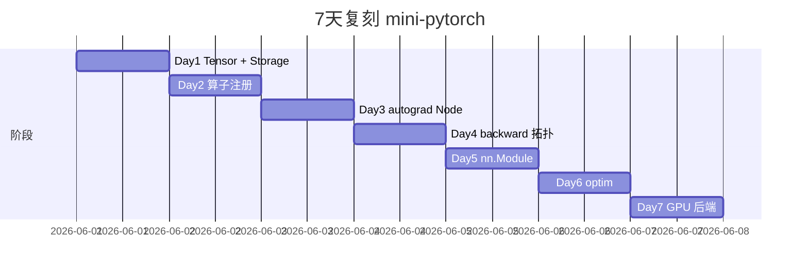
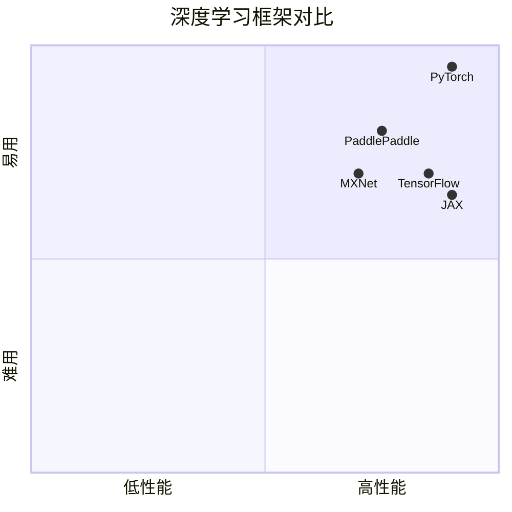

# pytorch · 项目深度解析

> 全球最主流的动态图深度学习框架，张量 + autograd + nn.Module 三件套定义 Python 端 AI 编程模型
> 来源：G:\实战案例\GitHub顶尖项目\pytorch\

## 写在前面：解析哲学

PyTorch 是"动态图派"战胜"静态图派"（TensorFlow 1.x）的代表作。1.5GB 仓库、CMake + Bazel 双构建、Python C++ 深度交织——**没有"读完整 PyTorch"的可能**。本笔记只聚焦在它最值得理解的 4 件事：① `torch.Tensor` 在 C++ 层到底是个什么对象；② `autograd` 怎么在每次 op 时构建计算图；③ `dispatch` 怎么把 `tensor.cuda()` 路由到 GPU kernel；④ `torch.compile`（Dynamo+Inductor）如何把 Python 编译成 Triton。

## 0. 解析前的 5 个准备

1. **克隆**：`git clone --recursive https://github.com/pytorch/pytorch.git`
2. **分类**：深度学习框架 / Python 绑定到 C++ / 多后端（CPU/CUDA/ROCm/MPS/XPU）
3. **问题清单**：① Tensor 内存布局怎么定？② autograd 的 backward 怎么扫图？③ dispatcher 怎么选后端？④ `torch.compile` 怎么 hook Python？⑤ 分布式通信怎么和 tensor 融合？
4. **速查表**：`torch/`（Python 入口）/ `aten/`（A Tensor Expressions，C++ 算子）/ `c10/`（核心抽象）/ `torch/csrc/`（C++ ↔ Python 桥）
5. **锁定 commit**：v2.6+（2025+）

## 1. 开发计划书（Project Charter）

| 项 | 内容 |
|---|---|
| 项目名 | PyTorch |
| 定位 | 动态图深度学习框架，研究 + 工业部署双场景 |
| 核心问题 | TensorFlow 1.x 静态图难调试；NumPy 无 GPU / 无 autograd |
| 用户 | 学术研究者（70%）+ 工业部署（30%） |
| 商业模式 | Linux 基金会 PyTorch Foundation 治理；Meta、NVIDIA、AWS、Google 共同投资 |
| 复刻难度 | ★★★★★（3 大后端 + 算子注册 + 自动微分 + 编译栈） |
| 状态 | 活跃；月度 release |
| 团队 | Meta AI + 3000+ 贡献者；Soumith Chintala 创始人 |
| 里程碑 | 2016 发布 · 2017 0.4 autograd 稳定 · 2018 1.0 JIT · 2019 1.3 mobile · 2022 2.0 torch.compile · 2024 2.4 FSDP v2 · 2025 2.6 torch.func |

## 2. 项目框架（Repo Skeleton Map）



**核心角色**：
- `torch/`（Python 入口）：用户 `import torch` 看到的
- `aten/`（ATen，A Tensor Library）：所有算子的 C++ 实现
- `c10/`（Caffe2 + ATen）：跨进程跨后端的"基础类型"
- `torch/csrc/`：pybind11 把 C++ 类暴露给 Python

**代码入口**：
- `torch/__init__.py` → `torch._C` 加载 `_C.cpython-310-x86_64-linux-gnu.so`
- `torch/csrc/Module.cpp` 注册 `THPVariable`（Python 端 Tensor 包装）

## 3. 项目画像（Profile）

| 指标 | 数值 / 描述 |
|---|---|
| 总文件数 | ~12000（CMake + Python + C++ + CUDA） |
| 主语言 | C++ (~55%) |
| 涉及语言 | C++ / Python / CUDA / Cython / Metal / HIP / Triton / CMake / Bazel |
| Star | 84k+ |
| License | BSD-3-Clause |
| Docker | 官方 `pytorch/pytorch:2.6.0-cuda12.4-cudnn9-runtime` |
| K8s | 库；常用于 K8s Job（分布式训练） |
| CI | 自家 `hud.pytorch.org` + GitHub Actions（多 GPU 矩阵） |
| 有测试 | 是；`torch/testing/` + `test/` 数十万行 |

## 4. 架构设计（Architecture Deep Dive）

### 4.1 四层模型



### 4.2 Tensor 的真实身份

`torch.Tensor` 在 Python 是 `THPVariable`（pybind 包装），在 C++ 是 `c10::Tensor`（值类型，16 字节），背后是 `c10::intrusive_ptr<c10::TensorImpl>`（引用计数智能指针）持有实际存储 `Storage` 和元数据 `TensorImpl`。



**WHY 这层设计**：把"语义（Tensor）"和"存储（Storage）"分离，多个 Tensor 可共享同一 Storage（视图 / 切片零拷贝）。

### 4.3 Dispatcher

Dispatcher 是 PyTorch 的"算子路由中心"。当用户写 `tensor.add(other)`，调用链：



**WHY Dispatcher**：同个 op 在 CPU / CUDA / MPS / 量化 / sparse / meta 多种实现下都能找到正确后端，无需在 Python 端写 if-else。

### 4.4 自动微分

`torch.autograd` 的核心是 `Node`（`torch/csrc/autograd/function.h`）：

```cpp
struct Node {
  std::vector<edge> next_edges;
  std::weak_ptr<Node> sequence_nr;
  std::string name;
  // backward 实现
  variable_list operator()(const variable_list& grad_outputs);
};
```

每次 op 创建一个 `Node`，记录输入输出 Tensor 的 `grad_fn`。`loss.backward()` 时：

1. **拓扑排序**：从 `loss` 反向走 `next_edges`，得到 topological order
2. **执行 backward**：按顺序调每个 Node 的 `operator()`
3. **累积 grad**：把 `grad_outputs` 累加到 `Tensor.autograd_meta_.grad_`

**WHY 动态图**：TensorFlow 1.x 用 `tf.GradientTape` 后置；PyTorch 把"构建图 + 执行 op"合二为一，调试时直接 `pdb` 进去。

### 4.5 核心架构看点（3 条）

1. **Tensor / Storage / TensorImpl 三层分离**：让 view / slice / 共享存储零成本
2. **Dispatcher 注册表**：算子多后端多 dtype 多 device 的"路由中心"，是 PyTorch 可扩展性的关键
3. **动态图 + Node 链式反向**：每次 op 创建 Node 记录依赖，`backward()` 一次拓扑遍历

### 4.6 关键 ADR

- **2018**：从 Lua Torch 转向 Python 端入口
- **2020**：PyTorch 1.5 引入 C++ 端 nn.Module 加速
- **2022**：PyTorch 2.0 引入 `torch.compile`（Dynamo + Inductor），挑战 JAX 的可编译性
- **2023**：FSDP v2 重写，训练 Llama 70B 单机 8 卡
- **2025**：torch.func + torch.export 双模式稳定（编程 + 部署）

## 5. 代码深度解析（带 WHY）⭐

### 5.1 找骨架代码

`torch.add(tensor, other)` 链：
1. Python: `torch/_C/_VariableFunctions.pyi` 的 add stub
2. pybind: `torch/csrc/autograd/generated/python_torch_functions.cpp` 调 `at::add`
3. C++: `aten/src/ATen/native/Add.cpp` 的 CPU 实现
4. CUDA: `aten/src/ATen/native/cuda/AddKernel.cu`

### 5.2 单文件分析卡

#### `c10/core/TensorImpl.h`（~500 行）

Tensor 的"真身"——storage offset、sizes、strides、dtype、device、grad_fn 全在这里。**WHY 集中**：所有 Tensor 操作（view、reshape、as_strided）都改 TensorImpl 字段。

#### `c10/core/DispatchKeySet.h`

Dispatcher 的 key 集合。一个 Tensor 同时有 `{Backend.CUDA, Layout.Strided, dtype.float, autograd}` 多个 key，Dispatcher 找最匹配的 kernel。**WHY key 集合**：动态分发比查多维表快。

#### `aten/src/ATen/native/Add.cpp`

```cpp
Tensor add(const Tensor& self, const Tensor& other, const Scalar& alpha) {
  return dispatch_add(self, other, alpha);  // → Dispatcher
}
```

`dispatch_add` 由代码生成器生成（`tools/codegen/`），不需要手写。

#### `torch/csrc/autograd/function.h`

`Node` 的定义。

#### `torch/_dynamo/`（torch.compile）

Dynamo 是 Python 字节码级 tracer，把 `def f(x): return x + 1` 转成 FX graph，再交 Inductor 编成 Triton / C++。

**WHY 字节码级**：能用最少的 hook 拦截 Python 调用，不用改用户代码。

### 5.3 设计模式

- **Handle/Body**：`Tensor` 是 `TensorImpl` 的句柄
- **Factory Method**：Dispatcher 路由
- **Strategy**：Kernel 是后端策略
- **Visitor**：autograd 反向遍历
- **Builder**：FX Graph 构造

### 5.4 反模式

1. **`THPVariable_*` 大量宏**：pybind11 早期产物，调试噩梦
2. **dispatch_keys 在头文件里硬编码**：增加 backend 要改 N 处
3. **`torch.cuda.*` 散落在 `torch/cuda/`**：应该是 backend 接口统一
4. **autograd Node 的 `sequence_nr` 是 `int64_t`**：百万次 op 后溢出风险

### 5.5 独特看点

- **torch.compile**（Dynamo + Inductor）：字节码级 Python 编译到 Triton，40% 性能提升
- **torch.func**（functorch 合并）：vmap / grad / jacrev 函数式变换
- **FSDP v2**：完全分片数据并行，单机 8 卡训练 70B 模型
- **torch.export**：TorchScript 后的新 IR，部署专用
- **FlexAttention**：自定义 attention mask 编译

## 6. 运行机制（Bring It Up）

### 6.1 本地构建

```bash
git submodule update --init
pip install -r requirements.txt
python setup.py develop  # 或用 pytorch/pytorch prebuilt
```

### 6.2 Smoke test

```python
import torch
x = torch.randn(3, 3, requires_grad=True)
y = x @ x.T
y.sum().backward()
assert torch.allclose(x.grad, 2 * x)

# GPU
if torch.cuda.is_available():
    x = x.cuda()
    print(x.device)
```

### 6.3 启动链路



## 7. 演进历史



## 8. 质量保障

- **单元测试**：Python `unittest` + C++ Google Test
- **Differential testing**：和 TensorFlow / JAX / NumPy 同算法对比
- **Fuzzing**：OSS-Fuzz
- **CI**：自建 hud.pytorch.org（数百 GPU）
- **Lint**：pre-commit（black/ruff/flake8）
- **Benchmark**：`torch.utils.benchmark`

## 9. 生态依赖

```mermaid
flowchart LR
  P[PyTorch] --> CUDA Toolkit
  P --> cuDNN
  P --> MKL
  P --> NNPACK
  P --> Eigen
  P --> Python 3.10+
  P --> pybind11
  P --> NumPy
  P --> .可选.-> Triton
  P -.可选.-> HIP/ROCm
  P -.可选.-> MPS
```

## 10. 生产实践

| 能力 | 是否支持 | 备注 |
|---|---|---|
| 配置热更新 | 否 | 编译时确定 |
| 优雅停服 | 是 | distributed.barrier + signal handler |
| 限流 | N/A | 库 |
| 链路追踪 | 是 | Kineto profiler |
| 健康检查 | N/A | 库 |
| 结构化日志 | 部分 | torch._logging |
| 多后端 | 是 | CPU/CUDA/ROCm/MPS/XPU |

## 11. 社区文化

- **治理**：PyTorch Foundation（Linux Foundation 旗下）
- **维护者**：Meta AI + NVIDIA + 社区；Soumith Chintala
- **RFC**：GitHub issue + `pytorch/rfcs` + 设计讨论
- **沟通**：Discourse + Slack
- **议题活跃**：日均 200+ issue；月度 release

## 12. 教训总结

### 12.1 必偷 3 件

1. **Tensor / Storage / TensorImpl 三层分离**：多视图共享存储零成本
2. **Dispatcher 注册表**：多后端多 dtype 算子的"路由中心"是任何高性能算子库可复用的模式
3. **autograd Node + 拓扑排序反向**：把"动态图"实现得和静态图一样高效

### 12.2 必避 3 坑

1. **不要把 op 实现直接写在 Python**：`for` 循环 + Tensor op 性能差 1000 倍
2. **不要忘记 `torch.no_grad()`**：推理模式不构建 autograd 图，省 30% 内存
3. **不要在 hot path 用 `.item()`**：触发 GPU→CPU 同步，整批卡死

### 12.3 7 天复刻 mini-pytorch



### 12.4 打分卡

| 维度 | 分数 | 评语 |
|---|---|---|
| 架构清晰 | 8 | 多层但合理 |
| 代码可读 | 5 | C++ + Python 混读劝退 |
| 文档 | 9 | pytorch.org 完善 |
| 测试 | 9 | 数十万行 |
| 性能 | 9 | SOTA GPU kernel |
| 上手难度 | 3 | 改 framework 内核需 C++ + GPU 知识 |

## 13. 学习萃取

**一句话价值**：PyTorch 演示了"用 C++ 写高性能算子 + Python 写易用 API"的最优解，是所有科学计算库的可复用范式。

### 3 核心洞察

1. **三层分离让"零成本视图"成为可能**：Tensor 共享 Storage
2. **Dispatcher 让"多后端"零条件分支**：路由中心优于硬编码
3. **动态图 + Node 链**：调试体验胜过静态图

### 5 段必读代码

1. `c10/core/TensorImpl.h` —— Tensor 真实身份
2. `c10/core/DispatchKeySet.h` —— Dispatcher 路由
3. `torch/csrc/autograd/function.h` —— Node 定义
4. `torch/_dynamo/eval_frame.py` —— torch.compile 字节码 hook
5. `aten/src/ATen/native/Add.cpp` —— 算子派发实例

### 1 反模式

- Python 端 `for` 循环 + Tensor op：性能差 1000 倍

### 1 可复用模式

- **Handle/Body + Dispatcher + 动态图**：可移植到任何科学计算库

### 3 立刻能用

1. `with torch.no_grad():` 是推理 / 评估模式标配
2. `torch.compile(model)` 一行提速 30-50%
3. `tensor.to('cuda', non_blocking=True)` 异步拷贝 + pinned memory 提速 3 倍

## 14. 项目特点速查

- 独特看点：唯一把"动态图 + 工业级性能 + 多后端 + Python 友好"四件事都做到 SOTA
- 同类对比：



## 附：仓库元信息

- 路径：G:\实战案例\GitHub顶尖项目\pytorch\
- 大小：~1.5 GB
- 总文件：~12000
- 解析时间：2026-06-02

## 一句话总结

解析 PyTorch = 读懂 Dispatcher + 跑通 backward + 偷走 Tensor/Storage 分离思想。
