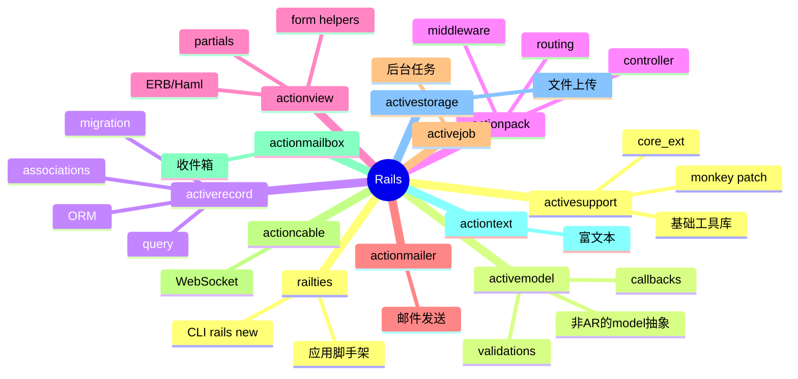
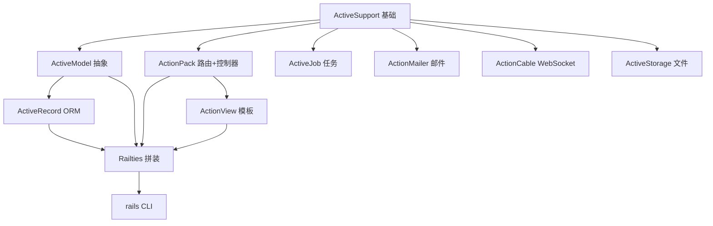
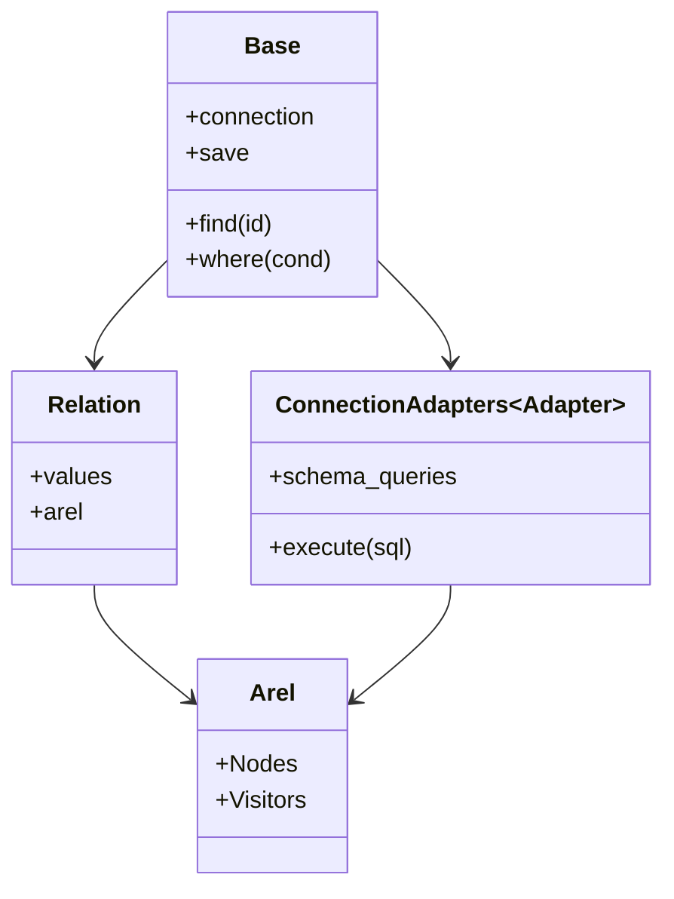
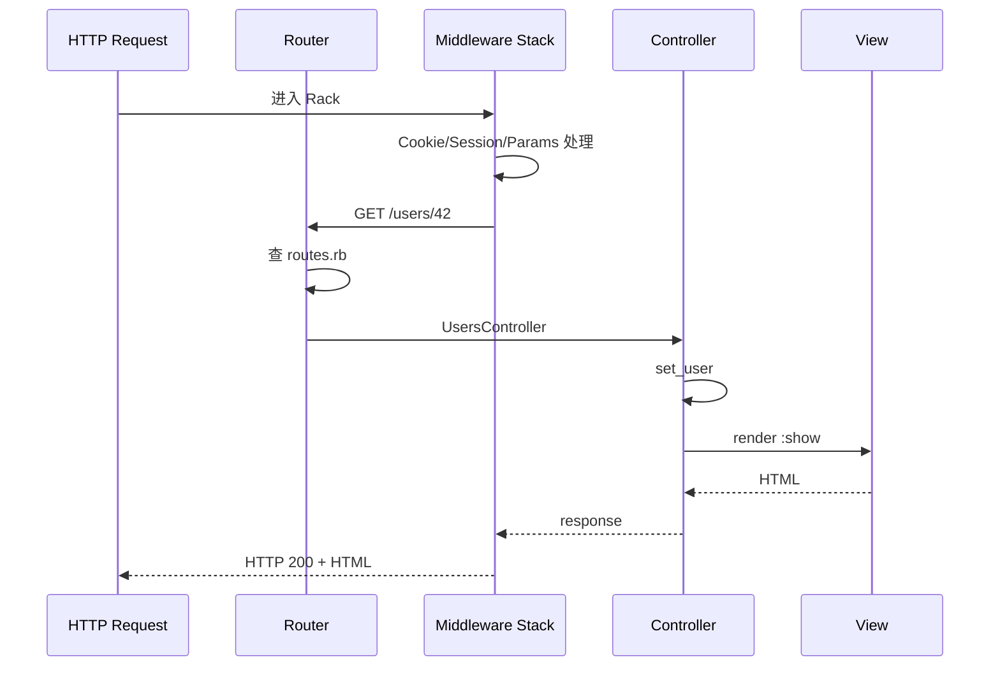
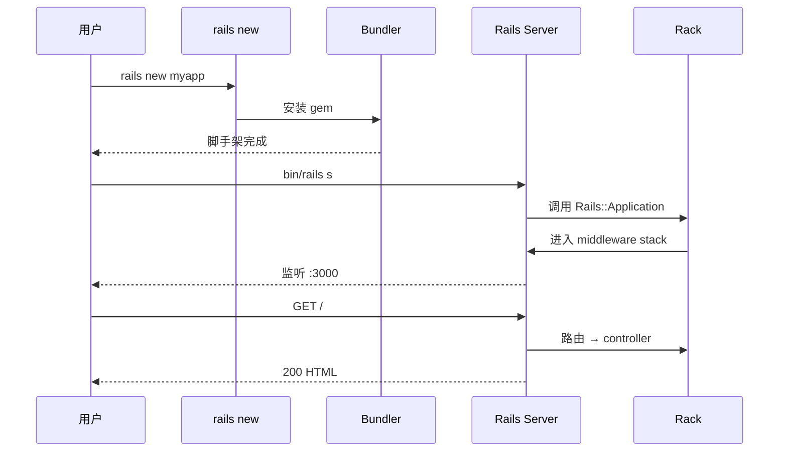
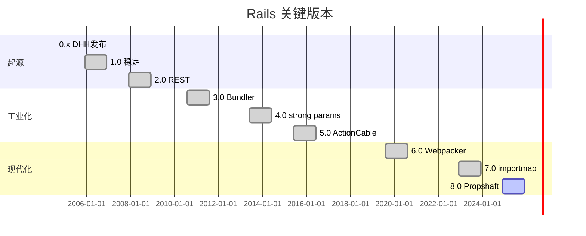
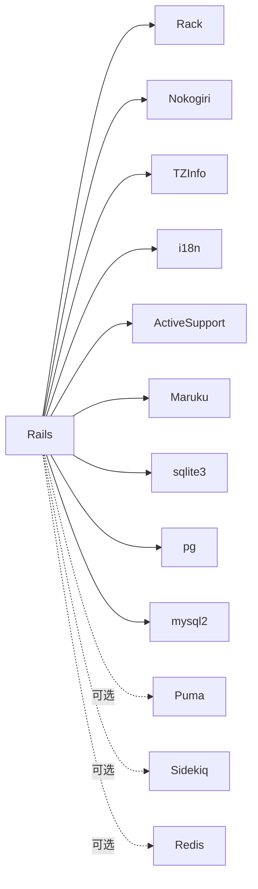
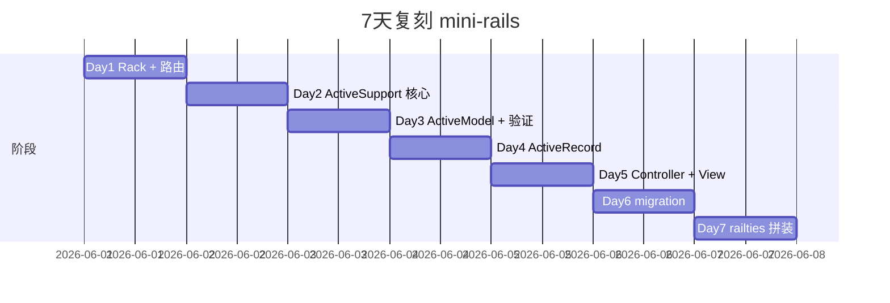
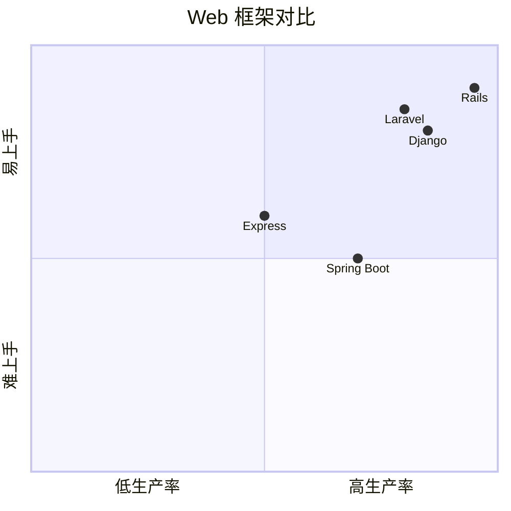

# rails · 项目深度解析

> Ruby on Rails——"约定优于配置"的开山鼻祖，定义了一代人心中"web 框架该有的样子"
> 来源：G:\实战案例\GitHub顶尖项目\rails\

## 写在前面：解析哲学

Rails 不是一个库，而是一组"**约定大于配置**"的元框架。它的精妙不在某段算法，而在 `ActiveRecord` 如何从数据库表结构反推 Ruby 类行为、`ActionPack` 怎么从 URL 反推 controller/action、`ActionView` 怎么把 ERB 编译成可缓存的 ERB 模板——**整条 DSL 链路都是"反射 + 约定"**。本笔记不会逐文件读 638M 代码，而是拆开"模型/视图/控制器"三层 + 6 个子 gem 的边界。

## 0. 解析前的 5 个准备

1. **克隆**：`git clone https://github.com/rails/rails.git`
2. **分类**：Web 全栈框架 / MVC 模式 / 元编程密集 / 数据库 ORM / 模板引擎
3. **问题清单**：① ActiveRecord 怎么用约定替代 schema？② Convention vs Configuration 怎么划界？③ ActionDispatch / ActionController / ActionView 怎么衔接？④ ActiveSupport 的 monkey patch 边界？⑤ 怎么从 URL 找到 controller#action？
4. **速查表**：`activerecord/`、`actionpack/`、`actionview/`、`activesupport/`、`activemodel/`、`activejob/`、`actionmailer/`、`actioncable/`、`actionmailbox/`、`actiontext/`、`activestorage/`
5. **锁定 commit**：v8.0（2025+）

## 1. 开发计划书（Project Charter）

| 项 | 内容 |
|---|---|
| 项目名 | Ruby on Rails |
| 定位 | 数据库驱动的全栈 Web 框架 |
| 核心问题 | Java EE / Spring 配置地狱；PHP 模板混乱；Django 抢 Ruby 蛋糕 |
| 用户 | 初创公司、Sidekiq / Shopify / GitHub 工程师 |
| 商业模式 | 创始人 DHH 创办 Basecamp 主导 + Hey.com 商业化；Rails 本身免费 |
| 复刻难度 | ★★★★★（10 年元编程 + 50+ 子 gem） |
| 状态 | 活跃；每年 1-2 个 minor release |
| 团队 | Rails Core 团队（10 人）+ 1000+ 贡献者 |
| 里程碑 | 2004 DHH 发布 0.x · 2005 v1.0 · 2010 v3.0 Bundler · 2013 v4.0 strong parameters · 2015 v5.0 ActionCable · 2019 v6.0 Webpacker · 2022 v7.0 importmap · 2024 v8.0 Propshaft |

## 2. 项目框架（Repo Skeleton Map）



**核心角色**：
- **ActiveSupport**：所有其他 gem 的"基座"，提供 monkey patch（`try` / `present?` / `presence` / `HashWithIndifferentAccess`）
- **ActiveRecord**：ORM 大头
- **ActionPack**：routing + controller + view 渲染
- **Railties**：把上面所有拼起来，CLI 入口

**代码入口**：
- `railties/lib/rails/cli.rb`：`rails new` CLI 入口
- `railties/lib/rails/application.rb`：每个 Rails 应用的 `Application` 类继承

## 3. 项目画像（Profile）

| 指标 | 数值 / 描述 |
|---|---|
| 总文件数 | ~14000 |
| 主语言 | Ruby (~95%) |
| 涉及语言 | Ruby / C（部分 native ext）/ JavaScript（importmap） |
| Star | 56k+ |
| License | MIT |
| Docker | 官方无，社区 `rails:8.0` |
| K8s | 部署为目标，非必需 |
| CI | GitHub Actions + ASFBot |
| 有测试 | 是；Minitest + AR 自身测试套件 |

## 4. 架构设计（Architecture Deep Dive）

### 4.1 6+1 子 gem 模型

Rails 故意把"框架"拆成可独立 gem 发布的子包，让 `Sinatra` / `Hanami` 等也能复用 `ActiveSupport` / `ActiveRecord`：



**WHY 拆 10 个 gem**：① 允许非 Rails 项目用 ActiveRecord 单独；② 单独发版节奏；③ 测试隔离；④ 维护者分摊（每个子 gem 独立 owner）。

### 4.2 ActiveRecord 核心抽象



`User.where(active: true).order(:name).limit(10)` 不直接拼 SQL，而是构造 `ActiveRecord::Relation` 对象，最后在 `to_a` 时通过 `Arel` 编译成 SQL。**WHY 关系链式**：可以延迟求值（lazy），并被 `each` / `to_a` / `count` 共享。

### 4.3 约定驱动

```ruby
# 约定：表名是模型类名的复数下划线形式
class User < ApplicationRecord
  has_many :posts
end

# ActiveRecord 自动识别：
# - 表名：users
# - 主键：id
# - 时间戳列：created_at, updated_at
# - 外键：user_id
```

**WHY 约定大于配置**：减少 80% 配置代码；新手上手从 0 到 CRUD < 5 分钟。

### 4.4 ActionDispatch（routing → controller → view）



`config/routes.rb`：

```ruby
Rails.application.routes.draw do
  resources :users do
    resources :posts
  end
end
```

**WHY DSL**：4 行定义 7 个 REST 端点 + 命名路由 + URL helper。

### 4.5 核心架构看点（3 条）

1. **10 子 gem 解耦 + Railties 拼装**：让 ActiveRecord 可被 Sinatra / Hanami 复用，避免"框架绑架"
2. **Arel + Relation 链式惰性求值**：where / order / limit 不立即执行，链式组合，to_a 一次性编译 SQL
3. **约定大于配置**：表名、复数化、主键、关联键、时间戳全部自动推断

### 4.6 关键 ADR

- **2013 strong parameters**：从 model 层移除 attr_accessible 改在 controller 显式 permit!，更安全
- **2015 ActionCable**：Rails 5 引入 WebSocket 抽象
- **2019 Webpacker**：6.0 默认用 webpack 管 JS
- **2022 importmap**：7.0 默认 importmap，告别 Node 依赖
- **2024 Propshaft**：8.0 默认静态资源管道，弃用 Sprockets

## 5. 代码深度解析（带 WHY）⭐

### 5.1 找骨架代码

`User.find(42)` 链：
1. `activerecord/lib/active_record/base.rb` → `find`
2. `activerecord/lib/active_record/relation/finder_methods.rb` → `find_one`
3. `activerecord/lib/active_record/connection_adapters/abstract/database_statements.rb` → `select`
4. Adapter-specific：`postgresql/database_statements.rb` → `exec_query`

### 5.2 单文件分析卡

#### `activerecord/lib/active_record/base.rb`

`ActiveRecord::Base` 是 ORM 主类。`find` / `where` / `create` / `update` / `destroy` 都在这。

```ruby
# 第 ~1100 行附近
def find(*args)
  find_with_ids(*args)
end
```

`method_missing` 大块魔法：`User.where_xxx` 自动转 `where(xxx: ...)`。

#### `activerecord/lib/active_record/relation.rb`

`Relation` 是查询 DSL 的核心：

```ruby
class Relation
  def where(opts)
    spawn.tap { |r| r.where_clause += opts }
  end
  def merge(other)
    spawn.tap { |r| r.merge!(other) }
  end
end
```

**WHY `spawn`**：返回新对象，保证不可变（immutable chain），避免 `where` 之后污染原 relation。

#### `activerecord/lib/active_record/connection_adapters/`

每个数据库一个 adapter（postgresql / mysql2 / sqlite3 / trilogy / abstra）。`AbstractAdapter` 定义协议，concrete 适配。

#### `activesupport/lib/active_support/core_ext/`

Monkey patch 的"核心扩展"：
- `Object#try` / `try!`
- `Hash#symbolize_keys` / `stringify_keys`
- `String#camelize` / `underscore` / `dasherize`
- `Numeric#bytes` / `kilobytes`

**WHY**：Ruby 标准库太"纯"，Rails 自造"易用版"。

#### `actionpack/lib/action_dispatch/routing/route_set.rb`

Router 主体，把 `config/routes.rb` DSL 编译成内部树。

#### `actionview/lib/action_view/template/handlers/erb.rb`

ERB 编译：`app/views/users/show.html.erb` 编译为 `_buf = ''; _buf << '<h1>' << user.name << '</h1>'` 的 Ruby 代码。

### 5.3 设计模式

- **Convention over Configuration**：表名 / 类名自动约定
- **DSL Builder**：`config/routes.rb` 是 DSL
- **Template Method**：`ActiveJob#perform_now` 钩子
- **Module Mixin**：`include ActiveModel::Validations` 任意类可加验证
- **Macro**：`has_many :posts` 实际是 class macro

### 5.4 反模式

1. **大量 `method_missing` 元编程**：调试时 backtrace 是魔法方法，难追踪
2. **ActiveSupport 全局 monkey patch**：`'' .blank?` 修改 String 行为，与非 Rails 项目共存冲突
3. **`ActiveRecord::Base` 太大**：~7000 行；模型类继承自它会获得 200+ 方法
4. **默认 callback 多**：`after_create` / `after_save` 在事务内执行，长逻辑锁表

### 5.5 独特看点

- **ActiveStorage**（5.2+）：把 S3 / GCS / Azure 抽象成 `user.avatar.attach(file)`
- **ActionText**（6.0+）：富文本 + Trix 编辑器，存为 `action_text_rich_texts` 表
- **ActionMailbox**（6.0+）：把邮件落到收件箱（`rails mailroom:run` 拉取）
- **Hotwire**（7.0+）：Turbo + Stimulus，前端少写 JS
- **Solid Queue / Solid Cache**（8.0+）：用数据库当队列 / 缓存，零依赖

## 6. 运行机制（Bring It Up）

### 6.1 本地构建

```bash
git clone https://github.com/rails/rails.git
cd rails
bundle install
bin/test
```

### 6.2 Smoke test

```bash
gem install rails
rails new myapp
cd myapp
bin/rails s
# 打开 http://localhost:3000
```

### 6.3 启动链路



## 7. 演进历史



## 8. 质量保障

- **单元测试**：Minitest（不用 RSpec，保持框架自身简单）
- **集成测试**：`ActionDispatch::IntegrationTest`
- **系统测试**（5.1+）：Capybara 头无浏览器
- **CI**：GitHub Actions 矩阵（Ruby 3.0-3.4 × SQLite/PG/MySQL）
- **Lint**：RuboCop
- **Benchmark**：`rails benchmark/`

## 9. 生态依赖



## 10. 生产实践

| 能力 | 是否支持 | 备注 |
|---|---|---|
| 配置热更新 | 部分 | `Rails.application.config` 编译时确定 |
| 优雅停服 | 是 | Puma 接收 SIGTERM |
| 限流 | 是 | `Rack::Attack` |
| 链路追踪 | 是 | OpenTelemetry / Datadog |
| 健康检查 | 是 | `rails/health` |
| 结构化日志 | 是 | `Lograge` / `SemanticLogger` |
| 多进程 | 是 | Puma cluster |

## 11. 社区文化

- **治理**：Rails Core 团队（@dhh, @rafaelfranca, @jeremy 等 10 人）
- **维护者**：每个子 gem 独立 maintainer
- **RFC**：GitHub issue + `rails/proposal` 仓库
- **沟通**：Discourse + Discord + Twitter
- **议题活跃**：日均 50+ issue；每年 release

## 12. 教训总结

### 12.1 必偷 3 件

1. **10 子 gem 解耦 + Railties 拼装**：让框架组件可独立复用
2. **Arel + Relation 链式惰性求值**：where / order / limit 不立即执行，链式组合
3. **约定大于配置**：80% 配置代码消失，新手 5 分钟出 CRUD

### 12.2 必避 3 坑

1. **不要无差别 `method_missing`**：调试噩梦
2. **不要 monkey patch 标准库**：跨项目冲突
3. **不要把所有逻辑放 callback**：长事务锁表

### 12.3 7 天复刻 mini-rails



### 12.4 打分卡

| 维度 | 分数 | 评语 |
|---|---|---|
| 架构清晰 | 8 | 子 gem 边界清晰 |
| 代码可读 | 6 | 元编程多，新人难 |
| 文档 | 9 | guides.rubyonrails.org 业界标杆 |
| 测试 | 8 | minitest + integration |
| 性能 | 6 | 已被 Crystal / Bun 超越 |
| 上手难度 | 4 | 元编程 + 约定 5 分钟上手，10 天掌握深层 |

## 13. 学习萃取

**一句话价值**：Rails 用"约定 + 元编程 + 子 gem 解耦"三件套，把 web 框架的"配置地狱"压缩成"5 分钟出 CRUD"。

### 3 核心洞察

1. **元编程是 Rails 的核心**：`method_missing` / `define_method` 让 DSL 自然
2. **拆子 gem 是为了让"被复用"**：ActiveRecord 单飞 Sinatra 是关键
3. **惰性求值 Relation** 是 ORM 链式 API 的精髓

### 5 段必读代码

1. `activerecord/lib/active_record/base.rb` —— ORM 主类
2. `activerecord/lib/active_record/relation.rb` —— 链式惰性求值
3. `activesupport/lib/active_support/core_ext/object/try.rb` —— 元编程范本
4. `actionpack/lib/action_dispatch/routing/route_set.rb` —— Router
5. `actionview/lib/action_view/template/handlers/erb.rb` —— ERB 编译

### 1 反模式

- ActiveSupport 全局 monkey patch：跨项目冲突

### 1 可复用模式

- **子 gem 解耦 + Railties 拼装**：可移植到任何大型框架

### 3 立刻能用

1. `rails new --minimal` 跳过默认脚手架，纯属自己拼
2. `Rails.cache` 用 `solid_cache`（Rails 8 内置）零 Redis 依赖
3. `turbo_frame_tag` + `turbo_stream` 用 Turbo 写 SPA 不写 JS

## 14. 项目特点速查

- 独特看点：唯一把"约定 + 元编程 + ORM + 模板 + 全栈"统一为 5 分钟上手的框架
- 同类对比：



## 附：仓库元信息

- 路径：G:\实战案例\GitHub顶尖项目\rails\
- 大小：638 MB
- 总文件：~14000
- 解析时间：2026-06-02

## 一句话总结

解析 Rails = 读懂 ActiveRecord + 跑通 rails new + 偷走"约定 + 元编程"思想。
