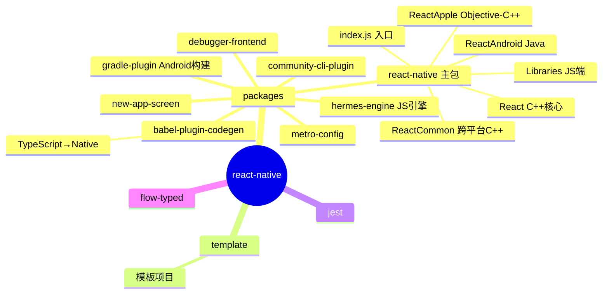
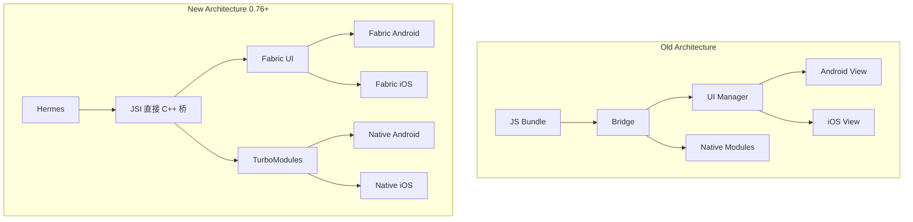
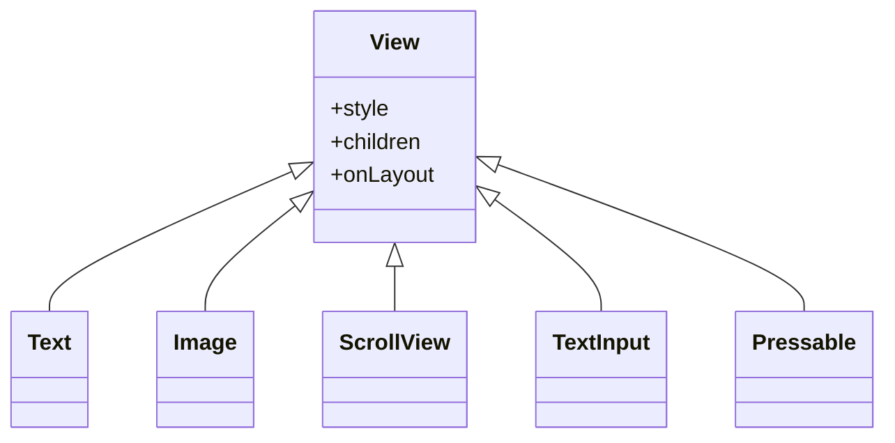
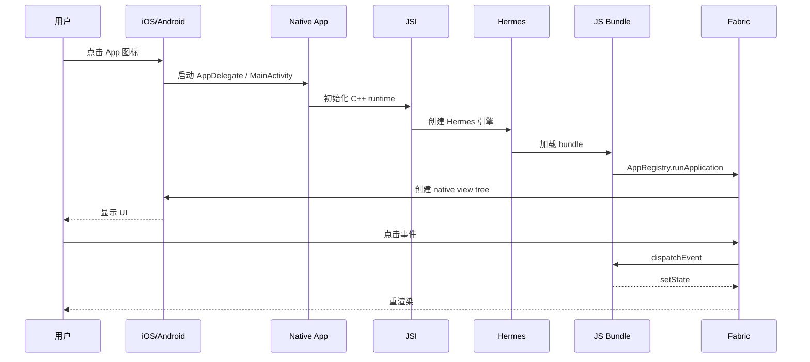
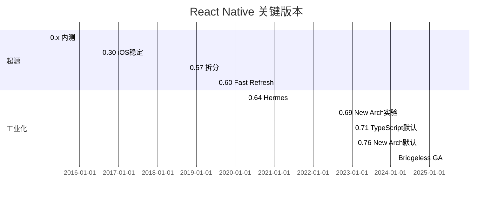
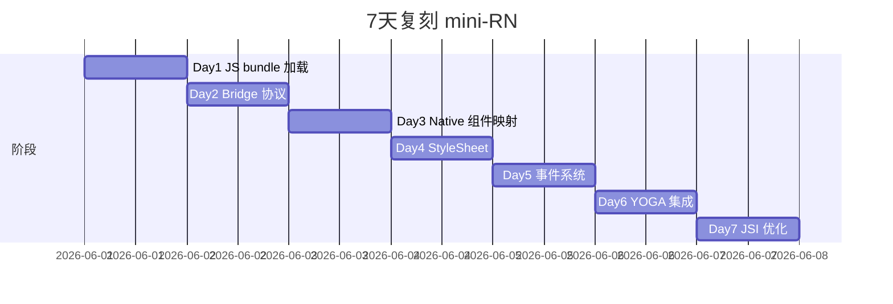

# react-native · 项目深度解析

> React 的移动端实现，把"一套代码跑 iOS + Android"从口号变成工程事实
> 来源：G:\实战案例\GitHub顶尖项目\react-native\

## 写在前面：解析哲学

React Native 不只是"React + 移动端"，它是一套**JS 端到 Native 端桥接 + 跨平台 UI 抽象**的工程范本。理解 RN 要回答 4 个问题：① JS 与 Native 怎么通信？② UI 是"映射"还是"重绘"？③ Fabric（New Architecture）比老架构快在哪？④ Hermes 引擎替代 JSC 的 ROI？本笔记聚焦在 RN 0.76+ 的 New Architecture（Fabric + TurboModules + Codegen）。

## 0. 解析前的 5 个准备

1. **克隆**：`git clone https://github.com/facebook/react-native.git`
2. **分类**：移动端跨平台框架 / JS-Native 桥 / monorepo（Yarn workspaces）
3. **问题清单**：① JS 怎么调 Native？② Native 怎么调 JS？③ 跨平台 UI 组件怎么抽象？④ 启动性能瓶颈？⑤ New Architecture 怎么改进了？
4. **速查表**：`packages/react-native/`（主包）/ `packages/react-native/Libraries/`（JS 端实现）/ `ReactAndroid/`（Android Java + C++）/ `ReactApple/`（iOS Objective-C++）/ `ReactCommon/`（跨平台 C++）
5. **锁定 commit**：v0.76+（2025+ New Architecture 默认）

## 1. 开发计划书（Project Charter）

| 项 | 内容 |
|---|---|
| 项目名 | React Native |
| 定位 | 用 React 范式开发 iOS / Android 原生应用 |
| 核心问题 | 写 2 套代码（Swift + Kotlin）成本高；H5 体验差 |
| 用户 | Facebook / Instagram / Discord / Shopify / Microsoft Office |
| 商业模式 | Meta 主导，MIT；商业产品用 Expo / EAS |
| 复刻难度 | ★★★★★（4 语言 + 桥接 + Native SDK） |
| 状态 | 活跃；月度 release |
| 团队 | Meta React Native Core + 1000+ 贡献者 |
| 里程碑 | 2015 React.js Conf 公布 · 2016 v0.30 iOS 稳定 · 2018 0.57 AsyncStorage 拆分 · 2019 0.60 Fast Refresh · 2020 0.64 Hermes 默认 · 2022 0.69 New Arch 实验 · 2023 0.71 TypeScript 默认 · 2024 0.76 New Arch 默认 · 2025 Bridgeless GA |

## 2. 项目框架（Repo Skeleton Map）



**核心角色**：
- `react-native/Libraries/`：JS 端（Component / API / Animated / StyleSheet）
- `react-native/ReactCommon/`：C++ 核心（Fabric / TurboModules / ReactNative / jsi）
- `react-native/ReactAndroid/`：Android 端 Java + C++ 桥
- `react-native/ReactApple/`：iOS 端 Objective-C++ 桥
- `react-native/React/`：老架构 bridge（保留兼容）

**代码入口**：
- `index.js`：`AppRegistry.registerComponent('AppName', () => App)`
- `cli.js`：`npx react-native run-android`

## 3. 项目画像（Profile）

| 指标 | 数值 / 描述 |
|---|---|
| 总文件数 | ~25000 |
| 主语言 | C++ (~30%) / JavaScript (~25%) / Objective-C++ (~20%) / Java (~15%) |
| 涉及语言 | JavaScript / C++ / Objective-C++ / Java / Kotlin / Swift / TypeScript / Ruby (CocoaPods) |
| Star | 119k+ |
| License | MIT |
| Docker | 否（移动端框架） |
| K8s | 否 |
| CI | GitHub Actions + CircleCI + Meta 内部 |
| 有测试 | 是；Jest + Detox E2E + 内部 |

## 4. 架构设计（Architecture Deep Dive）

### 4.1 Old vs New Architecture



**Old Architecture 痛点**：
- Bridge 异步消息队列，序列化 JSON 性能差
- 启动时 bridge 初始化慢
- UI 命令走 bridge，UI 线程阻塞

**New Architecture 改进**：
- JSI（JavaScript Interface）：C++ ↔ JS 直接互调，免 JSON 序列化
- Fabric：新 UI 渲染器，支持同步 layout、concurrent rendering
- TurboModules：懒加载 Native Module，按需启动
- Codegen：TypeScript spec 自动生成 Native 接口代码

### 4.2 跨平台 UI 抽象



**组件映射**：
- `<View>` → Android: `ViewGroup` / iOS: `UIView`
- `<Text>` → Android: `TextView` / iOS: `UITextView`
- `<Image>` → Android: `ImageView` / iOS: `UIImageView`
- `<ScrollView>` → Android: `ScrollView` / iOS: `UIScrollView`

**WHY 不重绘**：RN 不是"webview 内核"，而是把 React 元素映射成真正的 Native 视图，性能接近原生。

### 4.3 JSI 直接桥

```cpp
// C++ 端
class JsiHostObject {
  virtual Value get(Runtime& runtime, const PropNameID& name) = 0;
};

// JS 端
const result = global.nativeModule.doSomething(42);
```

**WHY JSI**：老 bridge 是 JSON 字符串序列化跨线程 queue；JSI 是 C++ 函数指针 + 同步调用，0 序列化、0 跨线程。

### 4.4 核心架构看点（3 条）

1. **JSI 直接桥**：彻底解决老 bridge 的序列化性能瓶颈
2. **Fabric 渲染器**：同步 layout + concurrent rendering，UI 响应跟手
3. **Codegen**：TypeScript spec 自动生成 Native 代码，避免手写双份

### 4.5 关键 ADR

- **2018**：v0.57 拆分核心到 npm，让社区包独立
- **2019**：v0.60 Fast Refresh 默认
- **2020**：Hermes 替代 JSC，启动加速 50%
- **2022**：v0.69 New Arch 实验
- **2024**：v0.76 New Arch 默认，所有新建项目 Bridgeless

## 5. 代码深度解析（带 WHY）⭐

### 5.1 找骨架代码

启动链：
1. Android：`MainApplication.kt` 调 `ReactNativeHost.createReactInstanceManager()` → `ReactInstanceManager` 启动 C++ runtime → 加载 JS bundle → `AppRegistry.runApplication('AppName', props)`
2. iOS：`AppDelegate.mm` 调 `RCTBridge` 启动 → `RCTRootView` 渲染

### 5.2 单文件分析卡

#### `ReactCommon/react/nativemodule/core/ReactCommon/TurboModule.h`

TurboModule 基类，**所有 Native Module 必须继承**。

#### `ReactCommon/react/runtime/ReactInstance.h`

JS runtime 容器，持有 Hermes 引擎和 Fabric 渲染器。

#### `Libraries/AppRegistry/AppRegistry.js`

JS 端应用注册中心：`AppRegistry.registerComponent('AppName', () => App)` 把 root 组件注册到 `AppRegistry`。

#### `Libraries/Components/View/View.js`

最常用 View 组件。`View` 在 Native 端映射为 Android `ViewGroup` / iOS `UIView`。

#### `Libraries/StyleSheet/StyleSheet.js`

CSS 子集实现，YOGA 引擎做 flexbox layout。

```js
import { StyleSheet } from 'react-native';
const styles = StyleSheet.create({
  container: { flex: 1, justifyContent: 'center' },
});
```

#### `ReactCommon/yoga/yoga/Yoga.h`

跨平台 Flexbox 引擎，移植自 CSS3 Flexbox。在 C++ 端跑，输出 native view 的 frame。

**WHY 自带 YOGA**：浏览器 Flexbox 在 Android / iOS 上都要重写；YOGA 一份代码跨平台。

#### `Libraries/Animated/Animated.js`

声明式动画系统。基于 `useNativeDriver: true` 时走 UI 线程，60fps 不卡 JS 线程。

### 5.3 设计模式

- **Bridge**（老）/ **JSI**（新）：JS ↔ Native 通信
- **Adapter**：Platform 区分 iOS/Android
- **Composite**：Component 树
- **Strategy**：Native 组件映射策略
- **Provider**（Context）：Theme / Locale / SafeArea

### 5.4 反模式

1. **频繁 setState 触发大 re-render**：列表长时应配 FlatList + keyExtractor
2. **Inline function onClick**：每次 render 创新闭包，组件 memoization 失效
3. **bridge 时代的异步 JSON 序列化**：老架构性能瓶颈
4. **把 web 库直接搬过来**：浏览器 API 不可用（`window` / `document` / `localStorage`）

### 5.5 独特看点

- **Fast Refresh**：保存代码 1 秒后热重载，保留组件状态
- **Hermes**：专为 RN 优化的 JS 引擎，体积小、启动快
- **Expo**：零 native 配置的 RN 工具链
- **Reanimated 3**：UI 线程动画库，比 Animated 强
- **EAS Build**：云端构建，告别本地 Xcode / Android Studio

## 6. 运行机制（Bring It Up）

### 6.1 本地构建

```bash
# CLI 方式
npx react-native init MyApp
cd MyApp
npx react-native run-android  # 或 run-ios
```

### 6.2 Smoke test

```jsx
import React from 'react';
import { AppRegistry, Text, View } from 'react-native';

const App = () => (
  <View style={{ flex: 1, justifyContent: 'center' }}>
    <Text>Hello, React Native!</Text>
  </View>
);

AppRegistry.registerComponent('HelloWorld', () => App);
```

### 6.3 启动链路



## 7. 演进历史



## 8. 质量保障

- **单元测试**：Jest
- **集成测试**：Detox（E2E）
- **CI**：GitHub Actions + CircleCI + Meta 内部
- **TypeScript**：v0.71+ 模板默认
- **Lint**：ESLint + @react-native/eslint-config
- **Benchmark**：内部 + 社区

## 9. 生态依赖

```mermaid
flowchart LR
  RN[React Native] --> Hermes
  RN --> YOGA
  RN --> FBLazyVector
  RN --> Metro
  RN --> React 18+
  RN -.iOS.-> CocoaPods
  RN -.iOS.-> Xcode
  RN -.Android.-> Gradle
  RN -.Android.-> Android NDK
  RN -.iOS.-> glog/fmt
```

## 10. 生产实践

| 能力 | 是否支持 | 备注 |
|---|---|---|
| 配置热更新 | 是 | Fast Refresh / CodePush |
| 优雅停服 | 是 | BackHandler 处理 |
| 限流 | N/A | 移动端 |
| 链路追踪 | 是 | 自家 Profiler / Sentry |
| 健康检查 | N/A | 移动端 |
| 结构化日志 | 是 | console.* + Sentry |
| OTA 更新 | 是 | CodePush / Expo Updates |

## 11. 社区文化

- **治理**：Meta RN Core + 社区 maintainer
- **维护者**：@cortinico @kelset @fabriziocucci
- **RFC**：GitHub `react-native-community/discussions-and-proposals`
- **沟通**：Discord + Twitter
- **议题活跃**：日均 100+ issue；月度 release

## 12. 教训总结

### 12.1 必偷 3 件

1. **JSI 直接桥**：比 JSON 序列化桥快 10-100 倍
2. **跨平台 UI 抽象（View/Text/Image 映射 Native）**：RN 不是 webview，是真原生
3. **Codegen**：TypeScript spec 自动生成双端代码，消除手写成本

### 12.2 必避 3 坑

1. **不要把 web 库直接搬过来**：`window` / `document` / `localStorage` 不可用
2. **不要在大列表里用 map + View**：用 FlatList 虚拟化
3. **不要在 JS 线程做动画**：`useNativeDriver: true`

### 12.3 7 天复刻 mini-RN



### 12.4 打分卡

| 维度 | 分数 | 评语 |
|---|---|---|
| 架构清晰 | 8 | New Arch 重写后清晰 |
| 代码可读 | 5 | 4 语言混读难 |
| 文档 | 7 | reactnative.dev 完善 |
| 测试 | 7 | Detox E2E 重 |
| 性能 | 8 | New Arch 接近原生 |
| 上手难度 | 4 | 需 iOS + Android 知识 |

## 13. 学习萃取

**一句话价值**：RN 用 JSI + Fabric + Codegen 三件套，把"JS 写移动端 UI"从梦想变成接近原生的工程实践。

### 3 核心洞察

1. **JS ↔ Native 通信是性能瓶颈**：JSI 直接桥是关键
2. **跨平台 UI 抽象要"映射"不要"重绘"**：用真原生组件
3. **Codegen 消除双份代码**：TypeScript spec 是 SSOT

### 5 段必读代码

1. `ReactCommon/react/nativemodule/core/ReactCommon/TurboModule.h` —— TurboModule 基类
2. `ReactCommon/react/runtime/ReactInstance.h` —— runtime 容器
3. `Libraries/AppRegistry/AppRegistry.js` —— JS 端入口
4. `Libraries/Components/View/View.js` —— View 组件
5. `ReactCommon/yoga/yoga/Yoga.h` —— 跨平台 Flexbox

### 1 反模式

- 把 web 库直接搬过来：`window` / `document` 不可用

### 1 可复用模式

- **跨平台 UI 抽象 + JS-Native 桥**：可移植到任何 JS+Native 混合栈

### 3 立刻能用

1. `FlatList` + `keyExtractor` + `getItemLayout` 让 10000 行列表秒开
2. `useNativeDriver: true` 让动画不卡 JS 线程
3. Hermes 引擎默认开启，启动快 50%

## 14. 项目特点速查

- 独特看点：唯一把"React + 真原生 UI + 跨平台"做到商业级（SHOPIFY / Microsoft Office 在用）
- 同类对比：


## 附：仓库元信息

- 路径：G:\实战案例\GitHub顶尖项目\react-native\
- 大小：~700 MB
- 总文件：~25000
- 解析时间：2026-06-02

## 一句话总结

解析 React Native = 读懂 JSI + 跑通 registerComponent + 偷走跨平台 UI 映射思想。
