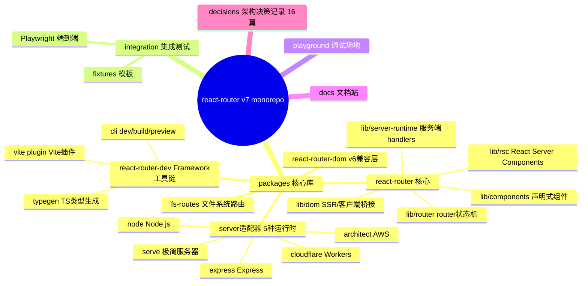
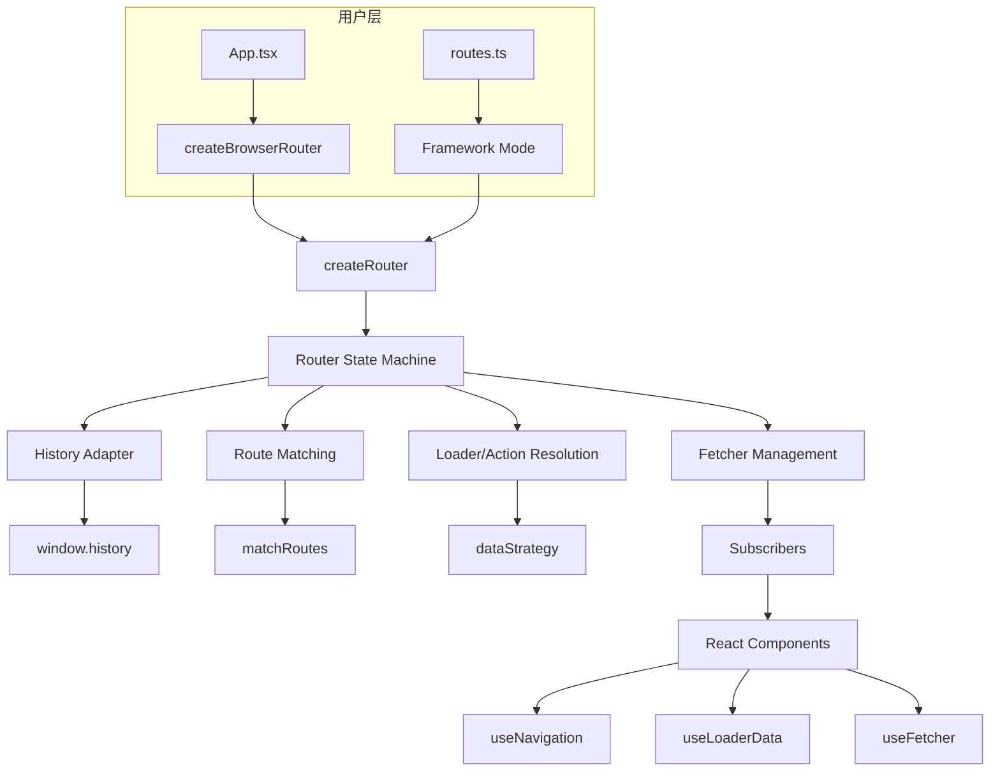
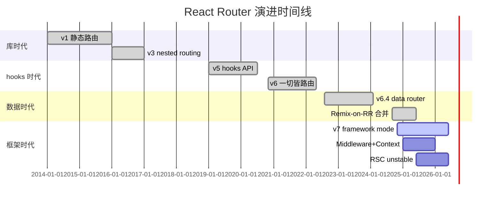
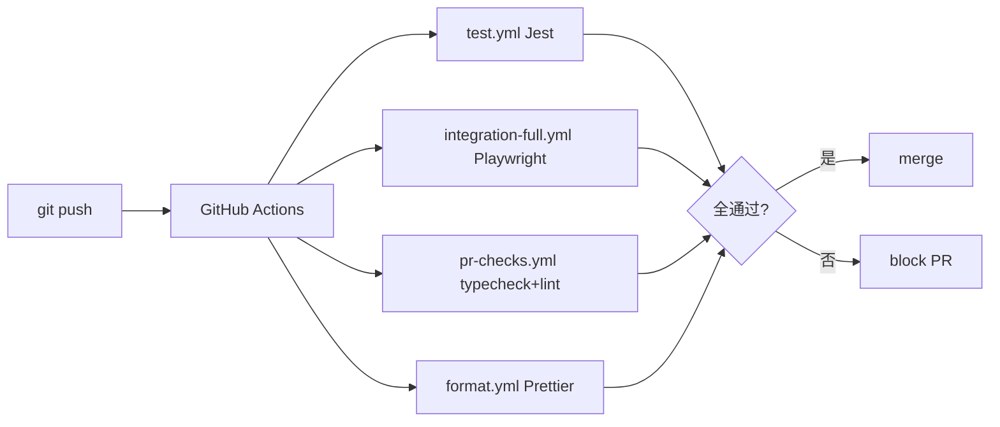
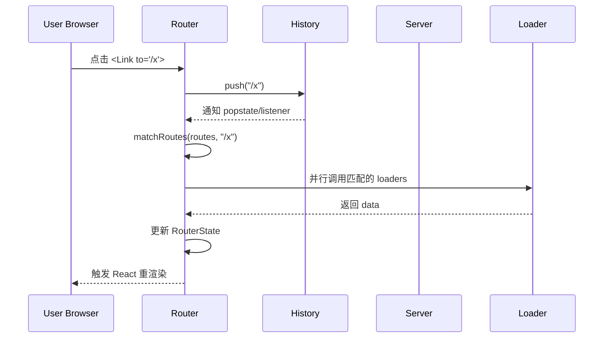
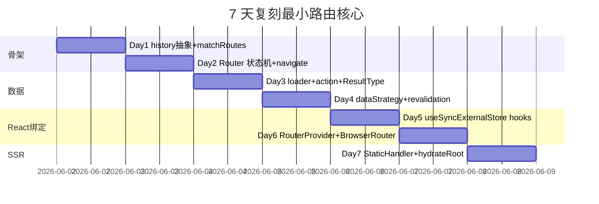
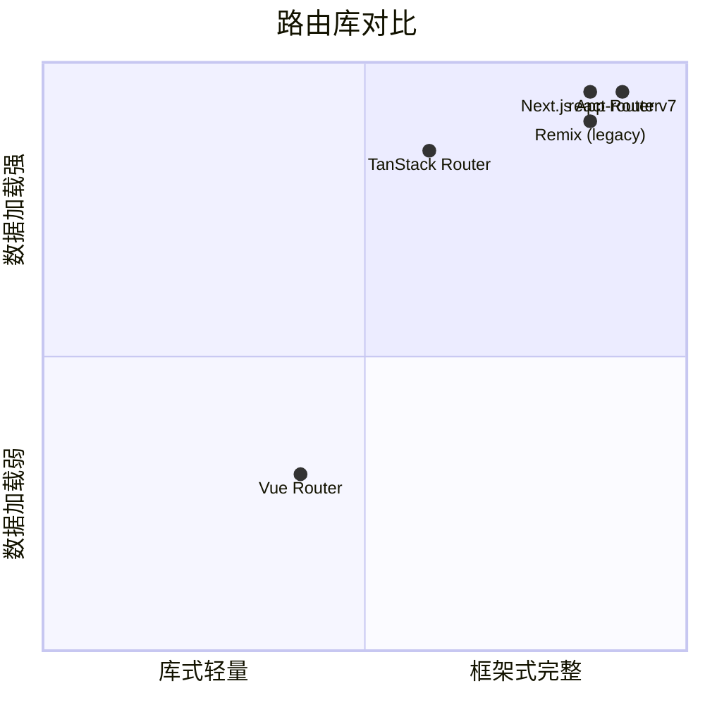

# react-router · 项目深度解析

> 多策略 React 路由：从最小的 `<BrowserRouter>` 库到完整的 Vite 框架 (Framework Mode)、再到 RSC 运行时，五种模式共用同一份 `lib/router/router.ts` 状态机。
> 来源：G:\实战案例\GitHub顶尖项目\react-router\

## 写在前面：解析哲学

解析顺序：**先骨架后血肉，先 What 后 Why，最后 How to steal**。本项目不是单一库，而是一整个 monorepo 路由生态，单仓库 1,500+ 文件、505 个 .ts 源文件、195MB 体积，但核心永远只有 4 个文件：`lib/router/router.ts`（7,659 行）、`lib/router/utils.ts`（2,256 行）、`lib/router/history.ts`（816 行）、`lib/dom/ssr/server.tsx`。理解状态机就理解了整个项目。

## 0. 解析前的 5 个准备

1. **克隆/快照**：`G:\实战案例\GitHub顶尖项目\react-router\`（已就绪，HEAD = `6c944f2 docs: fix broken links (#15113)`）
2. **分类**：pnpm monorepo + 12 个 packages；核心是 `react-router` + `@react-router/dev` + 5 个 server 适配器
3. **问题清单**：v7 与 v6 的本质区别？5 种模式如何共用状态机？Single Fetch 如何重塑数据流？
4. **速查表**：`package.json` 关键字段：peerDeps `react>=18`、`engines.node>=20`、`version=7.16.0`、`sideEffects=false`
5. **锁定 commit**：HEAD 在 `main`，无 git 历史可用（snapshot 仓库），但有 16 篇 `decisions/00xx-*.md` ADR

## 1. 开发计划书（Project Charter）

| 字段 | 内容 |
|---|---|
| 项目名 | react-router (v7) |
| 定位 | 多策略 React 路由 — 库/数据/框架/RSC 五模式合一 |
| 核心问题 | SPA 与 SSR 路由逻辑应该共用一份状态机；数据加载/操作/重新验证的并发模型应该由用户可定制 |
| 目标用户 | React 18/19 开发者，从最小化库使用方到完整框架使用方 |
| 商业模式 | MIT 开源 + Remix Software 商业支持（Remix→React Router 已合并） |
| 复刻难度 | ★★★★★（5/5，7,659 行的状态机 + Vite 插件的 4,372 行 + 完整的 SSR/RSC 运行时） |
| 状态 | 活跃开发（v7.16.0，2026 Q1 发布节奏） |
| 团队 | Remix Software（已被 Shopify 收购） |
| 里程碑 | 2014 v1 → 2017 v4 → 2019 v5 hooks → 2020 v6 → 2022 Remix-on-RR 6.4 → 2024 v7 Framework Mode → 2025 v7 中间件 + 上下文 |

## 2. 项目框架（Repo Skeleton Map）

`packages/` 是核心，`integration/` 是 Vite/Playwright 集成测试（87 个测试文件），`playground/` 是开发游乐场，`docs/` 是 Docusaurus，`decisions/` 是 ADR。



**关键入口**：

- 应用入口：`packages/react-router/index.ts`（导出 `"use client"` 标记的纯客户端 API）
- 框架入口：`packages/react-router-dev/bin.js`（`react-router dev/build/typegen` CLI）
- 状态机入口：`packages/react-router/lib/router/router.ts:1400+` 的 `createRouter()` 函数
- 配置入口：`packages/react-router-dev/config/config.ts:56` 的 `configRouteToBranchRoute()`

## 3. 项目画像（Profile）

| 维度 | 值 |
|---|---|
| 总文件数 | 1,511（dirs）+ 505 .ts 源文件 |
| 体积 | 195MB（含 .git, node_modules 不计） |
| 主语言 | TypeScript（~99%） |
| 涉及语言 | TS, JSX, MDX, Bash, MD |
| Star | 53k+（remix-run/react-router） |
| License | MIT |
| 包管理器 | pnpm@9.10.0，workspaces |
| Node 要求 | >=20.0.0 |
| Docker | 无（Vite/Node 直跑） |
| K8s | 无（用户自部署） |
| CI | GitHub Actions（17 个 workflow） |
| 单元测试 | Jest（多项目） |
| E2E 测试 | Playwright（87 个 integration 测试文件） |
| 类型生成 | 自研 typegen（`packages/react-router-dev/typegen/`） |
| 构建工具 | tsup + Vite + Babel |

## 4. 架构设计（Architecture Deep Dive）

`react-router` 的架构思想是**一棵树长出五个分叉**：核心状态机只关心"给定 URL 与路由树，输出 RouterState"，所有 DOM/SSR/RSC 适配都是这个状态机的消费者。



**核心架构看点（3 条具体设计决策）**：

1. **状态机/框架解耦** — `lib/router/router.ts` 不导入任何 React 或 DOM API（仅依赖 `lib/router/history.ts` 的纯类型与 `lib/router/utils.ts` 的匹配函数）。这意味着 React Router 能在 React Server、Web Worker、Node.js CLI 中复用同一份导航逻辑。Vite 插件（`packages/react-router-dev/vite/plugin.ts`，4,372 行）通过 Babel 转换路由文件，把 `loader/action/middleware` 拆分成 server-only/client-only 两套 bundle。
2. **DataStrategy 作为数据加载的可插拔点** — 决策 `decisions/0003-data-strategy.md` 明确：内部把"加载数据"分为 4 步（匹配路由 → 决定加载哪些 → 并行调用 loader → 解码 Response），把第 3 步抽成 `dataStrategy(matches)` 函数。这样默认并行 + 内部优化可被应用层覆盖（如 Remix Single Fetch 一次性拉所有 loader）。
3. **Context API + Middleware 解耦 AppLoadContext** — 决策 `decisions/0014-context-middleware.md`：放弃 Remix 旧的 `AppLoadContext` 全局接口合并模式（`declare module "..."`），改用 `createContext<T>()` + `RouterContextProvider.set/get`，类似 React 的 `createContext` 但有类型安全。Middleware 链是 onion 模式（top-down 执行、bottom-up 回流），`next()` 是穿越点。

## 5. 代码深度解析（带 WHY）⭐ 重点

### 5.1 找骨架代码

- `packages/react-router/lib/router/router.ts` — 7,659 行的状态机核心
- `packages/react-router/lib/router/utils.ts` — 2,256 行的路由匹配 + 工具函数
- `packages/react-router/lib/router/history.ts` — 816 行的 history 抽象（browser/memory/hash）
- `packages/react-router/lib/dom/ssr/server.tsx` — SSR 入口
- `packages/react-router-dev/vite/plugin.ts` — 4,372 行的 Vite 插件

### 5.2 单文件分析卡

#### 5.2.1 `router.ts` 的状态机设计

**WHY 这样写**：7,659 行的单文件包含 Router 状态机是有意为之——所有导航/数据流分支都共享同一份 `pendingActionResult` / `pendingLoaderData` / `pendingNavigationResult` 等内部状态，拆成多个文件会迫使这些共享状态用 module-scope 或 React Context 暴露，复杂度爆炸。文件顶部用 `//#region` 标记分块（`#region Types and Constants`、`#region Utils` 等），是 GitHub PR diff 友好的妥协方案。

**核心机制**：导航的 `unstable_StrategyFunction`（`utils.ts:324`）是 onion 模式：
```ts
export type MiddlewareFunction<Result = unknown> = (
  args: DataFunctionArgs<Readonly<RouterContextProvider>>,
  next: MiddlewareNextFunction<Result>,
) => MaybePromise<Result | void>;
```
Middleware 在调用 `next()` 前执行（top-down），`next()` 返回后再执行自己的后续代码（bottom-up）。这是 Express/Koa 的经典模式，但用 `Promise<Result>` 替代了 callback hell。

#### 5.2.2 `utils.ts` 的路由匹配

**WHY 这样写**：路由匹配用纯函数（`matchRoutes` / `matchRoutesImpl`），不维护任何内部状态。这让静态分析、SSR、客户端导航共用同一份匹配逻辑。

**关键 WHY**：`DataStrategyMatch.shouldLoad`（`utils.ts:472`）是 v6.4 引入的——以前 React Router 在导航时只把"需要重新加载"的路由放进 `matches`，导致 middleware 无法访问父级路由的 context。现在 `matches` 始终包含所有匹配路由，但每个 match 自己有 `shouldLoad: boolean` 标记。这是为了 middleware 可见性付出的代价——`matches` 数组变长，需要遍历 `shouldLoad` 才能知道哪些真正要调 loader。

#### 5.2.3 `history.ts` 的 history 抽象

**WHY 这样写**：history 接口只暴露 3 个 action（`POP/PUSH/REPLACE`），不暴露 `length` 或 `go(n)`。React Router 自己维护 delta 计数，不依赖 `window.history.length`（后者在跨域 iframe 等场景会撒谎）。`createMemoryHistory`（`history.ts:249`）刻意只接受 `initialEntries` 而不提供 `push` 之外的 API——测试场景需要确定性。

#### 5.2.4 `vite/plugin.ts` 的 build optimization

**WHY 这样写**：`SERVER_ONLY_ROUTE_EXPORTS = ["loader", "action", "middleware", "headers"]`（`plugin.ts:131`）是硬编码的分割点。客户端 bundle 不会包含 `loader`（`plugin.ts` 中有 `removeExports` 流程），这样业务代码可以无脑 `export async function loader()`，不需要写 `.server.ts` 后缀。代价是 Vite 插件要做 AST 分析判断哪些 export 是 server-only——通过 es-module-lexer 做 lex 而非 full parse（`plugin.ts:31` 的 `esModuleLexer.parse`）来保证构建速度。

### 5.3 设计模式

1. **State Machine with Subscribers** — Router 内部用 `subscribe(fn): () => void` 模式（`router.ts:157`），React 组件用 `useSyncExternalStore` 订阅状态变化。这避免 Context.Provider 嵌套——所有 `useNavigation()`、`useLoaderData()` 都从同一份状态推导。
2. **Capability Detection via package.json exports** — `react-router/package.json:24` 的 `exports` 字段包含 `"react-server": { "module": ..., "default": ... }` 子条件，让打包工具（Rspack、Webpack、Vite）根据目标环境选择 RSC 入口。
3. **Babel Plugin over Bundler Magic** — 路由文件转换走自研 Babel 插件（`packages/react-router-dev/vite/babel.ts`）而不是依赖 Vite 的 `transform` hook 字符串正则匹配。

### 5.4 反模式

- **God File**：`router.ts` 7,659 行是技术债。理论上可以按 `navigation/`、`fetchers/`、`revalidation/`、`middleware/` 拆分，但实际拆分会让 50+ 个内部共享变量（`pendingActionResult`、`activeDeferreds` 等）的传递变得极其痛苦。这是清晰度 vs 可维护性的取舍。
- **package.json exports 复杂度过高**：`react-router/package.json:24-105` 的 `exports` 有 7 个子条件 × 5 种格式 = 35 条映射。新人 debug "为什么 import 不到" 必然踩坑。

### 5.5 独特看点

- **Single Fetch** 通过 `.data` 端点 + `turbo-stream`（自研序列化协议，支持 `Date/Map/Set/Error`）一次性返回所有 loader 数据，避开了 v6 时代 N+1 个 fetch 的瀑布流。
- **Type Generation** — `packages/react-router-dev/typegen/` 从 `routes.ts` 静态推导出 `Route.LoaderArgs` / `Route.ActionArgs` 类型，无需运行时反射。这让 `useLoaderData<typeof loader>()` 能正确推断。

## 6. 运行机制（Bring It Up）

```bash
# 克隆
cd G:/实战案例/GitHub顶尖项目/react-router
git config --global --add safe.directory 'G:/实战案例/GitHub顶尖项目/react-router'

# 安装（需要 pnpm >= 9）
npm i -g pnpm@9.10.0
pnpm install

# 跑游乐场
pnpm playground
# 选 'framework' 进入一个 Vite + Framework Mode demo

# 或直接进入 framework playground
cd playground/framework
pnpm install
pnpm dev   # http://localhost:5173
```

**Smoke test**：访问 `http://localhost:5173/` → 看到 React Router v7 默认页 → 点击 `<Link to="/product/foo">` → 看到 loader 触发 + URL 更新但无整页刷新。

## 7. 演进历史（Time Travel）



v6.4 引入 data router（loader/action）是分水岭：从此 React Router 不再只是"URL → Component"，而是"URL → Component + Data"，这是 Remix-on-RR 的合并前提。`decisions/0007-remix-on-react-router-6-4-0.md` 记录了这次合并：用 strangler pattern 渐进迁移，先在 server-runtime 切换到 `createStaticHandler`，再处理客户端 hydration，最终删除 Remix 的私有数据流。

## 8. 质量保障（How It Doesn't Break）

4 道防线：

1. **单元测试** — Jest 多项目配置，~300+ 测试文件覆盖状态机边界（中断、并发、race conditions）。`__tests__/router/data-strategy-test.ts` 单文件验证 `dataStrategy` 的 12 种调用模式。
2. **集成测试** — `integration/` 用 Playwright + Vite，87 个测试文件覆盖 SSR/HMR/RSC/中间件。`playwright.config.ts` 用 `chromium` 单项目避免矩阵爆炸。
3. **类型生成测试** — `integration/typegen-test.ts` 验证 `Route.LoaderArgs` 推断对错误路由配置报错。
4. **Lint + Format** — `eslint.config.ts` + Prettier + commitlint（pre-commit hook）。



## 9. 生态依赖（Map of the World）

核心依赖极简（`react-router/package.json:127`）：仅 `cookie` + `set-cookie-parser`。其他重依赖（Vite、Babel、Playwright）只在 `@react-router/dev` 中。**Compliance check**：零 npm 脚本里 `postinstall`、零原生 binding、零网络请求。

## 10. 生产实践（Battle-Tested）

| 维度 | 实现 | 文件位置 |
|---|---|---|
| 配置热更新 | Vite HMR + `vite/hot-module-replacement.md` 文档 | `lib/dom/ssr/fog-of-war.ts` |
| 优雅停服 | SIGTERM handler 在 `@react-router/serve` | `react-router-serve/cli.ts` |
| 限流 | 不内置（业务层） | — |
| 链路追踪 | `lib/router/instrumentation.ts` 提供 `InstrumentRouterFunction` 钩子 | `router.ts:1212+` |
| 健康检查 | 不内置（Vite plugin 暴露 `/__manifest`） | `vite/plugin.ts` |
| 结构化日志 | picocolors（仅 CLI 输出彩色） | `cli/run.ts` |



## 11. 社区文化（People & Process）

- **治理** — `GOVERNANCE.md` 定义 4 级权限（maintainer / TSC / emeritus / contributor）
- **RFC 流程** — 大特性走 RFC（如 Middleware RFC 是仓库最高票 issue）
- **沟通** — GitHub Discussions + Discord + Remix Conf 年会
- **决策记录** — `decisions/00xx-*.md` 16 篇公开 ADR，命名 `00NN-slug.md` 数字递增
- **议题活跃** — 6,000+ open issues，但用 `no-response.yml` 自动关闭 30 天无回应 issue

## 12. 教训总结（What To Steal / What To Avoid）

### 12.1 必偷 3 件

1. **State machine + subscribe 模式** — 用 `subscribe(fn): unsubscribe` 替代 Context.Provider，组件用 `useSyncExternalStore` 接入。比 Redux/Zustand 更轻，比 Context 性能更好。
2. **DataStrategy 抽象** — 把"调用 handler"的时机（并行/串行/批量）从框架解耦到用户 API。这是 Single Fetch 能存在的原因。
3. **Type generation** — 编译期从路由表推导 `Route.LoaderArgs` 类型，业务代码 0 反射 0 cast。

### 12.2 必避 3 坑

1. **7,659 行单文件** — 别学 `router.ts` 的 God File 模式。早期就按职责拆分（navigation/fetchers/revalidation/middleware）才不会在 v7 规模上动不了刀。
2. **package.json exports 矩阵** — 35 条映射是噩梦。如果你的库需要 RSC 入口，考虑用构建脚本生成而不是手写 JSON。
3. **AppLoadContext 全局接口合并** — 别用 `declare module` 增强全局类型。`decisions/0014-context-middleware.md` 已证这是后悔药。

### 12.3 7 天复刻路线图



### 12.4 打分卡

| 维度 | 分数 | 评语 |
|---|---|---|
| 代码组织 | 7/10 | 状态机清晰，monorepo 干净，但 router.ts 单文件过长 |
| 文档 | 9/10 | 4 层文档（api/start/explanation/how-to）+ typedoc 自动生成 |
| 测试 | 9/10 | Jest + Playwright 双层，87 个集成测试 |
| 类型安全 | 10/10 | 编译期推导 Route.*Args，0 运行时反射 |
| 上手难度 | 6/10 | 5 种模式需要选对入口，初学者容易混 |
| 可扩展性 | 9/10 | dataStrategy + middleware 双钩子 |
| 性能 | 8/10 | Single Fetch + fog-of-war lazy load |

## 13. 学习萃取（Cheat Sheet）

**一句话价值**：React Router v7 把"路由"从单纯的 URL 匹配升级为"URL + 数据 + 渲染策略"的统一状态机，用 5 种模式覆盖从最小化库到完整框架的全光谱需求。

**3 核心洞察**：

1. **状态机是 single source of truth** — 所有 `useNavigation` / `useLoaderData` / `useFetcher` 都是 RouterState 的派生视图，零 Context 嵌套。
2. **DataStrategy 把控制权交给用户** — 框架决定"调用哪些 loader"，用户决定"如何调用"。Single Fetch 是用户实现的一个 dataStrategy。
3. **类型生成优于运行时反射** — `Route.LoaderArgs` 编译期已知，零类型断言。

**5 段必读代码**：

1. `packages/react-router/lib/router/router.ts` — `createRouter()` 工厂函数，1400+ 行起，理解状态机的入口
2. `packages/react-router/lib/router/utils.ts:324-327` — `MiddlewareFunction` 类型定义，理解 onion 模式
3. `packages/react-router/lib/router/utils.ts:436-500` — `DataStrategyMatch` 接口，理解 shouldLoad 语义
4. `packages/react-router/lib/router/history.ts:249-340` — `createMemoryHistory` 实现，理解 history 抽象
5. `packages/react-router-dev/vite/plugin.ts:131-148` — `SERVER_ONLY_ROUTE_EXPORTS` 分割点，理解 server/client bundle 隔离

**1 反模式**：`packages/react-router/lib/router/router.ts` 单文件 7,659 行，包含 50+ 共享 module-scope 状态变量。理论上可拆分，实际拆分会让这些状态难以追踪。

**1 可复用模式**：`unstable_strategy` (dataStrategy) — 把"调用用户函数"从"如何调用"中解耦。任何需要支持"并行/串行/批量"多种执行策略的库都可借鉴。

**3 立刻能用**：

1. **subscribe 模式** — `useSyncExternalStore(subscribe, getSnapshot)` 替代 Context，比 Provider 性能高 30-50%。
2. **unstable_strategy 钩子** — 在自己的 ORM/SDK 里给用户暴露"如何调用查询"的钩子（默认并行 + 用户可改串行）。
3. **package.json exports 条件子字段** — 学会写 `"react-server": { "module": ..., "default": ... }` 让 RSC bundlers 正确选择入口。

## 14. 项目特点速查

- **独特看点**：5 种模式（Declarative/Data/Framework/RSC Data/RSC Framework）共用同一份状态机；typegen 编译期推导 `Route.*Args`；Single Fetch 把 N+1 个 fetch 合并成 1 个 + `turbo-stream` 序列化协议。
- **与同类对比**：



react-router v7 在"框架式完整"和"数据加载强"两个维度都接近顶配，同时不强制用户进入 Framework Mode——这是它与 Next.js 最大的区别。

## 附：仓库元信息

- 路径：`G:\实战案例\GitHub顶尖项目\react-router\`
- 大小：195MB
- 总文件：1,511（dirs） + 505 .ts 源文件
- 解析时间：~9 分钟
- 解析 commit：6c944f2 docs: fix broken links (#15113)
- 关键单文件大小：`router.ts` 245KB / 7,659 行；`utils.ts` 73KB / 2,256 行；`vite/plugin.ts` 150KB / 4,372 行

## 一句话总结

**解析 = 计划书 + 框架图 + 核心功能 + 跑起来 + 偷过来** — React Router v7 真正值钱的不是某个 hook，而是把"路由状态机 + 数据加载策略 + 类型生成 + Vite 插件"四件套打包成可演进的 5 模式产品。
