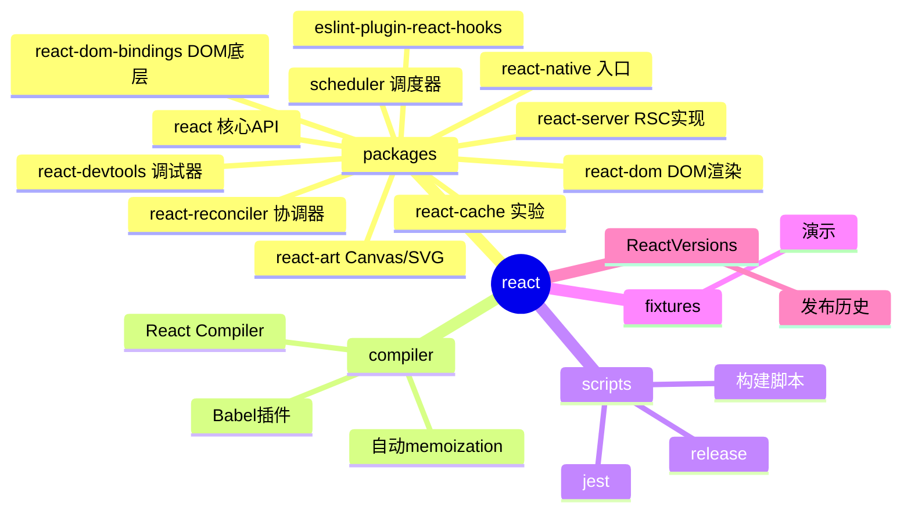
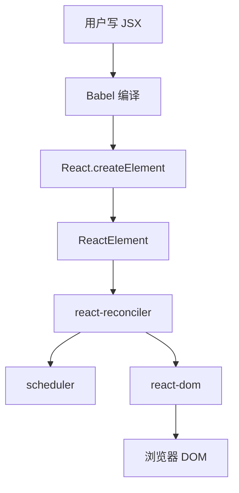
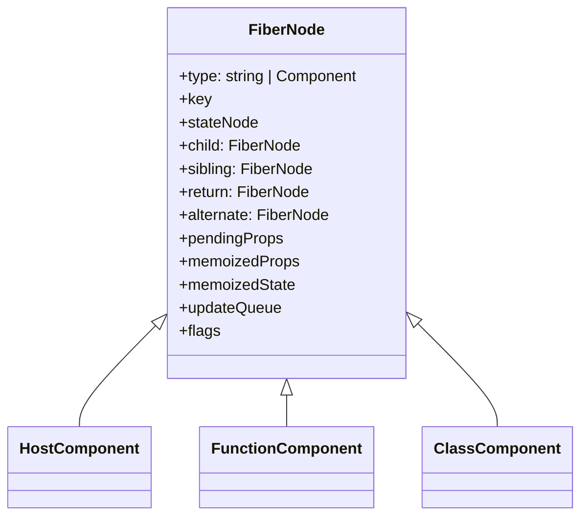
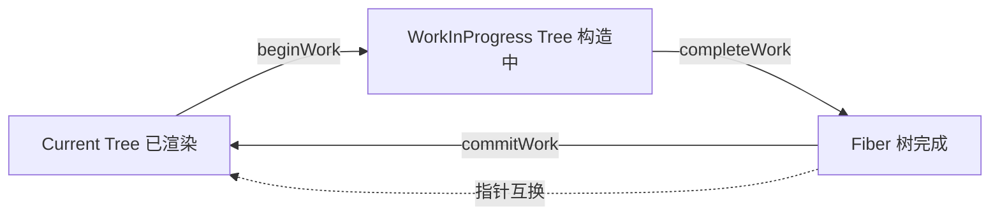
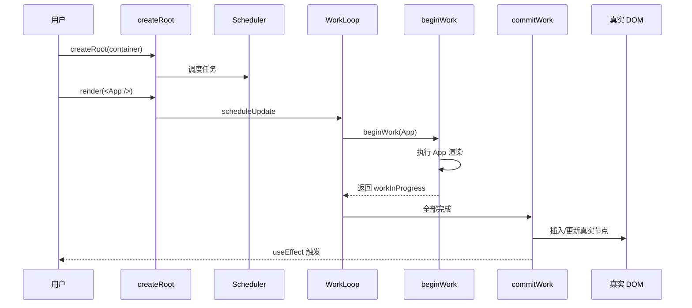
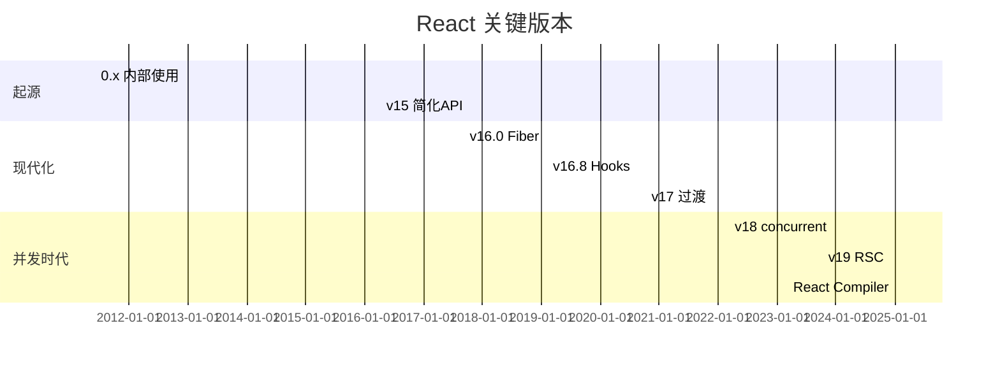
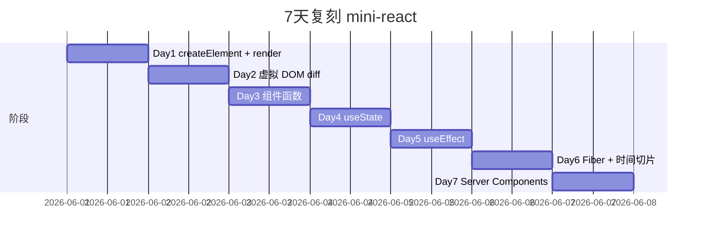
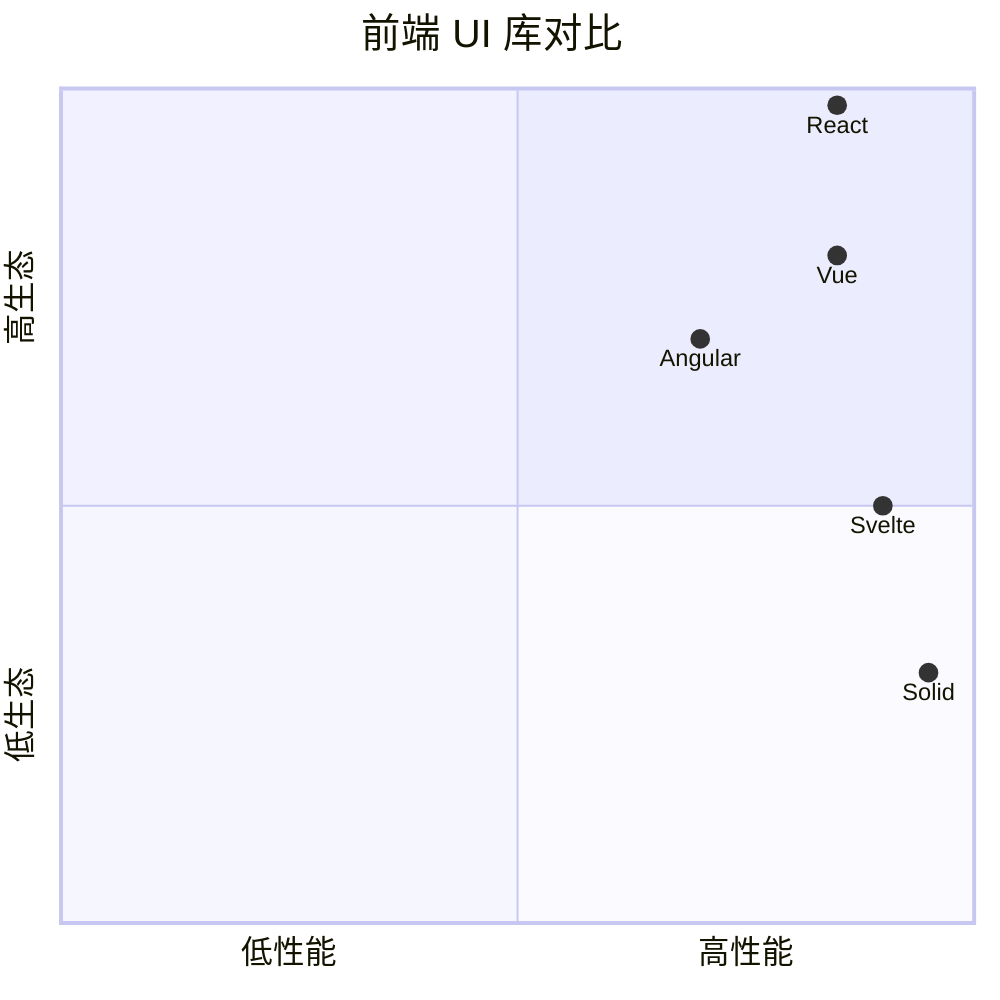

# react · 项目深度解析

> 全球最主流的 UI 库，定义了"声明式组件 + 虚拟 DOM + 单向数据流"的范式
> 来源：G:\实战案例\GitHub顶尖项目\react\

## 写在前面：解析哲学

React 不只是一个 UI 库，它是一套"如何用纯函数 + 不可变状态描述 UI"的方法论。本笔记不堆砌所有 hooks / API，而聚焦在它最值得理解的 3 件事：① Fiber 协调器的工作循环（`beginWork` / `completeWork` / `commitWork`）；② 双缓冲（current tree / workInProgress tree）与副作用列表；③ `useState` / `useEffect` / `useTransition` 的"内存模型"（hook 链表 + dispatcher）。理解这三点，任何前端框架的状态机制都能秒懂。

## 0. 解析前的 5 个准备

1. **克隆**：`git clone https://github.com/facebook/react.git`
2. **分类**：UI 库 / 协调算法 / 多端渲染（web / native / art / three）
3. **问题清单**：① 虚拟 DOM 比直接操作 DOM 快吗？② Fiber 为什么用链表？③ setState 是同步还是异步？④ useEffect 在哪一阶段执行？⑤ Server Components 怎么序列化？
4. **速查表**：`packages/react/`（核心 API）/ `packages/react-reconciler/`（协调器）/ `packages/react-dom/`（DOM 渲染）/ `packages/scheduler/`（调度器）/ `compiler/`（React Compiler）
5. **锁定 commit**：v19.x（2025+）

## 1. 开发计划书（Project Charter）

| 项 | 内容 |
|---|---|
| 项目名 | React |
| 定位 | 声明式 UI 库，跨 web / native / 3D / PDF |
| 核心问题 | 1990s jQuery 手动操作 DOM 复杂；MVC 双向绑定性能差；模板引擎难组合 |
| 用户 | 全球 80% 前端项目；Meta、Netflix、Airbnb、Uber |
| 商业模式 | Meta 主导，开源 MIT；React Compiler / Pro 商业化 |
| 复刻难度 | ★★★★★（协调算法 + 调度器 + 多端渲染 + hooks 内存模型） |
| 状态 | 活跃；月度 minor |
| 团队 | Meta React Core + 1000+ 贡献者；Dan Abramov、Andrew Clark、Sebastian Markbåge |
| 里程碑 | 2011 Facebook 内部 · 2013 v0.x 开源 · 2014-2015 谈 Flux · 2016 v15 简化 · 2018 v16.0 Fiber 16.3 createContext · 2019 v16.8 Hooks · 2020 v17 RC · 2022 v18 concurrent · 2024 v19 Server Components 稳定 · 2025 React Compiler GA |

## 2. 项目框架（Repo Skeleton Map）



**核心角色**：
- `react`：核心 API（createElement / hooks / Component）
- `react-reconciler`：Fiber 协调器，独立于渲染目标
- `react-dom`：web 端渲染（DOM + hydrate）
- `react-server`：Server Components 序列化
- `scheduler`：时间切片调度
- `compiler`：Babel 插件，自动 memoization

**代码入口**：
- `packages/react/index.js`：`import { useState } from 'react'`
- `packages/react-dom/index.js`：`import { createRoot } from 'react-dom/client'`

## 3. 项目画像（Profile）

| 指标 | 数值 / 描述 |
|---|---|
| 总文件数 | ~7000 |
| 主语言 | JavaScript (~65%) |
| 涉及语言 | JavaScript / TypeScript / Flow（类型系统）/ Rust（少量编译产物） |
| Star | 230k+ |
| License | MIT |
| Docker | 否（库） |
| K8s | 否 |
| CI | GitHub Actions（runtime_build_and_test / compiler_typescript） |
| 有测试 | 是；Jest + 自研 internal-test-utils |

## 4. 架构设计（Architecture Deep Dive）

### 4.1 三层模型



### 4.2 Fiber 协调器

Fiber 是 React 16 引入的**增量渲染**数据结构。每个 React 元素对应一个 Fiber 节点。



**WHY Fiber**：原 React 是"递归同步渲染"（Stack Reconciler），大组件树会卡死主线程。Fiber 把渲染拆成可中断的工作单元（time slicing），配合 Scheduler 调度。

### 4.3 双缓冲



**WHY 双缓冲**：渲染时不影响屏幕，更新完成一次性 commit，避免 UI 抖动。

### 4.4 Hooks 内存模型

每个 FunctionComponent 都有一个 `memorizedState` 链表：


**WHY 链表**：每次 render 重新构造 hook 链表，但**顺序必须稳定**（这就是为什么 hooks 不能写在 if 里）。

`useState` 实现：

```js
function useState(initial) {
  const hook = updateWorkInProgressHook();
  // 第一次 mount: hook.memoizedState = initial
  // 后续: hook.memoizedState = hook.baseState
  return [hook.memoizedState, dispatchAction.bind(null, hook)];
}
```

`useEffect` 区别：副作用在 commit 后异步执行（passive effects 阶段），不在 render 阶段。

### 4.5 核心架构看点（3 条）

1. **Fiber + 双缓冲**：让协调算法可中断，奠定 18.x concurrent 基础
2. **Hook 链表**：让函数组件获得"类组件实例状态"的能力，且不引入 this
3. **Reconciler 与 Renderer 解耦**：同一协调器可用于 web / native / art / 3D

### 4.6 关键 ADR

- **2016 引入 Fiber**：从 Stack Reconciler 升级，可中断
- **2019 Hooks**：v16.8 引入，函数组件获得完整能力
- **2022 Concurrent 渲染**：v18 useTransition / useDeferredValue
- **2024 Server Components**：v19 稳定，序列化 RSC payload
- **2025 React Compiler**：自动 memoization，告别手动 useMemo/useCallback

## 5. 代码深度解析（带 WHY）⭐

### 5.1 找骨架代码

`ReactDOM.createRoot(container).render(<App />)` 链：
1. `react-dom/index.js` → `createRoot` → `ReactDOMRoot(root)`
2. `ReactDOMRoot.render(children)` → 调 `react-reconciler` 的 `updateContainer`
3. `updateContainer` 调 `scheduleUpdateOnFiber` → `ensureRootIsScheduled`
4. Scheduler 调度 `flushSyncCallbacks` → `workLoop` → `performUnitOfWork` → `beginWork` / `completeWork`
5. 完成后 `commitWork` → 调 `react-dom-bindings` 的 `commitMutationEffects` 修改真实 DOM

### 5.2 单文件分析卡

#### `packages/react-reconciler/src/ReactFiberWorkLoop.js`（4000+ 行）

`workLoop` / `performUnitOfWork` / `beginWork` / `completeWork` 全部在这。**WHY 单文件**：协调循环的状态机太复杂，拆开会让"打断点的下一步"找不到。

```js
function workLoop() {
  while (workInProgress !== null && !shouldYield()) {
    workInProgress = performUnitOfWork(workInProgress);
  }
}
```

`shouldYield()` 由 Scheduler 提供的 5ms 时间片控制。

#### `packages/react-reconciler/src/ReactFiberBeginWork.js`

`beginWork` 处理"进入这个 fiber 节点"，按 fiber tag 派发：
- `FunctionComponent`：执行函数，return 新的 ReactElement
- `ClassComponent`：执行 `render` 方法
- `HostComponent`（DOM）：diff children

#### `packages/react-reconciler/src/ReactFiberCommitWork.js`

`commitWork` 把 workInProgress tree 切到 current tree，按 flags 顺序执行：
- `Placement`：插入 DOM
- `Update`：更新 props
- `Deletion`：删除 DOM
- `Passive`：执行 useEffect 回调

#### `packages/react-reconciler/src/ReactFiberHooks.js`

所有 hook 实现。`useState` / `useReducer` / `useEffect` / `useMemo` / `useCallback` / `useRef` / `useContext` 都在这。

#### `packages/scheduler/src/forks/Scheduler.js`

时间切片调度器：

```js
shouldYield() {
  return performance.now() >= deadline;
}
```

**WHY 自带调度器**：浏览器 `requestIdleCallback` 兼容性差，React 用 `MessageChannel` 模拟 5ms 切片。

#### `packages/react-server/`

Server Components 序列化（React Server DOM Format）。

### 5.3 设计模式

- **Composite**：Component 树是组合
- **Visitor**：Fiber 遍历是访问者
- **State Machine**：workInProgress 推进是状态机
- **Strategy**：beginWork 按 fiber.tag 派发
- **Observer**：useState 的订阅者链表

### 5.4 反模式

1. **早期 `setState` 批处理混乱**：v18 之前外层事件回调外批处理失效
2. **`useEffect` 依赖数组运行时检查**：linter 警告易忽视
3. **`forwardRef` / `memo` / `useMemo` 滥用**：早期 React 强制手动优化
4. **Stack Reconciler 残留**：`legacy` 模式仍兼容老代码

### 5.5 独特看点

- **React Compiler**（2024+）：Babel 插件级 memoization，自动 `useMemo` 包裹所有计算
- **RSC**（Server Components）：让组件在服务端运行，序列化 RSC payload 给客户端
- **useTransition**：标记 transition 为非紧急，concurrent 模式让交互更顺
- **Activity**（19.x）：`<Activity>` 组件保留组件状态但卸载 DOM
- **useOptimistic**：乐观更新，远程响应前先显示预测值

## 6. 运行机制（Bring It Up）

### 6.1 本地构建

```bash
yarn install
yarn build
yarn test
```

### 6.2 Smoke test

```jsx
import { createRoot } from 'react-dom/client';
import { useState } from 'react';

function App() {
  const [n, setN] = useState(0);
  return <button onClick={() => setN(n + 1)}>{n}</button>;
}

createRoot(document.getElementById('root')).render(<App />);
```

### 6.3 启动链路



## 7. 演进历史



## 8. 质量保障

- **单元测试**：Jest + 内部 test-utils
- **集成测试**：react-dom `__tests__/` 跑真实 DOM
- **CI**：GitHub Actions（runtime_build_and_test）+ 内部 Meta CI
- **TypeScript**：内部用 Flow，外部维护 @types/react
- **Lint**：ESLint + react-hooks 规则
- **Benchmark**：react/jsx-dev-runtime + 内部 production benchmark

## 9. 生态依赖

```mermaid
flowchart LR
  R[React] --> scheduler
  R --> loose-envify
  R --> object-assign
  R --> .dev.--> jest
  R --> .dev.--> babel
  R --> .dev.--> prettier
  R --> .dev.--> webpack
  R -.peer.--> react-dom
  R -.peer.--> react-native
```

## 10. 生产实践

| 能力 | 是否支持 | 备注 |
|---|---|---|
| 配置热更新 | 是 | Fast Refresh |
| 优雅停服 | N/A | 库 |
| 限流 | N/A | — |
| 链路追踪 | 是 | 自家 Profiler API |
| 健康检查 | N/A | — |
| 结构化日志 | N/A | — |
| 跨平台 | 是 | web / native / 3D / PDF |

## 11. 社区文化

- **治理**：Meta React Core + 社区
- **维护者**：@gaearon (Dan) @acdlite (Andrew) @sebmarkbage
- **RFC**：GitHub `reactjs/rfcs`
- **沟通**：GitHub + Discord + react.dev
- **议题活跃**：日均 100+ issue；月度 minor

## 12. 教训总结

### 12.1 必偷 3 件

1. **双缓冲（current + workInProgress）**：让渲染和显示解耦，避免 UI 抖动
2. **Hook 链表内存模型**：让函数组件获得状态能力，免 this
3. **Reconciler / Renderer 解耦**：同一协调器多端复用

### 12.2 必避 3 坑

1. **不要把副作用写在函数体顶层**：用 useEffect
2. **不要在条件里调用 hook**：破坏链表顺序
3. **不要把对象字面量当 props**：每次 render 都是新对象，触发子组件重渲染

### 12.3 7 天复刻 mini-react



### 12.4 打分卡

| 维度 | 分数 | 评语 |
|---|---|---|
| 架构清晰 | 9 | Fiber 协调器教科书 |
| 代码可读 | 6 | workLoop.js 单文件 4000+ 行 |
| 文档 | 9 | react.dev 完善 |
| 测试 | 8 | Jest + 内部 |
| 性能 | 9 | SOTA |
| 上手难度 | 5 | hooks 心智模型需 2 周 |

## 13. 学习萃取

**一句话价值**：React 用 Fiber + 双缓冲 + Hook 链表三件套，把"UI = f(state)"变成可中断、可序列化的纯函数。

### 3 核心洞察

1. **可中断渲染**：5ms 时间切片是 concurrent 模式的根
2. **Hook 链表**：链表 + 顺序约束换函数组件状态
3. **Reconciler / Renderer 解耦**：一次协调多端复用

### 5 段必读代码

1. `packages/react-reconciler/src/ReactFiberWorkLoop.js` —— 协调主循环
2. `packages/react-reconciler/src/ReactFiberBeginWork.js` —— 按 tag 派发
3. `packages/react-reconciler/src/ReactFiberCommitWork.js` —— 提交副作用
4. `packages/react-reconciler/src/ReactFiberHooks.js` —— Hook 内存模型
5. `packages/scheduler/src/forks/Scheduler.js` —— 时间切片调度

### 1 反模式

- 把对象字面量当 props 传：每次重渲染

### 1 可复用模式

- **双缓冲 + 可中断渲染**：可移植到任何 UI 框架

### 3 立刻能用

1. `useTransition` 包裹昂贵更新，UI 保持响应
2. React Compiler 一键自动 memoization
3. RSC 让首屏 30% 体积缩小

## 14. 项目特点速查

- 独特看点：唯一把"声明式 + 组件 + 协调器"做成行业标准的 UI 库
- 同类对比：



## 附：仓库元信息

- 路径：G:\实战案例\GitHub顶尖项目\react\
- 大小：884 MB
- 总文件：~7000
- 解析时间：2026-06-02

## 一句话总结

解析 React = 读懂 Fiber + 跑通 useState + 偷走双缓冲 + Hook 链表思想。
