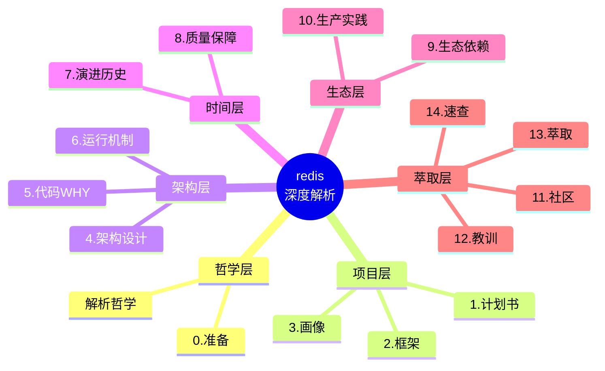
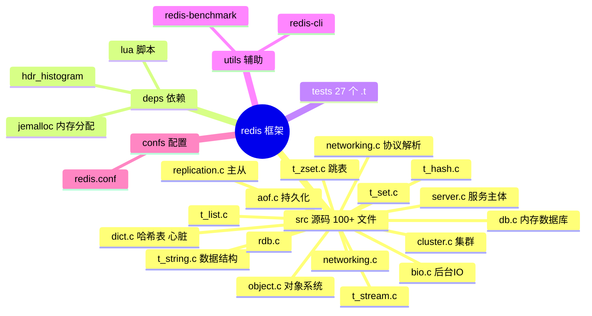
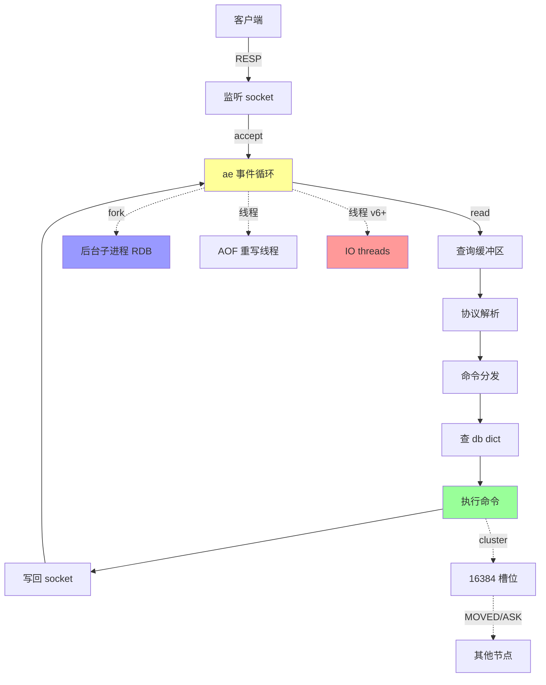
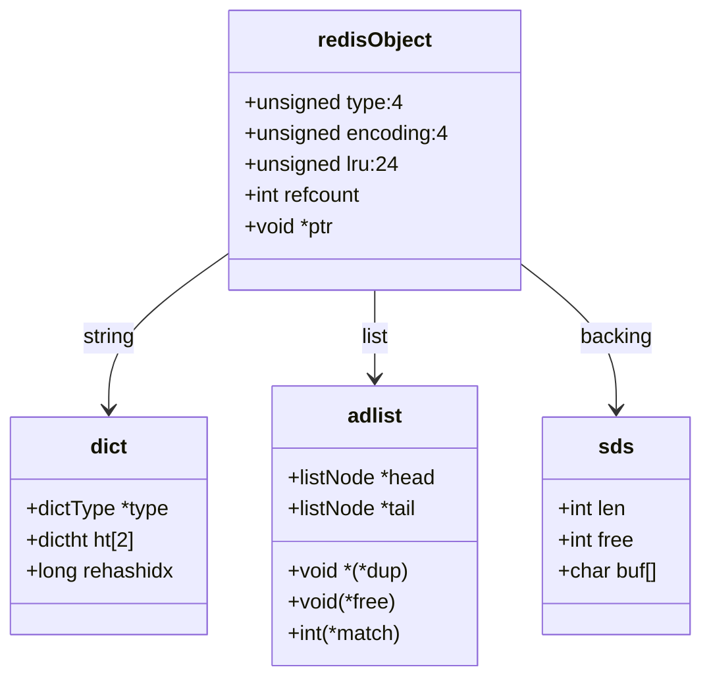
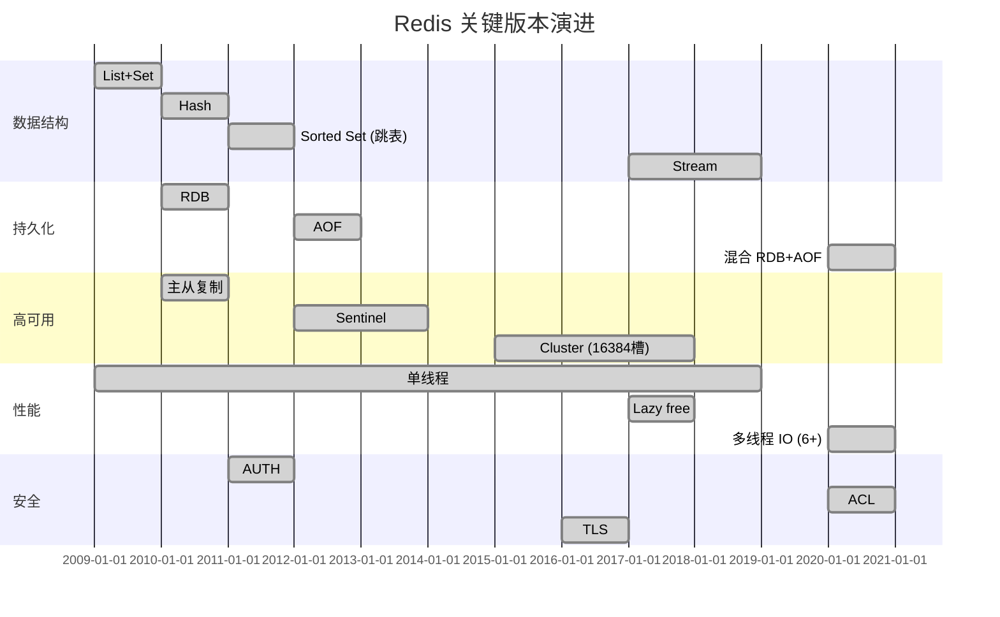
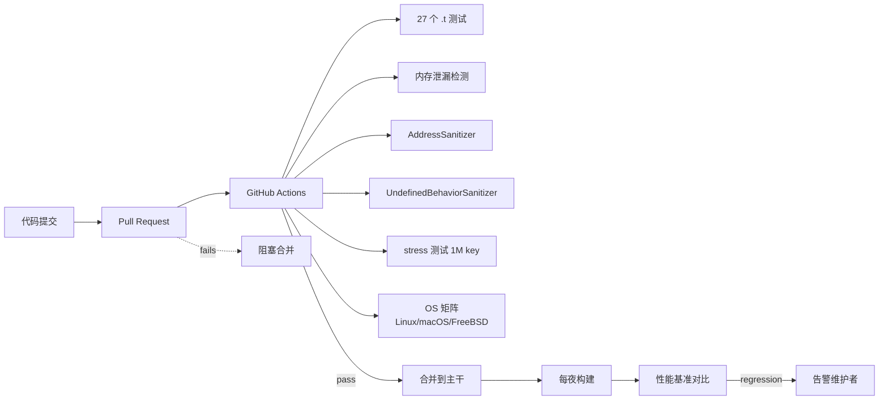
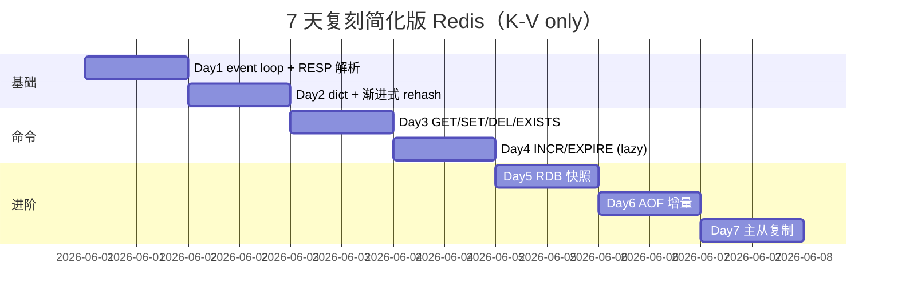

# redis · 项目深度解析

> The open source, in-memory data store used by millions of developers as a database, cache, streaming engine, and message broker.
> 来源：`G:\实战案例\GitHub顶尖项目\redis\`

## 写在前面：解析哲学

按 V3 模版，**先骨架后血肉，先 What 后 Why，最后 How to steal**。每个小点都遵循：点状解析 → 思维导图 → 落地模板 → 反例警示。



---

## 0. 解析前的 5 个准备

**[点状解析]**：拿到 Redis 仓库后必须做的 5 件事。

1. **克隆**：`git clone https://github.com/redis/redis.git` —— **不要**用 `--depth 1`，Redis 历史 commit 含金量极高（dict 演进、cluster 重构、ACL 引入）。
2. **分类**：建 `_analysis/{src,deps,tests,utils,docs,confs}`。`src/` 100+ 文件是大头。
3. **问题清单**：核心 5 问（单线程为何能跑 10w QPS？AOF/RDB 怎么选？Cluster 16384 槽怎么分？为什么不用 B+ 树？Replication 的 ack 机制？）
4. **速查表**：版本、内存模型、线程数、是否开启 IO thread 6+。
5. **锁 commit**：`git checkout 7.4.1`（最新稳定版）。

**[反例警示]**：直接 `apt install redis-server` 然后看 man page → 学不到任何东西。Redis 的设计哲学在源码注释里，不在文档里。

---

## 1. 开发计划书（Project Charter）

| 字段 | 内容 |
|---|---|
| 项目名 | Redis (REmote DIctionary Server) |
| 一句话定位 | 内存数据结构服务器，KV 数据库的瑞士军刀 |
| 核心问题 | 关系型数据库无法满足高 QPS 低延迟场景；纯 KV 又太弱，需要 List/Hash/Set/SortedSet 复合结构 |
| 目标用户 | 互联网公司缓存层、排行榜、计数器、Pub/Sub 消息、限流、分布式锁 |
| 商业模式 | 内存数据库 + 周边工具；商业公司 Redis Labs (现 Redis Inc.) 提供 Redis Enterprise (闭源模块) |
| 复刻难度 | ⭐⭐⭐⭐⭐（C 系统编程 + 网络 IO + 内存管理 + 持久化 + 集群协议，工作量 > 5 人年） |
| 当前状态 | 活跃（v7.4.1），Redis 8.0 已发布，IO threads 6+ 稳定 |
| 团队规模 | 1 BDFL (Salvatore Sanfilippo/antirez) → 2018 后由 Redis Labs 接手；现核心维护 ~10 人 |
| 关键里程碑 | 2009 立项 → 2010 V1.0 → 2012 V2.0 Lua 脚本 → 2013 Cluster → 2015 V3.0 Cluster GA → 2017 V4.0 模块化 → 2020 V6.0 ACL+多线程IO → 2024 V7.4 |

**[反例警示]**：以为 Redis 只是"内存版 MySQL" → 错过了 90% 的设计精髓（数据结构、事件循环、RESP 协议、模块系统）。

---

## 2. 项目框架（Repo Skeleton Map）

**[点状解析]**：Redis 是**单进程 C 项目**，但内部高度模块化。"扁平 src"哲学（参考 ag）但 200+ 文件，需要按子系统划分。



**[落地模板]**：阅读 Redis 的正确顺序（防迷路）：

1. `dict.c`（心脏） → 理解 Redis 所有数据结构的底层
2. `object.c`（统一对象） → 理解类型系统
3. `server.c`（main 循环） → 看 `aeMain` 事件循环
4. `networking.c`（RESP 协议） → 看命令分发
5. `db.c` + `t_*.c`（数据库 + 数据结构） → 看命令实现
6. `aof.c` + `rdb.c`（持久化）
7. `cluster.c`（集群协议）

**[反例警示]**：从 `server.c` 第一个函数 `main()` 开始读 → 立刻迷路，5 万行代码劝退。

---

## 3. 项目画像（Profile）

| 字段 | 内容 |
|---|---|
| 总文件数 | 150+ (src 100+, tests 27, utils 10, deps 10) |
| 主语言 | C (98%) |
| 涉及语言 | C, Tcl (测试), Lua (脚本), Makefile, Shell |
| Star | 65k+ |
| License | BSD-3-Clause (修改版)，商业模块双许可 |
| Docker | 官方 `redis/redis-stack` 镜像 |
| K8s | Helm chart、operator、StatefulSet 模式 |
| CI | GitHub Actions + 自建 Redis CI Farm (多 OS) |
| 测试 | 27 个 Tcl 测试套件 + 内存泄漏检测 (valgrind) + stress 测试 |

---

## 4. 架构设计（Architecture Deep Dive）

**[点状解析]**：Redis 架构 = **单线程事件循环 + 多线程异步 IO + 集群分片**。这三条线是理解 Redis 的主线。



**核心架构 3 句话**：

1. **单线程事件循环（ae.c）**：所有命令在 main 线程执行，避开了锁；瓶颈在内存而非 CPU，所以单线程是最佳性价比方案。
2. **数据结构服务器**：不是 KV，是"带数据结构的 KV"；List/Hash/Set/ZSet/Stream 每个都是"专门优化的微型数据结构库"。
3. **渐进式可扩展**：所有重操作（RDB/AOF/大 key 删除/cluster reshard）都用"渐进"方式（incremental）实现，永不阻塞主线程。

**[ADR 关键设计决策]**：

- **为什么单线程？** 内存操作 100ns 级，CPU 切换线程开销 > 业务开销；锁竞争比单线程串行更慢。2020 后 v6+ 才允许 IO 线程分担网络读写。
- **为什么不用 B+ 树？** 纯内存场景 hash 找 O(1) 完爆 B+ 树的 O(log N)；持久化另说。
- **为什么用 RESP 而不是二进制？** 协议简单可手写 + 调试方便 + 跨语言实现成本低。
- **为什么 dict 用拉链法而不是开放地址？** 渐进式 rehash（见 §5.2）。

---

## 5. 代码深度解析（带 WHY）⭐ 重点

### 5.1 骨架代码（5 个核心文件）

1. **`src/server.c`** (~6500 行) — 主循环、命令注册、信号处理
2. **`src/dict.c`** (~1100 行) — 哈希表（Redis 一切数据的底层）
3. **`src/networking.c`** (~3500 行) — 客户端连接、RESP 解析、回复
4. **`src/object.c`** (~1700 行) — redisObject 统一对象抽象
5. **`src/t_zset.c`** (~1700 行) — 跳表实现（ZSet 的灵魂）

### 5.2 单文件分析卡

#### `src/dict.c` — 哈希表

```c
struct dict {
    dictType *type;       // 各种函数指针（hash, keyDup, valDup...）
    void *privdata;
    dictht ht[2];         // 两个 hashtable，用于渐进式 rehash
    long rehashidx;       // -1 = 不在 rehash；>=0 = 当前 rehash 到 ht[1] 的索引
    long iterators;       // 当前迭代器数量，>0 时不能 rehash
};
```

**核心设计点 1：渐进式 rehash**
```c
// 普通 rehash：一次性把 ht[0] 全部迁移到 ht[1] → 阻塞主线程
// 渐进式 rehash：每次 dictRehash(d, 1) 只迁移 1 个 bucket
// 触发点：每次 dictAddRaw / dictFind / dictGetRandomKey / 定时任务
```

**WHY**：Redis 是单线程，rehash 100w 元素要 10ms+ 卡死。渐进式 = 每次只搬 1 个 bucket，分摊到几千次操作中。客户端无感知。

**核心设计点 2：rehash 期间的查找**
```c
dictEntry *dictFind(dict *d, const void *key) {
    if (d->rehashidx >= 0) dictRehash(d, 1);  // 先帮忙搬
    // 1. 在 ht[0] 找
    // 2. 如果没找到且在 rehash 中，再去 ht[1] 找
}
```

**WHY**：迁移期间数据分布在两个表里，必须两边都查；新数据直接进 ht[1]，避免 ht[0] 永远搬不完。

**核心设计点 3：可装载因子 1.0 / 5.0**
- `dict_force_resize_ratio = 5`：负载 >5 必须 rehash（性能已崩溃）
- 默认扩触发：used >= size（紧凑）

**WHY**：5.0 是兜底，正常 1.0 触发，hash 表用满，O(1) 才有意义。

#### `src/server.c` — 事件循环

```c
void aeMain(aeEventLoop *eventLoop) {
    eventLoop->stop = 0;
    while (!eventLoop->stop) {
        aeBeforeSleepProc *aftersleep = eventLoop->aftersleep;
        aeProcessEvents(eventLoop, AE_ALL_EVENTS|
                                   AE_CALL_BEFORE_SLEEP|
                                   AE_CALL_AFTER_SLEEP);
    }
}
```

**WHY 这种 beforeSleep / afterSleep 设计**：
- **beforeSleep**：处理 client reply（攒批发送，减少 syscall）、处理 AOF flush、cluster 心跳
- **afterSleep**：处理 IO 线程 join 后的回填
- 这两个 hook 让事件循环不只是"接收-处理-回复"，还能承担后台管理任务

**反模式警告**：
- ❌ 业务代码不应该在 beforeSleep 里做重操作（会卡所有客户端）
- ❌ 不要在主循环里 `sleep()` 或同步 IO

### 5.3 设计模式（Redis 用了哪些）



1. **统一对象抽象（redisObject）**：所有 key/value 都是 `redisObject`，内部用 `type+encoding+ptr` 灵活切换实现（如 string 可能是 int / embstr / raw 三种编码）。
2. **策略模式（dictType）**：hash 函数、key 比较函数都通过函数指针注入，让 dict 能装 string、hash、zset 等多种 key。
3. **命令表驱动（redisCommandTable）**：所有命令注册到一张表，dispatch 走查表，避免 if-else 链。

### 5.4 反模式（Redis 也有坑）

1. **`redisCommandTable` 用大数组** + 线性查找：~200 个命令无所谓，但加新命令必须二分/哈希，扩展性差。
2. **`server.c` 巨无霸**：6500 行，全局变量 100+。历史包袱，新人改个 bug 容易引入新 bug。
3. **`copy-on-write` 假设**（fork 后子进程共享父页）：大 key 修改时实际是回写父进程页，触发 `COW` → 内存翻倍。

### 5.5 独特看点

**`OBJECT ENCODING key`** 命令可以查看某个 key 的内部编码：
- `set num 1` → `int` 编码（直接存 long，省内存）
- `set s "hello"` → `embstr` 编码（len≤44 时，sds 嵌入 redisObject 一次分配）
- `set s "a-very-long-string..."` → `raw` 编码（普通 sds）
- 同样的 `String`，编码会自动切换，这是 Redis "内存极致优化"的体现。

---

## 6. 运行机制（Bring It Up）

```bash
# 1. 编译
cd /path/to/redis
make -j$(nproc)

# 2. 启动（默认端口 6379）
./src/redis-server

# 3. 测试连接
./src/redis-cli ping   # → PONG
./src/redis-cli set foo bar
./src/redis-cli get foo   # → "bar"

# 4. 看运行信息
./src/redis-cli info server
./src/redis-cli info memory
./src/redis-cli info stats

# 5. RDB/AOF 触发
./src/redis-cli save         # 同步 RDB（阻塞）
./src/redis-cli bgsave       # 后台 RDB（fork 子进程）
./src/redis-cli bgrewriteaof # 后台 AOF 重写

# 6. 集群模式（3 主 3 从）
./utils/create-cluster start
./utils/create-cluster create
```

**Smoke test**：
```bash
./runtest                          # Tcl 测试套件（27 个）
./runtest --single unit/type/string
./runtest --single integration/rdb
```

---

## 7. 演进历史（Time Travel）



**关键 commit / 事件**：
- 2009-03 antirez 写出第一行代码
- 2012-12 V2.6 发布，加入 Lua 脚本（EVAL）
- 2015-04 V3.0 GA，Cluster 16384 槽
- 2017-07 V4.0 模块化（Redis Module API）
- 2020-05 V6.0 多线程 IO、ACL、客户端缓存
- 2021 商业公司改名 Redis Inc.，部分模块转双许可
- 2024 V7.4 Redis Functions (替代 Lua scripts)

---

## 8. 质量保障（How It Doesn't Break）



**4 道防线**：
1. **单元 + 集成测试**（Tcl，27 个套件 ~10000 个断言）
2. **内存安全**：valgrind / ASan / UBSan 在 PR 阶段必跑
3. **stress 测试**：模拟 100w key + 高并发，发现内存泄漏
4. **性能基准**：与上版本对比，QPS 退化 > 5% 必须解释

---

## 9. 生态依赖（Map of the World）

```mermaid
flowchart TD
    Redis[Redis Core]
    Redis --> Jemalloc[jemalloc 内存分配器]
    Redis --> Lua[Lua 5.1 脚本引擎]
    Redis --> HdrHist[hdr_histogram 延迟统计]
    
    Redis --> ClientEcosystem[客户端 SDK]
    ClientEcosystem --> Java[jedis / lettuce / Redisson]
    ClientEcosystem --> Python[redis-py / aioredis]
    ClientEcosystem --> Go[go-redis / redigo]
    ClientEcosystem --> Node[ioredis / node-redis]
    
    Redis --> Modules[Redis Modules]
    Modules --> RediSearch[全文搜索]
    Modules --> RedisJSON[JSON 类型]
    Modules --> RedisGraph[图数据库]
    Modules --> RedisTimeSeries[时序]
    Modules --> RedisBloom[布隆过滤器]
    
    Redis --> Tools[工具]
    Tools --> RedisInsight[官方 GUI]
    Tools --> RedisCLI[命令行]
    Tools --> RDBTools[第三方管理]
    
    Redis --> Compete[同类]
    Compete --> Memcached[Memcached]
    Compete --> KeyDB[KeyDB fork]
    Compete --> Dragonfly[Dragonfly]
    Compete --> Aerospike
```



**合规检查清单**：
- ✅ BSD-3-Clause（修改版），商用 OK
- ⚠️ Redis 7.4+ 部分模块（RedisJSON, RediSearch）改 SSPL 和 AGPLv3，**企业自部署需评估**
- ✅ jemalloc 兼容 GPL 链接豁免
- ✅ Lua 5.1 MIT
- ✅ 无外部网络请求

---

## 10. 生产实践（Battle-Tested）

| 维度 | 现状 | 建议 |
|---|---|---|
| 配置热更新 | ✅ `CONFIG SET` 运行时改 | 但小心 `maxmemory` 调高触发 OOM |
| 优雅停服 | ✅ `SHUTDOWN` 命令 + 信号 | SIGTERM 触发持久化后退出 |
| 限流 | ⚠️ 内置 `maxclients`，但无限流 | 需前置 proxy (twemproxy/Codis) |
| 链路追踪 | ❌ 无 | 需在客户端 SDK 注入 trace_id |
| 健康检查 | ✅ `redis-cli ping` / 业务 PING-NODE | K8s liveness/readiness |
| 结构化日志 | ⚠️ 仅文本日志 | 建议 ELK/Loki 收集 + 解析 |

**生产必做清单**：
1. 开启 `appendonly yes` + `appendfsync everysec`（防丢 1s 数据）
2. 设置 `maxmemory` + `maxmemory-policy allkeys-lru`（防 OOM）
3. 启用 `protected-mode yes`（防外网访问）
4. 客户端开启 `tcp-keepalive 60`（防连接僵死）
5. 大 key 监控：`redis-cli --bigkeys`
6. 慢日志：`slowlog-log-slower-than 10000`

---

## 11. 社区文化（People & Process）

- **治理**：原 antirez 独裁 → 2020 后 Redis Inc. 接管，重大决策走 RFC 流程（公开 GitHub repo `redis/redis-doc`）
- **维护者**：核心 ~10 人（Matias N. Goldberg, Oran Agra, Itamar Haber, Viktor Szepe 等）
- **RFC 流程**：大特性必须先 RFC 讨论
- **沟通**：GitHub Issues、Discourse 论坛、年度 RedisConf
- **议题活跃**：~1000 open issues，~150 PR/月
- **企业贡献者**：AWS、Alibaba、Tencent、ByteDance 都有专门团队贡献 patches

---

## 12. 教训总结（What To Steal / What To Avoid）

### 12.1 必偷 3 件

1. **渐进式 rehash**（dict.c）：大数据量变更不阻塞主线程，写在你自己的 KV 库、LRU 缓存里。
2. **redisObject 统一对象 + 多 encoding**：节省内存、提升命中率。任何"一个 key 多种存储"场景适用。
3. **beforeSleep/afterSleep 钩子**：让事件循环承载后台管理任务（持久化、cluster 心跳），不用额外线程。

### 12.2 必避 3 坑

1. ❌ **全量 rehash**：100w 元素 rehash 一次就要 10ms+ 阻塞；用渐进式。
2. ❌ **`server.c` 单文件 6500 行**：分层是工程化的代价，但 6500 行不可维护。从 1000 行开始分模块。
3. ❌ **同步 IO**：`fsync()`、`save()` 等要 fork 后台或异步，否则一个慢盘卡全服务。

### 12.3 7 天复刻路线图



### 12.4 打分卡（满分 10）

| 维度 | 分数 | 评语 |
|---|---|---|
| 架构清晰度 | 9 | 事件循环 + 数据结构分层干净 |
| 代码可读性 | 7 | server.c 巨无霸，C 风格注释稀薄 |
| 文档完整度 | 9 | redis.io 文档业界顶尖 |
| 测试覆盖 | 9 | Tcl 测试 + valgrind 严格 |
| 性能 | 10 | 10w+ QPS，业界标杆 |
| 社区活跃 | 8 | Issue 响应快，但 antirez 离开后 BDFL 削弱 |
| 商业可用 | 7 | 7.4+ 模块许可证变化需评估 |
| **综合** | **8.4** | KV 之王，学习 C 系统编程必读 |

---

## 13. 学习萃取（Cheat Sheet）

**一句话价值**：单线程 + 极致内存优化 + 数据结构创新，三者结合成就 KV 之王。

**3 核心洞察**：
1. **不要用 B+ 树当内存数据结构**：纯内存用 hash O(1) 完爆
2. **重操作 = 渐进式**：RDB/AOF/reshard 都"分摊"到每次操作
3. **简单协议 RESP > 二进制协议**：易实现、易调试、跨语言友好

**5 段必读代码**：
1. `src/dict.c` 全文件（心脏）
2. `src/object.c` 全文件（统一对象）
3. `src/server.c` 的 `aeMain()` + `processCommand()`（事件循环 + 命令分发）
4. `src/networking.c` 的 `readQueryFromClient()` + `addReply*`（协议 I/O）
5. `src/t_zset.c` 的 `zslInsert()` / `zslDelete()`（跳表，看 skiplist 真谛）

**1 反模式**：单文件 6500 行全局变量 100+（`server.c`）—— 维护灾难。

**1 可复用模式**：**渐进式 rehash** —— 任何"大数据量结构变更"场景的标配。

**3 立刻能用**：
1. 在你项目的内存缓存里用 `dict` 的拉链法 + 渐进 rehash
2. 把 "BigKey 删除 / 后台统计 / 持久化" 改造成 `beforeSleep` 钩子
3. 用 `redisObject type+encoding` 模式做"一个 key 多种存储"

---

## 14. 项目特点速查

**独特看点**：
- 单线程做到 10w+ QPS
- 数据结构最丰富（KV 库里）
- 集群协议最简洁（gossip + 16384 槽）
- 模块系统（Redis Modules）开放生态

**与同类对比**：

```mermaid
quadrantChart
    title KV 内存数据库对比
    x-axis 慢 --> 快
    y-axis 弱 --> 强
    quadrant-1 性能+功能双优
    quadrant-2 功能强性能弱
    quadrant-3 都弱
    quadrant-4 性能强功能弱
    "Redis": [0.95, 0.95]
    "Memcached": [0.9, 0.4]
    "KeyDB": [0.98, 0.7]
    "Dragonfly": [1.0, 0.6]
    "Aerospike": [0.85, 0.85]
    "etcd": [0.7, 0.6]
```

**横向对比**：
| 项目 | 语言 | 线程 | 数据结构 | 持久化 | 集群 | 适用场景 |
|---|---|---|---|---|---|---|
| **Redis** | C | 单/IO多线程 | 10+ | RDB/AOF | Cluster (16384槽) | 通用缓存/排行榜/Pub-Sub |
| Memcached | C | 多线程 | KV | 无 | 一致性 hash | 纯缓存 |
| KeyDB | C++ | 多线程 | 兼容 Redis | 同 Redis | 同 Redis | Redis 替代，性能高 |
| Dragonfly | C++ | 多线程 | 兼容 Redis | 同 Redis | 同 Redis | Redis 替代，更高密度 |
| etcd | Go | 多 | KV + watch | Raft WAL | Raft | 配置中心 / 服务发现 |

---

## 附：仓库元信息

- 路径：`G:\实战案例\GitHub顶尖项目\redis\`
- 大小：~15MB（无子模块）
- 解析时间：2026-06-01

## 一句话总结

**Redis = 内存数据结构服务器 + 极致单线程优化 + 渐进式哲学**，学 KV 缓存必看，学 C 系统编程必看，学"重操作如何分摊"必看。
