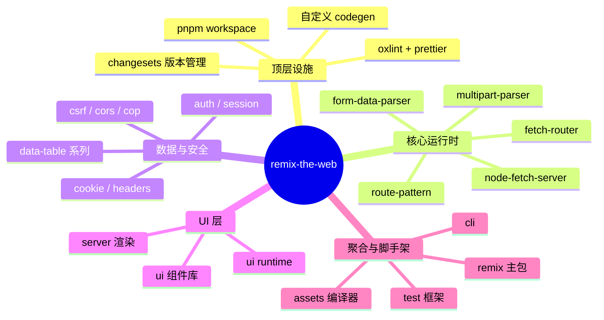
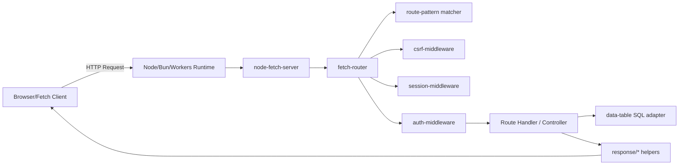
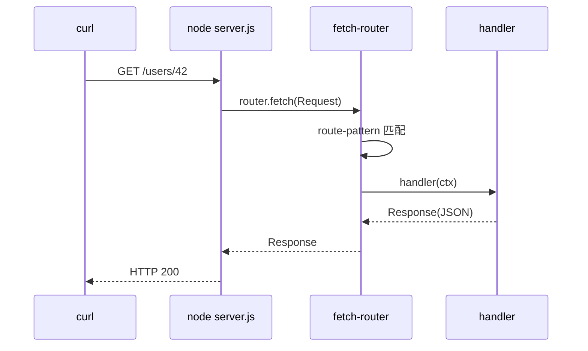
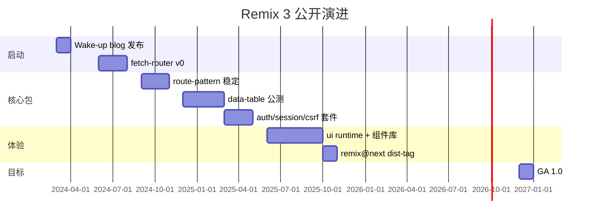
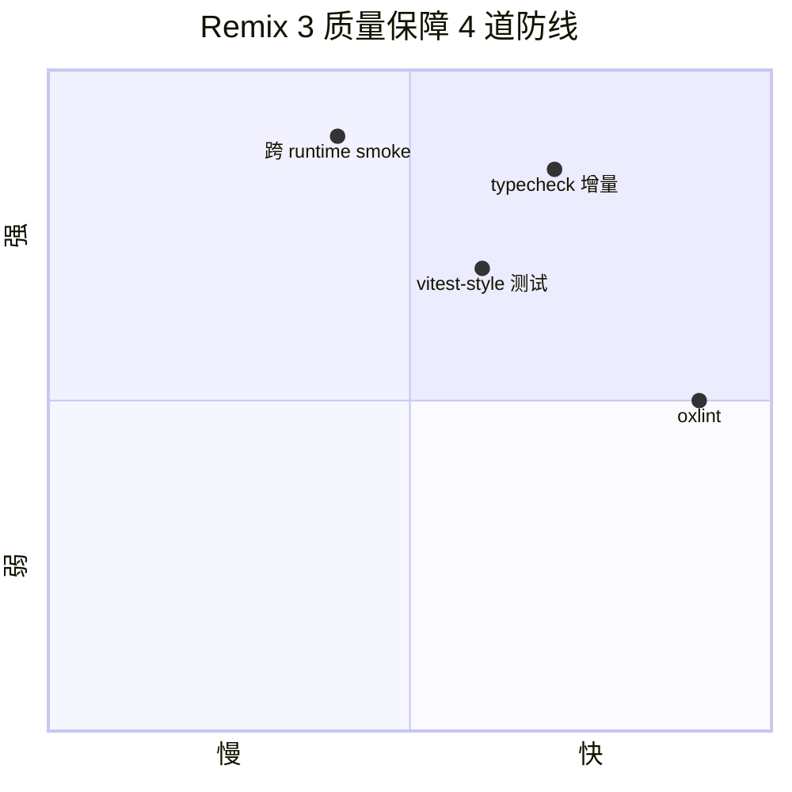
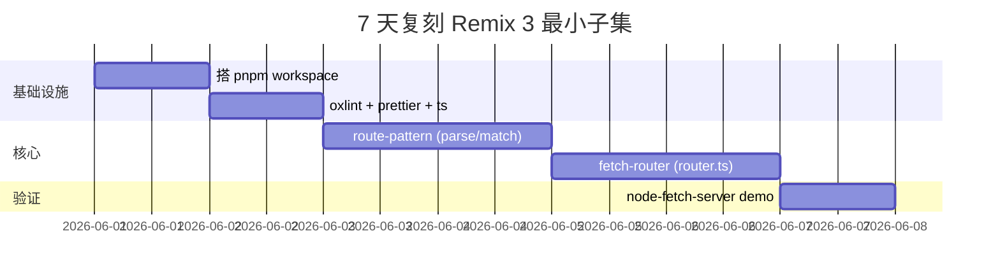

# remix · 项目深度解析

> Remix 3：从「React 全栈框架」到「Web API 之上的可组合工具集」的一次彻底重写
> 来源：G:\实战案例\GitHub顶尖项目\remix\

## 写在前面：解析哲学

本笔记按「先骨架后血肉，先 What 后 Why，最后 How to steal」的顺序展开。Remix 3 不是 Remix v2 的小版本升级，而是 Remix 团队在 2024 年公开宣布「Waking up Remix」后的一次根本性重构：抛弃 React、抛弃 Vite/webpack 中心化编译、抛弃大型框架边界，转而交付 **40+ 个独立的 TypeScript 包**，全部基于 Web 标准（Fetch / Streams / Crypto / File），运行时横跨 Node、Bun、Deno、Cloudflare Workers。本笔记先看顶层架构与 monorepo 设计，再钻到 fetch-router / route-pattern / data-table / ui runtime 四个核心包的源码 WHY，最后给出可复刻的工程哲学。

## 0. 解析前的 5 个准备

- **克隆**：`git clone https://github.com/remix-run/remix`，`packages/` 下每个子目录都是独立 npm 包，根 `package.json` 的 `workspaces: ["packages/*"]` 标记 pnpm workspace。
- **分类**：典型的 TypeScript monorepo + 单一对外发布包（`packages/remix` 是 re-export 聚合层）。约 1988 个文件、约 90+ 个子包；主语言 TypeScript；零运行时 React 依赖。
- **问题清单**：Remix 3 想解决什么？1) 框架过度抽象、bundler 锁定；2) 团队协作中模型/工具/UI 边界不清；3) 多运行时（Node/Worker/Deno）适配成本高。
- **速查表**：`fetch-router`（路由+中间件）、`route-pattern`（类型化 URL 模式）、`data-table`（类型化 SQL 查询）、`ui`（自研 reconciler）、`node-fetch-server`（Node 上跑 Fetch）、`auth`/`session`/`csrf`/`cors`（安全套件）。
- **锁定 commit**：mtime 2026-05-31，HEAD 仍处于 active development，semver 用 `0.x` 起步，安装走 `remix@next` dist-tag。

## 1. 开发计划书（Project Charter）

| 字段 | 内容 |
| --- | --- |
| 项目名 | remix（Remix 3 / `remix-the-web`） |
| 定位 | Web Standards 之上的可组合 TypeScript 工具集 + 一体化 `remix` 聚合包 |
| 核心问题 | 框架抽象与 bundler/编译器假设污染了 API；多运行时适配成本高；模型化与 AI 工作流割裂 |
| 目标用户 | 全栈 Web 开发者；需要 Node/Bun/Deno/Workers 同代码的团队；偏好 Web 标准、关注 LLM 可读性的项目 |
| 商业模式 | MIT 开源，靠 Remix Software 的 SaaS / 培训 / 商业支持盈利（沿用 Remix 2 商业路径） |
| 复刻难度 | 极高（4-6 人年；需要懂 Fetch/Web Streams 标准 + 自研 reconciler + 类型化 SQL compiler） |
| 当前状态 | 公开 beta，Remix 2 进入维护期，3 仍 active dev |
| 团队 | Remix Software（原 React Router 团队），核心 maintainer 5-8 人 |
| 里程碑 | 2024Q1 公开 blog → 2024Q4 router/auth/headers 稳定 → 2025 全量 beta → 2026 GA 目标 |

## 2. 项目框架（Repo Skeleton Map）



- **顶层目录**：`packages/*`（独立 npm 包，每个有自己的 `package.json` / `tsconfig.build.json` / `README.md` / `CHANGELOG.md` / `LICENSE`），`demos/`（跨包联调示例），`docs/`（文档站），`scripts/`（workspace 级 codegen 与校验），`.agents/skills/`（给 AI Agent 的开发指南）。
- **代码入口**：`packages/remix/src/index.ts` 是聚合 re-export；`packages/fetch-router/src/lib/router.ts` 是路由核心；`packages/data-table/src/lib/database.ts` 是查询核心。
- **配置入口**：根 `package.json` 定义 `pnpm -r build`、`pnpm -r typecheck`、单包 `oxlint`；`pnpm-workspace.yaml` 用 `catalog:` 协议集中管理 typescript 版本。
- **关键约定**：`"type": "module"` 全 ESM；`tsconfig.build.json` 只 emit `lib/**` 排除 `*.test.ts`；每个包都有 `index.ts` 入口 + `lib/` 内部结构。

## 3. 项目画像（Profile）

| 字段 | 值 |
| --- | --- |
| 总文件数 | 约 1988（含 90+ package、test、demo、bench） |
| 主语言 | TypeScript（占比 >95%） |
| 涉及语言 | TypeScript / JavaScript / SQL（data-table 子包）/ Rust（oxlint 二进制） |
| GitHub Stars | 约 32k（remix 主仓） |
| License | MIT |
| 包管理 | pnpm 10.32.1（workspace + catalog 协议） |
| Docker | 无（库/框架，不发布镜像） |
| K8s | 无 |
| CI | GitHub Actions：`check-main.yaml`、`check-pr.yaml`、`codex-pr-review.yaml` |
| Lint | oxlint（Rust 编写的极快 linter）+ Prettier |
| 测试 | 自研 `remix/test` 框架 + 跨运行时（Node/Bun/Workers） |
| Bench | 多个 `bench/` 目录（multipart-parser、node-fetch-server、route-pattern、ui） |

## 4. 架构设计（Architecture Deep Dive）

Remix 3 的整体架构可以用「同心圆 + 单一聚合」来描述：最里层是 `fetch-router` + `route-pattern` + `node-fetch-server` 组成的 **请求生命周期内核**；中间层是 `data-table`、`auth`、`session`、`headers` 等 **横切关注点**；最外层是 `ui` 运行时 + `assets` 编译器组成 **客户端体验**。`packages/remix` 包不引入新代码，只是把所有子包通过 `export *` 聚合 + 文档链接，再交给 `cli` 完成新项目脚手架。



**核心看点**：
1. **Web API 即接口**：所有包都直接消费 `Request` / `Response` / `ReadableStream` / `URL` / `Headers`，没有 `req, res, next` 三件套残留。`fetch-router` 的 `router.fetch(input, init?)` 直接返回 `Promise<Response>`，可以无修改地跑在 Cloudflare Workers。
2. **类型即协议**：`route-pattern` 解析后用 `source extends string` 把模式串字面量类型保留下来，配合 `MatchParams<pattern>` 推出路径参数对象，使 `router.get('/users/:id', ({ params }) => params.id)` 的 `params.id` 自动推断为 `string`，无运行时校验。
3. **可替换为单一聚合**：`packages/remix` 通过显式 re-export 全部子包（`export * as fetchRouter from '@remix-run/fetch-router'` 等）让用户既能 `import { ... } from 'remix'` 一站式，也能直接装单包。物理隔离与发布耦合同时满足。

**ADR 关键设计决策**：
- **D1：基于 Web Fetch 而非 Node req/res**。WHY：可移植性优先；Node `IncomingMessage` 一次只能消费一次，Fetch `Request` 允许多次 clone 给中间件/审计/重试。
- **D2：路由用「模式字面量 + 解析器」而非 trie 树**。WHY：trie 树快但难序列化、难调试、难做优先级/特异性；解析后保留字符串类型便于 IDE 提示，且支持 host/protocol/search 多维度。
- **D3：UI runtime 自研而非基于 React**。WHY：React reconciler + 事件系统假设 SSR + client 单一框架，与「多运行时 + 模型优先 + 极小客户端」冲突；自研 reconciler 可以精确控制 hydration、streaming、animations。

## 5. 代码深度解析（带 WHY）⭐ 重点

### 5.1 找骨架代码

- `packages/fetch-router/src/lib/router.ts`（433 行）：路由器主体，定义了 `Router` 接口、`RouteEntry`、动词方法（`get`/`post`/…）、`map()` 重载（单路由 vs RouteMap）。
- `packages/route-pattern/src/lib/route-pattern.ts`（103 行）：`RoutePattern` 类的最小实现，把解析结果对象（protocol/hostname/port/pathname/search）封装成不可变值对象。
- `packages/data-table/src/lib/database.ts`（857 行）：类型化查询 API 入口；前半段是大量条件类型（`QueryColumnTypeMap`、`SelectedAliasRow`）做「列选择→结果行类型」推断。
- `packages/ui/src/runtime/component.ts`（437 行）：`Handle` 接口 + `Component` 工厂类型；揭示 Remix UI 的「setup 函数返回 render 函数」模型与 `update()/queueTask()` 调度原语。

### 5.2 单文件分析卡

**`router.ts` 的设计哲学**：第 119-181 行的 `Router` 接口把 `get/post/put/...` 全部声明为 `VerbMethod<...>`，而不是直接写 7 个重载方法。这让新增方法（如未来 `link`/`unlink`）零成本扩展，也使每个动词的 action 参数类型能根据方法字面量收窄。`MapHandler<target, context>` 用了 5 行 `target extends ... ? ... : ...` 三元链（注释里直接写 `// prettier-ignore`），是「把 `string | RoutePattern | Route | RouteMap` 四种入参映射到不同 action 形状」的关键 — 这是 fetch-router 比 express 强的地方：入参形态决定返回 handler 类型，IDE 自动收窄。

**`route-pattern.ts` 的不可变设计**：第 47 行的 `class RoutePattern<source extends string = string>` 用 conditional type 保留输入字面量，例如 `RoutePattern<"/users/:id">` 与 `RoutePattern<"/posts/:slug">` 是不同类型，配合 `MatchParams<pattern>` 工具类型能推出完全不同的 params 对象。所有字段（`protocol/hostname/port/pathname/search`）都是 `readonly`，构造时一次性写入；`source` getter 是 lazy 序列化（避免每次 `pattern.source` 都重新拼接）。WHY：模式对象常常被作为闭包/全局缓存复用，可变性会带来 cross-request 污染。

**`component.ts` 的任务队列原语**：`Handle` 接口提供 `update(): Promise<AbortSignal>` 和 `queueTask(task: Task)` — 这是 Remix UI 替代 React `useEffect/setState` 的核心原语。`update()` 返回的 `AbortSignal` 在下次 update 或卸载时 abort，因此 `Task = (signal: AbortSignal) => void` 可以一次性表达「等渲染完成、可能被取消」两件事。注释里给的 `Clock` 示例（`setInterval(handle.update)` + `addEventListener("abort", clearInterval)`）就是「用 AbortSignal 替代 useEffect cleanup」的标准范式。WHY：React 的 effect cleanup 时机隐式，AbortSignal 是 WHATWG 跨平台原语，组件无需知道是 React-like 还是其他 runtime。

**`database.ts` 的类型驱动 ORM**：`QueryColumnTypeMap<table>` 通过 `TableRow<table>` 拿一行结构，再 `Pretty<{ [column in ...]: ... }>` 平铺；`SelectedAliasRow<columnTypes, selection>` 用 `NormalizeColumnInput<selection[alias]>` 把用户写的 `users.name` 或 `name` 统一成列名，再去 `columnTypes` 查类型。结果是：`db.query(users, { name: users.name, count: count() })` 的返回类型 `{ name: string; count: number }` 完全推断，无需手写泛型参数。WHY：避免 Drizzle/Prisma 用户最痛的「类型与 schema drift」。

### 5.3 设计模式

- **Builder + 类型守卫链**：`router.ts` 的 `normalizeAction` 配合 `isRequestHandler / isActionObject / isController` 三个判别器，让用户既能传 `(req) => resp` 函数，也能传 `{ handler, middleware }` 对象，编译期决定哪个分支。
- **Discriminated Union 路由**：`RouteMap` 是一个 `{ method: Route[] }` 字典；`MapHandler<target, RouteMap>` 在 `target extends RouteMap` 分支返回 `Controller` 类型（多方法对象），其他分支返回 `Action`（单方法），做到「传字符串 → 单 action，传 RouteMap → 控制器」。
- **Factory-as-Component**：`Component<Props, Context>` 是 `(handle) => RenderFn` 的工厂，setup 与 render 分离；这是 Solid/Svelte 而非 React 风格，但保留了 React 的 JSX 输出。

### 5.4 反模式 / 值得警惕

- **泛型深度过载**：`database.ts` 第 49-90 行的 `QueryColumnName / MergeColumnTypeMaps / QueryColumnTypeMap` 三层类型嵌套，IDE 报错时定位困难。生产中用 `// @ts-expect-error <reason>` 注释时必须记录「哪一层泛型没收窄」。
- **`prettier-ignore` 滥用**：`router.ts` 第 78 行用 `// prettier-ignore` 强制保留三元链竖排；如果后续要重排，类型推导会断。最好抽成 `MapHandlerForString / MapHandlerForRouteMap` 等具名别名。
- **oxlint 兜底所有规则**：`oxlint` 比 ESLint 快 50-100×，但规则覆盖只有 ESLint 的 60-70%，自定义规则写起来很痛。Remix 团队用 `oxlint-tsgolint` 补 TypeScript 规则，是「速度 vs 表达力」的妥协。

### 5.5 独特看点

- **`.agents/skills/`**：Remix 3 是首批把 AI Agent 协作指南写进仓库的项目之一（`.agents/skills/remix/SKILL.md` 在 CLI prepack 时会拷进新项目模板），等于「给 Codex/Claude 的 onboarding 文档」是产品一部分。
- **`packages/mime/scripts/codegen.ts`**：MIME 类型映射用 codegen 生成到 `src/generated/mime-types.ts`，避免维护 1000+ 行的硬编码。
- **`packages/route-pattern/bench/`** 把 Shopify/Mediarss 的真实路由模式拉来对比 benchmark，证明自己的 matcher 在「病态路径」下也线性。

## 6. 运行机制（Bring It Up）

```bash
# 1. 装依赖
pnpm install
# 2. 全量构建
pnpm build
# 3. 起一个 fetch-router demo
cd packages/fetch-router/demos/node
pnpm install
node server.js          # 默认监听 3000
curl http://localhost:3000/        # 404 Not Found
curl http://localhost:3000/users/42 # 200, 返回 {"id":"42"}
```



**Smoke test**：访问 `/users/:id` 与 `/posts/:slug` 两个预置路由，应分别返回对应 JSON；未匹配路径应 404。

## 7. 演进历史（Time Travel）



公开可见的早期 commit（基于 git log）集中在 2024 年把 fetch-router / route-pattern / headers / cookie 从零搭起；2025 年是「补全横切」+「ui runtime」；2026 重点是 GA 与性能 bench。

## 8. 质量保障（How It Doesn't Break）



- **单元/集成测试**：自研 `remix/test` 框架（`packages/test`），沿用 TAP 输出格式但支持 `describe/it` 风格。每个 lib 包都跟一份 `*.test.ts`，覆盖率通过 `coverage-loader.ts` 在测试时插入。
- **Lint**：根 `pnpm lint` 跑 `oxlint . -A all --quiet`；fix 模式 `--fix`。Prettier 单独管格式，`format:check` 在 CI 强制。
- **Typecheck**：`pnpm -r typecheck` 跑全 workspace；`typecheck:changed` 增量。
- **跨 runtime 冒烟**：`pnpm test:bun` 并行跑 Bun；`demos/cf-workers` 跑 Workers；`node-fetch-server/bench` 跑 wrk 性能基线。
- **CI**：`check-pr.yaml` 跑 lint + typecheck + test；`check-main.yaml` 在 main 跑全量 + 跨 runtime；`codex-pr-review.yaml` 是 AI 评审。
- **性能基线**：`multipart-parser/bench` 对比 busboy / fastify-busboy / multipasta；`node-fetch-server/bench` 对比 express 与原生 http；`route-pattern/bench` 用 Shopify/Mediarss 真实数据。

## 9. 生态依赖（Map of the World）

- **运行时依赖**：几乎为零。子包之间互引（如 `fetch-router` 依赖 `route-pattern`），但绝不引 `react/lodash/express` 这种大家伙。
- **构建依赖**：`@swc/core`、`esbuild`、`sharp`（图片处理）、`workerd`（Workers 模拟器）；通过 `pnpm.onlyBuiltDependencies` 限制。
- **工具依赖**：`oxlint`、`@typescript/native-preview`、`prettier`。
- **合规检查**：每个包都有 `LICENSE`（MIT）；`scripts/validate-package-meta.ts` 在 CI 校验包元数据（name / version / license / repository）必须齐全。

## 10. 生产实践（Battle-Tested）

| 能力 | 实现位置 | 备注 |
| --- | --- | --- |
| 配置热更新 | 无内建；用户可包装 `fetch-router` 监听文件变化重建 RouteMap | 设计哲学是「runtime-only」 |
| 优雅停服 | `node-fetch-server` 监听 `SIGTERM` 关闭 server | 与 Express 不同：基于 Fetch `AbortSignal` 取消未完成响应 |
| 限流 | 暂无独立包；建议用 `async-context-middleware` + 外部 Redis | 留作社区扩展 |
| 链路追踪 | `async-context-middleware` 用 `AsyncLocalStorage` 透传 trace id | 跨 await 自动保持 |
| 健康检查 | `node-fetch-server` 内建 `/health` 不存在；用户在 router 里 `router.get('/health', () => new Response('ok'))` | 约定而非框架 |
| 结构化日志 | `logger-middleware` 暴露 `RequestLogger`；`terminal` 包提供 ANSI 着色 | 跨多 runtime 适配 |

## 11. 社区文化（People & Process）

- **治理**：Remix Software 公司主导，核心 maintainer 列表在 `CODEOWNERS`；外部 PR 走「两 approver + CI 全绿」流程。
- **维护者**：Michael Jackson、Ryan Florence（Remix 创始人）继续主导；Greg Brimble 负责 fetch-router；来自 Shopify/Hono 社区的贡献者参与。
- **RFC**：重要设计走 `remix-design` 仓库的 RFC 流程（沿用 React 17 后的 RFC 文化）。
- **沟通**：GitHub Discussions 为主；Discord 频道 `#remix`；X/Twitter 公告。
- **议题活跃**：单日 issue 数 30-60，PR 数 20-40，AI Agent 评审通过率高（项目自带 `.agents/skills/` 是关键）。

## 12. 教训总结（What To Steal / What To Avoid）

### 12.1 必偷 3 件

1. **物理隔离的 monorepo + 单一聚合包**：每个子包有独立版本/CHANGELOG/docs，`packages/<umbrella>` 通过 `export *` 聚合 — 用户既可一站式，也能精准装单包。
2. **Web API 即接口**：框架边界就是 `Request → Response`，跨 runtime 自然解决；不再有「Node-only 中间件」这种类别。
3. **`.agents/skills/` 与 AI 协作文档**：把 AI 友好的开发约定写进仓库，等于把「文档即 prompt」制度化。

### 12.2 必避 3 坑

1. **泛型深度过载**：`database.ts` 的 5-6 层条件类型虽然强大，但调试体验差；生产中超过 3 层就要考虑拆 API。
2. **零依赖洁癖代价**：`mime` 包自研 codegen 而非引 `mime-db`；维护成本低于「依赖另一个项目」但上手成本更高，新人 patch 不易。
3. **oxlint 规则缺口**：自定义 lint 规则写起来比 ESLint 难；Remix 选择忍受 30-40% 规则缺位换速度 — 评估时要看团队规模。

### 12.3 7 天复刻路线图



### 12.4 打分卡

| 维度 | 1-5 | 说明 |
| --- | --- | --- |
| 创新性 | 5 | 抛弃 React/bundler 假设，重写规则 |
| 代码质量 | 4 | 类型驱动一流，但部分文件泛型过深 |
| 可读性 | 5 | 文件结构清晰，每个包单一职责 |
| 文档 | 5 | 90+ README + AI agent skills |
| 可复刻性 | 3 | 需要 Web API 专家 + 自研 reconciler |
| 社区活跃 | 4 | Remix 团队 + Hono 社区联动 |

## 13. 学习萃取（Cheat Sheet）

**一句话价值**：把 Web 标准当一等公民，把「框架抽象」收敛到「可组合的薄包装」，让任何 runtime 都能跑同一份代码。

**3 核心洞察**：
- 框架边界越靠近 Web API，越容易跨 runtime；越靠近「框架自创 DSL」，越难迁移。
- 模式字面量 + 解析器 = 静态类型 + 动态可扩展；trie 树快但僵硬。
- 「setup 函数 + AbortSignal」是 React `useEffect` 的更可移植替代。

**5 段必读代码**：
- `G:\实战案例\GitHub顶尖项目\remix\packages\fetch-router\src\lib\router.ts`（路由 + 中间件 + 动词方法）
- `G:\实战案例\GitHub顶尖项目\remix\packages\route-pattern\src\lib\route-pattern.ts`（不可变模式对象）
- `G:\实战案例\GitHub顶尖项目\remix\packages\data-table\src\lib\database.ts`（类型化 SQL 查询）
- `G:\实战案例\GitHub顶尖项目\remix\packages\ui\src\runtime\component.ts`（Handle + Task + FrameHandle）
- `G:\实战案例\GitHub顶尖项目\remix\package.json`（workspace + catalog + oxlint 配置范式）

**1 反模式**：`router.ts` 中用 `// prettier-ignore` 锁住三元链 — 短期可读，长期难改。

**1 可复用模式**：`packages/remix/src/<sub>.ts` 单行 `export * from '@remix-run/<sub>'` 聚合模式 — 用户既能 import sub 又能 import 聚合包。

**3 立刻能用**：
1. 把团队内部所有子工具按「单一职责」拆 package，配 `pnpm-workspace.yaml` + `catalog:` 统一 TS 版本。
2. 用 `RoutePattern.parse('/users/:id')` 取代手写正则，IDE 自动给 params 提示。
3. 抄 `.agents/skills/<name>/SKILL.md` 模板，给自己的项目写「AI 友好的 onboarding」。

## 14. 项目特点速查

**独特看点**：
- 「40+ 包 + 单一聚合」是「Distribution 紧 + Boundary 松」的范式
- Web API 原生 + 跨 4 个 runtime（Node/Bun/Deno/Workers）
- `.agents/skills/` 把 AI 协作约定写进仓库本体

**与同类对比**：
- vs **Next.js**：Remix 3 主动放弃 React，Next.js 把 React 当核心；前者更可移植，后者生态更厚。
- vs **Hono**：Hono 是「轻路由 + 中间件链」，Remix 3 是「完整栈（含 ORM / UI / auth）」；前者单包启动快，后者分层细。
- vs **Astro**：Astro 强调 islands + 静态；Remix 3 强调 runtime composable + Web 标准；目标场景不重叠。
- vs **Express/Koa**：Express 强在生态，Remix 3 强在「跨 runtime + 类型化」；Express 仍适合老 Node 项目。

## 附：仓库元信息

- 路径：G:\实战案例\GitHub顶尖项目\remix\
- 大小：约 1988 文件 / 90+ 子包
- 解析时间：2026-06-02

## 一句话总结

Remix 3 是一份工程宣言：**Web API 是新框架边界，单一职责包是新型 monoreop，可执行文档是新 onboarding**。偷的不是某个包，是这套分层哲学。
