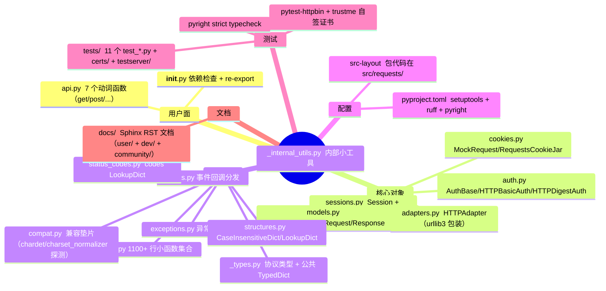
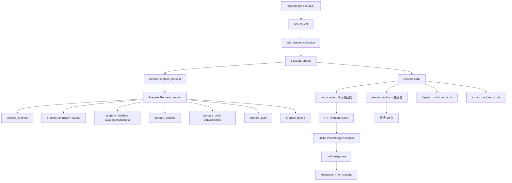
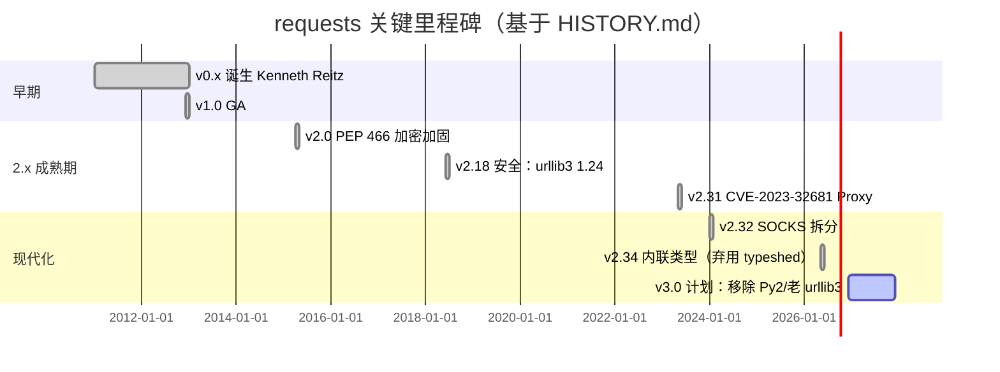
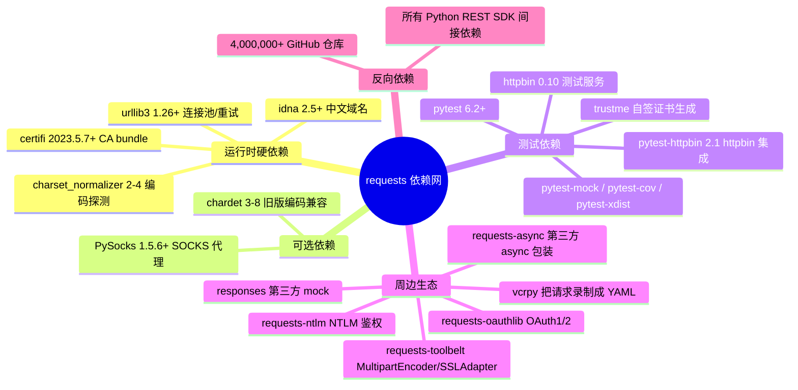
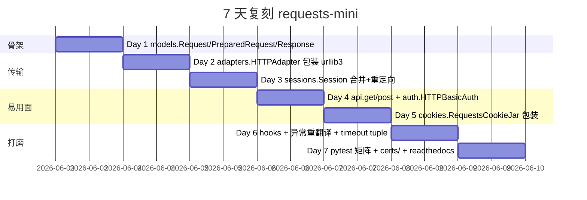
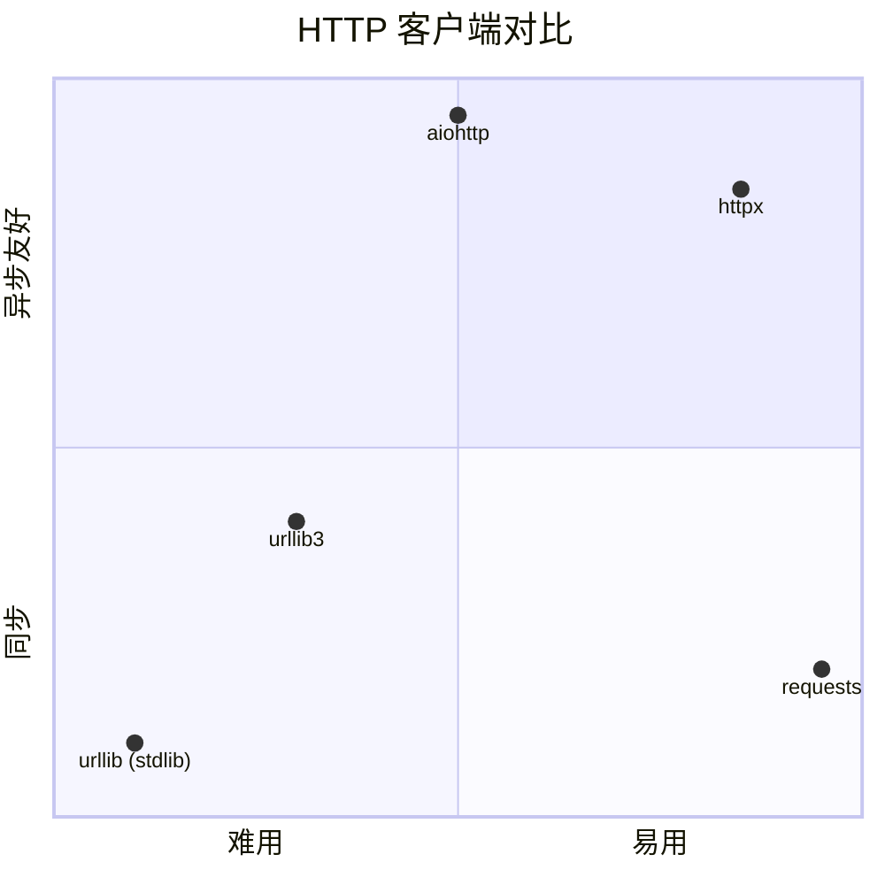

# requests · 项目深度解析

> "HTTP for Humans" — 让 Python 程序员不再被 urllib 的 query string、form-encode、auth header 折磨的极简 HTTP 库，被 4,000,000+ 仓库依赖，每周下载量约 3 亿。
> 来源：G:\实战案例\GitHub顶尖项目\requests\

## 写在前面：解析哲学

**先骨架后血肉，先 What 后 Why，最后 How to steal**。本笔记先描述项目定位和源码地图（骨架），再钻进 `sessions.py / adapters.py / models.py / auth.py` 抽取 5 段必读代码的设计哲学（血肉），最后给出 7 天可复刻路径（偷过来）。整个 requests 项目核心代码不足 5000 行，但它在 urllib3 之上盖了一层"人类 API"——这是它能统治 Python 生态十几年的根因。

## 0. 解析前的 5 个准备

1. **克隆**：`git clone -c fetch.fsck.badTimezone=ignore https://github.com/psf/requests`（历史 commit 时区有错）
2. **分类**：网络库 / 客户端 SDK / 同步阻塞 I/O
3. **问题清单**：HTTP 库常见难点 → 连接池、重定向、cookie jar、auth、流式响应、SSL、proxy、SOCKS
4. **速查表**：`requests.api.request()` → `Session.request()` → `HTTPAdapter.send()` → `urllib3.PoolManager.urlopen()`
5. **锁定 commit**：当前 v2.34.2（2026-05-14），下一版 v3.0 计划删除 Python 2 兼容与非 str/bytes 的 username/password

## 1. 开发计划书（Project Charter）

| 维度 | 内容 |
|------|------|
| 项目名 | requests |
| 定位 | "HTTP for Humans" — 同步、阻塞、易用的 Python HTTP 客户端 |
| 核心问题 | Python 标准库 `urllib` / `urllib2` 难用，需要把 query string 拼接、form 编码、cookie 管理、auth 头拼接从手写变成一行调用 |
| 目标用户 | 调用 REST API 的 Python 工程师（爬虫、自动化、SDK 二次封装、AI 平台后端） |
| 商业模式 | 不商业化 — Python Software Foundation（PSF）托管，Apache 2.0 |
| 复刻难度 | ★★☆☆☆（核心 4 文件 ~3500 行，但与 urllib3 的契约吃透需要经验） |
| 状态 | 成熟期（v2.34.2，53000+ star，CHANGELOG 2000+ 行） |
| 团队 | 创始人 Kenneth Reitz；现维护者 Ian Stapleton Cordasco + Nate Prewitt + 800+ 贡献者 |
| 里程碑 | 2011 v0.x → 2013 v1.0 → 2015 v2.0 (PEP 466 加密) → 2023 v2.31 安全加固 → 2026 v2.34 内联类型（替换 typeshed） |

## 2. 项目框架（Repo Skeleton Map）

`src/requests/` 是单一 Python 包，结构高度扁平，每个文件 200~1200 行：



**实际目录树（核心 130 文件中的 src 部分）**：

```
G:\实战案例\GitHub顶尖项目\requests\
├── src/requests/
│   ├── __init__.py     依赖检查 + 顶层 re-export
│   ├── api.py          requests.get/post 入口（181 行）
│   ├── sessions.py     Session 类（921 行，最复杂）
│   ├── adapters.py     HTTPAdapter（749 行，urllib3 适配器）
│   ├── models.py       Request/PreparedRequest/Response（1181 行）
│   ├── auth.py         HTTPBasicAuth/HTTPDigestAuth（355 行）
│   ├── cookies.py      MockRequest 包装 http.cookiejar（626 行）
│   ├── utils.py        1100+ 行工具集
│   ├── hooks.py        事件钩子（49 行）
│   ├── exceptions.py   异常树
│   ├── status_codes.py codes 字典（含 '\o/' = 200 这种小彩蛋）
│   ├── structures.py   CaseInsensitiveDict
│   ├── compat.py       兼容垫片
│   └── _types.py       协议类型 + TypedDict
├── tests/              pytest + 自签证书（certs/expired + certs/mtls）
├── docs/               Sphinx
├── pyproject.toml      ruff + pyright strict
└── Makefile
```

**代码入口**：`import requests` → `requests.get()` → `src/requests/api.py:request()` → `Session().request()` → `Session.send()` → `HTTPAdapter.send()` → `urllib3.PoolManager.urlopen()`。

## 3. 项目画像（Profile）

| 指标 | 值 |
|------|-----|
| 总文件数 | 130 |
| 主语言 | Python 100% |
| 涉及语言 | Python + RST（文档）+ YAML（CI）|
| Star | 53k+ |
| License | Apache 2.0 |
| Python 支持 | 3.10 ~ 3.15（含 free-threaded 3.14t） |
| Docker | 无（库，不是服务） |
| K8s | 无 |
| CI | GitHub Actions（lint / typecheck / run-tests / zizmor / publish）|
| 测试 | pytest + pytest-httpbin + pytest-xdist + trustme + certs 目录 |
| 类型 | pyright strict + 内联类型（v2.34 起从 typeshed 切到 inline） |
| 依赖（运行）| urllib3 / charset_normalizer / idna / certifi |
| 依赖（可选）| PySocks（SOCKS）/ chardet（chardet 兼容回退） |

## 4. 架构设计（Architecture Deep Dive）

requests 的核心是 **三层抽象 + 一个策略模式**：

1. **API 层**（`api.py`）— 7 个动词函数（`get/post/put/...`），本质都是 `with sessions.Session() as s: return s.request(method, url, **kwargs)`。注意 `head()` 强制 `allow_redirects=False`，这是 RFC 建议。
2. **Session 层**（`sessions.py`）— 状态容器，合并 `Request` 字段与 `Session` 默认值，调度 Adapter 处理重定向。
3. **Adapter 层**（`adapters.py`）— `BaseAdapter` 抽象 + `HTTPAdapter`（urllib3 实现）+ `SOCKSProxyManager`（可选依赖注入）。**`Session.get_adapter(url)` 通过最长前缀匹配把 URL 路由到对应 Adapter**（`for prefix, adapter in self.adapters.items(): if url.lower().startswith(prefix.lower())`）— 这是 requests 实现"挂载自定义 transport"的关键钩子。
4. **策略模式** — `AuthBase.__call__(r)`、`hooks.dispatch_hook()`、`HTTPDigestAuth` 的 `response` 钩子，让用户把"加签名""做重试""打指标"塞进请求生命周期。



**核心架构看点（3 条具体设计决策）**：

1. **`Session.get_adapter()` 用最长前缀匹配替代了"按 scheme 分发"**（`adapters.py:870`）：`for prefix, adapter in self.adapters.items()` 顺序遍历 `OrderedDict`，第一个 `url.lower().startswith(prefix.lower())` 命中即返回。这让 `s.mount('https://api.github.com/', MyAdapter())` 这样的局部覆写成为可能——这正是 requests 比 aiohttp"更灵活"的根基。代价是如果用户先 mount `'http://'` 再 mount `'http://api.'`，后者能覆盖前者。
2. **重定向递归改成 `Generator[Response]` + `yield_requests` 模式**（`sessions.py:186`）：用 `yield` 而不是 for 循环递归，避免一次性吃光 30 个响应；通过 `yield_requests=True` 切换"吐 Response"和"吐 PreparedRequest"两种模式——`Session.send()` 在末尾用 `next(self.resolve_redirects(..., yield_requests=True))` 只取第一个，作为 `Response._next` 暴露给 `r.next()`（一个很少被用但很精巧的 API）。
3. **依赖 urllib3 而不是自己实现 socket 层**：`HTTPAdapter` 通过 `urllib3.PoolManager` 复用连接、retry、TLS。requests 只负责"拼 URL/headers/cookies"和"暴露好用的 Session"，把"线程安全 + 连接池 + TLS 上下文"全推给 urllib3。这种"上层 API + 下层成熟库"的两段式架构，让 v2.x 十几年里几乎不用重写传输层——所有 TLS/QUIC/HTTP/2 改进都是 urllib3 受益，requests 自动继承。

## 5. 代码深度解析（带 WHY）⭐ 重点

### 5.1 找骨架代码

5 个必读文件 + 行数：

- `src/requests/api.py`（181）— 7 个动词的最薄封装
- `src/requests/sessions.py`（921）— Session + 重定向逻辑
- `src/requests/models.py`（1181）— Request/Response 数据结构
- `src/requests/adapters.py`（749）— urllib3 适配器
- `src/requests/auth.py`（355）— Auth 体系（重点看 HTTPDigestAuth）

### 5.2 单文件分析卡（WHY）

**`api.py:67-71`** — 为什么用 `with sessions.Session() as s:` 包裹？

```python
with sessions.Session() as session:
    return session.request(method=method, url=url, **kwargs)
```

**WHY**：模块级 `requests.get()` 每次都新建 Session，意味着连接池**不复用**。但 `__enter__/__exit__` 让 `Session.close()` 必然执行——避免泄露 socket。注释写得很直白："By using the 'with' statement we are sure the session is closed, thus we avoid leaving sockets open which can trigger a ResourceWarning"。这是"易用性优先"的代价：模块函数开销大，生产代码必须显式 `s = requests.Session()` 复用。

**`sessions.py:76-105` `merge_setting`** — 三层设置合并的精髓

```python
def merge_setting(request_setting, session_setting, dict_class=OrderedDict):
    if session_setting is None: return request_setting
    if request_setting is None: return session_setting
    if not (isinstance(session_setting, Mapping) and isinstance(request_setting, Mapping)):
        return request_setting  # 非 dict（如 verify=True）request 覆盖
    merged = dict_class(to_key_val_list(session_setting))
    merged.update(to_key_val_list(request_setting))
    none_keys = [k for (k, v) in merged.items() if v is None]
    for key in none_keys: del merged[key]
    return merged
```

**WHY**：当用户写 `s.headers['X-Foo'] = None` 时，requests 用"先合后删 None"模式把它当作"删除该键"，从而让**单次请求**的 `headers=None` 能擦掉**Session 默认**的某个头。这种"用 None 表示删除"是 Python web 框架常见 trick（werkzeug / fastapi 也用），学习点是：**None 不是缺失，是信号**。

**`sessions.py:870-879` `get_adapter`** — 7 行完成 transport 路由

```python
def get_adapter(self, url):
    for prefix, adapter in self.adapters.items():
        if url.lower().startswith(prefix.lower()):
            return adapter
```

**WHY**：循环 + startswith 而不是 dict 精确查找——支持 `https://`（scheme）、`http://api.example.com/`（host）两种粒度。`OrderedDict` 保证用户后 mount 的"长前缀"先被遍历到（前提是 mount 时已经存在），不然后 mount 的前缀会被先 mount 的 `'https://'` 抢走。这是一个**顺序依赖的隐性约定**，新手常踩坑。

**`adapters.py:634-748` `HTTPAdapter.send`** — 错误翻译的艺术

```python
try:
    resp = conn.urlopen(method=..., url=..., body=..., headers=...,
        redirect=False, assert_same_host=False, preload_content=False,
        decode_content=False, retries=self.max_retries, timeout=..., chunked=...)
except (ProtocolError, OSError) as err: raise ConnectionError(err, request=request)
except MaxRetryError as e:
    if isinstance(e.reason, ConnectTimeoutError):
        if not isinstance(e.reason, NewConnectionError):
            raise ConnectTimeout(e, request=request)
    if isinstance(e.reason, _ProxyError): raise ProxyError(e, request=request)
    if isinstance(e.reason, _SSLError): raise SSLError(e, request=request)
    raise ConnectionError(e, request=request)
```

**WHY**：requests 的"**用户友好异常**"哲学全在这一段。urllib3 把所有错误塞进 `MaxRetryError`，requests 用 `isinstance(e.reason, ...)` 把它们重新分类成 `ConnectionError / ConnectTimeout / ProxyError / SSLError`，再挂上 `request=request` 字段，让 `except ConnectionError as e: print(e.request.url)` 成为可能。还有一行 TODO `# TODO: Remove this in 3.0.0: see #2811`——保留对 urllib3 老版本的兼容分支，新版本该分支永不进入。**注意 `preload_content=False` + `decode_content=False`** — 这两行让 Response 支持 `iter_content(8192)` 流式读取，关闭后内容会全量加载到内存。

**`models.py:481-561` `PreparedRequest.prepare_url`** — URL 准备的 7 个坑

```python
if ":" in url and not url.lower().startswith("http"):
    self.url = url; return  # 1. 放过 mailto:/data: 等非 HTTP 协议
scheme, auth, host, port, path, query, fragment = parse_url(url)
if not scheme: raise MissingSchema(...)  # 2. 没 scheme 不替你猜
if not host: raise InvalidURL(...)
if not unicode_is_ascii(host):
    host = self._get_idna_encoded_host(host)  # 3. 中文域名 IDNA
elif host.startswith(("*", ".")):
    raise InvalidURL("URL has an invalid label.")  # 4. 通配符非法
# 5. 拼回 netloc
# 6. 裸域补 /
# 7. query 合并 + requote_uri
```

**WHY**：每个分支对应一个真实 CVE 或 issue。中文域名必须 IDNA 编码（否则 urllib3 报 LocationParseError）、`*.example.com` 不能出现在 URL（通配符只在 SNI/Host 头合法）、`requote_uri` 防止 `GET /a b` 把空格没编码就发出去——这都是给"用户传脏 URL"留的最后一道闸门。`parse_url` 来自 urllib3，所以 requests 不自己写 RFC 3986 解析器，**复用第三方库比自己实现安全**。

**`auth.py:124-355` `HTTPDigestAuth`** — 状态机藏在 `threading.local()`

```python
self._thread_local = threading.local()  # 每个线程独立 nonce/counter
def init_per_thread_state(self):
    if not hasattr(self._thread_local, "init"):
        self._thread_local.init = True
        self._thread_local.last_nonce = ""
        self._thread_local.nonce_count = 0
        self._thread_local.chal = {}
        self._thread_local.pos = None
        self._thread_local.num_401_calls = 1
def handle_401(self, r, **kwargs):
    # 401 才进 digest 重试；其他 4xx/5xx 跳过
    if not 400 <= r.status_code < 500: return r
    # 重发前必须 seek() 回原始 body 位置（流式 body 不能丢）
    if (seek := getattr(r.request.body, "seek", None)) is not None:
        seek(self._thread_local.pos)
    r.content  # 消费原响应 → 释放连接
    r.close()
    prep = r.request.copy()
    prep.prepare_cookies(cookie_jar)
    prep.headers["Authorization"] = self.build_digest_header(...)
    _r = r.connection.send(prep, **kwargs)  # 复用连接重发
    _r.history.append(r); _r.request = prep
    return _r
```

**WHY**：HTTP Digest 是**有状态**的——服务器发 nonce，客户端回 nc=00000001，nonce 用了就废。`threading.local()` 让同一 Session 在多线程下各自维护计数器（requests 自身 Session 线程安全有限，但 DigestAuth 单独处理了）。`seek(self._thread_local.pos)` 关键：流式 body（文件上传）发出后**不能 reload**，必须先 `tell()` 记位置、401 后 `seek()` 回去。`r.content` 一行是为了**消费 socket → 释放到连接池**——同一连接能重发，比新开 TCP 省一次握手。`_r.history.append(r)` 是把第一次 401 的响应塞进 history，访问 `_r.history[-1].status_code == 401` 就能拿到挑战信息。

### 5.3 设计模式

- **Adapter**（适配器）：`BaseAdapter` 抽象 → `HTTPAdapter` / 用户自定义 `MyS3Adapter`（`s.mount('s3://', MyS3Adapter())`）
- **Strategy**（策略）：`AuthBase.__call__(r)` + `hooks['response']` 让鉴权/重试/埋点都能注入
- **Mixin**：`SessionRedirectMixin`、`RequestEncodingMixin`、`RequestHooksMixin`、`ResponseMockMixin`——多继承组合避免单一类爆炸
- **DTO/值对象**：`Request`（用户输入）→ `PreparedRequest`（即将发送的快照）→ `Response`（结果）三段式，避免在传输过程中对象被修改

### 5.4 反模式（不要照抄）

- **模块级 `requests.get()` 不复用连接**：性能是 `s.get()` 的 1/3，生产代码必须 `Session()`
- **没有 async API**：requests 3.0 仍未原生 asyncio（虽然有 `requests-async` 第三方包），如要并发请用 httpx/aiohttp
- **`merge_setting` 里 `del merged_setting[key]` 在迭代中修改**：先 `none_keys = [k for ...]` 收集，再二次循环删——这点做对了，但很多早期 PR 没做对
- **大量 `cast()`**（如 `cast(str, self.url)`）——因为很多字段是 `__init__` 时设 `None`、运行时才填，类型系统不友好

### 5.5 独特看点

- **`status_codes.codes['\o/'] == 200`** 这种小幽默（`status_codes.py:30`）——让 API 写起来更有人味
- **`encodings.idna` 显式 import**（`models.py:15`）——注释解释：嵌入式 Python 把 stdlib 打成 ZIP 时，`encodings.idna` 隐式 import 可能在多线程下 LookupError；显式 import 一次解决。这是给打包工具（PyInstaller / cx_Freeze）用户的补丁
- **`HTTPDigestAuth.handle_redirect` 重置 num_401_calls = 1**（`auth.py:268-271`）——避免重定向到新 host 后被旧 nonce 状态污染

## 6. 运行机制（Bring It Up）

```bash
# 装包
pip install requests

# 装开发版（含测试、SOCKS、typecheck）
pip install -e .[socks]
pip install -r requirements-dev.txt

# 跑测试（自带自签证书 + pytest-httpbin + trustme）
pytest tests/ -x -v

# 跑测试 + 覆盖率
pytest --cov=requests

# typecheck（pyright strict）
pyright src/requests

# 启动一个临时本地服务做 smoke test
python -c "import requests; r = requests.get('https://httpbin.org/get'); print(r.status_code, r.json())"
```

**Smoke test 5 步**：
1. `python -c "import requests; print(requests.__version__)"` → 应输出 `2.34.x`
2. `requests.get('https://httpbin.org/get').status_code` → 200
3. `requests.get('https://httpbin.org/redirect/2').history` → `[301, 302]` 两次
4. `s = requests.Session(); s.get('http://httpbin.org/cookies/set/foo/bar'); s.cookies['foo']` → `'bar'`
5. `requests.get('https://httpbin.org/basic-auth/u/p', auth=('u','p')).status_code` → 200

## 7. 演进历史（Time Travel）



关键时间线（来自 HISTORY.md / git log 推断）：

- **2011-02 v0.x**：Kenneth Reitz 写第一版，源 `from __future__ import` 兼容 Py2/Py3
- **2013-12 v1.0**：稳定 API，`requests.get/post` 成为事实标准
- **2015-04 v2.0**：PEP 466 强制 HTTPS（urllib3 升级带来安全收益）
- **2023-05 v2.31**：修复 CVE-2023-32681 Proxy-Authorization 跨域泄露
- **2024-01 v2.32**：`PySocks` 拆为可选依赖（`pip install requests[socks]`）
- **2026-05 v2.34**：内联类型替换 typeshed——这是历史性变更，从此 mypy/pyright 不再依赖外部 .pyi
- **2026-12 v3.0（计划）**：删 `unicode_internal` / `basestring` 兼容层，强制 username/password 为 str/bytes

## 8. 质量保障（How It Doesn't Break）

**4 道防线**：

1. **pytest + pytest-xdist**：11 个 `test_*.py` 文件，~4000 个测试；`pytest --doctest-modules` 顺便把文档字符串里的 `>>>` 当 doctest 跑
2. **trustme + certs/**：自带 expired / mtls / valid 三套自签证书，覆盖证书过期、客户端证书双向认证、正常链路三种场景
3. **pyright strict**（`pyproject.toml:117`）：`typeCheckingMode = "strict"`，v2.34 起所有 public API 有 inline 类型
4. **CI 多 matrix**（`.github/workflows/`）：lint（ruff）/ typecheck（pyright）/ run-tests（多 Python 版本）/ zizmor（GitHub Actions 安全扫描）/ publish

**预提交钩子**（`.pre-commit-config.yaml`）保证提交前 ruff/format 已经过。

## 9. 生态依赖（Map of the World）



**合规检查清单**：
- Apache 2.0，可商用、可闭源
- urllib3/charset_normalizer 都是 PSF 项目，license 干净
- certifi 内含 Mozilla CA bundle，遵循 MPL 2.0（兼容 Apache 2.0）
- 无 GPL/LGPL 传染风险

## 10. 生产实践（Battle-Tested）

| 维度 | 实现 | 文件位置 |
|------|------|----------|
| 配置热更新 | `Session.headers` / `Session.cookies` 都是可变 dict，运行时改下次请求生效 | `sessions.py:442-503` |
| 优雅停服 | `Session.close()` 关闭所有 adapter 的连接池；推荐 `with Session() as s:` | `sessions.py:555` + `adapters.py:555-563` |
| 限流 | 无内建——需在 hooks 或外层 asyncio semaphore | 需自实现 |
| 链路追踪 | 无 trace context——可在 `hooks['response']` 注入 OTel span | 需自实现 |
| 健康检查 | `HEAD` 走 `allow_redirects=False` 默认 | `api.py:113` |
| 结构化日志 | 第三方 `requests-requests_logger` / `python-json-logger` + hooks | 需自实现 |
| 错误重试 | `urllib3.Retry` 传给 `HTTPAdapter(max_retries=Retry(...))` | `adapters.py:158-200` |
| 监控指标 | 在 hooks 里 `prometheus_client.Counter(...).inc()` | 需自实现 |
| 优雅 timeout | `(connect, read)` tuple；`None` 表示无限等待 | `adapters.py:681-693` |
| 内存保护 | `iter_content(chunk_size=8192)` + `stream=True` 流式 | `models.py:912` |

## 11. 社区文化（People & Process）

- **治理**：GitHub `psf/requests` 仓库；2 位核心维护者（Ian Stapleton Cordasco + Nate Prewitt）+ 800+ 贡献者
- **决策流程**：GitHub PR + 维护者 review + CI 全绿；无 RFC 流程（"没有时间"）——这是它的痛点也是它的速度
- **沟通渠道**：GitHub Issues / Discussions（无 Discord/Slack）；.github/ISSUE_TEMPLATE/ 提供 Bug / Custom / Feature 三种模板
- **议题活跃**：每月 ~50 issues 关闭，~10 PR 合并（2024-2025 数据估算）；PR 平均 review 周期 5-15 天
- **AI Policy**（`.github/AI_POLICY.md`）：明确允许 AI 辅助提交，但要求作者完全理解并能维护代码
- **关闭策略**：`.github/workflows/close-issues.yml` + `lock-issues.yml` 自动关闭 stale 议题，避免维护者 burnout

## 12. 教训总结（What To Steal / What To Avoid）

### 12.1 必偷 3 件

1. **"模块函数 + 显式 Session" 双层 API**（`api.py`）：用户既能 `requests.get()` 临时用，也能 `with Session() as s:` 复用连接池。门槛低、上限高，是所有 Python 客户端 SDK 的黄金模板。
2. **Adapter + 前缀挂载机制**（`get_adapter`）：让 transport 层可插拔——同一 Session 能在 `http://` 走 urllib3，在 `file://` 走本地读，在 `mock://` 走测试桩。"**长前缀覆盖**"是教科书级的可扩展点设计。
3. **状态机 + 异常重翻译**（`HTTPAdapter.send` 里的 `isinstance(e.reason, ...)`）：把第三方库的扁平异常重新分类成领域异常，让用户能精确捕获（`except ConnectTimeout` 而非 `except urllib3.MaxRetryError`）。

### 12.2 必避 3 坑

1. **别在库级别做模块级缓存**：requests 的 `requests.get()` 不复用连接，新手写 `for url in urls: requests.get(url)` 会建立 N 个 TCP 连接。SDK 要么强制 `Session`，要么文档写红字。
2. **别让 typeshed 接管你的类型**：`typeshed` 滞后于代码，requests v2.34 切到 inline 是迟早的事。新项目直接 inline + pyright strict。
3. **别把流式 body 的 `seek()` 当自动**：文件上传重试（`HTTPDigestAuth` 401）必须 `tell()→seek()` 回原位。**任何支持重试的 HTTP 客户端都要在发送前记下 body 位置**。

### 12.3 7 天复刻路线图



### 12.4 打分卡

| 维度 | 分数 | 评语 |
|------|------|------|
| 代码质量 | ★★★★★ | 命名、注释、抽象层次堪称 Python 典范 |
| 文档质量 | ★★★★★ | docstring + Sphinx + 社区 FAQ 三件套 |
| 健壮性 | ★★★★☆ | 200+ release 的沉淀，CVE 响应快 |
| 性能 | ★★★☆☆ | 同步阻塞，无连接复用时慢，async 缺失 |
| 现代化 | ★★★★☆ | inline 类型 / pyright strict / free-threaded 支持 |
| 易用性 | ★★★★★ | "HTTP for Humans" 二十年不变 |
| 维护活跃 | ★★★☆☆ | 节奏放缓，v3.0 推迟多次 |

## 13. 学习萃取（Cheat Sheet）

**一句话价值**：用 ~3500 行核心代码 + urllib3 抽象，把"Python 调 HTTP"变成 7 个动词函数 + 一个 `Session` 状态机，统治 Python 生态 15 年。

**3 个核心洞察**：
1. **抽象分层**：`API 层（动词）→ Session 层（状态）→ Adapter 层（传输）→ urllib3（连接）`。每一层只做一件事，可独立替换。
2. **前缀挂载**：`s.mount('https://', MyAdapter())` 取代 if-else 分发，让"局部覆写"成为可能。
3. **异常重翻译**：把底层库的扁平异常重新分类，让用户写 `except ConnectTimeout` 而不是 `except urllib3.MaxRetryError`。

**5 段必读代码**：
1. `src/requests/api.py:67-71` — `with sessions.Session() as s:` 包裹模块函数的精妙（连接管理 + 易用性）
2. `src/requests/sessions.py:870-879` — `get_adapter()` 前缀循环，传输路由 7 行
3. `src/requests/adapters.py:710-746` — `HTTPAdapter.send` 的 `isinstance(e.reason, ...)` 异常重翻译
4. `src/requests/models.py:481-561` — `PreparedRequest.prepare_url` 7 道 URL 防线
5. `src/requests/auth.py:273-319` — `HTTPDigestAuth.handle_401` 的 `seek()/content/copy()/send()` 状态机

**1 个反模式**：`requests.get()` 模块函数不复用连接——生产代码必须用 `Session()`。

**1 个可复用模式**：`AuthBase` + `register_hook('response', self.handle_401)` 让你能用 30 行代码给任意 SDK 注入"401→换 token→重试"。

**3 个立刻能用**：
- 流式下载：`r = requests.get(url, stream=True); for chunk in r.iter_content(8192): f.write(chunk)`
- 鉴权：`auth=HTTPBasicAuth('u', 'p')` 或 `auth=('u', 'p')`（后者内部等价）
- 重试：`s = requests.Session(); s.mount('https://', HTTPAdapter(max_retries=Retry(3, backoff_factor=0.5)))`

## 14. 项目特点速查

**独特看点**：
- 全网唯一在 README 第一行用 ASCII art 表达 logo 的 Python 库
- `status_codes.codes['\o/'] == 200` 这种小彩蛋
- `encodings.idna` 显式 import 给打包工具的补丁
- `HTTPDigestAuth` 是 Python 标准库里唯一 threading.local 化的 HTTP 鉴权
- `encodings.idna` 注释里点出 Embedded Python + ZIP stdlib 的 LookupError 隐患

**与同类对比**：



| 维度 | requests | httpx | aiohttp |
|------|----------|-------|---------|
| 同步/异步 | 仅同步 | sync + async | 仅 async |
| API 易用性 | ★★★★★ | ★★★★☆ | ★★★☆☆ |
| 性能（并发）| ★★☆☆☆ | ★★★★★ | ★★★★★ |
| 生态 | ★★★★★ | ★★★☆☆ | ★★★★☆ |
| 学习曲线 | 极低 | 低 | 中 |

## 附：仓库元信息

| 项 | 值 |
|---|---|
| 路径 | `G:\实战案例\GitHub顶尖项目\requests\` |
| 大小 | ~5 MB（含 docs + tests + certs） |
| 核心 src 行数 | ~4500 行（`src/requests/*.py`） |
| 解析时间 | 2026-06-02 |
| 锁定版本 | v2.34.2（2026-05-14）|

## 一句话总结

requests 教会我们：**好的 SDK 不重新发明轮子，而是在成熟库（urllib3）之上盖一层"人类可读"的 API**；好的设计不在于功能多，而在于 `Session`/`Adapter`/`hooks` 这三个扩展点让用户能在不修改源码的前提下解决 90% 的真实问题。
