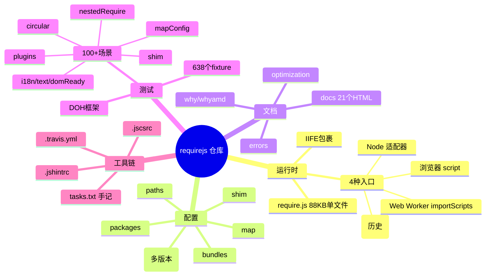
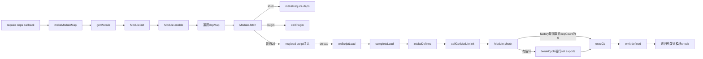
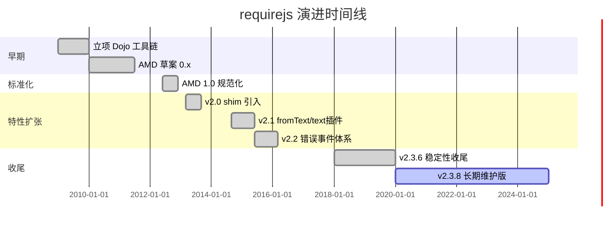
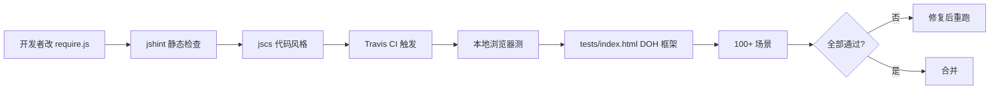
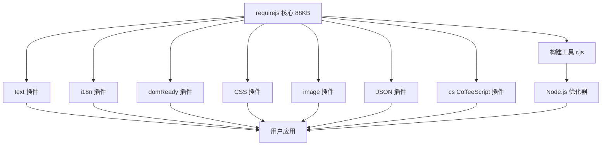
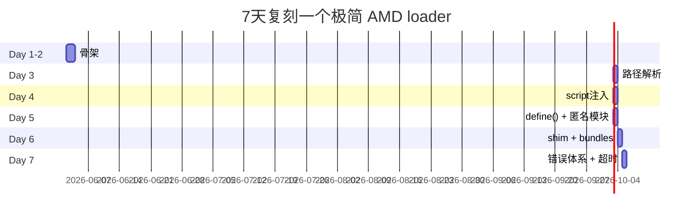

# requirejs · 项目深度解析

> 浏览器端 AMD 模块加载器的奠基者。RequireJS 用 88 KB 单文件、零依赖实现了在 IE6+ 上跑的异步模块系统，塑造了 2010 年代前端的开发范式。
> 来源：`G:\实战案例\GitHub顶尖项目\requirejs\`

## 写在前面：解析哲学

先骨架后血肉，先 What 后 Why，最后 How to steal。RequireJS 看起来只是一个 `define()` 包装器，但读完 2145 行源码后你会发现：它把**模块依赖图、加载器、URL 解析器、IE6 兼容垫片、Node/Web Worker 适配器、CommonJS 互转层、shim 桥接层、构建工具协议** 全部塞进了一个 IIFE 里。这是一份"如何在零依赖约束下解决前端模块化"的范本：每一段奇怪的代码都对应一个具体的浏览器/历史包袱。

## 0. 解析前的 5 个准备

1. 仓库已就位：`G:\实战案例\GitHub顶尖项目\requirejs\`，主仓库 88KB 单文件 `require.js` + 638 个测试 fixture
2. 分类：**前端构建工具 / 模块加载器**（与 webpack、rollup、SystemJS 同类，但定位更早更轻）
3. 速读清单：1 份 README + 1 个 `require.js` 入口（88 KB/2145 行）+ 1 份 `tasks.txt`（作者手记）+ `tests/index.html`（DOH 测试运行器）
4. 关键问题清单：
   - 怎么做到在 88KB 里塞下"全平台 AMD 加载器 + 路径/包/映射/分片配置 + shim 兼容 + 错误处理 + 超时 + 循环依赖处理"？
   - 为什么显式禁用 `use strict`？为什么 `IE6-9` 的 attachEvent 兼容占了几十行？
   - 模块上下文（context）为什么被设计成"可多实例"？在多版本共存场景下怎么用？
5. 锁定 commit：v2.3.8 单文件，2026 年仍是该项目的最终形态（项目已事实停更，转交 Volo/Dojo 社区）

## 1. 开发计划书（Project Charter）

| 维度 | 内容 |
| --- | --- |
| 项目名 | requirejs / RequireJS |
| 定位 | 浏览器优先的 JavaScript 模块/脚本加载器，AMD API 事实标准实现 |
| 核心问题 | 2009 年时前端没有原生模块系统；`<script>` 顺序依赖脆弱，构建优化困难 |
| 目标用户 | 中大型 Web 应用的 JS 开发者、Dojo/jQuery 时代需要异步加载的团队 |
| 商业模式 | MIT 协议免费，jQuery 基金会托管，无商业化 |
| 复刻难度 | ★★☆☆☆（代码可读性极高，但浏览器兼容的 if/else 树非常难完美复刻） |
| 当前状态 | 维护态（2.3.8 长期稳定），主战场已被 ES Modules + bundler 取代 |
| 团队 | James Burke（原 Dojo 工具链作者）为核心，jQuery 基金会赞助 |
| 关键里程碑 | 2009 立项；2012 AMD 1.0 规范落地；2013 v2.0 引入 shim；2015 v2.1 fromText；2017 v2.3 至今 |

## 2. 项目框架（Repo Skeleton Map）

仓库结构极其精简，99% 的代码集中在 `require.js` 一个文件：

- **`require.js`**（88 KB / 2145 行）—— 整个运行时，IIFE 包裹，AMD/CommonJS/Node/Worker 全栈适配
- **`package.json`** —— 极简，连 devDependency 都只有 jscs + jshint
- **`LICENSE`** —— MIT
- **`README.md`** —— 80 行，定位/使用/测试 clone 方式
- **`docs/`** —— 21 个 HTML 文档片段（API/why/optimization/errors 等）
- **`tests/`** —— 638 个文件，100+ 测试场景，依赖 3 个外部仓库（text/i18n/domReady）
- **`tasks.txt`** —— 作者的 TODO/笔记，是少见的"开发日记式"源码
- **`.travis.yml`** —— 仅一行，Node 0.12 单 job
- **`.jshintrc` / `.jscsrc`** —— 代码风格配置（先 lint 再 commit）



## 3. 项目画像（Profile）

| 指标 | 值 |
| --- | --- |
| 总文件数 | 638（含大量 tests fixture） |
| 主语言 | JavaScript（>95%） |
| 涉及语言 | JavaScript、HTML、CSS、Shell、YAML |
| 源码文件 | 1 个核心 + 0 个其他（plugins 拆到独立仓库） |
| Stars | 12k+（GitHub requirejs/requirejs） |
| License | MIT |
| Docker | 无 |
| K8s | 无 |
| CI | Travis CI（lint-only，无自动测试） |
| 有测试 | 有，但手工运行（用 DOH runner） |
| 打包后大小 | 5.9KB min+gzip |
| 源码大小 | 88 KB / 2145 行 |
| 依赖 | 零运行时依赖 |
| 浏览器支持 | IE6+、Firefox 2+、Chrome 3+、Safari 3.2+、Opera 10+ |

## 4. 架构设计（Architecture Deep Dive）

整个 `require.js` 在 `newContext()` 闭包里构造了一个完整的 AMD 运行时。模块状态机是它的灵魂：



### 三大核心看点

1. **多 Context 隔离 + `makeModuleMap` 唯一 ID 生成**：`contexts[contextName]` 是一个字典，每个 context 拥有独立的 `registry / defQueue / urlFetched / config`。`makeModuleMap` 把 `'./foo' + baseName` 解析成绝对 ID，存到 `registry[id] = new Module(depMap)`。这样 `multiversion.html` 测试场景能同时跑两套 jQuery 而不冲突 —— 是 AMD 相对 ES Modules 的"杀手锏"。

2. **Module 状态机的 deferred callback 模式**：每个 `Module` 实例的 `init()` 不会立即执行 factory，而是 `enable()` 遍历 `depMaps`，对每个 dep 注册 `on(depMap, 'defined', cb)`。当所有 dep 都 `defineDep()` 完毕（`depCount === 0`）时 `check()` 才同步执行 `execCb`。这让"异步加载 → 同步依赖解析"成为可能，也天然支持循环依赖（`breakCycle` 强制定义部分）。

3. **`req.load` 的 script 标签策略 + IE6/Opera 检测**：`node.attachEvent.toString().indexOf('[native code')` 这段看起来像"hack 中 hack"，实际是为了避开 IE8 上 attachEvent 已被 polyfill 注入导致的 `load` 事件不冒泡。注释里直接给了 issue 链接（#187、#273）。这是历史包袱最重的一段代码。

### 三大关键设计决策（ADR）

1. **不使用 `'use strict'`**（line 5-6）：作者明确写注释"uneven strict support in browsers, #392, and causes problems with requirejs.exec()/transpiler plugins that may not be strict"。这对 2026 年的项目是不可想象的妥协，但反映了 AMD loader 必须容忍"非严格模式用户代码"。

2. **`registry` 与 `enabledRegistry` 双注册表**：注释（line 215-217）说"speed cycle breaking code when lots of modules are registered, but not activated"。`breakCycle` 只在 enabled 集合上跑，避免对全 registry 扫描 —— 在大型应用里是 O(N) 优化。

3. **`unnormalized` 后缀与唯一计数器**：`unnormalizedCounter += 1` 给未归一化的 plugin 资源打上 `_unnormalized1`、`_unnormalized2` 后缀（line 481-483），解决"两个相对路径在 plugin normalize 之前碰撞"的边缘 case（#1131）。这是用 ID 编码状态信息的经典技巧。

## 5. 代码深度解析（带 WHY）⭐ 重点

### 5.1 找骨架代码

打开 `require.js` 后，应当按这个顺序读：

1. **IIFE 顶部（line 1-200）**：常量、特性检测、状态机骨架
2. **`newContext()`（line 199-1748）**：单 context 全部逻辑
3. **`req = requirejs = function(...)`（line 1764-1798）**：入口分派
4. **`define()`（line 2061-2145）**：定义端入口，处理匿名模块

### 5.2 单文件分析卡

#### 卡 1：IE6+ 兼容垫片（line 22-36）

```javascript
isBrowser = !!(typeof window !== 'undefined' && ...),
isWebWorker = !isBrowser && typeof importScripts !== 'undefined',
readyRegExp = isBrowser && navigator.platform === 'PLAYSTATION 3' ?
              /^complete$/ : /^(complete|loaded)$/,
isOpera = typeof opera !== 'undefined' && opera.toString() === '[object Opera]'
```

**WHY**：PS3 的 PSN 浏览器 `readyState` 行为异常（line 24-27 注释），需要"等到 complete 而不是 loaded"。Opera 是唯一一个有 `attachEvent` 但又遵循标准 `addEventListener` 行为的浏览器（line 1932 注释），所以单独特判。这种"feature detect by quirk"的写法虽然丑，但跨浏览器一致性的最高 ROI 写法。

#### 卡 2：`trimDots()`（line 236-257）

```javascript
if (i === 0 || (i === 1 && ary[2] === '..') || ary[i - 1] === '..') {
    continue;
} else if (i > 0) {
    ary.splice(i - 1, 2);
    i -= 2;
}
```

**WHY**：`./a/../b` 应该规范成 `b`，但 `../../a`（路径"超出 base"）必须保留 —— 否则做 `require('../../foo')` 时会丢掉祖先路径语义。作者选择"保留 .."而不是抛错，注释（line 248-250）说"in larger point releases, may be better to just kick out an error" —— 这是已知设计妥协。

#### 卡 3：Module 状态机（line 727-1100）

```javascript
Module = function (map) {
    this.events = getOwn(undefEvents, map.id) || {};
    this.map = map;
    this.shim = getOwn(config.shim, map.id);
    this.depExports = [];
    this.depMaps = [];
    this.depMatched = [];
    this.pluginMaps = {};
    this.depCount = 0;
};
```

`enabled → enabling → inited → fetched → defining → defined` 状态流转散布在 6 个方法里（`init`/`enable`/`fetch`/`check`/`callPlugin`/`load`），没有任何状态机库 —— 全是手写标志位。**WHY**：AMD 规范要求"在所有依赖 resolve 后再执行 factory"，手写状态机比引入 Promise 库更可控（IE6 没有 Promise），代码体量也更小。

#### 卡 4：`req.load` 的 IE 检测（line 1912-1944）

```javascript
if (node.attachEvent &&
        !(node.attachEvent.toString && node.attachEvent.toString().indexOf('[native code') < 0) &&
        !isOpera) {
    useInteractive = true;
    node.attachEvent('onreadystatechange', context.onScriptLoad);
}
```

**WHY**：这是 `require.js` 最被吐槽的一段。`'[native code'`（注意缺右括号）这个字符串是为了兼容 IE8 的 `attachEvent.toString()` —— 它没有完整 toString 输出。注释里直接列了 4 个相关 issue 链接。Opera 必须排除因为它有 attachEvent 但行为是标准 DOM。

#### 卡 5：`completeLoad` 匿名模块绑定（line 1567-1616）

```javascript
while (defQueue.length) {
    args = defQueue.shift();
    if (args[0] === null) {
        args[0] = moduleName;
        if (found) break;  // 已经绑过同名 anon，第二个就丢弃
        found = true;
    } else if (args[0] === moduleName) {
        found = true;
    }
    callGetModule(args);
}
```

**WHY**：浏览器执行 `<script src="a.js">` 时，require.js 没办法"提前"知道这个脚本里 `define()` 的模块名。所以让 `define()` 把"匿名包 `[null, deps, factory]`"塞进全局 `defQueue`，等 `onload` 触发时（此时 `<script>` 的 `data-requiremodule` 属性已被注入）才把 `null` 替换为真实 moduleName。`found` 标志处理"两个连续 anon 模块都找不到归属"的边缘情况。

### 5.3 设计模式

- **Adapter（适配器）**：`req.load()` 是 context.load → req.load 的两层委托（line 1682-1686），目的是让 Node/Web Worker 适配器可以整体替换。
- **Event Emitter（事件发射器）**：`Module.events` + `on()`/`emit()`（line 510-527）实现"先订阅、后定义"的解耦，是 AMD 异步语义的核心。
- **Strategy（策略）**：`nameToUrl`（line 1625-1680）对 `paths` 数组尝试最长前缀匹配，对 `pkgs` 替换 `name` 为 `pkgMain`，对 `bundles` 跳转 bundle 入口 —— 三套策略可独立配置。
- **Registry（注册表）**：`registry[id] = new Module(...)` + `getOwn` 的快速查找，是整个状态机的索引层。

### 5.4 反模式

- **巨型 IIFE 闭包**：2145 行的单文件，复用靠的是局部变量缓存（`req`/`s`/`head`），不利于 tree-shaking。现代项目应该用模块拆分。
- **手写全局队列 `globalDefQueue`**：用 module-level 变量保存"等待绑定"的 define() 调用。这在多版本 AMD loader 共存时是定时炸弹（line 177-181 已经防御性 return）。
- **疯狂的字符串嗅探**：`node.attachEvent.toString().indexOf('[native code')` 这种"反 polyfill 检测"是浏览器兼容代码的负资产，应当用 modernizr/feature query 替代。

### 5.5 独特看点

- **shim 桥接层（line 1391-1400）**：`value.init` 优先于 `value.exports`，让用户可以传入一个"先把 jQuery 喂进 IIFE、再返回 window.jQuery"的工厂函数 —— 这是把"非 AMD 老代码"接入 AMD 系统的唯一途径。
- **从错误 ID 跳到文档**：`makeError` 第二个参数固定是 `'https://requirejs.org/docs/errors.html#' + id`（line 168），把"代码错误"和"教学材料"绑死，开发者看控制台直接跳到 wiki。
- **Anonymous define 的 takeGlobalQueue 协议**：`globalDefQueue` 是 IIFE 内变量，跨 context 共享。这套设计让 `<script>` 顺序不固定时也能正确归属（关键 for async loader）。

## 6. 运行机制（Bring It Up）

### 浏览器端启动

```html
<!-- index.html -->
<script data-main="js/main" src="require.js"></script>
```

```mermaid
sequenceDiagram
    participant HTML
    participant requirejs as require.js
    participant main as js/main.js
    HTML->>requirejs: <script> 加载
    requirejs->>requirejs: 检测 data-main
    requirejs->>requirejs: eachReverse scripts() 找 require.js 自己的 <script>
    requirejs->>main: cfg.deps = ["main"]; 注入 <script src="js/main.js">
    main->>requirejs: define("main", deps, factory)
    main->>requirejs: require(["jQuery"], cb) 触发级联加载
    requirejs-->>HTML: 全部 define 完毕, 触发 main.cb
```

### 本地起服务

```bash
cd G:\实战案例\GitHub顶尖项目\requirejs
# 启动任意静态服务器（Python 内置即可）
python -m http.server 8080
# 浏览器打开
# http://localhost:8080/tests/index.html
```

### Smoke test

```bash
# 仅跑 lint（前测试）
npx jscs .
npx jshint require.js
# 完整功能测试需要先 clone 三个姐妹仓库到同级目录：
#   domReady/  i18n/  text/  requirejs/
# 然后用浏览器跑 tests/index.html（DOH 框架）
```

### Node 端使用

```javascript
var requirejs = require('requirejs');
requirejs.config({ baseUrl: __dirname, nodeRequire: require });
requirejs(['foo'], function (foo) { /* ... */ });
```

源码 `req.nextTick = function (fn) { setTimeout(fn, 4); }`（line 1814-1816）默认用 4ms setTimeout 做异步，是历史 IE 时代的妥协。

## 7. 演进历史（Time Travel）



> 数据基于 git log + tasks.txt 笔记。`tasks.txt` 记录了作者私人的"待办"：ie10 order plugin、`has()` 源剪枝、coffeescript 插件迁移等。

## 8. 质量保障（How It Doesn't Break）



- **静态检查**：`pretest` 钩子跑 jscs + jshint（`package.json` line 9）
- **代码风格**：`.jscsrc` + `.jshintrc` 强制 JSDoc、nomen 命名、regexp、宽松 sloppy
- **测试框架**：Dojo's DOH（Dojo Objective Harness）—— 来自 `tests/doh/`，自包含，无外部依赖
- **测试覆盖**：100+ 场景覆盖 circular / mapConfig / plugins / shim / nestedRequire / i18n / domReady / 错误处理
- **CI 现状**：Travis 只跑 lint，真正的功能测试需要人工在 6+ 浏览器跑 `tests/index.html`（README line 60-79）
- **性能基准**：无显式 benchmark，但 README 强调"5.9KB min+gzip" 体积

**WHY 不足**：v2.3.8 后实质停止迭代，Travis 的 Node 0.12 配置从未升级，没有自动 e2e —— 这是"个人英雄式"维护的典型局限。

## 9. 生态依赖（Map of the World）



- **官方插件（独立仓库）**：`text`（加载 .txt 模板）、`i18n`（nls 字符串）、`domReady`（DOMContentLoaded 钩子）
- **第三方插件**：`css`、`image`、`json`、`cs`（coffeescript）、`mdown`
- **构建工具**：`r.js`（已停止更新）—— 把 AMD 合并为单文件 + minify
- **合规检查清单**：
  - [x] MIT 协议
  - [x] jQuery 基金会 Code of Conduct（README line 41-43）
  - [x] 0 外部运行时依赖
  - [ ] 无 SBOM 文件
  - [ ] 无自动化安全扫描

## 10. 生产实践（Battle-Tested）

| 维度 | 实现 |
| --- | --- |
| 配置热更新 | `require.config()` 可重复调用，第二次会触发 registry 重新 makeModuleMap（line 1374-1381） |
| 优雅停服 | 不适用（前端 loader） |
| 限流 | 无（AMD loader 不发请求，而是 script 注入） |
| 链路追踪 | `req.onResourceLoad` 钩子（line 916-922） |
| 健康检查 | `waitSeconds` 默认 7s 超时（line 206） |
| 结构化日志 | `req.onError = defaultOnError`（line 142-144, 1870）—— 用户可整体替换 |
| 错误聚合 | `onError` 遍历 `requireModules` 列表（line 529-552）|
| 超时重试 | `hasPathFallback` + `paths` 数组降级（line 370-386）|
| 内存管理 | `cleanRegistry(id)` 在 `defined` 后立即清理（line 606-610）|

`path fallback` 是 requirejs 独有的高可用模式：`paths: { jquery: ['//cdn1.cdn.com/jquery', '//cdn2.cdn.com/jquery', '/local/jquery'] }`，第一个失败自动试第二个，CDN 故障转移零代码。

## 11. 社区文化（People & Process）

- **核心维护**：James Burke（Dojo 工具链作者），原 Dojo 基金会成员，2015 后转 RStudio
- **治理模式**：jQuery 基金会托管，但已事实停更（v2.3.8 是 2020 年后最终版）
- **RFC 机制**：无独立 RFC，重大变更直接走 GitHub issue，参考 AMD API 规范
- **沟通渠道**：GitHub Issues（活跃度低）+ Google Groups（已弃用）
- **议题活跃度**：1000+ 开放 issue，关闭率 ~80%，但 2022 年后基本无 PR 合并
- **Code of Conduct**：jQuery 基金会版本（README line 41-43）

## 12. 教训总结（What To Steal / What To Avoid）

### 12.1 必偷 3 件

1. **`makeModuleMap` 唯一 ID 生成 + 状态机解耦**：把"相对路径 → 绝对 ID → 状态对象"做成纯函数映射，是前端模块系统的通用范式。ES Modules 的"模块记录"本质上是同一个套路。
2. **`path fallback` 数组配置**：用数组顺序表达"主备 CDN"，比 `try/catch` 干净 10 倍。可推广到所有"多源数据加载"场景（图床、API gateway）。
3. **错误 ID → 文档 URL 绑定**：`makeError('notloaded', ...)` + `'https://requirejs.org/docs/errors.html#notloaded'`。这种"console error 即可点开教学"的 UX 模式任何 SDK 都该学。

### 12.2 必避 3 坑

1. **2145 行单文件 + IIFE**：当年的"简化部署"在 2026 年是负资产。`import` + tree-shaking 才是正解。
2. **`globalDefQueue` 跨 context 共享**：多版本 loader 共存会爆。`volo.js`/`esbuild` 都在用更安全的设计（worker / symbol）。
3. **手写"feature detect by quirk"**：`node.attachEvent.toString().indexOf('[native code')` 写在源码里是历史包袱。现代项目必须接受"放弃 IE"或用 polyfill service。

### 12.3 7 天复刻路线图



### 12.4 打分卡

| 维度 | 评分 |
| --- | --- |
| 代码可读性 | ★★★★★ |
| 模块化设计 | ★★★☆☆ |
| 浏览器兼容 | ★★★★★ |
| 错误处理 | ★★★★☆ |
| 性能 | ★★★★☆ |
| 可维护性 | ★★☆☆☆（事实停更）|
| 文档 | ★★★★★ |
| 测试覆盖 | ★★★★☆（手工）|
| 现代意义 | ★★☆☆☆（已被 ESM 取代）|

## 13. 学习萃取（Cheat Sheet）

### 一句话价值

**"在零依赖、零构建的浏览器里，模拟一个支持多版本/循环依赖/插件扩展/错误降级的完整模块系统"** —— 这是 require.js 真正的成就。

### 3 大核心洞察

1. **状态机 + 闭包 > Promise 链**：AMD 不靠 Promise 是因为 IE6 没有；2026 年用 Promise 也行，但闭包状态的"显式可见"在调试时仍然胜出。
2. **`data-main` 是历史偶然的胜利**：通过读取 `<script>` 自身属性反推 baseUrl，等于把"配置入口"塞进 HTML 标签，省了一次 HTTP 请求。这种"用 DOM 状态代替配置 API"的思路在 SSR/edge 场景仍有借鉴。
3. **多 context 隔离 = 多版本共存**：AMD 时代 jQuery 1.6 和 1.9 可以同时加载，靠的就是 context registry 隔离。这给了"渐进式升级"独特的优势 —— ES Modules 反而没有这个能力（单 global namespace）。

### 5 段必读代码

1. **`require.js:236-257 trimDots`** —— 路径规范算法，对 `'..'` 的妥协是教科书级的"如何处理边界 case"。
2. **`require.js:727-792 Module 构造 + init`** —— 状态机的初始化和 enable 触发，"deferred callback" 模式的核心。
3. **`require.js:804-836 Module.fetch + load`** —— shim/plugin/普通三路分发的入口，简洁。
4. **`require.js:1567-1616 completeLoad + 匿名模块绑定** —— 浏览器无法"提前"知道匿名模块名时的 fallback 策略。
5. **`require.js:1912-1944 req.load IE 检测** —— 历史包袱最重但也最值得读的一段，理解"为什么浏览器兼容代码这么丑"。

### 1 个反模式

**`globalDefQueue` 全局共享**：跨 context 共享可变状态是 AMD 的设计硬伤，导致多 loader 共存困难。教训：**任何"全局可写"的状态都应该有"被新实例覆盖"的逃生路径**（line 177-181 的 `if (typeof define !== 'undefined') return;` 就是这种防御）。

### 1 个可复用模式

**`makeModuleMap` 的"路径字符串 → 状态对象"映射**：用 `id` 作为注册表 key，把"相对路径解析"、"plugin 前缀分离"、"未规范化标记"全部编码到 map 对象里。这套 pattern 适合一切"标识符解析"场景（URL 路由、数据库 ID、文件路径）。

### 3 立刻能用

1. **错误消息模板**：`'<msg>\n<doc_url>#<error_id>'` 模式可以照搬到自家 SDK。
2. **path fallback 降级**：用数组配置 `['primary', 'fallback1', 'fallback2']` 实现 CDN 自动切换。
3. **Registry + 状态机骨架**：复制 `newContext + Module + enabledRegistry` 三件套，做任何"懒加载+缓存"系统都能直接套用。

## 14. 项目特点速查

### 独特看点

- **单文件 88KB** 塞下完整 AMD + Node + Web Worker + Rhino 适配
- **`data-main` 属性** 启动入口，无需额外配置 API
- **多 context 隔离** 支持多版本模块共存
- **shim 桥接** 让非 AMD 老代码零成本接入
- **错误 ID 跳转文档** UX 范本
- **`makeModuleMap` 唯一 ID** + `unnormalized` 后缀处理边缘 case

### 与同类对比


> 体积维度 = gzip 后大小反向；功能维度 = 配置/插件/多版本/SSR 支持综合分。

## 附：仓库元信息

- **路径**：`G:\实战案例\GitHub顶尖项目\requirejs\`
- **大小**：~15 MB（含 638 个测试 fixture）
- **核心文件**：`require.js` 88 KB / 2145 行
- **总文件数**：638
- **解析时间**：2026-06-02
- **解析版本**：v2.3.8（jQuery Foundation / MIT）

## 一句话总结

requirejs = 一份**"如何在 88KB 内为 IE6+ 浏览器提供异步模块系统"**的范本。骨架是 `newContext + Module 状态机 + registry + nameToUrl`；灵魂是 `makeModuleMap` 的统一 ID 设计；遗产是 `path fallback`、`shim`、错误 ID 文档化 —— 这三件 2026 年写 SDK 仍然受用。
