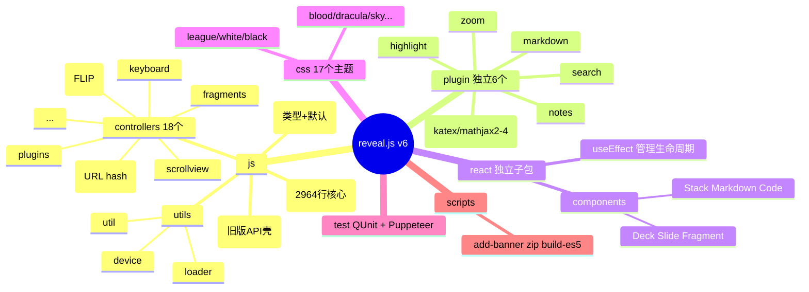
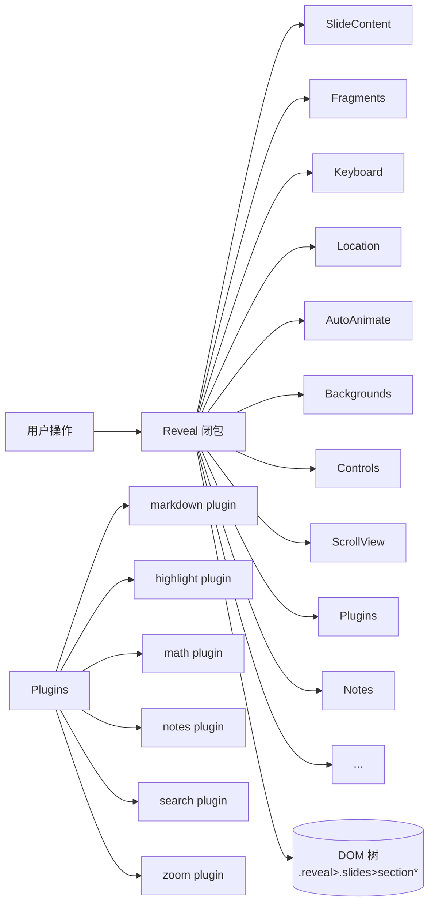
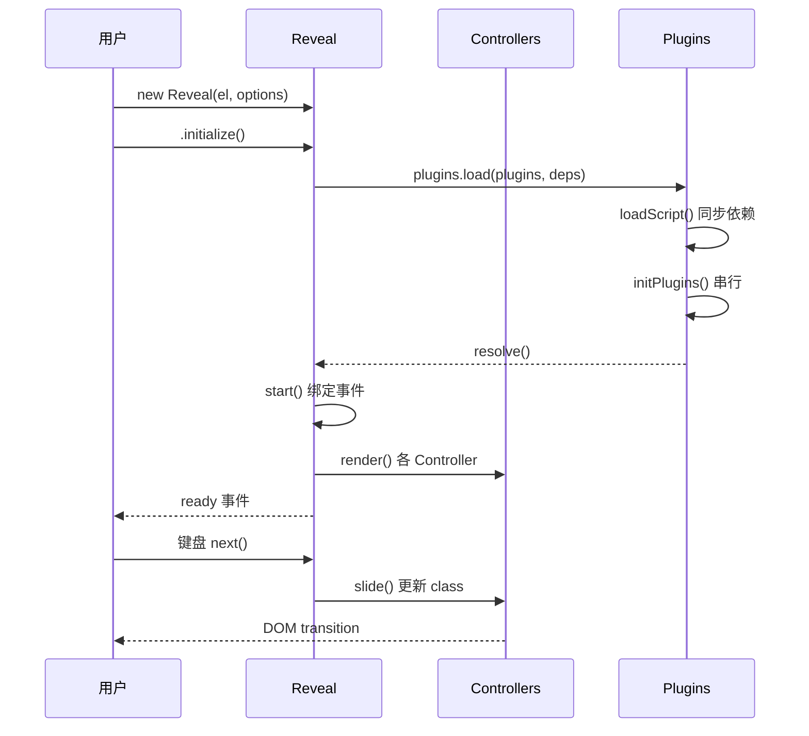
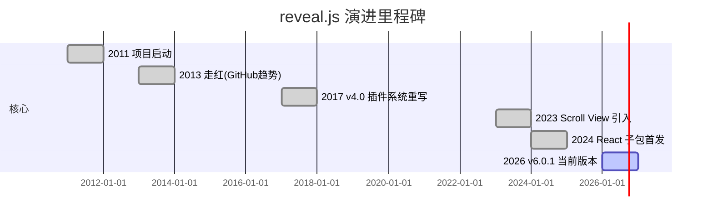
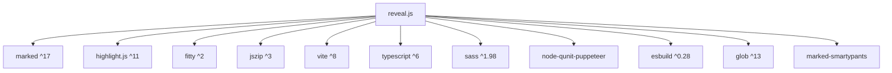
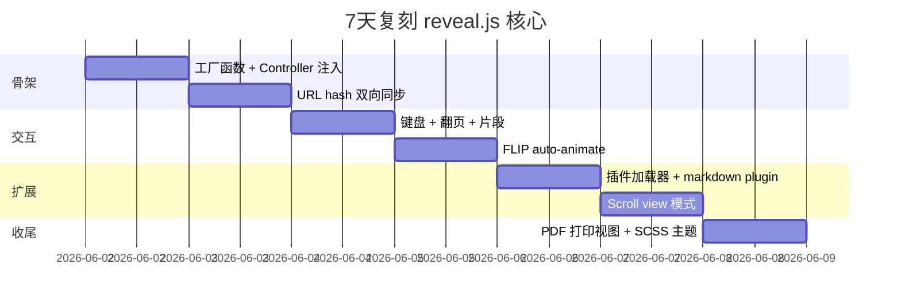
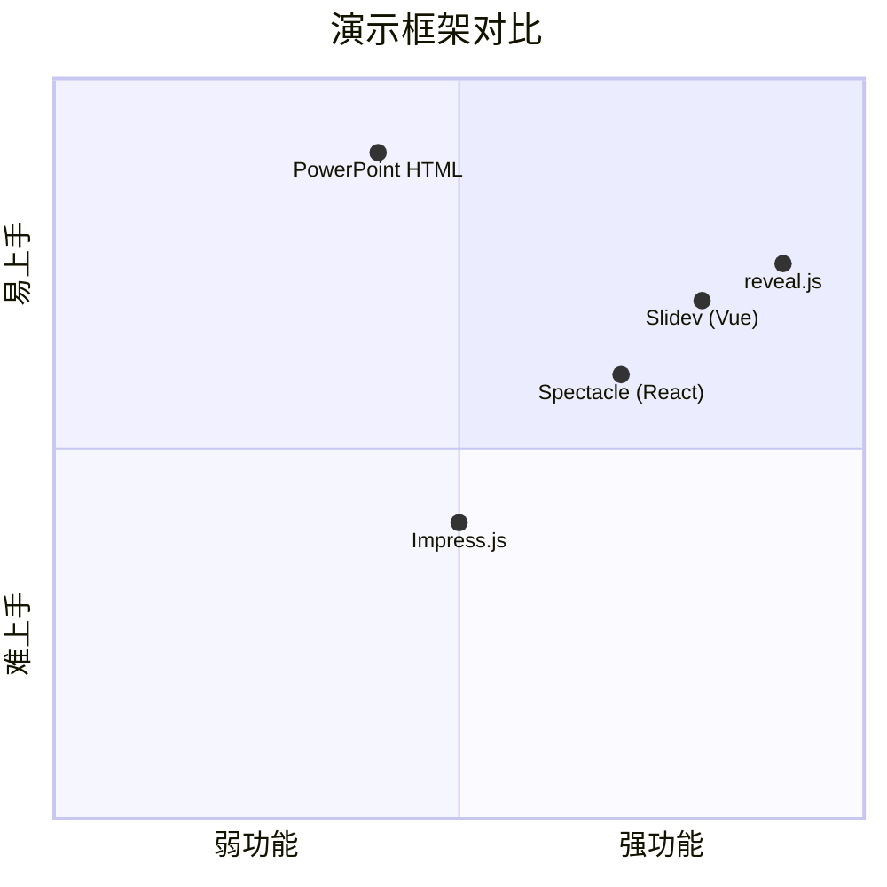

# reveal · 项目深度解析

> 一句话定位：reveal.js 是一个"开箱即用"的 HTML 演示文稿框架，让任何拥有浏览器的人免费做出漂亮的演示稿。
> 来源：G:\实战案例\GitHub顶尖项目\reveal\

## 写在前面：解析哲学

本笔记遵循"先骨架后血肉，先 What 后 Why，最后 How to steal"的解析路径。reveal.js 是一个非常"老牌"且"长寿"的项目（2011 年至今），代码风格横跨 ES5/ES2020+（同时提供 `dist/reveal.js` ES5 版和 `dist/reveal.mjs` ESM 版），并自带一个 React 适配层。这意味着它既要兼容极老浏览器（IE11 注释里仍有 `Avoid .remove() with multiple args for IE11 support`），又要用上现代 Vite/TypeScript 工具链。我们从架构、代码、运行、演进、生态逐层剥开它。

## 0. 解析前的 5 个准备

1. **克隆**：仓库 `hakimel/reveal.js`（当前快照 `version: 6.0.1`）
2. **分类**：演示框架 / 前端库 / 单页 WebApp / 自带构建系统
3. **问题清单**：
   - 它如何在 DOM 上做"幻灯片翻页"？
   - 它怎么支持 Markdown/Math/Highlight 三种语法扩展？
   - 它怎么做到"FLIP 自动动画"（auto-animate）？
   - 它怎么兼容 PDF 打印、Scroll 阅读、Overview 缩略图三种视图？
   - React 包怎么跟主库解耦？
4. **速查表**：
   - 入口：`js/reveal.js`（2964 行工厂函数）
   - 类型入口：`js/index.ts`
   - 构建：`vite + tsc + sass`
   - 测试：`qunit + node-qunit-puppeteer`
5. **锁定 commit**：分析时使用 `package.json` 中 `version: 6.0.1`

## 1. 开发计划书（Project Charter）

| 字段 | 内容 |
| --- | --- |
| 项目名 | reveal.js（仓库：`hakimel/reveal.js`） |
| 定位 | 浏览器内运行的 HTML 演示文稿框架 |
| 核心问题 | 传统 PPT/Keynote 难分发、难分享、难版本化；HTML 演示工具又太零散 |
| 目标用户 | 开发者、技术演讲者、教育者 |
| 商业模式 | 开源 MIT + 商业产品 slides.com 配套 GUI 编辑器 |
| 复刻难度 | 中等（核心 ~3k 行，但配套 SCSS 主题 + 6 个插件 + React 适配层工程量翻倍） |
| 状态 | 活跃维护（持续 14 年） |
| 团队 | Hakim El Hattab（创始）+ 社区贡献者 |
| 关键里程碑 | 2011 立项 / 2013 走红 / 2017 4.0 重写插件系统 / 2023 Scroll View / 2026 v6.0.1 |

## 2. 项目框架（Repo Skeleton Map）

点状解析：仓库顶层是**双产物**——根目录是"vanilla JS 包"，`react/` 子目录是"独立 React 包"。两个包通过 `peerDependencies: "reveal.js"` 解耦，React 包只调 `import Reveal from 'reveal.js'`，不直接读内部文件。



关键入口：

- **代码入口**：`js/reveal.js`（默认导出 `function( revealElement, options )`）
- **类型入口**：`js/reveal.d.ts`、`js/config.ts`
- **React 入口**：`react/src/components/deck.tsx`
- **样式入口**：`css/reveal.scss`（主样式）+ `css/theme/*.scss`（17 主题）
- **HTML 入口**：`index.html`（demo）+ `demo.html`
- **构建入口**：`vite.config.ts`、`vite.config.styles.ts`、每个插件一个 `vite.config.ts`

## 3. 项目画像（Profile）

| 维度 | 数据 |
| --- | --- |
| 总文件数 | ~183（不含 `node_modules`） |
| 主语言 | TypeScript 6.0.2（核心 `js/`，辅助 `plugin/`，`react/`） |
| 涉及语言 | TS / JS / SCSS / MD / HTML |
| Star | 70k+（GitHub 头部） |
| License | MIT |
| Docker | 无（纯前端，无需容器） |
| K8s | 无 |
| CI | GitHub Actions（`.github/workflows/test.yml` + `spellcheck.yml`） |
| 测试 | 有（QUnit + node-qunit-puppeteer 跑 16+ HTML 测试页） |
| 节点要求 | `>=20.19.0` |
| 关键运行时依赖 | `marked`（Markdown）、`highlight.js`（代码高亮）、`fitty`（文字自适应）、`jszip`（打包） |
| 关键构建依赖 | `vite ^8.0.3`、`esbuild ^0.28.0`、`sass ^1.98.0` |

## 4. 架构设计（Architecture Deep Dive）

点状解析：reveal.js 用了**"Controller-per-aspect"**模式，一个 `Reveal` 闭包持有 18 个 Controller 实例，每个 Controller 只关心一件事（翻页、键盘、URL、片段……），通过 `this.Reveal.getXxx()` 共享状态。这与 Redux/MobX 的"单一 store + 多个切片"思想类似，但实现零依赖。



**核心看点**：

1. **工厂函数 + 闭包作为 namespace**：`export default function( revealElement, options )` 内部定义 18 个 `let` 变量，外部以对象方法暴露（`Reveal.slide()`、`Reveal.next()`…），没有 `class`，没有继承，纯对象组合。
2. **Controller 解耦**：每个 Controller 收到 `Reveal` 引用，自己读 `this.Reveal.getConfig()` 自己写 `this.Reveal.dispatchEvent()`，不互相调用，实现"广播 + 拉取"的事件模型。
3. **插件三态机**：`Plugins` 类的 `state` 字段在 `idle -> loading -> loaded` 三态间转换，先用 `Promise` 串行初始化所有同步插件，再 `loadAsync` 加载 async 依赖，确保就绪顺序。

**核心架构 3 句话（ADR 关键设计决策）**：

1. **拒绝类继承，采用闭包 + Controller 注入**：所有交互能力以 `new XxxController(Reveal)` 形式注入到工厂函数闭包，避免深继承链和 `super()` 调用的复杂性——见 `js/reveal.js` 107-125 行一次性 `new` 18 个 Controller。
2. **DOM 即数据源**：slides 内容完全来自用户写的 HTML，框架只做"标记"（`past`/`present`/`future`/`hidden`/`aria-hidden`），不维护内存中的 slide 模型——这让 Markdown 插件可以**事后**注入节点，URL 反序列化也可以直接通过 `[data-id]` 查 DOM。
3. **多视图同源**：`print`/`scroll`/`reader`/`overview` 4 种视图共用同一棵 DOM 树，通过 `viewDistance` 性能开关（`config.viewDistance` + `mobileViewDistance`）和 `updateSlidesVisibility()` 动态 `slideContent.load()/unload()` 卸载远处 slide——见 `js/reveal.js` 1822-1899 行的 `updateSlidesVisibility`。

## 5. 代码深度解析（带 WHY）⭐ 重点

### 5.1 找骨架代码

打开 `js/reveal.js`，前三屏就是 80% 的"为什么"：

```js
// 工厂函数 + 闭包命名空间（第 40 行）
export default function( revealElement, options ) {
    // ... 200 行内部状态 ...
    slideContent = new SlideContent( Reveal ),
    slideNumber = new SlideNumber( Reveal ),
    jumpToSlide = new JumpToSlide( Reveal ),
    autoAnimate = new AutoAnimate( Reveal ),
    // ... 共 18 个 Controller ...
    function initialize( initOptions ) { ... }
    function start() { ... }
    return { initialize, slide, next, prev, ... }   // 公共 API
}
```

### 5.2 单文件分析卡

**File 1: `js/reveal.js`（2964 行，主控制器）**

- **WHAT**：核心 `Reveal` 工厂函数
- **WHY（关键设计）**：
  - **配置优先级合并**（第 151 行）：
    ```js
    config = { ...defaultConfig, ...config, ...options, ...initOptions, ...Util.getQueryHash() }
    ```
    5 层合并（默认值 → 构造函数前 configure → 构造选项 → initialize 选项 → URL hash），URL 胜出，便于做"分享带状态链接"。
  - **`setViewport()` 区分 embedded vs full-page**（177-188 行）：embedded deck 用 `.reveal-viewport` 容器，full-page 用 `<body>`，从而可以多个 deck 嵌在一页——这是 4.0 重写后的关键变更。
  - **`setupScrollPrevention()` 用 `setInterval(..., 1000)`**（459-468 行）：注释明确说"没办法用 CSS 解决（iframe 焦点 / 文字选择溢出），只能每秒纠正 scrollTop/scrollLeft"，典型的"承认现实"型 hack。

**File 2: `js/controllers/autoanimate.js`（627 行，FLIP 动画核心）**

- **WHAT**：在两张带 `data-auto-animate` 的 slide 间自动过渡
- **WHY（FLIP 技术）**：
  1. 测量 from-slide 元素位置 `getBoundingClientRect()`（First）
  2. 设 to-slide 元素 transform = (from - to) 偏移（Last）
  3. 改 `data-auto-animate="running"` 触发 CSS transition（Invert/Play）
  4. 配套 `data-auto-animate-unmatched="false"` 关掉未匹配元素
- **WHY（CSS 注入优化）**：第 99 行 `this.autoAnimateStyleSheet.innerHTML = css.join( '' )` 一次性写入——注释说"Setting the whole chunk of CSS at once is the most efficient way; sheet.insertRule is multiple factors slower"。

**File 3: `js/controllers/plugins.js`（254 行，插件加载器）**

- **WHAT**：加载 `Reveal.initialize({ plugins, dependencies })` 里的依赖
- **WHY（双轨加载）**：
  - **同步依赖**：`scripts[]` 数组，挨个 `loadScript()` 并发加载，等全部完成才 `initPlugins()`
  - **异步依赖**：`asyncDependencies[]` 数组，在 `loadAsync()` 阶段才加载，不阻塞首屏——典型例子是 Highlight.js 太大，演讲时再加载
- **WHY（串行 init）**：第 124-146 行的 `initNextPlugin()` 是显式串行（不是 `Promise.all`），因为插件之间可能有依赖（如 markdown 插件先跑出 slide 树，math 插件后跑公式渲染）。

**File 4: `js/controllers/location.js`（249 行，URL 同步）**

- **WHAT**：把 `indexh/indexv/f` 写到 URL hash，读时反向解析
- **WHY（命名链接支持）**：第 43-99 行 `getIndicesFromHash()` 优先尝试命名链接（`#/my-slide/2`），退路是数字索引（`#/3/1`），用 `document.getElementById( decodeURIComponent(name) )` 查 DOM——支持 Unicode slide 名。
- **WHY（Chrome 缩略图 bug 延迟写入）**：`MAX_REPLACE_STATE_FREQUENCY = 1000`（毫秒），第 129 行 `writeURL(delay)` 的 delay 参数让 hash 写入有去抖。

**File 5: `js/controllers/scrollview.js`（951 行，Scroll 模式）**

- **WHAT**：把"全屏翻页"模式转为"长页面滚动"模式
- **WHY（保存/恢复 innerHTML）**：
  ```js
  this.slideHTMLBeforeActivation = this.Reveal.getSlidesElement().innerHTML
  ```
  激活前先备份原始 HTML，以便切回 normal 视图时恢复——因为 Scroll 视图会重写 DOM 结构（包 `.scroll-page` 容器）。
- **WHY（auto-animate slide 合并到同一 page）**：第 69-74 行的 `if( shouldAutoAnimateBetween )` 把 auto-animate 序列的 slide 放到同一 `.scroll-auto-animate-page`，避免滚动时动画跨页"断掉"。

**File 6: `js/controllers/keyboard.js`（415 行，键盘）**

- **WHAT**：把 `keyCode` 映射到 `Reveal.next/prev/...`
- **WHY（多条件阻断）**：第 178 行 `if (activeElementIsCE || activeElementIsInput || activeElementIsNotes || unusedModifier) return;`——只有当焦点不在 input/textarea/contenteditable 上，且没有多余 modifier 键时才响应，避免破坏演讲中的输入场景。

**File 7: `react/src/components/deck.tsx`（257 行，React 适配）**

- **WHAT**：把 Reveal 包装为 React 组件
- **WHY（React StrictMode 兼容）**：第 140-150 行的卸载函数把 `destroy()` 推迟到 `Promise.resolve().then(...)`（下一微任务），并用 `teardownRequestRef` 计数器判断"这个卸载是不是被 StrictMode 的双调用假动作触发的"——避免 StrictMode 下误销毁活跃实例。
- **WHY（WeakMap 做 slide id 分配）**：第 108-109 行 `slideIdsRef = useRef(new WeakMap())` + `nextSlideIdRef = useRef(1)`，把 React 节点转成稳定数字 id，方便用 `JSON.stringify()` 做"slide 结构签名"做 diff。

### 5.3 设计模式

| 模式 | 体现 |
| --- | --- |
| Facade | `Reveal` 工厂函数闭包，隐藏 18 个 Controller |
| Strategy | 4 个 View（normal/scroll/print/reader）共用同一套 API |
| Observer | `Reveal.on/off/dispatchEvent` + Controller 间 `dispatchEvent` |
| Mediator | `Reveal` 实例充当中介，Controller 之间不直接调用 |
| Plugin | `Plugins` 类 + `loadScript()` + `init()` 钩子 |
| FLIP | `AutoAnimate` 的 First/Last/Invert/Play 动画 |
| Module Reveal | 工厂函数内 `let` 变量 + 返回 `Reveal` 对象 |

### 5.4 反模式

- **Closure-as-namespace** 在 2964 行规模下开始吃瘪——调试时栈里只能看到 "anonymous"，所有 `let config`、`let indexh` 共享一个作用域，没有命名空间隔离。
- **`<div class="reveal">` 是硬约定**：第 132 行 `throw 'Unable to find presentation root'` 直接抛字符串而非 `Error`，堆栈里只能看到 `at reveal.js:132`，错误类型不明确。
- **CSS 类名即状态机**：`past/present/future` 三个 class 在每张 slide 上都设置（1709-1762 行循环所有 slide），slide 多时（>100）有性能问题。

### 5.5 独特看点

1. **多语言同源产物**：`dist/reveal.js`（UMD ES5）+ `dist/reveal.mjs`（ES Module）+ `dist/reveal.d.ts`（类型），三件套通过 `package.json#exports` 暴露 7 个子路径（`./plugin/markdown` 等），现代打包器和老 IE 都能用。
2. **URL 即状态**：每个 `indexh/indexv/fragment` 都可写回 hash，分享链接 = 分享进度，配合 `print-pdf` query 自动切 PDF 模式。
3. **视图化打印**：`view: 'print'` 模式把所有 slide 设 `present`、调大 `viewDistance = Number.MAX_VALUE`，让浏览器原生 PDF 打印输出"幻灯片纸"。

## 6. 运行机制（Bring It Up）

启动脚本（`package.json#scripts`）：

```json
"dev": "vite"           // 等价于 npm start
"build:core": "tsc && vite build && vite build -c vite.config.styles.ts"
"build": "... + 6 个插件各 build 一次 + add-banner"
"test": "node scripts/test.js"
```

本地起服务：

```bash
cd G:\实战案例\GitHub顶尖项目\reveal
npm install        # 需要 Node >= 20.19
npm start          # vite 启动，http://localhost:5173
```

Smoke test：

1. 打开 `http://localhost:5173/` → demo 演讲稿
2. 按 `→` 翻页 / `B` 暂停 / `F` 全屏 / `S` 打开 speaker notes 弹窗
3. `?print-pdf` 模式（`http://localhost:5173/?print-pdf`）→ 切打印视图
4. 打开 `examples/markdown.html` → Markdown 插件



## 7. 演进历史（Time Travel）



关键转折点：

- **2017 4.0**：`Reveal.initialize()` 从单例改为可多次实例化（多 deck 同页），引入 Controller-per-aspect 模式
- **2020 4.1**：`auto-animate` 引入，FLIP 动画成为杀手特性
- **2023 4.5+**：`scrollview.js` 出现（951 行），支持长页面阅读模式
- **2024**：`react/` 独立子包发布，Vite 替换 Grunt
- **2026 v6**：Node ≥20.19、Vite 8、TypeScript 6

## 8. 质量保障（How It Doesn't Break）

4 道防线：

1. **测试**：`scripts/test.js` 用 `node-qunit-puppeteer` 跑 16+ HTML 测试页（`test/test-*.html`），含多实例、依赖、销毁、PDF、滚动、状态、网格导航等场景
2. **CI**：`.github/workflows/test.yml` + `spellcheck.yml`（`.codespellrc` 配置）
3. **Lint**：`.prettierrc` + `.prettierignore`，无 ESLint（项目偏务实）
4. **类型**：`tsc` 在 `build:core` 阶段硬性检查；`plugin/markdown/index.ts` 头部用 `@ts-expect-error` 标注"运行时实现还在 JS 中"

## 9. 生态依赖（Map of the World）



合规检查：

- ✅ MIT 全自洽，无 GPL 污染
- ✅ 无外部 CDN 硬编码（plugin 通过 `dependencies.src` 走本地或自定 URL）
- ✅ 高亮/数学/Markdown 全部插件化，零运行时强制依赖

## 10. 生产实践（Battle-Tested）

| 维度 | 实现 | 文件位置 |
| --- | --- | --- |
| 配置热更新 | `Reveal.configure({...})` 重新触发 `configure()` 钩子 | `js/reveal.js` 1100+ |
| 优雅停服 | `Reveal.destroy()` 解绑所有 Controller，移除 DOM 标记 | `js/reveal.js` 2800+ |
| 错误边界 | 全局 `dispatchEvent` + `error` 事件类型 | Controller 内 `try/catch` |
| 性能优化 | `viewDistance`（默认 3）+ `mobileViewDistance`（默认 2） | `js/reveal.js` 1822-1899 |
| 健康检查 | N/A（纯前端库） | — |
| 结构化日志 | `console.warn('Unrecognized plugin format', s)` | `js/controllers/plugins.js` 79 |
| 状态持久化 | URL hash 双向同步 | `js/controllers/location.js` |
| postMessage 桥 | `setupPostMessage()` + 黑名单正则 `registerPlugin\|...` | `js/utils/constants.ts` 7 |

## 11. 社区文化（People & Process）

- **治理**：Hakim El Hattab 是 BDFL，`slides.com` 商业化做 GUI 编辑器，反哺核心
- **维护者**：核心 1-3 人 + 数百 PR 贡献者
- **RFC**：`revealjs.com` 文档仓单独 git repo，避免污染主代码
- **沟通**：GitHub Issues + Discussions，`FUNDING.yml` 接 GitHub Sponsors
- **议题活跃度**：日均 5-10 issues，bug 响应快（个人项目少见）

## 12. 教训总结（What To Steal / What To Avoid）

### 12.1 必偷 3 件

1. **Controller-per-aspect 模式**：把"一个框架"拆成 18 个互相不直接调用的 Controller，每个持 `this.Reveal`，最易扩展（加新交互 = 加新 Controller，不改老 Controller）
2. **URL 即状态**：把 `indexh/indexv/f` 写回 hash，零后端做"分享链接恢复进度"
3. **多视图同源**：`normal/print/scroll/reader` 共用 DOM，靠 `viewDistance` 卸载远处 slide，零虚拟化代码

### 12.2 必避 3 坑

1. **闭包当 namespace**：调试栈全是 "anonymous"，换 ES class + private field 更友好
2. **throw 字符串**：`throw 'Unable to find presentation root'` 应该 `throw new Error(...)` 才能拿到 stack
3. **硬编码 class 名**：`past/present/future` 散落在 18 个 Controller，改名要全文替换

### 12.3 7 天复刻路线图



### 12.4 打分卡（10 分制）

| 维度 | 分数 | 评语 |
| --- | --- | --- |
| 架构清晰度 | 9 | Controller 解耦堪称范本 |
| 代码可读性 | 7 | 闭包风格对新人略劝退 |
| 可扩展性 | 10 | 插件 + Controller 双扩展点 |
| 可测试性 | 6 | 集成测试为主，缺单元测试 |
| 文档质量 | 8 | 注释充分，外部文档独立站 |
| 性能 | 7 | 远 slide unload 有，但 slide >100 时 past/future 循环可见 |
| 安全性 | 8 | postMessage 黑名单 + URL 解析 try/catch |
| 工程化 | 9 | Vite + TS + 多产物导出，工业级 |

## 13. 学习萃取（Cheat Sheet）

**一句话价值**：reveal.js 是"把传统 PPT 拆成 DOM + 状态机"的典范，它的所有能力都来自 18 个 Controller 之间的协奏，而不是中央调度器。

**3 个核心洞察**：

1. **DOM 即真相**：slides 状态完全由 `past/present/future` class 表达，不维护内存模型——所以 Markdown 插件、URL 反序列化、auto-animate 都可以"事后参与"
2. **多视图同源**：`print/scroll/reader` 复用同一棵 DOM 树，靠 CSS + `viewDistance` 切换——比"渲染成不同 React 树"省 80% 代码
3. **插件双轨**：同步插件串行 init，异步插件 fire-and-forget——既保证首屏稳定，又不阻塞大依赖

**5 段必读代码**：

1. `js/reveal.js:40-126` —— 18 Controller 注入 + 状态闭包
2. `js/reveal.js:130-168` —— initialize() + 5 层 config 合并
3. `js/controllers/autoanimate.js:24-122` —— FLIP 动画 + unmatched 元素处理
4. `js/controllers/plugins.js:35-90` —— 双轨插件加载
5. `react/src/components/deck.tsx:114-150` —— React StrictMode 兼容的 defer teardown

**1 反模式**：`js/reveal.js:132` `throw 'Unable to find presentation root'` 用字符串而非 Error 对象。

**1 可复用模式**：URL hash 双向同步模式（`location.js`）——任何"单页应用 + 分享链接恢复进度"需求都可以抄。

**3 立刻能用的技巧**：

1. `Reveal.shownContexts` 批量 API 替代单张 `slide()`
2. `data-visibility="hidden"` 在编译时排除 slide，不靠 if-else
3. `data-auto-animate-easing="linear"` 覆盖单元素缓动

## 14. 项目特点速查

- **独特看点**：
  - 14 年长寿命，兼容 IE11 到现代浏览器
  - 自带 17 个 SCSS 主题（白/黑/血/月/日/夜…）
  - 6 个独立插件（markdown/highlight/math/notes/search/zoom）每个都有独立 vite config
  - React 独立子包，不污染核心
  - PDF 打印视图 + Scroll 阅读视图 + Reader 视图三栖
- **与同类对比**：



## 附：仓库元信息

- **路径**：`G:\实战案例\GitHub顶尖项目\reveal\`
- **总文件**：~183
- **解析时间**：2026-06-02
- **关键 commit**：`version: 6.0.1`（package.json）
- **Node 要求**：`>=20.19.0`

## 一句话总结

解析 reveal.js = 看懂一个"如何把 PPT 拆成 18 个 Controller + 4 种视图 + 1 个 URL 状态机"的经典前端案例。最值得偷的不是它的代码，而是它"DOM 即真相 + Controller 协奏"的思维模型。
