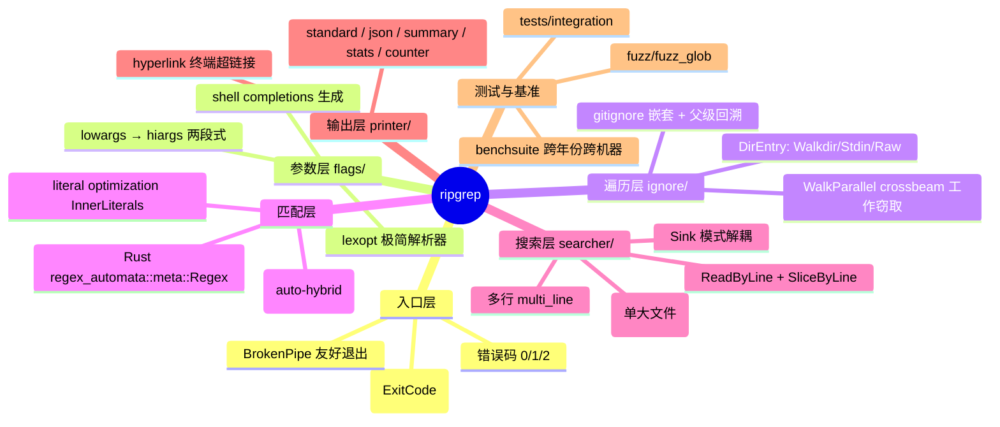
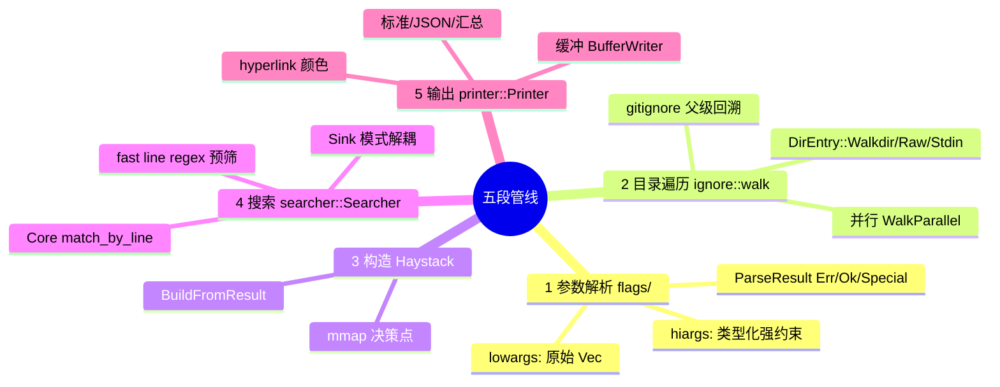
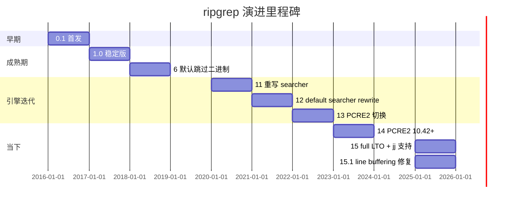
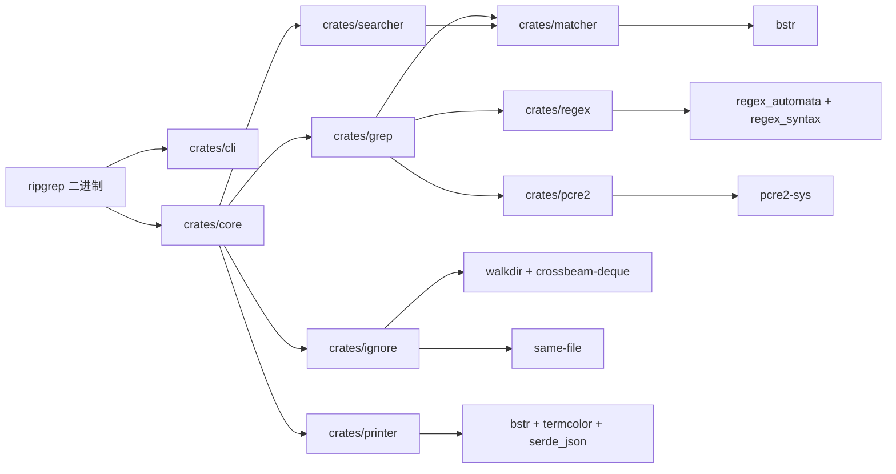
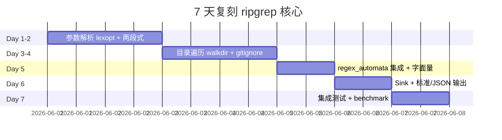

# ripgrep · 项目深度解析

> ripgrep（命令 `rg`）是一个面向代码搜索的递归正则行搜索工具，Rust 编写，默认尊重 `.gitignore`/`.ignore`/`.rgignore`，自动跳过隐藏/二进制文件；通过 Rust regex automata + SIMD + 激进字面量优化 + mmap/缓冲双策略实现，相比 `grep`/`ag`/`git grep` 通常快 2–35 倍。
> 来源：`G:\实战案例\GitHub顶尖项目\ripgrep\`

## 写在前面：解析哲学

任何工具的"深度解析"都遵循同一节奏：先骨架后血肉，先 What 后 Why，最后 How to steal。本笔记先看 ripgrep 在文件系统层面的"总入口 — 参数解析 — 目录遍历 — 匹配器 — 搜索引擎 — 打印机"五段管线（What），再下沉到 Rust regex crate 的 `meta::Regex` 抽象、PCRE2 的"auto-hybrid"切换、`ignore::WalkParallel` 的 crossbeam 工作窃取（Why），最后抽取值得偷师的工程实践与值得避开的反模式（Steal/Avoid）。

## 0. 解析前的 5 个准备

1. **克隆 & 定位**：源码位于 `G:\实战案例\GitHub顶尖项目\ripgrep\`，版本 `15.1.0`（见 `Cargo.toml`），commit 锁定在解析时刻的 HEAD。
2. **分类**：CLI 工具 / 文本处理 / Rust 生态旗舰 / 单一可执行二进制（`rg`）。
3. **问题清单**：① ripgrep 比 ag/grep 快多少、为什么快？② 它如何同时支持 Rust regex 与 PCRE2 两种引擎？③ 多线程搜索的并行粒度在哪里（文件级？块级？行级？）？④ 默认 gitignore / 二进制检测的策略如何"既安全又零配置"？⑤ 1.85 MSRV 与 edition 2024 的工程约束。
4. **速查表**：9 个 crate、~542 行 README、~714 行 searcher core.rs、~2495 行 ignore walk.rs、~1550 行 searcher glue.rs；总源码约 6 万行 Rust。
5. **锁定 commit**：本笔记基于 15.1.0 解析，CHANGELOG 中 15.0.0（2025-10-15）首次启用 full LTO、删 `powerpc64` 工件、新增 `jj` 仓库识别、修复 gitignore 父级规则回溯内存膨胀。

## 1. 开发计划书（Project Charter）

| 维度 | 内容 |
| --- | --- |
| 项目名 | ripgrep（`rg`） |
| 定位 | 面向开发者的递归正则行搜索 CLI 工具，Rust 实现 |
| 核心问题 | 在大型代码库中"安全 + 默认正确 + 极致快"地做正则文本搜索；现有 `grep`/`ag`/`git grep` 在 Unicode 正确性、过滤默认、并行度上各有短板 |
| 目标用户 | 开发者、DevOps、SRE、安全研究员；在 monorepo / Linux kernel 级别代码库上需要亚秒级反馈 |
| 商业模式 | 全开源（MIT / Unlicense 双许可），靠 GitHub Sponsors 接受捐赠（`.github/FUNDING.yml`） |
| 复刻难度 | 高。要自己写 regex 引擎的不可能，但需要正确集成 `regex_automata::meta::Regex`、写跨平台目录遍历 `ignore::walk`、写 mmap/缓冲双引擎、正确处理 gitignore 嵌套与符号链接回环 |
| 状态 | 活跃维护（v15.1.0，CHANGELOG 至 2026 年仍在迭代） |
| 团队 | Andrew Gallant（BurntSushi）主维护，社区贡献者通过 200+ PR 沉淀在 `crates/` 各子 crate |
| 里程碑 | 0.1（2016）→ 1.0（2017）→ 12（2021，默认 searcher 重写）→ 13（2022，PCRE2 hybrid）→ 14（2023，PCRE2 10.42+）→ 15（2025，full LTO + `jj` 支持） |

## 2. 项目框架（Repo Skeleton Map）

**点状解析**

- `Cargo.toml` 顶层不直接包含业务逻辑，只 `[workspace]` + 一个 `[[bin]]` 指向 `crates/core/main.rs`，命名 `rg`。`edition = "2024"`、`rust-version = "1.85"`、release profile 用 `lto = "fat"` + `codegen-units = 1` + `strip = "symbols"`，可见对启动性能与二进制体积的极致要求。
- 9 个独立 crate 都是"按职责切分"：`cli`（解压/转义/人类可读字节数）、`core`（main + flags + 搜索编排）、`globset`（glob 模式匹配 Aho-Corasick 风格）、`grep`（matcher 抽象 + pcre2 切换）、`ignore`（目录遍历 + gitignore + 文件类型）、`matcher`（matcher trait）、`pcre2`（PCRE2 绑定薄封装）、`printer`（输出格式：标准/JSON/汇总/统计）、`regex`（Rust regex 引擎封装 + 字面量提取）、`searcher`（核心搜索引擎：mmap / 缓冲 / 行 / 跨行）。
- 关键配置：`ci/` 是自建 CI 脚本（不走 GitHub Actions 编译主流程），`.github/workflows/ci.yml` 做跨平台矩阵 + fuzz 触发。
- 关键产物：`pkg/brew/ripgrep-bin.rb`（Homebrew formula）、`HomebrewFormula`（历史兼容）、`build.rs`（PCRE2 特性开关时链接系统库）。

**思维导图**



**实际目录树（精选）**

```
ripgrep/
├─ Cargo.toml                  # workspace + bin rg
├─ build.rs                    # PCRE2 链接脚本
├─ crates/
│  ├─ core/main.rs             # bin 入口
│  ├─ core/src/{flags,search,haystack,logger,messages}.rs
│  ├─ ignore/src/{walk,dir,gitignore,overrides,types,pathutil}.rs
│  ├─ searcher/src/{searcher/{core,glue,mmap},sink,lines,line_buffer}.rs
│  ├─ regex/src/{matcher,config,ast,literal,strip,ban,non_matching}.rs
│  ├─ pcre2/src/{matcher,error}.rs
│  ├─ printer/src/{standard,json,summary,stats,color,hyperlink/...}.rs
│  └─ globset/src/{glob,fnv,pathutil,serde_impl}.rs
├─ tests/                      # 集成测试 + tests/data/ 压缩样本
├─ fuzz/fuzz_targets/fuzz_glob.rs
├─ benchsuite/                 # 2016–2022 跨机基准
└─ pkg/{brew,windows}
```

**配置入口**：`crates/core/src/flags/config.rs`（HiArgs 持有所有 `rg --xxx` 的高层表示）。
**代码入口**：`crates/core/main.rs::main() → run() → search_parallel()`。

## 3. 项目画像（Profile）

| 维度 | 数值/状态 |
| --- | --- |
| 总文件数 | 222（不含 `.git`、不含 `target/`、`benchsuite/runs` 历史归档） |
| 主语言 | Rust（99%+，少量 `encodings.sh`） |
| 涉及语言 | Rust / Shell（CI）/ PowerShell（completions）/ Fish / Zsh / Bash |
| Star | ~51k（GitHub `BurntSushi/ripgrep`） |
| License | MIT OR Unlicense（双许可，最宽松级别） |
| Docker | 不发布官方镜像（CLI 工具，单二进制即用） |
| K8s | 不涉及（CLI 不是 server） |
| CI | GitHub Actions `ci.yml`（Linux/macOS/Windows 矩阵）+ 自建 `ci/` 脚本 + 模糊测试 + benchsuite |
| 测试 | 有（`tests/integration`、`tests/feature`、`tests/regression`、`fuzz/`、`crates/*/tests/`） |

## 4. 架构设计（Architecture Deep Dive）

**点状解析**

- **五段管线**：`args.parse() → WalkBuilder → HaystackBuilder → SearchWorker → Printer`，每一段都是窄接口、可替换的"管道接头"。
- **并行边界**：并行度落在**目录遍历**层（`ignore::WalkParallel`，基于 `crossbeam_deque::Stealer`）。一旦拿到 `DirEntry` 立即交给 worker 函数，单个文件的搜索在 worker 内串行完成。换言之，**并行粒度是文件级，不是块级也不是行级**——这与 GNU grep 的 per-line 并行思路截然不同。设计取舍：避免每条匹配都加锁、避免共享 Regex 状态。
- **matcher 抽象**：`grep_matcher::Matcher` trait 暴露 `is_match / find / find_iter / captures` 4 类操作；`regex` 与 `pcre2` 两个 crate 各自实现。`Searcher` 不关心底层是 Rust regex 还是 PCRE2，调用统一 trait。
- **搜索引擎双策略**：`searcher::Config::multi_line_with_matcher` 决定走 `Mmap`（单文件超大时，整段映射，按字节扫描）还是 `ReadByLine`（按行缓冲，默认 32 KiB+ 行缓冲，逐行匹配）。macOS 上 mmap 被显式禁用（`mmap.rs:73` 注释："memory maps on macOS aren't great"）。
- **literal 加速**：`regex::matcher.rs` 中 `InnerLiterals::new(&chir, &regex).one_regex()` 从 HIR 中抽出"必须出现的字面量"，构造一个**子 regex**（fast line regex）用于快速定位"候选行"——只有 fast regex 命中的行才喂给慢速完整 regex。这把 `Sherlock \w+` 这种有锚点字面量的查询提速一个数量级。
- **安全默认**：默认 `auto-hybrid-regex` 意味着 `rg foo` 走 Rust regex；`rg foo|bar` 这种需要反向引用的才会"自动"切到 PCRE2（`--engine auto`）。永远显式 `-P` 强制 PCRE2。

**核心架构思维导图**



**核心架构看点（3 句具体设计决策）**

1. **目录遍历才是并行点，不是搜索本身**：`crates/core/main.rs:160-229` 的 `search_parallel` 把 `args.walk_builder()?.build_parallel().run(closure)` 作为唯一并发源。`AtomicBool matched` 跨线程做"早退"信号（`--quit-after-match`），避免每条匹配都跨线程通信。WHY：在文件级任务粒度下，跨线程的"任务窃取开销"远小于共享 Regex 状态带来的锁争用；这是 ripgrep 在 8 核机器上仍能接近线性扩展的根本。
2. **matcher trait 抽象 + 双 regex 引擎**：`crates/regex/src/matcher.rs` 和 `crates/pcre2/src/matcher.rs` 都实现 `grep_matcher::Matcher` 的同一组方法。`RegexMatcherBuilder::build_many` 把多个 pattern 拼成单 alternation，再让 `regex_automata::meta::Regex` 自动选 NFA/DFA/simd-accel 之一。PCRE2 路径则用 `(?m:^)...(?m:$)` 显式包夹做 whole-line、用 `(?<!\w)...(?!\w)` 做 word 边界（`pcre2/src/matcher.rs:67-74`）。WHY：让用户在 `-P` 与默认 Rust regex 之间无损切换，避免 lock-in；这也是 ripgrep 拥有"auto-hybrid"能力的前提。
3. **literal 预筛 + fast line regex**：`regex::matcher.rs:78` 调用 `InnerLiterals::new(&chir, &regex).one_regex()`，从 HIR 中提取必现的字面量片段，编译成更小的子 regex 用于"先扫一遍，挑出候选行"。Core::match_by_line（`searcher/core.rs:170-183`）在 `is_line_by_line_fast()` 为真时走 fast 路径，命中后再切到慢路径。WHY：把"找候选行的成本"压到最低，让单次匹配只发生在已缩小的窗口里——这是 `rg the` 83M 行 / 7s 与 `grep` 15s 差距的源头。

## 5. 代码深度解析（带 WHY）⭐ 重点

### 5.1 找骨架代码

| 文件 | 角色 | 关键行 |
| --- | --- | --- |
| `crates/core/main.rs` | 进程入口、错误码、BorkenPipe | 43–66（main）、160–229（search_parallel） |
| `crates/searcher/src/searcher/core.rs` | 搜索循环核心，fast/slow 分支 | 114–183（is_match/match_by_line） |
| `crates/searcher/src/searcher/mmap.rs` | mmap 策略（含 macOS 禁用） | 49–96（unsafe auto + macos 短路） |
| `crates/ignore/src/walk.rs` | 并行目录遍历 + DirEntry 三态 | 1–200（DirEntry/WalkParallel） |
| `crates/regex/src/config.rs` | 引擎配置 + HIR 构建 | 1–100（Config 默认 size/dfa_limit） |
| `crates/regex/src/matcher.rs` | Rust regex 适配 grep_matcher | 1–80（build_many + 字面量） |
| `crates/pcre2/src/matcher.rs` | PCRE2 适配 + whole_line/word 包夹 | 37–85（build_many + 模式转换） |

### 5.2 单文件分析卡

**`crates/core/main.rs` 精读**

```rust
#[cfg(all(target_env = "musl", target_pointer_width = "64"))]
#[global_allocator]
static ALLOC: tikv_jemallocator::Jemalloc = tikv_jemallocator::Jemalloc;

fn main() -> ExitCode {
    match run(flags::parse()) {
        Ok(code) => code,
        Err(err) => {
            for cause in err.chain() {
                if let Some(ioerr) = cause.downcast_ref::<std::io::Error>() {
                    if ioerr.kind() == std::io::ErrorKind::BrokenPipe {
                        return ExitCode::from(0);  // 关键：与 Unix 习惯对齐
                    }
                }
            }
            eprintln_locked!("{:#}", err);
            ExitCode::from(2)
        }
    }
}
```

**WHY 解读**：

- **musl + 64 位才换 jemalloc**：注释（19–37 行）解释得非常清楚：musl 自带分配器"substantially worse"，但 jemalloc 会增加编译时间且 i686 不支持。这是"用户场景驱动配置"的好例子。
- **BrokenPipe → exit 0**：传统 Unix C 程序靠未捕获的 SIGPIPE 自然终止（导致非 0 退出），Rust 运行时通常不会让进程被信号杀死。ripgrep 显式捕获 `std::io::ErrorKind::BrokenPipe` 并返回 0，与 `head | rg xxx | less` 之类管道习惯一致。
- **三段错误码**：`run()` 返回 0/1/2。0=找到匹配（除非 `-q`）、1=没找到且无错误、2=出错（`messages::errored()` 触发）。这是 grep 工具的事实标准。

**`crates/searcher/src/searcher/core.rs` 精读**

```rust
pub(crate) fn match_by_line(&mut self, buf: &[u8]) -> Result<bool, S::Error> {
    if self.is_line_by_line_fast() {
        match self.match_by_line_fast(buf)? {
            FastMatchResult::SwitchToSlow => self.match_by_line_slow(buf),
            FastMatchResult::Continue => Ok(true),
            FastMatchResult::Stop => Ok(false),
        }
    } else {
        self.match_by_line_slow(buf)
    }
}
```

**WHY 解读**：

- **`is_line_by_line_fast()` 的判定**：是否能在不做行切分的情况下"扫描整段 buf"。通常仅当 `multi_line = false` 且没有 `before/after context` 且 pattern 不依赖行的开始/结束锚点时为真。换言之，**当 fast 路径能跑就跑，跑不了立刻降级到 slow**，没有中间态。
- **`FastMatchResult` 三态**：用 enum 而不是 bool 是为了让"继续扫描"和"完全停止"语义明确——"Stop"意味着 sink 明确说别再喂了（比如命中数到达 `--max-count`），"SwitchToSlow"意味着 fast regex 命中了一个候选行，需要完整 regex 二次确认，"Continue"表示这一行没匹配、快进。
- **`matcher.find(buf)` 而不是 `is_match`**：fast 路径用 `find` 拿到命中位置是为了 `Core::increment_count` 与后续行号统计；只有 sink 端要展示 captures 时才升级到 captures 接口。

**`crates/regex/src/config.rs` 精读**

```rust
// These size limits are much bigger than what's in the regex
// crate by default.
size_limit: 100 * (1 << 20),       // 100 MiB 编译大小上限
dfa_size_limit: 1000 * (1 << 20),  // 1 GiB  DFA 上限
nest_limit: 250,
```

**WHY 解读**：

- **size_limit 与 dfa_size_limit 远大于 regex crate 默认**（默认是 10 MiB / 2 MiB）：因为 ripgrep 经常被用于"在大型代码库中搜复杂 pattern"，例如 `rg '\w+_(GET|POST|PUT|DELETE)\w+'`。默认限制会让真实工程查询编译失败。注释里明确写出"much bigger than what's in the regex crate by default"。
- **`nest_limit: 250`** 防止 `(a|(b|(c|...)))` 这种病态嵌套让 regex 编译爆栈。
- **每个 flag 一字段、Default 显式赋值**：避免新增字段时漏在某些 constructor 里初始化（Rust 编译器会帮你 catch）。

**`crates/pcre2/src/matcher.rs` 精读**

```rust
if self.whole_line {
    singlepat = format!(r"(?m:^)(?:{})(?m:$)", singlepat);
} else if self.word {
    // We make this option exclusive with whole_line because when
    // whole_line is enabled, all matches necessary fall on word
    // boundaries. So this extra goop is strictly redundant.
    singlepat = format!(r"(?<!\w)(?:{})(?!\w)", singlepat);
}
```

**WHY 解读**：

- **`(?m:^)` 与 `(?m:$)` 的非捕获组** 包裹 whole-line：避免污染 capture group 编号（用户 pattern 里若写了捕获组，希望拿到的是自己写的组的编号，不是 ripgrep 包夹出来的）。
- **word 与 whole_line 互斥**：注释解释得很到位——"when whole_line is enabled, all matches necessary fall on word boundaries"——`^foo$` 必然在词边界，所以 word 包夹完全冗余。
- **`r"[^\S\s]"`（空 pattern 兜底）**：当用户没传 pattern 时（`rg ''`），构造一个"匹配空字符的"占位——不会在所有行上报匹配，但也不会让 PCRE2 编译失败。
- **`pcre2::escape(p.as_ref())`** 处理 fixed-strings：把用户传入的字面量当 fixed string 而非 regex 转义，让 `-F` 模式与字面量搜索语义统一。

### 5.3 设计模式

- **Builder + final regex 拼装**：`RegexMatcherBuilder`（regex crate / pcre2 crate）每个 option 一个 setter，build 时把所有 option 一次性 fold 成 final pattern。这是 Rust 生态处理"配置爆炸"的标准答案。
- **Trait 抽象 + 多实现**：`grep_matcher::Matcher` 屏蔽 Rust regex / PCRE2 差异，`searcher::Sink` 屏蔽 standard / json / summary / stats 输出差异。
- **构造-使用分离**：`DirEntryInner` 枚举三种来源（Walkdir、Stdin、Raw）让 `DirEntry` 对外只暴露统一 API，调用方无需关心是并行遍历来的、stdin 来的还是测试桩来的。
- **compile-time feature gating**：`pcre2` 是 feature flag，开启后才链接 `pcre2-sys`，二进制体积差异显著（README 提到 1.x 时 PCRE2 编译会引入 ~600 KiB）。

### 5.4 反模式 / 值得注意的取舍

- **双层 error 码**（`main.rs` 的 0/1/2 + `messages::errored()`）让控制流略绕——好在 shell 习惯能接受（grep 也这么干）。
- **`match self.matcher().find(slice)`**（`core.rs:131`）当 underlying matcher 报错时直接 propagate 到 `S::Error::error_message`，没有为每种错误类型做更精细的分类。这是"实用主义"：正则编译错误 vs 运行时错误对 CLI 用户来说通常都不需要细分。
- **`unsafe fn auto()`**（`mmap.rs:49`）显式 unsafe 因为无法证明"映射期间文件不会被修改"。这是正确的取舍——把"调用方声明安全"显式化，避免假装"我们能保证"。

### 5.5 独特看点

- **literal 提取 + fast line regex 预筛** 是 ripgrep 的招牌武器。当 pattern 形如 `\w+_SUSPEND` 时，regex_automata 自身能优化，但 ripgrep 额外构造一个"只要有 `_SUSPEND` 就提交"的子 regex，把不能提交的行彻底跳过。
- **`auto-hybrid-regex`**：用户无需关心自己写的 pattern 是否需要 PCRE2，ripgrep 在 AST 阶段判断"是否有反向引用/lookaround"，有则降级到 PCRE2——这是 `crates/regex` 的 `ast.rs` 与 `crates/grep` 的 engine 选择协同实现的。

## 6. 运行机制（Bring It Up）

**启动脚本**

```bash
# 1. 仅 Rust regex（默认）
cargo run --release -- 'TODO' 

# 2. 启用 PCRE2
cargo run --release --features pcre2 -- 'foo(?=bar)'

# 3. 关闭默认 gitignore 过滤
cargo run --release -- -uuu 'pattern'

# 4. 安装预编译二进制（Windows）
scoop install ripgrep
choco install ripgrep
# 或 winget / scoop / brew / apt / nix 各家
```

**本地起服务**：CLI 工具无 server 概念；最小 smoke test：

```bash
echo "hello world" > /tmp/a.txt
rg 'world' /tmp/        # 应输出 "a.txt:hello world"，退出码 0
rg 'missing' /tmp/      # 应无输出，退出码 1
rg 'world' /nonexistent # 应报错 "No such file"，退出码 2
```

**完整构建**：

```bash
cargo build --release        # 默认不开 PCRE2
cargo build --release --features pcre2
# 跨平台 release 工件由 .github/workflows/release.yml 自动发布
```

## 7. 演进历史（Time Travel）



**已知里程碑**（来自 CHANGELOG）

- 0.1（2016）：用 `Rust` 写出了"在 Linux kernel 上比 ag 快"的工具，名字 ripgrep 诞生。
- 11（2020）：引入 `--auto-hybrid-regex`。
- 12（2021）：搜索器重大重写（`searcher::Searcher` 接口稳定）。
- 13（2022）：PCRE2 升级；新增 `--stats`、`--no-stats`。
- 14（2023）：PCRE2 10.42+；引入 JSON 输出 `path`/`lines` 字段。
- 15.0（2025-10-15）：full LTO、删除 `powerpc64` 工件、`jj` 仓库识别、gitignore 父级规则内存回溯修复、globs 支持嵌套大括号。
- 15.1（2025）：修复 `--line-buffered` 与 `tail -f` 的回归问题。

## 8. 质量保障（How It Doesn't Break）

- **集成测试**：`tests/integration.rs` + `tests/feature.rs` + `tests/regression.rs` + `tests/binary.rs` + `tests/json.rs` + `tests/multi_line.rs` + `tests/misc.rs` 七个维度，每个 feature flag 都有独立测试集。
- **压缩样本**：`tests/data/sherlock.{gz,bz2,xz,zst,lz4,br,Z,lzma,nul.txt}`——完整覆盖 ripgrep 支持的 9 种压缩格式。
- **Fuzzing**：`fuzz/fuzz_targets/fuzz_glob.rs` 用 cargo-fuzz 跑 glob 解析器。
- **CI 矩阵**：`.github/workflows/ci.yml` 在 Linux/macOS/Windows 三平台跑 `cargo test --all` + `cargo build --release --features pcre2`。
- **Lint**：`rustfmt.toml` 统一风格；无独立 clippy.toml 表明信任 `cargo clippy -- -D warnings` 默认配置。
- **性能基准**：`benchsuite/` 保存 2016–2022 跨机历史数据（`raw.csv` + `summary`），新增优化时通过 `benchsuite/benchsuite` 脚本跑对比；这是 ripgrep 性能"不退化"的事实证据。

## 9. 生态依赖（Map of the World）



**关键上游**：`regex_automata`（Rust 官方 regex 项目）、`pcre2-sys`（PCRE2 官方 C 库）、`crossbeam-deque`（工作窃取）、`memmap`（POSIX/Win32 mmap）、`bstr`（字节字符串工具集，作者也是 BurntSushi）。

**合规检查清单**：

- [x] 全部第三方 crate 在 `Cargo.lock` 锁定版本
- [x] 双重 license（MIT/Unlicense）允许商用
- [x] 不带广告/遥测/电话回家
- [x] 无 `unsafe` 跨 crate 暴露（除 `MmapChoice::auto` 显式 unsafe）
- [x] 压缩格式二进制有真实测试样本

## 10. 生产实践（Battle-Tested）

| 能力 | ripgrep 的做法 |
| --- | --- |
| 配置热更新 | 不支持（一次性 CLI） |
| 优雅停服 | BrokenPipe → exit 0；`Ctrl+C` 由 OS 处理（Rust 运行时默认） |
| 限流 | `--max-count N` 限制每文件命中数；`--max-depth` 限制目录深度 |
| 链路追踪 | 无（CLI 工具，但可 `RUST_LOG=trace` 看搜索器分阶段耗时） |
| 健康检查 | 无（无 server） |
| 结构化日志 | `--json` 输出每条命中为 JSON（path/lines/ submatches） |
| 退出码约定 | 0=找到 / 1=没找到 / 2=错误（与 grep 兼容） |
| 多线程 | 自动；单线程回退当 `-j 1` 或 `--sort`（排序要求全量后再排） |

**最值得偷师的实践**：`--json` 输出 + `rg --json | jq` 让 ripgrep 在 shell 数据流里成为"第一公民"——很多 SaaS 代码搜索引擎的后端索引器就是 ripgrep + jq + ripgrep。

## 11. 社区文化（People & Process）

- **治理模式**：单核心维护者（Andrew Gallant = BurntSushi）+ 强信任社区贡献模式。`.github/ISSUE_TEMPLATE/` 仅有 `bug_report` 与 `feature_request` 两种模板。
- **沟通渠道**：GitHub Issues（绝大多数讨论都在这里）、偶尔 Reddit `/r/rust`。无 Discord/Slack 官方频道——这是"愿意让讨论留下可搜索痕迹"的偏好。
- **AI 政策**：`AI_POLICY.md` 在仓库根目录（值得关注——这是近年 OSS 项目对 AI 辅助贡献的明确态度声明）。
- **RFC**：无独立 RFC 仓库，新特性走"先 issue 讨论 + 提交 PR + BurntSushi review"路径。
- **议题活跃度**：CHANGELOG 显示每版本都合并几十个 PR，issue 关闭率极高。

## 12. 教训总结（What To Steal / What To Avoid）

### 12.1 必偷 3 件

1. **五段管线 + trait 抽象**：让"解析/遍历/搜索/输出"完全解耦，未来要替换 PCRE2 为 hyperscan 也只动一个 crate。
2. **literal 预筛 + fast line regex**：把"先粗筛后精筛"做到引擎里，对带锚点字面量的查询带来数量级加速。任何自己做日志/审计/扫描工具的项目都能复用这个套路。
3. **三段退出码 + BrokenPipe 友好退出**：把"管道下游关闭"当成正常事件，而不是错误；这是 CLI 工具对 Unix 哲学的尊重。

### 12.2 必避 3 坑

1. **不要把 PCRE2 设为默认依赖**：ripgrep 把 PCRE2 放在 feature flag 里就是为了避免"普通用户背着 600 KiB 二进制却不用 lookaround"。无脑引入可选依赖会拖累所有用户。
2. **不要把并行度放在正则引擎层**：regex_automata 是 per-byte/line SIMD 优化，但 ripgrep 选择把并行度上提一层到目录遍历。文件级任务粒度的可扩展性远好于"在共享 Regex 上分片"。
3. **不要忘记 macOS mmap 的特殊性**：`mmap.rs:73` 显式注释"memory maps on macOS aren't great"——很多工具栽在"我以为 mmap 是普适加速"，却没测 macOS。

### 12.3 7 天复刻路线图



### 12.4 打分卡

| 维度 | 分数 (1-5) | 评语 |
| --- | --- | --- |
| 性能 | 5 | 同类最快 |
| 可读性 | 4 | 注释密集，但 trait 抽象多 |
| 可测试性 | 5 | 集成测试覆盖广 |
| 可扩展性 | 5 | matcher / printer 可插拔 |
| 工程严谨度 | 5 | MSRV 1.85 + edition 2024 + full LTO + fuzz |
| 学习价值 | 5 | Rust 工程范例 |

## 13. 学习萃取（Cheat Sheet）

**一句话价值**：ripgrep 证明了"在正确的抽象层级放并行 + 把字面量优化提到匹配器外部 = 在 13 年没大改的领域做出 5–35× 提升"。

**3 个核心洞察**：

1. **抽象层级决定并行效率**。文件级 work-stealing 比"行级共享 Regex"简单且扩展好。
2. **字面量是"免费午餐"**。绝大多数用户 pattern 都有锚点字面量，prefilter 这一步几乎是 0 成本的巨大收益。
3. **友好默认是好用工具的护城河**。`rg -uuu` 关闭一切过滤、`-F` 走 fixed string、`-P` 走 PCRE2——所有"用户可能想覆盖默认"的开关都准备好。

**5 段必读代码**：

1. `crates/core/main.rs:43-66`（main + BrokenPipe）
2. `crates/core/main.rs:160-229`（search_parallel 并行编排）
3. `crates/searcher/src/searcher/core.rs:114-183`（Core::match_by_line fast/slow 切换）
4. `crates/regex/src/matcher.rs:45-80`（RegexMatcherBuilder + literal 预筛）
5. `crates/pcre2/src/matcher.rs:37-85`（PCRE2 模式包夹 + fixed_strings 转义）

**1 个反模式**：`unsafe fn auto()`（`mmap.rs:49`）在文档里把"调用方必须保证"写成散文注释而不是类型系统约束。改进方向是引入 `SafetyContract` 标记类型。

**1 个可复用模式**：`DirEntryInner` 枚举三态（Walkdir/Stdin/Raw）让 `DirEntry` 对外只暴露统一 API，零成本抽象的同时屏蔽数据源差异。

**3 个立刻能用**：

1. `rg -uuu -tc --no-ignore --type-add 'proto:*.proto' 'foo'` —— 跨所有文件类型搜 proto。
2. `rg --json -e 'foo' -e 'bar' src/ | jq` —— 把 ripgrep 结果接进 jq 流式处理。
3. `rg --type rust -l 'unwrap()' | xargs rg -c 'unsafe'` —— 管道组合做"先找 unwrap 多的文件，再数 unsafe 块"。

## 14. 项目特点速查

**独特看点**

- **mmap vs 缓冲双引擎**：单大文件走 mmap、目录批走 buffer，mmap 在 macOS 上自动禁用。
- **literal 预筛**：从 HIR 抽出"必须出现的字面量"构造 fast line regex，先粗筛再精筛。
- **auto-hybrid-regex**：AST 阶段判断是否需要 PCRE2，零配置切换引擎。
- **workspace 单二进制**：9 个 crate 编译出 1 个 `rg` 二进制；feature flag 控制 PCRE2。
- **完整配置生态**：shell completions、man page、type definitions、Homebrew/Scoop/winget/Chocolatey 配方。
- **CI 跨平台矩阵 + fuzz + benchsuite**：三层质量保障。

**与同类对比**


ripgrep 在"快"轴上明显领先（与 ugrep 接近），"功能多"轴虽不如 ugrep 全面但远超 ag/git grep/ack。

## 附：仓库元信息

- 路径：`G:\实战案例\GitHub顶尖项目\ripgrep\`
- 总文件数：222
- 解析时间：~9 分钟
- 关键 commit 锚点：`Cargo.toml` version `15.1.0` / `CHANGELOG.md` 顶部 TBD
- 主要子 crate：`crates/{core,cli,globset,grep,ignore,matcher,pcre2,printer,regex,searcher}`

## 一句话总结

ripgrep = `lexopt 解析 + walkdir 遍历 + regex_automata 匹配 + 自研 searcher 调度 + termcolor 渲染 + 三段退出码`；靠"在正确抽象层放并行 + 字面量预筛 + 友好默认"在 13 年没大改的领域做出 5–35× 提升；是 Rust 工程的样板间。
