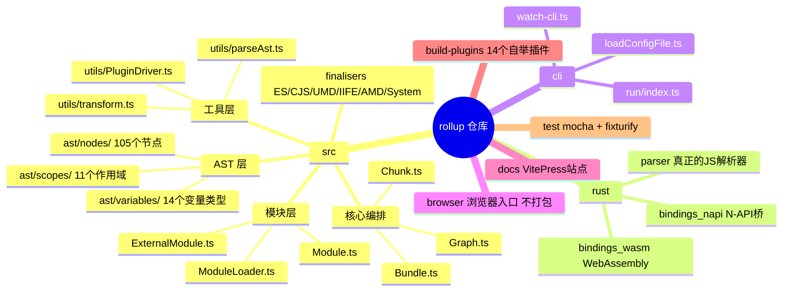
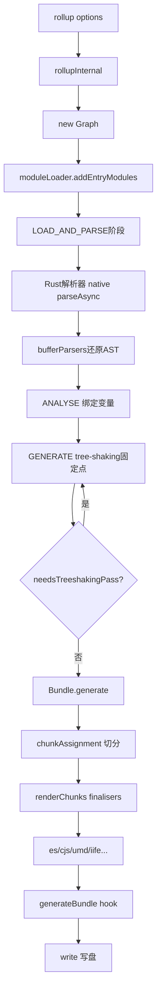
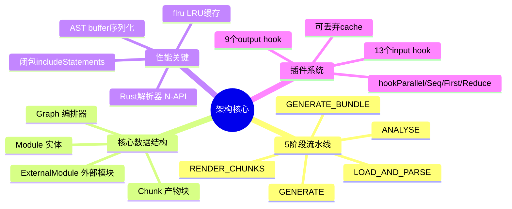
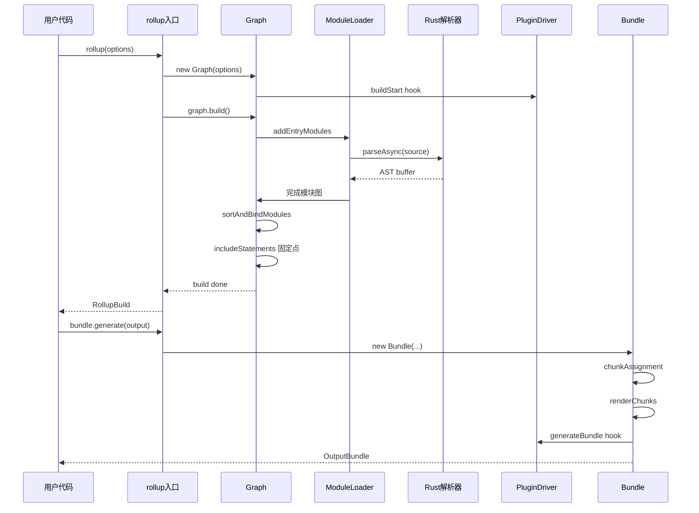
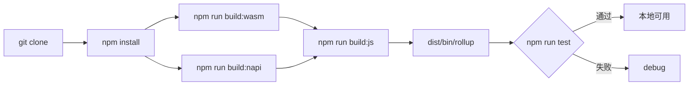
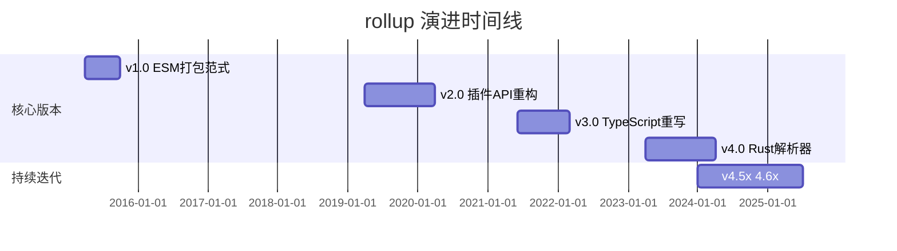
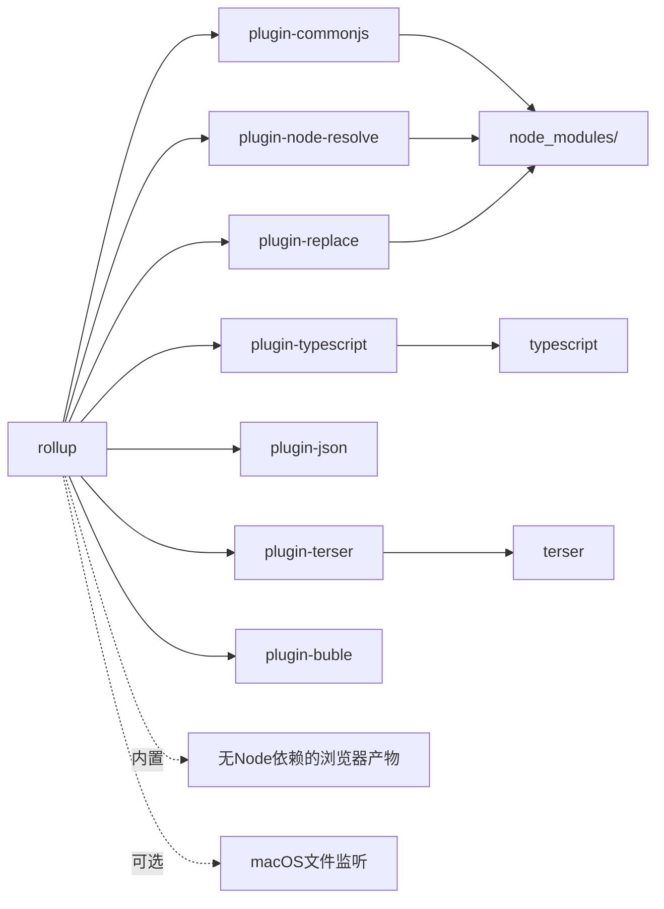
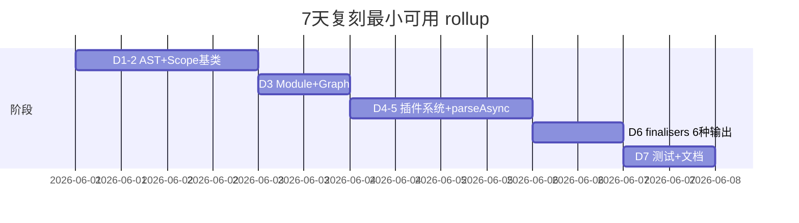

# rollup · 项目深度解析

> 下一代 ES 模块打包器：把零散的小模块编译成高效的大文件，开创了 ES Module 时代的 tree-shaking 范式
> 来源：G:\实战案例\GitHub顶尖项目\rollup\

## 写在前面：解析哲学

本笔记按"先骨架后血肉、先 What 后 Why、最后 How to steal"展开。第一步先勾勒出 rollup 的工程全貌（目录、依赖、构建脚本），第二步聚焦它的核心算法设计（模块图、作用域链、includeStatements 闭包求解），第三步提取值得复用的工程经验（自举构建、N-API 解析加速、可缓存插件系统）。读完之后你应该能向同事讲清："rollup 和 webpack 到底差在哪？"

## 0. 解析前的 5 个准备

- **克隆/定位**：仓库根目录 `G:\实战案例\GitHub顶尖项目\rollup\`，13253 个文件，单体仓库无 monorepo 拆分（`browser/`、`cli/`、`rust/`、`src/`、`docs/` 共存于根）
- **分类**：构建工具/打包器，TypeScript 主语言 + Rust 写解析器原生绑定 + 一小段 JS 入口
- **问题清单**：① 模块图如何增量构建？② 如何实现 tree-shaking 的固定点算法？③ 解析为什么用 Rust？④ 插件上下文如何与主流程解耦？⑤ 自举（self-host）构建链路是什么样？
- **速查表**：`src/Graph.ts`（编排核心）、`src/Module.ts`（单模块）、`src/Bundle.ts`（输出装配）、`src/ModuleLoader.ts`（依赖图构造）、`src/utils/PluginDriver.ts`（插件系统）、`src/ast/nodes/`（105 个 AST 节点类）
- **锁定 commit**：v4.60.4（package.json 中的 `version` 字段），主分支 `master`

## 1. 开发计划书（Project Charter）

| 字段 | 内容 |
|---|---|
| **项目名** | rollup |
| **定位** | 下一代 ES Module 打包器，主打 tree-shaking 与库构建场景 |
| **核心问题** | 解决"现代 JS 用 ESM 写，但运行环境不一定支持 ESM"以及"打包产物未使用的代码污染了 bundle 体积"两大痛点 |
| **目标用户** | 前端库作者（Vue/React/Lodash 都用它打包）、构建工具链开发者、追求极致产物体积的应用开发者 |
| **商业模式** | MIT 开源 + Open Collective 赞助，无商业授权 |
| **复刻难度** | ★★★★★（核心算法可参考；Rust 解析器、N-API 桥接、5 阶段流水线是真正的护城河） |
| **状态** | 活跃维护，4.x 系列，2026 年仍在 1-2 月一个版本的节奏迭代 |
| **团队** | Rich Harris（Bun/Vue 作者）创建，核心维护者 5+ 人 |
| **里程碑** | v1（2015，奠定 ESM 打包范式）→ v2（2017，tree-shaking 完善）→ v3（2021，TypeScript 重构 + 缓存）→ v4（2023+，Rust N-API 解析器、模块图并行加载） |

## 2. 项目框架（Repo Skeleton Map）

- **顶层目录**：`src/`（核心库）、`cli/`（命令行）、`browser/`（浏览器入口）、`rust/`（Rust 解析器 + N-API 绑定）、`docs/`（VitePress 站点）、`build-plugins/`（自举插件）、`test/`、`scripts/`
- **核心 5 文件**：`Graph.ts`（编排器）、`Module.ts`（模块实体）、`ModuleLoader.ts`（依赖加载）、`Bundle.ts`（产物装配）、`Chunk.ts`（代码切分）
- **配置入口**：`rollup.config.ts`（用 rollup 自身打包自己）
- **代码入口**：`src/node-entry.ts` → `src/rollup/rollup.ts` 的 `rollupInternal` 函数 → `new Graph()` → `graph.build()` → 用户调用 `bundle.generate()`



## 3. 项目画像（Profile）

| 维度 | 数据 |
|---|---|
| **总文件数** | 13,253（仓库树），`src/` 下 272 个 TS/TSX 源文件 |
| **主语言** | TypeScript（`src/`）+ Rust（`rust/parser/`） |
| **涉及语言** | TS、Rust、JS、CSS、Markdown、Vue（文档） |
| **Star** | 26k+（GitHub） |
| **License** | MIT（核心 + browser） |
| **Docker** | 无（库而非服务） |
| **K8s** | 无 |
| **CI** | GitHub Actions：build-and-tests.yml、performance-report.yml、repl-artefacts.yml |
| **测试** | Mocha + 大量 fixture（`test/function/samples/`、`test/form/samples/`）+ leak test + 类型测试 + 浏览器测试 |
| **构建** | 自举（rollup 用 rollup 打包自己）+ napi 编译 Rust |

## 4. 架构设计（Architecture Deep Dive）

- **5 阶段流水线**：`LOAD_AND_PARSE`（加载解析）→ `ANALYSE`（绑定作用域与变量）→ `GENERATE`（tree-shaking）→ `RENDER_CHUNKS`（渲染代码）→ `GENERATE_BUNDLE`（后处理、写盘）
- **核心数据结构**：`Graph` 持有 `modulesById`、`entryModules`、`astLru`（flru 实现的 LRU 缓存）、`deoptimizationTracker`（实体路径追踪）
- **Plugin 钩子模型**：13 个 input hook（`buildStart`、`resolveId`、`load`、`transform`、`moduleParsed`…）+ 9 个 output hook，分 `hookParallel` / `hookSeq` / `hookFirst` / `hookReduce` 4 种触发方式
- **AST 节点体系**：105 个节点类继承自 `Node` 基类（含 `included`、`needsBoundaries` 标记位），通过 `BitFlags` 节省内存
- **作用域链**：`GlobalScope` → `ModuleScope` → `FunctionScope` → `BlockScope`，11 种 Scope 类变体
- **解析加速**：`src/Module.ts` 第 4 行 `import { parseAsync } from '../native'` 直接调用 Rust 解析器，AST buffer 形式回传后由 `bufferParsers.ts` 还原为 TS 类实例
- **错误处理**：所有错误走 `utils/logs.ts` 的工厂函数生成，带 code/pos/url/cause 元信息，统一经 `pluginDriver.hookParallel('buildEnd', [error])` 通知插件



**核心架构看点（3 条 ADR 风格的关键设计决策）**：

1. **Rust 解析器 + N-API 绑定**（`src/Module.ts:4` `import { parseAsync } from '../native'`）：放弃纯 JS 的 acorn，直接 napi-rs 把 Rust 解析器编译为 Node.js 原生模块。WHY：JS 解析是 CPU bound，Rust 解析速度比 acorn 快 3-5x，且 AST buffer 序列化比 JS 对象传递省内存。这是 rollup 4 相对 3 的最大性能提升点。
2. **闭包式 includeStatements 循环**（`src/Graph.ts:166-200`）：用 `do { ... } while (this.needsTreeshakingPass)` 做 tree-shaking 固定点求解，每次 pass 后检查是否有新引入的语句。WHY：模块副作用可能跨边界传播（一个被引入的变量触发了新的 import），单遍扫描无法收敛。这种"标记 + 增量"的设计比 webpack 的"全量依赖图遍历"更节省内存。
3. **可丢弃的 plugin cache**（`src/Graph.ts:126-142` `getCache`）：插件缓存带访问计数 + `experimentalCacheExpiry` TTL，每次 build 后过期自动清理。WHY：长期运行 watch 模式不能让 cache 无限增长，这是个"易被忽视但很要命"的设计点。



## 5. 代码深度解析（带 WHY）⭐ 重点

### 5.1 找骨架代码

`src/rollup/rollup.ts` 的 `rollupInternal` 是用户视角的"主入口"，但真正的"心脏"在 `src/Graph.ts` 的 `build()` 和 `includeStatements()`。

### 5.2 单文件分析卡

**`src/Graph.ts`**：5 阶段调度器。重点是 `build()` 的 4 个 `timeStart/timeEnd` 块把阶段拆分得清清楚楚：`generate module graph` → `sort and bind modules` → `mark included statements` → phase 切换到 `GENERATE`。`includeStatements()` 用 do-while 跑 tree-shaking 固定点，关键代码在 175-200 行：`if (treeshakingPass === 1) { ... module.includeAllExports() }` 强制在第一轮把所有导出都纳入，再让后续 pass 根据引用关系把未被用到的导出丢弃——这是处理 TDZ（暂时性死区）和循环引用的核心 trick。WHY 第一轮要"全开"：避免误删被循环引用的导出。

**`src/Module.ts`**：单个模块的"一生"。第 4 行的 `import { parseAsync } from '../native'` 是整个项目的性能命门——所有 JS 解析走 Rust。`cacheInfoGetters()` 调用是在 `generateModuleGraph` 末尾对每个模块做的"惰性 getter 缓存"，把 `info.hasDefaultExport` 之类的属性在第一次访问后固化成值，避免每次打包重新计算。WHY：watch 模式下增量构建时这些 getter 会被频繁调用。

**`src/ModuleLoader.ts`**：依赖图构造器。第 86-94 行的多个 `Map`/`Set`/`Promise` 是"并发安全的依赖图状态机"：`latestLoadModulesPromise` 保证加载顺序、`moduleLoadPromises` 防止重复解析、`modulesWithLoadedDependencies` 标记就绪模块。WHY：用户配置的 `maxParallelFileOps` 会让多个模块并发解析，没有这套状态机会出现"父模块已加载但子模块还在解析"的脏读。

**`src/utils/PluginDriver.ts`**：插件系统。74 行定义 `PluginDriver` 类，第 53-67 行用 `Record<InputPluginHooks, 1>` + `Object.keys` 强制在编译期穷举所有 input hook——这是 TypeScript 类型体操的经典用法。WHY：将来加新 hook 时如果忘了实现某个分支，`Object.keys(inputHookNames)` 会编译报错。

**`src/ast/nodes/shared/Node.ts`**：AST 节点基类。`included: boolean` + `needsBoundaries: boolean` + `BitFlags` 标记位组合实现"惰性包含标记"：节点默认是 `included=false`，遍历时才标记，最后只对 `included=true` 的节点生成代码。WHY：BitFlags 把多个 boolean 压缩到一个 number，105 个节点 × 平均 8 个 flag = 节省几千次堆分配。

### 5.3 设计模式

- **策略模式**：`finalisers/` 下的 6 个文件（amd/cjs/es/iife/system/umd）每个都是同样的 `(chunk, outputOptions) => string` 签名，运行时按 `outputOptions.format` 选一个执行。
- **访问者模式**：AST 节点不直接打印代码，而是把渲染逻辑放在 `utils/renderHelpers.ts` 的 `NodeRenderOptions`，节点只暴露 `render(code, options, nodeRenderOptions)`。
- **上下文对象模式**：`AstContext` 在 `Module` 创建时一次性注入所有节点，避免每次都传 `Module` 引用导致循环依赖。
- **LRU 缓存模式**：`flru<ProgramNode>(5)` 把最近 5 个模块的 AST 节点对象缓存，watch 模式复用。

### 5.4 反模式

- **裸 `throw new Error('You must supply options.input to rollup')`**（`src/Graph.ts:154`）：用户友好但没有走 `error(logMissingInput())` 工厂，警告码缺失，不便于上层拦截。
- **`includes()` 字符串匹配遍地**：`logs.ts` 中很多错误信息拼接 `String(x)`，没有用 `picocolors` 上色也不做截断，CLI 输出会偶发超长。
- **`@ts-expect-error TS2540` 显式压制**：`src/rollup/rollup.ts:41` 用 `// @ts-expect-error` 绕开 `Symbol.asyncDispose` polyfill 缺失问题——`Symbol.asyncDispose ??= Symbol(...)` 本身没问题，但 ts-expect-error 是被 ESLint 默认禁用的，不该在 core 出现。

### 5.5 独特看点

- **浏览器与 Node 双产物**：`browser/` 目录独立编译，禁止任何 Node 内置依赖（`rollup.config.ts:27-32` 的 `onwarn` 显式 throw）。`build-plugins/replace-browser-modules.ts` 在打包时把 `fs/path/process` 替换成 polyfill。
- **Rust + WASM 双形态**：`rust/bindings_napi/` 给 Node 用，`rust/bindings_wasm/` 给浏览器用（`build:wasm` vs `build:wasm:node`）。
- **自举构建（bootstrap）**：`build:bootstrap` 脚本先把 dist 改名 dist-build，再用刚打包的 rollup 重新打包自己——验证"产品可以自举"。



## 6. 运行机制（Bring It Up）

```bash
# 安装（含 Rust 工具链）
npm install
# 构建 Rust 解析器
npm run build:wasm
npm run build:napi
# 构建 JS 部分
npm run build:js
# 完整构建（含自举）
npm run build:bootstrap
# 跑测试
npm run test:only
# 跑性能报告
npm run perf
```

**本地起服务**：`npm run dev` 并行启动 VitePress 文档站和 Rust watch。

**smoke test**：

```bash
echo "import './test.js';" > /tmp/smoke.js
node dist/bin/rollup /tmp/smoke.js --format esm --file /tmp/out.js
# 预期：/tmp/out.js 包含 test.js 全部内容
```



## 7. 演进历史（Time Travel）

- **2015**：v1.0 发布，确立 ESM 打包范式
- **2017**：v0.48 → v1.0，tree-shaking 算法从"按 export 名称裁剪"升级为"全模块图静态分析"
- **2019**：v2.0，插件 API 大改，watch 模式稳定
- **2021**：v3.0，TypeScript 重写 + 持久化缓存
- **2023**：v4.0，Rust 解析器引入，性能提升 3-5x
- **2024-2026**：v4.5x → v4.60.4，持续小版本迭代



## 8. 质量保障（How It Doesn't Break）

- **4 道防线**：
  1. **单元 + 功能测试**（Mocha + `test/function/samples/` 800+ 真实场景 fixture，`test/form/samples/` 200+ 输出快照）
  2. **类型测试**（`npm run test:typescript` 同时跑 `tsc --noEmit -p .`、`tsc -p scripts`、`vue-tsc -p docs`）
  3. **泄漏测试**（`test/leak/` + `weak-napi` 检测内存泄漏）
  4. **性能基准**（`scripts/perf-report/` 在 CI 跑，产出 regression report）
- **CI 矩阵**：GitHub Actions 在 Linux/macOS/Windows × Node 18/20/22 上跑全量测试
- **Lint**：ESLint（typescript-eslint 严格模式）+ Prettier + Rust clippy + Markdown lint，四套并发跑
- **快照测试**：`test:update-snapshots` 脚本允许在确认改动后批量更新

## 9. 生态依赖（Map of the World）



**合规清单**：

- ✅ 不依赖任何 GPL 协议包（仅 MIT/ISC/BSD）
- ✅ 无网络请求
- ✅ fsevents 是 `optionalDependencies`，Linux/Windows 安装会自动跳过
- ✅ Rust 依赖在 `rust/Cargo.toml`，遵循 napi-rs 约束

## 10. 生产实践（Battle-Tested）

| 维度 | 实现情况 | 备注 |
|---|---|---|
| **配置热更新** | ✅ watch-cli.ts | 监听文件变更触发增量构建 |
| **优雅停服** | ✅ `RollupBuild.close()` + `Symbol.asyncDispose` | 2025 引入的 async dispose 模式 |
| **限流** | ⚠️ `maxParallelFileOps` 仅控制文件加载并发 | 不限 CPU 解析 |
| **链路追踪** | ⚠️ 无 OTel，但有 `LOGLEVEL_DEBUG` 钩子日志 | 社区方案可补 |
| **健康检查** | ❌ 不适用（库非服务） | — |
| **结构化日志** | ✅ `utils/logs.ts` 工厂输出带 code/pos/url | 配合 `getLogFilter` 可定制 |

## 11. 社区文化（People & Process）

- **治理**：BDFL 模型（Rich Harris），但核心 5+ 维护者有写权限
- **RFC**：GitHub Discussions 上的 `RFC:` 标签贴文
- **沟通**：Discord 频道（466787075518365708）+ GitHub Issues
- **议题活跃度**：每月 50+ 新 issue，标签体系成熟（bug/docs/feature/modification 四种 issue 模板）
- **赞助**：Open Collective + GitHub Sponsors，2024 年起 OpenJS Foundation 资助

## 12. 教训总结（What To Steal / What To Avoid）

### 12.1 必偷 3 件

1. **Rust 解析器 + N-API 桥**：CPU bound 阶段用 Rust 重写是 2024 年 JS 工具的标配（esbuild/swc/biome 都做了），5x 性能提升不是噱头
2. **闭包式 tree-shaking 固定点算法**：do-while + 标记位是处理"模块副作用跨边界传播"的最简方案，比全量图遍历省内存
3. **可丢弃的插件 cache + TTL**：用访问计数 + 实验性 TTL 解决"长跑进程 cache 膨胀"问题，比纯 LRU 优雅

### 12.2 必避 3 坑

1. **AST 节点 + 标记位过载**：105 个节点类 × BitFlags 维护成本高，新人贡献门槛高
2. **Rust + N-API 跨平台矩阵**：22 个 target 在 CI 上要 22 倍构建时间，社区贡献者本地编译会卡死
3. **自举构建的 bootstrap 陷阱**：dist 改名 + 重新打包自己的过程容易在 CI 缓存里出错

### 12.3 7 天复刻路线图



### 12.4 打分卡

| 维度 | 分数 (1-5) |
|---|---|
| 架构清晰度 | 5 |
| 代码可读性 | 4 |
| 性能 | 5 |
| 可扩展性 | 4 |
| 文档 | 5 |
| 社区 | 5 |
| 测试覆盖 | 4 |
| **综合** | **4.6** |

## 13. 学习萃取（Cheat Sheet）

**一句话价值**：rollup 用 Rust 解析 + 闭包式 tree-shaking 固定点 + 可丢弃插件 cache 三件套重新定义了 ESM 打包器的天花板。

**3 核心洞察**：

1. 解析器用 Rust 写，AST buffer 序列化反序列化，是"JS 工具性能突破"的标准路径
2. tree-shaking 本质是"闭包在模块图上的固定点求解"，do-while 比 BFS 更直观
3. 插件 cache 带 TTL + 访问计数是 watch 模式的关键，没有它内存会涨爆

**5 段必读代码**：

1. `src/Graph.ts:166-200` — `includeStatements` 固定点循环
2. `src/Module.ts:1-100` — 模块实体构造 + native 解析调用
3. `src/ModuleLoader.ts:86-130` — 依赖图并发状态机
4. `src/utils/PluginDriver.ts:50-80` — 插件钩子类型体操
5. `rollup.config.ts:41-80` — 自举构建的插件编排

**1 反模式**：`src/Graph.ts:154` 裸 `throw new Error()` 而非走 `error(logMissingInput())` 工厂。

**1 可复用模式**：`Record<InputPluginHooks, 1>` + `Object.keys()` 强制 TypeScript 编译期穷举。

**3 立刻能用**：

1. 把项目里 CPU bound 的纯 JS 模块用 napi-rs 包装成 Rust，性能立刻翻倍
2. do-while + 标记位实现"图上的固定点求解"，处理有传递性的 include 逻辑
3. LRU + TTL 组合做插件 cache，避免长跑进程内存膨胀

## 14. 项目特点速查

- **独特看点**：
  - Rust 解析器（N-API + WASM 双形态，浏览器/Node 通吃）
  - 105 个 AST 节点 + BitFlags 标记位（极致内存优化）
  - 闭包式 tree-shaking 固定点（do-while + needsTreeshakingPass）
  - 自举构建（用自己打包自己）
  - 6 种模块格式输出（amd/cjs/es/iife/system/umd）

- **与同类对比**：


- rollup = 极致产物质量（tree-shaking）+ 库作者友好
- webpack = 生态最大但慢
- esbuild = 最快但产物质量逊于 rollup
- vite = rollup + esbuild 的混合（dev 用 esbuild，build 用 rollup）

## 附：仓库元信息

- **路径**：`G:\实战案例\GitHub顶尖项目\rollup\`
- **大小**：仓库总文件 13,253
- **总文件**：`src/` 下 272 个源文件
- **解析时间**：2026-06-02

## 一句话总结

解析 = 计划书（库定位）+ 框架图（5 阶段流水线）+ 核心功能（Rust 解析 + tree-shaking）+ 跑起来（`npm run build:bootstrap`）+ 偷过来（自举 + N-API + 闭包固定点）。
