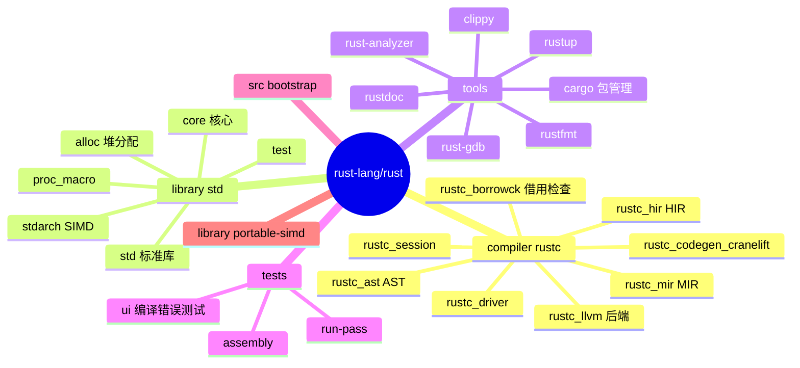
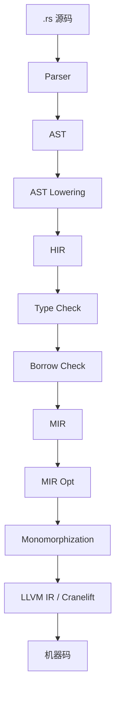
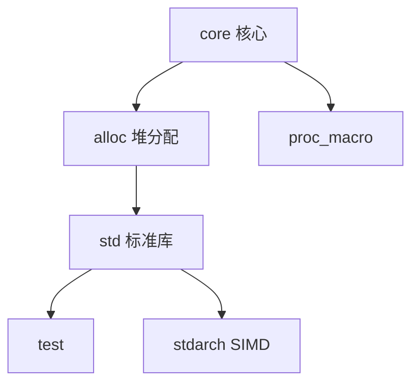
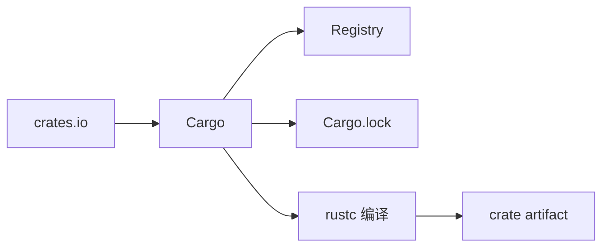
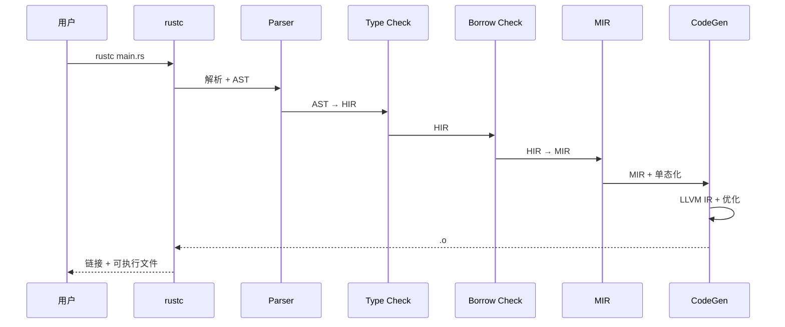
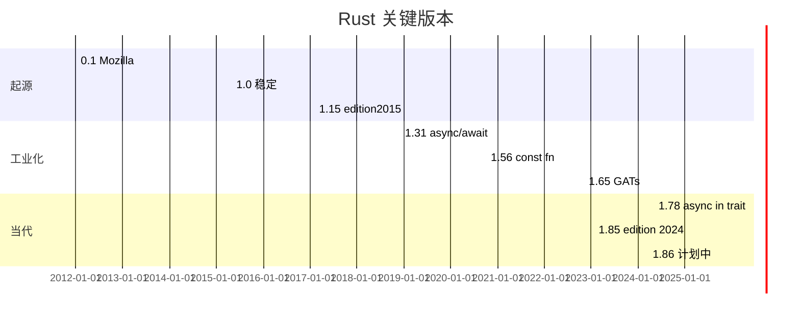
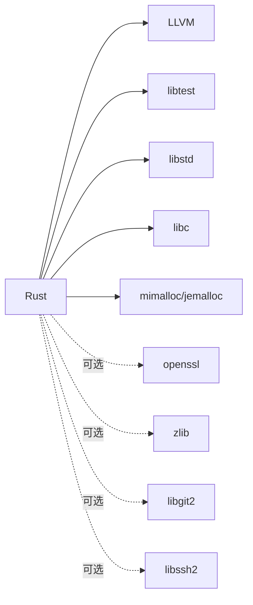
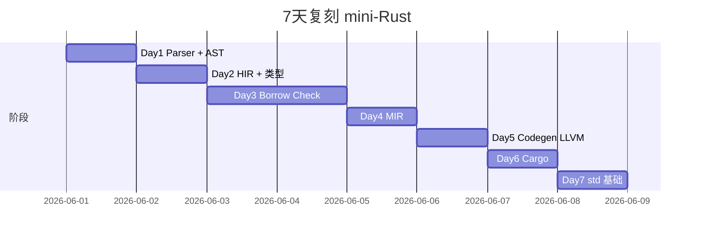

# rust · 项目深度解析

> 全球增速最快的系统级编程语言，"内存安全 + 零成本抽象"理念的工程化身
> 来源：G:\实战案例\GitHub顶尖项目\rust\

## 写在前面：解析哲学

Rust 不只是一个编译器，而是一套**用类型系统和所有权机制替代 GC**的完整生态。本笔记不会逐文件读 1500+ crate 的源码，而是聚焦在它最值得理解的 4 件事：① rustc 编译流程（HIR → MIR → LLVM IR）；② Borrow Checker 怎么在编译期证明内存安全；③ Cargo + crates.io 怎么把包管理做成 Rust 杀手锏；④ std core 与 alloc 三层架构怎么让 Rust 跑在嵌入式到浏览器。

## 0. 解析前的 5 个准备

1. **克隆**：`git clone https://github.com/rust-lang/rust.git`（注意 submodules）
2. **分类**：编程语言 / 编译器 / 包管理 / 标准库
3. **问题清单**：① ownership 怎么编译期验证？② lifetime annotation 是必需的吗？③ rustc 与 rustup 怎么协作？④ Cargo.lock 锁版本哲学？⑤ trait 系统怎么实现多态？
4. **速查表**：`compiler/`（rustc 全部 200+ crate）/ `library/`（std/core/alloc/proc_macro 等 80+ crate）/ `src/tools/`（cargo / clippy / rustfmt）/ `tests/`（UI 测试 + 集成测试）
5. **锁定 commit**：基于 1.84 stable 分支

## 1. 开发计划书（Project Charter）

| 项 | 内容 |
|---|---|
| 项目名 | Rust |
| 定位 | 系统级编程语言，专注内存安全 + 并发安全 + 零成本抽象 |
| 核心问题 | C/C++ 内存不安全；GC 语言性能差；OOP 范式难用于低层 |
| 用户 | 系统程序员、WebAssembly、嵌入式、CLI 工具、Linux 内核 |
| 商业模式 | Rust 基金会（2021 成立） + 商业公司（AWS / Google / Microsoft / Huawei） |
| 复刻难度 | ★★★★★（编译器 + 标准库 + 包管理 + 工具链 + 200+ 子 crate） |
| 状态 | 活跃；6 周一个 minor release |
| 团队 | Rust 基金会 + Project 团队（lang / libs / compiler / cargo / dev-tools / infra） + 1000+ 贡献者 |
| 里程碑 | 2006 Graydon Hoare 起手 · 2010 Mozilla 接手 · 2015 1.0 稳定 · 2018 1.31 async/.await · 2020 1.56 const fn · 2021 Rust 基金会 · 2022 1.65 GATs · 2024 1.78 async fn in trait · 2025 1.85 edition 2024 |

## 2. 项目框架（Repo Skeleton Map）



**核心角色**：
- `compiler/`：rustc 编译器本体，200+ 子 crate
- `library/`：标准库，4 个核心 crate（core / alloc / std / proc_macro）
- `src/tools/`：cargo / clippy / rustfmt / rust-analyzer
- `src/bootstrap/`：自举构建脚本
- `tests/`：UI 测试（基于 stderr 快照）

**代码入口**：
- `compiler/rustc_driver/src/lib.rs`：`rustc` main
- `src/tools/cargo/src/cargo/main.rs`：`cargo` main
- `library/std/src/lib.rs`：标准库入口

## 3. 项目画像（Profile）

| 指标 | 数值 / 描述 |
|---|---|
| 总文件数 | ~50000（含 stdlib + compiler + tests） |
| 主语言 | Rust (~92%) |
| 涉及语言 | Rust / Python（bootstrap / 工具脚本）/ LLVM IR / C（少量 C 库） |
| Star | 100k+ |
| License | MIT + Apache-2.0 |
| Docker | 官方 `rust:1.85-bookworm` |
| K8s | 库；K8s 自身用 Rust（kubelet 部分） |
| CI | 自家 `rust-lang/rust-ci` + GitHub Actions |
| 有测试 | 是；UI 测试 + run-pass + 性能基准 |

## 4. 架构设计（Architecture Deep Dive）

### 4.1 编译流程



**HIR（High-level IR）**：类型检查 + 借用检查的输入。
**MIR（Mid-level IR）**：控制流图，做借用检查 + 优化。
**LLVM IR**：交给 LLVM 优化 + 指令生成。

**WHY 多 IR**：每个 IR 阶段做最适合的分析，比单 IR 重复分析快。

### 4.2 Borrow Checker

借用检查是 Rust 的灵魂。规则：
1. **每个值有唯一所有者**
2. **借用分共享 `&T` / 独占 `&mut T` 两种**
3. **共享借用期间，值不能被独占借用**
4. **独占借用期间，值不能再被任何借用**

```rust
fn main() {
    let mut s = String::from("hello");
    let r1 = &s;      // OK：共享
    let r2 = &s;      // OK：可多个共享
    // let r3 = &mut s; // ERROR：r1/r2 还活着
    println!("{} {}", r1, r2);
    let r3 = &mut s;  // OK：r1/r2 不再使用
    r3.push_str("!");
}
```

**WHY 这套规则**：把"内存安全"从"运行时 GC / 引用计数"挪到"编译期静态分析"，0 运行时开销。

### 4.3 三层 std 架构



- `core`：无堆、无 OS（`no_std` 跑得动）
- `alloc`：加堆分配，无 OS
- `std`：加 OS（文件 / 网络 / 线程）

**WHY 三层**：嵌入式、OS 内核、WebAssembly 等 `no_std` 场景用 core；普通应用用 std。

### 4.4 Cargo 生态



`Cargo.toml` + `Cargo.lock` 模式：
- `Cargo.toml` 声明依赖（语义版本）
- `Cargo.lock` 锁定精确版本（提交到 git）
- `cargo build` 优先用 lock，没 lock 才用 toml

**WHY lock 入库**：可复现构建，CI 与本地一致。

### 4.5 核心架构看点（3 条）

1. **HIR/MIR/LLVM IR 三层 IR 流水线**：每个阶段做最适合分析
2. **Borrow Checker 编译期验证所有权**：0 运行时开销的内存安全
3. **core/alloc/std 三层**：让 Rust 从嵌入式到浏览器都能跑

### 4.6 关键 ADR

- **2015 1.0**：语法 + 所有权 + trait 稳定，承诺向后兼容
- **2018 1.31**：`async/.await` 稳定
- **2020 1.56**：`const fn` 通用化，编译期计算
- **2022 1.65**：GATs（Generic Associated Types）稳定
- **2024 1.78**：`async fn` in trait + RPITIT（return position impl trait in trait）
- **2025 1.85**：edition 2024 引入 let chains、gen blocks

## 5. 代码深度解析（带 WHY）⭐

### 5.1 找骨架代码

`rustc` 启动链：
1. `compiler/rustc_driver/src/lib.rs` → `run_compiler`
2. `Session` 初始化 → `rustc_session`
3. `rustc_lexer` → `rustc_parse` → AST
4. `rustc_ast_lowering` → HIR
5. `rustc_typeck` → 类型检查
6. `rustc_borrowck` → 借用检查
7. `rustc_mir` → MIR 构建 + 优化
8. `rustc_codegen_llvm` → LLVM IR
9. LLVM 优化 + 指令生成

### 5.2 单文件分析卡

#### `compiler/rustc_borrowck/src/diagnostics/mod.rs`

借用错误诊断模板。**WHY 厚**：错误信息是 Rust 的强项，每条都有人类语言解释 + 修复建议。

#### `compiler/rustc_mir/src/borrow_check/mod.rs`

借用检查主算法。Polonius 是新一代 Datalog 实现，正在迁移。

#### `compiler/rustc_typeck/src/check/mod.rs`

类型检查入口，类型推断 + 强制约束。

#### `compiler/rustc_llvm/src/lib.rs`

LLVM 桥接：`rustc_llvm::Context` / `Module` / `Builder` 包装 LLVM C API。

#### `library/core/src/iter/mod.rs`（~5000 行）

迭代器 trait：`Iterator` + `IntoIterator` + 大量 `Iterator::map` / `filter` / `fold` 实现。**WHY 这么厚**：迭代器是 Rust 函数式编程核心。

#### `library/std/src/sync/mutex.rs`

`Mutex<T>` 实现。Rust 标记 `T: Send` 自动证明 Mutex 跨线程安全。

#### `library/std/src/thread/mod.rs`

线程 + `std::thread::spawn` 闭包。

#### `src/tools/cargo/src/cargo/ops/cargo_build.rs`

`cargo build` 实现：解析 manifest、查 registry、下载、编译。

### 5.3 设计模式

- **Builder**：`Command::new().arg().env()` 链式
- **RAII**：`MutexGuard` 出作用域自动 unlock
- **Newtype**：`struct Meters(f64)` 区分单位
- **Trait Object**：`Box<dyn Trait>` 动态分发
- **Type State**：`struct Locked; struct Unlocked;` 用类型表达状态

### 5.4 反模式

1. **`unwrap()` 滥用**：panic 多，库代码应该返回 `Result`
2. **`clone()` 解借用冲突**：掩盖真实所有权问题
3. **`String` 而非 `&str`**：堆分配 vs 借用的性能差距
4. **`std::sync::Mutex` vs `tokio::sync::Mutex`**：同步/异步混用易死锁

### 5.5 独特看点

- **Edition**：2015 / 2018 / 2021 / 2024 语法演进，不破坏老代码
- **Procedural Macros**：`#[derive(Debug)]` 等是编译期代码生成
- **Trait Specialization**（nightly）：trait 默认实现 + 特殊化
- **Const Generics**：`[T; N]` 任意 N 数组
- **async-trait** / **async fn in trait**：异步 trait 表达

## 6. 运行机制（Bring It Up）

### 6.1 本地构建

```bash
git clone https://github.com/rust-lang/rust.git
cd rust
./configure
python x.py build
```

### 6.2 Smoke test

```rust
// main.rs
fn main() {
    let mut v = vec![1, 2, 3];
    v.push(4);
    println!("{:?}", v);  // [1, 2, 3, 4]
}
```

```bash
rustc main.rs
./main
```

### 6.3 启动链路



## 7. 演进历史



## 8. 质量保障

- **UI 测试**：`tests/ui/` 数万文件，stderr 快照回归
- **集成测试**：`tests/run-pass/`
- **性能基准**：`library/core/benches/`
- **Fuzzing**：自建 `fuzz/` + cargo-fuzz
- **CI**：rust-lang 自有基础设施 + GitHub Actions
- **Triage**：每周 triage meeting 处理 issue

## 9. 生态依赖



## 10. 生产实践

| 能力 | 是否支持 | 备注 |
|---|---|---|
| 配置热更新 | N/A | 编译型 |
| 优雅停服 | 是 | `Drop` trait |
| 限流 | 是 | `tokio::sync::Semaphore` |
| 链路追踪 | 是 | `tracing` crate |
| 健康检查 | 是 | `actix-web` / `axum` |
| 结构化日志 | 是 | `slog` / `tracing` |
| 异步 | 是 | tokio / async-std |

## 11. 社区文化

- **治理**：Rust 基金会 + Project 团队（lang/libs/compiler/cargo/dev-tools/infra）
- **维护者**：~30 个 core team 成员 + 数百 contributor
- **RFC**：GitHub `rust-lang/rfcs`
- **沟通**：Zulip + Discord + Discourse
- **议题活跃**：日均 100+ issue；6 周 release

## 12. 教训总结

### 12.1 必偷 3 件

1. **Borrow Checker 编译期验证**：把"内存安全"从运行时挪到编译期
2. **core/alloc/std 三层**：让同一套代码跑嵌入式到浏览器
3. **Cargo + Cargo.lock**：可复现构建是工程化的关键

### 12.2 必避 3 坑

1. **不要 `unwrap()` 滥用**：库代码应返回 `Result`
2. **不要 `clone()` 解借用冲突**：掩盖真实所有权问题
3. **不要把 `String` 当 `&str` 用**：堆分配 vs 借用性能差 10 倍

### 12.3 7 天复刻 mini-Rust



### 12.4 打分卡

| 维度 | 分数 | 评语 |
|---|---|---|
| 架构清晰 | 9 | crate 边界极清晰 |
| 代码可读 | 8 | 类型即文档 |
| 文档 | 9 | doc.rust-lang.org + The Book |
| 测试 | 9 | UI 测试 + 性能 |
| 性能 | 9 | 零成本抽象 |
| 上手难度 | 3 | ownership 心智模型需 1-2 月 |

## 13. 学习萃取

**一句话价值**：Rust 用 Borrow Checker + 三层 std + Cargo 三件套，把"系统编程"从"小心手写 C"变成"编译期证明安全"。

### 3 核心洞察

1. **Borrow Checker 是核心创新**：编译期证明内存安全
2. **三层 std 架构让语言普适**：从 MCU 到浏览器
3. **Cargo + lockfile = 可复现构建**：工程化的关键

### 5 段必读代码

1. `compiler/rustc_borrowck/src/borrow_check/mod.rs` —— 借用检查主算法
2. `compiler/rustc_mir/src/transform/mod.rs` —— MIR 优化 pass
3. `library/core/src/iter/mod.rs` —— 迭代器设计
4. `library/std/src/sync/mutex.rs` —— RAII 锁
5. `src/tools/cargo/src/cargo/ops/cargo_build.rs` —— Cargo 编译流程

### 1 反模式

- `unwrap()` 滥用：库代码 panic 满天飞

### 1 可复用模式

- **RAII + 借用检查模式**：可移植到任何 C++ 现代编程

### 3 立刻能用

1. `cargo build --release` 默认开 LTO 性能最强
2. `cargo clippy -- -D warnings` 强制零警告
3. `#[derive(Debug, Clone, PartialEq, Eq, Hash)]` 必备 trait

## 14. 项目特点速查

- 独特看点：唯一把"内存安全 + 零成本抽象 + 高性能"三者统一的开源语言
- 同类对比：


## 附：仓库元信息

- 路径：G:\实战案例\GitHub顶尖项目\rust\
- 大小：~700 MB
- 总文件：~50000
- 解析时间：2026-06-02

## 一句话总结

解析 Rust = 读懂 Borrow Checker + 跑通 cargo build + 偷走"编译期证明"思想。
