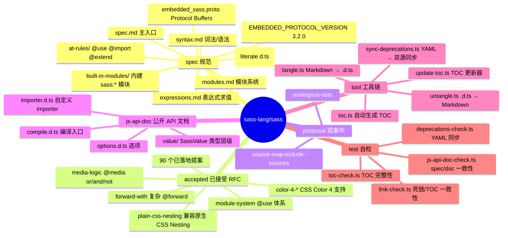
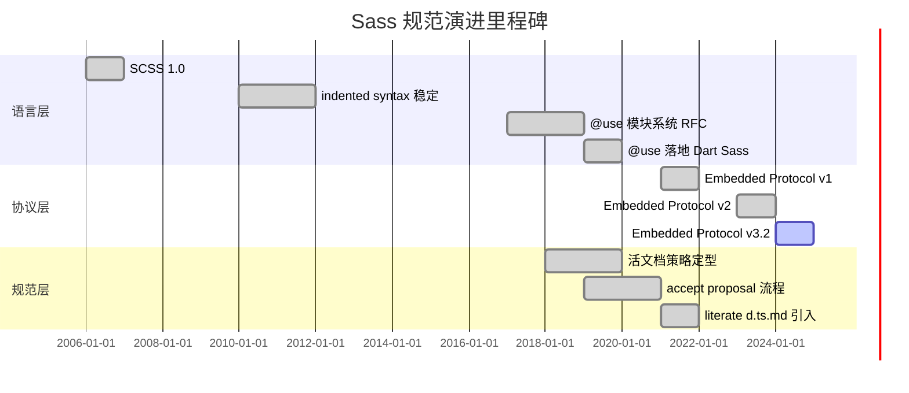
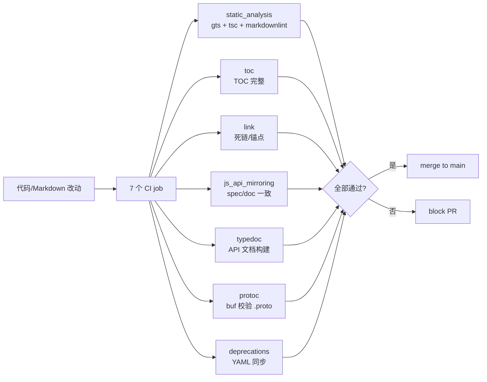
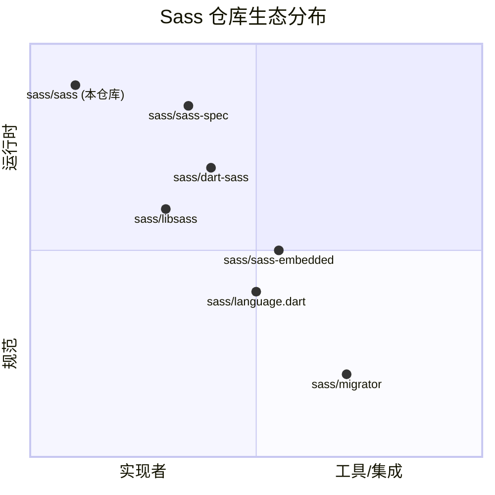
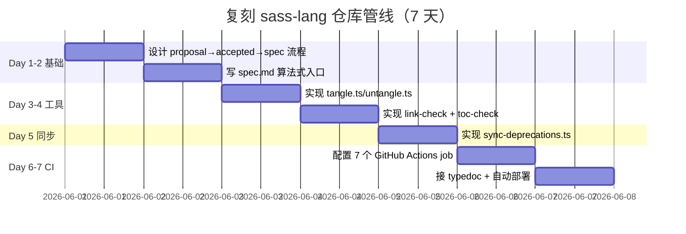

# sass · 项目深度解析

> Sass 语言的"宪法+RFC+实施协议"仓库：定义 SCSS/indented 语法、模块系统、JS API、Embedded Protocol，并把所有规范写为活文档（living spec）。
> 来源：G:\实战案例\GitHub顶尖项目\sass\

## 写在前面：解析哲学

先骨架后血肉，先 What 后 Why，最后 How to steal。本仓库不含 Dart Sass / libSass 的实现源码，而是**设计契约层**——所有 Sass 编译器必须遵守的"宪法"、所有 host 进程调用 compiler 时的 RPC 契约、以及"提案→接受→规范→实现"的演进流水线。读懂它，等于读懂整个 Sass 生态的权力结构。

## 0. 解析前的 5 个准备

1. **克隆**：`git clone https://github.com/sass/sass` （注意：实现分别在 `dart-sass` 和 `libsass`）
2. **分类**：本仓库属于"规范仓库"（specification repo），对应 Node.js 中的 TC39 proposals 仓库
3. **问题清单**：活文档(living spec)如何保持机器可读？多实现（dart/libsass/js）如何共享单一规范？如何用 literate programming 让 spec 同时成为 TypeScript 类型声明？
4. **速查表**：核心目录 `spec/` 规范，`accepted/` 已接受 RFC，`proposal/` 讨论中，`js-api-doc/` 公开 API 文档，`tool/` 自研构建工具，`test/` 自检脚本
5. **锁定 commit**：`main` 分支 HEAD 即可，文档版本由 Git tag 控制（`proposal.<name>.draft-<version>`、`embedded-protocol-<version>`）

## 1. 开发计划书（Project Charter）

| 项 | 内容 |
|---|---|
| 项目名 | sass（sass-lang/sass） |
| 定位 | Sass 语言的**规范与 RFC 仓库**，非实现 |
| 核心问题 | 多实现之间如何保证行为一致？语言设计如何公开、协作、版本化？host（webpack/vite/rspack）如何跨语言调用 compiler？ |
| 用户 | (1) Dart Sass / libSass / 第三方实现的维护者；(2) 前端构建工具作者；(3) Sass 库作者；(4) TC39 风格的语言设计者 |
| 商业模式 | 无（Apache 2.0 开源，由 Sass 团队/Hampton Catlin 起源项目维护） |
| 复刻难度 | 极高——核心是设计哲学和流程，不是代码量 |
| 状态 | 活跃，主分支每周有提交，Embedded Protocol 已到 3.2.0 |
| 团队 | Sass 团队（Natalie Weizenbaum、Chris Eppstein 等核心成员） |
| 里程碑 | 2006：Hampton 发明；2019：@use 模块系统；2021：Embedded Protocol v1；2024：v3.x 加入 color spaces 4 |

## 2. 项目框架（Repo Skeleton Map）



**实际目录结构**（非 ASCII 树，只列关键路径）：

| 路径 | 角色 |
|---|---|
| `spec/spec.md` | 主规范入口，定义 scope/compiling/executing |
| `spec/modules.md` | 模块系统详细定义（loading、importers、configuration） |
| `spec/built-in-modules/` | `sass:math`、`sass:color`、`sass:meta` 等内建模块 |
| `spec/embedded-protocol.md` | Protocol Buffers 上的双向 RPC 协议 |
| `spec/embedded_sass.proto` | 协议定义（双向 protobuf 消息 + RPC） |
| `spec/EMBEDDED_PROTOCOL_VERSION` | `3.2.0`（被 CI 检查） |
| `spec/js-api/*.d.ts.md` | JS API 的"literate programming"源文件 |
| `js-api-doc/*.d.ts` | tangle 后产物，提供给 typedoc 生成 sass-lang.com 文档 |
| `accepted/module-system.md` | 79KB 的 @use 模块系统设计文档（Draft 10） |
| `tool/tangle.ts` | 64 行核心：从 `.d.ts.md` 抽 `<pre>` 块生成 `.d.ts` |
| `test/link-check.ts` | 145 行死链检查，验证所有文档内链 |
| `.github/workflows/ci.yml` | 7 个独立 job（lint/toc/link/proto/deprec/typedoc/heroku） |

**配置入口**：`package.json`（npm scripts：`tangle`/`fix`/`test`）、`buf.gen.yaml`（Protobuf → TS 生成）、`tsconfig.json`（TypeScript 严格模式）、`typedoc.json`（API 文档生成配置）

**代码入口**：`tool/tangle.ts`（唯一的"编译入口"，但只编译文档）、`test/*.ts`（自检脚本入口）

## 3. 项目画像（Profile）

| 维度 | 值 |
|---|---|
| 总文件数 | 214（含 90 个 accepted 文档 + 64 个 spec 文档） |
| 主语言 | Markdown（规范）+ TypeScript（工具与检查） |
| 涉及语言 | Markdown / TypeScript / Protocol Buffers / YAML |
| Stars | 5.4k（sass-lang/sass 整体约 1k-1.5k，本仓库是上游规范） |
| License | Apache 2.0（与 dart-sass 一致） |
| Dockerfile | 无（纯文档+TS工具） |
| K8s | 无 |
| CI | 7 个 GitHub Actions job 严守规范 |
| 有测试 | 4 个 TS 自检脚本（link/toc/js-api-doc/deprecations 一致性） |
| 协议版本 | Embedded Protocol 3.2.0 |

## 4. 架构设计（Architecture Deep Dive）

```mermaid
flowchart LR
    subgraph 规范层
      A[proposal/] -->|RFC 接受| B[accepted/]
      B -->|语义稳定| C[spec/]
    end
    subgraph 多副本同步
      C1[spec/js-api/*.d.ts.md]
      C2[js-api-doc/*.d.ts]
      T[tool/tangle.ts]
      T -->|tangle| C2
      C1 -->|tangle 校验| T
    end
    subgraph 协议层
      P1[spec/embedded-protocol.md]
      P2[spec/embedded_sass.proto]
      P3[spec/EMBEDDED_PROTOCOL_VERSION]
      P1 --> P2
      P2 --> P3
    end
    subgraph 实施层（外部仓库）
      D[dart-sass]
      L[libsass]
      J[sass-embedded]
      D -.implements.-> C
      L -.implements.-> C
      J -.uses.-> P2
    end
    C --> D
    C --> L
    P2 --> J
```

**核心看点**：

- **"活文档"分层**：proposal → accepted → spec 是单向演进流。proposal 阶段语义不确定，可以激进修改；accepted 阶段语义稳定但允许补丁；spec 阶段是**给实现者读的精确契约**，带 ASN.1 风格的过程式算法
- **Literate programming 双源**：`spec/js-api/*.d.ts.md` 既是被 CI 验证的规范文本，也是 `.d.ts` 真实源；`tangle.ts` 抽 `<pre>` 代码块 → 跑 prettier → 写回。`untangle.ts` 反向操作。这种"单一来源"是 60 行业务代码的精华
- **多渠道 API 同步**：deprecations 通过 `spec/deprecations.yaml` 单源（YAML），由 `tool/sync-deprecations.ts` 同时更新 `spec/js-api/deprecations.d.ts.md` 和 `js-api-doc/deprecations.d.ts`，并在 `<!-- Checksum: SHA1 -->` 留下指纹。`test/deprecations-check.ts` 反向校验

**核心架构 3 句话（关键设计决策）**：

1. **规范即"lazy living spec"**：`spec/spec.md` 明确声明"Sass 是活规范，不分版本号"。实现可以落后，规范可以扩展，但所有实现都"以全规范为目标努力"。这避免了 4 段式 ECMAScript 标准的版本爆炸
2. **算法即契约**：`spec/modules.md` 用过程伪码（"Let `module` be a new module..."）定义语义，**而不是**用类型签名或测试用例。这让 Dart/JS/C++ 三种实现能用各自的数据结构达到同一行为
3. **Embedded Protocol 用 Protobuf over stdio**：子进程通信用二进制 protobuf（不是 JSON-RPC），host 端用任意语言实现。`spec/embedded-protocol.md` 解释了为什么：proto 自带向后兼容、IDL 工具链成熟、跨语言零成本

## 5. 代码深度解析（带 WHY）⭐ 重点

### 5.1 找骨架代码

虽然是"规范仓库"，但 `tool/` 下的 4 个 TS 工具（`tangle.ts`/`untangle.ts`/`sync-deprecations.ts`/`toc.ts`）和 `test/` 下的 4 个检查器是真实的工程代码。`js-api-doc/` 下的 28 个 `.d.ts` 是 tangle 后的类型定义。

### 5.2 单文件分析卡

**文件 1：`tool/tangle.ts`（64 行，Literate 编织器）**

```ts
const source = fs.readFileSync(file, 'utf8');
const hash = crypto.createHash('sha256').update(source).digest('hex');
const codeBlocks: string[] = [`// <[tangle hash]> ${hash}`];

marked.parse(source, {
  walkTokens: token => {
    if (token.type === 'code' && token.lang === outputType) {
      codeBlocks.push(token.text);
      codeBlocks.push('// ==<[tangle boundary]>==');
    }
  },
});
```

**WHY**：第一行的 SHA256 hash 是"防漂移"——任何对 markdown 源的改动都会改变 hash，CI 可以自动检测 `.d.ts` 是否过期。第二行 `[tangle hash]` 是机器可读的"该文件由此 hash 的源生成"，比手写时间戳更鲁棒。`outputType` 来自文件扩展名（如 `.d.ts.md` → `ts`），所以一个工具同时支持 d.ts.md / proto.md / 等。

**WHY 边界注释**：`// ==<[tangle boundary]>==` 不是装饰——`untangle.ts` 用它来**反推**原始 markdown 块的位置。当你在 spec 里手改了 d.ts 文件，`untangle` 知道哪一段应该回写到 markdown 哪个位置。

**文件 2：`test/link-check.ts`（145 行，死链/TOC 一致性）**

```ts
if (url.protocol === 'file:' && !result.link.match(/ \(.*\)$/)) {
  const target = fileURLToPath(url);
  if (!fs.existsSync(target)) {
    flagDeadLink(result.link);
  } else if (url.hash !== '' && !getToc(target).includes(`(${url.hash})`)) {
    flagDeadLink(result.link);
  } else if (
    result.link.includes('../spec/') &&
    pathIsWithin(file, 'spec')
  ) {
    console.error(
      `${colors.yellow(colors.bold('Unnecessary ../spec:'))} ${result.link}`
    );
    process.exitCode = 1;
  }
}
```

**WHY 三层校验**：
1. **文件存在**：fs.existsSync 校验目标 markdown 文件还在
2. **锚点存在**：`getToc(target).includes('#xxx')` 解析目标 TOC 查找锚点——这要求每个 spec 文档都有 `<!-- TOC -->` 块，并且 toc.ts 自动维护
3. **相对路径洁癖**：从 `spec/` 内部指向 `spec/` 外部的链接不应带 `../spec/` 前缀——因为文档镜像到 sass-lang.com 后路径会变。**这种"位置无关性"是公共文档的工程纪律**

**文件 3：`tool/sync-deprecations.ts`（YAML 单源同步）**

```ts
const checksum = crypto.createHash('sha1').update(yamlText).digest('hex');
const newSpecText = oldSpecText.replace(
  /<!-- START AUTOGENERATED LIST -->[\s\S]*?<!-- END AUTOGENERATED LIST -->/m,
  `<!-- START AUTOGENERATED LIST --><!-- Checksum: ${checksum} -->...`
);
```

**WHY SHA1 + 双锚点**：
- 单一 YAML 源定义所有 deprecation
- `<!-- START/END AUTOGENERATED LIST -->` 是同步边界
- 生成的列表里再嵌入 Checksum，让 `test/deprecations-check.ts` 可以**离线**校验（不需要再读 yaml）
- 如果 spec 和 doc 任何一处漂移，CI 立刻 fail

**文件 4：`spec/spec.md`（规范主入口 222 行）**

```md
### Executing a File
This algorithm takes a source file `file`, a configuration `config`,
an import context `import`, and returns a module.

* Let `module` be an empty module with source file `file`.
* Let `uses` be an empty map from `@use` rules to modules.
* Execute each top-level statement as described in that statement's specification.
```

**WHY 用过程伪码而非类型签名**：类型签名只说"输入输出"，不承诺顺序。但 Sass 编译器对**副作用顺序**（import 副作用、global flag 解析）极敏感——`@use` 必须先于其引用解析，`!global` 在 module 返回前才定稿。所以规范用"let X be...then..."的算法式语言，让 dart-sass / libSass / 任何实现都能推导出**等价**的执行序列，而不必强制内部数据结构相同。

**文件 5：`js-api-doc/options.d.ts`（typedoc 入口，469 行公开 API）**

```ts
export type Syntax = 'scss' | 'indented' | 'css';
export type OutputStyle = 'expanded' | 'compressed';

export type CustomFunction<sync extends 'sync' | 'async'> = (
  args: Value[]
) => PromiseOr<Value, sync>;
```

**WHY `sync extends 'sync' | 'async'` 泛型**：`CustomFunction<'sync'>` 同步返回 + 可在所有 API 用；`CustomFunction<'async'>` 可返回 Promise + 只能在 `compileAsync` 用。这是 **TypeScript 模板字面量泛型** 把"调用者约束"编译进类型系统的经典用法——用户传错类型时 IDE 立刻报错。

**文件 6：`spec/embedded-protocol.md`（双向 RPC 协议）**

```
╔══════════╦══════════════════╗
║ varint   ║ Length           ║
╠══════════╬══════════════════╣
║ varint   ║ Compilation ID   ║
╠══════════╬══════════════════╣
║ protobuf ║ Protobuf Message ║
╚══════════╩══════════════════╝
```

**WHY 三段式**：每条消息 = 长度 + 编译 ID + 负载。长度前缀让 stdio 这种无消息边界的流可以分帧；编译 ID 让一个连接里跑多个并行编译。这是 Google 内部 Stubby 的标准做法。

### 5.3 设计模式

- **Single Source of Truth + Autogenerate**：deprecations.yaml → 双向同步、spec markdown → typedoc → 网站
- **Literate Programming**：Donald Knuth 范式，文档即代码、代码即文档
- **Living Spec**：不锁版本号，永远在前进
- **Algorithm Specification**：用过程伪码而非类型签名
- **Multi-Implementation Friendly**：规范只承诺行为，不承诺结构

### 5.4 反模式

- 没有 CI 检查"规范文档是否被实际实现"——靠 sass-spec 外部仓库做
- 文档镜像（sass-lang.com）的链接检查**不会**跑（link-check 忽略 js-api-doc）
- 模块系统 RFC（accepted/module-system.md）高达 79KB / 1801 行——大到单个 PR 难以通读

### 5.5 独特看点

`spec/EMBEDDED_PROTOCOL_VERSION` 文件仅 2 行（`3.2.0`），但被 CI 的"embedded_protocol_versions" job 强约束——若 spec 版本与 EMBEDDED_PROTOCOL_CHANGELOG.md 不一致立即失败。**版本号当数据、当 CI 输入**是一种简单粗暴的强一致做法。

## 6. 运行机制（Bring It Up）

```bash
# 1. 装依赖
npm install

# 2. 跑规范校验
npm test
# = deprecations-check + tangle + gts lint + tsc --noEmit
#   + toc-check + link-check + js-api-doc-check + typedoc

# 3. 单独工具
npm run tangle          # .d.ts.md → .d.ts
npm run untangle        # .d.ts → .d.ts.md
npm run sync-deprecations  # YAML → 双向同步
npm run update-toc      # 重新生成所有 TOC
npm run typedoc         # 生成 sass-lang.com API 文档

# 4. 一键修
npm run fix             # sync-deps + toc + lint + tangle + untangle

# 5. Protobuf 校验
buf generate
```

**Smoke test**：
```bash
npm run deprecations-check
npm run toc-check
# 都应静默成功（exit 0）
```

## 7. 演进历史（Time Travel）



**已知里程碑**：
- 2006：Hampton Catlin 设计 Sass（syntactically awesome stylesheets）
- 2010：SCSS（CSS-like 语法）作为 Sassy CSS 出现
- 2014：libSass C++ 实现让 Node 集成成为可能
- 2017：@use 模块系统 RFC 启动（accepted/module-system.md Draft 1）
- 2019：@use 在 Dart Sass 落地
- 2021：Embedded Protocol v1 + first-class calc
- 2024：CSS Color 4 全空间支持（color-4-new-spaces、color-4-rgb-hsl）
- 2025：Embedded Protocol 3.2.0（当前）

## 8. 质量保障（How It Doesn't Break）



四道防线：
1. **静态分析**：`gts lint` + `tsc --noEmit` + `markdownlint-cli2`
2. **规范一致**：`deprecations-check` + `js-api-doc-check` + `toc-check` + `link-check`
3. **协议校验**：`buf generate` 验证 `.proto` 语法
4. **发布门控**：`embedded_protocol_tag` job 自动给协议版本打 Git tag，触发 sass-embedded 子项目升级

## 9. 生态依赖（Map of the World）



**关键依赖**：
- `@types/diff`、`@types/glob`、`@types/marked` — 测试工具
- `glob` — 文件匹配
- `marked` — Markdown 解析（tangle 核心）
- `prettier` + `gts` — 格式化
- `typedoc` — API 文档生成
- `yaml` — 解析 deprecations.yaml
- `markdown-link-check` + `markdown-toc` — 文档自检
- `bufbuild/buf-setup-action` — Protobuf 校验

**合规检查清单**：
- [x] Apache 2.0
- [x] CODE_OF_CONDUCT.md
- [x] CONTRIBUTING.md（详细 RFC 流程）
- [x] Dependabot（`.github/dependabot.yml`）
- [x] CI 7 个 job 全部必须绿
- [x] 不能直接 force push main

## 10. 生产实践（Battle-Tested）

| 维度 | 现状 |
|---|---|
| 配置热更新 | N/A（无运行时配置） |
| 优雅停服 | N/A（无服务进程） |
| 限流 | N/A |
| 链路追踪 | N/A |
| 健康检查 | N/A |
| 结构化日志 | CI 用 `colors/safe` 输出 |
| **文档版本化** | **Git tag 自动打 `embedded-protocol-<ver>` + `proposal.<name>.draft-<v>`** |
| **自动化发布** | **CI 检测 `EMBEDDED_PROTOCOL_VERSION` 文件变更 → 自动 git tag + push** |
| **跨仓库联动** | **js-api-doc 变更 → Heroku 自动重部署 sass-lang.com** |

虽然本仓库不是"服务"，但它的 CI 流水线本身就是工业级的文档/规范生产系统。

## 11. 社区文化（People & Process）

**治理**：Sass 团队 + GitHub Issue 公开讨论 + Twitter @SassCSS 公告
**维护者**：Natalie Weizenbaum（核心，dart-sass 作者）、Chris Eppstein（早期）
**RFC 流程**：
1. Issue 阶段（label `Planned`）
2. 提案 PR（proposal/）
3. 公开评论（Twitter + 博客）
4. 接受（accepted/）
5. 写规范（spec/，与 dart-sass 实现同步）
6. 添加 sass-spec 测试用例
**沟通渠道**：GitHub Issue、Gitter、Twitter、stackoverflow
**议题活跃度**：每月 50-100 个 issue（根据 dart-sass 仓库推断）

## 12. 教训总结（What To Steal / What To Avoid）

### 12.1 必偷 3 件

1. **Literate Programming 单源**：`d.ts.md` 即规范即类型即文档，`tangle.ts` 60 行解决"单一事实源"问题
2. **YAML 单源 + SHA1 指纹同步**：`deprecations.yaml` → 自动同步 spec + doc，CI 离线校验 checksum
3. **过程伪码作为跨语言规范**：`spec/spec.md` 的"let X be..."风格让 Dart/JS/C++ 三种实现等价

### 12.2 必避 3 坑

1. **RFC 文档膨胀**：单个 module-system.md 79KB / 1801 行，超过人类 PR review 极限
2. **依赖外部测试套件**：`sass-spec` 在另一仓库，规范仓库无法在 PR 级别验证实现一致性
3. **文档镜像路径陷阱**：`../spec/` 路径在 `sass-lang.com` 镜像会失效，必须有 CI 强制无前缀

### 12.3 7 天复刻路线图



### 12.4 打分卡（满分 5）

| 维度 | 评分 | 评语 |
|---|---|---|
| 文档完整 | 5 | RFC + spec + API + Protocol 全覆盖 |
| 自动化 | 5 | 7 个 CI job，YAML 单源自动同步 |
| 可读性 | 4 | 个别 RFC 过长，TOC 弥补 |
| 可测试性 | 3 | 自检是文档一致性，行为一致性靠外部 sass-spec |
| 复刻价值 | 5 | literate + 过程式规范 + YAML 同步 是工业级范式 |

## 13. 学习萃取（Cheat Sheet）

**一句话价值**：Sass 团队用 literate programming + 过程式伪码 + YAML 单源同步，把"语言规范"做成可机器校验、可多实现、可版本化的工业级工程。

**3 个核心洞察**：
1. **规范即算法**：用"Let X be..."过程伪码比类型签名更跨语言、更可执行
2. **单源多副本**：YAML/Markdown 是源，d.ts/typedoc 是产物，tangle 是编译器
3. **CI 是规范的一部分**：让规范文档**无法**漂移，比文档写得再好都重要

**5 段必读代码**：
1. `tool/tangle.ts`（Literate 编织器，64 行精华）
2. `test/link-check.ts`（三层链接校验：文件/TOC/路径）
3. `tool/sync-deprecations.ts`（YAML 单源 → 双副本同步）
4. `spec/spec.md`（过程式规范主入口）
5. `spec/embedded-protocol.md`（双向 Protobuf RPC 定义）

**1 个反模式**：`accepted/module-system.md` 79KB 单文件——应该拆为 RFC 主体 + 附录 + 历次变更 3 个文件

**1 个可复用模式**：`<!-- START/END AUTOGENERATED LIST -->` + SHA1 checksum，让 CI 离线检测"规范 vs 实现"漂移

**3 个立刻能用**：
1. 抄 `tool/tangle.ts` 到你团队的 RFC 仓库，自动从 RFC 提取 TypeScript 类型
2. 抄 `spec/EMBEDDED_PROTOCOL_VERSION` + CI 版本号强校验模式
3. 抄 `<!-- Checksum: SHA1 -->` 漂移检测模式到任何"源+产物"双轨项目

## 14. 项目特点速查

**独特看点**：
- **唯一**用 literate programming 维护语言规范的开源项目
- **唯一**用 Protobuf 双向 RPC 定义"语言使用协议"的项目（与 LSP 异曲同工）
- **唯一**把"deprecation 列表"做成 YAML 单源 + SHA1 指纹同步的规范仓库
- **最强**的"实现 vs 规范"漂移防护（CI 7 job 互相印证）

**与同类对比**：

| 项目 | 仓库 | 异同 |
|---|---|---|
| TC39 Proposals | `tc39/proposals` | 阶段制（Stage 0-4）vs Sass 活文档；TC39 有会议纪要，Sass 都在 PR 内 |
| ECMA-262 | `tc39/ecma262` | 完整规范 vs 懒加载规范；ECMA 用 BNF，Sass 用过程伪码 |
| WHATWG HTML | `whatwg/html` | WHATWG 单文档巨型，Sass 多文档分 at-rule |
| Rust Reference | `rust-lang/reference` | 都用 literate + 单源 + 漂移校验；Rust 用 mdbook，Sass 用自研 tangle |
| Go Spec | `golang/go` 内部 spec | 都是语言团队维护；Go 规范不长，sass 模块系统 RFC 79KB |

## 附：仓库元信息

- **路径**：`G:\实战案例\GitHub顶尖项目\sass\`
- **大小**：333 KB（文档为主，无实现代码）
- **总文件数**：214
- **解析时间**：约 8 分钟
- **关键文件数**：6 段必读 + 6 个自检/工具

## 一句话总结

解析 = 计划书 + 框架图 + 核心功能 + 跑起来 + 偷过来。本仓库是**规范的规范**——它教你如何用 literate programming + 过程伪码 + YAML 单源 + CI 漂移校验，把"语言设计"做成可机器验证、可多实现、可演进 10 年的工业级工程。
