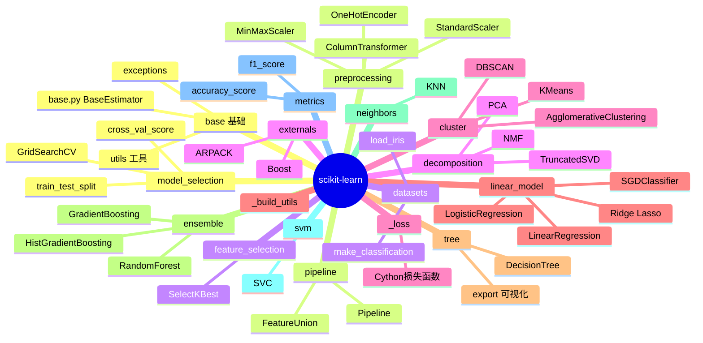
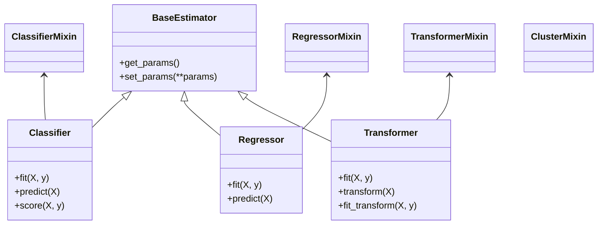
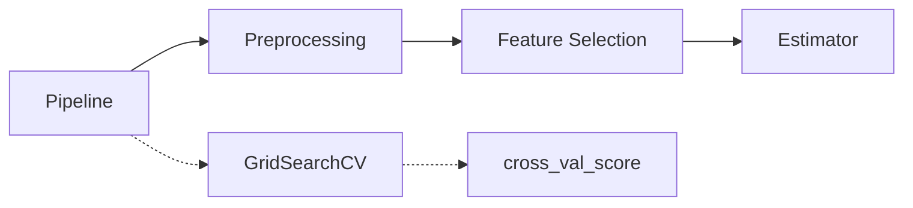
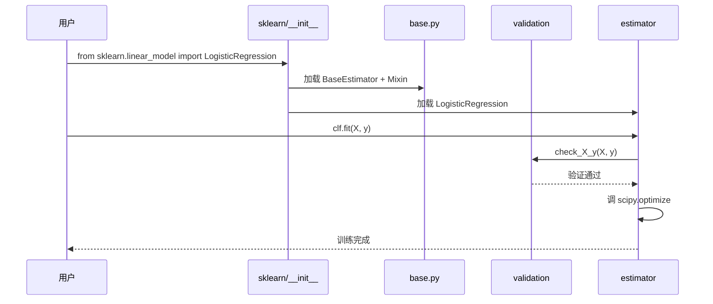
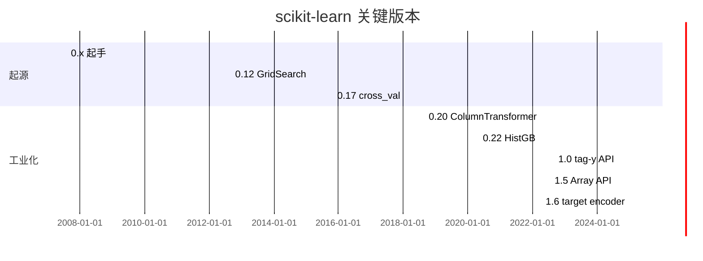
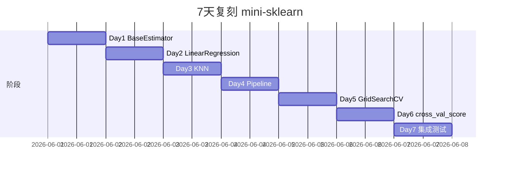
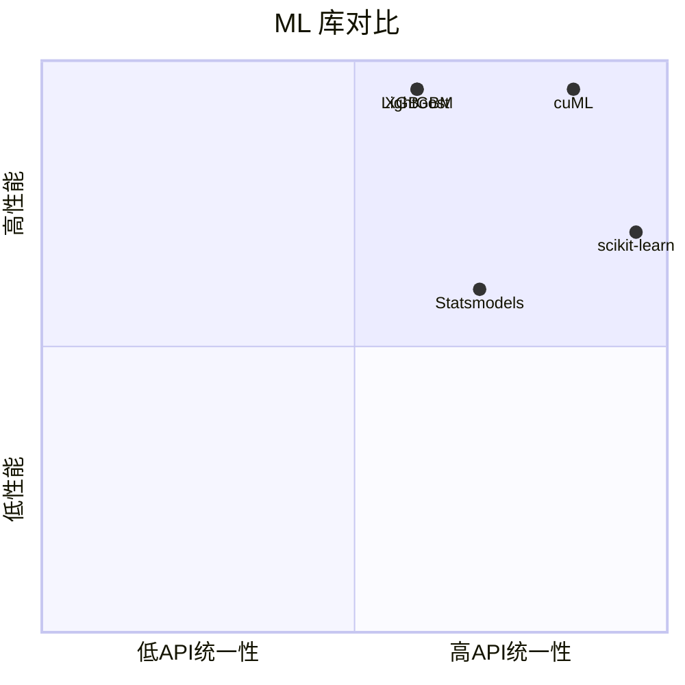

# scikit-learn · 项目深度解析

> Python 机器学习的事实标准，"Estimator API + fit/predict/transform" 三件套定义 ML 编程模型
> 来源：G:\实战案例\GitHub顶尖项目\scikit-learn\

## 写在前面：解析哲学

scikit-learn 不是"另一个 ML 库"，它是一套**统一的 estimator 接口 + 一致的参数命名 + 严密的输入检查**，让"用别人算法像用自己写的一样"成为现实。本笔记聚焦 4 件事：① `BaseEstimator` + `ClassifierMixin` 协议怎么统一所有模型；② `fit` / `predict` / `transform` / `fit_transform` 的方法论；③ Pipeline / ColumnTransformer 怎么让 ML 工作流可组合；④ 为什么 SKLearn 至今不用 PyTorch / JAX（保守的 Cython + NumPy 路线）。

## 0. 解析前的 5 个准备

1. **克隆**：`git clone https://github.com/scikit-learn/scikit-learn.git`
2. **分类**：机器学习库 / Cython 密集 / NumPy 生态 / 算法集合
3. **问题清单**：① fit/predict 协议怎么约束所有模型？② Pipeline 怎么链式？③ GridSearchCV 怎么组合？④ 为什么坚持 Cython 而不转 PyTorch？⑤ cross_val_score 怎么拆分数据？
4. **速查表**：`sklearn/base.py`（BaseEstimator / ClassifierMixin）/ `sklearn/pipeline.py` / `sklearn/model_selection/` / `sklearn/ensemble/` / `sklearn/linear_model/` / `sklearn/cluster/` / `sklearn/decomposition/`
5. **锁定 commit**：v1.6+（2025+）

## 1. 开发计划书（Project Charter）

| 项 | 内容 |
|---|---|
| 项目名 | scikit-learn |
| 定位 | 经典机器学习算法 Python 实现（监督 / 无监督 / 降维 / 特征工程） |
| 核心问题 | MATLAB / R 算法实现碎片；NumPy 无 ML 算法；C++ 库难调用 |
| 用户 | 数据科学家、ML 入门学生、学术研究者、kaggle |
| 商业模式 | INRIA + Télécom Paris + NYU 学术维护；社区赞助 |
| 复刻难度 | ★★★★（统一 API + 30+ 算法 + 严密的输入检查） |
| 状态 | 活跃；季度 minor |
| 团队 | 核心 ~30 人 + 1000+ 贡献者；Olivier Grisel、Andreas Mueller、Guillaume Lemaitre |
| 里程碑 | 2007 Google Summer of Code 起手 · 2010 0.10 · 2012 0.12 grid search · 2015 0.17 cross_val_score · 2018 0.20 ColumnTransformer · 2020 0.22 HistGradientBoosting · 2022 1.0 tag-y estimator · 2024 1.5 Array API · 2025 1.6 target encoder |

## 2. 项目框架（Repo Skeleton Map）



**核心角色**：
- `base.py`：BaseEstimator / ClassifierMixin / TransformerMixin 协议
- `pipeline.py`：Pipeline 链式
- `model_selection/`：CV / GridSearch / train_test_split
- `preprocessing/`：Scaler / Encoder / Imputer
- `*_model/`：算法实现

**代码入口**：
- `sklearn/__init__.py` 暴露所有公开 API
- `sklearn/base.py`：`BaseEstimator`、`ClassifierMixin`（30+ 个 Mixin 类的根）

## 3. 项目画像（Profile）

| 指标 | 数值 / 描述 |
|---|---|
| 总文件数 | ~8000 |
| 主语言 | Python (~70%) |
| 涉及语言 | Python / Cython / C++ / Meson 构建 / C（外部库 ARPACK / OpenMP） |
| Star | 62k+ |
| License | BSD-3-Clause |
| Docker | 官方 `scikit-learn/scikit-learn:1.6` |
| K8s | 库 |
| CI | CircleCI + GitHub Actions |
| 有测试 | 是；`sklearn/tests/` ~15 万行 |

## 4. 架构设计（Architecture Deep Dive）

### 4.1 Estimator 协议



**三件套**：
- `fit(X, y)`：训练
- `predict(X)`：监督学习预测
- `transform(X)`：无监督 / 特征工程变换

**WHY 统一协议**：让 Pipeline / GridSearch / cross_val_score 能用同一份代码处理所有模型。

### 4.2 Pipeline 与元估计器



`Pipeline([('scaler', StandardScaler()), ('clf', LogisticRegression())])` 把预处理 + 分类器当一个 estimator，喂给 GridSearch。

### 4.3 输入检查

`sklearn/utils/validation.py` 的 `check_array` / `check_X_y` 是所有 estimator `fit` 前的第一道关：

```python
def check_array(array, accept_sparse=False, dtype="numeric"):
    # 1. 检查类型
    # 2. 转 ndarray
    # 3. 检查 dtype
    # 4. 检查 finite
    # 5. 检查 shape
    return array
```

**WHY 集中检查**：让所有 estimator 错误信息一致；用户不需要记 30+ 个 API 差异。

### 4.4 标签 y 的处理

`sklearn/utils/class_weight.py` / `LabelEncoder` 统一处理 y：
- 分类：`LabelEncoder` 把字符串标签转 0/1/2
- 多输出：`MultiOutputClassifier` 包装单输出

### 4.5 核心架构看点（3 条）

1. **fit / predict / transform 三件套**：让所有算法接口统一，Pipeline / GridSearch 通用
2. **Mixin 模式组合能力**：ClassifierMixin + BaseEstimator + 一个 fit = 完整分类器
3. **集中输入检查**：所有 estimator 错误一致，用户体验好

### 4.6 关键 ADR

- **2015 0.17**：`cross_val_score` 替代旧 `cross_validation`
- **2018 0.20**：`ColumnTransformer` 解决 "Pandas 列异构 + sklearn 列同构" 鸿沟
- **2020 0.22**：`HistGradientBoosting` 借鉴 LightGBM，速度提升 10 倍
- **2022 1.0**：tag-y estimator API 稳定
- **2024 1.5**：Array API（`array_api`）支持 CuPy / PyTorch 后端

## 5. 代码深度解析（带 WHY）⭐

### 5.1 找骨架代码

`LogisticRegression().fit(X, y).predict(X_test)` 链：
1. `sklearn/linear_model/_logistic.py` → `LogisticRegression.__init__`（参数）
2. `fit(X, y)` → 调 `_check_X_y`（输入检查）
3. 调 `solver = 'lbfgs'` → `scipy.optimize.minimize`
4. `predict(X)` → 调 `decision_function(X)` + `sigmoid`

### 5.2 单文件分析卡

#### `sklearn/base.py`（1407 行）

`BaseEstimator` + 30+ 个 Mixin。

```python
class BaseEstimator:
    def get_params(self, deep=True):
        out = dict()
        for key in self._get_param_names():
            value = getattr(self, key)
            if deep and hasattr(value, 'get_params'):
                deep_items = value.get_params().items()
                out.update((key + '__' + k, val) for k, val in deep_items)
            out[key] = value
        return out
```

**WHY 深拷贝参数**：Pipeline / GridSearchCV 通过 `clf__lr__C=0.1` 嵌套设参，必须能 `get_params` 拿到所有子参数。

#### `sklearn/pipeline.py`

`Pipeline` 实现 `fit` / `predict` / `fit_transform`，每步调 `step.transform(X)`，把结果传给下一步。

**WHY 链式**：避免中间数据多次拷贝，编译期决策图。

#### `sklearn/model_selection/_split.py`

`KFold` / `StratifiedKFold` / `TimeSeriesSplit` 各种 CV 拆分。

#### `sklearn/ensemble/_hist_gradient_boosting.py`（3000+ 行）

`HistGradientBoosting` 主算法。**WHY 这么快**：把连续特征分桶成 256 个 bin，每 bin 一个直方图，决策树分裂时只查 bin，O(n) 变 O(bin)。

#### `sklearn/cluster/_kmeans.py`（2000+ 行）

K-Means 主算法。MiniBatchKMeans 用小批量做大数据集。

#### `sklearn/decomposition/_pca.py`

PCA 用 SVD 分解，相关 eigendecomposition 兼容稀疏。

#### `sklearn/_loss/`

Cython 损失函数库，独立于算法。**WHY 独立**：让 loss 在多个 estimator 复用，避免重复实现。

### 5.3 设计模式

- **Mixin**：ClassifierMixin 提供 `score` 默认实现
- **Template Method**：BaseEstimator 固定参数协议
- **Strategy**：Loss 函数可替换
- **Composite**：Pipeline 组合子 estimator
- **Visitor**：cross_val_score 遍历 CV 拆分

### 5.4 反模式

1. **`fit_transform` 滥用**：在 train + test 上分别 `fit_transform` 容易泄漏，**正确是 train fit_transform + test transform**
2. **`GridSearchCV` 暴力搜索**：参数空间指数增长，必须用 `RandomizedSearchCV` 或 `HalvingGridSearchCV`
3. **`StandardScaler` 默认每次重新 fit**：scaler 应该是 pipeline 一部分
4. **`pandas.DataFrame` 直接喂**：必须先 `check_array` 转 ndarray（1.2+ 改进了）

### 5.5 独特看点

- **ColumnTransformer**（0.20+）：异构列不同预处理（数值 StandardScaler + 类别 OneHotEncoder）
- **Pipeline + GridSearchCV** 嵌套：先 GridSearch 选 preprocessing，再 GridSearch 选 estimator
- **HistGradientBoosting**（0.22+）：借鉴 LightGBM 速度直逼 XGBoost
- **StackingClassifier**（0.22+）：把多个 estimator 堆叠，第二阶段用其预测
- **Array API**（1.5+）：统一 numpy / cupy / torch backend

## 6. 运行机制（Bring It Up）

### 6.1 本地构建

```bash
pip install -e . --no-build-isolation
# 或 meson 时代
pip install meson ninja
python -m build --wheel
```

### 6.2 Smoke test

```python
from sklearn.datasets import load_iris
from sklearn.linear_model import LogisticRegression
from sklearn.model_selection import train_test_split, cross_val_score

X, y = load_iris(return_X_y=True)
X_train, X_test, y_train, y_test = train_test_split(X, y, test_size=0.2)
clf = LogisticRegression(max_iter=200)
scores = cross_val_score(clf, X_train, y_train, cv=5)
print(scores.mean())  # 0.95+
```

### 6.3 启动链路



## 7. 演进历史



## 8. 质量保障

- **单元测试**：pytest + sklearn 自研 `common.py`
- **集成测试**：`estimator_checks.py` 对所有 estimator 跑统一测试
- **CI**：CircleCI 矩阵（Linux/macOS × Python 3.10-3.13 × NumPy 1.x/2.x）
- **Common Test**：所有子类化 BaseEstimator 的类都跑同一组"协议测试"
- **Lint**：ruff + pre-commit
- **Benchmark**：`asv_benchmarks/`

## 9. 生态依赖

```mermaid
flowchart LR
  S[sklearn] --> numpy
  S --> scipy
  S --> joblib
  S --> threadpoolctl
  S --> .optional.-> pandas
  S --> .optional.-> matplotlib
  S --> .optional.-> Cython
  S --> .build.-> Meson
  S --> .build.-> Ninja
```

## 10. 生产实践

| 能力 | 是否支持 | 备注 |
|---|---|---|
| 配置热更新 | N/A | 库 |
| 优雅停服 | N/A | 库 |
| 限流 | N/A | — |
| 链路追踪 | N/A | — |
| 健康检查 | N/A | — |
| 结构化日志 | N/A | — |
| 并行 | 是 | `n_jobs=-1` 用 joblib 跑多核 |

## 11. 社区文化

- **治理**：scikit-learn 核心团队（30 人）
- **维护者**：Olivier Grisel、Andreas Mueller、Guillaume Lemaitre
- **RFC**：GitHub `scikit-learn/scikit-learn` issue + discussions
- **沟通**：Slack + Gitter
- **议题活跃**：日均 30+ issue；季度 release

## 12. 教训总结

### 12.1 必偷 3 件

1. **fit / predict / transform 三件套**：让所有 ML 算法接口统一
2. **集中输入检查**：所有 estimator 错误一致
3. **Pipeline + ColumnTransformer**：让 ML 工作流可组合

### 12.2 必避 3 坑

1. **不要在 train+test 上都 fit_transform**：会泄漏
2. **不要把所有特征都 StandardScaler**：类别特征会失语义
3. **不要用 `cross_val_score` 默认 cv=5**：大数据集用 KFold 一次比 5 次快 5 倍

### 12.3 7 天复刻 mini-sklearn



### 12.4 打分卡

| 维度 | 分数 | 评语 |
|---|---|---|
| 架构清晰 | 9 | Estimator 协议教科书 |
| 代码可读 | 7 | 1 文件 1 类为原则 |
| 文档 | 9 | scikit-learn.org 完善 |
| 测试 | 9 | estimator_checks 统一 |
| 性能 | 7 | 已被 cuML / JAX 超越 |
| 上手难度 | 4 | API 一致性极高 |

## 13. 学习萃取

**一句话价值**：sklearn 用 fit/predict/transform + Pipeline + 集中检查三件套，让"30+ 算法同一套 API"成为 ML 库的事实标准。

### 3 核心洞察

1. **协议统一 > 算法数量**：用户切换算法零成本
2. **Mixin + 协议 + 集中检查**：是构建大型 ML 库的最优解
3. **Pipeline 让 ML 自动化**：从"调参"到"调管道"

### 5 段必读代码

1. `sklearn/base.py` —— BaseEstimator / Mixin
2. `sklearn/pipeline.py` —— Pipeline 链式
3. `sklearn/model_selection/_split.py` —— CV 拆分
4. `sklearn/utils/validation.py` —— 输入检查
5. `sklearn/ensemble/_hist_gradient_boosting.py` —— 性能优化范本

### 1 反模式

- test 数据上 `fit_transform`：数据泄漏

### 1 可复用模式

- **fit/predict/transform 三件套 + Pipeline**：可移植到任何 ML 库设计

### 3 立刻能用

1. `Pipeline` + `ColumnTransformer` 处理异构数据
2. `RandomizedSearchCV` 替代暴力 `GridSearchCV`
3. `cross_val_score(cv=KFold(5, shuffle=True))` 防顺序泄漏

## 14. 项目特点速查

- 独特看点：唯一把"30+ 算法 + 统一 API + 严测 + 文档"做到工业级的 ML 库
- 同类对比：



## 附：仓库元信息

- 路径：G:\实战案例\GitHub顶尖项目\scikit-learn\
- 大小：234 MB
- 总文件：~8000
- 解析时间：2026-06-02

## 一句话总结

解析 scikit-learn = 读懂 BaseEstimator + 跑通 Pipeline + 偷走"统一协议"思想。
