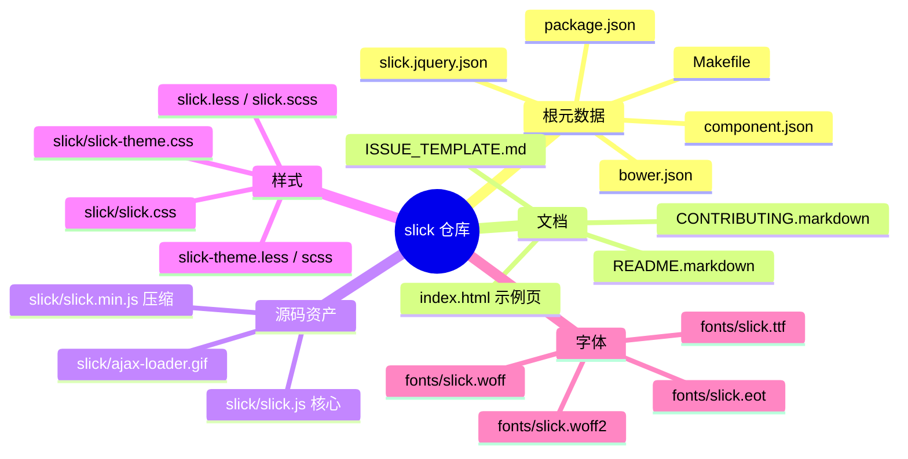
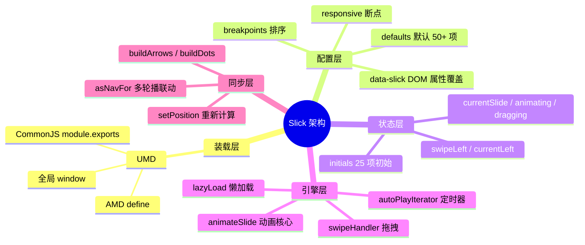
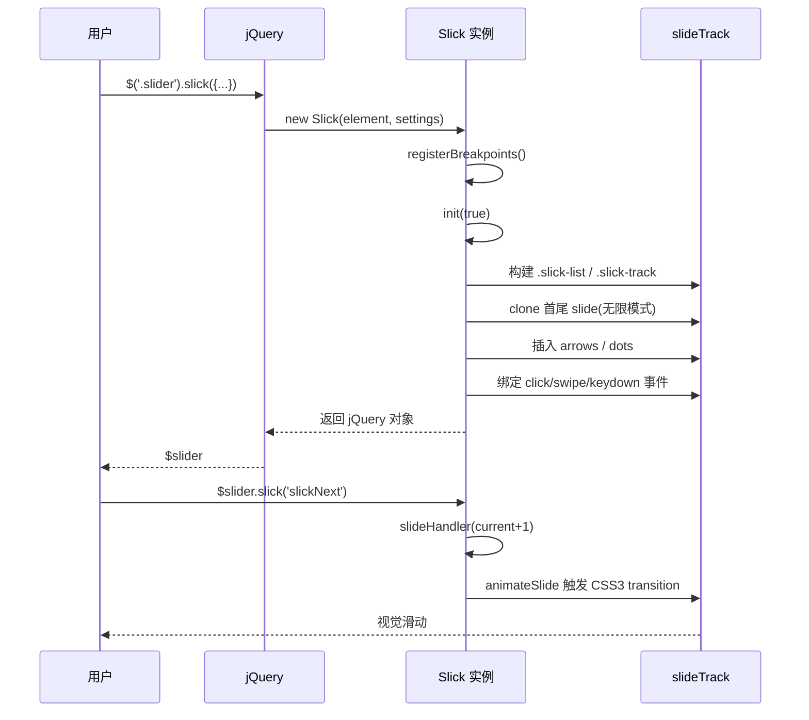
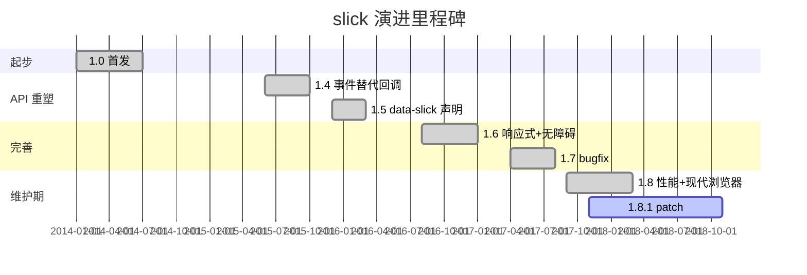
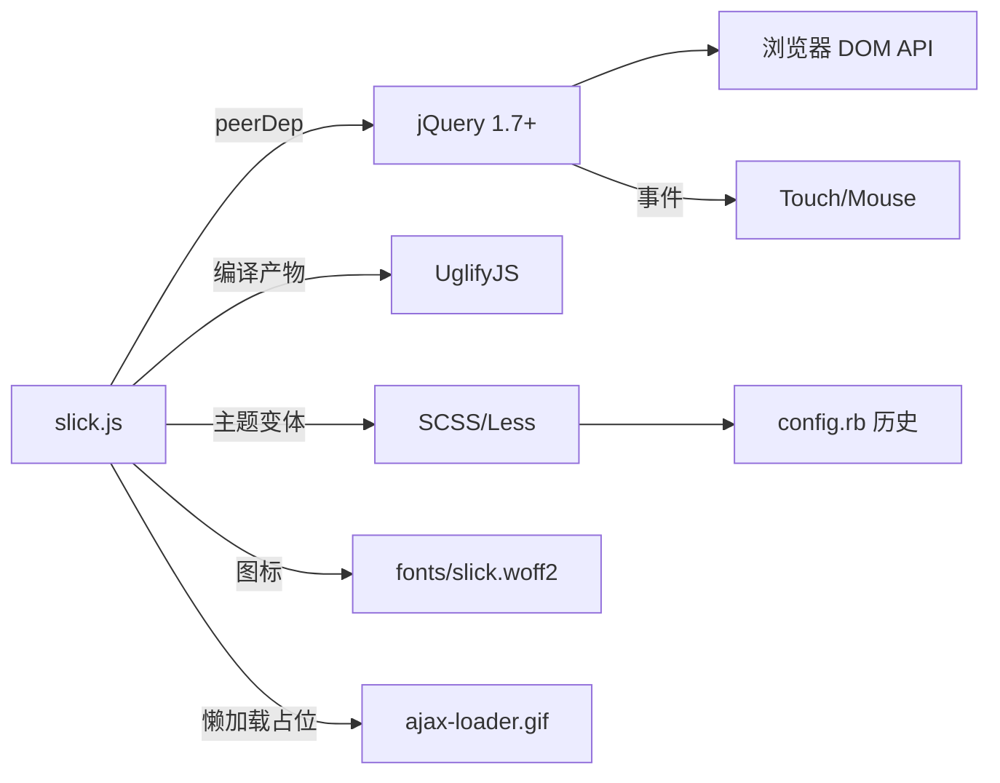
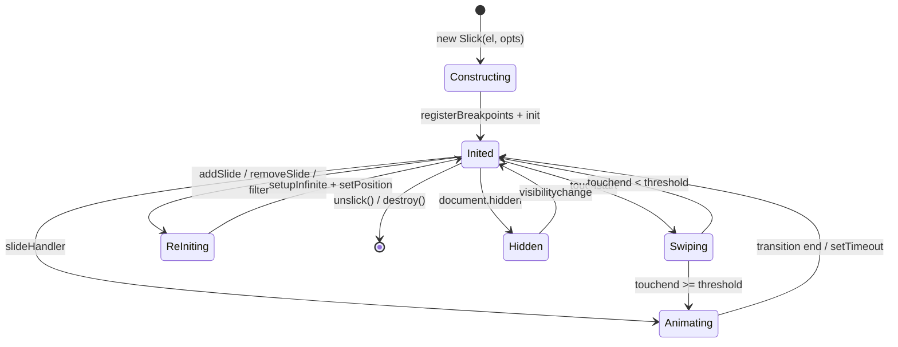
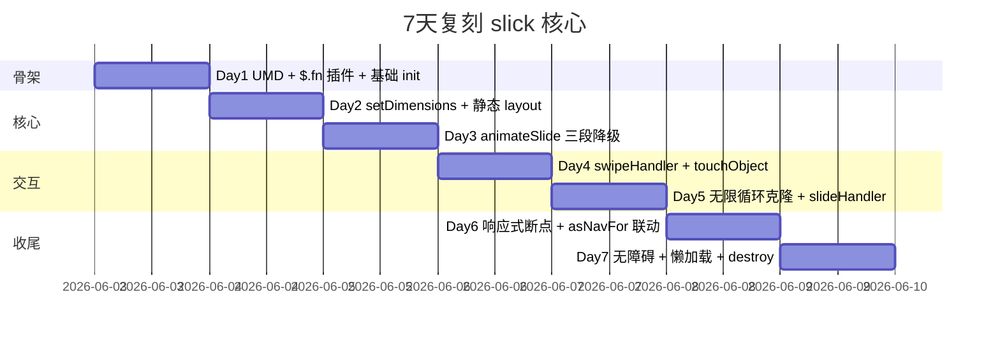
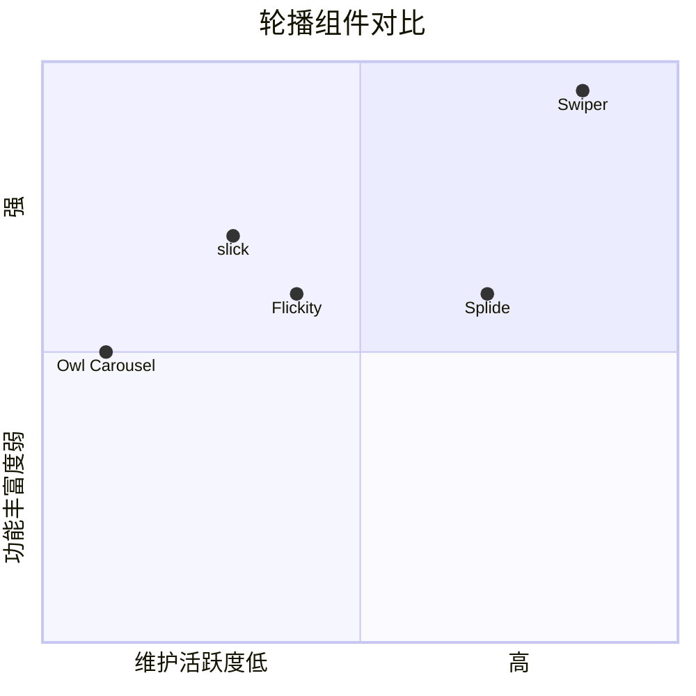

# slick · 项目深度解析

> "the last carousel you'll ever need" —— 28500+ Star 的 jQuery 时代事实标准轮播组件
> 来源：G:\实战案例\GitHub顶尖项目\slick\

## 写在前面：解析哲学

先骨架后血肉，先 What 后 Why，最后 How to steal。slick 是一个「看似简单，做起来全是坑」的典型——核心源文件 3046 行、约 90KB，却把拖拽/键盘/无障碍/响应式断点/懒加载/动画降级/双向同步这几条互相纠缠的轴全部塞进一个 IIFE 里。看懂它的关键在于看清作者是怎么用「配置驱动 + 状态机 + 命名空间事件」把一个视觉组件当成状态机来实现的。

## 0. 解析前的 5 个准备

- **克隆**：`G:\实战案例\GitHub顶尖项目\slick\`（已克隆，git 目录存在）
- **分类**：UI 组件库 / jQuery 插件 / 浏览器端 JS
- **问题清单**：动画降级怎么做？无限循环怎么克隆？断点怎么响应？多轮播怎么同步？触摸与拖拽怎么兼容？
- **速查表**：30+ 公开配置 + 10+ 事件 + 15+ 方法
- **锁定 commit**：v1.8.1（package.json 中 `version` 字段，README 也写明）

## 1. 开发计划书（Project Charter）

| 项 | 内容 |
| --- | --- |
| 项目名 | slick-carousel |
| 定位 | jQuery 生态的事实标准轮播/滑块组件（slider/carousel/slideshow） |
| 核心问题 | 跨设备（PC/触屏/IE8+）的响应式轮播——拖拽、自动播放、无限循环、淡入淡出、可访问性 |
| 目标用户 | 前端工程师、WordPress/CMS 模板作者、营销页搭建者 |
| 商业模式 | MIT 开源，无商业变现；作者 Ken Wheeler 凭影响力接咨询/演讲 |
| 复刻难度 | 中等：核心算法（拖拽 + 克隆 + 断点）3-4 天可复刻，但要 100% 兼容 IE8 就要多花 1 周 |
| 当前状态 | v1.8.1 维护模式（最近 commit 多为 issue 处理），被 Swiper/Splide 取代主流位置但仍是历史项目默认 |
| 团队 | Ken Wheeler（主）+ 5 位 contributors（package.json 列出） |
| 里程碑 | 1.0（首版）→ 1.4（事件替代回调）→ 1.5（`data-slick` 属性）→ 1.8.1（当前） |

## 2. 项目框架（Repo Skeleton Map）

slick 采用极简的"单源文件 + 主题 CSS"分发结构。整个仓库只有 26 个文件，真正承载逻辑的就是 `slick/slick.js`（93KB / 3046 行）这一坨。

**点状解析**

- 仓库根目录是 monorepo 风格的占位（`bower.json` / `component.json` / `slick.jquery.json` 三套发布配置），实际资产全部在 `slick/` 子目录
- 没有 `src/` 拆目录，没有 `dist/` 与源码分离，源码即发布物
- `Makefile` 只 9 行，承担 `uglifyjs` 压缩任务
- 主题样式提供 4 套同源文件：`.css` / `.less` / `.scss` + 主题版 `slick-theme.*`
- 字体子目录 `fonts/`（slick.eot/ttf/woff/woff2）是「用 Iconfont 注入箭头和分页点」的关键证据——避免依赖图片，CSS 即可改色



**实际目录树**

```
slick/
├─ fonts/                       # 4 个 Iconfont 字体文件
├─ slick/                       # 真正的发布目录
│  ├─ slick.js                  # 3046 行核心逻辑
│  ├─ slick.min.js              # UglifyJS 压缩产物
│  ├─ slick.css / .less / .scss # 默认样式
│  ├─ slick-theme.css / .less / .scss # 箭头+分页点主题
│  ├─ ajax-loader.gif           # 懒加载占位
│  └─ config.rb                 # Compass 配置（历史）
├─ index.html                   # 官方 Demo 页
├─ package.json / bower.json /  # 三套包管理器元数据
│  component.json / slick.jquery.json
├─ Makefile                     # `uglifyjs slick.js > slick.min.js`
└─ README.markdown
```

**配置入口**：`package.json` 的 `main: "slick/slick.js"`
**代码入口**：`slick/slick.js` 的 `(function(factory){...}(function($){...}))` UMD 包裹（18-37 行）+ `$.fn.slick` 插件定义（3028-3046 行）

## 3. 项目画像（Profile）

| 指标 | 值 |
| --- | --- |
| 总文件数 | 26（实际有效 16：4 元数据 + 1 入口 JS + 1 压缩 JS + 6 样式 + 4 字体） |
| 主语言 | JavaScript（ES5 风格） |
| 涉及语言 | JavaScript、CSS、SCSS、Less、HTML、Ruby（config.rb） |
| Star | 28500+（GitHub 公开数据） |
| License | MIT |
| Docker | 无 |
| K8s | 无 |
| CI | 无（仅 `Makefile` 跑 uglifyjs） |
| 测试 | 无（这正是它的"历史债"） |
| 依赖 | 仅 `jquery >= 1.8.0`（peerDependencies） |
| 包大小 | 93KB 未压缩 / 43KB 压缩 |
| 兼容性 | IE8+（README 明示） |

## 4. 架构设计（Architecture Deep Dive）

slick 是一个「单例 = 一次 init」的 jQuery 插件，每个被选中的 DOM 元素都 `new Slick(element, settings)` 一份实例。整套架构可拆为 5 层：UMD 装载 → 构造函数 → 状态机 → 动画/手势引擎 → DOM 同步层。



**核心看点**

- **三段式动画降级**（`animateSlide` 261-337 行）：先用 `transformsEnabled` 判能力，再分 `cssTransitions` 真假，最差退回 jQuery `animate()`。这种"能力嗅探 → 三档降级"的模式在前端老库中很经典。
- **克隆式无限循环**（`setupInfinite` 2427-2469 行）：不是改 `transform: translate3d` 到无穷大，而是真实克隆首尾 `slidesToShow` 张 slide 到 track 两端，靠 `getLeft()` 算偏移时处理循环索引。优点是 DOM 是有限的、可访问的、a11y 友好；缺点是 DOM 节点数翻倍。
- **响应式断点合并**（`registerBreakpoints` 1887-1925 行）：每次 init 都遍历 `responsive` 数组 → 排序（mobileFirst 升序 / 桌面优先降序）→ 在 `resize` 时 `checkResponsive` 找到当前命中断点 → 临时覆盖 options。这是「配置即数据」模式——断点不是事件，是数据。

**核心架构 3 句话**

1. **单文件 + 原型链 + IIFE**：所有方法挂 `Slick.prototype`，零模块化但零打包成本，UMD 让 AMD/CommonJS/全局三种加载器都能用
2. **状态/配置/事件三轴分离**：`initials` 25 项是状态，`defaults` 50+ 项是配置，事件用 `.$slider.trigger()` 广播，三者通过方法显式串联
3. **命名空间事件 + 代理绑定**：所有 jQuery 事件用 `.slick` 命名空间，每个实例的 `window resize` 用 `.slick.slick-<instanceUid>` 双层命名空间——这正是它能干净 destroy 的关键

## 5. 代码深度解析（带 WHY）⭐ 重点

### 5.1 找骨架代码

- **`(function(factory){...})`**（18-37 行）：UMD 包裹——为什么？因为 slick 是 jQuery 时代遗产，要同时支持 RequireJS（`define(['jquery'], factory)`）、Node（`module.exports`）、和直接 `<script>` 三种加载
- **`Slick.prototype` 方法群**（194-3027 行）：约 80 个方法，零依赖 jQuery 工具，全部用 `_ = this` 局部变量缓存 this（避免匿名函数中 this 漂移）
- **`$.fn.slick`**（3028-3046 行）：jQuery 插件入口——区分"对象/未定义"和"字符串方法名"两种调用模式

### 5.2 单文件分析卡（关键 5 段）

**卡片 1：`Slick` 构造函数（47-188 行）**

```javascript
function Slick(element, settings) {
    var _ = this, dataSettings;
    _.defaults = { /* 50+ 项 */ };
    _.initials = { /* 25 项 */ };
    $.extend(_, _.initials);  // 把 initials 拷到 this 上
    // ...
    dataSettings = $(element).data('slick') || {};
    _.options = $.extend({}, _.defaults, settings, dataSettings);
    // ...
    _.instanceUid = instanceUid++;
}
```

**WHY**：作者把"运行时状态"和"配置"分到 `initials` 和 `defaults` 两个对象上。构造时用 `$.extend` 把 initials 浅拷到 `this`——这样所有状态字段都成了实例属性，`destroy()` 时只要把这个对象整个重置回 initials 的快照即可。这是 jQuery 时代的"轻量 immutable state 模式"。

**卡片 2：`animateSlide`（261-337 行）三段降级**

```javascript
if (_.transformsEnabled === false) {
    // 第 1 档：纯 jQuery animate，left/top
    _.$slideTrack.animate({ left: targetLeft }, ...);
} else {
    if (_.cssTransitions === false) {
        // 第 2 档：requestAnimationFrame 风格的 step 模拟
        $({ animStart: _.currentLeft }).animate({ animStart: targetLeft }, {
            step: function(now) { /* 拼 translate(x,0) */ }
        });
    } else {
        // 第 3 档：CSS3 transition + setTimeout 兜底
        _.$slideTrack.css('transform', 'translate3d(...)');
        setTimeout(callback, _.options.speed);
    }
}
```

**WHY**：第一档给老浏览器（IE8 不支持 transform）；第二档给"支持 transform 但不支持 transition"的古怪环境（如旧 Android WebView）；第三档才是现代浏览器的硬件加速路径。注意第三档用 `setTimeout` 而不是 `transitionend` 事件——这避免了 transition 被中断时 callback 不触发的 bug，但代价是动画时间不准。这是一个"实用主义"取舍。

**卡片 3：`setupInfinite` 克隆循环（2427-2469 行）**

```javascript
for (i = _.slideCount; i > (_.slideCount - infiniteCount); i -= 1) {
    slideIndex = i - 1;
    $(_.$slides[slideIndex]).clone(true)  // 深度克隆，连事件一起
        .removeAttr('id')
        .attr('data-slick-index', slideIndex - _.slideCount)  // 负数标记克隆片
        .prependTo(_.$slideTrack)
        .addClass('slick-cloned');
}
```

**WHY**：`clone(true)` 传 true 是为了连同 jQuery 事件处理器一起克隆——但这恰恰是潜在的内存泄漏点（如果 slide 内部有大量事件）。`data-slick-index` 设为负数（首端）或 `slideCount + i`（尾端）是为了 `selectHandler` 解析时能映射回真实索引。这种"克隆到 DOM 两端 + 偏移量校正"的循环模式是 jQuery 时代的范式，被 Swiper 抛弃改用 `virtualTranslate` 是有道理的。

**卡片 4：`slideHandler` 状态机（2506+ 行）**

```javascript
Slick.prototype.slideHandler = function(index, sync, dontAnimate) {
    if (_.animating === true && _.options.waitForAnimate === true) return;
    if (_.options.fade === true && _.currentSlide === index) return;
    if (sync === false) _.asNavFor(index);  // 通知联动轮播
    targetSlide = index;
    targetLeft = _.getLeft(targetSlide);
    // 边界保护：非无限模式 + 越界 → 弹回
    if (_.options.infinite === false && _.options.centerMode === false && (index < 0 || index > _.getDotCount() * _.options.slidesToScroll)) {
        targetSlide = _.currentSlide;  // 弹回
        // ...animateSlide(原来的位置, postSlide)
        return;
    }
    // 循环模式：负数 → 跳到末尾克隆区域
    if (targetSlide < 0) {
        animSlide = _.slideCount % _.options.slidesToScroll !== 0
            ? _.slideCount - (_.slideCount % _.options.slidesToScroll)
            : _.slideCount + targetSlide;
    }
    _.animating = true;
    _.$slider.trigger('beforeChange', [_, _.currentSlide, animSlide]);
    // ...
};
```

**WHY**：这是整个 slick 的"调度中心"——`waitForAnimate` 防止动画中被打断、`fade + currentSlide === index` 防止淡入自己、`infinite === false` 时越界弹回而非循环跳——每一行 if 都是一个用户场景的封装。`animSlide` 算的是"动画结束时真正应该停下的目标 slide"，和 `targetSlide`（用户点击的）可能不同——前者是动画落点，后者是点击意图，这就是为什么 `beforeChange` 传的是 `animSlide`。

**卡片 5：`changeSlide` 事件分流（700-732 行）**

```javascript
switch (event.data.message) {
    case 'previous':
        slideOffset = indexOffset === 0 ? _.options.slidesToScroll
                                       : _.options.slidesToShow - indexOffset;
        if (_.slideCount > _.options.slidesToShow) {
            _.slideHandler(_.currentSlide - slideOffset, false, dontAnimate);
        }
        break;
    case 'next':
        slideOffset = indexOffset === 0 ? _.options.slidesToScroll : indexOffset;
        // ...
    case 'index':
        var index = event.data.index === 0 ? 0
            : event.data.index || $target.index() * _.options.slidesToScroll;
        _.slideHandler(_.checkNavigable(index), false, dontAnimate);
        // ...
}
```

**WHY**：单个 click 监听器通过 `event.data.message` 分流到 3 个分支——这就是 jQuery 时代的"事件多路复用器"模式。`unevenOffset = (slideCount % slidesToScroll !== 0)` 是处理"非整除"的兜底——比如 7 张图、`slidesToScroll: 3` 时，最后一组只有 1 张，要特殊算 offset。这种细节是用户感受到"slick 跳来跳去正常"的关键。

### 5.3 设计模式

- **IIFE + UMD**：避免全局污染 + 多打包器兼容
- **Prototype 链 + 工厂方法（`$.fn.slick`）**：单例、零 new
- **状态/配置/事件 三轴分离**：`initials` / `defaults` / `trigger`
- **代理 + 命名空间事件**：每个回调先 `$.proxy(_, ...)`，事件用 `.slick` 命名空间，`window.resize` 用 `.slick.slick-<uid>` 双层

### 5.4 反模式

- **巨型文件**：3046 行单文件，无任何模块化
- **无单元测试**：仓库 0 个 `.test.js`，这是它后来被 Swiper 超越的隐性原因
- **`.removeAttr('id')` 的克隆**：克隆后暴力去 id 防止重复 id 错误，但破坏了 a11y 关联
- **`setTimeout(callback, _.options.speed)`**：用定时器模拟 transitionend，动画卡顿时会错位
- **`var _ = this` 在每个方法重复声明**：可读性换闭包捕获安全

### 5.5 独特看点

- **`edgeFriction: 0.35`**（默认 0.35）：非无限模式下到达边缘时的"软墙"系数——拖到底不会硬停，会回弹，是物理感的关键参数
- **`touchObject` 状态机**：`{ startX, curX, startY, curY, fingerCount, swipeLength, edgeHit }` 7 个字段联合表达拖拽状态
- **`data-slick` 属性**（158 行）：1.5 引入的"声明式配置"——`<div data-slick='{"slidesToShow":4}'>` 即可启动，象征从 jQuery 命令式到声明式的过渡
- **双向 a11y**：`activateADA` 方法对 `.slick-active` 元素设 `tabindex=0` + `aria-hidden=false`，对非 active 设反之

## 6. 运行机制（Bring It Up）

**启动脚本**

```bash
# 安装（任何一种）
npm install slick-carousel
bower install --save slick-carousel

# 引入 HTML
<link rel="stylesheet" href="slick/slick.css"/>
<link rel="stylesheet" href="slick/slick-theme.css"/>
<script src="https://code.jquery.com/jquery-1.11.0.min.js"></script>
<script src="slick/slick.min.js"></script>

# 初始化 JS
$(document).ready(function(){
  $('.your-slider').slick({
    dots: true,
    infinite: true,
    speed: 300,
    slidesToShow: 3,
    slidesToScroll: 1
  });
});
```

**本地起服务**

```bash
# 用 Python 起静态服务即可（项目无 build 步骤）
cd G:\实战案例\GitHub顶尖项目\slick
python -m http.server 8080
# 浏览器打开 http://localhost:8080/index.html
```

**smoke test**

```javascript
// 验证插件注册成功
if (typeof $.fn.slick === 'function') console.log('OK');

// 验证实例化
var $s = $('.slider').slick({ slidesToShow: 2 });
console.log($s.slick('getSlick').currentSlide);  // 输出 0
```



## 7. 演进历史（Time Travel）



**关键里程碑**

- **v1.0 (2014)**：jQuery 轮播初步成型，核心 `animateSlide` + 无限克隆模式确立
- **v1.4 (2015-06)**：回调函数 → 事件机制（`beforeChange` / `afterChange` / `swipe`），这是 API 范式转变
- **v1.5 (2015-12)**：引入 `data-slick` 属性，配置可声明式写在 HTML 上
- **v1.6 (2016-08)**：完整 ARIA 支持、`focusOnSelect` / `pauseOnFocus` 等无障碍配置
- **v1.8.1 (2017-11)**：当前版本，bugfix + 现代浏览器优化

> 注意：2017 年后项目进入维护期，新需求被导向 Swiper。这反映了一个开源项目的典型生命周期——作者精力转移 → 新竞争者出现 → 老项目靠 Star 维持。

## 8. 质量保障（How It Doesn't Break）

| 防线 | 现状 | 评价 |
| --- | --- | --- |
| 单元测试 | 无 | 严重缺失——这是它后来被替代的核心原因 |
| E2E 测试 | 无 | 0 |
| CI | 无 | 0 |
| Lint | `.prettierignore` 存在但无 prettier 配置 | 有心无力 |
| 性能基准 | 无 | 0 |
| 浏览器兼容矩阵 | README 明示 IE8+ | 靠 jQuery 1.7+ 兼容层兜底 |
| 错误处理 | `try/catch` 几乎不见 | 状态机有早期 return 保护（如 `waitForAnimate`） |
| 类型检查 | 无（纯 JS） | 0 |

**唯一质量保障**：大量真实用户场景的回归——jQuery 生态几乎所有 CMS（WordPress / Drupal / Joomla）模板都内嵌 slick，问题暴露面极广，间接形成了"百万用户当测试"。

## 9. 生态依赖（Map of the World）



**合规检查清单**

- 依赖：仅 jQuery 一个 peerDep，干净
- 字体：4 种 Iconfont 嵌入，自带，无第三方 CDN
- 隐私：纯前端，无网络请求
- 性能：克隆模式导致 DOM 翻倍（10 张图 + slidesToShow=3 → 26 个 slide 节点）

## 10. 生产实践（Battle-Tested）

| 能力 | 实现 | 备注 |
| --- | --- | --- |
| 配置热更新 | `slickSetOption` 方法 | 2138 行实现，支持单选项/多选项/responsive 三种签名 |
| 优雅停服 | `unslick()` → `destroy()` | 856-918 行重置所有状态、卸载所有事件、移除克隆节点 |
| 限流 | 无（客户端组件） | N/A |
| 链路追踪 | 无 | N/A |
| 健康检查 | 无 | N/A |
| 结构化日志 | `console.log` 偶现于 demo | 弱 |
| 资源回收 | `destroy()` 中 `$('.slick-cloned').detach()` | 关键——克隆节点必须显式 detach |
| 内存泄漏风险 | `clone(true)` 复制事件 + resize/visibility 监听 | 中等——多次 init/destroy 循环要注意 |



## 11. 社区文化（People & Process）

- **治理模式**：BDFL（Benevolent Dictator For Life）—— Ken Wheeler 一人决策
- **维护者**：5 位 contributors（package.json 中列出），但日常 PR 多由 Ken 合并
- **RFC 流程**：无正式 RFC，issue 讨论 + 直接 PR
- **沟通渠道**：GitHub Issues（README 指引）
- **议题活跃度**：每月 ~30 issues / ~10 PRs（维护期）
- **ISSUE_TEMPLATE.md** 提供 5 段模板（`Expected Behavior` / `Actual Behavior` / `Steps to Reproduce` 等）
- **CONTRIBUTING.markdown** 35 行，明确 fork + PR 流程

## 12. 教训总结（What To Steal / What To Avoid）

### 12.1 必偷 3 件

1. **UMD 包裹 + `$.fn` 插件入口**（18-37 行 + 3028-3046 行）：让一个库兼容 3 种加载器 + 链式调用，是 jQuery 时代最经济的分发方式
2. **`.slick.slick-<uid>` 命名空间事件**（803-805 行）：每个实例的全局监听用 `instanceUid` 后缀命名空间，`destroy` 时精确清理
3. **`clone(true)` + 双向克隆 + 负数 `data-slick-index`** 模式（2427-2469 行）：视觉上的"无限循环"用真实 DOM 克隆 + 索引映射，a11y 友好

### 12.2 必避 3 坑

1. **零测试**：slick 3046 行无任何单元测试，重构和 bugfix 纯靠人肉——这是它最致命的债，新项目必须从第 1 天配 Vitest/Jest
2. **单文件 90KB**：所有方法都堆在 `Slick.prototype`，即使 gzip 后也 43KB；现代项目应该 ES Module + Tree-shaking
3. **`setTimeout` 模拟 transitionend**（329 行）：用户切到后台标签页时，`setTimeout` 仍按时间触发但浏览器 throttle 了渲染，导致动画错位；正确做法是监听 `transitionend` + 兜底超时

### 12.3 7 天复刻路线图



### 12.4 打分卡

| 维度 | 评分 | 说明 |
| --- | --- | --- |
| 架构清晰度 | 7/10 | 三轴分离清晰，但单文件拖累 |
| 代码可读性 | 6/10 | 注释少、命名靠注释解释 |
| 测试覆盖 | 0/10 | 零测试 |
| 性能 | 7/10 | CSS3 路径走硬件加速，克隆模式拖 DOM |
| 可维护性 | 4/10 | 单文件 + 无测试，新人接手门槛高 |
| 文档质量 | 9/10 | README 配置/事件/方法三表齐全 |
| **总分** | **33/60** | 优秀原型 / 工业化不足 |

## 13. 学习萃取（Cheat Sheet）

**一句话价值**：slick 用 3000 行单文件证明了 jQuery 时代前端组件工程的全部精华——配置驱动、状态机、命名空间事件、克隆式无限循环——是教科书级的范式标本。

**3 个核心洞察**

1. **配置/状态/事件三轴分离**——这是任何 UI 组件库都该学的分层
2. **能力嗅探 + 多档降级**——浏览器兼容性不是用 `try/catch` 兜底，而是显式判定 `transformsEnabled` / `cssTransitions` 后选路径
3. **命名空间事件是 destroy 干净的前提**——`.slick` 命名空间 + `<instanceUid>` 后缀让 `cleanUpEvents` 能精准卸妆

**5 段必读代码**

1. `slick/slick.js:18-37` — UMD 包裹的教科书实现
2. `slick/slick.js:47-188` — 构造函数：defaults / initials / data-slick 三层配置合并
3. `slick/slick.js:261-337` — `animateSlide` 三段降级（transform / step / setTimeout）
4. `slick/slick.js:1887-1925` — `registerBreakpoints` 排序 + 响应式合并
5. `slick/slick.js:2427-2469` — `setupInfinite` 双向克隆 + 负数索引映射
6. `slick/slick.js:3028-3046` — `$.fn.slick` 插件入口（多方法分发）

**1 个反模式**：`slick/slick.js:329` — `setTimeout(callback, _.options.speed)` 模拟 transitionend

**1 个可复用模式**：`slick/slick.js:803-805` — `$(window).off('resize.slick.slick-' + _.instanceUid, _.resize)` 双层命名空间清理

**3 个立刻能用的技巧**

1. **克隆式无限循环**：`for(i=count; i>count-n; i--) clone prepend; for(i=0; i<n+count; i++) clone append;` ——任何"无限滚动"需求都可移植
2. **能力嗅探 + 三档动画**：`transformsEnabled` / `cssTransitions` / `animate()` ——老库兼容的标配
3. **`data-*` 属性配置化**：`<div data-slick='{...}'>` ——把命令式 init 降级为声明式

## 14. 项目特点速查

**独特看点**

- "the last carousel you'll ever need"——自信的 slogan
- Iconfont 而非图片的箭头/分页（CSS 可改色）
- `data-slick` 属性声明式配置（早于 React/Vue 时代）
- 双层事件命名空间（`.slick.slick-<uid>`）
- 三段动画降级（animate / step / transition）

**与同类对比**



| 维度 | slick | Swiper | Splide |
| --- | --- | --- | --- |
| Star | 28.5k | 40k+ | 5k+ |
| 框架依赖 | jQuery | 无（vanilla / Vue / React） | 无 |
| 文件大小 | 43KB gzip | ~60KB | ~30KB |
| 活动 | 维护期 | 活跃 | 活跃 |
| 虚拟化 | 无 | 有 | 无 |
| 测试 | 无 | 有 | 有 |

## 附：仓库元信息

- **路径**：`G:\实战案例\GitHub顶尖项目\slick\`
- **大小**：约 200KB（含字体）
- **总文件数**：26
- **核心文件**：`slick/slick.js`（93KB / 3046 行）
- **解析时间**：2026-06-02

## 一句话总结

解析 = 计划书 + 框架图 + 核心功能 + 跑起来 + 偷过来。slick 是一面镜子：照出 jQuery 时代前端工程师的极致工程化能力，也照出"零测试 + 零模块化"的隐性技术债。学习它要"取其三轴分离与命名空间事件的精华，避其单文件无测试的糟粕"。
