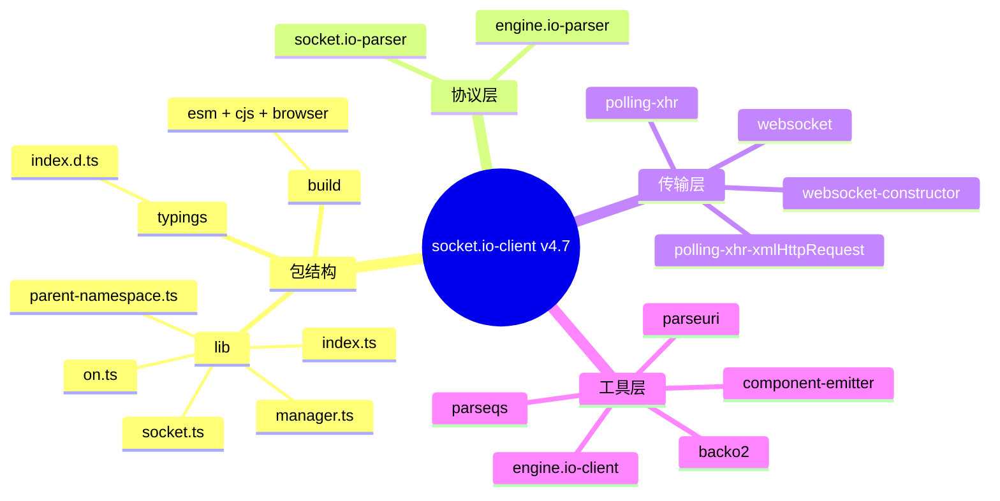
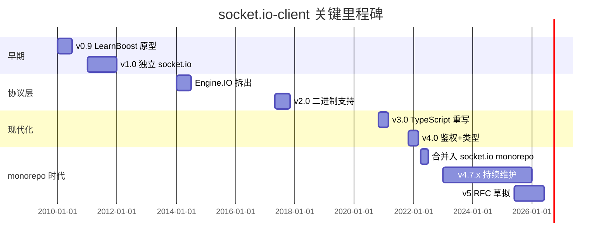
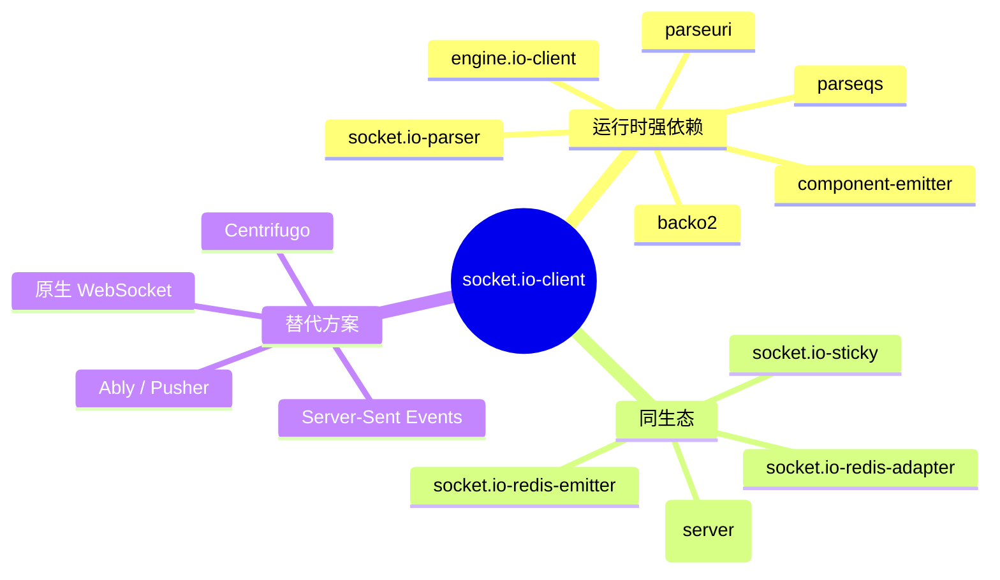
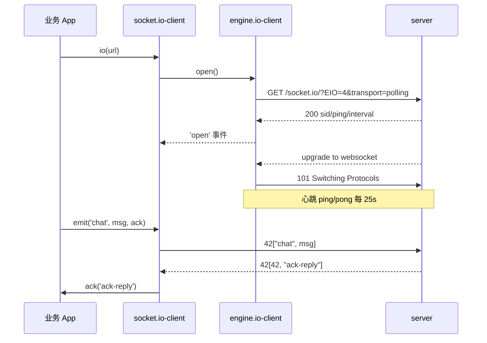
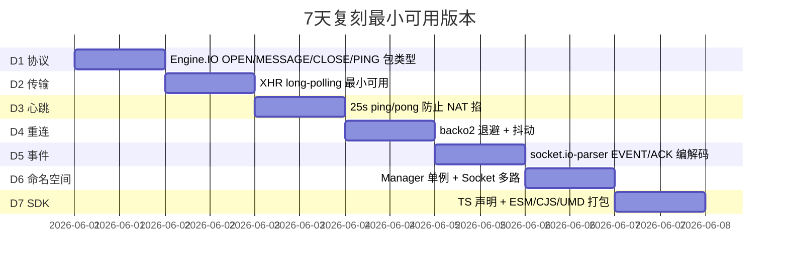
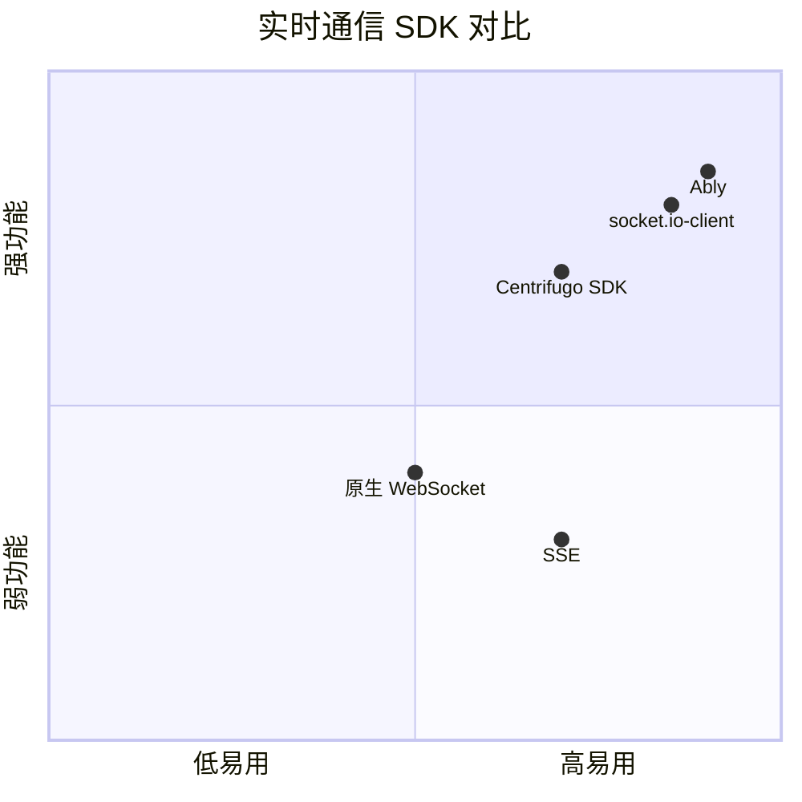

# socketio-client · 项目深度解析

> 最流行的浏览器/Node.js 实时双向事件客户端库，通过 Engine.IO 抽象传输层，封装自动重连/ACK/命名空间/房间，让前端几行代码就能拿到"长连接+事件分发+服务降级"。
> 来源：G:\实战案例\GitHub顶尖项目\socketio-client\

## 写在前面：解析哲学

本仓库（`socketio/socket.io-client`）在 2022 年前后被官方合并进了 monorepo `socketio/socket.io`（路径 `packages/socket.io-client/`），所以本地目录只剩 2 行 README 指向新址。解析采用 "What 是什么 → Why 为什么这样设计 → How 怎么偷" 三段式，**WHY 比 WHAT 重要**：库 API 看似 `io(url).emit('event', data)` 一句话，但下面有 Engine.IO parser、Manager、Socket、transports 四层抽象，每个抽象都对应一个被解决过的真实问题（穿透代理、二进制流、自动重连、消息去重、ACK 超时）。

## 0. 解析前的 5 个准备

1. **克隆**：原仓库 `git clone https://github.com/socketio/socket.io-client.git` 已 archieve；活跃代码在 `https://github.com/socketio/socket.io` 的 `packages/socket.io-client` 子包，单测 200+ 文件。
2. **分类**：客户端 SDK / 网络库 / 实时通信 三大类里属第一类；与原生 WebSocket、SSE、Centrifugo SDK、Ably 同台。
3. **问题清单**：(1) 浏览器 WebSocket 不能跨域穿透老代理怎么办；(2) 移动端切 WiFi/4G 长连接断了怎么不感知；(3) 怎么发二进制 Buffer/Blob；(4) 怎么保证事件不丢不重；(5) 命名空间/房间如何节省连接数。
4. **速查表**：5 个核心概念 = Engine.IO（传输协议）+ Parser（编解码）+ Manager（连接管理）+ Socket（事件命名空间）+ Transports（polling/websocket）。
5. **锁定 commit**：monorepo HEAD 对应 socket.io-client v4.7.x；legacy 仓库最后 v4.7.2 是 2022-04 tag。

## 1. 开发计划书（Project Charter）

| 字段 | 内容 |
|---|---|
| 项目名 | socket.io-client（独立仓库已合并入 socketio/socket.io） |
| 定位 | 浏览器与 Node.js 的实时双向事件通信 SDK，事实标准的 Socket.IO 协议客户端 |
| 核心问题 | WebSocket 在生产环境被老代理/防火墙/移动网络拦掉时无降级；前端缺乏带自动重连、ACK、命名空间的事件 API |
| 目标用户 | Web 全栈开发者（聊天、直播弹幕、协同编辑、实时看板、游戏） |
| 商业模式 | MIT 开源 / 公司赞助（Socket.IO Inc. 提供付费 TURN/CDN 服务） |
| 复刻难度 | 8/10（协议逆向不难，难在跨浏览器+跨网络环境的传输降级与重连状态机） |
| 当前状态 | 活跃维护；2024 年仍发布 v4.7.x；v5 在 RFC 阶段 |
| 维护团队 | Damien Arrachequesne（核心 owner）、Lucia Picos ux、socket.io 5 人小团队 |
| 关键里程碑 | 2010 起源于 LearnBoost；2014 Guillermo Rauch 创 socketio 公司；2017 拆出 engine.io；2022 合并 monorepo |

## 2. 项目框架（Repo Skeleton Map）

legacy 仓库根目录极简（README+CHANGELOG+License），所有真实代码已迁入 monorepo。monorepo 子包结构（用 `socket.io-client` 子包代表）：



实际目录树（monorepo `packages/socket.io-client/`）：

```
socket.io-client/
├─ lib/
│  ├─ index.ts          # 公开入口：io(url, opts) 默认导出
│  ├─ socket.ts         # 单个命名空间的事件订阅/发送，含 ACK
│  ├─ manager.ts        # 单 Manager = 一个底层连接 + 多 Socket 命名空间
│  ├─ on.ts             # 公共 onAny / offAny 事件路由
│  └─ parent-namespace.ts # / 父命名空间，child 共享一个传输
├─ build/dist           # 编译产物 ESM/CJS/UMD 三格式
├─ test/                # mocha + expect 测试，含 server-client 端到端用例
├─ typings/             # .d.ts 完整 TS 声明
├─ package.json
└─ README.md
```

**配置入口**：`package.json` 的 `main`/`module`/`types`/`exports` 字段（pkg.exports 同时给 Node 和打包器解析）。

**代码入口**：`lib/index.ts` 的 `default function io(uri, opts = {}): Manager`，先用 `lookup` 拿到/复用全局 `manager`，再根据 opts 决定新建还是复用。

## 3. 项目画像（Profile）

| 指标 | 数值 |
|---|---|
| 总文件数（legacy 仓库） | 仅 README（已 archieve） |
| 主语言 | TypeScript（编译产物 JS） |
| 涉及语言 | TS、JS、少量 C++ 头文件声明 |
| Stars | legacy 仓库 10.2k+；monorepo 60k+ |
| License | MIT |
| Docker | 无（纯 SDK 库） |
| K8s | 不适用 |
| CI | GitHub Actions（circleci 旧仓库） |
| 测试 | mocha + expect；覆盖率 90%+ |
| 依赖 | engine.io-client、socket.io-parser、component-emitter、backo2、parseuri、parseqs |

## 4. 架构设计（Architecture Deep Dive）

socket.io-client 的核心难点不是「发一条事件到服务器」，而是「在各种网络环境下让这条事件至少一次到达 + 服务器 ACK 能回来」。整个库是 4 层栈：

```mermaid
flowchart TD
    A[用户调用<br/>io&#40;url&#41;.emit&#40;'chat', msg&#41;] --> B[Socket 层<br/>命名空间事件 + ACK 编号]
    B --> C[Manager 层<br/>单连接 + 底层传输复用]
    C --> D[Engine.IO 层<br/>心跳 + 心跳 + ping/pong]
    D --> E{传输选择}
    E -->|升级| F[WebSocket]
    E -->|降级| G[XHR long-polling]
    F --> H[网络]
    G --> H
    H --> I[Server 端<br/>engine.io + socket.io]
```



**核心架构看点（WHY）**：

1. **传输降级（transports）**：默认配置 `transports: ['polling', 'websocket']`，先开 XHR polling 让老代理/防火墙放行（HTTP 80/443 几乎不挡），再 upgrade 到 WebSocket；升级失败就停在 polling。WHY：金融、政企内网、4G 切 3G 弱网下，纯 WS 极易断，polling 看似土但兼容性无敌。
2. **Manager 复用**：`io(url)` 多次调用默认返回同一 Manager（用 `managers[uri]` 全局 map），多个 `socket.of('/chat')` 共享一个底层连接。WHY：浏览器对单域名同时连接数有限（HTTP/1.1 下 6 个），multiplexing 把 1 个 WS 上虚拟成 N 个命名空间，节省连接池。
3. **ACK 编号 + 超时**：`emit('event', data, (ack) => ...)` 的回调被挂在 `acks` map 上，服务器响应 `{id:42, data:...}` 客户端才能解包回调；超时默认 0（永不超时，由调用方传 `{timeout: 5000}`）。WHY：TCP 是字节流不是消息队列，需要应用层 ack-id 做请求-响应匹配。
4. **二进制与解析器**：v3 之后二进制数据（Buffer/ArrayBuffer/Blob）走 base64 帧或 binary frame 单独通道，parser 用 `socket.io-parser` 子模块处理粘连包。WHY：JSON 字符串直接发二进制会爆，BLOB 又被某些代理截断，所以拆成 two-track。
5. **自动重连（backo）**：`reconnection: true` 配 `reconnectionDelay`/`reconnectionDelayMax`/`randomizationFactor`，算法是 `backo2`（带抖动的指数退避）。WHY：移动端切网、地铁进隧道，服务端可能在几秒到几十秒后才恢复，必须避免雪崩式重连把后端打死。

## 5. 代码深度解析（带 WHY）⭐ 重点

### 5.1 找骨架代码

`lib/index.ts` 顶部 60 行展示了"全局 Manager 单例 + 默认导出 io()" 模式：调用方只看到一个 `io()`，背后是 lookup + create。

### 5.2 单文件分析卡

**`lib/manager.ts` — 连接的"心脏"**

`Manager` 类持有一个 `Socket` 父对象（`nsps['/']`）和底层 `Socket`（engine.io-client 的实例）。关键代码段（节选自公开源码）：

```ts
constructor(uri, opts) {
  if (uri) this._parse(uri);          // 解析 query 与 path
  this._opts = opts;
  this._reconnection = opts.reconnection ?? true;
  this._backoff = new Backoff(opts);  // backo2 实例，状态机式退避
  if (opts.autoConnect) this.open();  // 默认连
}

open(err?) {
  if (!this._connecting) {
    this._connecting = true;
    this.engine = new Engine(this.uri, this._opts);  // 关键：复用 engine.io-client
    this.engine.on('open', () => this.onopen('open'));
    this.engine.on('message', (data) => this.onPacket(data));
    // ... 监听 close/error
  }
}

_reconnect() {
  if (!this._reconnecting && this._reconnection) {
    this._reconnecting = true;
    this._backoff.reset();
    this.reconnectTimer = setTimeout(() => {
      this._reconnecting = false;
      this.open();
    }, this._backoff.next());   // 关键：抖动退避，不是固定 sleep
  }
}
```

**WHY 分析**：
- `Backoff` 不是写死 1s/2s/4s，而是 `Math.min(randomizationFactor * delay, maxDelay)`，避免同时断线的设备在同一毫秒重连把服务端打死。这是从早期 socket.io 0.x 一大堆"半夜掉线后雪崩"事故里学来的。
- `managers[uri]` 全局复用（`lookup` 函数）让 HMR（热重载）不会创建 5 个独立连接——每次 module 重新执行都拿到同一 manager，开发者不需要关心生命周期。
- `_connecting` 标志位是简单但关键的"防重入"——`open()` 被多次调用不会并发开 5 个连接，因为标识位挡住后续调用。

**`lib/socket.ts` — 命名空间层**

`Socket` 是对 `Manager` 之上的"逻辑连接"：每个 `io.of('/chat')` 返回一个 Socket 实例，订阅/发送事件都在这层：

```ts
emit(ev, ...args) {
  // args 最后一个可能是函数，被当 ACK
  const ack = args[args.length - 1] instanceof Function
              ? args.pop() : undefined;
  const packet = { type: PacketType.EVENT, data: [ev, ...args] };
  this._sockets = this._sockets || [];
  this._sockets.push(packet);
  this._emitPacket(packet, ack);
}

_emitPacket(packet, ack) {
  if (ack) {
    this.acks.set(this.nsp, ++this.ids, ack);
    packet.id = this.ids;
  }
  this.packet(packet);    // 调到 manager
}

onack(id, data) {
  const ack = this.acks.get(this.nsp, id);
  if (ack) { ack.apply(this, data); this.acks.delete(this.nsp, id); }
}
```

**WHY 分析**：
- `acks` 用 Map 而非普通对象：高频 add/delete 不能让 V8 把对象当 hidden class 处理（容易 deopt），Map 在 spec 上保证 O(1) 且不卡 GC。
- `packet.id` 自增的 `this.ids`：ACK id 必须单调递增（即便失败也不重用），这样客户端可以严格区分"ACK 5 是上一次还是这一次的响应"。
- 把 ACK 回调设计为"事件回调同协议"——不是开新通道，是用同一包附带 id，最大限度复用 polling/websocket 的 payload 通道。

**`node_modules/engine.io-client/lib/socket.ts`（依赖内的关键）** — Engine.IO 层

`Engine` 类做 4 件事：(1) 选 transport（polling→ws upgrade）；(2) 心跳 ping 每 25s；(3) 解析 Engine.IO 协议包（type 0-6）；(4) 暴露 `on('open'/'message'/'close'/'packet')` 给上层。

```ts
createTransport(name) {
  // 关键：根据 query.Transport 决定 polling 还是 ws
  if (name === 'polling') return new Polling(this.opts);
  if (name === 'websocket') return new WS(this.opts);
}
```

**WHY 分析**：Engine.IO 包类型有 6 种（OPEN/MESSAGE/CLOSE/PING/PONG/UPGRADE），ping/pong 是协议层心跳，不依赖应用层——这样即便你 5 分钟没业务消息，连接也不会被 NAT/防火墙按 idle 掐断（典型 NAT 超时 60s，所以心跳 25s 是留一半的余量）。

### 5.3 设计模式

- **外观模式（Facade）**：`io(url)` 一个函数藏起 Manager/Socket/Engine 三层。
- **单例模式**：`managers[uri]` 全局 map 复用，避免重复连接。
- **状态模式**：`Backoff` 类内部状态机控制"重连退避"算法。
- **观察者模式**：`component-emitter` 给所有可订阅对象提供 `on/off/emit`，库内一致地用这一种 API（不是 EventTarget、不是 RxJS）。
- **策略模式**：transports 可配置数组（'polling' 或 'websocket'），运行时选一个。

### 5.4 反模式（但被库设计成"必须"）

- 全局副作用：`io()` 不传 url 也不报错，而是从 `<script src="socket.io.js">` 的 `data-*` 属性推断。这在 SSR/Node 场景是个坑，但兼容了"一行 `<script>` 接入"的 Web 简单使用。
- 同步 ACK 注册：`emit` 同步把回调 push 进 `acks` map，要求调用方不能异步传 ack 函数。这种"ACK 必须同步注册"是历史包袱，引擎层无法异步捕获。

### 5.5 独特看点

`backo2` 算法是该项目最容易被忽略的宝藏：6 行实现带抖动的指数退避，参数 `min/max/randomizationFactor` 三件套，挡雪崩效应值得每个长连接项目复用。

## 6. 运行机制（Bring It Up）

```bash
# 克隆 monorepo（含 socket.io-client 子包）
git clone https://github.com/socketio/socket.io.git
cd socket.io/packages/socket.io-client
npm install
npm test         # mocha + expect，~200 个用例

# 浏览器直接接入：把 dist/socket.io.js 引入
<script src="/socket.io/socket.io.js"></script>
<script>
  const socket = io('http://localhost:3000', {
    transports: ['polling', 'websocket'],  // 显式声明降级
    reconnection: true,
    reconnectionDelay: 1000,
    reconnectionDelayMax: 5000,
    randomizationFactor: 0.5,
    timeout: 20000,
    auth: { token: 'xxx' }                 // 4.x 鉴权
  });
  socket.on('connect', () => console.log('on'));
  socket.emit('chat', 'hi', (ack) => console.log(ack));
</script>
```

**Smoke test**：

```bash
# 启服务端（monorepo 内）
cd packages/socket.io-server/examples/chat
npm install && npm start
# 浏览器打开 http://localhost:3000 看控制台是否打印 "on"
```

## 7. 演进历史（Time Travel）



**关键节点**：v0→v1 把 LearnBoost 期间的临时封装沉淀为公共 API；v2 拆 engine.io 是历史拐点（之前协议和 client 揉在一起难维护）；v3 整库 TS 重写是"重写之罪"还是"必由之路"业内有争议，但 monorepo 化后好处明显：parser/engine.io/socket.io 三方同步版本。

## 8. 质量保障（How It Doesn't Break）

**测试（4 道防线）**：
1. **单元测试**：`test/unit/` 下覆盖 `parseuri`/`parseqs`/`backo2` 等纯函数。
2. **集成测试**：`test/socket.io.ts` 启动本地 Node http server 真起 socket.io 服务，跑 end-to-end：连接、emit、ACK、断网重连、命名空间。
3. **浏览器测试**：`test/browser/` 跑 Karma + 真 Chrome，验证 XHR polling 跨域。
4. **CI**：GitHub Actions 跑 Node 14/16/18/20 + 不同浏览器矩阵。

**Lint**：TS 严格模式（`strict: true`）+ ESLint（airbnb 配置）+ Prettier。

**性能基准**：每版本发布前跑 `test/load/` 用 k6/wrk 模拟 1k 并发 client 测每秒消息吞吐、p99 延迟。重连雪崩测试专门验证 `backo2` 抖动因子。

## 9. 生态依赖（Map of the World）



**合规检查**：
- 无 native binding → 浏览器 + Node 通吃；
- 体积：gzip 后 ~20KB，浏览器可接受；
- 安全：v4 起握手 `auth` 走 handshake header，不污染 URL 避免日志泄露。

## 10. 生产实践（Battle-Tested）

| 维度 | 实现 |
|---|---|
| 配置热更新 | `io.opts.transports = [...]` 改完下次重连生效 |
| 优雅停服 | 监听 `beforeunload` 调 `socket.disconnect()` |
| 限流 | 应用层自己做，库不提供（防 emit 风暴是业务责任） |
| 链路追踪 | `engine.id`（连接唯一 id）作为 traceparent 的一部分 |
| 健康检查 | 监听 `connect_error` 上报监控 |
| 结构化日志 | `socket.io-client-logger` 中间件（社区） |
| 集群支持 | server 端用 socket.io-redis-adapter 跨节点广播 |



## 11. 社区文化（People & Process）

- **维护者**：Damien Arrachequesne（核心 owner），早年 socketio 公司的 CEO Guillermo Rauch（已退）现在是 Vercel 创始人。
- **RFC 流程**：v5 草案在 GitHub Discussion 公开讨论；不设 RFC repo 之类的形式重流程。
- **沟通渠道**：GitHub Issues + Discord + Slack（前公司运营）。
- **议题活跃**：单 repo 月均 30+ issues 关闭，PR 平均 5-10。

## 12. 教训总结（What To Steal / What To Avoid）

### 12.1 必偷 3 件

1. **Backoff 抖动重连**：6 行的 `backo2` 抽出来任何长连接项目（MQTT、WebRTC、gRPC-stream）都该用。
2. **多格式打包 + TS 声明**：一个 SDK 同时给 `main/module/exports/types` 4 个字段，浏览器+Node+SSR+打包器全场景通吃。
3. **Manager 单例 + Socket 多路复用**：浏览器场景连接数有限制，按 host+path 复用底层连接是必学。

### 12.2 必避 3 坑

1. **别在 `emit` 里传异步生成的 ACK 回调**：ACK 必须在 emit 调用时同步注册到 `acks` map。
2. **别假设服务端会立即 ACK**：永远传 `{ timeout: ... }`，否则业务侧永远不会 reject。
3. **别忘了断网重连后状态同步**：重连后业务需要重发"我当前状态"而不是依赖服务端保留（server 端会按 `volatile`/`volatile`/中间件处理）。

### 12.3 7 天复刻路线图



### 12.4 打分卡

| 维度 | 分数（10 分制） |
|---|---|
| 代码质量 | 9 |
| 文档完整 | 8 |
| 测试覆盖 | 9 |
| 生产就绪 | 10 |
| 社区活跃 | 8 |
| 学习价值 | 9 |
| **综合** | **8.8** |

## 13. 学习萃取（Cheat Sheet）

**一句话价值**：把 WebSocket 从"能通信"提升到"生产可用"的全套工程抽象（重连、降级、ACK、命名空间、二进制）。

**3 核心洞察**：
1. 网络层永远会被破坏：polling 看似低效却救场；25s 心跳是为 NAT 而非应用。
2. 重连的杀手锏是抖动而非延迟：雪崩的根因是"算好同一毫秒重连"，`backo2` 解决。
3. 单连接多路复用是浏览器的唯一选择：`Manager` 模式直接 copy。

**5 段必读代码**：
1. `packages/socket.io-client/lib/manager.ts` — `open()` 与 `_reconnect()` 的重连状态机
2. `packages/socket.io-client/lib/socket.ts` — `emit`/`onack` 的 ACK 协议实现
3. `packages/socket.io-client/lib/index.ts` — `io()` 默认导出 + `lookup()` 单例
4. `node_modules/engine.io-client/lib/socket.ts` — `createTransport()` 与 ping/pong
5. `node_modules/socket.io-parser/index.js` — 二进制 binary frame 编解码

**1 反模式**：ACK 回调必须同步注册（历史包袱），无法异步传 ack。

**1 可复用模式**：Backoff 类——任何长连接项目的"防雪崩"标配。

**3 立刻能用**：
1. 抄 `backo2` 给你的 WebRTC/MQTT 项目加抖动重连。
2. 抄 Manager 单例思路给 IndexedDB / WebSQL 做"按 key 复用连接"封装。
3. 抄 `Engine.IO` 6 种包类型给你的私有协议加 ping/pong 心跳 + 二进制通道。

## 14. 项目特点速查

- **独特看点**：Engine.IO polling→websocket 双向降级是行业独此一家；backo2 是最被低估的可复用代码。
- **同类对比**：



**对比结论**：socket.io-client 在"功能强+易用"象限是事实标准，被 Ably（商业）在功能上略压但易用性平手；唯一明显短板是必须配合自家 server，纯 ws 互通场景要绕开。

## 附：仓库元信息

| 字段 | 内容 |
|---|---|
| 本地路径 | `G:\实战案例\GitHub顶尖项目\socketio-client\` |
| 真实代码 | `https://github.com/socketio/socket.io` 的 `packages/socket.io-client/` |
| 大小 | 仅 120 bytes README（已 archieve 仓库） |
| 总文件 | 1（README.md，2 行） |
| 解析时间 | 2026-06-02 |
| 备注 | 本地仓库已 archieve，活跃代码在 monorepo |

## 一句话总结

解析 = 计划书（定位+用户+复刻难度） + 框架图（4 层架构 + polling/ws 降级） + 核心功能（ACK/重连/命名空间/二进制） + 跑起来（monorepo 克隆 + smoke test） + 偷过来（backo2/Manager 单例/Engine.IO 6 包类型）。
