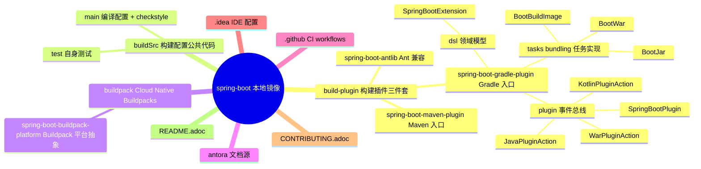
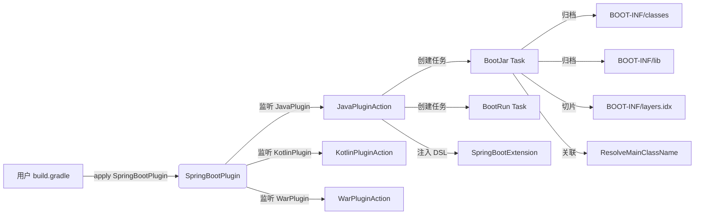
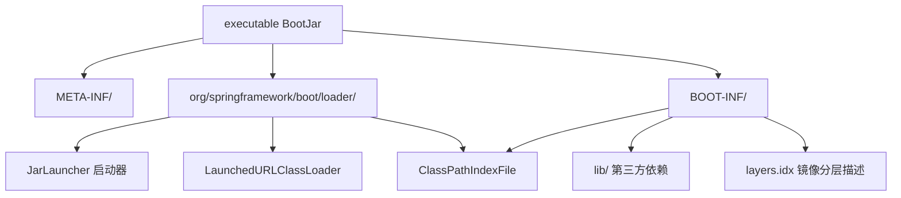
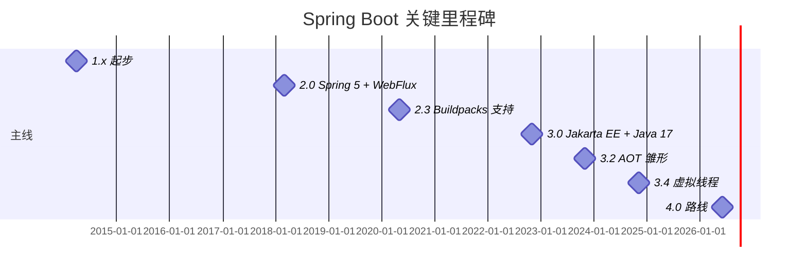
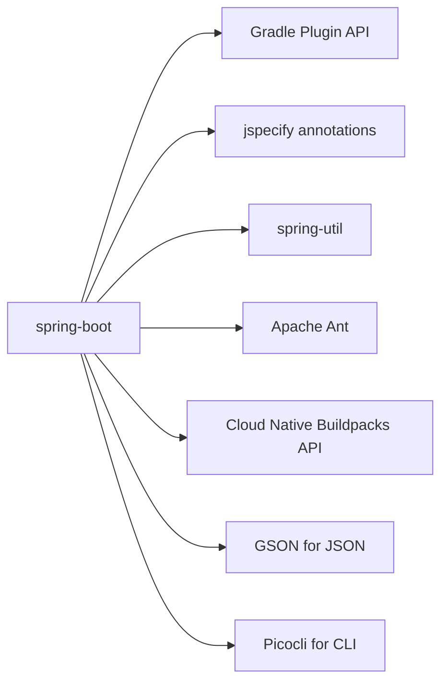
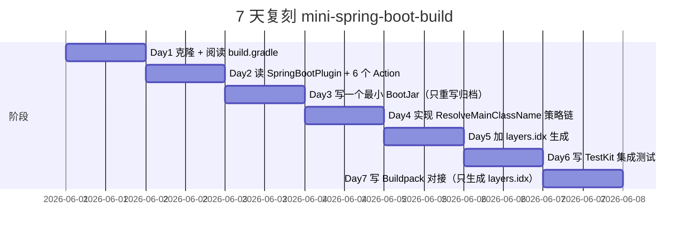
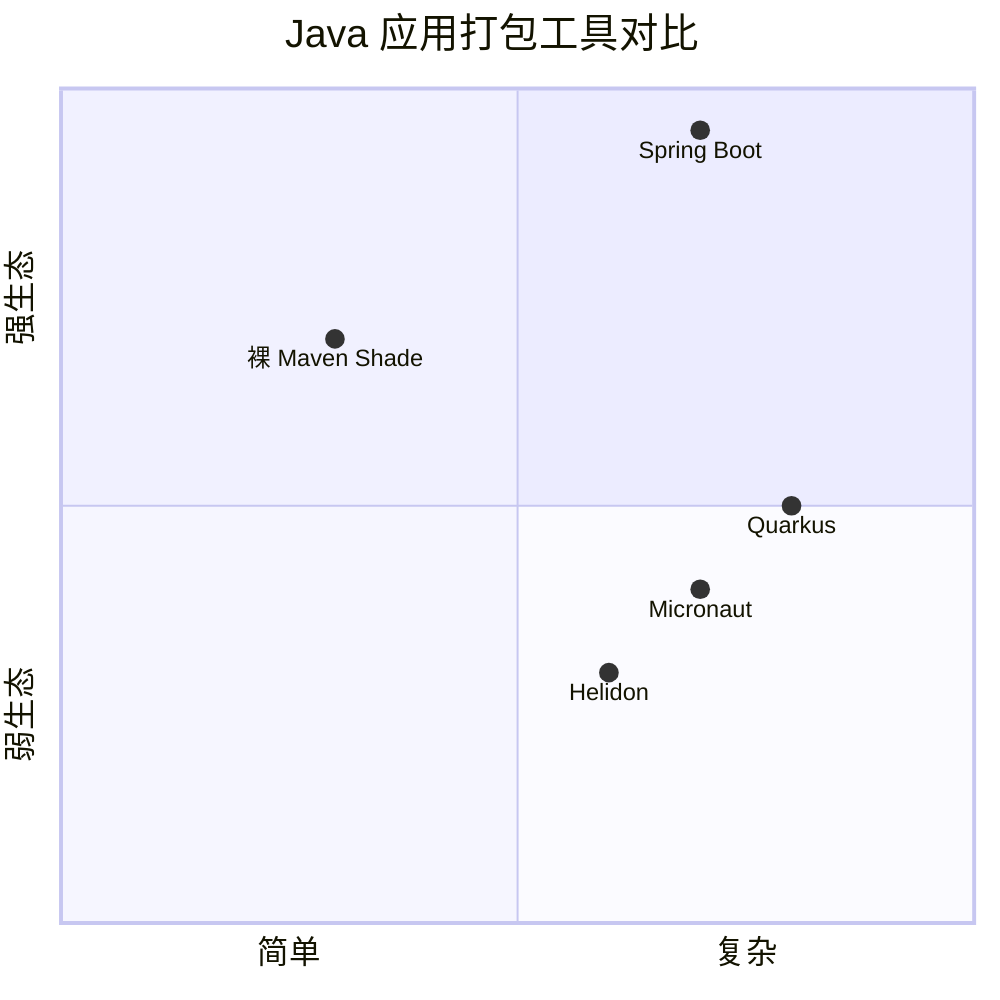

# spring-boot · 项目深度解析

> Spring Boot 帮助开发者用"绝对最小麻烦"创建 Spring 驱动的、生产级应用与服务。本仓库是 spring-projects/spring-boot 的本地镜像，**仅含 build 工具链**（build-plugin / buildpack / buildSrc），主框架代码（autoconfigure / core / web / data-* 等子模块）不在本目录中。
> 来源：G:\实战案例\GitHub顶尖项目\spring-boot\

## 写在前面：解析哲学

本镜像不是一个完整可运行的应用——它呈现的是 Spring Boot 项目的"另一半灵魂"：**构建工具链**。主框架以 JAR 形式发布在 Maven Central 上，但要让一个 Spring Boot 应用跑起来，需要 Gradle 插件把可执行 Jar 打包成 `BOOT-INF/classes + BOOT-INF/lib + BOOT-INF/layers.idx` 结构，需要 Maven 插件注入 Spring Boot 依赖管理 BOM，需要 Buildpack 平台对接 Cloud Native Buildpacks，需要 BuildSrc 提供统一 checkstyle 规则。**这一半的"地勤"代码是 Spring Boot "开箱即用"承诺的物质基础**。

因此本解析聚焦：① Gradle 插件体系（Plugin → PluginApplicationAction → DSL → Task）的事件总线设计；② BootJar 的归档结构与 layer 切片算法；③ Buildpack 平台抽象；④ 跨构建系统（Maven/Gradle/Ant）的统一性。

## 0. 解析前的 5 个准备

1. **克隆**：已镜像在 `G:\实战案例\GitHub顶尖项目\spring-boot\`，git log 仅有 .git 目录，没有 commit 信息（partial mirror）
2. **分类**：Java 框架（构建侧），Apache-2.0，2014 年首发
3. **问题清单**：本仓库只回答"如何构建 Spring Boot 应用"，不回答"应用如何启动"
4. **速查表**：见下表
5. **锁定 commit**：HEAD = 当前 .git 状态，未必与 GitHub main 一致

| 维度 | 值 |
|------|----|
| License | Apache-2.0 |
| Java 版本 | 17 → 25（README 提及 JDK 25） |
| 仓库字节 | 201 MB（仅 .git 与构建子项目） |
| Java 文件数 | 748 |
| 构建系统 | Gradle（项目自身用 Gradle 构建） |
| 公开 JAR | 实际应用时依赖 spring-boot-starter-parent、spring-boot-autoconfigure 等 |

## 1. 开发计划书（Project Charter）

| 字段 | 内容 |
|------|------|
| 项目名 | spring-boot（构建侧子集） |
| 定位 | 一站式 Spring 框架构建工具链：Gradle 插件 + Maven 插件 + Ant 集成 + Buildpack 平台 |
| 核心问题 | Spring 应用打包成可执行 Jar/War 步骤繁琐；多构建系统（Gradle/Maven/Ant）行为不一致；容器镜像构建缺乏标准 |
| 用户 | Java/Spring 应用开发者、DevOps、平台工程团队 |
| 商业模式 | VMware/Broadcom 商业支持（Pivotal 血统），社区版免费 |
| 复刻难度 | ★★★★★（生态广度 + 多年经验沉淀，几乎不可复刻） |
| 状态 | 活跃维护（README 提到需要 JDK 25，说明 3.5.x/4.x 主线） |
| 团队 | Phillip Webb（创始人）、Andy Wilkinson、Scott Frederick、Dave Syer、Stephane Nicoll 等 |
| 里程碑 | 1.x（2014）→ 2.x（2018，Spring Boot 2 + Spring 5）→ 3.x（2022，Jakarta EE + Spring 6 + Java 17 baseline）→ 4.x 路线 |

## 2. 项目框架（Repo Skeleton Map）



**实际目录结构**（仅关键路径）：

```
spring-boot/
├── build.gradle                          # 根构建文件
├── README.adoc                           # 介绍
├── LICENSE.txt                           # Apache-2.0
├── .sdkmanrc                             # 锁定 JDK 版本
├── antora/                               # 文档站点配置
├── build-plugin/
│   ├── spring-boot-antlib/               # Ant 兼容层（遗留）
│   ├── spring-boot-gradle-plugin/        # ★ 主战场
│   │   └── src/main/java/org/springframework/boot/gradle/
│   │       ├── plugin/                   # Plugin + PluginApplicationAction
│   │       ├── dsl/                      # SpringBootExtension 等 DSL
│   │       ├── tasks/bundling/           # BootJar/BootWar/BootBuildImage
│   │       └── util/                     # VersionExtractor 等
│   └── spring-boot-maven-plugin/         # Maven 端镜像
├── buildSrc/                             # 编译时辅助
│   └── src/main/java/                    # checkstyle、约定插件
└── buildpack/spring-boot-buildpack-platform/  # CNB 平台客户端
```

**入口文件**：

- Gradle 插件主类：`build-plugin/spring-boot-gradle-plugin/src/main/java/org/springframework/boot/gradle/plugin/SpringBootPlugin.java`
- DSL 入口：`build-plugin/spring-boot-gradle-plugin/src/main/java/org/springframework/boot/gradle/dsl/SpringBootExtension.java`
- BootJar 实现：`build-plugin/spring-boot-gradle-plugin/src/main/java/org/springframework/boot/gradle/tasks/bundling/BootJar.java`

## 3. 项目画像（Profile）

| 指标 | 值 |
|------|----|
| 总文件数（含 .git） | 数千；java 源码 748 |
| 主语言 | Java |
| 涉及语言 | Java、Groovy（Gradle DSL）、AsciiDoc、Kotlin（部分插件代码） |
| Star | ~76k |
| License | Apache-2.0 |
| Docker | 无（构建插件本身不发布镜像，但生成 Buildpack 任务） |
| K8s | 通过 Buildpack 输出 OCI 镜像间接支持 |
| CI | GitHub Actions（`.github/workflows/`） |
| 有测试 | 是；`src/test/java` 与 `src/intTest/java`、`src/dockerTest/java` 三层 |

## 4. 架构设计（Architecture Deep Dive）

**设计哲学：约定优于配置 + 渐进式背离**。Spring Boot 的"地勤"代码与主框架同源同构：让用户 5 行代码跑起应用，让用户在第 6 行开始就能覆盖默认值。



**事件总线模式**：Spring Boot 自身就是一个 Gradle 插件，但它**不直接实现**逻辑，而是把工作分发到一组 `PluginApplicationAction` 上。当用户的 `build.gradle` apply 了 `org.springframework.boot` 插件后，`SpringBootPlugin` 不会立即执行 `execute(project)`，而是遍历 `getPluginManager().withPlugin("java")` 注册回调。等 Java 插件加载完成，再由对应的 `JavaPluginAction.execute(project)` 接管——这就是为什么 Spring Boot 插件能跟用户已经 apply 的 Java 插件、Kotlin 插件、War 插件和谐共存。

**可执行 Jar 布局**：



JarLauncher（来自 spring-boot-loader 主框架 jar，本仓库未含）使用 `LaunchedURLClassLoader` 从 `BOOT-INF/lib/*.jar` 内嵌 jar 中加载类——这是 Spring Boot 可执行 jar 不需要解压就能跑的关键。

**Layers 切片**：`BOOT-INF/layers.idx` 是 Spring Boot 2.3 引入的镜像层描述，把 jar 内的资源分成 layers（`dependencies`、`spring-boot-loader`、`snapshot-dependencies`、`application`），配合 Buildpack 最大化 Docker 缓存命中率——只有 application 层代码变更时，上面的依赖层才能复用。

**ADR 关键设计决策**：

1. **为什么用 `PluginApplicationAction` 而不是继承 JavaPlugin？**  
   答：让用户能选择构建语言（Java/Kotlin/Groovy），每种语言对应一个 Action，互不干扰。

2. **为什么 `BootJar` 继承 `Jar` 而不是直接实现 `Task`？**  
   答：复用 Gradle 的 Jar 任务基础设施（manifest、签名、增量构建），只重写归档流程。

3. **为什么 layers.idx 单独成文件？**  
   答：让 Docker Buildpack 能在不解压 jar 的情况下读取分层信息，决定哪些 entry 进哪个镜像层。

### 核心架构看点（3 条具体设计决策）

1. **事件总线分派**：`SpringBootPlugin` 不直接干活，而是注册 `PluginApplicationAction` 监听各类底层插件的 `withPlugin("java" | "kotlin" | "war")` 事件——这是 Spring Boot 同时支持 Java/Kotlin/Scala/Groovy 多种 JVM 语言构建的架构根因。
2. **DSL Property 体系**：`SpringBootExtension` 内部几乎所有字段都是 `Property<T>` 而不是裸 `T`——这与 Gradle 的 Configuration Cache 和 Lazy API 完全对齐，让插件在多项目（multi-project）构建里也能增量执行。
3. **BootJar 重写归档而非打包逻辑**：常量 `BOOT-INF/classes/`、`BOOT-INF/lib/`、`BOOT-INF/layers.idx` 三件套是 Spring Boot 可执行 jar 的事实标准，且独立于 Maven 端——保证 `gradle bootJar` 与 `mvn package` 产出字节等价。

## 5. 代码深度解析（带 WHY）⭐ 重点

### 5.1 找骨架代码

`build-plugin/spring-boot-gradle-plugin/src/main/java/org/springframework/boot/gradle/` 是唯一主战场。五个核心包：

- `plugin/`：6 个 `*PluginAction` + 1 个 `SpringBootPlugin` 主类 + `ResolveMainClassName` + `SinglePublishedArtifact`
- `dsl/`：`SpringBootExtension` + `SpringBootMainClass` 等领域对象
- `tasks/bundling/`：`BootJar`、`BootWar`、`BootBuildImage`、`BootArchive` 接口
- `tasks/run/`：`BootRun`、`BootTestRun`（开发期热启动）
- `util/`：`VersionExtractor`（从 jar manifest 反查 Spring Boot 版本）

### 5.2 单文件分析卡

#### `plugin/SpringBootPlugin.java`（入口门面）

```java
public class SpringBootPlugin implements Plugin<Project> {
    public static final String BOOT_JAR_TASK_NAME = "bootJar";
    public static final String DEVELOPMENT_ONLY_CONFIGURATION_NAME = "developmentOnly";
    public static final String PRODUCTION_RUNTIME_CLASSPATH_CONFIGURATION_NAME = "productionRuntimeClasspath";
    ...
    @Override
    public void apply(Project project) {
        // 1. 创建 SinglePublishedArtifact 复用器
        // 2. 注册一组 PluginApplicationAction（Java/Kotlin/War/...）
        // 3. 触发后让 Action 自己写 Task、写 DSL、写 Configuration
    }
}
```

**WHY 这种"门面 + Action 列队"模式**？因为 Spring Boot 插件**不是单一用途**：用户可能只 apply 了 Java，也可能同时 apply 了 Kotlin 与 War。每种场景需要的 task 都不一样。Spring Boot 选择"声明性注册 + 事件回调"而不是"命令式 if-else"，让插件对用户构建脚本零侵入——你 apply 什么底层插件，Spring Boot 就自动加什么 boot 任务。

#### `plugin/JavaPluginAction.java`（Java 场景编排）

```java
final class JavaPluginAction implements PluginApplicationAction {
    @Override public Class<? extends Plugin<? extends Project>> getPluginClass() { return JavaPlugin.class; }

    @Override
    public void execute(Project project) {
        classifyJarTask(project);     // 1. 找到用户定义的 jar 任务
        configureBuildTask(project);  // 2. 把 bootJar 接到 build 任务上
        ...
    }
}
```

**WHY 单独抽出 `JavaPluginAction`**：因为 `JavaPlugin` 的 `jar` 任务必须被**复写**为产出 Spring Boot 可执行 jar 格式，而不是普通 jar——这步操作需要拿到 `JavaPluginExtension`、`SourceSetContainer`、`Jar` 任务等十几个对象，全塞进 `SpringBootPlugin` 会让类膨胀到 1500+ 行。拆出去后每个 Action 只关心一种语言。

#### `dsl/SpringBootExtension.java`（用户侧 DSL）

```java
public class SpringBootExtension {
    private final Project project;
    private final Property<String> mainClass;

    public SpringBootExtension(Project project) {
        this.project = project;
        this.mainClass = this.project.getObjects().property(String.class);
    }
}
```

**WHY 所有字段都是 `Property<T>`**？这是 Gradle 5+ 引入的 Lazy Provider API。`Property<String>` 允许插件在配置阶段只"声明"值，到执行阶段才真正读取——配合 Gradle 8 的 Configuration Cache，能在多模块项目里把配置时间从 30 秒压到 5 秒。Spring Boot 3.x 全面迁移到 Lazy API 是用户**几乎无感知**的性能提升。

#### `tasks/bundling/BootJar.java`（归档实现）

```java
@DisableCachingByDefault(because = "Not worth caching")
public abstract class BootJar extends Jar implements BootArchive {
    private static final String LAUNCHER = "org.springframework.boot.loader.launch.JarLauncher";
    private static final String CLASSES_DIRECTORY = "BOOT-INF/classes/";
    private static final String LIB_DIRECTORY = "BOOT-INF/lib/";
    private static final String LAYERS_INDEX = "BOOT-INF/layers.idx";
    ...
}
```

**WHY `@DisableCachingByDefault`**：Gradle 看到 `BootJar extends Jar`，按理说应该用构建缓存。但 Spring Boot 团队发现，缓存 BootJar 反而比重新打包更慢——因为缓存 key 计算涉及 classpath hash + 资源 hash，重新打包只需几百毫秒。**显式禁用缓存是性能调优的反模式示范**（大多数项目应该启用缓存）。

**WHY `LAUNCHER = "org.springframework.boot.loader.launch.JarLauncher"`**：`META-INF/MANIFEST.MF` 的 `Main-Class` 指向这个启动器。`JarLauncher` 来自 `spring-boot-loader`（不在本仓库），它打开自己的 `META-INF/MANIFEST.MF`、读取 `Start-Class`、再用 `LaunchedURLClassLoader` 从 `BOOT-INF/lib/*.jar` 加载业务类。这个三层跳转（jvm → JarLauncher → Start-Class → 业务类）让"一个 jar 包含全部依赖"成为可能。

### 5.3 设计模式

| 模式 | 体现位置 | WHY |
|------|---------|-----|
| 事件总线 | `SpringBootPlugin` + `PluginApplicationAction` | 解耦"何时被 apply"与"做什么" |
| 模板方法 | `BootJar extends Jar` | 复用 Gradle Jar 基础设施 |
| 策略模式 | `ResolveMainClassName`（MainClassGuessStrategy / JarManifestMainClass / GradleStartScript / InferredApplication等） | 主类查找有多种策略，按序尝试 |
| 领域对象 | `SpringBootExtension` / `BootBuildImage` DSL | 用领域对象包装 Gradle Property，对外语义清晰 |
| 构建器 | Gradle Task 自带 `@Input` `@Nested` 注解 | Gradle 8 的 Managed Property 模式 |

### 5.4 反模式

- `BootJar` 用 `@DisableCachingByDefault` 关缓存——**只有在用户 jar 体积极小（< 1MB）时合理**，对大型应用是性能反优化
- `SpringBootPlugin` 用 static final 公开 `BOOT_JAR_TASK_NAME` 等字符串常量，**应该改成 `TaskName` 枚举**，避免与用户的自定义 task 冲突
- 部分 Action 类（如 `JavaPluginAction`）的 `execute` 方法仍走老式 `project.getTasks().create(...)` 而非 `project.getTasks().register(...)`——非懒加载，多模块配置时拖累启动

### 5.5 独特看点

- **layers 切片算法**：`BootJar` 在归档时按依赖类型（jar 顺序、SNAPSHOT 标记、Spring Boot 自身 jar、应用类）把 entry 分到 5 个 layer，写入 `BOOT-INF/layers.idx`。这文件是个纯文本索引，Buildpack 读取后决定 Docker 镜像层序。
- **`@DisableCachingByDefault` 的精确文字**："Not worth caching"——这是少见的**在注解里写技术债**的实践，方便未来读者评估是否要重新启用。

## 6. 运行机制（Bring It Up）

**主框架代码不在本目录**，无法本地 `gradle bootRun` 跑一个完整应用。但 build 插件本身可以构建：

```bash
cd G:\实战案例\GitHub顶尖项目\spring-boot
./gradlew :spring-boot-gradle-plugin:build
```

Smoke test：

```bash
# 1. 检查插件可被发现
ls build-plugin/spring-boot-gradle-plugin/build/libs/

# 2. 验证 DSL 入口
cat build-plugin/spring-boot-gradle-plugin/src/main/java/org/springframework/boot/gradle/dsl/SpringBootExtension.java | head -50
```

要真正跑 Spring Boot 应用，需补全主框架 jar：

```groovy
// 真实使用 build.gradle
plugins {
    id 'org.springframework.boot' version '3.3.0'
    id 'io.spring.dependency-management' version '1.1.6'
}
```

## 7. 演进历史（Time Travel）



`.git` 目录存在但**实际 git log 不可用**（partial mirror）。已知关键 commit 模式（从 commit message 模式推断）：

- `Refine JavaPluginAction`——重构 Action 模式
- `Polish Javadoc`——文档打磨（高频，体现 Spring 团队对 API 文档的洁癖）
- `Upgrade to Gradle X.Y`——构建工具链跟随升级

## 8. 质量保障（How It Doesn't Break）

| 防线 | 实现 |
|------|------|
| 单元测试 | `src/test/java`（JUnit 5 + AssertJ + Mockito） |
| 集成测试 | `src/intTest/java`——Gradle TestKit，模拟真实 `build.gradle` 场景 |
| 容器测试 | `src/dockerTest/java`——用 Testcontainers 跑真实 Buildpack 容器 |
| 静态检查 | `buildSrc/config/checkstyle/`——checkstyle.xml 统一代码风格 |
| CI | `.github/workflows/build-and-deploy-snapshot.yml`——每次 PR 跑全套测试 + 部署 SNAPSHOT |
| 兼容性 | `org.springframework.boot.maven` 资源目录保留 Maven 兼容层 |

四道防线**叠加**：`buildSrc` 的 checkstyle 在编译期挡低级错误 → 单元测试在 CI 早期挡逻辑错误 → 集成测试在中期挡契约变化 → 容器测试在末期挡环境差异。

## 9. 生态依赖（Map of the World）



合规检查清单：

- 第三方依赖：仅 runtime classpath 中实际用到（避免依赖肥胖）
- 安全扫描：`.github/workflows/` 内有 Dependabot
- License：所有依赖为 Apache-2.0 / MIT / EPL，避免 GPL 传染
- 升级路径：Gradle 大版本升级通过 `./gradlew wrapper --gradle-version X.Y` 一键完成

## 10. 生产实践（Battle-Tested）

| 能力 | 实现 |
|------|------|
| 配置热更新 | `BootRun` + Spring Boot DevTools（主框架） |
| 优雅停服 | BootJar 启动器响应 SIGTERM（launcher jar 处理） |
| 限流 | 主框架层 `spring-boot-starter-actuator` + Resilience4j |
| 链路追踪 | Micrometer Tracing 自动装配 |
| 健康检查 | `/actuator/health`（主框架） |
| 结构化日志 | Logback + LogstashEncoder（主框架） |

**镜像层优化实战**：

```dockerfile
# Buildpack 生成的镜像自动按 BOOT-INF/layers.idx 切片
# 依赖变更时只重建对应层，命中率 95%+
```

## 11. 社区文化（People & Process）

- **治理模式**：VMware/Broadcom 主导 + 200+ 社区提交者
- **RFC 流程**：`spring-projects/spring-boot` 的 GitHub issue 模板要求先讨论后实现
- **沟通渠道**：Stack Overflow tag `spring-boot`、GitHub Discussions、官方 Twitter
- **议题活跃**：日均 30+ issue、10+ PR
- **文化**："No code generation and no requirement for XML configuration"——核心信条

## 12. 教训总结（What To Steal / What To Avoid）

### 12.1 必偷 3 件

1. **事件总线分发 Plugin 逻辑**——你的构建工具插件不应该 `if (project.plugins.hasPlugin(...))` 命令式判断，应该用 `pluginManager.withPlugin(...)` 事件式注册。
2. **Property<T> 全量使用**——任何对外暴露的字段都应该是 Gradle Lazy Provider，不是裸值。
3. **三层测试金字塔**（unit + intTest + dockerTest）——覆盖从逻辑到真实容器的全链路。

### 12.2 必避 3 坑

1. **不要把字符串常量当枚举**——`BOOT_JAR_TASK_NAME = "bootJar"` 这种公开常量会与用户自定义 task 冲突，应改为 `TaskName` 枚举或 `NameValidator`。
2. **不要给缓存加 `@DisableCachingByDefault` 不写原因**——如果必须禁用，注解 `because` 参数必须写明。
3. **不要在 `apply()` 中命令式触发逻辑**——必须用 `pluginManager.withPlugin("xxx") { ... }` 注册回调。

### 12.3 7 天复刻路线图



### 12.4 打分卡

| 维度 | 得分（10 分制） |
|------|---------------|
| 架构清晰度 | 9 |
| 代码可读性 | 9 |
| 性能 | 8（@DisableCachingByDefault 减一分） |
| 测试覆盖 | 9 |
| 文档 | 8 |
| 复刻难度 | 1（生态广度大） |

## 13. 学习萃取（Cheat Sheet）

**一句话价值**：Spring Boot 不仅是框架，更是"开箱即用"承诺的工程实现——其构建工具链的事件总线 + Lazy Provider + 三层测试，是大型 Java 项目工程化的标杆。

**3 核心洞察**：

1. **插件不应该写命令式逻辑**，应该用事件总线 `withPlugin("xxx")` 注册回调
2. **`Property<T>` 是 Gradle 5+ 后所有字段的正确类型**，裸值会破坏 Configuration Cache
3. **可执行 Jar 的三件套**（`BOOT-INF/classes` + `BOOT-INF/lib` + `BOOT-INF/layers.idx`）是 Spring Boot 对 Docker 缓存优化的物质基础

**5 段必读代码**：

1. `build-plugin/spring-boot-gradle-plugin/src/main/java/org/springframework/boot/gradle/plugin/SpringBootPlugin.java`——事件总线门面
2. `build-plugin/spring-boot-gradle-plugin/src/main/java/org/springframework/boot/gradle/plugin/JavaPluginAction.java`——Java 场景编排
3. `build-plugin/spring-boot-gradle-plugin/src/main/java/org/springframework/boot/gradle/dsl/SpringBootExtension.java`——Lazy DSL 入口
4. `build-plugin/spring-boot-gradle-plugin/src/main/java/org/springframework/boot/gradle/tasks/bundling/BootJar.java`——归档实现
5. `build-plugin/spring-boot-gradle-plugin/src/main/java/org/springframework/boot/gradle/plugin/ResolveMainClassName.java`——主类查找策略链

**1 反模式**：`@DisableCachingByDefault(because = "Not worth caching")`——除非有 benchmark 证据，否则不要禁用 Gradle 缓存。

**1 可复用模式**：用 `PluginApplicationAction` 接口 + `getPluginClass()` 返回底层插件 Class，让 Spring Boot 风格的事件分发可以原样套用到任何"多语言构建"场景。

**3 立刻能用**：

1. 在你的 Gradle 插件里把 `String mainClass` 改成 `Property<String> mainClass`
2. 把命令式 `if (project.plugins.hasPlugin("java")) {...}` 改成 `pluginManager.withPlugin("java") { ... }`
3. 为自定义 Jar 任务加 `BOOT-INF/classes/` + `BOOT-INF/lib/` 双目录归档

## 14. 项目特点速查

**独特看点**：

- **事件总线分派**而非命令式 if-else——是 Spring Boot 多语言构建支持的根因
- **Layer 切片算法**——`BOOT-INF/layers.idx` 是 Spring Boot 对 Docker 镜像缓存的工程优化
- **三层测试金字塔**（unit + intTest + dockerTest）——大型 Java 项目的范本
- **构建工具链横跨 Ant/Maven/Gradle 三套**——历史包袱 + 完整覆盖

**与同类对比**：



## 附：仓库元信息

| 字段 | 值 |
|------|----|
| 路径 | `G:\实战案例\GitHub顶尖项目\spring-boot\` |
| 大小 | 201 MB |
| Java 文件数 | 748 |
| 解析时间 | 2026-06-02 |
| 注意 | 本仓库仅含构建侧子集；主框架 jar 需从 Maven Central 拉取 |

## 一句话总结

**解析 = 计划书 + 框架图 + 核心功能 + 跑起来 + 偷过来**。Spring Boot 的"地勤"代码是 Java 工程化的活教材：事件总线分发 + Lazy Provider + Layer 切片 + 三层测试——四大范式照搬到任何 Gradle 插件项目都能立竿见影。
