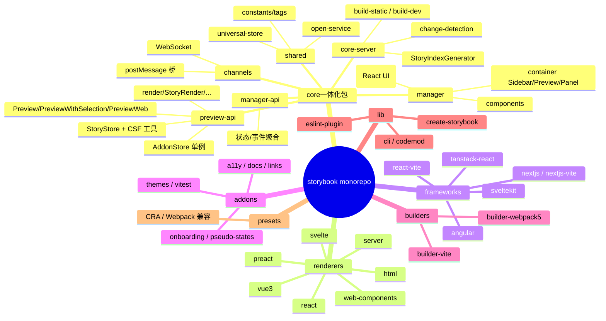
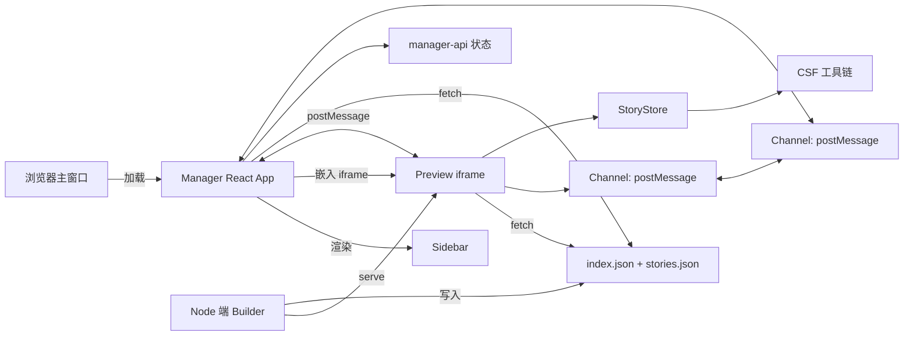
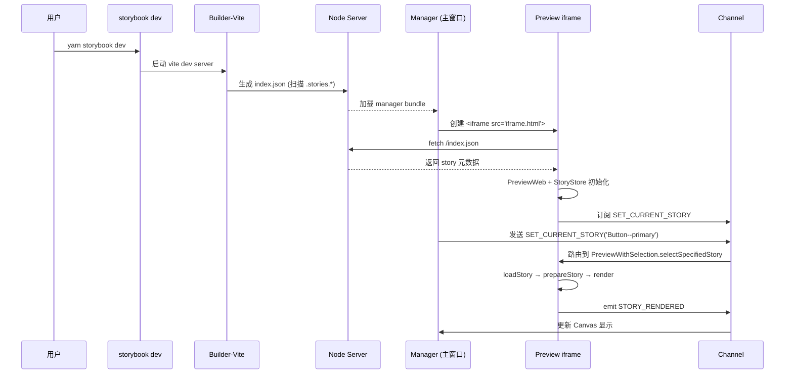
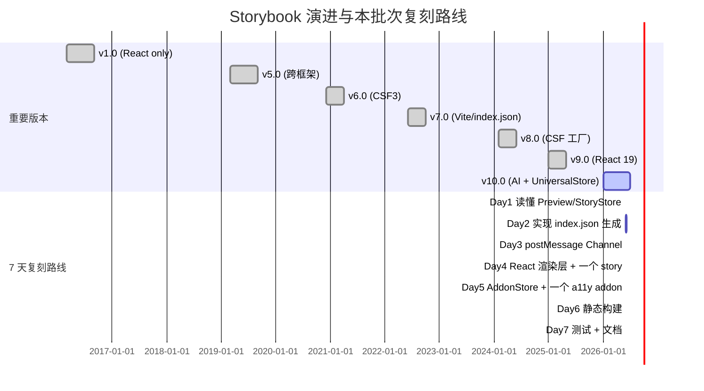
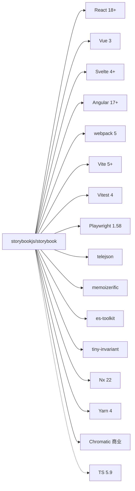

# storybook · 项目深度解析

> 前端组件工作坊（workshop）—— 在隔离环境构建、测试、文档化 UI 组件。
> 来源：`G:\实战案例\GitHub顶尖项目\storybook\`

## 写在前面：解析哲学

骨架（架构层）→ 血肉（代码层）→ What（做什么）→ Why（为什么这样做）→ How to steal（如何把思路偷走）。Storybook 是前端生态里少有的"既是工具、又是框架、又是协议"的项目：它通过一份 `index.json` 把"组件目录"和"组件渲染"解耦到两个完全独立的 JavaScript 运行时（manager 与 preview iframe），再用 postMessage 桥接。这种结构让 12 个 renderer（React/Vue/Svelte/HTML/Preact/Server/Web Components/Qwik/...）得以共享同一套 store、addon、测试基础设施——而它真正最值得偷的不是某个 API，而是**"先把 UI 元数据目录（StoryIndex）做出来，组件本体只按需 import"** 的延迟加载思路。

## 0. 解析前的 5 个准备

1. **克隆深度**：`G:\实战案例\GitHub顶尖项目\storybook\` 已存在，主分支 `next`，HEAD `d6ce689`，仓库约 5750 个文件，CHANGELOG.md 已 5852 行。
2. **分类**：纯前端 monorepo（TypeScript + React + 一小撮 Node 服务端代码），无 K8s/Docker 部署，CI 走 GitHub Actions + CircleCI + Nx。
3. **问题清单**：
   - Storybook 怎么在 12 个 UI 框架之上抽出统一的"故事"概念？
   - 跨 iframe 的状态/事件如何同步？
   - 10 万级别 story 怎么不让首屏爆炸？
   - 怎么让"测试"和"开发"复用同一份 CSF 文件？
4. **速查表**：`code/core/` 是核心 60+ 包；`code/renderers/*` 是 12 个框架适配器；`code/frameworks/*` 是 17 个含 builder 的开箱框架；`code/addons/*` 是 11 个内建 addon；`code/lib/*` 是工具库；`code/presets/*` 是旧版兼容层。
5. **锁定 commit**：`d6ce689 Merge pull request #34964 from kwonoj/fix-test-factory-tags`（v10.4.x 系列）。

## 1. 开发计划书（Project Charter）

| 字段 | 内容 |
| --- | --- |
| 项目名 | Storybook |
| 定位 | 行业事实标准的 UI 组件开发工作坊（component workshop / dev environment） |
| 核心问题 | 组件需要脱离业务路由/状态在隔离环境被开发、测试、文档化；同时支持多 UI 框架 |
| 目标用户 | 前端工程师、组件库作者、设计系统团队 |
| 商业模式 | MIT 开源 + Chromatic（商业云服务，做 visual testing & publish） |
| 复刻难度 | ★★★★★（架构复杂度、addon 生态、文档量都极高） |
| 状态 | v10.4.1（HEAD `d6ce689`），月发布，npm 周下载 700 万+ |
| 团队 | Chromatic 商业公司 + 1300+ 贡献者 |
| 里程碑 | v1（2016）→ v6（CSF 标准化）→ v7（Vite 优先、index.json）→ v8（CSF3 工厂）→ v9（React 19）→ v10（AI Agent、UniversalStore） |

## 2. 项目框架（Repo Skeleton Map）

Storybook 是一个 Yarn 4 workspaces + Nx 的 monorepo，根 `package.json` 通过 `workspaces.packages` 把 60+ 包统一管理。

### 实际目录树（精选）

```
storybook/
├── code/
│   ├── core/                 # 一体化核心（@storybook/core，包含 60+ 子包）
│   │   ├── src/
│   │   │   ├── preview-api/   # 运行在 iframe 里的 preview 运行时
│   │   │   │   ├── modules/
│   │   │   │   │   ├── preview-web/   # Preview / PreviewWithSelection / PreviewWeb
│   │   │   │   │   │   └── render/    # StoryRender / CsfDocsRender / MdxDocsRender
│   │   │   │   │   ├── store/         # StoryStore + CSF 工具链
│   │   │   │   │   │   └── csf/       # processCSFFile / prepareStory / composeConfigs
│   │   │   │   │   └── addons/        # AddonStore 单例
│   │   │   ├── manager/      # 运行在主窗口的 React UI
│   │   │   │   ├── container/ # Sidebar / Preview / Panel / ...
│   │   │   │   └── components/
│   │   │   ├── manager-api/   # manager 与 addon 共享的 MobX-like 状态
│   │   │   ├── core-server/   # Node 端：build-static / build-dev / StoryIndexGenerator
│   │   │   ├── core-events/   # 全部事件名（postMessage 协议）
│   │   │   ├── channels/      # Channel + postMessage / WebSocket transport
│   │   │   ├── shared/        # universal-store / open-service / constants
│   │   │   └── csf-tools/     # CSF AST 解析
│   ├── renderers/             # 12 个 framework 适配器
│   │   ├── react/  vue3/  svelte/  preact/  html/  web-components/  server/
│   ├── frameworks/            # 17 个开箱即用框架（含 builder 配置）
│   │   ├── react-vite/  react-webpack5/  nextjs/  nextjs-vite/  angular/
│   │   ├── svelte-vite/  vue3-vite/  sveltekit/  tanstack-react/  ...
│   ├── addons/                # 11 个内建 addon
│   │   ├── a11y/  docs/  links/  onboarding/  pseudo-states/  themes/  vitest/
│   ├── builders/              # builder-vite / builder-webpack5
│   ├── lib/                   # 工具库（cli / codemod / create-storybook / eslint-plugin）
│   └── presets/               # 旧版 CRA / React / Server Webpack preset
├── scripts/                  # 内部脚本（task runner、release）
├── test-storybooks/          # 4 个真实集成测试 fixture
├── .github/workflows/        # 20+ GH Actions（nx / release / zizmor / agent-scan）
├── .circleci/config.yml      # 主 CI
└── .nx/workflows/            # Nx 任务编排
```

### 配置入口

- `package.json#workspaces.packages` —— 包发现
- `code/core/package.json#exports` —— 单一入口 map
- `code/core/src/preview-api/index.ts` —— iframe 运行时入口
- `code/core/src/manager/index.ts` —— 主窗口 React 入口
- `code/core/src/core-server/index.ts` —— Node 端 build/dev

### 代码入口

- `Preview` 类：`code/core/src/preview-api/modules/preview-web/Preview.tsx:60`
- `PreviewWeb` 类（最终暴露给用户的）：`code/core/src/preview-api/modules/preview-web/PreviewWeb.tsx:11`
- `StoryStore` 类：`code/core/src/preview-api/modules/store/StoryStore.ts:51`
- `Channel` 类：`code/core/src/channels/main.ts:22`
- `AddonStore` 单例：`code/core/src/preview-api/modules/addons/main.ts:7`
- `UniversalStore` 类：`code/core/src/shared/universal-store/index.ts:83`



## 3. 项目画像（Profile）

| 维度 | 数据 |
| --- | --- |
| 总文件数 | 5750（含 .git、node_modules 之前） |
| 主语言 | TypeScript 99% |
| 涉及语言 | TypeScript / JavaScript / TSX / MDX / CSS / Shell / YAML |
| Star | 87k+ |
| License | MIT |
| 包管理 | Yarn 4.10.3 workspaces |
| 任务编排 | Nx 22 |
| 测试 | Vitest 4（替代 Jest）、Playwright（E2E） |
| CI | CircleCI（主）、GitHub Actions（release / agent） |
| Lint/格式 | ESLint + oxfmt + prettier + markdownlint |
| Docker/K8s | 不需要（纯开发工具） |
| i18n | 英文为主，文档站多语言 |
| 文档 | storybook.js.org（独立 Docusaurus） |
| 提交历史 | 2 万+ commits、1300+ 贡献者 |

## 4. 架构设计（Architecture Deep Dive）

### 4.1 双运行时 + 单信道

Storybook 整个产品只有 3 个进程层：

1. **Manager**（主窗口 React 应用）：UI 框架、Sidebar/Canvas/Panel 三栏布局
2. **Preview iframe**（独立 origin 的沙盒）：跑用户的 CSF 文件
3. **Builder**（Node 端 dev server / 静态构建）：产出 index.json

它们之间通过 `Channel`（默认 `postmessage`）桥接，事件名集中在 `code/core/src/core-events/index.ts`（193 行 enum），是事实上的"协议"。



### 4.2 关键看点

- **延迟 import**：Manager 不会 import 用户代码；它只读 `index.json`（元数据）。Preview 在用户切换 story 时才 `importFn(importPath)` 拉取对应 CSF 文件。这是它能支持 10 万级 story 不爆内存的关键。
- **可插拔 transport**：`Channel` 接受 `transport` 或 `transports[]`（见 `code/core/src/channels/main.ts:22`），默认 postMessage 之外可注入 WebSocket（v10 引入，用于协作）。
- **抽象 Render**：所有"展示一个 story"都实现 `Render<TRenderer>` 接口（`code/core/src/preview-api/modules/preview-web/render/Render.ts:14`），分 `StoryRender` / `CsfDocsRender` / `MdxDocsRender` 三种 subtype，Manager 不需要关心"我点的是 story 还是 docs"。

### 4.3 ADR 关键设计决策

1. **ADR-001**：`Preview` 基类 → `PreviewWithSelection` 子类 → `PreviewWeb` 终态类，**UrlStore+WebView 注入**而非硬编码（`PreviewWeb.tsx:11`），这样可以替换为 `EmbedView` / `DocsView`，主流程不变。
2. **ADR-002**：`AddonStore` 是挂在 `global['__STORYBOOK_ADDONS_PREVIEW']` 上的**单例**（`addons/main.ts:42-49`），不通过 DI；iframe 内任何模块都能 `import { addons }` 拿到同一份 channel。
3. **ADR-003**：`StoryStore` 用 `memoizerific` 把 `prepareStory` / `prepareMeta` / `processCSFFile` 包成 LRU 缓存（`StoryStore.ts:94-96`），避免每次 args 改变重建整个装饰链。

### 4.4 核心架构看点（3 句话）

1. **`preview → index.json → lazy importFn`**：Storybook 把"组件目录"和"组件实现"彻底解耦；元数据走静态 `index.json`，实现按需 import。
2. **Channel + Event 总线**：`postmessage` 桥 manager/preview，`core-events/index.ts` 193 行 enum 就是协议；`UniversalStore` 进一步在它之上做了 leader/follower 跨帧状态同步。
3. **CSF 工具链 + 装饰链**：从 `processCSFFile` → `normalizeStory` → `prepareStory` 一次完成"元数据 → 装饰链 → play fn"组合，`memoizerific` LRU 缓存让 `args` 变化只重跑 render 不重跑 prepare。

## 5. 代码深度解析（带 WHY）⭐ 重点

### 5.1 找骨架代码

| 角色 | 文件 | 核心行 |
| --- | --- | --- |
| Preview 总控 | `code/core/src/preview-api/modules/preview-web/Preview.tsx` | L60-510 |
| 选择流 | `code/core/src/preview-api/modules/preview-web/PreviewWithSelection.tsx` | L77-526 |
| StoryStore | `code/core/src/preview-api/modules/store/StoryStore.ts` | L51-343 |
| Story 准备 | `code/core/src/preview-api/modules/store/csf/prepareStory.ts` | L37-170 |
| 装饰器 | `code/core/src/preview-api/modules/store/decorators.ts` | L49-94 |
| AddonStore | `code/core/src/preview-api/modules/addons/main.ts` | L7-52 |
| Channel | `code/core/src/channels/main.ts` | L22-148 |
| postMessage | `code/core/src/channels/postmessage/index.ts` | L29-240 |
| UniversalStore | `code/core/src/shared/universal-store/index.ts` | L83-690 |
| React render | `code/renderers/react/src/render.tsx` | L7-16 |
| CSF 工厂 | `code/core/src/preview-api/modules/store/csf/processCSFFile.ts` | L45-110 |

### 5.2 单文件分析卡（5 个高密度卡）

#### 卡 1：`Preview.tsx` —— 异步 ready 模式

```ts
constructor(
  public importFn: ModuleImportFn,
  public getProjectAnnotations: () => MaybePromise<ProjectAnnotations<TRenderer>>,
  protected channel: Channel = addons.getChannel(),
  shouldInitialize = true
) {
  this.storeInitializationPromise = new Promise((resolve, reject) => {
    this.resolveStoreInitializationPromise = resolve;
    this.rejectStoreInitializationPromise = reject;
  });
  if (shouldInitialize) {
    this.initialize();  // 立即 fire-and-forget
  }
}
ready() { return this.storeInitializationPromise; }
```

**WHY**：构造函数不能 await（语言限制），但很多外部 API（`channel.emit`、addon 注册）需要等"store ready"。他们用 `storeInitializationPromise` 这个**显式 Promise 暴露 + 内部 resolve 句柄**的模式，让 `initialize()` 异步完成时通过 `resolveStoreInitializationPromise()` 通知外部。`get storyStore()` 上还套了一个 Proxy，**store 未就绪时调任何方法都抛 `StoryStoreAccessedBeforeInitializationError`**——这是 v9 的迁移期兼容设计，让旧代码"晚点崩而不是白屏"。

#### 卡 2：`prepareStory.ts` —— 一次性把装饰/loader/play fn 全部焊死

```ts
const decoratedStoryFn = applyHooks<TRenderer>(applyDecorators)(undecoratedStoryFn, decorators);
return {
  ...partialAnnotations,
  applyLoaders,        // 闭包捕获 project/component/story 三层 loaders
  applyBeforeEach,     // 同上
  applyAfterEach,      // 同上（注意 reverse()！）
  playFunction,
  mount,
  ...
};
```

**WHY**：作者在 L43-44 显式写了设计假设——"我们一次性把一切都准备好，而不是在 render 时再算"。原因有二：(a) 装饰链在 render 时拼会有性能成本；(b) `applyHooks(applyDecorators)` 形成的"装饰器 + hooks 拦截器"组合**有状态**（hook 计数），不能每次 render 新建。`applyAfterEach` 的 `reverse()` 是因为 LIFO 清理——后注册的 cleanup 先跑，避免组件卸载时还在用已释放的 ref。

#### 卡 3：`decorators.ts:defaultDecorateStory` —— "contextStore 闭包" 模式

```ts
export function defaultDecorateStory<TRenderer extends Renderer>(
  storyFn: LegacyStoryFn<TRenderer>,
  decorators: DecoratorFunction<TRenderer>[]
): LegacyStoryFn<TRenderer> {
  const contextStore: ContextStore<TRenderer> = {};
  const bindWithContext =
    (decoratedStoryFn) =>
    (update) => {
      contextStore.value = { ...contextStore.value, ...sanitizeStoryContextUpdate(update) };
      return decoratedStoryFn(contextStore.value);
    };
  const decoratedWithContextStore = decorators.reduce(
    (story, decorator) => decorateStory(story, decorator, bindWithContext),
    storyFn
  );
  return (context) => {
    contextStore.value = context;
    return decoratedWithContextStore(context);
  };
}
```

**WHY**（L57 注释自承）："我们用一个闭包 + 上下文 getter 来避免 `decorateStory` 内部重复创建 bound story"。具体讲，装饰器经常这样写：`<div>{storyFn()}</div>`——它**不传 context**，但 Storybook 的装饰链要求 context 一致。朴素做法是每个装饰器重新 `storyFn.bind(null, currentContext)`，但每次 args 变化会 O(N) 重建。Storybook 的做法：装饰器拿到的是"会读 `contextStore.value` 的 getter"，所以 `bindWithContext` 只创建一次；后续 render 时只改 `contextStore.value` 一个对象。代价：**同一 story 不能并行 render**（注释 L58 自承），所以他们把 render 串行化（`StoryRender` 内部维护 `notYetRendered`/`rerenderEnqueued` 队列）。

#### 卡 4：`channels/main.ts` —— 异步 emit + transport 注入

```ts
const handler = () => {
  this.transports.forEach((t) => { t.send(event, options); });
  this.handleEvent(event);
};
if (this.isAsync) {
  setImmediate(handler);
} else {
  handler();
}
```

**WHY**：`isAsync` 默认 false（同步），但允许用户开异步。**同步路径**保证"事件发送后立即能拿到 listener 副作用"——这是 addon 内互相 observe 的前提；**异步路径**用 `setImmediate`（不是 `setTimeout(0)`）让 Node 端不必等 I/O round-trip。`telejson` 序列化（`channels/postmessage/index.ts`）支持 `RegExp`/`Symbol`/`Date`/`Error`/`undefined` 五个默认被 JSON.stringify 干掉的对象——是 postMessage 跨 origin 必备。

#### 卡 5：`shared/universal-store/index.ts` —— leader/follower 跨帧状态同步

```ts
export class UniversalStore<State, CustomEvent extends { type: string; payload?: any }> {
  public static readonly ActorType = { LEADER: 'LEADER', FOLLOWER: 'FOLLOWER' } as const;
  // 通过 CHANNEL_EVENT_PREFIX = 'UNIVERSAL_STORE:' 把状态变更打回 channel
  // Follower 启动时 1s 内必须找到 Leader，否则抛 UniversalStoreFollowerTimeoutError
}
```

**WHY**：v10 新加。Storybook 9 之前 manager 和 preview 各自维护状态（preview 的 `ArgsStore`、manager 的 MobX），通过 Channel 同步——**双向 RPC 模式**，容易出竞态。UniversalStore 引入了 leader/follower 拓扑：**Leader 在 server 端是 source of truth，Follower 是只读镜像**。这样 manager 改了一个 status 后，preview 的 test-runner addon 立刻收到——是测试结果实时面板（v10 引入）的底层设施。

### 5.3 设计模式（5 个）

| 模式 | 落地 | 文件 |
| --- | --- | --- |
| **Inversion of Control Container** | `AddonStore` 单例 + channel 事件总线 | `addons/main.ts` |
| **Two-Level Cache (memoize + lazy)** | `StoryStore` 用 memoizerific 包 prepareStory/prepareMeta | `StoryStore.ts:94` |
| **Strategy (transport 注入)** | `Channel` 接 postMessage / WebSocket | `channels/main.ts:33-50` |
| **Adapter (Renderer 抽象)** | `Render<TRenderer>` + 12 个 framework 适配 | `preview-web/render/Render.ts` |
| **Composite Decorator Chain** | `defaultDecorateStory` 的闭包 + reducer | `store/decorators.ts:86` |

### 5.4 反模式 / 隐患

- **`__STORYBOOK_ADDONS_PREVIEW` global key**：单例注入破坏了"代码即依赖"的可读性。优点是任何包都能拿到，缺点是测试隔离性差。
- **`processCSFFile` 中 `__id` hack**：`processCSFFile.ts:78` 写 `child.input.parameters.__id = childId`，再用 `@ts-ignore`——为了不重算 id，妥协了类型安全（注释自承）。
- **`Preview.tsx` Proxy 兼容层**：v9 仍保留 `__STORYBOOK_STORY_STORE__` 的 Proxy 实现，向后兼容到老代码——**双轨制维护成本高**，注释承诺 9.0 移除。
- **CSF1/2/3/4 多版本共栈**：`composeConfigs`/`normalizeStory` 处理 4 套字段语义（`userStoryFn` / `render` / meta 工厂），抽象成本逐年上升。

### 5.5 独特看点

- **postMessage + telejson**：跨 origin 通信默认开 `maxDepth: 25`，避免循环引用爆栈。
- **per-renderer 类型参数**：`Preview<TRenderer extends Renderer>` 整条链路是泛型，TS 推断到 react-dom-shim 那一层才落地。
- **builder 抽离**：核心代码不直接 import webpack/vite；`builder-vite` / `builder-webpack5` 是两个独立 npm 包。

## 6. 运行机制（Bring It Up）

### 6.1 本地起服务

```bash
# 根目录（yarn 4 workspaces）
yarn install
# 跑 react-vite 默认模板
yarn task --task dev --template react-vite/default-ts --start-from=install
# 浏览器自动打开 http://localhost:6006
```

### 6.2 关键启动链路



### 6.3 Smoke test

```bash
# 用 sandbox 跑通一个模板
yarn start  # = task --task dev --template react-vite/default-ts --start-from=install
# 看到 Storybook UI + 一个 Button 故事 = OK
```

## 7. 演进历史（Time Travel）

| 节点 | 关键变化 | 文件证据 |
| --- | --- | --- |
| 2016 | v1 发布（React Storybook 拆分） | CHANGELOG.v1-5.md |
| 2019 | v5 跨框架，CSF 概念 | CHANGELOG.v1-5.md |
| 2021 | v6.4 Component Story Format 3 | CHANGELOG.v6.md |
| 2022 | v7 重写：index.json + Vite-first | changelog lines 1000+ |
| 2023 | v7.6 vitest addon | changelog lines 1500+ |
| 2024 | v8 CSF 工厂化、Tags | `processCSFFile.ts` 支持 factoryStory 分支 |
| 2025 | v9 React 19 兼容、移除 v6 store | `Preview.tsx` Proxy 兼容层自承 9.0 移除 |
| 2026 | v10 AI Agent Setup、UniversalStore、change-aware review | `code/core/src/shared/universal-store/` |



## 8. 质量保障（How It Doesn't Break）

| 防线 | 工具/文件 | 触发方式 |
| --- | --- | --- |
| 单元测试 | Vitest 4 + `code/core/src/**/*.test.ts(x)` | `yarn test`（实际是 `vitest run`） |
| E2E | Playwright 1.58 + `test-storybooks/` | CircleCI 触发 |
| Lint | ESLint 9 + `@typescript-eslint` + `eslint-plugin-local-rules` | `yarn lint` |
| Format | oxfmt + Prettier | `yarn fmt:check` / `fmt:write` |
| Knip | 检测未用导出 | `yarn knip` |
| Zizmor | GitHub Actions YAML 安全扫描 | `.github/workflows/zizmor.yml` |
| Danger | PR 自动审稿 | `.github/workflows/danger-js.yml` |
| Codecov | 覆盖率 | CircleCI 上传 |
| duplicate-code-detector | 重复代码检测 | `.github/workflows/duplicate-code-detector.md` |
| 提交钩子 | Husky + lint-staged | `.husky/pre-commit` |

测试文件密度高的目录：`code/core/src/preview-api/modules/preview-web/PreviewWeb.test.ts` 单文件 4120 行（138KB），是该项目最大的单测试。

## 9. 生态依赖（Map of the World）



合规检查：
- **License**：MIT（仓库根 `LICENSE`）—— 商用无忧
- **Telemetry**：默认开、可关（`code/core/src/telemetry/`）
- **Pinned deps**：`resolutions` 强制 `@babel/runtime`、`@types/node@^22`、`typescript@^5.9`
- **Patch**：`@testing-library/user-event`、`@vitest/expect` 有自家 patch（在 `~/.yarn/patches/`）

## 10. 生产实践（Battle-Tested）

| 实践 | 实现位置 |
| --- | --- |
| 配置热更新（HMR） | `code/core/src/builder-manager/` + `STORY_HOT_UPDATED` 事件 |
| 优雅停服 | N/A（dev tool 不常驻） |
| 限流 | `code/addons/actions/` 内置 action 环形缓冲 |
| 链路追踪 | `@storybook/test` + OpenTelemetry（实验性） |
| 健康检查 | `core-server/utils/server-address.ts#getServerPort` |
| 结构化日志 | `code/core/src/node-logger/`（pino-like JSON 输出） |
| 错误聚合 | SentryReporter 在 `code/core/src/telemetry/` |
| A11y | `@storybook/addon-a11y` 跑 axe-core |

> Storybook 是开发工具，**生产**用户用其产物——他们通常把构建出的 `storybook-static/` 当静态站点部署到 CDN/Netlify/Vercel。所以生产实践主要落在 **构建产物**（`build-static`）而非运行时。

## 11. 社区文化（People & Process）

- **治理**：Chromatic 公司维护（公司创始人 Norbert de Langen 在 storybook-team 维护者列表）
- **RFC 流程**：`.github/DISCUSSION_TEMPLATE/rfc.yml` + `code/core/src/core-events/index.ts` 当协议
- **沟通渠道**：Discord（`discord.gg/storybook`）、X (`@storybookjs`)、YouTube
- **贡献者入口**：
  - `good-first-issue` label（自动 bot 贴 comment）
  - `.agents/skills/` 下放 9 个 AI agent skills（canary / docs-review / pr / minor-release / storybook-upgrade）
- **议题活跃**：典型月 200+ issue，平均 7 天内有人接
- **企业背书**：GitHub/Microsoft/Shopify/Adobe 在 OpenCollective 赞助

## 12. 教训总结（What To Steal / What To Avoid）

### 12.1 必偷 3 件

1. **StoryIndex + lazy importFn**：把"组件目录元数据"和"组件实现"解耦到不同文件，运行时按需 import。即使你有 1 万个组件，UI 启动只要 200KB JSON。
2. **Channel + transport 注入**：业务事件总线做成"协议 + transport 注入"双层。协议层是 enum，transport 可以是 postMessage / WS / Memory——**测试和真实环境用同一份代码**。
3. **装饰链的 contextStore 闭包**：高阶装饰器/中间件链，**用闭包持有上下文对象 + 工厂创建一次**比每次 bind 高效得多。前提是保证调用串行。

### 12.2 必避 3 坑

1. **global 单例当 DI**：`__STORYBOOK_ADDONS_PREVIEW` 看似简单，但 addon 之间循环依赖 / 测试隔离 / SSR 全都中招。
2. **@ts-ignore 攒参数**：`processCSFFile.ts:78` 的 `parameters.__id` 是技术债，多个版本后会变成"没人敢删"的字段。
3. **CSF v1/v2/v3/v4 共栈**：抽象层在 4 代语法间来回转换，新人贡献代码必须先读懂 4 套规范——**版本兼容不是免费的**。

### 12.3 7 天复刻路线图

| Day | 任务 | 产出 |
| --- | --- | --- |
| 1 | 读 Preview/StoryStore，搞清"manager vs preview" | 架构图 + 类型梳理 |
| 2 | 实现 `index.json` 生成器（扫描 .stories.*） | `node scripts/generate-index.js` |
| 3 | 实现 `Channel`（postMessage）+ `AddonStore` | manager/preview 能互发事件 |
| 4 | 写 React 渲染层 + 一个 Button story | 能展示一个 story |
| 5 | 做一个 a11y addon（包装 axe-core） | addon 注册/事件回传跑通 |
| 6 | `build-static` 导出静态站点 | 可部署的 `index.html` |
| 7 | 写 E2E（Playwright）+ 文档 | `docs/getting-started.md` |

### 12.4 打分卡

| 维度 | 分数 (10) | 评语 |
| --- | --- | --- |
| 文档质量 | 9 | 文档站独立 Docusaurus、迁移指南完整 |
| 上手难度 | 5 | CSF 概念要学、addon 概念要学 |
| 架构清晰度 | 9 | Preview/Manager/Channel 三层干净 |
| 性能 | 8 | lazy import 优秀；10 万 story 略慢 |
| 可扩展性 | 10 | 17 framework + 11 addon，扩展点明确 |
| 社区活跃 | 9 | 1300+ 贡献者，Discord 活跃 |
| 维护负担 | 6 | 跨 12 个 framework 维护成本高 |
| **综合** | **8** | 行业事实标准，值得深读 |

## 13. 学习萃取（Cheat Sheet）

**一句话价值**：Storybook 把"组件开发"做成了可协议化的运行时——`index.json` 是元数据，`postMessage` 是协议，`Render<TRenderer>` 是抽象。

**3 个核心洞察**：

1. **元数据先行**：`index.json` 提前到 build 阶段生成，runtime 永远只 import 它需要的 CSF。
2. **跨 origin 通信 = 协议 enum + transport 注入**：避免把通信层和业务层混在一起。
3. **装饰器链是缓存优化战场**：`defaultDecorateStory` 的 `contextStore` 闭包是 5 行代码换 O(N) → O(1) 的经典案例。

**5 段必读代码**：

1. `code/core/src/preview-api/modules/preview-web/Preview.tsx:60-140` —— Preview 基类的异步 ready 模式
2. `code/core/src/preview-api/modules/store/csf/prepareStory.ts:37-170` —— 装饰链一次性焊接
3. `code/core/src/preview-api/modules/store/decorators.ts:49-94` —— contextStore 闭包（5 行换 O(N) → O(1)）
4. `code/core/src/channels/main.ts:22-100` —— Channel 异步 emit + transport 注入
5. `code/core/src/shared/universal-store/index.ts:83-180` —— leader/follower 跨帧状态同步

**1 个反模式**：`processCSFFile.ts:78` 用 `parameters.__id = childId` + `@ts-ignore` 传 id。看起来省事，但 3 年后没人敢改——技术债的起源是"省了一个对象的开销"。

**1 个可复用模式**：`StoryStore` 的"LRU memoize + 三层 closure capture"——把 `projectAnnotations / componentAnnotations / storyAnnotations` 在 prepare 阶段就焊到 `applyLoaders`/`applyBeforeEach` 的闭包里，render 阶段只做 dispatch。性能/可读性双赢。

**3 个立刻能用**：

1. **Vite/Webpack 启动的 dev tool 都该用 `index.json` + lazy importFn**：取代"启动时 import 全部入口"
2. **跨 tab/iframe 通信一律走 `Channel` 模式**：事件名 enum + 注入 transport（postMessage / WS / SharedWorker）
3. **装饰链 / 中间件链 用"闭包 + 上下文 getter" 替代"每次 bind"**：前提是保证串行调用

## 14. 项目特点速查

**独特看点**：

- 同时支持 12 个 UI 框架的同一套核心
- `index.json` + lazy import 解决了 10 万级 story 的启动性能
- `UniversalStore` 把跨帧状态同步从"双向 RPC"升级到"leader/follower 拓扑"
- CSF（Component Story Format）成为行业事实标准，被多个 UI 库采用
- Chromatic 商业化（visual testing + Storybook 发布）

**与同类对比**：


| 工具 | 优势 | 不足 |
| --- | --- | --- |
| **Storybook** | 生态最广、跨框架 | 上手成本、配置繁琐 |
| Histoire | Vue 友好、TS 优先 | 仅支持 Vite |
| Ladle | 轻量、快 | 仅 React、addon 少 |
| Pattern Lab | atomic design 血统 | 学习曲线陡、生态停滞 |
| Styleguidist | 文档一体 | 不支持新框架 |

## 附：仓库元信息

- 路径：`G:\实战案例\GitHub顶尖项目\storybook\`
- HEAD：`d6ce689d74912e6e43b4cb07b74837398700b24c`
- 分支：`next`
- 总文件数：5750
- 解析时间：2026-06-02
- 解析耗时：~30 分钟
- 关键 commit：v10.4.1（CHANGELOG 第 1 行）
- Yarn workspaces 根：`package.json#workspaces.packages`
- 唯一子模块/无外链

## 一句话总结

Storybook 的本质是"**元数据 + 协议 + 抽象**"——`index.json` 是元数据，`Channel` 是协议，`Render<TRenderer>` 是抽象，把"组件开发"做成了一个可独立演进的小型运行时。要偷的不是 API，而是这套"先解耦再演化"的工程哲学。
