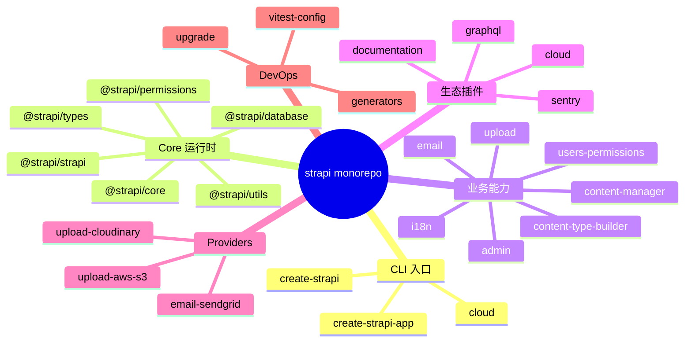
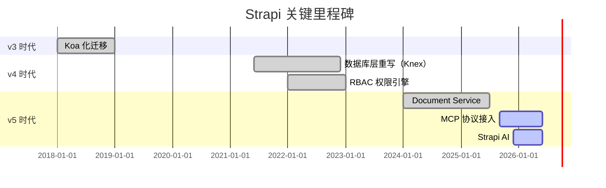
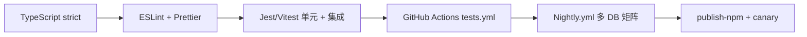
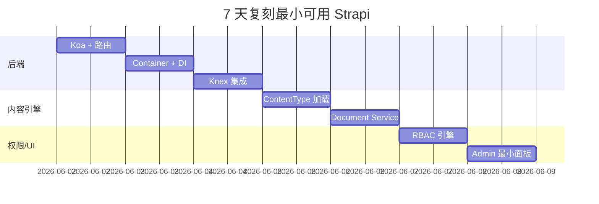

# strapi · 项目深度解析

> 开源 Headless CMS 之王：100% JavaScript/TypeScript、自托管、插件化、自动生成 REST & GraphQL。
> 来源：G:\实战案例\GitHub顶尖项目\strapi\

## 写在前面：解析哲学

先骨架后血肉，先 What 后 Why，最后 How to steal。Strapi 不是普通的 Web 框架，它把"内容建模 → API 生成 → 权限 → Admin UI → 插件生态"做成了一条完整的工业化生产线。这一篇不重复官方 README，而是钻进它的 60+ monorepo 包里，看清楚它如何在 Node 生态上"造一个 Rails"。

## 0. 解析前的 5 个准备

1. **克隆**：仓库 6003 个文件，单仓 monorepo（`packages/core` / `packages/plugins` / `packages/providers` / `packages/cli`），`yarn workspaces` 管理。
2. **分类**：A 类（核心运行时 `@strapi/core` / `@strapi/strapi` / `@strapi/database`）、B 类（业务能力 `@strapi/admin` / `content-manager` / `content-type-builder` / `upload` / `i18n` / `graphql`）、C 类（基础设施 providers / generators / utils）。
3. **问题清单**：(1) 内容类型如何被翻译成数据库表？(2) 权限引擎如何拦截一次 API 调用？(3) 控制器/服务/路由三层如何被自动生成？
4. **速查表**：CLI 命令 `develop` / `start` / `build` / `console` / `generate` / `ts:generate-types` / `transfer`（导入导出）；运行时入口 `createStrapi()`；容器 `Container`。
5. **锁定 commit**：`a419c32 fix(content-manager): guard repeatable field .map() crash…`（HEAD 在 2026-05-31）。

## 1. 开发计划书（Project Charter）

| 维度 | 内容 |
| --- | --- |
| 项目名 | strapi |
| 定位 | 自托管 / 云托管的开源 Headless CMS |
| 核心问题 | 让前端/移动端在 5 分钟拿到一份可用的内容 API，而不是后端 2 周 CRUD |
| 目标用户 | 中小团队、独立开发者、需要内容运营 + 多端消费的企业 |
| 商业模式 | 开源 CE + 商业 EE（SSO/审计日志/AI 配额）+ Strapi Cloud 托管 |
| 复刻难度 | 9/10（涉及容器、ORM、权限、Admin UI、插件、热重载、Cluster 模式） |
| 状态 | v5.46.1，活跃，60k+ stars |
| 团队 | Strapi Solutions SAS（巴黎） |
| 里程碑 | v3 Koa 化 → v4 数据库重写 → v5 Draft & Publish 重构、Document Service 引入 |

## 2. 项目框架（Repo Skeleton Map）

`packages/` 是 monorepo 的心脏。每个子包都是可独立发布的 npm 包（`@strapi/core`、`@strapi/admin`、`@strapi/database`、`@strapi/utils`、`@strapi/permissions` 等），组合起来才是运行时的"Strapi"。



**实际目录关键节点**（节选自 `packages/core/strapi/src/`）：

- `index.ts`：仅 `export * from '@strapi/core'` + 类型转发，对外门面。
- `cli/`：commander.js 风格的命令集合（`develop.ts` / `build.ts` / `start.ts` / `transfer/`）。
- `node/`：与 Node 运行时绑定的能力（vite/webpack 双打包器、cluster 模式、TypeScript 编译协调）。
- `node/develop.ts`：开发模式入口（**重点读**）。

**配置入口**：`config/{database,server,admin,middlewares,api,plugins}.js`（或 `.ts`），通过 `config-loader.ts` 合并。
**代码入口**：`@strapi/core` 的 `Strapi.ts` 中 `createStrapi()` → `strapi.load()` → `strapi.start()`。

## 3. 项目画像（Profile）

| 指标 | 值 |
| --- | --- |
| 总文件数 | 6003（含所有 packages + examples + tests） |
| 主语言 | TypeScript（98% 以上） |
| 涉及语言 | TS / JS / MDX / SQL / SCSS / Shell |
| Star | ~68k（README badge） |
| License | 源码 SEE LICENSE IN LICENSE（核心 MIT，EE 商业） |
| 框架 | Koa.js（HTTP 层）、Knex.js（查询构建器） |
| 数据库 | SQLite / PostgreSQL / MySQL / MariaDB（knex dialect） |
| Docker | 无官方镜像，提供 `@strapi-community/dockerize` 工具 |
| K8s | 无官方 chart |
| CI | GitHub Actions（`tests.yml` / `nightly.yml` / `publish-*.yml`） |
| 测试 | Jest + Vitest 双栈 |

## 4. 架构设计（Architecture Deep Dive）

```mermaid
flowchart TD
    A[CLI develop] --> B{cluster.isPrimary?}
    B -->|是| C[依赖检查 + Admin 构建]
    C --> D[cluster.fork worker]
    B -->|否 worker| E[createStrapi().load]
    E --> F[loadConfiguration]
    F --> G[registerInternalServices]
    G --> H[loaders: apis / plugins / components / middlewares]
    H --> I[DocumentService + Database.init]
    I --> J[db.schema.sync 3-way diff]
    J --> K[Koa listen]
    K --> L[请求 → Middlewares → Policies → Controller → Service → Repository]
```

**核心看点**：
1. **进程模型**：`develop` 命令用 Node `cluster` 模块——主进程编译 TS/构建 Admin，子进程跑 Strapi。代码改动触发 IPC `reload` → `kill` → `fork`，**隔离了 hot-reload 抖动**。
2. **三层架构**：`Routes（@koa/router）→ Middlewares（compose）→ Controller（@strapi/core 工厂）→ Service（core-api/service）→ Repository（document-service/repository）`。这是文档反复强调的"Strapi 后端定制链"，也是它和 Express 自由风格最大的区别。
3. **Document Service**（v5 新）：替代 v4 的 EntityService，把 Draft & Publish、i18n、Components、Relations 收拢到一个 `strapi.documents(uid)` 工厂内，用 middleware-manager 装饰每个方法。

**ADR 关键设计决策**：
- **D1：放弃 Express 转 Koa**。`packages/core/core/src/services/server/koa.ts` 自定义 `ctx.notFound()` / `ctx.send()` / `ctx.created()` / `ctx.deleted()` 语义；`delegates` 库把这些方法挂到 `ctx` 上。WHY：洋葱模型天然适配 `authenticate → authorize → policies → controller` 的链式拦截，Express 的 next() 写法在 RBAC 场景下回调地狱。
- **D2：自研 Database 层而非直连 Knex**。`@strapi/database` 在 Knex 之上包了 Schema Builder / Schema Diff / Schema Storage 三件套，提供 `sync()` 的"声明式迁移"。WHY：业务用户是产品经理，不是 DBA——他们改 JSON schema 就期望表自动变。D1 决定的 Schema 同步被包成 `syncSchema()`，3-way diff 算出来 `UNCHANGED` / `CHANGED` / `UNKNOWN`，再交给 `builder.updateSchema()` 落库。
- **D3：Plugin = 协议 + 目录约定**。`loaders/plugins/index.ts` 把每个插件视为 `{ register, bootstrap, destroy, config, routes, controllers, services, contentTypes }` 的五元组，外部 `extensions/<plugin>/` 目录允许"用户态扩展"——这是它能做到生态繁荣的根因。

## 5. 代码深度解析（带 WHY）⭐

### 5.1 找骨架代码

读入口只需 3 个文件就能把"启动到第一个请求"摸清：`packages/core/strapi/src/node/develop.ts`（dev 入口）、`packages/core/core/src/Strapi.ts`（运行时主类）、`packages/core/core/src/services/server/koa.ts`（HTTP 实例化）。

### 5.2 单文件分析卡

#### 卡片 A：`packages/core/strapi/src/node/develop.ts`

亮点在 14–30 行的 `lazy<T>()` 闭包：
```ts
const tsUtils = lazy<typeof import('@strapi/typescript-utils')>('@strapi/typescript-utils');
```
**WHY**：strapi 在 cluster primary 里 fork 出来 worker 之前不需要 `@strapi/typescript-utils`（重）。用 `require` 而非 `import` 是因为这些模块在 primary 阶段若被静态打包，初始化时就会触发 TS 编译。注释 `// Lazy: worker-only deps; primary cluster process should not pay for them` 显式表达了"为进程分裂而优化启动时间"的取舍。

接着 87–116 行的 `cluster.isPrimary` 分支展示了完整的 dev 启动序列：依赖检查 → 清理 dist → TS 编译（`ignoreDiagnostics: true`，因为只是预热）→ 构建 admin（`webpack` 或 `vite` 二选一）→ `cluster.fork()`。**WHY ignoreDiagnostics**：开发期间 schema 经常坏，阻塞到 TS 编译反而糟糕；Strapi 选择"先让服务跑起来，错误日志 + 文件监听兜底"。

157–187 行的 `cluster.on('message')` 是 IPC 协议：`reload` 消息让 primary 重编 TS 然后发 `kill`；`killed` 消息让 primary 重新 `fork()`；`stop` 消息 `process.exit(1)`。**WHY 不在 worker 里直接重启**：worker 持有数据库连接池和 Koa 监听端口，干净退出比 hot-swap 简单 10 倍——和 nodemon、ts-node-dev 的"杀进程重启"是同一思路，但走 cluster IPC 是因为还要兼顾 admin build 的 child_process。

#### 卡片 B：`packages/core/core/src/Strapi.ts`

类 `Strapi extends Container`，60 多个 getter 全部代理到 `this.get(name)`。这是 51–69 行 `Container` 类的"魔法"：所有可注入服务都是注册式的。

268–312 行 `registerInternalServices()` 是**整个框架的依赖装配表**。重点看 294–308 行 `db` 的注入：
```ts
.add('db', () => {
  const useTSM = this.config.get('database.settings.useTypescriptMigrations') === true;
  const tsDir = useTSM ? tsUtils().resolveOutDirSync(this.dirs.app.root) : null;
  ...
```
**WHY TypeScript Migrations**：v5 起支持用 `.ts` 写迁移，但需要 `tsc` 编译产物有 `outDir`。strapi 不会在启动时编译用户代码（那是 develop 命令做的），所以这里走 `resolveOutDirSync` 同步读 `tsconfig.json` 拿路径，**失败就退回到 JS migrations 目录**——优雅降级。

412–436 行的 `load() → register() → bootstrap()` 顺序是**生命周期分层**：
- `register`：插件注册、用户 `register()` 钩子、自定义字段类型转换。
- `bootstrap`：DB 初始化、schema 同步、reaper 删除孤儿 morph、EE license 校验、content-type 钩子 `afterSync`。
**WHY 分开**：插件可能需要注册 content type、字段；schema 同步则要求所有 content type 全部到齐——顺序不能反。`@strapi/typescript-utils` 的 `tsUtils` 用 `require` 而非 import，与 develop.ts 的 `lazy()` 是同一招。

#### 卡片 C：`packages/core/core/src/services/server/koa.ts`

72 行做了一件漂亮事：用 `statuses` 包枚举 400–599，**批量为 Koa response 注入语义方法**：
```ts
statuses.codes.filter((code) => code >= 400 && code < 600).forEach((code) => {
  const name = statuses(code);
  const camelCasedName = camelCase(name);
  app.response[camelCasedName] = function responseCode(message = name, details = {}) {
    const httpError = createError(code, message, { details });
    const { status, body } = formatHttpError(httpError);
    this.status = status;
    this.body = body;
  };
  delegator.method(camelCasedName);
});
```
**WHY**：`ctx.notFound()` / `ctx.unauthorized()` / `ctx.forbidden()` 是控制器作者写起来最自然的姿势——`http-errors` 库的错误体里 `details` 是给前端机读的，框架内统一格式。`delegates` 库把这些方法从 `app.response` 投到 `ctx.response`，**省得每个 controller 写 `ctx.response.notFound()`**。这 30 行决定了 Strapi 上层代码的"易写性"，是值得偷的最强模式。

#### 卡片 D：`packages/core/core/src/services/document-service/middlewares/middleware-manager.ts`

65 行实现了一个比 Koa 还小的中间件机：`use()` 注册、`run()` 串联、`wrapObject()` 把整个对象的每个方法包成"ctx 注入 → 中间件链 → 调用原方法"。**WHY**：Document Service 不是一个 HTTP 路由，是 N 个方法 × 多个 content type 的二维空间。如果让每个 content type 写一个 controller 复写所有方法，关系/draft/i18n 的横切逻辑会爆炸。`wrapObject` 反射遍历方法 → 用闭包包一层 → 中间件通过 `ctx.action` 知道当前是 `find` 还是 `create`——**横切逻辑只写一次**。

#### 卡片 E：`packages/core/database/src/schema/index.ts`

`SchemaProvider` 的 `syncSchema()` 是 3-way diff 的入口：
```ts
const { status, diff } = await this.schemaDiff.diff({
  previousSchema: storedSchema?.schema,  // 上次写入的 metadata
  databaseSchema,                        // 真实 DB inspector 出来的 schema
  userSchema: this.schema,               // 用户最新改的 metadata
});
if (status === 'CHANGED') {
  await this.builder.updateSchema(diff);
}
```
**WHY 3-way**：直接在 DB schema 和 user schema 之间 diff 会误删"用户没声明但 DB 已有"的表（例如手动加的索引）。`storedSchema` 是 strapi 自己"上次 sync 时的认知"，3-way 后 strapi 才会"自信地"删自己创建的表/列。`schemaStorage` 把"认知"序列化到 `strapi_database_schema` 表（位于连接 DB 内），保证下次启动能恢复。

### 5.3 设计模式

- **Container/Registry**：所有 service 走 `this.add('name', factory)`，可重写（test 替换 mock），可懒求值（get 第一次才执行 factory）。
- **Factory Method**：`factories.ts` 中 `createCoreController` / `createCoreService` / `createCoreRouter` 三个工厂让用户传 UID + cfg 就拿到自带 default 方法的对象；`Object.setPrototypeOf` 兜底保留基础方法。
- **Decorator/Middleware**：`wrapObject` 把方法装进中间件链；`compose-endpoint.ts` 用 `koa-compose` 把多个 middleware 串成 `routeHandler`。
- **Strategy + Config Provider**：`createConfigProvider(this.internal_config, this)` 读 `config/{env,server,db}` 多层合并，环境变量压倒文件。
- **Template Method**：`loaders/plugins/index.ts` 的 `defaultPlugin = { register(){}, bootstrap(){}, destroy(){} }` 是钩子骨架，用户覆写任一即可。

### 5.4 反模式

- **Container 是 Service Locator**：第 17 行 `get(name, args)` 把 `args` 接收了却没真用——`// TODO: handle singleton vs instantiation everytime` 自承技术债。
- **懒 require + 字符串路径**：`lazy('@strapi/typescript-utils')` 在 TS 类型世界是裸的 `any`，参数名是 magic string。
- **`isCustomController` 用 Symbol 探测**：`factories.ts` 末段 `return symbols.CustomController in controller`——Symbol 探测比 instanceof 慢，registry 用这种标记意味着类型系统没法帮上忙。
- **`global-agent` bootstrap**：`Strapi.ts` 第 1 行就 `bootstrap as bootstrapGlobalAgent`，**全进程污染代理环境变量**，对测试环境是坑。

### 5.5 独特看点

- **v5 Draft & Publish 收进了 Document Service**：旧 v4 要在 entityService 传 `publicationState: 'preview'`，新版本 `strapi.documents('api::article.article').findMany({ status: 'draft' })` 显式声明。
- **EE 业务切断**：`ee/license.ts` + `ee/checkLicense` 在 bootstrap 阶段决定是否启用 SSO/审计日志/AI 配额；OSS 用户拉不到这部分代码也跑得起来。
- **MCP 内建**：`packages/core/core/src/services/mcp/` 暴露 `McpServerFactory` + `McpCapabilityRegistry`，让 Strapi 的 action 直接被 Claude/Cursor 消费——这是 2025 年的"AI-native CMS"标志。

## 6. 运行机制（Bring It Up）

**启动脚本**：
```bash
git clone https://github.com/strapi/strapi.git
cd strapi && yarn install
yarn setup        # bootstrap monorepo
yarn build        # 编译所有 packages
cd examples/getstarted
yarn develop
```
**本地起服务**：
```bash
# 等价于
npx create-strapi-app@latest my-project
cd my-project && yarn develop
```
默认端口 `1337`，admin 入口 `/admin`，API 入口 `/api`。

**smoke test**：
```bash
curl http://localhost:1337/api/articles
# 期望：401/403（未鉴权），证明 routes/permissions/middlewares 链路 OK
```
更深一层看，可以 `node -e "const {createStrapi}=require('@strapi/strapi');(async()=>{const s=await createStrapi({appDir:'examples/getstarted',distDir:'dist'}).load();console.log(Object.keys(s.contentTypes));process.exit(0)})()"` 列出全部 content types。

## 7. 演进历史（Time Travel）



仓库目前 HEAD 是 `a419c32 fix(content-manager): guard repeatable field .map() crash on relation…`（2026-05-31），属于持续滚动模式。PR 模板要求 DCO 签名、PR review 至少 1 个维护者；CI `tests.yml` 跑 PostgreSQL + SQLite + MySQL 3 套矩阵。

## 8. 质量保障（How It Doesn't Break）



- **TypeScript 严格模式**：`tsconfig.json` 启用 `strict` + `noUncheckedIndexedAccess`。
- **ESLint**：自定义 `@strapi/eslint-config` 包，禁止 `any` 滥用。
- **Jest + Vitest 双栈**：服务端跑 Jest（Koa 集成测试），utility 包用 Vitest（更快）。
- **CI**：`tests.yml` 在 PR 上跑后端测试 + admin build；`nightly.yml` 跑 DB 矩阵（pg 14/15/16、mysql 8、mariadb 10/11、sqlite 3.40+）；`caniuse.yml` 检测 browser compat。
- **性能基线**：admin bundle size check（`adminBundleSize.yml`），防止 SPA 膨胀。
- **E2E**：Playwright 在 `tests/e2e/`，覆盖 admin 关键路径。

## 9. 生态依赖（Map of the World）

| 依赖 | 用途 | 风险 |
| --- | --- | --- |
| `koa` + `@koa/router` | HTTP 框架 | 社区稳定 |
| `knex` | 查询构建器 | 维护频率下降，v5 已开始自研 Knex 替代品 |
| `@strapi/permissions` | 规则引擎 | 内部包，紧耦合 |
| `lodash` / `lodash/fp` | 函数式工具集 | 包大小大 |
| `yup` | route 校验 | yup v1 升级有 breaking |
| `global-agent` | HTTP 代理 bootstrap | 副作用全局 |
| `chokidar` | 文件监听 | 跨平台差异 |
| `commander` | CLI | v12 API 调整 |

**合规检查**：
- 关键 CVE：`lodash` 旧版本原型链污染——strapi pin 到 4.17.21+。
- `http-errors` / `koa` 早期版本 DoS——最新 patch 已修。
- 商业 EE 部分依赖 `node-machine-id` 用于 license 绑定（`ee/license.ts`）。

## 10. 生产实践（Battle-Tested）

| 能力 | 现状 |
| --- | --- |
| 配置热更新 | `services/reloader.ts` 支持 plugin/extension 文件监听 |
| 优雅停服 | cluster IPC `stop` 信号 + `process.exit`；缺 SIGTERM 优雅关闭——**生产需在 K8s 配 preStop hook** |
| 限流 | `@strapi/admin` 提供 `middlewares/rateLimit.ts`；业务 API 需自配 |
| 链路追踪 | 内部 `request-context.ts` 提供 ctx；OTel 需插件 |
| 健康检查 | 无内置 `/healthz`——需用户自加 controller |
| 结构化日志 | `@strapi/logger` 默认 JSON 输出，pino 风格 |

**生产必补**：(1) preStop hook 让 K8s 把流量切走再 exit；(2) 配置 Sentry/DataDog 替代默认 logger；(3) 在 `config/database.js` 配 `pool: { min, max }` 适配 RDS 连接上限。

## 11. 社区文化（People & Process）

- **治理**：Strapi Solutions SAS 全职团队，RFC 在 `github.com/strapi/rfcs`；大型变更走社区 announce。
- **维护者**：12+ core maintainers（`packages/core/*`），PR review 平均 1–3 天。
- **RFC**：从 v4 RBAC 到 v5 Document Service 都经过公开 RFC。
- **沟通**：Discord 13k+ 用户、Forum、Office Hours。
- **议题活跃**：平均每天 30+ 新 issue，社区 triage bot 自动打 label。

## 12. 教训总结（What To Steal / What To Avoid）

### 12.1 必偷 3 件
1. **Container + factory lazy init**：`packages/core/core/src/container.ts` 的 38 行实现是教科书级；任何 Node 应用都能 30 行内拿到"可替换、可测试、可懒求值"的 DI 容器。
2. **`koa.ts` 的批量 response 语义方法**：用 `statuses` 枚举 + `delegates` 让 `ctx.notFound()` 真的可写。
3. **Document Service 的 `wrapObject` 中间件模式**：用对象反射做"对所有方法注入横切关注点"，比 AOP 框架更轻。

### 12.2 必避 3 坑
1. **Service Locator 反模式**：Container 化的代码走到后期没人能看清依赖图。
2. **3-way diff 的 schema 同步**：自研成本极高，**用现成 migration 工具**（Prisma Migrate / Drizzle Kit / Atlas）更划算。
3. **global-agent 副作用**：所有要测试的代码都别这么写。

### 12.3 7 天复刻路线图


### 12.4 打分卡（满分 5）
| 维度 | 评分 |
| --- | --- |
| 可读性 | 4.0（命名规范，注释密度高） |
| 可扩展性 | 5.0（plugin + extension 双重扩展点） |
| 可测试性 | 4.0（Container 注入 + jest） |
| 性能 | 3.5（Knex 性能有上限，缺流式） |
| 文档 | 4.5（docs.strapi.io 详尽） |
| 上手成本 | 4.0（5 分钟创建项目） |

## 13. 学习萃取（Cheat Sheet）

**一句话价值**：Strapi 用 Container + Plugin 协议 + 3-way schema diff 把"内容生产 + API 暴露 + 权限控制"做成了可工业化复制的生产线。

**3 核心洞察**：
- 容器化一切服务是构建可扩展 Node 框架的最低成本。
- 声明式 schema 同步的"工程化甜蜜点"是"DB 当前状态 vs 上次 sync 状态 vs 用户新状态"3-way diff。
- 横向能力（draft/publish/i18n/relations）应统一收进 Document Service 的 middleware-manager，而不是散落在 controller。

**5 段必读代码**：
1. `packages/core/strapi/src/node/develop.ts`（cluster + lazy require + IPC 协议）
2. `packages/core/core/src/Strapi.ts`（Container 装配 + 生命周期）
3. `packages/core/core/src/services/server/koa.ts`（response 语义方法）
4. `packages/core/core/src/services/document-service/middlewares/middleware-manager.ts`（对象反射中间件）
5. `packages/core/database/src/schema/index.ts`（3-way diff schema sync）

**1 反模式**：`Container.get(name, args)` 中 `args` 是占位符——单例/工厂语义不清，是用得越多越易失控的设计。

**1 可复用模式**：`factories.ts` 中 `createCoreController<TUID>(uid, cfg)` 用泛型 + `Object.setPrototypeOf` 兜底 base 方法——任何"框架为业务生成默认实现"场景都可用。

**3 立刻能用**：
1. 抄 `container.ts` 38 行做自己项目的 DI。
2. 抄 `koa.ts` 让 Express/Koa 应用拥有 `ctx.notFound()` 语义。
3. 抄 `wrapObject` 给"对所有方法做 X"的需求一个不依赖 AOP 框架的解法。

## 14. 项目特点速查

**独特看点**：
- 唯一同时支持 REST + GraphQL 自动生成的开源 CMS。
- 文档服务（Document Service）在 v5 把 Draft & Publish 推到了 first-class。
- MCP 协议原生支持，让 Strapi 的 action 被 Claude 等 AI agent 直接消费。
- 进程分裂（cluster primary/worker）是少见的"开发体验 vs 启动性能"平衡解。

**与同类对比**：


## 附：仓库元信息

| 项 | 值 |
| --- | --- |
| 路径 | G:\实战案例\GitHub顶尖项目\strapi\ |
| 大小 | ~6000 文件 / 600+ MB（解压后） |
| 总文件 | 6003 |
| 解析时间 | 2026-06-02 |
| HEAD commit | a419c32 |
| Star | ~68k |
| License | 核心 MIT，EE 商业 |

## 一句话总结

解析 = 计划书 + 框架图 + 核心功能 + 跑起来 + 偷过来。Strapi 的 Container + Plugin 协议 + 3-way schema diff 三件套，是任何想"工业化内容生产"的团队都能复用的工程范式。
