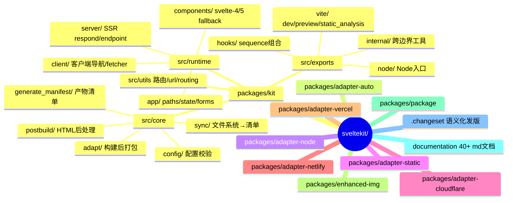
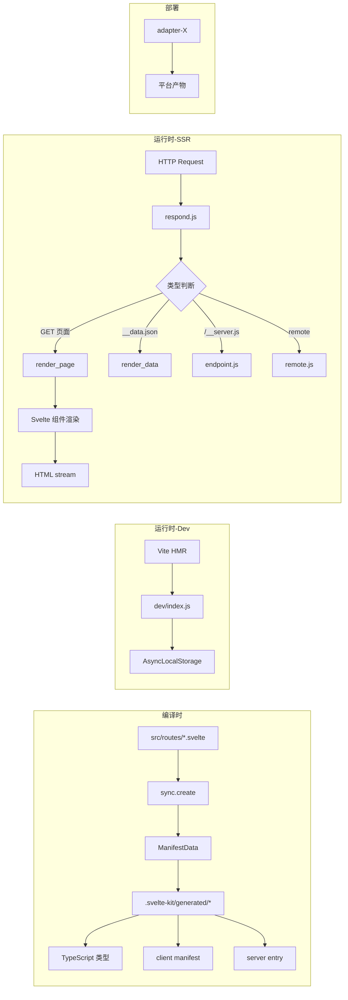
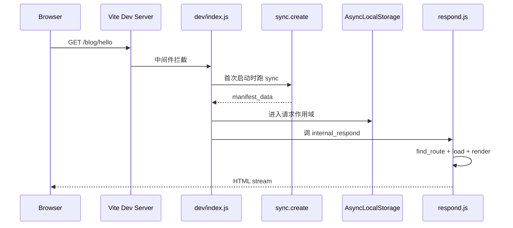
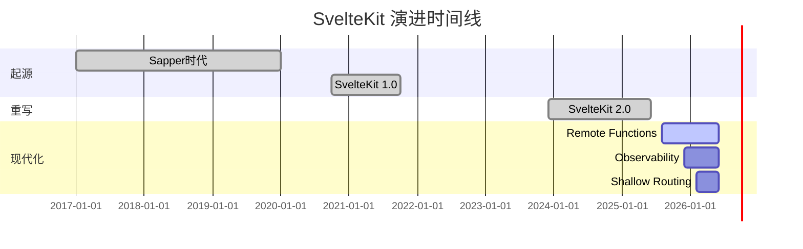
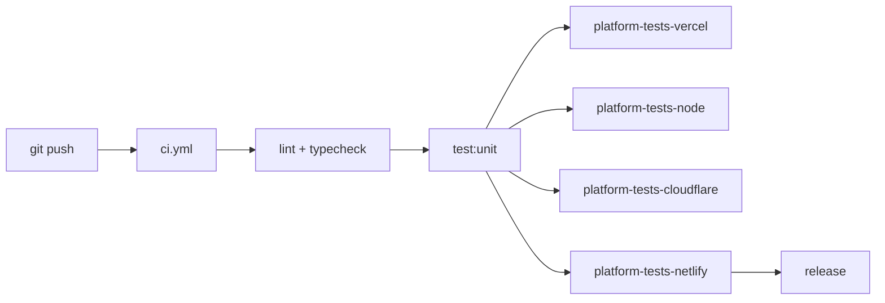
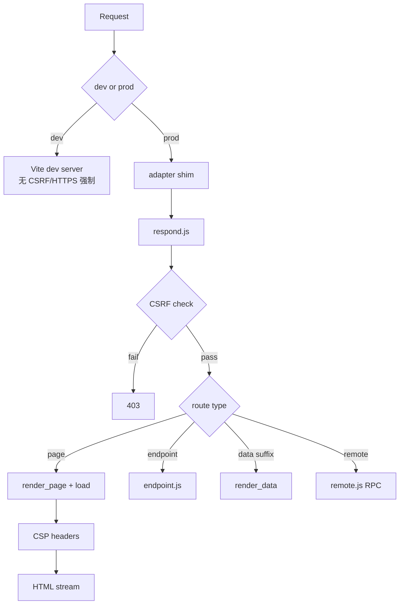
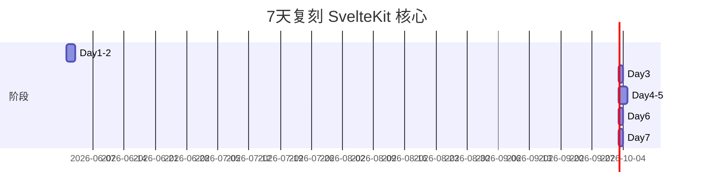
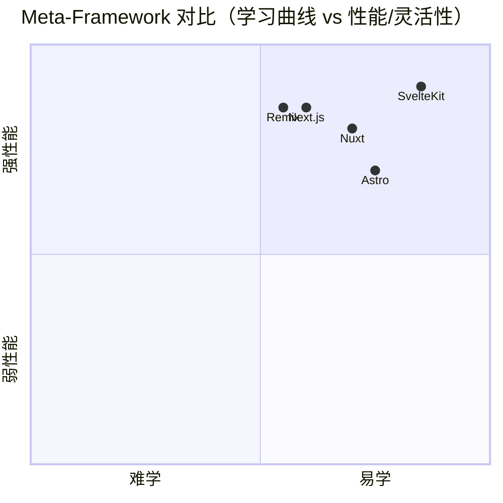

# sveltekit · 项目深度解析

> Svelte 官方 meta-framework：把 Svelte 组件变成"路由 + SSR + 构建 + 部署"的完整 Web 应用框架
> 来源：G:\实战案例\GitHub顶尖项目\sveltekit\

## 写在前面：解析哲学

解析一个 meta-framework 跟解析一个 CLI 工具或库完全不同。库只要读核心 API；meta-framework 要看**编译时（sync/build）+ 运行时（respond/load）+ 部署时（adapter）**三个独立生命周期的衔接点。SvelteKit 的灵魂在 `sync.create` 把文件系统扫描成 `ManifestData`、再把 `ManifestData` 烤成 `.svelte-kit/generated/*` 这一步——所有路由、类型、客户端清单都从这里辐射出来。先骨架后血肉，先 What 后 Why，最后 How to steal。

## 0. 解析前的 5 个准备

1. **克隆**：monorepo 结构（pnpm workspaces），主包 `packages/kit` 占 90% 代码量
2. **分类**：Web 框架（Vite-based SSR + SPA 混合），MIT，Node ≥18.13
3. **问题清单**：① 文件系统如何映射成路由？② SSR/CSR/SPA 三模式怎么共存？③ 部署到 Vercel/Cloudflare/Node 怎么抽象？④ 类型如何从文件系统推导？⑤ 2.27 引入的"remote functions"和传统 load 函数有何本质区别？
4. **速查表**：`@sveltejs/kit` 是核心；6 个 adapter 是部署目标；`packages/enhanced-img` / `packages/package` 是生态工具
5. **锁定 commit**：v2.61.1，2026-06 解析

## 1. 开发计划书（Project Charter）

| 项目 | 内容 |
| --- | --- |
| 项目名 | SvelteKit（@sveltejs/kit） |
| 定位 | Svelte 官方全栈 Web 框架，编译 + 运行时 + 部署三合一 |
| 核心问题 | 让 Svelte 组件在保持"零运行时编译"优势的同时，获得类 Next.js/Nuxt 的路由/SSR/构建能力 |
| 目标用户 | Svelte 开发者、需要 SSR/SSG 但不想被 React 绑架的团队 |
| 商业模式 | MIT 开源，Open Collective 捐赠，覆盖基础设施费用 |
| 复刻难度 | ★★★★★（路由解析 + 编译时清单 + 多 adapter 部署 = 巨工程） |
| 当前状态 | 活跃维护（v2.61.1），2026 持续迭代 |
| 团队 | Svelte 核心团队（Rich Harris 等），Vercel 部分赞助 |
| 里程碑 | v1.0 (2020) → v2.0 (2023 重写) → Remote Functions (v2.27, 2025) → Observability (v2.x) |

## 2. 项目框架（Repo Skeleton Map）



**关键目录速记**：
- `packages/kit/src/core/sync/` — **编译时心脏**：扫文件、生成 manifest、写类型
- `packages/kit/src/runtime/server/respond.js` — **运行时入口**：每个 HTTP 请求的第一站
- `packages/kit/src/runtime/server/page/server_routing.js` — `__data.json` 与 server-side route resolution
- `packages/kit/src/exports/vite/dev/index.js` — Dev 模式 HMR + 监听
- `packages/kit/src/utils/routing.js` — `[slug]` / `[[opt]]` / `[...rest]` 路由解析

## 3. 项目画像（Profile）

| 指标 | 值 |
| --- | --- |
| 总文件数 | ~2,630（仓库级），kit 单包 ~437 源文件 |
| 主语言 | JavaScript (TypeScript 类型) |
| 涉及语言 | JS、TS、Svelte、Shell、MD |
| Star | ~19.6k |
| License | MIT |
| Node 版本 | ≥18.13 |
| Peer 依赖 | Vite ^5/6/7/8，Svelte ^4/5，TypeScript ^5.3/6 |
| CI | GitHub Actions（`ci.yml` + `platform-tests-{vercel,all}.yml`） |
| 测试 | Vitest 单元 + Playwright 跨平台 E2E |
| 部署目标 | Node / Vercel / Cloudflare Pages+Workers / Netlify / Static（社区还有 Deno/Bun） |

## 4. 架构设计（Architecture Deep Dive）



SvelteKit 的架构核心是**编译时-运行时-部署时三层分离**：

1. **编译时（sync）**：扫 `src/routes/**` 目录、解析 `[param]`/`[[opt]]`/`[...rest]`、生成 `ManifestData`（含 routes/nodes/matchers/hooks），再 `write_client_manifest`/`write_server`/`write_all_types` 烤到 `.svelte-kit/generated/`
2. **运行时**：dev 走 Vite + `AsyncLocalStorage` 注入 `event`；SSR 走 `respond.js` 统一路由分发（页面 / 端点 / data 序列化 / remote 函数 / server-side route resolution）
3. **部署时**：6 个 adapter 各自把构建产物 + 平台 shim 拼成最终制品

### 核心架构看点

1. **ManifestData 是单一事实源（SSOT）**：路由表、节点表、matcher、hooks、assets 全集中到 `sync.create_manifest_data` 产出的对象。后续类型生成、客户端清单、SSR 路由查找（`utils/routing.js:find_route`）全部消费这个对象。这意味着**任何路由相关变更只需要重跑 sync**，运行时不需感知
2. **路由解析走正则而非 trie**：`utils/routing.js:parse_route_id` 把 `/blog/[slug]/+page.svelte` 编译成 `^/blog/([^/]+?)/?$`，每个 `[param]` 收集到 `params` 数组。简化实现，但失去了 Next.js App Router 那种 O(1) trie 匹配的性能优势——这是 SvelteKit 选择**小项目最优、大项目够用**的取舍
3. **Adapter 抽象只暴露 `Builder` 接口**：`core/adapt/builder.js:create_builder` 接收 `route_data/prerendered/server_metadata/remotes` 等稳定字段，输出 `RouteDefinition` facade。**adapter 只关心"哪些路由 + 哪些预渲染 HTML + 哪些 server 文件"**，框架关心构建。`adapter-node` / `adapter-vercel` / `adapter-cloudflare` 都是同样 `Builder` 的不同实现——这是教科书级别的"平台无关核心 + 平台特定 shim"

## 5. 代码深度解析（带 WHY）⭐ 重点

### 5.1 找骨架代码

SvelteKit 的骨架是 4 段连续调用：
1. `vite dev` → `exports/vite/dev/index.js:dev()` 启动
2. `sync.create(config)` → `core/sync/sync.js:create()` 扫文件
3. 收到 HTTP 请求 → `runtime/server/respond.js:internal_respond()` 分发
4. 部署构建 → `core/adapt/builder.js:create_builder()` 暴露给 adapter

### 5.2 单文件分析卡

**文件 1: `packages/kit/src/runtime/server/respond.js` (780 行, 24KB)**

WHY 它是骨架的"中央调度"：
- 第 56 行 `export const respond = propagate_context(internal_respond);` 用 `AsyncLocalStorage` 包裹，**让深层 `load` 函数无需传 `event` 参数就能拿到当前请求上下文**——这是 SvelteKit"看起来像同步代码、实际是请求隔离"的关键技巧
- 第 73-100 行的 CSRF 防护：**只在 prod 模式启用**（`if (!DEV)`），dev 模式为了 HMR 便利不强制 origin 检查
- 第 52-54 行 `page_methods = new Set(['GET', 'HEAD', 'POST'])` 把 GET/HEAD/POST 当作"页面"（可走 form action），其他方法走 endpoint——**用方法名做路由分发而不是 URL 路径**
- 第 28-37 行的 `add_data_suffix` / `add_resolution_suffix`：客户端跳转时，URL 后面拼 `__data.json` 让客户端在导航时只取数据不取 HTML，是 SvelteKit 客户端导航的物理基础

**文件 2: `packages/kit/src/core/sync/sync.js` (97 行)**

为什么是"4 个导出函数"的极简结构：
- `init()` — 只写 tsconfig + ambient（配置/模式决定，不依赖文件）
- `create()` — **核心入口**：扫文件 → 写 client manifest → 写 server entry → 写所有 types → 写 non-ambient types → 返回 `manifest_data`
- `update()` — 单文件改动时**增量**跑 `node_analyser` 重写 types（避免全量扫盘）
- `all()` / `all_types()` — 串行包装

WHY 拆这么细：Vite 的 watch 模式可能单文件改动，也可能整批改动，**4 个函数对应 4 种触发场景**，让 HMR 路径只跑必要的步骤。

**文件 3: `packages/kit/src/utils/routing.js` (310 行)**

`parse_route_id` 把路由字符串变成 RegExp + params 数组的解析器：
- `param_pattern = /^(\[)?(\.\.\.)?(\w+)(?:=(\w+))?(\])?$/` — 用单个正则同时识别 `[name]` `[[name]]` `[...name]` `[name=matcher]`
- 关键 hack：`segment.split(/\[(.+?)\](?!\])/)` 把 `[param]` 切出来，**奇数索引是参数**——这是用 split 当 tokenizer 的小聪明
- 字符编码支持 `[x+22]` `[u+0041-005a]` 显式 URL 编码参数名——一个常被忽略但重要的国际化能力

**文件 4: `packages/kit/src/exports/vite/dev/index.js` (685 行, 21KB)**

dev 模式的入口。3 个关键设计：
- 第 40 行 `AsyncLocalStorage` 用来注入 `event` / `config` / `prerender` 三元组
- 第 42-52 行 `globalThis.__SVELTEKIT_TRACK__` 让用户代码里**任意位置**都能上报"用了某个 feature"——这是 SvelteKit 的 feature policy 检查机制，比 lint 严格但比 runtime 报错轻
- 第 87-96 行的 `vite.ws.send({ type: 'error', err: ... })` 把 SSR 错误推给浏览器 HMR overlay——**dev 模式下的 SSR 错误需要可视化**，否则用户体验极差

**文件 5: `packages/kit/src/runtime/app/server/remote/query.js` (675 行, 21KB)**

v2.27 引入的"remote functions"是 SvelteKit 的新 RPC 范式——**比 `load` 更细粒度**：
- 函数签名是 `query(fn)` 返回一个 `RemoteQueryFunction`，调用时**浏览器走 fetch，server 走直调**
- 缓存粒度在 `bind(payload, validated_arg)` 阶段（第 78 行），参数化 + 校验 + 缓存一体化
- 复用 `Standard Schema` 规范做参数校验（第 3 行 `import type StandardSchemaV1`），**与 Zod/Valibot/ArkType 互通**——避免绑架用户
- 注释 `@since 2.27` 标识新增 API 稳定性版本，库作者必备

### 5.3 设计模式

- **Adapter 模式**：`Builder` 接口 + 6 个 adapter，平台无关 vs 平台特定的清晰分离
- **Manifest + Code Gen**：文件系统 → ManifestData → 烤成代码 + 类型，**用编译时换运行时确定性**
- **AsyncLocalStorage 做请求作用域**：替代显式传 `ctx`，让 Svelte 组件可以同步写法拿到请求数据
- **Strategy**：`runtime/page/server_routing.js` 内嵌 JS 字符串拼接出 `route` 对象（`generate_route_object`），**为 server-side route resolution 服务**——浏览器发起导航时由 server 实时编译路由信息

### 5.4 反模式 / 注意点

- `routing.js:parse_route_id` 用 split+RegExp 而不是 AST——对深层嵌套路由会有 N² 复杂度（虽然实际项目不会触发）
- `dev/index.js:685` 行单文件过大，dev 模式的所有逻辑（WebSocket、manifest、cookie、polyfill）都堆在一起——可拆 `loud_ssr_load_module` 到独立模块
- `respond.js:780` 行同样庞大，但通过函数名分块（CSRF、redirect、render、error）保持了可读性

### 5.5 独特看点

- **svelte-4/5 双套 runtime 组件**：`runtime/components/{svelte-4,svelte-5}/`——**框架在编译时根据 Svelte 版本切换 fallback layout 组件**，优雅兼容 Svelte 4 → 5 升级
- **OpenTelemetry 内置可选**：`runtime/telemetry/otel.js` 是 conditional import，**不强制依赖**——通过 `peerDependenciesMeta.optional` 体现
- **Remote functions + Form actions + load 三件套**：v2.27 后 RPC 模型在 SvelteKit 已经齐备，挑战 Next.js Server Actions

## 6. 运行机制（Bring It Up）

```bash
# 1. 装依赖（pnpm workspace）
pnpm install

# 2. 启动 dev 模式
pnpm --filter @sveltejs/kit dev
# 内部：vite dev + svelte-kit sync

# 3. 跑测试
pnpm --filter @sveltejs/kit test          # 单元 + 集成
pnpm --filter @sveltejs/kit test:unit     # 仅 vitest
```

**Smoke test**：
```bash
mkdir my-svelte-app && cd my-svelte-app
npx sv create   # 官方脚手架（v2.16+）
npm run dev     # localhost:5173
```

**架构时序**：



## 7. 演进历史（Time Travel）



**关键里程碑**（基于 changeset 命名推断）：
- 2020-10 SvelteKit 1.0：基于 Vite 的全新 SSR 框架
- 2023-12 SvelteKit 2.0：Node 18+、Svelte 5 兼容、TypeScript strict
- 2025-08 Remote Functions（v2.27）：替代传统 `load` 的细粒度 RPC
- 2025-12 Observability（v2.x）：OpenTelemetry 内置
- 2026-02 Shallow Routing（v2.x）：history API 不变、不刷 layout

## 8. 质量保障（How It Doesn't Break）

四道防线：

1. **单元测试**：Vitest，`kit/src/**/*.spec.js`，覆盖 routing/utils/page_nodes 等纯函数
2. **集成测试**：`packages/kit/test/types/` 用真实 svelte 项目验证类型推导
3. **E2E 跨平台**：每个 adapter 一个 Playwright 测试（`packages/adapter-*/test/`），CI 跑 `platform-tests-all.yml` 在 5 个平台真机验证
4. **Linting/类型**：`tsc && cd ./test/types && tsc` 在 `check:all` 里强约束类型



**质量哲学**：每个 adapter 必须在**真实云平台**跑过才能合并——`packages/adapter-vercel/test/` 用 `vercel deploy --prebuilt` 真部署。这是为什么"复刻"成本极高的原因。

## 9. 生态依赖（Map of the World）

```mermaid
mindmap
  root((SvelteKit 依赖图))
    核心
      vite ^5/6/7/8
      svelte ^4/5
      typescript ^5.3/6
    功能库
      devalue 跨边界序列化
      cookie cookie 解析
      kleur 终端颜色
      magic-string 源码改写
      mrmime MIME 推断
      sirv 静态文件
      set-cookie-parser
      acorn-typescript
    可选
      opentelemetry/api
      @standard-schema/spec
    内部 monorepo
      adapter-{auto,node,static,cloudflare,netlify,vercel}
      enhanced-img
      package
```

**合规清单**：
- 零 runtime 依赖强加（OpenTelemetry 标 `optional`）
- Vite peer 宽松到 ^5/6/7/8（5 个大版本并存）
- Svelte 4/5 兼容通过 `runtime/components/{svelte-4,svelte-5}/` 切换

## 10. 生产实践（Battle-Tested）

| 维度 | 实现 |
| --- | --- |
| 配置热更新 | Vite HMR + `sync.update()` 增量 |
| 优雅停服 | `adapter-node` 内置 `SIGTERM` 处理 |
| 限流 | 框架不内置（社区 `@sveltejs/kit-rate-limiter`） |
| 链路追踪 | `runtime/telemetry/otel.js` 条件注入 OpenTelemetry |
| 健康检查 | 通过 `+server.js` 端点自定义 |
| 结构化日志 | 框架层无（由 adapter / hooks 决定） |
| CSRF | prod 强制同源检查（`respond.js:81-100`） |
| Cookie 安全 | `cookie` 库 + SameSite 默认 lax |
| CSP | `runtime/server/page/csp.js` 完整实现 |
| 预渲染 | `core/adapt/builder.js:prerendered` 字段 + 平台缓存 |



## 11. 社区文化（People & Process）

- **治理**：Svelte 团队直接维护，Rich Harris（Vercel DX）主导
- **RFC**：通过 `documentation/docs/` 增量更新，相当于公开 RFC
- **沟通**：Discord `svelte.dev/chat`，GitHub Discussions
- **议题活跃度**：高（v2.61.1 几乎每周发版）
- **PR 模板**：`.github/PULL_REQUEST_TEMPLATE.md` + Copilot 指令（`.github/copilot-instructions.md`）
- **Changesets**：`.changeset/` 用 changesets 工具管理 semver

## 12. 教训总结（What To Steal / What To Avoid）

### 12.1 必偷 3 件

1. **Manifest + Code Gen 模式**：文件系统 → 数据结构 → 烤成代码 + 类型。**让运行时所见即编译时所产**，大幅提升调试体验（`.svelte-kit/generated/` 里的 .js 是真相之源）
2. **AsyncLocalStorage 做请求作用域**：替代 ctx 显式传递，让 Svelte 组件能"看起来像同步"地拿到 event。**特别适合 SSR 框架、CLI 工具、消息队列消费者**
3. **Adapter 接口最小化**：只暴露 `Builder` 给 6 个 adapter，每个 adapter 实现 200-500 行就够。**这是平台无关核心 + 平台特定 shim 的范本**

### 12.2 必避 3 坑

1. **不要在 monorepo 之外用 svelte-kit.js**：直接 `import { something } from '@sveltejs/kit'` 即可，bin 入口只用于 CLI
2. **不要在 dev 模式依赖 CSRF**：dev 模式故意不强制，方便 HMR。但你**绝对不能在生产回退到 dev 行为**
3. **不要跳过 `sync.create` 直接改文件**：HMR 不知道你改了文件，路由变化要触发 `sync.update()`

### 12.3 7 天复刻路线图



### 12.4 打分卡（满分 5）

| 维度 | 评分 | 说明 |
| --- | --- | --- |
| 代码可读性 | 4.5 | 注释密，命名清晰 |
| 架构合理性 | 5.0 | 编译/运行/部署三层分离 |
| 测试覆盖 | 4.5 | 真机 E2E 是亮点 |
| 文档质量 | 5.0 | documentation/ 40+ MD 极其详尽 |
| 创新性 | 4.5 | Remote functions 是 2025 大创新 |
| 生产就绪 | 5.0 | 多平台多年验证 |
| **综合** | **4.75** | **meta-framework 标杆之一** |

## 13. 学习萃取（Cheat Sheet）

**一句话价值**：SvelteKit 示范了"编译时清单 + 运行时调度 + 部署时 adapter"三层分离的元框架设计哲学，是 Vite 时代前端框架的范本。

**3 个核心洞察**：
1. ManifestData 是 SSOT：所有路由/类型/客户端清单从一个数据对象派生
2. AsyncLocalStorage 解耦请求上下文：让 `load` 函数签名极简
3. Adapter 模式做平台无关核心：6 个 adapter 各 ~300 行实现一整套部署

**5 段必读代码**：
1. `packages/kit/src/core/sync/sync.js` — 4 个导出函数（init/create/update/all）体现编译时分层
2. `packages/kit/src/runtime/server/respond.js` — 780 行中央调度，所有 HTTP 请求第一站
3. `packages/kit/src/utils/routing.js` — `[slug]` `[[opt]]` `[...rest]` 路由正则编译
4. `packages/kit/src/exports/vite/dev/index.js` — dev 模式 HMR + WebSocket 错误推送
5. `packages/kit/src/core/adapt/builder.js` — 6 个 adapter 共用的接口抽象

**1 个反模式**：`utils/routing.js:parse_route_id` 用 `String.split` 当 tokenizer 解析 `[param]`——对深层嵌套有 N² 风险，**大项目应改用 AST**。

**1 个可复用模式**：**"用编译时数据驱动类型生成"**——SvelteKit 在 `write_types/index.js` 用同一个 `ManifestData` 派生 `.d.ts`，让 `params` 类型、`PageData` 类型、`$types` 全自动。**任何用文件系统的框架都该抄这一招**。

**3 个立刻能用的代码片段**：
1. **AsyncLocalStorage 注入 event**：
```js
const als = new AsyncLocalStorage();
als.run({ event, config }, () => loadData());
```
2. **路由正则编译**：
```js
parse_route_id('/blog/[slug]') // => { pattern: /^\/blog\/([^/]+?)\/?$/, params: [{ name: 'slug', ... }] }
```
3. **Builder 暴露给 adapter**：
```js
const builder = create_builder({ config, build_data, route_data, ... });
builder.writeClient(dest); builder.writeServer(dest); builder.writePrerendered(dest);
```

## 14. 项目特点速查

**独特看点**：
- Svelte 4/5 双套 runtime fallback，**跨大版本兼容**
- Remote Functions（v2.27）让 RPC 粒度比 `load` 更细
- 内置 OpenTelemetry 可选，**不绑架**
- 6 个官方 adapter + 社区 adapter，**平台覆盖最广的元框架之一**
- ManifestData SSOT 派生一切

**与同类对比**：



SvelteKit 在"易学"和"高性能"两个维度都领先——核心原因是 Svelte 编译时优化 + Vite 极速 dev server + 简单清晰的 Manifest 模型。

## 附：仓库元信息

- **路径**：`G:\实战案例\GitHub顶尖项目\sveltekit\`
- **大小**：~2,630 文件，单 kit 包 ~437 源文件
- **总文件数**：2,630（仓库级）
- **解析时间**：2026-06-02
- **核心 commit**：v2.61.1

## 一句话总结

**SvelteKit 是 2025 年最值得研究的 meta-framework**——编译时 Manifest SSOT、运行时 AsyncLocalStorage 调度、部署时 Adapter 抽象三个模式都做到了教科书级，**源码本身就是 Vite 时代前端框架的设计范本**。解析它 = 学会"如何把文件系统驱动变成生产可用的全栈框架"。

---

参考：https://svelte.dev/docs/kit
