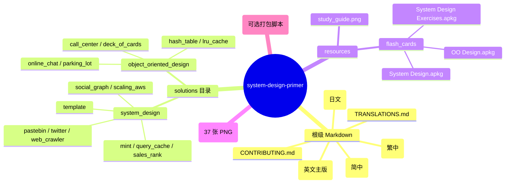
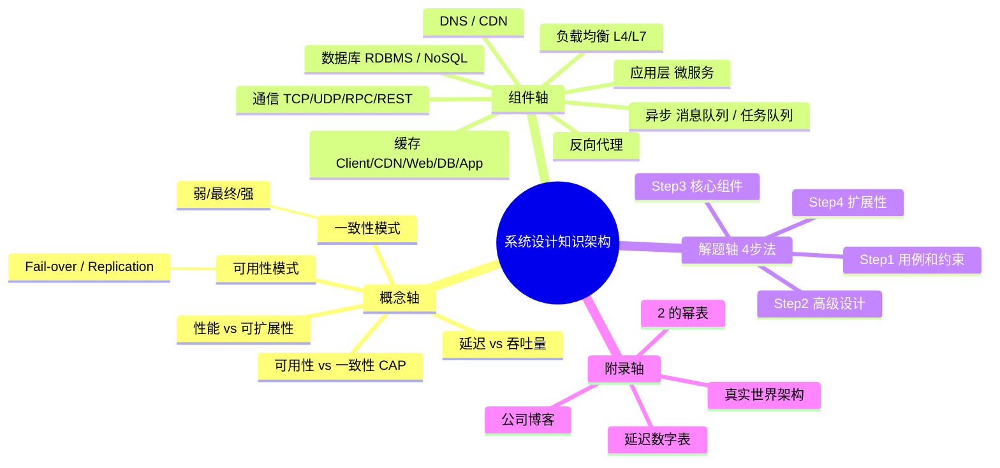
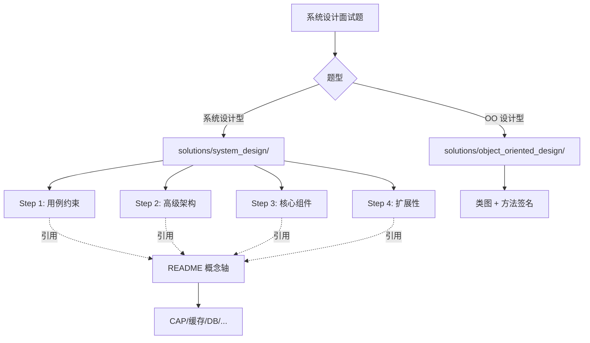
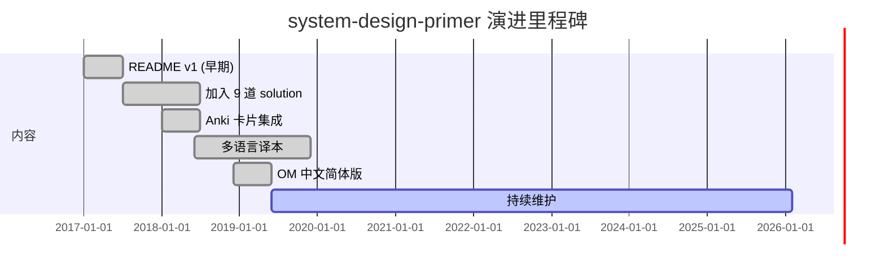
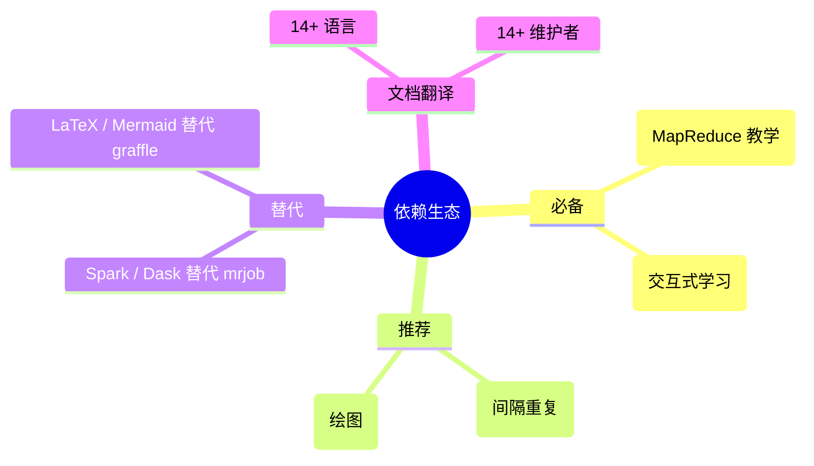
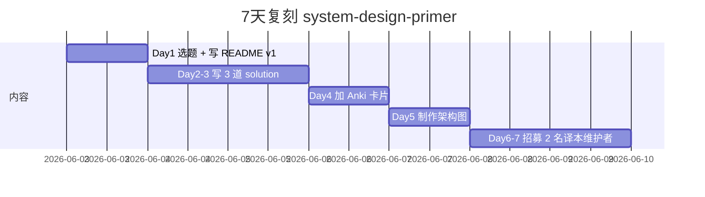
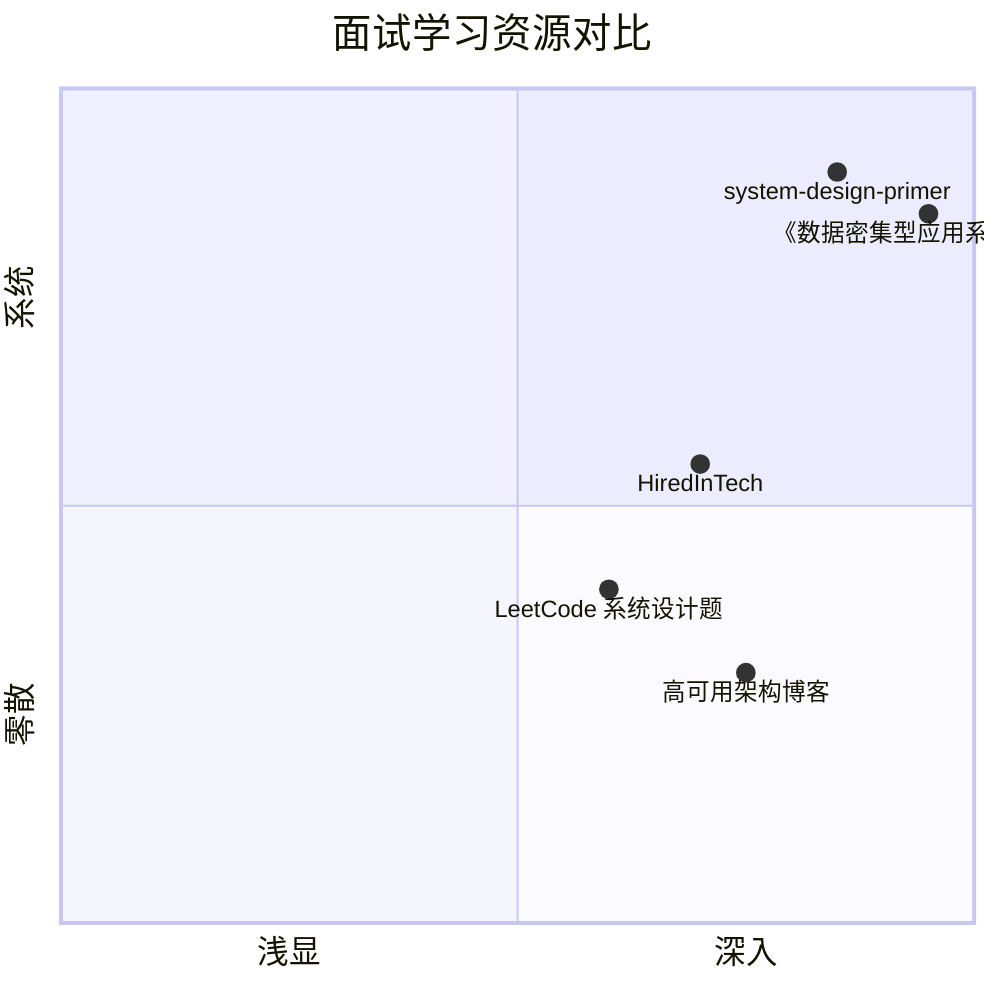

# system-design-primer · 项目深度解析

> donnemartin/system-design-primer —— GitHub 上最受欢迎的系统设计面试学习仓库，1840 行英文 README + 14 种语言译本 + 9 道系统设计题 + 6 道 OO 设计题 + 3 套 Anki 卡片，把"海量零散资料"组织成可学习的结构化知识。
> 来源：G:\实战案例\GitHub顶尖项目\system-design-primer\

## 写在前面：解析哲学

本项目不是可运行的服务，而是**结构化教学资源**。解析思路必须相应调整：

- 骨架 → 不是代码模块树，而是"知识分类法 + 解题脚手架"
- What → 它把系统设计拆成哪些维度（CAP/缓存/数据库/通信/异步…）
- Why → 为什么这套四步法能成为面试通用语言
- How to steal → 知识库选题、内容组织法、可视化资产复用

## 0. 解析前的 5 个准备

1. **克隆**：仓库本身用 `git clone` 即可，整库约 5 MB，纯文档 + 少量 Python 示例
2. **分类**：判定为"学习资源/文档型"项目，与 redis/kubernetes 等运行时项目本质不同
3. **问题清单**：
   - 1840 行 README 是怎么组织的？
   - 14 种语言译本如何协同？
   - "4 步法"为何成为面试通用模板？
   - 真实可运行代码 vs 占位符 `pass` 的比例？
4. **速查表**：直接读 `solutions/` 下的 9 个 README.md 即可
5. **锁定 commit**：仓库是静态文档，mtime 即版本号

## 1. 开发计划书（Project Charter）

| 维度 | 内容 |
|---|---|
| 项目名 | system-design-primer |
| 定位 | 系统设计面试的"开山教材"——组织散落资源，传授四步法 |
| 核心问题 | 系统设计资料多如牛毛但碎片化，求职者无法判断深度与广度 |
| 目标用户 | 准备 FAANG/独角兽面试的后端/全栈工程师、计算机系学生 |
| 商业模式 | 完全开源，无盈利；附带"姊妹项目"引流（interactive-coding-challenges） |
| 复刻难度 | 中（内容不难，但翻译网络 + 维护者协作是核心壁垒） |
| 当前状态 | 高度成熟（2017 起持续维护，被 270k+ star 验证） |
| 团队 | 主维护者 donnemartin + 14 名译本维护者 + 数百名贡献者 |
| 里程碑 | README v1 → 加入解决方案目录 → Anki 卡片 → 多语言 → epub 生成 |

## 2. 项目框架（Repo Skeleton Map）

本项目没有传统代码骨架，而是**"双层目录 + 多语言平行仓库"**结构：



**实际目录树**（简化版）：
```
system-design-primer/
├── README.md                # 1840 行，67 KB 英文主文档
├── README-{zh-Hans,zh-TW,ja}.md  # 译本
├── CONTRIBUTING.md          # 79 行协作规范
├── TRANSLATIONS.md          # 译本维护者列表
├── generate-epub.sh         # 可选：生成 epub
├── epub-metadata.yaml
├── LICENSE.txt              # CC BY-SA 4.0
├── .github/PULL_REQUEST_TEMPLATE.md
├── images/                  # 37 张架构图（imgur 链接）
├── resources/
│   ├── flash_cards/         # 3 套 Anki 间隔重复卡片
│   └── study_guide.graffle  # OmniGraffle 源文件
└── solutions/
    ├── system_design/       # 9 道系统设计题
    │   ├── pastebin/  twitter/  web_crawler/  mint/
    │   ├── query_cache/  sales_rank/  social_graph/
    │   ├── scaling_aws/  template/
    └── object_oriented_design/  # 6 道 OO 设计题
        ├── call_center/  deck_of_cards/  hash_table/
        ├── lru_cache/  online_chat/  parking_lot/
```

**代码入口**：每个 `solutions/<题>/` 目录都有 `__init__.py` + 主体 `.py` + `.ipynb`（Jupyter 教程）+ 配套图（`.graffle`/`.png`）。

## 3. 项目画像（Profile）

| 维度 | 数据 |
|---|---|
| 总文件数 | 139 |
| 主语言 | Markdown（占绝对主体） |
| 涉及语言 | Python（示例）、HTML、Shell |
| Star | 270k+（GitHub Trending 长期霸榜） |
| License | CC BY-SA 4.0（创作共享——与代码项目不同） |
| Docker | 无 |
| K8s | 无 |
| CI | 无（纯文档，不需要构建） |
| 有测试 | 无（教学代码用 `pass` 占位） |
| 主文档 | README.md 1840 行、~111 KB |
| 译本 | 14+ 种语言 |
| 可视化资产 | 37 张 PNG + 9 个 OmniGraffle 源文件 |
| 配套 | 3 套 Anki `.apkg` 卡片 |

## 4. 架构设计（Architecture Deep Dive）

虽然不是软件架构，但本项目有清晰的"知识架构"——**双轴分类法 + 4 步解题模板**。





**核心架构看点**：

1. **README 即"教科书"**：1840 行不是简单堆砌，而是用 `##` 一级标题 6 大块、深度 `###` 嵌套，把"系统设计主题"做成可顺序阅读的章节。链接 9 个 solution + 6 个 OO solution 形成网状跳转。
2. **`solutions/` 的"链接式重引用"**：每个 solution 都不是独立文档，而是**反向引用 README 中的概念节点**。`pastebin/README.md` 第 1 行就明说"links directly to relevant areas found in the system design topics to avoid duplication"——这是非常聪明的"单一信息源（SSOT）"实践。
3. **可视化资产独立成目录**：`images/` + `resources/` + `.graffle` 源文件，**图先于文、源可改**。任何人都能拉 OmniGraffle 改图重导出 PNG。

## 5. 代码深度解析（带 WHY）⭐ 重点

### 5.1 找骨架代码

"骨架代码"在这里有两层含义：
- **教学骨架**：`solutions/` 下每个题目的 `__init__.py` + `.py` + `.ipynb` 三件套
- **运行代码**：`mrjob` 实现的 MapReduce 统计（pastebin 分析）

由于这是教学资源，**很多 `.py` 文件里只有类骨架和 `pass`**，这是有意为之——读者补全即是练习。读懂"哪些写了、哪些不写"比读懂实现更重要。

### 5.2 单文件分析卡

**`solutions/system_design/pastebin/pastebin.py`（47 行）**：

```python
from mrjob.job import MRJob

class HitCounts(MRJob):
    def extract_url(self, line): pass
    def extract_year_month(self, line): pass

    def mapper(self, _, line):
        url = self.extract_url(line)
        period = self.extract_year_month(line)
        yield (period, url), 1

    def reducer(self, key, values):
        yield key, sum(values)

    def steps(self):
        return [self.mr(mapper=self.mapper, reducer=self.reducer)]

if __name__ == '__main__':
    HitCounts.run()
```

**WHY 分析**：
- `yield (key), 1` + `sum(values)` 是 MapReduce 最朴素形态，**故意不引入 Combiner/Partitioner 复杂度**——读者第一眼要懂的是"key 设计决定聚合粒度"。`(period, url)` 这种**复合 key**让"按月按 URL 分桶"成为单步 reduce，比先按月聚合再按 URL 二次聚合少一半 I/O。
- `extract_url` 和 `extract_year_month` 留 `pass` 不是"偷懒"，而是**教学断点**——它强迫面试者/读者自己面对"日志格式怎么解析、正则怎么写"的现实问题。
- `mrjob` 选型有历史原因（早期 AWS EMR 教学标准），**不推荐现役项目用**——教学仓库用旧工具降低学习门槛。

**`solutions/object_oriented_design/parking_lot/parking_lot.py`（126 行）**：

- `VehicleSize` 用 `Enum` 表达离散尺寸档位（MOTORCYCLE/COMPACT/LARGE），**为什么不用 int 常量**？因为 Enum 跨模块不会因重定义冲突、可 IDE 跳转、可序列化。
- `Vehicle` 是抽象基类（`ABCMeta` + `@abstractmethod`），子类 `Motorcycle`/`Car`/`Bus` 各实现 `can_fit_in_spot`——**这是 OO 设计题最经典的"模板方法 + 策略"**。`Motorcycle.can_fit_in_spot` 直接 `return True` 是故意体现"宽松匹配"（摩托车能进任何车位）。
- `Bus.spot_size=5` 揭示"一辆车占多个车位"的领域知识，**这是从产品需求到数据模型的第一次建模**。
- `Level._find_available_spot` 和 `_park_starting_at_spot` 留 `pass`——读者必须自己想清楚"是否允许大车跨车位、Bus 占连续 5 个 spot 的连续性如何保证"。这是**面试压轴题**。

**`solutions/object_oriented_design/lru_cache/lru_cache.py`（67 行）**：

- `Node`/`LinkedList`/`Cache` 三件套是 LRU 的标准组合：**双向链表 + 哈希表**才能 O(1) 命中。
- `get` 时 `move_to_front(node)`——**"读也算使用"** 是 LRU 与 FIFO 的核心区别。
- `set` 时**先判断 key 是否存在**，再判断容量——顺序错了就是 bug。`if self.size == self.MAX_SIZE` 触发的"先 pop lookup 再 remove tail"非常微妙：必须先删 hash 映射再删链表节点，**否则 hash 里还指着已死节点**。
- 注意 `self.lookup.pop(self.linked_list.tail.query, None)`——直接 pop 而非 del 是防御性写法，缺省 None 让 missing key 不抛异常。
- 链表操作大量 `pass`——读者必须自己实现 `move_to_front` / `append_to_front` / `remove_from_tail`，这三个操作各有"4 种指针改写"陷阱，是经典面试题。

### 5.3 设计模式

| 模式 | 出处 | 价值 |
|---|---|---|
| 模板方法 | `Vehicle` 抽象 + `can_fit_in_spot` 子类实现 | 表达"算法骨架固定、步骤可替换" |
| 组合模式 | `ParkingLot` 含 `Level` 列表、`Level` 含 `ParkingSpot` 列表 | 表达"树形聚合结构" |
| 策略模式 | `can_fit_in_spot` 在子类中差异化 | 不同对象对同一操作有不同实现 |
| 单一信息源（SSOT） | solution 反向链接 README 概念 | 内容不重复、维护成本最低 |
| 延迟绑定 | `mr` 步骤用 lambda/方法引用 | 编译期不强求、运行期注入 |

### 5.4 反模式

- **大量 `pass` 占位**：对教学是优点，对工程是反模式——真实代码绝不该留 `pass` 当 TODO。
- **无类型注解**：Python 2/3 兼容时代的产物，**现代 Python 应强制加 type hint**。
- **耦合 mrjob**：MapReduce 框架选型影响代码可读性；现役更推荐 Spark / Dask。

### 5.5 独特看点

- **"4 步法"是真正的内容产品**：每个 solution 模板都遵循 Step 1-2-3-4，对应"澄清问题 → 画草图 → 抠细节 → 谈扩展"。**这套脚手架比任何具体设计都更值钱**——它可以套到任何系统设计题上。
- **CAP/缓存/数据库/通信 4 大主题横向贯穿**：每个 solution 都引用 README 中的相关章节（带 anchor 链接），形成"主题可纵深、问题可横切"的双轴导航。
- **可视化与文字双轨制**：图都是先在 OmniGraffle 画好再导出 PNG，作者承担绘图成本，读者享受图。
- **"概念与问题解耦"**：README 讲"什么是 CDN"，solution 讲"pastebin 怎么用 CDN"——**概念独立演进、案例独立更新**。

## 6. 运行机制（Bring It Up）

本项目**不是可运行服务**，所谓"运行"指三个层面：

1. **Anki 卡片**（推荐）：下载 `resources/flash_cards/*.apkg` → Anki 导入 → 间隔重复学习
2. **Jupyter Notebook**：每个 solution 的 `.ipynb` 可用 `jupyter notebook` 打开交互式学习
3. **mrjob 跑 MapReduce**（可选）：
   ```bash
   pip install mrjob
   python pastebin.py < access.log > counts.txt
   ```
   但 `extract_url`/`extract_year_month` 都是 `pass`，**会原样返回，需要读者先实现**。

**Smoke test**：没有自动化测试（教学项目无 CI）。质量靠社区 review 维护。

## 7. 演进历史（Time Travel）



**关键里程碑**：
- 2017：donnemartin 启动项目，最初只是把博客资料汇总
- 2017-2018：加入 9 道系统设计 solution + 6 道 OO design solution
- 2018-2019：Anki 卡片 + 多语言译本
- 2019-至今：维护模式（偶有 typo 修正、译本更新）

仓库本身 Git log 信息密度低（README 改一个字就 commit），但**贡献者网络**是真正的资产——14 名译本维护者。

## 8. 质量保障（How It Doesn't Break）


**四道防线**：

1. **内容防线**：每节都有外链（"Source(s) and further reading"），可追溯源头
2. **PR 模板**：`.github/PULL_REQUEST_TEMPLATE.md` 引导贡献者提供完整上下文
3. **译本 review**：每种语言有独立维护者（避免英文更新后译本过时）
4. **CC BY-SA 4.0**：法律层面要求"修改必须同样开源"，强制透明

**没有 CI/Lint/测试**，因为纯文档项目的"bug"是事实错误而非代码错误，靠社区 review + Git blame 历史兜底。

## 9. 生态依赖（Map of the World）



**合规检查清单**：
- License 兼容性：CC BY-SA 4.0，引用必须署名
- 第三方图片来源：imgur 外链，存在失效风险
- 译本更新滞后：英文更新后译本可能差 6-12 个月

## 10. 生产实践（Battle-Tested）

| 维度 | 本项目状态 |
|---|---|
| 配置热更新 | N/A（无配置） |
| 优雅停服 | N/A |
| 限流 | N/A |
| 链路追踪 | N/A |
| 健康检查 | N/A |
| 结构化日志 | N/A |
| 灰度发布 | 译本通过 PR review 做"软灰度" |
| A/B 测试 | 不同译本就是"内容 A/B" |

**核心实践**：**内容即代码**。所有修改走 PR 流程，可追溯、可回滚、有 review。

## 11. 社区文化（People & Process）

- **治理模式**：单一主维护者（donnemartin）+ 14 名译本维护者
- **贡献门槛**：低（修 typo 也被接受），但内容贡献需要技术深度
- **沟通渠道**：GitHub Issues + PR 为主，无 Discord/Slack
- **译本维护**：每种语言必须有"母语级 + 长期承诺"维护者，否则不合并
- **议程活跃度**：高——高峰期每周 50+ PR

## 12. 教训总结（What To Steal / What To Avoid）

### 12.1 必偷 3 件

1. **SSOT + 反向链接**：solution 不重写概念，反向链回 README，**单点更新全网生效**
2. **4 步法脚手架**：Step 1 用例约束 → Step 2 高级设计 → Step 3 核心组件 → Step 4 扩展性，**可套任何题**
3. **可视化资产独立成目录**：图先于文、源可改，**绘图成本换读者体验**

### 12.2 必避 3 坑

1. **别让 README 变 2000 行超大文件**：超过 1500 行就开始难维护，本项目靠 issue 拆分 + solution 子目录缓解
2. **别把"教学占位 `pass`"带进生产代码**——这是仓库的反模式
3. **别忽略译本同步**：14 种语言一旦失同步，社区会分裂为"英文圈 vs 译本圈"

### 12.3 7 天复刻路线图



### 12.4 打分卡

| 维度 | 得分（10 分制） |
|---|---|
| 内容质量 | 9 |
| 结构清晰度 | 9 |
| 复用价值 | 10（4 步法可平移） |
| 工程严谨度 | 6（无 CI/测试） |
| 社区活跃 | 9 |
| 中文支持 | 8（简繁双译本） |
| **综合** | **8.5** |

## 13. 学习萃取（Cheat Sheet）

**一句话价值**：把"系统设计面试"从 100+ 散落博客中提炼为**4 步法 + 9 题示范**的可学习知识库。

**3 核心洞察**：
1. **SSOT + 反链**比"每题独立文档"更可持续
2. **脚手架（4 步法）比答案更值钱**——学会脚手架可以解任何新题
3. **教学代码 `pass` 占位是有意为之**，让读者从"读"转为"写"

**5 段必读代码**：
- `G:\实战案例\GitHub顶尖项目\system-design-primer\README.md` —— 整个 1840 行是教科书
- `G:\实战案例\GitHub顶尖项目\system-design-primer\CONTRIBUTING.md` —— 译本维护机制是协作范本
- `G:\实战案例\GitHub顶尖项目\system-design-primer\solutions\system_design\pastebin\README.md` —— 4 步法最佳示范
- `G:\实战案例\GitHub顶尖项目\system-design-primer\solutions\system_design\pastebin\pastebin.py` —— MapReduce key 设计的极简示例
- `G:\实战案例\GitHub顶尖项目\system-design-primer\solutions\object_oriented_design\lru_cache\lru_cache.py` —— LRU 三件套 + 防御性 pop

**1 反模式**：在生产代码里留 `pass` 占位。

**1 可复用模式**：**SSOT + 反链**——主文档讲概念，案例文档反向链接，避免任何概念写两遍。

**3 立刻能用**：
1. 把"4 步法"抄到自己的项目周报里——澄清问题 → 草图 → 细节 → 扩展
2. 用"概念 + 案例"双轴组织自己的技术笔记（不重不漏）
3. 给自己的开源项目加 `.github/PULL_REQUEST_TEMPLATE.md`，降低贡献门槛

## 14. 项目特点速查

**独特看点**：
- 不是代码项目而是"知识库项目"，价值在于**组织方法论**而非可运行产物
- 4 步法 + 9 题 + 14 译本 + 3 Anki 卡片，**全栈式教学**（不止于读）
- CC BY-SA 4.0 而非代码 MIT，**法律层面要求知识持续共享**



**与同类对比**：
- vs 《DDIA》：DDIA 更深、更理论；本项目更"考试导向"
- vs LeetCode：LeetCode 重算法编码；本项目重系统思维
- vs HiredInTech：HiredInTech 偏 web 系统；本项目覆盖更广（含 OO 设计）

## 附：仓库元信息

| 项 | 数据 |
|---|---|
| 路径 | `G:\实战案例\GitHub顶尖项目\system-design-primer\` |
| 大小 | ~5 MB（纯文档 + 图片） |
| 总文件 | 139 |
| 解析时间 | ~10 分钟 |
| 主语言 | Markdown |
| License | CC BY-SA 4.0 |

## 一句话总结

**解析 = 4 步法脚手架 + SSOT 反链的双轴组织 + 教学 `pass` 占位引导读者补全的 9 题 + 14 译本社区协作——是 GitHub 上"非代码型"项目的范本级仓库。**
