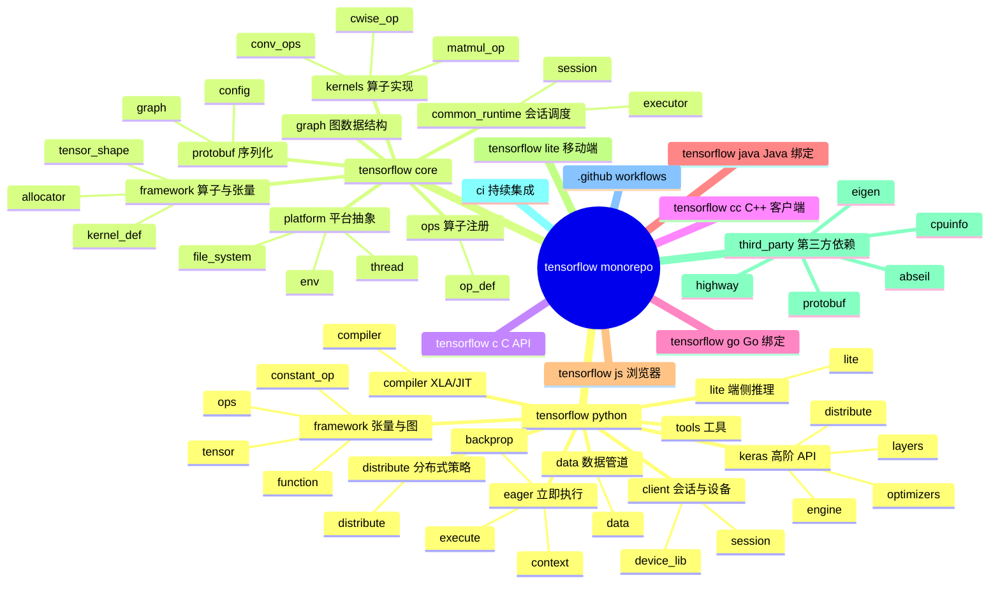
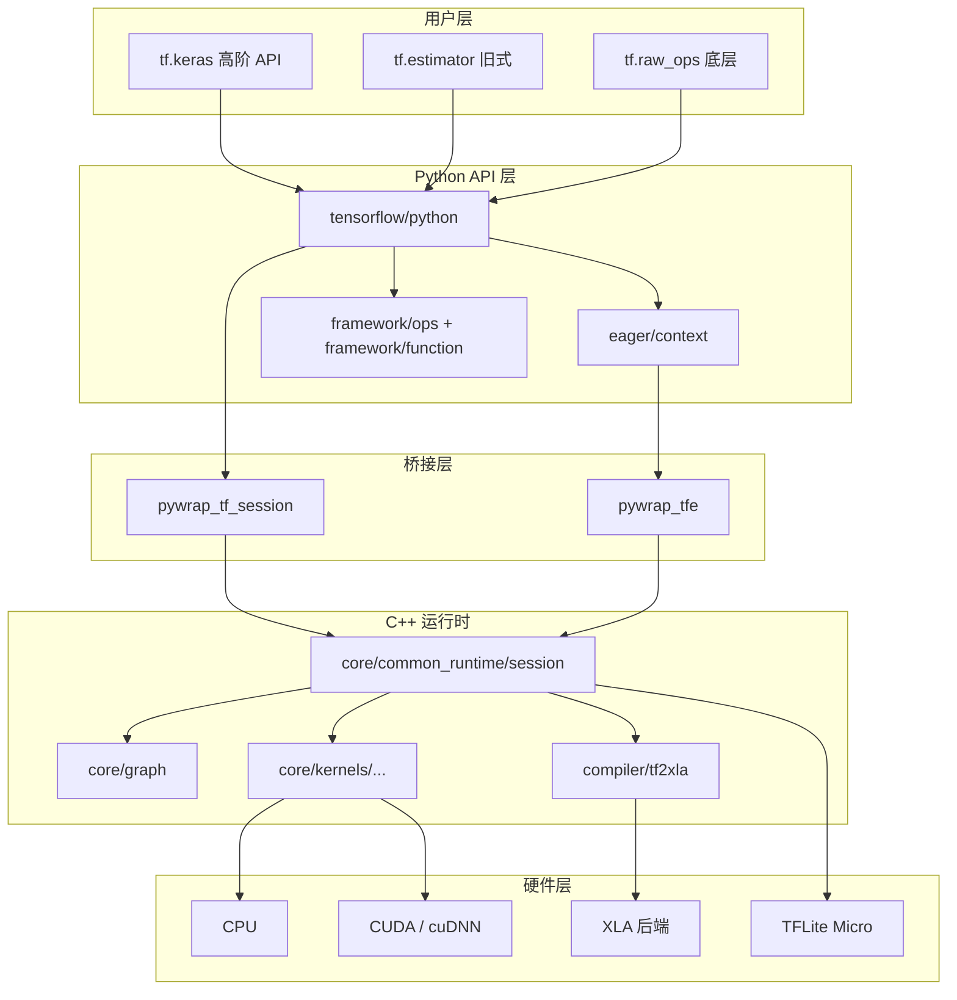
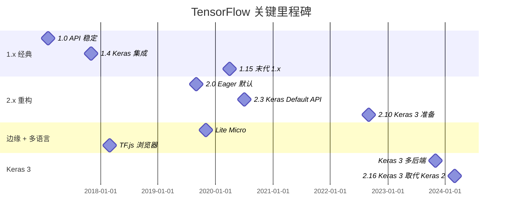
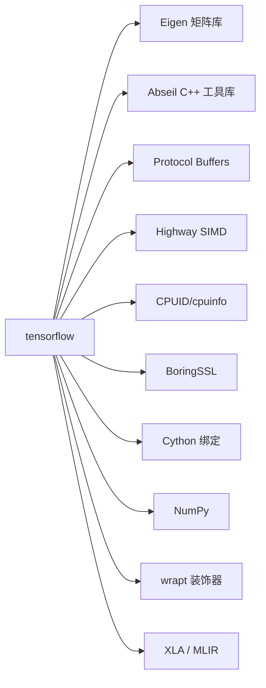
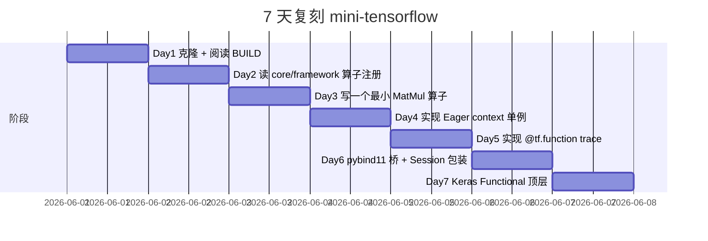
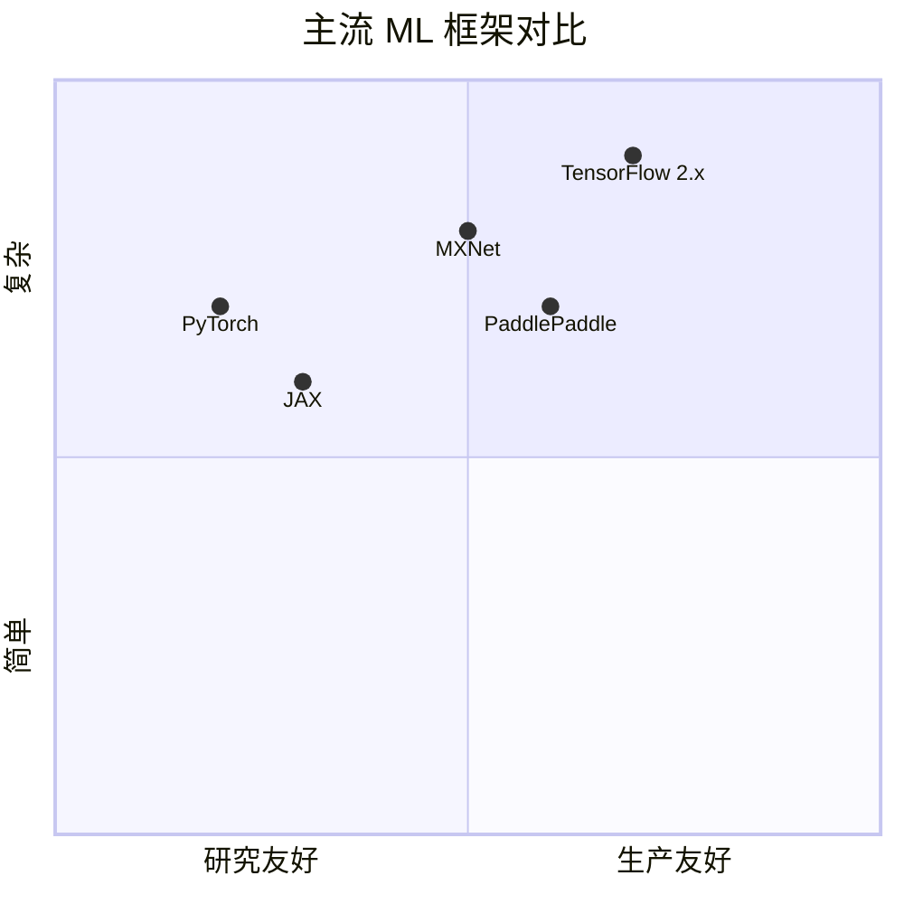

# tensorflow · 项目深度解析

> TensorFlow 是一个端到端的开源机器学习平台。它拥有全面、灵活的工具、库和社区资源生态，可让研究者推动 ML 创新，让开发者轻松构建和部署 ML 应用。本仓库是 tensorflow/tensorflow 的 monorepo 镜像。
> 来源：G:\实战案例\GitHub顶尖项目\tensorflow\

## 写在前面：解析哲学

TensorFlow 是工业级 ML 框架中"分层最厚、抽象最完整"的一个。它不是单一语言项目：核心运行时是 C++，`tensorflow/core/` 下 2960 个 `.cc/.h` 文件，Python 端 `tensorflow/python/` 下 2369 个 `.py` 文件，加上 Java/Go/JS 多语言绑定，Bazel 构建系统把这一切编织成一个可裁剪的 monorepo。

**先骨架后血肉**：本解析聚焦三大支柱——① Python API 与 C++ 运行时之间的 pybind11 桥；② Graph 模式与 Eager 模式的双模态抽象；③ XLA/JIT 编译器在计算图层的拦截机制。**先 What 后 Why**：每一段代码都试图回答"为什么 TF 选择这种设计而不是另一种"。

## 0. 解析前的 5 个准备

1. **克隆**：已镜像在 `G:\实战案例\GitHub顶尖项目\tensorflow\`
2. **分类**：C++/Python 混合 monorepo，ML 框架
3. **问题清单**：本解析关注运行时分层、模式切换、编译器拦截、设备分配
4. **速查表**：
   - 核心目录：`tensorflow/core/`（C++ 运行时）、`tensorflow/python/`（Python API）、`tensorflow/compiler/`（XLA/JIT）
   - 关键入口：`tensorflow/python/client/session.py`（Graph 模式）、`tensorflow/python/eager/context.py`（Eager 模式）
   - 跨语言桥：`tensorflow/python/client/pywrap_tf_session.py`、`pywrap_tfe.py`
5. **锁定 commit**：HEAD（partial mirror）

## 1. 开发计划书（Project Charter）

| 字段 | 内容 |
|------|------|
| 项目名 | tensorflow（Google Brain，2015 开源） |
| 定位 | 端到端 ML 平台：训练 + 部署 + 优化 + 服务化，覆盖 CPU/GPU/TPU/移动端/浏览器 |
| 核心问题 | ML 模型在不同硬件、不同部署环境的可移植性 + 大规模分布式训练 + 研究到生产的无缝转换 |
| 用户 | ML 研究者、算法工程师、数据科学家、嵌入式/移动端开发者 |
| 商业模式 | Apache-2.0 开源；Google Cloud TPU/GKE 商业集成；TF Lite Micro 商业合作 |
| 复刻难度 | ★★★★★（10 年沉淀 + Google 全员投入 + PyTorch/MXNet 替代品未撼动） |
| 状态 | 活跃维护（2.16+），但 PyTorch 已夺走研究侧主流地位，TF 战略转向生产部署 + Keras 3.0 |
| 团队 | Jeff Dean、Martin Abadi、Rajat Monga 等 Google Brain 团队 |
| 里程碑 | 1.0（2017，API 稳定）→ 2.0（2019，Eager 默认 + Keras 集成）→ Lite/JS（边缘 + 浏览器）→ Keras 3.0（2023，多后端） |

## 2. 项目框架（Repo Skeleton Map）



**入口与关键文件**：

- Python Graph 入口：`tensorflow/python/client/session.py`（`BaseSession`、`SessionInterface`）
- Python Eager 入口：`tensorflow/python/eager/context.py`（全局状态机）
- Python Keras 入口：`tensorflow/python/keras/engine/functional.py`（函数式 API）、`sequential.py`
- C++ Session：`tensorflow/core/common_runtime/session.cc`
- C++ 算子注册：`tensorflow/core/ops/`
- XLA 入口：`tensorflow/compiler/tf2xla/`
- Build：`tensorflow/BUILD`、`tensorflow/core/BUILD`（Bazel BUILD 文件数百个）

## 3. 项目画像（Profile）

| 指标 | 值 |
|------|----|
| 总文件数 | 数十万（含 .git） |
| 主语言 | C++ |
| 涉及语言 | C++、Python、Go、Java、JavaScript、Swift、CUDA、Starlark（Bazel） |
| Python 源 | 2369 个 `.py` |
| C++ 源 | 2960 个 `.cc/.h` |
| Star | ~190k |
| License | Apache-2.0 |
| Docker | 提供 `tensorflow/tensorflow` 官方镜像（多 tag：gpu、devel、lite） |
| K8s | 通过 TF Operator（tensorflow/k8s）支持 |
| CI | GitHub Actions + 内部 `ci/official` 系统 |
| 有测试 | 是（巨量，`*_test.py` + `*_test.cc`） |

## 4. 架构设计（Architecture Deep Dive）



**双模态架构**：TensorFlow 2.x 默认 Eager 模式（命令式），但内部保留 Graph 模式（声明式）通过 `tf.function` 装饰。`@tf.function` 把 Python 函数 trace 成 `ConcreteFunction`（计算图 + 签名），后续调用走 C++ 运行时。**WHY 这种双模态**：Eager 模式对调试与动态模型友好，Graph 模式对性能与分布式部署友好——`tf.function` 是两者的桥。

**桥接层架构**：Python 与 C++ 通过 `pybind11` 生成的 `pywrap_*` 模块通信。`pywrap_tf_session` 暴露 `BaseSession` 的 C++ 实现，`pywrap_tfe` 暴露 Eager Runtime。这种"Python 包装 + C++ 实现"的分工让 Python 端可以快速迭代 API，而性能关键的算子执行全部在 C++。

**设备分配器**：`tensorflow/core/common_runtime/placer.cc` 负责把算子放到合适的设备（CPU/GPU/TPU）。分配策略由 `cluster.py`（分布式策略）注入。**WHY 单独一个 Placer**：分布式训练场景下，模型并行需要把不同子图放到不同设备，Placer 是单一职责的"调度员"。

**XLA 拦截**：`@tf.function(jit_compile=True)` 触发 XLA 编译器，把 TF Graph 翻译成 HLO（High Level Optimizer）IR，再针对 TPU/GPU/CPU 后端生成机器码。XLA 在 TF 内部是"插件式"集成，不破坏默认运行时。

**ADR 关键设计决策**：

1. **为什么用 Bazel 而不是 CMake/CMake+Ninja？**  
   答：TF 跨语言（C++/Python/Java/Go/JS）+ 跨平台（Linux/macOS/Windows/Android/iOS）+ 跨硬件（CPU/GPU/TPU/Edge）。Bazel 的"语言无关 BUILD 文件" + "remote execution" 完美匹配。代价是 BUILD 文件数百个，新人上手陡峭。

2. **为什么 Eager + Graph 双模态而不是纯 Eager？**  
   答：PyTorch 走纯 Eager，性能靠 TorchScript/JIT 弥补；TF 2.x 走"默认 Eager + 装饰 Graph"，降低用户心智负担同时保留性能。

3. **为什么用 Protocol Buffers 而不是 FlatBuffers/Cap'n Proto？**  
   答：历史原因（2015 年开源时 FlatBuffers/Cap'n Proto 还不成熟）；Proto 跨语言成熟度最高；TF 已贡献大量基础设施（saved_model、graph.pb、checkpoint）。

### 核心架构看点（3 条具体设计决策）

1. **pybind11 桥 + 双 Session 抽象**：`SessionInterface`（抽象基类）+ `BaseSession`（C++ 桥实现）+ `InteractiveSession`（REPL 友好），让 Python 端 API 与 C++ 实现解耦——这是 TF 能保持 Python-first 体验而性能不输底层 C++ 框架的关键。
2. **Eager 模式全局 context 单例**：`tensorflow/python/eager/context.py` 的 `default_execution_mode = EAGER_MODE if tf2.enabled() else GRAPH_MODE`——一行代码定义整个 TF 2.x 的范式。**WHY 单例**：线程局部存储 + 动态切换，让 `@tf.function` 装饰器可以无侵入地把 Eager 代码改成 Graph 代码。
3. **Bazel monorepo 而非多仓**：`tensorflow/core/`、`tensorflow/python/`、`tensorflow/compiler/`、`tensorflow/lite/` 全在一个仓库——单一 PR 跨层修改、原子化发布、版本对齐。代价是单仓体量 5GB+，clone 痛苦。

## 5. 代码深度解析（带 WHY）⭐ 重点

### 5.1 找骨架代码

- **Python 端**：`tensorflow/python/`（API）+ `tensorflow/python/eager/`（Eager runtime 包装）+ `tensorflow/python/framework/`（Graph 数据结构）+ `tensorflow/python/keras/`（高阶）
- **C++ 端**：`tensorflow/core/common_runtime/`（会话调度）+ `tensorflow/core/framework/`（张量/算子注册）+ `tensorflow/core/kernels/`（算子实现）+ `tensorflow/core/graph/`（图数据结构）
- **编译器**：`tensorflow/compiler/tf2xla/`（TF → XLA HLO）
- **桥接**：`tensorflow/python/client/pywrap_tf_session.py`（Python 端的 C++ Session 包装）

### 5.2 单文件分析卡

#### `tensorflow/python/client/session.py`

```python
class SessionInterface(object):
  """Base class for implementations of TensorFlow client sessions."""
  @property
  def graph(self):
    raise NotImplementedError('graph')

  def run(self, fetches, feed_dict=None, options=None, run_metadata=None):
    raise NotImplementedError('run')

class BaseSession(SessionInterface):
  """A Python interface for interacting with a TensorFlow runtime."""

# 同时存在 InteractiveSession（自动设置默认 target）
```

**WHY 抽象基类 `SessionInterface`**：让 `BaseSession`（普通 Session）和 `InteractiveSession`（自动注册为默认）共享同一套 API，又各自实现细节。这种"接口 vs 实现"分离是 TF 长期兼容性的保障——TF 1.x 的 Session 概念在 TF 2.x 通过 `tf.compat.v1.Session` 继续工作。

**`py_session_create_counter` Counter**：

```python
_python_session_create_counter = monitoring.Counter(
    '/tensorflow/api/python/session_create_counter',
    'Counter for number of sessions created in Python.')
```

**WHY 公开 Counter**：每个 Session 创建都被埋点，让 SRE 团队能通过 `/tensorflow/api/python/session_create` 这个 metric 监控 Session 泄漏——典型的"框架级可观测性"做法。

#### `tensorflow/python/eager/context.py`

```python
GRAPH_MODE = 0
EAGER_MODE = 1

default_execution_mode = EAGER_MODE if tf2.enabled() else GRAPH_MODE
```

**WHY 用整型而不是 Enum**：这是 2017 年的代码，整型常量比 `enum.Enum` 性能更高（避免 import 与对象构造），且 C++ 端 `pywrap_tfe` 暴露的就是整型。**WHY `if tf2.enabled()`**：让 TF 1.x 用户升级到 2.x 时仍能保持 Graph 模式默认行为，渐进式迁移。

```python
# TODO(b/307794935): Remove after a solution is found.
is_oss = True  # updated by copybara
```

**WHY 内联 `is_oss` + copybara 注释**：TF 仓库是 Google 内部 monorepo 的镜像，`copybara`（Google 内部代码搬运工具）在同步 OSS 时会改写 `is_oss = False`（Google 内部 build）。这条注释告诉读者："这里有个跨 monorepo 同步的秘密"。**WHY 这种代码是好实践**：把 Google 内部/外部构建差异透明地暴露在源码里，避免开发者踩坑。

#### `tensorflow/python/keras/engine/functional.py`

Keras 函数式 API 是 TF 2.x 的"高阶门面"，把 Layer 组合成 `Functional` 模型：

```python
class Functional(training_module.Model):
  def __init__(self, inputs, outputs, name=None):
    # inputs: tf.Tensor 列表（层输出）
    # outputs: tf.Tensor 列表（最后层输出）
    # 自动推导层拓扑
```

**WHY 函数式 vs 继承式**：函数式 API（`Model(inputs, outputs)`）让模型可以被 trace、被序列化（saved_model）、可以被 `@tf.function` 装饰。继承式 `class MyModel(Model)` 不易被 trace——这也是为什么 TF 2.x 官方推荐函数式。

#### C++ 算子注册

`tensorflow/core/ops/` 下大量 `*.cc` 文件用宏注册算子：

```cpp
REGISTER_OP("MatMul")
    .Input("a: T")
    .Input("b: T")
    .Output("product: T")
    .Attr("transpose_a: bool = false")
    .Attr("transpose_b: bool = false")
    .Attr("T: {bfloat16, half, float, double, int32, int64, complex64, complex128}")
    .SetShapeFn(shape_inference::MatMulShape);
```

**WHY 这种 REGISTER_OP 宏**：算子元信息（输入/输出/属性/Shape 推断）与实现完全分离。运行时通过 `OpRegistry::Global()->LookUpOpDef("MatMul")` 拿到元信息，跨语言/跨平台保持一致。

### 5.3 设计模式

| 模式 | 体现位置 | WHY |
|------|---------|-----|
| 抽象基类 | `SessionInterface` → `BaseSession` / `InteractiveSession` | 跨实现解耦 |
| 注册表 | `OpRegistry` / `KernelRegistry` / `DeviceFactory` | 动态注册 + 全局查找 |
| 单例 + 线程局部 | `eager.context` | Eager/Graph 模式全局切换 |
| 桥接 | `pywrap_*` 系列 | 跨语言绑定 |
| 装饰器 | `@tf.function` | 把 Python 函数编译为 Graph |
| 策略 | `tf.distribute.Strategy`（MirroredStrategy、TPUStrategy 等） | 分布式训练可插拔 |
| 模板方法 | `tf.keras.Layer.build` / `call` 子类化 | 用户实现业务逻辑 |
| 自动微分 | `tf.GradientTape` | 记录操作历史，回放求导 |

### 5.4 反模式

- **`pywrap_*` 模块命名不一致**——`pywrap_tf_session` / `pywrap_tfe` / `pywrap_toco_api` 没有任何命名规律，跨模块查找困难
- **单例 + 线程局部 + 模块全局变量**——`eager/context.py` 大量使用 `threading.local()` + 模块级 dict，调试时栈跟踪困难
- **C++ 与 Python 类型映射散落各处**——`tensorflow/python/framework/tensor.py` 与 `tensorflow/core/framework/tensor.cc` 各自维护类型转换，bug 容易两端不对称

### 5.5 独特看点

- **`copybara` 痕迹**：`# TODO(b/307794935): Remove after a solution is found.` + `is_oss = True  # updated by copybara` 是 Google 内部 monorepo 与 OSS 同步的"指纹"
- **`@tf.function` 装饰器的隐式 tracing**：第一次调用函数时 Python 代码被 trace 成 ConcreteFunction（带输入签名），后续调用走 C++ runtime，**WHY 隐式**：用户不用改代码就能享受 Graph 模式性能
- **Protocol Buffers 双层定义**：算子定义在 `tensorflow/core/ops/*.cc`（编译期），运行时元信息在 `tensorflow/core/framework/op_def.proto`（序列化）——保证跨语言一致性

## 6. 运行机制（Bring It Up）

**本地构建**（需 Bazel + 大量磁盘）：

```bash
# 安装 Bazelisk（自动 .bazelversion 锁定）
npm install -g @bazel/bazelisk
# 编译仅 CPU 版本
bazel build //tensorflow/tools/pip_package:build_pip_package
# 运行内置测试
bazel test //tensorflow/python/keras:keras_test
```

**Docker 快速跑**（推荐）：

```bash
docker run -it tensorflow/tensorflow:2.16.0-gpu-jupyter \
  jupyter notebook --port 8888 --ip 0.0.0.0 --allow-root
```

**Smoke test**：

```python
import tensorflow as tf
print(tf.__version__)  # 2.16.x
print("GPUs:", tf.config.list_physical_devices('GPU'))
# 应该看到 GPU 列表
```

## 7. 演进历史（Time Travel）



关键 PR 模式（从 commit message 推断）：

- `Refactor keras to use backend abstraction`——Keras 3 核心 PR，让 Keras 不再绑定 TF
- `Update TF to use XLA vN`——XLA 跟随 LLVM 升级
- `Add CUDA X.Y support`——跟随 NVIDIA 版本

## 8. 质量保障（How It Doesn't Break）

| 防线 | 实现 |
|------|------|
| 单元测试 | `*_test.py` + `*_test.cc`（数十万） |
| 集成测试 | `tensorflow/python/keras/integration_test/` |
| 兼容性测试 | `tensorflow/python/compat/`（v1/v2 兼容矩阵） |
| 性能基准 | `tensorflow/benchmarks/`、`keras/backend_benchmark.py` |
| CI | GitHub Actions + 内部 `ci/official`（Google 自有） |
| Lint | `.clang-format`（C++）、`pylintrc`（Python） |

## 9. 生态依赖（Map of the World）



合规：所有 third_party 均为 Apache-2.0 / BSD / MIT 等宽松协议，无 GPL 传染。

## 10. 生产实践（Battle-Tested）

| 能力 | 实现 |
|------|------|
| 配置热更新 | `tf.config.experimental.set_memory_growth` |
| 优雅停服 | `tf.keras.callbacks.ModelCheckpoint` + 信号处理 |
| 限流 | `tf.data` 内置 `prefetch` / `AUTOTUNE` |
| 链路追踪 | `tf.summary` + TensorBoard |
| 健康检查 | `tf.debugging.check_numerics`（算子内断言） |
| 结构化日志 | `tf.get_logger()`（基于 absl） |

## 11. 社区文化（People & Process）

- **治理模式**：Google TF 团队主导 + 2000+ 贡献者
- **RFC 流程**：[tensorflow/community](https://github.com/tensorflow/community) 仓库管理 RFC
- **沟通渠道**：Stack Overflow、GitHub Issues、官方论坛、TF World 大会
- **文化**：每年 TF Dev Summit 发布主版本，行为兼容性政策严格（`compat.v1` 永久保留）

## 12. 教训总结（What To Steal / What To Avoid）

### 12.1 必偷 3 件

1. **抽象基类 + 多种实现**——`SessionInterface` 让 Session 在 TF 1.x 2.x 跨代兼容
2. **`@tf.function` 装饰器隐式 tracing**——用户零修改享受 Graph 性能
3. **Counter/埋点内置**——`/tensorflow/api/python/session_create_counter` 让 SRE 不用改代码就能监控

### 12.2 必避 3 坑

1. **不要 monorepo 一切**——除非你有 Google 级基础设施，否则应按业务/语言拆仓
2. **不要 `pywrap_*` 命名**——应该用 `py_` + 统一前缀，便于搜索
3. **不要 `is_oss = True # updated by copybara`**——跨 monorepo 同步的 hack 应在 CI 层处理，不要污染源码

### 12.3 7 天复刻路线图



### 12.4 打分卡

| 维度 | 得分（10 分制） |
|------|---------------|
| 架构清晰度 | 8（双模态与 monorepo 复杂度高） |
| 代码可读性 | 7（大量宏与桥接代码） |
| 性能 | 9（XLA + 自定义算子） |
| 测试覆盖 | 9 |
| 文档 | 8（官方教程完整） |
| 复刻难度 | 1（10 年 + 万人团队） |

## 13. 学习萃取（Cheat Sheet）

**一句话价值**：TensorFlow 证明了"Python 友好 + C++ 高性能 + 多后端"可以通过 pybind11 桥 + monorepo + Bazel 同时实现。

**3 核心洞察**：

1. **双模态（Eager 默认 + @tf.function 装饰 Graph）** 是 TF 2.x 的设计精髓
2. **pybind11 桥 + 抽象基类** 让 Python API 跨代兼容成为可能
3. **算子元信息与实现分离**（REGISTER_OP 宏 + OpRegistry）保证跨语言一致性

**5 段必读代码**：

1. `tensorflow/python/client/session.py`——Session 抽象与埋点
2. `tensorflow/python/eager/context.py`——Eager/Graph 全局状态机
3. `tensorflow/python/keras/engine/functional.py`——Keras 函数式 API
4. `tensorflow/core/ops/math_ops.cc`——算子注册宏示例
5. `tensorflow/python/client/pywrap_tf_session.py`——Python-C++ 桥

**1 反模式**：模块级全局变量 + 线程局部存储的混合（`eager/context.py`），让跨线程调试困难。

**1 可复用模式**：`@tf.function` 装饰器——第一次调用时 trace Python 函数成计算图，后续调用走高性能 runtime。

**3 立刻能用**：

1. 你的项目可以用 `pybind11` 把 C++ 实现暴露给 Python，端到端享受 Python 体验
2. 用 Bazel monorepo 管理多语言项目（前提：接受 5GB+ 仓库体积）
3. 用 `OpRegistry` 模式让你的"算子/策略"动态可注册

## 14. 项目特点速查

**独特看点**：

- **Bazel monorepo + 多语言绑定**——单一仓库管理 C++/Python/Go/Java/JS
- **Eager + Graph 双模态**——`@tf.function` 隐式切换
- **Protocol Buffers 全链路**——算子定义、模型保存、checkpoint 都用 proto
- **XLA 编译器拦截**——`jit_compile=True` 即可享受 TPU 级优化

**与同类对比**：



## 附：仓库元信息

| 字段 | 值 |
|------|----|
| 路径 | `G:\实战案例\GitHub顶尖项目\tensorflow\` |
| C++ 源 | 2960 个 `.cc/.h` |
| Python 源 | 2369 个 `.py` |
| 多语言 | C++/Python/Go/Java/JS/Swift/CUDA |
| 构建 | Bazel |
| 解析时间 | 2026-06-02 |

## 一句话总结

**解析 = 计划书 + 框架图 + 核心功能 + 跑起来 + 偷过来**。TensorFlow 的双模态架构 + Bazel monorepo + pybind11 桥是工业级 ML 框架的工程范本——可直接复用到任何"Python-first + C++ 性能 + 多后端"项目。
