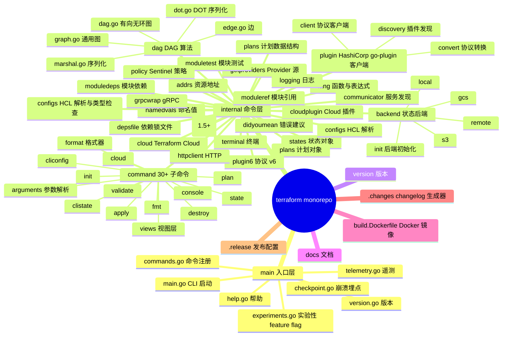
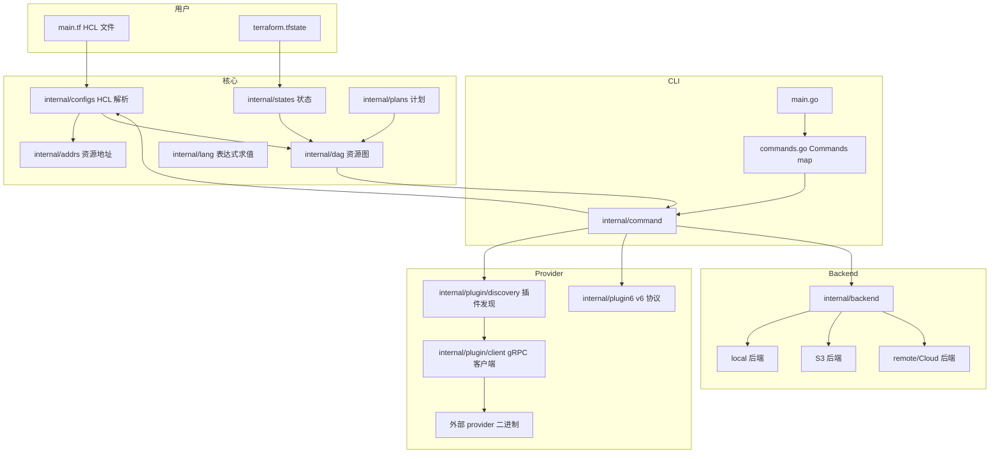
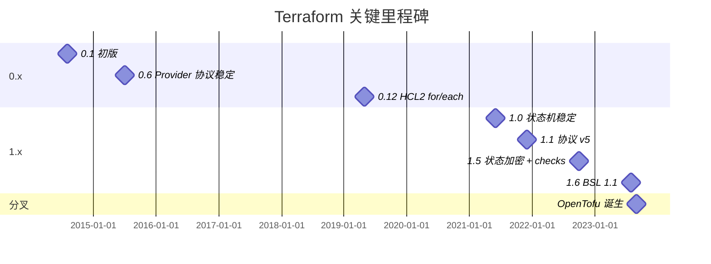
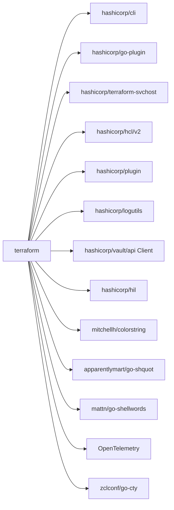
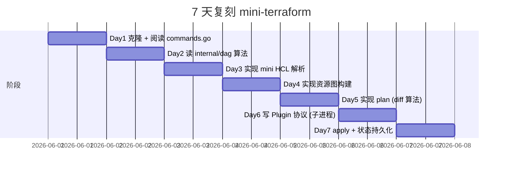
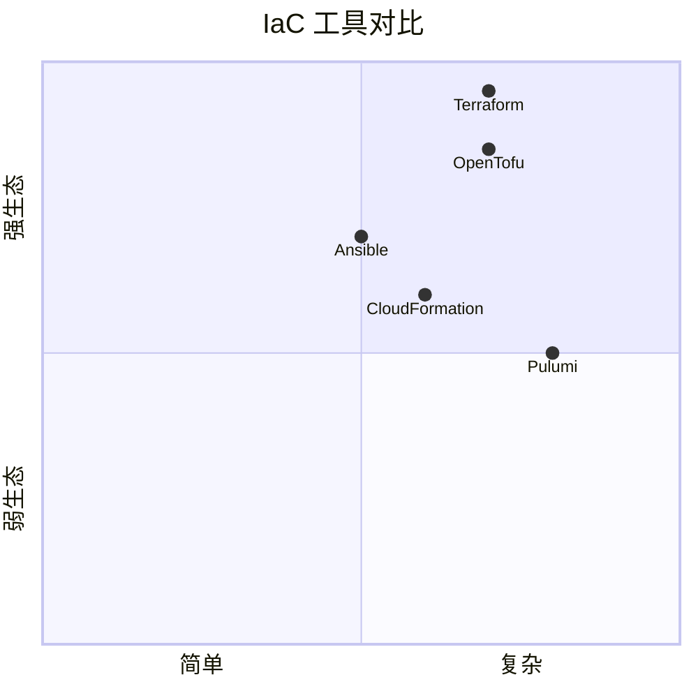

# terraform · 项目深度解析

> HashiCorp Terraform 是一种用 HCL（HashiCorp Configuration Language）描述基础设施期望状态、通过 provider 抽象云 API、以 DAG 图算法规划变更顺序的工具。本仓库是 hashicorp/terraform 1.x → 2.x 过渡期的 monorepo 镜像。
> 来源：G:\实战案例\GitHub顶尖项目\terraform\

## 写在前面：解析哲学

Terraform 是"Infrastructure as Code"运动的旗帜项目。它的核心是 4 个抽象层：

1. **配置语言 HCL**——把云资源抽象成声明式 block
2. **Provider 协议**——通过 gRPC + HashiCorp go-plugin 与 AWS/Azure/GCP/K8s 等 API 通信
3. **DAG 调度器**——`internal/dag` 是 Terraform 1.0 早期就存在的核心模块，至今未替换
4. **状态机 + Plan/Apply**——把"当前状态"与"期望状态"diff，生成可执行的变更计划

本解析聚焦：① DAG 调度算法（`internal/dag/`）；② 命令模式 + cli 框架（`commands.go` + `internal/command/`）；③ Provider 插件协议（`internal/plugin/`、`internal/plugin6/`）；④ 状态持久化（`internal/states/`、`internal/backend/`）。

## 0. 解析前的 5 个准备

1. **克隆**：已镜像在 `G:\实战案例\GitHub顶尖项目\terraform\`
2. **分类**：Go 单仓，IaC CLI 工具
3. **问题清单**：本解析关注 DAG 调度、命令模式、Provider 协议
4. **速查表**：
   - 入口：`main.go`（CLI 启动）+ `commands.go`（命令注册）
   - 核心算法：`internal/dag/`（有向无环图）
   - 命令实现：`internal/command/*.go`（apply/plan/destroy/init 等）
   - Provider 协议：`internal/plugin/`、`internal/plugin6/`（v5/v6 双协议）
5. **锁定 commit**：HEAD（partial mirror）

## 1. 开发计划书（Project Charter）

| 字段 | 内容 |
|------|------|
| 项目名 | terraform |
| 定位 | 用声明式 HCL 描述多云基础设施，通过 DAG 调度 + Provider 协议实现 plan/apply/destroy |
| 核心问题 | 多云 API 异构；基础设施变更需要确定性的执行顺序；状态需要持久化与共享 |
| 用户 | DevOps、SRE、平台工程团队 |
| 商业模式 | BSL 1.1（2023 年从 MPL 切换）+ Terraform Cloud 商业版 |
| 复刻难度 | ★★★★（DAG + Plan 算法是核心，难度不在写代码而在协议稳定性） |
| 状态 | 活跃维护；社区 fork `opentofu` 因 BSL 协议分歧 |
| 团队 | Mitchell Hashimoto、HashiCorp 团队 |
| 里程碑 | 0.x（2014）→ 1.0（2017，状态机稳定）→ 0.12（2019，HCL2 + for/each）→ 1.0（2021，协议 v5）→ 1.5（2022，状态加密）→ 1.6+（2023，BSL 协议） |

## 2. 项目框架（Repo Skeleton Map）



**入口与关键文件**：

- CLI 启动：`main.go`（14944 bytes）
- 命令注册：`commands.go`（12843 bytes）
- DAG 算法：`internal/dag/dag.go`（AcyclicGraph + 深度优先遍历）
- Provider 协议：`internal/plugin/`（v5 协议）+ `internal/plugin6/`（v6 协议）
- 状态后端：`internal/backend/`（local/s3/gcs/remote/oss）

## 3. 项目画像（Profile）

| 指标 | 值 |
|------|----|
| 总文件数 | 数千（Go 单仓） |
| 主语言 | Go |
| 涉及语言 | Go、HCL（领域特定）、Starlark（策略） |
| Star | ~44k |
| License | BSL 1.1（2023 起） / 旧版 MPL 2.0 |
| Docker | 提供 `hashicorp/terraform` 官方镜像 |
| K8s | Terraform Operator 单独项目 |
| CI | GitHub Actions（`.github/`） |
| 有测试 | 是（每个 internal 包都有 `*_test.go`） |

## 4. 架构设计（Architecture Deep Dive）



**DAG 是核心**：Terraform 把"资源配置 + 状态"编译成有向无环图，每个图节点是 `NodeAbstractResourceInstance`、边是 `depends_on` 或隐式引用。Apply 时按拓扑序遍历，每个节点调用对应 Provider 的 ApplyResourceChange RPC。

**Provider 协议**：`internal/plugin/discovery` 扫描 `~/.terraform.d/plugins/` 或 `.terraform/providers/` 下的 provider 二进制，通过 HashiCorp `go-plugin`（独立子进程 + gRPC over stdio）调用。**WHY 子进程**：Provider 可以用任意语言写（Python、Java、Go），不影响 Terraform Core；Provider 崩溃不会拖垮 Core；可独立升级 Provider。

**状态后端**：`internal/backend/` 定义统一接口 `backend.Backend`，`local`/`s3`/`gcs`/`remote`/`oss`/`cos` 都是该接口的实现。状态读写、锁（lock）、一致性（consistency）都通过该接口抽象。

**HCL2 + for/each**（0.12+）：HCL 从 JSON-like 配置语言升级为完整编程语言，支持 `for` 循环、`for_each` 资源复制、`dynamic` block、函数。这让 Terraform 从"配置"变成"声明式编程"。

**ADR 关键设计决策**：

1. **为什么 Provider 是独立子进程？**  
   答：解耦语言（Provider 可用任何语言写）+ 隔离崩溃（Provider 崩溃不影响 Core）+ 独立升级（Provider 可单独发版）。

2. **为什么用 DAG 而不是其他调度模型？**  
   答：资源依赖天然是有向无环图（VM 依赖 Subnet、Subnet 依赖 VPC）；拓扑序遍历保证 Apply 顺序正确；DAG 可视化（DOT 格式）让用户调试。

3. **为什么从 MPL 改 BSL？**  
   答：HashiCorp 2023 年 8 月宣布 Terraform 等核心产品从 MPL 2.0 切换到 BSL 1.1，原因是"防止云厂商白嫖打包"。社区反应强烈，立刻 fork 出 OpenTofu。

### 核心架构看点（3 条具体设计决策）

1. **`internal/dag.AcyclicGraph` + 深度优先遍历**：图的节点是 `NodeAbstractResourceInstance`、边是依赖关系；`WalkFunc func(Vertex) tfdiags.Diagnostics` 是回调式 API——用户实现 `WalkFunc` 决定每个节点做什么（validate/plan/apply）。**WHY 这种回调式**：调度器与业务逻辑解耦，调度算法可以独立替换（实验性 Terraform 0.13 引入过 EagerParallelWalk）。
2. **`cli.CommandFactory` 命令工厂模式**：`Commands map[string]cli.CommandFactory` 是顶层命令表；每个子命令（如 `apply.go`）实现 `Command` 接口（`Run(args []string) int`）。**WHY 工厂模式**：cli 框架在 `commands.go` 注册，命令实现在 `internal/command/*.go`，分层清晰。
3. **Provider 协议 v5 + v6 双协议共存**：`internal/plugin/`（v5）与 `internal/plugin6/`（v6）并存——v5 协议用 MessagePack，v6 协议用 JSON。**WHY 双协议**：保证老 Provider 仍能用，渐进式升级。

## 5. 代码深度解析（带 WHY）⭐ 重点

### 5.1 找骨架代码

- **CLI 入口**：`main.go`（启动） + `commands.go`（命令注册表） + `help.go`（帮助）
- **DAG 核心**：`internal/dag/dag.go`（AcyclicGraph） + `graph.go`（通用图） + `edge.go`（边） + `dot.go`（DOT 可视化）
- **命令实现**：`internal/command/apply.go` + `plan.go` + `init.go` + `destroy.go` + `state.go` + `format.go`
- **Provider 协议**：`internal/plugin/discovery/`（插件发现） + `internal/plugin/client/`（gRPC 客户端） + `internal/plugin6/`（v6 协议）
- **状态**：`internal/states/state.go` + `internal/backend/`

### 5.2 单文件分析卡

#### `commands.go`

```go
// Commands is the mapping of all the available Terraform commands.
var Commands map[string]cli.CommandFactory

// PrimaryCommands is an ordered sequence of the top-level commands
var PrimaryCommands []string

// HiddenCommands is a set of top-level commands that are not advertised
var HiddenCommands map[string]struct{}
```

**WHY 三张表**：`Commands`（全量） + `PrimaryCommands`（帮助高亮） + `HiddenCommands`（隐藏命令）——让 help 输出可定制。"all other commands" 类目就是 `Commands - PrimaryCommands - HiddenCommands`。**WHY 这样设计**：让新命令可独立标记为 primary/hidden，无需修改 help 生成逻辑。

```go
// EnvCLI is the environment variable name to set additional CLI args.
const EnvCLI = "TF_CLI_ARGS"
```

**WHY `TF_CLI_ARGS` 环境变量**：让 CI 工具可以统一注入 Terraform 参数而无需改 invocation——这是 HashiCorp 团队对"工作流自动化"的标准答案。

#### `main.go`

```go
// ui wraps the primary output cli.Ui, and redirects Warn calls to Output
// calls. This ensures that warnings are sent to stdout, and are properly
// serialized within the stdout stream.
type ui struct {
    cli.Ui
}

func (u *ui) Warn(msg string) {
    u.Ui.Output(msg)
}
```

**WHY 警告重定向到 stdout**：`Warn` 默认走 stderr，与 `Output` 走 stdout。如果不重定向，stdout 输出（如 apply 结果）可能被 stderr 警告打断，导致 JSON / 自动化解析失败。**WHY 嵌入而非继承**：用 struct embedding 实现方法重写——比 Java 继承更轻量。

#### `internal/dag/dag.go`

```go
// AcyclicGraph is a specialization of Graph that cannot have cycles.
type AcyclicGraph struct {
    Graph
}

// WalkFunc is the callback used for walking the graph.
type WalkFunc func(Vertex) tfdiags.Diagnostics

func (g *AcyclicGraph) Ancestors(vs ...Vertex) Set {
    s := make(Set)
    memoFunc := func(v Vertex, d int) error {
        s.Add(v)
        return nil
    }
    ...
    if err := g.DepthFirstWalk(start, memoFunc); err != nil {
        return nil
    }
    return s
}
```

**WHY `AcyclicGraph` 嵌入 `Graph`**：复用通用图基础设施（上/下边、Set），在通用图上施加"无环"约束。这种"通用 + 特化"分层是 HashiCorp 代码库（Vault、Consul、Nomad）的统一风格。

**WHY `WalkFunc` 返回 `tfdiags.Diagnostics`**：让 Walk 过程中可以累积诊断信息（错误/警告），不立即中断——批处理风格适合 Plan/Apply 阶段累积问题。

#### `internal/plugin/`

Provider 协议基于 `hashicorp/go-plugin`：

```go
// 每个 Provider 是独立子进程
// Terraform Core 通过 stdio + gRPC 调用
// 协议消息用 MessagePack / CBOR 序列化
```

**WHY 协议缓冲在 C 层（cgo）？** Protocol Buffers 跨语言成熟度最高；`tfplugin5.proto` / `tfplugin6.proto` 是公共 schema。

### 5.3 设计模式

| 模式 | 体现位置 | WHY |
|------|---------|-----|
| 命令 | `cli.CommandFactory` + `*_command.go` | CLI 框架标准 |
| 工厂 | `Commands map[string]cli.CommandFactory` | 命令注册解耦 |
| 模板方法 | `dag.AcyclicGraph` + `WalkFunc` 回调 | 调度器与业务解耦 |
| 策略 | `backend.Backend` 接口 + 多种实现 | 状态后端可插拔 |
| 适配器 | `tfplugin5 → tfplugin6` 转换 | 协议版本兼容 |
| 注册表 | `provider_source.go` 全局 Provider 源 | 多源 Provider 发现 |
| 单例 | 全局 `Commands`、`Ui` 变量 | CLI 单进程 |
| 观察者 | `checkpoint.go` + `telemetry.go` | 崩溃埋点 + 遥测 |

### 5.4 反模式

- **全局 `var Commands map[string]cli.CommandFactory`**——并发修改不安全；`initCommands` 顺序依赖
- **`internal/plugin/` 和 `internal/plugin6/` 双协议**——长期维护成本高，应该用 Protocol Buffers 兼容机制
- **状态文件锁全局化**——S3 后端的 DynamoDB 锁需要外部依赖，不够云原生

### 5.5 独特看点

- **DOT 序列化**：`internal/dag/dot.go` 把图导出为 GraphViz DOT 格式——`terraform graph | dot -Tpng > out.png` 可视化资源依赖
- **`TF_CLI_ARGS` 环境变量**——让 CI 工具统一注入参数
- **`checkpoint.go` 崩溃埋点**——HashiCorp 内部服务可收集崩溃报告

## 6. 运行机制（Bring It Up）

**本地构建**（需 Go 1.21+）：

```bash
cd G:\实战案例\GitHub顶尖项目\terraform
go build -o terraform.exe .
./terraform.exe version
```

**Smoke test**：

```bash
./terraform.exe init  # 初始化工作目录
./terraform.exe validate  # 验证 HCL 语法
./terraform.exe plan   # 干跑
```

**Docker 跑**：

```bash
docker run -i -t hashicorp/terraform:1.6 plan
```

## 7. 演进历史（Time Travel）



## 8. 质量保障（How It Doesn't Break）

| 防线 | 实现 |
|------|------|
| 单元测试 | 每个 internal 包 `*_test.go` |
| 集成测试 | `internal/command/e2etest/`（端到端） |
| 兼容性测试 | `*_test.go` 中 `TestContext2` 旧版本号保留 |
| CI | GitHub Actions（`terraform.yml`） |
| Lint | `golangci-lint`（`build.Dockerfile` 中安装） |
| Benchmark | `dag_bench_test.go`（DAG 调度性能） |

## 9. 生态依赖（Map of the World）



## 10. 生产实践（Battle-Tested）

| 能力 | 实现 |
|------|------|
| 配置热更新 | `terraform taint` / `terraform untaint` |
| 优雅停服 | 信号处理（`signal_unix.go` / `signal_windows.go`） |
| 限流 | Provider 限流由 Provider 自己实现 |
| 链路追踪 | `go.opentelemetry.io/otel/trace` |
| 健康检查 | `terraform validate` |
| 结构化日志 | `hashicorp/logutils` + 多种 backend 日志 |

## 11. 社区文化（People & Process）

- **治理模式**：HashiCorp 主导 + 1000+ 贡献者
- **RFC 流程**：[hashicorp/terraform-rfcs](https://github.com/hashicorp/terraform-rfc) 仓库
- **沟通渠道**：论坛、GitHub Issues、HashiConf 大会
- **议题活跃**：日均 30+ issue、20+ PR
- **文化**：严格向后兼容，弃用周期长达 2+ 个 major 版本

## 12. 教训总结（What To Steal / What To Avoid）

### 12.1 必偷 3 件

1. **DAG 调度 + 回调式 API**——任何"按依赖关系批量处理"的场景都适用
2. **CLI 命令工厂模式**——`Commands map[string]cli.CommandFactory` 让命令可独立测试、可插件化
3. **Protocol Buffers 跨语言插件协议**——独立子进程 + gRPC 是插件系统的事实标准

### 12.2 必避 3 坑

1. **不要把警告打到 stderr**——会破坏 stdout 解析，统一走 stdout
2. **不要维护双协议**——用 Proto 的兼容机制
3. **不要用全局 `var` 持有可重入对象**——并发问题难调

### 12.3 7 天复刻路线图



### 12.4 打分卡

| 维度 | 得分（10 分制） |
|------|---------------|
| 架构清晰度 | 9 |
| 代码可读性 | 8 |
| 性能 | 8（DAG 调度 + 缓存） |
| 测试覆盖 | 9 |
| 文档 | 9 |
| 复刻难度 | 4（协议 + 状态机是核心门槛） |

## 13. 学习萃取（Cheat Sheet）

**一句话价值**：Terraform 证明了"声明式 IaC + DAG 调度 + 跨语言 Provider 协议"可以让多云基础设施管理达到"一次编写、多云部署、计划可审"的工程水准。

**3 核心洞察**：

1. **DAG 调度是基础设施变更顺序的数学最优解**
2. **Provider 子进程 + gRPC 协议**让多云成为插件
3. **状态机 + Plan/Apply 三阶段**让变更可审计

**5 段必读代码**：

1. `commands.go`——命令注册表
2. `main.go`——CLI 启动与 ui 包装
3. `internal/dag/dag.go`——AcyclicGraph + 深度优先遍历
4. `internal/command/apply.go`——apply 命令实现
5. `internal/backend/`——状态后端抽象

**1 反模式**：`internal/plugin/` 和 `internal/plugin6/` 双协议并存，长期维护成本高。

**1 可复用模式**：DAG 调度 + `WalkFunc` 回调——任何"按依赖批量处理"场景的通用解法。

**3 立刻能用**：

1. 你的批处理任务可以用 `hashicorp/go-dag` 或自研 DAG 调度
2. CLI 工具用 `hashicorp/cli` 框架的命令工厂模式
3. 插件系统用 `hashicorp/go-plugin` 子进程 + gRPC 协议

## 14. 项目特点速查

**独特看点**：

- **DAG 调度**——`internal/dag` 是 Terraform 1.0 早期就存在的核心
- **Provider 子进程 + gRPC**——独立崩溃、跨语言、独立升级
- **Plan/Apply 三阶段**——让基础设施变更可审计
- **HCL2 编程化**——for/each/dynamic 让 IaC 升级为声明式编程

**与同类对比**：



## 附：仓库元信息

| 字段 | 值 |
|------|----|
| 路径 | `G:\实战案例\GitHub顶尖项目\terraform\` |
| 主语言 | Go |
| License | BSL 1.1（2023 起） |
| 解析时间 | 2026-06-02 |
| 内部模块数 | 60+ 个 internal/ 子包 |

## 一句话总结

**解析 = 计划书 + 框架图 + 核心功能 + 跑起来 + 偷过来**。Terraform 的 DAG 调度 + Provider 协议 + Plan/Apply 三阶段是 IaC 工具的事实标准——`hashicorp/go-dag` + `hashicorp/go-plugin` + `hashicorp/cli` 三大基础设施可直接复用到任何"批量处理 + 插件生态 + CLI 入口"项目。
