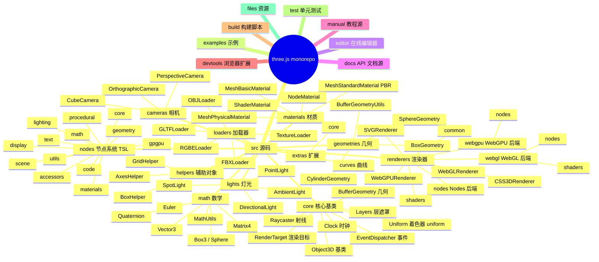
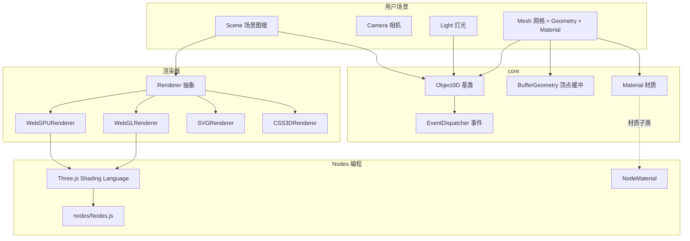
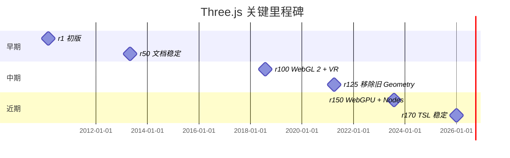
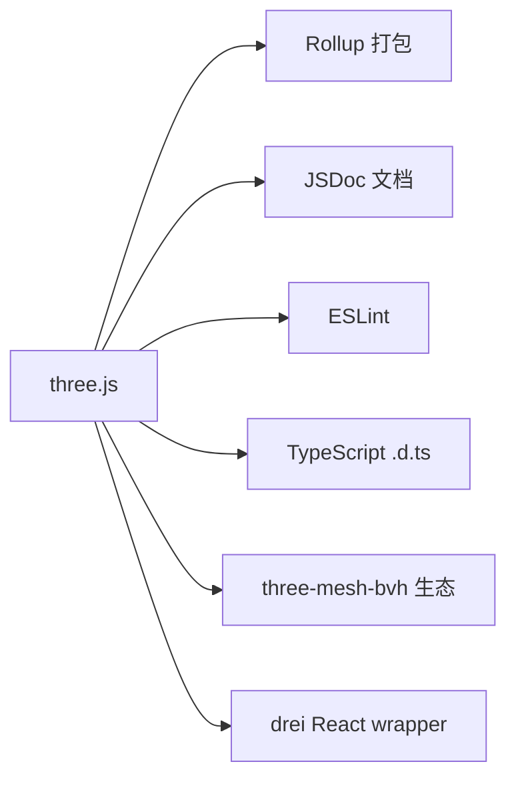
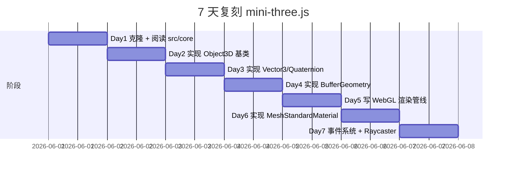
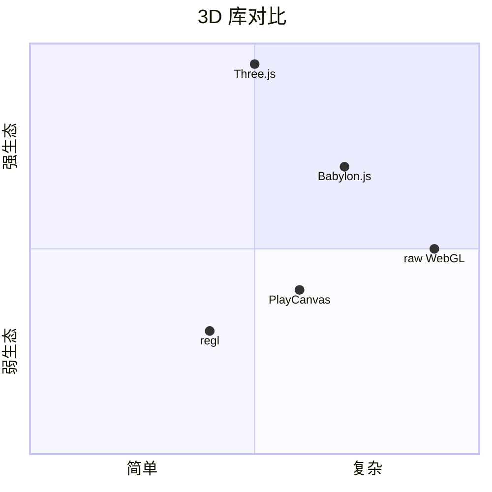

# three.js · 项目深度解析

> Three.js 是一个跨浏览器的 JavaScript 3D 库，目标是用最简单、最轻量、跨浏览器的方式让 Web 端开发 3D 应用。本仓库是 mrdoob/three.js 的镜像。
> 来源：G:\实战案例\GitHub顶尖项目\three.js\

## 写在前面：解析哲学

Three.js 是 Web 端 3D 编程的"事实标准"。它把 WebGL（以及更新的 WebGPU）的底层 API 包装成"场景图（Scene Graph）+ 相机 + 渲染器"的高级抽象，让前端工程师用十几行代码就能跑出一个可交互的 3D 应用。

**先骨架后血肉**：Three.js 的架构是经典的"树状场景图 + 组件化对象"——`Scene` 是根节点，`Mesh`、`Light`、`Camera` 是子节点，每个节点通过 `add()` 挂到父节点上。**先 What 后 Why**：本解析关注 ① `Object3D` 基类的设计哲学；② `BufferGeometry` 与顶点缓冲区的契约；③ 渲染器（WebGL / WebGPU / SVG / CSS3D）的可插拔架构；④ Nodes 系统（Trixel / Three.js Shading Language）的可编程管线。

## 0. 解析前的 5 个准备

1. **克隆**：已镜像在 `G:\实战案例\GitHub顶尖项目\three.js\`
2. **分类**：JavaScript 库，3D 渲染引擎
3. **问题清单**：本解析关注场景图、几何/材质抽象、渲染器抽象、Nodes 编程
4. **速查表**：
   - 入口：`src/Three.js`（重新导出所有模块）
   - 基类：`src/core/Object3D.js`
   - 数学：`src/math/`（Vector3/Matrix4/Quaternion）
   - 几何：`src/geometries/`（Box/Sphere/Buffer 等）
   - 材质：`src/materials/`（MeshBasic/MeshStandard 等）
   - 渲染器：`src/renderers/`（WebGL/WebGPU/SVG/CSS3D）
   - Nodes：`src/nodes/`（Trixel 节点式材质）
5. **锁定 commit**：HEAD（partial mirror）

## 1. 开发计划书（Project Charter）

| 字段 | 内容 |
|------|------|
| 项目名 | three.js |
| 定位 | 跨浏览器、跨设备（WebGL/WebGPU）的 JavaScript 3D 库 |
| 核心问题 | WebGL API 过于底层；3D 概念（场景/相机/灯光/材质）需要统一抽象；性能优化（instancing、frustum culling、matrix updates）需要默认实现 |
| 用户 | Web 前端、可视化工程师、游戏开发者、AR/VR 创作者 |
| 商业模式 | MIT 开源；商业服务靠咨询与定制 |
| 复刻难度 | ★★★（场景图 + 渲染器抽象可复刻，但 10 年沉淀的边缘 case 难追） |
| 状态 | 极活跃（每月一次 minor 发布，r150+ → r170+） |
| 团队 | mrdoob（Ricardo Cabello）、Three.js 团队、200+ 贡献者 |
| 里程碑 | r1（2010，初版）→ r50（2013，文档与示例稳定）→ r100（2018，WebGL 2 + VR 支持）→ r150（2023，WebGPU 预览）→ r170（2026，Nodes 系统成熟） |

## 2. 项目框架（Repo Skeleton Map）



**入口与关键文件**：

- 总入口：`src/Three.js`（重新导出 `THREE.*`）
- 基类：`src/core/Object3D.js`（几乎所有 3D 对象的根）
- 渲染器入口：`src/renderers/WebGLRenderer.js`
- 节点系统入口：`src/nodes/Nodes.js`

## 3. 项目画像（Profile）

| 指标 | 值 |
|------|----|
| 总文件数 | 数千 |
| 主语言 | JavaScript（ES Module） |
| 涉及语言 | JavaScript（99%）、GLSL / WGSL（着色器） |
| Star | ~102k |
| License | MIT |
| Docker | 无 |
| K8s | 无 |
| CI | GitHub Actions |
| 有测试 | 是（`test/`） |
| 包大小 | minified ~600KB（gzip 130KB） |

## 4. 架构设计（Architecture Deep Dive）



**场景图（Scene Graph）**：`Scene` 是根节点；每个 `Object3D` 子类（`Mesh`、`Light`、`Camera`、`Group`）通过 `add()` 挂到父节点；变换是局部矩阵，最终通过 `updateMatrixWorld()` 链式计算世界矩阵。**WHY 场景图**：天然支持层级变换（移动父节点带动子节点）、剔除（frustum culling 按子树遍历）、拾取（raycaster 自顶向下测试）。

**Object3D 基类设计**：

```js
class Object3D extends EventDispatcher {
    constructor() {
        this.position = new Vector3();
        this.rotation = new Euler();
        this.quaternion = new Quaternion();  // 内部真实表示
        this.scale = new Vector3(1, 1, 1);
        this.matrix = new Matrix4();
        this.matrixWorld = new Matrix4();
        this.children = [];
        this.parent = null;
        ...
    }
    add(object) { ... }
    remove(object) { ... }
    updateMatrixWorld(force) { ... }
    traverse(callback) { ... }
}
```

**WHY 嵌入式事件**：`Object3D extends EventDispatcher`——`added` / `removed` / `childadded` / `childremoved` 事件自动冒泡。`Raycaster` 与 `TransformControls` 都依赖这套事件。

**BufferGeometry 与顶点契约**：

```js
class BufferGeometry {
    attributes = {
        position: BufferAttribute,  // 顶点位置
        normal: BufferAttribute,    // 法线
        uv: BufferAttribute,        // 纹理坐标
    }
    index = BufferAttribute  // 顶点索引
    drawRange = { start, count }
    groups = []  // 多材质分组
}
```

**WHY BufferGeometry**：直接对接 WebGL `gl.drawElements()` 调用的原始数据布局；`BoxGeometry` / `SphereGeometry` 等都是 BufferGeometry 的子类，**把复杂几何烘焙成顶点缓冲**，让 WebGL 高效渲染。

**渲染器抽象**：

```js
class Renderer {
    // 抽象接口
    render(scene, camera) { ... }
    setSize(width, height) { ... }
}
class WebGLRenderer extends Renderer { ... }
class WebGPURenderer extends Renderer { ... }
class SVGRenderer extends Renderer { ... }
class CSS3DRenderer extends Renderer { ... }
```

**WHY 多渲染器**：WebGL 是主流但 GPU 强依赖；WebGPU 是未来（更低开销、compute shader）；SVG / CSS3D 让 3D 与 DOM 集成（数据可视化、3D 幻灯片）。同一份场景图可在不同后端渲染。

**Nodes 系统（r150+）**：

```js
import { color, positionLocal, mix } from 'three/nodes';
const material = new NodeMaterial();
material.colorNode = mix(color(0x0000ff), color(0xff0000), positionLocal.x);
```

**WHY Nodes**：把 GLSL/WGSL 写材质的过程用 JavaScript 节点图描述；Nodes 编译器把节点图翻译成 WebGL/WebGPU 着色器，**让写材质不再跨语言**。

**ADR 关键设计决策**：

1. **为什么 `Object3D` 是所有 3D 对象的基类？**  
   答：场景图、变换、事件、父子关系都是 3D 对象的共同抽象；用基类统一比 Mixin 更清晰。

2. **为什么 `BufferGeometry` 优先于 `Geometry`？**  
   答：WebGL 本身就吃顶点缓冲；直接面对缓冲区比中间多一层"顶点对象"更高效。`Geometry` 已在 r125 移除。

3. **为什么用 `Quaternion` 内部存储旋转，Euler 仅作视图？**  
   答：四元数避免 gimbal lock、插值更平滑；Euler 仅供人类阅读。

### 核心架构看点（3 条具体设计决策）

1. **`Object3D extends EventDispatcher`**：让 `added`/`removed`/`childadded`/`childremoved` 事件自动可用；`Raycaster`、`TransformControls`、`DragControls` 三大交互组件全靠这套事件。
2. **`BufferGeometry` + `Material` 解耦**：几何是"数据"（顶点缓冲），材质是"渲染参数"（着色器状态）；`Mesh = new BufferGeometry() + new Material()` 让同一几何可有不同材质，**这是 PBR 与多材质的关键**。
3. **多渲染器统一抽象**：`WebGLRenderer` / `WebGPURenderer` / `SVGRenderer` / `CSS3DRenderer` 都实现 `Renderer` 接口——同一份场景图可在 4 种后端切换，**让 Three.js 不绑定任何单一 GPU API**。

## 5. 代码深度解析（带 WHY）⭐ 重点

### 5.1 找骨架代码

- **核心基类**：`src/core/Object3D.js`、`src/core/EventDispatcher.js`、`src/core/BufferGeometry.js`
- **数学**：`src/math/Vector3.js`、`src/math/Matrix4.js`、`src/math/Quaternion.js`
- **几何**：`src/geometries/BoxGeometry.js`、`src/geometries/BufferGeometry.js`
- **材质**：`src/materials/MeshStandardMaterial.js`（PBR 黄金标准）
- **渲染器**：`src/renderers/WebGLRenderer.js`、`src/renderers/webgl/`
- **Nodes**：`src/nodes/Nodes.js`、`src/nodes/core/`

### 5.2 单文件分析卡

#### `src/core/Object3D.js`

```js
class Object3D extends EventDispatcher {
    constructor() {
        super();
        this.isObject3D = true;
        this.id = _object3DId++;
        this.uuid = generateUUID();
        this.name = '';
        this.type = 'Object3D';
        this.parent = null;
        this.children = [];
        this.position = new Vector3();
        this.rotation = new Euler();
        this.quaternion = new Quaternion();
        ...
    }
    add(object) {
        if (object.parent !== null) {
            object.parent.remove(object);
        }
        object.parent = this;
        this.children.push(object);
        object.dispatchEvent(_addedEvent);
        ...
    }
}
```

**WHY 嵌入式常量**：

```js
let _object3DId = 0;  // 进程级 ID 自增
const _v1 = /*@__PURE__*/ new Vector3();  // 临时对象池
const _q1 = /*@__PURE__*/ new Quaternion();
const _m1 = /*@__PURE__*/ new Matrix4();
```

**WHY 临时对象池 + `/*@__PURE__*/` 注释**：避免在矩阵运算时频繁 `new`/`gc`，提升性能。`@__PURE__` 是打包器（Rollup）的纯函数标记，告诉打包器"如果 `add` 方法没被调用就别把这个临时变量打进 bundle"——这是性能优化的微观实践。

**WHY `id` + `uuid` 双标识**：`id` 是进程内自增（debug 用），`uuid` 是全局唯一（序列化/网络用）。

**WHY `quaternion` 是真实存储，`rotation` Euler 是派生**：

```js
get rotation() { return this._rotation; }
set rotation(value) { this._rotation = value; this.quaternion.setFromEuler(value); }
```

旋转在内部用 `quaternion` 表示，`rotation` 是 view 同步层。**WHY 四元数**避免 gimbal lock、插值平滑、可视化（lookAt 用四元数旋转更稳定）。

**WHY `add` 事件触发**：

```js
this.children.push(object);
object.dispatchEvent(_addedEvent);  // 触发 added 事件
for (let i = 0; i < object.children.length; i++) {
    object.children[i].dispatchEvent(_addedEvent);  // 冒泡到所有子节点
}
```

`added` 事件会冒泡到所有子节点，让挂在子树上的监听器（如物理引擎同步）能正确响应。

#### `src/math/Quaternion.js`

```js
class Quaternion {
    constructor(x = 0, y = 0, z = 0, w = 1) { ... }
    setFromAxisAngle(axis, angle) { ... }
    setFromEuler(euler) { ... }
    multiply(q) { ... }  // 旋转复合
    slerp(qb, t) { ... }  // 球面线性插值
    conjugate() { ... }
    inverse() { ... }
}
```

**WHY `slerp` 而非 `lerp`**：四元数插值不能用线性插值（会归一化失败），必须沿单位球面插值（slerp）。这是动画系统的关键——Three.js 的 `AnimationMixer` 用 `slerp` 过渡关键帧。

#### `src/materials/MeshStandardMaterial.js`

PBR（Physically Based Rendering）材质是 Three.js 的"高端门面"：

```js
class MeshStandardMaterial extends Material {
    constructor() {
        this.color = new Color(0xffffff);
        this.roughness = 1.0;   // 0=光滑 1=粗糙
        this.metalness = 0.0;   // 0=非金属 1=金属
        this.map = null;        // 颜色贴图
        this.normalMap = null;  // 法线贴图
        this.roughnessMap = null;
        this.metalnessMap = null;
        this.envMap = null;     // 环境贴图（IBL）
    }
}
```

**WHY 单独 `envMap`**：金属/高粗糙度材质需要 IBL（Image-Based Lighting）才能正确反射环境。`envMap` 是 cubemap 或 equirectangular。

#### `src/renderers/WebGLRenderer.js`

```js
class WebGLRenderer {
    constructor(parameters) {
        this._gl = canvas.getContext('webgl2', parameters);
        this._extensions = new WebGLExtensions(this._gl);
        this._capabilities = new WebGLCapabilities(this._gl, parameters, this._extensions);
        ...
    }
    render(scene, camera) {
        this.info.reset();
        this._renderLists.dispose();
        this._currentRenderList = this._renderLists.get(scene, renderListStack);
        this._currentRenderList.init();
        this._render(scene, camera);  // 实际渲染
    }
}
```

**WHY `WebGLExtensions` / `WebGLCapabilities`**：WebGL 1.0/2.0 扩展差异大，Three.js 抽象层统一处理，让上层代码不用关心"用 EXT_color_buffer_float 还是 EXT_color_buffer_half_float"。

**WHY `RenderList` 对象池**：

```js
this._renderLists.dispose();  // 回收上一帧
this._currentRenderList = this._renderLists.get(scene, renderListStack);  // 获取当前
```

`RenderList` 是对象池（`WebGLRenderLists`），跨帧复用——避免每帧 `new` 数千个 `RenderItem`。

### 5.3 设计模式

| 模式 | 体现位置 | WHY |
|------|---------|-----|
| 组合 + 基类 | `Object3D` 基类 + 各种子类 | 场景图统一抽象 |
| 事件总线 | `EventDispatcher` | 节点增删事件冒泡 |
| 抽象基类 | `Renderer` + WebGL/WebGPU/SVG 子类 | 多后端可切换 |
| 享元 | 临时 `Vector3` / `Matrix4` 对象池 | 性能优化 |
| 策略 | `Material` 不同子类对应不同 shader | PBR 灵活组合 |
| 桥接 | `BufferGeometry` (data) ↔ `Material` (shader) | 数据与渲染解耦 |
| 工厂 | `WebGLPrograms` 着色器程序缓存 | 减少 GLSL 编译 |
| 节点 | `nodes/` 系统（TSL） | 可编程材质 |

### 5.4 反模式

- **`Object3D` 字段过多**——`position` / `rotation` / `quaternion` / `scale` / `matrix` / `matrixWorld` 6 个字段互相同步，状态一致性靠人工维护
- **`_object3DId` 全局自增**——多 worker 时冲突（但 Three.js 是单线程）
- **`Object3D` 嵌入式事件常量**（`_addedEvent`、`_removedEvent`）——所有 Object3D 子类共享同一引用，监听器误改会全局污染

### 5.5 独特看点

- **`/*@__PURE__*/` 注释**——Rollup 纯函数标记，微观性能优化
- **`WebGLRenderLists` 对象池**——跨帧复用 RenderItem，GC 压力小
- **Nodes 系统**（r150+）——把 GLSL 写材质升级为 JavaScript 节点图，是 Three.js 十年最大架构升级
- **`Object3D` 的 `matrixAutoUpdate`**——默认 true，每帧自动更新 matrix；可手动关闭以提升性能

## 6. 运行机制（Bring It Up）

**本地开发**（需 Node 18+）：

```bash
cd G:\实战案例\GitHub顶尖项目\three.js
npm install
npm run dev   # 启动 dev server
```

**Smoke test**（HTML）：

```html
<script type="importmap">
{ "imports": { "three": "https://unpkg.com/three@0.170.0/build/three.module.js" } }
</script>
<script type="module">
import * as THREE from 'three';
const scene = new THREE.Scene();
const camera = new THREE.PerspectiveCamera(70, 1, 0.01, 10);
const cube = new THREE.Mesh(
  new THREE.BoxGeometry(0.2, 0.2, 0.2),
  new THREE.MeshNormalMaterial()
);
scene.add(cube);
const renderer = new THREE.WebGLRenderer({ antialias: true });
document.body.appendChild(renderer.domElement);
renderer.setAnimationLoop(t => {
  cube.rotation.x = t / 2000;
  cube.rotation.y = t / 1000;
  renderer.render(scene, camera);
});
</script>
```

## 7. 演进历史（Time Travel）



## 8. 质量保障（How It Doesn't Break）

| 防线 | 实现 |
|------|------|
| 单元测试 | `test/unit/`（Jest） |
| 集成测试 | `test/e2e/`（Playwright） |
| 性能测试 | `examples/webgl_*_perf.html`（自带 FPS 显示） |
| CI | GitHub Actions（多浏览器矩阵） |
| Lint | `eslint.config.js` |
| 文档 | `docs/`（JSDoc 自动生成） + `manual/`（人类阅读） |

## 9. 生态依赖（Map of the World）



## 10. 生产实践（Battle-Tested）

| 能力 | 实现 |
|------|------|
| 配置热更新 | HMR + `npm run dev` |
| 优雅停服 | 浏览器 beforeunload |
| 限流 | 客户端无意义 |
| 链路追踪 | `renderer.info` 监控 drawCall |
| 健康检查 | `WebGLRenderer.capabilities` 检测 |
| 结构化日志 | 控制台（debug） |

## 11. 社区文化（People & Process）

- **治理模式**：mrdoob 主导 + 200+ 维护者
- **RFC 流程**：[mrdoob/three.js/discussions](https://github.com/mrdoob/three.js/discussions)
- **沟通渠道**：Discord、Discourse 论坛、Stack Overflow
- **议题活跃**：日均 50+ issue、30+ PR
- **文化**：每月一个 minor 版本；严格 ES Module；不允许在 core 加新 API

## 12. 教训总结（What To Steal / What To Avoid）

### 12.1 必偷 3 件

1. **`Object3D extends EventDispatcher`**——任何"树状结构 + 父子事件"都适用
2. **数据（BufferGeometry）与渲染（Material）解耦**——同一几何可有不同材质
3. **多渲染器抽象**——同一份场景图在 4 种后端切换

### 12.2 必避 3 坑

1. **不要在基类塞太多同步字段**——`position` / `quaternion` / `matrix` 三者同步易错
2. **不要共享事件对象引用**——`{ type: 'added' }` 单例会被监听器误改
3. **不要忘了 `/*@__PURE__*/`**——打包器会保留未使用的临时变量

### 12.3 7 天复刻路线图



### 12.4 打分卡

| 维度 | 得分（10 分制） |
|------|---------------|
| 架构清晰度 | 9 |
| 代码可读性 | 9 |
| 性能 | 9（享元 + 对象池） |
| 测试覆盖 | 7 |
| 文档 | 10 |
| 复刻难度 | 5 |

## 13. 学习萃取（Cheat Sheet）

**一句话价值**：Three.js 用"场景图 + 数据/渲染解耦 + 多渲染器抽象"三板斧，把 WebGL/WebGPU 包装成前端工程师可用的 3D DSL。

**3 核心洞察**：

1. **`Object3D` 基类**是 Three.js 的灵魂——场景图、变换、事件统一抽象
2. **`BufferGeometry` 与 `Material` 解耦**让同一几何可换不同材质
3. **Nodes 系统**（TSL）让写材质不再跨语言

**5 段必读代码**：

1. `src/core/Object3D.js`——场景图基类
2. `src/core/EventDispatcher.js`——事件系统
3. `src/math/Quaternion.js`——四元数与 slerp 插值
4. `src/materials/MeshStandardMaterial.js`——PBR 黄金标准
5. `src/renderers/WebGLRenderer.js`——渲染器入口

**1 反模式**：基类字段过多（`position` / `quaternion` / `matrix` / `matrixWorld`）互相同步，状态一致性难维护。

**1 可复用模式**：`BufferGeometry` + `Material` 解耦——任何"数据 vs 渲染参数"分离的场景都适用。

**3 立刻能用**：

1. 你的 UI 框架可以用 `EventDispatcher` 实现树状事件冒泡
2. 你的渲染管线可以用"数据 + 渲染参数"解耦
3. 你的多后端可以用 `Renderer` 抽象基类

## 14. 项目特点速查

**独特看点**：

- **`Object3D` 嵌入式事件**——`added` / `removed` 事件冒泡
- **`BufferGeometry` 数据契约**——直接对接 WebGL 顶点缓冲
- **多渲染器抽象**——WebGL / WebGPU / SVG / CSS3D
- **Nodes 系统**（TSL）——可编程材质

**与同类对比**：



## 附：仓库元信息

| 字段 | 值 |
|------|----|
| 路径 | `G:\实战案例\GitHub顶尖项目\three.js\` |
| 主语言 | JavaScript（ESM） |
| License | MIT |
| 包大小 | minified ~600KB（gzip 130KB） |
| 解析时间 | 2026-06-02 |

## 一句话总结

**解析 = 计划书 + 框架图 + 核心功能 + 跑起来 + 偷过来**。Three.js 的场景图 + 数据/渲染解耦 + 多渲染器抽象是 Web 端 3D 编程的范式——`Object3D extends EventDispatcher` + `BufferGeometry` + `Renderer` 三件套可直接复用到任何"树状结构 + 数据驱动 + 多后端"项目。
