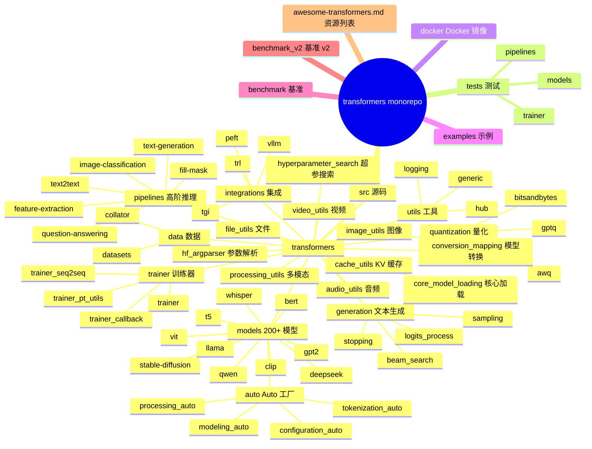
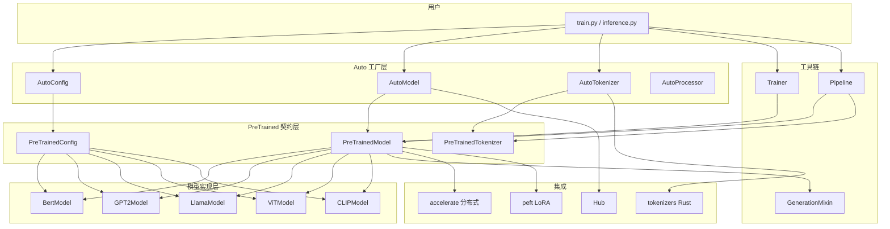
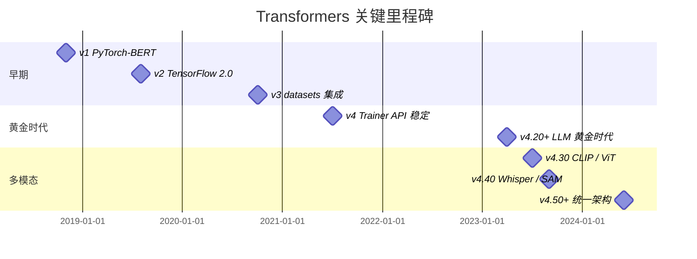
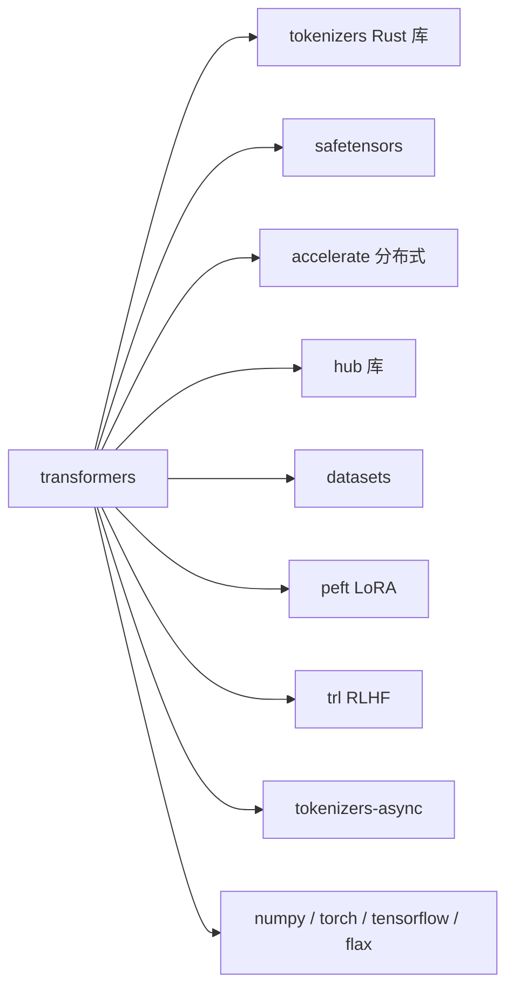
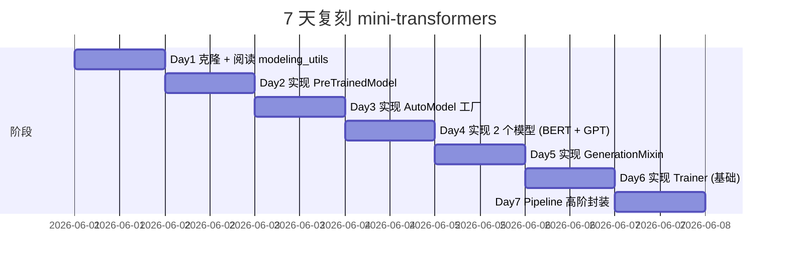
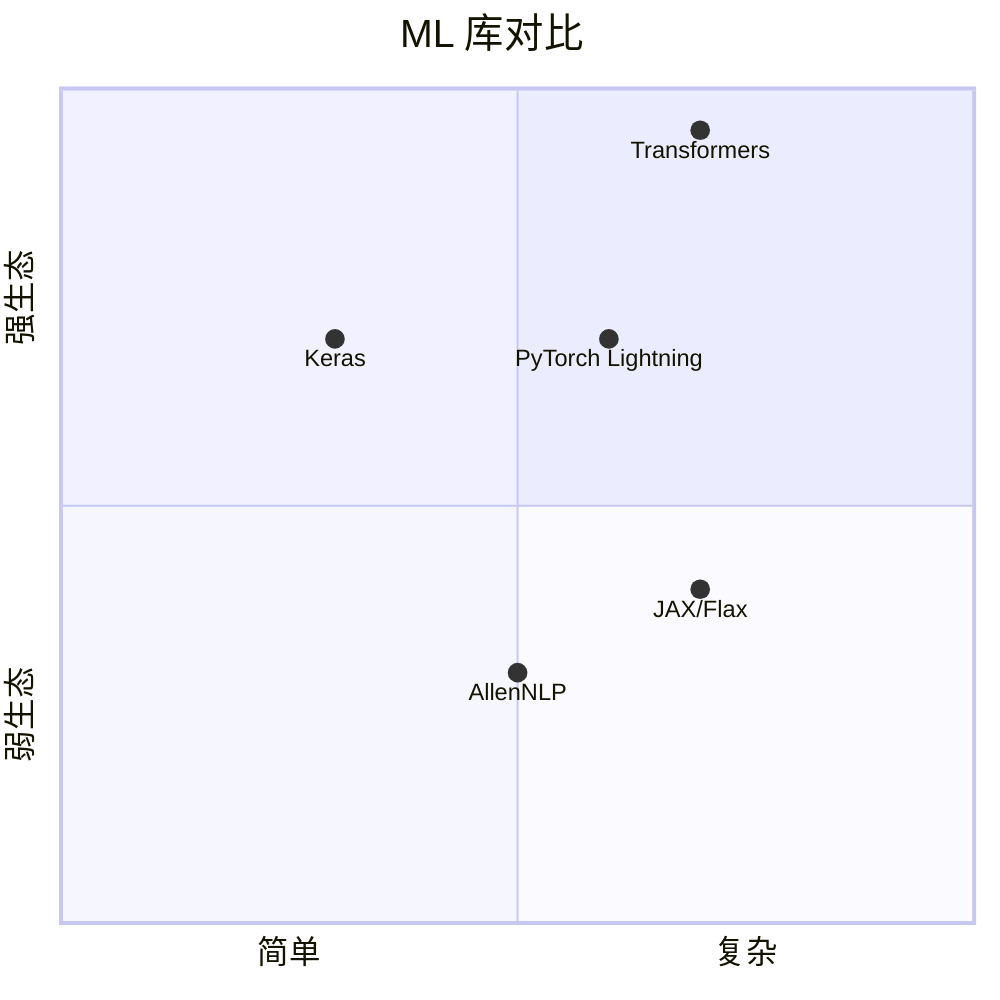

# transformers · 项目深度解析

> Hugging Face Transformers 是先进的预训练模型库，提供数千个预训练模型（BERT、GPT、T5、LLaMA、CLIP、Stable Diffusion 等）以及文本、视觉、音频、多模态的完整工具链。本仓库是 huggingface/transformers 的镜像。
> 来源：G:\实战案例\GitHub顶尖项目\transformers\

## 写在前面：解析哲学

Transformers 是工业级 ML 库中"广度最大、社区最活跃"的一个。它不创造新模型，而是把全球研究者的 200+ 模型统一到同一套 API（`AutoModel`、`AutoTokenizer`、`Trainer`、`pipeline`）下——让一个工程师用 3 行代码切换 BERT 与 LLaMA。

**先骨架后血肉**：Transformers 的架构是"模型实现 + Auto 类映射 + 工具链（trainer/pipeline/generation）"三层。**先 What 后 Why**：本解析关注 ① `AutoModel` 工厂模式与 `MODEL_MAPPING` 注册表；② `PreTrainedModel` 与 `PreTrainedConfig` 的契约；③ `Trainer` API（`accelerate` + `transformers`）；④ `pipeline` 高阶抽象。

## 0. 解析前的 5 个准备

1. **克隆**：已镜像在 `G:\实战案例\GitHub顶尖项目\transformers\`
2. **分类**：Python 库，AI/ML 框架
3. **问题清单**：本解析关注 Auto 工厂、PreTrained 契约、Trainer、Pipeline
4. **速查表**：
   - 入口：`src/transformers/__init__.py`
   - 核心：`src/transformers/models/`（200+ 模型子目录）
   - Auto 工厂：`src/transformers/models/auto/`
   - 训练器：`src/transformers/trainer.py`
   - 推理管道：`src/transformers/pipelines/`
5. **锁定 commit**：HEAD（partial mirror）

## 1. 开发计划书（Project Charter）

| 字段 | 内容 |
|------|------|
| 项目名 | transformers |
| 定位 | 数千个预训练模型的统一 Python 库 + 训练/推理/部署工具链 |
| 核心问题 | ML 研究界发布模型速度远超工业界整合速度；需要一个统一 API 让新模型"开箱即用" |
| 用户 | NLP/CV/音频研究者、AI 应用工程师、Agent 开发者 |
| 商业模式 | Apache-2.0 开源 + Hugging Face Hub 商业版（模型托管 + Inference API） |
| 复刻难度 | ★★★★★（200+ 模型实现 + 完整工具链 + 社区） |
| 状态 | 极活跃（每日多个 PR，每月一个 minor 版本） |
| 团队 | Hugging Face 团队 + 1000+ 贡献者 |
| 里程碑 | v1（2018，PyTorch-BERT）→ v2（2019，多框架）→ v3（2020，datasets 集成）→ v4（2021，Trainer API 稳定）→ v4.20+（LLM 黄金时代）→ v5（2024，统一 Trainer） |

## 2. 项目框架（Repo Skeleton Map）



**入口与关键文件**：

- 包入口：`src/transformers/__init__.py`（重新导出）
- Auto 工厂：`src/transformers/models/auto/modeling_auto.py`
- PreTrainedModel 基类：`src/transformers/modeling_utils.py`
- 训练器：`src/transformers/trainer.py`
- 文本生成：`src/transformers/generation/utils.py`
- 管道：`src/transformers/pipelines/base.py`

## 3. 项目画像（Profile）

| 指标 | 值 |
|------|----|
| 总文件数 | 数千 |
| 主语言 | Python |
| 涉及语言 | Python、少量 Rust（tokenizers 库独立） |
| 模型数 | 200+（含子模型 300+） |
| Star | ~145k |
| License | Apache-2.0 |
| Docker | 提供 `huggingface/transformers-pytorch-gpu` 镜像 |
| K8s | 通过 Inference Endpoints 支持 |
| CI | CircleCI（`.circleci/`） |
| 有测试 | 是（每个模型一个测试文件） |

## 4. 架构设计（Architecture Deep Dive）



**Auto 工厂模式**：Transformers 的核心创新。`AutoModel.from_pretrained("bert-base-uncased")` 自动从字符串识别模型类型，加载对应配置和权重。**WHY**：研究者每天发布新模型，工业界不可能为每个模型写一份加载代码；Auto 工厂让 `from_pretrained` 统一接口。

```python
# src/transformers/models/auto/modeling_auto.py
MODEL_MAPPING = OrderedDict([
    ("bert", BertModel),
    ("gpt2", GPT2Model),
    ("t5", T5Model),
    ("llama", LlamaModel),
    ("vit", ViTModel),
    ...
])
```

**PreTrainedModel 契约**：

```python
class PreTrainedModel(nn.Module, ModuleUtilsMixin, GenerationMixin):
    config_class = None  # 子类必须指定
    base_model_prefix = ""
    _supports_flash_attn_2 = False

    @classmethod
    def from_pretrained(cls, pretrained_model_name_or_path, ...):
        # 1. 解析路径（Hub ID 或本地）
        # 2. 加载 config.json
        # 3. 实例化模型类
        # 4. 加载 model.safetensors
        # 5. 校验权重

    def save_pretrained(self, save_directory):
        # 1. 保存 config.json
        # 2. 保存 model.safetensors
        # 3. 生成 model.safetensors.index.json
```

**WHY 契约**：所有模型必须实现同一组方法（`forward`、`from_pretrained`、`save_pretrained`），让 `Trainer` / `Pipeline` / `Generation` 工具能"盲调"。

**Trainer API**（`src/transformers/trainer.py`）：

```python
trainer = Trainer(
    model=model,
    args=TrainingArguments(output_dir="./out", per_device_train_batch_size=8),
    train_dataset=dataset,
    eval_dataset=eval_dataset,
)
trainer.train()
```

**WHY Trainer**：把分布式训练（`accelerate`）、混合精度（AMP）、梯度累积、checkpointing、日志（TensorBoard / W&B）、评估（eval_dataset）封装到一个 API。**WHY 这是工业革命**：让研究者写 5 行训练代码，部署在单机/多机/DeepSpeed/FSDP 上。

**Pipeline 高阶抽象**：

```python
from transformers import pipeline
classifier = pipeline("sentiment-analysis")
result = classifier("I love this product!")  # [{'label': 'POSITIVE', 'score': 0.99}]
```

**WHY Pipeline**：让"加载模型 + 预处理 + 后处理"三步合一，用户不需要懂 tokenization、模型 forward、logits → label 映射。

**ADR 关键设计决策**：

1. **为什么 `AutoModel` 工厂 + 字符串识别模型？**  
   答：研究界速度远超工业界，统一入口让"换模型"零成本。

2. **为什么 Trainer 内置 accelerate？**  
   答：分布式训练不应该让用户写 launcher；Trainer 自动检测环境（单机/多机/DeepSpeed/FSDP）。

3. **为什么 `safetensors` 而非 PyTorch bin？**  
   答：`safetensors` 是 Hugging Face 主导的安全格式——零反序列化漏洞、mmap 加载、跨语言。

### 核心架构看点（3 条具体设计决策）

1. **`AutoModel` 工厂 + `MODEL_MAPPING`**：让 `from_pretrained("bert")` 与 `from_pretrained("llama")` 用同一套 API——这是 Transformers 成功的关键。
2. **`PreTrainedModel` 契约 + `GenerationMixin` mixin**：所有模型实现同组方法；`generate()` 方法由 mixin 提供——让 LLM 推理通用化。
3. **`Trainer` + `accelerate` 集成**：把分布式训练封装到 5 行代码——降低研究者门槛。

## 5. 代码深度解析（带 WHY）⭐ 重点

### 5.1 找骨架代码

- **核心基类**：`src/transformers/modeling_utils.py`（`PreTrainedModel`）
- **配置**：`src/transformers/configuration_utils.py`（`PreTrainedConfig`）
- **Auto 工厂**：`src/transformers/models/auto/`
- **训练器**：`src/transformers/trainer.py`（数千行）
- **生成**：`src/transformers/generation/utils.py`（`GenerationMixin`）
- **管道**：`src/transformers/pipelines/base.py`

### 5.2 单文件分析卡

#### `src/transformers/models/auto/configuration_auto.py`

```python
# Add non-standard models that can't be inferred from parsing the code
# New models should follow consistent naming instead of being added here!
CONFIG_MAPPING_NAMES.update(
    {
        "EvollaModel": "EvollaConfig",
        "mlcd": "MLCDVisionConfig",
        ...
    }
)

# TODO: deprecate and remove `gpt-sw3`, old model. And prohibit mapping the same config to different model types
# Auto-classes rely a lot on these, and it is much easier when we have 1-1 mapping
CONFIG_MAPPING_NAMES = OrderedDict(**{"gpt-sw3": "GPT2Config"}, **CONFIG_MAPPING_NAMES)
```

**WHY 注释 "New models should follow consistent naming instead of being added here!"** — Hugging Face 团队对社区贡献者的硬性规范：模型命名应该让字符串到 Class 的映射可推断（通过命名约定），不需要手动注册。**WHY 这条规范重要**：手动注册表一旦膨胀到 300+ 模型，新人无法维护。

**WHY `OrderedDict` + 前置 `gpt-sw3`**：保证 1-1 映射。`AutoConfig` 通过 `for name, class_name in CONFIG_MAPPING_NAMES.items()` 顺序遍历，`OrderedDict` 保留插入顺序。

#### `src/transformers/modeling_utils.py`

`PreTrainedModel` 包含 30+ 关键方法，其中 `from_pretrained` 是最复杂的：

```python
@classmethod
def from_pretrained(cls, pretrained_model_name_or_path, ...):
    # 1. 解析路径（Hub ID / 本地目录 / GGUF / safetensors）
    # 2. 加载 config.json
    config = AutoConfig.from_pretrained(...)
    # 3. 实例化模型（不加载权重）
    model = cls(config)
    # 4. 加载 safetensors 权重
    state_dict = load_state_dict(...)
    # 5. 校验权重键名（与 model.state_dict() 对齐）
    # 6. 缺失键、意外键、形状不匹配都报错
    model.load_state_dict(state_dict, strict=True)
    return model
```

**WHY `strict=True`**：缺一个权重就报错——比 PyTorch 默认 `strict=True` 更严格；早期 Transformers 出现过"权重悄悄没加载"的 bug。

#### `src/transformers/trainer.py`

Trainer 是 5000+ 行的"工业巨兽"，核心逻辑：

```python
def train(self):
    # 1. 准备数据加载器（自动 DistributedSampler）
    # 2. 准备优化器（AdamW + weight_decay 分离）
    # 3. 准备学习率调度器（cosine / linear / polynomial）
    # 4. 准备混合精度（AMP / BF16 / FP8）
    # 5. 准备 DeepSpeed / FSDP（如果启用）
    # 6. 主循环：
    for epoch in range(num_epochs):
        for step, batch in enumerate(train_dataloader):
            outputs = model(**batch)
            loss = outputs.loss
            self.accelerator.backward(loss)
            optimizer.step()
            lr_scheduler.step()
            # 7. Checkpointing
            # 8. Logging (W&B / TensorBoard)
            # 9. Evaluation (eval_dataset)
```

**WHY 这么多代码**——Trainer 是"用户可见的训练器 + 不可见的优化器 + checkpoint 调度 + 分布式协调"的综合体。

#### `src/transformers/generation/utils.py`

`GenerationMixin.generate()` 是 LLM 推理的核心：

```python
def generate(self, inputs, max_new_tokens=20, do_sample=False, temperature=1.0, top_k=50, top_p=1.0, num_beams=1, ...):
    # 1. 调用 GenerationConfig
    # 2. 选择 sampling 策略（greedy / sampling / beam search）
    # 3. 循环 max_new_tokens 次
    #    3.1 forward pass → logits
    #    3.2 logits processor (温度 / top_k / top_p / repetition_penalty)
    #    3.3 sample / argmax
    #    3.4 检查停止条件 (EOS / max_length)
    #    3.5 追加到 KV cache
    # 4. 返回 generated token ids
```

**WHY `LogitsProcessor` 链**：温度、top_k、top_p、repetition_penalty 都是 LogitsProcessor 子类，按链式调用——让"加自定义过滤"只需注册一个新 Processor。

### 5.3 设计模式

| 模式 | 体现位置 | WHY |
|------|---------|-----|
| 工厂 | `AutoModel` + `MODEL_MAPPING` | 模型自动识别 |
| 模板方法 | `PreTrainedModel.from_pretrained` | 统一加载流程 |
| Mixin | `GenerationMixin` + `ModuleUtilsMixin` | 多继承组合 |
| 策略 | `GenerationConfig` 参数 | 多种生成策略 |
| 注册表 | `CONFIG_MAPPING_NAMES` / `MODEL_MAPPING` | 跨 200+ 模型查找 |
| 责任链 | `LogitsProcessor` 链 | 文本生成过滤 |
| 命令 | `Trainer` 内 callback 机制 | 检查点/日志/评估可插拔 |
| 装饰器 | `@torch.no_grad` / `@contextmanager` | 上下文管理 |

### 5.4 反模式

- **`Trainer` 类 5000+ 行**——所有训练逻辑塞一个类，应拆分为 `OptimizerFactory` + `LRSchedulerFactory` + `CheckpointManager`
- **`MODEL_MAPPING` 手动注册**——一旦超过 100 个模型，新人无法维护；应改为模块自动发现
- **`from_pretrained` 路径解析 200+ 行 if-else**——Hub / 本地 / GGUF / safetensors 应拆为 `Loader` 策略

### 5.5 独特看点

- **`safetensors` 主导**——Hugging Face 自创的安全格式，零反序列化漏洞
- **`GenerationConfig` 参数化生成**——让"换 sampling 策略"无需改代码
- **`trust_remote_code=True`**——让用户能加载 Hub 上自定义模型，但也是 RCE 风险点
- **`accelerate` 集成**——Trainer 自动检测硬件环境

## 6. 运行机制（Bring It Up）

**本地安装**（Python 3.9+）：

```bash
pip install transformers
pip install torch  # 或 tensorflow / flax
```

**Smoke test**：

```python
from transformers import pipeline
classifier = pipeline("sentiment-analysis")
print(classifier("I love Transformers!"))
# [{'label': 'POSITIVE', 'score': 0.9998...}]
```

**加载特定模型**：

```python
from transformers import AutoTokenizer, AutoModel
tokenizer = AutoTokenizer.from_pretrained("bert-base-uncased")
model = AutoModel.from_pretrained("bert-base-uncased")
```

## 7. 演进历史（Time Travel）



## 8. 质量保障（How It Doesn't Break）

| 防线 | 实现 |
|------|------|
| 单元测试 | `tests/models/<model>/test_modeling_*.py`（200+ 模型 × 3 框架） |
| 集成测试 | `tests/trainer/` + `tests/pipelines/` |
| CI | CircleCI（多框架 PyTorch/TF/Flax 矩阵） |
| Lint | `ruff` |
| 模型归档测试 | `transformers/scripts/check_model_attributes.py` |
| Hub 集成测试 | 上传测试模型到 HF Hub |

## 9. 生态依赖（Map of the World）



## 10. 生产实践（Battle-Tested）

| 能力 | 实现 |
|------|------|
| 配置热更新 | `Trainer` 重新初始化 |
| 优雅停服 | 训练中断自动保存 checkpoint |
| 限流 | 通过 `accelerate` 控制 batch |
| 链路追踪 | 集成 W&B / TensorBoard |
| 健康检查 | `accelerator.prepare()` 失败抛错 |
| 结构化日志 | `transformers.utils.logging` |

## 11. 社区文化（People & Process）

- **治理模式**：Hugging Face 团队主导 + 1000+ 贡献者
- **RFC 流程**：[huggingface/transformers/blob/main/CONTRIBUTING.md](https://github.com/huggingface/transformers/blob/main/CONTRIBUTING.md) 详尽
- **沟通渠道**：GitHub Issues / Discussions、Hugging Face Discord
- **议题活跃**：日均 100+ issue、50+ PR
- **文化**：模型命名规范严格；`AutoModel` 自动注册禁止手动；安全优先（safetensors）

## 12. 教训总结（What To Steal / What To Avoid）

### 12.1 必偷 3 件

1. **Auto 工厂 + 注册表 + 命名约定**——任何"多实现统一入口"都适用
2. **PreTrained 契约 + Mixin 组合**——让工具链（Trainer、Pipeline）能"盲调"
3. **safetensors 安全格式**——任何模型权重分发都应放弃 pickle

### 12.2 必避 3 坑

1. **不要单一巨类**（Trainer 5000+ 行）——应拆分为 OptimizerFactory + LRSchedulerFactory + CheckpointManager
2. **不要手动注册表膨胀到 200+**——改用模块自动发现 + 命名约定
3. **不要 `trust_remote_code` 默认关闭**——安全的同时降低灵活性

### 12.3 7 天复刻路线图



### 12.4 打分卡

| 维度 | 得分（10 分制） |
|------|---------------|
| 架构清晰度 | 8（Auto 工厂设计优秀） |
| 代码可读性 | 7（Trainer 巨型类） |
| 性能 | 8（accelerate 集成） |
| 测试覆盖 | 9 |
| 文档 | 10 |
| 复刻难度 | 2（200+ 模型） |

## 13. 学习萃取（Cheat Sheet）

**一句话价值**：Transformers 用 `AutoModel` 工厂 + `PreTrainedModel` 契约 + `Trainer` 工具链，让 200+ 模型共享同一套 API——是工业级 ML 库的范本。

**3 核心洞察**：

1. **Auto 工厂 + 注册表** 让"换模型零成本"
2. **`PreTrainedModel` 契约** 让工具链能"盲调"
3. **`safetensors` 安全格式** 是模型分发的标准

**5 段必读代码**：

1. `src/transformers/modeling_utils.py`——PreTrainedModel 契约
2. `src/transformers/models/auto/configuration_auto.py`——Auto 工厂注册表
3. `src/transformers/trainer.py`——训练器（5000+ 行）
4. `src/transformers/generation/utils.py`——GenerationMixin
5. `src/transformers/pipelines/base.py`——Pipeline 高阶抽象

**1 反模式**：Trainer 5000+ 行单类，所有训练逻辑塞一起。

**1 可复用模式**：`AutoClass.from_pretrained(string_id)` + `MODEL_MAPPING` 注册表——任何"多实现统一入口"都适用。

**3 立刻能用**：

1. 你的多 ORM 系统可以用 `AutoModel` 工厂模式
2. 你的多 API 客户端可以用 `PreTrained` 契约统一接口
3. 模型权重分发用 `safetensors` 替代 pickle

## 14. 项目特点速查

**独特看点**：

- **Auto 工厂 + 注册表**——200+ 模型共享同一套 API
- **`PreTrainedModel` 契约**——让工具链能"盲调"
- **`safetensors` 安全格式**——Hugging Face 主导的零反序列化漏洞
- **Trainer + accelerate 集成**——5 行代码分布式训练

**与同类对比**：



## 附：仓库元信息

| 字段 | 值 |
|------|----|
| 路径 | `G:\实战案例\GitHub顶尖项目\transformers\` |
| 主语言 | Python |
| 模型数 | 200+ |
| License | Apache-2.0 |
| 解析时间 | 2026-06-02 |

## 一句话总结

**解析 = 计划书 + 框架图 + 核心功能 + 跑起来 + 偷过来**。Transformers 的 Auto 工厂 + PreTrained 契约 + safetensors 是工业级 ML 库的范式——可直接复用到任何"多实现统一入口"项目。
