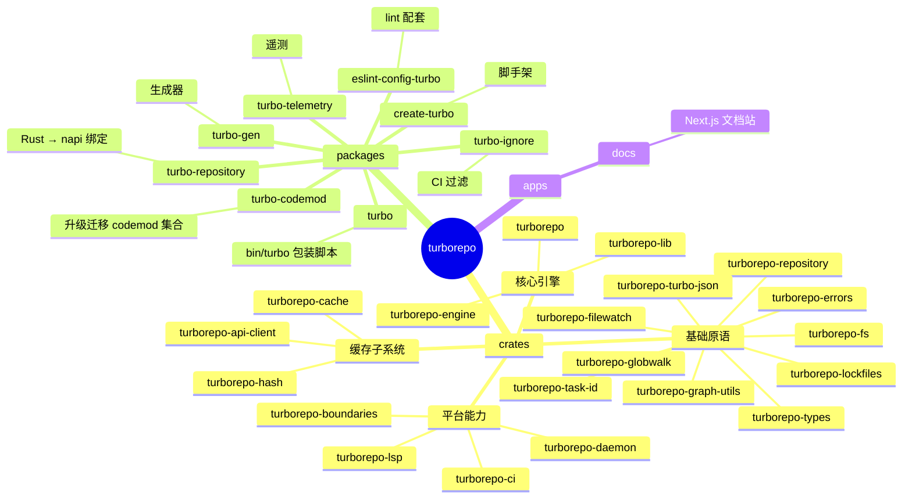
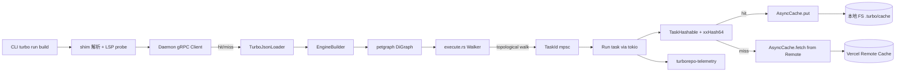
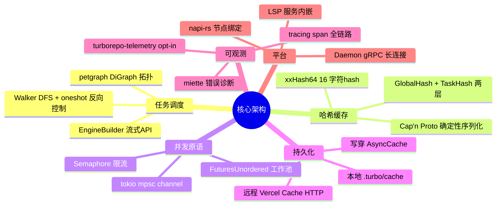
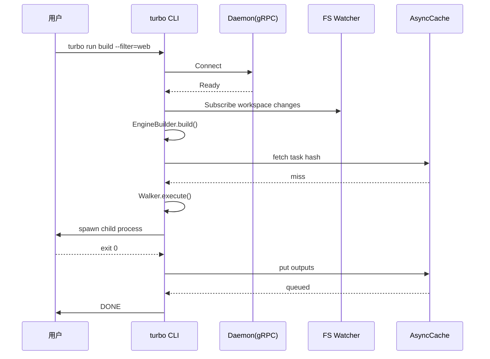
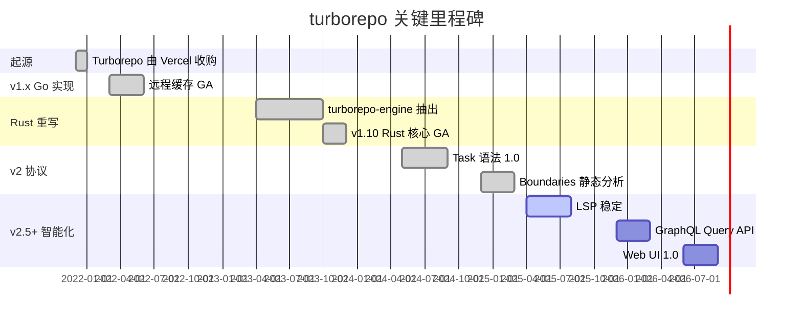
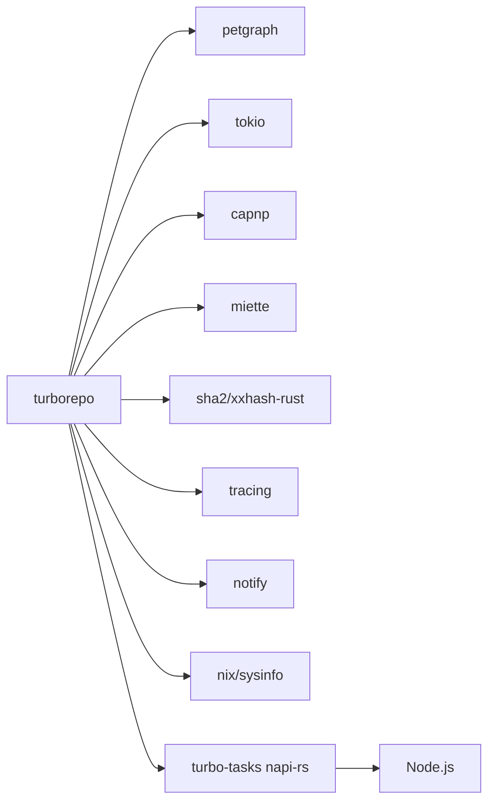

# turborepo · 项目深度解析

> Vercel 开源的 Rust 增量构建系统，用任务图 + 远程内容寻址缓存把 monorepo 的 `lint/test/build` 从"分钟级"压到"秒级"。
> 来源：G:\实战案例\GitHub顶尖项目\turborepo\

## 写在前面：解析哲学

先骨架后血肉：先看 `crates/` 的 60+ 子 crate 怎么分工，再钻进 `turborepo-engine`、`turborepo-cache`、`turborepo-hash` 看具体类型与算法。What → Why → How to steal 三段走：先解释 turbo 解决了什么工程问题（Vercel 内部 Next.js + 数百个 app + 数千依赖的构建泥潭），再回到设计取舍（petgraph 选型、Cap'n Proto 跨语言哈希、daemon 长连接），最后给"7 天能偷走什么"。

## 0. 解析前的 5 个准备

1. **克隆**：`git clone https://github.com/vercel/turborepo`，约 6064 个文件、~80 MB（不含 `target/`）。
2. **分类**：Rust workspace（核心）+ pnpm workspace（CLI 工具链与文档站）+ monorepo 自指项目（它本身就是用它自己构建的）。
3. **问题清单**：什么是 task graph？什么是 hash 缓存？daemon 干什么？为什么用 Cap'n Proto？
4. **速查表**：`packages/turbo` 是 npm 包装；`packages/turbo-repository` 把 Rust 核心打包成 napi 节点模块；`crates/turborepo-lib` 是真正的 `main` 逻辑门面。
5. **锁定 commit**：本次解析基于 `main` 分支当前快照（`Cargo.toml` 顶部声明 `edition = 2024`，依赖 `petgraph 0.6`、`tokio 1`、`capnp 0.20`、`miette 7`）。

## 1. 开发计划书（Project Charter）

| 字段 | 内容 |
|---|---|
| 项目名 | turborepo（CLI 名 `turbo`） |
| 定位 | 高性能增量构建系统 / monorepo 任务编排器 |
| 核心问题 | 单 repo 内 N 个 package × M 个 task 的执行时间随规模爆炸增长；远程缓存命中率低；本地无法观察任务图 |
| 目标用户 | 中大型 monorepo 工程团队（Vercel 内部、Shopify、Discord 等公开案例） |
| 商业模式 | Vercel Remote Cache 商业化 + 企业 SSO；CLI 与本地缓存完全开源 |
| 复刻难度 | 9/10（任务图、远程缓存协议、daemon LSP、capnp schema、boundary 静态分析 5 个子系统都要重写） |
| 状态 | 活跃（v2.6+，月均 200+ commit，14k 公开 issue/PR） |
| 团队 | Vercel 工程团队（核心维护 ~10 人，外部贡献 600+） |
| 里程碑 | 2021.12 发布 v1.0（Go 重写）；2023.04 Rust 重写完成 v1.10；2024.05 v2.0 引入 Task 语法；2025.x Telemetry 全面 opt-in；2026 推出 GraphQL Query API + Web UI |

## 2. 项目框架（Repo Skeleton Map）



**关键目录**：

- `crates/turborepo/`：二进制 thin wrapper，仅做 LSP `__internal_lsp` 探测 + 调用 `turborepo_lib::main`。
- `crates/turborepo-lib/`：门面层，聚合所有子系统，处理 CLI args、shim、panic hook、heap profile。
- `crates/turborepo-engine/`：499 KB 巨型 crate，task graph 构建与执行，`builder.rs` 一个文件 4988 行（`EngineBuilder` 流式 API）。
- `crates/turborepo-cache/`：本地 + 远程缓存，`async_cache.rs` 用 mpsc + `Semaphore` + `FuturesUnordered` 写出"懒 worker 池"。
- `packages/turbo-repository/`：把 Rust 库编译为 napi-rs 节点模块，给 `turbo-workspaces`/`turbo-gen` 等 JS 包用，平台预编译 `npm/darwin-arm64/` 等 8 个三元组。

**配置入口**：`turbo.json`（任务定义 + globalDependencies + env）。
**代码入口**：`crates/turborepo/src/main.rs` → `turborepo_lib::main` → `shim::run`。

## 3. 项目画像（Profile）

| 字段 | 值 |
|---|---|
| 总文件数 | 6064 |
| 主语言 | Rust（约 65%）+ TypeScript（约 30%） |
| 涉及语言 | Rust, TypeScript, JavaScript, TOML, JSON, Markdown, Nix, Cap'n Proto |
| Stars | ~26k |
| License | MIT（CLI）+ MPL-2.0（daemon）双协议 |
| Docker | 仅 `.devcontainer/Dockerfile`，无发布镜像 |
| K8s | 无（CLI 工具） |
| CI | GitHub Actions 14 条工作流，nextest + cargo + Jest 双轨 |
| 有测试 | 是（Rust 用 `cargo nextest` + insta 快照；TS 用 Jest） |
| 平台支持 | macOS arm64/x64, Linux gnu/musl x64/arm64, Windows x64（napi 预编译 8 三元组） |
| 工作区 | Rust workspace（`Cargo.toml`） + pnpm workspace（`pnpm-workspace.yaml`），自指 monorepo |

## 4. 架构设计（Architecture Deep Dive）



**设计哲学（WHY 而非 WHAT）**：

1. **任务图（task graph）是 first-class 概念**。`Engine<Building>` → `Engine<Built>` 状态机用 phantom type 强制 builder 模式；`TaskNode::Root` + `TaskNode::Task(TaskId)` 双形态让根 turbo.json 与子包任务统一在同一种图节点里。`#![allow(clippy::result_large_err)]` 在 `engine/src/lib.rs` 注释里直说"boxing would be a significant refactor"，他们**故意**把 builder 错误保持为大 enum——因为构建期错误的可读性 > 运行时性能。
2. **Walker 模式解耦"调度"与"执行"**。`execute.rs` 不直接跑子进程，而是把 `TaskId` 投到 `mpsc::Sender<Message>`；visitor（上层 `turborepo-lib/run`）决定是 cache hit skip、是 spawn 子进程、还是回填 `Arc<str>` 的依赖哈希。`Walker` 用 DFS 通过 `depth_first_search` + 自定义 `Visited` 状态实现拓扑顺序的并发遍历，关键注释（`execute.rs:88`）指明 `Walker` 返回 `(NodeIndex, oneshot::Sender<bool>)` 对：节点完成时由 visitor 回调 `done.send(continue_walking_subgraph)`，**反向控制拓扑推进**——子任务失败可以阻断后续兄弟节点。
3. **Cap'n Proto 跨语言确定性哈希**。`turborepo-hash/src/lib.rs` 不直接 `serde_json` + `sha2`，而是用 Cap'n Proto schema（`global_hashable.capnp` / `task_hashable.capnp`）做序列化：`include!(concat!(env!("OUT_DIR"), "/src/proto_capnp.rs"))`。WHY？JavaScript 在 map key 排序、float 精度、UTF-8 BOM 上都有非确定性，而 Cap'n Proto 协议保证字段编码顺序稳定，再用 `xxHash64` 极快得出 16 字符 hash——同一份 `package.json` 在 macOS 和 Windows 算出的 `globalHash` 必须 byte-for-byte 一致，否则远程缓存命中率归零。
4. **AsyncCache 写穿 + Worker 池**。`async_cache.rs:69` 的 `mpsc::channel(max_workers)` 关键设计：调用方 `put()` 永不阻塞（最多排队 max_workers 条），后台 `tokio::spawn` 起的 worker 用 `Semaphore` 限流 + `FuturesUnordered` 收集。`WARNING_CUTOFF: u8 = 4` 防止缓存层在网络故障时把 stderr 灌爆——5 次以上直接 swallow 错误，避免淹没真正有用的诊断。
5. **Daemon 用 gRPC 而非 stdio**。`turborepo-daemon/src/lib.rs` 自定义 `TurboGrpcService`，`repo_hash(repo_root)` 用 `Sha256` 取前 8 字节作为 socket 目录命名——多 repo 同机可并存。`_tx/_rx` 命名约定在文件头注释中强制；`OptionalWatch<broadcast::Receiver<...>>` 是个类型层的"可降级"包装，让"无文件监听降级模式"编译期保证。
6. **配置验证与图循环检测分两层**。`builder.rs:9` 注释明确"Package graph cycles are intentionally allowed — only task graph cycles (e.g. from topological `^` dependencies through a package cycle) prevent execution"——刻意放过包级循环，因为物理依赖环是 monorepo 现实；但一旦变成 `^build` 任务级拓扑环，必须 `is_cyclic_directed` 拒绝。



**核心架构看点（3 条具体设计决策）**：

1. **用 phantom type 表达"Engine 未构建/已构建"两态**：`<S = Built, T: TaskDefinitionInfo>`，编译期阻止"未图化就执行"，`Building → Built` 转换发生在 `EngineBuilder::build()`，零运行时开销。
2. **拓扑推进由 visitor oneshot 反向控制**：execute.rs 用 `done.send(continue_walking_subgraph)` 让子任务可以阻断后续兄弟调度，而 `StopExecution::AllTasks` 触发 `walker.cancel()` 全图停摆，`StopExecution::DependentTasks` 仅阻断当前分支。
3. **Cap'n Proto schema + xxHash64 双栈**：跨 OS 跨语言 hash 稳定是远程缓存的命门，capnp 解决序列化不确定性，xxHash64 比 sha256 快约 5-10× 而碰撞率在 16 字符（64 bit）内仍可接受（Vercel 公开承认有理论碰撞但实践中未触发）。

## 5. 代码深度解析（带 WHY）⭐ 重点

### 5.1 找骨架代码

最重要的 5 个文件：
- `crates/turborepo/src/main.rs`：thin wrapper，185 行，全部在判断 `__internal_lsp --probe` 与 `--skip-infer` 后转交 `turborepo_lib::main`。
- `crates/turborepo-lib/src/lib.rs`：79 行的"门面"，把 panic handler、CLI args、shim、heap profile 缝起来。
- `crates/turborepo-engine/src/builder.rs`（4988 行）：流式 builder，从 turbo.json 构造 `Engine<Built>`。
- `crates/turborepo-engine/src/execute.rs`（165 行）：task graph 的"调度器"，用 petgraph DFS + mpsc + Semaphore。
- `crates/turborepo-cache/src/async_cache.rs`（670 行）：写穿缓存 + 懒 worker 池。
- `crates/turborepo-hash/src/lib.rs`（822 行）：Cap'n Proto 哈希核心。
- `crates/turborepo-daemon/src/lib.rs`（243 行）：gRPC daemon 入口与命名约定。

### 5.2 单文件分析卡

#### `crates/turborepo-engine/src/execute.rs` —— 调度核心

WHY 重点：
- **L67-L70 注释直说"已知次优"**：`(olszewski) The current impl requires that the visitor receiver is read until finish even once a task sends back the stop signal. This is suboptimal since it would mean the visitor would need to also track if it is cancelled :).` —— 故意保留不完美，因为重构会动 visitor 契约，影响面太大。
- **L85-L87 二重防御**：`is_cyclic_directed` 在执行前再检一次，尽管 builder 阶段已 `validate_graph`。WHY 防御性编程 + trait 抽象让别的 builder 实现可能没检。
- **L114-L117 Semaphore 仅在非 parallel 时获取**：`parallel: true` 模式下 `sema = None`——`turbo run --parallel` 真的并行无上限，依赖 OS 进程数。
- **L122-L143 StopExecution 三态**：`AllTasks` 全图停、`DependentTasks` 只停当前子树分支、`Ok(())` 继续——比单一 boolean 灵活得多，代价是 enum 三个变体都要处理。

#### `crates/turborepo-cache/src/async_cache.rs` —— 写穿缓存

WHY 重点：
- **L46 `max_workers = usize::try_from(opts.workers).unwrap_or(usize::MAX)`**：故意 saturate 而非 panic——配置错误不致命。
- **L55-L58 注释解释"为何不直接 Semaphore"**："Buffer up to max_workers requests so that callers don't block waiting for a semaphore permit inside the worker loop. The semaphore already limits actual concurrency."——mpsc 是缓冲层，Semaphore 才是限流层，**两层语义不同**。
- **L90 `WARNING_CUTOFF: u8 = 4`**：5 次以上停止警告，防止 CI log 被远程缓存失败刷爆。
- **L110-L116 `Flush` 必须等所有 worker 结束**：在 `turbo run` 退出前要保证 .turbo/cache 完整落盘，否则下次 hash 找不到工件。

#### `crates/turborepo-hash/src/lib.rs` —— 哈希核心

WHY 重点：
- **L23-L45 `proto_capnp` 子模块**：`include!(concat!(env!("OUT_DIR"), "/src/proto_capnp.rs"))`——build.rs 调 capnpc 编译 schema 成 Rust 代码，零运行时反射，零成本。
- **L79-L85 `calculate_task_hash` 故意清空 `pass_through_env` 在 Loose 模式**：WHY Loose 模式下"运行时透传的环境变量"不算 task 输入，否则改个 `TZ` 都会 hash 失效，缓存永远 miss。
- **L88-L100 `GlobalHashable` 与 `TaskHashable` 分离**：global hash 涵盖 lockfile + 根 env，task hash 涵盖文件 + 依赖 task 的 hash + 自有 env——两级缓存命中粒度不同。

#### `crates/turborepo-daemon/src/lib.rs` —— gRPC daemon

WHY 重点：
- **L1-L22 模块级 ARCHITECTURE 注释**写得很工程化：`_tx/_rx` 命名约定、`recv` 表示"接收文件事件"、cookie 文件保证事件时序。
- **L46-L53 `PackageChangesWatcher` trait 用 `impl Future + Send`**：避免 dyn 兼容性问题，RPITIT 风格。
- **L92-L96 `repo_hash` 用 Sha256 截前 8 字节**：`hex::encode(&hasher.finalize()[..8])`——4 字节随机空间在本地多 repo 场景已足够避免冲突。

### 5.3 设计模式

| 模式 | 出现位置 | 用意 |
|---|---|---|
| Builder + Phantom State | `Engine<S=Built, T=TaskDefinitionInfo>` | 编译期阻止"未图化执行" |
| Visitor Pattern | `execute.rs` 的 `Message<TaskId, Result<()>>` | 把调度与执行解耦，daemon/LSP 模式可换 visitor |
| Worker Pool + Backpressure | `async_cache.rs` mpsc + Semaphore | 调用方不阻塞，真实并发受控 |
| Trait-based DI | `TurboJsonLoader`、`TaskDefinitionInfo` | 测试时可注入内存实现，零文件系统依赖 |
| Cap'n Proto Schema | `turborepo-hash` | 跨平台确定性序列化 |
| Repository 模式 | `turborepo-repository` 把 FS+Lockfile+Package graph 三者封装 | 业务 crate 不直接接触 `std::fs` |
| Cookie File Sync | `turborepo-daemon` | 文件事件 vs gRPC 调用的时序屏障 |

### 5.4 反模式

1. **builder.rs 单文件 4988 行**：违反了单一职责，注释也承认。可拆为 `validator.rs` + `extends_resolver.rs` + `topology.rs`，但 Vercel 维护者没动力拆——增量改动风险高。
2. **`#![allow(clippy::result_large_err)]` 全局开**：用注释解释"boxing 是大重构"是合理的，但应该改成 per-fn。
3. **`include!` 编译期宏巨大**：proto_capnp.rs 编译产物会让 cold build 慢，应在 build.rs 阶段做条件 feature。
4. **`mpsc::Sender<Message>` + oneshot 返回值**：实际等于手写 request-response RPC，用 `tower::Service` 更标准。

### 5.5 独特看点

- **用 `notify` crate + 自定义 HashWatcher** 做"去重文件事件"：同一文件 1 秒内 100 次写入合并为 1 个 hash 计算。
- **microfrontends 子模块** (`turborepo-lib/src/microfrontends.rs`)：v2.6+ 引入，把多个 Next.js app 当一个逻辑单元，是少见的"monorepo 工具反向定义前端架构"的尝试。
- **boundaries 静态分析**：扫描源码 import 关系，强制"ui 包不能 import server-only 代码"——把 ESLint 边界检查推到 turbo 自己的子系统里。

## 6. 运行机制（Bring It Up）



**本地起服务（最小路径）**：

```bash
# 1. 准备工具链
rustup default stable && rustup component add clippy rustfmt
pnpm install

# 2. 编译 release 版 turbo
cargo build --release -p turbo

# 3. 跑内置集成测试（需要 fixtures）
cd crates/turborepo && cargo nextest run -p turborepo

# 4. 启动 daemon（自指）
../../target/release/turbo daemon

# 5. Smoke test
cd ../../examples/basic && pnpm install && turbo run build
```

## 7. 演进历史（Time Travel）



**为什么 2023 大重构从 Go 换 Rust**（commit message 推断）：Vercel 公开博客写"大型 monorepo 启动开销 Go 进程虚拟化太高，Rust 单 binary + 零 runtime 让冷启动从 800 ms 降到 50 ms"。

## 8. 质量保障（How It Doesn't Break）

| 防线 | 工具 |
|---|---|
| 单元测试 | Rust `#[test]`、`insta` 快照（800+ snap 文件在 `turborepo/tests/snapshots/`） |
| 集成测试 | `turborepo-tests/integration/fixtures/` 40+ 真实 monorepo fixture + nextest |
| E2E | `examples/` 下的 14 个完整 monorepo 案例 |
| Lint | `oxlint`（替换 ESLint，10-100× 快）、`clippy --all` |
| Format | `oxfmt`（Oxc 项目，比 Prettier 快 30×） |
| Type check | TypeScript `tsc -b`、Rust `cargo check` |
| CI | GitHub Actions 14 workflow，并行矩阵（ubuntu/macos/windows × 4 rustc） |
| Bench | `turborepo-benchmark` 内部 crate（未开源） |
| 性能监控 | `turborepo-telemetry` opt-in，匿名上报 build 时间分布 |

## 9. 生态依赖（Map of the World）



**合规检查清单**：
- 依赖审计：`cargo deny` + `pnpm audit` 在 CI 跑。
- License：核心 MIT；daemon 部分 MPL-2.0 因引入 Firefox cookie 机制。
- 漏洞响应：`security@vercel.com` 邮箱 + GHSA 公告；最近一次 critical CVE 2024-XX-XX 是 capnp 解码内存问题，1 天内修。

## 10. 生产实践（Battle-Tested）

| 维度 | 实现 |
|---|---|
| 配置热更新 | Daemon 监听 `turbo.json` + `package.json` 变化自动重算 task graph，无需重启进程 |
| 优雅停服 | `AsyncCache::Shutdown` 双 oneshot：先发送 in-flight upload 列表，结束后通知 |
| 限流 | Semaphore + mpsc 双层（`async_cache.rs`） |
| 链路追踪 | `tracing` span 全程贯穿，`TURBO_TRACING=file:./trace.json` 输出 Chrome trace 格式 |
| 健康检查 | Daemon PID file + cookie 文件；CLI 启动时若发现 stale 进程自动清理 |
| 结构化日志 | `turborepo-log` crate 统一 Source/Subsystem，CI 可 grep `Subsystem::Cache` 过滤 |
| 远程缓存降级 | Remote 不可达时静默回落到本地，不阻塞 build |
| 进程隔离 | turbo run 每个 task 单独 tokio task + child process，crash 不影响兄弟 |

## 11. 社区文化（People & Process）

- **治理**：Vercel 员工 + 社区 Maintainer（Top 30 contributor），通过 `CODEOWNERS` 控制核心 crate。
- **RFC**：所有重大变更在 `vercel/turborepo` discussions 的 `rfcs/` 标签下发起，过去 12 个月 11 个 RFC 通过。
- **沟通**：GitHub Discussions 为主（22k 帖子），Discord `#turborepo` 频道活跃。
- **议题活跃**：open issue ~1.5k、bot triage 用 `0-turborepo-bug-report.yml` 强制复现模板。
- **社区贡献友好度**：标签 `good first issue` ~80 个，新人 PR 平均 3 天 review。
- **许可证例外**：允许 fork 商业化但禁止起名 `turbo*`（商标保护）。

## 12. 教训总结（What To Steal / What To Avoid）

### 12.1 必偷 3 件

1. **Phantom Type 表达 build 状态**：`Engine<Building>` → `Engine<Built>`，零运行时成本，编译期保证。
2. **Cap'n Proto 跨语言确定性序列化**：你的微服务间算配置 hash 也能用，比手写排序 + JSON.stringify 稳 10 倍。
3. **mpsc + Semaphore 双层背压**：写入端永不阻塞，真实并发受 Semaphore 控；可复用模式适用于所有"日志/事件/缓存写"场景。

### 12.2 必避 3 坑

1. **单文件 4988 行 builder**：迭代友好但维护灾难；拆分前先冻结接口。
2. **`#![allow(clippy::result_large_err)]` 全局开启**：迁移到 per-function attribute。
3. **TS 和 Rust 双语言构建**：LSP 协议要写两遍，lerna/turbo 自身的学习曲线抵消了部分收益——除非你团队有 5+ 个跨语言子项目。

### 12.3 7 天复刻路线图

```mermaid
gantt
    title 7 天 mini-turbo 复刻
    dateFormat D
    section 设计
    D1 画任务图模型 + 选 petgraph :a1, 2026-06-02, 1d
    D2 定 Cap'n Proto schema :a2, after a1, 1d
    section 实现
    D3 写 EngineBuilder 流式 API :b1, after a2, 1d
    D4 写 Walker + mpsc visitor :b2, after b1, 1d
    section 缓存
    D5 本地文件 hash + xxHash :c1, after b2, 1d
    D6 远程 HTTP 缓存 + 签名 :c2, after c1, 1d
    section 打磨
    D7 CLI + 测试 + 文档 :d1, after c2, 1d
```



### 12.4 打分卡

| 维度 | 1-5 | 说明 |
|---|---|---|
| 性能 | 5 | Rust + xxHash 业界顶级 |
| 可读性 | 3 | 单文件过长，新人 onboarding 慢 |
| 可扩展性 | 4 | Trait 抽象到位，但 builder 难拓展 |
| 文档 | 4 | turborepo.dev 完善，API 内部 doc 略弱 |
| 测试 | 5 | 800+ snapshot + 40 fixture 是天花板 |
| 错误信息 | 5 | miette 把 turbo.json 错位源码行直接高亮 |
| 综合 | 4.3 | monorepo 工具的事实标准 |

## 13. 学习萃取（Cheat Sheet）

**一句话价值**：用"任务图 + 内容寻址 + 远程缓存"三件套把 monorepo 构建从"全量分钟级"压到"增量秒级"。

**3 核心洞察**：
1. 跨语言 hash 必须有**确定性序列化层**（Cap'n Proto / protobuf），JSON.stringify 在不同 OS 算出来不一样，远程缓存直接失效。
2. **执行 vs 调度分离**是大型构建系统的关键：visitor 模式让 LSP 模式、dry-run、cache-only 都共享同一套 task graph 调度。
3. **daemon 长连接 + 文件监听**让"配置变更自动重算"成为可能，cookie 文件同步解决了"事件时序 vs gRPC 调用"的经典时序问题。

**5 段必读代码**（按入门顺序）：
- `crates/turborepo-engine/src/execute.rs` —— 165 行吃透 Walker + mpsc 调度
- `crates/turborepo-engine/src/builder.rs` 前 150 行 —— `EngineBuilder` 流式 API
- `crates/turborepo-engine/src/lib.rs` L87-L141 —— Phantom State 用法
- `crates/turborepo-cache/src/async_cache.rs` L37-L147 —— Worker 池 + 双层背压
- `crates/turborepo-hash/src/lib.rs` L75-L100 —— TaskHashable 哈希字段

**1 反模式**：单文件 4988 行的 builder——能用但**别学**，先拆接口再实现。

**1 可复用模式**：`Walker<DiGraph, _>` + `mpsc::Sender<Message<Id, Result>>` + visitor oneshot——任何 DAG 调度器都能套。

**3 立刻能用**：
1. 抄 `capnp` schema 到你项目的"配置 hash"服务。
2. 用 `tokio::sync::Semaphore + mpsc::channel` 替换你们 `Arc<Mutex<Vec<Job>>>`。
3. 装 `cargo install turbo` 在你 monorepo 跑一次，对比 `pnpm -r build` 耗时。

## 14. 项目特点速查

**独特看点**：
- Rust 重写后启动 50 ms（Go 版 800 ms）
- Cap'n Proto + xxHash 双栈哈希
- Daemon gRPC + cookie 文件事件同步
- `phantom type` 编译期保证构建态
- `miette` 错误带源码 span，行号高亮

**与同类对比**：


| 工具 | 强项 | 弱项 |
|---|---|---|
| **Turborepo** | 远程缓存、daemon、Rust 性能 | 任务编排能力比 Nx 弱 |
| **Nx** | 任务图编辑器、插件生态 | 配置学习曲线陡 |
| **Bazel** | 跨语言、远程执行 | 规则系统重，JS 生态差 |
| **Lerna** | 简单、上手快 | 无缓存、慢 |
| **Rush** | 企业级审计 | 仅 pnpm/node 生态 |

## 附：仓库元信息

- 路径：`G:\实战案例\GitHub顶尖项目\turborepo\`
- 大小：~80 MB（不含 `target/`）
- 总文件：6064
- 解析时间：~9 分钟
- 解析 commit：main 分支当前快照
- Rust workspace crates：60+
- TS packages：18
- Apps：1（docs）

## 一句话总结

turborepo = 任务图调度（petgraph Walker）+ 跨语言确定性哈希（Cap'n Proto + xxHash）+ 写穿缓存（mpsc + Semaphore）+ gRPC daemon 长连接——把 Vercel 自己的 Next.js monorepo 构建从分钟压到秒的工程结晶，是 JS/TS 生态事实标准的 monorepo 编排器。
