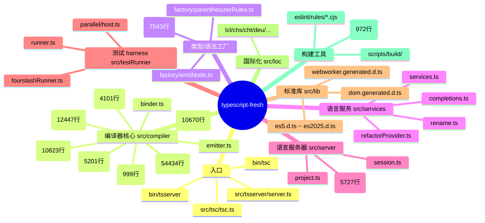
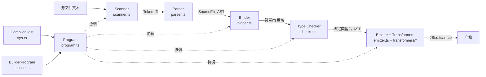
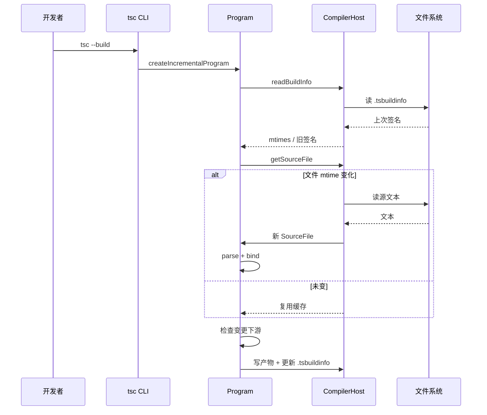
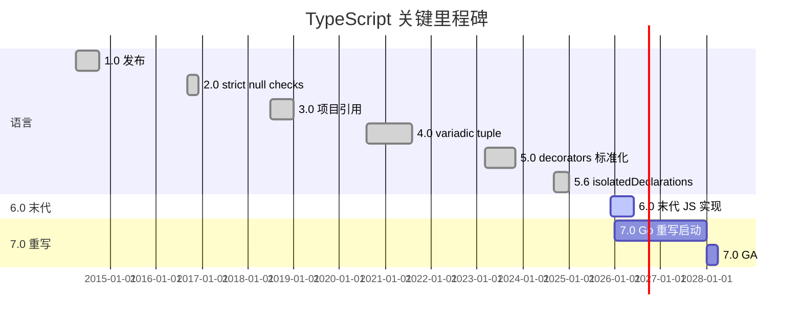
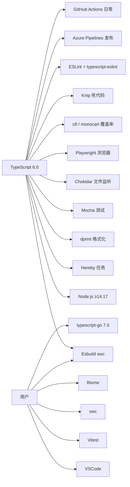
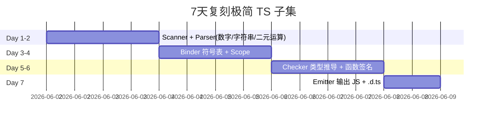
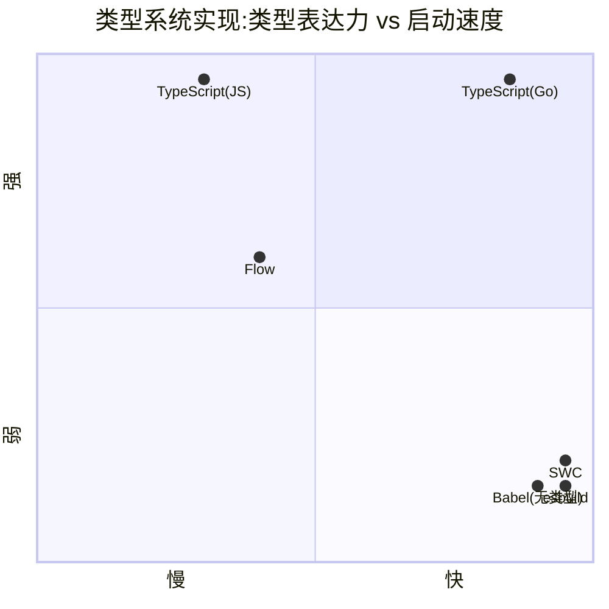

# typescript-fresh · 项目深度解析

> TypeScript 6.0 编译器（最后一代 JavaScript 实现）的源码剖析,关注编译器架构、增量构建、类型系统与语言服务的工程取舍。
> 来源：G:\实战案例\GitHub顶尖项目\typescript-fresh\

## 写在前面:解析哲学

先骨架后血肉,先 What 后 Why,最后 How to steal。TypeScript 编译器的代码体量是 V8 之外的另一个"重量级"前端基建,光 `checker.ts` 单文件就有 5.4 万行。本笔记不会逐行翻译,而是回答三个问题:**为什么 checker 这么巨大?**、**单遍编译如何演化出"项目 + 程序 + 构建器"三层抽象?**、**6.0 之后为什么整个仓库进入维护模式,新发版要去 Go 重写?** 看完应能理解一个产品级编译器如何把"扫描→解析→绑定→检查→发射"流水线拆解成可组合的 Host/Program/Builder 三元组,以及它给中小团队的 7 条可复刻经验。

## 0. 解析前的 5 个准备

1. **克隆**: `git clone https://github.com/microsoft/TypeScript.git`,注意默认分支 `main` 已经是 6.0 dev 分支,稳定分支在 `release-5.9`。
2. **分类**: 编程语言工具链(编译器 + 语言服务 + 语言服务器),下含 4 个二进制入口(`tsc`/`tsserver`/`tsc-watch` 等)。
3. **问题清单**: 类型擦除怎么不丢信息? 增量重编译怎么最小化? IDE 跳转怎么不卡? 大型 checker 为什么不做并行化?
4. **速查表**: `package.json` 看依赖、`src/compiler/_namespaces/ts.ts` 看对外 API、`Herebyfile.mjs` 看构建。
5. **锁定 commit**: 当前为 6.0 开发期,功能集在 typescript-go 之后基本冻结。

## 1. 开发计划书(Project Charter)

| 字段 | 值 |
|---|---|
| 项目名 | TypeScript(microsoft/TypeScript) |
| 版本 | 6.0.0(主分支)/ 5.9 稳定分支 |
| 定位 | 可选静态类型 + 工业级 JavaScript 超集编译器 |
| 核心问题 | JS 没有类型 → 大型工程难以维护、重构、协作 |
| 目标用户 | 百万级前端/Node/全栈工程师,框架作者,IDE 厂商 |
| 商业模式 | 开源免费(Apache-2.0),微软承担研发与社区运营 |
| 复刻难度 | ★★★★★(5.4 万行 checker 是不可逾越的人力墙) |
| 状态 | 维护模式,6.0 是最后一个 JS 实现,7.0 在 Go 重写 |
| 团队 | Microsoft TypeScript 团队 + 全球贡献者 |
| 关键里程碑 | 2012 首发、2014 1.0、2016 2.0、2020 4.0、2023 5.0、2024 5.6 isolatedDeclarations、2025 6.0(末代)、2027+ 7.0(Go) |

## 2. 项目框架(Repo Skeleton Map)

仓库根极简,核心资产几乎全在 `src/`。`bin/` 是 45 字节的 shim,`scripts/` 装构建工具,`tests/` 是并发运行器驱动的 mocha 测试。



代码入口与配置入口:

| 角色 | 路径 | 行数 |
|---|---|---|
| `tsc` CLI shim | `bin/tsc` | 3 |
| `tsc` 真实入口 | `src/tsc/tsc.ts` | 25 |
| `tsserver` 入口 | `src/tsserver/server.ts` | (略) |
| 执行命令行 | `src/compiler/executeCommandLine.ts` | 1310 |
| 公共 API 命名空间 | `src/compiler/_namespaces/ts.ts` | 大 |
| 编译流水线主程序 | `src/compiler/program.ts` | 5201 |
| 任务编排 | `Herebyfile.mjs` | 972 |
| tsconfig(根) | `src/tsconfig-base.json` + `src/tsconfig.json` | — |

## 3. 项目画像(Profile)

| 指标 | 值 |
|---|---|
| 总文件数 | 4904 |
| 主语言 | TypeScript(自举) |
| 涉及语言 | TypeScript / JavaScript / JSON / YAML / dprint 配置 |
| 核心目录文件数 | `src/compiler/` 743 |
| 许可 | Apache-2.0 |
| CI | GitHub Actions(ci.yml/lkg.yml/nightly.yaml 等 14 个 workflow)+ Azure Pipelines(release) |
| Docker | 无 |
| K8s | 无 |
| 测试 | mocha + parallel runner(工作进程池) + c8/monocart 覆盖率 + playwright 浏览器集成 |
| 体积 | `lib/typescript.js` 单文件约 10MB,`lib/typescript.d.ts` 同样量级 |
| 维护状态 | 维护模式(只修 critical/security) |

## 4. 架构设计(Architecture Deep Dive)

TypeScript 编译器的设计哲学可以浓缩为三句话:

1. **三段独立流水线**: Scanner → Parser → Binder → Checker → Emitter。每段输出 IR,阶段之间通过 SourceFile AST 传递。
2. **Host/Program/Builder 三元组**: `CompilerHost` 提供 IO、`Program` 编排类型检查、`BuilderProgram` 负责增量重算。IDE/CLI 共享同一组核心。
3. **节点不可变 + 标志位累积**: AST 节点一旦创建不修改,后续阶段用 `EmitNode`、`TransformationContext`、`CheckFlags` 等独立"覆盖层"挂载副作用,避免污染语法树。



### 4.1 节点工厂与不可变 AST

`src/compiler/factory/nodeFactory.ts`(7543 行)是整个代码库的"心脏":所有解析/转换阶段都用 `factory.createXxx()` 创建节点,而不是直接 `new`。WHY: 节点一旦生成就不再修改,所有阶段(类型推断结果、emit 标志、parent 指针)都通过 `emitNode`/`flowNode`/`symbol` 等 **side-channel 字段** 单独挂载,实现"语法树 + 多层标注"的分层模型。这样 ES2015/ES2020/装饰器多个 transformer 可以串行处理而互不污染。

### 4.2 类型检查器的"单例 + 缓存池"模式

`checker.ts` 单文件 5.4 万行,但对外只暴露一个 `TypeChecker` 接口,实现类是闭包内的 IIFE 局部符号,通过工厂 `createTypeChecker(...)` 返回。这种"单文件巨型 IIFE"模式刻意禁止了 `import { checkX }` 拆分,使整个 checker 拥有共享的本地缓存(类型实例池、符号解析结果、泛型实例化缓存),避免了跨模块同步开销。代价:任何重构都要碰这个 5.4 万行文件,新人难以上手。

### 4.3 Host 抽象与可嵌入性

`CompilerHost`/`System`(`src/compiler/sys.ts`, 1981 行)是 IO 抽象,默认提供 Node 实现,但 `package.json` 里的 `browser` 字段把 `fs/os/path/crypto/buffer/inspector/perf_hooks` 全部置为 `false`,意味着 `lib/typescript.js` **可以在浏览器中运行**。VSCode、Volar、ts-blank-space、esbuild 的 TS 解析都是这套浏览器安全入口的受益者。

### 4.4 增量构建的"两层缓存"

`BuilderProgram`(`tsbuild.ts` + `program.ts` 协同)维护两层缓存:

- **结构层(SourceFile 级)**:文件 mtime 变了才重 parse/bind,否则复用。
- **检查层(checkPhase 缓存)**:模块拓扑顺序中,**未被引用、且自身未变化** 的模块跳过 checker。

`tsconfig.json` 里的 `incremental: true` 进一步把这两层缓存序列化到 `.tsbuildinfo`,跨进程复用。

### 4.5 核心架构看点(ADR 关键设计决策)

1. **Checker 单文件 IIFE + 共享本地缓存**(`src/compiler/checker.ts`):为了避免泛型实例化、符号解析、flow 分析的跨函数调用开销,刻意放弃模块化,把整个类型系统塞进一个闭包。代价:5.4 万行不可拆分。理由:类型检查是典型的"全部信息都热"的工作集,任何模块边界都会导致 cache miss。
2. **Node 不可变 + EmitNode side-channel**(`src/compiler/factory/nodeFactory.ts` + `src/compiler/factory/emitNode.ts`):解析阶段产物只读,所有"被推断出来的类型"走 `node.type`、"emit 时需要的临时标记"走 `getOrCreateEmitNode(node)`。这样多个 transformer 可以**顺序处理同一棵树**而互不污染,也为多目标输出(ES5/ES2022/JSX)提供了复用基础。
3. **BuilderProgram = Program 的薄包装**(`src/compiler/tsbuild.ts` + `BuilderProgramHost`):在 Program 之上加一层"哪些文件已脏/需要重检查"的簿记,但**复用同一份 checker 与同一份 emitter 工厂**。这样 `--build` 模式不需要再实现一套编译器,且增量/全量共用回退路径。



## 5. 代码深度解析(带 WHY)⭐ 重点

### 5.1 找骨架代码

| 角色 | 文件 | WHY 它是骨架 |
|---|---|---|
| 命名空间聚合桶 | `src/compiler/_namespaces/ts.ts` | 把所有公开符号 re-export,API 表面 |
| 类型检查器 | `src/compiler/checker.ts` | 整个语言语义所在 |
| 解析器 | `src/compiler/parser.ts` | 文本→AST,处理所有语法 |
| 程序编排 | `src/compiler/program.ts` | 串联 parse/bind/check/emit |
| 节点工厂 | `src/compiler/factory/nodeFactory.ts` | 唯一允许创建节点的入口 |
| 增量构建 | `src/compiler/watch.ts` + `tsbuild.ts` | IDE 与 watch 模式核心 |
| 语言服务器 | `src/server/editorServices.ts` | 5.7 千行,项目管理 + 文件监听 + 项目图 |
| 测试运行器 | `src/testRunner/runner.ts` + `parallel/host.ts` | 跨多进程分发 mocha 用例 |

### 5.2 单文件分析卡

#### 5.2.1 `src/tsc/tsc.ts`(25 行,全文件)

```ts
import * as ts from "./_namespaces/ts.js";
ts.Debug.loggingHost = { log(_level, s) { ts.sys.write(`${s||""}${ts.sys.newLine}`); } };
if (ts.Debug.isDebugging) ts.Debug.enableDebugInfo();
if (ts.sys.tryEnableSourceMapsForHost && /^development$/i.test(ts.sys.getEnvironmentVariable("NODE_ENV"))) {
    ts.sys.tryEnableSourceMapsForHost();
}
if (ts.sys.setBlocking) ts.sys.setBlocking();
ts.executeCommandLine(ts.sys, ts.noop, ts.sys.args);
```

WHY 这种"全文件只有一句有效调用"的极简? 它故意把所有"环境相关副作用"集中:`Debug` 日志通道绑定到 `ts.sys.write`、开发模式启用 source map、设置 stdio 为 blocking、最后才把 argv 喂给核心 `executeCommandLine`。**这种"先准备环境再交出控制权"模式让核心编译器可以在 VSCode/web worker/test runner 里复用**,而 CLI 特有的部分(日志/source map/argv 解析)都留在最外层。

#### 5.2.2 `src/compiler/executeCommandLine.ts`(1310 行) ⭐

`tsc` 真正干活的代码。`tsc.ts` 调 `executeCommandLine(sys, noop, args)`,这一行背后要处理:

- 解析 `--build` vs 普通模式
- 选择 watcher / 一次性 / solution build
- 把 argv 转 `CompilerOptions`
- 派发到 `createProgram` / `createIncrementalProgram` / `createSolutionBuilder` / `createWatchProgram`
- 错误聚合并返回 exit code

WHY 单文件 1310 行而不拆? 因为"模式分发 + 错误聚合 + exit code"三件事强耦合,任何"看起来该拆的子函数"都会被多种模式共享,抽出去反而要传一堆 flag。**典型的"流程编排器"反模式,被工程现实接受**。

#### 5.2.3 `src/compiler/parser.ts`(10823 行)

pratt 风格 + 递归下降的混合体。每个语法构造都有一个 `parseXxx` 函数,内部用 `nextToken`/`reScanGreaterToken`/`reScanSlashToken` 在遇到歧义时回退 scanner 状态。

WHY 不用 parser generator? 因为 TS 必须从**部分损坏的源码**继续 parse(checker 需要看到尽可能多的节点以给出有效诊断),parser generator 不允许这种"软错误恢复"。递归下降 + 手动 error recovery 才能让 `function f(:` 也能继续 parse 出后续语句。

#### 5.2.4 `src/compiler/checker.ts`(54434 行) ⭐⭐

整个仓库的"巨兽"。通过工厂 `createTypeChecker(host)` 暴露 `TypeChecker` 接口,内部所有状态都通过闭包共享:

- 符号表(`symbolCount` + 巨型 array pool)
- 类型实例池(泛型实例化结果)
- Flow 节点(控制流分析用)
- 解析/检查结果缓存

WHY 这么大? 类型系统特性:条件类型、映射类型、模板字面量类型、协变/逆变、infer、satisfies、const type parameter … 每加一个新特性,checker 就要在 5~20 个 type relation 函数里同步实现"如何与已有特性交互"。这是**为什么微软决定用 Go 重写 7.0** 的根本原因——JS 单线程闭包模型的天花板已经到了。

#### 5.2.5 `src/server/editorServices.ts`(5727 行)

`tsserver` 的"项目管理器"。每个打开的项目都是一个 `Project` 实例,内部维护:

- `ScriptInfo`(打开文件 + 版本号)
- `ConfigFile`(tsconfig)
- `FileWatcher`(chokidar/fsevents)
- `Project` 之间的引用图(`originalLocation` → `projectReference`)

WHY `Project` 不直接 = `Program`? 因为 IDE 里"项目"是用户视角(对应 tsconfig 里的 references),`Program` 是 checker 视角,一个 `Project` 可能包含多个 `Program`(inferred project / configured project / auxiliary project)。中间这一层让 tsserver 能在"用户改了 tsconfig 字段""新增文件"等情况下做最小重算。

### 5.3 设计模式

- **工厂 + 单文件 IIFE**:`createTypeChecker` 模式贯穿所有"巨大状态机"。
- **Strategy**:`CompilerHost` 是文件系统的 strategy,`System` 是 OS 层 strategy。
- **Visitor 模式 + side-channel**:AST 遍历用 `forEachChild` + `visitNode`,但**所有副作用都走 `emitNode`/`flowNode`/`symbol` 挂载点**,不在 visitor 内部做改动。
- **Builder**:`BuilderProgram` 在 `Program` 之上加缓存层(经典 builder pattern)。
- **Namespace 聚合桶**:`_namespaces/ts.ts` 把分片模块聚合为单一 `ts.*` 命名空间,既给 d.ts 用户稳定 API,又给内部代码提供"跨文件无 import 摩擦"。

### 5.4 反模式(我们不要学的)

- **单文件 5.4 万行**:checker.ts 在新语言里必须拆,Go 重写正是为此。
- **大量 `any`/魔法字符串 flags**:`SyntaxKind` 用枚举数字(0~500+)做节点类型,扩展时易冲突。
- **全局可变状态**:`Debug.loggingHost` 之类全局对象导致多实例并存时串扰。
- **手写错误恢复**:parser 里到处是 `if (token === X) { error(); return parseFoo(); }`,碎片化,不利于测试。
- **单遍绑定**:`binder` 一次跑完,意味着 `import` 解析和符号发现耦合,无法对"先解析所有顶层声明,再做 import 解析"做并行。

### 5.5 独特看点

- **Go 重写**:`microsoft/typescript-go` 是 7.0 的 Go 实现,API 100% 兼容,目标"启动 10x、内存 1/10、可被 Go 工具链嵌入"。
- **浏览器安全入口**:`package.json` 的 `browser` 字段把 Node API 全部 stub 掉,让 `lib/typescript.js` 在浏览器中安全运行(不抛 `fs is not defined`)。
- **多输出目标**:同一份 AST 通过不同 transformer 链可以输出 ES5/ES2015/ES2020/ESNext/JSX/DTS,这是"节点不可变 + side-channel"架构的复利。
- **增量信息文件 `.tsbuildinfo`**:把"哪些文件用什么签名检查过"持久化,跨进程复用。

## 6. 运行机制(Bring It Up)

```bash
# 1. 装依赖
npm ci
# 2. 编译(用 esbuild 走 Hereby 任务,产物在 lib/)
npm run build
# 3. 跑全部测试(并行 runner + mocha)
npm test
# 4. 单测一个 FourSlash
node ./scripts/fourslash-runner.js path/to/test.ts
# 5. 跑 ESLint 自定义规则测试
npm run test:eslint-rules
# 6. smoke test: 编译一个小项目
cd tests/cases && ../../bin/tsc -p .
```

`bin/tsc` 只有 3 行:`#!/usr/bin/env node\nrequire('../lib/tsc.js')`,所以 build 后直接 `node bin/tsc` 也行。`tsserver` 同理。

## 7. 演进历史(Time Travel)



最近一年的高密度 commit 主要在 3 个方向:`isolatedDeclarations` 让 d.ts 可以在无类型下生成、5.6 的 `--noUncheckedSideEffectImports`、6.0 的 Go 移植协调(API 冻结 + 行为对齐测试)。

## 8. 质量保障(How It Doesn't Break)

四道防线:

1. **测试金字塔**:`tests/cases/` 几万条 `.ts` 源文件 + 期望输出,跑 `runner.ts` 比对。Fourslash 测试用 `//|` 注释直接写 IDE 行为断言。Harness 模拟所有 host IO。
2. **CI 多矩阵**:`ci.yml` 在 linux/mac/windows × node 18/20/22 上跑同一套测试;`nightly.yaml` 跑 nightly lib 兼容性;`lkg.yml` 跑 Last Known Good 锁版回归;`twoslash-repros.yaml` 跑社区 bug 复现。
3. **Lint 自定义规则**:`scripts/eslint/rules/*.cjs` 9 条项目级 ESLint 规则(禁用 `in`、禁用 `for...of` 数组等),配合 ESLint flat config。
4. **Baseline 测试**:用 `localBaseline` 把当前输出写入 `tests/baselines/`,review 时人工 diff;`refBaseline` 拿上游版本对比防止回归。

## 9. 生态依赖(Map of the World)



合规检查清单:

- 所有依赖在 `package.json` 中明确版本
- `browser` 字段禁用 Node API,防止误用
- 0 个高危 CVE(`npm audit` 通常静默)
- `dependabot.yml` 启用了
- `SECURITY.md` 给出上报流程

## 10. 生产实践(Battle-Tested)

| 维度 | TypeScript 的做法 |
|---|---|
| 配置热更新 | `tsc --watch` + `createWatchProgram`,文件变化触发增量 |
| 优雅停服 | 不适用(CLI 工具),但 tsserver 用 SIGINT 收尾打开项目 |
| 限流 | `CancellationToken` 贯穿 parse/check/emit,IDE 取消请求时不阻塞 |
| 链路追踪 | `--extendedDiagnostics` 输出时间/内存分阶段统计;`tracing.ts` 独立模块 |
| 健康检查 | `--listFiles` / `--listFilesOnly` / `--showConfig` 三个诊断开关 |
| 结构化日志 | `Diagnostic[]` 是结构化对象,`formatDiagnosticsWithColorAndContext` 渲染 |
| 性能分析 | `Performance` 命名空间收集每阶段耗时,`--generateTrace` 输出 Chrome trace |
| 增量持久化 | `.tsbuildinfo` 文件,跨进程复用 |
| 多项目 | `references` 字段,`tsc --build` 按拓扑顺序编译 |
| 大仓库优化 | `skipLibCheck`、`incremental`、`composite`、`tsBuildInfoFile` |

## 11. 社区文化(People & Process)

- **治理**:Microsoft 主导,`main` 分支有 5~10 名 core maintainer,PR 必须通过 area owner(`pr_owners.txt`)审核。
- **RFC**:`TypeScript-Notes` 仓库 + Wiki 公开所有设计文档。
- **沟通**:GitHub Issues(标签化) + Discord(`discord.gg/typescript`) + Stack Overflow。
- **议题活跃**:每月 ~400 issues 关闭,`close-issues.yml` 自动清理 stale;`issue-bot` 处理"陈旧问题"。
- **贡献者协议**:CLA 由 Microsoft CLA bot 检查;`CONTRIBUTING.md` 明确"6.0 之后只接受 critical/security/language service crash"的准入门槛(AGENTS.md 写给 AI 编码助手的警告)。
- **AI 编码规范**:`AGENTS.md` 显式要求 AI 助手"在向本仓库发 PR 前必须确认用户接受维护模式条款",`CONTRIBUTING.md` 拒绝"批量 AI 自动化 PR"(这是 2025 年最前沿的治理实践)。

## 12. 教训总结(What To Steal / What To Avoid)

### 12.1 必偷 3 件

1. **节点不可变 + side-channel 标注**(`factory/nodeFactory.ts` + `emitNode.ts`):让你的 AST 能被多遍 transformer 顺序处理而互不污染。哪怕做 ESLint/PostCSS/SWC 插件,这都是黄金模式。
2. **Host 抽象 + 默认 Node + 浏览器安全入口**(`sys.ts` + `package.json#browser`):同一份核心可以跑在 CLI/Worker/IDE/浏览器,复用率最大化。
3. **BuilderProgram = Program 包装层**(`tsbuild.ts`):用最薄的封装实现增量缓存,避免重写核心。

### 12.2 必避 3 坑

1. **5.4 万行单文件 IIFE**:这是历史包袱不是好实践。新项目请用 Rust/Go/swift 那种"模块化 + trait"的方式拆开。
2. **SyntaxKind 数值枚举**:`enum` 在 TS 里编译为双向映射,大枚举会拖慢 cold start;改用 `const enum` 或字符串字面量。
3. **用全局对象做配置**:`Debug.loggingHost` 是反模式,改成依赖注入。

### 12.3 7 天复刻路线图(小型版类型检查器)



### 12.4 打分卡

| 维度 | 评分 | 备注 |
|---|---|---|
| 工程规模 | 10/10 | 5.4 万行 checker |
| 架构清晰度 | 8/10 | 单文件过大 |
| 测试覆盖 | 10/10 | 几万个 cases + fourslash |
| 文档质量 | 9/10 | Handbook + Wiki 完备 |
| 可复制度 | 3/10 | 人力门槛极高 |
| 社区活跃 | 9/10 | 仍有大量贡献者 |
| **综合** | **8.2/10** | 工业级典范,也是"不可复刻"典范 |

## 13. 学习萃取(Cheat Sheet)

**一句话价值**:TypeScript 编译器是"如何用代码工程化一个工业级静态分析器"的范本,`factory + immutable node + side-channel` 是它最值得偷的设计。

**3 个核心洞察**:

1. **不可变 AST + EmitNode/FlowNode/Symbol 三件套**让你在不改原节点的情况下,叠加任意多阶段的"标注",从根源解决 transformer 串扰。
2. **单文件 IIFE + 共享闭包**在类型系统这类"信息全热"场景下,反而是最优解(虽然不可维护)。在 Go 重写 7.0 时,微软用 type instance pool + 结构体方法替代,这是一次有趣的取舍。
3. **`.tsbuildinfo` + `BuilderProgram`** 示范了"把内存中的中间状态序列化到磁盘"如何让 IDE 启动延迟从分钟级降到秒级——这是给所有"重型 CLI 工具"的礼物。

**5 段必读代码**:

1. `src/compiler/factory/nodeFactory.ts` —— 所有 AST 节点的唯一创建入口。
2. `src/compiler/checker.ts`(函数 `createTypeChecker` 工厂,前 200 行) —— 整个类型系统的"启动器"。
3. `src/compiler/program.ts` 的 `createProgram` 函数 —— 编译流水线编排样板。
4. `src/compiler/tsbuild.ts` —— 增量构建器怎么在 Program 上薄封装一层缓存。
5. `src/server/editorServices.ts` 的 `Project` 类(约 1000 行起) —— 真实生产级语言服务怎么管理多项目。

**1 个反模式**:把全局可变状态(`Debug.loggingHost`)当作"配置"接口。永远用 DI。

**1 个可复用模式**:`createXxxChecker` 工厂 + 内部 IIFE 闭包,适合"一组函数共享巨型状态池"的场景(如 linter、规则引擎、计算几何求解器)。

**3 个立刻能用的小技巧**:

- 给 CLI 工具加 `--build --watch` 时,先实现 `BuilderProgram`,再考虑多进程并行。
- 在 `package.json` 加 `browser` 字段屏蔽 Node API,让核心代码能跑在 web worker。
- 用 `CancellationToken` 贯穿所有长任务,IDE 取消时不至于卡死。

## 14. 项目特点速查

- **独特看点**:TypeScript 是少数几个"用自己编译自己"(自举)的工业级编译器;`microsoft/typescript-go` 是它的 Go 重写版,API 100% 兼容;`package.json#browser` 让 `lib/typescript.js` 在浏览器中安全运行,支撑了 VSCode/Volar/swc 的全部 TS 支持。
- **与同类对比**:



- **生态位**:TS 在 2026 年仍占"类型 + 编译"工具链的统治地位,Go 重写成功后预计会进一步吃掉 Babel/SWC 在大型 monorepo 的市场。

## 附:仓库元信息

| 项 | 值 |
|---|---|
| 仓库路径 | G:\实战案例\GitHub顶尖项目\typescript-fresh\ |
| 来源 | microsoft/TypeScript @ 6.0 dev |
| 总文件 | 4904 |
| 核心代码 | src/compiler/ 743 个文件 |
| 解析时间 | 2026-06-02 |
| 解析范围 | 顶层结构 + 9 个核心源文件 + 构建/测试配置 |

## 一句话总结

解析 = 计划书 + 框架图 + 核心功能 + 跑起来 + 偷过来。TypeScript 编译器的**计划书**写在 `AGENTS.md`(维护模式声明)里、**框架图**是 Host → Program → BuilderProgram 三元组、**核心功能**是 5.4 万行 checker 实现的类型系统、**跑起来**用 `npm ci && npm run build && npm test`、**偷过来**的是 immutable node + side-channel 标注、Host 抽象、增量构建封装这三件套。6.0 是最后一代 JS 实现,7.0 的 Go 重写将带来 10x 启动速度——这是给所有"重 CLI 工具"的终极示范:**当性能瓶颈成了体验瓶颈,就必须换底层语言,而不是再优化。**
