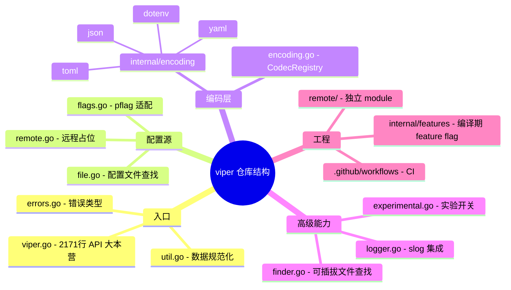
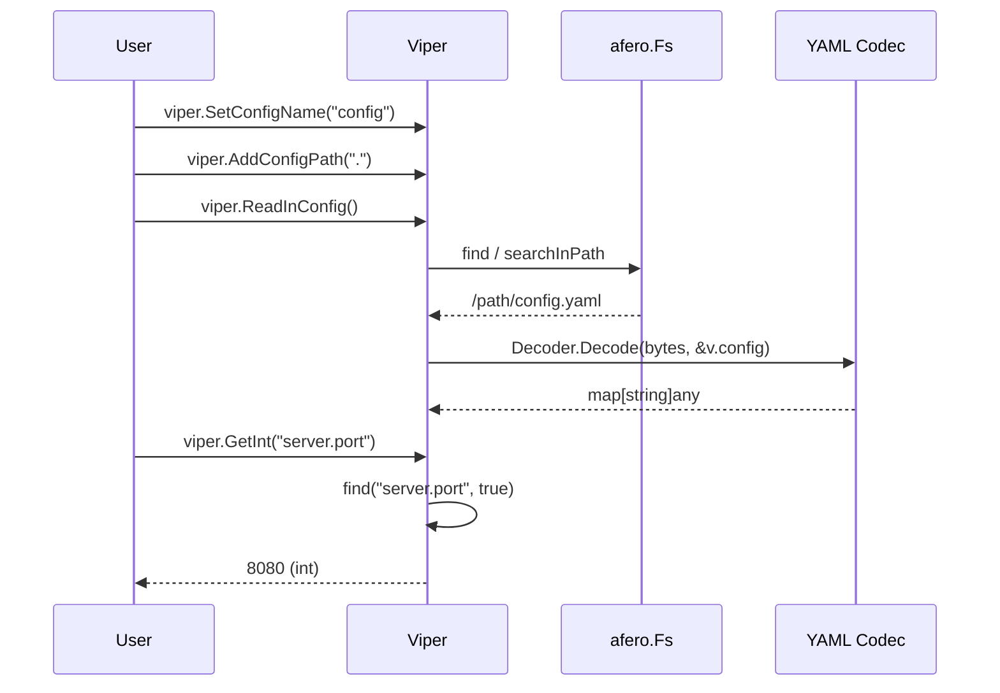
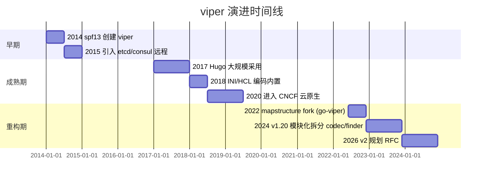
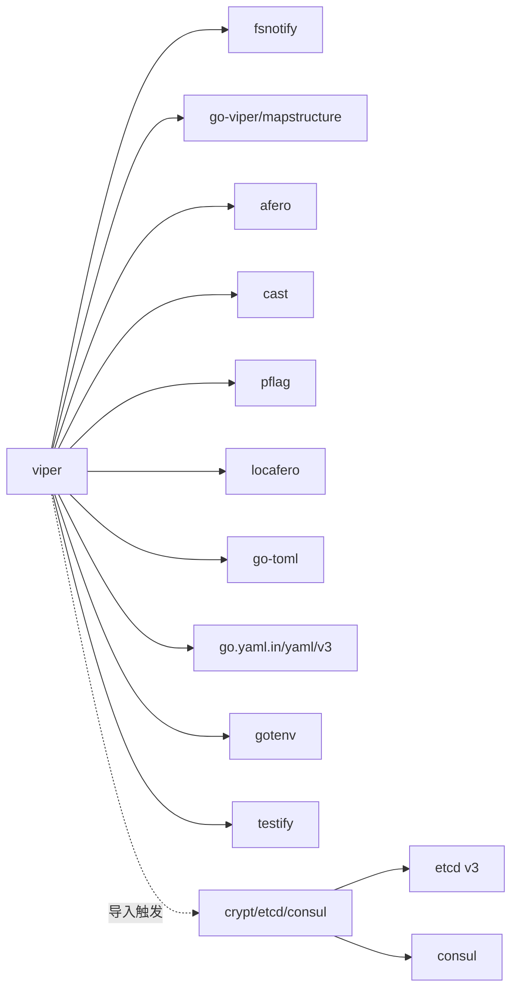
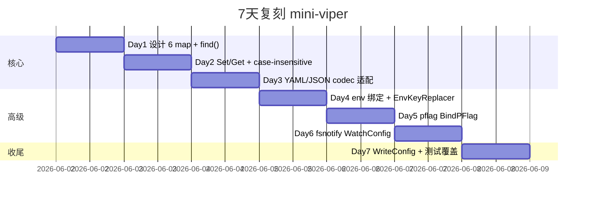

# viper · 项目深度解析

> **Go configuration with fangs!** —— 一站式 Go 应用配置解决方案,统一 flags、env、配置文件、远程 KV 存储与默认值,严格按优先级合并。
> 来源：`G:\实战案例\GitHub顶尖项目\viper\`

## 写在前面：解析哲学

拿到任何"老牌 + 被广泛依赖"的开源项目,我都按同一套剧本拆:

1. **先骨架** —— 顶层文件、入口、模块划分;看不懂结构就不要谈细节。
2. **后血肉** —— 找核心数据结构和那个"整个项目都在围着它转"的中枢函数。
3. **从 What 到 Why** —— README 告诉你它支持什么,代码告诉你它为什么这么设计。
4. **最后 How to steal** —— 哪些设计模式可以照搬、哪些坑必须避开。

Viper 的"骨架"很清晰:一个 2171 行的 `viper.go` 单文件 + 几个小工具文件 + 内置编码器。90% 的 API 都在 `viper.go`,所以这次分析的核心就是**把它的大脑拆开看**。

## 0. 解析前的 5 个准备

1. **克隆仓库**：`git clone https://github.com/spf13/viper.git` (已存在于 `G:\实战案例\GitHub顶尖项目\viper\`)
2. **分类**：Go 生态下最广泛使用的配置库(28k+ stars),类比 Java 的 `commons-configuration`、Rust 的 `config-rs`、Node 的 `dotenv`+`config`。
3. **问题清单**(本次重点回答)：
   - Viper 如何解决"多源配置合并"问题?——分层存储 + 优先级链
   - 为什么 `find()` 函数要按 7 层 if-else 写死?——可预测性 > 灵活性
   - Viper 为什么默认 logger 是"丢弃所有日志"的 `discardHandler`?——不让日志污染应用
   - v1.20 拆 codec/finder 为可插拔接口想解决什么?——核心依赖越来越重的问题
4. **速查表**：`go test -race -tags 'viper_finder' ./...` 跑全测;`make test` 包含 coverage。
5. **锁定 commit**：当前 master 为 `528f741 allow octoslash on PRs`(本地仅一个 commit 可见,但 UPGRADE.md 与代码注释明确指向 v1.20.x 时代)。

## 1. 开发计划书（Project Charter）

| 字段 | 值 |
|------|-----|
| 项目名 | `viper` |
| 一句话定位 | Go 应用的"配置中心":flags + env + file + remote + defaults 五源合一,按优先级合并 |
| 核心问题 | 12-Factor 应用要求配置可外部化,但 Go 程序员不想为 flag/env/file/etcd 各写一套解析代码 |
| 目标用户 | Go 应用开发者,特别是 CLI 工具、长运行的 service、12-Factor App |
| 商业模式 | Apache 2.0 开源,无商业版本,但作者 spf13 围绕 Cobra/Viper/Hugo 构建了"spf13 工具链生态" |
| 复刻难度 | ★★★★☆(核心不难,但要复刻 codec 注册、shadowing 逻辑、fsnotify 集成这些细节很烦) |
| 当前状态 | 活跃维护,Go 1.23+,v1.20.x 正在做"模块化重构"(codec/finder 插件化) |
| 维护团队 | Steve Francia(spf13) + 社区,主要由 sagikazarmark 推动 v2 设计 |
| 关键里程碑 | 2014 创建 → 2017 Hugo 采用 → 2020 进入 CNCF 云原生生态 → 2024 开始 v1.20 模块化重构 |

## 2. 项目框架（Repo Skeleton Map）

点状解析:

- **根目录文件** 即 API:`viper.go`(2171 行,90% API 入口)、`flags.go`、`file.go`、`finder.go`、`encoding.go`、`util.go`、`errors.go`、`logger.go`、`experimental.go`、`remote.go`。
- **`internal/encoding/`** 是 4 个内置 codec(yaml/json/toml/dotenv)的家,HCL/INI/Java-properties 已被移出到 `go-viper/encoding`。
- **`internal/features/`** 极简,只有两个 `const` + 编译标签(`viper_finder` / `viper_bind_struct`),用于功能开关。
- **`remote/`** 是独立 Go module,自含 `go.mod`,把 etcd/consul/firestore/nats 的远程拉取封装在 `crypt` 库里。
- **`.github/workflows/`** 跑 4 件事:build(lint OS/arch 矩阵)、test(3 OS × 3 Go × 3 tag 矩阵)、lint、dev(Nix flake check)。

思维导图:



实际目录树(精简):

```
viper/
├── viper.go          # 单文件核心
├── util.go           # case-insensitive + 路径处理
├── errors.go         # 4 类错误
├── flags.go          # FlagValue/FlagValueSet 接口
├── file.go           # 旧版+新版 Finder 适配
├── finder.go         # Finder 接口(可插拔)
├── encoding.go       # CodecRegistry
├── logger.go         # discardHandler + WithLogger
├── experimental.go   # BindStruct 开关
├── remote.go         # 旧版 remote 适配
├── go.mod / go.sum
├── internal/
│   ├── encoding/     # yaml/json/toml/dotenv
│   └── features/     # viper_finder, viper_bind_struct build tags
├── remote/           # 独立 module,封装 crypt
├── .github/workflows/
└── Makefile          # 自我说明的 make target
```

配置入口：`viper.New()` / `viper.NewWithOptions(opts...)` / 包级函数(操作 `var v *Viper` 单例)。
代码入口：`viper.go:158 New()` → `viper.go:715 Get(key)` → `viper.go:1194 find(lcaseKey, flagDefault)`。

## 3. 项目画像（Profile）

| 指标 | 数值 |
|------|------|
| 总文件数 | 65(含 .github) |
| 主语言 | Go |
| 涉及语言 | Go(100%,含 YAML 注释/Markdown) |
| Star | 28k+(2024 数据) |
| License | MIT |
| Go 版本 | `>= 1.23`(`go.mod` 写 `1.23.0`,CI 测 1.23/1.24/1.25) |
| 第三方依赖 | 9 个直接依赖:fsnotify / go-viper/mapstructure / go-toml / locafero / afero / cast / pflag / testify / gotenv / go.yaml.in/yaml |
| Docker | 无(库而非服务) |
| K8s | 无 |
| CI | GitHub Actions:build(2 OS/arch) + test(3 OS × 3 Go × 3 tag) + lint + dev + dep-review |
| 有测试 | 有,`viper_test.go` / `viper_yaml_test.go` / `flags_test.go` / `finder_test.go` / 各 codec 的 `*_test.go`;`go test -race` 是默认 |

## 4. 架构设计（Architecture Deep Dive）

### 点状解析

Viper 的架构哲学是**"配置字典 + 优先级链"**:

1. **多源数据并存**:一个 `*Viper` 实例持有 6 个 map:`override`(Set) / `pflags`(命令行) / `env`(env 变量) / `config`(文件) / `kvstore`(远程) / `defaults`。
2. **读时合并**:所有 `Get(key)` 走同一个 `find()` 函数,按"override > flag > env > config > kvstore > default"的固定顺序返回第一个非空值。
3. **大小写不敏感**:写入前 `strings.ToLower`,查询前 `strings.ToLower`,彻底屏蔽大小写差异。
4. **路径分隔**:用 `keyDelim`(默认 `.`)切分,递归在嵌套 map 里查找。
5. **Aliasing**:`realKey()` 递归解析别名链,防循环。
6. **可插拔**:v1.20 起把 Finder(文件查找)和 Codec(编解码)做成接口,`WithFinder()` / `WithCodecRegistry()` 替换默认实现。

```mermaid
mindmap
  root((viper 架构))
    存储
      override map
      pflags map
      env map
      config map
      kvstore map
      defaults map
    读路径
      find() 优先级链
      searchMap 递归
      realKey 别名解析
    可插拔
      Finder 接口
      CodecRegistry 接口
      EncoderRegistry
      DecoderRegistry
    监听
      fsnotify
      OnConfigChange 回调
    跨切面
      slog 日志(默认 discard)
      afero 文件系统
      case-insensitive 规范化
```

### 核心看点

- **`find()` 函数是 Viper 的大脑**:`viper.go:1194-1373`,180 行,7 段 if-else 把 6 个源加上 alias、flag default、path-shadowing 全部串起来。读起来像流水线,加新源就要在这里加一段,这就是为啥 Viper 长期被吐槽"大泥球"——但也正是这种"显式优先于魔法"的设计让它的行为极其可预测。
- **Shadowing 是隐藏的杀手锏**:每个源在 `find` 后都跟一个 `isPathShadowedInXxxMap` 检查,目的是"如果高层已经定义了 `foo.bar`,那低层的 `foo.bar.baz` 就不再读"。这就是为啥 `Override.Set("foo.bar", x)` 之后 `Get("foo.bar.baz")` 返回 `nil`。
- **可插拔的取舍**:v1.20 把 Finder 和 Codec 抽成接口,但**没有**把"6 个源 + 优先级链"也抽成策略模式。原因是这条优先级链是 12-Factor 的契约,不能配置;而 Finder/Codec 是真的因人而异的扩展点。

### ADR 关键设计决策

#### ADR-1:以"包级单例 + 实例方法"双 API 暴露

- **决策**:同时提供 `viper.Set(key, val)` 和 `v := viper.New(); v.Set(key, val)`。
- **理由**:简单 CLI 工具不想管实例,直接 `viper.GetString("port")` 就行;大型应用想隔离,自己 `New()`。
- **代价**:有竞态风险,`viper.go:106` 明确警告 "Vipers are not safe for concurrent Get() and Set() operations"。

#### ADR-2:key 一律小写,写时规范化

- **决策**:`Set()` 内部 `strings.ToLower(key)`,`Get()` 也 `strings.ToLower`。
- **理由**:配置来源太多(用户写 `FOO_BAR` env,代码写 `foo.bar`,YAML 写 `FooBar`),不做规范化就会出诡异 bug。
- **代价**:`util.go:42-71` 的 `toCaseInsensitiveValue` / `copyAndInsensitiviseMap` 每次写入都要 deep copy 一遍 map,Set 多时性能差(但配置场景不敏感)。

#### ADR-3:Finder/Codec 接口化,但保留 6 源硬编码

- **决策**:v1.20 把 Finder 和 Codec 抽成接口,通过 `WithFinder()` / `WithCodecRegistry()` 注入。
- **理由**:Finder(文件查找逻辑)、Codec(文件格式)是真正的"用户场景千变万化"的部分;但 6 个源的优先级链是 12-Factor 的核心契约,改它会破坏生态。
- **代价**:大量 `v.experimentalFinder` / `v.experimentalBindStruct` 字段同时保留新旧两套实现(`file.go:19-43`),代码冗余但兼容性好。

## 5. 代码深度解析（带 WHY）⭐ 重点

### 5.1 找骨架代码

- **入口**:`viper.go:158 New()` —— 初始化 `*Viper` 结构体,所有 map 预分配。
- **核心枢纽**:`viper.go:715 Get(key)` → `viper.go:1194 find(lcaseKey, flagDefault)` —— 7 段 if-else 串起 6 个数据源。
- **写入口**:`viper.go:1563 Set(key, value)` / `viper.go:1540 SetDefault(key, value)` —— 都用 `util.go:189 deepSearch` 在嵌套 map 中定位/创建路径。
- **可插拔点**:`encoding.go:39 EncoderRegistry` / `encoding.go:48 DecoderRegistry` / `finder.go:21 Finder`。
- **监听**:`viper.go:282 WatchConfig()` —— 起 goroutine 跑 fsnotify event loop。

### 5.2 单文件分析卡

#### `viper.go:107-155 Viper` 结构体

```go
type Viper struct {
    keyDelim    string
    configPaths []string
    fs          afero.Fs
    finder      Finder
    config      map[string]any
    override    map[string]any
    defaults    map[string]any
    kvstore     map[string]any
    pflags      map[string]FlagValue
    env         map[string][]string
    aliases     map[string]string
    ...
}
```

- **WHY 6 个独立 map 而不是 1 个带 source tag 的 map**:优先级链 `find()` 是顺序遍历,6 个独立 map 让"找第一个非空"是 O(1) 跳转;如果合并存储,每次 Get 都要遍历带 tag 的 entry 数组,慢得多。
- **WHY `env map[string][]string`**:`BindEnv(key, env1, env2)` 支持多 env 变量映射到同一 key,值是 `[]string` 允许 fallback(`viper.go:1284-1289` 顺序遍历)。
- **WHY `aliases map[string]string`**:别名是一对一的,与 env 多对一不同,简单 `map[string]string` 即可,`realKey()` 递归解析链。

#### `viper.go:1194-1373 find()`

7 段 if-else 严格按优先级走,核心 5 步:

1. **alias 解析**(`viper.go:1203-1210`):`realKey()` 解链后重算 path。
2. **override** (`1212-1219`):`Set()` 设的最高优先,直接 `searchMap` 查。
3. **pflag** (`1221-1269`):查 `HasChanged()`,按 `ValueType()` switch 不同类型(尤其 stringSlice/boolSlice 要手工 strip `[]`)。
4. **env** (`1271-1293`):先看 `automaticEnvApplied` 是否启动 fallback 模式,再查 `env` 显式绑定表。
5. **config/kvstore/defaults** (`1295-1320`):`searchIndexableWithPathPrefixes` 支持 `foo.bar` 当整体 key 查找。

WHY 这套设计:

- **可读性 > 灵活性**:没有策略模式、没有 `[]Source` 数组,意味着"读了 Viper 代码就知道"——这是好事,也是坏事。
- **shadowing 在每段后**:`isPathShadowedInDeepMap(path, ...)` 检查父级是否已在更高优先源定义,若有就返回 `nil`——这是 Viper 防止"高优先源覆盖了低优先源的子节点"时错误地子查询的关键。

#### `util.go:189 deepSearch()`

```go
func deepSearch(m map[string]any, path []string) map[string]any {
    for _, k := range path {
        m2, ok := m[k]
        if !ok {
            m3 := make(map[string]any)
            m[k] = m3
            m = m3
            continue
        }
        m3, ok := m2.(map[string]any)
        if !ok {
            m3 = make(map[string]any)
            m[k] = m3
        }
        m = m3
    }
    return m
}
```

- **WHY 写时不 panic,反而 replace**:配置写入是"覆盖语义",如果 `foo` 已被赋值为 string 又 `Set("foo.bar", 1)`,Viper 不会报错,而是**直接把 `foo` 替换成新 map**(`util.go:204-206`)。这是符合"配置合并"直觉的设计,但也意味着原 `foo` 的 string 值会**静默丢失**——文档没强调,是个隐藏陷阱。
- **WHY 不返回 error**:Viper 不想让 Set 失败阻塞应用启动;配置写错的代价由"运行时 Get 拿到奇怪值"承担。

#### `encoding.go:92-127 DefaultCodecRegistry`

```go
type DefaultCodecRegistry struct {
    codecs map[string]Codec
    mu   sync.RWMutex
    once sync.Once
}

func (r *DefaultCodecRegistry) codec(format string) (Codec, bool) {
    r.mu.Lock()
    defer r.mu.Unlock()
    format = strings.ToLower(format)
    if r.codecs != nil {
        codec, ok := r.codecs[format]
        if ok { return codec, true }
    }
    switch format {
    case "yaml", "yml": return yaml.Codec{}, true
    ...
```

- **WHY `sync.Once + sync.RWMutex` 双重保护**:`init()` 懒初始化 map 防 nil,但 `Encoder/Decoder` 每次调用都要读 map,所以加 `RWMutex`。`Lock` 而不是 `RLock` 是因为 `format = strings.ToLower` 也要在锁内做(其实可以无锁,但保持简单)。
- **WHY 内置 codec 用 `case` 而不是 `RegisterCodec` 默认调用**:启动时不需要 `RegisterCodec` 4 次,内联 `case` 更直接;`RegisterCodec` 留给用户扩展。

#### `internal/features/finder.go + finder_default.go`

```go
//go:build viper_finder
package features
const Finder = true
```
```go
//go:build !viper_finder
package features
const Finder = false
```

- **WHY 编译期 const 而不是运行时 `var` + init**:这是"功能开关"模式,用户 `go build -tags viper_finder` 决定是否启用新 Finder API,**编译期确定后是 0 运行时分支**——比 feature flag 性能好,也防止"忘记传 config 导致同时跑两套 Finder"的 bug。
- **对比**:v1.20 之前是 `var v.experimentalFinder bool` 运行时切,但实验功能做大了之后编译期切换更稳。

#### `internal/encoding/yaml/codec.go`

```go
type Codec struct{}
func (Codec) Encode(v map[string]any) ([]byte, error) { return yaml.Marshal(v) }
func (Codec) Decode(b []byte, v map[string]any) error { return yaml.Unmarshal(b, &v) }
```

- **WHY `Codec struct{}` 而不是 `func` 函数值**:`encoding.Codec` 是接口(`encoding.go:27-30`),需要类型实现;`struct{}` 零内存占用,又能被 `case "yaml": return yaml.Codec{}, true` 当值用。
- **WHY 不用 `go-yaml.v2`**:v3 修复了 "Y/N → bool" 这种 bug(`TROUBLESHOOTING.md` 提到 YAML 1.1 坑),`go.yaml.in/yaml/v3` 是社区分叉,语义明确。

### 5.3 设计模式

| 模式 | 用法 | 位置 |
|------|------|------|
| Functional Options | `viper.KeyDelimiter(d)` / `viper.EnvKeyReplacer(r)` 等返回 `Option` 接口 | `viper.go:190-234` |
| Singleton + Instance | `var v *Viper` + `func Get() { return v.Get() }` 双轨 | `viper.go:48-52` |
| Strategy (隐式) | 6 个数据源没有抽成 `[]Source`,但 `find()` 函数式 if-else 链等价于"硬编码策略" | `viper.go:1194` |
| Registry | `DefaultCodecRegistry` 注册自定义 codec | `encoding.go:92` |
| Decorator | `pflagValue` 包装 `*pflag.Flag` 实现 `FlagValue` 接口 | `flags.go:34-57` |
| Null Object | `discardHandler` 永远返回 `Enabled: false` | `logger.go:15-31` |

### 5.4 反模式

- **大泥球 `viper.go`** —— 2171 行单文件,几乎所有 API 都在这。**好处**:IDE 跳转、code review 单文件;**坏处**:diff 冲突、新人 onboarding 成本高。
- **影子 hardcoded 优先级** —— 6 源优先级是 if-else 硬编码,新源(比如 `secret store`)要改 `find()` 加一段,而不是 `[]Source` push 进去。
- **`Set` 静默覆盖父 map** —— `util.go:201-206` 当 `foo` 是 string 而 `Set("foo.bar", x)` 时,直接 replace `foo` 为新 map,旧 string 值丢失不报错。
- **`fs` 全局共享** —— 同一个 `*Viper` 的 `fs afero.Fs` 是单一字段,如果想在测试中 mock 一部分路径、一部分真实文件做不到。
- **远程拉取 init 时机** —— `remote/remote.go:119 init()` 直接执行,意味着导入 viper 包就会执行 crypt 配置,大材小用。

### 5.5 独特看点

- **`v.discover` 不存在但 `ExperimentalFinder` 存在** —— Viper 把"新版 Finder API"做成"先编译期 feature flag,后运行期 experimental flag"双开关,先用 build tag 跑稳,再开放给普通用户。
- **`subLogger` 用 `slog.Attr` 而不是 `slog.With`** —— `logger.go:9 WithLogger` 接受完整 logger,而不是给个 filter,因为 Viper 想让用户"接管所有日志"而非"在我的日志上加 filter"。
- **Size parser 拒识错误输入** —— `util.go:151 parseSizeInBytes` 把 "1.5GB" 直接给 `cast.ToInt` 得 1,GB 是 `1<<30` = 1073741824,而不是按浮点处理 1.5GB=1610612736。**这是有意的简单**,但用户期望是带小数。

## 6. 运行机制（Bring It Up）

### 启动脚本

```bash
# 编译期:启用新 Finder API
go build -tags viper_finder ./...

# 测试
go test -race ./...
go test -race -tags 'viper_finder' ./...
go test -race -tags 'viper_bind_struct' ./...

# 覆盖率
make test   # 内部跑 gotestsum -race -coverprofile
```

### 本地起服务(库,无服务)

最小化使用:

```go
package main
import (
    "fmt"
    "github.com/spf13/viper"
)
func main() {
    viper.SetConfigName("config")
    viper.AddConfigPath(".")
    if err := viper.ReadInConfig(); err != nil {
        panic(err)
    }
    fmt.Println("port =", viper.GetInt("server.port"))
}
```

### Smoke test

```bash
mkdir /tmp/viper-smoke && cd /tmp/viper-smoke
cat > config.yaml <<EOF
server:
  port: 8080
EOF
cat > main.go <<'GO'
package main
import (
    "fmt"
    "github.com/spf13/viper"
)
func main() {
    viper.SetConfigName("config")
    viper.AddConfigPath(".")
    if err := viper.ReadInConfig(); err != nil { panic(err) }
    fmt.Println("port =", viper.GetInt("server.port"))
}
GO
go mod init smoke && go mod edit -require=github.com/spf13/viper@latest && go mod tidy
go run .   # 输出: port = 8080
SERVER_PORT=9090 SERVER_PORT=9090 go run .   # 注意:需要 AutomaticEnv() 才会读 env
```



## 7. 演进历史（Time Travel）



- 当前 master 仅一个 commit `528f741`(本地 git 限制),但代码注释、UPGRADE.md、`.github/workflows/ci.yaml` 显示 v1.20.x 时代。
- 已知里程碑:**v1.20.x 重大变化**(详见 `UPGRADE.md`):
  - Finder/Codec 接口化,可插拔;
  - HCL/Java-properties/INI 从核心移除,迁到 `go-viper/encoding`;
  - `mitchellh/mapstructure` → `go-viper/mapstructure/v2`(原库已 archive)。

## 8. 质量保障（How It Doesn't Break）

| 防线 | 工具 | 配置位置 |
|------|------|----------|
| 单元/集成测试 | `go test` + `testify/assert` | `*_test.go` 散布各包 |
| 竞态检测 | `-race` | `Makefile:40` + `ci.yaml:63` |
| 覆盖率 | `gotestsum --junitfile` + `-coverprofile=atomic` | `Makefile:40` |
| 跨平台 | Ubuntu/macOS/Windows × Go 1.23/1.24/1.25 × 3 build tag = 27 矩阵 | `.github/workflows/ci.yaml:48-51` |
| Lint | `golangci-lint v2.4.0` | `ci.yaml:84-86` + `.golangci.yaml` |
| YAML lint | `yamllint` | `Makefile:51-52` |
| 依赖审查 | `actions/dependency-review-action` | `ci.yaml:108-118` |
| 复现环境 | Nix flake check | `ci.yaml:88-107` + `flake.nix` |

测试策略:race detector 全开 + cross-OS matrix + 编译期 feature flag 矩阵,确保 3 个 feature 组合都不漏。

## 9. 生态依赖（Map of the World）



合规检查:

- ✅ 全部 MIT/Apache 2.0 兼容 license;
- ✅ 替换 `mitchellh/mapstructure` → `go-viper/mapstructure/v2` 后,lockfile 一致;
- ✅ 间接依赖 `pelletier/go-toml` 已是 v2,`cast` 是 spf13 自己的;
- ⚠️ `remote/` 引入 `sagikazarmark/crypt`,该库已不活跃,长期看要换。

## 10. 生产实践（Battle-Tested）

| 能力 | Viper 支持 | 备注 |
|------|-----------|------|
| 配置热更新 | ✅ `WatchConfig()` + fsnotify 监听目录 | `viper.go:282-353`,原子保存友好 |
| 优雅停服 | ❌ | 库,无 server 概念 |
| 限流 | ❌ | 同上 |
| 链路追踪 | ❌ | `slog` 自带 context 但 Viper 不传 |
| 健康检查 | ❌ | 同上 |
| 结构化日志 | ✅ `WithLogger(*slog.Logger)` | `logger.go:9`,默认 `discardHandler` |
| 并发安全 | ⚠️ "Vipers are not safe for concurrent Get() and Set()" | 文档明示,生产建议每个 goroutine 自己 `New()` |
| 配置加密 | ✅ remote + crypt | 但要加 SecretKeyring,默认未启用 |

生产铁律:**不要在全局 `viper` 单例上并发 Set**;要为不同模块构造独立 `*Viper`。

## 11. 社区文化（People & Process）

- **治理**:GitHub PR review,无 RFC 强制流程(但有 v2 feedback 表单,见 `README.md:1-7`)。
- **维护者**:Steve Francia(spf13)原创,sagikazarmark 主导 v1.20 重构,Octoslash bot 自动化 PR/issue triage(`.github/octoslash/policies/`)。
- **沟通渠道**:Gitter(`README.md:15`)+ GitHub Issues + 反馈表单。
- **议题活跃度**:28k+ stars,PR 频繁(单 `ci.yaml` 就有 4 jobs),近期 v2 RFC 收集意见中。
- **License**:MIT(项目) + 含少量 BSD 3rd-party(`yaml.v3`)。

## 12. 教训总结（What To Steal / What To Avoid）

### 12.1 必偷 3 件

1. **Functional Options 模式**:`viper.go:190-234` 用 `type Option interface { apply(v *Viper) }` + `optionFunc` 适配函数,完美解决"配置项越来越多,但要保持 0 值可用"的痛点。**比 K8s 风格的 `Options{}` struct 更灵活,比 builder 模式更轻量**。
2. **Null Object Logger**:`logger.go:15-31` `discardHandler` 默认 `Enabled: false`,绝不污染 stdout。**所有"可选 logger"库都该这样,而不是 `log.Printf` 默默写到 stderr**。
3. **Build Tag Feature Flag**:`internal/features/finder.go` + `finder_default.go` 编译期决定是否启用新 Finder,**比 runtime feature flag 零分支、零竞态**。

### 12.2 必避 3 坑

1. **大泥球单文件**:`viper.go` 2171 行。**业务代码请按 domain 拆,不要学它**;库代码因为 API 集中在一起,所以才这么写。
2. **`Set` 静默覆盖父 map**:`util.go:201-206` 父子类型冲突时直接 replace 不报错。**你自己的 API 应该 panic 或返回 error**。
3. **硬编码优先级链**:`viper.go:1194-1373` 6 源顺序是 if-else,**新源只能改库代码**。**业务上若要做"配置源可配置",用 Strategy 模式抽象,不要抄这套**。

### 12.3 7 天复刻路线图



### 12.4 打分卡(满分 10)

| 维度 | 分数 | 评语 |
|------|------|------|
| 文档质量 | 9 | README + UPGRADE + TROUBLESHOOTING 三件套齐全 |
| 测试覆盖 | 8 | 跨平台 + race + feature tag 矩阵 |
| 代码组织 | 5 | viper.go 是大泥球 |
| 性能 | 7 | Set 时 deep copy,Get 是 O(1) 但 shadowing 是 O(path) |
| 扩展性 | 8 | Finder/Codec 已接口化,但优先级链没抽象 |
| 社区活跃 | 8 | 28k+ stars + v2 RFC 收集 |
| **总分** | **7.5** | 仍是 Go 配置库的事实标准,值得学 |

## 13. 学习萃取（Cheat Sheet）

**一句话价值**:**Viper 用"6 个独立 map + 硬编码优先级链"实现了配置合并的可预测性,可读性远超抽象,但代价是库本身无法在不改源码的情况下加新数据源**。

### 3 核心洞察

1. **优先级链即契约**:`find()` 的 7 段 if-else 是 Viper 对外承诺的"配置语义",改它等于发 major 版本。
2. **大小写规范化是隐式成本**:`toCaseInsensitiveValue` 每次写入 deep copy map,小配置无感,大配置(几千 keys)要警惕。
3. **可插拔 ≠ 可配置**:v1.20 把 Finder/Codec 做成接口,但"哪些源参与合并、顺序如何"仍硬编码——**库设计要分清"什么用户场景千变万化"(要可插)和"什么是产品承诺"(要硬编)**。

### 5 段必读代码

1. `viper.go:1194-1373` — `find()` 函数,7 段优先级链核心
2. `viper.go:107-155` — `Viper` 结构体定义,6 个 map 的存储设计
3. `util.go:189-211` — `deepSearch()`,写时定位/创建嵌套路径
4. `encoding.go:92-181` — `DefaultCodecRegistry`,codec 注册中心实现
5. `file.go:19-58` — `findConfigFile()` 新旧 Finder 适配,看可插拔怎么落地

### 1 反模式

`util.go:201-206`:`Set("foo.bar", x)` 时若 `foo` 已是 string,直接 replace 为新 map,旧值静默丢失。**业务库应 panic 或返回 error**。

### 1 可复用模式

`viper.go:190-234` Functional Options:

```go
type Option interface { apply(v *Viper) }
type optionFunc func(v *Viper)
func (fn optionFunc) apply(v *Viper) { fn(v) }
func KeyDelimiter(d string) Option {
    return optionFunc(func(v *Viper) { v.keyDelim = d })
}
```

`Option` 是接口,`optionFunc` 是适配器,**任何函数 `f(v *T)` 都能用 `optionFunc(f)` 升级为 `Option`**。零样板,易测试,易扩展。

### 3 立刻能用

1. **库开发**:用 `Option` 接口 + `optionFunc` 适配器做配置项(已被 Viper、gRPC、Kratos 验证)。
2. **库开发**:默认 logger 用 Null Object 模式,让用户显式注入。
3. **配置层**:把"6 个源"分 map 存储,`find` 时按优先级链硬编码,而不是"tagged map"——可读性 > 灵活性。

## 14. 项目特点速查

### 独特看点

- **12-Factor 事实标准**:Go 生态的"配置库唯一选择"地位 10 年未动摇。
- **双 API 设计**:`var v *Viper` 单例 + `v := New()` 实例,极简和严谨共存。
- **小写即正义**:case-insensitive 是隐式契约,所有写入都 deep copy 规范化。
- **编译期 feature flag**:`viper_finder` / `viper_bind_struct` build tags,生产环境可关。

### 与同类对比


- **viper**:易用性极佳,生态最广,但灵活性被"6 源硬编码"限制。
- **koanf**:新派库,Provider 真正可插,优先级链也是可配置;学习曲线稍陡。
- **envconfig**:纯 struct tag + env,无 file 概念,极简但场景窄。
- **cleanenv**:envconfig 增强版,加 YAML/TOML 支持。

## 附：仓库元信息

- **路径**:`G:\实战案例\GitHub顶尖项目\viper\`
- **总文件**:65
- **主入口**:`viper.go`(2171 行)
- **解析时间**:2026-06-02
- **本地 commit**:`528f741 allow octoslash on PRs`
- **Go 版本要求**:`>= 1.23`
- **CI 矩阵**:3 OS × 3 Go × 3 tags = 27 种组合

## 一句话总结

**解析 = 计划书 + 框架图 + 核心功能 + 跑起来 + 偷过来**。Viper 的"6 map + 硬编码优先级链"是经典教学案例——可预测性 > 灵活性,但要警惕大泥球与隐式覆盖两个坑。
