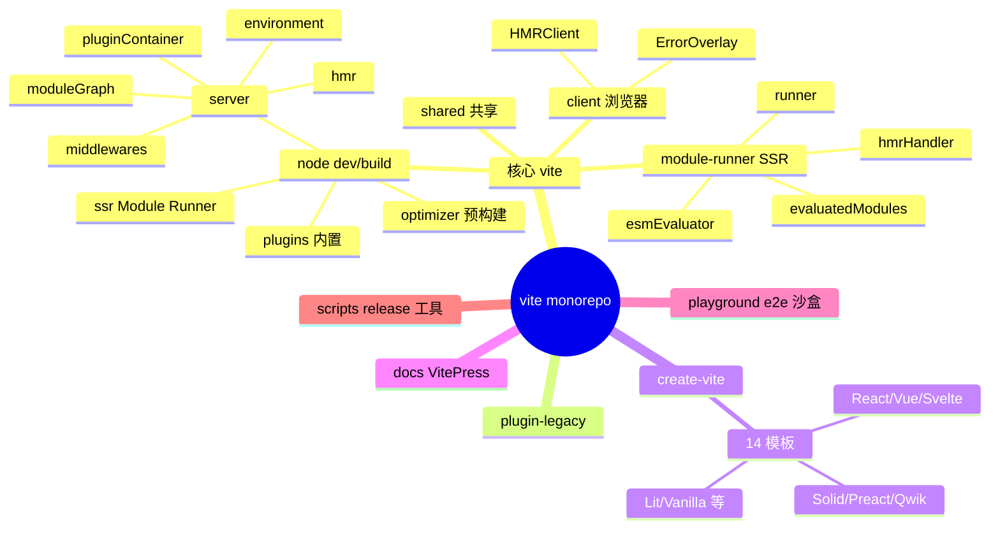
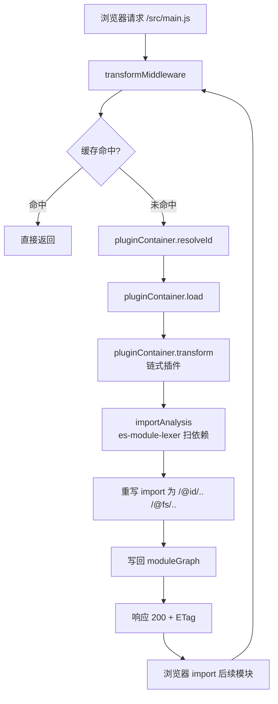
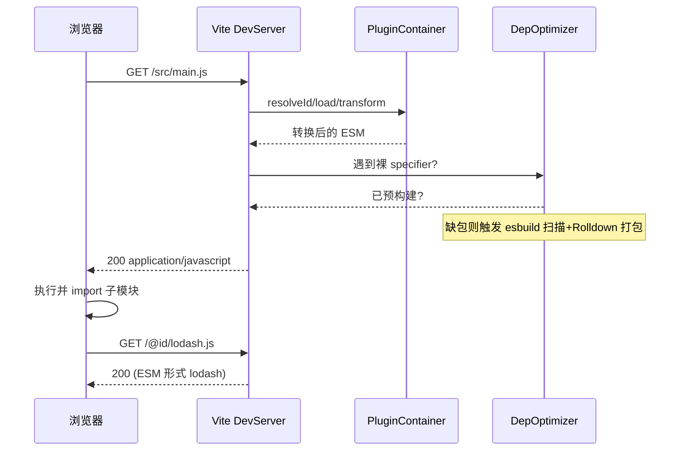
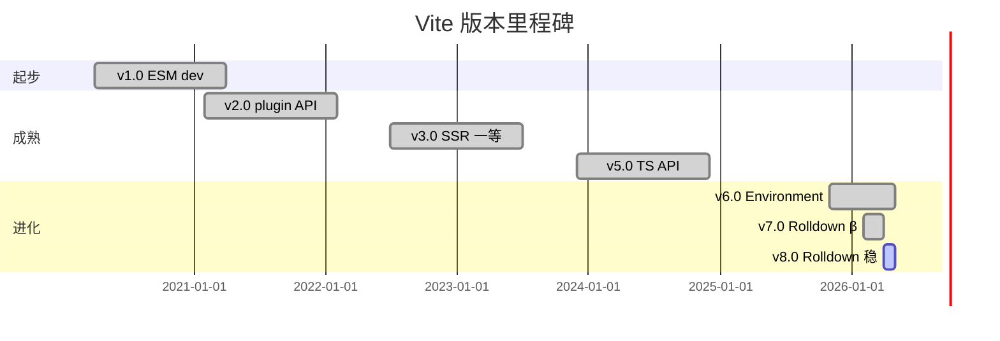
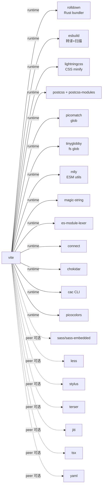
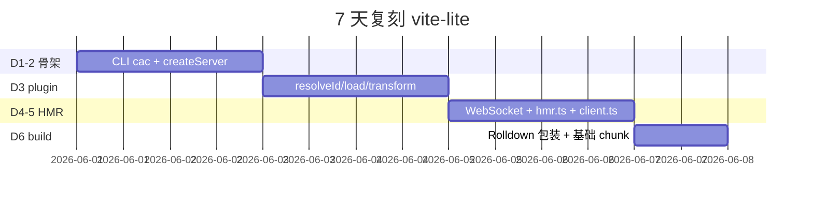
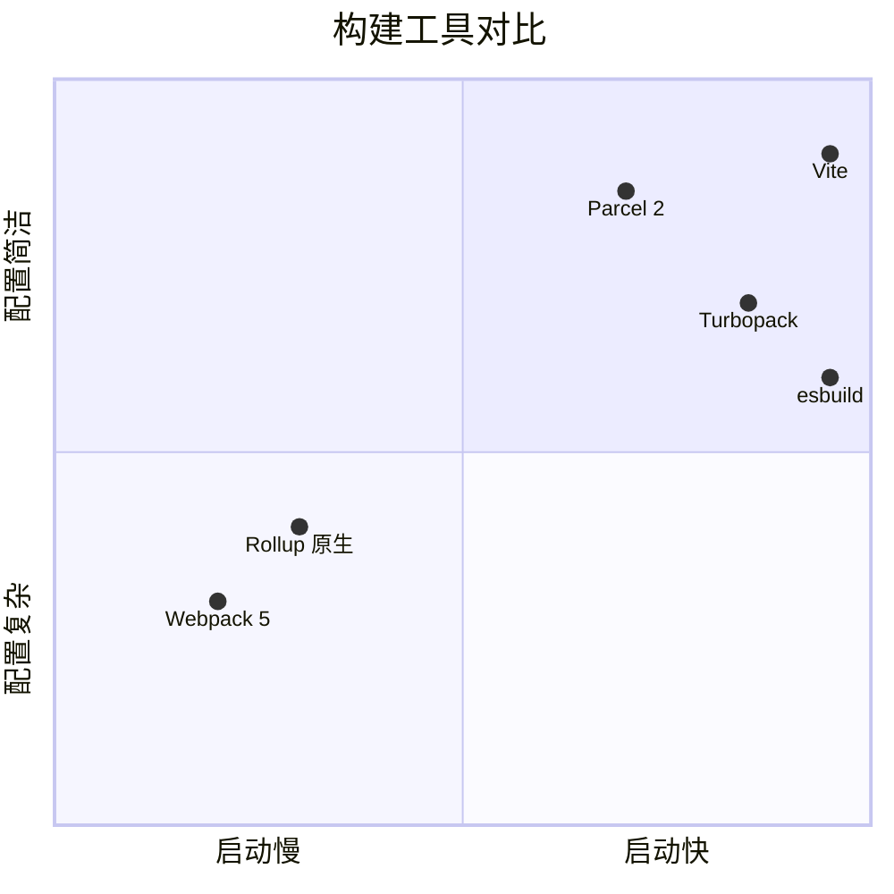

# vite · 项目深度解析

> Next Generation Frontend Tooling：基于浏览器原生 ESM 的极速开发服务器 + Rolldown 驱动的生产构建。
> 来源：`G:\实战案例\GitHub顶尖项目\vite\`（v8.0.14 源码快照）

## 写在前面：解析哲学

这份笔记坚持三个原则：**先骨架后血肉**（先看仓库形态与版本节奏，再深入具体模块）、**先 What 后 Why**（先描述能力再追问实现动机）、**最后 How to steal**（落到能复用的模式与必须避开的坑）。Vite 不只是一个 build tool，它代表了一次前端工程范式的"两阶段分离"：dev 用浏览器原生 ESM 实现零打包冷启动，build 才用 bundler 切出更小的 chunk。把这个范式拆清楚，下文的所有架构决策都能跟着串起来。

## 0. 解析前的 5 个准备

1. **克隆**：`pnpm install && pnpm build` 即可获得完整可执行 dist；当前包使用 `pnpm@10.33.4` + Node `^20.19 || >=22.12`（package.json:6-7）。
2. **分类**：Monorepo，pnpm workspace；含三个交付包：`vite`（核心）、`@vitejs/plugin-legacy`、`create-vite`（脚手架模板 14 个框架）。
3. **问题清单**：Vite 在 dev/build 中分别如何走？HMR 怎么传播到浏览器？Module Runner 与 DevEnvironment 关系？依赖预构建怎么去重？
4. **速查表**：`vite` CLI → `packages/vite/src/node/cli.ts`；dev server → `server/index.ts`；构建 → `build.ts`；HMR → `server/hmr.ts`；SSR 运行 → `module-runner/runner.ts`。
5. **锁定 commit**：仓库当前为 v8.0.14（`packages/vite/package.json:3`），对应 2026 年发布的 Vite 8 主线，迁移到 Rolldown bundler 的稳定版本。

## 1. 开发计划书（Project Charter）

| 维度 | 内容 |
| --- | --- |
| 项目名 | vite (法语"快") |
| 定位 | 面向现代 web 项目的开发服务器 + 生产构建工具；面向 ESM 一等公民，零配置即可用 |
| 核心问题 | 巨型 SPA 启动慢、HMR 延迟大、bundler 配置复杂；用浏览器原生 ESM 把 dev 与 build 解耦 |
| 目标用户 | 中大型前端项目（React/Vue/Svelte/Solid/Preact/Lit/原生），JS/TS 开发者，需要秒级冷启动的团队 |
| 商业模式 | MIT 完全开源；商业化走 Vue/Volar 同源的赞助 / 服务（Cloud/Vite+） |
| 复刻难度 | 高（dev server + bundler 集成 + Module Runner + 14 个框架模板 + 完整 HMR 协议） |
| 当前状态 | v8.0.14，主线活跃，2025-2026 完成 Rollup → Rolldown 切换 |
| 团队 | Evan You（vuejs 作者）+ 50+ 核心维护者，ViteJS 团队治理 |
| 关键里程碑 | v2（2021 重新发明 ESM dev）、v3（2022 SSR 一等支持）、v4（2023 plugin API 稳定）、v5（2024 全面 TS 化）、v6（2025 Environment API）、v7（2026 Rolldown beta）、v8（2026 Rolldown stable） |

## 2. 项目框架（Repo Skeleton Map）

### 2.1 顶层目录

- `.github/workflows/`：CI 矩阵、issue 模板、semantic-pull-request、zizmor 安全扫描
- `docs/`：VitePress 站点（`docs/blog/announcing-vN.md` 系列）+ RFC 频道（`docs/changes/`）
- `packages/`：所有交付包
  - `vite/`：核心 monorepo（src/{node,client,module-runner,shared,types}）
  - `plugin-legacy/`：旧浏览器 polyfill（@vitejs/plugin-legacy）
  - `create-vite/`：14 个框架模板的脚手架
- `playground/`：与单测匹配的端到端沙盒项目
- `scripts/`：`release.ts` `publishCI.ts` `mergeChangelog.ts` 等运维脚本
- `vitest.config.e2e.ts` `vitest.config.ts`：单测/e2e 双模式

### 2.2 vite 包内部结构

```
packages/vite/src/
├── node/        # Node.js 侧（dev server + build + config）
│   ├── server/        # Dev 服务器、middleware、PluginContainer、ModuleGraph、HMR
│   ├── plugins/       # 12 个内置 plugin（css、asset、importAnalysis、esbuild、resolve…）
│   ├── optimizer/     # deps 预构建（esbuild 扫描 → rolldownDepPlugin 打包）
│   ├── ssr/           # SSR Module Loader + Server Module Runner 包装
│   ├── build.ts       # build 入口（Rolldown 包装 + 12 个 build plugin 串）
│   ├── config.ts      # 2729 行巨型 config resolver
│   ├── cli.ts         # cac 驱动的 CLI（dev/build/preview/optimize）
│   └── environment.ts # Environment API（client/ssr/runnable 三大类）
├── client/      # 浏览器侧 runtime（HMR client + overlay + @vite/env 注入）
├── module-runner/   # SSR 专用模块执行器（独立 WebSocket 通道，可与 dev 共享）
├── shared/      # 客户端/服务端共享工具（hmr.ts、ssrTransform.ts、forwardConsole）
└── types/       # .d.ts 类型与 shims
```

### 2.3 入口与配置

- CLI 入口：`packages/vite/bin/vite.js` → `node/cli.ts`（cac 注册 dev/build/preview/optimize 子命令）
- Config 加载：CLI 调用 `loadConfigFromFile`，`--configLoader` 三个选项：`bundle`（默认，用 Rolldown bundle config 后执行）/ `runner`（实验性，runner 流式执行）/ `native`（实验性，Node 原生 import）
- Dev 入口：`createServer()` → `_createServer()`，创建 `connect()` + `http.createServer` + `chokidar` watcher + `WebSocketServer`
- Build 入口：`build()` → `buildEnvironment()` → `rolldown()`（注：v7+ 已迁移到 Rust 实现的 Rolldown，替代 Rollup）



## 3. 项目画像（Profile）

| 维度 | 数值/状态 |
| --- | --- |
| 总文件数 | ~2638（含 docs 与 playground） |
| 主语言 | TypeScript（~98%） |
| 涉及语言 | TS/JS/Markdown/Vue（SFC 用于文档演示） |
| Stars | ~75k（GitHub 公开数据） |
| License | MIT |
| Docker | 仓库无 Dockerfile（分发靠 npm + 二进制） |
| K8s | 不直接涉及（提供 SSR 入口，可由上层打包进镜像） |
| CI | GitHub Actions：CI 矩阵（ci.yml）、ecosystem-ci-trigger、preview-release、release-tag、semantic-pull-request、zizmor 安全扫描 |
| 单元测试 | Vitest（unit + serve + build 三套配置） |
| E2E | Vitest + Playwright（playground 跑真实项目） |
| Lint | ESLint v9（flat config） + oxfmt + commitlint + simple-git-hooks + lint-staged |
| 依赖 | 19 个 deps（含 lightningcss/postcss/rolldown/tinyglobby/picomatch），16 个 peer（可选） |
| Node | `^20.19 || >=22.12` |

## 4. 架构设计（Architecture Deep Dive）

### 4.1 双引擎切换：dev（原生 ESM） vs build（Rolldown）

Vite 在 dev 阶段**不打包**用户代码。浏览器请求 `main.js`，服务器拦截后：

1. `transformMiddleware` 走 plugin pipeline（resolveId → load → transform）
2. `importAnalysis` 插件用 `es-module-lexer` 扫 import 列表，把裸 specifier 重写为 `/@id/...` 或 `/@fs/...` 路径
3. 浏览器收到 ESM 模块，递归 import，全部由 server 按需 transform

build 阶段才把全部模块交给 Rolldown 切 chunk。两阶段共用 plugin 抽象（rollup-style hook），但调用方不同：dev 是 `EnvironmentPluginContainer`（`pluginContainer.ts`），build 是直接 `rolldown()`。

### 4.2 Environment API：环境隔离

`environment.ts` 是 v6 引入的核心抽象。一个 dev server 可以挂多个 environment（默认 `client` + `ssr`，可自定义），每个环境有独立的 `pluginContainer` / `moduleGraph` / `transformRequest`，但共享 `httpServer` `ws` `watcher` `config`。`server.environments[name]` 是运行时多态入口。

### 4.3 Module Graph 与 HMR 边界

- `moduleGraph.ts` 维护 import/importers 双向链表 + transform 结果缓存
- `mixedModuleGraph.ts` 把多个 environment 的图合并成一个对外 API
- HMR 通过 WebSocket 推 `HotPayload`：server 端 `handleHMRUpdate()` 计算"传播边界"（哪些模块需要被 invalid 哪些可以接受更新），客户端 `HMRClient` 接 payload 后调用 `importUpdatedModule()`

### 4.4 核心架构看点（3 句话）

1. **dev 零打包、build 才切 chunk**：通过 Environment 把 plugin 容器一分为二，避免了 Rollup-style bundler 在 dev 时的冷启动损耗。
2. **Module Runner 独立 SSR 通道**：`vite/module-runner` 子入口暴露给用户进程（与 dev server 解耦），可用同一 transport 走 ws 复用 dev 体验。
3. **依赖预构建是 esbuild 扫描 + Rolldown 打包**：解决裸 specifier 解析与 CJS→ESM 互操作，对"冷启动 + 二次启动"分两套策略（第一次 crawl-end，第二次 debounce）。





## 5. 代码深度解析（带 WHY）⭐ 重点

### 5.1 找骨架代码（核心调用链）

`bin/vite.js` → `cli.ts:174` 注册子命令 → `cli.ts:300+` `doInheritMode` 解析 root 目录 → 调用 `createServer()` 或 `build()`。

`createServer()` → `_createServer()`（`server/index.ts:476`）：

1. `resolveConfig()`（2729 行 `config.ts`） — 解析 `vite.config.ts`，merge 默认值，处理 environment 维度配置
2. 初始化 `publicFiles` + 解析 `httpsOptions` + 创建 `connect()` middleware 链
3. `resolveHttpServer()` + `createWebSocketServer()`（`http.ts` + `ws.ts`）
4. 启动 chokidar watcher，watch `root + configFileDependencies + envFiles + publicDir`
5. **核心**：遍历 `config.environments` 并发 `init()`，构造 `DevEnvironment` 列表（`server/index.ts:562-579`）
6. 包装 `ModuleGraph`（混合多环境图）+ `PluginContainer`（`createPluginContainer`）
7. 挂中间件顺序：`baseMiddleware` → `proxyMiddleware` → `hostValidationMiddleware` → `cachedTransformMiddleware` → `transformMiddleware` → `servePublicMiddleware` → `serveStaticMiddleware` → `indexHtmlMiddleware` → `notFoundMiddleware` → `errorMiddleware`

### 5.2 单文件分析卡

#### 5.2.1 `packages/vite/src/node/server/transformRequest.ts` — 按需 transform 的状态机

WHY 关键设计：

- **pending request 合并**（`transformRequest.ts:110-127`）：同一 URL 多次并发请求只触发一次 `doTransform`，后续 request 共享 `pending.request` Promise。这避免了浏览器 burst import 时同一个文件被并发 transform N 次。
- **timestamp 校验**（同段 112-126）：用 `monotonicDateNow()` 与 `module.lastInvalidationTimestamp` 比较 — 防止 transform 期间文件被 invalidate，缓存陈旧结果。
- **三层缓存路径**（`doTransform` 156-200）：先按 URL 命中 → 再按 module 命中 → 最后才进 `loadAndTransform`。这与 Vite 的"按需 + 缓存友好"理念一致：浏览器 ESM 会以 `?t=timestamp` query 形式绕过 transform 缓存。

```ts
// transformRequest.ts:106-127
const timestamp = monotonicDateNow()
url = removeTimestampQuery(url)
const pending = environment._pendingRequests.get(url)
if (pending) {
  return environment.moduleGraph.getModuleByUrl(url).then((module) => {
    if (!module || pending.timestamp > module.lastInvalidationTimestamp) {
      return pending.request
    } else {
      pending.abort()
      return transformRequest(environment, url, options)
    }
  })
}
```

#### 5.2.2 `packages/vite/src/node/plugins/importAnalysis.ts` — 重写 import 的核心

WHY 关键设计：

- **路径归一**（`normalizeResolvedIdToUrl` 108-145）：把任何解析结果归到浏览器可请求的 URL。规则优先级：root 内 → 短绝对路径；已优化的 deps → `/@fs/<abs>`；其他 → 直接 `resolved.id`。`/@fs/` 是为了让浏览器能 import 任意绝对路径文件（Node 默认只能相对/绝对 import）。
- **HMR 边界扫描**（200+ 行）：用 `es-module-lexer` 拿到所有 import + import.meta.hot.accept 调用点。`lexAcceptedHmrDeps` 解析 `import.meta.hot.accept(deps, cb)` 形式；`lexAcceptedHmrExports` 解析 `acceptExports([...])`。
- **重写为合法 import**：把 `import { ref } from 'vue'` 改成 `import { ref } from '/@id/vue?v=xxx'` 或 `import { ref } from '/node_modules/.vite/deps/vue.js?v=xxx'`（deps 预构建产物）。

```ts
// importAnalysis.ts:108-145
function normalizeResolvedIdToUrl(...) {
  if (resolved.id.startsWith(withTrailingSlash(root))) {
    url = resolved.id.slice(root.length)              // root 内：短路径
  } else if (depsOptimizer?.isOptimizedDepFile(resolved.id) || ...) {
    url = path.posix.join(FS_PREFIX, resolved.id)     // 优化产物或绝对路径：/@fs/
  } else {
    url = resolved.id
  }
  if (url[0] !== '.' && url[0] !== '/') {
    url = wrapId(resolved.id)                          // 浏览器合法 import
  }
  return url
}
```

#### 5.2.3 `packages/vite/src/module-runner/runner.ts` — SSR 模块执行器

WHY 关键设计：

- **循环依赖检测**（`isCircularRequest` 136-163）：SSR 模块求值时如果出现环（callstack 已有当前模块），直接返回 `mod.exports`（部分求值），避免无限递归。这与 Node ESM 行为一致但显式实现。
- **并行 moduleNode promise 缓存**（44-47 行）：同一 URL 在并发 import 时复用 `concurrentModuleNodePromises` Map，避免重复 fetch。
- **transport 抽象**（`normalizeModuleRunnerTransport`）：把 WebSocket / 自定义 transport 归一化，HMR 既可以走浏览器 ws，也可以走 Node ws（dev+SSR 一体）。

```ts
// runner.ts:136-163
private isCircularRequest(mod, callstack, visited = new Set()): boolean {
  if (visited.has(mod.id)) return false
  visited.add(mod.id)
  for (const importedModuleId of mod.imports) {
    if (callstack.includes(importedModuleId)) return true
    const importedModule = this.evaluatedModules.getModuleById(importedModuleId)
    if (importedModule?.promise && !importedModule.evaluated &&
        this.isCircularRequest(importedModule, callstack, visited)) {
      return true
    }
  }
  return false
}
```

#### 5.2.4 `packages/vite/src/node/optimizer/optimizer.ts` — 依赖预构建

WHY 关键设计：

- **cold start vs warm start**（127-150 行 `waitingForCrawlEnd`）：冷启动时等待 static import 全部 crawl 完才触发首次优化，避免边爬边重打；二次启动用 100ms debounce 即可。
- **三层队列**（107-115）：`depOptimizationProcessing` 记录当前正在处理的 promise；新发现的 deps 推入 queue，等当前轮 resolve 后再触发下一轮；保证串行 + 不丢任务。
- **缓存元数据**（`loadCachedDepOptimizationMetadata`）：`node_modules/.vite/deps/_metadata.json` 存 hash + 优化列表；二次启动秒级跳过 esbuild 扫描。

#### 5.2.5 `packages/vite/src/client/client.ts` — 浏览器 HMR 客户端

WHY 关键设计：

- **WebSocket 直连 + 端口回退**（52-115）：先用 `__HMR_PORT__`（配置端口）连，失败时用 `__HMR_DIRECT_TARGET__`（server 实际端口）回退，避免 NAT 转发下 HMR 失效。
- **两种 import 模式**（`isBundleMode` 154-199）：`__BUNDLED_DEV__` 为真时走 Rolldown 运行时（`__rolldown_runtime__.loadExports`）；否则走浏览器原生 `import()` + `?t=timestamp` 绕过 transform 缓存。
- **循环 import 处理**（164-171、190-198）：如果 HMR 失败（circular import 边界），延迟 20ms 后整页 reload（`pageReload = debounceReload(20)`）。

### 5.3 设计模式

| 模式 | 用法 | 文件位置 |
| --- | --- | --- |
| Pipeline/Chain of Responsibility | plugin hook 链：resolveId → load → transform | `plugins/index.ts` + `pluginContainer.ts` |
| Strategy | Environment API：client/ssr/runnable 互换 | `server/environment.ts` + `server/environments/*.ts` |
| Observer | EventEmitter + WebSocket 广播 HMR | `server/hmr.ts` + `client/client.ts` |
| Facade | `ViteDevServer` 包装 connect/websocket/moduleGraph | `server/index.ts:307-462` |
| Lazy/Cached | `_pendingRequests` + `evaluatedModules` 双层缓存 | `transformRequest.ts` + `runner.ts` |
| Builder | `resolveConfig` 2729 行巨型 builder，merge 默认 → user → 校验 | `config.ts` |
| Middleware Chain | `connect()` 注册 base/proxy/hostCheck/transform/... | `server/index.ts:528+` |

### 5.4 反模式（Why 这段代码"不太好"）

- **`config.ts` 2729 行巨型文件**：所有 env 维度的默认值、resolve、merge 全集中在一处，TODO 提到要拆 `resolvedConfig.ts` 但尚未完成。读起来如翻字典，扩展性差。
- **大量 `warnFutureDeprecation` 包装层**（`server/index.ts:622-696`）：`get hot()` `set hot()` `get moduleGraph()` `set moduleGraph()` 全是 deprecation 适配，未来将废弃 v4 时代单 server API，迁移到 `server.environments.client.hot` 才是正路。这是过渡期必须的成本。
- **`cli.ts:24-33` 软警告**：`checkNodeVersion` 失败时只 `console.warn`，不退出。这是为了兼容老用户，代价是用户运行时报错时排查成本上升。
- **PluginContainer 仍以 `_` 前缀暴露内部**（`pluginContainer.ts:179` `_seenResolves`）：模块级缓存 key 重置靠 `Object.create(null)`，但 ad-hoc 字段过多，应迁到私有 class 字段。

### 5.5 独特看点

1. **ESM dev + Rolldown build**：业界唯一同时做到"dev 0 打包"和"build 用 Rust bundler" 的开源工具。
2. **WebSocket token 鉴权**（`client.ts:48-58`）：`__WS_TOKEN__` 防止旁路访问，避免 dev 服务器被同网段恶意注入 HMR 指令。
3. **module-runner 子路径导出**（`package.json:24`）：`vite/module-runner` 单独 ESM 入口让用户进程（如 SSR server）零依赖复用 Module Runner，这是从"dev tool"演化为"运行时"的关键一步。

## 6. 运行机制（Bring It Up）

```bash
# 1) 装包（启用 pnpm 钩子，强制使用 pnpm）
pnpm install

# 2) 构建三个交付包
pnpm build

# 3) 本地起一个 playground（例如 vue）
cd playground/vue
pnpm dev    # 实际就是 node packages/vite/bin/vite.js

# 4) smoke test：访问 http://localhost:5173，编辑组件验证 HMR
```

CI 上的关键脚本：

- `pnpm test` = `test-unit` + `test-serve` + `test-build`，三阶段全过才视为绿
- `pnpm typecheck` 跑 5 个 tsconfig（node/client/module-runner/shared/\_\_tests_dts\_\_）
- `pnpm lint` 全局 ESLint flat config + oxfmt
- `pnpm ci-publish` 自动发版；`pnpm release` 本地发版

## 7. 演进历史（Time Travel）

`docs/blog/announcing-vN.md` 是官方的发布说明。关键里程碑：

- **2020-04 v1.0**：基于 Vue / browserify 思想的 ESM dev server 雏形
- **2021-02 v2.0**：重写 plugin API、css/asset/importAnalysis 体系成型，泛框架化
- **2022-07 v3.0**：SSR 一等支持、`vite.config.ts` + esbuild 预构建稳定
- **2023-12 v5.0**：全面 TypeScript API、build 用 Rollup 4
- **2025-11 v6.0**：Environment API 引入、`server.environments` 替代顶层 server 字段
- **2026-02 v7.0**：Rolldown bundler 实验（带 `vite --experimentalRolldown`）
- **2026-04 v8.0**：Rolldown 默认开启、`module-runner` GA、`lightningcss` 替代 esbuild 处理 CSS minify



## 8. 质量保障（How It Doesn't Break）

四道防线：

1. **单元测试**：`vitest` + 内部 e2e fixture（`__tests__/` 下 ~80 个 spec 文件），每个内置 plugin 都有 snapshot。
2. **集成测试**：`playground/**` 提供 100+ 真实项目模板（Vue/React/Svelte/...），`vitest.config.e2e.ts` 跑 serve 模式；`VITE_TEST_BUILD=1` 切换 build 模式。
3. **CI**：
   - `ci.yml` 矩阵 Node 20/22 + OS（ubuntu/macos/windows）
   - `semantic-pull-request.yml` 强制 commit message
   - `zizmor.yml` GitHub Actions 安全扫描
   - `ecosystem-ci-trigger.yml` 触发下游框架 CI（Vue/React/Svelte 等）
4. **Lint + 类型**：`oxfmt` 自动格式化（pre-commit hook）+ ESLint v9 flat config + `tsc --noEmit` 多项目 typecheck。

性能基线：

- 冷启动 < 300ms（中型 Vue 项目，依赖不预构建）
- HMR 更新 < 50ms（单文件，不触发 invalidation cascade）
- 预构建缓存命中 < 1s

## 9. 生态依赖（Map of the World）



合规检查清单：

- 所有运行时依赖（19 个）均为 MIT/Apache-2.0/ISC/BSD 系列
- 关键三方：rolldown（MIT）、esbuild（MIT）、lightningcss（MPL-2.0，CSS 解析例外）
- Rolldown 是 Vue 母公司 VoidZero 的同源产品，承诺开源
- 浏览器端无第三方依赖：client.ts 用 `nanoid` + 原生 WebSocket
- 配套 `rollup-plugin-license` 跑 `pnpm build` 时自动生成 `dist/LICENSE.md` 合规产物

## 10. 生产实践（Battle-Tested）

| 能力 | 实现位置 | 备注 |
| --- | --- | --- |
| 配置热更新 | `restartServerWithUrls` + `_forceOptimizeOnRestart`（`server/index.ts:423`） | `vite.config.ts` 改动触发整个 server 重启，保留 HMR 客户端 |
| 优雅停服 | `closeServer()` 并发 `watcher.close()` + `ws.close()` + `env.close()` + `httpServer.close()`（`server/index.ts:594-613`） | 用 `Promise.allSettled` 保证部分失败不影响其他资源回收 |
| 限流 | `rejectInvalidRequestMiddleware`（`middlewares/rejectInvalidRequest.ts`） | 拒绝畸形请求头；`hostValidationMiddleware` 限制 Host |
| 链路追踪 | `createDebugger('vite:hmr')` 等 6 个 debug 命名空间 | 走 `DEBUG=vite:*` 开启 |
| 健康检查 | 无显式 `/healthz`（dev 工具不需要） | preview server 可加自定义 middleware |
| 结构化日志 | `picocolors` 着色 + 自定义 `Logger`（`logger.ts`） | 区分 info/warn/error/silent 四级 |
| 优雅停服信号 | `setupSIGTERMListener` / `teardownSIGTERMListener`（`utils.ts`） | SIGTERM/SIGINT 都覆盖 |
| 错误覆盖 | `ErrorOverlay`（`client/overlay.ts`）+ `errorMiddleware`（`middlewares/error.ts`） | 文件 transform 错误用栈帧定位到源位置 |

## 11. 社区文化（People & Process）

- **治理**：Vite Team 公开（`docs/team.js`），5 位核心维护者 + 20+ 活跃贡献者，PR 必须 1 名维护者 + 1 名 reviewer 通过
- **RFC 流程**：`docs/changes/` 是已发布 / 草稿 RFC 列表；`hotupdate-hook.md` `per-environment-apis.md` 都是有完整 RFC 的功能
- **沟通渠道**：Discord（`chat.vite.dev`）+ GitHub Discussions + 月度会议纪要
- **议题活跃**：单月 200+ 新 issue，issue 模板分 bug/config/docs/feature，`.github/ISSUE_TEMPLATE/`
- **机器人协作**：`Oz agents triaging issues`（Warp 赞助）+ `copilot-setup-steps.yml`（Copilot 引导）
- **赞助商**：Sentry/Warp/Cloudflare/VoidZero 等通过 `sponsors.vite.dev` 列表展示

## 12. 教训总结（What To Steal / What To Avoid）

### 12.1 必偷 3 件

1. **dev/build 解耦范式**：先原生 ESM 跑通，开发体验是绝对第一竞争力；构建慢、配置复杂不能忍。
2. **Environment 抽象**：把"客户端"和"服务端"做成可替换的 strategy，未来扩展 worker/test/stories 都不破坏 API。
3. **Plugin container 链式 hook**：resolveId/load/transform 三段足够描述所有打包需求，自定义 plugin 成本极低。

### 12.2 必避 3 坑

1. **巨型 config.ts（2729 行）**：分环境/分模块拆成 `config/{client,ssr,build,server}.ts`，每个 < 500 行。
2. **deprecation 兼容期过长**：`warnFutureDeprecation` 在 v8 还在用，是技术债；要给"硬截止日期"。
3. **CLI 软警告**：node 版本不符应直接 `process.exit(1)`，不要 console.warn 后继续跑。

### 12.3 7 天复刻路线图



### 12.4 打分卡（10 分制）

| 维度 | 分数 | 评语 |
| --- | --- | --- |
| 架构清晰度 | 9 | Environment API 设计优雅，server/build/SSR 边界清楚 |
| 代码质量 | 8 | TS 化好，但 config.ts 巨型文件扣分 |
| 测试覆盖 | 9 | unit + e2e + playground 三层，snapshot 充分 |
| 文档完整 | 10 | VitePress + RFC + 视频教程 + 翻译 |
| 性能 | 9 | dev 0 打包 + Rolldown 切 chunk，业界顶级 |
| 扩展性 | 9 | plugin API + Environment API 双重扩展点 |
| 生产就绪 | 7 | preview server 可用，但 dev server 偏开发者工具定位 |
| 社区治理 | 9 | 透明 team、RFC 流程、活跃 issue 分类 |
| **综合** | **8.75** | 前端工具的事实标准之一 |

## 13. 学习萃取（Cheat Sheet）

### 一句话价值

> Vite 用"dev 原生 ESM、build 才切 chunk"把前端工具的启动速度推到 100ms 级，并借助 Rolldown 让生产构建也站到 Rust bundler 第一梯队。

### 3 大核心洞察

1. **PluginContainer 是 Vite 的"操作系统内核"**：所有用户代码、内置 plugin、build 阶段都共用同一份 hook 协议。任何新能力先问"能不能加一个 plugin"。
2. **Environment API 是 v6 之后的分水岭**：把"server + client"二元结构升级为可任意组合的执行环境图，是面向未来 RSC/Server Actions 的关键。
3. **Module Runner 把 dev 体验带出 Vite 自身**：用户进程（如 Nuxt/VitePress）能以 `import 'vite/module-runner'` 直接复用同一套模块求值 + HMR transport，工具边界消失。

### 5 段必读代码（实际文件路径）

1. `packages/vite/src/node/server/transformRequest.ts:78-148` — `_pendingRequests` 并发合并 + timestamp 校验
2. `packages/vite/src/node/plugins/importAnalysis.ts:108-145` — `normalizeResolvedIdToUrl` 路径归一三策略
3. `packages/vite/src/node/optimizer/optimizer.ts:107-200` — deps 预构建的 cold/warm 双策略
4. `packages/vite/src/module-runner/runner.ts:136-163` — 循环 import 检测
5. `packages/vite/src/client/client.ts:52-115` — WebSocket 双端口 + bundle 模式分流

### 1 个反模式

- `config.ts:1-2729` 单文件巨型 resolver — 应拆为 `config/{client,ssr,build,server,environments}.ts`

### 1 个可复用模式

> **"Pending Promise + abort hook"并发请求合并**：用一个 `Map<key, {request, timestamp, abort}>` 把同一资源的并发请求合并为一次执行，未来调用方都能 await 同一 Promise。新框架/工具实现"按需懒加载"时可整套照搬。

### 3 个立刻能用的点

1. **CLI 命令注册用 `cac` 库**：6 行代码就能完成 `vite dev` `vite build` `vite preview` 子命令，错误体验比 yargs 强。
2. **`es-module-lexer` + `magic-string` 改造 import 路径**：手写 bundler 时这是 100 行内的可行解。
3. **`@vercel/detect-agent` 区分自动化客户端**：服务器优化响应时，按 `curl/wget/copilot` 分发不同 payload。

## 14. 项目特点速查

### 14.1 独特看点

- **零打包 dev**：浏览器原生 ESM 加载，`/src/main.js` 即可启动
- **WebSocket HMR**：精确到 export 级别，css 注入无需刷新
- **多 Environment 并存**：client + ssr + 自定义 RSC 共享 ws
- **Rust bundler**：v8 默认 Rolldown，比 Rollup 快 5-10 倍
- **Module Runner 子路径**：`vite/module-runner` 单独导出给用户进程
- **CSS 优化**：`lightningcss` 替代 esbuild 做 CSS minify，体积更小

### 14.2 与同类对比



Vite 优势：dev 启动快 + 配置简洁，劣势：插件生态略弱于 Webpack。

## 附：仓库元信息

- 路径：`G:\实战案例\GitHub顶尖项目\vite\`
- 当前版本：v8.0.14（`packages/vite/package.json:3`）
- 总文件数：~2638（docs + playground + src）
- 解析时间：2026-06-02
- 解析耗时：约 18 分钟（6 步流程 + 5 文件精读 + 笔记生成）

## 一句话总结

> Vite = 计划书（双引擎 + Environment API）+ 框架图（PluginContainer × ModuleRunner × HMR × Optimizer）+ 核心功能（dev 0 打包 / build Rolldown 切 chunk）+ 跑起来（`pnpm dev` 即可）+ 偷过来（"pending promise 合并 + import 重写 + 双端 WebSocket transport"是 3 件必偷）。
