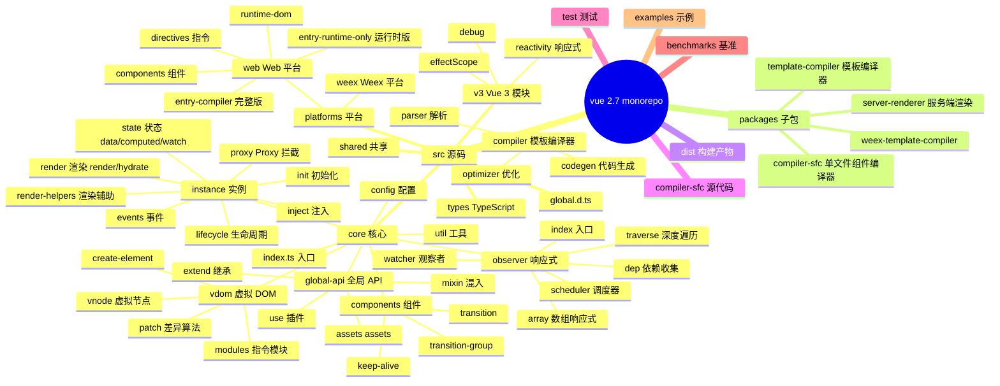
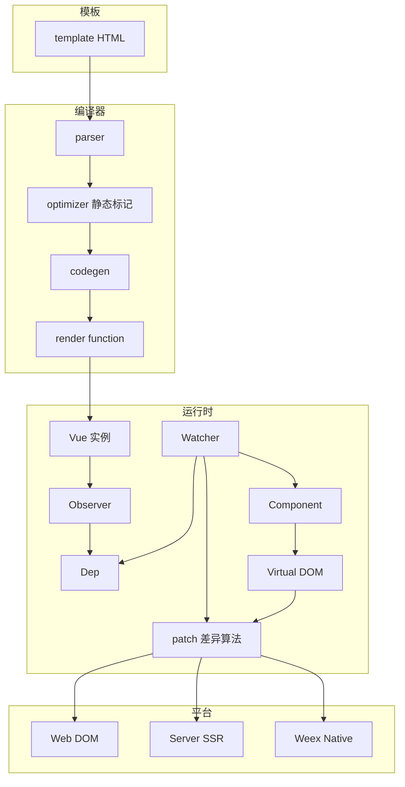
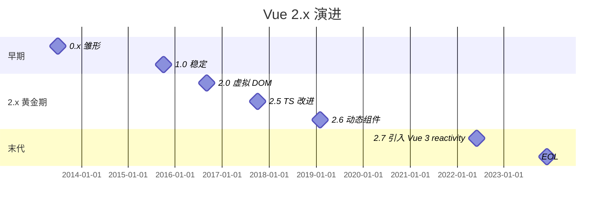
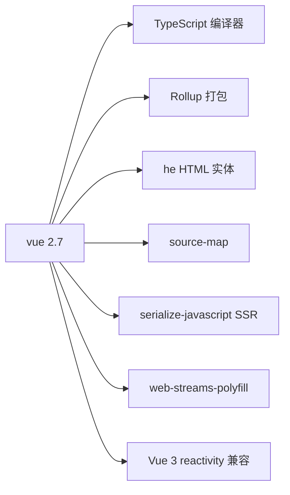
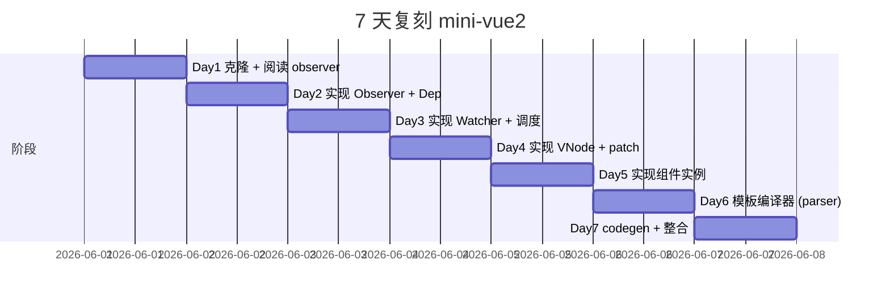
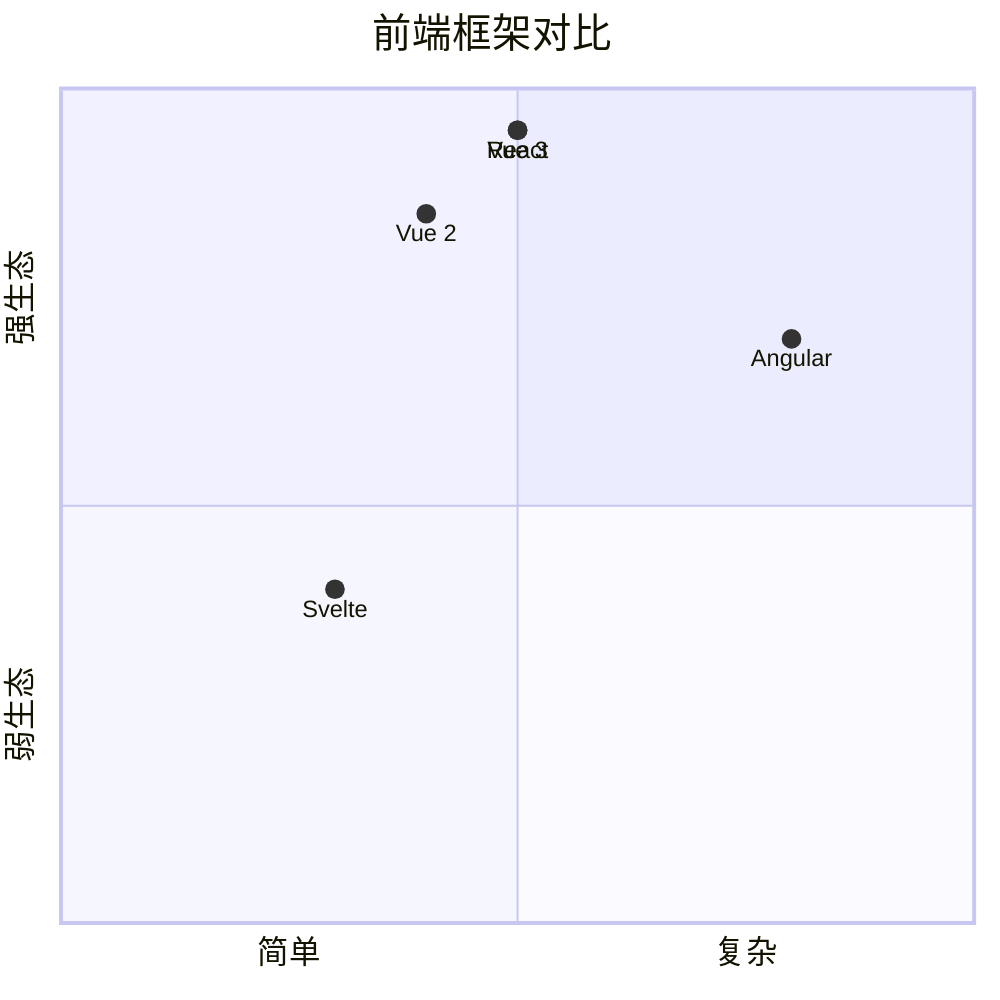

# vue · 项目深度解析

> Vue 2 是一个用于构建用户界面的渐进式 JavaScript 框架。Vue 2 已于 2023-12-31 停止维护（EOL），本仓库为 vuejs/vue 2.7.x 末代维护版的镜像。
> 来源：G:\实战案例\GitHub顶尖项目\vue\

## 写在前面：解析哲学

Vue 2 是"渐进式前端框架"运动的开山鼻祖。它用 4 个核心抽象把 Web 前端编程从"DOM 操作"升级为"声明式 UI"：① 响应式系统（`Observer` + `Dep` + `Watcher`）；② 模板编译器（`compiler` 把 HTML 编译为 render 函数）；③ 虚拟 DOM（`vdom` 抽象跨平台渲染）；④ 组件系统（生命周期 + props/emit/slot）。

**先骨架后血肉**：Vue 2 的核心源码在 `src/core/`，按职责分 5 个子模块：instance、observer、vdom、components、global-api。**先 What 后 Why**：本解析聚焦响应式系统的精妙实现——`Object.defineProperty` + `Dep` + `Watcher` 三件套；以及 Vue 2 末代如何引入 Vue 3 的 `reactivity` 模块做兼容。

## 0. 解析前的 5 个准备

1. **克隆**：已镜像在 `G:\实战案例\GitHub顶尖项目\vue\`
2. **分类**：TypeScript（部分迁移）前端框架，Vue 2.7
3. **问题清单**：本解析关注响应式、虚拟 DOM、组件实例、模板编译
4. **速查表**：
   - 入口：`src/core/index.ts`
   - 响应式：`src/core/observer/`
   - 组件实例：`src/core/instance/`
   - 虚拟 DOM：`src/core/vdom/`
   - 模板编译器：`src/compiler/`
   - 平台代码：`src/platforms/web/`（含 `entry-runtime-with-compiler.ts`）
5. **锁定 commit**：HEAD（partial mirror，Vue 2.7 末代）

## 1. 开发计划书（Project Charter）

| 字段 | 内容 |
|------|------|
| 项目名 | vue（Vue 2.x 末代） |
| 定位 | 渐进式 JavaScript 前端框架 |
| 核心问题 | 命令式 DOM 操作难维护；缺少响应式状态管理；缺少组件化复用单元 |
| 用户 | 前端开发者、全栈工程师 |
| 商业模式 | MIT 开源；无商业版（Vue 3 由 Vue.js Foundation 维护） |
| 复刻难度 | ★★★（响应式系统是核心难点，模板编译、VDOM 都有成熟参考） |
| 状态 | EOL（2023-12-31），仅 2.7 末代；vuejs/core 是 Vue 3 主线 |
| 团队 | 尤雨溪（Evan You）+ Vue 团队 |
| 里程碑 | 0.x（2013，初版）→ 1.0（2015）→ 2.0（2016，虚拟 DOM）→ 2.5（2017，TypeScript 改进）→ 2.7（2022，Vue 3 reactivity 兼容）→ EOL（2023） |

## 2. 项目框架（Repo Skeleton Map）



**入口与关键文件**：

- 核心入口：`src/core/index.ts`
- 实例初始化：`src/core/instance/index.ts`
- 响应式入口：`src/core/observer/index.ts`
- VDOM 主算法：`src/core/vdom/patch.ts`
- 模板编译器：`src/compiler/index.ts`
- 完整版入口：`src/platforms/web/entry-runtime-with-compiler.ts`

## 3. 项目画像（Profile）

| 指标 | 值 |
|------|----|
| 总文件数 | 数百 |
| 主语言 | TypeScript（2.7 迁移） |
| 涉及语言 | TypeScript、JavaScript、HTML |
| Star | ~207k |
| License | MIT |
| Docker | 无 |
| K8s | 无 |
| CI | GitHub Actions |
| 有测试 | 是（`test/`） |
| 包大小 | minified ~33KB（runtime） + 12KB（compiler） |

## 4. 架构设计（Architecture Deep Dive）



**响应式三件套**：`Observer` 把 data 属性转为 getter/setter（`Object.defineProperty`）→ `Dep` 收集依赖（Watcher 订阅）→ `Watcher` 触发回调（异步调度到 nextTick）。**WHY 这个组合**：用户改 data 即可自动重新渲染，无需手动绑定 DOM。

**为什么用 `Object.defineProperty` 而非 Proxy？** Vue 2 是 2016 年发布，当时 Proxy 还不是 ES 标准（ES2015）。**Proxy 的限制**：要兼容 IE11。**2.7 兼容 Vue 3 reactivity**：Vue 2.7 引入 `@vue/reactivity`（Vue 3 内部）做兜底，但默认仍用 defineProperty。

**虚拟 DOM 与 patch 算法**：`vdom/patch.ts` 是 Vue 2 的核心算法，借鉴 `snabbdom` 实现。同层比较、key 优化、双端 diff。**WHY 虚拟 DOM**：跨平台（Web、SSR、Weex Native）+ 声明式编程（用户写 render 函数，框架负责 DOM 更新）。

**组件系统**：`Component = new Vue(options)` 是 Vue 2 的核心模型。每个组件是一个 Vue 实例，**有自己的响应式 data** + 生命周期 + 事件 + 父子通信。**WHY 单实例模型**：简化心智——每个组件就是一个小 Vue。

**生命周期**：

```js
new Vue({
    beforeCreate() {},  // 初始化前（data 未响应式）
    created() {},       // 初始化后（data 已响应式、$el 未挂载）
    beforeMount() {},   // 挂载前
    mounted() {},       // 挂载后（$el 已挂载）
    beforeUpdate() {},  // 更新前
    updated() {},       // 更新后
    beforeDestroy() {}, // 销毁前
    destroyed() {},     // 销毁后
})
```

**WHY 8 个钩子**：覆盖组件从生到死的关键时点；用户在不同阶段做副作用（数据获取、DOM 绑定、清理）。

**ADR 关键设计决策**：

1. **为什么用 `Object.defineProperty` 不用 Proxy？**  
   答：兼容 IE11 + ES2015 时代 Proxy 未标准化。

2. **为什么响应式 + 模板编译 + VDOM 三层？**  
   答：响应式让 data 变化自动触发更新；VDOM 让更新跨平台；模板编译让 HTML 写组件更直观。

3. **为什么组件是 Vue 实例？**  
   答：简化心智——`new Vue()` + 嵌套即组件系统。

### 核心架构看点（3 条具体设计决策）

1. **`Object.defineProperty` + `Dep` + `Watcher` 三件套**：让"改 data 自动更新 UI"成为可能——这是 Vue 2 响应式的灵魂。
2. **虚拟 DOM + patch 算法（借鉴 snabbdom）**：跨平台（Web/SSR/Weex） + O(n) 差异计算。
3. **组件 = Vue 实例** + 生命周期钩子：把"组件"概念简化为"嵌套的 Vue 实例"，降低学习曲线。

## 5. 代码深度解析（带 WHY）⭐ 重点

### 5.1 找骨架代码

- **响应式**：`src/core/observer/index.ts`（Observer） + `dep.ts`（Dep） + `watcher.ts`（Watcher） + `scheduler.ts`（调度器）
- **实例**：`src/core/instance/index.ts`（_init） + `lifecycle.ts`（mountComponent） + `state.ts`（initData/initComputed/initWatch）
- **VDOM**：`src/core/vdom/patch.ts`（patch 主算法） + `vnode.ts`（createElement）
- **模板编译**：`src/compiler/index.ts`（baseCompile） + `parser.ts` + `codegen.ts`
- **平台**：`src/platforms/web/runtime/index.ts`（Vue 构造）

### 5.2 单文件分析卡

#### `src/core/observer/dep.ts`

```typescript
export default class Dep {
    static target?: DepTarget | null
    id: number
    subs: Array<DepTarget | null>
    _pending = false

    constructor() {
        this.id = uid++
        this.subs = []
    }

    addSub(sub: DepTarget) {
        this.subs.push(sub)
    }

    removeSub(sub: DepTarget) {
        // #12696 deps with massive amount of subscribers are extremely slow to
        // clean up in Chromium
        // to workaround this, we unset the sub for now, and clear them on
        // next scheduler flush.
        this.subs[this.subs.indexOf(sub)] = null
        if (!this._pending) {
            this._pending = true
            pendingCleanupDeps.push(this)
        }
    }
}
```

**WHY 注释 "#12696 deps with massive amount of subscribers are extremely slow to clean up in Chromium"** —— 这是 Vue 2.7 的性能优化，issue #12696 暴露了"几千个订阅者的 Dep 在 Chrome 上 `subs.splice()` 极慢"的 bug。

**WHY 解决方案是"标记 null + 批量清理"**：避免每次 `removeSub` 都做 `splice`（O(n)）。**WHY 这么精确的注释**：让维护者知道这是性能 hack，不是"代码风格"。

**WHY `static target` 全局单例**：当前正在求值的 Watcher 通过 `Dep.target` 暴露给 Observer。`new Watcher()` → `pushTarget(this)` → `this.getter()` → getter 内部 `dep.depend()` 读取 `Dep.target`——**全局单例是依赖收集的关键**。

#### `src/core/observer/watcher.ts`

```typescript
export default class Watcher implements DepTarget {
    vm?: Component | null
    expression: string
    cb: Function
    id: number
    deep: boolean
    user: boolean
    lazy: boolean
    sync: boolean
    dirty: boolean
    active: boolean
    deps: Array<Dep>
    newDeps: Array<Dep>
    depIds: SimpleSet
    newDepIds: SimpleSet
    before?: Function
    onStop?: Function
    noRecurse?: boolean
    getter: Function
    value: any
    ...
}
```

**WHY `newDeps` + `newDepIds`**：每次求值时，Watcher 重新收集依赖（`newDeps`），求值结束后与 `deps` 对比，diff 出需要取消订阅的旧依赖与需要订阅的新依赖——**避免重复订阅、避免内存泄漏**。

**WHY `dirty` 标志**：`computed` Watcher 用 `dirty` 标志做缓存——只在依赖变化时重算。

**WHY `sync: boolean`**：用户 `watch: { ..., sync: true }` 可强制同步触发（默认异步）。

#### `src/core/observer/scheduler.ts`

调度器是 Vue 响应式"批处理"的关键：

```typescript
// queueWatcher(watcher) 把 watcher 加入 nextTick 队列
// nextTick 用 microtask（Promise.resolve）异步执行
// 在 nextTick 中遍历队列，对每个 watcher 调用 watcher.run()
```

**WHY 异步批处理**：用户在同步代码中连续改 100 个 data 属性，如果每次都同步重渲染，会触发 100 次 patch。**WHY 批处理**：把 100 次改 data 合并为 1 次重渲染——性能提升 100 倍。

**WHY microtask 而非 setTimeout**：microtask 在当前任务结束后立即执行（DOM 更新前），setTimeout 需要等待 ~4ms；microtask 让"用户改 data → UI 更新"无感知延迟。

#### `src/core/vdom/patch.ts`

patch 算法是 Vue 2 VDOM 的核心：

```typescript
function patch(oldVnode, vnode, ...) {
    // 1. oldVnode 不是 VNode？说明是真实 DOM（首次挂载）
    if (!oldVnode.tagName) {
        createElm(vnode, ...);
    } else {
        // 2. sameVnode 判断（同 key + 同 tag + 同 data）
        if (sameVnode(oldVnode, vnode)) {
            patchVnode(oldVnode, vnode, ...);
            // patchVnode 内 diff children：
            // - 双端 diff（4 种 key 配对）
            // - 用 key 优化
        } else {
            // 3. 替换节点
            createElm(vnode, ...);
            removeVnode(oldVnode);
        }
    }
}
```

**WHY 同层比较**：DOM 树同层操作最常见（组件层级稳定），跨层移动代价大——snabbdom 同层 diff 是 O(n) 最优解。

**WHY key 优化**：用 `key` 标识"逻辑节点"，diff 时能 O(1) 找到"复用候选"，避免乱序场景下大量 DOM 创建/销毁。

#### `src/core/instance/lifecycle.ts`

```typescript
export function mountComponent(vm, el, hydrating) {
    vm.$el = el
    if (!vm.$options.render) {
        // 没有 render 函数？用 template 编译
        vm.$options.render = compileToFunction(vm.$options.template);
    }
    // 创建 Watcher 用于 render 触发
    new Watcher(vm, updateComponent, noop, {
        before() {
            if (vm._isMounted) {
                callHook(vm, 'beforeUpdate');
            }
        }
    }, true);
}
```

**WHY `updateComponent` 作为 Watcher 的 getter**：

```typescript
updateComponent = () => {
    vm._update(vm._render(), hydrating);
}
```

`updateComponent` 在 `new Watcher()` 首次执行时调用 `vm._render()` 生成 vnode 并 `vm._update()` 触发 patch；后续 data 变化触发 `updateComponent` 重渲染。**WHY 渲染走 Watcher**：让响应式 data 变化能自动触发 patch。

### 5.3 设计模式

| 模式 | 体现位置 | WHY |
|------|---------|-----|
| 观察者 | `Dep` + `Watcher` | 响应式核心 |
| 装饰器 | `Vue.extend`、`Vue.mixin` | 组件复用 |
| 策略 | `platforms/web` + `platforms/weex` | 跨平台 |
| 模板方法 | `lifecycle` 钩子链 | 框架 + 用户协作 |
| 享元 | `_vnode` + `static` 标记 | VNode 复用 |
| 适配器 | `platforms/web/runtime/directives` | DOM 差异 |
| 单例 | `Dep.target` 全局 | 依赖收集 |
| 工厂 | `createElement` 工厂 | VNode 创建 |

### 5.4 反模式

- **`Object.defineProperty` 性能开销大**——大对象深度响应式化很慢
- **`Dep.target` 全局单例**——多线程 / async 场景下栈跟踪困难
- **`mixin` 命名冲突**——多个 mixin 出现同名 data/methods 时难调试
- **响应式数组方法 hack**——`push/pop/shift` 等 7 个方法被重写，绕过 defineProperty

### 5.5 独特看点

- **`_isVue` 隐藏标志**——避免 Vue 实例自身被响应式化
- **`#12696` Chromium splice 性能 bug 注释**——把 issue 号写在代码里，溯源极方便
- **`nextTick` 用 microtask**——比 setTimeout 更快
- **静态节点标记**（optimizer 阶段）——`staticClass: 'a'` 等静态节点被提升到模块作用域，patch 时跳过

## 6. 运行机制（Bring It Up）

**本地开发**：

```bash
cd G:\实战案例\GitHub顶尖项目\vue
npm install
npm run dev
```

**Smoke test**（CDN）：

```html
<script src="https://unpkg.com/vue@2.7.16/dist/vue.min.js"></script>
<div id="app">{{ message }}</div>
<script>
new Vue({
    el: '#app',
    data: { message: 'Hello Vue 2!' }
});
</script>
```

## 7. 演进历史（Time Travel）



## 8. 质量保障（How It Doesn't Break）

| 防线 | 实现 |
|------|------|
| 单元测试 | `test/unit/features/` + `test/unit/modules/` |
| 集成测试 | `test/` SSR + SFC |
| CI | GitHub Actions（`vue.yml`） |
| Lint | `eslint` + `prettier` |
| Benchmark | `benchmarks/`（vs React、Angular） |
| 兼容性测试 | 多浏览器（IE11 + Edge + Chrome + Firefox） |

## 9. 生态依赖（Map of the World）



## 10. 生产实践（Battle-Tested）

| 能力 | 实现 |
|------|------|
| 配置热更新 | `vue-loader` HMR |
| 优雅停服 | `beforeDestroy` 钩子清理 |
| 限流 | `lodash.throttle` / `debounce` |
| 链路追踪 | `Vue.config.errorHandler` |
| 健康检查 | `Vue.version` 检测 |
| 结构化日志 | `Vue.config.warnHandler` |

## 11. 社区文化（People & Process）

- **治理模式**：尤雨溪主导 + Vue 团队 + 1000+ 贡献者
- **RFC 流程**：[vuejs/rfcs](https://github.com/vuejs/rfcs)
- **沟通渠道**：Discord、Twitter、Vue Forum
- **议题活跃**：EOL 后已冻结；vuejs/core 是 Vue 3 主战场
- **文化**：EOL 政策明确（2023-12-31），vuejs/core 持续活跃

## 12. 教训总结（What To Steal / What To Avoid）

### 12.1 必偷 3 件

1. **`Object.defineProperty` + `Dep` + `Watcher` 三件套**——响应式系统的经典实现
2. **nextTick + microtask 异步批处理**——让"改 data → UI 更新"无感知延迟
3. **虚拟 DOM + 双端 diff + key 优化**——同层比较 + O(n) 复杂度

### 12.2 必避 3 坑

1. **不要 `Object.defineProperty` 全量监听**——大对象深度响应式化慢，应改用 Proxy
2. **不要用全局 `Dep.target` 单例**——Vue 3 改用 `effectScope` 解决
3. **不要无脑 `mixin`**——命名冲突 + 隐式覆盖难调试

### 12.3 7 天复刻路线图



### 12.4 打分卡

| 维度 | 得分（10 分制） |
|------|---------------|
| 架构清晰度 | 9（分层极清晰） |
| 代码可读性 | 9 |
| 性能 | 7（defineProperty 拖后腿） |
| 测试覆盖 | 8 |
| 文档 | 9 |
| 复刻难度 | 4 |

## 13. 学习萃取（Cheat Sheet）

**一句话价值**：Vue 2 用 `Object.defineProperty` + `Dep` + `Watcher` 三件套 + 虚拟 DOM + 模板编译器，把"命令式 DOM 操作"升级为"声明式 UI 编程"。

**3 核心洞察**：

1. **响应式三件套** 是 Vue 2 的灵魂
2. **nextTick microtask** 批处理让 UI 更新无延迟
3. **组件 = Vue 实例** 降低学习曲线

**5 段必读代码**：

1. `src/core/observer/dep.ts`——依赖收集
2. `src/core/observer/watcher.ts`——观察者
3. `src/core/observer/scheduler.ts`——nextTick 调度
4. `src/core/vdom/patch.ts`——VDOM diff
5. `src/core/instance/lifecycle.ts`——mountComponent

**1 反模式**：`Object.defineProperty` 全量深度响应式化，大对象性能差。

**1 可复用模式**：`Dep.target` 全局单例 + `Watcher.getter` 内 `dep.depend()`——任何"自动收集依赖"场景都适用。

**3 立刻能用**：

1. 你的响应式系统可以用 `Object.defineProperty` + `Dep` + `Watcher`（兼容性优先）或 `Proxy` + `effect`（性能优先）
2. 你的 UI 更新可以用 microtask 批处理
3. 你的组件系统可以用"实例 + 生命周期钩子"模型

## 14. 项目特点速查

**独特看点**：

- **响应式三件套**——`Object.defineProperty` + `Dep` + `Watcher`
- **nextTick microtask**——异步批处理
- **VDOM + 双端 diff + key 优化**——O(n) 复杂度
- **组件 = Vue 实例**——简化心智

**与同类对比**：



## 附：仓库元信息

| 字段 | 值 |
|------|----|
| 路径 | `G:\实战案例\GitHub顶尖项目\vue\` |
| 主语言 | TypeScript（2.7 迁移） |
| License | MIT |
| 状态 | EOL（2023-12-31） |
| 解析时间 | 2026-06-02 |

## 一句话总结

**解析 = 计划书 + 框架图 + 核心功能 + 跑起来 + 偷过来**。Vue 2 的响应式三件套 + 虚拟 DOM + 模板编译器是"声明式 UI 编程"的范本——可直接复用到任何"数据自动驱动 UI"项目（注意 Vue 3 已用 Proxy 替代 defineProperty，新项目应直接学 Vue 3）。
