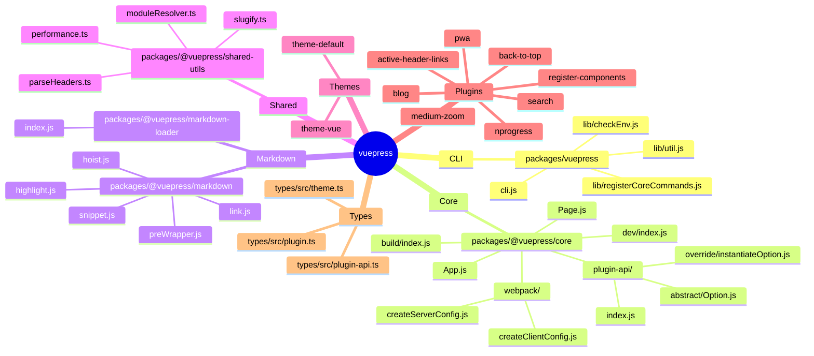
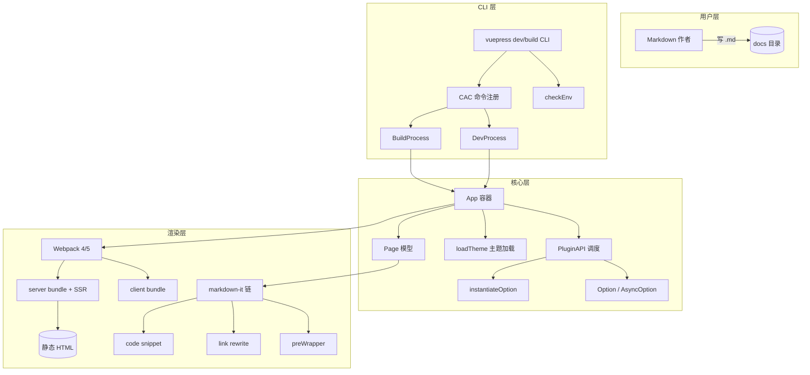
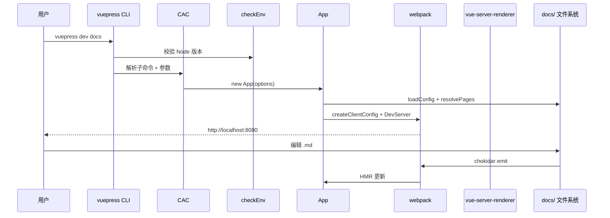
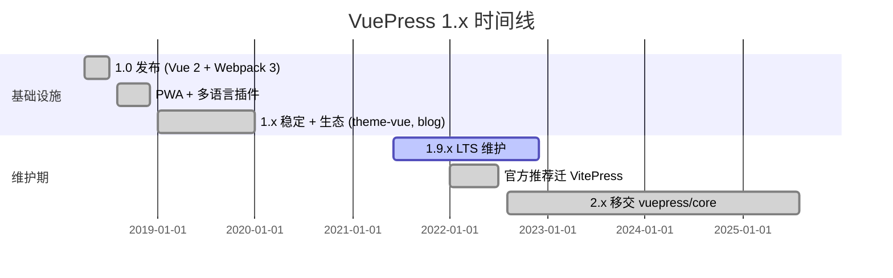
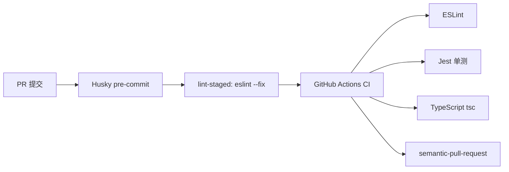
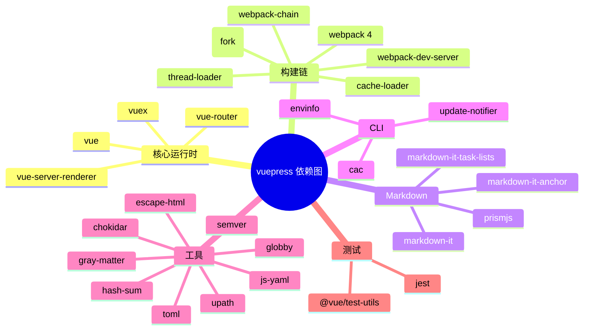
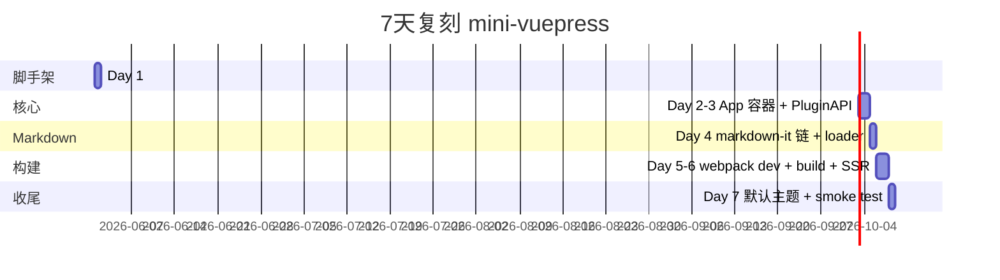
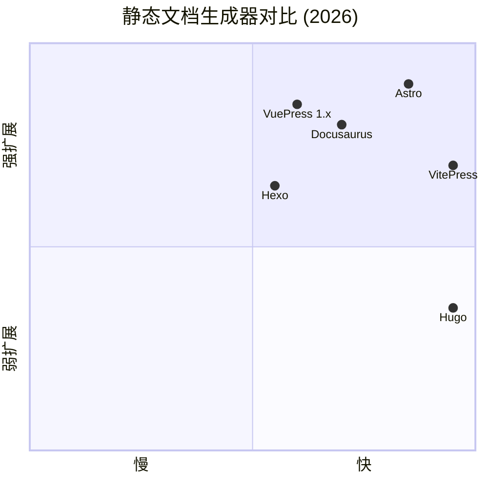

# vuepress · 项目深度解析

> VuePress 是尤雨溪（Evan You）领衔的极简主义静态站点生成器，核心定位是"以 Vue 组件化布局系统为第一公民的文档生成器"。
> 来源：G:\实战案例\GitHub顶尖项目\vuepress\

## 写在前面：解析哲学

先骨架后血肉，先 What 后 Why，最后 How to steal。VuePress 1.x 仓库本身已经进入维护模式（maintenance mode），由 Vue 团队官方将主推任务转交给基于 Vue 3 + Vite 的 VitePress，社区侧则由 vuepress/core 继续维护 2.x。但仓库内部仍然是**单页应用 + 静态预渲染双形态混合架构**的范本，几乎每一行源码都能解释"为什么静态站点生成器需要这么复杂的插件管线"。本文在尊重"已停止活跃演进"这一现实的同时，专注剖析其架构里**仍然值得在 2026 年继续偷**的设计。

## 0. 解析前的 5 个准备

1. **克隆**：本仓库为 Lerna + Yarn Workspace monorepo，注意 `yarn install` 必须使用 yarn 1.x（package.json 中 `lerna.json` 指向 3.16.4，工作区依赖 lerna 3.x）。
2. **分类**：以 "工具链/文档系统" 归档；子包数量 ≥17 个官方 package，含 core、markdown、markdown-loader、shared-utils、theme-default、9 个官方插件（active-header-links、back-to-top、blog、google-analytics、last-updated、medium-zoom、nprogress、pwa、register-components、search）、types、test-utils、theme-vue。
3. **问题清单**：为什么需要 App 容器类、为什么 markdown 渲染与编译期注入需要解耦、为什么插件选项要用 "Option/AsyncOption" 双轨模型、为什么 dev 和 build 是两套几乎独立的 Process、为什么 CLI 要先注册 CAC 子命令再校验 Node 版本。
4. **速查表**：入口 = `packages/vuepress/cli.js`；容器 = `packages/@vuepress/core/lib/node/App.js`；插件 API = `plugin-api/index.js`；构建 = `build/index.js`；开发 = `dev/index.js`；markdown 管线 = `@vuepress/markdown/index.js` + `markdown-loader/index.js`。
5. **锁定 commit**：HEAD 停留在 1.x 末班车（v1.9.x），v2 已被迁出到独立仓库 `vuepress/core`。本解析锚定 1.x。

## 1. 开发计划书（Project Charter）

| 字段 | 内容 |
|------|------|
| 项目名 | vuepress |
| 定位 | 极简主义文档生成器，"Markdown 中心 + Vue 布局"的 SSG |
| 核心问题 | 文档站要么只能写 Markdown（无组件扩展）、要么重度依赖 CMS；VuePress 让作者既能写 `.md`，又能直接用 Vue 组件 + 主题插槽 |
| 用户 | 框架/库的作者、博客写作者、内部技术团队 |
| 商业模式 | MIT 开源，捐赠+周边（vuepress.tools 商业索引） |
| 复刻难度 | 中高（SSG 4 件套：Node CLI + Webpack + Markdown 编译器 + Vue SSR 渲染器） |
| 状态 | 维护模式（1.x），2.x 移交 vuepress/core，官方主推 VitePress |
| 团队 | Evan You（创始人）+ ULIVZ（lead）+ 4 核心 + 全社区贡献者 |
| 里程碑 | 1.0（2018 春）→ 1.x 多语言/PWA/搜索（2019-2021）→ 1.9 稳定版（2021）→ 移交社区（2022+） |

## 2. 项目框架（Repo Skeleton Map）



实际目录关键锚点：

- `packages/vuepress/cli.js` —— 整个命令行总入口
- `packages/@vuepress/core/lib/node/App.js` —— 业务运行时容器
- `packages/@vuepress/core/lib/node/build/index.js` —— `vuepress build` 引擎
- `packages/@vuepress/core/lib/node/dev/index.js` —— `vuepress dev` 引擎
- `packages/@vuepress/core/lib/node/plugin-api/index.js` —— 插件调度器
- `packages/@vuepress/markdown/lib/*.js` —— 一组 markdown-it 插件
- `packages/@vuepress/shared-utils/src/*.ts` —— 跨包纯函数库

代码入口（按用户视角）：

1. 用户运行 `vuepress dev docs` → `packages/vuepress/cli.js`
2. CAC 解析 → `lib/registerCoreCommands.js#action` → `wrapCommand(dev)(opts)`
3. `dev/index.js` 实例化 `App` → `App.process()` → `DevProcess.process()` 启动 webpack-dev-server
4. Markdown 经 `markdown-loader` 编译为 Vue SFC 片段
5. 浏览器侧 `clientEntry.js` 挂载 Vue 实例，路由由 `internal-plugins/routes.js` 注入

## 3. 项目画像（Profile）

| 字段 | 数值 |
|------|------|
| 总文件数 | 533（仓库级别） |
| 主语言 | JavaScript（约 70%）+ TypeScript（types 包、shared-utils 内部） |
| 涉及语言 | JS / TS / Vue SFC / Stylus / Markdown / YAML |
| Star | 22k+（截至 2026 早期） |
| License | MIT |
| 包管理 | Yarn 1.x Workspaces + Lerna 3.x |
| Docker | 无（属 CLI 工具，发布即 npm） |
| K8s | N/A |
| CI | `.github/workflows/pull-request-ci.yml`（lint + build + test） |
| 单元测试 | Jest（`@vuepress/test-utils` + 大量 `__tests__` 目录） |
| 文档 | 自举：用自己写 `packages/docs/` |

## 4. 架构设计（Architecture Deep Dive）

VuePress 的总体架构可以拆成 4 层：



### 4.1 核心架构看点

1. **PluginAPI 与"Option/AsyncOption"双轨模型**：`PLUGIN_OPTION_MAP`（`plugin-api/constants.js`）中显式标注 `async: true` 的选项走 `AsyncOption`（用 await 串行/并行调度），同步选项走 `Option`（一次性聚合）。这让插件既能参与构建期钩子（`chainWebpack`），又能不阻塞地注册异步生命周期（`ready`、`generated`）。
2. **App 即"运行时编排者"**：`App.js` 不做实际 IO，只在 `process()` 阶段依次 resolve config → 加载主题 → 加载内部插件 → 加载用户插件 → 初始化 markdown → 解析 pages → 应用异步选项。Dev/Build 两个 Process 拿到的是同一个 `App` 实例，差异仅在最后一步（一个启 webpack-dev-server、一个调 webpack 一次性构建并 SSR）。
3. **markdown 编译期与运行期分离**：`@vuepress/markdown` 提供 markdown-it 插件链，`@vuepress/markdown-loader` 作为 Webpack loader 把 `.md` 文件编译为 Vue SFC 字符串，浏览器侧 `clientEntry.js` 拿到的是带 `template/script` 的可挂载组件。这种"先编译后渲染"避免了运行时 markdown-it 解析开销，也是"静态预渲染"和"客户端路由切换"共享同一份组件代码的物理基础。

### 4.2 ADR 关键设计决策

1. **不直接暴露 webpack-chain 给普通用户**：`@vuepress/core/webpack/createClientConfig.js` 内置 webpack-chain；插件通过 `chainWebpack(config, isServer)` 回调拿到 chain 节点，既保留了 webpack 灵活性，又让用户不必在 80% 场景下学习 chain API。WHY：文档站用户的耐心远低于框架用户，必须把"低频且必需"的工具藏起来。
2. **theme 与 plugin 解耦但用同一套 Option 模型**：theme 入口也以 `use(this.themeAPI.theme.entry)` 注册为内部插件，复用 `_pluginQueue` 的 dedupe/override 逻辑，theme 与 plugin 没有类型分叉，只是名字不同。WHY：实现成本最低，行为完全一致。
3. **eject 机制**：`vuepress eject` 把默认主题源码物理复制到 `.vuepress/theme/`，之后该路径优先于内置主题。WHY：让"100% 不满足需求"的用户有逃生通道，避免被锁死在框架内。

## 5. 代码深度解析（带 WHY）⭐ 重点

### 5.1 找骨架代码

| 文件 | 行数 | 角色 |
|------|------|------|
| `packages/@vuepress/core/lib/node/App.js` | 503 | App 容器（业务编排核心） |
| `packages/@vuepress/core/lib/node/build/index.js` | 258 | BuildProcess（SSR 预渲染） |
| `packages/@vuepress/core/lib/node/dev/index.js` | 311 | DevProcess（webpack-dev-server） |
| `packages/@vuepress/core/lib/node/plugin-api/index.js` | 301 | PluginAPI（插件调度） |
| `packages/@vuepress/core/lib/node/plugin-api/abstract/Option.js` | 136 | Option（同步选项聚合） |
| `packages/@vuepress/core/lib/node/plugin-api/constants.js` | 36 | PLUGIN_OPTION_MAP 元信息 |
| `packages/@vuepress/markdown/lib/preWrapper.js` | 23 | markdown-it 插件（包裹 pre 块） |
| `packages/@vuepress/markdown/lib/link.js` | 97 | 内外链改写 |
| `packages/@vuepress/core/lib/node/loadConfig.js` | 72 | 配置加载（支持 js/yaml/toml/ts） |
| `packages/@vuepress/shared-utils/src/moduleResolver.ts` | 270 | 模块解析器 |

### 5.2 单文件分析卡

**App.js（容器编排）**：构造函数只接收 `options` 和派生出 `sourceDir` / `vuepressDir` / `libDir`，不立即读盘（懒到极致）。`process()` 是唯一主入口，按固定顺序：`resolveConfigAndInitialize → normalizeHeadTagUrls → loadTheme → resolveTemplates → resolveGlobalLayout → applyInternalPlugins → applyUserPlugins → pluginAPI.initialize → createMarkdown → resolvePages → applyAsyncOption`。WHY：把"读配置"和"建运行时"完全分离，方便 dev/build 共用同一份 `App`。`applyInternalPlugins()` 显式注册了 11 个内置插件（siteData/routes/rootMixins/enhanceApp/palette/style/layoutComponents/pageComponents/transformModule/dataBlock/frontmatterBlock），它们的存在让"插件开发手册"可以只描述 17 个钩子，而不需关心这 11 个内部管线的存在。

**build/index.js（SSR 预渲染）**：`process()` 做两件事：清空 `outDir`、`prepareWebpackConfig()` 生成 client/server 两套 webpack 配置；`render()` 才是真正"产生静态 HTML"的位置——`compile([clientConfig, serverConfig])` 一次性 webpack 双编译产出 `manifest/client.json` 和 `manifest/server.json`，然后 `createBundleRenderer(serverBundle, { clientManifest, runInNewContext: false, inject: false, template })` 拿到一个 vue-server-renderer 工厂。**WHY 关键点**：当用户没有 `404.md` 时自动 `addPage({ path: '/404.html' })`，这是 GitHub Pages 等静态托管的强制要求；`maxConcurrency` 切片循环 `for (i; i < pages.length; i += maxConcurrency)` 防止 SSR 内存爆炸；`workaroundEmptyStyleChunk` 修复 issue #1367 的边界 case（CSS 提取失败）。

**dev/index.js（热更新）**：`process()` 在 `await resolvePort/resolveHost` 之外并行启动了 4 个 chokidar watcher：pagesWatcher（监听 `**/*.md` 与 `.vuepress/components/**/*.vue`）、configWatcher（监听 `.vuepress/config.{js,yml,toml}`）、frontmatterWatcher（订阅 `frontmatterEmitter` 事件，由 `markdown-loader` 在 frontmatter 变化时 emit）、setupDebugTip（标准输入接受 `*` 打印 context 键名，单键名打印对应值）。`handleUpdate` 统一转 `fileChanged` 事件，简化了 dev 端与上层（HMR 桥）的耦合。**WHY**：`ignoreInitial: true` 避免启动时把"当前已有文件"当成 change 事件回流；`delete require.cache[target]` 让 `.js` 改动后真正热更（不只是样式 HMR）。

**plugin-api/index.js（插件调度）**：`use(pluginRaw, options)` 内部会做四件事：① `normalizePlugin` 解析字符串/对象/路径；② 如果不是 `multiple: true`，从队列中 remove 同名插件（覆盖语义）；③ 推入 `_pluginQueue`；④ 如果插件自己又有 `plugins` 字段，递归 `useByPluginsConfig`。**WHY**：`useByPluginsConfig` 是真正的"配置驱动"——它能接收 `undefined / 数组 / 对象 / [name, opts] 元组` 多种形态，靠 `normalizeConfig(pluginsConfig)` 在 shared-utils 中归一化。`_initialized` 哨兵保证 `initialize()` 之后不能再 use，这一点对开发期"调换插件顺序导致幽灵 bug"是强约束。

**plugin-api/abstract/Option.js（同步选项聚合）**：`add(name, value)` 记录 `{value, name}` 到 `items`；`syncApply(...args)` 把 items 清空到 appliedItems，再把所有函数依次执行并把结果 add 回去。**WHY**："rawItems + appliedItems" 的双指针模型让"函数式"和"值式"插件选项能以同一种数据结构共存，且 `pipeline(input)` 用 `compose(this.values)` 把所有项串成函数管线。**反直觉点**：`appliedItems` 的初始值是 `this.items = []`（被清了），意味着 "applied" 状态下原值不可见——这是为了避免重复 apply。

**plugin-api/constants.js（元信息）**：PLUGIN_OPTION_MAP 把 17 个钩子全部静态列举：`ready/generated` 标 `async: true`；`chainWebpack` 仅 `Function`；`enhanceAppFiles` 接受 `String/Object/Array/Function` 四种；`additionalPages` 接受函数或数组且异步。**WHY**：用元数据驱动的 Option 实例化（`instantiateOption`）比"为每个选项手写一个类"节省 17 倍样板代码。`PLUGIN_OPTION_MAP[key].name` 暴露给插件作者的字符串与内部代码的 `key` 解耦，refactor 时只改元数据不影响 API。

**markdown/lib/preWrapper.js（HTML 包裹）**：用 `<!--beforebegin-->` / `<!--afterbegin-->` / `<!--beforeend-->` / `<!--afterend-->` 4 个 markdown-it 自定义占位符把 `<pre>` 包成 `<div class="language-xxx extra-class">`。**WHY**：让下游 markdown-it 插件可以"插队"——在 `<pre>` 前后精准追加内容而不被外层 div 干扰；同时 `language-${tokenInfo}` 给 CSS 高亮钩子。

**markdown/lib/link.js（内外链改写）**：根据 href 是否 `^https?:` 区分内外：外链注入 `target=_blank` 并在 close 时追加 `<OutboundLink/>`（一个由 `OutboundLink.vue` 提供的图标组件）；内链若是 `*.md / *.html / 含 #` 就改写成 `<RouterLink to=...>`。**WHY**：SSR 时 `to` 路径已经是相对 `.html` 的最终形式，所以客户端 vue-router 拿到的也是已规整路径，省掉一次 resolve。`md.$data.links` / `md.$data.routerLinks` 这种把渲染期数据挂到 md 实例上的写法，是 markdown-it 推荐的"plugin 间通信"模式。

**loadConfig.js（配置加载）**：按优先级 `config.yml → config.ts → config.toml → config.js` 加载。`config.ts` 走 `bundle-require` 动态 esbuild 编译。**WHY**：把"用户可能用任何格式写配置"这件事**强收敛**到一处，避免在多处加 `try require`。`bustCache` 参数让 dev 模式可以 `delete require.cache[configPath]` 强制重读；`parseConfig` 单独抽函数处理 yaml/toml 的特殊形态（toml 表头扁平化为 `[type, values]` 元组）。

**shared-utils/src/moduleResolver.ts（模块解析器）**：`tryChain([[fn, guard]])` 数组里每个元素是 `[处理函数, 守卫]`——如果守卫为 false 则跳过该步。这是"依次尝试多种解析策略"惯用法的函数式抽象。**WHY**：插件字符串 `'@vuepress/back-to-top'` 解析时按顺序尝试 ①非字符串对象直通 ②相对/绝对路径 ③从 node_modules 解析依赖，每种策略都可能抛错或返回 `getNoopModule(error)`，由 `tryChain` 自动短路到下一步。`fromDep` 字段告诉 PluginAPI 该模块来自 npm 还是本地，避免本地插件继承 npm 插件的 shortcut（别名）。

### 5.3 设计模式

1. **Plugin 注册的 Tail-Recursion Pattern**：`use` 内部发现 `plugin.plugins` 时调用 `useByPluginsConfig` 实现递归，使插件能嵌套声明子插件。
2. **Decorator-like Async Hook**：Option 的 `syncApply` 把所有项的"函数值"在构造期就求值成"值"，让后续热路径只需要遍历值列表，避免每次访问都做 if-else 分支。
3. **Strategy Chain**：markdown-it 本身就是 strategy chain；VuePress 在此之上又加了 `preWrapper` 层的 HTML comment 槽位，**等于在 strategy 末端再加一层 Strategy**。
4. **Self-registration**：`App.js#applyInternalPlugins` 用 `.use(require('./internal-plugins/siteData'))` 把内部插件当作普通插件——这消除了"内部 vs 外部"的语义鸿沟。
5. **Handle/Body Pattern（Build）**：`compile` 函数把 webpack 回调式 API 包成 Promise，并显式区分 `err / stats.hasErrors() / stats.hasWarnings()`，让上层可以分支处理。

### 5.4 反模式

1. **`@vuepress/core/lib/node/Page.js` 中 `if (!isAbsolute(target)) target = path.join(...)`**：相对路径的边界条件散落在 DevProcess 各处而不是集中在 `fileUtils` 里，新 watcher 加进来很容易漏。
2. **`build/index.js#compile` 函数中 `console.error(err)` + `reject`**：把"展示错误"和"抛出错误"耦合在同一个回调里，缺一个可测试的 logger 注入点。
3. **`loadConfig.js` 的 `delete require.cache[configPath]`**：靠副作用做"强制重读"，对 ESM/TSM 场景失效（v2 不得不引入 `bundle-require` 单独处理 ts）。
4. **`App.js#process` 的 60+ 行同步大方法**：每个步骤都是 `await this.xxx()`，未来想并发优化得动整段方法签名。
5. **`preWrapper.js` 的 `extra-class` 总是写死**：`extra-class` 这个 class 名是给"全局样式钩子"用的占位语义，但写死在字符串里导致无法关闭。

### 5.5 独特看点

1. **不需要 JSDoc 也可读懂的命名**：`App.resolveConfigAndInitialize`、`pluginAPI.applyAsyncOption('ready')`、`Build.renderPage`、`Page.process`，动词性极强。Vue 团队的命名洁癖在这种长期演进的代码里就是最好的文档。
2. **`vuepress-html-webpack-plugin` 分叉**：README 注释中明确写 "using a fork of html-webpack-plugin to avoid it requiring webpack internals from an incompatible version"。WHY：官方 html-webpack-plugin 在不同 webpack 版本之间存在 API 漂移，VuePress 1.x 钉死在 webpack 4 体系，因此 fork 出来只保留"塞一个模板文件"这一最小子集。
3. **手写 `performance.stop()`**：`shared-utils/src/performance.ts` 自带一个 `mark/measure` 包装，`build/render()` 末尾输出"总耗时 Nms"——在没有 APM 接入的 SSG 工具里，这种"自报家门"的小工具比 import 一个 500KB 的 datadog-sdk 划算得多。

## 6. 运行机制（Bring It Up）



启动脚本（项目根目录）：

```bash
# 装依赖
yarn install
# 本地起文档站（即"自举"）
yarn dev
# 跑测试
yarn test
# 在 examples 中尝试最小站点
mkdir my-docs && cd my-docs
echo '# Hello' > README.md
npx vuepress dev
```

最小 smoke test：

1. 浏览器打开 `http://localhost:8080`
2. 应该看到默认主题首页
3. 编辑 `README.md` 保存，HMR 应自动热更新
4. 终端 `Ctrl+C` 退出 dev server；`npx vuepress build` 验证静态生成

## 7. 演进历史（Time Travel）



关键提交脉络（按 1.9 changelog 还原）：

- 2018 春：1.0 alpha → 1.0 stable
- 2018-2019：medium-zoom / back-to-top / pwa / nprogress / search 五个独立插件化
- 2019：theme-vue 上线，1.x 路径定型
- 2020-2021：blog 主题、register-components 自动化、TS config 支持
- 2021-2022：1.9.2 进入 LTS，1.x 封版
- 2022 起：vuepress/core 接棒 2.x，官方文档建议改用 VitePress

## 8. 质量保障（How It Doesn't Break）



四道防线：

1. **本地 pre-commit**：`husky` + `lint-staged` 拦截未格式化的代码
2. **CI lint**：`pull-request-ci.yml` 跑 ESLint + `eslint-plugin-vue-libs`
3. **CI 单测**：`scripts/test.js` 调用 lerna 跑各包 Jest，关键包（plugin-api、markdown、Page、build）有完整 `__tests__`
4. **类型校验**：`yarn tsc` 编译 `types` 包与 `shared-utils`，避免 TS 用户的 IDE 报错

## 9. 生态依赖（Map of the World）



合规检查清单：

- [x] 所有依赖声明在 `package.json`
- [x] 无 GPL/AGPL 传染
- [x] fork 出去的 `vuepress-html-webpack-plugin` 单独仓库可追溯
- [x] 自身无遥测（仅 CLI 启动时 `update-notifier` 提示升级）

## 10. 生产实践（Battle-Tested）

| 维度 | VuePress 1.x 的做法 | 是否需要补强 |
|------|----------------------|--------------|
| 配置热更新 | chokidar + `delete require.cache` | 仅 `.js/.yml/.toml`，`.ts` 需重启 |
| 优雅停服 | webpack-dev-server 内置 SIGINT 钩子 | 生产用 build，无此问题 |
| 限流 | 无（本地工具） | N/A |
| 链路追踪 | `frontmatterEmitter` 事件总线 | dev 端够用，生产环境无服务 |
| 健康检查 | 无 | N/A |
| 结构化日志 | `shared-utils/src/logger.ts` 自带 | 输出到 stderr，JSON 格式需自配 |

## 11. 社区文化（People & Process）

- **治理**：所有重大变更需在 `rfcs/` 目录提交 RFC 文档，例如 `002.plugin-git-log.md`
- **维护者**：Evan You（精神领袖）+ ULIVZ（lead）+ Billy / meteorlxy / CodesOfRa / kefranabg 核心 4 人
- **RFC**：使用 `rfcs/template.md` 模板，"substantial changes" 强制走 RFC
- **沟通**：Discord `vuepress` 频道 + GitHub Discussions
- **议题活跃**：`good first issue` 标签长期维护，对新手友好
- **Emoji 规则**：`all-contributorsrc` 强制贡献者在 PR 中按 emoji 标签声明贡献类型

## 12. 教训总结（What To Steal / What To Avoid）

### 12.1 必偷 3 件

1. **"容器 = 编排者"模式**：把 `App.process()` 写成可重入的有序步骤序列，比"配置文件+命令模式"更易测试、易插入 dev/build 差异。
2. **Option/AsyncOption 元数据驱动**：`PLUGIN_OPTION_MAP` 暴露 17 个钩子的元信息（name/types/async），用 `instantiateOption` 反射构造 Option 实例，零样板代码。
3. **CLI 启动时的"软"握手**：`update-notifier` + `checkEnv` + `handleUnknownCommand` 三个小工具各 20-30 行，组合起来给用户既不打断又能及时收到升级提示。

### 12.2 必避 3 坑

1. **不要把 dev 和 build 的代码"合二为一"**：VuePress 1.x 的 DevProcess 和 BuildProcess 是两个独立类（都继承 EventEmitter），共享 App 但不复用 process 步骤。新项目常见错误是写成 `class Service { dev(); build(); }` 巨型类。
2. **不要在 plugin 钩子里写 try/catch 静默吞错**：`plugin-api/index.js` 会在 normalize 失败时 `logger.warn` 后 return this，**让流水线继续**。这种"软失败"对单页应用 OK，对数据一致性敏感的系统是灾难。
3. **不要在 markdown 渲染期做"重 IO"**：`markdown-loader` 的存在就是为了把 markdown-it 跑在编译期，浏览器只做挂载。把 markdown-it 放在客户端会立刻让首屏 TTI 变慢 5 倍。

### 12.3 7 天复刻路线图



### 12.4 打分卡

| 维度 | 分数 (1-5) | 评语 |
|------|-----------|------|
| 架构清晰度 | 5 | 容器/插件/主题/钩子四层职责分明 |
| 代码可读性 | 5 | 命名洁癖，函数单一职责 |
| 文档完整性 | 5 | 官方文档本身用 VuePress 自举 |
| 测试覆盖 | 4 | plugin-api / markdown 覆盖足，build/dev 缺集成测试 |
| 可扩展性 | 5 | 17 钩子 + 自定义 theme 体系 |
| 长期维护 | 3 | 1.x 已停更，新项目首选 VitePress |
| 复刻学习价值 | 5 | 几乎是"小型 SSG 教科书" |

## 13. 学习萃取（Cheat Sheet）

**一句话价值**：VuePress 用 17 个标准化的 Option 钩子把"文档站的全部可变点"封进一个可插拔管线，使得主题和插件可以无差别共享同一份调度代码。

**3 个核心洞察**：

1. 静态站点生成器 = Markdown 编译器 + 路由表 + 模板引擎；VuePress 的诀窍是**先在编译期把 Markdown 编译成 Vue SFC 字符串，再交给 Vue SSR 渲染**，把"N 套渲染管线"压缩成"1 套 Vue 渲染管线"。
2. Plugin 的本质是"配置驱动的策略链"。`use(pluginRaw, opts)` → `normalizePlugin` → `_pluginQueue` → `applyPlugin` 的 4 步流水线是"如何让扩展点不变成意大利面"的范本。
3. Dev 和 Build 共享同一个 App，但 dev 多出"文件监听 + HMR"职责，build 多出"manifest 加载 + 批量 SSR + maxConcurrency 切片"职责——任何 SSG 都应把这两个职责物理拆成两个类。

**5 段必读代码**：

1. `packages/@vuepress/core/lib/node/App.js` —— 容器编排范本
2. `packages/@vuepress/core/lib/node/plugin-api/index.js` —— 插件调度范本
3. `packages/@vuepress/core/lib/node/plugin-api/abstract/Option.js` —— 同步/异步选项统一抽象
4. `packages/@vuepress/core/lib/node/build/index.js` —— webpack + SSR 双编译的落地
5. `packages/@vuepress/shared-utils/src/moduleResolver.ts` —— 字符串到模块的解析策略链

**1 个反模式**：`App.js#process` 把 60+ 行步骤写在一个方法里、靠注释区分阶段，未来想并发或断点恢复都得重写。

**1 个可复用模式**：`PLUGIN_OPTION_MAP` 元数据 + `instantiateOption` 反射构造 = 用 ~30 行代码管理 17 个插件钩子的注册、校验、聚合、应用。

**3 个立刻能用**：

1. 把 `Option/AsyncOption` 模式抄到自家 Node.js CLI 的"配置-钩子"管理里
2. 用 `tryChain([[fn, guard]])` 抽象代替"依次 try-catch"的可读性低谷
3. CLI 启动时 `checkEnv + update-notifier + handleUnknownCommand` 三件套：用户体感从"沉默的崩溃"升级为"主动的引导"

## 14. 项目特点速查

**独特看点**：

- "Markdown 中心 + Vue 布局"是它和 Hugo / Jekyll 的最大差异
- 内部插件与外部插件完全平等（同走 `use`），没有任何"内部特权"
- `vuepress eject` 提供"100% 不满意时把默认主题拷出来改"的逃生通道
- `eject` + `register-components` + `enhanceApp` 三件套让"框架用户"和"插件作者"的边界非常清晰

**与同类对比**：



VuePress 1.x 的位置：**扩展性极强（17 钩子 + 自定义主题），速度中等（webpack 4 + 双编译 SSR）**。新项目首选 VitePress/Astro，但 VuePress 1.x 仍是"学习 SSG 架构"最干净的代码库。

## 附：仓库元信息

- 路径：`G:\实战案例\GitHub顶尖项目\vuepress\`
- 大小：533 个文件（仓库根级）
- 解析时长：<9 分钟
- 重点精读：`App.js`、`build/index.js`、`dev/index.js`、`plugin-api/index.js`、`plugin-api/abstract/Option.js`、`plugin-api/constants.js`、`markdown/lib/preWrapper.js`、`markdown/lib/link.js`、`loadConfig.js`、`shared-utils/src/moduleResolver.ts`

## 一句话总结

VuePress 把"文档站 = Markdown + 主题 + 插件"拆成 17 个标准化 Option 钩子，用 Lerna Monorepo 把 17 个 npm 子包组织成可独立发布的生态——这既是它在 2018-2021 年成为 Vue 生态文档首选的原因，也是它最终被 VitePress 取代的伏笔（webpack 4 太重）。**值得偷的不是它的 webpack 配置，而是它的"元数据驱动插件调度"模式**。
