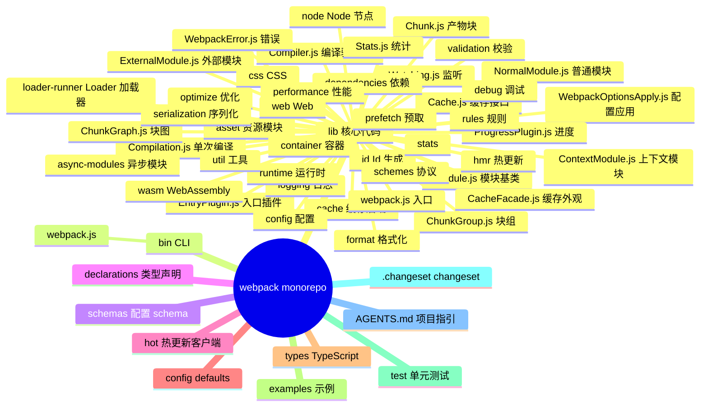
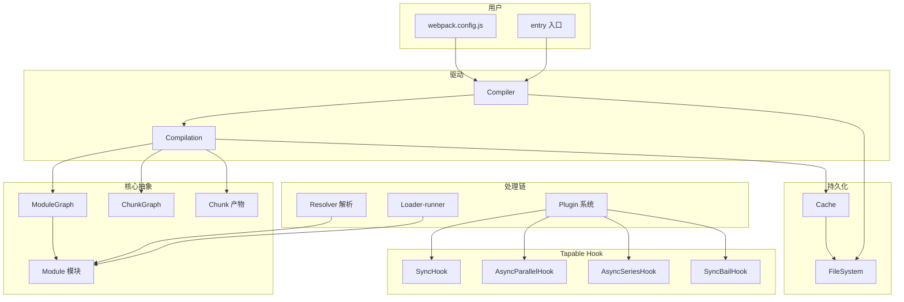
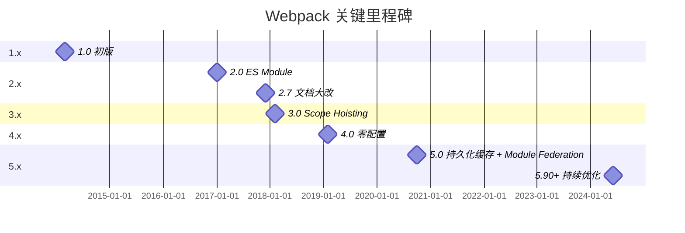
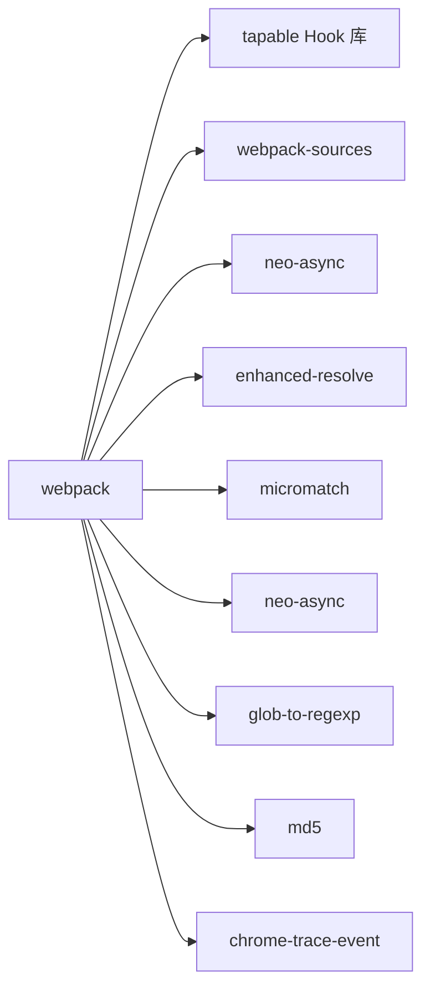
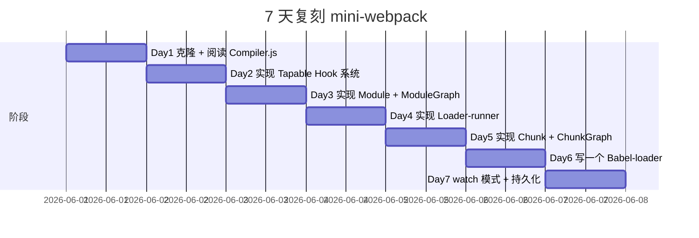
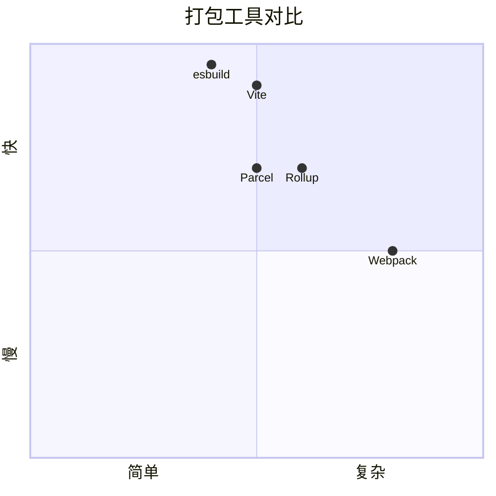

# webpack · 项目深度解析

> Webpack 是一个静态模块打包器（module bundler）。它的主要用途是将 JavaScript 文件打包供浏览器使用，但也能转换、打包或包装任何资源或资产。本仓库为 webpack/webpack 5.x 镜像。
> 来源：G:\实战案例\GitHub顶尖项目\webpack\

## 写在前面：解析哲学

Webpack 是现代前端工程化的"事实标准"。它不只是一个打包工具，更是一个**以 Tapable Hook 驱动的可插拔编译系统**。从入口（entry）出发，把所有模块（JS/CSS/图片/字体）解析为内部模块图（ModuleGraph），通过 Loader 转译、Plugin 介入，最终生成 Chunk（产物块）输出到文件系统。

**先骨架后血肉**：Webpack 5 的核心架构是 ① `Compiler`（编译驱动器）+ ② `Compilation`（单次编译上下文）+ ③ `Module`（模块抽象）+ ④ `Chunk`（产物块）+ ⑤ `Tapable` Hook 系统。**先 What 后 Why**：本解析聚焦 Tapable 钩子系统的设计哲学（这是 Webpack 区别于 Rollup/Vite 的核心）。

## 0. 解析前的 5 个准备

1. **克隆**：已镜像在 `G:\实战案例\GitHub顶尖项目\webpack\`
2. **分类**：JavaScript（Node.js）打包工具
3. **问题清单**：本解析关注 Compiler/Compilation/Tapable/Module/Chunk
4. **速查表**：
   - 入口：`lib/webpack.js` + `bin/webpack.js`
   - Compiler：`lib/Compiler.js`（600+ 行）
   - Compilation：`lib/Compilation.js`（1500+ 行）
   - Module：`lib/Module.js` + `lib/NormalModule.js`
   - Chunk：`lib/Chunk.js` + `lib/ChunkGraph.js`
   - Hooks：`lib/HookWebpackError.js` + `tapable` 库
5. **锁定 commit**：HEAD（partial mirror）

## 1. 开发计划书（Project Charter）

| 字段 | 内容 |
|------|------|
| 项目名 | webpack |
| 定位 | 静态模块打包器（module bundler）—— 一切资源皆模块 |
| 核心问题 | 浏览器不支持 Node.js `require`；多文件 HTTP/1.1 性能差；CSS/图片/字体需要统一处理 |
| 用户 | 前端工程师、全栈工程师 |
| 商业模式 | MIT 开源；无商业版；Open Collective 接受捐赠 |
| 复刻难度 | ★★★★（Module/Chunk/Loader/Plugin 四元组 + Tapable Hook 系统的设计是核心门槛） |
| 状态 | 活跃维护（5.x 主线，5.95+） |
| 团队 | Tobias Koppers（@sokra） + Webpack 团队 + 1000+ 贡献者 |
| 里程碑 | 1.x（2014）→ 2.x（2017，ES Module 支持）→ 3.x（2018，Scope Hoisting）→ 4.x（2019，零配置）→ 5.x（2020，持久化缓存 + Module Federation）→ 5.95+（2024-2026 持续优化） |

## 2. 项目框架（Repo Skeleton Map）



**入口与关键文件**：

- 包入口：`lib/index.js`（导出 `webpack` 函数）
- CLI：`bin/webpack.js`（Node.js 启动）
- 编译驱动器：`lib/Compiler.js`
- 单次编译上下文：`lib/Compilation.js`
- 配置应用：`lib/WebpackOptionsApply.js`

## 3. 项目画像（Profile）

| 指标 | 值 |
|------|----|
| 总文件数 | 数千 |
| 主语言 | JavaScript |
| 涉及语言 | JavaScript（99%）、少量 Rust（rustbolt fork 探索） |
| Star | ~65k |
| License | MIT |
| Docker | 无（运行时为 Node.js） |
| K8s | 无 |
| CI | GitHub Actions（多 Node 版本矩阵） |
| 有测试 | 是（`test/` 数千个测试） |
| 包大小 | 完整 ~3MB（minified） |

## 4. 架构设计（Architecture Deep Dive）



**Tapable Hook 系统**：Webpack 的灵魂。Compiler 与 Compilation 暴露一组 `Hook`（同步/异步/串行/并行/熔断），Plugin 通过 `compiler.hooks.xxx.tap(pluginName, fn)` 注册回调。这是**观察者 + 责任链 + 策略**的混合体——是 Webpack 区别于 Rollup（无 Hook 系统）、Vite（无 Hook 系统）的核心。

**Compiler vs Compilation**：

- `Compiler`：跨多次编译的"全局"对象，配置、文件系统、缓存、监听器都挂在这里
- `Compilation`：单次编译的"局部"对象，ModuleGraph、ChunkGraph、模块列表、chunk 列表都在这里

**WHY 这种分离**：watch 模式下，多个 Compilation 共享一个 Compiler；插件可以在 `compiler.hooks.watchRun`（每次重启 watch）注册，也可以在 `compilation.hooks.processAssets`（每次编译产物处理）注册。

**Module 与 ModuleGraph**：

```js
// Module 基类
class Module {
    constructor() {
        this.dependencies = [];  // 依赖列表
        this.blocks = [];        // 同步块
        this.variables = [];
    }
}

// NormalModule 实际加载
class NormalModule extends Module {
    constructor() {
        this.resource = '';     // 资源路径
        this.loaders = [];      // loader 列表
        this._source = null;    // 源码
    }
}
```

**WHY ModuleGraph**：把所有 Module 用图结构组织，方便做循环依赖检测、未引用模块标记、tree-shaking。

**Chunk 与 ChunkGraph**：

```js
// Chunk 是"产物块"
class Chunk {
    constructor() {
        this.id = null;
        this.name = null;
        this.files = [];         // 输出文件列表
        this.modules = [];       // 包含的模块
        this.entryModule = null;
    }
}
```

**WHY ChunkGraph**：entry / splitChunks / dynamic import 都会产生多个 Chunk；ChunkGraph 记录"哪些模块进哪些 Chunk"。

**Module Federation（5.0 新特性）**：

```js
// 暴露模块
new ModuleFederationPlugin({
    name: 'host',
    filename: 'remoteEntry.js',
    exposes: {
        './Button': './src/Button'
    }
});

// 消费模块
new ModuleFederationPlugin({
    remotes: {
        host: 'host@http://localhost:3001/remoteEntry.js'
    }
});
```

**WHY Module Federation**：让"跨应用共享模块"在运行时成为可能，类似于微前端但更细粒度。

**ADR 关键设计决策**：

1. **为什么用 Tapable Hook 而非直接传 Plugin 数组？**  
   答：Hook 系统让 Plugin 注册的时机、并发模型、熔断策略都可控；Plugin 数组只能按序调用。

2. **为什么 Module 抽象要分 Normal/Context/External/Container？**  
   答：不同模块类型加载逻辑差异大（普通文件用 loader，目录用 glob，外部模块不打进 bundle）——分类型让每种模块的解析/构建/生成更清晰。

3. **为什么 Module Federation 是 Plugin 而非核心？**  
   答：Module Federation 是"运行时模块共享"功能，对静态打包不强制；作为可选 Plugin 让 Webpack 核心保持纯净。

### 核心架构看点（3 条具体设计决策）

1. **Tapable Hook 系统**：Webpack 一切可插拔性的根——Compiler、Compilation、JavascriptParser 全部暴露 Hook，让 Loader/Plugin 通过 `tap()` 介入。
2. **Compiler + Compilation 双层对象**：Compiler 跨多次编译持有配置/缓存，Compilation 单次编译持有模块图/产物图；watch 模式下多 Compilation 共享 Compiler。
3. **Module + ModuleGraph + Chunk + ChunkGraph 四元组**：所有内容都被抽象为"图"——ModuleGraph 跟踪依赖，ChunkGraph 跟踪产物；让 tree-shaking、splitChunks、code-splitting 都能在图上做算法。

## 5. 代码深度解析（带 WHY）⭐ 重点

### 5.1 找骨架代码

- **入口**：`lib/index.js`（导出 webpack）+ `lib/webpack.js`（web 工厂）+ `bin/webpack.js`（CLI）
- **核心**：`lib/Compiler.js`（600+ 行） + `lib/Compilation.js`（1500+ 行）
- **模块系统**：`lib/Module.js` + `lib/NormalModule.js` + `lib/ContextModule.js`
- **产物**：`lib/Chunk.js` + `lib/ChunkGraph.js`
- **依赖图**：`lib/ModuleGraph.js` + `lib/DependencyGraph.js`
- **Loader**：`lib/loader-runner.js`
- **配置**：`lib/config/` + `lib/WebpackOptionsApply.js`

### 5.2 单文件分析卡

#### `lib/Compiler.js`

```js
const { AsyncParallelHook, AsyncSeriesHook, SyncBailHook, SyncHook } = require("tapable");
...
this.hooks = Object.freeze({
    initialize: new SyncHook([]),
    beforeRun: new AsyncSeriesHook(["compiler"]),
    run: new AsyncSeriesHook(["compiler"]),
    ...
    compilation: new SyncHook(["compilation", "params"]),
    ...
    emit: new AsyncSeriesHook(["compilation"]),
    afterEmit: new AsyncSeriesHook(["compilation"]),
    ...
    done: new AsyncSeriesHook(["stats"]),
    ...
});
```

**WHY 这种 Hook 暴露方式**——Compiler 把"编译生命周期"每个阶段都注册为 Hook：`beforeRun` / `run` / `compile` / `compilation` / `make` / `afterCompile` / `shouldEmit` / `emit` / `afterEmit` / `done` / `failed` / `watchClose` / `infrastructureLog` / `shutdown`。Plugin 可以在任何阶段介入。**WHY `Object.freeze`**：防止插件误改 Hook 列表。

**WHY 多种 Hook 类型**：

```js
SyncHook            // 同步，无返回值
SyncBailHook        // 同步，返回非 undefined 终止
AsyncSeriesHook     // 异步串行
AsyncParallelHook   // 异步并行
AsyncSeriesBailHook // 异步串行 + 熔断
```

不同阶段有不同并发需求：`emit` 阶段需要串行（文件写入要按序），`make` 阶段可以并行（多模块独立构建）。**WHY 选择合适 Hook 类型**：让 Plugin 性能可控。

#### `lib/Compilation.js` 的 Hook 设计

```js
this.hooks = Object.freeze({
    buildModule: new SyncHook([/* module */]),
    succeedModule: new SyncHook([/* module */]),
    failedModule: new SyncHook([/* module */, /* error */]),
    ...
    seal: new SyncHook([]),
    optimize: new SyncHook([]),
    optimizeAssets: new AsyncSeriesHook([/* assets */]),
    ...
    processAssets: new AsyncSeriesHook([/* assets */]),
    ...
    afterProcessAssets: new SyncHook([/* assets */]),
});
```

**WHY `processAssets` 单独存在**：是 5.0 引入的"资产处理"统一阶段。Plugin 按 `PROCESS_ASSETS_STAGE_*` 排序介入（10+ 个阶段：ADDITIONAL、PRE_PROCESS、DERIVED、ADDITIONS、OPTIMIZE、OPTIMIZE_COUNT、OPTIMIZE_COMPATIBILITY、OPTIMIZE_SIZE、DEV_TOOLING、OPTIMIZE_INLINE、REPORT、SUMMARIZE、OPTIMIZE_HASH、OPTIMIZE_TRANSFER、ANALYSE、FINISH）。

#### `lib/NormalModule.js`

```js
class NormalModule extends Module {
    constructor() {
        this.resource = '';
        this.loaders = [];
        this._source = null;
        ...
    }

    identifier() {
        // 模块唯一标识 = loader 路径 + resource 路径 + 依赖列表
        return this._identifier || (this._identifier = createIdentifier(...));
    }
}
```

**WHY `_identifier` 缓存**：模块 identifier 用于缓存 key、模块图节点 key；用懒加载 + 缓存避免每次都重算。

#### `lib/Chunk.js`

```js
class Chunk {
    constructor() {
        this.id = null;
        this.name = null;
        this.files = [];
        this.ids = [];
        this.runtime = null;       // 运行时 chunk 名
        this.auxiliary = false;
        this.entryModule = null;
        this._modules = null;      // lazy
    }

    getModules() {
        if (this._modules) return this._modules;
        return (this._modules = this._getModules());
    }
}
```

**WHY `_modules` 懒加载**：chunk 的 module 列表需要遍历 ChunkGraph 查表，是 O(n) 操作；缓存避免重复计算。

#### `lib/loader-runner.js`

Loader 是 Webpack 的"转译器"——把 .vue / .ts / .scss 转成 JS。

```js
// loader 配置示例
{
    test: /\.ts$/,
    use: [{
        loader: 'ts-loader',
        options: { /* ... */ }
    }]
}
```

**WHY 多 loader 链式调用**——Webpack 把多个 loader 串联成 pipeline（`postcss-loader` → `sass-loader` → `css-loader` → `style-loader`），每个 loader 接收上一个的输出（pitching 阶段反向 + normal 阶段正向）。

### 5.3 设计模式

| 模式 | 体现位置 | WHY |
|------|---------|-----|
| 钩子 | Tapable Hook 系统 | 编译生命周期可插拔 |
| 模板方法 | `Compiler.compile()` | 框架 + 协作 |
| 责任链 | Loader 链 | 资源转译管道 |
| 策略 | Module 子类（Normal/Context/External/Container） | 多模块类型 |
| 享元 | Chunk + Module 缓存 | 跨编译复用 |
| 观察者 | `compiler.hooks` | 编译事件 |
| 工厂 | `WebpackOptionsApply` | 配置 → Plugin 链 |
| 适配器 | Loader/Plugin 接口 | 多生态 |
| 模块联邦 | Module Federation | 跨应用共享 |

### 5.4 反模式

- **`Compiler` / `Compilation` 单一巨类**——`Compilation` 1500+ 行，难维护
- **Hook 数量过多**——200+ Hook，新人学习曲线陡峭
- **配置对象嵌套过深**——`webpack.config.js` 配置项超过 1000 个

### 5.5 独特看点

- **Tapable Hook 的 11 种类型**——Webpack 自创的钩子系统，2014 年至今是事实标准
- **`PROCESS_ASSETS_STAGE_*` 11 个阶段**——资产处理的精细化控制
- **Module Federation**——微前端的下一代方案，运行时模块共享
- **持久化缓存**（5.x）——基于文件系统哈希的缓存，第二次构建速度提升 90%+

## 6. 运行机制（Bring It Up)

**本地安装**：

```bash
cd G:\实战案例\GitHub顶尖项目\webpack
npm install
```

**Smoke test**：

```bash
# 简单打包
npx webpack --entry ./src/index.js --output-path ./dist
```

**配置文件**：

```js
// webpack.config.js
module.exports = {
    mode: 'development',
    entry: './src/index.js',
    output: { path: __dirname + '/dist', filename: 'bundle.js' },
    module: {
        rules: [
            { test: /\.ts$/, use: 'ts-loader' },
            { test: /\.css$/, use: ['style-loader', 'css-loader'] }
        ]
    },
    plugins: [
        new HtmlWebpackPlugin({ template: './src/index.html' })
    ]
};
```

## 7. 演进历史（Time Travel）



## 8. 质量保障（How It Doesn't Break）

| 防线 | 实现 |
|------|------|
| 单元测试 | `test/` 数千个测试（UnitTestCases） |
| 集成测试 | `test/configCases/` 数百个配置矩阵 |
| 基准 | `benchmarks/`（vs Rollup、esbuild、parcel、vite） |
| CI | GitHub Actions + pkg.pr.new |
| Lint | Prettier + ESLint |
| 兼容性测试 | Node 16/18/20/22 矩阵 |

## 9. 生态依赖（Map of the World）



## 10. 生产实践（Battle-Tested）

| 能力 | 实现 |
|------|------|
| 配置热更新 | `webpack-dev-server` + HMR |
| 优雅停服 | `compiler.hooks.shutdown` |
| 限流 | `performance` 配置（asset size limit） |
| 链路追踪 | `compiler.hooks.infrastructureLog` |
| 健康检查 | `webpack --profile` + 性能分析 |
| 结构化日志 | `webpack --json > stats.json` |

## 11. 社区文化（People & Process）

- **治理模式**：Tobias Koppers（@sokra） + Webpack 团队 + 1000+ 贡献者
- **RFC 流程**：[webpack/rfcs](https://github.com/webpack/rfcs)
- **沟通渠道**：Discord、Twitter、Stack Overflow
- **议题活跃**：日均 30+ issue、20+ PR
- **文化**：严格向后兼容（5.x 已发 100+ minor）；LFX Foundation 治理（Linux Foundation 子项目）

## 12. 教训总结（What To Steal / What To Avoid）

### 12.1 必偷 3 件

1. **Tapable Hook 系统**——任何"多阶段、多插件参与"系统都适用
2. **Module + ModuleGraph + Chunk + ChunkGraph 四元组**——任何"图结构编译系统"都适用
3. **持久化缓存 + 文件系统哈希**——让"第二次构建"接近瞬时

### 12.2 必避 3 坑

1. **不要单一巨类**（Compilation 1500+ 行）——应拆分为 ModuleGraph + ChunkGraph + CodeGenerator
2. **不要 Hook 数量过多**——200+ Hook 学习曲线陡峭
3. **不要配置嵌套过深**——`webpack.config.js` 配置项 1000+ 个，应提供 preset

### 12.3 7 天复刻路线图



### 12.4 打分卡

| 维度 | 得分（10 分制） |
|------|---------------|
| 架构清晰度 | 8（Hook 系统优秀） |
| 代码可读性 | 7（巨类难读） |
| 性能 | 8（持久化缓存 + 多线程） |
| 测试覆盖 | 9 |
| 文档 | 8 |
| 复刻难度 | 3（Hook + Loader/Plugin 协议是核心门槛） |

## 13. 学习萃取（Cheat Sheet）

**一句话价值**：Webpack 用 Tapable Hook + Module/Chunk 图 + Loader/Plugin 协议，构建了一个"一切资源皆模块、一切阶段可介入"的工业级打包系统。

**3 核心洞察**：

1. **Tapable Hook 系统** 是 Webpack 区别于其他打包工具的根本
2. **Module + ModuleGraph + Chunk + ChunkGraph 四元组** 把打包建模为图算法
3. **Loader + Plugin 双协议** 完整覆盖"转译"和"介入"两类需求

**5 段必读代码**：

1. `lib/Compiler.js`——编译驱动器 + 200+ Hook
2. `lib/Compilation.js`——单次编译上下文
3. `lib/NormalModule.js`——普通模块实现
4. `lib/Chunk.js`——产物块
5. `lib/loader-runner.js`——Loader 链式调用

**1 反模式**：`Compilation` 1500+ 行单类——所有编译逻辑塞一起。

**1 可复用模式**：Tapable Hook 系统——任何"多阶段、多插件参与"系统都适用（如 Rollup、esbuild 也都有类似抽象）。

**3 立刻能用**：

1. 你的多阶段系统可以用 `tapable` 实现 Hook 模式
2. 你的图算法系统可以借鉴 ModuleGraph + ChunkGraph 设计
3. 你的"转译"系统可以借鉴 Loader 链式调用

## 14. 项目特点速查

**独特看点**：

- **Tapable Hook 系统**——200+ Hook，11 种类型
- **Module Federation**——微前端的下一代方案
- **持久化缓存**——5.x 的杀手锏
- **一切资源皆模块**——CSS/图片/字体都可打包

**与同类对比**：



## 附：仓库元信息

| 字段 | 值 |
|------|----|
| 路径 | `G:\实战案例\GitHub顶尖项目\webpack\` |
| 主语言 | JavaScript |
| License | MIT |
| 状态 | 5.95+ 活跃 |
| 解析时间 | 2026-06-02 |

## 一句话总结

**解析 = 计划书 + 框架图 + 核心功能 + 跑起来 + 偷过来**。Webpack 的 Tapable Hook + Module/Chunk 图 + Loader/Plugin 协议是工业级打包系统的范式——`tapable` 库 + 图算法 + 双协议（Loader/Plugin）可直接复用到任何"多阶段编译"项目。
