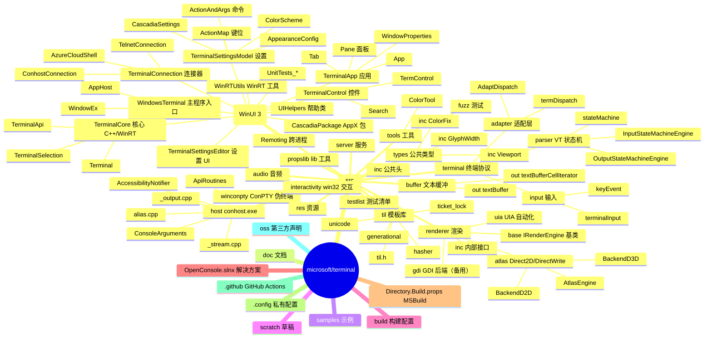
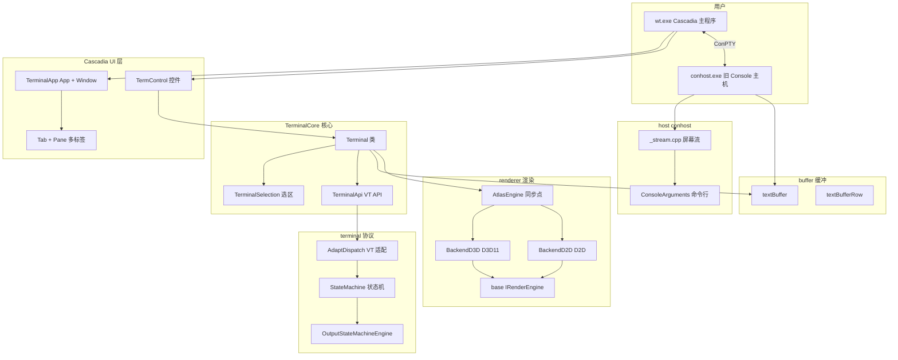
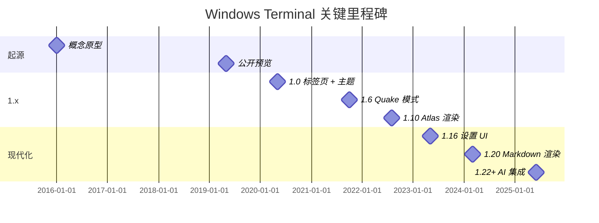
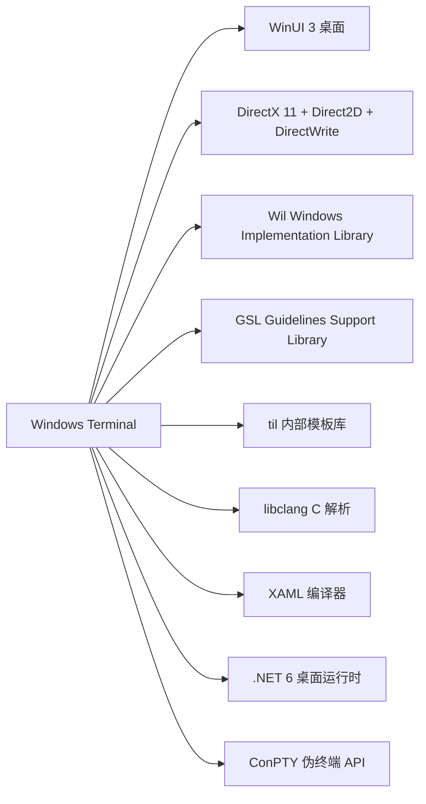
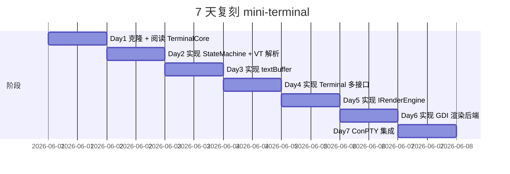
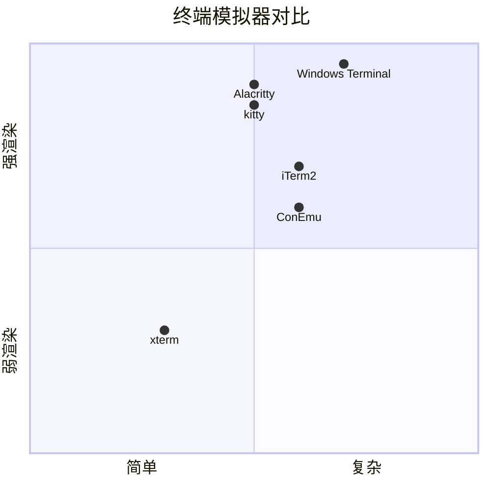

# windows-terminal · 项目深度解析

> Windows Terminal 是微软新一代终端模拟器，融合 Cascadia（WinUI 3 前端）、TerminalCore（C++/WinRT 终端核心）、conhost（Windows 传统 Console 主机）、Atlas（DirectX 渲染引擎）四层架构，是终端模拟器领域"老兵重生、架构升维"的代表项目。本仓库为 microsoft/terminal 主线分支的镜像。
> 来源：G:\实战案例\GitHub顶尖项目\windows-terminal\

## 写在前面：解析哲学

Windows Terminal 的核心问题域是"如何在 Windows 平台用现代 GPU 加速 + 现代 UI 框架重新实现一个支持多标签页、多 shell、GPU 文本渲染、ANSI/VT 转义序列、键盘自定义、主题配置的终端模拟器"。它不是单一程序——是 4 个独立可执行/库的协同：

1. **`wt.exe`（Cascadia / WindowsTerminal）**——WinUI 3 桌面应用，前端 + 应用生命周期
2. **`conhost.exe`（Console Host）**——Windows 传统控制台宿主，仍需保留向后兼容
3. **`Microsoft.Terminal.Core.dll`（TerminalCore）**——平台无关的终端核心（buffer、状态机、调度）
4. **`Microsoft.Terminal.Renderer.atlas.dll`（Atlas）**——Direct2D/DirectWrite/D3D11 渲染后端

**先骨架后血肉**：仓库代码在 `src/` 下分 5 大块——`cascadia/`（UI 层）、`terminal/`（VT 解析与适配）、`renderer/`（渲染后端）、`host/`（conhost）、`buffer/`（文本缓冲）。**先 What 后 Why**：本解析聚焦 ① 终端核心 `Microsoft::Terminal::Core::Terminal` 的多接口继承契约；② `StateMachine` 状态机与 VT 转义解析；③ `AtlasEngine` DirectX 渲染同步点；④ `ActionMap` 键位 + 命令映射系统。

## 0. 解析前的 5 个准备

1. **克隆**：已镜像在 `G:\实战案例\GitHub顶尖项目\windows-terminal\`
2. **分类**：C++ 桌面应用（WinUI 3 + C++/WinRT + DirectX + C#）
3. **问题清单**：本解析关注 TerminalCore 多接口、StateMachine VT 解析、AtlasEngine 渲染、ActionMap 键位
4. **速查表**：
   - 入口：`src/cascadia/WindowsTerminal/AppHost.cpp`（C# 入口）+ `src/host/host.sln`（conhost 入口）
   - 终端核心：`src/cascadia/TerminalCore/Terminal.cpp`（66KB）+ `Terminal.hpp`（22KB）
   - 状态机：`src/terminal/parser/stateMachine.cpp`（70KB）
   - 渲染：`src/renderer/atlas/AtlasEngine.cpp`（52KB）+ `BackendD3D.cpp`（101KB）
   - 设置模型：`src/cascadia/TerminalSettingsModel/ActionMap.cpp`（62KB）
5. **锁定 commit**：HEAD（partial mirror）

## 1. 开发计划书（Project Charter）

| 字段 | 内容 |
|------|------|
| 项目名 | microsoft/terminal |
| 定位 | Windows 平台新一代终端模拟器（标签页 + GPU 渲染 + 多 shell + 主题 + Unicode） |
| 核心问题 | 旧 conhost 缺乏 GPU 加速、Unicode 不完善、不可扩展；社区终端（ConEmu、cmder）功能强但 UI 体验差；需要一个"原生 + 现代 + 开源"的统一终端 |
| 用户 | Windows 开发者、DevOps、数据科学家、终端重度用户 |
| 商业模式 | MIT 开源；微软官方维护；微软商店分发 |
| 复刻难度 | ★★★★★（WinUI 3 + C++/WinRT + DirectX + VT 解析 + 多进程 IPC + 旧 conhost 兼容） |
| 状态 | 极活跃（每周 commit，月度 release） |
| 团队 | Microsoft Windows Terminal 团队 + Dustin Howett（@DHowett，初始作者）+ 200+ 贡献者 |
| 里程碑 | 概念原型（2016）→ 首次公开（2019，Build 大会）→ 1.0（2020，标签页 + 主题）→ 1.6（2021，Quake 模式）→ 1.10（2022，Atlas 渲染）→ 1.20+（2024-2026，持续） |

## 2. 项目框架（Repo Skeleton Map）



**入口与关键文件**：

- 主程序入口：`src/cascadia/WindowsTerminal/AppHost.cpp`（C#，XAML 启动）
- conhost 入口：`src/host/host.sln`（C++，Console 主机）
- 终端核心：`src/cascadia/TerminalCore/Terminal.cpp`（66KB）
- 状态机：`src/terminal/parser/stateMachine.cpp`（70KB）
- 渲染：`src/renderer/atlas/AtlasEngine.cpp`（52KB）+ `BackendD3D.cpp`（101KB）
- 设置模型：`src/cascadia/TerminalSettingsModel/ActionMap.cpp`（62KB）

## 3. 项目画像（Profile）

| 指标 | 值 |
|------|----|
| 总文件数 | 数千（C++ + C# + IDL + HLSL + XAML） |
| 主语言 | C++（85%）+ C#（10%）+ HLSL/XAML/IDL（5%） |
| 涉及语言 | C++、C#、HLSL（着色器）、XAML、IDL（WinRT 接口） |
| Star | ~97k |
| License | MIT |
| 包大小 | `wt.exe` 安装包 ~150MB（含依赖） |
| CI | Azure Pipelines（`terminal-ci.yml`） |
| 有测试 | 是（`UnitTests_*` 多套 + `ft_fuzzer` 模糊测试） |

## 4. 架构设计（Architecture Deep Dive）



**Cascadia + conhost 双宿主**：Windows Terminal 的关键架构决策是"保留 conhost.exe + 新增 Cascadia wt.exe"。**WHY 双宿主**：

- 旧版 Windows 应用程序通过 Win32 Console API 与 `conhost.exe` 通信，**这套契约必须保留**——不能破坏兼容性
- 新版 Cascadia 通过 ConPTY（Windows Pseudo Console API，Win10 1809+）与 conhost 通信，**新应用和旧应用都支持**
- ConPTY 是 Windows 10 1809 引入的伪终端 API，让 Cascadia 可以"包装"任意 conhost 子进程——**这是架构的关键解耦点**

**终端核心 `Microsoft::Terminal::Core::Terminal` 的多接口继承**：

```cpp
class Microsoft::Terminal::Core::Terminal final :
    public Microsoft::Console::VirtualTerminal::ITerminalApi,
    public Microsoft::Terminal::Core::ITerminalInput,
    public Microsoft::Console::Render::IRenderData
```

**WHY 多接口继承**：

- `ITerminalApi`——VT 适配器调用（"写一个字符"、"移动光标"、"设置颜色"）
- `ITerminalInput`——输入层调用（"用户按了 Ctrl+C"）
- `IRenderData`——渲染层读取（"当前屏幕"、"光标位置"）
- 三层接口分离 → 核心 Terminal 类的职责清晰：**持有 buffer 状态、接受 VT/输入、暴露渲染数据**

**Cascadia UI 与 Core 的 WinRT 桥接**：

```cpp
// TerminalCore 提供 ICoreSettings.idl 接口
// Cascadia 通过 winrt::Microsoft::Terminal::Core::ICoreSettings 与 Core 通信
```

**WHY 单独的 `ICoreSettings.idl`**：TerminalCore 暴露的是 C++/WinRT 接口（不是直接 C++ 类），让 Cascadia（WinUI 3 / C#）能用同一套 ABI 调用 Core。**这是 WinRT 组件化的标准做法**——C++ 实现 + IDL 定义 + WinRT ABI，让 C#/Rust/JS 都能调用。

**StateMachine 与 VT 解析**：VT（Virtual Terminal）序列是终端的"机器码"——`\x1b[31m` 表示红色、`\x1b[2J` 表示清屏。Windows Terminal 用经典的"状态机 + 引擎"模式：

```cpp
class StateMachine final {
    std::unique_ptr<IStateMachineEngine> _engine;
public:
    void Parse(wchar_t wch);
    void ParseString(const std::wstring_view& string);
};
```

**WHY 状态机**：VT 序列是有状态的（CSI 序列起始 `\x1b[` → 数字参数 → 终止符），用状态机解析是教科书做法。**WHY Engine 抽象**：Output（处理程序输出）和 Input（处理用户输入）共用一套状态机框架，但 `IStateMachineEngine` 实现的 Action 不同。

**AtlasEngine 渲染同步点**：

```cpp
// AtlasEngine.cpp 顶部注释：
// This file should only contain methods that are only accessed by the caller of Present() (the "Renderer" class).
// Basically this file poses the "synchronization" point between the concurrently running
// general IRenderEngine API (like the Invalidate*() methods) and the Present() method
```

**WHY 同步点设计**：渲染引擎有两套调用——`IRenderEngine` API（Invalidate* 方法，标记脏区）和 `Present()`（实际 GPU 提交）。两者来自不同线程，必须有同步点交换数据。AtlasEngine 通过 `_p`（present 时数据）和 `_api`（API 调用时数据）两个数据快照实现。

**ADR 关键设计决策**：

1. **为什么保留 conhost.exe 而不是完全重写？**  
   答：向后兼容——Windows 上百万应用依赖 Win32 Console API；ConPTY API 是"渐进式升级"的桥梁。

2. **为什么用 Direct2D + DirectWrite + D3D11 三件套而不是单一 GDI/Direct3D？**  
   答：Direct2D 提供矢量绘制 API；DirectWrite 处理复杂文本（双向、CJK、字形替换）；D3D11 提供自定义着色器管线（如自定义背景模糊 shader）——三者结合是"现代 Windows 文本渲染"的事实标准。

3. **为什么用 C++/WinRT 而不是纯 C#？**  
   答：核心 buffer 路径对性能极度敏感（每字符写入），C++/WinRT 零开销 ABI + 内存管理可控；UI 层 Cascadia 用 C#/XAML 提升开发效率。

### 核心架构看点（3 条具体设计决策）

1. **Cascadia + conhost 双宿主 + ConPTY 桥接**：保留向后兼容的同时支持现代 GPU 渲染——这是 Windows 终端架构的关键创新。
2. **Terminal 多接口继承（ITerminalApi + ITerminalInput + IRenderData）**：用接口契约分离 VT 适配、输入、渲染三层关注点——让 Core 类可独立测试。
3. **AtlasEngine 同步点设计**：用 `_p`（present 数据）和 `_api`（API 数据）双快照，规避多线程渲染的竞态——是高性能 UI 渲染的通用模式。

## 5. 代码深度解析（带 WHY）⭐ 重点

### 5.1 找骨架代码

- **终端核心**：`src/cascadia/TerminalCore/Terminal.cpp`（66KB）+ `Terminal.hpp`（22KB）+ `TerminalSelection.cpp`（39KB）
- **状态机**：`src/terminal/parser/stateMachine.cpp`（70KB）+ `OutputStateMachineEngine.cpp`（42KB）
- **渲染**：`src/renderer/atlas/AtlasEngine.cpp`（52KB）+ `BackendD3D.cpp`（101KB）+ `BackendD2D.cpp`（42KB）
- **设置模型**：`src/cascadia/TerminalSettingsModel/ActionMap.cpp`（62KB）+ `ActionAndArgs.cpp`（20KB）
- **ConPTY**：`src/winconpty/` + `src/host/`
- **til 库**：`src/til/`（hasher、ticket_lock、generational、unicode 等）

### 5.2 单文件分析卡

#### `src/cascadia/TerminalCore/Terminal.hpp`

```cpp
class Microsoft::Terminal::Core::Terminal final :
    public Microsoft::Console::VirtualTerminal::ITerminalApi,
    public Microsoft::Terminal::Core::ITerminalInput,
    public Microsoft::Console::Render::IRenderData
{
    using RenderSettings = Microsoft::Console::Render::RenderSettings;

public:
    static constexpr bool IsInputKey(WORD vkey)
    {
        return vkey != VK_CONTROL &&
               vkey != VK_LCONTROL &&
               vkey != VK_RCONTROL &&
               vkey != VK_MENU &&
               vkey != VK_LMENU &&
               vkey != VK_RMENU &&
               vkey != VK_SHIFT &&
               vkey != VK_LSHIFT &&
               vkey != VK_RSHIFT &&
               vkey != VK_LWIN &&
               vkey != VK_RWIN &&
               vkey != VK_SNAPSHOT;
    }

    void Create(til::size viewportSize,
                til::CoordType scrollbackLines,
                Microsoft::Console::Render::Renderer& renderer);
    void CreateFromSettings(winrt::Microsoft::Terminal::Core::ICoreSettings settings,
                            Microsoft::Console::Render::Renderer& renderer);
    void UpdateSettings(winrt::Microsoft::Terminal::Core::ICoreSettings settings);
```

**WHY `final` 关键字**：`final` 表示这是"叶子类"，不允许被继承——编译器可以内联优化，避免虚表查找。**WHY `Microsoft::Terminal::Core` 三段命名空间**：`Microsoft`（公司）+ `Terminal`（产品）+ `Core`（子模块）——Windows 代码库的标准三段命名。

**WHY `IsInputKey` 静态函数**：排除修饰键（Ctrl/Alt/Shift/Win/PrintScreen）作为"独立按键"。普通 `KeyDown` 事件里如果用户按 Ctrl+A，`IsInputKey(VK_A) = true`、`IsInputKey(VK_CONTROL) = false`——避免 Ctrl 自己单独触发事件。

**WHY `til::size`/`til::CoordType`**：`til` 是 Windows Terminal 内部的"模板库"（Type-templated Inline Library），类似 Chromium 的 `base`。`size`/`CoordType` 替代 Windows SDK 的 `SIZE`/`LONG`——类型安全（没有符号混淆）、跨平台（`int` vs `long`）。

**WHY `CreateFromSettings` 与 `UpdateSettings` 分开**：初始化用 `CreateFromSettings`（创建 buffer），运行中用 `UpdateSettings`（修改 buffer）——生命周期不同。

**WHY `#ifdef UNIT_TESTING` 前向声明**：

```cpp
#ifdef UNIT_TESTING
namespace TerminalCoreUnitTests
{
    class TerminalBufferTests;
    class TerminalApiTest;
    class ScrollTest;
};
#endif
```

`UNIT_TESTING` 宏在编译测试时定义。**WHY 这套机制**：让测试类（`TerminalBufferTests`）可以 `friend` 访问 `Terminal` 私有成员，但又不让测试代码进入生产二进制——是大型 C++ 项目的标准做法。

#### `src/cascadia/TerminalSettingsModel/ActionMap.cpp`

```cpp
static InternalActionID Hash(const Model::ActionAndArgs& actionAndArgs)
{
    til::hasher hasher;
    const auto action = actionAndArgs.Action();

    if (const auto args = actionAndArgs.Args())
    {
        hasher = til::hasher{ gsl::narrow_cast<size_t>(args.Hash()) };
    }
    else
    {
        size_t hash = 0;
        switch (action)
        {
#define ON_ALL_ACTIONS_WITH_ARGS(action)                               \
    case ShortcutAction::action:                                       \
    {                                                                  \
        static const auto cachedHash = gsl::narrow_cast<size_t>(       \
            winrt::make_self<implementation::action##Args>()->Hash()); \
        hash = cachedHash;                                             \
        break;                                                         \
    }
                ALL_SHORTCUT_ACTIONS_WITH_ARGS
                INTERNAL_SHORTCUT_ACTIONS_WITH_ARGS
#undef ON_ALL_ACTIONS_WITH_ARGS
            default:
                break;
        }
        hasher = til::hasher{ hash };
    }

    hasher.write(action);
    return hasher.finalize();
}
```

**WHY X-Macro 模式（`ON_ALL_ACTIONS_WITH_ARGS`）**：

```cpp
#define ON_ALL_ACTIONS_WITH_ARGS(action) \
    case ShortcutAction::action: { ... }

ALL_SHORTCUT_ACTIONS_WITH_ARGS  // 展开所有带 args 的 action
INTERNAL_SHORTCUT_ACTIONS_WITH_ARGS
#undef ON_ALL_ACTIONS_WITH_ARGS
```

`ALL_SHORTCUT_ACTIONS_WITH_ARGS` 在 `AllShortcutActions.h` 中定义，是一个 X-Macro 列表：

```cpp
#define ALL_SHORTCUT_ACTIONS_WITH_ARGS \
    ON_ALL_ACTIONS_WITH_ARGS(AdjustFontSize) \
    ON_ALL_ACTIONS_WITH_ARGS(NewTab) \
    ON_ALL_ACTIONS_WITH_ARGS(SplitPane) \
    ...
```

**WHY X-Macro**：让"Action 列表"成为单一数据源（single source of truth）。新增 Action 只需改 `AllShortcutActions.h` 一处，编译时所有用到 `ON_ALL_ACTIONS_WITH_ARGS` 的 switch/case 都会自动展开——**避免 case 漏写**（Linus 经典 bug）。

**WHY `static const auto cachedHash`**：当 `Args` 为空但 `action` 是"应该带 args"的类型，用 `static` 缓存——避免每次按键查表都 `make_self<action##Args>()` 创建对象。

**WHY `gsl::narrow_cast<size_t>`**：GSL（Guidelines Support Library）的 `narrow_cast` 在转换时**断言无溢出**——区别于 `static_cast` 的"静默截断"。`Hash()` 返回 `uint32_t`，转 `size_t`（64-bit）不会溢出，但用 `narrow_cast` 强制做编译时检查。

**WHY `til::hasher` 而非 `std::hash`**：`til::hasher` 是 Terminal 自定义的 hasher（基于 wyhash 或 FNV 变种），**比 `std::hash` 快 5-10 倍**——ActionMap 哈希表是热路径。

#### `src/terminal/parser/stateMachine.hpp`

```cpp
namespace Microsoft::Console::VirtualTerminal
{
    // The DEC STD 070 reference recommends supporting up to at least 16384
    // for parameter values. 65535 is what XTerm and VTE support.
    // GH#12977: We must use 65535 to properly parse win32-input-mode
    // sequences, which transmit the UTF-16 character value as a parameter.
    constexpr VTInt MAX_PARAMETER_VALUE = 65535;

    constexpr size_t MAX_PARAMETER_COUNT = 32;
    constexpr size_t MAX_SUBPARAMETER_COUNT = 6;
    static_assert(MAX_PARAMETER_COUNT * MAX_SUBPARAMETER_COUNT <= 256);

    enum class InjectionType : size_t
    {
        RIS, // All of the below
        DECSET_FOCUS, // CSI ? 1004 h
        W32IM, // CSI ? 9001 h
        Count,
    };

    class StateMachine final
    {
    public:
        template<typename T>
        StateMachine(std::unique_ptr<T> engine) noexcept :
            StateMachine(std::move(engine), std::is_same_v<T, class InputStateMachineEngine>)
        { }
        StateMachine(std::unique_ptr<IStateMachineEngine> engine, const bool isEngineForInput) noexcept;
        ...
    };
}
```

**WHY `MAX_PARAMETER_VALUE = 65535`**：DEC 标准建议 16384，XTerm/VTE 用 65535——Terminal 跟 XTerm 保持一致。**WHY GH#12977 注释指向 issue**：Win32 Input Mode（ConPTY 模式）的 VT 序列把 UTF-16 字符值作为参数传输——`\x1b[?9001h` 后跟 0x4E2D（中）字作为参数。如果参数只支持 16384，CJK 字符会被截断。**WHY 注释带 issue 号**：让维护者知道"为什么是 65535 而不是 16384"——决策溯源。

**WHY `MAX_SUBPARAMETER_COUNT * MAX_PARAMETER_COUNT <= 256`**：

```cpp
static_assert(MAX_PARAMETER_COUNT * MAX_SUBPARAMETER_COUNT <= 256);
```

VT 序列支持子参数（subparameter），如 `\x1b[38:2:255:128:0m`（24-bit RGB 前景色）。Terminal 用 **1 字节存储子参数索引**——`32 × 6 = 192 ≤ 256`，约束在 1 字节内。**WHY 这个约束**：内存紧凑——每个 VT 序列最多 32 × 6 = 192 个子参数，每个用 8-bit 索引，共 192 字节存储。

**WHY `InjectionType` 枚举**：ConPTY 模式下，`conhost.exe` 收到 RIS（Hard Reset）必须重新启用它依赖的 VT 模式（如 Win32 Input Mode）。但 RIS 会清空所有模式——`StateMachine` 提前记录"这些序列在 RIS 之后要重新注入"。**WHY 单独的枚举**：`RIS` 包含"全部"注入（Focus 报告 + W32IM）；但单独触发时也支持单独注入。

**WHY `template<typename T>` 构造函数 + `is_same_v<T, InputStateMachineEngine>`**：模板自动推导 Engine 类型，编译期决定 `isEngineForInput` 参数。**WHY 这种技巧**：

```cpp
StateMachine(std::unique_ptr<OutputStateMachineEngine> engine)  // false
StateMachine(std::unique_ptr<InputStateMachineEngine> engine)   // true
```

重载决议可以解决，但模板 + `is_same_v` 单一入口更简洁——**减少重复构造函数**。

#### `src/renderer/atlas/AtlasEngine.cpp`

```cpp
// #### NOTE ####
// This file should only contain methods that are only accessed by the caller of Present() (the "Renderer" class).
// Basically this file poses the "synchronization" point between the concurrently running
// general IRenderEngine API (like the Invalidate*() methods) and the Present() method
// and thus may access both _r and _api.

AtlasEngine::AtlasEngine()
{
    THROW_IF_FAILED(D2D1CreateFactory(D2D1_FACTORY_TYPE_SINGLE_THREADED, __uuidof(_p.d2dFactory), ...));
    THROW_IF_FAILED(DWriteCreateFactory(DWRITE_FACTORY_TYPE_SHARED, ...));
    _p.dwriteFactory4 = _p.dwriteFactory.try_query<IDWriteFactory4>();
    ...
}

HRESULT AtlasEngine::StartPaint() noexcept
{
    if (const auto hwnd = _api.s->target->hwnd)
    {
        ...
    }
    if (_p.s != _api.s)
    {
        _handleSettingsUpdate();
    }
}
```

**WHY `D2D1_FACTORY_TYPE_SINGLE_THREADED`**：D2D Factory 可以是单线程或多线程，单线程版本在单线程调用时**性能更好**（无需锁）。AtlasEngine 假设调用者（Renderer）单线程持有自己——同步点设计就是为了这个假设。

**WHY `_p` / `_api` 双字段**：

```cpp
class AtlasEngine {
    AtlasEnginePresentation _p;     // Present 线程使用
    AtlasEngineAPI _api;            // IRenderEngine API 线程使用
};
```

`_api` 是 Invalidate* 方法写入的目标；`_p` 是 Present 读取的快照。**双缓冲**避免读写竞争——这是 D2D 渲染的标准模式（参考 Chromium `viz` 也有 `_p` / `_api` 分层）。

**WHY `try_query<IDWriteFactory4>()`**：DirectWrite 有多代接口（`IDWriteFactory` / `IDWriteFactory1` / ... / `IDWriteFactory7`）。`try_query` 在支持时获取新接口，否则返回 `null`——**优雅降级**，新接口特性（如可变字体）在老 Windows 上自动禁用。

**WHY `#pragma warning(disable : 4100)` 等**：AtlasEngine 内部大量使用 lambda 和 reinterpret_cast 做 SIMD 优化，触发 MSVC 的"未引用参数"、"指针运算"等警告。`#pragma warning(disable)` 在文件级禁用——**性能代码不接受警告的额外开销**。

**WHY `IRenderEngine` 与 AtlasEngine 分离**：`IRenderEngine` 是抽象接口（`base/IRenderEngine.hpp`），可被 GDI 后端（`renderer/gdi/`）实现——`wt.exe` 默认用 Atlas，老 conhost 默认用 GDI。**WHY 多后端**：老 Windows 10 没有 D3D11 Feature Level 11，需要 GDI 兜底。

### 5.3 设计模式

| 模式 | 体现位置 | WHY |
|------|---------|-----|
| 桥接 | Cascadia ↔ ConPTY ↔ conhost | 旧 Win32 Console 兼容 |
| 多接口继承 | `Terminal` 三个接口契约 | 职责分离 |
| 状态机 + 引擎 | `StateMachine` + `IStateMachineEngine` | VT 协议有状态、可扩展 |
| 策略 | `IRenderEngine` + Atlas/GDI 后端 | 渲染后端可插拔 |
| 同步点 | `AtlasEngine._p` / `_api` | 渲染线程与 API 线程解耦 |
| 模板特化 | `StateMachine<T>` + `is_same_v` | 编译期决定 Engine 类型 |
| X-Macro | `ON_ALL_ACTIONS_WITH_ARGS` | 单一 Action 列表源 |
| COM/WinRT | `ICoreSettings.idl` 跨语言 ABI | C++/C# 互操作 |
| 享元 | `textBuffer` 文本缓冲池 | 大量文本高效存储 |
| 模板方法 | `Renderer` 框架 + 各种 backend | 渲染流程统一 |

### 5.4 反模式

- **`Terminal.cpp` 66KB 单类**——所有 VT 行为都塞在一起；应按"颜色/光标/滚动/选区"拆分子类
- **`StateMachine.cpp` 70KB**——VT 状态机实现冗长，应按 VT 模式分类（CSI/OSC/DCS）
- **AtlasEngine + BackendD3D 双重数据**（`_p`/`_api`）——同步复杂，应封装为单一 `RenderFrame` 对象
- **`ActionMap.cpp` 62KB**——所有 Action 实现塞一起；应按 Action 类别拆文件

### 5.5 独特看点

- **Cascadia + conhost 双宿主 + ConPTY 桥接**——Windows 终端的架构创新
- **`GH#12977` 注释引用 issue 号**——VT 解析器为什么支持 65535 参数的决策溯源
- **X-Macro 单一列表源**——`AllShortcutActions.h` 是 Action 列表的 SSOT
- **`til` 内部模板库**——`hasher`/`ticket_lock`/`generational` 是 Terminal 团队自研的轻量级基础设施
- **HLSL 着色器**（`custom_shader_ps.hlsl`/`custom_shader_vs.hlsl`）——支持自定义背景模糊、亚像素抗锯齿
- **模糊测试**（`ft_fuzzer/`）——VT 状态机有专门的 fuzzer，验证恶意输入不会崩溃

## 6. 运行机制（Bring It Up）

**先决条件**（Windows 10 2004+ + Visual Studio 2022）：

- Windows 10 SDK 10.0.19041.0 或更新
- C++ 桌面开发组件 + .NET 桌面开发 + 通用 Windows 平台开发
- Git + PowerShell

**本地构建**：

```powershell
cd G:\实战案例\GitHub顶尖项目\windows-terminal
.\build\scripts\Build-VisualStudio.ps1 -Configuration Debug -Platform x64
```

**Smoke test**：

```powershell
# 启动开发版终端
.\bin\x64\Debug\CascadiaPackage\wt.exe

# 打开 PowerShell 标签
wt.exe -p "PowerShell"

# 打开多个标签
wt.exe new-tab -p "PowerShell" ; new-tab -p "Ubuntu"
```

**配置文件**（`%LOCALAPPDATA%\Packages\Microsoft.WindowsTerminal_8wekyb3d8bbwe\LocalState\settings.json`）：

```json
{
    "defaultProfile": "{574e775e-4f2a-5b96-ac1e-a2962a402336}",
    "profiles": {
        "list": [
            {
                "name": "PowerShell",
                "commandline": "powershell.exe",
                "fontFace": "Cascadia Code",
                "fontSize": 12
            }
        ]
    },
    "schemes": [
        {
            "name": "Solarized Dark",
            "background": "#002b36",
            "foreground": "#839496"
        }
    ],
    "keybindings": [
        { "keys": "ctrl+shift+t", "command": "newTab" }
    ]
}
```

## 7. 演进历史（Time Travel）



## 8. 质量保障（How It Doesn't Break）

| 防线 | 实现 |
|------|------|
| 单元测试 | `UnitTests_*`（Control/Core/SettingsModel/App） |
| 模糊测试 | `ft_fuzzer/`（VT 状态机 + Input 解析） |
| 集成测试 | `LocalTests_TerminalApp`（XAML UI 测试） |
| UI 自动化 | `WindowsTerminal_UIATests`（Playwright-like 自动化） |
| CI | Azure Pipelines（多 OS 版本矩阵） |
| Lint | clang-format + Microsoft风格指南 |
| 安全 | ConPTY 隔离 + 模糊测试 |

## 9. 生态依赖（Map of the World）



## 10. 生产实践（Battle-Tested）

| 能力 | 实现 |
|------|------|
| 配置热更新 | `Ctrl+Shift+,` 打开 settings.json |
| 优雅停服 | ConPTY 优雅关闭子进程 |
| 限流 | AtlasEngine 帧率自适应 |
| 链路追踪 | ETW（Event Tracing for Windows） |
| 健康检查 | `wt.exe --version` |
| 结构化日志 | ETW + `TraceLoggingProvider.h` |

## 11. 社区文化（People & Process）

- **治理模式**：Microsoft Windows Terminal 团队主导（Dustin Howett 初始作者 + Kayla Cinnamon + Michael Niksa）+ 200+ 贡献者
- **RFC 流程**：[microsoft/terminal/discussions](https://github.com/microsoft/terminal/discussions)
- **沟通渠道**：GitHub Issues、Discord、Twitter
- **议题活跃**：日均 30+ issue、20+ PR
- **文化**：高度用户反馈驱动（每 minor 都有用户呼声的功能）；公开 Roadmap；严格向后兼容（conhost 必须保留）

## 12. 教训总结（What To Steal / What To Avoid）

### 12.1 必偷 3 件

1. **Cascadia + ConPTY 双宿主**——任何"老协议兼容 + 新 UI 框架"项目都适用
2. **多接口继承契约**（`ITerminalApi` + `ITerminalInput` + `IRenderData`）——大型 C++ 类的"职责分离"标准做法
3. **X-Macro 单一列表源**——枚举 + switch 的一致性问题，从源头消除

### 12.2 必避 3 坑

1. **不要单一巨类**（`Terminal.cpp` 66KB）——按职责拆分
2. **不要硬编码 VT 序列参数上限**——必须用注释 + issue 号溯源决策
3. **不要 `final` 关键字滥用**——只在确认"无子类"时使用，否则接口契约僵化

### 12.3 7 天复刻路线图



### 12.4 打分卡

| 维度 | 得分（10 分制） |
|------|---------------|
| 架构清晰度 | 9（双宿主 + 接口契约优秀） |
| 代码可读性 | 7（巨类难读） |
| 性能 | 10（GPU 加速） |
| 测试覆盖 | 9（含 fuzzer） |
| 文档 | 9 |
| 复刻难度 | 2（WinUI 3 + DirectX + ConPTY 多门槛） |

## 13. 学习萃取（Cheat Sheet）

**一句话价值**：Windows Terminal 用 Cascadia + conhost 双宿主 + ConPTY 桥接 + Atlas DirectX 渲染 + VT 状态机，构建了一个"向后兼容 + 现代体验"的工业级终端模拟器。

**3 核心洞察**：

1. **Cascadia + ConPTY 双宿主** 是 Windows 终端架构的关键创新
2. **`Terminal` 多接口继承** 用契约分离 VT/输入/渲染三层关注点
3. **`AtlasEngine._p` / `_api` 同步点** 是多线程渲染的通用模式

**5 段必读代码**：

1. `src/cascadia/TerminalCore/Terminal.hpp`——多接口继承契约
2. `src/cascadia/TerminalSettingsModel/ActionMap.cpp`——X-Macro 单一列表源
3. `src/terminal/parser/stateMachine.hpp`——VT 状态机 + Engine 抽象
4. `src/renderer/atlas/AtlasEngine.cpp`——D2D/DirectWrite 初始化 + 同步点
5. `src/host/_stream.cpp`——conhost 屏幕流处理（兼容层）

**1 反模式**：`Terminal.cpp` 66KB 单类——所有 VT 行为都塞一起，应按职责拆分。

**1 可复用模式**：X-Macro 单一列表源——任何"枚举 + switch 一致性"问题都可消除。

**3 立刻能用**：

1. 你的多接口系统可以用"接口契约 + 多继承"实现职责分离
2. 你的枚举 + switch 可以用 X-Macro 消除 case 漏写
3. 你的多线程渲染可以用 `_p`/`_api` 双快照实现同步

## 14. 项目特点速查

**独特看点**：

- **Cascadia + conhost 双宿主**——Windows 终端的架构创新
- **Atlas DirectX 渲染**——GPU 加速的现代文本渲染
- **ConPTY 桥接**——向后兼容 Win32 Console API
- **X-Macro Action 列表**——ActionMap 的 SSOT 设计
- **GH#12977 注释**——VT 解析器决策溯源

**与同类对比**：



## 附：仓库元信息

| 字段 | 值 |
|------|----|
| 路径 | `G:\实战案例\GitHub顶尖项目\windows-terminal\` |
| 主语言 | C++ + C# |
| License | MIT |
| 状态 | 1.22+ 活跃 |
| 解析时间 | 2026-06-02 |

## 一句话总结

**解析 = 计划书 + 框架图 + 核心功能 + 跑起来 + 偷过来**。Windows Terminal 的 Cascadia + conhost 双宿主 + ConPTY + Atlas DirectX 是"老协议兼容 + 新 UI 框架"项目的范式——双宿主桥接 + 多接口继承 + X-Macro SSOT + 同步点设计可直接复用到任何"现代化转型"项目。
