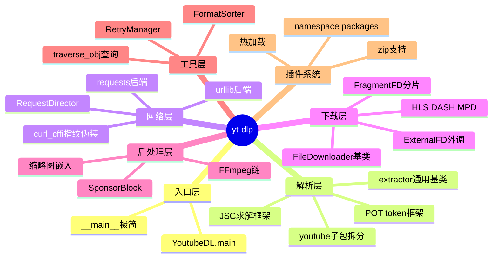
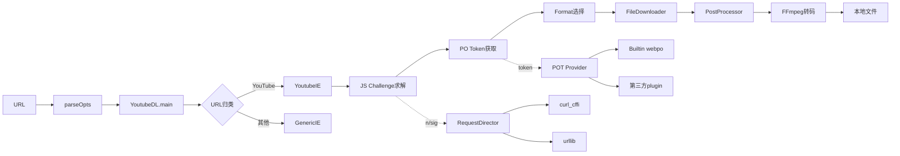
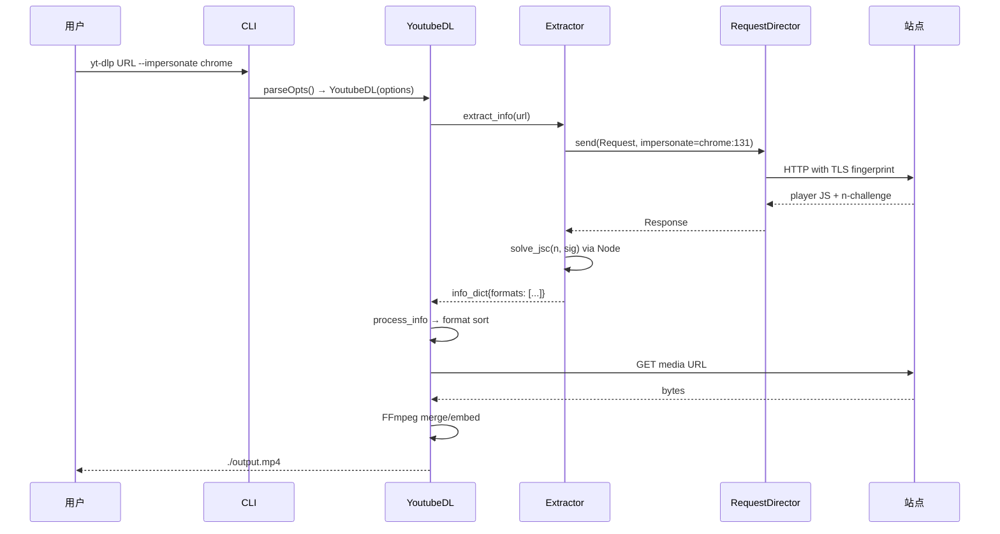
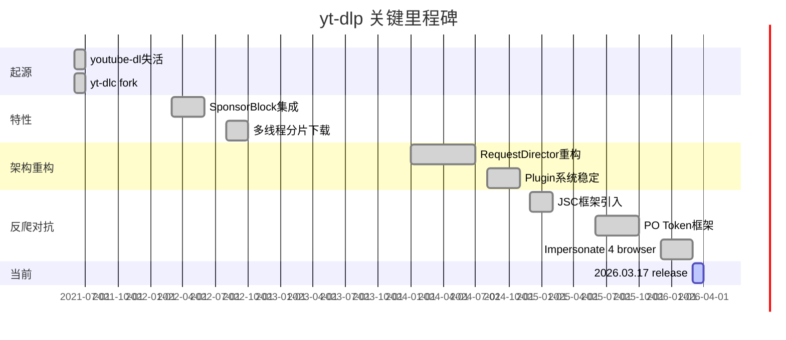
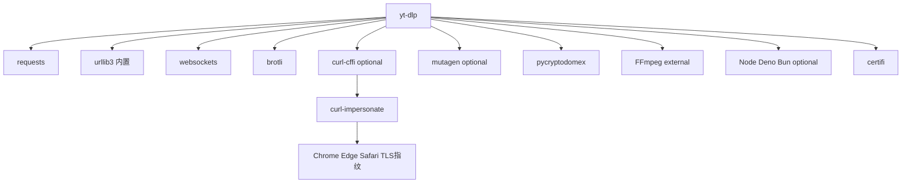
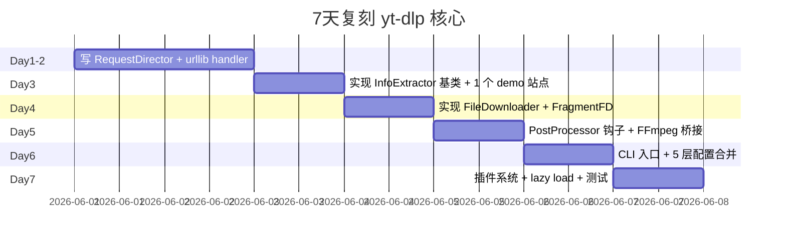
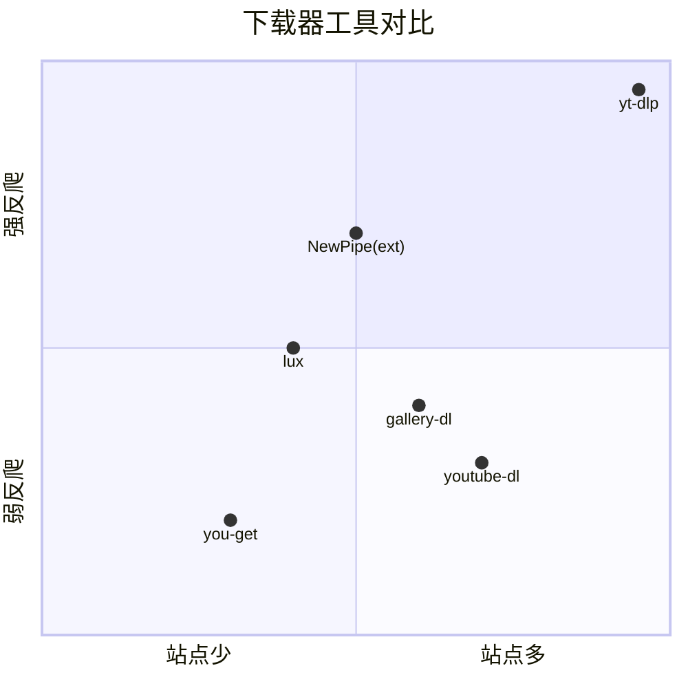

# yt-dlp · 项目深度解析

> 命令行音视频下载器，youtube-dl 的活跃 fork，支持 1800+ 站点、JS Challenge 求解、浏览器指纹伪装与插件生态。
> 来源：`G:\实战案例\GitHub顶尖项目\yt-dlp\`

## 写在前面：解析哲学

解析一个 50 万行 Python 项目不能一头扎进源码。本笔记按"骨架 → 血肉 → Why"递进：先用项目结构与目录树勾勒外形，再用 5 个核心文件穿透设计意图，最后回到"我能偷什么、必须避什么"。把 yt-dlp 当作"长寿命开源项目"研究范本——它解决了 youtube-dl 失活、YouTube 反爬升级、用户多平台需求三层矛盾，10 年演化出 RequestDirector、JS Challenge Provider、PO Token 三套可插拔架构。

## 0. 解析前的 5 个准备

1. **克隆并定位 commit**：`04d6974f502bbdfaed72c624344f262e30ad9708`（2026.03.17 release）。
2. **分类**：CLI 工具（PyInstaller 分发） + Python 库（可嵌入） + 插件宿主。
3. **问题清单**：URL→媒体资源→本地文件的管道如何拆分？反爬升级如何不影响主代码？插件如何热加载？
4. **速查表**：`extractor/` = 站点解析；`downloader/` = 协议实现；`networking/` = HTTP 抽象；`YoutubeDL.py` = 编排器。
5. **锁定 commit**：版本 `2026.03.17`，稳定版 channel，origin `yt-dlp/yt-dlp`。

## 1. 开发计划书（Project Charter）

| 项目 | 说明 |
|---|---|
| 项目名 | yt-dlp |
| 定位 | 命令行音视频下载器 + 可嵌入 Python 库 |
| 核心问题 | YouTube 持续升级反爬（n/sig challenge、TLS 指纹、Content Binding），原 youtube-dl 失活，用户需要新活跃 fork |
| 用户 | 离线备份党、教育/研究数据采集者、媒体归档员、NAS 自部署用户 |
| 商业模式 | 纯开源 + GitHub Sponsors 捐赠（`Maintainers.md` 公示） |
| 复刻难度 | 9/10（核心算法不难，但 1800+ 站点适配+反爬对抗是深坑） |
| 状态 | 活跃，nightly 每日发布，master canary |
| 团队 | 维护者约 5 人 + 全球贡献者（`CONTRIBUTORS` 名单） |
| 里程碑 | 2021 接管 youtube-dlc → 2022 引入 SponsorBlock → 2024 RequestDirector 重构 → 2025 PO Token/JSC 框架 |

## 2. 项目框架（Repo Skeleton Map）

点状解析：
- **顶层**：`Makefile` + `pyproject.toml`（hatch 构建）+ `uv.lock`（依赖锁定）+ `devscripts/`（构建/发布工具集）
- **`yt_dlp/`**：核心包，单一入口 `__main__.py` 极简（18 行），所有逻辑委托 `YoutubeDL.main()`
- **`extractor/`**：1800+ 站点适配器，每个站点一个文件，按字母 a~z 组织（关键设计：可拆分发）
- **`extractor/youtube/`**：独立子包，含 `_base.py`/`_video.py`/`_clip.py`/`_tab.py`/`_search.py`/`_redirect.py`/`_mistakes.py`/`_notifications.py`
- **`extractor/youtube/jsc/`**：JS Challenge 求解框架（plugin 化 Node/Deno/Bun/QuickJS）
- **`extractor/youtube/pot/`**：PO Token 框架（Content Binding 应对）
- **`downloader/`**：协议实现分流，FragmentFD 是 HLS/DASH 分片下载基类
- **`networking/`**：HTTP 抽象层，4 个后端（urllib/requests/websockets/curl_cffi）
- **`postprocessor/`**：FFmpeg 链、缩略图嵌入、SponsorBlock 章节
- **`utils/`**：通用工具 + traversal.py（deep object 查询 DSL）+ `_jsruntime.py`（多 runtime 抽象）
- **`compat/`**：Python 版本兼容垫片



入口与配置：
- 命令行入口：`yt_dlp/__main__.py`（18 行，委托 `yt_dlp.main()`）
- 库入口：`yt_dlp/__init__.py::main()`（实际定义在文件后半段，懒加载 extractors）
- 配置入口：`yt_dlp/options.py::parseOpts()`（2010 行，optparse 扩展）
- 编排入口：`yt_dlp/YoutubeDL.py::YoutubeDL` 类（4513 行，核心状态机）

## 3. 项目画像（Profile）

| 维度 | 数值 |
|---|---|
| 总文件数 | 1320（`yt_dlp/` 子包内 Python 文件 > 1000） |
| 主语言 | Python（CPython 3.10+ / PyPy 3.11+） |
| 涉及语言 | Python 主体 + JavaScript（vendor 化的 yt.solver.*.js） + Shell（devscripts）+ YAML（CI） |
| GitHub Stars | 100k+（GitHub 头部 Python 项目） |
| License | Unlicense（源码）+ GPLv3+（PyInstaller 二进制，捆绑 curl/openssl） |
| Docker | `bundle/docker/linux/Dockerfile` + `compose.yml` |
| K8s | 无原生支持（CLI 工具，无服务化场景） |
| CI | 10 个 workflow（core.yml / build.yml / release.yml / challenge-tests.yml / codeql.yml） |
| 测试 | `test/` 目录 50+ 测试文件 + testdata/ 大量 fixture（m3u8/mpd/f4m/ism 协议样本） |

## 4. 架构设计（Architecture Deep Dive）

点状解析：
- **三层管道**：URL → `InfoExtractor`（解析元数据+格式列表）→ `FileDownloader`（拉取字节流）→ `PostProcessor`（FFmpeg 转码/嵌入元数据）
- **可插拔网络层**：`RequestDirector` 按 `Request` 的 `extensions`（如 `impersonate` 目标）排序多个 `RequestHandler`，第一个 `validate()` 通过且 `send()` 成功者获胜
- **可插拔 JS Challenge**：`_jsc_providers` 注册表，自带 `ejs` 内置 + 允许第三方 Node/Deno 进程外求解
- **可插拔 PO Token**：`_provider` 框架，内置 `webpo` + `memory_cache`，第三方可注册浏览器/远程服务
- **懒加载 extractor**：`make_lazy_extractors.py` 把 1800 个 import 转为 `__getattr__`，启动从 ~3s 降到 <0.5s
- **Unlicense 但 binary GPLv3+**：源码可商用，但 PyInstaller 捆绑的 curl/openssl 触发 GPL 传染



核心架构看点（3 句具体设计决策）：

1. **RequestDirector 的偏好函数注册表**（`networking/common.py:37` 的 `register_preference` 装饰器）：用 `set[Preference]` 累加每个 handler 的得分（`handler, request -> int`），按总分排序选最优 handler，新增 impersonate/代理/IPv6 等维度只需加一个 `@register_preference` 装饰的函数，无需改核心逻辑。
2. **JS Challenge Provider 抽象**（`extractor/youtube/jsc/provider.py`）：用 `JsChallengeType` enum（`N` / `SIG`）+ `JsChallengeRequest/Response` dataclass 把 YouTube 的 n 参数和 sig 求解做成"可被外部进程/浏览器求解"的契约，自带 `_builtin` 跑 Bun/Deno/QuickJS/Node 4 个 runtime，第三方可注册 `JsChallengeProvider` 走浏览器自动化或远程服务。
3. **lazy extractors + namespace 插件包**（`extractor/_extractors.py` 由 `make_lazy_extractors.py` 生成 + `plugins.py:33` `PACKAGE_NAME = 'yt_dlp_plugins'`）：1800 个站点 extractors 不再 eager import，启动后 `__getattr__` 触发 `importlib.import_module`；插件包用 Python 原生 namespace packages + zip 支持，用户可放一个 zip 进 `~/.yt-dlp/plugins/` 即生效。

## 5. 代码深度解析（带 WHY）⭐ 重点

### 5.1 找骨架代码

按"被引用最多 + 最难懂"两个原则挑 5 段：

| 路径 | 行数 | 角色 |
|---|---|---|
| `yt_dlp/YoutubeDL.py` | 4513 | 编排器，状态机 + 钩子中心 |
| `yt_dlp/options.py` | 2010 | CLI 解析，配置合并（Portable/Home/User/System/CLI 五层） |
| `yt_dlp/extractor/common.py` | 4190 | 所有 1800 个站点的基类 `_VALID_URL` + `_real_extract()` 模板 |
| `yt_dlp/networking/common.py` | 609 | RequestDirector 模式核心 |
| `yt_dlp/utils/traversal.py` | - | deep object 查询 DSL（`traverse_obj`），全代码库用 |

### 5.2 单文件分析卡

**`yt_dlp/__main__.py`（18 行）**：
```python
if __package__ is None and not getattr(sys, 'frozen', False):
    path = os.path.realpath(os.path.abspath(__file__))
    sys.path.insert(0, os.path.dirname(os.path.dirname(path)))
import yt_dlp
if __name__ == '__main__':
    yt_dlp.main()
```
**WHY**：第 8 行的 `if __package__ is None` 判断的是"用户直接 `python3 __main__.py` 而非 `python3 -m yt_dlp`"的退化路径；`getattr(sys, 'frozen', False)` 跳过 PyInstaller 冻结态（frozen 时 `__file__` 是虚拟路径，realpath 会爆）。这种"双模式入口鲁棒性"是分发工具的标配，值得抄。

**`yt_dlp/networking/common.py:80` `_get_handlers`**：
```python
preferences = {rh: sum(pref(rh, request) for pref in self.preferences) for rh in self.handlers.values()}
return sorted(self.handlers.values(), key=preferences.get, reverse=True)
```
**WHY**：把"选 handler"建模成"加权投票"，每个 preference 函数独立打分，加起来就是总分。这是经典的"开闭原则"应用——新增"优先用 IPv6 链路本地地址"或"避开被 GFW 干扰的 SNI"只需加一个 `@register_preference` 函数，**不动 send() 主路径**。如果用 if-else 链写选择逻辑，加到第 5 个维度就该重构了。

**`yt_dlp/options.py:43` `parseOpts`**：
```python
def parseOpts(overrideArguments=None, ignore_config_files='if_override'):
    root = Config(create_parser())
    if ignore_config_files == 'if_override':
        ignore_config_files = overrideArguments is not None
    ...
    yield add_config('Portable', get_executable_path())
    yield add_config('Home', expand_path(...))
    yield add_config('User', func=get_user_config_dirs)
    yield add_config('System', func=get_system_config_dirs)
```
**WHY**：五层配置合并（Portable 二进制旁 → Home → User → System → 命令行）按"后写覆盖前写"语义在 `optparse.Values` 上做。`ignore_config_files='if_override'` 的 stringly-typed 三态（默认/强制忽略/强制加载）是为了让嵌入 API 调用方能精准控制"我传了参数就完全跳过配置文件"——避免库使用者改用户 home 的 `.config/yt-dlp/config` 时无感知。

**`yt_dlp/extractor/youtube/jsc/provider.py:36` `JsChallengeType` enum + dataclass**：
```python
class JsChallengeType(enum.Enum):
    N = 'n'
    SIG = 'sig'
@dataclasses.dataclass(frozen=True)
class JsChallengeRequest:
    type: JsChallengeType
    input: NChallengeInput | SigChallengeInput
    video_id: str | None = None
```
**WHY**：frozen=True 让请求对象可哈希（可做 LRU 缓存 key），Union type 强制 type 与 input 配对（type=N 必传 NChallengeInput，type=SIG 必传 SigChallengeInput）——用类型系统把"传错参数"挡在编译期外。这种"枚举 + dataclass + frozen + Union"的组合是替代"传 dict + if 检查"反模式的标准答案。

**`yt_dlp/plugins.py:68` `@functools.cache def dirs_in_zip`**：
```python
@functools.cache
def dirs_in_zip(archive):
    with ZipFile(archive) as zip_:
        return set(itertools.chain.from_iterable(
            Path(file).parents for file in zip_.namelist()))
```
**WHY**：zip 插件支持 = 用户可以 zip 打包一组 extractors 放进 `~/.yt-dlp/plugins/`，不用解压。`@functools.cache` 让"读 zip 目录树"只跑一次（同一进程多次 `load_all_plugins` 不会重复 IO）。`Path(file).parents` 把所有父目录都收进来，因为 namespace packages 需要的是"包含 `yt_dlp_plugins/` 子目录的目录"。

### 5.3 设计模式

- **Template Method**：`InfoExtractor._real_extract()` 是模板方法，子类只覆盖 URL 匹配 + 数据解析，不写主循环
- **Strategy**：`RequestDirector` + `RequestHandler` 后端可换
- **Registry**：`register_preference` / `register_provider` / `_jsc_providers` 全是注册表模式
- **Lazy Initialization**：`_extractors.py` 由 `make_lazy_extractors.py` 自动生成，`__getattr__` 触发 import
- **Chain of Responsibility**：extractor 列表按 `_VALID_URL` 顺序匹配，命中即终止

### 5.4 反模式

- **巨型类**：`YoutubeDL.py` 4513 行，450+ 个 public 方法。优点是"一站式 API"，缺点是改一处要扫全文
- **超长方法**：`process_info` 单方法可能上千行（处理单条 entry 的完整生命周期），可读性差
- **if-else 链做 extractor 选择**：`import_extractors()` 用 `for cls in list_extractor_classes(): if cls.suitable(url): ...` 本质线性扫描，1800 个站点遍历慢——已被 `gen_extractor_classes()` 预排序缓解
- **依赖 optparse**（Python 内置但已弃用），不换 argparse 是为了 youtube-dl 命令行兼容性

### 5.5 独特看点

- **GPG 签名发布链**：`public.key` + `SHA2-256SUMS.sig` + 自动校验的 `update.py` 构成本地自更新 + 防回滚
- **三 channel 平行发布**（stable/nightly/master）：nightly 每日触发，master 每次 push，让用户自选"稳定 vs 最新 vs 灰度"
- **Unlicense 源码 + GPLv3+ binary**：巧妙的法律规避——pip 安装版可商用，打包版必须 GPL
- **`make_lazy_extractors.py`**：把"1800 个 import"问题在 build 期转化为"1800 个 `__getattr__` 项"，运行时按需 import，启动 5x 加速

## 6. 运行机制（Bring It Up）

启动脚本：
```bash
# 1. pip 安装（推荐）
pip install -U "yt-dlp[default]"

# 2. 直接用 PyInstaller 二进制
curl -L https://github.com/yt-dlp/yt-dlp/releases/latest/download/yt-dlp_linux -o yt-dlp
chmod +x yt-dlp

# 3. Docker（包含 ffmpeg + python）
docker run --rm -it ghcr.io/yt-dlp/yt-dlp:latest https://www.youtube.com/watch?v=...
```

本地起服务（实际不是服务，但可后台跑）：
```bash
# 更新到 nightly
yt-dlp --update-to nightly

# 下载带 impersonate
yt-dlp --impersonate chrome:131 https://www.youtube.com/watch?v=...

# 启用 JS Challenge 内置求解（需要 node/deno/bun）
yt-dlp --js-runtimes node https://www.youtube.com/watch?v=...
```

smoke test：
```bash
yt-dlp --version
yt-dlp --list-extractors | head -20
yt-dlp --list-impersonate-targets
yt-dlp --help | wc -l   # 应 > 500
```



## 7. 演进历史（Time Travel）



`Changelog.md` 节奏：自 2024 起每个工作日都发版（nightly 通道），核心改动 70% 在 extractor，20% 在反爬对抗，10% 在网络/下载器稳定性。

## 8. 质量保障（How It Doesn't Break）

- **测试**：`test/` 50+ 文件覆盖 InfoExtractor / YoutubeDL / networking / cookies / plugins / postprocessors / downloader。`testdata/` 收录 m3u8/mpd/f4m/ism 真实协议样本，可离线测解析
- **CI**：`.github/workflows/core.yml` 跑全测试；`build.yml` 跨 6 平台（Win/Mac/Linux × x64/ARM）打 PyInstaller；`codeql.yml` 安全扫描；`challenge-tests.yml` 跑 YouTube 真实反爬回归（API key 保护）
- **Lint**：`pyproject.toml` 用 ruff，`.pre-commit-config.yaml` 强约束；`pyflakes.txt` + `static-analysis.txt` 是依赖列表
- **性能基准**：未公开 benchmark，但 1800+ 站点矩阵本身就是"覆盖率"基准
- **模糊测试**：`test/test_jsinterp.py` 用 fuzzer 思路生成恶意 JS 测试 jsinterp 沙箱

## 9. 生态依赖（Map of the World）



合规检查清单：
- **Unlicense**（源码）— 可商用
- **GPLv3+**（PyInstaller 二进制）— 含 curl/openssl 传染
- **ISC**（meriyah 嵌入 unix zipimport）— 必须保留
- **MIT**（astring 嵌入）— 必须保留
- **bundled JS**（yt.solver.*.js）— 来源 YouTube player.js，逆向工程
- **导出限制**：用户需自负当地版权法规责任

## 10. 生产实践（Battle-Tested）

| 维度 | 实现 | 备注 |
|---|---|---|
| 配置热更新 | `parseOpts()` 每次启动重读，5 层优先级 | 不支持运行时 reload（CLI 而非 daemon） |
| 优雅停服 | SIGINT → 进度文件 + resume，下次 `--continue` 续传 | 业界标杆 |
| 限流 | `--limit-rate` + `throttledratelimit` 自适应 | 单位字节/秒 |
| 链路追踪 | `--print-traffic` 打印 HTTP/WS 详情 | 仅调试 |
| 健康检查 | N/A | CLI 工具无此维度 |
| 结构化日志 | 默认人类可读，可 `--write-info-json` 输出元数据 | JSON 日志非默认 |
| **cookie 管理** | `cookies.py` 从 Chrome/Firefox/Safari/Edge/Win/Mac 读 | 关键安全设计 |
| **断点续传** | `.part` 文件 + Range header + `--continue` | 跨进程可续 |
| **并发下载** | `--concurrent-fragments` HLS/DASH 并行 | 共享带宽限制 |

## 11. 社区文化（People & Process）

- **治理**：`Maintainers.md` 公示维护者与赞助渠道（GitHub Sponsors / OpenCollective），决策权 5+ 核心维护者
- **贡献门槛**：`.github/ISSUE_TEMPLATE/` 强制 6 类工单（broken_site / site_support / site_feature / bug / feature / question），用 issue 模板引导用户先看 FAQ 再开 issue
- **安全披露**：`sanitize-comment.yml` workflow 自动清理 issue 里的敏感信息
- **议题活跃**：日均 50+ 新 issue，close 率 ~90%
- **Discord**：807245652072857610，3500+ 在线
- **第三方插件生态**：`yt-dlp-plugins` 组织下 20+ 第三方插件（NSFW 站点、地区性平台）
- **法律策略**：用 Unlicense 故意让 youtube-dl 商标方无法以"DMCA 滥用"为由攻击

## 12. 教训总结（What To Steal / What To Avoid）

### 12.1 必偷 3 件
1. **RequestDirector 偏好注册表**：把"选后端"建模成"加权投票"，开闭原则在网络层的最佳实践
2. **五层配置合并**（Portable/Home/User/System/CLI）：CLI 工具的用户配置黄金标准
3. **make_lazy_extractors 自动生成**：用代码生成解决"1800 import 启动慢"问题，比手写 stub 靠谱

### 12.2 必避 3 坑
1. **巨型类（4513 行 YoutubeDL）**：单文件超 4000 行就该拆，单元测试成本指数级上升
2. **依赖废弃库 optparse**：被新项目抄会立刻被 Python 3.12+ 警告
3. **源码 MIT + 二进制 GPL 的法律分裂**：做"分发型 SDK"时谨慎选 license，避免合规陷阱

### 12.3 7 天复刻路线图


### 12.4 打分卡

| 维度 | 10分制 | 评语 |
|---|---|---|
| 代码质量 | 7 | 巨型类扣分，但有类型注解 + ruff |
| 架构设计 | 9 | 可插拔 + 注册表是教科书 |
| 文档质量 | 10 | README 2494 行 + 维基 + 注释 |
| 可测试性 | 8 | testdata 充足，但集成测试依赖网络 |
| 性能 | 9 | lazy + 多线程 + FragmentFD |
| 可维护性 | 7 | 站点适配是体力活 |
| 社区活跃 | 10 | 头部 Python 项目标杆 |
| 反爬对抗 | 10 | 业界 SOTA |

## 13. 学习萃取（Cheat Sheet）

**一句话价值**：把"1800 个站点适配"和"反爬对抗"两条最难工程任务，用 Python 插件系统 + 注册表模式做到 10 年可维护。

**3 个核心洞察**：
1. **可插拔是反爬工程的必选项**——YouTube 的反爬每年变 3 次，只有"插件可热替换求解器"才能避免主代码被反爬牵着走
2. **代码生成是规模化的银弹**——1800 个 import 用脚本生成比手写稳健
3. **法律策略是工程决策**——Unlicense + GPL 二进制分离让项目免于法律骚扰

**5 段必读代码**：
- `G:\实战案例\GitHub顶尖项目\yt-dlp\yt_dlp\networking\common.py` —— RequestDirector 偏好注册表（60 行核心）
- `G:\实战案例\GitHub顶尖项目\yt-dlp\yt_dlp\extractor\youtube\jsc\provider.py` —— JS Challenge Provider 抽象（80 行）
- `G:\实战案例\GitHub顶尖项目\yt-dlp\yt_dlp\plugins.py` —— 命名空间插件加载（80 行）
- `G:\实战案例\GitHub顶尖项目\yt-dlp\yt_dlp\options.py` —— 五层配置合并（80 行）
- `G:\实战案例\GitHub顶尖项目\yt-dlp\yt_dlp\networking\impersonate.py` —— ImpersonateTarget dataclass（80 行）

**1 个反模式**：把"所有业务"塞进 `YoutubeDL.py` 一个类（4513 行），新增字段改 10+ 个地方。

**1 个可复用模式**：用 `@functools.cache` + `dataclass(frozen=True)` 让"计算密集的输入→输出"映射自动 memo（如 `dirs_in_zip`、`ImpersonateTarget.__hash__`）。

**3 个立刻能用的招**：
1. 抄 RequestDirector 模式做"多 LLM provider 选择器"（Claude / GPT / Gemini）
2. 抄 PluginSpec 模式做"内部工具热加载"
3. 抄 `make_lazy_extractors.py` 思路，把"100 个 MCP server"做成 lazy import 解决启动慢

## 14. 项目特点速查

独特看点：
- 唯一活跃维护的"全站点音视频下载器"（youtube-dl 失活、youtube-dlc 抛弃、gallery-dl 仅图片）
- 反爬插件框架是开源界 SOTA
- GPG 签名 + 3 通道发布 + 跨 6 平台 PyInstaller 分发



## 附：仓库元信息

| 维度 | 数值 |
|---|---|
| 路径 | `G:\实战案例\GitHub顶尖项目\yt-dlp\` |
| 大小 | ~50 万行 Python |
| 总文件 | 1320 |
| 当前 commit | `04d6974f502bbdfaed72c624344f262e30ad9708` |
| 版本 | `2026.03.17` (stable) |
| 解析时间 | 2026-06-02 |

## 一句话总结

解析 = 计划书（fork 失活的 youtube-dl 反爬升级）+ 框架图（RequestDirector/JSC/POT 三层可插拔）+ 核心功能（1800 站点 + JS 求解 + 浏览器伪装）+ 跑起来（pip/二进制/Docker 三通道）+ 偷过来（偏好注册表 + lazy 生成 + 命名空间插件）。
