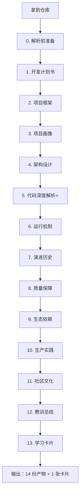

# 开源项目深度解析体系｜使用指南

> 每天 10 篇 × 14 步标准流程 = 140 个高质量知识点 / 天
> 模板：[[Wiki/_templates/open-source-analyze]]

## 一、为什么是 14 步



## 二、14 步流程一览

| # | 步骤 | 核心问题 | 耗时 |
|---|------|----------|------|
| 0 | 解析前准备 | 怎么开始？ | 5 min |
| 1 | 开发计划书 | 值不值得学？ | 10 min |
| 2 | 项目框架 | 目录长啥样？ | 20 min |
| 3 | 项目画像 | 5 个数字量化 | 10 min |
| 4 | 架构设计 | 骨骼图怎么画？ | 30 min |
| 5 | 代码深度 | 为什么这么写？ | 60 min ⭐ |
| 6 | 运行机制 | 跑起来了吗？ | 15 min |
| 7 | 演进历史 | 项目的人生？ | 20 min |
| 8 | 质量保障 | 怎么不崩？ | 15 min |
| 9 | 生态依赖 | 供应链？ | 15 min |
| 10 | 生产实践 | 怎么部署？ | 20 min |
| 11 | 社区文化 | 谁在维护？ | 10 min |
| 12 | 教训总结 | 偷什么避什么？ | 15 min |
| 13 | 学习卡片 | 带走什么？ | 10 min |
| **合计** | | | **~4 小时/项目** |

## 三、怎么使用模板

### 方式 A：Templater 插件（推荐）

```
1. 打开 Obsidian
2. 命令面板 → Templater: Create new note from template
3. 选 open-source-analyze
4. 文件名格式：解析-{项目名}-{日期}
   例：解析-etcd-20260601
5. 模板自动套用，title 填项目名
```

### 方式 B：手动复制

```
1. 打开 Wiki/_templates/open-source-analyze.md
2. 复制全文 → 新建笔记粘贴
3. frontmatter 改项目名/URL/语言/license
4. 按 14 步填空
```

### 方式 C：AI 自动生成（每日 10 篇的默认方式）

详见 [[每日开源项目抓取任务]]

## 四、目录结构

```
G:\Obsidian Vault\
├── Wiki/_templates/
│   └── open-source-analyze.md       ← 14 步主模板
├── Knowledge/OpenSource/            ← 解析笔记主目录
│   ├── README.md
│   ├── Backend/                     ← 后端基础架构
│   ├── Distributed/                 ← 分布式系统
│   ├── Web/                         ← Web 全栈
│   ├── Database/                    ← 数据库
│   ├── Language/                    ← 编程语言
│   ├── AI-ML/                       ← AI 工程
│   ├── DevOps/                      ← 运维可观测
│   ├── Tool/                        ← 工具效率
│   └── Security/                    ← 安全网络
└── Knowledge/Daily/
    └── {YYYY-MM-DD}/                ← 每日抓取
        ├── 01-etcd-解析.md
        ├── 02-redis-解析.md
        └── ...
```

## 五、每日 10 篇的项目挑选规则

由 AI 每天从以下来源挑选 10 个**待解析**项目：

### 5.1 必选清单（覆盖全栈）

| 类别 | 项目数 | 选什么 |
|------|--------|--------|
| 后端基础 | 2 | etcd / redis / nginx / kafka / mysql |
| 分布式 | 1 | k8s / tikv / etcd / consul |
| Web 全栈 | 1 | next.js / django / fastapi / nestjs |
| 数据库 | 1 | postgres / clickhouse / sqlite |
| 编程语言 | 1 | go / rust / python cpython |
| AI/ML | 1 | pytorch / vllm / llama.cpp / langchain |
| DevOps | 1 | prometheus / terraform / argo |
| 工具 | 1 | ripgrep / fzf / lazygit / docker |
| 安全 | 1 | wireguard / vault / keycloak |

### 5.2 选择标准

```yaml
star: >= 10000          # 已被验证
last_pushed_within: 180d  # 还在活跃
language: [go, rust, typescript, python, c, c++]  # 高质量
license: MIT, Apache-2.0, BSD  # 合规
has_tests: true         # 工程化
has_docs: true
```

### 5.3 重复检测

- 已解析过的项目标记 `_analysis/seen.txt`
- 7 天内不重复
- 同类项目优先选未解析的

## 六、14 份产物交付清单

每解析 1 个项目，AI 必须产出以下 14 份内容（合并到 1 篇笔记里）：

```
_analysis/
├── 00-questions.md          # 问题清单
├── 01-charter.md            # 开发计划书
├── 02-skeleton.md           # 框架/目录地图
├── 03-profile.md            # 项目画像
├── 04-architecture.md       # 架构 + ADR
├── 05-code-deep-dive.md     # 代码深度 + WHY
├── 06-runtime.md            # 跑起来 + 资源占用
├── 07-history.md            # 演进历史
├── 08-quality.md            # 测试/CI/质量
├── 09-deps.md               # 依赖图 + License
├── 10-prod.md               # 生产实践
├── 11-community.md          # 社区文化
├── 12-lessons.md            # 偷什么/避什么
└── 13-cheat-sheet.md        # 个人学习卡片
```

> 注：实际输出合并为 1 个笔记文件 `解析-{项目}-{日期}.md`，包含 14 个章节。

## 七、质量自检清单

每篇解析产出前，AI 必须自查：

- [ ] 14 步全部填了内容（不能空章节）
- [ ] 至少 3 个 ASCII 思维导图
- [ ] 至少 5 段带 WHY 的代码分析
- [ ] 至少 3 个 ADR（架构决策）
- [ ] 至少 1 个反模式识别
- [ ] 至少 1 个可复用模式
- [ ] 至少 3 个 TODO（马上能用的）
- [ ] 至少 3 个 [[关联笔记]] 链接
- [ ] frontmatter 字段完整
- [ ] 无复制粘贴的废话

## 八、与其他文档的关联

- [[开发技术知识库搭建指南]] — 整个库的搭建
- [[Obsidian-Dev-Template-System]] — 7 套基础模板
- [[AI知识库维护系统提示词]] — AI 系统提示词
- [[每日开源项目抓取任务]] — 每日 10 篇的自动化

## 🔗 关联笔记

- [[每日开源项目抓取任务]]
- [[Obsidian-Dev-Template-System]]
- [[AI知识库维护系统提示词]]
