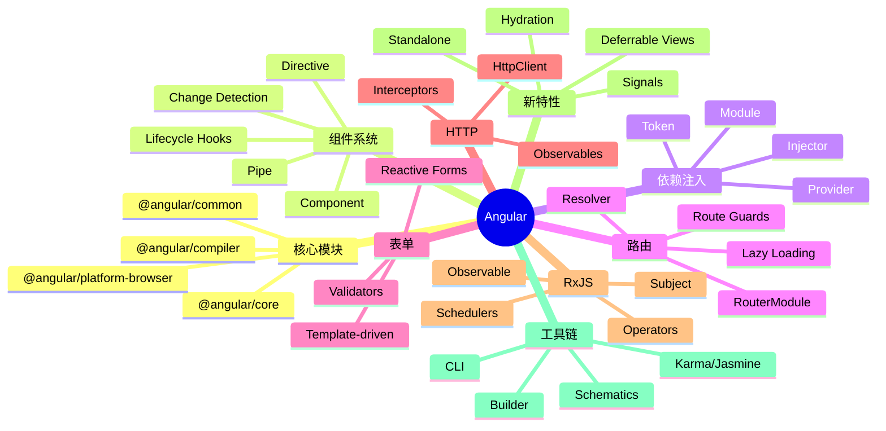

# Angular

> 企业级前端框架 — Google 维护，TypeScript 原生，完整解决方案（含 DI、路由、表单、HTTP）

## 一、前言

**定位**：完整的企业级前端框架，从开发到测试到部署的全套工具链

**核心价值**：
1. 完整框架 — 不只是 UI 层，含 DI、HTTP、Router、Forms、Animations
2. TypeScript 原生 — 强类型，编译期错误检查
3. 依赖注入（DI）— IoC 容器，模块解耦
4. 装饰器语法 — @Component, @Injectable, @Directive
5. RxJS 集成 — 响应式编程，Observable 流
6. 跨平台 — Web / Mobile（Ionic/NativeScript）/ Desktop（Electron）

**应用场景**：企业级应用（SPA + SSR）、管理后台、大型企业系统

**版本演进**：
- **AngularJS**（2010-2017）— 1.x，依赖注入 + 双向绑定，已 EOL
- **Angular 2+**（2016-）— 全面重写 TypeScript，组件化
- **Angular 17+** — Standalone Components、Deferrable Views、Signals

---

## 二、架构思维导图



---

## 三、关键代码

### 1. 组件 + 装饰器

```ts
// 文件: @angular/core/Component.ts
export function Component(metadata: ComponentOptions) {
  return function (target: Type<any>) {
    // 1. 把元数据附加到 class 上
    target.ngComponentDef = defineComponent({
      type: target,
      selectors: metadata.selector && [metadata.selector],
      factory: (t) => new t(),
      template: metadata.template,
      templateUrl: metadata.templateUrl,
      styles: metadata.styles,
      // 2. 变更检测策略
      changeDetection: ChangeDetectionStrategy[metadata.changeDetection]
                      ?? ChangeDetectionStrategy.Default,
      // 3. 生命周期钩子
      inputs: {...metadata.inputs},
      outputs: {...metadata.outputs},
      // ... 等等
    });
  };
}

// 使用
@Component({
  selector: 'app-root',
  template: `
    <h1>{{ title }}</h1>
    <button (click)="onClick()">Click</button>
  `,
  changeDetection: ChangeDetectionStrategy.OnPush,
})
export class AppComponent {
  @Input() title = 'Hello';
  @Output() clicked = new EventEmitter<void>();

  constructor(private http: HttpClient) {}  // DI 注入

  onClick() { this.clicked.emit(); }
}
```

### 2. 依赖注入 — Injector 树

```ts
// 文件: @angular/core/di/injector.ts
class NodeInjector {
  // 三级查找：自己 → 父级 → ModuleInjector
  get(token, options = InjectFlags.Default) {
    // 1. 自身 provider
    const instance = this._getInstance(token, options);
    if (instance !== THROW_IF_NOT_FOUND) return instance;

    // 2. 递归父级
    if (this.parent) {
      return this.parent.get(token, options);
    }

    // 3. 找不到 → 抛错（除非可选）
    if ((options & InjectFlags.Optional) !== 0) return null;
    throw new Error(`No provider for ${token}!`);
  }
}

// providers 注册
@NgModule({
  providers: [
    { provide: HTTP_INTERCEPTORS, useClass: AuthInterceptor, multi: true },
    { provide: 'API_URL', useValue: 'https://api.example.com' },
    { provide: Logger, useFactory: (cfg) => new Logger(cfg), deps: [Config] },
  ]
})
export class AppModule {}
```

### 3. 变更检测 — OnPush + Signals

```ts
// 文件: @angular/core/change_detection.ts
// 默认策略：每次事件/异步触发都检查整个组件树
// OnPush：只在以下情况检查：
//   1. @Input 引用变化
//   2. 组件内事件
//   3. async pipe 发出新值
//   4. 手动 markForCheck()

@Component({
  template: `<div>{{ count() }}</div>`,
  changeDetection: ChangeDetectionStrategy.OnPush,
})
export class CounterComponent {
  // Vue 3 ref / Solid.js signals 风格
  count = signal(0);
  double = computed(() => this.count() * 2);

  constructor() {
    effect(() => {
      console.log('count changed:', this.count());
    });
  }

  inc() {
    // 细粒度更新：只重渲染依赖 count 的视图
    this.count.update(n => n + 1);
  }
}
```

---

## 四、核心洞察

1. **DI 容器精髓**：分层 injector（NodeInjector + ModuleInjector），按"组件 → 父级 → Module"三级查找，避免全局状态
2. **Zone.js 痛点**：Angular 17 前所有异步（Promise/setTimeout/XHR）都触发全局变更检测，性能问题；新版可选 zoneless
3. **Signals 革新**：Angular 17 引入细粒度响应式（类似 Vue ref / Solid），不再依赖 Zone.js
4. **RxJS 是双刃剑**：强大但学习曲线陡；新版本支持 Signals + RxJS 共存
5. **Standalone Components**：Angular 17 起不再强需 NgModule，每个组件可独立启动
6. **编译时优化**：AOT（Ahead-of-Time）编译生成 ngComponentDef 工厂函数，运行时不解析模板
7. **学习路径**：TypeScript → 模块/装饰器 → 组件/服务 → DI → RxJS → Router → Forms → Signals
8. **性能对比**：首屏比 React/Vue 慢 30-50%（AOT + DI 启动成本），但大型应用可维护性更好

## 五、跨项目引用

- [[./react|React]] — 同样组件化，DI 是 Angular 独有
- [[./vue|Vue]] — Vue 3 Composition API 借鉴了 Angular 的模块化思想
- [[../项目代码包/A-前端框架/nest|NestJS]] — NestJS 借鉴了 Angular 的架构（装饰器 + DI + 模块）

---

**项目地址**：`G:\实战案例\GitHub顶尖项目\angular-official`
**类型**：前端框架 | **Stars**: 95k+ | **License**: MIT
