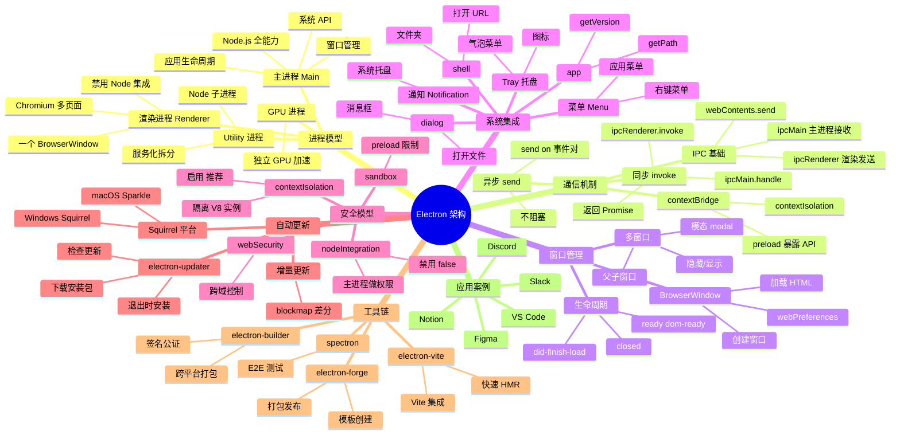

# Electron

## 一、前言

**定位**：使用 Web 技术（HTML/CSS/JS）构建跨平台桌面应用的运行时框架，由 GitHub 于 2013 年推出（Ceba 起源），现支撑 VS Code、Slack、Discord、Notion、Figma 桌面版等明星产品。

**核心价值**：
- **Web + Native 一体**：Chromium 渲染 + Node.js 主进程，同时拿到 Web 生态和操作系统能力
- **跨平台**：一份代码构建 Windows / macOS / Linux 三端
- **生态成熟**：VS Code 把 Electron 推向工业级，调试、构建、签名、商店分发工具链完整
- **自动更新**：内置 `electron-updater` 解决桌面应用最痛的版本管理问题

**五大特性**：
1. **多进程模型**：主进程（Node） + 渲染进程（Chromium） + GPU 进程 + Utility 进程
2. **IPC 通信**：`ipcMain` / `ipcRenderer` 桥接 Node 与 Web
3. **原生能力**：菜单、托盘、通知、文件系统、剪贴板、屏幕录像等
4. **安全沙箱**：`contextIsolation: true` + `preload` 脚本避免原型链污染
5. **生态丰富**：electron-forge / electron-builder 工具链，VS Code 把编辑器 IDE 化

**与同类对比**：

| 框架 | 渲染引擎 | 性能 | 体积 | 适用场景 |
|---|---|---|---|---|
| Electron | Chromium | 中（包大） | 80MB+ | 复杂应用、IDE、IM |
| Tauri | 系统 WebView | 高 | <10MB | 轻量工具、效率软件 |
| NW.js | Chromium | 中 | 大 | 早期 hybrid app |
| Flutter Desktop | Skia | 高 | 中 | 跨端 UI 一致 |
| Qt | 原生 | 极高 | 小 | 工业软件、专业工具 |

## 二、架构思维导图



## 三、关键代码

### 1. 主进程入口（main.js）

```js
const { app, BrowserWindow, ipcMain, dialog, Tray, Menu, Notification } = require('electron');
const path = require('path');

// 单实例锁：避免多开
const gotTheLock = app.requestSingleInstanceLock();
if (!gotTheLock) {
  app.quit();
  return;
}

let mainWindow = null;

function createWindow() {
  mainWindow = new BrowserWindow({
    width: 1280,
    height: 800,
    minWidth: 800,
    minHeight: 600,
    title: 'MyApp',
    icon: path.join(__dirname, 'assets/icon.png'),
    webPreferences: {
      preload: path.join(__dirname, 'preload.js'),
      contextIsolation: true,    // 安全：隔离 JS 上下文
      nodeIntegration: false,    // 安全：禁用 Node 集成
      sandbox: false,            // 沙箱：preload 仍可用 require
      webSecurity: true,
    },
    show: false,                 // 先隐藏，ready-to-show 再显示避免闪烁
  });

  // 加载本地或远程 URL
  if (process.env.NODE_ENV === 'development') {
    mainWindow.loadURL('http://localhost:5173');
    mainWindow.webContents.openDevTools({ mode: 'detach' });
  } else {
    mainWindow.loadFile(path.join(__dirname, 'dist/index.html'));
  }

  mainWindow.once('ready-to-show', () => {
    mainWindow.show();
  });
}

// 监听第二实例启动
app.on('second-instance', () => {
  if (mainWindow) {
    if (mainWindow.isMinimized()) mainWindow.restore();
    mainWindow.focus();
  }
});

// macOS 激活：dock 图标点击时重新创建窗口
app.on('activate', () => {
  if (BrowserWindow.getAllWindows().length === 0) createWindow();
});

// 关闭所有窗口时退出（Windows/Linux）
app.on('window-all-closed', () => {
  if (process.platform !== 'darwin') app.quit();
});

app.whenReady().then(() => {
  createWindow();
  // 注册 IPC 处理器
  setupIpcHandlers();
  // 创建系统托盘
  createTray();
});
```

**解析**：
- `contextIsolation: true` + `nodeIntegration: false` 是**安全黄金组合**：渲染进程无法直接 require Node API，必须通过 `preload` 暴露
- `requestSingleInstanceLock` 处理多开：第二实例启动时聚焦已有窗口
- `ready-to-show` 比 `did-finish-load` 更优：等到首帧渲染完成再显示，避免白屏闪烁

### 2. 安全 IPC 桥接（preload.js）

```js
const { contextBridge, ipcRenderer } = require('electron');

// 暴露给渲染进程的安全 API
contextBridge.exposeInMainWorld('electronAPI', {
  // 读取文件
  readFile: (filename) => ipcRenderer.invoke('fs:read-file', filename),

  // 写文件
  writeFile: (filename, content) => ipcRenderer.invoke('fs:write-file', { filename, content }),

  // 监听主进程主动推送
  onMenuAction: (callback) => {
    const listener = (_event, action) => callback(action);
    ipcRenderer.on('menu:action', listener);
    // 返回清理函数，避免内存泄漏
    return () => ipcRenderer.removeListener('menu:action', listener);
  },

  // 一次性事件
  onUpdateAvailable: (callback) => {
    ipcRenderer.once('update:available', (_e, info) => callback(info));
  },

  // 平台信息
  platform: process.platform,
});

// 主进程对应处理器（main.js 内）
function setupIpcHandlers() {
  const fs = require('fs/promises');

  ipcMain.handle('fs:read-file', async (event, filename) => {
    // 权限校验：限制可访问目录
    const safePath = path.join(app.getPath('userData'), filename);
    if (!safePath.startsWith(app.getPath('userData'))) {
      throw new Error('Access denied');
    }
    return await fs.readFile(safePath, 'utf-8');
  });

  ipcMain.handle('fs:write-file', async (event, { filename, content }) => {
    const safePath = path.join(app.getPath('userData'), filename);
    await fs.writeFile(safePath, content, 'utf-8');
    return { success: true };
  });
}
```

**解析**：
- `contextBridge.exposeInMainWorld` 是**唯一推荐**的渲染 ↔ 主进程通信方式
- **不要直接暴露 `ipcRenderer`**，否则渲染进程可绕过 preload 直接发任意 IPC，破坏安全边界
- `invoke` / `handle` 是**异步 + 返回 Promise**的现代 API，替代旧的 `send` / `on` 事件对
- 主进程**必须做权限校验**：渲染进程传来的路径要做白名单或沙箱目录限制，防止 `../` 越权访问

### 3. 自动更新（auto-updater.js）

```js
const { autoUpdater } = require('electron-updater');
const { dialog, Notification } = require('electron');
const log = require('electron-log');

autoUpdater.logger = log;
autoUpdater.autoDownload = false; // 让用户选择
autoUpdater.autoInstallOnAppQuit = true;

class UpdateManager {
  check() {
    autoUpdater.checkForUpdates().catch(err => log.error('Check failed', err));
  }

  // 监听各阶段
  bind() {
    autoUpdater.on('checking-for-update', () => log.info('Checking...'));

    autoUpdater.on('update-available', (info) => {
      dialog.showMessageBox({
        type: 'info',
        title: '发现新版本',
        message: `新版本 ${info.version} 可用，是否下载？`,
        buttons: ['下载', '稍后'],
        defaultId: 0,
      }).then(({ response }) => {
        if (response === 0) autoUpdater.downloadUpdate();
      });
    });

    autoUpdater.on('download-progress', (progress) => {
      // 通知渲染进程更新进度条
      mainWindow.webContents.send('update:progress', progress);
    });

    autoUpdater.on('update-downloaded', (info) => {
      new Notification({
        title: '更新已就绪',
        body: `版本 ${info.version} 已下载，重启后生效`,
      }).show();

      // 弹出提示框
      dialog.showMessageBox({
        type: 'info',
        title: '安装更新',
        message: '更新已下载完成，是否立即重启？',
        buttons: ['立即重启', '稍后'],
        defaultId: 0,
      }).then(({ response }) => {
        if (response === 0) autoUpdater.quitAndInstall();
      });
    });

    autoUpdater.on('error', (err) => log.error('Update error', err));
  }
}

module.exports = new UpdateManager();
```

**解析**：
- `electron-updater` 支持 GitHub Releases / S3 / 自建服务器作为更新源
- `autoDownload = false` + 用户确认弹窗是**国内合规最佳实践**（避免静默下载）
- `download-progress` 事件可推送到渲染进程做进度条
- Windows 上 `quitAndInstall` 会退出并启动安装器；macOS 上会替换 .app 并重启

### 4. 自定义菜单与快捷键

```js
const { Menu, globalShortcut, app, shell } = require('electron');

const isMac = process.platform === 'darwin';

const template = [
  // macOS 应用菜单（必须）
  ...(isMac ? [{
    label: app.name,
    submenu: [
      { role: 'about' },
      { type: 'separator' },
      { role: 'services' },
      { type: 'separator' },
      { role: 'hide' },
      { role: 'hideOthers' },
      { role: 'unhide' },
      { type: 'separator' },
      { role: 'quit' },
    ],
  }] : []),
  {
    label: '文件',
    submenu: [
      {
        label: '新建',
        accelerator: 'CmdOrCtrl+N',
        click: () => mainWindow.webContents.send('menu:action', 'new-file'),
      },
      {
        label: '打开',
        accelerator: 'CmdOrCtrl+O',
        click: async () => {
          const { canceled, filePaths } = await dialog.showOpenDialog({
            properties: ['openFile'],
            filters: [{ name: 'Markdown', extensions: ['md', 'markdown'] }],
          });
          if (!canceled) mainWindow.webContents.send('menu:open-file', filePaths[0]);
        },
      },
      { type: 'separator' },
      isMac ? { role: 'close' } : { role: 'quit' },
    ],
  },
  {
    label: '编辑',
    submenu: [
      { role: 'undo' },
      { role: 'redo' },
      { type: 'separator' },
      { role: 'cut' },
      { role: 'copy' },
      { role: 'paste' },
      { role: 'selectAll' },
    ],
  },
  {
    label: '视图',
    submenu: [
      { role: 'reload' },
      { role: 'forceReload' },
      { role: 'toggleDevTools' },
      { type: 'separator' },
      { role: 'resetZoom' },
      { role: 'zoomIn' },
      { role: 'zoomOut' },
      { type: 'separator' },
      { role: 'togglefullscreen' },
    ],
  },
  {
    role: 'help',
    submenu: [
      {
        label: '官方文档',
        click: async () => { await shell.openExternal('https://www.electronjs.org/'); },
      },
    ],
  },
];

const menu = Menu.buildFromTemplate(template);
Menu.setApplicationMenu(menu);

// 全局快捷键
app.whenReady().then(() => {
  globalShortcut.register('CommandOrControl+Shift+I', () => {
    mainWindow.webContents.toggleDevTools();
  });
});

app.on('will-quit', () => {
  globalShortcut.unregisterAll();
});
```

**解析**：
- `accelerator` 设置快捷键（macOS 自动用 `Cmd`，其他平台用 `Ctrl`）
- `role` 字段使用 Electron 内置命令（`reload` / `forceReload` / `toggleDevTools` 等），自动适配平台
- `dialog.showOpenDialog` 是**异步**的，必须 `await`
- `globalShortcut` 在应用未聚焦时也响应（如 `Cmd+Shift+I` 全局调起 DevTools），退出时必须 `unregisterAll`

## 四、核心洞察

1. **多进程是性能也是安全基石**：渲染进程崩溃不影响主进程，一个窗口卡死不会拖垮整个 App；进程隔离也是沙箱的前提。
2. **`contextIsolation: true` 是 Electron 安全的命门**：默认关闭（向后兼容），但 2024 年后**所有新项目必须开**，否则 XSS 即可拿到 Node API。
3. **主进程是权限中枢**：所有需要权限的操作（文件、网络、系统 API）走主进程，渲染进程只负责 UI；这是 Electron 安全模型的铁律。
4. **预加载脚本是唯一通道**：`preload` 是渲染进程与 Node 的桥梁，**所有 API 必须通过 `contextBridge` 显式暴露**，不允许 `window.require`。
5. **VS Code 是 Electron 工业级样板**：进程拆分（extension host）、进程间 RPC、内存管理（`v8-cache-options`）、崩溃上报（reaload/auto-restart）都是教科书级。
6. **Tauri 是 Electron 的轻量替代**：Tauri 用系统 WebView（WebKit/WebView2/WebKitGTK）替换 Chromium，体积从 80MB 降到 5MB，但牺牲了 Chromium 兼容性。
7. **自动更新是国内合规难点**：Windows 需要代码签名证书（EV 证书，约 ¥5000/年），macOS 需要 Apple Developer 公证（$99/年），无签名会被杀软拦截。
8. **打包体积优化**：用 `electron-builder` 的 `asar` 打包、Tree-Shaking 生产依赖、按平台剔除冗余 Electron 进程（如 Linux 不需要 GPU 加速）。

## 五、跨项目引用

- [./vscode.md](./vscode.md) — VS Code 是 Electron 工业级最佳实践，Monaco Editor + 扩展宿主
- [./react.md](./react.md) — Electron 渲染层首选 React，VS Code 早期用 TypeScript + React
- [./vue.md](./vue.md) — electron-vue 是 Vue + Electron 经典组合
- [./tauri.md](./tauri.md) — Tauri 是 Rust + 系统 WebView 实现的轻量替代
- [./vite.md](./vite.md) — `electron-vite` 把 Vite 的 HMR 体验带入 Electron
- [./node.md](./node.md) — Electron 主进程本质是 Node.js 运行时
- [../D-构建与UI/webpack.md](../D-构建与UI/webpack.md) — 传统 Electron 应用打包工具，electron-vite 替代品
- [../B-后端服务/express.md](../B-后端服务/express.md) — Electron 主进程常用 Express 起本地服务
