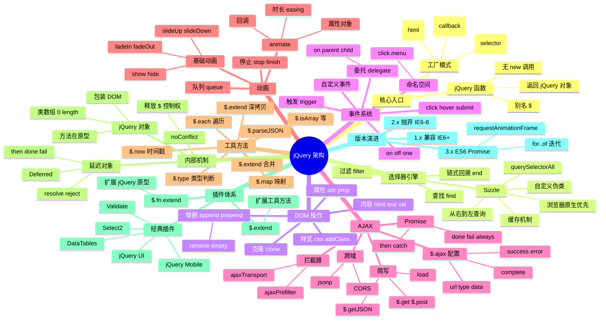

# jQuery

## 一、前言

**定位**：2006 年由 John Resig 发布的 JavaScript 库，"Write Less, Do More"，曾经是 Web 前端的事实标准，至今仍在维护（3.x 仍在更新）。

**核心价值**：
- 抹平 2006-2015 年浏览器 API 不一致（IE6/7/8 兼容）
- 链式调用 + 隐式迭代让 DOM 操作极简
- 简化的 AJAX、动画、事件代理 API
- 插件生态繁荣（jQuery UI、jQuery Mobile、Bootstrap 1.x 依赖）

**五大特性**：
1. **选择器引擎 Sizzle**：CSS3 + 自定义伪类，覆盖所有 DOM 查询场景
2. **链式调用**：返回 jQuery 对象本身，可无限点链
3. **隐式迭代**：`$('div').addClass('x')` 自动遍历所有 div
4. **事件代理**：`$(parent).on('click', '.child', handler)` 替代逐个绑定
5. **AJAX 简化**：`$.ajax` / `$.get` / `$.post` / `$.getJSON`

**历史地位**：
- 2010-2017 年：90%+ 网站使用（含 WordPress、Drupal 等 CMS）
- 2015 年后：React/Vue 崛起，jQuery 退居遗留项目维护
- 至今：Bootstrap 5 已移除 jQuery 依赖，是时代转折点

**与同类对比**：

| 库 | 体积 | 范式 | 学习曲线 | 当前状态 |
|---|---|---|---|---|
| jQuery | 30KB min | 命令式 DOM | 极低 | 维护中（3.x） |
| Zepto | 9KB | jQuery 兼容子集 | 极低 | 移动端轻量 |
| React | 40KB+ | 声明式组件 | 中 | 主流 |
| Vue | 33KB | 声明式响应 | 低 | 主流 |
| Vanilla JS | 0KB | 原生 | 高 | 现代趋势 |

## 二、架构思维导图



## 三、关键代码

### 1. 入口与工厂函数（src/core.js）

```js
// jQuery 入口：同时是函数也是对象
var jQuery = function(selector, context) {
  return new jQuery.fn.init(selector, context);
};

jQuery.fn = jQuery.prototype = {
  // 实际指向 jQuery.prototype.init.prototype
  jquery: '3.6.0',
  constructor: jQuery,
  length: 0,
  toArray: function() {
    return Array.prototype.slice.call(this);
  },
  each: function(callback) {
    return jQuery.each(this, callback);
  },
  map: function(callback) {
    return jQuery.map(this, function(elem, i) {
      return callback.call(elem, i, elem);
    });
  },
  // ...
};

// 真正的构造函数：避免 new 调用
var init = jQuery.fn.init = function(selector, context, root) {
  var match, elem;

  // $(""), $(null), $(undefined), $(false) 返回空 jQuery 对象
  if (!selector) return this;

  // 字符串选择器
  if (typeof selector === 'string') {
    if (selector[0] === '<' && selector[selector.length - 1] === '>') {
      // HTML 字符串：解析为 DOM
      match = [document.createElement('div')];
      jQuery.buildFragment(selector, context, match);
      jQuery.merge(this, match);
    } else {
      // CSS 选择器：交给 Sizzle
      root = root || document;
      match = jQuery.find(selector, context, root);
      jQuery.merge(this, match);
    }
  } else if (selector.nodeType) {
    // 原生 DOM 节点：包装
    this[0] = selector;
    this.length = 1;
    return this;
  } else if (jQuery.isFunction(selector)) {
    // 回调函数：DOM ready
    return root.ready !== undefined ?
      root.ready(selector) :
      selector(jQuery);
  }
};

// 关键：让 init 创建的实例也能用 jQuery 原型上的方法
init.prototype = jQuery.fn;
```

**解析**：
- **无 new 设计**：`$('div')` 直接调用函数，通过 `new init` 创建实例并返回
- **原型共享**：`init.prototype = jQuery.fn`，避免重复挂载方法
- **多态参数**：选择器、HTML 字符串、DOM 节点、回调函数都用同一个 `$` 处理

### 2. Sizzle 选择器引擎（简化版）

```js
// 简化的 Sizzle 核心：从右到左查询
var Sizzle = function(selector, context, results, seed) {
  results = results || [];
  context = context || document;
  var match, elem, m, nodeType,
      i = 0,
      // 待匹配 token 列表
      tokens = tokenize(selector);

  // 1. 单选择器：querySelectorAll 一把梭
  if (tokens.length === 1) {
    if ((match = Expr.relative[tokens[0].type])) {
      // 关系选择器（> + ~ 空格）走自定义
      return relativeMatch(match, tokens[0].value, context, results, seed);
    }
    // 优先用浏览器原生
    if (document.querySelectorAll && (nodeType = context.nodeType) !== 11) {
      return [].slice.call(context.querySelectorAll(selector));
    }
  }

  // 2. 多选择器：先按最后一个 token 过滤，再向上回溯
  while ((match = tokens[i++])) {
    elem = match.type === 'ID' && document.getElementById(match.value);
    if (elem) {
      // 找到 ID 节点，向上找父链，验证前面的 token 是否匹配
      var parent = elem.parentNode;
      while (parent) {
        if (matches(parent, tokens.slice(0, i))) {
          results.push(elem);
          break;
        }
        parent = parent.parentNode;
      }
    }
  }
  return results;
};

// 编译缓存：相同选择器只编译一次
var matcherCache = {};
function compile(selector) {
  if (!matcherCache[selector]) {
    matcherCache[selector] = Sizzle.compile(selector);
  }
  return matcherCache[selector];
}
```

**解析**：
- **从右到左查询**：浏览器原生 `querySelectorAll` 也用此策略，先找到最具体的选择器（ID/Tag），再向上回溯验证前面的关系
- **优先原生**：能 `querySelectorAll` 就不自己实现，浏览器内部用 C++ 优化
- **编译缓存**：把选择器编译成函数（`matcher(elem)`），重复调用避免重解析

### 3. 事件代理与 on/off

```js
// 事件注册主入口
jQuery.fn.on = function(types, selector, data, fn, one) {
  var type, origFn;

  // 参数归一化
  if (typeof types === 'object') {
    // 批量绑定：$(...).on({ click: fn1, mouseover: fn2 })
    for (type in types) this.on(type, selector, data, types[type], one);
    return this;
  }
  if (data == null && fn == null) {
    // (types, fn)
    fn = selector;
    data = selector = undefined;
  } else if (fn == null) {
    if (typeof selector === 'string') {
      // (types, selector, fn)
      fn = data;
      data = undefined;
    } else {
      // (types, data, fn)
      fn = data;
      data = selector;
      selector = undefined;
    }
  }
  if (fn === false) fn = returnFalse; // 阻止默认 + 阻止冒泡

  return this.each(function() {
    jQuery.event.add(this, types, fn, data, selector);
  });
};

jQuery.event.add = function(elem, types, handler, data, selector) {
  var handleObjIn, eventHandle, events, t, handlers,
      type, namespaces, handleObj;

  // 1. 元素上挂一个 dispatch 函数，避免重复添加 listener
  eventHandle = elem.nodeType ?
    jQuery.data(elem, 'events') || jQuery.data(elem, 'events', {}) :
    {};

  // 2. 解析命名空间：'click.menu' → type='click', ns='.menu'
  types = (types || '').match(rnothtmlwhite) || [''];
  for (t = 0; t < types.length; t++) {
    type = types[t];

    // 3. 委托：选择器非空时，挂在祖先元素上 + selector 过滤
    if (selector) {
      // 注册一个 delegate 函数：实际触发时再判断 target.matches(selector)
      handleObj = jQuery.extend({
        type: type,
        origHandler: handler,
        data: data,
        selector: selector,
        namespace: namespaces,
        needsContext: jQuery.expr.match.needsContext.test(selector),
      }, handleObjIn);
      handlers = events[type] || (events[type] = []);
      handlers.delegateCount++;
      jQuery.event.addDelegate(elem, type, handleObj);
    } else {
      // 直接绑定
      handleObj = jQuery.extend({
        type: type,
        origHandler: handler,
        data: data,
        namespace: namespaces,
      }, handleObjIn);
      handlers = events[type] || (events[type] = []);
      handlers.push(handleObj);
      jQuery.event.addDirect(elem, type, handleObj);
    }
  }
};
```

**解析**：
- **事件代理核心**：把 listener 挂在祖先元素，触发时用 `target.matches(selector)` 过滤，避免 N 个子元素各自绑定
- **委托计数 `delegateCount`**：触发时先调用委托 handler，再调用直接绑定的 handler
- **命名空间**：`click.menu` 可以 `$(elem).off('.menu')` 一次性移除

### 4. AJAX 与 Deferred

```js
// $.ajax 内部使用 jQuery.ajaxSettings.merge
jQuery.ajax = function(url, options) {
  // 合并用户配置与默认配置
  var settings = jQuery.ajaxSettings.merge(url, options);

  // 1. 状态机
  var transport = jQuery.ajaxSettings.xhr();
  var deferred = jQuery.Deferred();

  // 2. 回调包装：done/fail/progress 全部由 Deferred 调度
  var callbackContext = settings.context || settings;

  deferred.done(settings.success)
           .fail(settings.error)
           .progress(settings.uploadProgress);

  // 3. 实际请求
  transport.onload = function() {
    var data = jQuery.ajaxTransport.parseResponse(transport);
    if (data.status >= 200 && data.status < 300) {
      deferred.resolveWith(callbackContext, [data]);
    } else {
      deferred.rejectWith(callbackContext, [data]);
    }
  };
  transport.onerror = function() {
    deferred.rejectWith(callbackContext, [transport]);
  };
  transport.send(settings);

  // 4. 返回 Promise
  return deferred.promise();
};

// 链式调用 done/fail/always
$.ajax('/api/users')
  .done(function(data) { console.log(data); })
  .fail(function(err) { console.error(err); })
  .always(function() { console.log('完成'); });
```

**解析**：
- **Deferred 是 jQuery 的 Promise 实现**（早于原生 Promise），`resolve/reject` 触发对应的 `done/fail` 回调
- **统一回调**：`success` / `error` / `complete` 全部包装成 Deferred 链式调用
- **`.promise()`** 返回只读视图，外部无法 `resolve/reject`

## 四、核心洞察

1. **链式调用的本质是"返回 this"**：每个 jQuery 方法 `return this`，让方法调用可串联成 DSL；这是 jQuery 范式的核心。
2. **隐式迭代解放心智**：原生 JS 需要 `for` 循环，jQuery 自动遍历集合；代价是单元素选择时也有循环开销。
3. **事件代理是 jQuery 杀手锏**：`on('click', '.btn', handler)` 一行解决动态元素事件问题，是早期 Web 开发最大的痛点之一。
4. **$.Deferred 早于 Promise/A+**：jQuery 1.5（2011）就实现了 Promise 模式，**比原生 `Promise` 早 4 年**，是异步编程史上的重要里程碑。
5. **Sizzle 推动了选择器 API 标准化**：jQuery 选择器语法成了 Web 事实标准，浏览器厂商最终实现 `querySelectorAll`，jQuery 退居 1.x 兼容层。
6. **3.x 的现代化**：移除 `$.event.special` IE 兼容、移除 `.size()` 用 `.length`、移除 `.bind/.delegate` 改用 `.on`、支持 `for..of` 迭代。
7. **jQuery 的真正遗产不是代码**：是 "DOM 选择器 + 链式 + 隐式迭代" 的编程范式，至今仍在影响 Vue/React 的组件设计。
8. **何时不用 jQuery**：新项目默认不上 jQuery；只维护 2018 年前的遗留项目、WordPress 插件、jQuery UI 项目时仍可用。

## 五、跨项目引用

- [./react.md](./react.md) — React 用声明式取代 jQuery 命令式，**Virtual DOM 取代手动 DOM 操作**
- [./vue.md](./vue.md) — Vue 早期受 jQuery 启发，模板语法 + 响应式比 jQuery 更优雅
- [./bootstrap.md](./bootstrap.md) — Bootstrap 4 强依赖 jQuery，5.x 移除
- [./backbone.md](./backbone.md) — Backbone 是 jQuery 时代 MVC 框架代表
- [./zepto.md](./zepto.md) — Zepto 是 jQuery 的移动端轻量替代
- [./node.md](./node.md) — Express 早期 jQuery 风格 API 设计影响服务端框架
- [../B-后端服务/jquery.md](../B-后端服务/jquery.md) — 服务端 jQuery（cheerio）做爬虫
- [../D-构建与UI/select2.md](../D-构建与UI/select2.md) — jQuery 时代最经典的下拉组件
