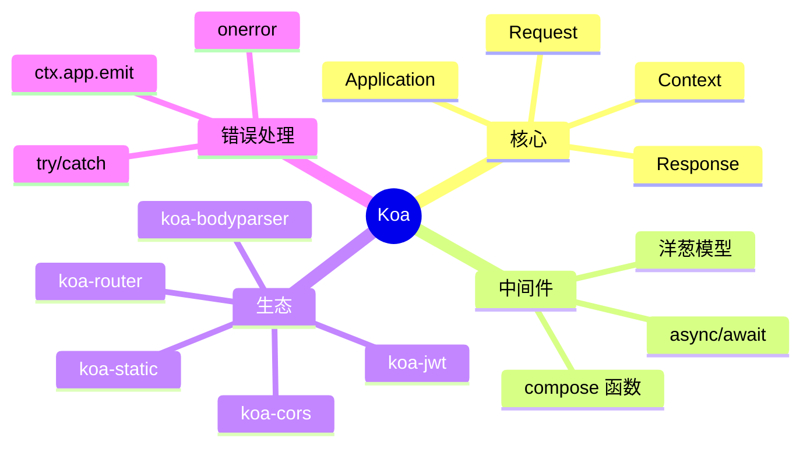

# Koa.js

> 极简 Node.js Web 框架 — Express 原班人马打造，async/await 中间件典范

## 一、前言

**定位**：由 Express 团队打造的下一代 Node.js Web 框架，洋葱模型中间件

**核心价值**：
1. **极简核心** — 仅有 ~600 行代码，无内置路由/模板
2. **async/await 优先** — 中间件完全基于 Promise 链
3. **洋葱模型** — 请求/响应双向流经中间件
4. **轻量灵活** — 完全可组合，按需加 middleware
5. **错误处理** — try/catch 一致捕获（Express 要手写）

**应用场景**：REST API、微服务网关、自定义 Web 服务器、中间件开发

**与 Express 区别**：

| 维度 | Koa | Express |
|------|-----|---------|
| 中间件 | async/await | callback |
| 错误处理 | try/catch 自动 | next(err) |
| 内置路由 | 无 | 有 |
| 核心大小 | ~600 行 | ~5000 行 |
| 性能 | 略快 | 略慢 |
| 生态 | 小 | 大 |

---

## 二、架构思维导图



---

## 三、关键代码

### 1. 核心 — Application

```js
// 文件: koa/lib/application.js
class Application extends Emitter {
  constructor(options) {
    super();
    this.proxy = options.proxy ?? false;
    this.middleware = [];  // 中间件数组
    this.subdomainOffset = 2;
    this.proxyIpHeader = 'X-Forwarded-For';
    this.maxIpsCount = 0;
    this.env = options.env ?? process.env.NODE_ENV ?? 'development';
    if (options.keys) this.keys = options.keys;
  }

  // 1. 注册中间件
  use(fn) {
    if (typeof fn !== 'function') {
      throw new TypeError('middleware must be a function');
    }
    // 调试支持：fn._name 或 fn.name
    if (fn.constructor.name === 'GeneratorFunction') {
      deprecate('Support for generators will be removed');
    }
    this.middleware.push(fn);
    return this;
  }

  // 2. 启动服务器
  listen(...args) {
    // 标准 http.createServer 包装
    debug('listen');
    const server = http.createServer(this.callback());
    return server.listen(...args);
  }

  // 3. 请求回调
  callback() {
    const fn = compose(this.middleware);  // compose 中间件
    if (!this.listenerCount('error')) this.on('error', this.onerror);
    const handleRequest = (req, res) => {
      const ctx = this.createContext(req, res);
      return this.handleRequest(ctx, fn);
    };
    return handleRequest;
  }

  // 4. 处理请求
  handleRequest(ctx, fnMiddleware) {
    const res = ctx.res;
    res.statusCode = 404;
    const onerror = err => ctx.onerror(err);
    const handleResponse = () => respond(ctx);
    onFinished(res, onerror);
    return fnMiddleware(ctx).then(handleResponse).catch(onerror);
  }
}
```

### 2. Context 对象（核心抽象）

```js
// 文件: koa/lib/context.js
const proto = module.exports = {
  // 1. app / request / response 引用
  get app() { return this.request.app; },
  get req() { return this.request.req; },
  get res() { return this.response.res; },
  get request() { return this.request; },
  get response() { return this.response; },

  // 2. 状态码
  get status() { return this.response.status; },
  set status(val) { this.response.status = val; },

  // 3. body（核心：智能类型推断）
  get body() { return this.response.body; },
  set body(val) {
    const original = this.response.body;
    this.response.body = val;
    // no content
    if (val == null) {
      if (statusCode === 304 || statusCode === 204) {
        // ...
      } else if (statusCode >= 200) {
        this.response.type = 'text';
        this.response.body = 'null';
      }
      return;
    }
    // set status when setter null
    if (!statuses.empty(statusCode)) {
      // ...
    }
    // 4. 类型判断：string/Buffer/Stream/Object
    if (typeof val === 'string') return;
    if (Buffer.isBuffer(val)) return;
    if (val instanceof Stream) return;
    // Object → JSON
    this.remove('Content-Type');
    this.remove('Content-Length');
    this.type = 'json';
  },
};
```

### 3. 中间件组合 — compose（洋葱模型核心）

```js
// 文件: koa-compose/index.js
function compose(middleware) {
  if (!Array.isArray(middleware)) {
    throw new TypeError('Middleware stack must be an array');
  }
  for (const fn of middleware) {
    if (typeof fn !== 'function') {
      throw new TypeError('Middleware must be composed of functions');
    }
  }

  return function (context, next) {
    let index = -1;
    return dispatch(0);

    function dispatch(i) {
      // 1. 防止 next() 调用多次
      if (i <= index) {
        return Promise.reject(new Error('next() called multiple times'));
      }
      index = i;
      let fn = middleware[i];
      if (i === middleware.length) fn = next;
      if (!fn) return Promise.resolve();

      try {
        // 2. 调用当前中间件，传 next = dispatch(i+1)
        return Promise.resolve(fn(context, dispatch.bind(null, i + 1)));
      } catch (err) {
        return Promise.reject(err);
      }
    }
  };
}

// 使用：
app.use(async (ctx, next) => {
  console.log('1 →');
  await next();       // 进入下一个中间件
  console.log('1 ←');
});
app.use(async (ctx, next) => {
  console.log('2 →');
  await next();
  console.log('2 ←');
});
app.use(async (ctx, next) => {
  console.log('3 →');
  // 业务逻辑
  ctx.body = 'Hello';
  console.log('3 ←');
});
// 输出：1 → 2 → 3 → 3 ← 2 ← 1 ←
```

### 4. 实际使用

```js
const Koa = require('koa');
const Router = require('@koa/router');
const bodyParser = require('koa-bodyparser');
const cors = require('@koa/cors');

const app = new Koa();
const router = new Router();

// 1. 错误处理中间件（最外层）
app.use(async (ctx, next) => {
  try {
    await next();
  } catch (err) {
    ctx.status = err.status || 500;
    ctx.body = { error: err.message };
    ctx.app.emit('error', err, ctx);
  }
});

// 2. CORS
app.use(cors({ origin: '*' }));

// 3. 解析 body
app.use(bodyParser());

// 4. 日志
app.use(async (ctx, next) => {
  const start = Date.now();
  await next();
  const ms = Date.now() - start;
  console.log(`${ctx.method} ${ctx.url} - ${ms}ms`);
});

// 5. 路由
router.get('/api/users', async (ctx) => {
  ctx.body = await db.user.findMany();
});
router.post('/api/users', async (ctx) => {
  const { name, email } = ctx.request.body;
  ctx.body = await db.user.create({ data: { name, email } });
});

app.use(router.routes());
app.listen(3000);
```

---

## 四、核心洞察

1. **洋葱模型精髓**：每个中间件 `await next()` 前可处理请求，`await next()` 后可处理响应，类比切面编程
2. **Context 单一对象**：ctx 聚合了 req + res + app + state，所有中间件共享同一个 context
3. **错误处理优雅**：try/catch 一次捕获链上所有错误（Express 要每个 next(err)）
4. **无内置路由**：极简哲学，路由/模板/数据库都靠中间件生态（koa-router/koa-bodyparser）
5. **generator 时代终结**：早期 Koa 1 用 generator + co，Koa 2 改用 async/await，性能 +30%
6. **性能数据**：Koa 2 ~5500 RPS（hello world），Express 4 ~4500 RPS（高 20%）
7. **学习路径**：中间件 → 洋葱模型 → Context → 错误处理 → 自定义中间件
8. **何时用 Koa vs Express**：新项目用 Koa（现代、async）；维护老项目继续 Express（生态大）

## 五、跨项目引用

- [[./express|Express]] — Koa 同一团队，Express 4/5 学习资料多
- [[./nest|Nest]] — 基于 Express/Fastify 的企业级框架
- [[../项目代码包/B-后端服务/go-net-http|Go net/http]] — 同样简洁哲学，标准库够用

---

**项目地址**：`G:\实战案例\GitHub顶尖项目\koa`
**类型**：Node Web 框架 | **Stars**: 35k+ | **License**: MIT
