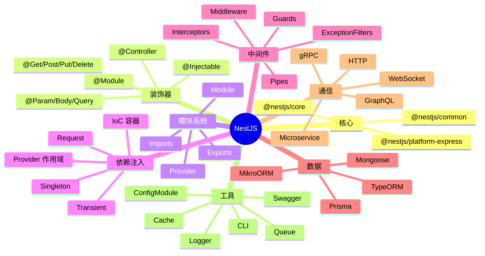

# NestJS

> 企业级 Node.js 框架 — 借鉴 Angular 架构，支持 TypeScript 装饰器、DI、模块化

## 一、前言

**定位**：用于构建高效、可扩展的 Node.js 服务端应用的渐进式框架

**核心价值**：
1. **TypeScript 优先** — 编译期类型检查 + 装饰器
2. **Angular 风格架构** — 模块（Module）+ 依赖注入（DI）+ 装饰器
3. **平台无关** — 默认 Express，可换 Fastify
4. **生态丰富** — 官方集成：GraphQL、WebSocket、gRPC、TypeORM、MikroORM、Passport、Swagger
5. **微服务友好** — 内置传输层抽象（TCP/Redis/NATS/Kafka/MQTT/gRPC）
6. **测试友好** — 完整 e2e/unit 测试支持

**应用场景**：企业后端、SaaS、API 网关、微服务、GraphQL API

**架构哲学**：OOP + FP + FRP 三大范式融合，SOLID 原则

---

## 二、架构思维导图



---

## 三、关键代码

### 1. 控制器 + 装饰器

```ts
// 文件: src/users/users.controller.ts
import { Controller, Get, Post, Body, Param, Query, UseGuards, UsePipes } from '@nestjs/common';
import { CreateUserDto, QueryUserDto } from './dto';
import { UsersService } from './users.service';
import { JwtAuthGuard } from '../auth/jwt.guard';
import { ValidationPipe } from '../common/pipes/validation.pipe';

@Controller('users')
@UseGuards(JwtAuthGuard)  // 整个 controller 加鉴权
export class UsersController {
  // 1. 构造函数注入服务
  constructor(private readonly usersService: UsersService) {}

  // 2. GET /users?limit=10&offset=0
  @Get()
  async findAll(@Query() query: QueryUserDto) {
    return this.usersService.findAll(query);
  }

  // 3. GET /users/:id
  @Get(':id')
  async findOne(@Param('id') id: string) {
    return this.usersService.findOne(+id);
  }

  // 4. POST /users，body 走 ValidationPipe
  @Post()
  @UsePipes(new ValidationPipe({ whitelist: true, transform: true }))
  async create(@Body() createUserDto: CreateUserDto) {
    return this.usersService.create(createUserDto);
  }
}
```

### 2. 模块化 + DI

```ts
// 文件: src/users/users.module.ts
@Module({
  imports: [
    TypeOrmModule.forFeature([UserEntity]),  // 导入 Entity
    forwardRef(() => AuthModule),  // 解决循环依赖
  ],
  controllers: [UsersController],
  providers: [
    UsersService,
    {
      // 自定义 provider：值/类/工厂
      provide: 'USERS_REPOSITORY',
      useFactory: (config: ConfigService) => {
        return new UserRepository(config.get('DB_URL'));
      },
      inject: [ConfigService],
    },
  ],
  exports: [UsersService],  // 导出供其他模块使用
})
export class UsersModule {}

// 文件: src/app.module.ts
@Module({
  imports: [
    ConfigModule.forRoot({ isGlobal: true }),
    TypeOrmModule.forRoot({
      type: 'postgres',
      url: process.env.DATABASE_URL,
      entities: [UserEntity],
      synchronize: false,
    }),
    UsersModule,
    AuthModule,
  ],
})
export class AppModule {}
```

### 3. 依赖注入底层 — IoC 容器

```ts
// 文件: packages/core/injector/injector.ts
class Injector {
  // 1. 加载 provider
  loadProvider(token, provider) {
    if (this.hasProvider(token)) {
      throw new UnknownDependenciesException(token);
    }
    this.providers.set(token, provider);
  }

  // 2. 解析实例
  loadInstance(token, wrapper) {
    const provider = this.providers.get(token);
    if (!provider) return null;

    const instance = this.resolveConstructorParams(wrapper);
    // 单例
    if (isNil(instance) || provider.scope === Scope.DEFAULT) {
      this.instances.set(token, instance);
    }
    return instance;
  }

  // 3. 解析构造函数参数
  resolveConstructorParams(wrapper) {
    const paramTypes = Reflect.getMetadata(
      'design:paramtypes',  // TS 编译时写入
      wrapper.metatype
    ) ?? [];
    return paramTypes.map((paramType, index) => {
      const paramWrapper = { metatype: paramType, index };
      // 递归解析
      const instance = this.loadInstance(paramType, paramWrapper);
      if (!instance) {
        // @Optional 装饰器
        if (paramWrapper.isOptional) return undefined;
        throw new UnknownDependenciesException();
      }
      return instance;
    });
  }
}
```

### 4. Guards / Pipes / Interceptors / Filters

```ts
// 文件: src/auth/jwt.guard.ts
@Injectable()
export class JwtAuthGuard implements CanActivate {
  constructor(private jwtService: JwtService) {}

  canActivate(context: ExecutionContext): boolean {
    const req = context.switchToHttp().getRequest();
    const token = req.headers.authorization?.replace('Bearer ', '');
    if (!token) throw new UnauthorizedException();
    req.user = this.jwtService.verify(token);
    return true;
  }
}

// 文件: src/common/interceptors/logging.interceptor.ts
@Injectable()
export class LoggingInterceptor implements NestInterceptor {
  intercept(context: ExecutionContext, next: CallHandler): Observable<any> {
    const start = Date.now();
    const req = context.switchToHttp().getRequest();
    return next.handle().pipe(
      tap(() => {
        console.log(`${req.method} ${req.url} - ${Date.now() - start}ms`);
      }),
    );
  }
}

// 文件: src/common/filters/all-exception.filter.ts
@Catch()
export class AllExceptionsFilter implements ExceptionFilter {
  catch(exception: unknown, host: ArgumentsHost) {
    const ctx = host.switchToHttp();
    const response = ctx.getResponse();
    const request = ctx.getRequest();

    const status = exception instanceof HttpException
      ? exception.getStatus()
      : 500;

    response.status(status).json({
      statusCode: status,
      timestamp: new Date().toISOString(),
      path: request.url,
      message: exception instanceof HttpException
        ? exception.message
        : 'Internal server error',
    });
  }
}
```

---

## 四、核心洞察

1. **Angular 启发**：装饰器 + DI + Module 三大件全部借鉴，对 Angular 开发者友好
2. **Express vs Fastify**：默认 Express（生态大），切 Fastify 性能 +30%（用 `@nestjs/platform-fastify`）
3. **AOP 实现**：Middleware → Guards → Interceptors → Pipes → Controller → Interceptors，是 Spring AOP 的 TS 版
4. **依赖注入 vs 手动 new**：DI 解耦易测试（mock 注入），手写 new 简单但难测
5. **微服务抽象**：`@nestjs/microservices` 用装饰器切换传输层（TCP/Redis/NATS），业务代码不变
6. **GraphQL 一等公民**：`@nestjs/graphql` + code-first schema，开发体验比 Apollo Server 好
7. **学习曲线**：陡 — 装饰器/DI/Module/AOP/微服务都要懂
8. **何时用 NestJS**：中大型项目（10+ 模块）、多人协作、需要 GraphQL/gRPC/微服务

## 五、跨项目引用

- [[./angular|Angular]] — 架构哲学一致
- [[./koa|Koa]] — NestJS 可用 Koa 作为底层 adapter
- [[../项目代码包/A-前端框架/express|Express]] — NestJS 默认基于 Express
- [[../项目代码包/B-后端服务/spring-boot|Spring Boot]] — Java 版的"装饰器 + DI"

---

**项目地址**：`G:\实战案例\GitHub顶尖项目\nest`
**类型**：Node 后端框架 | **Stars**: 68k+ | **License**: MIT
