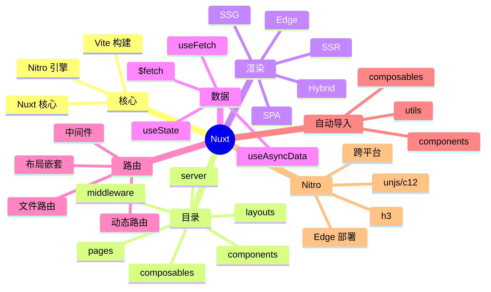

# Nuxt

> Vue 全栈框架 — Vue 团队官方出品，集成 SSR/SSG/路由/状态/Vite

## 一、前言

**定位**：直观的 Vue 全栈框架，"让 web 性能成为默认"，基于 Vite

**核心价值**：
1. **约定优于配置** — 文件系统路由、自动导入
2. **多渲染模式** — SSG/SSR/SPA/混合/Edge
3. **零配置** — Vite + TypeScript + 测试 + Lint
4. **自动导入** — components/composables/utils 无需 import
5. **Nitro 引擎** — 跨平台部署（Node/Deno/Workers/Edge）
6. **Vue 3 + Composition API** — 原生支持

**应用场景**：营销站点、电商、博客、文档站、SaaS Web 应用

**版本演进**：
- **Nuxt 1/2**（2018-2021）— 基于 Webpack
- **Nuxt 3**（2022）— Vue 3 + Vite + Nitro，全新架构
- **Nuxt 4**（2024）— 改进的目录结构、稳定的 Server Components

---

## 二、架构思维导图



---

## 三、关键代码

### 1. 文件系统路由

```vue
<!-- 文件: pages/index.vue -->
<script setup>
// 1. useFetch 自动包装 + SSR 缓存
const { data: products, pending, error, refresh } = await useFetch('/api/products', {
  key: 'products-list',       // 缓存 key
  default: () => [],
  // 2. 转换数据
  transform: (data) => data.map(p => ({ ...p, price: p.price / 100 })),
});
</script>

<template>
  <div>
    <h1>Products</h1>
    <div v-if="pending">Loading...</div>
    <div v-else-if="error">Error: {{ error.message }}</div>
    <ProductList v-else :products="products" />
  </div>
</template>

<!-- 文件: pages/products/[id].vue -->
<script setup>
const route = useRoute();
const { data: product } = await useFetch(`/api/products/${route.params.id}`);
</script>

<template>
  <ProductDetail :product="product" />
</template>
```

### 2. 服务端 API — Nitro h3

```ts
// 文件: server/api/products.get.ts
// 文件名 .get.ts → GET 处理器
export default defineEventHandler(async (event) => {
  // 1. query 解析
  const { page = 1, pageSize = 20 } = getQuery(event);
  // 2. 数据库查询
  const products = await db.product.findMany({
    skip: (Number(page) - 1) * Number(pageSize),
    take: Number(pageSize),
  });
  // 3. 自动 JSON 响应
  return { data: products, total: await db.product.count() };
});

// 文件: server/api/products/[id].patch.ts
export default defineEventHandler(async (event) => {
  const id = getRouterParam(event, 'id');
  const body = await readBody(event);
  // 验证 + 更新
  const updated = await db.product.update({
    where: { id: Number(id) },
    data: body,
  });
  return updated;
});
```

### 3. Composables（自动导入）

```ts
// 文件: composables/useAuth.ts
// 自动导入，无需 import
export const useAuth = () => {
  const user = useState('auth.user', () => null);

  const login = async (email: string, password: string) => {
    const data = await $fetch('/api/auth/login', {
      method: 'POST',
      body: { email, password },
    });
    user.value = data.user;
    return data;
  };

  const logout = async () => {
    await $fetch('/api/auth/logout', { method: 'POST' });
    user.value = null;
    await navigateTo('/');
  };

  return { user, login, logout };
};

// 文件: composables/useProducts.ts
export const useProducts = () => {
  const { data, refresh, pending } = useFetch('/api/products');
  return {
    products: data,
    pending,
    refresh,
  };
};
```

### 4. 中间件（路由守卫）

```ts
// 文件: middleware/auth.ts
export default defineNuxtRouteMiddleware((to, from) => {
  const { user } = useAuth();
  if (!user.value && to.path.startsWith('/dashboard')) {
    return navigateTo('/login');
  }
});

// 文件: nuxt.config.ts
export default defineNuxtConfig({
  modules: ['@nuxtjs/tailwindcss', '@pinia/nuxt'],
  nitro: {
    preset: 'vercel-edge',  // Vercel Edge 部署
  },
  experimental: {
    payloadExtraction: true,
  },
  routeRules: {
    '/': { prerender: true },                          // SSG
    '/products': { swr: 3600 },                         // ISR
    '/api/**': { cors: true },
  },
});
```

---

## 四、核心洞察

1. **Nitro 引擎精髓**：基于 h3（轻量 HTTP 框架）+ unjs 工具集，跨 Node/Deno/Workers/Lambda 部署
2. **自动导入魔法**：components/composables/utils 自动注册，开发体验极好但 IDE 支持要装 Volar
3. **routeRules**：声明式路由级缓存策略，比手动写 middleware 清晰
4. **useFetch vs $fetch**：useFetch 在 SSR 时被序列化到客户端避免重复请求，$fetch 每次都发
5. **Hydration 优化**：payloadExtraction 把 SSR 数据外置，减少 HTML 体积
6. **TypeScript 友好**：基于 Volar 静态分析，比 Vue 2 时代大幅提升
7. **生态对比**：Nuxt 3 vs Next.js 14 — 同样全栈，Nuxt 性能/包体积更优，Next.js 生态更大
8. **部署灵活**：Nitro preset 支持 20+ 平台（Vercel/Cloudflare/Netlify/Deno/Workers）

## 五、跨项目引用

- [[./vue|Vue]] — Nuxt 是 Vue 官方全栈框架
- [[./next.js|Next.js]] — React 版对照
- [[./sveltekit|SvelteKit]] — Svelte 版对照

---

**项目地址**：`G:\实战案例\GitHub顶尖项目\nuxt`
**类型**：全栈框架 | **Stars**: 55k+ | **License**: MIT
