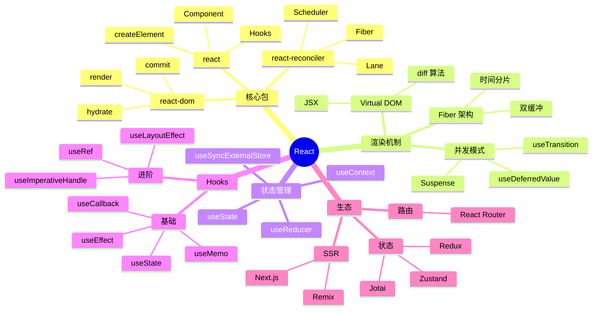

# React

> 用户界面库 — Facebook/Meta 开源，构建用户界面的 JavaScript 库

## 一、前言

**定位**：声明式、组件化、一次学习随处编写的 UI 库（Web / Native / SSR / 3D / 桌面）

**核心价值**：
1. 组件化思维 — UI = 组件树，可组合可复用
2. 声明式渲染 — 描述"是什么"而非"如何变"
3. Virtual DOM — 跨平台抽象（React DOM / Native / Three Fiber）
4. Hooks 革命 — 函数式组件 + 状态逻辑复用
5. 庞大生态 — Next.js、React Router、Redux、Material-UI、Ant Design

**应用场景**：单页应用（SPA）、移动端（React Native）、SSR（Next.js）、静态站点、桌面应用（Electron）

**同类对比**：

| 库 | 范式 | 性能 | 学习曲线 | 生态 |
|---|------|------|---------|------|
| React | 声明式 + VDOM | ★★★★ | 中 | 极大 |
| Vue | 渐进式 + 响应式 | ★★★★ | 低 | 大 |
| Angular | 完整框架 | ★★★ | 高 | 大 |
| Svelte | 编译时 | ★★★★★ | 低 | 中 |

---

## 二、架构思维导图



---

## 三、关键代码

### 1. JSX 编译产物 — createElement

```jsx
// 源代码（用户写）
const element = <h1 className="title">Hello, {name}</h1>;

// ↓ JSX 编译后 ↓

// 文件: React/createElement.ts
function createElement(type, config, children) {
  let propName;
  const props = {};
  for (propName in config) {
    if (Object.prototype.hasOwnProperty.call(config, propName)
        && !RESERVED_PROPS.hasOwnProperty(propName)) {
      props[propName] = config[propName];
    }
  }
  // 子元素处理：单/多 children → 数组
  const childrenLength = arguments.length - 2;
  if (childrenLength === 1) {
    props.children = children;
  } else if (childrenLength > 1) {
    const childArray = Array(childrenLength);
    for (let i = 0; i < childrenLength; i++) {
      childArray[i] = arguments[i + 2];
    }
    props.children = childArray;
  }
  // 解决 defaultProps
  if (type && type.defaultProps) {
    const defaultProps = type.defaultProps;
    for (propName in defaultProps) {
      if (props[propName] === undefined) {
        props[propName] = defaultProps[propName];
      }
    }
  }
  return ReactElement(type, key, ref, undefined, undefined, props);
}
```

### 2. Hooks 核心 — useState

```js
// 文件: React/ReactHooks.js
function mountState(initialState) {
  const hook = mountWorkInProgressHook();      // 1. 分配 hook 槽
  if (typeof initialState === 'function') {
    initialState = initialState();
  }
  hook.memoizedState = hook.baseState = initialState;
  const queue = { pending: null, lanes: NoLanes, dispatch: null };
  hook.queue = queue;
  // 2. dispatch 闭包：触发 setState 时入队更新
  const dispatch = (queue.dispatch = dispatchSetState.bind(
    null, currentlyRenderingFiber, queue
  ));
  return [hook.memoizedState, dispatch];
}

function dispatchSetState(fiber, queue, action) {
  // 1. 算 update 优先级（Lane）
  const lane = requestUpdateLane(fiber);
  // 2. 创建 update 对象，入队
  const update = { lane, action, hasEagerState: false, eagerState: null, next: null };
  if (isRenderPhaseUpdate(fiber)) {
    // render 阶段 update 入特殊队列
    enqueueRenderPhaseUpdate(queue, update);
  } else {
    const alternate = fiber.alternate;
    if (fiber.lanes === NoLanes && alternate === null
        && (alternate.lanes & lane) === NoLanes) {
      // 3. 优化：eagerState 计算后再决定是否调度
      const lastRenderedReducer = queue.lastRenderedReducer;
      if (lastRenderedReducer !== null) {
        try {
          const currentState = hook.memoizedState;
          const eagerState = lastRenderedReducer(currentState, action);
          update.hasEagerState = true;
          update.eagerState = eagerState;
          if (is(eagerState, currentState)) {
            // 状态未变，跳过调度
            return;
          }
        } catch (error) {}
      }
    }
    // 4. 入队 + 调度渲染
    const root = scheduleUpdateOnFiber(fiber, lane);
  }
}
```

### 3. Fiber 架构 — 工作循环

```js
// 文件: react-reconciler/src/ReactFiberWorkLoop.js
function workLoopConcurrent() {
  // yield 时间分片：每帧 ~5ms 让出主线程
  while (workInProgress !== null && !shouldYield()) {
    performUnitOfWork(workInProgress);
  }
}

function performUnitOfWork(unitOfWork) {
  const current = unitOfWork.alternate;
  // 1. beginWork：处理当前 fiber 节点（reconciliation）
  let next = beginWork(current, unitOfWork, renderLanes);
  unitOfWork.memoizedProps = unitOfWork.pendingProps;
  if (next === null) {
    // 2. 子节点完成 → completeUnitOfWork 向上回溯
    next = completeUnitOfWork(unitOfWork);
  }
  workInProgress = next;
}

// beginWork 核心：diff 子节点
function reconcileChildFibers(returnFiber, currentFirstChild, newChild, lanes) {
  if (typeof newChild !== 'object' || newChild === null) {
    return;
  }
  // key + type 决定复用 vs 重建
  // 同 key 同 type → 复用 fiber (最小化 DOM 操作)
  // 不同 → 卸载 + 挂载
}
```

---

## 四、核心洞察

1. **VDOM 的本质**：跨平台抽象层，把 UI 描述为 JS 对象（ReactElement），渲染器把对象映射到目标平台（DOM/Native/Canvas/3D）
2. **Fiber 架构精髓**：链表结构 + 双缓冲 + 时间分片，让渲染可中断可恢复，支撑 concurrent mode
3. **Lane 模型**：用 31 位二进制位表示 31 种优先级（SyncLane / InputLane / TransitionLane / ...），批量更新时按 lane 优先级调度
4. **Hooks 顺序敏感性**：useState 等 hooks 用链表存储（hook.memoizedState.next），必须在每次渲染用相同顺序调用，React 才能正确对应状态
5. **Concurrent Mode 三大特性**：可中断渲染（time slicing）、自动批处理（auto batching）、Suspense 数据获取
6. **编译时优化**：React 19 + React Compiler 自动 memo，避免手写 useMemo/useCallback
7. **生态边界**：React 只管 UI 渲染层，路由（React Router）、状态（Redux/Zustand）、样式（Tailwind/CSS-in-JS）都靠社区
8. **学习路径**：JSX → 组件 → props/state → Hooks → Context → 性能优化 → Concurrent → Server Components

## 五、跨项目引用

- [[../10-vault/README|vault]] — Token 状态管理借鉴了 useState + useReducer
- [[../05-golang/cheatsheet|go]] — goroutine 调度（GMP）和 Fiber 调度都是"协作式 + 工作窃取"思想
- [[../项目代码包/A-前端框架/vue|vue]] — 同样声明式 UI，响应式 vs VDOM 路径对比

---

**项目地址**：`G:\实战案例\GitHub顶尖项目\react`
**类型**：UI 库 | **Stars**: 230k+ | **License**: MIT
