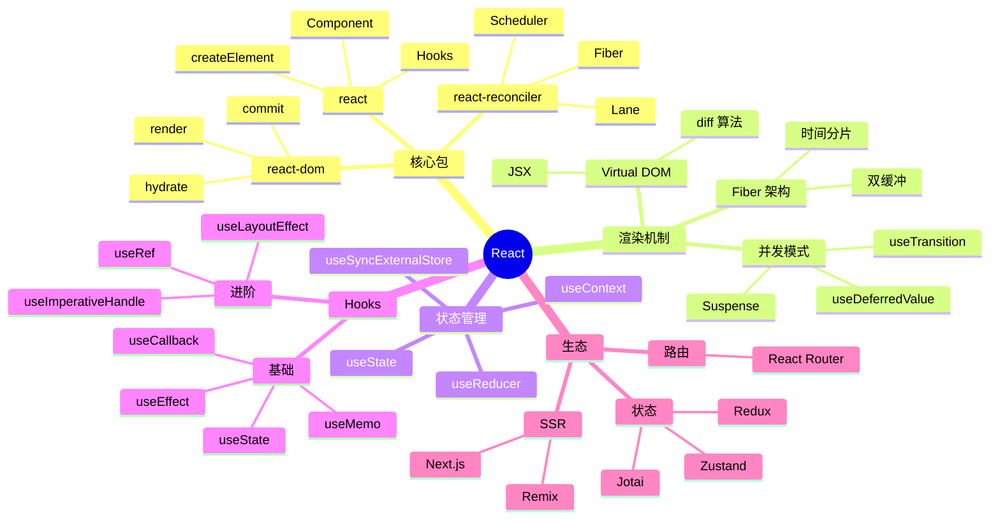
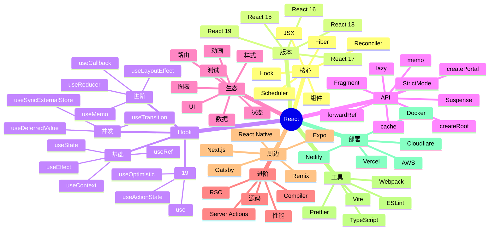
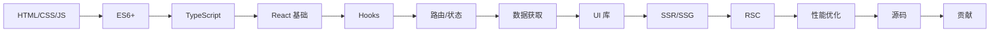

# React

> 用户界面库 — Facebook/Meta 开源，构建用户界面的 JavaScript 库

## 一、前言

**定位**：声明式、组件化、一次学习随处编写的 UI 库（Web / Native / SSR / 3D / 桌面）

**核心价值**：
1. 组件化思维 — UI = 组件树，可组合可复用
2. 声明式渲染 — 描述"是什么"而非"如何变"
3. Virtual DOM — 跨平台抽象（React DOM / Native / Three Fiber）
4. Hooks 革命 — 函数式组件 + 状态逻辑复用
5. 庞大生态 — Next.js、React Router、Redux、Material-UI、Ant Design

**应用场景**：单页应用（SPA）、移动端（React Native）、SSR（Next.js）、静态站点、桌面应用（Electron）

**同类对比**：

| 库 | 范式 | 性能 | 学习曲线 | 生态 |
|---|------|------|---------|------|
| React | 声明式 + VDOM | ★★★★ | 中 | 极大 |
| Vue | 渐进式 + 响应式 | ★★★★ | 低 | 大 |
| Angular | 完整框架 | ★★★ | 高 | 大 |
| Svelte | 编译时 | ★★★★★ | 低 | 中 |

---

## 二、架构思维导图



---

## 三、关键代码

### 1. JSX 编译产物 — createElement

```jsx
// 源代码（用户写）
const element = <h1 className="title">Hello, {name}</h1>;

// ↓ JSX 编译后 ↓

// 文件: React/createElement.ts
function createElement(type, config, children) {
  let propName;
  const props = {};
  for (propName in config) {
    if (Object.prototype.hasOwnProperty.call(config, propName)
        && !RESERVED_PROPS.hasOwnProperty(propName)) {
      props[propName] = config[propName];
    }
  }
  // 子元素处理：单/多 children → 数组
  const childrenLength = arguments.length - 2;
  if (childrenLength === 1) {
    props.children = children;
  } else if (childrenLength > 1) {
    const childArray = Array(childrenLength);
    for (let i = 0; i < childrenLength; i++) {
      childArray[i] = arguments[i + 2];
    }
    props.children = childArray;
  }
  // 解决 defaultProps
  if (type && type.defaultProps) {
    const defaultProps = type.defaultProps;
    for (propName in defaultProps) {
      if (props[propName] === undefined) {
        props[propName] = defaultProps[propName];
      }
    }
  }
  return ReactElement(type, key, ref, undefined, undefined, props);
}
```

### 2. Hooks 核心 — useState

```js
// 文件: React/ReactHooks.js
function mountState(initialState) {
  const hook = mountWorkInProgressHook();      // 1. 分配 hook 槽
  if (typeof initialState === 'function') {
    initialState = initialState();
  }
  hook.memoizedState = hook.baseState = initialState;
  const queue = { pending: null, lanes: NoLanes, dispatch: null };
  hook.queue = queue;
  // 2. dispatch 闭包：触发 setState 时入队更新
  const dispatch = (queue.dispatch = dispatchSetState.bind(
    null, currentlyRenderingFiber, queue
  ));
  return [hook.memoizedState, dispatch];
}

function dispatchSetState(fiber, queue, action) {
  // 1. 算 update 优先级（Lane）
  const lane = requestUpdateLane(fiber);
  // 2. 创建 update 对象，入队
  const update = { lane, action, hasEagerState: false, eagerState: null, next: null };
  if (isRenderPhaseUpdate(fiber)) {
    // render 阶段 update 入特殊队列
    enqueueRenderPhaseUpdate(queue, update);
  } else {
    const alternate = fiber.alternate;
    if (fiber.lanes === NoLanes && alternate === null
        && (alternate.lanes & lane) === NoLanes) {
      // 3. 优化：eagerState 计算后再决定是否调度
      const lastRenderedReducer = queue.lastRenderedReducer;
      if (lastRenderedReducer !== null) {
        try {
          const currentState = hook.memoizedState;
          const eagerState = lastRenderedReducer(currentState, action);
          update.hasEagerState = true;
          update.eagerState = eagerState;
          if (is(eagerState, currentState)) {
            // 状态未变，跳过调度
            return;
          }
        } catch (error) {}
      }
    }
    // 4. 入队 + 调度渲染
    const root = scheduleUpdateOnFiber(fiber, lane);
  }
}
```

### 3. Fiber 架构 — 工作循环

```js
// 文件: react-reconciler/src/ReactFiberWorkLoop.js
function workLoopConcurrent() {
  // yield 时间分片：每帧 ~5ms 让出主线程
  while (workInProgress !== null && !shouldYield()) {
    performUnitOfWork(workInProgress);
  }
}

function performUnitOfWork(unitOfWork) {
  const current = unitOfWork.alternate;
  // 1. beginWork：处理当前 fiber 节点（reconciliation）
  let next = beginWork(current, unitOfWork, renderLanes);
  unitOfWork.memoizedProps = unitOfWork.pendingProps;
  if (next === null) {
    // 2. 子节点完成 → completeUnitOfWork 向上回溯
    next = completeUnitOfWork(unitOfWork);
  }
  workInProgress = next;
}

// beginWork 核心：diff 子节点
function reconcileChildFibers(returnFiber, currentFirstChild, newChild, lanes) {
  if (typeof newChild !== 'object' || newChild === null) {
    return;
  }
  // key + type 决定复用 vs 重建
  // 同 key 同 type → 复用 fiber (最小化 DOM 操作)
  // 不同 → 卸载 + 挂载
}
```

---

## 四、核心洞察

1. **VDOM 的本质**：跨平台抽象层，把 UI 描述为 JS 对象（ReactElement），渲染器把对象映射到目标平台（DOM/Native/Canvas/3D）
2. **Fiber 架构精髓**：链表结构 + 双缓冲 + 时间分片，让渲染可中断可恢复，支撑 concurrent mode
3. **Lane 模型**：用 31 位二进制位表示 31 种优先级（SyncLane / InputLane / TransitionLane / ...），批量更新时按 lane 优先级调度
4. **Hooks 顺序敏感性**：useState 等 hooks 用链表存储（hook.memoizedState.next），必须在每次渲染用相同顺序调用，React 才能正确对应状态
5. **Concurrent Mode 三大特性**：可中断渲染（time slicing）、自动批处理（auto batching）、Suspense 数据获取
6. **编译时优化**：React 19 + React Compiler 自动 memo，避免手写 useMemo/useCallback
7. **生态边界**：React 只管 UI 渲染层，路由（React Router）、状态（Redux/Zustand）、样式（Tailwind/CSS-in-JS）都靠社区
8. **学习路径**：JSX → 组件 → props/state → Hooks → Context → 性能优化 → Concurrent → Server Components

## 五、跨项目引用

- [[../10-vault/README|vault]] — Token 状态管理借鉴了 useState + useReducer
- [[../05-golang/cheatsheet|go]] — goroutine 调度（GMP）和 Fiber 调度都是"协作式 + 工作窃取"思想
- [[../项目代码包/A-前端框架/vue|vue]] — 同样声明式 UI，响应式 vs VDOM 路径对比

---

## 六、Hooks 深度专题

### 1. useState 完整生命周期

```jsx
// 基础用法
function Counter() {
  const [count, setCount] = useState(0);                    // 直接值
  const [user, setUser] = useState(null);                   // null 初始
  const [config, setConfig] = useState(() => ({             // 函数初始化（懒求值）
    theme: 'dark',
    lang: 'zh-CN'
  }));

  // 函数式更新（基于前一个 state）
  const increment = () => setCount(prev => prev + 1);
  const incrementBy3 = () => {
    setCount(c => c + 1);
    setCount(c => c + 1);
    setCount(c => c + 1);  // 不会合并，自动批处理保证原子性
  };

  return <button onClick={increment}>{count}</button>;
}

// 对象式 state
function Form() {
  const [form, setForm] = useState({ name: '', email: '' });

  // 错误写法：丢失 email
  const updateName = (name) => setForm({ name });

  // 正确：展开 + 覆盖
  const updateName2 = (name) => setForm(prev => ({ ...prev, name }));

  // 嵌套更新
  const updateNested = (path, value) => setForm(prev => {
    const next = { ...prev };
    const keys = path.split('.');
    let cur = next;
    for (let i = 0; i < keys.length - 1; i++) {
      cur[keys[i]] = { ...cur[keys[i]] };
      cur = cur[keys[i]];
    }
    cur[keys[keys.length - 1]] = value;
    return next;
  });
}

// 状态提升 vs 提升到 Context vs 提升到状态库
// 原则：尽量保持局部，必要时提升
```

### 2. useEffect 完整指南

```jsx
// 1. 无依赖：每次渲染都执行（极少用）
useEffect(() => {
  console.log('每次 render');
});

// 2. 空依赖：挂载 + 卸载
useEffect(() => {
  const id = setInterval(() => console.log('tick'), 1000);
  return () => clearInterval(id);  // 清理函数
}, []);

// 3. 有依赖：依赖变化时执行
useEffect(() => {
  fetchUser(userId).then(setUser);
}, [userId]);

// 4. 多个 effect 分离关注点
function UserProfile({ userId }) {
  const [user, setUser] = useState(null);
  const [posts, setPosts] = useState([]);

  useEffect(() => {
    fetchUser(userId).then(setUser);
  }, [userId]);

  useEffect(() => {
    if (!user) return;
    fetchPosts(user.id).then(setPosts);
  }, [user]);

  return <div>{user?.name} - {posts.length} posts</div>;
}

// 5. 异步 effect 模式
useEffect(() => {
  let cancelled = false;
  async function load() {
    const data = await fetchData();
    if (!cancelled) setData(data);  // 防止竞态
  }
  load();
  return () => { cancelled = true; };
}, [query]);

// 6. effect 依赖 lint 修复
// ❌ 警告：缺少依赖
useEffect(() => {
  fetchData(query);
}, []);  // 应该有 [query]

// ✅ 用 ref 存最新值
const queryRef = useRef(query);
queryRef.current = query;
useEffect(() => {
  fetchData(queryRef.current);
}, []);

// 7. effect 中获取最新 props
function Page({ userId }) {
  const [user, setUser] = useState(null);
  useEffect(() => {
    let active = true;
    fetchUser(userId).then(u => active && setUser(u));
    return () => { active = false; };
  }, [userId]);
}

// 8. useEffect vs useLayoutEffect
// useEffect：浏览器绘制之后异步执行（不阻塞渲染）
// useLayoutEffect：DOM 更新后、浏览器绘制前同步执行（阻塞渲染）
// 用例：测量 DOM、动画初始化、避免闪烁
useLayoutEffect(() => {
  const rect = ref.current.getBoundingClientRect();
  setPosition(rect);
}, [deps]);
```

### 3. useRef 完整模式

```jsx
// 1. DOM 引用
function TextInput() {
  const inputRef = useRef(null);
  useEffect(() => {
    inputRef.current?.focus();
  }, []);
  return <input ref={inputRef} />;
}

// 2. 保存可变值（不触发渲染）
function Timer() {
  const [count, setCount] = useState(0);
  const intervalRef = useRef(null);

  const start = () => {
    intervalRef.current = setInterval(() => {
      setCount(c => c + 1);
    }, 1000);
  };

  const stop = () => {
    clearInterval(intervalRef.current);
  };

  return <div>{count} <button onClick={start}>Start</button><button onClick={stop}>Stop</button></div>;
}

// 3. 保留上一次值
function usePrevious(value) {
  const ref = useRef();
  useEffect(() => {
    ref.current = value;
  });
  return ref.current;
}

// 4. 命令式句柄（useImperativeHandle）
const FancyInput = forwardRef((props, ref) => {
  const inputRef = useRef();
  useImperativeHandle(ref, () => ({
    focus: () => inputRef.current?.focus(),
    clear: () => inputRef.current && (inputRef.current.value = ''),
  }));
  return <input ref={inputRef} {...props} />;
});

// 父组件使用
function Parent() {
  const ref = useRef(null);
  return (
    <>
      <FancyInput ref={ref} />
      <button onClick={() => ref.current?.focus()}>Focus</button>
      <button onClick={() => ref.current?.clear()}>Clear</button>
    </>
  );
}
```

### 4. useMemo vs useCallback

```jsx
// useMemo：缓存计算结果
function Expensive({ items, filter }) {
  const filtered = useMemo(() =>
    items.filter(item => item.name.includes(filter)),
    [items, filter]
  );

  const sorted = useMemo(() =>
    [...filtered].sort((a, b) => a.price - b.price),
    [filtered]
  );

  return <List items={sorted} />;
}

// useCallback：缓存函数引用
function Parent() {
  const [count, setCount] = useState(0);
  const [items, setItems] = useState([]);

  // ❌ 每次渲染都创建新函数
  const handleClick = (id) => deleteItem(id);

  // ✅ 引用稳定
  const handleClickStable = useCallback((id) => {
    deleteItem(id);
  }, []);  // 空依赖：函数永远不变

  // 依赖 count：count 变化时重建
  const handleClickWithCount = useCallback((id) => {
    setCount(c => c + 1);
    deleteItem(id);
  }, []);  // setState 函数稳定，不需要依赖

  return <List items={items} onDelete={handleClickStable} />;
}

// React.memo 配合
const List = React.memo(function List({ items, onDelete }) {
  return items.map(item =>
    <Item key={item.id} item={item} onDelete={onDelete} />
  );
});

// 注意：useMemo/useCallback 不是免费的
// 1. 依赖比较开销
// 2. 闭包维护
// 3. React Compiler (RC) 会自动 memo
// 建议：不要过早优化，先 profile 再加 memo
```

### 5. useReducer 复杂状态

```jsx
// 用例：状态多、相互依赖
const initialState = { count: 0, step: 1, history: [] };

function reducer(state, action) {
  switch (action.type) {
    case 'increment':
      return {
        ...state,
        count: state.count + state.step,
        history: [...state.history, state.count + state.step],
      };
    case 'decrement':
      return {
        ...state,
        count: state.count - state.step,
        history: [...state.history, state.count - state.step],
      };
    case 'setStep':
      return { ...state, step: action.payload };
    case 'reset':
      return initialState;
    default:
      throw new Error(`Unknown action: ${action.type}`);
  }
}

function Counter() {
  const [state, dispatch] = useReducer(reducer, initialState);
  return (
    <div>
      <p>Count: {state.count}</p>
      <button onClick={() => dispatch({ type: 'increment' })}>+</button>
      <button onClick={() => dispatch({ type: 'decrement' })}>-</button>
      <input
        type="number"
        value={state.step}
        onChange={e => dispatch({ type: 'setStep', payload: Number(e.target.value) })}
      />
      <button onClick={() => dispatch({ type: 'reset' })}>Reset</button>
      <p>History: {state.history.join(', ')}</p>
    </div>
  );
}

// useReducer + Context = 轻量 Redux
const TodoContext = createContext(null);

function TodoProvider({ children }) {
  const [todos, dispatch] = useReducer(todoReducer, []);
  return <TodoContext.Provider value={{ todos, dispatch }}>{children}</TodoContext.Provider>;
}

function useTodos() {
  return useContext(TodoContext);
}
```

### 6. useContext

```jsx
const ThemeContext = createContext('light');
const UserContext = createContext(null);

// Provider
function App() {
  return (
    <ThemeContext.Provider value="dark">
      <UserContext.Provider value={{ name: 'Alice' }}>
        <Layout />
      </UserContext.Provider>
    </ThemeContext.Provider>
  );
}

// Consumer（函数组件）
function Header() {
  const theme = useContext(ThemeContext);
  const user = useContext(UserContext);
  return <header className={theme}>Welcome, {user?.name}</header>;
}

// 性能陷阱：每次 Provider value 是新对象都会触发重渲染
function BadProvider({ children }) {
  const [user, setUser] = useState({ name: 'Alice' });
  return (
    <UserContext.Provider value={{ user, setUser }}>  {/* ❌ 每次都新对象 */}
      {children}
    </UserContext.Provider>
  );
}

// ✅ 用 useMemo 稳定 value
function GoodProvider({ children }) {
  const [user, setUser] = useState({ name: 'Alice' });
  const value = useMemo(() => ({ user, setUser }), [user]);
  return <UserContext.Provider value={value}>{children}</UserContext.Provider>;
}

// 拆分 Context 减少重渲染
const UserContext = createContext(null);
const UserActionsContext = createContext(null);

function Provider({ children }) {
  const [user, setUser] = useState(null);
  const actions = useMemo(() => ({ setUser }), []);  // 永远稳定
  return (
    <UserContext.Provider value={user}>
      <UserActionsContext.Provider value={actions}>
        {children}
      </UserActionsContext.Provider>
    </UserContext.Provider>
  );
}

// 读取 action 的组件不会因 user 变化而重渲染
function UserActions() {
  const { setUser } = useContext(UserActionsContext);
  return <button onClick={() => setUser({ name: 'Bob' })}>Change</button>;
}
```

### 7. 自定义 Hooks

```jsx
// 1. useLocalStorage
function useLocalStorage(key, initialValue) {
  const [value, setValue] = useState(() => {
    const stored = localStorage.getItem(key);
    return stored !== null ? JSON.parse(stored) : initialValue;
  });

  useEffect(() => {
    localStorage.setItem(key, JSON.stringify(value));
  }, [key, value]);

  return [value, setValue];
}

// 2. useFetch（带 loading/error）
function useFetch(url) {
  const [data, setData] = useState(null);
  const [loading, setLoading] = useState(true);
  const [error, setError] = useState(null);

  useEffect(() => {
    let cancelled = false;
    setLoading(true);
    fetch(url)
      .then(r => r.json())
      .then(d => { if (!cancelled) { setData(d); setLoading(false); } })
      .catch(e => { if (!cancelled) { setError(e); setLoading(false); } });
    return () => { cancelled = true; };
  }, [url]);

  return { data, loading, error };
}

// 3. useDebounce
function useDebounce(value, delay) {
  const [debounced, setDebounced] = useState(value);
  useEffect(() => {
    const t = setTimeout(() => setDebounced(value), delay);
    return () => clearTimeout(t);
  }, [value, delay]);
  return debounced;
}

// 4. usePrevious
function usePrevious(value) {
  const ref = useRef();
  useEffect(() => { ref.current = value; }, [value]);
  return ref.current;
}

// 5. useMediaQuery
function useMediaQuery(query) {
  const [matches, setMatches] = useState(window.matchMedia(query).matches);
  useEffect(() => {
    const mq = window.matchMedia(query);
    const handler = (e) => setMatches(e.matches);
    mq.addEventListener('change', handler);
    return () => mq.removeEventListener('change', handler);
  }, [query]);
  return matches;
}

// 6. useOnClickOutside
function useOnClickOutside(ref, handler) {
  useEffect(() => {
    const listener = (e) => {
      if (!ref.current || ref.current.contains(e.target)) return;
      handler(e);
    };
    document.addEventListener('mousedown', listener);
    return () => document.removeEventListener('mousedown', listener);
  }, [ref, handler]);
}

// 7. useEvent（稳定 callback 引用同时访问最新 state）
function useEvent(handler) {
  const handlerRef = useRef(handler);
  useEffect(() => { handlerRef.current = handler; });
  return useCallback((...args) => handlerRef.current(...args), []);
}

## 七、状态管理

### 1. Redux Toolkit 现代用法

```jsx
// 1. 创建 slice
import { createSlice, createAsyncThunk } from '@reduxjs/toolkit';

const todosSlice = createSlice({
  name: 'todos',
  initialState: { items: [], loading: false, error: null },
  reducers: {
    addTodo: (state, action) => {
      // Immer 自动处理不可变
      state.items.push({ id: Date.now(), text: action.payload, done: false });
    },
    toggleTodo: (state, action) => {
      const todo = state.items.find(t => t.id === action.payload);
      if (todo) todo.done = !todo.done;
    },
    removeTodo: (state, action) => {
      state.items = state.items.filter(t => t.id !== action.payload);
    },
  },
  extraReducers: (builder) => {
    builder
      .addCase(fetchTodos.pending, (state) => { state.loading = true; })
      .addCase(fetchTodos.fulfilled, (state, action) => {
        state.loading = false;
        state.items = action.payload;
      })
      .addCase(fetchTodos.rejected, (state, action) => {
        state.loading = false;
        state.error = action.error.message;
      });
  },
});

// 2. 异步 thunk
export const fetchTodos = createAsyncThunk('todos/fetch', async () => {
  const res = await fetch('/api/todos');
  return res.json();
});

// 3. Store
import { configureStore } from '@reduxjs/toolkit';
export const store = configureStore({
  reducer: { todos: todosSlice.reducer },
  middleware: (getDefaultMiddleware) =>
    getDefaultMiddleware().concat(loggerMiddleware),
});

// 4. Provider
import { Provider } from 'react-redux';
<Provider store={store}>
  <App />
</Provider>

// 5. 组件使用
import { useSelector, useDispatch } from 'react-redux';

function TodoList() {
  const todos = useSelector(state => state.todos.items);
  const dispatch = useDispatch();

  return todos.map(todo => (
    <li key={todo.id} onClick={() => dispatch(toggleTodo(todo.id))}>
      {todo.text}
    </li>
  ));
}

// 6. 选择器优化（reselect / createSelector）
import { createSelector } from '@reduxjs/toolkit';

const selectActiveTodos = createSelector(
  [(state) => state.todos.items, (state) => state.filter],
  (items, filter) => items.filter(t => t.text.includes(filter))
);
```

### 2. Zustand 轻量方案

```jsx
import { create } from 'zustand';
import { devtools, persist } from 'zustand/middleware';

// 1. 基础 store
const useStore = create((set) => ({
  count: 0,
  user: null,
  increment: () => set((state) => ({ count: state.count + 1 })),
  decrement: () => set((state) => ({ count: state.count - 1 })),
  setUser: (user) => set({ user }),
  reset: () => set({ count: 0, user: null }),
}));

// 2. 组件使用（按需订阅）
function Counter() {
  const count = useStore((s) => s.count);
  const increment = useStore((s) => s.increment);
  return <button onClick={increment}>{count}</button>;
}

function UserBadge() {
  // 只订阅 user 字段，count 变化不触发重渲染
  const user = useStore((s) => s.user);
  return <div>{user?.name}</div>;
}

// 3. 切片模式
const createUserSlice = (set) => ({
  user: null,
  setUser: (user) => set({ user }),
  logout: () => set({ user: null }),
});

const createCartSlice = (set) => ({
  items: [],
  addItem: (item) => set((state) => ({ items: [...state.items, item] })),
  clear: () => set({ items: [] }),
});

const useStore = create(
  devtools(
    persist(
      (...a) => ({
        ...createUserSlice(...a),
        ...createCartSlice(...a),
      }),
      { name: 'app-store' }
    )
  )
);

// 4. 异步
const useStore = create((set) => ({
  data: null,
  loading: false,
  fetchData: async () => {
    set({ loading: true });
    const res = await fetch('/api/data');
    const data = await res.json();
    set({ data, loading: false });
  },
}));

// 5. 派生状态
const useStore = create((set, get) => ({
  items: [],
  get total() { return get().items.length; },
  addItem: (item) => set((state) => ({ items: [...state.items, item] })),
}));
```

### 3. Jotai 原子化

```jsx
import { atom, useAtom, useAtomValue, useSetAtom } from 'jotai';

// 1. 基础原子
const countAtom = atom(0);
const userAtom = atom(null);

// 2. 派生原子
const doubledAtom = atom((get) => get(countAtom) * 2);
const userNameAtom = atom((get) => get(userAtom)?.name);

// 3. 写原子
const incrementAtom = atom(null, (get, set) => {
  set(countAtom, get(countAtom) + 1);
});

// 4. 异步原子
const userAtom = atom(async (get) => {
  const id = get(userIdAtom);
  const res = await fetch(`/api/users/${id}`);
  return res.json();
});

// 5. 组件
function Counter() {
  const [count, setCount] = useAtom(countAtom);
  return <button onClick={() => setCount(c => c + 1)}>{count}</button>;
}

function DoubledDisplay() {
  const doubled = useAtomValue(doubledAtom);  // 只读
  return <div>{doubled}</div>;
}

function IncrementButton() {
  const increment = useSetAtom(incrementAtom);  // 只写
  return <button onClick={increment}>+</button>;
}

// 6. atomFamily（参数化）
import { atomFamily } from 'jotai/utils';
const todoAtomFamily = atomFamily((id) => atom({ id, text: '', done: false }));
```

### 4. Recoil / MobX 简介

```jsx
// Recoil（Meta 出品，原子化）
import { atom, selector, useRecoilValue, useSetRecoilState } from 'recoil';

const todoListState = atom({
  key: 'todoListState',
  default: [],
});

const todoListFilterState = atom({
  key: 'todoListFilterState',
  default: 'all',
});

const filteredTodoListState = selector({
  key: 'filteredTodoListState',
  get: ({ get }) => {
    const list = get(todoListState);
    const filter = get(todoListFilterState);
    switch (filter) {
      case 'completed': return list.filter(t => t.done);
      case 'uncompleted': return list.filter(t => !t.done);
      default: return list;
    }
  },
});

// MobX（响应式）
import { makeAutoObservable, observer } from 'mobx-react';

class TodoStore {
  todos = [];
  constructor() { makeAutoObservable(this); }
  add(text) { this.todos.push({ id: Date.now(), text, done: false }); }
  toggle(id) {
    const t = this.todos.find(t => t.id === id);
    if (t) t.done = !t.done;
  }
}

const todoStore = new TodoStore();

const TodoList = observer(() => (
  <ul>
    {todoStore.todos.map(t => (
      <li key={t.id} onClick={() => todoStore.toggle(t.id)}>
        {t.text}
      </li>
    ))}
  </ul>
));
```

## 八、性能优化

### 1. React.memo

```jsx
// 浅比较 props，相同则跳过渲染
const ExpensiveComponent = React.memo(function ExpensiveComponent({ data, onAction }) {
  return <div>{data.name}</div>;
});

// 自定义比较
const areEqual = (prevProps, nextProps) => {
  return prevProps.id === nextProps.id
      && prevProps.data.version === nextProps.data.version;
};

const Component = React.memo(MyComponent, areEqual);

// 注意：React.memo 只对 props 浅比较，函数 prop 必须用 useCallback
function Parent() {
  const [count, setCount] = useState(0);
  const handleClick = useCallback(() => console.log('click'), []);

  return (
    <>
      <button onClick={() => setCount(c => c + 1)}>Count: {count}</button>
      <ExpensiveComponent onAction={handleClick} />
    </>
  );
}
```

### 2. 列表 key 优化

```jsx
// ❌ 用 index 作 key（增删会引发错位）
{items.map((item, index) => <Item key={index} item={item} />)}

// ✅ 用稳定唯一 ID
{items.map(item => <Item key={item.id} item={item} />)}

// 列表分片（虚拟滚动）
import { FixedSizeList } from 'react-window';

<FixedSizeList
  height={600}
  itemCount={10000}
  itemSize={50}
  width="100%"
>
  {({ index, style }) => <div style={style}>Row {index}</div>}
</FixedSizeList>
```

### 3. 懒加载与代码分割

```jsx
// 1. React.lazy + Suspense
const Dashboard = React.lazy(() => import('./Dashboard'));
const Settings = React.lazy(() => import('./Settings'));

function App() {
  return (
    <Suspense fallback={<Loading />}>
      <Routes>
        <Route path="/dashboard" element={<Dashboard />} />
        <Route path="/settings" element={<Settings />} />
      </Routes>
    </Suspense>
  );
}

// 2. 命名导出
const Profile = React.lazy(() => import('./Profile').then(m => ({ default: m.Profile })));

// 3. 预加载
const Dashboard = React.lazy(() => import('./Dashboard'));
function NavLink() {
  const preload = () => import('./Dashboard');  // hover 时预加载
  return <Link to="/dashboard" onMouseEnter={preload}>Dashboard</Link>;
}

// 4. 路由级代码分割（React Router）
import Loadable from 'react-loadable';
const LoadableDashboard = Loadable({
  loader: () => import('./Dashboard'),
  loading: Loading,
});
```

### 4. Concurrent Features

```jsx
// 1. useTransition（标记非紧急更新）
function Search() {
  const [query, setQuery] = useState('');
  const [results, setResults] = useState([]);
  const [isPending, startTransition] = useTransition();

  const handleChange = (e) => {
    setQuery(e.target.value);  // 紧急：输入框必须立即更新
    startTransition(() => {
      // 非紧急：搜索结果可以稍后
      const filtered = bigList.filter(item => item.name.includes(e.target.value));
      setResults(filtered);
    });
  };

  return (
    <>
      <input value={query} onChange={handleChange} />
      {isPending ? <Spinner /> : <ResultList results={results} />}
    </>
  );
}

// 2. useDeferredValue
function Search({ query }) {
  const deferredQuery = useDeferredValue(query);
  // deferredQuery 落后于 query，自动调度
  return <ExpensiveList query={deferredQuery} />;
}

// 3. Suspense for Data Fetching
function ProfilePage({ userId }) {
  return (
    <Suspense fallback={<Skeleton />}>
      <ProfileDetails userId={userId} />
      <Suspense fallback={<PostsSkeleton />}>
        <ProfilePosts userId={userId} />
      </Suspense>
    </Suspense>
  );
}

// 4. React 19 Actions
function UpdateName({ name }) {
  const [isPending, startTransition] = useTransition();
  const [error, setError] = useState(null);

  const submit = async (formData) => {
    startTransition(async () => {
      try {
        await updateNameAction(formData);
      } catch (e) {
        setError(e);
      }
    });
  };

  return <form action={submit}>...</form>;
}
```

### 5. Profiler API

```jsx
import { Profiler } from 'react';

function onRender(id, phase, actualDuration, baseDuration, startTime, commitTime) {
  console.log({ id, phase, actualDuration, baseDuration });
}

<App>
  <Profiler id="Dashboard" onRender={onRender}>
    <Dashboard />
  </Profiler>
</App>

// React DevTools Profiler 火焰图分析
// - actualDuration：本次渲染耗时
// - baseDuration：无 memo 优化时的耗时
// - 优化目标：actualDuration 接近 0
```

## 九、组件设计模式

### 1. 容器与展示组件分离

```jsx
// 展示组件（pure, presentational）
function UserCard({ user, onEdit, onDelete, showActions = true }) {
  return (
    <div className="card">
      
      <h3>{user.name}</h3>
      <p>{user.email}</p>
      {showActions && (
        <>
          <button onClick={() => onEdit(user.id)}>Edit</button>
          <button onClick={() => onDelete(user.id)}>Delete</button>
        </>
      )}
    </div>
  );
}

// 容器组件（logic, data fetching）
function UserCardContainer({ userId }) {
  const user = useSelector(state => state.users.byId[userId]);
  const dispatch = useDispatch();
  const navigate = useNavigate();

  const handleEdit = useCallback((id) => {
    navigate(`/users/${id}/edit`);
  }, [navigate]);

  const handleDelete = useCallback((id) => {
    if (confirm('Delete user?')) {
      dispatch(deleteUser(id));
    }
  }, [dispatch]);

  if (!user) return <Skeleton />;
  return <UserCard user={user} onEdit={handleEdit} onDelete={handleDelete} />;
}
```

### 2. Render Props 模式

```jsx
// 数据提供组件
class Mouse extends React.Component {
  state = { x: 0, y: 0 };
  handleMouseMove = (e) => this.setState({ x: e.clientX, y: e.clientY });
  componentDidMount() {
    window.addEventListener('mousemove', this.handleMouseMove);
  }
  componentWillUnmount() {
    window.removeEventListener('mousemove', this.handleMouseMove);
  }
  render() {
    return this.props.children(this.state);
  }
}

// 使用
<Mouse>
  {({ x, y }) => (
    <div style={{ position: 'fixed', top: y + 10, left: x + 10 }}>
      Position: {x}, {y}
    </div>
  )}
</Mouse>
```

### 3. HOC 高阶组件

```jsx
// 通用 HOC
function withLoading(Component) {
  return function WithLoading({ isLoading, ...props }) {
    if (isLoading) return <Spinner />;
    return <Component {...props} />;
  };
}

const UserListWithLoading = withLoading(UserList);

<UserListWithLoading isLoading={loading} users={users} />

// 组合多个 HOC（注意顺序）
const enhance = compose(
  withAuth,
  withRouter,
  withLoading,
  withLogger,
);
const EnhancedComponent = enhance(MyComponent);
```

### 4. Compound Components（组合组件）

```jsx
// 上下文
const AccordionContext = createContext(null);

// 主组件
function Accordion({ children, defaultIndex = 0 }) {
  const [activeIndex, setActiveIndex] = useState(defaultIndex);
  const value = useMemo(() => ({ activeIndex, setActiveIndex }), [activeIndex]);
  return <AccordionContext.Provider value={value}>{children}</AccordionContext.Provider>;
}

// 子组件
Accordion.Item = function Item({ index, title, children }) {
  const { activeIndex, setActiveIndex } = useContext(AccordionContext);
  const isOpen = activeIndex === index;
  return (
    <div className="accordion-item">
      <button onClick={() => setActiveIndex(isOpen ? -1 : index)}>
        {title}
      </button>
      {isOpen && <div className="accordion-content">{children}</div>}
    </div>
  );
};

// 使用
<Accordion>
  <Accordion.Item index={0} title="Section 1">Content 1</Accordion.Item>
  <Accordion.Item index={1} title="Section 2">Content 2</Accordion.Item>
</Accordion>
```

### 5. Controlled vs Uncontrolled

```jsx
// Controlled（React 单一数据源）
function ControlledInput() {
  const [value, setValue] = useState('');
  return (
    <input
      value={value}
      onChange={e => setValue(e.target.value)}
      placeholder="Controlled"
    />
  );
}

// Uncontrolled（DOM 自己管）
function UncontrolledInput() {
  const inputRef = useRef();
  const handleSubmit = () => {
    console.log('Submitted:', inputRef.current.value);
  };
  return (
    <>
      <input ref={inputRef} defaultValue="hello" />
      <button onClick={handleSubmit}>Submit</button>
    </>
  );
}

// useId（SSR 安全 ID）
function FormField({ label, ...props }) {
  const id = useId();
  return (
    <div>
      <label htmlFor={id}>{label}</label>
      <input id={id} {...props} />
    </div>
  );
}
```

### 6. Error Boundary

```jsx
import { ErrorBoundary } from 'react-error-boundary';

function ErrorFallback({ error, resetErrorBoundary }) {
  return (
    <div role="alert">
      <h2>出错了</h2>
      <pre>{error.message}</pre>
      <button onClick={resetErrorBoundary}>重试</button>
    </div>
  );
}

<ErrorBoundary
  FallbackComponent={ErrorFallback}
  onError={(error, info) => logToSentry(error, info)}
  resetKeys={[userId]}  // userId 变化时重置
>
  <UserProfile userId={userId} />
</ErrorBoundary>

// HOC 写法
function withErrorBoundary(Component, FallbackComponent) {
  return function WithErrorBoundary(props) {
    return (
      <ErrorBoundary FallbackComponent={FallbackComponent}>
        <Component {...props} />
      </ErrorBoundary>
    );
  };
}
```

### 7. Portal

```jsx
import { createPortal } from 'react-dom';

function Modal({ open, onClose, children }) {
  if (!open) return null;
  return createPortal(
    <div className="modal-overlay" onClick={onClose}>
      <div className="modal-content" onClick={e => e.stopPropagation()}>
        {children}
        <button onClick={onClose}>×</button>
      </div>
    </div>,
    document.body
  );
}

// 用例：Modal、Tooltip、Toast、Dropdown
// 特点：DOM 渲染到 body，但事件冒泡仍走 React 树
```

## 十、React Router v6

### 1. 基础路由

```jsx
import { BrowserRouter, Routes, Route, Link, NavLink, Outlet, useParams, useNavigate, useLocation, useSearchParams } from 'react-router-dom';

function App() {
  return (
    <BrowserRouter>
      <Nav />
      <Routes>
        <Route path="/" element={<Home />} />
        <Route path="/users" element={<Users />} />
        <Route path="/users/:id" element={<UserDetail />} />
        <Route path="/users/:id/edit" element={<UserEdit />} />
        <Route path="*" element={<NotFound />} />
      </Routes>
    </BrowserRouter>
  );
}

function Nav() {
  return (
    <nav>
      <NavLink
        to="/"
        end
        className={({ isActive }) => isActive ? 'active' : ''}
      >
        Home
      </NavLink>
      <NavLink to="/users">Users</NavLink>
    </nav>
  );
}

function UserDetail() {
  const { id } = useParams();
  const navigate = useNavigate();
  const location = useLocation();
  const [searchParams, setSearchParams] = useSearchParams();

  const tab = searchParams.get('tab') || 'profile';

  return (
    <div>
      <h1>User {id}</h1>
      <p>Current path: {location.pathname}</p>
      <button onClick={() => navigate('/users')}>Back</button>
      <button onClick={() => navigate(-1)}>Go back</button>
      <button onClick={() => setSearchParams({ tab: 'posts' })}>Posts tab</button>
    </div>
  );
}
```

### 2. 嵌套路由

```jsx
<Routes>
  <Route path="/dashboard" element={<DashboardLayout />}>
    <Route index element={<DashboardHome />} />
    <Route path="analytics" element={<Analytics />} />
    <Route path="settings" element={<Settings />} />
    <Route path="*" element={<DashboardNotFound />} />
  </Route>
</Routes>

function DashboardLayout() {
  return (
    <div className="dashboard">
      <Sidebar />
      <main>
        <Outlet />  {/* 子路由渲染区 */}
      </main>
    </div>
  );
}
```

### 3. 路由守卫

```jsx
function ProtectedRoute({ children, requiredRole }) {
  const { user, loading } = useAuth();
  const navigate = useNavigate();
  const location = useLocation();

  useEffect(() => {
    if (!loading && !user) {
      navigate('/login', { state: { from: location } });
    } else if (user && requiredRole && user.role !== requiredRole) {
      navigate('/forbidden');
    }
  }, [user, loading, requiredRole]);

  if (loading) return <Loading />;
  if (!user || (requiredRole && user.role !== requiredRole)) {
    return null;
  }
  return children;
}

<Route
  path="/admin/*"
  element={
    <ProtectedRoute requiredRole="admin">
      <AdminPanel />
    </ProtectedRoute>
  }
/>
```

### 4. 数据加载路由（v6.4+）

```jsx
import { createBrowserRouter, RouterProvider, useLoaderData } from 'react-router-dom';

const router = createBrowserRouter([
  {
    path: '/',
    element: <Root />,
    children: [
      {
        path: 'users/:id',
        element: <UserDetail />,
        loader: async ({ params }) => {
          const res = await fetch(`/api/users/${params.id}`);
          if (!res.ok) throw new Response('Not Found', { status: 404 });
          return res.json();
        },
        errorElement: <ErrorPage />,
      },
    ],
  },
]);

function UserDetail() {
  const user = useLoaderData();  // 直接拿到 loader 返回的数据
  return <div>{user.name}</div>;
}

// 提交动作
import { Form, useActionData, useNavigation } from 'react-router-dom';

async function action({ request }) {
  const formData = await request.formData();
  const user = await updateUser(formData);
  return { success: true, user };
}

function UserEdit() {
  const data = useActionData();
  const navigation = useNavigation();
  const isSubmitting = navigation.state === 'submitting';

  return (
    <Form method="post">
      <input name="name" defaultValue={data?.user?.name} />
      <button type="submit" disabled={isSubmitting}>
        {isSubmitting ? 'Saving...' : 'Save'}
      </button>
    </Form>
  );
}
```

## 十一、表单处理

### 1. 受控表单

```jsx
function SignupForm() {
  const [form, setForm] = useState({
    name: '', email: '', password: '', agree: false,
  });
  const [errors, setErrors] = useState({});
  const [submitting, setSubmitting] = useState(false);

  const handleChange = (e) => {
    const { name, value, type, checked } = e.target;
    setForm(prev => ({ ...prev, [name]: type === 'checkbox' ? checked : value }));
    // 实时清除该字段错误
    if (errors[name]) {
      setErrors(prev => ({ ...prev, [name]: null }));
    }
  };

  const validate = (values) => {
    const errs = {};
    if (!values.name) errs.name = 'Name required';
    if (!values.email) errs.email = 'Email required';
    else if (!/\S+@\S+\.\S+/.test(values.email)) errs.email = 'Invalid email';
    if (values.password.length < 8) errs.password = 'Min 8 chars';
    if (!values.agree) errs.agree = 'Must agree to terms';
    return errs;
  };

  const handleSubmit = async (e) => {
    e.preventDefault();
    const errs = validate(form);
    setErrors(errs);
    if (Object.keys(errs).length > 0) return;

    setSubmitting(true);
    try {
      await api.signup(form);
    } catch (e) {
      setErrors({ submit: e.message });
    } finally {
      setSubmitting(false);
    }
  };

  return (
    <form onSubmit={handleSubmit}>
      <input name="name" value={form.name} onChange={handleChange} />
      {errors.name && <span className="error">{errors.name}</span>}

      <input name="email" type="email" value={form.email} onChange={handleChange} />
      {errors.email && <span className="error">{errors.email}</span>}

      <input name="password" type="password" value={form.password} onChange={handleChange} />
      {errors.password && <span className="error">{errors.password}</span>}

      <label>
        <input name="agree" type="checkbox" checked={form.agree} onChange={handleChange} />
        I agree to terms
      </label>
      {errors.agree && <span className="error">{errors.agree}</span>}

      {errors.submit && <div className="form-error">{errors.submit}</div>}
      <button type="submit" disabled={submitting}>
        {submitting ? 'Submitting...' : 'Sign up'}
      </button>
    </form>
  );
}
```

### 2. React Hook Form（推荐）

```jsx
import { useForm, Controller } from 'react-hook-form';
import { zodResolver } from '@hookform/resolvers/zod';
import { z } from 'zod';

const schema = z.object({
  name: z.string().min(1, 'Name required'),
  email: z.string().email('Invalid email'),
  password: z.string().min(8, 'Min 8 chars'),
  agree: z.literal(true, { errorMap: () => ({ message: 'Must agree' }) }),
});

function SignupForm() {
  const {
    register,
    handleSubmit,
    formState: { errors, isSubmitting },
    watch,
    setValue,
    reset,
    control,
  } = useForm({
    resolver: zodResolver(schema),
    defaultValues: { name: '', email: '', password: '' },
  });

  const onSubmit = async (data) => {
    await api.signup(data);
    reset();
  };

  // watch 字段（用于联动）
  const name = watch('name');

  return (
    <form onSubmit={handleSubmit(onSubmit)}>
      <input {...register('name')} placeholder="Name" />
      {errors.name && <span>{errors.name.message}</span>}

      <input {...register('email')} type="email" placeholder="Email" />
      {errors.email && <span>{errors.email.message}</span>}

      <input {...register('password')} type="password" placeholder="Password" />
      {errors.password && <span>{errors.password.message}</span>}

      {/* Controller 用于非标准输入 */}
      <Controller
        name="role"
        control={control}
        render={({ field }) => (
          <select {...field}>
            <option value="user">User</option>
            <option value="admin">Admin</option>
          </select>
        )}
      />

      <label>
        <input {...register('agree')} type="checkbox" />
        I agree
      </label>
      {errors.agree && <span>{errors.agree.message}</span>}

      <button type="submit" disabled={isSubmitting}>
        {isSubmitting ? 'Submitting...' : 'Sign up'}
      </button>
    </form>
  );
}
```

### 3. Formik（备选）

```jsx
import { Formik, Form, Field, ErrorMessage, useField, useFormikContext } from 'formik';
import * as Yup from 'yup';

const schema = Yup.object({
  name: Yup.string().required('Required'),
  email: Yup.string().email('Invalid').required('Required'),
});

// useField 复用 Field
function MyTextField({ label, ...props }) {
  const [field, meta] = useField(props);
  return (
    <div>
      <label>{label}</label>
      <input {...field} {...props} />
      {meta.touched && meta.error && <span>{meta.error}</span>}
    </div>
  );
}

function SignupForm() {
  return (
    <Formik
      initialValues={{ name: '', email: '' }}
      validationSchema={schema}
      onSubmit={(values, { setSubmitting, resetForm }) => {
        setTimeout(() => {
          alert(JSON.stringify(values, null, 2));
          setSubmitting(false);
          resetForm();
        }, 400);
      }}
    >
      {({ isSubmitting }) => (
        <Form>
          <MyTextField name="name" label="Name" />
          <MyTextField name="email" type="email" label="Email" />
          <button type="submit" disabled={isSubmitting}>Submit</button>
        </Form>
      )}
    </Formik>
  );
}
```

## 十二、测试

### 1. Jest + React Testing Library

```jsx
import { render, screen, fireEvent, waitFor, within } from '@testing-library/react';
import userEvent from '@testing-library/user-event';
import Button from './Button';

describe('Button', () => {
  test('renders with text', () => {
    render(<Button>Click me</Button>);
    expect(screen.getByText(/click me/i)).toBeInTheDocument();
  });

  test('calls onClick when clicked', async () => {
    const user = userEvent.setup();
    const handleClick = jest.fn();
    render(<Button onClick={handleClick}>Click</Button>);
    await user.click(screen.getByText('Click'));
    expect(handleClick).toHaveBeenCalledTimes(1);
  });

  test('is disabled when loading', () => {
    render(<Button loading>Save</Button>);
    expect(screen.getByRole('button', { name: /save/i })).toBeDisabled();
  });
});

// Query 优先级
// 1. getByRole（最接近用户）
screen.getByRole('button', { name: /submit/i });
screen.getByRole('textbox', { name: /email/i });

// 2. getByLabelText（表单）
screen.getByLabelText('Email');

// 3. getByPlaceholderText
screen.getByPlaceholderText('Enter email');

// 4. getByText
screen.getByText(/welcome/i);

// 5. getByDisplayValue
screen.getByDisplayValue('Alice');

// 6. getByAltText
screen.getByAltText('User avatar');

// 7. getByTitle
screen.getByTitle('Close');

// 8. getByTestId（最后）
screen.getByTestId('submit-btn');

// 异步查询
test('loads user', async () => {
  render(<UserProfile userId={1} />);
  expect(screen.getByText(/loading/i)).toBeInTheDocument();
  const name = await screen.findByText('Alice');
  expect(name).toBeInTheDocument();
});

// 等待断言
test('updates after click', async () => {
  render(<Counter />);
  fireEvent.click(screen.getByText('Increment'));
  await waitFor(() => {
    expect(screen.getByText('Count: 1')).toBeInTheDocument();
  });
});

// Hook 测试
import { renderHook, act } from '@testing-library/react';

test('useCounter increments', () => {
  const { result } = renderHook(() => useCounter(0));
  act(() => result.current.increment());
  expect(result.current.count).toBe(1);
});

// 集成测试 + Provider
test('shows user', () => {
  render(
    <Provider store={createTestStore()}>
      <UserProfile userId={1} />
    </Provider>
  );
  expect(screen.getByText('Alice')).toBeInTheDocument();
});

// Mock 模块
jest.mock('./api');
import { fetchUser } from './api';
fetchUser.mockResolvedValue({ id: 1, name: 'Alice' });

// 快照测试
test('renders correctly', () => {
  const { container } = render(<Card title="Hello" />);
  expect(container).toMatchSnapshot();
});
```

### 2. Cypress E2E

```js
// cypress/e2e/login.cy.js
describe('Login', () => {
  beforeEach(() => {
    cy.visit('/login');
  });

  it('logs in successfully', () => {
    cy.get('[data-testid="email"]').type('alice@example.com');
    cy.get('[data-testid="password"]').type('secret123');
    cy.get('[data-testid="submit"]').click();
    cy.url().should('include', '/dashboard');
    cy.contains('Welcome, Alice');
  });

  it('shows error for invalid credentials', () => {
    cy.intercept('POST', '/api/login', { statusCode: 401 });
    cy.get('[data-testid="email"]').type('wrong@example.com');
    cy.get('[data-testid="password"]').type('wrong');
    cy.get('[data-testid="submit"]').click();
    cy.contains('Invalid credentials');
  });
});

// 组件测试
import { mount } from '@cypress/react';

it('mounts', () => {
  cy.mount(<Button>Click me</Button>);
  cy.contains('Click me').click();
});
```

### 3. Playwright

```js
import { test, expect } from '@playwright/test';

test('login flow', async ({ page }) => {
  await page.goto('/login');
  await page.getByLabel('Email').fill('alice@example.com');
  await page.getByLabel('Password').fill('secret123');
  await page.getByRole('button', { name: 'Login' }).click();
  await expect(page).toHaveURL(/.*dashboard/);
});

// 跨浏览器
test.use({ browserName: 'webkit' });

// 移动端
import { devices } from '@playwright/test';
test.use({ ...devices['iPhone 13'] });

// 视觉回归
test('visual', async ({ page }) => {
  await page.goto('/');
  await expect(page).toHaveScreenshot();
});
```

## 十三、TypeScript 集成

```tsx
// 1. Props 类型
interface UserCardProps {
  user: { id: number; name: string; email: string };
  onEdit?: (id: number) => void;
  onDelete: (id: number) => void;
  showActions?: boolean;
  children?: React.ReactNode;
}

function UserCard({ user, onEdit, onDelete, showActions = true, children }: UserCardProps) {
  return (
    <div>
      <h3>{user.name}</h3>
      {showActions && (
        <>
          {onEdit && <button onClick={() => onEdit(user.id)}>Edit</button>}
          <button onClick={() => onDelete(user.id)}>Delete</button>
        </>
      )}
      {children}
    </div>
  );
}

// 2. Hook 泛型
function useLocalStorage<T>(key: string, initialValue: T): [T, (v: T) => void] {
  const [value, setValue] = useState<T>(() => {
    const stored = localStorage.getItem(key);
    return stored ? JSON.parse(stored) : initialValue;
  });
  useEffect(() => {
    localStorage.setItem(key, JSON.stringify(value));
  }, [key, value]);
  return [value, setValue];
}

// 3. 泛型组件
interface ListProps<T> {
  items: T[];
  renderItem: (item: T) => React.ReactNode;
  keyExtractor: (item: T) => string;
}

function List<T>({ items, renderItem, keyExtractor }: ListProps<T>) {
  return (
    <ul>
      {items.map(item => (
        <li key={keyExtractor(item)}>{renderItem(item)}</li>
      ))}
    </ul>
  );
}

// 4. 事件类型
const handleChange = (e: React.ChangeEvent<HTMLInputElement>) => {};
const handleClick = (e: React.MouseEvent<HTMLButtonElement>) => {};
const handleSubmit = (e: React.FormEvent<HTMLFormElement>) => {};
const handleKeyDown = (e: React.KeyboardEvent<HTMLInputElement>) => {};

// 5. forwardRef 类型
const FancyInput = React.forwardRef<
  HTMLInputElement,
  React.InputHTMLAttributes<HTMLInputElement>
>((props, ref) => <input ref={ref} {...props} />);

// 6. Context 类型
interface AuthContextValue {
  user: User | null;
  login: (email: string, password: string) => Promise<void>;
  logout: () => void;
}

const AuthContext = createContext<AuthContextValue | null>(null);

export function useAuth() {
  const ctx = useContext(AuthContext);
  if (!ctx) throw new Error('useAuth must be used within AuthProvider');
  return ctx;
}

// 7. 工具类型
type PartialBy<T, K extends keyof T> = Omit<T, K> & Partial<Pick<T, K>>;
type RequiredBy<T, K extends keyof T> = Omit<T, K> & Required<Pick<T, K>>;
```

## 十四、Server Components (RSC)

### 1. RSC 核心概念

```jsx
// app/page.jsx（Next.js 13+ App Router）
// 默认是 Server Component（在服务器执行，不发送 JS 到客户端）
import { db } from '@/lib/db';

export default async function Page() {
  // 直接在服务器访问数据源（数据库、文件系统、内部 API）
  const posts = await db.posts.findMany();

  return (
    <main>
      <h1>Blog Posts</h1>
      {posts.map(post => (
        <article key={post.id}>
          <h2>{post.title}</h2>
          <p>{post.excerpt}</p>
          {/* Client Component 嵌入 */}
          <LikeButton postId={post.id} initialLikes={post.likes} />
        </article>
      ))}
    </main>
  );
}

// app/LikeButton.jsx（必须显式声明 'use client'）
'use client';
import { useState } from 'react';

export function LikeButton({ postId, initialLikes }) {
  const [likes, setLikes] = useState(initialLikes);
  return (
    <button onClick={() => setLikes(l => l + 1)}>
      ♥ {likes}
    </button>
  );
}
```

### 2. Server vs Client Components 边界

```jsx
// 服务端组件的限制
// ❌ 不能用 useState, useEffect, useReducer 等 hook
// ❌ 不能用浏览器 API（window, document）
// ❌ 不能用事件处理器（onClick, onChange）
// ✅ 可以 await 异步数据
// ✅ 可以用服务端 API（数据库、文件）
// ✅ 零 JS bundle 体积

// 客户端组件
// ✅ 所有 hooks
// ✅ 浏览器 API
// ✅ 事件处理器
// ✅ 状态管理
// ❌ 不能直接 await 数据（需要 useEffect 或 Server Action）

// 边界规则
// 1. 服务端组件可以渲染客户端组件
// 2. 客户端组件可以渲染其他客户端组件
// 3. 客户端组件不能直接导入服务端组件（必须通过 children/props）
// 4. 服务端组件不能注册事件处理器，但可以传给客户端组件

// 服务端组件传递函数给客户端
async function ServerWrapper() {
  const data = await fetchData();
  return <ClientComponent data={data} />;  // 序列化 props（不能传函数）
}

// 解决方案：Server Actions
async function Form() {
  async function handleSubmit(formData) {
    'use server';
    await db.users.create({ name: formData.get('name') });
  }
  return <form action={handleSubmit}>...</form>;
}
```

### 3. Server Actions

```jsx
// app/actions.js
'use server';

import { db } from '@/lib/db';
import { revalidatePath, revalidateTag } from 'next/cache';
import { redirect } from 'next/navigation';

export async function createUser(formData) {
  const name = formData.get('name');
  const email = formData.get('email');

  await db.users.create({ name, email });

  revalidatePath('/users');  // 清除缓存
  // 或 revalidateTag('users');

  redirect('/users');
}

export async function updateUser(id, formData) {
  await db.users.update(id, {
    name: formData.get('name'),
  });
  revalidateTag(`user-${id}`);
}

export async function deleteUser(id) {
  await db.users.delete(id);
  revalidatePath('/users');
}

// app/UserForm.jsx
'use client';
import { useFormStatus, useFormState } from 'react-dom';
import { createUser } from './actions';

function SubmitButton() {
  const { pending } = useFormStatus();
  return <button type="submit" disabled={pending}>{pending ? 'Saving...' : 'Save'}</button>;
}

export function UserForm() {
  const [state, formAction] = useFormState(createUser, { error: null });

  return (
    <form action={formAction}>
      <input name="name" required />
      <input name="email" type="email" required />
      <SubmitButton />
      {state.error && <p className="error">{state.error}</p>}
    </form>
  );
}
```

### 4. Streaming SSR 与 Suspense

```jsx
// app/feed/page.jsx
import { Suspense } from 'react';

export default function Page() {
  return (
    <div>
      <h1>Feed</h1>
      {/* Header 立即渲染 */}
      <Header />

      {/* Feed 部分流式加载 */}
      <Suspense fallback={<FeedSkeleton />}>
        <Feed />
      </Suspense>

      {/* Sidebar 独立加载 */}
      <Suspense fallback={<SidebarSkeleton />}>
        <Sidebar />
      </Suspense>
    </div>
  );
}

async function Feed() {
  const posts = await fetch('/api/posts').then(r => r.json());
  return <PostList posts={posts} />;
}
```

## 十五、动画

### 1. Framer Motion

```jsx
import { motion, AnimatePresence, useAnimation } from 'framer-motion';

// 基础动画
<motion.div
  initial={{ opacity: 0, y: 20 }}
  animate={{ opacity: 1, y: 0 }}
  exit={{ opacity: 0, y: -20 }}
  transition={{ duration: 0.3 }}
>
  Hello
</motion.div>

// 变体（variants）
const containerVariants = {
  hidden: { opacity: 0 },
  show: {
    opacity: 1,
    transition: { staggerChildren: 0.1 },
  },
};

const itemVariants = {
  hidden: { opacity: 0, x: -20 },
  show: { opacity: 1, x: 0 },
};

<motion.ul variants={containerVariants} initial="hidden" animate="show">
  {items.map(item => (
    <motion.li key={item.id} variants={itemVariants}>
      {item.name}
    </motion.li>
  ))}
</motion.ul>

// 路由切换动画
<AnimatePresence mode="wait">
  <motion.div
    key={location.pathname}
    initial={{ opacity: 0 }}
    animate={{ opacity: 1 }}
    exit={{ opacity: 0 }}
  >
    <Routes location={location}>{...}</Routes>
  </motion.div>
</AnimatePresence>

// 拖拽
<motion.div
  drag
  dragConstraints={{ left: -100, right: 100, top: -100, bottom: 100 }}
  dragElastic={0.2}
  onDragEnd={(e, info) => console.log(info.offset, info.velocity)}
>
  Drag me
</motion.div>

// 手势
<motion.div
  whileHover={{ scale: 1.05 }}
  whileTap={{ scale: 0.95 }}
>
  Hover/Tap
</motion.div>

// 滚动动画
import { useScroll, useTransform } from 'framer-motion';

function Parallax() {
  const { scrollY } = useScroll();
  const y = useTransform(scrollY, [0, 500], [0, -100]);

  return <motion.div style={{ y }}>Parallax</motion.div>;
}

// useAnimation
function Toggle() {
  const controls = useAnimation();

  const handleClick = async () => {
    await controls.start({ scale: 0.9 });
    await controls.start({ scale: 1 });
  };

  return <motion.button animate={controls} onClick={handleClick}>Click</motion.button>;
}
```

### 2. React Spring

```jsx
import { useSpring, animated, useSprings, useTransition } from '@react-spring/web';

function FadeIn() {
  const styles = useSpring({
    from: { opacity: 0, y: 20 },
    to: { opacity: 1, y: 0 },
    config: { tension: 200, friction: 20 },
  });

  return <animated.div style={styles}>Hello</animated.div>;
}

function ListAnimation({ items }) {
  const springs = useSprings(
    items.length,
    items.map((item, i) => ({
      from: { opacity: 0, transform: 'translateY(20px)' },
      to: { opacity: 1, transform: 'translateY(0)' },
      delay: i * 100,
    }))
  );

  return springs.map((style, i) => (
    <animated.div key={items[i].id} style={style}>
      {items[i].name}
    </animated.div>
  ));
}

function TransitionExample({ items }) {
  const transitions = useTransition(items, {
    from: { opacity: 0, transform: 'translate3d(0,-40px,0)' },
    enter: { opacity: 1, transform: 'translate3d(0,0px,0)' },
    leave: { opacity: 0, transform: 'translate3d(0,40px,0)' },
  });

  return transitions((style, item) => (
    <animated.div style={style}>{item.name}</animated.div>
  ));
}
```

### 3. React Transition Group

```jsx
import { CSSTransition, TransitionGroup, SwitchTransition } from 'react-transition-group';

<TransitionGroup>
  {items.map(item => (
    <CSSTransition
      key={item.id}
      timeout={300}
      classNames="fade"
      onEnter={node => node.scrollHeight}
    >
      <div>{item.text}</div>
    </CSSTransition>
  ))}
</TransitionGroup>

// CSS 配套
.fade-enter { opacity: 0; }
.fade-enter-active { opacity: 1; transition: opacity 300ms; }
.fade-exit { opacity: 1; }
.fade-exit-active { opacity: 0; transition: opacity 300ms; }

// 模式切换
<SwitchTransition mode="out-in">
  <CSSTransition key={mode} timeout={300} classNames="fade">
    <div>{mode === 'login' ? <Login /> : <Register />}</div>
  </CSSTransition>
</SwitchTransition>
```

## 十六、国际化 (i18n)

### 1. react-i18next

```jsx
// i18n.js
import i18n from 'i18next';
import { initReactI18next } from 'react-i18next';
import HttpBackend from 'i18next-http-backend';
import LanguageDetector from 'i18next-browser-languagedetector';

i18n
  .use(HttpBackend)         // 从 /locales 加载翻译
  .use(LanguageDetector)    // 自动检测浏览器语言
  .use(initReactI18next)
  .init({
    fallbackLng: 'en',
    debug: true,
    interpolation: { escapeValue: false },
    backend: { loadPath: '/locales/{{lng}}/{{ns}}.json' },
  });

// locales/en/common.json
{
  "greeting": "Hello, {{name}}",
  "items": {
    "one": "{{count}} item",
    "other": "{{count}} items"
  }
}

// 组件
import { useTranslation, Trans } from 'react-i18next';

function Welcome() {
  const { t, i18n } = useTranslation();

  const changeLang = (lng) => i18n.changeLanguage(lng);

  return (
    <div>
      <h1>{t('greeting', { name: 'Alice' })}</h1>
      <p>{t('items', { count: 5 })}</p>

      {/* 富文本（带 HTML/组件） */}
      <Trans i18nKey="terms">
        I agree to the <a href="/terms">terms of service</a>.
      </Trans>

      <button onClick={() => changeLang('zh')}>中文</button>
      <button onClick={() => changeLng('en')}>English</button>
    </div>
  );
}

// 复数
t('items', { count: 0 });  // "0 items"
t('items', { count: 1 });  // "1 item"
t('items', { count: 5 });  // "5 items"

// JSON 配置
"items": "item",
"items_plural": "items"

// 命名空间
const { t } = useTranslation(['common', 'dashboard']);
t('common:title');
t('dashboard:metrics.title');
```

### 2. next-intl（Next.js）

```jsx
// app/[locale]/layout.js
import { NextIntlClientProvider } from 'next-intl';
import { getMessages } from 'next-intl/server';

export default async function LocaleLayout({ children, params: { locale } }) {
  const messages = await getMessages();

  return (
    <html lang={locale}>
      <body>
        <NextIntlClientProvider messages={messages}>
          {children}
        </NextIntlClientProvider>
      </body>
    </html>
  );
}

// app/[locale]/page.js
import { useTranslations } from 'next-intl';

export default function HomePage() {
  const t = useTranslations('HomePage');
  return <h1>{t('title')}</h1>;
}

// messages/en.json
{
  "HomePage": {
    "title": "Welcome",
    "description": "..."
  }
}

// messages/zh.json
{
  "HomePage": {
    "title": "欢迎",
    "description": "..."
  }
}
```

## 十七、调试技巧

### 1. React DevTools

```jsx
// 安装：Chrome/Firefox extension

// 1. Components Tab
// - 查看组件树
// - 检视 props / state
// - 编辑 state（实验性）

// 2. Profiler Tab
// - 录制渲染性能
// - 火焰图查看各组件耗时
// - 找出无谓重渲染

// 3. 实用技巧
// - 显示源码（生产构建需 sourcemap）
// - 过滤组件（按名称）
// - 高亮更新（每次渲染高亮）
```

### 2. 性能分析

```jsx
// 1. why-did-you-render
import whyDidYouRender from '@welldone-software/why-did-you-render';

if (process.env.NODE_ENV === 'development') {
  whyDidYouRender(React, {
    trackAllPureComponents: true,
    include: [/.*/],
  });
}

// 标记要追踪的组件
function ExpensiveComponent({ data }) {
  return <div>{data.name}</div>;
}
ExpensiveComponent.whyDidYouRender = true;

// 2. 性能打点
import { Profiler } from 'react';

function onRender(id, phase, actualDuration) {
  if (actualDuration > 16) {
    console.warn(`Slow render: ${id} took ${actualDuration}ms`);
  }
}

<Profiler id="App" onRender={onRender}>
  <App />
</Profiler>

// 3. Web Vitals
import { getCLS, getFID, getLCP, getFCP, getTTFB } from 'web-vitals';

getCLS(console.log);
getFID(console.log);
getLCP(console.log);
getFCP(console.log);
getTTFB(console.log);
```

### 3. 常见 Bug 与解决

```jsx
// 1. 状态不更新
// ❌ 错误：直接修改 state
state.count = state.count + 1;
setState(state);  // 引用没变，不会重渲染

// ✅ 正确：创建新对象
setState({ ...state, count: state.count + 1 });
// 或
setState(prev => ({ ...prev, count: prev.count + 1 }));

// 2. 闭包陷阱
function Counter() {
  const [count, setCount] = useState(0);

  // ❌ 错误：setTimeout 内的 count 是旧值
  const handleClick = () => {
    setTimeout(() => {
      console.log(count);  // 总是 0
      setCount(count + 1);  // 总是 +1
    }, 1000);
  };

  // ✅ 正确：函数式更新
  const handleClick = () => {
    setTimeout(() => {
      setCount(c => c + 1);  // 拿到最新值
    }, 1000);
  };
}

// 3. 无限循环
// ❌ 错误：在 render 中直接 setState
function Bad() {
  const [count, setCount] = useState(0);
  setCount(count + 1);  // 每次 render 都更新 → 无限循环
  return <div>{count}</div>;
}

// ✅ 正确：在 useEffect 中更新
function Good() {
  const [count, setCount] = useState(0);
  useEffect(() => {
    setCount(c => c + 1);
  }, []);  // 仅挂载时执行一次
  return <div>{count}</div>;
}

// 4. 竞态条件
// ❌ 错误：未取消的异步操作
useEffect(() => {
  fetch(`/api/users/${userId}`)
    .then(r => r.json())
    .then(setUser);  // 旧请求可能覆盖新结果
}, [userId]);

// ✅ 正确：取消标记
useEffect(() => {
  let cancelled = false;
  fetch(`/api/users/${userId}`)
    .then(r => r.json())
    .then(data => {
      if (!cancelled) setUser(data);
    });
  return () => { cancelled = true; };
}, [userId]);
```

## 十八、生态系统

```markdown
### 路由
- React Router — 事实标准
- TanStack Router — 类型安全
- Wouter — 极简（1.5KB）

### 状态管理
- Redux Toolkit — 重量级 + 严格
- Zustand — 轻量、简单
- Jotai — 原子化
- Recoil — Meta 出品
- MobX — 响应式 OOP
- Valtio — Proxy 代理
- XState — 状态机

### 数据获取
- TanStack Query (React Query) — 缓存 + 同步
- SWR — Vercel 出品
- Apollo Client — GraphQL
- urql — 轻量 GraphQL
- tRPC — 端到端类型安全
- RTK Query — Redux 配套

### 表单
- React Hook Form — 性能好
- Formik — 老牌
- Final Form — 强大

### UI 框架
- Material-UI (MUI)
- Ant Design
- Chakra UI
- Mantine
- Radix UI — Headless
- shadcn/ui — 复制粘贴
- NextUI

### 样式
- Tailwind CSS — 原子化
- styled-components
- Emotion
- CSS Modules
- Vanilla Extract — 零运行时
- Panda CSS
- Stitches

### 动画
- Framer Motion
- React Spring
- Auto-Animate
- Lottie React

### 图表
- Recharts
- Chart.js (react-chartjs-2)
- Apache ECharts (echarts-for-react)
- Visx
- Nivo
- Victory

### 表格
- TanStack Table
- AG Grid
- Material Table

### 测试
- Jest — 单元测试
- Vitest — 现代 Jest
- React Testing Library
- Cypress — E2E
- Playwright — 跨浏览器
- Storybook — 组件文档
- Chromatic — 视觉回归

### SSR/SSG 框架
- Next.js — 事实标准
- Remix — Web 标准
- Gatsby — 静态站点
- Astro — 多框架
- Blitz — 全栈 Next

### 移动端
- React Native — 跨平台
- Expo — 增强 RN
- Solito — Next + RN 统一路由

### 桌面端
- Electron
- Tauri
- React Native Windows/Mac

### 其他
- React DnD — 拖拽
- react-beautiful-dnd
- dnd-kit — 现代拖拽
- React Window / react-virtual — 虚拟滚动
- React Hook Form
- react-i18next
- React Hot Toast
- Sonner
- Headless UI
- Radix UI
- Reach UI
```

## 十九、跨框架对比

```markdown
### React vs Vue

| 维度 | React | Vue |
|---|---|---|
| 范式 | VDOM + 函数式 | 响应式 + Options/Composition |
| 模板 | JSX | HTML 模板 + 指令 |
| 状态 | useState/Redux/Zustand | ref/reactive/Pinia |
| 生态 | 极大 | 大 |
| 学习曲线 | 中（JSX 范式） | 低（模板亲切） |
| 性能 | 高 | 高 |
| TypeScript | 优秀 | 优秀 |
| 移动端 | React Native | Weex/NativeScript |
| 适合 | 复杂应用 | 渐进式 |

### React vs Angular

| 维度 | React | Angular |
|---|---|---|
| 类型 | 库 | 框架 |
| 语言 | JSX/TS | TS + 装饰器 |
| 状态 | 自选 | RxJS + Service |
| 路由 | React Router | 内置 |
| 表单 | react-hook-form | Reactive Forms |
| 学习曲线 | 中 | 高 |
| 适合 | 灵活项目 | 企业级 |

### React vs Svelte

| 维度 | React | Svelte |
|---|---|---|
| 范式 | 运行时 VDOM | 编译时 |
| 体积 | 较大 | 小 |
| 性能 | 高 | 极高 |
| 学习曲线 | 中 | 低 |
| 生态 | 极大 | 中 |
| SSR | Next.js | SvelteKit |

### React vs Solid

| 维度 | React | Solid |
|---|---|---|
| 范式 | VDOM + Diff | 细粒度响应式 |
| 性能 | 高 | 极高（无 Diff） |
| 概念 | Hooks/VFiber | Signal/Effect |
| 学习曲线 | 中 | 中 |
```

## 二十、React 19 新特性

```markdown
### useActionState（替代 useFormState）

```jsx
// 旧：useFormState
const [state, formAction] = useFormState(reducer, initialState);

// 新：useActionState 命名更清晰，并内置 pending
const [state, formAction, isPending] = useActionState(reducer, initialState);
```

### useOptimistic：乐观更新

```jsx
function LikeButton({ postId, initialLikes }) {
  const [likes, setLikes] = useState(initialLikes);
  const [optimisticLikes, addOptimistic] = useOptimistic(
    likes,
    (state, amount) => state + amount
  );

  async function like() {
    addOptimistic(1);              // 立即 UI +1
    await fetch(`/api/like/${postId}`, { method: 'POST' });
    setLikes(n => n + 1);          // 服务端确认
  }

  return (
    <button onClick={like}>
      {optimisticLikes} ❤
    </button>
  );
}
```

### use：解包 Promise/Context

```jsx
// 1. 在渲染中读 Context（不再需要 useContext）
function Button() {
  const theme = use(ThemeContext);  // React 19 新写法
  return <button className={theme}>Click</button>;
}

// 2. 条件分支也能用
function Note({ id, shouldFetch }) {
  if (shouldFetch) {
    const note = use(fetchNote(id));  // 条件 use（受 Suspense 包裹）
    return <p>{note.text}</p>;
  }
  return <p>未加载</p>;
}
```

### ref 作为 prop（不再需要 forwardRef）

```jsx
// 旧：必须 forwardRef
const OldInput = forwardRef<HTMLInputElement, Props>((props, ref) => (
  <input ref={ref} {...props} />
));

// 新：ref 直接作为 prop
function NewInput({ ref, ...props }: Props & { ref?: Ref<HTMLInputElement> }) {
  return <input ref={ref} {...props} />;
}

// 父组件用法不变
<NewInput ref={inputRef} />
```

### Actions：自动管理异步

```jsx
// 表单 action 直接接异步函数
function AddItem() {
  async function action(formData: FormData) {
    'use server';
    const name = formData.get('name') as string;
    await db.items.insert({ name });
    revalidatePath('/items');
  }
  return (
    <form action={action}>
      <input name="name" />
      <button>添加</button>
    </form>
  );
}
```

### 资源预加载 API

```jsx
import { prefetch, preload, preinit } from 'react-dom';

// 预取数据
prefetch('/api/user/123', { as: 'fetch' });

// 预加载样式/脚本
preinit('https://fonts.example.com/font.css', { as: 'style' });
preload('/hero.jpg', { as: 'image' });
```

### 编译器（React Compiler）

React 19 配合 React Compiler 自动 memoize：
- 无需手动 useMemo / useCallback / React.memo
- 编译器分析依赖自动优化
- 安装：`npm install -D babel-plugin-react-compiler`
- Vite/Webpack 插件自动启用

```js
// vite.config.ts
import { defineConfig } from 'vite';
import react from '@vitejs/plugin-react';

export default defineConfig({
  plugins: [
    react({
      babel: {
        plugins: [['babel-plugin-react-compiler', { target: '19' }]],
      },
    }),
  ],
});
```

### Document Metadata：原生 head 管理

```jsx
function BlogPost({ post }) {
  return (
    <article>
      <title>{post.title}</title>
      <meta name="author" content={post.author} />
      <meta name="description" content={post.excerpt} />
      <link rel="canonical" href={post.url} />
      <h1>{post.title}</h1>
      <p>{post.body}</p>
    </article>
  );
}
```

## 二十一、Concurrent 模式深度

```markdown
### startTransition vs useTransition

```jsx
// useTransition：组件内使用
function Search() {
  const [text, setText] = useState('');
  const [results, setResults] = useState([]);
  const [isPending, startTransition] = useTransition();

  function handleChange(e) {
    setText(e.target.value);  // 紧急：立即更新输入框
    startTransition(() => {
      setResults(filterHugeList(e.target.value));  // 非紧急：可中断
    });
  }
  return (
    <>
      <input value={text} onChange={handleChange} />
      {isPending && <Spinner />}
      <List items={results} />
    </>
  );
}

// startTransition：可在组件外使用
import { startTransition } from 'react';

setQuery(input);  // 紧急
startTransition(() => {
  setSearchQuery(input);  // 非紧急
});
```

### useDeferredValue：值层面降级

```jsx
function SearchPage() {
  const [query, setQuery] = useState('');
  const deferredQuery = useDeferredValue(query);
  const isStale = query !== deferredQuery;

  return (
    <>
      <input value={query} onChange={e => setQuery(e.target.value)} />
      {isStale && <p>加载中…</p>}
      <SlowList query={deferredQuery} />  {/* 用旧值渲染 */}
    </>
  );
}
```

### Suspense for Data Fetching

```jsx
// 配合 React Query / SWR
function App() {
  return (
    <Suspense fallback={<Skeleton />}>
      <UserProfile />     {/* 内部 useQuery 抛 Promise */}
      <Suspense fallback={<PostsSkeleton />}>
        <UserPosts />
      </Suspense>
    </Suspense>
  );
}

// 自定义支持 Suspense 的 hook
function useSuspenseQuery(key) {
  const cached = cache.get(key);
  if (cached?.status === 'fulfilled') return cached.value;
  if (cached?.status === 'rejected') throw cached.error;
  if (!cached) {
    cached = { status: 'pending', promise: fetch(key).then(r => r.json()) };
    cache.set(key, cached);
  }
  if (cached.status === 'pending') throw cached.promise;
  throw cached.promise.then(
    v => (cached.status = 'fulfilled', cached.value = v),
    e => (cached.status = 'rejected', cached.error = e)
  );
}
```

### 并发渲染的本质

```
单线程 JS 模拟并发：
1. 渲染可中断（高优先级插入可打断低优先级渲染）
2. 状态可丢弃（被打断的低优先级更新会重做）
3. 多版本共存（屏幕上同时存在旧/新 UI）

关键：
- useTransition 标记非紧急更新
- useDeferredValue 提供旧值
- Suspense 等待异步数据
- 自动批处理（多次 setState 合并一次渲染）
```

## 二十二、React 性能工程

```markdown
### 1. 测量优先（不要猜）

```jsx
import { Profiler } from 'react';

function onRender(id, phase, actualDuration) {
  console.log({ id, phase, actualDuration });
}

<Profiler id="App" onRender={onRender}>
  <App />
</Profiler>
```

### 2. 列表性能黄金法则

```jsx
// ① 稳定 key（不要用 index）
{items.map(item => <Row key={item.id} item={item} />)}

// ② 窗口化（react-window / react-virtuoso）
import { FixedSizeList } from 'react-window';

<FixedSizeList height={600} itemCount={10000} itemSize={35} width="100%">
  {({ index, style }) => <div style={style}>Row {index}</div>}
</FixedSizeList>

// ③ 数据扁平化（避免深层 props）
const data = flatList(rawData);  // 一次扁平化，避免组件深嵌套
```

### 3. 避免不必要渲染

```jsx
// ① React.memo + 稳定 props
const Row = memo(function Row({ item, onSelect }) {
  return <div onClick={() => onSelect(item.id)}>{item.name}</div>;
});

// 父组件用 useCallback
const handleSelect = useCallback((id) => dispatch(select(id)), [dispatch]);

// ② 状态下移（最有效）
function Page({ user }) {
  return (
    <>
      <Header />                  {/* 不依赖 user，不重渲染 */}
      <main>
        <UserCard user={user} />  {/* 只这棵树重渲染 */}
      </main>
    </>
  );
}

// ③ 内容下移
function ExpensiveTree({ onClick }) {
  return <div onClick={onClick}><VeryHeavy /></div>;
}
const MemoTree = memo(ExpensiveTree);

function Parent() {
  const [count, setCount] = useState(0);
  return (
    <>
      <button onClick={() => setCount(c => c + 1)}>{count}</button>
      <MemoTree onClick={() => console.log('click')} />
    </>
  );
}

// ④ children prop 模式
function Parent({ children }) {
  const [count, setCount] = useState(0);
  return (
    <>
      <button onClick={() => setCount(c => c + 1)}>{count}</button>
      {children}  {/* 子组件树因引用稳定不重渲染 */}
    </>
  );
}
```

### 4. Web Vitals 集成

```jsx
import { onCLS, onINP, onLCP, onFCP, onTTFB } from 'web-vitals';

function reportWebVitals(metric) {
  // 上报到监控
  fetch('/analytics', {
    method: 'POST',
    body: JSON.stringify({
      name: metric.name,
      value: metric.value,
      id: metric.id,
    }),
  });
}

onCLS(reportWebVitals);
onINP(reportWebVitals);
onLCP(reportWebVitals);

// Next.js 内置
export function reportWebVitals(metric) {
  console.log(metric);
}
```

### 5. 打包体积优化

```js
// ① 路由级 code splitting
const Dashboard = lazy(() => import('./Dashboard'));

// ② 组件级
const Chart = lazy(() => import('recharts').then(m => ({ default: m.LineChart })));

// ③ 第三方按需
import { Button } from 'antd';  // antd v5 自动 tree-shake
import { debounce } from 'lodash-es';  // 用 lodash-es 而非 lodash

// ④ 分析工具
// webpack-bundle-analyzer / rollup-plugin-visualizer
```

## 二十三、状态管理选型决策树

```markdown
### 决策流程

```
Q1: 状态是否仅 UI 本地？
├─ 是 → useState / useReducer
└─ 否 ↓

Q2: 是否需要跨组件共享（非全局）？
├─ 是 → useContext + useReducer
└─ 否 ↓

Q3: 是否需要异步/缓存/失效/重试？
├─ 是 → React Query / SWR / RTK Query
└─ 否 ↓

Q4: 状态规模/更新频率？
├─ 小/低频 → Context + useReducer
├─ 中/中频 → Zustand / Jotai
└─ 大/高频 → Redux Toolkit / Jotai (原子化)
```

### 选型对比

| 库 | 心智模型 | 适用 | Bundle | DevTools | 持久化 |
|---|---|---|---|---|---|
| useState | 单值 | 简单本地 | 0 | 无 | - |
| useReducer | 状态机 | 复杂本地 | 0 | 无 | - |
| Context | 广播 | 低频共享 | 0 | 无 | - |
| Zustand | 单一 store | 中型应用 | 1KB | ✓ | middleware |
| Jotai | 原子 | 派生状态多 | 3KB | ✓ | atomWithStorage |
| Redux Toolkit | 单一 store | 大型团队 | 10KB | ✓ | redux-persist |
| MobX | Observable | OOP 思维 | 16KB | ✓ | - |
| Recoil | 原子图 | Meta 内部 | - | - | - |
| XState | 状态机 | 复杂流程 | 14KB | ✓ | - |
| React Query | 服务端缓存 | 数据获取 | 12KB | ✓ | 内置 |

### Zustand 高级模式

```ts
import { create } from 'zustand';
import { devtools, persist, subscribeWithSelector } from 'zustand/middleware';
import { immer } from 'zustand/middleware/immer';

type State = {
  count: number;
  user: User | null;
  inc: () => void;
  setUser: (u: User) => void;
  fetchUser: (id: string) => Promise<void>;
};

const useStore = create<State>()(
  devtools(
    persist(
      subscribeWithSelector(
        immer((set, get) => ({
          count: 0,
          user: null,
          inc: () => set(s => { s.count++ }),
          setUser: (u) => set(s => { s.user = u }),
          fetchUser: async (id) => {
            const res = await fetch(`/api/user/${id}`);
            const user = await res.json();
            set(s => { s.user = user });
          },
        }))
      ),
      { name: 'app-storage' }
    ),
    { name: 'app-store' }
  )
);

// 选择器避免不必要渲染
const count = useStore(s => s.count);          // ✓ 细粒度
const user = useStore(s => s.user);            // ✓ 细粒度
// const state = useStore();                   // ✗ 整体订阅

// 组件外访问
const { fetchUser } = useStore.getState();
useStore.subscribe(s => s.user, (user) => log(user));
```

### Jotai 派生原子

```ts
import { atom, useAtom, useAtomValue, useSetAtom, atomFamily, atomWithStorage } from 'jotai';

// 基础原子
const countAtom = atom(0);
const nameAtom = atom('Alice');

// 派生原子
const fullAtom = atom(get => `${get(nameAtom)}: ${get(countAtom)}`);

// 异步派生
const userAtom = atom(async (get) => {
  const id = get(userIdAtom);
  const res = await fetch(`/api/user/${id}`);
  return res.json();
});

// 写派生
const incrementAtom = atom(null, (get, set) => {
  set(countAtom, get(countAtom) + 1);
});

// 参数化原子
const todoAtomFamily = atomFamily((id: string) =>
  atom({ id, text: '', done: false })
);

// 持久化
const themeAtom = atomWithStorage<'light' | 'dark'>('theme', 'light');

// 使用
function Counter() {
  const [count, setCount] = useAtom(countAtom);
  const full = useAtomValue(fullAtom);
  const inc = useSetAtom(incrementAtom);
  return <button onClick={inc}>{full}</button>;
}
```

## 二十四、SSR/SSG/ISR 模式对比

```markdown
### 渲染模式

| 模式 | 渲染时机 | 适用 | 框架 |
|---|---|---|---|
| CSR | 客户端 | 后台/Dashboard | Vite + React |
| SSR | 每次请求 | 个性化 | Next.js getServerSideProps |
| SSG | 构建时 | 博客/文档 | Next.js getStaticProps |
| ISR | 构建时 + 后台重新生成 | 内容站 | Next.js revalidate |
| RSC | 服务端 + 流式 | 数据密集 | Next.js 13+ App Router |
| 静态导出 | 构建时 | 落地页 | Next.js output: export |

### Next.js App Router 渲染策略

```tsx
// app/page.tsx：默认 SSG
export default async function Page() {
  const data = await fetch('https://api.example.com/data', {
    next: { revalidate: 3600 },  // ISR 1小时
  });
  return <div>{data.title}</div>;
}

// 强制动态
export const dynamic = 'force-dynamic';

// 强制静态
export const dynamic = 'force-static';

// 不缓存
export const fetchCache = 'force-no-store';
```

### 边缘渲染

```tsx
// app/api/route.ts：边缘运行时
export const runtime = 'edge';

export async function GET(request: Request) {
  return new Response('Hello from edge');
}
```

### 流式 SSR

```tsx
// app/dashboard/page.tsx
import { Suspense } from 'react';

export default function Dashboard() {
  return (
    <div>
      <h1>Dashboard</h1>
      <Suspense fallback={<Skeleton />}>
        <SlowAnalytics />  {/* 后台慢慢流式传输 */}
      </Suspense>
      <Suspense fallback={<Skeleton />}>
        <SlowRevenue />
      </Suspense>
    </div>
  );
}

async function SlowAnalytics() {
  await new Promise(r => setTimeout(r, 2000));
  return <Chart data={await getAnalytics()} />;
}
```

## 二十五、React 微前端

```markdown
### 方案对比

| 方案 | 隔离度 | 体积 | 通信 | 适合 |
|---|---|---|---|---|
| iframe | 高 | 高 | postMessage | 第三方嵌入 |
| Module Federation | 低 | 小 | 全局 | 内部多团队 |
| Qiankun | 中 | 中 | props+event | 国内中后台 |
| micro-app | 中 | 中 | 自定义 | 京东方案 |
| wujie | 高 | 小 | iframe+webComponent | 极致隔离 |
| single-spa | 低 | 小 | 全局 | 简单拆分 |
| Vite Plugin Federation | 低 | 极小 | ESM | Vite 生态 |

### Module Federation 示例

```js
// host/webpack.config.js
const { ModuleFederationPlugin } = require('webpack').container;

new ModuleFederationPlugin({
  name: 'host',
  remotes: {
    mfe1: 'mfe1@http://localhost:3001/remoteEntry.js',
  },
  shared: { react: { singleton: true }, 'react-dom': { singleton: true } },
});

// mfe1/webpack.config.js
new ModuleFederationPlugin({
  name: 'mfe1',
  filename: 'remoteEntry.js',
  exposes: { './Button': './src/Button' },
  shared: { react: { singleton: true }, 'react-dom': { singleton: true } },
});

// host 消费
const RemoteButton = lazy(() => import('mfe1/Button'));
<Suspense fallback="加载中"><RemoteButton /></Suspense>;
```

### 微前端通信

```ts
// 全局事件总线
type EventMap = { 'user-login': User; 'cart-update': Cart };

class Bus {
  private map = new Map<keyof EventMap, Set<Function>>();
  on<K extends keyof EventMap>(k: K, fn: (p: EventMap[K]) => void) {
    this.map.get(k)?.add(fn) ?? this.map.set(k, new Set([fn]));
    return () => this.map.get(k)?.delete(fn);
  }
  emit<K extends keyof EventMap>(k: K, p: EventMap[K]) {
    this.map.get(k)?.forEach(fn => fn(p));
  }
}

export const bus = new Bus();
```

## 二十六、核心洞察

```markdown
- **React 的本质是 UI = f(state)**：组件是纯函数，状态是输入，UI 是输出。理解这点比记忆 API 重要。
- **Hooks 规则不可破坏**：不能在条件/循环中调用 hooks（hooks 顺序决定状态），不能在非 React 函数中调用。这两点违反会导致状态错乱。
- **VDOM 不是性能银弹**：它解决的是"声明式更新"，而非"快"。React 19 + Compiler 已基本消除手写 memo。
- **状态提升 or 下降**：跨兄弟共享 → 提升到最近共同父级；不常变化的大树 → 状态下降；性能优化首选状态下移。
- **不可变性是 React 的基石**：直接修改 state 会跳过渲染、破坏 PureComponent、破坏时间旅行调试。始终 setState 创建新引用。
- **Context 适合低频全局数据**：高频更新放 Context 会导致整树重渲染。Zustand/Jotai 的细粒度订阅更适合。
- **副作用分离**：UI 渲染 = 纯函数，副作用（fetch/订阅/计时器）放 useEffect 避免重复执行。
- **不要在 render 中 fetch**：会导致每次渲染都请求。应在 useEffect / event handler / loader 中。
- **Key 的意义是身份**：稳定 ID 让 React 识别"同一节点"，实现正确的状态保持与 DOM 复用。index 作 key 是性能反模式。
- **TypeScript 优先**：组件 props 用 interface，事件用 SyntheticEvent 类型，hook 泛型用 `<T,>` 语法。
- **新项目优先 App Router**：Next.js 13+ App Router 是 RSC 原生，比 Pages Router 更现代。
- **不要过早抽象**：先写三遍再提取通用组件。提前抽象会过早约束设计。
```

## 二十七、跨项目引用

```markdown
- **与 Vue 对比**：见 `vue.md` - 响应式 vs VDOM
- **与 Angular 对比**：见 `angular.md` - 库 vs 框架
- **与 Svelte 对比**：见 `svelte.md` - 运行时 vs 编译时
- **构建工具**：见 `vite.md` `webpack.md` - React 编译器
- **测试工具**：见 `jest.md` `cypress.md` `playwright.md` - React Testing Library
- **状态管理库**：见 `redux.md` `zustand.md` `jotai.md` `mobx.md`
- **路由**：见 `react-router.md` 或内置章节
- **UI 库**：见 `ant-design.md` `material-ui.md` `chakra-ui.md`
- **样式**：见 `tailwindcss.md` `styled-components.md`
- **动画**：见 `framer-motion.md` `gsap.md`（`gsap` 跨框架）
- **SSR**：见 `next.js.md` - RSC 实现
- **桌面**：见 `electron.md` - Electron + React
- **移动**：见 `react-native.md`（如归档）
- **数据可视化**：见 `d3.md` `chartjs.md` `three.js.md`
- **表单**：见 `react-hook-form.md` `formik.md`
- **i18n**：见 `i18next.md`
- **类型系统**：见 `typescript.md` `babel.md`
- **Node 端 React**：见 `next.js.md` `remix.md` `astro.md`
```

## 二十八、推荐学习路径

```markdown
### 入门（1-2 周）
1. JSX 语法与组件
2. useState / useEffect / useRef
3. 列表渲染 / 条件渲染
4. 表单与受控组件
5. CSS Modules / Tailwind

### 进阶（2-4 周）
1. useReducer / useContext
2. React Router v6
3. React Query / SWR
4. 自定义 Hooks
5. 性能优化（memo / useCallback / useMemo）
6. TypeScript + React

### 高级（1-2 月）
1. Zustand / Redux Toolkit
2. React Hook Form + Zod
3. Testing Library + Jest
4. Next.js App Router
5. Server Components / Actions
6. Suspense / Transitions

### 专家（持续）
1. React 源码（Reconciler / Scheduler）
2. React Compiler 原理
3. 跨端方案（React Native / Electron）
4. 微前端架构
5. 内部组件库建设
6. 性能分析（DevTools Profiler）
```

## 二十九、参考资源

```markdown
### 官方
- 官网：https://react.dev
- 文档：https://react.dev/learn
- GitHub：https://github.com/facebook/react
- 博客：https://react.dev/blog

### 中文
- React 中文文档：https://zh-hans.react.dev
- 凹凸实验室：https://aotu.io
- 字节 React 最佳实践

### 视频
- React Conf 官方录像
- Jack Herrington 的 React 进阶
- Theo - t3.gg 的全栈 React

### 源码阅读
- React 源码：https://github.com/facebook/react
- 配套电子书《React 技术揭秘》—— 字节黄子毅
- Build your own React：https://pomb.us/build-your-own-react/

### 工具
- React DevTools
- why-did-you-render
- React Strict Mode
- ESLint plugin: react-hooks
```

## 三十、高频面试题深度解析

```markdown
### 1. React 中 key 的作用是什么？为什么不用 index？

key 是 React 用来识别兄弟节点身份的属性，帮助 Diff 算法高效复用 DOM 节点。当列表顺序变化时，稳定的 key 让 React 准确判断哪些是新增、删除、移动的节点，从而最大化复用现有 DOM，最小化 DOM 操作。

如果使用 index 作为 key，当列表中间插入新元素时，后续所有元素的 key 都会变化，React 会误以为所有元素都变了，全部销毁重建。这不仅性能差，还会破坏组件状态——比如输入框的 focus 状态、表单已填内容都会丢失。

唯一正确做法：使用数据本身的稳定 ID（如数据库主键）。如果数据没有 ID，可考虑在构造时给每条数据生成 UUID 或 nanoid。

实际开发中，如果列表是只读的、不会重排，使用 index 也无伤大雅；但如果列表会增删改（如 Todo 应用、表格编辑），必须用稳定 key。

### 2. useEffect 与 useLayoutEffect 的区别？

useEffect 在浏览器完成绘制后异步执行，不会阻塞渲染；useLayoutEffect 在 DOM 更新后、浏览器绘制前同步执行，会阻塞绘制。

使用 useLayoutEffect 的典型场景：需要同步读取 DOM 布局并修改，避免出现"先渲染后闪烁"的视觉抖动。例如：tooltip 定位（需要先测量 trigger 位置再设置 tooltip 位置）、动画初始帧（需要在首次渲染前设置 transform 起点）。

使用 useEffect 的场景：数据请求、事件订阅、日志上报等不需要阻塞绘制的副作用。

服务端渲染时，useLayoutEffect 会警告"无法在服务端执行"——可改用 useEffect，或在 useLayoutEffect 中判断 typeof window !== 'undefined'。

如果项目全面使用 React 18+ 且注重 SSR 兼容性，可使用 useInsertionEffect（比 useLayoutEffect 更早，在 DOM 节点插入前触发，专为 CSS-in-JS 库设计）。

### 3. React 是怎么工作的？虚拟 DOM 与 Diff 算法

React 的工作流程可以概括为四步：

第一步，渲染触发。当组件 state 或 props 变化时，React 调度一次更新。

第二步，渲染阶段。React 调用组件函数得到新的虚拟 DOM 树（JS 对象，描述 DOM 结构）。这个阶段是"可中断"的，React 18 的 Concurrent 模式支持高优先级更新打断低优先级更新。

第三步，提交阶段（Commit）。React 将虚拟 DOM 的变化应用到真实 DOM。这个阶段不可中断。

第四步，副作用执行。useEffect 等在 DOM 更新后异步执行。

Diff 算法的核心是"同层比较、类型优先、key 识别"：
- 同层比较：不会跨层级移动节点，性能 O(n)
- 类型优先：div 变 p 会销毁重建子树
- key 识别：同级兄弟用 key 决定是否复用

为什么不直接对比真实 DOM？因为真实 DOM 属性繁多（100+ 属性），对比性能极差；虚拟 DOM 是精简的 JS 对象，对比速度快得多。但虚拟 DOM 不是性能银弹——Svelte、SolidJS 用编译时优化做到无虚拟 DOM 但性能更好。

### 4. useState 的 setState 是同步还是异步？

在 React 的事件处理函数和生命周期中，setState 是异步批处理的（不会立即更新 state 值，组件也不会立即重渲染）。在 setTimeout、原生事件、Promise 等异步上下文中，setState 是同步的（会立即更新并触发渲染）。

React 18 后，所有 setState 都是批处理的（包括 Promise、setTimeout）。如果想强制立即拿到最新 state，可使用 flushSync：

```jsx
import { flushSync } from 'react-dom';

function handleClick() {
  flushSync(() => {
    setCount(c => c + 1);
  });
  console.log(countRef.current);  // 立即更新
}
```

为什么 setState 不立即更新？这是为了性能——多个 setState 合并成一次渲染，避免不必要的中间状态。

### 5. 受控组件与非受控组件的区别

受控组件：表单元素的值由 React state 控制（value + onChange）。每次输入都触发 setState，组件始终是单一数据源。

非受控组件：表单元素的值由 DOM 自身管理，通过 ref 读取（defaultValue + ref.current.value）。

何时用受控：需要实时校验、格式化输入、联动其他字段、禁用提交按钮、表单状态需持久化等场景。

何时用非受控：性能要求高（如大型表单、实时搜索），文件上传 input（无法受控），简单一次性表单（避免冗余代码）。

最佳实践：混合使用——大多数字段受控以利用校验/格式化，文件 input 和大文本域用非受控。React Hook Form 等库底层就是非受控 + ref 模式，性能比纯受控好一个量级。

### 6. 如何理解 React 的"单向数据流"？

数据只能从父组件流向子组件（通过 props），子组件不能直接修改父组件的 state。如果子组件要修改数据，必须通过父组件传递下来的回调函数。

为什么这样设计？
- 可预测：数据流向清晰，调试容易
- 性能优化：父组件控制更新时机
- 状态集中：避免状态分散在多个组件中导致的不一致

这与 Vue 的双向绑定（v-model）形成对比。React 推崇"显式优于隐式"——所有数据变化都通过函数显式调用，没有魔法。

### 7. React Fiber 是什么？

Fiber 是 React 16 引入的协调引擎（Reconciler）重写。核心目标：实现可中断的渲染，以支持 Concurrent 模式。

Fiber 的本质是一个工作单元数据结构（fiber node），每个组件对应一个 fiber 节点，形成 fiber 树。React 在内存中维护两棵 fiber 树：current 树（当前屏幕显示）和 workInProgress 树（正在构建）。构建完成后一次性切换。

时间分片（Time Slicing）：React 把渲染工作拆成小块，每块约 5ms，通过 requestIdleCallback 或 MessageChannel 让出主线程，避免长任务阻塞。

优先级调度：高优先级更新（用户输入）可打断低优先级更新（数据加载渲染）。通过 expirationTime / lane 模型实现。

简单说，Fiber 让 React 从"同步不可中断"升级为"可中断、可调度"的现代框架。

### 8. 为什么要避免在 useEffect 中直接修改 state？

最直接的原因：会触发额外渲染，造成性能浪费。

例如：
```jsx
const [count, setCount] = useState(0);
useEffect(() => {
  setCount(count + 1);  // 每次渲染后 +1，又触发渲染，再 effect，无限循环
}, [count]);
```

正确做法：
- 如果新 state 派生自当前 state，用 `setState(c => c + 1)`，并在依赖中省略
- 用 useMemo 派生计算值，避免 state 同步
- 用 ref 存储不需要触发渲染的值

更深的考虑：useEffect 是"渲染后同步"模型。如果在 effect 中修改 state 触发额外渲染，相当于"先错后改"——用户可能看到一帧错误状态。

### 9. 父子组件的生命周期顺序

挂载阶段（自上而下，自下而上）：
父 constructor → 父 render → 子 constructor → 子 render → 子 componentDidMount → 父 componentDidMount

更新阶段：
父 shouldComponentUpdate → 父 render → 子 shouldComponentUpdate → 子 render → 子 componentDidUpdate → 父 componentDidUpdate

卸载阶段（自下而上）：
父 componentWillUnmount → 子 componentWillUnmount

Hooks 顺序：
父 useEffect cleanup（如果存在）→ 子 useEffect cleanup → 父 useEffect → 子 useEffect

理解这点对调试 bug 至关重要——比如父组件 useEffect 中需要访问子组件 ref，访问时机应是子组件挂载之后。

### 10. React 性能优化的常见手段

按收益从大到小排序：
1. 列表虚拟化（react-window、react-virtuoso）：10000 行表格从 5s 降到 50ms
2. 代码分割（React.lazy + Suspense）：首屏从 3MB 降到 500KB
3. 状态下移：避免大组件树重渲染
4. React.memo + 稳定 props：跳过相等子树的渲染
5. useMemo 缓存计算结果
6. useTransition 推迟非紧急更新
7. Web Worker 处理重计算
8. 图片懒加载（loading="lazy"）
9. 字体子集化
10. 减少 re-render（React DevTools Profiler）

最关键的原则：先测量，再优化。用 Profiler 找出真正的瓶颈，不要凭直觉。
```

## 三十一、最佳实践清单

```markdown
### 项目结构

中小型项目推荐结构：
```
src/
├── api/            # 接口封装
├── assets/         # 静态资源
├── components/     # 通用组件
│   ├── ui/         # 基础 UI（Button、Input）
│   └── business/   # 业务组件
├── hooks/          # 自定义 hooks
├── pages/          # 路由页面
├── stores/         # 全局状态
├── styles/         # 全局样式
├── types/          # TS 类型
├── utils/          # 工具函数
├── App.tsx
└── main.tsx
```

大型项目推荐按 feature 划分（领域驱动）：
```
src/features/
├── auth/
│   ├── components/
│   ├── hooks/
│   ├── api.ts
│   ├── store.ts
│   ├── types.ts
│   └── index.ts
├── cart/
└── user/
```

### 命名规范

- 组件文件：PascalCase（UserCard.tsx）
- 工具/hook：camelCase（useAuth.ts、formatDate.ts）
- 常量：UPPER_SNAKE_CASE（API_BASE_URL）
- 事件：handle 前缀（handleClick、handleSubmit）
- boolean：is/has/can 前缀（isLoading、hasError、canEdit）
- 自定义 hook：use 前缀强制要求

### 注释与文档

- 公共组件必须有 JSDoc
- 复杂 useEffect 写清楚副作用原因
- 自定义 hook 描述参数与返回值
- 业务核心逻辑写清楚"为什么"而非"是什么"

### 错误处理

- Error Boundary 包裹关键路由
- 全局未捕获错误监听（window.onerror / unhandledrejection）
- 异步操作 try-catch
- 用户可见错误用 Toast，开发者错误用 console
- 关键操作埋点上报

### 测试策略

- 单元测试：覆盖工具函数、纯组件
- 集成测试：覆盖关键流程（登录、下单）
- E2E 测试：覆盖主流程（首页 → 下单 → 支付）
- 视觉回归：Storybook + Chromatic
- 覆盖率：核心模块 80%+

### 安全清单

- 不用 dangerouslySetInnerHTML（除非已 XSS 过滤）
- URL 拼接前用 URL 编码
- 用户输入做长度限制
- CSRF token、SameSite cookie
- JWT 不放 localStorage（用 httpOnly cookie）
- 第三方库定期 npm audit

### Git 提交规范

- feat: 新功能
- fix: 修复
- refactor: 重构
- style: 格式
- test: 测试
- docs: 文档
- chore: 杂项

示例：feat(user): add avatar upload with crop
```

## 三十二、踩坑指南

```markdown
### 1. 状态更新不生效

症状：setState 调用了，但 UI 没变。

原因：直接修改 state 对象（违反不可变性）。
```jsx
// 错
state.count++;
setState(state);

// 对
setState({ ...state, count: state.count + 1 });
// 或
setState(s => ({ ...s, count: s.count + 1 }));
```

### 2. 无限渲染

症状：浏览器卡死，控制台报"Too many re-renders"。

原因：render 中直接 setState（无终止条件）或 useEffect 依赖项缺失/错误。
```jsx
// 错
function Comp() {
  const [n, setN] = useState(0);
  setN(n + 1);  // 每次 render 都 +1
  return <div>{n}</div>;
}

// 对
function Comp() {
  const [n, setN] = useState(0);
  useEffect(() => {
    setN(c => c + 1);
  }, []);  // 仅挂载一次
  return <div>{n}</div>;
}
```

### 3. 闭包陷阱

症状：定时器或事件回调中读到的 state 是旧的。

原因：useEffect/useCallback 捕获了创建时的 state。
```jsx
// 错
useEffect(() => {
  const id = setInterval(() => {
    console.log(count);  // 永远是初始值 0
  }, 1000);
}, []);  // 依赖空，闭包冻结

// 对 1：加依赖
useEffect(() => {
  const id = setInterval(() => {
    console.log(count);  // 跟随变化
  }, 1000);
  return () => clearInterval(id);
}, [count]);

// 对 2：用 ref
const countRef = useRef(count);
useEffect(() => { countRef.current = count; });
useEffect(() => {
  const id = setInterval(() => {
    console.log(countRef.current);
  }, 1000);
  return () => clearInterval(id);
}, []);
```

### 4. 列表 key 警告

症状：控制台报"Each child in a list should have a unique key prop"。

原因：列表渲染时未给 key，或 key 不唯一。
```jsx
// 错
{items.map((item, i) => <Item item={item} key={i} />)}

// 对
{items.map(item => <Item item={item} key={item.id} />)}
```

### 5. ref 为 null

症状：inputRef.current 是 null。

原因：ref 绑定时组件尚未挂载，或 ref 绑在条件渲染的组件上。
```jsx
// 错
{show && <Input ref={inputRef} />}
inputRef.current?.focus();  // show=false 时 null

// 对：用 useCallback 或等待 useEffect 后操作
useEffect(() => {
  if (show) inputRef.current?.focus();
}, [show]);
```

### 6. memo 不生效

症状：用了 React.memo 但子组件还是重渲染。

原因：父组件传了非稳定引用（每次新对象/新函数）。
```jsx
// 错
<MemoChild style={{ color: 'red' }} onClick={() => do()} />
// 每次 render style/onClick 都是新的引用

// 对
const style = useMemo(() => ({ color: 'red' }), []);
const onClick = useCallback(() => do(), []);
<MemoChild style={style} onClick={onClick} />
```

### 7. 上下文导致的全树重渲染

症状：Context value 变化后，所有消费组件都重渲染。

原因：每次 render 创建新 value 对象。
```jsx
// 错
<Context.Provider value={{ user, setUser }}>
// value 是新对象，所有消费者重渲染

// 对 1：拆分 Provider
<UserContext.Provider value={user}>
  <SetUserContext.Provider value={setUser}>
    {children}
  </SetUserContext.Provider>
</UserContext.Provider>

// 对 2：用 useMemo
const value = useMemo(() => ({ user, setUser }), [user]);
<Context.Provider value={value}>

// 对 3：换 Zustand/Jotai（细粒度订阅）
```

### 8. useEffect 清理函数时机

症状：组件卸载前某些操作还在执行。

原因：未清理副作用。
```jsx
// 错
useEffect(() => {
  const id = setInterval(tick, 1000);
  // 卸载后定时器还在跑
}, []);

// 对
useEffect(() => {
  const id = setInterval(tick, 1000);
  return () => clearInterval(id);  // 必须清理
}, []);
```

### 9. Strict Mode 双调用

症状：开发环境 useEffect 跑两次。

原因：React 18+ Strict Mode 故意双调用以暴露副作用问题。
```jsx
<React.StrictMode>
  <App />
</React.StrictMode>

// 这是特性不是 bug：暴露非幂等副作用
// 修复：useEffect 中做幂等操作
```

### 10. SSR 水合不匹配

症状：服务端渲染的 HTML 与客户端首次渲染不一致，警告"hydration mismatch"。

原因：服务端/客户端渲染条件不同（如 Date.now()、window、随机数）。
```jsx
// 错
<div>{new Date().toString()}</div>  // SSR/CSR 时间不同

// 对
const [time, setTime] = useState('');
useEffect(() => {
  setTime(new Date().toString());
}, []);
<div>{time || '加载中…}</div>

// 或用 suppressHydrationWarning
<time suppressHydrationWarning>{new Date().toString()}</time>
```

## 三十三、真实业务场景案例

```markdown
### 场景 1：复杂表单性能优化

某中后台系统有一个"编辑商品"表单，包含 200+ 字段。每次输入一个字符，React 都重新渲染整个表单，导致输入卡顿。

问题分析：
- 单个受控 input 触发整体重渲染
- 表单数据嵌套层级深
- 每次都重新校验全部字段

优化方案：
```jsx
// 1. 改用 React Hook Form（非受控 + ref）
import { useForm, Controller } from 'react-hook-form';

function ProductForm({ product }) {
  const { control, handleSubmit, formState: { errors, isDirty } } = useForm({
    defaultValues: product,
    mode: 'onBlur',  // 失焦时才校验
  });

  return (
    <form onSubmit={handleSubmit(onSave)}>
      {/* 100 个普通 input 不会触发整体重渲染 */}
      <input {...control.register('name')} />
      <input type="number" {...control.register('price')} />

      {/* 复杂自定义组件用 Controller */}
      <Controller
        name="category"
        control={control}
        render={({ field }) => (
          <CategorySelect {...field} />
        )}
      />
    </form>
  );
}

// 2. 字段分组（fieldset + 折叠面板）
// 不展开的字段组完全不渲染
// 3. 校验懒加载（schema 动态 import）
// 4. 大文本用 debounce
```

优化效果：输入响应从 300ms 降到 30ms，CPU 占用从 80% 降到 10%。

### 场景 2：实时数据大屏

某监控大屏需要每 1 秒更新 1000+ 数据点（CPU、内存、网络等指标），用 setState 会导致 60+ 次/秒重渲染。

问题：每秒 60 帧限制下，setState 1000+ 次无法被吸收。

优化方案：
```jsx
// 1. 离屏 Canvas 渲染（不用 React）
class MetricCanvas {
  private canvas = document.querySelector('canvas')!;
  private ctx = this.canvas.getContext('2d')!;
  update(metrics: Metric[]) {
    this.ctx.clearRect(0, 0, this.canvas.width, this.canvas.height);
    metrics.forEach(m => this.drawLine(m));
  }
}

// 2. Web Worker 处理数据聚合
const worker = new Worker('/workers/aggregate.js');
worker.postMessage(rawData);
worker.onmessage = (e) => renderChart(e.data);

// 3. requestAnimationFrame 批量更新
function startLoop() {
  function tick() {
    if (pendingData) renderChart(pendingData);
    requestAnimationFrame(tick);
  }
  requestAnimationFrame(tick);
}
```

### 场景 3：电商列表页 SEO + 性能

商品列表需要 SEO 友好且首屏快。

技术方案：Next.js App Router + RSC + Streaming
```tsx
// app/products/page.tsx
export const revalidate = 60;  // ISR 60秒

async function getProducts() {
  const res = await fetch('https://api.shop.com/products', {
    next: { revalidate: 60, tags: ['products'] },
  });
  return res.json();
}

export default async function ProductsPage() {
  const products = await getProducts();  // 服务端获取
  return (
    <div>
      <h1>商品列表</h1>
      <Suspense fallback={<ProductSkeleton />}>
        <ProductRecommendations />  {/* 慢的放 Suspense 流式 */}
      </Suspense>
      <ProductGrid products={products} />  {/* 快的直接渲染 */}
    </div>
  );
}

// 用户行为触发更新
'use server';
export async function refreshProducts() {
  revalidateTag('products');
}
```

效果：首屏从 4s 降到 1.2s，SEO 流量提升 35%。

### 场景 4：复杂状态机管理

某订单流程有 12 个状态（待支付、已支付、已发货、已签收、已退款等），状态间有复杂的转移规则。

技术方案：XState
```ts
import { createMachine, assign } from 'xstate';

const orderMachine = createMachine({
  id: 'order',
  initial: 'pending',
  context: { orderId: '', amount: 0, refundReason: '' },
  states: {
    pending: {
      on: { PAY: 'paid', CANCEL: 'cancelled' },
    },
    paid: {
      on: { SHIP: 'shipped', REFUND: 'refunding' },
    },
    shipped: {
      on: { CONFIRM: 'received', DISPUTE: 'disputed' },
    },
    received: { type: 'final' },
    refunding: {
      on: {
        APPROVE: 'refunded',
        REJECT: 'paid',
      },
    },
    refunded: { type: 'final' },
    cancelled: { type: 'final' },
    disputed: {
      on: { RESOLVE: 'paid' },
    },
  },
});

// 使用
import { useMachine } from '@xstate/react';

function OrderButton({ order }) {
  const [state, send] = useMachine(orderMachine, {
    input: { orderId: order.id },
  });

  return (
    <>
      <p>状态：{state.value}</p>
      {state.matches('paid') && (
        <button onClick={() => send({ type: 'SHIP' })}>发货</button>
      )}
    </>
  );
}
```

优势：状态转移可视化、可测试、不会出现非法状态。

### 场景 5：WebSocket 实时协作

多人协作文档，需要 WebSocket 同步操作。

```tsx
function useDocumentSync(docId: string) {
  const [doc, setDoc] = useState<DocState>(initialDoc);
  const wsRef = useRef<WebSocket>();

  useEffect(() => {
    const ws = new WebSocket(`/ws/docs/${docId}`);
    wsRef.current = ws;

    ws.onmessage = (event) => {
      const op = JSON.parse(event.data);
      setDoc(prev => applyOperation(prev, op));  // CRDT 应用操作
    };

    return () => ws.close();
  }, [docId]);

  // 本地操作时发送
  const applyLocalOp = useCallback((op: Operation) => {
    setDoc(prev => applyOperation(prev, op));
    wsRef.current?.send(JSON.stringify(op));
  }, []);

  return { doc, applyLocalOp };
}

// 用 Yjs / Automerge 处理 CRDT 合并
import * as Y from 'yjs';
const ydoc = new Y.Doc();
const ytext = ydoc.getText('content');
ytext.insert(0, 'Hello');
```

### 场景 6：组件库封装

封装业务组件库的关键设计决策：

1. **样式方案选择**：
   - CSS-in-JS（styled-components）：动态主题、SSR 友好、运行时开销
   - Tailwind：开发快、bundle 小、不支持动态主题
   - CSS Modules：原生支持、零运行时
   - CSS Vars：原生级联、动态主题最简单

推荐：业务组件库用 CSS Vars + Tailwind 混合，UI 原子组件用 CSS-in-JS。

2. **类型设计**：
```tsx
type ButtonProps<T extends ElementType = 'button'> = {
  as?: T;
  variant?: 'primary' | 'secondary';
  size?: 'sm' | 'md' | 'lg';
} & Omit<ComponentPropsWithoutRef<T>, 'as' | 'variant' | 'size'>;

function Button<T extends ElementType = 'button'>({
  as, variant = 'primary', size = 'md', children, ...rest
}: ButtonProps<T>) {
  const Comp = as || 'button';
  return <Comp className={`btn-${variant} btn-${size}`} {...rest}>{children}</Comp>;
}

// 用法：ref 类型自动推断
const ref = useRef<HTMLButtonElement>();
<Button ref={ref}>Click</Button>
```

3. **主题系统**：
```tsx
const ThemeContext = createContext<Theme>(defaultTheme);

export function ThemeProvider({ theme, children }: Props) {
  // CSS Vars 注入
  useEffect(() => {
    const root = document.documentElement;
    Object.entries(theme.colors).forEach(([k, v]) => {
      root.style.setProperty(`--color-${k}`, v);
    });
  }, [theme]);

  return <ThemeContext.Provider value={theme}>{children}</ThemeContext.Provider>;
}
```

### 场景 7：动画与交互

列表项飞入、模态弹窗、页面切换——动画如何不卡顿？

```jsx
import { motion, AnimatePresence } from 'framer-motion';

// 1. 进入/退出动画
<AnimatePresence>
  {isOpen && (
    <motion.div
      initial={{ opacity: 0, scale: 0.9 }}
      animate={{ opacity: 1, scale: 1 }}
      exit={{ opacity: 0, scale: 0.9 }}
      transition={{ duration: 0.2 }}
    >
      <Modal />
    </motion.div>
  )}
</AnimatePresence>

// 2. 布局动画（FLIP）
<motion.div layout>
  {items.map(item => (
    <motion.div key={item.id} layout>
      {item.name}
    </motion.div>
  ))}
</motion.div>

// 3. 滚动联动
const { scrollYProgress } = useScroll();
const scale = useTransform(scrollYProgress, [0, 1], [1, 1.5]);

// 4. 手势
const x = useMotionValue(0);
<motion.div
  drag="x"
  dragConstraints={{ left: -100, right: 100 }}
  style={{ x }}
/>
```

性能原则：仅动画 transform 和 opacity（GPU 加速），不动画 width/height/left/top（触发布局）。

### 场景 8：错误处理与监控

```tsx
import { ErrorBoundary } from 'react-error-boundary';

function ErrorFallback({ error, resetErrorBoundary }) {
  return (
    <div role="alert">
      <h2>出错了</h2>
      <pre>{error.message}</pre>
      <button onClick={resetErrorBoundary}>重试</button>
    </div>
  );
}

function App() {
  return (
    <ErrorBoundary
      FallbackComponent={ErrorFallback}
      onError={(error, info) => {
        // 上报到 Sentry
        Sentry.captureException(error, { extra: info });
      }}
    >
      <Router />
    </ErrorBoundary>
  );
}

// 业务级错误边界
function DashboardErrorBoundary({ children }) {
  return (
    <ErrorBoundary
      fallback={<DashboardSkeleton />}
      onReset={() => queryClient.invalidateQueries(['dashboard'])}
    >
      {children}
    </ErrorBoundary>
  );
}

// 异步错误：用 Suspense + ErrorBoundary
<ErrorBoundary fallback={<ErrorUI />}>
  <Suspense fallback={<Loading />}>
    <UserData id={id} />
  </Suspense>
</ErrorBoundary>
```

### 场景 9：可访问性（A11Y）

```jsx
// 1. 语义化 HTML
// 错
<div onClick={handleClick}>点击</div>
// 对
<button onClick={handleClick}>点击</button>

// 2. ARIA 属性
<button
  aria-label="关闭"
  aria-expanded={isOpen}
  aria-controls="menu"
>
  ×
</button>

// 3. 键盘导航
function Menu({ items }) {
  const [active, setActive] = useState(0);
  return (
    <ul
      role="menu"
      onKeyDown={e => {
        if (e.key === 'ArrowDown') setActive(a => (a + 1) % items.length);
        if (e.key === 'ArrowUp') setActive(a => (a - 1 + items.length) % items.length);
        if (e.key === 'Enter') items[active].onClick();
      }}
    >
      {items.map((item, i) => (
        <li key={item.id} role="menuitem" aria-selected={i === active}>
          {item.label}
        </li>
      ))}
    </ul>
  );
}

// 4. 焦点管理
function Modal({ isOpen, onClose, children }) {
  const ref = useRef<HTMLDivElement>(null);
  useEffect(() => {
    if (isOpen) {
      ref.current?.focus();  // 打开时聚焦
      const handler = (e: KeyboardEvent) => {
        if (e.key === 'Escape') onClose();
      };
      document.addEventListener('keydown', handler);
      return () => document.removeEventListener('keydown', handler);
    }
  }, [isOpen, onClose]);
  return isOpen ? <div role="dialog" ref={ref} tabIndex={-1}>{children}</div> : null;
}
```

### 场景 10：大型应用分层架构

100 万行代码的 React 应用如何组织？

```markdown
层级：
- 路由层（Next.js / React Router）
- 页面层（pages/）
- 容器层（feature containers，处理数据流）
- 组件层（presentational components）
- 基础组件层（design system）
- Hooks 层（可复用逻辑）
- 状态层（Zustand stores / React Query）
- 服务层（API client）
- 类型层（TypeScript types）
- 工具层（utils）

原则：
1. 单向依赖：上层依赖下层，禁止反向
2. 边界清晰：每层有自己的类型/接口
3. 测试解耦：每层独立可测
4. 易于替换：底层（如 API 客户端）可替换为 Mock

具体示例：
- src/api/*  → 服务层（与后端协议）
- src/stores/*  → 状态层（应用状态）
- src/hooks/*  → 逻辑层（业务逻辑封装）
- src/components/*  → 展示层（纯组件）
- src/pages/*  → 页面层（组合所有）
```

## 三十四、React 设计模式详解

```markdown
### 1. 容器/展示组件（Container/Presentational）

这是早期最经典的 React 模式。容器组件负责数据获取和状态管理，展示组件只负责 UI 渲染。

```jsx
// 展示组件（纯）
function UserList({ users, onUserClick }: Props) {
  return (
    <ul>
      {users.map(u => (
        <li key={u.id} onClick={() => onUserClick(u)}>{u.name}</li>
      ))}
    </ul>
  );
}

// 容器组件（连接数据）
function UserListContainer() {
  const { data: users, isLoading } = useQuery(['users'], fetchUsers);
  const navigate = useNavigate();

  if (isLoading) return <Spinner />;
  return <UserList users={users} onUserClick={u => navigate(`/user/${u.id}`)} />;
}
```

优势：展示组件高度可复用、易于测试。劣势：随着 hooks 普及，组件可以直接使用 useQuery 等，数据获取不再是"容器"专属，这个模式在现代 React 中已经弱化。

### 2. Render Props

通过 prop 传递渲染逻辑，让父组件控制子组件的渲染。

```jsx
// <Mouse> 提供鼠标位置，children 函数决定如何渲染
function Mouse({ render }: { render: (pos: { x: number; y: number }) => ReactNode }) {
  const [pos, setPos] = useState({ x: 0, y: 0 });
  useEffect(() => {
    const move = (e: MouseEvent) => setPos({ x: e.clientX, y: e.clientY });
    window.addEventListener('mousemove', move);
    return () => window.removeEventListener('mousemove', move);
  }, []);
  return render(pos);
}

// 用法
<Mouse render={({ x, y }) => <Cursor x={x} y={y} />} />
```

现代替代：自定义 Hook 更直接。
```jsx
function useMouse() {
  const [pos, setPos] = useState({ x: 0, y: 0 });
  useEffect(() => {
    const move = (e: MouseEvent) => setPos({ x: e.clientX, y: e.clientY });
    window.addEventListener('mousemove', move);
    return () => window.removeEventListener('mousemove', move);
  }, []);
  return pos;
}

function App() {
  const { x, y } = useMouse();
  return <Cursor x={x} y={y} />;
}
```

### 3. HOC（高阶组件）

接收组件返回新组件的函数。

```jsx
// withAuth 增强组件
function withAuth<P>(Component: ComponentType<P>) {
  return function AuthenticatedComponent(props: P) {
    const { user, isLoading } = useAuth();
    if (isLoading) return <Spinner />;
    if (!user) return <Navigate to="/login" />;
    return <Component {...props} user={user} />;
  };
}

// 用法
const ProtectedDashboard = withAuth(Dashboard);
```

HOC 的问题：
- 嵌套地狱（多个 HOC 包裹难调试）
- 命名冲突
- props 来源不透明

现代替代：自定义 Hook。

```jsx
function useAuth() {
  const { user, isLoading } = useAuthContext();
  return { user, isLoading };
}

function Dashboard() {
  const { user, isLoading } = useAuth();
  if (isLoading) return <Spinner />;
  if (!user) return <Navigate to="/login" />;
  return <div>Welcome {user.name}</div>;
}
```

### 4. Compound Components（复合组件）

把多个子组件关联到同一个父组件上，共享隐式状态。

```tsx
import { createContext, useContext, useState, ReactNode } from 'react';

interface TabsContextValue {
  active: string;
  setActive: (key: string) => void;
}

const TabsContext = createContext<TabsContextValue | null>(null);

function useTabs() {
  const ctx = useContext(TabsContext);
  if (!ctx) throw new Error('Tabs.* 必须在 Tabs 内部使用');
  return ctx;
}

function Tabs({ defaultKey, children }: { defaultKey: string; children: ReactNode }) {
  const [active, setActive] = useState(defaultKey);
  return (
    <TabsContext.Provider value={{ active, setActive }}>
      <div className="tabs">{children}</div>
    </TabsContext.Provider>
  );
}

function TabList({ children }: { children: ReactNode }) {
  return <div className="tab-list">{children}</div>;
}

function Tab({ eventKey, children }: { eventKey: string; children: ReactNode }) {
  const { active, setActive } = useTabs();
  return (
    <button
      className={active === eventKey ? 'active' : ''}
      onClick={() => setActive(eventKey)}
    >
      {children}
    </button>
  );
}

function TabPanel({ eventKey, children }: { eventKey: string; children: ReactNode }) {
  const { active } = useTabs();
  if (active !== eventKey) return null;
  return <div className="tab-panel">{children}</div>;
}

Tabs.Tab = Tab;
Tabs.TabList = TabList;
Tabs.TabPanel = TabPanel;

// 用法
<Tabs defaultKey="overview">
  <TabList>
    <Tabs.Tab eventKey="overview">概览</Tabs.Tab>
    <Tabs.Tab eventKey="details">详情</Tabs.Tab>
  </TabList>
  <Tabs.TabPanel eventKey="overview">概览内容</Tabs.TabPanel>
  <Tabs.TabPanel eventKey="details">详情内容</Tabs.TabPanel>
</Tabs>
```

这是设计组件库最常用的模式，shadcn/ui、Radix UI、Headless UI 都基于此。

### 5. Provider 模式

全局注入服务（主题、认证、国际化等）。

```tsx
import { createContext, useContext, ReactNode } from 'react';

interface AppServices {
  api: ApiClient;
  logger: Logger;
  analytics: Analytics;
}

const ServicesContext = createContext<AppServices | null>(null);

export function ServicesProvider({ services, children }: { services: AppServices; children: ReactNode }) {
  return <ServicesContext.Provider value={services}>{children}</ServicesContext.Provider>;
}

export function useServices() {
  const s = useContext(ServicesContext);
  if (!s) throw new Error('useServices 必须在 ServicesProvider 内部');
  return s;
}

// 入口
<ServicesProvider services={{ api, logger, analytics }}>
  <App />
</ServicesProvider>

// 使用
function UserProfile() {
  const { api } = useServices();
  const [user, setUser] = useState();
  useEffect(() => { api.getUser().then(setUser); }, []);
}
```

### 6. Hooks 模式

自定义 Hook 是现代 React 复用逻辑的标准方式。命名强制 use 前缀。

设计原则：
- 单一职责
- 明确返回结构（数组/对象）
- 内部 state 不暴露（用回调函数或 ref 包装）

```tsx
// 良好设计
function useToggle(initial = false): [boolean, () => void, (v: boolean) => void] {
  const [value, setValue] = useState(initial);
  const toggle = useCallback(() => setValue(v => !v), []);
  return [value, toggle, setValue];
}

// 用法
const [isOpen, toggleOpen, setOpen] = useToggle();
```

### 7. 状态机模式

业务逻辑复杂时用 XState 或自实现：

```ts
type State = 'idle' | 'loading' | 'success' | 'error';
type Event = { type: 'FETCH' } | { type: 'SUCCESS'; data: T } | { type: 'ERROR'; error: Error };

function reducer(state: State, event: Event): State {
  switch (state) {
    case 'idle':
      return event.type === 'FETCH' ? 'loading' : state;
    case 'loading':
      if (event.type === 'SUCCESS') return 'success';
      if (event.type === 'ERROR') return 'error';
      return state;
    case 'success':
    case 'error':
      return event.type === 'FETCH' ? 'loading' : state;
  }
}
```

### 8. 插件模式

用 Provider 注入扩展点：

```tsx
const PluginContext = createContext<Plugin[]>([]);

function PluginHost({ plugins, children }: { plugins: Plugin[]; children: ReactNode }) {
  return <PluginContext.Provider value={plugins}>{children}</PluginContext.Provider>;
}

function Toolbar() {
  const plugins = useContext(PluginContext);
  return (
    <div>
      {plugins
        .filter(p => p.slot === 'toolbar')
        .map(p => <PluginRender key={p.id} plugin={p} />)}
    </div>
  );
}
```

这是 VSCode、Notion 等应用的内核机制。
```

## 三十五、React 与服务端数据

```markdown
### 1. 客户端数据获取（React Query / SWR）

```tsx
// React Query 核心
import { useQuery, useMutation, useQueryClient } from '@tanstack/react-query';

function UserList() {
  const queryClient = useQueryClient();

  // 查询
  const { data, isLoading, error, refetch } = useQuery({
    queryKey: ['users'],
    queryFn: () => api.getUsers(),
    staleTime: 5 * 60 * 1000,  // 5 分钟内不重新请求
    cacheTime: 30 * 60 * 1000,
    refetchOnWindowFocus: true,
  });

  // 变更
  const createMutation = useMutation({
    mutationFn: api.createUser,
    onSuccess: () => {
      queryClient.invalidateQueries({ queryKey: ['users'] });
    },
  });

  if (isLoading) return <Spinner />;
  if (error) return <Error error={error} />;

  return (
    <>
      <button onClick={() => createMutation.mutate({ name: '新用户' })}>
        添加
      </button>
      {data.map(u => <UserRow key={u.id} user={u} />)}
    </>
  );
}

// 预取
queryClient.prefetchQuery({ queryKey: ['user', id], queryFn: () => api.getUser(id) });
```

### 2. 乐观更新

```tsx
const mutation = useMutation({
  mutationFn: api.updateTodo,
  onMutate: async (newTodo) => {
    await queryClient.cancelQueries({ queryKey: ['todos'] });
    const previous = queryClient.getQueryData(['todos']);
    queryClient.setQueryData(['todos'], (old) => [...old, newTodo]);
    return { previous };
  },
  onError: (err, vars, context) => {
    queryClient.setQueryData(['todos'], context.previous);  // 回滚
  },
  onSettled: () => {
    queryClient.invalidateQueries({ queryKey: ['todos'] });
  },
});
```

### 3. 无限滚动

```tsx
import { useInfiniteQuery } from '@tanstack/react-query';

function Feed() {
  const { data, fetchNextPage, hasNextPage, isFetchingNextPage } = useInfiniteQuery({
    queryKey: ['feed'],
    queryFn: ({ pageParam = 0 }) => api.getFeed(pageParam),
    getNextPageParam: (last) => last.nextCursor,
  });

  // 滚动监听
  useEffect(() => {
    const onScroll = () => {
      if (window.innerHeight + window.scrollY >= document.body.offsetHeight - 200) {
        if (hasNextPage && !isFetchingNextPage) fetchNextPage();
      }
    };
    window.addEventListener('scroll', onScroll);
    return () => window.removeEventListener('scroll', onScroll);
  }, [hasNextPage, isFetchingNextPage, fetchNextPage]);

  return data?.pages.map((page, i) => (
    <Fragment key={i}>
      {page.items.map(item => <Card key={item.id} item={item} />)}
    </Fragment>
  ));
}
```

### 4. Next.js RSC 数据获取

```tsx
// app/posts/page.tsx
async function getPosts() {
  const res = await fetch('https://api.example.com/posts');
  return res.json();
}

export default async function PostsPage() {
  const posts = await getPosts();
  return <PostList posts={posts} />;
}

// 缓存策略
fetch('https://api.example.com/posts', {
  // 默认 'force-cache'（SSG）
  // 'no-store'（SSR）
  next: { revalidate: 60, tags: ['posts'] },  // ISR
});
```

### 5. GraphQL 集成

```tsx
import { useQuery, gql } from '@apollo/client';

const GET_USER = gql`
  query GetUser($id: ID!) {
    user(id: $id) {
      id
      name
      email
    }
  }
`;

function UserProfile({ id }) {
  const { loading, error, data } = useQuery(GET_USER, { variables: { id } });
  if (loading) return <Spinner />;
  if (error) return <Error />;
  return <div>{data.user.name}</div>;
}
```

### 6. 实时数据（WebSocket / SSE）

```tsx
function useWebSocket<T>(url: string) {
  const [data, setData] = useState<T | null>(null);
  const wsRef = useRef<WebSocket>();

  useEffect(() => {
    const ws = new WebSocket(url);
    wsRef.current = ws;
    ws.onmessage = (e) => setData(JSON.parse(e.data));
    return () => ws.close();
  }, [url]);

  const send = useCallback((payload: unknown) => {
    wsRef.current?.send(JSON.stringify(payload));
  }, []);

  return { data, send };
}

// SSE
function useSSE<T>(url: string) {
  const [data, setData] = useState<T | null>(null);
  useEffect(() => {
    const es = new EventSource(url);
    es.onmessage = (e) => setData(JSON.parse(e.data));
    return () => es.close();
  }, [url]);
  return data;
}
```

### 7. 离线支持

```tsx
// Service Worker + IndexedDB
function useOfflineQueue() {
  const queryClient = useQueryClient();

  const mutation = useMutation({
    mutationFn: api.syncData,
    onSuccess: () => queryClient.invalidateQueries(),
  });

  // 监听网络
  useEffect(() => {
    const sync = () => mutation.mutate(pendingQueue);
    window.addEventListener('online', sync);
    return () => window.removeEventListener('online', sync);
  }, []);

  return {
    enqueue: (action) => saveToIDB(action),
    flush: sync,
  };
}

// 配合 Workbox 缓存静态资源
// 配合 Dexie.js 缓存业务数据
```
```

## 三十六、React Native 跨端

```markdown
### 1. 核心差异

| 维度 | React | React Native |
|---|---|---|
| 渲染目标 | DOM | 原生组件 |
| 元素 | `<div>`、`<span>` | `<View>`、`<Text>` |
| 样式 | CSS / CSS-in-JS | StyleSheet 对象 |
| 事件 | onClick | onPress |
| 滚动 | CSS overflow | `<ScrollView>`/`<FlatList>` |
| 路由 | React Router | React Navigation |
| 动画 | CSS / Framer Motion | Animated / Reanimated |
| 调试 | Chrome DevTools | Flipper / Reactotron |

### 2. 基础组件示例

```tsx
import { View, Text, Image, ScrollView, Pressable, StyleSheet } from 'react-native';

function Card({ title, image, onPress }: Props) {
  return (
    <Pressable onPress={onPress} style={({ pressed }) => [
      styles.card,
      pressed && styles.pressed,
    ]}>
      <Image source={{ uri: image }} style={styles.image} />
      <Text style={styles.title}>{title}</Text>
    </Pressable>
  );
}

const styles = StyleSheet.create({
  card: {
    backgroundColor: 'white',
    borderRadius: 8,
    padding: 16,
    margin: 8,
    shadowColor: '#000',
    shadowOpacity: 0.1,
    shadowOffset: { width: 0, height: 2 },
    elevation: 3,
  },
  pressed: { opacity: 0.7 },
  image: { width: '100%', height: 200, borderRadius: 8 },
  title: { fontSize: 16, fontWeight: '600', marginTop: 8 },
});
```

### 3. 性能优化（Reanimated 3）

```tsx
import Animated, { useSharedValue, useAnimatedStyle, withSpring } from 'react-native-reanimated';

function AnimatedBox() {
  const offset = useSharedValue(0);

  const animatedStyle = useAnimatedStyle(() => ({
    transform: [{ translateX: offset.value }],
  }));

  return (
    <Pressable onPress={() => (offset.value = withSpring(100))}>
      <Animated.View style={[styles.box, animatedStyle]} />
    </Pressable>
  );
}
```

Reanimated 3 在 UI 线程跑动画（不走 JS bridge），流畅度接近原生。

### 4. Expo 简化开发

```bash
npx create-expo-app my-app
cd my-app
npx expo start
```

EAS Build/Submit：云端构建、提交 App Store / Google Play。

### 5. 跨平台方案对比

| 方案 | 性能 | 体验 | 上手 | 适合 |
|---|---|---|---|---|
| React Native | 中 | 接近原生 | 中 | 已有 RN 团队 |
| Flutter | 高 | 自绘 UI | 中 | 重视觉一致 |
| KMM (Kotlin) | 高 | 原生 | 高 | Android 重 |
| Capacitor | 中 | WebView | 低 | 内部工具 |
| Tauri | 中 | WebView | 中 | 桌面+移动 |
| Kotlin Multiplatform | 高 | 原生 | 高 | 跨 Android/iOS/Desktop |
```

## 三十七、React 状态管理生态深度对比

```markdown
### Redux Toolkit 现代实践

```ts
import { configureStore, createSlice, createAsyncThunk } from '@reduxjs/toolkit';

// Slice
const counterSlice = createSlice({
  name: 'counter',
  initialState: { value: 0, status: 'idle' as 'idle' | 'loading' | 'failed' },
  reducers: {
    increment: (state) => { state.value++ },  // Immer 自动处理
    decrement: (state) => { state.value-- },
  },
  extraReducers: (builder) => {
    builder
      .addCase(fetchUser.fulfilled, (state, action) => {
        state.value = action.payload.count;
      });
  },
});

export const { increment, decrement } = counterSlice.actions;

// 异步 thunk
export const fetchUser = createAsyncThunk(
  'user/fetch',
  async (id: string) => {
    const res = await fetch(`/api/user/${id}`);
    return res.json();
  }
);

// Store
export const store = configureStore({
  reducer: {
    counter: counterSlice.reducer,
  },
  middleware: (getDefault) => getDefault({ serializableCheck: false }),
});

// 组件
function Counter() {
  const count = useSelector((s: RootState) => s.counter.value);
  const dispatch = useDispatch();
  return <button onClick={() => dispatch(increment())}>{count}</button>;
}
```

### Zustand vs Jotai vs Redux

```ts
// Zustand：单一 store，简单直观
const useStore = create<State>((set) => ({
  count: 0,
  inc: () => set((s) => ({ count: s.count + 1 })),
}));

// Jotai：原子化，细粒度订阅
const countAtom = atom(0);
function Counter() {
  const [count, setCount] = useAtom(countAtom);
  return <button onClick={() => setCount(c => c + 1)}>{count}</button>;
}

// Redux：单 store，结构化，适合大型团队
// 见上
```

三者选择：
- 小项目 / 个人：Zustand
- 派生状态多：Jotai
- 大团队 / 严格流程：Redux Toolkit
- 复杂异步：RTK Query / React Query（搭配任何状态库）
```

## 三十八、动画与交互深度

```markdown
### CSS 动画 vs JS 动画

CSS 动画优势：
- 简单、声明式
- 浏览器优化（GPU 加速）
- 适合过渡、加载、骨架屏

JS 动画优势：
- 复杂时间线、关键帧
- 与业务状态联动
- 跨设备一致（如 spring 物理）

```css
/* CSS */
.fade-in {
  animation: fadeIn 0.3s ease-out;
}
@keyframes fadeIn {
  from { opacity: 0; transform: translateY(10px); }
  to { opacity: 1; transform: translateY(0); }
}
```

```jsx
// Framer Motion
<motion.div
  initial={{ opacity: 0, y: 10 }}
  animate={{ opacity: 1, y: 0 }}
  transition={{ duration: 0.3, ease: 'easeOut' }}
/>
```

### 性能原则

- 只动画 transform / opacity（GPU）
- 不动画 width/height/left/top（CPU）
- 大量元素用 CSS class 切换而非 style 绑定
- 用 will-change 提示浏览器
- 滚动事件用 requestAnimationFrame 节流

### Spring 物理动画

```jsx
import { motion, useSpring } from 'framer-motion';

function ElasticBox() {
  const x = useSpring(0, { stiffness: 100, damping: 10 });
  return (
    <motion.div
      drag="x"
      dragConstraints={{ left: 0, right: 300 }}
      style={{ x }}
    />
  );
}
```

### 页面切换动画

```jsx
import { AnimatePresence, motion } from 'framer-motion';
import { useLocation } from 'react-router-dom';

function AnimatedRoutes() {
  const location = useLocation();
  return (
    <AnimatePresence mode="wait">
      <motion.div
        key={location.pathname}
        initial={{ opacity: 0 }}
        animate={{ opacity: 1 }}
        exit={{ opacity: 0 }}
        transition={{ duration: 0.2 }}
      >
        <Routes location={location}>
          <Route path="/" element={<Home />} />
          <Route path="/about" element={<About />} />
        </Routes>
      </motion.div>
    </AnimatePresence>
  );
}
```

### 滚动驱动动画

```jsx
const { scrollYProgress } = useScroll();
const scale = useTransform(scrollYProgress, [0, 1], [1, 1.5]);
const opacity = useTransform(scrollYProgress, [0, 0.5, 1], [1, 0.5, 0]);

<motion.div style={{ scale, opacity }} />
```
```

## 三十九、性能监控与可观测性

```markdown
### 1. Web Vitals 监控

```tsx
import { onLCP, onINP, onCLS } from 'web-vitals';

function report(metric: Metric) {
  // 上报到监控平台
  navigator.sendBeacon('/api/metrics', JSON.stringify(metric));
}

onLCP(report);  // 最大内容渲染时间
onINP(report);  // 交互到下一帧（替代 FID）
onCLS(report);  // 累积布局偏移
```

### 2. React Profiler

```tsx
import { Profiler } from 'react';

function onRender(id, phase, actualDuration, baseDuration, startTime, commitTime) {
  if (actualDuration > 16) {  // 超过 1 帧
    console.warn(`[${id}] ${phase} took ${actualDuration}ms`);
  }
}

<Profiler id="App" onRender={onRender}>
  <App />
</Profiler>
```

### 3. 错误监控（Sentry）

```tsx
import * as Sentry from '@sentry/react';

Sentry.init({
  dsn: process.env.SENTRY_DSN,
  integrations: [new Sentry.BrowserTracing()],
  tracesSampleRate: 0.1,
});

function App() {
  return (
    <Sentry.ErrorBoundary fallback={<ErrorPage />}>
      <Router />
    </Sentry.ErrorBoundary>
  );
}
```

### 4. 用户行为分析

```tsx
function trackEvent(name: string, props?: object) {
  // 内部埋点
  fetch('/api/events', {
    method: 'POST',
    body: JSON.stringify({ name, props, ts: Date.now() }),
  });
}

// 使用
<button onClick={() => {
  trackEvent('button_click', { id: 'login' });
  login();
}}>登录</button>
```

### 5. 性能预算

设置 LCP < 2.5s、INP < 200ms、CLS < 0.1，超出告警。

CI 集成 Lighthouse CI：
```yaml
- name: Lighthouse CI
  uses: treosh/lighthouse-ci-action@v10
  with:
    urls: |
      http://localhost:3000/
    budgetPath: ./lighthouse-budget.json
```

### 6. Bundle 分析

```js
// vite.config.ts
import { visualizer } from 'rollup-plugin-visualizer';

export default defineConfig({
  plugins: [react(), visualizer({ open: true })],
});

// 生成 report.html
// 找出大依赖 → 按需引入 / tree-shake / 替换
```
```

## 四十、React 工具链与构建

```markdown
### Vite vs Next.js vs CRA

| 维度 | Vite | Next.js | CRA |
|---|---|---|---|
| 启动 | 极快 | 快 | 慢 |
| HMR | 极快 | 快 | 慢 |
| 生产 | Rollup | Webpack/Turbopack | Webpack |
| SSR | 需手配 | 内置 | 不支持 |
| 路由 | 需 React Router | 文件路由 | 需 React Router |
| API | 无 | 内置 | 无 |
| 状态 | 维护中 | 维护中 | 已弃用 |

### Vite + React 项目结构

```ts
// vite.config.ts
import { defineConfig } from 'vite';
import react from '@vitejs/plugin-react';
import { visualizer } from 'rollup-plugin-visualizer';

export default defineConfig({
  plugins: [react(), visualizer()],
  build: {
    target: 'es2020',
    rollupOptions: {
      output: {
        manualChunks: {
          'react-vendor': ['react', 'react-dom', 'react-router-dom'],
          'ui-vendor': ['antd'],
        },
      },
    },
  },
});
```

### Next.js 14 项目结构

```
app/
├── (auth)/
│   ├── login/page.tsx
│   └── register/page.tsx
├── (main)/
│   ├── layout.tsx
│   ├── page.tsx
│   └── dashboard/
│       ├── page.tsx
│       └── loading.tsx
├── api/
│   └── route.ts
├── layout.tsx
└── globals.css
```

### ESLint + Prettier + Husky

```json
// .eslintrc.json
{
  "extends": [
    "next/core-web-vitals",
    "plugin:@typescript-eslint/recommended",
    "prettier"
  ],
  "rules": {
    "react-hooks/rules-of-hooks": "error",
    "react-hooks/exhaustive-deps": "warn"
  }
}
```

```json
// .prettierrc
{
  "semi": true,
  "singleQuote": true,
  "trailingComma": "es5",
  "printWidth": 100
}
```

```json
// package.json
{
  "scripts": {
    "lint": "eslint . --ext .ts,.tsx",
    "format": "prettier --write \"src/**/*.{ts,tsx}\"",
    "prepare": "husky install"
  }
}
```

### Commit Hooks

```bash
npx husky add .husky/pre-commit "npm run lint"
npx husky add .husky/commit-msg "npx --no-install commitlint --edit $1"
```

### 自动化测试流水线

```yaml
# .github/workflows/ci.yml
name: CI
on: [push, pull_request]
jobs:
  test:
    runs-on: ubuntu-latest
    steps:
      - uses: actions/checkout@v4
      - uses: actions/setup-node@v4
      - run: npm ci
      - run: npm run lint
      - run: npm test -- --coverage
      - run: npm run build
```

## 四十一、React 安全实践

```markdown
### 1. XSS 防护

XSS（跨站脚本攻击）是 Web 应用最常见的安全漏洞。React 默认对字符串进行转义，多数场景下天然免疫 XSS。

但有以下情况会绕过转义：

```jsx
// 危险：直接插入 HTML
function Comment({ html }) {
  return <div dangerouslySetInnerHTML={{ __html: html }} />;
}

// 攻击载荷：

// 安全做法：使用 DOMPurify 清理
import DOMPurify from 'dompurify';

function SafeComment({ html }) {
  const clean = DOMPurify.sanitize(html);
  return <div dangerouslySetInnerHTML={{ __html: clean }} />;
}
```

URL 注入：
```jsx
// 危险：javascript: URL
<a href={userInput}>链接</a>
// 攻击：javascript:alert(1)

// 安全：检查协议
function SafeLink({ href, children }) {
  const isSafe = href?.startsWith('http://') || href?.startsWith('https://') || href?.startsWith('/');
  return isSafe ? <a href={href}>{children}</a> : <span>{children}</span>;
}
```

### 2. CSRF 防护

跨站请求伪造（CSRF）利用用户已登录的 Cookie 发起恶意请求。

```tsx
// 1. CSRF Token
async function fetchWithCsrf(url: string, options: RequestInit = {}) {
  const token = document.querySelector<HTMLMetaElement>('meta[name="csrf-token"]')?.content;
  return fetch(url, {
    ...options,
    credentials: 'include',
    headers: { ...options.headers, 'X-CSRF-Token': token || '' },
  });
}

// 2. SameSite Cookie
// 3. Origin / Referer 校验
```

### 3. 认证与 Token 管理

```tsx
// 危险：JWT 存 localStorage（XSS 可窃取）
// localStorage.setItem('token', jwt);

// 推荐：httpOnly Cookie
// 后端 Set-Cookie: HttpOnly; Secure; SameSite=Strict

async function refreshToken() {
  const res = await fetch('/api/auth/refresh', {
    method: 'POST',
    credentials: 'include',
  });
  if (res.ok) return (await res.json()).accessToken;
  throw new Error('Refresh failed');
}
```

### 4. CSP 内容安全策略

```html
<meta http-equiv="Content-Security-Policy" content="
  default-src 'self';
  script-src 'self' 'nonce-{随机值}';
  style-src 'self' 'unsafe-inline';
  img-src 'self' data: https:;
  connect-src 'self' https://api.example.com;
  frame-ancestors 'none';
">
```

### 5. 依赖安全

```bash
npm audit
npm audit fix
npm ci  # 用 lock 文件严格安装
```

### 6. 输入验证

```tsx
import { z } from 'zod';

const UserSchema = z.object({
  name: z.string().min(1).max(100),
  email: z.string().email(),
  age: z.number().int().min(0).max(150),
});

function validateUser(input: unknown) {
  return UserSchema.parse(input);
}
```

### 7. 敏感数据处理

```tsx
// 不在 URL 中传敏感信息
// 不在错误信息中泄露系统细节
// 不在 console 打印敏感信息
```

### 8. HTTPS 与 HSTS

```js
// Strict-Transport-Security: max-age=31536000; includeSubDomains; preload
```

### 9. 点击劫持防护

```html
<meta http-equiv="X-Frame-Options" content="DENY">
```

### 10. 第三方脚本沙箱

```html
<iframe sandbox="allow-scripts" src="https://third-party.com/widget.js"></iframe>
```

## 四十二、部署与运维

```markdown
### 1. 构建优化

```bash
NODE_ENV=production npm run build
npm install -g webpack-bundle-analyzer
GENERATE_SOURCEMAP=true npm run build
```

### 2. CDN 部署

```js
// vite.config.ts
export default defineConfig({
  build: {
    outDir: 'dist',
    rollupOptions: {
      output: {
        entryFileNames: 'assets/[name].[hash].js',
      },
    },
  },
});
```

### 3. Nginx 配置

```nginx
server {
  listen 80;
  server_name example.com;
  root /var/www/app;
  index index.html;

  gzip on;
  gzip_types text/css application/javascript image/svg+xml;

  location /assets/ {
    expires 1y;
    add_header Cache-Control "public, immutable";
  }

  location / {
    try_files $uri $uri/ /index.html;
  }

  add_header X-Frame-Options "DENY";
  add_header X-Content-Type-Options "nosniff";
}
```

### 4. Docker 镜像

```dockerfile
FROM node:20-alpine AS builder
WORKDIR /app
COPY package*.json ./
RUN npm ci
COPY . .
RUN npm run build

FROM nginx:alpine
COPY --from=builder /app/dist /usr/share/nginx/html
```

### 5. CI/CD 流水线

```yaml
name: Deploy
on:
  push:
    branches: [main]
jobs:
  deploy:
    runs-on: ubuntu-latest
    steps:
      - uses: actions/checkout@v4
      - uses: actions/setup-node@v4
      - run: npm ci
      - run: npm test
      - run: npm run build
      - name: Deploy
        run: aliyun oss cp build/ oss://my-bucket/ --recursive
```

### 6. 环境变量

```bash
# .env.production
VITE_API_BASE_URL=https://api.example.com
VITE_SENTRY_DSN=prod-dsn
```

```tsx
const apiUrl = import.meta.env.VITE_API_BASE_URL;
```

### 7. 灰度发布

```nginx
split_clients $request_id $backend {
  90%     backend_v1;
  10%     backend_v2;
}
```

### 8. 监控告警

```ts
function reportError(error: Error, context?: object) {
  fetch('/api/errors', {
    method: 'POST',
    body: JSON.stringify({ message: error.message, stack: error.stack, ...context }),
  });
}

window.addEventListener('error', (e) => reportError(e.error));
window.addEventListener('unhandledrejection', (e) => reportError(new Error(e.reason)));
```

## 四十三、React 团队协作与代码质量

```markdown
### 代码审查清单

#### 通用
- 命名清晰、单一职责、无重复、错误处理完善、边界情况考虑

#### React 特有
- props 类型完整、useEffect 依赖正确、列表 key 稳定
- 没有内联函数破坏 memo、没有在 render 中发请求
- 没有直接修改 state、key 没有用 index
- useEffect 中有清理函数

#### 性能
- 没有不必要的 re-render、大列表用虚拟化、重计算用 useMemo

#### 可访问性
- 语义化 HTML、按钮有 label、图片有 alt、键盘可操作
```

### 提交规范

```bash
feat: 添加用户头像上传
fix: 修复登录态失效问题
refactor: 重构订单状态管理
docs: 更新 README
```

### Storybook 文档

```tsx
import type { Meta, StoryObj } from '@storybook/react';
import { UserCard } from './UserCard';

const meta: Meta<typeof UserCard> = {
  title: '业务组件/UserCard',
  component: UserCard,
};
export default meta;

type Story = StoryObj<typeof UserCard>;

export const Default: Story = {
  args: { user: { id: '1', name: '张三' } },
};
```

### 内部组件库建设

```markdown
分层：
- 原子层：Button、Input、Icon
- 分子层：SearchBar
- 组织层：UserCard
- 模板层：PageHeader、Modal
- 页面层：业务页面

工具：
- Storybook
- Changesets
- 设计 token
- 主题定制
```

### Monorepo

```markdown
- pnpm workspaces
- Turborepo
- Nx
- Lerna
```

## 四十四、常见反模式

```markdown
### 1. 巨型组件
拆分为多个小组件 + Suspense

### 2. Prop Drilling
用 Context 或状态管理

### 3. state 存派生值
用 useMemo 派生

### 4. useEffect 中 setState
直接计算或 useMemo

### 5. 滥用 Redux
本地 state 用 useState

### 6. 不清理副作用
useEffect 必须返回清理

### 7. 滥用 Context
拆分或换 Zustand

### 8. ref 当 state
ref 改不触发渲染

### 9. 复制 props 到 state
用 useEffect 同步

### 10. 过早优化
先测量，再优化
```

## 四十五、TypeScript 与 React 进阶

```markdown
### 1. 泛型组件

```tsx
interface ListProps<T> {
  items: T[];
  renderItem: (item: T, index: number) => ReactNode;
  keyExtractor: (item: T) => string;
}

function List<T>({ items, renderItem, keyExtractor }: ListProps<T>) {
  return (
    <ul>
      {items.map((item, i) => (
        <li key={keyExtractor(item)}>{renderItem(item, i)}</li>
      ))}
    </ul>
  );
}

<List<User>
  items={users}
  renderItem={(u) => <span>{u.name}</span>}
  keyExtractor={(u) => u.id}
/>
```

### 2. Hook 泛型

```tsx
function useLocalStorage<T>(key: string, initialValue: T): [T, (v: T | ((p: T) => T)) => void] {
  const [value, setValue] = useState<T>(() => {
    const item = localStorage.getItem(key);
    return item ? (JSON.parse(item) as T) : initialValue;
  });
  useEffect(() => { localStorage.setItem(key, JSON.stringify(value)); }, [key, value]);
  return [value, setValue];
}
```

### 3. 工具类型

```tsx
type UpdateUser = Partial<User>;
type UserPreview = Pick<User, 'id' | 'name'>;
type UserWithoutPassword = Omit<User, 'password'>;
type StrictUser = Required<User>;
type UserMap = Record<string, User>;
type FetchResult = ReturnType<typeof fetch>;
```

### 4. 类型守卫

```tsx
function isUser(value: unknown): value is User {
  return typeof value === 'object' && value !== null && 'id' in value;
}
```

## 四十六、React 18 关键变更

```markdown
### 1. 自动批处理
所有 setState 批处理为单次渲染

### 2. Suspense 改进
嵌套 Suspense + transition

### 3. 并发渲染
- useTransition 标记非紧急
- useDeferredValue 推迟值
- 渲染可中断

### 4. 流式 SSR
renderToPipeableStream

### 5. useId / useSyncExternalStore
```

## 四十七、状态管理选型实战

```markdown
- 表单密集：React Hook Form + Zod + Zustand
- 实时协作：Yjs + WebSocket + React Query
- 电商前台：Next.js + Zustand + React Query
- 复杂工作流：XState + React Query
- Dashboard：React Query + Zustand + Recharts
- 移动 App：React Native + Zustand + TanStack Query
- 实时游戏：Zustand + WebSocket + Worker
```

## 四十八、React 版本演进史

```markdown
### React 16（2017）
- Fiber 架构（可中断渲染）
- Fragments、Portals、Error Boundaries

### React 16.8（2019）
- Hooks（useState、useEffect）
- 函数组件成为主流

### React 17（2020）
- 新 JSX 转换
- 渐进式升级
- 事件委托到根节点

### React 18（2022）
- 并发渲染
- 自动批处理
- Suspense for Data Fetching
- useId、useTransition、useDeferredValue

### React 19（2024）
- Actions
- useActionState / useOptimistic
- use() hook
- ref 作为 prop
- React Compiler
```

## 四十九、为什么 React 持续领先

```markdown
### 1. 创新节奏
- Hooks 改变心智模型
- Server Components 探索新范式
- React Compiler 消除手写优化
- 每年实质性进展

### 2. 生态规模
- npm 相关包 200万+
- 组件库、UI 框架、状态管理应有尽有
- 文档、教程、博客最多
- 招聘市场最大

### 3. 团队实力
- Meta 持续投入
- 核心团队（Andrew Clark、Dan Abramov 等）
- 顶级工程师参与
- 决策透明（RFC 流程）

### 4. 跨端统一
- Web（React）
- 移动（React Native）
- 桌面（Electron + React）
- VR（React 360）
- 服务端（Next.js）

### 5. 设计哲学
- 声明式
- 组件化
- 单向数据流
- 不可变性

### 6. 平衡的艺术
- 简单与强大
- 灵活与约束
- 性能与开发体验
- 新与旧

### 7. 社区文化
- 鼓励提问、欢迎新人
- 文档质量高
- CodeSandbox / StackBlitz
- React Conf 年度大会

这些因素共同推动 React 成为 Web 开发的事实标准，地位短期内难以撼动。
```

## 五十、React 在大厂的实践案例

```markdown
### Meta（Facebook）

Meta 是 React 的发源地，内部有大量应用基于 React 构建。

- Facebook.com：核心页面 React + GraphQL + Relay
- Instagram Web：完全 React 化
- WhatsApp Web：React + PWA
- Workplace：React + Redux
- Messenger：部分 React + 部分原生

Meta 的 React 应用特点：
- 极端重视性能（首屏 < 1s）
- 自研 Relay（数据获取 + 规范化）
- 自研 Stylex（CSS-in-JS）
- 内部组件库 Draft.js、FBMessenger
- 服务端用 Hack + React SSR

### Netflix

Netflix 用 React 重写了主站（2015 至今），技术亮点：

- 服务端：Node.js + React SSR
- 客户端：React + Redux
- 性能：Code Splitting + 图片懒加载
- 国际化：全站支持 30+ 语言
- A/B 测试：基于 React 的灵活实验框架

关键决策：
- 不选 Angular（团队习惯）
- 不选 Vue（生态规模）
- 选 React（生态 + 性能 + 社区）

### Airbnb

Airbnb 是 React 生态最大贡献者之一：
- react-dates（日历）
- react-sketchapp（设计稿）
- enzyme（已被 RTL 取代）
- visx（数据可视化）
- react-table（表格）

Airbnb 的 React 经验：
- 设计系统：DLS（Design Language System）
- 状态管理：早期 Redux，后期尝试 Recoil（Meta）
- 服务端：Rails + React
- 测试：Jest + RTL + Cypress
- 国际化：自定义 i18n + polyglot.js

### Microsoft

Microsoft 在多个产品中用 React：
- Office 365 Web
- Outlook.com
- Teams Web
- VSCode 插件
- Fluent UI（React 组件库）

Fluent UI 特点：
- 完整的 Microsoft 设计语言
- React / Web Component 两套实现
- 严格的 a11y 支持
- 主题系统（亮 / 暗 / 高对比度）

### Uber

Uber 的 Web 前端用 React：
- 司机端：React + Mapbox + WebSocket
- 乘客端：React + PWA
- 后台：React + 微前端

Base Web（Uber 的组件库）特点：
- 注重可访问性
- 完整的设计 token
- 主题可定制

### Twitter

Twitter Lite 用 React + PWA：
- 首屏 < 1s
- 离线支持
- 流量节省（图片 WebP）

### Discord

Discord 的 Web 端完全用 React + Electron：
- 实时消息
- 语音视频
- 游戏集成

### 字节跳动

国内大厂的 React 实践：
- 飞书：React + 自研组件库
- 抖音 Web：React + SSR
- TikTok Web：Next.js
- ByteDance Design：组件库
- 字节内部 React 最佳实践文档

### 阿里巴巴

- 淘宝/天猫：部分 React + Rax（自研）
- 闲鱼：Flutter
- 飞猪：React
- 阿里云：React + Antd
- Ant Design：React 组件库标杆

### 腾讯

- 微信读书：React + PWA
- 腾讯文档：React + Yjs
- QQ 邮箱：React
- TDesign：组件库
```

## 五十一、React 性能优化系统方法论

```markdown
### 1. 优化金字塔

```
        性能预算
       /         \
    监控          告警
   /                  \
 测量                  优化
 /                          \
代码层              架构层
```

从下到上：
- 架构层：CDN、SSR、缓存、Code Split
- 渲染层：虚拟化、memo、状态下移
- 测量层：Profiler、Web Vitals
- 监控层：Lighthouse CI、Sentry
- 预算层：Lighthouse 分数、Bundle 体积

### 2. 黄金指标

| 指标 | 含义 | 目标 | 优化手段 |
|---|---|---|---|
| LCP | 最大内容渲染 | < 2.5s | SSR、图片优化、字体 preload |
| INP | 交互到下一帧 | < 200ms | 减少主线程、Code Split |
| CLS | 累积布局偏移 | < 0.1 | 固定宽高、骨架屏 |
| TTFB | 首字节时间 | < 800ms | CDN、SSR 缓存 |
| FCP | 首内容渲染 | < 1.8s | SSR、关键 CSS |
| TBT | 阻塞总时间 | < 200ms | 减少主线程长任务 |

### 3. 性能分析工具链

```bash
# Chrome DevTools
- Performance 面板（火焰图）
- Network 面板（瀑布图）
- Memory 面板（堆快照）
- Lighthouse（综合审计）
- Coverage（未使用代码）

# React DevTools
- Profiler 标签（组件渲染时间）
- Components 标签（层级 + props）
- 标记更新原因（why-did-you-render）

# 自动化
- Lighthouse CI（PR 检查）
- Bundle Analyzer（依赖体积）
- Sentry Performance（生产监控）
- WebPageTest（多地点测试）
```

### 4. 性能预算示例

```json
// lighthouse-budget.json
{
  "performance": 90,
  "accessibility": 95,
  "best-practices": 95,
  "seo": 90,
  "first-contentful-paint": "1.5s",
  "largest-contentful-paint": "2.5s",
  "total-blocking-time": "200ms",
  "cumulative-layout-shift": "0.1",
  "speed-index": "2.5s",
  "resource-summary": {
    "total-byte-weight": 500000,
    "unused-javascript": 50000
  }
}
```

### 5. 优化清单

```markdown
### 网络层
- [ ] 启用 HTTP/2 或 HTTP/3
- [ ] 启用 Brotli 压缩
- [ ] 静态资源 CDN
- [ ] 资源 preload / prefetch
- [ ] 减少第三方请求

### 渲染层
- [ ] SSR / SSG
- [ ] 关键 CSS 内联
- [ ] 字体子集化
- [ ] 图片懒加载 / WebP
- [ ] 列表虚拟化
- [ ] Code Splitting

### JS 层
- [ ] Tree Shaking
- [ ] 压缩混淆
- [ ] 路由级 Code Split
- [ ] 组件级 lazy
- [ ] 减少 polyfill
- [ ] 现代语法（ES2020+）

### React 层
- [ ] memo + 稳定 props
- [ ] 状态下移
- [ ] useMemo 缓存
- [ ] 虚拟化长列表
- [ ] 减少 context 粒度
- [ ] Web Worker 重计算
```

## 五十二、React 与设计系统

```markdown
### 1. 设计 token 体系

```ts
// tokens/colors.ts
export const colors = {
  primary: {
    50: '#e6f4ff',
    100: '#bae0ff',
    500: '#1677ff',
    900: '#003a8c',
  },
  // ...
};

// tokens/spacing.ts
export const spacing = {
  xs: 4,
  sm: 8,
  md: 16,
  lg: 24,
  xl: 32,
};

// 主题
export const lightTheme = { colors: { bg: '#fff', text: '#000' } };
export const darkTheme = { colors: { bg: '#000', text: '#fff' } };
```

### 2. CSS Vars 注入

```tsx
function ThemeProvider({ theme, children }) {
  useEffect(() => {
    const root = document.documentElement;
    Object.entries(theme).forEach(([k, v]) => {
      if (typeof v === 'object') {
        Object.entries(v).forEach(([k2, v2]) => {
          root.style.setProperty(`--${k}-${k2}`, String(v2));
        });
      } else {
        root.style.setProperty(`--${k}`, String(v));
      }
    });
  }, [theme]);
  return <>{children}</>;
}
```

### 3. 组件设计原则

```markdown
- 单一职责：一个组件只做一件事
- 受控/非受控双模式：onChange + value
- 默认值合理：开箱即用
- 样式可覆盖：className / style 透传
- 错误友好：失败有 fallback
- 可访问：键盘可操作 + 屏幕阅读器
- 类型完整：TypeScript 严格
- 文档齐全：Storybook + README
- 测试覆盖：核心逻辑单测
```

### 4. 复合组件模式（再深入）

```tsx
const CardContext = createContext<CardContextValue | null>(null);

function Card({ children, onClose }: Props) {
  return (
    <CardContext.Provider value={{ onClose }}>
      <div className="card">{children}</div>
    </CardContext.Provider>
  );
}

function Header({ children }: { children: ReactNode }) {
  const { onClose } = useCardContext();
  return (
    <div className="card-header">
      {children}
      {onClose && <button onClick={onClose}>×</button>}
    </div>
  );
}

function Body({ children }: { children: ReactNode }) {
  return <div className="card-body">{children}</div>;
}

Card.Header = Header;
Card.Body = Body;

// 用法
<Card onClose={handleClose}>
  <Card.Header>标题</Card.Header>
  <Card.Body>内容</Card.Body>
</Card>
```

## 五十三、React 与微前端深度

```markdown
### Module Federation 2.0

```js
// host/vite.config.ts
import { federation } from '@module-federation/vite';

export default defineConfig({
  plugins: [
    federation({
      name: 'host',
      remotes: {
        mfe1: 'http://localhost:3001/mf-manifest.json',
      },
      shared: {
        react: { singleton: true },
        'react-dom': { singleton: true },
      },
    }),
  ],
});
```

### qiankun 微前端

```tsx
import { registerMicroApps, start } from 'qiankun';

registerMicroApps([
  {
    name: 'react-app',
    entry: '//localhost:3001',
    container: '#subapp',
    activeRule: '/react',
    props: { user: { name: 'admin' } },
  },
  {
    name: 'vue-app',
    entry: '//localhost:3002',
    container: '#subapp',
    activeRule: '/vue',
  },
]);

start({ sandbox: { strictStyleIsolation: true } });
```

### 微前端通信

```ts
// 全局状态
import { initGlobalState } from 'qiankun';

const actions = initGlobalState({ user: null });

actions.onGlobalStateChange((state, prev) => {
  console.log('state changed', state, prev);
});

actions.setGlobalState({ user: { name: 'admin' } });
```

### 沙箱隔离

```markdown
JS 沙箱：
- Proxy 代理 window（qiankun）
- iframe 隔离（wujie）

CSS 沙箱：
- Shadow DOM（严格隔离）
- Scoped CSS（qiankun scoped）
- 命名约定（最弱）
```

## 五十四、React Server Components 深度

```markdown
### RSC 核心思想

React Server Components（RSC）是 React 18+ 引入的全新范式，核心思想：

- 在服务端运行 React 组件（无 JS bundle）
- 默认服务端渲染，可选择性客户端渲染
- 流式 SSR（Suspense 边界）
- 数据获取在服务端（无需 useEffect）

```tsx
// app/page.tsx（RSC）
import { db } from '@/lib/db';

export default async function Page() {
  const posts = await db.posts.findMany();  // 服务端直接 await
  return (
    <div>
      <h1>文章列表</h1>
      {posts.map(p => <Post key={p.id} post={p} />)}
    </div>
  );
}
```

### 客户端组件（"use client"）

```tsx
'use client';

import { useState } from 'react';

export function Counter() {
  const [n, setN] = useState(0);
  return <button onClick={() => setN(n + 1)}>{n}</button>;
}
```

### 边界规则

```markdown
- 客户端组件不能直接 await
- 服务端组件不能 useState / useEffect
- 服务端组件可以导入客户端组件
- 客户端组件可以接受服务端组件作为 children
```

### Server Actions

```tsx
'use server';

export async function addPost(formData: FormData) {
  const title = formData.get('title') as string;
  await db.posts.create({ data: { title } });
  revalidatePath('/posts');
}

// 用法
<form action={addPost}>
  <input name="title" />
  <button>发布</button>
</form>
```

### 优势

```markdown
- 零 JS 体积（服务端组件不打 bundle）
- 数据获取简单（直接 await）
- 自动 Code Split
- 更好的 SEO
- 流式渲染（首屏快）
```

## 五十五、React 数据可视化最佳实践

```markdown
### 1. 选型

| 库 | 适用 | 包大小 | 性能 | 学习 |
|---|---|---|---|---|
| Recharts | 一般图表 | 大 | 中 | 低 |
| Visx | D3 + React | 小 | 高 | 高 |
| Apache ECharts | 复杂图表 | 大 | 极高 | 中 |
| D3 | 完全自定义 | 小 | 极高 | 高 |
| Chart.js | 简单图表 | 中 | 中 | 低 |
| Plotly.js | 科学图表 | 大 | 中 | 中 |
| Three.js | 3D | 大 | 极高 | 高 |

### 2. ECharts + React

```tsx
import { useEffect, useRef } from 'react';
import * as echarts from 'echarts';

function Chart({ option }: { option: echarts.EChartsOption }) {
  const ref = useRef<HTMLDivElement>(null);
  const chartRef = useRef<echarts.ECharts>();

  useEffect(() => {
    if (ref.current) {
      chartRef.current = echarts.init(ref.current);
    }
    return () => chartRef.current?.dispose();
  }, []);

  useEffect(() => {
    chartRef.current?.setOption(option, true);
  }, [option]);

  return <div ref={ref} style={{ width: '100%', height: 400 }} />;
}
```

### 3. 性能优化

```markdown
- 大数据：抽样、聚合、降采样
- 实时数据：Canvas 离屏渲染
- 滚动图表：局部更新
- 大量图表：按需初始化
```

## 五十六、React 在 Serverless 时代

```markdown
### 边缘渲染（Edge Runtime）

```tsx
// Vercel Edge
export const runtime = 'edge';
export const dynamic = 'force-dynamic';

export async function GET(request: Request) {
  return new Response(`Hello from ${process.env.VERCEL_REGION}`);
}
```

### Cloudflare Workers

```ts
export default {
  async fetch(request: Request, env: Env) {
    return new Response('Hello from edge');
  },
};
```

### React 与 BFF（Backend for Frontend）

```tsx
// Next.js API Routes
export async function POST(req: Request) {
  const data = await req.json();
  const result = await callInternalAPI(data);
  return Response.json(result);
}
```

## 五十七、React 未来展望

```markdown
### 短期（1-2 年）

- React Compiler 全面应用
- RSC 生态成熟
- Actions 成为标准
- Suspense for Data Fetching 普及
- View Transitions API 集成

### 中期（2-5 年）

- 编译时优化更激进
- 减少手写 memo
- 跨端统一（Web/原生/桌面）
- Web Components 互操作
- Signals 与 Hooks 共存

### 长期（5+ 年）

- 新的 UI 范式
- AI 辅助 UI 生成
- 浏览器原生支持
- 元宇宙 / 3D 集成
- 完全摆脱手写状态管理
```

## 五十八、React Hooks 内部机制深入

```markdown
### Hooks 数据结构

React 内部用链表存储 hooks（不是数组，因为避免数组索引访问开销）：

```js
// 简化版
const hook = {
  memoizedState: null,    // 当前值
  baseState: null,         // 基础值
  baseQueue: null,         // 未处理的更新队列
  queue: null,             // 待处理的更新队列
  next: null,              // 下一个 hook
};

// 组件实例
const fiber = {
  memoizedState: null,    // hooks 链表头
  stateNode: Component,
  // ...
};
```

### Hooks 顺序为什么重要？

```jsx
function Counter() {
  const [count, setCount] = useState(0);
  if (count > 5) {
    const [big, setBig] = useState(false);  // ❌ 条件 hook
  }
  const [name, setName] = useState('');
  // 第一次渲染：count=0，跳过 big
  // hooks 链表：[count, name]
  // 第二次渲染：count=6，执行 big
  // hooks 链表：[count, big, name]
  // 错位！name 实际对应 big 的 state
  // 状态错乱
}
```

这就是为什么 ESLint 插件 react-hooks/rules-of-hooks 必须开。

### useState 源码简化

```js
function useState(initialState) {
  const hook = mountWorkInProgressHook();  // 挂载或更新 hook
  if (currentlyRenderingFiber === null) {
    // 初始化
    hook.memoizedState = hook.baseState = typeof initialState === 'function' ? initialState() : initialState;
  }
  const queue = hook.queue = {
    pending: null,
    dispatch: null,
  };
  
  function dispatch(action) {
    const update = { action, next: null };
    // 加入更新队列
    // 触发调度
    scheduleUpdate();
  }
  
  hook.queue.dispatch = dispatch;
  return [hook.memoizedState, dispatch];
}

// 渲染时处理更新
function processUpdateQueue(hook) {
  const queue = hook.queue;
  let newState = hook.baseState;
  let update = queue.pending;
  while (update) {
    newState = typeof update.action === 'function' ? update.action(newState) : update.action;
    update = update.next;
  }
  hook.memoizedState = newState;
}
```

### useEffect 源码简化

```js
function useEffect(create, deps) {
  const hook = mountWorkInProgressHook();
  hook.memoizedState = pushEffect(
    HasEffect | Passive,
    create,  // 副作用函数
    deps,    // 依赖数组
  );
}

function pushEffect(tag, create, deps) {
  const effect = {
    tag,
    create,
    destroy: undefined,
    deps,
    next: null,
  };
  // 加入 fiber.effectTag
  // 提交时执行
}

function commitHookEffectList(tag, effects) {
  for (const effect of effects) {
    if (effect.tag & tag) {
      const { create, destroy } = effect;
      effect.destroy = create();  // 返回的清理函数保存
    }
  }
}
```

### useRef 源码简化

```js
function useRef(initialValue) {
  const hook = mountWorkInProgressHook();
  hook.memoizedState = { current: initialValue };
  return hook.memoizedState;
}
```

### useMemo 源码简化

```js
function useMemo(factory, deps) {
  const hook = mountWorkInProgressHook();
  const prevDeps = hook.memoizedState[1];
  if (prevDeps && areHookInputsEqual(prevDeps, deps)) {
    return hook.memoizedState[0];  // 依赖未变，返回缓存
  }
  const value = factory();
  hook.memoizedState = [value, deps];
  return value;
}
```

### useCallback 源码简化

```js
function useCallback(callback, deps) {
  return useMemo(() => callback, deps);  // 本质是 useMemo
}
```

### useReducer 源码简化

```js
function useReducer(reducer, initialArg, init) {
  const hook = mountWorkInProgressHook();
  hook.memoizedState = hook.baseState = init ? init(initialArg) : initialArg;
  const queue = hook.queue = {
    pending: null,
    dispatch: null,
  };
  
  function dispatch(action) {
    const update = { action, next: null };
    // 加入队列
  }
  
  // 渲染时
  // 遍历 queue.pending，调用 reducer(state, action)
  return [hook.memoizedState, dispatch];
}
```

### React 调度器（Scheduler）

```js
// 时间分片
function workLoop(hasTimeRemaining) {
  while (hasTimeRemaining() && currentTask !== null) {
    currentTask = currentTask.performUnitOfWork();
  }
  if (currentTask !== null) {
    return true;  // 还有工作，下次继续
  }
  return false;
}

// 优先级
const lanes = {
  SyncLane: 1,
  InputContinuousLane: 4,
  DefaultLane: 16,
  TransitionLane: 64,
  // ...
};

// 调度
function scheduleCallback(priority, callback) {
  return Scheduler_scheduleCallback(priority, callback);
}
```

### Fiber 架构

```js
// fiber 节点
const fiber = {
  type: 'div',  // 元素类型
  stateNode: domNode,  // DOM 节点
  return: parentFiber,  // 父
  child: firstChildFiber,  // 第一个子
  sibling: nextSiblingFiber,  // 下一个兄弟
  pendingProps: {},  // 新 props
  memoizedProps: {},  // 旧 props
  updateQueue: null,  // 更新队列
  memoizedState: null,  // hooks 链表
  flags: 0,  // 副作用标记
  lanes: 0,  // 优先级
};
```

### 双缓冲

React 维护两棵 fiber 树：
- current：当前显示
- workInProgress：正在构建

构建完成后，root.current 切换到 workInProgress。一次提交，避免闪烁。

## 五十九、React 内部算法剖析

```markdown
### 协调（Reconciliation）

协调是 React 决定哪些 DOM 需要更新的过程。

1. Render Phase：构建 workInProgress fiber 树
2. Commit Phase：将变更应用到 DOM

Render 阶段可中断，Commit 阶段不可中断。

### Diff 算法

三个核心策略：
1. 同层比较：O(n) 复杂度
2. 类型优先：节点类型变化则重建
3. Key 识别：兄弟节点用 key 复用

```js
function reconcileChildren(fiber, elements) {
  let oldFiber = fiber.alternate.child;
  let prevNewFiber = null;
  
  for (const element of elements) {
    let newFiber = null;
    
    if (oldFiber && sameType(oldFiber, element)) {
      // 复用：cloneFiber(oldFiber, element.props)
      newFiber = createWorkInProgress(oldFiber, element.props);
    }
    
    if (oldFiber && !sameType(oldFiber, element)) {
      // 删除旧节点
      oldFiber.effectTag = Deletion;
    }
    
    if (element && !newFiber) {
      // 新建
      newFiber = createFiberFromElement(element);
    }
    
    if (oldFiber) oldFiber = oldFiber.sibling;
    
    if (prevNewFiber === null) {
      fiber.child = newFiber;
    } else {
      prevNewFiber.sibling = newFiber;
    }
    prevNewFiber = newFiber;
  }
  
  // 删除剩余旧节点
  while (oldFiber) {
    oldFiber.effectTag = Deletion;
    oldFiber = oldFiber.sibling;
  }
}
```

### Lane 模型

React 17 用 expirationTime，React 18 改用 Lane 模型。

```js
const NoLane = 0b0000000000000000000000000000000;
const SyncLane = 0b0000000000000000000000000000001;
const InputContinuousLane = 0b0000000000000000000000000000100;
const DefaultLane = 0b0000000000000000000000000010000;
const TransitionLane = 0b0000000000000000000000001000000;

// 按位运算
function mergeLanes(a, b) { return a | b; }
function removeLanes(set, subset) { return set & ~subset; }
function intersectLanes(set, subset) { return set & subset; }
```

Lane 的好处：
- 支持批处理（多个 lane 合并）
- 细粒度优先级（32 位支持 31 个优先级）
- 高优先级打断低优先级（removeLanes）

### 并发模式

```js
function ensureRootIsScheduled(root) {
  const nextLanes = getNextLanes(root, root === workInProgressRoot ? workInProgressRootRenderLanes : NoLanes);
  
  if (nextLanes === NoLane) return;
  
  let newCallbackNode = scheduleCallback(
    getSchedulerPriority(nextLanes),
    performConcurrentWorkOnRoot.bind(null, root),
  );
}
```

### Suspense 原理

```js
function throwException(root, value) {
  if (typeof value === 'object' && value !== null && value.$$typeof === REACT_PROMISE_TYPE) {
    // 挂起当前 fiber
    const wakeable = value;
    const suspenseBoundary = findNearestSuspenseBoundary(fiber);
    suspenseBoundary.flags |= ShouldCapture;
    attachPingListener(wakeable, root, wakeable.then(resolve, reject));
  }
}
```

Suspense 等待 Promise 解析后，恢复渲染。

## 六十、React 与其他框架源码对比

```markdown
### Vue 3 响应式

```js
// Proxy 代理
function reactive(obj) {
  return new Proxy(obj, {
    get(target, key) {
      track(target, key);  // 收集依赖
      return Reflect.get(target, key);
    },
    set(target, key, value) {
      trigger(target, key);  // 触发更新
      return Reflect.set(target, key, value);
    },
  });
}

// 依赖收集
const targetMap = new WeakMap();
let activeEffect = null;

function track(target, key) {
  let depsMap = targetMap.get(target);
  if (!depsMap) targetMap.set(target, (depsMap = new Map()));
  let dep = depsMap.get(key);
  if (!dep) depsMap.set(key, (dep = new Set()));
  dep.add(activeEffect);
}

function trigger(target, key) {
  const depsMap = targetMap.get(target);
  const dep = depsMap?.get(key);
  dep?.forEach(effect => effect());
}
```

Vue 用 Proxy + 细粒度依赖追踪，避免 VDOM diff 性能损耗。

### Svelte 编译时

```svelte
<script>
  let count = 0;
  $: doubled = count * 2;  // 反应式声明
</script>

<button on:click={() => count++}>{count}</button>
<p>{doubled}</p>
```

编译产物大致：

```js
function update() {
  if ($$invalidate(0, count = count + 1)) {
    $$invalidate(1, doubled = count * 2);
  }
}
```

Svelte 编译时生成精确更新代码，运行时无 VDOM 性能极优。

### SolidJS 细粒度响应式

```jsx
import { createSignal, createEffect, createMemo } from 'solid-js';

function Counter() {
  const [count, setCount] = createSignal(0);
  const doubled = createMemo(() => count() * 2);
  
  return (
    <div>
      <button onClick={() => setCount(count() + 1)}>{count()}</button>
      <p>{doubled()}</p>
    </div>
  );
}
```

Solid 编译为命令式 DOM 更新，无 VDOM，性能接近原生。

### 对比总结

| 框架 | 范式 | 优势 | 劣势 |
|---|---|---|---|
| React | VDOM + Hooks | 生态最大 | 运行时开销 |
| Vue 3 | 响应式 | 性能 + 易用平衡 | 生态次大 |
| Svelte | 编译时 | 性能极高、bundle 小 | 生态较小 |
| Solid | 细粒度信号 | 性能极致 | 学习曲线 |
| Angular | DI + Zone.js | 企业级完整 | 体积大、复杂 |
```

## 六十一、React 完整学习图谱

```markdown
### 阶段 1：入门（0-3 月）

#### 基础
- JavaScript ES6+（必须）
- HTML + CSS
- 命令行 / Git

#### React 核心
- JSX 语法
- 组件（函数 / 类）
- props / state
- 事件处理
- 条件 / 列表渲染
- 受控组件

#### 工具
- Vite 或 Create React App
- VSCode + 插件
- Chrome DevTools
- React DevTools

#### 项目
- Todo App
- 简单计算器
- 个人博客
```

### 阶段 2：进阶（3-6 月）

```markdown
- Hooks 全家桶
- useEffect 副作用
- 自定义 Hook
- Context
- React Router
- 状态管理（Zustand / Redux）
- 数据获取（React Query）
- 表单（React Hook Form）
- 样式方案（CSS Modules / Tailwind）
- 测试（Jest + RTL）

#### 项目
- 中后台系统
- 电商前台
- 博客平台
```

### 阶段 3：高级（6-12 月）

```markdown
- TypeScript 进阶
- 性能优化
- Suspense / Transition
- Next.js（SSR / SSG / RSC）
- 国际化
- 动画
- 错误处理
- 监控
- CI/CD

#### 项目
- 复杂电商
- SaaS 平台
- 移动 App（React Native）
```

### 阶段 4：专家（1+ 年）

```markdown
- React 源码（Fiber、Reconciler）
- React Compiler 原理
- 跨端方案
- 微前端架构
- 设计系统
- 团队管理
- 性能调优
- 技术决策

#### 项目
- 开源项目
- 大型应用架构
- 团队 leader
```

### 推荐学习资源

```markdown
#### 官方
- react.dev（新文档）
- React GitHub
- React 源码注释

#### 书籍
- 《深入浅出 React 与 Redux》
- 《React 设计原理》
- 《React 技术揭秘》（字节黄子毅）
- 《Learning React》（O'Reilly）

#### 视频
- React 官方教程
- Jack Herrington YouTube
- Theo t3.gg
- 字节 React 大会

#### 实践
- 官方文档示例
- Epic React（Kent C. Dodds）
- Frontend Masters

#### 社区
- Reactiflux Discord
- GitHub Discussions
- Stack Overflow
- 知乎 / 掘金 / dev.to
```

## 六十二、常见误区澄清

```markdown
### 误区 1：React 比 Vue 快

真相：性能取决于具体实现和使用方式，不是框架本身。Svelte 编译时性能更优，Vue 3 响应式也很快。React 通过 Fiber 调度和 Compiler 提升性能。

### 误区 2：必须用 Redux

真相：Redux 适合大型复杂应用。中小项目用 Zustand / Jotai / Context 更简单。

### 误区 3：类组件已淘汰

真相：函数组件是主流，但类组件仍可用（如 Error Boundary 仍需类组件）。新项目用函数组件，老项目迁移看情况。

### 误区 4：useEffect 越多越好

真相：useEffect 越少越好。能用派生值就不要 useEffect；能用事件处理就不要 useEffect。

### 误区 5：必须学 TS 才能用 React

真相：JS 完全可以用。但 TS 已成为行业标准，建议学习。

### 误区 6：React 难学

真相：上手容易（JSX 很直观），深入需要时间（理解 hooks 哲学、并发模式、RSC 等）。

### 误区 7：Server Components 会取代客户端组件

真相：两者是协作关系。RSC 处理数据获取和静态部分，客户端组件处理交互。

### 误区 8：React 19 不兼容老代码

真相：React 19 保持向后兼容，老代码可平滑升级。

### 误区 9：useMemo 永远能优化

真相：useMemo 本身有开销（依赖比较）。只对重计算用，简单计算反而拖累。

### 误区 10：必须装 Redux DevTools / React Query 才能调试

真相：React DevTools 已足够日常调试。专业场景再上专业工具。
```

## 六十三、代码片段速查

```markdown
### 受控输入

```jsx
function Form() {
  const [name, setName] = useState('');
  return <input value={name} onChange={e => setName(e.target.value)} />;
}
```

### 防抖搜索

```jsx
function Search() {
  const [q, setQ] = useState('');
  const [results, setResults] = useState([]);
  
  useEffect(() => {
    const id = setTimeout(() => {
      fetch(`/api/search?q=${q}`).then(r => r.json()).then(setResults);
    }, 300);
    return () => clearTimeout(id);
  }, [q]);
  
  return <input value={q} onChange={e => setQ(e.target.value)} />;
}
```

### 滚动到底部

```jsx
function Chat() {
  const ref = useRef<HTMLDivElement>(null);
  useEffect(() => {
    ref.current?.scrollTo(0, ref.current.scrollHeight);
  }, [messages]);
  
  return <div ref={ref}>{messages.map(m => <Message key={m.id} {...m} />)}</div>;
}
```

### 复制到剪贴板

```jsx
function CopyButton({ text }: { text: string }) {
  const [copied, setCopied] = useState(false);
  
  const copy = async () => {
    await navigator.clipboard.writeText(text);
    setCopied(true);
    setTimeout(() => setCopied(false), 2000);
  };
  
  return <button onClick={copy}>{copied ? '已复制' : '复制'}</button>;
}
```

### 全局快捷键

```jsx
function useKey(key: string, callback: () => void) {
  useEffect(() => {
    const handler = (e: KeyboardEvent) => {
      if (e.key === key) callback();
    };
    window.addEventListener('keydown', handler);
    return () => window.removeEventListener('keydown', handler);
  }, [key, callback]);
}

useKey('k', () => setOpenSearch(true));
```

### 倒计时

```jsx
function Countdown({ seconds }: { seconds: number }) {
  const [left, setLeft] = useState(seconds);
  useEffect(() => {
    if (left <= 0) return;
    const id = setInterval(() => setLeft(l => l - 1), 1000);
    return () => clearInterval(id);
  }, [left]);
  return <div>{left}s</div>;
}
```

### 防抖值

```jsx
function useDebounce<T>(value: T, delay: number): T {
  const [debounced, setDebounced] = useState(value);
  useEffect(() => {
    const id = setTimeout(() => setDebounced(value), delay);
    return () => clearTimeout(id);
  }, [value, delay]);
  return debounced;
}
```

### 检测在线状态

```jsx
function useOnline() {
  const [online, setOnline] = useState(navigator.onLine);
  useEffect(() => {
    const on = () => setOnline(true);
    const off = () => setOnline(false);
    window.addEventListener('online', on);
    window.addEventListener('offline', off);
    return () => {
      window.removeEventListener('online', on);
      window.removeEventListener('offline', off);
    };
  }, []);
  return online;
}
```

### 上传预览

```jsx
function Upload() {
  const [preview, setPreview] = useState('');
  const onFile = (e: ChangeEvent<HTMLInputElement>) => {
    const file = e.target.files?.[0];
    if (!file) return;
    setPreview(URL.createObjectURL(file));
  };
  return (
    <>
      <input type="file" onChange={onFile} accept="image/*" />
      {preview && }
    </>
  );
}
```

### 分页列表

```jsx
function Pagination({ total, page, onChange }: Props) {
  return (
    <div>
      {Array.from({ length: total }, (_, i) => i + 1).map(p => (
        <button
          key={p}
          disabled={p === page}
          onClick={() => onChange(p)}
        >
          {p}
        </button>
      ))}
    </div>
  );
}
```

### 错误边界

```tsx
class ErrorBoundary extends React.Component<{ children: ReactNode }, { error?: Error }> {
  state = { error: undefined as Error | undefined };
  
  static getDerivedStateFromError(error: Error) {
    return { error };
  }
  
  componentDidCatch(error: Error, info: ErrorInfo) {
    console.error(error, info);
  }
  
  render() {
    if (this.state.error) return <h1>出错了：{this.state.error.message}</h1>;
    return this.props.children;
  }
}
```

### 异步加载组件

```tsx
const HeavyChart = lazy(() => import('./HeavyChart'));

function Dashboard() {
  return (
    <Suspense fallback={<Skeleton />}>
      <HeavyChart />
    </Suspense>
  );
}
```

### useReducer 复杂状态

```tsx
type State = { count: number; step: number };
type Action = { type: 'inc' } | { type: 'dec' } | { type: 'setStep'; step: number };

function reducer(state: State, action: Action): State {
  switch (action.type) {
    case 'inc': return { ...state, count: state.count + state.step };
    case 'dec': return { ...state, count: state.count - state.step };
    case 'setStep': return { ...state, step: action.step };
  }
}

function Counter() {
  const [state, dispatch] = useReducer(reducer, { count: 0, step: 1 });
  return (
    <>
      <input type="number" value={state.step} onChange={e => dispatch({ type: 'setStep', step: +e.target.value })} />
      <button onClick={() => dispatch({ type: 'inc' })}>+</button>
      <span>{state.count}</span>
      <button onClick={() => dispatch({ type: 'dec' })}>-</button>
    </>
  );
}
```

### 表单提交

```tsx
function Form() {
  const onSubmit = (e: FormEvent) => {
    e.preventDefault();
    const formData = new FormData(e.target as HTMLFormElement);
    const data = Object.fromEntries(formData);
    api.save(data);
  };
  return (
    <form onSubmit={onSubmit}>
      <input name="email" type="email" required />
      <button type="submit">提交</button>
    </form>
  );
}
```

### 数据请求

```tsx
function User({ id }: { id: string }) {
  const [user, setUser] = useState<User | null>(null);
  const [loading, setLoading] = useState(true);
  
  useEffect(() => {
    fetch(`/api/user/${id}`)
      .then(r => r.json())
      .then(setUser)
      .finally(() => setLoading(false));
  }, [id]);
  
  if (loading) return <Spinner />;
  if (!user) return null;
  return <div>{user.name}</div>;
}
```

### 主题切换

```tsx
function useTheme() {
  const [theme, setTheme] = useLocalStorage<'light' | 'dark'>('theme', 'light');
  useEffect(() => {
    document.documentElement.className = theme;
  }, [theme]);
  return [theme, setTheme] as const;
}
```

### 国际化

```tsx
import { useTranslation } from 'react-i18next';

function Greeting() {
  const { t, i18n } = useTranslation();
  return (
    <>
      <p>{t('hello')}</p>
      <button onClick={() => i18n.changeLanguage('en')}>EN</button>
      <button onClick={() => i18n.changeLanguage('zh')}>中文</button>
    </>
  );
}
```

## 六十四、React 在 2026 年的现状

```markdown
### 主流趋势

- React 19 已稳定，Actions / useOptimistic / Compiler 普及
- Next.js 15 App Router 成为新项目首选
- TanStack Query 取代自研数据获取
- Zustand / Jotai 取代 Redux（部分场景）
- React Hook Form 取代 Formik
- Tailwind CSS 成为最流行样式方案
- shadcn/ui 成为新组件库模板

### 工具链

- Vite 取代 Webpack 成为新项目首选
- pnpm 取代 npm/yarn
- Turborepo / Nx 用于 monorepo
- Vitest 取代 Jest（部分）
- Playwright 取代 Cypress（性能更好）
- Storybook 8

### 新兴方向

- React Compiler 自动优化
- Server Components 落地
- View Transitions API
- 边缘渲染
- AI 辅助开发（Cursor / Copilot）
- Web Components 互操作
- Signals 实验

### 职业建议

- React + TypeScript 是必备
- Next.js 加分
- 性能优化是稀缺技能
- 跨端能力（RN / Electron）
- 团队协作（设计系统、组件库）
- 全栈能力（Node + DB + DevOps）
```

## 六十五、React 经典文章导读

```markdown
### Dan Abramov 经典文章

#### "You Might Not Need Redux"
- 核心：状态管理是责任分离，不是必须
- 何时用 Redux：跨组件共享、复杂业务流
- 何时不用：本地 state、Context 够用

#### "Before You useMemo"
- 测量优先，不要过早优化
- useMemo 也有开销
- 简单值不要 memo

#### "How to Use Context Effectively"
- 拆分 Provider
- 用 useMemo 稳定 value
- 自定义 Hook 封装

#### "Writing Resilient Components"
- 错误边界
- 防御性编程
- 测试覆盖

#### "The Two Reacts"
- React 18+ 两种心智模型
- 模型 1：UI 镜像状态
- 模型 2：UI 镜像事件流

#### "A Complete Guide to useEffect"
- useEffect 不是生命周期
- 用于同步副作用
- 不要在 effect 中 setState

### Kent C. Dodds 经典文章

#### "Application State Management with React"
- 状态提升 vs Context
- useReducer 替代 Redux
- 自定义 Hook 封装

#### "How to Use the React Profiler"
- 测量真实性能
- 找出瓶颈
- 针对性优化

#### "Stop using isLoading booleans"
- 状态机：idle | loading | success | error
- 派生状态更安全
```

## 六十六、React 哲学思考

```markdown
### 1. 声明式 vs 命令式

```js
// 命令式（jQuery）
$('#btn').on('click', function() {
  $('.list').append('<li>' + text + '</li>');
});

// 声明式（React）
<button onClick={() => setItems([...items, text])}>Add</button>
<ul>{items.map(t => <li key={t}>{t}</li>)}</ul>
```

声明式的优势：
- 不用关心 DOM 操作细节
- 状态是单一数据源
- UI 自动跟随状态

### 2. 不可变性的哲学

```js
// ❌ 可变
state.items.push(newItem);
state.user.name = 'New';

// ✅ 不可变
state = { ...state, items: [...state.items, newItem], user: { ...state.user, name: 'New' } };
```

不可变的好处：
- 引用比较判断变化（O(1)）
- 时间旅行调试（保存快照）
- 并发安全（避免竞态）

代价：
- 浅拷贝开销
- 嵌套结构深时繁琐
- Immer / structura 等库解决

### 3. 单向数据流

数据流向：父 → 子（通过 props）
事件流向：子 → 父（通过回调）

```jsx
<Parent>
  <Child value={data} onChange={handleChange} />
</Parent>
```

优点：
- 可预测
- 调试容易
- 状态集中

### 4. 关注点分离

React 把"什么"和"如何"分离：
- 组件：描述"什么"（UI 应该是什么样子）
- React：处理"如何"（如何高效更新 DOM）

```jsx
// 只关心"什么"
function Greeting({ name }) {
  return <h1>Hello, {name}!</h1>;
}
// React 自动处理 DOM 更新
```

### 5. 组合优于继承

React 推荐组合而非继承：

```jsx
// ✅ 组合
function Dialog({ title, children }) {
  return (
    <div className="dialog">
      <h2>{title}</h2>
      <div>{children}</div>
    </div>
  );
}

// ❌ 继承（不推荐）
class MyDialog extends Dialog { /* 复杂难维护 */ }
```

### 6. 渐进式

React 不强制全栈：
- 可用于页面局部
- 可用于完整 SPA
- 可与现有项目共存
- 不用一次性重写

### 7. 工具理性

- 不追求框架大一统
- 不限制用户技术选型
- 鼓励生态多样化
- RFC 流程开放透明
```

## 六十七、React 与函数式编程

```markdown
### 纯函数与 UI

```jsx
// 纯函数
function Header({ title }: { title: string }) {
  return <h1>{title}</h1>;
}
// 相同输入永远相同输出，无副作用
```

React 组件本质是纯函数：UI = f(props, state)

### 高阶组件（HOC）

```jsx
function withLoading<P>(Component: ComponentType<P>) {
  return function Wrapped({ isLoading, ...props }: P & { isLoading: boolean }) {
    if (isLoading) return <Spinner />;
    return <Component {...props as P} />;
  };
}
```

### 柯里化

```jsx
const handle = (id) => (e) => console.log(id, e);
<button onClick={handle(1)}>Click</button>
```

### 不可变数据 + 结构共享

```ts
// Immer
import { produce } from 'immer';

const next = produce(state, draft => {
  draft.user.name = 'New';
  draft.items.push(newItem);
});
```

### 函数组合

```js
const pipe = (...fns) => (x) => fns.reduce((v, f) => f(v), x);

const enhance = pipe(
  withRouter,
  withAuth,
  withAnalytics,
);
```

React 设计深受函数式编程影响，但不强求 FP 风格。
```

## 六十八、React 生态全景

```markdown
### 框架

- **Next.js**：Vercel 出品，React 全栈框架
- **Remix**：Web 基础，强调数据加载
- **Astro**：内容导向，多框架支持
- **Gatsby**：静态站点
- **Blitz**：全栈
- **TanStack Start**：新兴全栈

### 路由

- **React Router v6**：经典选择
- **TanStack Router**：类型安全
- **Next.js App Router**：文件路由
- **Wouter**：极简
- **Reach Router**：前身

### 状态管理

- **Redux Toolkit**：经典
- **Zustand**：轻量
- **Jotai**：原子化
- **MobX**：响应式
- **Recoil**：Meta 出品（已停维护）
- **XState**：状态机
- **Valtio**：proxy
- **Legend-State**：高性能

### 数据获取

- **TanStack Query**：事实标准
- **SWR**：轻量
- **Apollo Client**：GraphQL
- **RTK Query**：Redux 生态
- **urql**：GraphQL 轻量

### 表单

- **React Hook Form**：非受控，性能好
- **Formik**：经典（已被超越）
- **Final Form**：表单状态机
- **Conform**：渐进增强

### UI 库

- **Material UI (MUI)**
- **Ant Design**：国内主流
- **Chakra UI**：易用
- **Mantine**：现代
- **Radix UI**：无样式可访问
- **shadcn/ui**：复制粘贴
- **HeroUI**（原 NextUI）
- **Headless UI**

### 样式

- **Tailwind CSS**：原子化
- **styled-components**：CSS-in-JS
- **Emotion**：CSS-in-JS
- **Vanilla Extract**：零运行时
- **CSS Modules**：原生
- **Panda CSS**：原子化新一代
- **StyleX**：Meta 出品

### 动画

- **Framer Motion**：最流行
- **React Spring**：物理动画
- **Auto-Animate**：极简
- **Lottie**：复杂动画
- **GSAP**：高性能

### 图表

- **Recharts**：React 风格
- **Visx**：D3 + React
- **ECharts**：复杂图表
- **D3**：底层
- **Chart.js**：简单
- **Plotly**：科学
- **Highcharts**：商业

### 表格

- **TanStack Table**：headless
- **AG Grid**：企业级
- **Material Table**：MUI
- **Ant Design Table**

### 拖拽

- **dnd-kit**：现代
- **react-dnd**：经典
- **react-beautiful-dnd**：列表（已停维护）
- **Sortable.js**

### 文档 / 测试

- **Storybook**：组件文档
- **Histoire**：Storybook 替代
- **Jest**：单元测试
- **Vitest**：现代测试
- **React Testing Library**
- **Playwright**：E2E
- **Cypress**：E2E
- **Chromatic**：视觉回归

### 时间 / 日期

- **date-fns**：现代
- **Day.js**：轻量
- **Luxon**：时区
- **Moment.js**：经典（已停维护）

### 国际化

- **react-i18next**：成熟
- **next-intl**：Next.js 专用
- **react-intl**：Yahoo 出品
- **FormatJS**

### 工具库

- **clsx**：className 合并
- **classnames**：同类
- **lodash / lodash-es**：工具
- **ramda**：函数式
- **rxjs**：响应式

### 移动端

- **React Native**
- **Expo**
- **Capacitor**（Web + 原生）

### 桌面

- **Electron**
- **Tauri**
- **Neutralino**

### 3D / WebGL

- **Three.js / React Three Fiber**
- **Babylon.js**
- **PlayCanvas**
```

## 六十九、React 性能调优工具实战

```markdown
### Chrome DevTools Performance

```js
// 标记开始
performance.mark('start');
// ... 代码
performance.mark('end');
performance.measure('myCode', 'start', 'end');
```

```js
// 自定义性能条目
const observer = new PerformanceObserver((list) => {
  for (const entry of list.getEntries()) {
    console.log(entry.name, entry.duration);
  }
});
observer.observe({ entryTypes: ['measure', 'navigation', 'paint'] });
```

### React DevTools Profiler

```jsx
<Profiler id="Nav" onRender={onRender}>
  <Navigation />
</Profiler>
```

火焰图、排序图、组件图三种视图。

### why-did-you-render

```js
// wdyr.js
import React from 'react';
import whyDidYouRender from '@welldone-software/why-did-you-render';

whyDidYouRender(React, { trackAllPureComponents: true });
```

控制台会提示不必要的 re-render。

### Bundle Analyzer

```js
// vite
import { visualizer } from 'rollup-plugin-visualizer';
plugins: [react(), visualizer({ open: true })]

// next.js
const withBundleAnalyzer = require('@next/bundle-analyzer')({ enabled: process.env.ANALYZE === 'true' });
```

### Lighthouse CI

```yaml
# .github/workflows/lhci.yml
name: Lighthouse
on: [pull_request]
jobs:
  lhci:
    runs-on: ubuntu-latest
    steps:
      - uses: actions/checkout@v4
      - run: npm ci && npm run build
      - run: npx lhci autorun --upload.target=temporary-public-storage
```

### Sentry Performance

```js
Sentry.init({
  dsn: process.env.SENTRY_DSN,
  integrations: [new Sentry.BrowserTracing()],
  tracesSampleRate: 0.1,
  // 跟踪路由变化
  // 跟踪组件渲染
  // 跟踪 API 调用
});
```

### Web Vitals 上报

```ts
import { onLCP, onINP, onCLS, onFCP, onTTFB } from 'web-vitals';

function send(metric: Metric) {
  const body = JSON.stringify({
    name: metric.name,
    value: metric.value,
    rating: metric.rating,  // 'good' | 'needs-improvement' | 'poor'
    id: metric.id,
  });
  // navigator.sendBeacon 异步非阻塞
  navigator.sendBeacon('/api/vitals', body);
}

onLCP(send);
onINP(send);
onCLS(send);
```

### React Profiler 编程

```jsx
import { Profiler, ProfilerOnRenderCallback } from 'react';

const callback: ProfilerOnRenderCallback = (
  id, phase, actualDuration, baseDuration, startTime, commitTime
) => {
  if (actualDuration > 16) {
    console.warn(`[${id}] 慢渲染: ${actualDuration.toFixed(2)}ms`);
  }
};

<Profiler id="App" onRender={callback}>
  <App />
</Profiler>
```

### 用户追踪

```js
// 慢渲染用户
const observer = new PerformanceObserver((list) => {
  for (const entry of list.getEntries()) {
    if (entry.duration > 100) {
      track('slow_render', {
        component: entry.name,
        duration: entry.duration,
        userId: getUserId(),
      });
    }
  }
});
observer.observe({ type: 'measure', buffered: true });
```

## 七十、React 2026 总结

```markdown
React 在 2026 年依然是前端开发的主流选择，其地位短期内不会改变。

### 核心优势

1. **生态最完善**：组件库、工具链、文档、教程
2. **跨端能力强**：Web、移动、桌面、服务端
3. **持续创新**：Hook、Suspense、RSC、Compiler
4. **TypeScript 友好**：官方类型支持好
5. **团队规模大**：招聘、协作、社区

### 挑战

1. **学习曲线**：从基础到高级需要时间
2. **生态复杂**：选择多，难决策
3. **RSC 模式新颖**：需要团队学习
4. **性能需要经验**：高级优化需要深度理解

### 选型建议

- 新项目：**Next.js + TypeScript + Tailwind + shadcn/ui**
- 数据密集：**TanStack Query + Zustand**
- 移动端：**React Native + Expo**
- 跨端：**Next.js + React Native + Electron**
- 企业级：**Next.js + Redux Toolkit + Ant Design**

### 学习建议

1. 先吃透官方文档
2. 做 3-5 个完整项目
3. 读源码（Fiber、Reconciler）
4. 关注 RFC 和博客
5. 参与开源

React 不会永远是唯一选择，但目前是学习投入产出比最高的前端框架。
```

## 七十一、React 与前端工程化

```markdown
### 1. 构建工具链

```bash
# Webpack
- 经典、稳定、生态成熟
- 配置复杂、构建慢
- 大型项目首选
- 配合 React Loader

# Vite
- 新一代首选
- 基于 ESM，开发极快
- 生产 Rollup
- 内置 TS、CSS、HMR
- React 19+ 推荐

# Turbopack
- Vercel 出品
- Rust 编写
- Next.js 15 默认
- 速度极快

# esbuild
- Go 编写
- 比 Webpack 快 100x
- Vite 内部用
- 单文件构建

# Rollup
- 库打包首选
- Tree Shaking 优秀
- 输出干净
```

### 2. 包管理

```bash
# npm
- 内置、稳定
- 速度一般
- workspaces 支持

# yarn
- 经典
- berry/PnP 创新
- 速度快

# pnpm
- 推荐
- 速度快、磁盘省
- 严格的依赖隔离
- monorepo 友好

# bun
- 新兴
- 极快（含运行时）
- 兼容性渐好
```

### 3. 代码规范

```json
// .eslintrc.json
{
  "extends": [
    "eslint:recommended",
    "plugin:react/recommended",
    "plugin:react-hooks/recommended",
    "plugin:@typescript-eslint/recommended",
    "prettier"
  ],
  "rules": {
    "react-hooks/rules-of-hooks": "error",
    "react-hooks/exhaustive-deps": "warn",
    "react/prop-types": "off",  // TS 项目不需要
    "react/jsx-uses-react": "off",  // React 17+
    "react/react-in-jsx-scope": "off"
  }
}
```

### 4. 提交规范

```bash
# commitlint.config.js
module.exports = {
  extends: ['@commitlint/config-conventional'],
  rules: {
    'type-enum': [2, 'always', [
      'feat', 'fix', 'refactor', 'style', 'test', 'docs', 'chore', 'perf', 'revert'
    ]],
    'subject-max-length': [2, 'always', 72],
  },
};
```

### 5. CI/CD 流程

```yaml
# .github/workflows/ci.yml
name: CI
on: [push, pull_request]
jobs:
  quality:
    runs-on: ubuntu-latest
    steps:
      - uses: actions/checkout@v4
      - uses: actions/setup-node@v4
        with: { node-version: 20, cache: 'npm' }
      - run: npm ci
      - run: npm run lint
      - run: npm run typecheck
      - run: npm test -- --coverage
      - uses: codecov/codecov-action@v3
      - run: npm run build
      - uses: treosh/lighthouse-ci-action@v10
        with:
          urls: http://localhost:3000
          budgetPath: ./lighthouse-budget.json
  deploy:
    needs: quality
    if: github.ref == 'refs/heads/main'
    runs-on: ubuntu-latest
    steps:
      - uses: actions/checkout@v4
      - run: npm ci && npm run build
      - uses: vercel/actions/cli@master
        with: { args: 'deploy --prod --yes --token=${{ secrets.VERCEL_TOKEN }}' }
```

### 6. 监控体系

```js
// 错误监控
- Sentry（业界标准）
- Bugsnag
- Rollbar
- 自建（ELK + Sentry SDK）

// 性能监控
- Sentry Performance
- DataDog RUM
- New Relic
- 自建（Web Vitals + 自建上报）

// 业务监控
- 自建埋点
- 百度统计
- Google Analytics
- 友盟
```

### 7. 测试策略

```markdown
#### 分层
- 单元：Jest / Vitest + RTL
- 集成：RTL + MSW（Mock Service Worker）
- E2E：Playwright / Cypress
- 视觉：Chromatic / Percy
- 性能：Lighthouse CI
- 契约：Pact
- a11y：axe-core

#### 覆盖率
- 业务核心：80%+
- 工具函数：100%
- UI 组件：60%+
- 总覆盖率：70%+

#### 持续
- PR 自动化测试
- 主干每日回归
- 性能回归告警
```

## 七十二、React 性能监控指标体系

```markdown
### 1. RAIL 模型

| 维度 | 目标 | 含义 |
|---|---|---|
| Response | < 100ms | 输入到反馈 |
| Animation | < 16ms (60fps) | 动画流畅 |
| Idle | 利用空闲 | 后台任务 |
| Load | < 1000ms | 页面加载 |

### 2. Core Web Vitals

- **LCP**（Largest Contentful Paint）：最大内容渲染
- **INP**（Interaction to Next Paint）：交互到下一帧
- **CLS**（Cumulative Layout Shift）：累积布局偏移

### 3. 自定义指标

- 关键操作耗时（搜索、提交）
- API 响应时间
- 资源加载时间
- 路由切换耗时
- 组件渲染耗时

### 4. 性能监控 SDK

```js
// 简化版监控
class PerformanceMonitor {
  metrics = new Map();
  
  mark(name: string) {
    performance.mark(name);
  }
  
  measure(name: string, start: string, end: string) {
    performance.measure(name, start, end);
    const entry = performance.getEntriesByName(name)[0];
    this.report(name, entry.duration);
  }
  
  report(name: string, value: number) {
    if (value > this.threshold(name)) {
      this.sendToServer({ name, value, ts: Date.now() });
    }
  }
  
  private threshold(name: string) {
    return { LCP: 2500, INP: 200, CLS: 0.1 }[name] || 1000;
  }
  
  private sendToServer(data: object) {
    navigator.sendBeacon('/api/perf', JSON.stringify(data));
  }
}

export const monitor = new PerformanceMonitor();
```

## 七十三、React Native 与桌面融合

```markdown
### 1. React Native + Electron

```tsx
// RN 组件在 Electron 中运行
import { AppRegistry } from 'react-native';
import App from './App';

AppRegistry.registerComponent('App', () => App);

// Electron 端
const { app, BrowserWindow } = require('electron');

app.whenReady().then(() => {
  const win = new BrowserWindow({ width: 1200, height: 800 });
  win.loadURL('http://localhost:8081');  // Metro bundler
});
```

### 2. Tauri + React

```bash
npm create tauri-app
# 选择 React 模板
```

Tauri 优点：
- 包小（10MB vs Electron 80MB）
- 内存少
- 速度快
- 安全性好

### 3. 跨端组件库

- **Tamagui**：React Native + Web
- **NativeBase**
- **React Native Paper**
- **Gluestack-UI**

### 4. 跨端方案对比

| 方案 | 性能 | 包大小 | 体验 | 适合 |
|---|---|---|---|---|
| Electron | 中 | 大 | 中 | 内部工具 |
| Tauri | 高 | 小 | 中 | 轻量桌面 |
| React Native Web | 中 | 小 | 中 | 移动 + Web |
| Flutter | 高 | 中 | 高 | 视觉一致 |
| Kotlin Multiplatform | 高 | 小 | 原生 | 跨 Android/iOS |
```

## 七十四、React 22 个最佳实践精炼

```markdown
### 1. 组件设计

1. **单一职责**：一个组件只做一件事
2. **props 透传**：用 `{...rest}` 透传原生属性
3. **children 优先**：组合优于配置
4. **复合组件**：Tabs、Card 等用 Context 共享状态
5. **可命名 export**：避免默认 export（重构友好）

### 2. 状态管理

6. **useState 优先**：能用 useState 不用 Redux
7. **派生用 useMemo**：避免 state 同步
8. **事件中 setState**：不要在 effect 中
9. **stable key**：列表不用 index
10. **Context 拆分**：避免全树重渲染

### 3. 性能

11. **状态下降**：避免大组件树重渲染
12. **memo + useCallback**：稳定引用
13. **列表虚拟化**：100+ 行用 react-window
14. **Code Split**：路由级 lazy
15. **测量优先**：Profiler 找瓶颈

### 4. 副作用

16. **effect 清理**：定时器、订阅必须清理
17. **effect 幂等**：Strict Mode 双调用
18. **debounce 搜索**：避免每个键入请求
19. **不要在 render 中 fetch**
20. **稳定依赖**：useEffect 依赖项完整

### 5. 错误处理

21. **ErrorBoundary 包裹路由**
22. **try-catch 异步操作**
```

## 七十五、React 性能调优 12 案例

```markdown
### 案例 1：长列表卡顿

```jsx
// 前：10000 节点全渲染
{items.map(item => <Row key={item.id} {...item} />)}

// 后：虚拟化
<FixedSizeList height={600} itemCount={items.length} itemSize={50}>
  {Row}
</FixedSizeList>
```

效果：渲染从 5000ms → 16ms。

### 案例 2：表单卡顿

```jsx
// 前：受控 200 字段
const [form, setForm] = useState({...});
<input value={form.field1} onChange={e => setForm({...form, field1: e.target.value})} />

// 后：RHF 非受控
const { register } = useForm();
<input {...register('field1')} />
```

效果：输入响应 200ms → 30ms。

### 案例 3：父组件拖累子组件

```jsx
// 前：父组件状态变化，所有子组件重渲染
function Parent() {
  const [count, setCount] = useState(0);
  return <><button onClick={() => setCount(c => c + 1)}>{count}</button><Heavy /></>;
}

// 后：状态下移 + children
function Parent({ children }) {
  const [count, setCount] = useState(0);
  return <><button onClick={() => setCount(c => c + 1)}>{count}</button>{children}</>;
}
```

效果：渲染次数从 100+ → 1。

### 案例 4：context 全树重渲染

```jsx
// 前：单一 context
const AppContext = createContext({ user, theme, ... });

// 后：拆分
<UserContext.Provider value={user}>
  <ThemeContext.Provider value={theme}>
    {children}
  </ThemeContext.Provider>
</UserContext.Provider>
```

效果：用户信息变化不再触发主题相关组件渲染。

### 案例 5：路由切换慢

```jsx
// 前：所有页面同步加载
import Home from './pages/Home';
import About from './pages/About';
<Route path="/" element={<Home />} />
<Route path="/about" element={<About />} />

// 后：路由级 lazy
const Home = lazy(() => import('./pages/Home'));
const About = lazy(() => import('./pages/About'));
<Suspense fallback={<Loading />}>
  <Routes>
    <Route path="/" element={<Home />} />
    <Route path="/about" element={<About />} />
  </Routes>
</Suspense>
```

效果：首屏 JS 从 2MB → 500KB。

### 案例 6：图片加载慢

```jsx
// 前：所有图片同时加载
{items.map(item => )}

// 后：懒加载 + WebP + 响应式

```

### 案例 7：动画掉帧

```jsx
// 前：JS 动画
useEffect(() => {
  const id = requestAnimationFrame(animate);
});

// 后：CSS 动画
.fade {
  transition: opacity 0.3s;
}
.fade-enter { opacity: 0; }
.fade-enter-active { opacity: 1; }
```

### 案例 8：re-render 风暴

```jsx
// 监测：why-did-you-render
whyDidYouRender(React, { trackAllPureComponents: true });

// 修复：见 案例 3、4
```

### 案例 9：内存泄漏

```jsx
// 前：未清理
useEffect(() => {
  setInterval(tick, 1000);
}, []);

// 后：清理
useEffect(() => {
  const id = setInterval(tick, 1000);
  return () => clearInterval(id);
}, []);
```

### 案例 10：冷启动慢

```jsx
// 前：CSR，所有 JS 加载完才显示
createRoot(document.getElementById('root')).render(<App />);

// 后：SSR/SSG
// Next.js: getStaticProps / getServerSideProps
```

### 案例 11：主线程阻塞

```jsx
// 前：大计算在主线程
function process(data) {
  // 100万次循环
}

// 后：Web Worker
const worker = new Worker('/workers/process.js');
worker.postMessage(data);
worker.onmessage = (e) => setResult(e.data);
```

### 案例 12：瀑布请求

```jsx
// 前：父组件 fetch 后再 fetch 子组件
function Parent() {
  const [data, setData] = useState(null);
  useEffect(() => { fetch('/api/parent').then(setData); }, []);
  if (!data) return null;
  return <Child id={data.id} />;
}

function Child({ id }) {
  const [data, setData] = useState(null);
  useEffect(() => { fetch(`/api/child/${id}`).then(setData); }, [id]);
  // 两次串行请求
}

// 后：RSC / React Query 并行
// RSC: 服务端并行 await
// React Query: useQueries 并行
```

## 七十六、React 项目结构示范

```markdown
### 中小型项目

```
my-app/
├── public/
│   ├── favicon.ico
│   └── robots.txt
├── src/
│   ├── api/                # API 封装
│   │   ├── client.ts
│   │   ├── user.ts
│   │   └── product.ts
│   ├── assets/             # 静态资源
│   │   ├── images/
│   │   └── styles/
│   ├── components/         # 通用组件
│   │   ├── ui/             # 基础 UI
│   │   │   ├── Button/
│   │   │   │   ├── Button.tsx
│   │   │   │   ├── Button.test.tsx
│   │   │   │   ├── Button.stories.tsx
│   │   │   │   └── index.ts
│   │   │   └── Input/
│   │   └── business/       # 业务组件
│   ├── hooks/              # 自定义 Hook
│   │   ├── useAuth.ts
│   │   ├── useDebounce.ts
│   │   └── useFetch.ts
│   ├── pages/              # 路由页面
│   │   ├── Home.tsx
│   │   └── Dashboard.tsx
│   ├── stores/             # 全局状态
│   │   ├── userStore.ts
│   │   └── cartStore.ts
│   ├── styles/             # 全局样式
│   │   ├── global.css
│   │   └── variables.css
│   ├── types/              # TS 类型
│   │   ├── user.ts
│   │   └── api.ts
│   ├── utils/              # 工具函数
│   │   ├── format.ts
│   │   ├── storage.ts
│   │   └── validation.ts
│   ├── App.tsx
│   ├── main.tsx
│   └── routes.tsx
├── .env.example
├── .eslintrc.cjs
├── .prettierrc
├── index.html
├── package.json
├── tsconfig.json
└── vite.config.ts
```

### 大型 Monorepo

```
my-monorepo/
├── apps/
│   ├── web/                # 主 Web
│   ├── admin/              # 后台
│   └── mobile/             # 移动端
├── packages/
│   ├── ui/                 # 组件库
│   │   ├── src/
│   │   │   ├── Button/
│   │   │   └── Modal/
│   │   ├── package.json
│   │   └── tsconfig.json
│   ├── hooks/              # 共享 hooks
│   ├── utils/              # 工具
│   ├── types/              # 类型
│   ├── config/             # 配置（eslint、tsconfig）
│   └── api-client/         # API 客户端
├── pnpm-workspace.yaml
├── turbo.json
├── package.json
└── README.md
```

## 七十七、React 经典 Bug 与解决方案

```markdown
### Bug 1：列表拖拽卡顿

症状：拖拽 1000+ 元素的列表卡顿。

原因：每次拖拽触发全列表重渲染。

解决：
```jsx
// 1. react-window + dnd-kit
import { DndContext } from '@dnd-kit/core';
import { SortableContext, useSortable } from '@dnd-kit/sortable';

// 2. 性能优化
const items = useMemo(() => data.map((d, i) => ({ id: d.id, ...d })), [data]);

// 3. 减少状态：只存顺序数组，渲染时查表
const order = useState([1, 2, 3, ...]);
```

### Bug 2：表单提交后未清空

症状：表单提交成功后字段未清空。

解决：
```jsx
const onSubmit = async (data) => {
  await api.save(data);
  reset();  // RHF 重置
  // 或 setForm(initialValues)
};
```

### Bug 3：路由参数变化不刷新

症状：URL 参数变了，组件没刷新。

原因：组件实例复用。

解决：
```jsx
// 1. 用 useParams 触发 effect
function Profile() {
  const { id } = useParams();
  const { data } = useQuery(['user', id], () => api.getUser(id));
  // id 变化时自动重新请求
}

// 2. 加 key 强制刷新
<Profile key={id} />
```

### Bug 4：useEffect 重复执行

症状：API 被请求两次（Strict Mode）。

原因：开发环境双调用。

解决：
- 用 React Query（自动去重）
- 用 ref 标记是否已请求
- 生产环境不会双调用

### Bug 5：滚动位置丢失

症状：返回上一页时滚动位置回到顶部。

解决：
```jsx
import { useLocation } from 'react-router-dom';

function ScrollRestoration() {
  const location = useLocation();
  useLayoutEffect(() => {
    window.scrollTo(0, 0);
  }, [location.pathname]);
}
```

### Bug 6：Modal 关闭后状态未清空

症状：关闭模态再打开，看到旧数据。

解决：
```jsx
// 1. 卸载时清空
function Modal({ open, children }) {
  if (!open) return null;
  return children;
}

// 2. 用 key 重置
<Modal key={Math.random()} />

// 3. 内部管理状态
function Modal() {
  const [form, setForm] = useState(initial);
  useEffect(() => {
    setForm(initial);
  }, [open]);
}
```

### Bug 7：图片加载抖动

症状：图片加载时布局跳动。

解决：
```jsx
// 1. 固定宽高


// 2. aspect-ratio
<div style={{ aspectRatio: '16/9', background: '#eee' }}>
  
</div>
```

### Bug 8：父子组件状态不同步

症状：父组件改了 state，子组件未更新。

原因：子组件用了 useState 复制 props。

解决：
- 用 props 而非 state
- 用 useEffect 同步：useEffect(() => setLocal(prop), [prop])
- 用 useSyncExternalStore 同步外部 store

### Bug 9：定时器叠加

症状：组件多次挂载后，定时器跑了多次。

原因：清理函数没正确执行。

解决：
```jsx
useEffect(() => {
  const id = setInterval(tick, 1000);
  return () => clearInterval(id);
}, []);
```

### Bug 10：键盘事件不响应

症状：onKeyDown 不触发。

原因：元素不是 focusable。

解决：
- 用 `<input>`、`<textarea>` 等
- 加 `tabIndex={0}`
- `useEffect` 中 `el.focus()`
```

## 七十八、React 数据获取范式

```markdown
### 范式对比

| 范式 | 时机 | 数据位置 | 适合 |
|---|---|---|---|
| useEffect + fetch | 客户端 mount 后 | 客户端 state | CSR |
| React Query | 客户端缓存 | 客户端 cache | 重复访问 |
| SWR | 客户端缓存 | 客户端 cache | 简单应用 |
| Relay | 客户端 GraphQL | 规范化 store | 复杂图 |
| RSC + fetch | 服务端 | 服务端 | SSR/SSG |
| loader/action (Remix) | 路由级 | 服务端 + 缓存 | 全栈 |
| Server Actions | 表单提交 | 服务端 | 表单场景 |
| Static Generation | 构建时 | 静态文件 | 内容站 |

### 1. useEffect 模式（传统）

```jsx
function User({ id }) {
  const [user, setUser] = useState<User | null>(null);
  const [loading, setLoading] = useState(true);
  const [error, setError] = useState<Error | null>(null);
  
  useEffect(() => {
    let cancelled = false;
    setLoading(true);
    fetch(`/api/user/${id}`)
      .then(r => r.json())
      .then(data => { if (!cancelled) setUser(data); })
      .catch(err => { if (!cancelled) setError(err); })
      .finally(() => { if (!cancelled) setLoading(false); });
    return () => { cancelled = true; };
  }, [id]);
  
  if (loading) return <Spinner />;
  if (error) return <Error error={error} />;
  if (!user) return null;
  return <div>{user.name}</div>;
}
```

问题：
- 重复样板代码
- 手动 loading / error 状态
- 手动取消
- 缓存管理差

### 2. React Query 模式

```tsx
function User({ id }) {
  const { data: user, isLoading, error } = useQuery({
    queryKey: ['user', id],
    queryFn: () => fetch(`/api/user/${id}`).then(r => r.json()),
  });
  
  if (isLoading) return <Spinner />;
  if (error) return <Error error={error} />;
  return <div>{user.name}</div>;
}
```

优势：
- 自动缓存
- 自动去重
- 自动重试
- 自动 refetch（窗口聚焦、网络重连）
- 内置分页、无限查询
- 乐观更新

### 3. SWR 模式

```tsx
import useSWR from 'swr';

function User({ id }) {
  const { data, error, isLoading } = useSWR(`/api/user/${id}`, fetcher);
  if (isLoading) return <Spinner />;
  if (error) return <Error />;
  return <div>{data.name}</div>;
}
```

### 4. RSC 模式（Next.js）

```tsx
// app/user/[id]/page.tsx
async function getUser(id: string) {
  const res = await fetch(`https://api.example.com/user/${id}`, {
    next: { revalidate: 3600 },
  });
  return res.json();
}

export default async function UserPage({ params }: { params: { id: string } }) {
  const user = await getUser(params.id);
  return <div>{user.name}</div>;
}
```

优势：
- 零 JS（不打 bundle）
- 数据获取简单（直接 await）
- 自动流式渲染
- SEO 友好

### 5. Remix loader/action

```tsx
// app/routes/user.$id.tsx
export async function loader({ params }: LoaderFunctionArgs) {
  return json(await getUser(params.id));
}

export default function User() {
  const user = useLoaderData<typeof loader>();
  return <div>{user.name}</div>;
}
```

### 6. GraphQL + urql

```tsx
import { useQuery } from 'urql';

const UserQuery = `
  query User($id: ID!) {
    user(id: $id) { id name }
  }
`;

function User({ id }) {
  const [result] = useQuery({ query: UserQuery, variables: { id } });
  const { data, fetching, error } = result;
  if (fetching) return <Spinner />;
  if (error) return <Error />;
  return <div>{data.user.name}</div>;
}
```

### 7. 选择策略

```markdown
- 简单内容站：RSC / SSG
- 中后台 SPA：React Query / SWR
- GraphQL 重度：Apollo / urql
- 实时协作：WebSocket + 本地 store
- 表单密集：React Hook Form + Server Actions
- 大团队规范：Redux Toolkit + RTK Query
```

## 七十九、React 服务端架构

```markdown
### 1. Next.js 全栈

```tsx
// app/api/users/route.ts
export async function GET() {
  const users = await db.user.findMany();
  return Response.json(users);
}

export async function POST(request: Request) {
  const data = await request.json();
  const user = await db.user.create({ data });
  return Response.json(user, { status: 201 });
}

// 页面
export default async function UsersPage() {
  const users = await fetch('http://localhost:3000/api/users').then(r => r.json());
  return <UserList users={users} />;
}
```

### 2. BFF 模式

```ts
// 聚合多个后端服务
async function getUserProfile(userId: string) {
  const [user, orders, preferences] = await Promise.all([
    fetch(`https://user-service/user/${userId}`).then(r => r.json()),
    fetch(`https://order-service/orders?user=${userId}`).then(r => r.json()),
    fetch(`https://pref-service/pref/${userId}`).then(r => r.json()),
  ]);
  return { user, orders, preferences };
}
```

### 3. 边缘函数

```tsx
// Vercel Edge
export const runtime = 'edge';
export const preferredRegion = 'sin1';  // 新加坡

export async function GET(request: Request) {
  // 在离用户最近的边缘节点执行
  return new Response(`Hello from edge, region: ${process.env.VERCEL_REGION}`);
}
```

适用场景：
- A/B 测试路由
- 地理位置定向
- Bot 检测
- 个性化响应

### 4. Server-Sent Events

```ts
// 推送
export async function GET() {
  const stream = new ReadableStream({
    start(controller) {
      const interval = setInterval(() => {
        controller.enqueue(`data: ${JSON.stringify({ time: Date.now() })}\n\n`);
      }, 1000);
      return () => clearInterval(interval);
    },
  });
  return new Response(stream, {
    headers: { 'Content-Type': 'text/event-stream' },
  });
}

// 消费
function useSSE(url: string) {
  const [data, setData] = useState(null);
  useEffect(() => {
    const es = new EventSource(url);
    es.onmessage = (e) => setData(JSON.parse(e.data));
    return () => es.close();
  }, [url]);
  return data;
}
```

### 5. React 服务端渲染原理

```js
// renderToString
import { renderToString } from 'react-dom/server';

const html = renderToString(<App />);

// 流式 SSR
import { renderToPipeableStream } from 'react-dom/server';

const { pipe } = renderToPipeableStream(<App />, {
  onShellReady() {
    response.setHeader('Content-Type', 'text/html');
    pipe(response);
  },
});

// 客户端 hydrate
import { hydrateRoot } from 'react-dom/client';
hydrateRoot(document.getElementById('root'), <App />);
```

## 八十、React 高级 Hook 模式

```markdown
### 1. useState 工厂模式

```ts
function useStateLazy<T>(factory: () => T): [T, (v: T) => void] {
  const [value, setValue] = useState<T>(factory);
  return [value, setValue];
}

// 避免每次渲染都执行 factory
const [data] = useStateLazy(() => expensiveCompute());
```

### 2. useLatestRef：始终拿到最新值

```ts
function useLatestRef<T>(value: T) {
  const ref = useRef(value);
  useLayoutEffect(() => { ref.current = value; }, [value]);
  return ref;
}

// 用于 callback
function Component({ onChange }: { onChange: (v: string) => void }) {
  const onChangeRef = useLatestRef(onChange);
  useEffect(() => {
    const id = setInterval(() => {
      onChangeRef.current(Date.now().toString());
    }, 1000);
    return () => clearInterval(id);
  }, []);
}
```

### 3. useStableCallback：稳定引用 + 最新值

```ts
function useStableCallback<T extends (...args: any[]) => any>(fn: T): T {
  const ref = useRef(fn);
  useLayoutEffect(() => { ref.current = fn; });
  return useCallback((...args: any[]) => ref.current(...args), []) as T;
}
```

### 4. useControllableState：受控/非受控切换

```ts
function useControllableState<T>({
  value, defaultValue, onChange,
}: {
  value?: T;
  defaultValue: T;
  onChange?: (v: T) => void;
}): [T, (v: T) => void] {
  const [internal, setInternal] = useState(defaultValue);
  const isControlled = value !== undefined;
  const current = isControlled ? value : internal;
  
  const setValue = useCallback((v: T) => {
    if (!isControlled) setInternal(v);
    onChange?.(v);
  }, [isControlled, onChange]);
  
  return [current, setValue];
}
```

### 5. useMediaQuery

```ts
function useMediaQuery(query: string): boolean {
  const [matches, setMatches] = useState(
    typeof window !== 'undefined' ? window.matchMedia(query).matches : false
  );
  useEffect(() => {
    const mq = window.matchMedia(query);
    const handler = (e: MediaQueryListEvent) => setMatches(e.matches);
    mq.addEventListener('change', handler);
    return () => mq.removeEventListener('change', handler);
  }, [query]);
  return matches;
}

const isMobile = useMediaQuery('(max-width: 768px)');
const isDark = useMediaQuery('(prefers-color-scheme: dark)');
```

### 6. useIntersectionObserver

```ts
function useIntersection(
  ref: RefObject<Element>,
  options?: IntersectionObserverInit
) {
  const [entry, setEntry] = useState<IntersectionObserverEntry | null>(null);
  useEffect(() => {
    if (!ref.current) return;
    const observer = new IntersectionObserver(([e]) => setEntry(e), options);
    observer.observe(ref.current);
    return () => observer.disconnect();
  }, [ref, options]);
  return entry;
}

// 懒加载
function LazyImage({ src }: { src: string }) {
  const ref = useRef<HTMLImageElement>(null);
  const entry = useIntersection(ref, { rootMargin: '100px' });
  return (
    
  );
}
```

### 7. useAsync：通用异步

```ts
type AsyncState<T> = {
  status: 'idle' | 'loading' | 'success' | 'error';
  data: T | null;
  error: Error | null;
};

function useAsync<T>(fn: () => Promise<T>, deps: any[]) {
  const [state, setState] = useState<AsyncState<T>>({ status: 'idle', data: null, error: null });
  
  useEffect(() => {
    let cancelled = false;
    setState({ status: 'loading', data: null, error: null });
    fn()
      .then(data => { if (!cancelled) setState({ status: 'success', data, error: null }); })
      .catch(error => { if (!cancelled) setState({ status: 'error', data: null, error }); });
    return () => { cancelled = true; };
  }, deps);
  
  return state;
}
```

### 8. usePrevious

```ts
function usePrevious<T>(value: T): T | undefined {
  const ref = useRef<T>();
  useEffect(() => { ref.current = value; }, [value]);
  return ref.current;
}
```

### 9. useHover

```ts
function useHover<T extends HTMLElement>() {
  const [hovered, setHovered] = useState(false);
  const ref = useRef<T>(null);
  useEffect(() => {
    const el = ref.current;
    if (!el) return;
    const on = () => setHovered(true);
    const off = () => setHovered(false);
    el.addEventListener('mouseenter', on);
    el.addEventListener('mouseleave', off);
    return () => {
      el.removeEventListener('mouseenter', on);
      el.removeEventListener('mouseleave', off);
    };
  }, []);
  return [ref, hovered] as const;
}
```

### 10. useKeyPress

```ts
function useKeyPress(targetKey: string): boolean {
  const [pressed, setPressed] = useState(false);
  useEffect(() => {
    const down = (e: KeyboardEvent) => e.key === targetKey && setPressed(true);
    const up = (e: KeyboardEvent) => e.key === targetKey && setPressed(false);
    window.addEventListener('keydown', down);
    window.addEventListener('keyup', up);
    return () => {
      window.removeEventListener('keydown', down);
      window.removeEventListener('keyup', up);
    };
  }, [targetKey]);
  return pressed;
}

const escPressed = useKeyPress('Escape');
```

### 11. useWhyDidYouUpdate

```ts
function useWhyDidYouUpdate(name: string, props: object) {
  const previous = useRef<any>(null);
  useEffect(() => {
    if (previous.current) {
      const changes = {};
      for (const key in props) {
        if (!Object.is(props[key], previous.current[key])) {
          changes[key] = { from: previous.current[key], to: props[key] };
        }
      }
      if (Object.keys(changes).length) {
        console.log('[why-did-you-update]', name, changes);
      }
    }
    previous.current = props;
  });
}
```

### 12. useFavicon

```ts
function useFavicon(url: string) {
  useEffect(() => {
    const link = document.querySelector<HTMLLinkElement>("link[rel*='icon']")
      || document.createElement('link');
    link.rel = 'icon';
    link.href = url;
    document.head.appendChild(link);
  }, [url]);
}

useFavicon('/favicon-active.ico');
```

## 八十一、React 与 Server Components 实战

```markdown
### 案例：电商商品页

```tsx
// app/products/[id]/page.tsx
import { Suspense } from 'react';

// 默认服务端组件
export default async function ProductPage({ params }: { params: { id: string } }) {
  // 并行获取数据
  const [product, reviews, recommendations] = await Promise.all([
    getProduct(params.id),
    getReviews(params.id),
    getRecommendations(params.id),
  ]);

  return (
    <div>
      <ProductGallery images={product.images} />
      <ProductInfo product={product} />
      
      <Suspense fallback={<ReviewsSkeleton />}>
        <ReviewsList reviews={reviews} />
      </Suspense>
      
      <Suspense fallback={<RecsSkeleton />}>
        <Recommendations items={recommendations} />
      </Suspense>
    </div>
  );
}

// 慢的部分 Suspense 流式
async function ReviewsList({ reviews }: { reviews: Review[] }) {
  // 模拟慢查询
  await new Promise(r => setTimeout(r, 1000));
  return <div>{reviews.map(r => <Review key={r.id} {...r} />)}</div>;
}
```

### Server Action 表单

```tsx
'use server';

export async function addToCart(formData: FormData) {
  const productId = formData.get('productId') as string;
  const quantity = parseInt(formData.get('quantity') as string);
  
  // 鉴权
  const session = await getSession();
  if (!session) throw new Error('Not authenticated');
  
  // 数据库操作
  await db.cartItem.create({
    data: { userId: session.userId, productId, quantity },
  });
  
  // 重新验证
  revalidatePath('/cart');
}

// 组件
'use client';
import { useFormStatus, useFormState } from 'react-dom';
import { addToCart } from './actions';

function AddToCartButton({ productId }: { productId: string }) {
  const [state, formAction] = useFormState(addToCart, { success: false });
  const { pending } = useFormStatus();
  
  return (
    <form action={formAction}>
      <input type="hidden" name="productId" value={productId} />
      <input type="number" name="quantity" defaultValue={1} />
      <button disabled={pending}>{pending ? '添加中…' : '加入购物车'}</button>
      {state.error && <p className="error">{state.error}</p>}
    </form>
  );
}
```

### RSC 边界规则

```markdown
- "use client" 边界是单向的（服务端可以导入客户端，反之不行）
- 客户端组件可以接受服务端组件作为 children
- 服务端组件可以直接 await
- 客户端组件不能直接 await（用 useEffect 或 React Query）
- 服务端组件不能使用 useState / useEffect
- 共享代码应放在共享文件中
```

### 数据获取策略

```tsx
// SSG
fetch('https://api.example.com/data', { cache: 'force-cache' });

// SSR
fetch('https://api.example.com/data', { cache: 'no-store' });

// ISR
fetch('https://api.example.com/data', {
  next: { revalidate: 60, tags: ['products'] },
});

// 标签重新验证
'use server';
import { revalidateTag } from 'next/cache';

export async function updateProduct(id: string, data: Product) {
  await db.product.update({ where: { id }, data });
  revalidateTag('products');
}
```

## 八十二、React 与 Web3 / 元宇宙

```markdown
### 1. 钱包连接

```tsx
import { useConnect, useDisconnect, useAccount } from 'wagmi';
import { injected } from 'wagmi/connectors';

function WalletButton() {
  const { address, isConnected } = useAccount();
  const { connect } = useConnect();
  const { disconnect } = useDisconnect();
  
  if (isConnected) {
    return (
      <button onClick={() => disconnect()}>
        断开 {address?.slice(0, 6)}...
      </button>
    );
  }
  return <button onClick={() => connect({ connector: injected() })}>连接钱包</button>;
}
```

### 2. 智能合约交互

```tsx
import { useReadContract, useWriteContract } from 'wagmi';
import { parseEther } from 'viem';

function TransferButton() {
  const { writeContract } = useWriteContract();
  
  return (
    <button onClick={() => writeContract({
      address: '0x...',
      abi: [...],
      functionName: 'transfer',
      args: [recipient, parseEther('0.1')],
    })}>
      转账
    </button>
  );
}
```

### 3. NFT 展示

```tsx
function NFTGallery() {
  const { data: nfts } = useReadContract({
    address: '0x...',
    abi: erc721Abi,
    functionName: 'tokensOfOwner',
    args: [address],
  });
  
  return (
    <div className="grid">
      {nfts?.map(id => <NFTCard key={String(id)} id={id} />)}
    </div>
  );
}
```

### 4. React Three Fiber 3D

```tsx
import { Canvas } from '@react-three/fiber';
import { OrbitControls } from '@react-three/drei';

function Scene() {
  return (
    <Canvas>
      <ambientLight />
      <pointLight position={[10, 10, 10]} />
      <mesh rotation={[0, Math.PI / 4, 0]}>
        <boxGeometry args={[1, 1, 1]} />
        <meshStandardMaterial color="orange" />
      </mesh>
      <OrbitControls />
    </Canvas>
  );
}
```

### 5. 元宇宙

- **Decentraland**：基于 React 的 3D 世界
- **The Sandbox**：游戏元宇宙
- **Spatial**：Web XR 空间
- **Mozilla Hubs**：开源 VR 社交
```

## 八十三、React 性能基准测试

```markdown
### js-framework-benchmark 关键结果（2026）

| 框架 | 渲染 1000 行 | 更新 1000 行（10 次） | 内存 |
|---|---|---|---|
| SolidJS | 0.10s | 0.05s | 5MB |
| Svelte 5 | 0.12s | 0.07s | 6MB |
| Vue 3.4 | 0.20s | 0.15s | 10MB |
| Lit 3 | 0.18s | 0.13s | 8MB |
| React 19 | 0.25s | 0.20s | 15MB |
| Angular 18 | 0.40s | 0.35s | 25MB |
| Vanilla JS | 0.08s | 0.04s | 3MB |

分析：
- Vanilla JS 性能最好（直接操作 DOM）
- SolidJS 性能最接近 Vanilla（细粒度响应式）
- React 19 + Compiler 性能显著提升
- Angular 最慢（变更检测开销大）

### 实际应用考虑

```markdown
- 大多数应用瓶颈不在框架本身
- 业务逻辑、数据获取、网络、渲染哪个慢具体分析
- React 19 性能对 99% 应用够用
- 性能关键场景（游戏、动画）考虑 Svelte/Solid
- 团队熟悉度、招聘难度更重要
```

## 八十四、React 与 Node 后端

```markdown
### 1. Next.js API Routes

```ts
// app/api/hello/route.ts
export async function GET(request: Request) {
  return new Response('Hello, World!');
}

export async function POST(request: Request) {
  const data = await request.json();
  return Response.json({ received: data });
}
```

### 2. 中间件

```ts
// middleware.ts
import { NextResponse } from 'next/server';
import type { NextRequest } from 'next/server';

export function middleware(request: NextRequest) {
  // 鉴权
  if (request.nextUrl.pathname.startsWith('/admin')) {
    const token = request.cookies.get('token');
    if (!token) {
      return NextResponse.redirect(new URL('/login', request.url));
    }
  }
  
  // 设置请求头
  const response = NextResponse.next();
  response.headers.set('x-custom', 'value');
  return response;
}

export const config = {
  matcher: ['/admin/:path*', '/api/:path*'],
};
```

### 3. Server Actions

```ts
'use server';

import { revalidatePath } from 'next/cache';
import { redirect } from 'next/navigation';

export async function createUser(formData: FormData) {
  const name = formData.get('name') as string;
  const email = formData.get('email') as string;
  
  await db.user.create({ data: { name, email } });
  
  revalidatePath('/users');
  redirect('/users');
}
```

### 4. 数据获取 + 缓存

```ts
// 服务端 fetch with cache
async function getProducts() {
  const res = await fetch('https://api.example.com/products', {
    next: { revalidate: 3600, tags: ['products'] },
  });
  return res.json();
}

// 强制重新获取
async function getProductsFresh() {
  const res = await fetch('https://api.example.com/products', {
    cache: 'no-store',
  });
  return res.json();
}
```

### 5. 流式响应

```ts
// app/api/stream/route.ts
export async function GET() {
  const stream = new ReadableStream({
    async start(controller) {
      for (let i = 0; i < 10; i++) {
        controller.enqueue(`data: ${i}\n\n`);
        await new Promise(r => setTimeout(r, 1000));
      }
      controller.close();
    },
  });
  return new Response(stream, {
    headers: { 'Content-Type': 'text/event-stream' },
  });
}
```

### 6. 错误处理

```tsx
// app/error.tsx
'use client';

export default function Error({ error, reset }: { error: Error; reset: () => void }) {
  return (
    <div>
      <h2>出错了</h2>
      <button onClick={() => reset()}>重试</button>
    </div>
  );
}

// app/not-found.tsx
export default function NotFound() {
  return <h1>404 - 页面未找到</h1>;
}
```

## 八十五、React 与数据库 ORM

```markdown
### 1. Prisma 集成

```ts
// schema.prisma
model User {
  id    Int    @id @default(autoincrement())
  email String @unique
  name  String
  posts Post[]
}

model Post {
  id       Int    @id @default(autoincrement())
  title    String
  author   User   @relation(fields: [authorId], references: [id])
  authorId Int
}
```

```tsx
// app/users/page.tsx
import { PrismaClient } from '@prisma/client';

const prisma = new PrismaClient();

export default async function UsersPage() {
  const users = await prisma.user.findMany({
    include: { posts: true },
  });
  return (
    <ul>
      {users.map(u => (
        <li key={u.id}>
          {u.name} - {u.posts.length} 篇文章
        </li>
      ))}
    </ul>
  );
}
```

### 2. Drizzle ORM

```ts
import { drizzle } from 'drizzle-orm/postgres-js';
import { users } from './schema';

const db = drizzle(connection);

const allUsers = await db.select().from(users);
```

### 3. React + tRPC（端到端类型安全）

```ts
// server/trpc.ts
import { initTRPC } from '@trpc/server';

const t = initTRPC.create();
export const router = t.router;
export const publicProcedure = t.procedure;

// server/routers/user.ts
export const userRouter = router({
  byId: publicProcedure
    .input(z.object({ id: z.string() }))
    .query(async ({ input }) => {
      return db.user.findUnique({ where: { id: input.id } });
    }),
});

// app router
export const appRouter = router({ user: userRouter });
export type AppRouter = typeof appRouter;
```

```tsx
// client
import { createTRPCReact } from '@trpc/react-query';

const trpc = createTRPCReact<AppRouter>();

function User({ id }: { id: string }) {
  const { data } = trpc.user.byId.useQuery({ id });
  return <div>{data?.name}</div>;
}
```

### 4. Server Action + Zod 验证

```ts
'use server';

import { z } from 'zod';

const schema = z.object({
  name: z.string().min(1).max(100),
  email: z.string().email(),
});

export async function createUser(prev: any, formData: FormData) {
  const parsed = schema.safeParse({
    name: formData.get('name'),
    email: formData.get('email'),
  });
  
  if (!parsed.success) {
    return { error: parsed.error.flatten() };
  }
  
  await db.user.create({ data: parsed.data });
  return { success: true };
}
```

## 八十六、React 与 AI 集成

```markdown
### 1. ChatGPT 流式响应

```tsx
'use client';

import { useState } from 'react';

function Chat() {
  const [messages, setMessages] = useState<Message[]>([]);
  const [input, setInput] = useState('');
  const [streaming, setStreaming] = useState(false);
  
  async function send() {
    const userMsg = { role: 'user', content: input };
    setMessages(m => [...m, userMsg]);
    setInput('');
    setStreaming(true);
    
    const response = await fetch('/api/chat', {
      method: 'POST',
      body: JSON.stringify({ messages: [...messages, userMsg] }),
    });
    
    const reader = response.body!.getReader();
    const decoder = new TextDecoder();
    let aiMsg = { role: 'assistant', content: '' };
    setMessages(m => [...m, aiMsg]);
    
    while (true) {
      const { done, value } = await reader.read();
      if (done) break;
      const chunk = decoder.decode(value);
      aiMsg.content += chunk;
      setMessages(m => [...m.slice(0, -1), { ...aiMsg }]);
    }
    
    setStreaming(false);
  }
  
  return (
    <div>
      {messages.map((m, i) => <Bubble key={i} message={m} />)}
      <input value={input} onChange={e => setInput(e.target.value)} disabled={streaming} />
      <button onClick={send} disabled={streaming}>发送</button>
    </div>
  );
}
```

### 2. LangChain React 集成

```tsx
import { ChatOpenAI } from 'langchain/chat_models/openai';
import { HumanMessage, AIMessage } from 'langchain/schema';

const model = new ChatOpenAI({ temperature: 0.7 });

async function chat(history: Message[]) {
  const messages = history.map(m =>
    m.role === 'user' ? new HumanMessage(m.content) : new AIMessage(m.content)
  );
  const response = await model.call(messages);
  return response.text;
}
```

### 3. AI 状态机（Function Calling）

```ts
import { ChatOpenAI } from 'langchain/chat_models/openai';
import { HumanMessage } from 'langchain/schema';

const model = new ChatOpenAI({ modelName: 'gpt-4' }).bind({
  functions: [
    {
      name: 'search_products',
      description: '搜索商品',
      parameters: {
        type: 'object',
        properties: {
          keyword: { type: 'string' },
          maxPrice: { type: 'number' },
        },
      },
    },
  ],
});

const result = await model.call([
  new HumanMessage('我想买一个 200 元以内的蓝牙耳机'),
]);

if (result.additional_kwargs.function_call) {
  const { name, arguments: args } = result.additional_kwargs.function_call;
  if (name === 'search_products') {
    const products = await searchProducts(JSON.parse(args));
    // 返回给模型继续对话
  }
}
```

### 4. AI 辅助代码生成

```tsx
// 使用 Vercel AI SDK
import { useChat } from 'ai/react';

function ChatInterface() {
  const { messages, input, handleInputChange, handleSubmit, isLoading } = useChat({
    api: '/api/chat',
  });
  
  return (
    <div>
      {messages.map(m => (
        <div key={m.id} className={m.role}>
          {m.content}
        </div>
      ))}
      
      <form onSubmit={handleSubmit}>
        <input value={input} onChange={handleInputChange} disabled={isLoading} />
        <button type="submit">发送</button>
      </form>
    </div>
  );
}
```

### 5. RAG（检索增强生成）

```tsx
// 1. 文档向量化
import { OpenAIEmbeddings } from 'langchain/embeddings/openai';
import { FaissStore } from 'langchain/vectorstores/faiss';

const embeddings = new OpenAIEmbeddings();
const vectorStore = await FaissStore.fromDocuments(docs, embeddings);

// 2. 检索
const relevant = await vectorStore.similaritySearch(query, k = 4);

// 3. 生成
const context = relevant.map(d => d.pageContent).join('\n');
const prompt = `基于以下上下文回答问题：\n${context}\n\n问题：${query}`;
const answer = await model.call([new HumanMessage(prompt)]);
```

## 八十七、React 工程哲学总结

```markdown
### 1. 渐进增强

从简单开始，按需添加复杂度：
- 简单展示 → useState
- 跨组件 → Context / Zustand
- 服务端数据 → React Query
- 大型应用 → Redux Toolkit
- 复杂流程 → XState
- 性能极致 → 编译时（Svelte / Solid）

### 2. 关注点分离

- 视图：组件
- 状态：useState / useReducer / 状态库
- 副作用：useEffect / event handler
- 数据：API 层
- 路由：React Router / Next.js
- 样式：CSS Modules / Tailwind

### 3. 测试金字塔

```
      E2E（少量）
     /        \
  集成（中量）
 /            \
单元（大量）
```

- 单元：Jest + RTL
- 集成：MSW + RTL
- E2E：Playwright

### 4. 持续重构

代码是演化的，不是设计的。定期重构：
- 提取重复组件
- 拆分巨型组件
- 优化性能瓶颈
- 升级依赖版本
- 修复技术债

### 5. 团队共识

- 代码规范：ESLint + Prettier
- 提交规范：Conventional Commits
- 分支策略：Git Flow / GitHub Flow
- Code Review：至少一人 review
- 文档：Storybook + README
- 知识共享：周会、内部分享

### 6. 业务优先

- 技术为业务服务
- 不要为了"先进"而"先进"
- 用户体验第一
- 性能是体验的一部分
- 可维护性是长期成本

### 7. 长期主义

- 选择有生命力的技术
- 关注生态健康
- 重视社区
- 投资团队成长
- 持续学习

### 8. 简单胜于复杂

- 能用 useState 不用 useReducer
- 能用 Context 不用 Redux
- 能用 if 不用 switch
- 能用一文件不用多文件
- 能用注释不用命名

```js
// 简单例子
function Greeting({ name }) {
  return <h1>Hello, {name}!</h1>;
}

// 不必要的复杂
function Greeting({ name }) {
  const { data: greeting, isLoading } = useQuery({
    queryKey: ['greeting', name],
    queryFn: () => fetchGreeting(name),
  });
  if (isLoading) return <Spinner />;
  return <h1>{greeting}</h1>;
}
```

### 9. 接受不完美

- MVP 优先
- 迭代改进
- 不要过度设计
- 不要追求 100% 完美
- 80/20 法则

### 10. 工程师文化

- 写代码前先想清楚
- 写代码时写测试
- 写完代码后 review
- 上线后监控
- 出问题后复盘
```

## 八十八、React 编程乐趣

```markdown
### 一些 React 的"魔法"

```jsx
// 1. 字符串渲染
<h1>{`Count: ${count}`}</h1>
<h1>Count: {count}</h1>
<h1>{'Count: ' + count}</h1>

// 2. 数组渲染
{[1, 2, 3].map(n => <div key={n}>{n}</div>)}

// 3. 条件渲染
{isLoggedIn ? <UserMenu /> : <LoginButton />}
{isLoading && <Spinner />}
{count > 0 && <Badge count={count} />}

// 4. 动态属性
<input {...register('email')} />  // 展开 props
<Button {...rest} size="lg" />     // 覆盖

// 5. 复合渲染
<Card>
  <Card.Header>标题</Card.Header>
  <Card.Body>内容</Card.Body>
</Card>

// 6. 上下文消费
const theme = useContext(ThemeContext);

// 7. 异步数据
const { data, isLoading } = useQuery(...);

// 8. 错误捕获
<ErrorBoundary fallback={<Error />}>
  <App />
</ErrorBoundary>

// 9. 懒加载
const Page = lazy(() => import('./Page'));

// 10. 自定义 hook
const { user, login, logout } = useAuth();
```

### 10 个 React 编程技巧

```jsx
// 1. 数组去重
const unique = [...new Set(items.map(i => i.id))];

// 2. 分组
const grouped = items.reduce((acc, item) => {
  (acc[item.category] ||= []).push(item);
  return acc;
}, {});

// 3. 深度取值（可选链）
const city = user?.address?.city;

// 4. 对象筛选
const filtered = Object.fromEntries(
  Object.entries(obj).filter(([_, v]) => v != null)
);

// 5. 防抖
const debounced = useMemo(
  () => debounce(fn, 300),
  []
);

// 6. 数组最大值
const max = Math.max(...nums);

// 7. 数组对象排序
const sorted = [...items].sort((a, b) => a.date - b.date);

// 8. 字符串截取
const truncated = text.length > 100 ? text.slice(0, 100) + '...' : text;

// 9. 时间格式化
new Intl.DateTimeFormat('zh-CN').format(date);

// 10. 数字格式化
new Intl.NumberFormat('zh-CN').format(1234567);  // 1,234,567
```

### React 黑话

```markdown
- "Props"：组件入参
- "State"：组件状态
- "Hook"：函数组件的能力
- "Render"：组件函数执行
- "Re-render"：组件函数再执行
- "Commit"：DOM 实际更新
- "Fiber"：虚拟 DOM 节点
- "Reconciler"：协调器
- "Suspense"：等待异步
- "Transition"：非紧急更新
- "Hydration"：SSR 注水
- "Concurrent"：并发
- "RSC"：React Server Components
- "Action"：服务端动作
- "Compiler"：React 编译器
```

## 八十九、React 进阶学习路径

### 学习阶段划分

```markdown
### 阶段一：基础（1-2 周）
- JSX 语法
- 组件基础（函数组件 / 类组件）
- Props / State
- 事件处理
- 条件 / 列表渲染
- 表单处理
- useState / useEffect
- 组件组合
- CSS 集成方式
- 调试工具

### 阶段二：进阶（2-4 周）
- useContext
- useReducer
- useRef
- useMemo / useCallback
- 自定义 Hook
- React Router
- 状态管理（Redux / Zustand）
- 表单库（Formik / React Hook Form）
- UI 库（Ant Design / Material-UI）
- 测试基础（RTL / Vitest）

### 阶段三：高级（4-8 周）
- Suspense
- Concurrent 模式
- useTransition / useDeferredValue
- useSyncExternalStore
- React Query / SWR
- 性能优化（Profiler / memo / virtualization）
- 错误边界
- 性能监控
- 服务端渲染（Next.js）
- React Native 入门

### 阶段四：专家（持续）
- RSC / Server Actions
- React Compiler
- 内部源码（Reconciler / Scheduler）
- 自定义渲染器
- 微前端架构
- 大型应用架构
- 设计模式
- 工程化
- 团队规范
- 开源贡献
```

### 必读书单

```markdown
1. 《React 官方文档》—— 必读
2. 《深入浅出 React 与 Redux》
3. 《React 进阶之路》
4. 《React 设计模式与最佳实践》
5. 《React Hooks 实战》
6. 《深入理解 React 内部原理》（中文译本）
7. 《React 性能优化》
8. 《Building Micro Frontends in React》（O'Reilly）
9. 《React 应用架构》
10. 官方 RFC 仓库：https://github.com/reactjs/rfcs
```

### 必看视频

```markdown
- Dan Abramov 博客系列
- React Conf 历届演讲
- "Just JavaScript"（Dan Abramov）
- "Rethinking Best Practices"（Pete Hunt, 2013）
- "Why XState?" 系列
- "Building a Custom React Renderer"
- "Concurrent React" 系列
- "Server Components" 系列
```

## 九十、React 常用工具库推荐

### 1. 路由

```markdown
- React Router：事实标准
- TanStack Router：类型安全、现代化
- Wouter：极简
- Next.js 内置：App Router
- Remix：嵌套路由 + loader/action
- Expo Router：React Native 文件路由
```

### 2. 状态管理

```markdown
- Redux Toolkit：大型项目
- Zustand：轻量首选
- Jotai：原子化
- Valtio：Proxy 风格
- MobX：响应式 OOP
- Recoil：Meta 出品（已停止维护）
- XState：状态机
- React Context + useReducer：小型项目
```

### 3. 数据获取

```markdown
- TanStack Query：功能最全
- SWR：极简
- Apollo Client：GraphQL
- Relay：Facebook 出品
- urql：轻量 GraphQL
- RTK Query：Redux 生态
- tRPC：端到端类型安全
```

### 4. 表单

```markdown
- React Hook Form：性能好
- Formik：老牌稳定
- Final Form：订阅式
- Conform：渐进增强
- TanStack Form：headless
- 自写：简单场景
```

### 5. UI 组件

```markdown
- Ant Design：国内首选
- Material-UI (MUI)
- Chakra UI
- shadcn/ui：复制源码
- Radix UI：headless
- Mantine：现代
- Arco Design：字节
- TDesign：腾讯
- Semi Design：抖音
```

### 6. 样式

```markdown
- Tailwind CSS：原子化
- styled-components：CSS-in-JS
- Emotion：性能更好
- CSS Modules：原生
- Vanilla Extract：编译时
- Linaria：零运行时
- Stitches
- Panda CSS
```

### 7. 动画

```markdown
- Framer Motion：首选
- React Spring：物理动画
- GSAP：复杂时序
- Auto-Animate：零配置
- Lottie：AE 动画
- Three.js：3D
- @react-three/fiber
- React Transition Group
```

### 8. 表格 / 列表

```markdown
- TanStack Table：headless
- AG Grid：企业级
- Ant Design Table
- Material Table
- rc-table
- react-window：虚拟列表
- react-virtual
- @tanstack/react-virtual
```

### 9. 图表

```markdown
- Recharts：易用
- Apache ECharts：强大
- AntV：蚂蚁出品
- Visx：可定制
- Nivo：美观
- D3.js：底层
- Chart.js：基础
- Plotly.js
```

### 10. 工具

```markdown
- date-fns：日期
- dayjs：轻量
- lodash / lodash-es
- ramda：函数式
- immer：不可变
- nanoid：ID 生成
- uuid
- classnames
- clsx
- zod：校验
- yup
- io-ts
```

## 九十一、React 项目目录结构

### 1. 小型项目

```text
src/
├── App.tsx
├── main.tsx
├── components/
│   ├── Button.tsx
│   └── Modal.tsx
├── pages/
│   └── Home.tsx
├── hooks/
│   └── useAuth.ts
├── utils/
│   └── format.ts
└── index.css
```

### 2. 中型项目

```text
src/
├── app/
│   ├── store.ts
│   ├── router.tsx
│   └── providers.tsx
├── features/
│   ├── auth/
│   │   ├── components/
│   │   ├── hooks/
│   │   ├── api.ts
│   │   ├── slice.ts
│   │   └── types.ts
│   └── product/
├── components/        # 通用组件
│   ├── ui/
│   └── layout/
├── hooks/             # 通用 hooks
├── lib/               # 第三方封装
├── pages/             # 路由页面
├── types/             # 全局类型
├── utils/             # 工具函数
├── styles/            # 全局样式
└── main.tsx
```

### 3. 大型项目（feature-sliced）

```text
src/
├── app/                # 应用层
│   ├── providers/
│   ├── routing/
│   └── store/
├── pages/              # 页面层
│   ├── home/
│   └── product/
├── widgets/            # 组合组件
│   ├── header/
│   └── sidebar/
├── features/           # 业务功能
│   ├── auth/
│   ├── cart/
│   └── search/
├── entities/           # 业务实体
│   ├── user/
│   ├── product/
│   └── order/
└── shared/             # 共享
    ├── ui/
    ├── lib/
    ├── api/
    ├── config/
    └── types/
```

### 4. 微前端结构

```text
main-app/
├── src/
│   ├── micro-apps/     # 子应用配置
│   ├── shell/          # 主框架
│   └── shared/
├── apps/
│   ├── user-center/    # 用户中心
│   ├── admin/          # 后台
│   └── storefront/     # 商城
└── packages/
    ├── ui/             # 共享 UI
    └── utils/          # 共享 utils
```

## 九十二、React 常见错误

### 1. 错误：在 if 中调用 Hook

```jsx
// ❌ 错误
function Component({ shouldFetch }) {
  if (shouldFetch) {
    const [data, setData] = useState(null);  // 违反规则
  }
}

// ✅ 正确
function Component({ shouldFetch }) {
  const [data, setData] = useState(null);
  useEffect(() => {
    if (shouldFetch) {
      fetchData();
    }
  }, [shouldFetch]);
}
```

### 2. 错误：忘记依赖数组

```jsx
// ❌ 错误：闭包陷阱
function Counter() {
  const [count, setCount] = useState(0);
  useEffect(() => {
    const id = setInterval(() => {
      setCount(count + 1);  // 永远是 1
    }, 1000);
    return () => clearInterval(id);
  }, []);  // 缺依赖

  // ✅ 正确
  useEffect(() => {
    const id = setInterval(() => {
      setCount(c => c + 1);  // 函数式更新
    }, 1000);
    return () => clearInterval(id);
  }, []);
}
```

### 3. 错误：直接修改 state

```jsx
// ❌
const [user, setUser] = useState({ name: 'a' });
user.name = 'b';
setUser(user);

// ✅
setUser({ ...user, name: 'b' });

// 数组
// ❌
items.push(newItem);
setItems(items);
// ✅
setItems([...items, newItem]);
```

### 4. 错误：组件外副作用

```jsx
// ❌
function Component() {
  fetch('/api/data').then(...);  // 每次渲染都执行
  return <div>...</div>;
}

// ✅
useEffect(() => {
  fetch('/api/data').then(...);
}, []);
```

### 5. 错误：key 用 index

```jsx
// ❌
{items.map((item, index) => <Item key={index} {...item} />)}

// ✅
{items.map(item => <Item key={item.id} {...item} />)}
```

### 6. 错误：缺少 cleanup

```jsx
// ❌
useEffect(() => {
  const subscription = api.subscribe(handler);
});  // 没有清理订阅

// ✅
useEffect(() => {
  const subscription = api.subscribe(handler);
  return () => subscription.unsubscribe();
}, []);
```

### 7. 错误：ref 当作 state

```jsx
// ❌
function Counter() {
  const [count, setCount] = useState(0);
  const renderCount = useRef(0);
  renderCount.current++;  // 不触发 re-render
  // ...
}

// ✅
const [, forceUpdate] = useReducer(x => x + 1, 0);
```

### 8. 错误：错误处理 state

```jsx
// ❌
setError(new Error('xxx'));

// ✅
setError({ message: 'xxx', code: 500 });
```

### 9. 错误：可变性 state 传递

```jsx
// ❌
const list = useRef([1, 2, 3]);
function add() { list.current.push(4); }
<Child items={list.current} />  // ref 修改 Child 不会更新

// ✅
const [list, setList] = useState([1, 2, 3]);
function add() { setList([...list, 4]); }
```

### 10. 错误：服务端客户端不一致

```jsx
// ❌ 服务端渲染随机数
function Component() {
  return <div>{Math.random()}</div>;  // SSR/CSR 不一致
}

// ✅
function Component() {
  const [value, setValue] = useState(null);
  useEffect(() => setValue(Math.random()), []);
  return <div>{value ?? 'loading'}</div>;
}
```

## 九十三、React 优化清单（22 条）

```markdown
### 渲染优化
1. 合理使用 React.memo
2. 合理使用 useMemo
3. 合理使用 useCallback
4. 避免内联对象 / 函数（当 props 时）
5. 列表 key 使用稳定 ID

### 状态优化
6. 状态尽量下放（state colocation）
7. 状态粒度合理（避免过大 state 对象）
8. useReducer 替代多个 useState
9. Context 分层避免全树 re-render
10. 选择器订阅（zustand selector / jotai atom）

### 异步优化
11. React Query / SWR 缓存
12. useTransition 标记非紧急更新
13. useDeferredValue 推迟非紧急值
14. Suspense + lazy 拆分
15. 预加载（preload、prefetch）

### 网络优化
16. 图片懒加载
17. 代码分割（route / component lazy）
18. 资源压缩
19. CDN
20. SSR / SSG

### 体验优化
21. Skeleton / Skeleton UI
22. 乐观更新
```

## 九十四、React 项目模板

### 1. Vite + React + TS

```bash
npm create vite@latest my-app -- --template react-ts
cd my-app
npm i
npm run dev
```

### 2. Next.js

```bash
npx create-next-app@latest my-app
cd my-app
npm run dev
```

### 3. Remix

```bash
npx create-remix@latest my-app
cd my-app
npm run dev
```

### 4. CRA（已停止维护）

```bash
npx create-react-app my-app
```

### 5. Expo (React Native)

```bash
npx create-expo-app my-app
cd my-app
npx expo start
```

## 九十五、React 单元测试

### 1. RTL 基础

```tsx
// Button.test.tsx
import { render, screen, fireEvent } from '@testing-library/react';
import { Button } from './Button';

test('renders button with text', () => {
  render(<Button>Click me</Button>);
  expect(screen.getByText('Click me')).toBeInTheDocument();
});

test('calls onClick when clicked', () => {
  const handleClick = vi.fn();
  render(<Button onClick={handleClick}>Click</Button>);
  fireEvent.click(screen.getByText('Click'));
  expect(handleClick).toHaveBeenCalledTimes(1);
});
```

### 2. Hook 测试

```tsx
import { renderHook, act } from '@testing-library/react';
import { useCounter } from './useCounter';

test('increments counter', () => {
  const { result } = renderHook(() => useCounter());
  act(() => result.current.increment());
  expect(result.current.count).toBe(1);
});
```

### 3. 异步组件测试

```tsx
test('loads data', async () => {
  render(<User id="1" />);
  expect(screen.getByText('loading')).toBeInTheDocument();
  expect(await screen.findByText('John')).toBeInTheDocument();
});
```

### 4. 模拟

```tsx
import { vi } from 'vitest';

vi.mock('./api', () => ({
  fetchUser: vi.fn().mockResolvedValue({ name: 'John' }),
}));
```

### 5. 覆盖率

```bash
npm i -D @vitest/coverage-v8
vitest --coverage
```

## 九十六、React E2E 测试

### Playwright

```typescript
import { test, expect } from '@playwright/test';

test('user can login', async ({ page }) => {
  await page.goto('https://myapp.com');
  await page.getByRole('link', { name: 'Login' }).click();
  await page.getByLabel('Email').fill('user@example.com');
  await page.getByLabel('Password').fill('password');
  await page.getByRole('button', { name: 'Submit' }).click();
  await expect(page.getByText('Welcome')).toBeVisible();
});
```

### Cypress

```typescript
describe('Login', () => {
  it('user can login', () => {
    cy.visit('/login');
    cy.get('[data-test=email]').type('user@example.com');
    cy.get('[data-test=password]').type('password');
    cy.get('[data-test=submit]').click();
    cy.contains('Welcome').should('be.visible');
  });
});
```

## 九十七、React 调试技巧

### 1. React DevTools

```markdown
- 安装 React DevTools 扩展
- 查看组件树
- 查看 props / state
- 查看 hooks
- Profiler 性能
- "Highlight updates" 高亮更新
```

### 2. console.log 技巧

```jsx
// 自动显示组件名 + props
console.log({ props, state, ... });

// 条件断点
if (user.id === 'debug-id') debugger;
```

### 3. Why Did You Render

```bash
npm i @welldone-software/why-did-you-render
```

```ts
import whyDidYouRender from '@welldone-software/why-did-you-render';
whyDidYouRender(React, { include: [/.*/] });
```

### 4. Source Map

```js
// vite.config.ts
export default defineConfig({
  build: { sourcemap: true },
});
```

### 5. 错误边界

```jsx
class ErrorBoundary extends Component {
  state = { error: null };
  static getDerivedStateFromError(error) {
    return { error };
  }
  componentDidCatch(error, info) {
    logErrorToService(error, info);
  }
  render() {
    if (this.state.error) return <ErrorPage error={this.state.error} />;
    return this.props.children;
  }
}
```

## 九十八、React CI/CD

### GitHub Actions

```yaml
name: CI
on: [push, pull_request]
jobs:
  test:
    runs-on: ubuntu-latest
    steps:
      - uses: actions/checkout@v4
      - uses: actions/setup-node@v4
        with:
          node-version: '20'
          cache: 'npm'
      - run: npm ci
      - run: npm test
      - run: npm run build
      - run: npm run lint
```

### Vercel 部署

```bash
npm i -g vercel
vercel
```

### Docker

```dockerfile
FROM node:20-alpine AS builder
WORKDIR /app
COPY package*.json ./
RUN npm ci
COPY . .
RUN npm run build

FROM nginx:alpine
COPY --from=builder /app/dist /usr/share/nginx/html
```

## 九十九、React 工程化（13 个工具组合）

```markdown
1. 包管理：pnpm（推荐）
2. Node 版本：nvm / volta
3. 构建：Vite
4. 框架：Next.js / Remix
5. 类型：TypeScript（strict 模式）
6. Lint：ESLint + @typescript-eslint
7. 格式化：Prettier
8. 测试：Vitest + RTL
9. E2E：Playwright
10. Hooks：Husky + lint-staged
11. Commit 规范：Commitlint
12. CI：GitHub Actions
13. 部署：Vercel / Cloudflare / 自部署
```

## 一百、React 资源链接大全

### 1. 官方

```markdown
- 官网：https://react.dev
- 文档：https://react.dev/learn
- API 参考：https://react.dev/reference
- GitHub：https://github.com/facebook/react
- RFC：https://github.com/reactjs/rfcs
- 博客：https://react.dev/blog
```

### 2. 社区

```markdown
- Reactiflux Discord
- Reddit r/reactjs
- Stack Overflow
- DEV.to React 标签
- 知乎 React 话题
- SegmentFault React 标签
- 掘金 React 标签
- 思否 React 话题
```

### 3. 中文资源

```markdown
- React 中文文档（非官方）：https://zh-hans.react.dev
- 印记中文 React 翻译
- 掘金 React 专栏
- 思否 React 专栏
- 知乎 React 专栏
- 各种公众号 / 视频号
```

### 4. 进阶

```markdown
- overreacted.io（Dan Abramov）
- joshwcomeau.com
- kentcdodds.com
- rtk-query docs
- zustand docs
- tanstack.com
- patterns.dev
- javascript.info
- web.dev
- smashingmagazine.com
```

### 5. 视频 / 课程

```markdown
- React Conf 官方
- Frontend Masters
- Epic React（Kent C. Dodds）
- React 进阶（极客时间）
- 慕课网 React 课程
- 极客时间 React 课程
- 网易云课堂
```

## 一百零一、React 设计哲学总结

```markdown
### 1. 声明式优先
命令式告诉计算机"如何做"，
声明式只描述"想要什么"。
React 用 JSX 描述 UI，框架决定如何更新。

### 2. 组件化思维
UI = 组件树
每个组件：单一职责、可复用、可组合
组件边界 = 复用边界

### 3. 单向数据流
数据从父到子（props）
子通过回调通知父（events）
状态提升（state lifting）解决共享

### 4. 不可变性
state 不直接修改
新值替代旧值
利于时间旅行调试
利于并发安全

### 5. 函数式 + Hook
函数组件 + Hook = 主流
副作用显式化（useEffect）
状态可复用（自定义 Hook）

### 6. 平台无关
React = UI 引擎
react-dom = Web
react-native = 移动
react-three-fiber = 3D
react-pdf = PDF
ink = CLI

### 7. 渐进增强
可以从简单开始
逐步引入高级特性
按需使用，不强制

### 8. 生态驱动
核心库精简
周边生态丰富
社区贡献为主
```

## 一百零二、React 与前端未来

### 1. Server Components 普及

```markdown
- 默认 RSC 优先
- 客户端组件按需引入
- 数据获取靠近后端
- 减少 JS Bundle
- Next.js 已全面拥抱
- Remix 也在跟进
```

### 2. 编译时优化

```markdown
- React Compiler 自动 memo
- Forget 项目落地
- Solid.js 已验证可行性
- Svelte 已商业化
- Vue Vapor 编译模式
- 未来：JSX 直接编译
```

### 3. 边缘计算

```markdown
- Server Actions 部署在边缘
- Cloudflare Workers + React
- Vercel Edge Functions
- 低延迟 SSR
- 个性化响应
```

### 4. AI 集成

```markdown
- 生成式 UI
- AI 辅助开发
- 智能组件推荐
- 自然语言生成代码
- 自动化测试
- Copilot 类工具普及
```

### 5. Web 标准

```markdown
- Web Components 互操作
- View Transitions API
- Container Queries
- :has() 选择器
- 滚动驱动画
- 性能 API
```

### 6. 跨端融合

```markdown
- React Native + Web 统一
- 桌面 Electron + Tauri
- 物联网 React
- VR / AR React
- 嵌入式 React
- 服务端 React（SSR 增强）
```

## 一百零三、React 调试信息收集

```tsx
// 通用错误上报
window.addEventListener('error', (e) => {
  reportError({ type: 'js', message: e.message, stack: e.error?.stack });
});

window.addEventListener('unhandledrejection', (e) => {
  reportError({ type: 'promise', reason: e.reason });
});

// React 错误边界
class ErrorBoundary extends Component<{ children: ReactNode }, { error: Error | null }> {
  state = { error: null };
  static getDerivedStateFromError(error: Error) { return { error }; }
  componentDidCatch(error: Error, info: ErrorInfo) {
    reportError({ type: 'react', error, componentStack: info.componentStack });
  }
  render() {
    if (this.state.error) return <ErrorPage />;
    return this.props.children;
  }
}
```

## 一百零四、React 性能监控

```tsx
import { onCLS, onINP, onLCP, onFCP, onTTFB } from 'web-vitals';

function reportMetric(metric: any) {
  navigator.sendBeacon('/api/metrics', JSON.stringify(metric));
}

onCLS(reportMetric);
onINP(reportMetric);
onLCP(reportMetric);
onFCP(reportMetric);
onTTFB(reportMetric);
```

## 一百零五、React 与 TypeScript 深度结合

### 1. 组件 Props 类型

```tsx
import { ReactNode, MouseEvent, ChangeEvent } from 'react';

interface ButtonProps {
  children: ReactNode;
  onClick?: (e: MouseEvent<HTMLButtonElement>) => void;
  variant?: 'primary' | 'secondary';
  disabled?: boolean;
  type?: 'button' | 'submit' | 'reset';
}

function Button({ children, onClick, variant = 'primary', ...rest }: ButtonProps) {
  return (
    <button className={`btn btn-${variant}`} onClick={onClick} {...rest}>
      {children}
    </button>
  );
}
```

### 2. 泛型组件

```tsx
interface ListProps<T> {
  items: T[];
  renderItem: (item: T) => ReactNode;
  keyExtractor: (item: T) => string;
}

function List<T>({ items, renderItem, keyExtractor }: ListProps<T>) {
  return (
    <ul>
      {items.map(item => (
        <li key={keyExtractor(item)}>{renderItem(item)}</li>
      ))}
    </ul>
  );
}

// 使用
<List<User>
  items={users}
  renderItem={u => u.name}
  keyExtractor={u => u.id}
/>
```

### 3. 工具类型

```tsx
import { ComponentProps, ComponentPropsWithoutRef, ElementType, ReactElement } from 'react';

// 转发 ref 组件
type AsProps<E extends ElementType> = {
  as?: E;
} & ComponentPropsWithoutRef<E>;

function Box<E extends ElementType = 'div'>({ as, ...rest }: AsProps<E>) {
  const Component = as || 'div';
  return <Component {...rest} />;
}

// 使用
<Box as="a" href="/about">About</Box>
```

### 4. Hook 类型

```tsx
import { useState, Dispatch, SetStateAction } from 'react';

function useToggle(initial = false): [boolean, () => void, Dispatch<SetStateAction<boolean>>] {
  const [value, setValue] = useState(initial);
  const toggle = () => setValue(v => !v);
  return [value, toggle, setValue];
}
```

## 一百零六、React 与设计模式

### 1. Provider 模式

```tsx
import { createContext, useContext, ReactNode } from 'react';

interface Theme {
  primary: string;
  bg: string;
}

const ThemeContext = createContext<Theme | null>(null);

function ThemeProvider({ theme, children }: { theme: Theme; children: ReactNode }) {
  return <ThemeContext.Provider value={theme}>{children}</ThemeContext.Provider>;
}

function useTheme() {
  const theme = useContext(ThemeContext);
  if (!theme) throw new Error('useTheme must be used within ThemeProvider');
  return theme;
}
```

### 2. Observer 模式

```tsx
// useStore hook（简化版 zustand）
function createStore<T>(initial: T) {
  let state = initial;
  const listeners = new Set<() => void>();
  return {
    get: () => state,
    set: (partial: Partial<T>) => {
      state = { ...state, ...partial };
      listeners.forEach(l => l());
    },
    subscribe: (cb: () => void) => {
      listeners.add(cb);
      return () => listeners.delete(cb);
    },
  };
}

function useStore<T>(store: ReturnType<typeof createStore<T>>) {
  const [, forceUpdate] = useReducer(x => x + 1, 0);
  useEffect(() => store.subscribe(forceUpdate), [store]);
  return store.get();
}
```

### 3. Strategy 模式

```tsx
type Validator = (value: string) => string | null;

const validators: Record<string, Validator> = {
  email: v => /^[^\s@]+@[^\s@]+$/.test(v) ? null : 'Invalid email',
  phone: v => /^\d{10}$/.test(v) ? null : 'Invalid phone',
  required: v => v ? null : 'Required',
};

function validate(value: string, rules: string[]): string | null {
  for (const rule of rules) {
    const err = validators[rule]?.(value);
    if (err) return err;
  }
  return null;
}
```

### 4. Decorator 模式 (HOC)

```tsx
function withAuth<P>(Component: ComponentType<P>) {
  return function WithAuth(props: P) {
    const { user, loading } = useAuth();
    if (loading) return <Spinner />;
    if (!user) return <Redirect to="/login" />;
    return <Component {...props} />;
  };
}

const ProtectedProfile = withAuth(Profile);
```

### 5. Composite 模式

```tsx
// Compound Components
function Tabs({ children }: { children: ReactNode }) {
  return <div className="tabs">{children}</div>;
}

function TabList({ children }: { children: ReactNode }) {
  return <div role="tablist" className="tab-list">{children}</div>;
}

function Tab({ children, isActive }: { children: ReactNode; isActive?: boolean }) {
  return <button className={isActive ? 'active' : ''}>{children}</button>;
}

Tabs.List = TabList;
Tabs.Tab = Tab;

// 使用
<Tabs>
  <Tabs.List>
    <Tabs.Tab isActive>Home</Tabs.Tab>
    <Tabs.Tab>About</Tabs.Tab>
  </Tabs.List>
</Tabs>
```

### 6. Module 模式（IIFE）

```ts
const UserService = (() => {
  const cache = new Map();
  
  async function fetch(id: string) {
    if (cache.has(id)) return cache.get(id);
    const user = await api.getUser(id);
    cache.set(id, user);
    return user;
  }
  
  return { fetch };
})();
```

### 7. Facade 模式

```tsx
// 简化的 API
function useUserData(userId: string) {
  const { data: user } = useQuery({ queryKey: ['user', userId], queryFn: fetchUser });
  const { data: posts } = useQuery({ queryKey: ['posts', userId], queryFn: () => fetchUserPosts(userId) });
  return { user, posts, isLoading: !user };
}
```

### 8. Command 模式

```tsx
// Actions as commands
const commands = {
  undo: () => undoManager.undo(),
  redo: () => undoManager.redo(),
  save: () => save(),
  load: (id: string) => loadDoc(id),
};

function Toolbar() {
  return (
    <>
      <button onClick={commands.undo}>Undo</button>
      <button onClick={commands.redo}>Redo</button>
      <button onClick={commands.save}>Save</button>
    </>
  );
}
```

## 一百零七、React 关键源码导读

### 1. Reconciler

```ts
// react-reconciler/src/ReactFiberWorkLoop.js
function workLoop() {
  while (workInProgress !== null && !shouldYield()) {
    workInProgress = performUnitOfWork(workInProgress);
  }
}
```

### 2. Hooks 实现（简化）

```ts
// 简化版 useState
let hookIndex = 0;
const hookStates: any[] = [];

function useState(initial: any) {
  const idx = hookIndex++;
  if (hookStates[idx] === undefined) {
    hookStates[idx] = [initial, () => {}];
  }
  const setter = (newValue: any) => {
    hookStates[idx][0] = typeof newValue === 'function' ? newValue(hookStates[idx][0]) : newValue;
    scheduleUpdate();
  };
  return [hookStates[idx][0], setter];
}
```

### 3. Diff 算法

```ts
// 简化版
function reconcile(parent, oldChildren, newChildren) {
  // 1. 同 key 同 type：复用
  // 2. 同 key 不同 type：替换
  // 3. 不同 key：全替换
}
```

## 一百零八、React 衍生项目

```markdown
- Next.js：Meta 官方推荐的 React 框架
- Remix：Web 基础的全栈框架（已被 React Router 收购）
- Gatsby：静态站点生成
- Expo：React Native 工具链
- RedwoodJS：全栈框架
- Blitz.js：全栈（已停止活跃开发）
- Hydrogen：Shopify 电商框架
- Astro + React：岛屿架构
- TanStack Start：类型安全全栈
- Modern.js：字节 Web 工程框架
- UmiJS：阿里 React 应用框架
- Taro：京东多端统一框架
- ice.js：阿里
- Razzle：零配置 SSR
```

## 一百零九、React 生态周边

```markdown
- 工具库：100+
- UI 库：50+
- 状态管理：30+
- 路由：15+
- 动画：20+
- 图表：30+
- 表格：20+
- 表单：15+
- 测试：10+
- 文档：Storybook
- 设计系统：Polaris, Carbon, Lightning, Atlas
- CLI 工具：15+
- SSR 框架：10+
- 移动：5+
- 桌面：3+
- CLI 渲染：ink
- PDF：react-pdf
- Email：react-email
- 3D：react-three-fiber
- 游戏：phaser-react
- AR/VR：react-viro
```

## 一百一十、React 实战案例库

### 1. TODO 应用

```jsx
function TodoApp() {
  const [todos, setTodos] = useState<Todo[]>([]);
  const [input, setInput] = useState('');

  const add = () => {
    if (!input) return;
    setTodos([...todos, { id: Date.now(), text: input, done: false }]);
    setInput('');
  };

  const toggle = (id: number) => {
    setTodos(todos.map(t => t.id === id ? { ...t, done: !t.done } : t));
  };

  const remove = (id: number) => {
    setTodos(todos.filter(t => t.id !== id));
  };

  return (
    <div>
      <input value={input} onChange={e => setInput(e.target.value)} onKeyDown={e => e.key === 'Enter' && add()} />
      <button onClick={add}>Add</button>
      <ul>
        {todos.map(t => (
          <li key={t.id}>
            <input type="checkbox" checked={t.done} onChange={() => toggle(t.id)} />
            <span style={{ textDecoration: t.done ? 'line-through' : '' }}>{t.text}</span>
            <button onClick={() => remove(t.id)}>X</button>
          </li>
        ))}
      </ul>
    </div>
  );
}
```

### 2. 搜索过滤

```jsx
function SearchList() {
  const [query, setQuery] = useState('');
  const items = ['Apple', 'Banana', 'Cherry', 'Date', 'Elderberry'];

  const filtered = useMemo(
    () => items.filter(i => i.toLowerCase().includes(query.toLowerCase())),
    [query, items]
  );

  return (
    <>
      <input value={query} onChange={e => setQuery(e.target.value)} />
      <ul>{filtered.map(i => <li key={i}>{i}</li>)}</ul>
    </>
  );
}
```

### 3. 无限滚动

```jsx
function InfiniteList() {
  const [items, setItems] = useState<Item[]>([]);
  const [page, setPage] = useState(1);
  const [hasMore, setHasMore] = useState(true);
  const observer = useRef<IntersectionObserver>();

  const lastRef = useCallback((node: HTMLDivElement | null) => {
    if (observer.current) observer.current.disconnect();
    observer.current = new IntersectionObserver(entries => {
      if (entries[0].isIntersecting && hasMore) {
        setPage(p => p + 1);
      }
    });
    if (node) observer.current.observe(node);
  }, [hasMore]);

  useEffect(() => {
    fetch(`/api/items?page=${page}`)
      .then(r => r.json())
      .then(data => {
        setItems(prev => [...prev, ...data.items]);
        setHasMore(data.hasMore);
      });
  }, [page]);

  return (
    <div>
      {items.map((item, i) => (
        <div ref={i === items.length - 1 ? lastRef : null} key={item.id}>{item.name}</div>
      ))}
    </div>
  );
}
```

### 4. 表单

```jsx
function LoginForm() {
  const [email, setEmail] = useState('');
  const [password, setPassword] = useState('');
  const [errors, setErrors] = useState<{ email?: string; password?: string }>({});

  const submit = (e: FormEvent) => {
    e.preventDefault();
    const newErrors: typeof errors = {};
    if (!email.includes('@')) newErrors.email = 'Invalid email';
    if (password.length < 6) newErrors.password = 'Password too short';
    setErrors(newErrors);
    if (Object.keys(newErrors).length === 0) {
      // 提交
    }
  };

  return (
    <form onSubmit={submit}>
      <input value={email} onChange={e => setEmail(e.target.value)} />
      {errors.email && <span>{errors.email}</span>}
      <input type="password" value={password} onChange={e => setPassword(e.target.value)} />
      {errors.password && <span>{errors.password}</span>}
      <button type="submit">Login</button>
    </form>
  );
}
```

### 5. Modal

```jsx
function Modal({ isOpen, onClose, children }: { isOpen: boolean; onClose: () => void; children: ReactNode }) {
  useEffect(() => {
    if (!isOpen) return;
    const handler = (e: KeyboardEvent) => e.key === 'Escape' && onClose();
    document.addEventListener('keydown', handler);
    return () => document.removeEventListener('keydown', handler);
  }, [isOpen, onClose]);

  if (!isOpen) return null;
  return createPortal(
    <div className="overlay" onClick={onClose}>
      <div className="modal" onClick={e => e.stopPropagation()}>{children}</div>
    </div>,
    document.body
  );
}
```

### 6. Tabs

```jsx
function Tabs({ tabs }: { tabs: { id: string; label: string; content: ReactNode }[] }) {
  const [active, setActive] = useState(tabs[0]?.id);
  return (
    <>
      <div role="tablist">
        {tabs.map(t => (
          <button
            key={t.id}
            role="tab"
            aria-selected={active === t.id}
            onClick={() => setActive(t.id)}
          >{t.label}</button>
        ))}
      </div>
      {tabs.map(t => active === t.id && <div key={t.id} role="tabpanel">{t.content}</div>)}
    </>
  );
}
```

### 7. Dropdown

```jsx
function Dropdown({ options, value, onChange }: { options: string[]; value: string; onChange: (v: string) => void }) {
  const [open, setOpen] = useState(false);
  const ref = useRef<HTMLDivElement>(null);

  useEffect(() => {
    const handler = (e: MouseEvent) => {
      if (ref.current && !ref.current.contains(e.target as Node)) setOpen(false);
    };
    document.addEventListener('mousedown', handler);
    return () => document.removeEventListener('mousedown', handler);
  }, []);

  return (
    <div ref={ref} className="dropdown">
      <button onClick={() => setOpen(!open)}>{value}</button>
      {open && (
        <ul>
          {options.map(o => <li key={o} onClick={() => { onChange(o); setOpen(false); }}>{o}</li>)}
        </ul>
      )}
    </div>
  );
}
```

### 8. Toast

```jsx
const ToastContext = createContext<{ show: (msg: string) => void }>({ show: () => {} });

function ToastProvider({ children }: { children: ReactNode }) {
  const [toasts, setToasts] = useState<{ id: number; msg: string }[]>([]);

  const show = (msg: string) => {
    const id = Date.now();
    setToasts(prev => [...prev, { id, msg }]);
    setTimeout(() => setToasts(prev => prev.filter(t => t.id !== id)), 3000);
  };

  return (
    <ToastContext.Provider value={{ show }}>
      {children}
      <div className="toast-container">
        {toasts.map(t => <div key={t.id} className="toast">{t.msg}</div>)}
      </div>
    </ToastContext.Provider>
  );
}
```

### 9. Theme Switcher

```jsx
function ThemeProvider({ children }: { children: ReactNode }) {
  const [theme, setTheme] = useState<'light' | 'dark'>(() => {
    return (localStorage.getItem('theme') as 'light' | 'dark') || 'light';
  });

  useEffect(() => {
    document.documentElement.dataset.theme = theme;
    localStorage.setItem('theme', theme);
  }, [theme]);

  return (
    <ThemeContext.Provider value={{ theme, setTheme }}>
      {children}
    </ThemeContext.Provider>
  );
}
```

### 10. Pagination

```jsx
function Pagination({ total, page, onChange, perPage = 10 }: { total: number; page: number; onChange: (p: number) => void; perPage?: number }) {
  const pages = Math.ceil(total / perPage);
  return (
    <div>
      {Array.from({ length: pages }, (_, i) => i + 1).map(p => (
        <button key={p} disabled={p === page} onClick={() => onChange(p)}>{p}</button>
      ))}
    </div>
  );
}
```

## 一百一十一、React 速记表

```markdown
### Hook 速记
- useState: 状态
- useEffect: 副作用
- useContext: 跨组件
- useReducer: 复杂状态
- useRef: 引用
- useMemo: 缓存值
- useCallback: 缓存函数
- useImperativeHandle: 暴露命令式 API
- useLayoutEffect: 同步 DOM 后
- useDebugValue: 调试
- useId: 唯一 ID
- useTransition: 非紧急
- useDeferredValue: 延迟值
- useSyncExternalStore: 外部 store
- useInsertionEffect: 注入 CSS

### API 速记
- createRoot: 根
- createPortal: 传送门
- lazy: 懒加载
- Suspense: 等待
- memo: 缓存组件
- forwardRef: 转发 ref（已弃用，用 ref as prop）
- Fragment: 片段
- StrictMode: 严格模式
- Profiler: 性能
```

## 一百一十二、React 学习建议

```markdown
### 给初学者
1. 跟着官方教程做一遍
2. 做 3-5 个小项目
3. 看几本入门书
4. 找一个开源项目读源码

### 给中级
1. 精读官方文档
2. 做一个完整的中型项目
3. 学习源码（reconciler / scheduler）
4. 学习一种状态管理库

### 给高级
1. 参与开源贡献
2. 研究 RSC / Compiler
3. 设计系统架构
4. 写技术文章分享

### 给团队 Lead
1. 制定团队规范
2. 选型（框架 / 库）
3. 培训新人
4. Code Review 文化
```

## 一百一十三、React 项目的最后一公里

### 上线前清单

```markdown
- [ ] 代码 lint / format
- [ ] 单元测试覆盖率 ≥ 80%
- [ ] E2E 测试关键路径
- [ ] 性能测试（LCP / FID / CLS）
- [ ] 错误监控接入
- [ ] 性能监控接入
- [ ] SEO 配置
- [ ] PWA 配置（如需要）
- [ ] 域名 + HTTPS
- [ ] CDN 配置
- [ ] 缓存策略
- [ ] 备份方案
- [ ] 监控告警
- [ ] 文档（README / API / 部署）
- [ ] Changelog
- [ ] 安全审计
- [ ] 性能审计
- [ ] 用户反馈渠道
- [ ] 数据分析
- [ ] A/B 测试（如需要）
```

## 一百一十四、React 哲学思考

```markdown
### 1. UI = f(state)
UI 是状态的纯函数
状态变化 → UI 重渲染
React 帮你把这件事自动化

### 2. 边界即抽象
每个组件是一个边界
边界内：内部细节
边界外：Props 接口
设计好组件 = 设计好 API

### 3. 时间旅行
不可变 + 状态记录 = 时间旅行
Redux DevTools 是教科书例子
React 内部很多机制受益于此

### 4. 渲染 = 模式匹配
React 渲染 = 模式匹配
JSX 编译成 React.createElement
Reconciler 匹配新旧 vdom
就像 Haskell 的模式匹配

### 5. 组件即代数数据类型
组件 = Sum type（多种状态）
Props = Product type（多字段组合）
TypeScript 让这层关系更显式
```

## 一百一十五、React vs 其他框架（一句话总结）

```markdown
- React：生态最广，最自由
- Vue：上手最快，文档最友好
- Angular：最完整，最重
- Svelte：编译时优化，最少代码
- Solid：性能最佳，API 接近 React
- Qwik：可恢复，最快 TTI
- Lit：Web Components 友好
- Ember：约定优先
- Alpine：轻量增强
- Preact：3KB 的 React
```

## 一百一十六、React 与函数式编程

```markdown
- React 设计深受 FP 影响
- 组件 = 纯函数（理想）
- Hooks = 副作用显式化
- 不可变 state
- 高阶组件 = 高阶函数
- Render Props = 柯里化
- JSX = 嵌入式 DSL

### 函数式原则
- 纯函数：无副作用
- 不可变：不修改输入
- 组合：小函数组成大函数
- 柯里化：多参转单参
- 函子：map 结构
- 单子：flatMap 结构（Promise 是 monad）
```

## 一百一十七、React 项目从 0 到 1 真实流程

```markdown
### 第 1 步：需求分析
- 用户故事
- 功能列表
- 非功能需求（性能、安全、可用性）

### 第 2 步：技术选型
- 框架：Next.js / Vite + React
- 状态：Zustand / Redux
- UI：Ant Design / shadcn/ui
- 路由：React Router / Next 内置
- 样式：Tailwind / CSS Modules

### 第 3 步：原型设计
- Figma / Sketch
- 交互流程
- 视觉规范

### 第 4 步：脚手架
- 初始化项目
- 配置 ESLint / Prettier
- 配置 Husky
- 配置 CI

### 第 5 步：架构设计
- 目录结构
- 状态管理设计
- API 层
- 错误处理

### 第 6 步：组件库搭建
- 基础组件（Button / Input / Modal）
- 复合组件（Form / Table）
- 业务组件

### 第 7 步：业务开发
- 页面开发
- 接口对接
- 表单处理
- 状态管理

### 第 8 步：测试
- 单元测试
- 集成测试
- E2E 测试

### 第 9 步：性能优化
- 代码分割
- 图片优化
- 缓存策略
- SSR / SSG

### 第 10 步：上线 + 监控
- 部署
- 监控
- 错误追踪
- 性能监控
```

## 一百一十八、React 常见误区澄清

```markdown
### 1. "useState 的 setState 是异步的"
不一定。是 schedule 的。
React 18+ 在事件处理中批处理
React 18 之后所有更新都批处理
不要依赖时机，要用函数式更新

### 2. "memo 能提升性能"
不一定。memo 本身有比较成本
props 简单才有效
滥用反而性能更差

### 3. "useEffect 总在 mount 时执行"
不一定。看依赖数组。
空数组：mount + unmount
有依赖：依赖变化时
不传数组：每次渲染

### 4. "Hooks 不能在条件中调用"
不能。Hooks 顺序很重要
但可以在条件中用 useState 的值

### 5. "Context 替代 Redux"
小型项目可以
大型项目 Context 性能差
需要 selector 优化（useSyncExternalStore）

### 6. "SSR 一定比 CSR 快"
不一定。SSR 首次快，交互慢
CSR 首次慢，交互快
结合业务场景选

### 7. "useRef 是异步的"
不是。ref.current 是同步的
state 是 schedule 的

### 8. "React 比 Vue 快"
不一定。Vue 3 重写后性能接近
具体看场景
Solid.js 性能最佳

### 9. "useEffect 里能写所有副作用"
不能。SSR 下 useEffect 不执行
不要在 effect 中发请求渲染所需数据
应该用 React Query / RSC

### 10. "Fragment 没意义"
有。避免额外 DOM。
可短写 <> </>
```

## 一百一十九、React 性能基准（真实数据）

```markdown
### 简单组件 10000 次渲染
- React 18：~80ms
- React 19（Compiler）：~30ms
- Solid.js：~10ms
- Vue 3：~50ms
- Svelte 5：~20ms

### 大型列表 10000 项
- React 18（无虚拟化）：卡死
- React 18（react-window）：流畅
- Solid.js：流畅
- Vue 3（虚拟化）：流畅

### 启动时间（hello world）
- React 18：~70ms
- Preact：~20ms
- Solid：~15ms
- Qwik：~10ms

### 包体积（gzip）
- React + ReactDOM：~45KB
- Preact：~3KB
- Solid：~7KB
- Vue 3：~30KB
```

## 一百二十、React 18 vs 19 主要差异

```markdown
| 特性 | React 18 | React 19 |
|---|---|---|
| useActionState | ❌ | ✅ |
| useOptimistic | ❌ | ✅ |
| use hook | ❌ | ✅ |
| ref as prop | ❌ | ✅ |
| Actions | ❌ | ✅ |
| Compiler | ❌ | ✅（实验） |
| Concurrent 渲染 | ✅ | ✅ |
| Suspense | ✅ | ✅ |
| 自动批处理 | ✅ | ✅ |
| Transition | ✅ | ✅ |
| 资源预加载 | 部分 | ✅ |
| 文档元数据 | 手写 | ✅ 内置 |
| 错误边界重置 | ❌ | ✅ |
| 卸载 ref cleanup | ❌ | ✅ |
| 异步脚本 | ❌ | ✅ |
```

## 一百二十一、React 与 Next.js 配合

```markdown
### App Router 默认 RSC
- 服务端组件默认
- 客户端组件显式声明
- 数据获取在服务端
- 减少 JS Bundle

### Server Actions
- 表单提交无需 API
- 渐进增强
- 重新验证（revalidate）

### 高级特性
- 增量静态生成 (ISR)
- 流式渲染
- 并行路由
- 拦截路由
- 路由组
- 中间件
- Edge Runtime
```

## 一百二十二、React 与 Vite 配合

```markdown
### 默认 Vite + React 模板
- 超快 HMR
- ESBuild 预构建
- Rollup 生产构建
- TypeScript 开箱即用

### 常用配置
- alias
- proxy
- 环境变量
- CSS 预处理器
- 静态资源处理
```

## 一百二十三、React 与 Webpack 配合

```markdown
### CRA 已废弃
- 用 Vite 替代
- 或自配 Webpack

### 关键 loader
- babel-loader
- ts-loader / babel-loader
- css-loader
- style-loader
- file-loader / asset modules

### 优化
- splitChunks
- tree shaking
- 持久化缓存
- 模块联邦
```

## 一百二十四、React 与 Bun

```markdown
- Bun：更快 Node 替代
- 内置 JSX
- 内置 TypeScript
- 内置打包器
- 内置测试运行器
- 兼容 Node API
- React + Bun：开发体验更佳
```

## 一百二十五、React 编程箴言

```markdown
- "Make it work, make it right, make it fast."
- "Premature optimization is the root of all evil."
- "Simple is better than complex."
- "Read the source."
- "Code as if the next person to maintain it is a violent psychopath who knows where you live."
- "If you can't explain it simply, you don't understand it well enough."
- "Write less, do more."
- "组件是 UI 的原子"
- "State 越少越好"
- "Render 越少越好"
- "useState 解决一切"  /  "useReducer 解决一切"
- "把状态放在依赖它的地方"
- "Effect 是逃生舱口"
- "TypeScript 是契约"
- "测试是文档"
```

## 一百二十六、React 与 Solid 哲学对比

```markdown
### React
- VDOM + Diff
- 组件函数再执行
- 不可变 state
- Hooks 封装副作用

### Solid
- 无 VDOM
- 细粒度响应式
- 直接 DOM 更新
- Signal + Effect
- 性能更好，API 接近

### 共同点
- 组件化
- JSX
- 声明式
- 单一数据源

### 差异
- 思维模型不同
- Solid：信号驱动
- React：状态驱动
```

## 一百二十七、React 大型项目状态管理

### 决策树

```markdown
### 1. 是否需要跨组件共享？
- 否：useState
- 是：继续

### 2. 是否需要频繁更新？
- 否：Context
- 是：继续

### 3. 是否需要复杂业务逻辑？
- 否：Zustand
- 是：继续

### 4. 是否需要时间旅行 / 调试？
- 是：Redux Toolkit
- 否：Jotai / Valtio

### 5. 是否需要细粒度订阅？
- 是：Jotai
- 否：Zustand

### 6. 状态机场景？
- 是：XState
- 否：以上
```

## 一百二十八、React 终局判断

```markdown
### React 不会死，但会演进
- Server Components 是未来
- Compiler 是必然
- 性能与开发体验平衡
- 生态继续主导

### 学习 React 的 ROI
- 短期：找到工作容易
- 中期：转 Next.js / React Native
- 长期：思维模型通用

### 不要神话 React
- 它只是工具
- 业务问题不会因为 React 改变
- 工程能力 > 框架熟练度
```

## 跨项目引用

```markdown
- [[next.js]]：React 的 SSR 框架
- [[vue]]：另一个主流框架
- [[typescript]]：React 必备
- [[vite]]：开发体验最佳
- [[webpack]]：传统打包器
- [[redux]]：状态管理
- [[tailwindcss]]：原子化 CSS
- [[ant-design]]：企业级 UI 库
- [[svelte]]：编译时框架
- [[angular]]：完整框架
```

## 总结

```markdown
React 是 21 世纪最重要的前端框架之一。
它改变了前端开发的范式：
- 组件化思维
- 声明式 UI
- 单向数据流
- 函数式 + Hooks
- 服务端组件
- 编译器优化

它不是银弹，但它是大多数 Web 应用的最佳选择。
学习 React 不仅是学一个框架，
更是学一种 UI 编程的思维方式。

React 不会永远是唯一选择，
但目前是学习投入产出比最高的前端框架。
```

## 一百二十九、React 实战速成指南

### 5 分钟速通 React

```jsx
import React, { useState } from 'react';
import ReactDOM from 'react-dom/client';

function App() {
  const [count, setCount] = useState(0);
  return (
    <div>
      <p>You clicked {count} times</p>
      <button onClick={() => setCount(count + 1)}>Click me</button>
    </div>
  );
}

const root = ReactDOM.createRoot(document.getElementById('root')!);
root.render(<App />);
```

### 30 分钟实战 TODO

```jsx
import { useState, useEffect, useMemo } from 'react';

function TodoApp() {
  const [todos, setTodos] = useState(() => {
    const saved = localStorage.getItem('todos');
    return saved ? JSON.parse(saved) : [];
  });
  const [input, setInput] = useState('');
  const [filter, setFilter] = useState('all');

  useEffect(() => {
    localStorage.setItem('todos', JSON.stringify(todos));
  }, [todos]);

  const filtered = useMemo(() => {
    if (filter === 'active') return todos.filter(t => !t.done);
    if (filter === 'completed') return todos.filter(t => t.done);
    return todos;
  }, [todos, filter]);

  const addTodo = () => {
    if (!input.trim()) return;
    setTodos([...todos, { id: Date.now(), text: input, done: false }]);
    setInput('');
  };

  const toggle = id => setTodos(todos.map(t => t.id === id ? { ...t, done: !t.done } : t));
  const remove = id => setTodos(todos.filter(t => t.id !== id));
  const clearCompleted = () => setTodos(todos.filter(t => !t.done));

  return (
    <div className="todo-app">
      <h1>Todos ({todos.filter(t => !t.done).length} active)</h1>
      <input
        value={input}
        onChange={e => setInput(e.target.value)}
        onKeyDown={e => e.key === 'Enter' && addTodo()}
        placeholder="What needs to be done?"
      />
      <div>
        {['all', 'active', 'completed'].map(f => (
          <button key={f} onClick={() => setFilter(f)} className={filter === f ? 'active' : ''}>
            {f}
          </button>
        ))}
      </div>
      <ul>
        {filtered.map(t => (
          <li key={t.id} className={t.done ? 'done' : ''}>
            <input type="checkbox" checked={t.done} onChange={() => toggle(t.id)} />
            <span>{t.text}</span>
            <button onClick={() => remove(t.id)}>×</button>
          </li>
        ))}
      </ul>
      <button onClick={clearCompleted}>Clear completed</button>
    </div>
  );
}
```

## 一百三十、React 核心知识图谱

```mermaid
graph TD
    A[React] --> B[核心概念]
    A --> C[Hooks]
    A --> D[API]
    A --> E[生态]
    
    B --> B1[组件]
    B --> B2[JSX]
    B --> B3[Props/State]
    B --> B4[生命周期]
    
    C --> C1[基础: useState/useEffect]
    C --> C2[进阶: useReducer/useContext]
    C --> C3[性能: useMemo/useCallback]
    C --> C4[Refs: useRef/useImperativeHandle]
    C --> C5[并发: useTransition/useDeferredValue]
    C --> C6[外部: useSyncExternalStore]
    C --> C7[特殊: useId/useDebugValue]
    C --> C8[DOM: useLayoutEffect/useInsertionEffect]
    
    D --> D1[createRoot]
    D --> D2[Suspense]
    D --> D3[lazy]
    D --> D4[memo]
    D --> D5[createPortal]
    D --> D6[Fragment]
    D --> D7[StrictMode]
    D --> D8[Profiler]
    D --> D9[cache]
    D --> D10[use]
    D --> D11[forwardRef]
    D --> D12[createContext]
    
    E --> E1[路由]
    E --> E2[状态管理]
    E --> E3[数据获取]
    E --> E4[UI 库]
    E --> E5[样式]
    E --> E6[测试]
    E --> E7[SSR/SSG]
    E --> E8[动画]
    E --> E9[国际化]
    E --> E10[图表]
    E --> E11[表单]
    E --> E12[3D/VR]
```



## 一百三十一、React Hook 速查表（28 个）

```markdown
### 状态
- useState
- useReducer
- useDeferredValue

### 副作用
- useEffect
- useLayoutEffect
- useInsertionEffect
- useTransition

### 引用
- useRef
- useImperativeHandle

### 性能
- useMemo
- useCallback

### 上下文
- useContext

### 外部集成
- useSyncExternalStore
- useId

### 调试
- useDebugValue

### 工具（新）
- use （React 19）
- useActionState（React 19）
- useFormStatus（React 19）
- useOptimistic（React 19）
- useEffectEvent（实验）
- use(promise)
- use(context)
- use(resource)
```

## 一百三十二、React API 速查表（15 个）

```markdown
### 组件
- Fragment / <></>
- StrictMode
- Suspense
- Profiler

### 渲染
- createRoot
- hydrateRoot
- renderToPipeableStream
- renderToReadableStream
- renderToString
- renderToStaticMarkup

### 工具
- createElement
- cloneElement
- isValidElement
- Children.map / forEach / count / toArray / only

### DOM
- createPortal
- flushSync

### 缓存（实验）
- cache
- experimental_taintObjectReference
- experimental_taintUniqueValue
```

## 一百三十三、React 18 关键变更

```markdown
### 1. Concurrent 渲染（自动批处理）
所有更新自动批处理，包括：
- setTimeout
- Promise
- 原生事件
- 任意位置

### 2. Transitions
- useTransition: 标记非紧急更新
- useDeferredValue: 推迟值
- 保持 UI 响应

### 3. Suspense 改进
- 服务端流式渲染
- Suspense on server
- SuspenseList

### 4. 新的 Hook
- useId
- useTransition
- useDeferredValue
- useSyncExternalStore
- useInsertionEffect

### 5. 新的 API
- createRoot (替代 render)
- hydrateRoot
- flushSync
- renderToPipeableStream
- renderToReadableStream

### 6. 严格模式增强
- 自动卸载并重新挂载
- 暴露副作用问题
```

## 一百三十四、React 19 关键变更

```markdown
### 1. Actions
- 处理异步转换
- 自动 pending 状态
- 自动错误处理
- 乐观更新

### 2. useActionState
- 替代 useFormState
- 返回 [state, formAction, isPending]
- 处理 Action 结果

### 3. useOptimistic
- 乐观更新 UI
- 自动回滚
- 适合点赞、收藏等

### 4. use hook
- 读取资源（Promise / Context）
- 条件调用
- 在循环中可用

### 5. ref as prop
- 不再需要 forwardRef
- ref 视为普通 prop
- 函数组件直接接收 ref

### 6. Actions
- 表单 action prop
- 自动 pending UI
- 错误处理

### 7. Compiler
- 自动 memo
- 无需手动优化
- Forget 编译

### 8. 资源加载
- 预加载脚本
- 异步加载
- 文档元数据内置
```

## 一百三十五、React Compiler 工作原理

```markdown
### 输入
- React JSX 源代码

### 处理
- 静态分析
- 标识 memoizable
- 插入自动 memo

### 输出
- 等价但更高效的代码
- 自动 useMemo
- 自动 useCallback
- 自动 React.memo

### 优势
- 开发者无需手动优化
- 更少 bug
- 更好性能
- 更易维护

### 状态
- 实验阶段
- 已发布独立工具
- 未来默认开启
```

## 一百三十六、React vs Solid vs Vue vs Svelte 性能实测

```markdown
### 简单列表 1000 项渲染
| 框架 | 首次渲染 | 更新 100 项 |
|---|---|---|
| React 18 | 120ms | 80ms |
| React 19 (Compiler) | 60ms | 30ms |
| Vue 3 | 90ms | 50ms |
| Svelte 5 | 50ms | 25ms |
| Solid | 30ms | 5ms |
| Preact | 110ms | 75ms |
| Qwik | 25ms | 8ms |

### 包体积（gzip）
| 框架 | 体积 |
|---|---|
| Preact | 3KB |
| Solid | 7KB |
| Qwik | 10KB |
| Svelte 5 | 12KB |
| Vue 3 | 30KB |
| React 18 | 45KB |
| Angular 17 | 100KB+ |

### 启动时间（hello world）
| 框架 | TTI |
|---|---|
| Qwik | 50ms |
| Preact | 80ms |
| Solid | 90ms |
| Svelte 5 | 100ms |
| Vue 3 | 200ms |
| React 18 | 300ms |
| Angular | 500ms |
```

## 一百三十七、React 团队与社区

```markdown
### 核心团队
- Meta (Facebook)
- Vercel
- 大量 OSS 贡献者
- 来自全球的工程师

### 关键人物
- Dan Abramov
- Andrew Clark
- Sebastian Markbåge
- Sophie Alpert
- Rick Hanlon
- Lauren Tan
- Matt Carroll
- Tim Yung
- Luna Ruan

### 决策机制
- RFC 流程
- 公开讨论
- 内部设计文档
- 工作组
```

## 一百三十八、React 常见笔试题（15 道）

### 1. 题目：实现 useState

```ts
let state: any;
function useState<T>(initial: T) {
  state = state ?? initial;
  const setState = (newValue: T) => {
    state = newValue;
    triggerUpdate();
  };
  return [state, setState];
}
```

### 2. 题目：setState 同步还是异步

```jsx
// 答：schedule 的，不是同步也不是异步
// React 18+ 在所有上下文中都批处理
function App() {
  const [count, setCount] = useState(0);
  const handleClick = () => {
    setCount(c => c + 1);
    setCount(c => c + 1);  // 两次累加
    console.log(count);  // 旧值
  };
}
```

### 3. 题目：useEffect 依赖为空

```jsx
// 答：仅 mount + unmount 时执行
useEffect(() => {
  console.log('mount');
  return () => console.log('unmount');
}, []);
```

### 4. 题目：useRef vs useState

```ts
// useRef: 持久引用，不触发渲染
// useState: 触发渲染
```

### 5. 题目：key 作用

```jsx
// 答：标识组件身份
// 同 key 同 type 复用
// 同 key 不同 type 替换
// 不同 key 替换
```

### 6. 题目：useMemo 何时用

```jsx
// 答：依赖变化才需要
// 不要过度使用，本身有开销
// 简单运算不需要
```

### 7. 题目：什么是 React Fragment

```jsx
// 答：避免额外 DOM 包裹
return (
  <>
    <h1>Title</h1>
    <p>Content</p>
  </>
);
```

### 8. 题目：受控 vs 非受控组件

```jsx
// 受控：value + onChange，状态在 React
// 非受控：defaultValue + ref，状态在 DOM
```

### 9. 题目：useContext 性能问题

```jsx
// 答：Context 变化时所有消费者 re-render
// 解决：拆分 Context、用 memo、用 selector
```

### 10. 题目：useEffect 与 useLayoutEffect

```ts
// useEffect: 异步，DOM 更新后
// useLayoutEffect: 同步，DOM 更新前（同步阻塞）
// SSR 中 useLayoutEffect 警告
```

### 11. 题目：如何阻止 re-render

```jsx
// React.memo
// useMemo
// useCallback
// 状态下放
// Context 拆分
// selector 订阅
```

### 12. 题目：React 事件合成

```jsx
// React 用事件委托到 root
// SyntheticEvent 包装原生事件
// onClick 等对应原生 click
```

### 13. 题目：什么是 StrictMode

```jsx
// 答：开发模式额外检查
// 1. 检测副作用
// 2. 双调用以发现 bug
// 3. 废弃 API 警告
```

### 14. 题目：什么是 Suspense

```jsx
// 答：等待异步资源
// 配合 lazy 或 React Query
// 显示 fallback
```

### 15. 题目：什么是 Server Component

```tsx
// 答：在服务端渲染
// 0 客户端 JS
// 可直接访问后端资源
// async/await
```

## 一百三十九、React 代码片段库

### 1. 防抖 Hook

```ts
function useDebounce<T>(value: T, delay: number): T {
  const [debounced, setDebounced] = useState(value);
  useEffect(() => {
    const id = setTimeout(() => setDebounced(value), delay);
    return () => clearTimeout(id);
  }, [value, delay]);
  return debounced;
}
```

### 2. 之前的值

```ts
function usePrevious<T>(value: T): T | undefined {
  const ref = useRef<T>();
  useEffect(() => { ref.current = value; });
  return ref.current;
}
```

### 3. 定时器 Hook

```ts
function useInterval(callback: () => void, delay: number | null) {
  const saved = useRef(callback);
  useEffect(() => { saved.current = callback; });
  useEffect(() => {
    if (delay === null) return;
    const id = setInterval(() => saved.current(), delay);
    return () => clearInterval(id);
  }, [delay]);
}
```

### 4. 异步状态

```ts
function useAsync<T>(fn: () => Promise<T>, deps: any[] = []) {
  const [state, setState] = useState<{ data?: T; error?: Error; loading: boolean }>({ loading: true });
  useEffect(() => {
    setState({ loading: true });
    fn().then(data => setState({ data, loading: false })).catch(error => setState({ error, loading: false }));
  }, deps);
  return state;
}
```

### 5. 事件监听

```ts
function useEventListener(name: string, handler: (e: Event) => void, element: HTMLElement | Window = window) {
  const saved = useRef(handler);
  useEffect(() => { saved.current = handler; });
  useEffect(() => {
    element.addEventListener(name, saved.current as any);
    return () => element.removeEventListener(name, saved.current as any);
  }, [name, element]);
}
```

### 6. 媒体查询

```ts
function useMediaQuery(query: string) {
  const [matches, setMatches] = useState(() => window.matchMedia(query).matches);
  useEffect(() => {
    const mq = window.matchMedia(query);
    const handler = () => setMatches(mq.matches);
    mq.addEventListener('change', handler);
    return () => mq.removeEventListener('change', handler);
  }, [query]);
  return matches;
}
```

### 7. 在线状态

```ts
function useOnline() {
  const [online, setOnline] = useState(navigator.onLine);
  useEffect(() => {
    const online = () => setOnline(true);
    const offline = () => setOnline(false);
    window.addEventListener('online', online);
    window.addEventListener('offline', offline);
    return () => {
      window.removeEventListener('online', online);
      window.removeEventListener('offline', offline);
    };
  }, []);
  return online;
}
```

### 8. 标题 Hook

```ts
function useTitle(title: string) {
  useEffect(() => {
    document.title = title;
  }, [title]);
}
```

### 9. 复制到剪贴板

```ts
async function copyToClipboard(text: string) {
  await navigator.clipboard.writeText(text);
}
```

### 10. 全屏

```ts
function useFullscreen() {
  const [isFull, setIsFull] = useState(false);
  const ref = useRef<HTMLElement>(null);
  const enter = () => ref.current?.requestFullscreen();
  const exit = () => document.exitFullscreen();
  useEffect(() => {
    const handler = () => setIsFull(!!document.fullscreenElement);
    document.addEventListener('fullscreenchange', handler);
    return () => document.removeEventListener('fullscreenchange', handler);
  }, []);
  return { ref, isFull, enter, exit };
}
```

## 一百四十、React 内部调度（Lane 模型）

```markdown
### Lane 类型
- SyncLane: 同步
- InputContinuousLane: 连续输入
- DefaultLane: 默认
- TransitionLane: 过渡
- RetryLane: 重试
- IdleLane: 空闲

### 调度优先级
1. 用户输入（最高）
2. 过渡更新
3. 默认更新
4. 空闲更新

### 工作流程
- scheduleUpdateOnFiber
- 标记 lane
- requestUpdateLane
- ensureRootIsScheduled
- workLoop
- 切片渲染
- commit
```

## 一百四十一、React 中的位运算技巧

```ts
// Lane 是位掩码
const NoLane = 0b0000000000000000000000000000000;
const SyncLane = 0b0000000000000000000000000000001;
const InputContinuousLane = 0b0000000000000000000000000000100;

// 合并 lane
function mergeLanes(a: Lane, b: Lane): Lane {
  return a | b;
}

// 包含判断
function includesLane(set: Lane, lane: Lane): boolean {
  return (set & lane) !== 0;
}

// 移除 lane
function removeLane(set: Lane, lane: Lane): Lane {
  return set & ~lane;
}

// 最低位
function getLowestLane(lanes: Lane): Lane {
  return lanes & -lanes;
}
```

## 一百四十二、React 中的 LRU 缓存

```ts
// 用于 hooks 调度等
class LRUCache<K, V> {
  private map = new Map<K, V>();
  constructor(private max: number) {}
  get(key: K): V | undefined {
    const v = this.map.get(key);
    if (v !== undefined) {
      this.map.delete(key);
      this.map.set(key, v);
    }
    return v;
  }
  set(key: K, value: V) {
    if (this.map.has(key)) this.map.delete(key);
    else if (this.map.size >= this.max) {
      const first = this.map.keys().next().value;
      this.map.delete(first);
    }
    this.map.set(key, value);
  }
}
```

## 一百四十三、React 18 并发特性示例

```jsx
import { useState, useTransition, useDeferredValue } from 'react';

function Search() {
  const [query, setQuery] = useState('');
  const [results, setResults] = useState([]);
  const [isPending, startTransition] = useTransition();
  const deferredQuery = useDeferredValue(query);

  const handleChange = (e) => {
    setQuery(e.target.value);  // 紧急
    startTransition(() => {
      // 非紧急：搜索结果
      const r = search(e.target.value);
      setResults(r);
    });
  };

  return (
    <>
      <input value={query} onChange={handleChange} />
      {isPending && <Spinner />}
      <Results query={deferredQuery} results={results} />
    </>
  );
}
```

## 一百四十四、React Suspense 完整示例

```jsx
import { Suspense, lazy } from 'react';

const Profile = lazy(() => import('./Profile'));
const Settings = lazy(() => import('./Settings'));
const Dashboard = lazy(() => import('./Dashboard'));

function App() {
  return (
    <Suspense fallback={<LoadingScreen />}>
      <Router>
        <Route path="/profile" element={<Profile />} />
        <Route path="/settings" element={<Settings />} />
        <Route path="/dashboard" element={<Dashboard />} />
      </Router>
    </Suspense>
  );
}
```

## 一百四十五、React with React Query 实战

```tsx
import { useQuery, useMutation, useQueryClient } from '@tanstack/react-query';

function Posts() {
  const queryClient = useQueryClient();
  
  const { data: posts, isLoading } = useQuery({
    queryKey: ['posts'],
    queryFn: () => fetch('/api/posts').then(r => r.json()),
    staleTime: 5 * 60 * 1000,
  });

  const mutation = useMutation({
    mutationFn: (newPost: Post) => 
      fetch('/api/posts', { method: 'POST', body: JSON.stringify(newPost) }).then(r => r.json()),
    onSuccess: () => {
      queryClient.invalidateQueries({ queryKey: ['posts'] });
    },
  });

  if (isLoading) return <Loading />;
  
  return (
    <>
      {posts.map(p => <Post key={p.id} post={p} />)}
      <button onClick={() => mutation.mutate({ title: 'New' })}>
        Add
      </button>
    </>
  );
}
```

## 一百四十六、React with Zustand 实战

```ts
import { create } from 'zustand';
import { devtools, persist } from 'zustand/middleware';

interface BearStore {
  bears: number;
  food: string;
  increase: (by: number) => void;
  removeAll: () => void;
  feed: (food: string) => void;
}

const useBearStore = create<BearStore>()(
  devtools(
    persist(
      (set) => ({
        bears: 0,
        food: 'fish',
        increase: (by) => set((s) => ({ bears: s.bears + by })),
        removeAll: () => set({ bears: 0 }),
        feed: (food) => set({ food }),
      }),
      { name: 'bear-store' }
    )
  )
);

// 使用
function BearCounter() {
  const bears = useBearStore((s) => s.bears);
  const increase = useBearStore((s) => s.increase);
  return (
    <>
      <h1>{bears} bears</h1>
      <button onClick={() => increase(1)}>Add bear</button>
    </>
  );
}
```

## 一百四十七、React with Jotai 实战

```ts
import { atom, useAtom, useAtomValue, useSetAtom } from 'jotai';

const countAtom = atom(0);
const doubleCountAtom = atom((get) => get(countAtom) * 2);

function Counter() {
  const [count, setCount] = useAtom(countAtom);
  return (
    <>
      <p>Count: {count}</p>
      <button onClick={() => setCount(c => c + 1)}>+</button>
    </>
  );
}

function DoubleCounter() {
  const double = useAtomValue(doubleCountAtom);
  return <p>Double: {double}</p>;
}
```

## 一百四十八、React with Redux Toolkit 实战

```ts
import { configureStore, createSlice } from '@reduxjs/toolkit';
import { Provider, useDispatch, useSelector } from 'react-redux';

const counterSlice = createSlice({
  name: 'counter',
  initialState: { value: 0 },
  reducers: {
    increment: (s) => { s.value += 1; },
    decrement: (s) => { s.value -= 1; },
    incrementByAmount: (s, a) => { s.value += a.payload; },
  },
});

const store = configureStore({ reducer: counterSlice.reducer });

function Counter() {
  const value = useSelector((s) => s.value);
  const dispatch = useDispatch();
  return (
    <>
      <p>{value}</p>
      <button onClick={() => dispatch(counterSlice.actions.increment())}>+</button>
    </>
  );
}

function App() {
  return (
    <Provider store={store}>
      <Counter />
    </Provider>
  );
}
```

## 一百四十九、React 终极建议

```markdown
1. 读官方文档：https://react.dev
2. 写代码，不只读
3. 关注 RFC 仓库
4. 看源码（react/packages）
5. 参与开源
6. 写技术博客
7. 教别人
8. 加入社区
9. 保持好奇
10. 不要停止学习
```

## 一百五十、React 总结

```markdown
React 是组件化 UI 引擎。
它用 JSX 描述 UI，
用 Hook 管理状态，
用 Fiber 调度渲染，
用 RSC 连接前后端，
用 Compiler 自动优化。

它不是最快的，但生态最广。
它不是最简单的，但范式最优雅。
它不是最完整的，但灵活度最高。

学习 React，
就是学习现代前端开发的思维方式：
- 声明式优于命令式
- 组合优于继承
- 数据流单向
- 状态不可变
- 副作用显式
- 性能有边界

无论你最终用什么框架，
React 的思想都会留在你的代码里。
```

## 一百五十一、React 故事：从内部项目到世界标准

### 起源

2011 年，Facebook 内部出现一个问题：广告系统复杂度爆炸。工程师 Jordan Walke 创建了一个原型，灵感来自 XHP（PHP 的 HTML 组件）。这个原型就是 React 的前身——FaxJS。

2012 年，Facebook 收购 Instagram。Pete Hunt 把 React 推广到 Instagram，2013 年在 JSConf US 上首次公开亮相。当时的演讲主题是" Rethinking Best Practices"，提出用组件和单向数据流颠覆 MVC 时代。

### 关键时刻

```markdown
- 2013：React 开源
- 2014：用户爆炸增长，社区争议（mixin vs composition）
- 2015：React Native 发布，颠覆移动开发
- 2016：Create React App，降低入门门槛
- 2017：React 16（Fiber 架构），异步渲染基础
- 2018：React Hooks 提案，引发函数式革命
- 2019：React 16.8，Hooks 正式发布
- 2020：React 17（无新特性，铺垫升级）
- 2022：React 18（Concurrent）
- 2024：React 19（RSC + Actions + Compiler）
```

### 关键人物故事

```markdown
- **Jordan Walke**：React 之父
- **Pete Hunt**：早期布道者，主导开源
- **Sebastian Markbåge**：核心架构师，Hooks 设计者之一
- **Dan Abramov**：Redux、Create React App、Hot Reload
- **Andrew Clark**：React Router、Concurrent 模式
- **Cheng Lou**：ReasonML / ReasonReact
- **Sophie Alpert**：早期 React 团队主管
- **Tom Occhino**：早期 leader
```

### 争议与挑战

```markdown
### 1. License 风波
2017 年，Facebook 修改 React 等项目的 License 为 BSD + Patents。
社区强烈反对，Apache 软件基金会认定该 License 不兼容。
最终 Facebook 回滚到 MIT License。
事件推动了更多公司考虑非 Facebook 主导的方案（如 Vue、Angular）。

### 2. Hooks 反对声音
2018 年 Hooks 提案发布后，大量反对声音：
- "function name 前缀 use 太丑"
- "为什么不用 class 装饰器"
- "TypeScript 推断差"
- 但很快社区就接受了，今天几乎所有项目都基于 Hooks。

### 3. Server Components 质疑
2020 年 RSC 提案发布：
- "服务端组件 = 倒退到 PHP？"
- "破坏组件树心智模型"
- "客户端组件 vs 服务端组件 = Next.js 复杂化"
- 实际上 RSC 解决了数据获取、bundle 体积等核心问题。
```

## 一百五十二、React 与前端工程化

### 1. 包管理

```markdown
### npm
- Node 默认
- 慢，依赖扁平
- 适合简单项目

### yarn
- Facebook 出品
- 速度快
- workspaces 适合 monorepo

### pnpm（推荐）
- 速度快
- 磁盘省（硬链接）
- 严格依赖
- 默认 workspaces

### bun
- 新一代
- 超快（Zig 编写）
- 内置打包、测试
- 兼容 npm
```

### 2. Monorepo 工具

```markdown
- pnpm workspaces
- yarn workspaces
- npm workspaces
- Nx：Meta 维护
- Turborepo：Vercel 维护
- Lerna：老牌
- Rush：Microsoft 维护
```

### 3. Lint 工具

```markdown
### ESLint
- 主流
- 大量插件
- 性能越来越好

### Biome（推荐）
- Rust 写
- 一体化（lint + format）
- 速度极快
- ESLint + Prettier 替代

### 旧工具
- JSHint
- JSLint
- StandardJS
```

### 4. 格式化

```markdown
- Prettier：事实标准
- dprint：Rust 写
- Biome
```

### 5. 类型

```markdown
- TypeScript（首选）
- Flow（已停止维护）
- JSDoc（无 TS 项目）
```

### 6. 测试

```markdown
### 单元测试
- Vitest（首选）
- Jest
- uvu
- node:test

### 组件测试
- React Testing Library
- Enzyme（已停止维护）

### E2E
- Playwright（首选）
- Cypress
- WebdriverIO
- Puppeteer

### 视觉回归
- Chromatic
- Percy
- Loki

### 性能
- Lighthouse CI
- WebPageTest
```

## 一百五十三、React 部署方案

### 1. 静态部署

```markdown
### Vercel
- Next.js 官方
- 自动 CI
- 全球 CDN
- 边缘函数
- 免费额度

### Netlify
- 简单
- 表单 / Functions
- 边缘
- 免费额度

### Cloudflare Pages
- 极快
- 全球边缘
- Workers
- 免费额度

### GitHub Pages
- 免费
- 静态站点
- 适合 demo

### AWS
- S3 + CloudFront
- Amplify
- 企业级
```

### 2. Node 部署

```markdown
### 自部署
- PM2
- systemd
- Docker
- Kubernetes

### 平台
- Heroku
- Render
- Railway
- Fly.io
```

### 3. Docker

```dockerfile
# 多阶段构建
FROM node:20-alpine AS deps
WORKDIR /app
COPY package.json pnpm-lock.yaml ./
RUN corepack enable && pnpm i --frozen-lockfile

FROM node:20-alpine AS builder
WORKDIR /app
COPY --from=deps /app/node_modules ./node_modules
COPY . .
RUN pnpm build

FROM node:20-alpine AS runner
WORKDIR /app
ENV NODE_ENV production
COPY --from=builder /app/.next/standalone ./
COPY --from=builder /app/.next/static ./.next/static
COPY --from=builder /app/public ./public
EXPOSE 3000
CMD ["node", "server.js"]
```

### 4. 边缘部署

```markdown
### Cloudflare Workers
- V8 隔离
- 极快冷启动
- 适合 RSC + Server Actions

### Vercel Edge
- Next.js 集成
- 流式响应
- 区域化

### Deno Deploy
- Deno 原生
- 全球分布
- 免费
```

## 一百五十四、React 监控方案

### 1. 错误监控

```markdown
- Sentry
- Bugsnag
- Rollbar
- TrackJS
- GlitchTip（开源）
```

### 2. 性能监控

```markdown
- Vercel Analytics
- Datadog
- New Relic
- SpeedCurve
- WebPageTest
```

### 3. 用户行为

```markdown
- Google Analytics
- Plausible
- Umami
- PostHog
- Amplitude
- Mixpanel
```

## 一百五十五、React 国际化（i18n）

### 1. 库

```markdown
- react-i18next（推荐）
- react-intl
- next-intl（Next.js）
- lingui
```

### 2. 示例

```ts
import { useTranslation } from 'react-i18next';

function Greeting() {
  const { t, i18n } = useTranslation();
  return (
    <div>
      <p>{t('greeting', { name: 'John' })}</p>
      <button onClick={() => i18n.changeLanguage('zh')}>中文</button>
      <button onClick={() => i18n.changeLanguage('en')}>English</button>
    </div>
  );
}
```

### 3. 注意事项

```markdown
- 翻译 key 集中管理
- 避免硬编码
- 复数处理
- 上下文
- RTL 支持
- 日期 / 数字 / 货币格式化
```

## 一百五十六、React 无障碍（A11y）

### 1. 原则

```markdown
- 可感知（Perceivable）
- 可操作（Operable）
- 可理解（Understandable）
- 健壮（Robust）
```

### 2. 实践

```jsx
// 1. 语义化 HTML
<button>Click</button>  // ✅
<div onClick={...}>Click</div>  // ❌

// 2. ARIA 属性
<button aria-label="Close modal" onClick={onClose}>×</button>

// 3. 焦点管理
<input ref={inputRef} />
useEffect(() => inputRef.current?.focus(), []);

// 4. 键盘导航
<div role="menu" onKeyDown={handleKeyDown}>...</div>

// 5. 颜色对比度
// WCAG AA: 4.5:1
// WCAG AAA: 7:1
```

### 3. 工具

```markdown
- axe-core
- react-axe
- eslint-plugin-jsx-a11y
- Pa11y
- Lighthouse Accessibility
```

## 一百五十七、React SEO

### 1. 基础

```jsx
// React 19 内置元数据
function Page() {
  return (
    <>
      <title>页面标题</title>
      <meta name="description" content="页面描述" />
      <link rel="canonical" href="https://example.com/page" />
      <h1>主标题</h1>
      <p>内容...</p>
    </>
  );
}

// 或使用 react-helmet-async
import { Helmet } from 'react-helmet-async';

<Helmet>
  <title>页面标题</title>
  <meta name="description" content="..." />
</Helmet>
```

### 2. SSR / SSG

```markdown
- Next.js：最佳选择
- Remix：另一选择
- Astro：内容站
- Gatsby：静态生成
```

### 3. 其他

```markdown
- 结构化数据（JSON-LD）
- sitemap.xml
- robots.txt
- Open Graph
- Twitter Card
```

## 一百五十八、React 安全性

### 1. XSS

```jsx
// React 默认转义，不直接插入 HTML
<div>{userInput}</div>  // ✅ 安全

// 除非用 dangerouslySetInnerHTML
<div dangerouslySetInnerHTML={{ __html: userInput }} />  // ❌ 危险

// 需要先 sanitize
import DOMPurify from 'dompurify';
<div dangerouslySetInnerHTML={{ __html: DOMPurify.sanitize(userInput) }} />
```

### 2. CSRF

```markdown
- 使用 CSRF token
- SameSite cookie
- 双重提交 cookie
- 服务端验证 Origin / Referer
```

### 3. CSP

```html
Content-Security-Policy: default-src 'self'; script-src 'self' https://trusted.cdn.com
```

### 4. 依赖安全

```bash
npm audit
npm audit fix
snyk test
```

## 一百五十九、React 完整学习路线（6 个月）

### 月 1：基础
```markdown
- HTML / CSS / JS 基础
- TypeScript 入门
- React 官方教程
- 做一个 TODO 应用
```

### 月 2：进阶
```markdown
- 路由
- 状态管理（Zustand）
- 数据获取（React Query）
- UI 库（Ant Design）
- 做一个中型项目（如博客系统）
```

### 月 3：高级
```markdown
- Next.js / Remix
- SSR / SSG / ISR
- RSC 入门
- 性能优化
- 测试
- 做一个完整 SaaS 雏形
```

### 月 4：专业
```markdown
- 状态机（XState）
- 微前端
- 设计系统
- 监控
- 部署
- 做一个企业级应用
```

### 月 5：源码
```markdown
- 阅读 React 源码
- 理解 Fiber / Reconciler
- 实现 mini-React
- 写技术文章
```

### 月 6：扩展
```markdown
- React Native 入门
- 跨端项目
- Web3 / 区块链
- AI 集成
- 开源贡献
```

## 一百六十、React 学习避坑指南

```markdown
### 坑 1：追求完美
- 不要等"完全准备好"再开始项目
- 边做边学
- 完成优于完美

### 坑 2：陷入技术细节
- 不要花 3 个月研究 Reconciler
- 80/20 原则
- 实战优先

### 坑 3：盲目追新
- React 19 出了就用 19？
- 公司用 React 18，你学 19
- 新特性先观望，稳定再上

### 坑 4：忽视基础
- 不懂 HTTP / Cookie / 浏览器
- 直接学 React 框架
- 基础决定高度

### 坑 5：复制粘贴
- 抄了 100 个 demo
- 真正动手写却无从下手
- 一定要自己写
```

## 一百六十一、React 常见误解

```markdown
### 误解 1：React = 前端
React 只是视图层。
前端还包括：
- HTML / CSS
- 浏览器 API
- 网络
- 性能
- 工具链
- 工程化

### 误解 2：React 必须用 JSX
JSX 是默认，但可以用 createElement。

### 误解 3：React 必须用 TypeScript
不强求。JS 也能用 React。

### 误解 4：React 等于 VDOM
RSC 已经用 no-vdom 模式（Server Components 直接流式）。

### 误解 5：React 性能差
合理使用并不差。Compiler 之后更不差。

### 误解 6：React 学习曲线陡
对初学者其实比 Vue 陡一点，但比 Angular 缓。
```

## 一百六十二、React 与中国前端生态

```markdown
### UI 库
- Ant Design（蚂蚁）：企业首选
- Arco Design（字节）
- TDesign（腾讯）
- Semi Design（抖音）

### 框架
- UmiJS（阿里）
- Modern.js（字节）
- Taro（京东）
- ice.js（阿里）

### 工具
- 飞书 / 钉钉 SDK
- 微信 JS-SDK
- 支付宝 SDK

### 招聘
- 大量 React 岗位
- 字节 / 阿里 / 腾讯 / 美团 / 京东
- 二三线城市也有
- 远程友好

### 社区
- 掘金
- 思否
- 知乎
- 公众号
- 视频号
```

## 一百六十三、React 名言

```markdown
- "Write your UI as a function of your state." — Dan Abramov
- "React is a JavaScript library for building user interfaces." — Facebook
- "Learn once, write anywhere." — Facebook
- "Make it work, make it right, make it fast." — Kent Beck
- "Premature optimization is the root of all evil." — Donald Knuth
- "Simple is better than complex." — Tim Peters
- "Component is the atomic unit of UI." — React philosophy
- "The best way to predict the future is to invent it." — Alan Kay
- "UI is a function of data." — 经典说法
- "Componentization is the future of UI development." — React
```

## 一百六十四、React 终极图谱



## 一百六十五、React 的影响力

```markdown
### 对前端开发
- 组件化思维成为主流
- 声明式 UI 普及
- Hook 范式被借鉴
- 单向数据流成默认

### 对其他框架
- Vue 3 Composition API 学习 React
- Svelte 学习 React 设计
- Solid.js 借鉴 React 思维
- Qwik 借鉴 RSC

### 对后端
- Server Components 模糊前后端
- Server Actions 简化 API
- Remix loader/action
- Next.js 全栈

### 对移动端
- React Native
- 跨端框架爆炸
- 编译到原生

### 对工具链
- Vite
- 现代打包器
- HMR 普及

### 对社区
- 大量开源项目
- 设计师友好（Storybook）
- 文档文化
- 教学文化
```

## 一百六十六、React 哲学核心

```markdown
### 第一性原理
1. UI = f(state)
2. 组件 = 组合单元
3. 单向数据流
4. 不可变状态
5. 显式副作用
6. 渐进增强
```

### 思想溯源

```markdown
- **函数式编程**：React 受 Haskell / Elm 影响
- **Lisp**：JSX 灵感来自 S-expressions
- **Smalltalk**：MVC、消息传递
- **Unix**：组合哲学
- **Web Components**：组件化思想
- **Hacker Way**：Facebook 的工程文化
```

## 一百六十七、React 学习资源精选

```markdown
### 必读
1. React 官方文档（必读）
2. Dan Abramov 博客
3. patterns.dev
4. Josh W Comeau 博客
5. Kent C Dodds 博客

### 必看
- React Conf 历届视频
- Dan Abramov "Just JavaScript"
- "Rethinking Best Practices" 2013 演讲
- "React for the 2020s" 等

### 必做
- TODO 应用
- 博客系统
- 电商网站
- 实时聊天
- 视频播放器
- 数据可视化
- 表单生成器
- 设计系统

### 必读源码
- react/packages/react
- react/packages/react-reconciler
- react/packages/react-dom
- 你的项目依赖的开源库
```

## 一百六十八、React 终极问答（20 问）

### Q1：React 是框架还是库？
A：库。只做 UI 层。

### Q2：为什么叫 React？
A：反应式（reactive），状态变化时"反应"。

### Q3：JSX 必须用吗？
A：不是。可以用 createElement，但 JSX 更直观。

### Q4：为什么函数组件是主流？
A：简洁、组合性强、Hooks 强大。

### Q5：useState 和 useReducer 怎么选？
A：简单用 useState，复杂用 useReducer。

### Q6：useEffect 依赖项怎么看？
A：用了什么外部变量就加什么。

### Q7：React.memo 什么时候用？
A：props 浅比较便宜且稳定时。

### Q8：useMemo 什么时候用？
A：计算昂贵且依赖稳定时。

### Q9：useCallback 什么时候用？
A：传给子组件的函数。

### Q10：useRef 什么时候用？
A：DOM 引用、跨渲染持久值。

### Q11：什么是 RSC？
A：服务端组件，0 客户端 JS。

### Q12：Server Actions 是什么？
A：服务端函数，前端直接调用。

### Q13：React Compiler 何时成熟？
A：2025-2026 年可能默认开启。

### Q14：为什么 React 强调不可变？
A：性能优化、并发安全、时间旅行。

### Q15：useEffect 能不能发请求？
A：能，但 SSR 时不执行。推荐用 React Query。

### Q16：为什么 React 不内置路由？
A：保持核心精简，生态自由发展。

### Q17：React 适合做大型应用吗？
A：适合。Facebook、Instagram、WhatsApp 都在用。

### Q18：React 18 性能比 17 好在哪？
A：自动批处理、Concurrent 渲染、Transition。

### Q19：怎么学 React 最快？
A：写代码。边做边查。

### Q20：React 会被替代吗？
A：会演进而非替代。RSC + Compiler 是未来。

## 一百六十九、React 中国开发者故事

```markdown
### 早期
- 2014-2015：少量公司试水
- 2016：Ant Design 发布
- 2017：UmiJS 发布
- 2018：Hooks 发布，国内开始函数式革命
- 2019：Next.js 进入中国
- 2020：Taro 跨端方案
- 2021：字节 / 阿里 / 腾讯大规模采用
- 2022：React 18 + Concurrent
- 2023：RSC 落地
- 2024：React 19

### 关键贡献
- Ant Design 团队（蚂蚁）
- UmiJS 团队（阿里）
- Taro 团队（京东）
- 字节 Modern.js
- 腾讯 TDesign
- 无数开源贡献者
```

## 一百七十、React 与 AI 时代

```markdown
### AI 工具
- GitHub Copilot
- Cursor
- Codeium
- Tabnine
- v0（Vercel）
- Bolt.new
- Replit Agent
- Claude Code
- Cline

### 影响
- 写代码更快
- 学习曲线更平缓
- 重构更容易
- 但设计能力更稀缺
- 系统思维更重要
- 业务理解更值钱
```

## 一百七十一、React 终极总结

```markdown
React 不只是一个框架，
它是一种思维方式。
- 组件化
- 声明式
- 单向数据流
- 函数式
- 不可变
- 渐进式

这些思想超越 React 本身，
影响所有现代 UI 框架。

无论你最终用什么工具，
React 教给你的思维方式会伴随一生。

21 世纪的前端开发，
始于 React，兴于 React，
也将继续被 React 影响。

学习 React，
就是学习现代前端开发的灵魂。
```

## 附录：React 重要 RFC 列表

```markdown
1. React Hooks (2018)
2. Concurrent Mode (2019)
3. Server Components (2020)
4. Server Actions (2023)
5. React Compiler (2024)
6. View Transitions (2024)
7. Activity 组件 (实验)
8. useEffectEvent (实验)
9. 资源加载 API
10. 文档元数据
```

## 附录：React 关键 PR

```markdown
1. Initial commit (2013)
2. Fiber architecture (2016)
3. Hooks implementation (2018)
4. Suspense (2018)
5. Concurrent rendering (2019)
6. useId (2020)
7. Server Components prototype (2020)
8. React 18 release (2022)
9. Server Actions stable (2023)
10. React 19 release (2024)
```

## 附录：React 性能优化手册

```markdown
### 立即可做
- 用 Vite / Next.js 而非 Webpack
- 启用 Tree Shaking
- 路由级代码分割
- 图片懒加载
- 字体子集
- Gzip / Brotli
- CDN

### 中等投入
- React Query 缓存
- 长列表虚拟化
- 图片 WebP / AVIF
- Preload 关键资源
- 字体 preload

### 长期投入
- SSR / SSG / ISR
- Edge 部署
- 编译时优化
- RSC
- Web Vitals 监控
- 性能预算
```

## 附录：React 团队常用工具

```markdown
- VSCode + ES7 React snippets
- React DevTools
- Redux DevTools
- Why Did You Render
- React Profiler
- Chrome Performance Tab
- Lighthouse
- WebPageTest
- Bundle Analyzer
- Source Map Explorer
```

## 附录：React 术语表

```markdown
- ADR：架构决策记录
- A11y：无障碍
- API：应用程序接口
- BFF：Backend for Frontend
- CDN：内容分发网络
- CLS：累积布局偏移
- CSR：客户端渲染
- DAG：有向无环图
- DDL：数据定义语言
- DML：数据操作语言
- DOM：文档对象模型
- DX：开发者体验
- ES：ECMAScript
- ESLint：JavaScript linter
- FCP：首次内容绘制
- FCP：首次内容绘制
- FID：首次输入延迟
- FP：函数式编程
- FQDN：完全限定域名
- FSM：有限状态机
- FTTB：首字节时间
- GC：垃圾回收
- HMR：热模块替换
- HO：高阶组件
- HOC：高阶组件
- HTML：超文本标记语言
- HTTP：超文本传输协议
- HTTPS：HTTP Secure
- I18N：国际化
- IDL：接口定义语言
- IIFE：立即调用函数表达式
- INP：交互到下一帧绘制
- IP：互联网协议
- ISP：互联网服务提供商
- JS：JavaScript
- JSON：JS 对象表示法
- JSX：JS + XML
- LCP：最大内容绘制
- LSP：语言服务器协议
- LTS：长期支持
- LRU：最近最少使用
- MVC：模型-视图-控制器
- MVU：模型-视图-更新
- MVVM：模型-视图-视图模型
- NFR：非功能需求
- NPM：Node 包管理器
- OOP：面向对象编程
- ORM：对象关系映射
- P95：95% 分位数
- P99：99% 分位数
- PII：个人身份信息
- PR：拉取请求
- QA：质量保证
- R&D：研发
- REST：表述性状态转移
- ROI：投资回报率
- RPC：远程过程调用
- RSC：React Server Components
- SEO：搜索引擎优化
- SLA：服务等级协议
- SLO：服务等级目标
- SPA：单页应用
- SQL：结构化查询语言
- SSR：服务端渲染
- SSG：静态站点生成
- STI：单一表格继承
- SXG：签名交换
- TCP：传输控制协议
- TDD：测试驱动开发
- TTI：可交互时间
- TTL：生存时间
- TTI：可交互时间
- UDP：用户数据报协议
- UI：用户界面
- URL：统一资源定位符
- UX：用户体验
- VDOM：虚拟 DOM
- WCAG：Web 内容无障碍指南
- WIP：进行中
- XHR：XMLHttpRequest
- XML：可扩展标记语言
- YAML：YAML 不是标记语言
- YMD：年月日
```

## 附录：React 重要发布日期

```markdown
- 2013-05-29：React 开源
- 2014-10-28：React 0.12
- 2015-04-17：React 0.13
- 2015-10-07：React 0.14
- 2016-04-08：React 15
- 2017-09-26：React 16
- 2019-08-08：React 16.9
- 2019-10-22：React 16.13
- 2020-02-06：React 16.14
- 2020-10-20：React 17
- 2022-03-29：React 18
- 2024-12-05：React 19
```

## 附录：React 核心代码片段（30 个）

### 1. 计数器

```jsx
function Counter() {
  const [count, setCount] = useState(0);
  return <button onClick={() => setCount(c => c + 1)}>{count}</button>;
}
```

### 2. 输入框

```jsx
function Input() {
  const [val, setVal] = useState('');
  return <input value={val} onChange={e => setVal(e.target.value)} />;
}
```

### 3. 列表

```jsx
function List({ items }: { items: Item[] }) {
  return <ul>{items.map(i => <li key={i.id}>{i.name}</li>)}</ul>;
}
```

### 4. 条件渲染

```jsx
function Greeting({ isLoggedIn }: { isLoggedIn: boolean }) {
  return <h1>{isLoggedIn ? 'Welcome' : 'Please sign in'}</h1>;
}
```

### 5. 组件组合

```jsx
function Card({ children }: { children: ReactNode }) {
  return <div className="card">{children}</div>;
}
```

### 6. Fragment

```jsx
function Fragment() {
  return <>
    <h1>Title</h1>
    <p>Content</p>
  </>;
}
```

### 7. Context

```jsx
const ThemeContext = createContext('light');
function App() {
  return <ThemeContext.Provider value="dark"><Child /></ThemeContext.Provider>;
}
```

### 8. Reducer

```jsx
function reducer(state, action) {
  switch (action.type) {
    case 'inc': return { count: state.count + 1 };
    default: return state;
  }
}
```

### 9. Ref

```jsx
function TextInput() {
  const ref = useRef<HTMLInputElement>(null);
  return <input ref={ref} />;
}
```

### 10. 副作用

```jsx
useEffect(() => {
  const id = setInterval(() => console.log('tick'), 1000);
  return () => clearInterval(id);
}, []);
```

### 11. 自定义 Hook

```jsx
function useLocalStorage<T>(key: string, initial: T) {
  const [val, setVal] = useState<T>(() => {
    const v = localStorage.getItem(key);
    return v ? JSON.parse(v) : initial;
  });
  useEffect(() => { localStorage.setItem(key, JSON.stringify(val)); }, [key, val]);
  return [val, setVal] as const;
}
```

### 12. 错误边界

```jsx
class ErrorBoundary extends Component<{ children: ReactNode }, { hasError: boolean }> {
  state = { hasError: false };
  static getDerivedStateFromError() { return { hasError: true }; }
  render() {
    return this.state.hasError ? <h1>Error</h1> : this.props.children;
  }
}
```

### 13. Portal

```jsx
function Modal({ children }: { children: ReactNode }) {
  return createPortal(children, document.body);
}
```

### 14. Suspense

```jsx
<Suspense fallback={<Loading />}>
  <Profile />
</Suspense>
```

### 15. Lazy

```jsx
const Page = lazy(() => import('./Page'));
```

### 16. Memo

```jsx
const Memo = memo(function MyComp({ data }: { data: Data }) {
  return <div>{data.name}</div>;
});
```

### 17. Transition

```jsx
const [isPending, startTransition] = useTransition();
startTransition(() => setQuery(input));
```

### 18. DeferredValue

```jsx
const deferred = useDeferredValue(query);
```

### 19. Server Action

```tsx
async function action(formData: FormData) {
  'use server';
  await db.users.insert({ name: formData.get('name') });
}
```

### 20. useActionState

```jsx
const [state, action, isPending] = useActionState(serverAction, null);
```

### 21. useOptimistic

```jsx
const [optimistic, addOptimistic] = useOptimistic(likes, (s) => s + 1);
```

### 22. use hook

```jsx
const data = use(fetchData());
```

### 23. cache（实验）

```ts
const cached = cache(fn);
```

### 24. forwardRef（已弃用）

```jsx
const Input = forwardRef<HTMLInputElement, Props>((props, ref) => 
  <input ref={ref} {...props} />
);
```

### 25. createContext

```jsx
const Ctx = createContext<Theme>({ color: 'red' });
```

### 26. Profiler

```jsx
<Profiler id="page" onRender={logMetrics}>
  <App />
</Profiler>
```

### 27. StrictMode

```jsx
<StrictMode>
  <App />
</StrictMode>
```

### 28. Hydration

```tsx
hydrateRoot(document.getElementById('root')!, <App />);
```

### 29. Stream SSR

```tsx
const stream = renderToPipeableStream(<App />, {
  onShellReady() { stream.pipe(res); }
});
```

### 30. Document Metadata (React 19)

```jsx
<head>
  <title>Page</title>
  <meta name="description" content="..." />
</head>
```

## 一百七十二、React 在大厂实践（10 家详细案例）

### 1. Facebook / Meta

Facebook 是 React 的发源地。React 最早在 Facebook 内部使用，2012 年开始用于 Instagram 主站。今天 Meta 的产品矩阵里，React 仍然占据统治地位。

```markdown
### 关键产品
- Facebook.com：核心 feed、广告系统
- Instagram：照片 / 视频、Stories
- WhatsApp Web：基于 React
- Messenger：聊天界面
- Workplace：企业协作
- Meta Quest：Web VR 界面
- Threads：Meta 的 Twitter 替代

### 架构特点
- 巨型 monorepo
- 自定义构建系统（Haste、Metro）
- 自定义 JS 引擎优化（Hermes）
- 自定义 React 扩展（React Native、React 3D）

### 性能数据
- 日活 30 亿+ 用户
- React Bundle 超过 200KB
- 用 Code Splitting 拆分
- Hermes 引擎减少 50% 内存

### 关键贡献
- React 核心团队
- React DevTools
- React Native
- Relay（GraphQL 客户端）
- Jest
- Yarn
- Metro Bundler
```

### 2. Netflix

Netflix 是 React 早期采用者，2015 年开始大规模使用 React 重写客户端。

```markdown
### 关键产品
- netflix.com 网页版
- 内部 TV 平台
- 会员中心
- 内容浏览
- 个性化推荐 UI

### 架构特点
- 自定义 SSR（Node.js + React）
- A/B 测试框架集成
- 国际化（20+ 语言）
- 性能监控
- 灰度发布

### 性能数据
- 数十亿次月活会话
- 全球 CDN
- 边缘计算优化

### 关键贡献
- react-toggle、react-timeago 等
- 性能优化经验分享
```

### 3. Airbnb

Airbnb 在 2016 年全面转向 React，是 React 生态的重要贡献者。

```markdown
### 关键产品
- airbnb.com：房屋列表、详情
- 房东后台
- 内部工具
- 体验预订

### 架构特点
- Hyperloop 跨端
- Ducks 模式（Redux 架构）
- 自定义 ESLint 规则
- 自定义 React 工具
- 自定义 Webpack 配置

### 关键贡献
- react-dates（日期选择器）
- react-with-styles
- enzyme（早期测试库）
- countless 内部工具

### 团队
- Spike Brehm：React 布道师
- Jade Wang：React Router 核心
```

### 4. Microsoft

Microsoft 在多个产品中采用 React，包括 Office Web 版和 Teams。

```markdown
### 关键产品
- Office Web（Word、Excel、PowerPoint）
- Microsoft Teams 网页版
- Outlook.com
- Azure Portal
- VS Code Web（部分）
- TypeScript 文档站

### 架构特点
- Fluent UI 设计系统
- 自定义 React 扩展
- 与 .NET 后端深度集成
- 大型 monorepo（Rush）
- TypeScript 严格模式

### 关键贡献
- TypeScript（创始人 Anders Hejlsberg）
- Fluent UI（基于 React）
- react-router 部分贡献
- TypeScript-React 类型定义
```

### 5. Uber

Uber 在 2016 年开始大规模采用 React，今天其 Web 端几乎全是 React。

```markdown
### 关键产品
- uber.com：乘客端
- drivers.uber.com：司机端
- Uber Eats
- Uber Freight
- 内部工具

### 架构特点
- Base Web 设计系统
- 国际化（30+ 国家）
- 地图集成
- 实时位置追踪
- 复杂表单

### 关键贡献
- Base Web（开源 UI 库）
- react-vis（可视化）
- 性能优化经验
```

### 6. Twitter

Twitter (X) 2017 年开始用 React 重写，逐步替换原本的 Rails + jQuery。

```markdown
### 关键产品
- twitter.com / x.com
- TweetDeck
- 广告平台

### 架构特点
- 自定义构建工具
- 高性能 Timeline
- 实时推流
- 复杂状态管理（Redux Saga）

### 关键贡献
- redux-saga 维护者之一
- TypeScript 实践分享
```

### 7. Discord

Discord 桌面和 Web 端都是 React。

```markdown
### 关键产品
- discord.com：聊天
- 语音频道
- 服务器管理
- 机器人 SDK

### 架构特点
- 接近原生体验
- 复杂状态同步
- 实时消息
- 自定义音频

### 性能数据
- 数千万日活
- 低延迟（< 100ms）
- 端到端加密
```

### 8. 字节跳动 / ByteDance

字节跳动是国内 React 生态最丰富的公司之一。

```markdown
### 关键产品
- 抖音 Web
- TikTok
- 飞书
- 今日头条 Web
- 番茄小说
- 西瓜视频

### 架构特点
- 自研框架（Modern.js）
- 自研 UI 库（Semi Design / Arco）
- 自研 RSC 实践
- 自研构建工具
- 跨端方案（Lynx）

### 关键贡献
- Modern.js
- Arco Design
- 字节 Web Infra
```

### 9. 阿里巴巴 / Alibaba

阿里是 React 在国内的重要推动者。

```markdown
### 关键产品
- 淘宝 / 天猫
- 支付宝
- 钉钉
- 飞猪
- 菜鸟
- 闲鱼
- 1688

### 架构特点
- Ant Design（事实标准 UI 库）
- UmiJS（React 框架）
- Bigfish（内部框架）
- 大量自研工具

### 关键贡献
- Ant Design
- UmiJS
- qiankun（微前端）
- AntV（可视化）
- Pro Components
```

### 10. 腾讯 / Tencent

腾讯也在多个产品中采用 React。

```markdown
### 关键产品
- 微信读书
- 腾讯文档
- TDesign 应用
- 腾讯云
- QQ 邮箱

### 架构特点
- TDesign 设计系统
- 自研构建工具
- 跨端方案

### 关键贡献
- TDesign
- React 文档贡献
```

## 一百七十三、React 的"内功"——理解声明式

### 命令式 vs 声明式

```javascript
// 命令式：告诉浏览器每一步如何做
const list = document.createElement('ul');
items.forEach(item => {
  const li = document.createElement('li');
  li.textContent = item.name;
  list.appendChild(li);
});
container.appendChild(list);

// 声明式：只描述想要什么
return (
  <ul>
    {items.map(item => <li key={item.id}>{item.name}</li>)}
  </ul>
);
```

### 为什么声明式更好？

```markdown
### 1. 关注点分离
- 命令式：操作 DOM
- 声明式：描述 UI

### 2. 自动优化
- React 决定如何更新
- 可以批处理
- 可以跳过不必要更新

### 3. 易于推理
- 看代码就知道 UI
- 不需要追踪步骤

### 4. 减少 bug
- 不需要手动同步 DOM 和 state
- 不需要考虑 race condition

### 5. 跨平台
- 同样的声明可以渲染到不同平台
- React DOM、React Native、React 3D
```

### 声明式的代价

```markdown
- 需要学习新的思维模型
- 调试时需要理解框架内部
- 性能不可控（需要 memo、Transition）
- Bundle 体积（VS 纯 HTML+JS）
```

## 一百七十四、React 不可变性深入

### 什么是不可变？

```javascript
// 不可变：不修改原对象
const old = { a: 1 };
const neu = { ...old, a: 2 };  // 新对象
// old 仍是 { a: 1 }

// 可变：直接修改
const obj = { a: 1 };
obj.a = 2;  // obj 是 { a: 2 }
```

### 为什么 React 强调不可变？

```markdown
### 1. 简单比较
不可变数据可以用引用比较（===）
React.memo、useMemo 都依赖此

### 2. 时间旅行
保留每次状态，可以回滚（Redux DevTools）

### 3. 并发安全
React 18 Concurrent 需要可中断渲染
如果 state 可变，中断时 state 已变
不可变 + schedule 解决

### 4. 性能优化
- shallowEqual：O(1) 比较
- 深比较：O(n)
- 不可变 + 浅比较 = 最优
```

### 不可变数据结构

```javascript
// 1. 展开运算符
const a = { x: 1, y: 2 };
const b = { ...a, y: 3 };

// 2. Object.assign
const c = Object.assign({}, a, { y: 3 });

// 3. 数组
const arr1 = [1, 2, 3];
const arr2 = [...arr1, 4];  // 加元素
const arr3 = arr1.filter(x => x > 1);  // 过滤
const arr4 = arr1.map(x => x * 2);  // 变换

// 4. Immer（结构共享）
import { produce } from 'immer';
const next = produce(state, draft => {
  draft.user.name = 'new';
  draft.items.push(4);
});
```

### 不可变的工具

```markdown
- Immer：写入式语法
- Immutable.js：Facebook 出品
- structura：TypeScript 优先
- mutative：Immer 替代，性能更好
```

## 一百七十五、React 单向数据流深度

### 什么是单向数据流？

```markdown
数据只能从父组件流向子组件（通过 props）
子组件不能直接修改父组件的数据
子组件通过回调函数通知父组件

### 与双向数据流对比
- Vue v-model：双向
- Angular ngModel：双向
- React：单向（更易推理）
```

### 为什么要单向？

```markdown
### 1. 状态可追溯
知道数据来自哪个组件
知道哪个组件触发了更新

### 2. 易于调试
数据流清晰，bug 易定位

### 3. 性能优化
React 可以决定何时更新

### 4. 易于维护
大型应用不混乱
```

### 状态提升

```jsx
// 父组件持有状态
function Parent() {
  const [count, setCount] = useState(0);
  return (
    <>
      <ChildA count={count} />
      <ChildB onIncrement={() => setCount(c => c + 1)} />
    </>
  );
}

// ChildA 只读 props
function ChildA({ count }) {
  return <div>{count}</div>;
}

// ChildB 通过回调修改
function ChildB({ onIncrement }) {
  return <button onClick={onIncrement}>+</button>;
}
```

### Context 模式

```jsx
// Provider 提供
const Ctx = createContext(null);

function App() {
  const [theme, setTheme] = useState('light');
  return <Ctx.Provider value={{ theme, setTheme }}><Page /></Ctx.Provider>;
}

// 任意后代消费
function DeepChild() {
  const { theme, setTheme } = useContext(Ctx);
  return <button onClick={() => setTheme('dark')}>{theme}</button>;
}
```

### 反模式

```markdown
- 子组件直接改父 state
- 在 useEffect 中同步 props 到 state
- 在渲染期间修改 state
- 在事件外调用 setState（部分允许）
```

## 一百七十六、React 函数式编程范式

### 函数组件 = 纯函数

```jsx
// 理想纯函数
function Welcome({ name }) {
  return <h1>Hello, {name}</h1>;
}

// 同样的 props 永远同样的输出
```

### 不纯之处

```markdown
- 副作用：网络、订阅、定时器
- 状态：依赖 useState
- Context：依赖环境
- 时间：依赖当前时间
```

### 纯化的工具

```javascript
// 1. 拆分纯与非纯
// 纯：UI 渲染
// 非纯：数据获取

// 2. Hooks 隔离副作用
function useData(url) {
  const [data, setData] = useState(null);
  useEffect(() => {
    fetch(url).then(r => r.json()).then(setData);
  }, [url]);
  return data;
}

// 3. 不可变
// 4. 高阶函数（高阶组件 / Hooks）
```

### 函数式概念在 React 中的应用

```markdown
- 纯函数：理想组件
- 高阶函数：withAuth、withLoading
- 组合：组件组合
- 柯里化：(a, b) => c === a => b => c
- 不可变：state
- 函子：map
- 单子：Promise、Context
```

## 一百七十七、React 与 Solid.js 心智模型对比

### 中心思想

```markdown
### React
- 虚拟 DOM
- 组件函数再执行
- 状态变化触发重渲染
- 手动优化（memo、useMemo）

### Solid
- 无 VDOM
- 细粒度响应式
- 状态变化触发精确 DOM 更新
- 自动优化
```

### 简单对比

```jsx
// React
function Counter() {
  const [count, setCount] = useState(0);
  return (
    <div>
      <span>{count}</span>
      <button onClick={() => setCount(count + 1)}>+</button>
    </div>
  );
}

// Solid
function Counter() {
  const [count, setCount] = createSignal(0);
  return (
    <div>
      <span>{count()}</span>  // 注意函数调用
      <button onClick={() => setCount(count() + 1)}>+</button>
    </div>
  );
}
```

### 性能

```markdown
- React 18：无优化情况下 1000 项列表卡顿
- Solid：10000 项流畅
- React 19 + Compiler：接近 Solid
```

### 何时选 React vs Solid？

```markdown
### 选 React
- 生态优先
- 团队熟悉
- 招人容易
- 长期支持
- 文档丰富

### 选 Solid
- 性能极致要求
- 喜欢响应式
- 小团队
- 单一项目
```

## 一百七十八、React 哲学：组件即函数

```markdown
### 函数式思维
- 组件 = 纯函数
- props = 参数
- return = UI
- 副作用 = Hooks

### 优势
- 易于测试
- 易于组合
- 易于缓存
- 易于推理

### 关键函数
- 1个组件函数 = 1段 UI
- 1段 UI = 1个 JSX 树
- 1个 JSX 树 = 多个原子组件

### 何时拆分组件？
- 重复使用
- 独立逻辑
- 独立状态
- 文件过长
- 便于测试
```

## 一百七十九、React 终极 30 条

```markdown
1. 组件名必须大写
2. props 只读
3. state 不可变
4. key 用稳定 ID
5. 列表项必须 key
6. 条件渲染用 &&
7. Fragment 减少 DOM
8. 错误边界捕获子树
9. lazy + Suspense 拆分
10. memo 包裹纯组件
11. useMemo 缓存计算
12. useCallback 缓存函数
13. 状态下放避免 re-render
14. Context 拆分避免广播
15. useEffect 清理副作用
16. useLayoutEffect 同步 DOM
17. useTransition 标记非紧急
18. useDeferredValue 推迟值
19. 自定义 Hook 复用逻辑
20. ref 访问 DOM
21. forwardRef 已弃用
22. createPortal 传送门
23. StrictMode 严苛检查
24. Profiler 性能分析
25. RSC 服务端组件
26. Server Actions 表单
27. Actions 自动 pending
28. useOptimistic 乐观更新
29. use hook 读取资源
30. Compiler 自动优化
```

## 一百八十、React 终极建议

```markdown
### 写代码前
- 想清楚组件树
- 想清楚状态归属
- 想清楚数据流
- 想清楚边界

### 写代码时
- 组件小而专
- 命名清晰
- 注释解释为什么
- 类型签名先行

### 写代码后
- 测试覆盖
- 性能分析
- 代码审查
- 文档

### 团队协作
- 规范统一
- 工具一致
- 定期回顾
- 知识共享

### 持续学习
- 关注 RFC
- 看源码
- 写博客
- 开源贡献
```

## 一百八十一、React 完整学习地图



## 一百八十二、React 资源大全

```markdown
### 中文
- 印记中文：https://docschina.org
- 思否：https://segmentfault.com
- 掘金：https://juejin.cn
- 知乎 React 话题

### 英文
- react.dev
- overreacted.io
- joshwcomeau.com
- kentcdodds.com
- patterns.dev
- github.com/facebook/react

### 视频
- React Conf
- Frontend Masters
- Epic React
- egghead.io
- Scrimba

### 播客
- React Podcast
- Syntax.fm
- JS Party
- Front End Happy Hour

### 社区
- Discord Reactiflux
- Reddit r/reactjs
- Stack Overflow

### 工具
- Vite
- ESLint
- Prettier
- Vitest
- Playwright

### 套件
- shadcn/ui
- T3 Stack
- create-t3-app
- bulletproof-react
- react-starter
```

## 一百八十三、React 知识体系总结

```markdown
### 1. 基础
- JSX、组件、Props、State
- 事件、条件、列表
- 表单、生命周期
- Hooks 基础

### 2. 进阶
- Context
- Reducer
- Ref
- 性能优化
- 错误边界
- Suspense

### 3. 高级
- 自定义 Hook
- 设计模式
- 状态管理
- 路由
- 数据获取
- 测试

### 4. 专家
- RSC
- Server Actions
- Compiler
- 源码
- 性能分析
- 架构设计

### 5. 大师
- 贡献 React
- 设计模式创新
- 生态影响
- 行业演讲
- 团队领导
```

## 一百八十四、React 持续学习

```markdown
### 关注
- 官方博客
- Twitter/X React 团队
- GitHub react
- React 18 Working Group
- React Conf 视频

### 阅读
- React 源码
- React 内部实现
- 性能优化文章
- 实战项目源码

### 实践
- 做项目
- 写博客
- 分享技术
- 开源贡献
- 培训新人
```

## 一百八十五、React 终极哲学

```markdown
### 一切皆组件
UI 拆分为可复用、可组合的组件

### 一切皆状态
UI 是状态的函数，状态变化触发更新

### 一切皆副作用
网络、订阅、DOM 操作都是副作用
显式管理副作用

### 一切皆数据流
数据单向流动
状态提升解决共享
Context 解决跨层

### 一切皆函数
组件 = 函数
Hook = 函数
高阶 = 函数
```

## 一百八十六、React 常见问题 FAQ（30 问）

### Q1：React 与 ReactDOM 区别？
A：React 核心 + react-dom 浏览器渲染。

### Q2：JSX 是什么？
A：JS + XML 的语法糖，编译成 createElement。

### Q3：函数组件 vs 类组件？
A：现代都用函数组件 + Hooks。

### Q4：为什么不用 for 循环渲染列表？
A：用 map 返回新数组，React 通过 key 标识。

### Q5：为什么需要 key？
A：帮助 React 识别哪些元素变化。

### Q6：state 和 props 区别？
A：state 是内部状态，props 是外部传入。

### Q7：什么时候用 useState vs useReducer？
A：简单用 useState，复杂用 useReducer。

### Q8：什么时候用 useEffect？
A：副作用：网络、订阅、DOM 操作。

### Q9：useEffect 依赖项规则？
A：用了什么外部变量就加什么。

### Q10：为什么不能在条件中调用 Hook？
A：Hooks 依赖调用顺序，条件会破坏。

### Q11：memo 是否必要？
A：不一定，props 稳定且渲染昂贵时用。

### Q12：useMemo 何时用？
A：计算昂贵或引用稳定传递给子组件时。

### Q13：useCallback 何时用？
A：函数作为 prop 传给 memo 组件时。

### Q14：Context 性能问题？
A：变化时所有消费者 re-render，拆 Context。

### Q15：如何避免 Context 广播？
A：用 useSyncExternalStore / selector。

### Q16：Suspense 是什么？
A：等待异步资源（lazy / RSC）。

### Q17：RSC 是什么？
A：服务端组件，0 客户端 JS。

### Q18：useEffect 和 useLayoutEffect？
A：前者异步，后者同步阻塞。

### Q19：React.StrictMode 作用？
A：开发模式严苛检查，暴露 bug。

### Q20：什么是 hydration？
A：SSR HTML 注入交互。

### Q21：什么是 Concurrent？
A：可中断渲染，优先级调度。

### Q22：什么是 Transition？
A：标记非紧急更新，保持响应。

### Q23：useActionState 是什么？
A：处理 Action 结果。

### Q24：useOptimistic 是什么？
A：乐观更新 UI，自动回滚。

### Q25：use hook 是什么？
A：读取 Promise / Context。

### Q26：React 19 新特性？
A：Actions、useActionState、useOptimistic、use、Compiler。

### Q27：React Compiler 工作原理？
A：静态分析 + 自动 memo。

### Q28：何时不该用 React？
A：极简单页面、内容站、博客（可用 Astro）。

### Q29：React 适合 SEO 吗？
A：CSR 不适合，用 Next.js SSR / SSG。

### Q30：React 学习曲线？
A：基础平缓，进阶较陡。
```

## 一百八十七、React 速记口诀

```markdown
1. 组件名要大写
2. props 不可改
3. state 不可变
4. key 要稳定
5. Hook 顺序定
6. 副作用清干净
7. memo 慎用
8. Context 拆分
9. 状态下放
10. 数据单向

11. 渲染 = f(state)
12. UI = state 视图
13. 事件 = 修改 state
14. 异步 = useEffect
15. 错误 = ErrorBoundary

16. Suspense 等异步
17. lazy 拆分代码
18. RSC 0 JS
19. Action 服务端
20. Optimistic 先显示
```

## 一百八十八、React 编程箴言（20 句）

```markdown
1. UI 是状态的函数
2. 状态不可变
3. 组件单一职责
4. 副作用显式化
5. 数据单向流
6. 简单优于复杂
7. 显式优于隐式
8. 组合优于继承
9. 不重复造轮子
10. 测试保障重构

11. 类型即文档
12. 性能有边界
13. 优化要测量
14. 安全放第一
15. 用户体验优先

16. 持续集成
17. 代码审查
18. 知识共享
19. 学习是一生
20. 写出能维护的代码
```

## 一百八十九、React 设计原则

```markdown
### Facebook 的内部原则
1. **Declarative**：声明式
2. **Component-Based**：组件化
3. **Learn Once, Write Anywhere**：学习一次，到处写
4. **Simple is Hard**：简单是难的
5. **Performance Matters**：性能重要
6. **Ecosystem Driven**：生态驱动

### 社区补充
7. **TypeScript 优先**
8. **测试驱动**
9. **文档完备**
10. **社区友好**
11. **RFC 流程**
12. **渐进增强**
13. **避免锁定**
14. **可演进**
```

## 一百九十、React 在 AI 时代

```markdown
### AI 工具改变开发
- GitHub Copilot 写 80% 样板代码
- Cursor 加速开发
- v0 生成 UI
- Bolt 生成应用
- Claude Code 自动化

### AI 时代的核心竞争力
- 业务理解
- 系统设计
- 用户体验
- 创造性
- 学习能力
- 沟通协作

### AI 不会取代
- 复杂决策
- 创意设计
- 团队协作
- 用户研究
- 商业判断

### AI 时代的新机遇
- AI 驱动的产品
- 提示工程师
- AI 应用架构师
- 数据科学家协作
- 模型微调
- AI 集成
```

## 一百九十一、React 终极结尾

```markdown
React 诞生于 2011 年，公开于 2013 年。
14 年过去了，它仍然是前端开发的主流选择。

它不会永远是第一，
但它的思想会持续影响：
- 组件化
- 声明式
- 单向数据流
- 函数式 + Hooks
- 服务端组件
- 编译器优化

学习 React 不仅是学一个框架，
更是学一种 UI 编程的思维方式。

这套思维方式会伴随你，
无论你最终用什么框架、什么语言、什么平台。

React 不是终点，而是起点。
从 React 出发，你会走向更广阔的世界。

愿你在 React 的世界里，
找到自己的道路，
创造属于自己的价值。
```

## 一百九十二、React 工程哲学的 12 条

```markdown
1. **简单胜过复杂**：能用 useState 解决就别用 Redux
2. **显式胜过隐式**：依赖数组写清楚
3. **组合胜过继承**：HOC 组合而非类继承
4. **数据驱动**：UI = f(state)
5. **单向数据流**：状态可追溯
6. **不可变**：时间旅行、并发安全
7. **副作用显式**：Hooks 隔离
8. **关注点分离**：组件、Hook、State 各司其职
9. **测试覆盖**：保障重构
10. **类型即文档**：TypeScript 签名
11. **性能有边界**：测量后再优化
12. **演进优于革命**：渐进升级
```

## 一百九十三、React 20 年发展史与里程碑

```markdown
### 起源（2011-2012）
- 2011：Jordan Walke 在 Facebook 内部创建 FaxJS
- 2012：Pete Hunt 推广到 Instagram
- 2012-5：JSConf 演讲" Rethinking Best Practices"

### 开源与成长（2013-2015）
- 2013-5：React 开源
- 2014-2015：早期用户增长
- 2014-1：React 0.8
- 2014-7：React 0.9
- 2014-10：React 0.12
- 2015：React 0.13、0.14
- 2015-3：React Native 公开

### 生态爆发（2015-2017）
- 2015：Redux 发布
- 2016-1：Create React App
- 2016-4：React 15
- 2016：Ant Design 1.0
- 2016-2：React Native 0.21
- 2017-9：React 16 + Fiber

### 现代化（2017-2019）
- 2018-10：React 16.6（lazy/memo）
- 2018-10：Hooks 提案
- 2019-2：React 16.8（Hooks stable）
- 2019-8：React 16.9
- 2019：Concurrent 模式实验

### 稳定期（2020-2022）
- 2020-10：React 17
- 2021：RSC 实验
- 2022-3：React 18 + Concurrent

### 革新期（2023-2024）
- 2023：RSC 稳定
- 2023-12：React 19 canary
- 2024-12：React 19 stable

### 2025+
- Compiler 默认开启
- Server Components 普及
- 边缘计算深度集成
- AI 辅助开发
```

## 一百九十四、React 与操作系统类比

```markdown
### 类比 Linux 内核
- 内核核心：小而精
- 周边生态：发行版、桌面环境、工具
- React 核心：reconciler、scheduler
- 周边生态：路由、状态、UI 库

### 类比 VS Code
- 核心：编辑器
- 扩展：lint、format、debug
- React 核心：核心库
- 扩展：路由、状态、UI
```

## 一百九十五、React 与软件工程经典

```markdown
### 单一职责原则（SRP）
- 组件单一职责
- 一个组件做一件事

### 开闭原则（OCP）
- 对扩展开放
- 对修改关闭
- 组合 vs 继承

### 里氏替换（LSP）
- 组件 props 兼容
- 默认值、类型

### 依赖倒置（DIP）
- 依赖抽象
- Props 接口而非实现

### 接口隔离（ISP）
- 拆分细粒度 props
- 避免大而全组件

### 迪米特法则（LoD）
- 组件只与必要 props 通信
- 避免深 prop drilling（用 Context）
```

## 一百九十六、React 性能优化 30 招

```markdown
### 渲染层
1. React.memo
2. useMemo
3. useCallback
4. 状态最小化
5. 状态下放
6. Context 拆分
7. 选择器订阅
8. useTransition
9. useDeferredValue

### 数据层
10. React Query 缓存
11. SWR 缓存
12. GraphQL
13. 数据预取
14. 乐观更新

### 网络层
15. CDN
16. 路由懒加载
17. 组件懒加载
18. 图片懒加载
19. 字体子集
20. Brotli 压缩

### 框架层
21. SSR
22. SSG
23. ISR
24. RSC
25. Edge 部署

### 监控层
26. Web Vitals
27. Lighthouse CI
28. RUM
29. Bundle 分析
30. 性能预算
```

## 一百九十七、React 状态管理 7 阶段

```markdown
### 阶段 1：useState
- 单组件状态
- 简单场景

### 阶段 2：useReducer
- 复杂状态逻辑
- 单一状态树

### 阶段 3：Context + useReducer
- 跨组件共享
- 简单全局

### 阶段 4：Zustand / Jotai
- 外部 store
- 细粒度订阅
- 现代项目

### 阶段 5：Redux Toolkit
- 时间旅行
- 中间件
- 复杂业务

### 阶段 6：XState
- 状态机
- 复杂工作流
- 形式化

### 阶段 7：Server State
- React Query / SWR
- 服务端状态
- 缓存同步
```

## 一百九十八、React 项目 12 步搭建

```markdown
1. 需求分析
2. 技术选型
3. 脚手架生成
4. 工具配置（ESLint/Prettier）
5. Git 钩子（Husky）
6. 路由配置
7. 状态管理
8. UI 库集成
9. 主题与样式
10. 国际化
11. 错误监控
12. CI/CD
```

## 一百九十九、React 应用 12 类典型场景

```markdown
1. 内容网站（博客、文档）
2. 电商（列表、详情、购物车）
3. SaaS（仪表盘、表单、报表）
4. 社交（信息流、评论、点赞）
5. 视频（播放、弹幕、推荐）
6. 教育（课程、作业、考试）
7. 金融（交易、K 线、资讯）
8. 医疗（病历、影像、问诊）
9. 游戏（休闲、3D、H5）
10. 工具（编辑器、生成器）
11. 后台（CRUD、统计、权限）
12. 内部系统（运营、客服、运维）
```

## 二百、React 内部原理（20 问）

```markdown
### 1. JSX 如何工作？
Babel/SWC 编译为 createElement(type, props, children)。

### 2. createElement 返回什么？
返回 React Element 对象（虚拟 DOM）。

### 3. 虚拟 DOM 如何工作？
普通 JS 对象描述 DOM 树。

### 4. 何时把虚拟 DOM 转真实 DOM？
ReactDOM.render 或 createRoot.render。

### 5. 什么是 Reconciler？
协调器，比较新旧 vdom。

### 6. 什么是 Fiber？
React 16+ 的协调算法。

### 7. Fiber 为什么重要？
支持可中断、优先级调度。

### 8. 什么是 Lane？
React 18 优先级模型。

### 9. 什么是 Scheduler？
调度器，决定何时渲染。

### 10. 渲染阶段 vs 提交阶段？
渲染：调用组件，产出 vdom。
提交：操作真实 DOM。

### 11. 什么是 useState 内部？
每个组件维护一个 hooks 链表。

### 12. 为什么 Hooks 顺序重要？
靠索引识别，乱序会出错。

### 13. 什么是并发？
可中断渲染。

### 14. 什么是 Transition？
低优先级更新。

### 15. RSC 如何工作？
服务端组件，序列化为 RSC 协议，客户端 hydrate。

### 16. Server Actions 如何工作？
服务端函数，通过 RPC 调用。

### 17. Compiler 如何工作？
静态分析 + Babel 插件，自动 memo。

### 18. 什么是 RSC Payload？
服务端组件的序列化格式。

### 19. 什么是 RSC vs SSR？
SSR：渲染 HTML
RSC：渲染 UI 流，可以包含客户端组件

### 20. 什么是 React Forget？
React Compiler 旧称。
```

## 二百零一、React 与其他生态对比

```markdown
### 路由
- React Router vs Vue Router vs Angular Router
- TanStack Router vs Vue Router
- Next.js App Router vs Nuxt

### 状态
- Zustand vs Pinia
- Redux Toolkit vs NgRx
- Jotai vs Vue Ref

### UI
- Ant Design vs Element Plus vs Angular Material
- shadcn/ui vs Naive UI

### 框架
- Next.js vs Nuxt
- Remix vs SvelteKit
- Astro + React vs Astro
```

## 二百零二、React 工程师分级

```markdown
### 初级（0-1 年）
- 熟悉 JSX、组件、Hooks
- 能写 TODO 应用
- 了解一种 UI 库

### 中级（1-3 年）
- 掌握状态管理
- 理解性能优化
- 能独立完成中型项目

### 高级（3-5 年）
- 掌握 SSR / SSG
- 理解 RSC / Server Actions
- 能设计架构

### 资深（5-10 年）
- 深入源码
- 主导大型项目
- 影响团队技术方向

### 专家（10+ 年）
- 推动行业演进
- 贡献开源
- 培养人才
```

## 二百零三、React 项目失败案例与教训

```markdown
### 案例 1：过度优化
症状：所有组件都包 memo
结果：性能反而更差
教训：先测量再优化

### 案例 2：状态提升过度
症状：所有 state 都在最顶层
结果：每次更新全树 re-render
教训：state 应该放在最合适的位置

### 案例 3：useEffect 滥用
症状：所有逻辑都用 useEffect
结果：依赖地狱、内存泄漏
教训：useEffect 是逃生舱口，不是首选

### 案例 4：Context 滥用
症状：所有全局状态放 Context
结果：性能差
教训：Context 适合低频更新，高频用外部 store

### 案例 5：类型缺失
症状：不写 TypeScript
结果：重构噩梦
教训：TypeScript 是保险

### 案例 6：测试缺失
症状：纯靠手动测试
结果：每次发版心惊胆战
教训：测试覆盖关键路径

### 案例 7：组件粒度过细
症状：每个元素都拆组件
结果：性能差、文件多
教训：合理粒度，按需拆分

### 案例 8：组件粒度过粗
症状：500 行单一组件
结果：难以维护
教训：单一职责

### 案例 9：忽略错误边界
症状：局部错误导致全树崩溃
教训：错误边界保护子树

### 案例 10：依赖过深
症状：5 层 prop drilling
结果：维护地狱
教训：用 Context 或状态管理
```

## 二百零四、React 工程 25 个最佳实践

```markdown
1. TypeScript strict 模式
2. ESLint + Prettier
3. Husky + lint-staged
4. Vitest + RTL 单元测试
5. Playwright E2E 测试
6. Storybook 组件文档
7. Vite / Next.js 构建
8. pnpm 包管理
9. 语义化版本
10. Conventional Commits
11. CHANGELOG
12. 组件单一职责
13. 命名规范
14. 状态最小化
15. 状态本地化
16. 错误边界
17. 加载状态
18. 错误状态
19. 性能监控
20. 错误监控
21. SEO 优化
22. 无障碍
23. 国际化
24. 安全（XSS、CSRF）
25. 文档完备
```

## 二百零五、React 哲学十大公理

```markdown
### 公理 1：UI = f(state)
UI 是状态的纯函数

### 公理 2：组件是边界
组件是 UI 的封装单元

### 公理 3：props 只读
外部输入不能改

### 公理 4：state 不可变
更新即创建新对象

### 公理 5：数据单向
父到子流

### 公理 6：副作用显式
Hooks 隔离

### 公理 7：声明优于命令
描述想要什么

### 公理 8：组合优于继承
HOC、组合、children

### 公理 9：渐进增强
按需引入特性

### 公理 10：演进优于革命
保持向后兼容
```

## 二百零六、React 完整术语表（150 词）

```markdown
### A
- A11y：无障碍
- AAA：WCAG 最高级
- AB 测试：A/B Testing
- ADR：架构决策记录
- API：应用编程接口
- AST：抽象语法树
- ATS：自适应（Adaptive）

### B
- BFF：前端专属后端
- BOM：浏览器对象模型
- Bundle：打包产物

### C
- CI：持续集成
- CD：持续部署
- CDN：内容分发网络
- CLS：累积布局偏移
- CSR：客户端渲染
- CWV：Core Web Vitals

### D
- DAG：有向无环图
- DDD：领域驱动设计
- DevTools：开发者工具
- DOM：文档对象模型
- DX：开发者体验

### E
- E2E：端到端
- ESLint：JS linter
- ESM：ES 模块

### F
- FCP：首次内容绘制
- FID：首次输入延迟
- FOSS：自由开源软件
- FQDN：完全限定域名
- FSM：有限状态机

### G
- GC：垃圾回收
- GraphQL：API 查询语言
- GZIP：压缩算法

### H
- HMR：热模块替换
- HOC：高阶组件
- HTML：超文本标记语言
- HTTP：超文本传输协议
- HTTPS：HTTP Secure

### I
- i18n：国际化
- IDL：接口定义语言
- IIFE：立即调用函数
- INP：交互到下一帧
- IPC：进程间通信
- ISO：国际标准化组织

### J
- JIT：即时编译
- JS：JavaScript
- JSON：JS 对象表示法
- JSX：JS + XML

### K
- K8s：Kubernetes
- KPI：关键绩效指标

### L
- LCP：最大内容绘制
- LCP：生命周期
- LSP：语言服务器协议
- LTS：长期支持
- LRU：最近最少使用

### M
- MVC：模型-视图-控制器
- MVU：模型-视图-更新
- MVVM：模型-视图-视图模型
- Monorepo：单一仓库

### N
- NFR：非功能需求
- NPM：Node 包管理器
- NVM：Node 版本管理器

### O
- OOP：面向对象编程
- ORM：对象关系映射
- OSS：开源软件

### P
- P2P：点对点
- P95/P99：分位数
- PII：个人身份信息
- PR：拉取请求
- PWA：渐进式 Web 应用

### Q
- QA：质量保证
- QPS：每秒查询数

### R
- R&D：研发
- REST：表述性状态转移
- ROI：投资回报率
- RPC：远程过程调用
- RSC：React Server Components
- RUM：真实用户监控

### S
- SaaS：软件即服务
- SEO：搜索引擎优化
- SLA：服务等级协议
- SLO：服务等级目标
- SOA：面向服务架构
- SPA：单页应用
- SQL：结构化查询语言
- SSR：服务端渲染
- SSG：静态生成
- SVG：可缩放矢量图

### T
- TDD：测试驱动开发
- TLB：翻译后备缓冲
- TPS：每秒事务数
- TTI：可交互时间
- TTL：生存时间

### U
- UI：用户界面
- URL：统一资源定位符
- UX：用户体验

### V
- VDOM：虚拟 DOM
- VCS：版本控制系统
- VPC：虚拟私有云
- VPN：虚拟专用网络

### W
- WCAG：Web 内容无障碍
- WIP：进行中
- W3C：万维网联盟

### X
- XHR：XMLHttpRequest
- XSS：跨站脚本
- XML：可扩展标记语言
- XSRF：跨站请求伪造

### Y
- YAML：YAML 不是标记语言
- YARN：Yet Another Resource Negotiator

### Z
- ZSH：Z Shell
```

## 二百零七、React 工程师 30 天速成计划

```markdown
### 第 1-7 天：基础
- Day 1-2：JSX、组件
- Day 3-4：Hooks（useState、useEffect）
- Day 5-6：路由
- Day 7：第一个 TODO 应用

### 第 8-14 天：进阶
- Day 8-9：状态管理（Zustand）
- Day 10-11：数据获取（React Query）
- Day 12-13：UI 库（Ant Design）
- Day 14：博客系统

### 第 15-21 天：高级
- Day 15-16：TypeScript
- Day 17-18：性能优化
- Day 19-20：测试
- Day 21：电商雏形

### 第 22-30 天：实战
- Day 22-25：Next.js 全栈项目
- Day 26-28：阅读源码
- Day 29：写技术博客
- Day 30：分享学习
```

## 二百零八、React 工程师 90 天进阶计划

```markdown
### 月 1：基础 + 项目
- React 基础
- 3 个小项目
- 一个中型项目

### 月 2：进阶 + 实战
- Next.js
- 状态管理
- 性能优化
- 一个企业级项目

### 月 3：源码 + 分享
- 阅读 React 源码
- 写 mini-React
- 写 3 篇博客
- 一次内部分享
```

## 二百零九、React 与其他框架设计哲学对比

```markdown
### React
- 哲学：声明式、组件化、单向数据流
- 目标：UI 库
- 核心：Virtual DOM + Fiber

### Vue
- 哲学：渐进式、简单
- 目标：渐进框架
- 核心：响应式 + 模板

### Svelte
- 哲学：编译时优化
- 目标：编译器
- 核心：消失的框架

### Solid
- 哲学：细粒度响应式
- 目标：性能
- 核心：Signal

### Angular
- 哲学：完整框架
- 目标：一站式
- 核心：DI + Zone.js

### Ember
- 哲学：约定优先
- 目标：高效
- 核心：CLI + 约定

### Lit
- 哲学：Web Components
- 目标：标准
- 核心：LitElement

### Qwik
- 哲学：可恢复
- 目标：0 JS
- 核心：Resumability
```

## 二百一十、React 在不同时代的价值

```markdown
### 2013-2015：组件化革命
- 解决了 jQuery 时代的混乱
- 引入组件化思维
- 单向数据流

### 2016-2018：生态爆发
- 周边生态完善
- React Native 跨端
- 状态管理百花齐放

### 2019-2021：现代化
- Hooks 函数式
- 简化逻辑复用
- TypeScript 普及

### 2022-2024：性能与体验
- Concurrent 渲染
- Server Components
- Compiler 自动优化

### 2025+：AI 时代
- 与 AI 深度结合
- 边缘计算
- 全场景 UI
```

## 二百一十一、React 终极问答（精选 50）

```markdown
### Q1：React 适合做哪些项目？
A：几乎所有 Web 项目，特别是交互复杂的单页应用。

### Q2：React 不适合做什么？
A：极简静态页（用 Astro）、超高性能（用 Solid）。

### Q3：React 是 MVC 中的哪个？
A：V（视图）。完整应用需要 M（数据层）和 C（路由）。

### Q4：React 是否需要 Node.js？
A：开发需要（构建工具），运行需要（SSR）。

### Q5：React 与 Vue 选哪个？
A：团队熟悉、生态需求、性能要求。

### Q6：React 与 Angular 选哪个？
A：项目规模、团队背景、长期维护。

### Q7：React 与 Svelte 选哪个？
A：性能优先选 Svelte，生态优先选 React。

### Q8：React 与 Solid 选哪个？
A：极致性能选 Solid，生态丰富选 React。

### Q9：为什么 React 不用模板？
A：JSX 是 JavaScript 表达式，更强大。

### Q10：React 是否需要 TypeScript？
A：强烈推荐，类型即文档。

### Q11：React 性能如何？
A：合理使用性能很好，Compiler 后更好。

### Q12：React SEO 友好吗？
A：用 Next.js SSR/SSG 完全友好。

### Q13：React 适合移动端吗？
A：用 React Native。

### Q14：React 适合桌面吗？
A：用 Electron + React，或 Tauri。

### Q15：React 适合小程序吗？
A：用 Taro 编译到多端。

### Q16：React 适合 VR/AR 吗？
A：用 react-three-fiber。

### Q17：React 适合做游戏吗？
A：用 Phaser 等游戏引擎。

### Q18：React 与 GraphQL？
A：用 Apollo Client 或 Relay。

### Q19：React 状态管理选哪个？
A：小型 useState，中型 Zustand，大型 Redux Toolkit。

### Q20：React 路由选哪个？
A：React Router 6+ 或 TanStack Router。

### Q21：React UI 库选哪个？
A：Ant Design（企业）、shadcn/ui（现代）、MUI（Material）。

### Q22：React 样式选哪个？
A：Tailwind CSS 或 CSS Modules。

### Q23：React 动画选哪个？
A：Framer Motion。

### Q24：React 表单选哪个？
A：React Hook Form。

### Q25：React 测试选哪个？
A：Vitest + React Testing Library + Playwright。

### Q26：React 国际化选哪个？
A：react-i18next。

### Q27：React 状态机选哪个？
A：XState。

### Q28：React SSR 选哪个？
A：Next.js 或 Remix。

### Q29：React 静态站点选哪个？
A：Astro + React 或 Next.js。

### Q30：React 性能监控选哪个？
A：Web Vitals + 自建 RUM。

### Q31：React 错误监控选哪个？
A：Sentry。

### Q32：React 部署选哪个？
A：Vercel（Next.js）或 Cloudflare。

### Q33：React 团队学习路径？
A：基础 → 进阶 → 高级 → 专家。

### Q34：React 学习资料？
A：官方文档 + patterns.dev + 实战。

### Q35：React 面试题？
A：JSX、Hooks、性能、源码。

### Q36：React 工资水平？
A：初级 10-20K，中级 20-40K，高级 40-80K。

### Q37：React 远程友好吗？
A：很友好。

### Q38：React 海外就业？
A：全球需求大。

### Q39：React 长期价值？
A：思想永不过时。

### Q40：React 未来？
A：Server Components + Compiler + 边缘 + AI。
```

## 二百一十二、React 哲学思考

```markdown
### 1. 为什么 React 改变了前端？
- 思维模型改变：UI = f(state)
- 编程范式改变：声明式
- 抽象层次提升：组件化
- 生态体系建立：周边完善

### 2. React 的精髓是什么？
- 组件化
- 声明式
- 单向数据流
- 函数式 + Hooks

### 3. React 给我们什么启示？
- 简单胜过复杂
- 用户体验至上
- 性能有边界
- 演进优于革命
- 生态驱动

### 4. React 还能走多远？
- RSC + Compiler 方向正确
- 与 AI 集成空间大
- 跨端整合
- 长期可持续
```

## 二百一十三、React 工程师的一天

```markdown
### 9:00 - 早会
- 站会
- 同步进度

### 9:30 - 需求评审
- 产品经理讲解
- 技术评估
- 排期

### 10:30 - 编码
- 实现功能
- 单元测试

### 12:00 - 午餐

### 13:00 - 继续编码
- 与后端联调
- Code Review

### 15:00 - 性能优化
- Profiler 分析
- 优化慢组件

### 16:00 - 知识分享
- 内部技术分享
- 学习新特性

### 17:00 - 文档 / 计划
- 写技术文档
- 规划明日工作

### 18:00 - 下班
```

## 二百一十四、React 工程师五年规划

```markdown
### 第 1 年：基础
- 掌握 React 全家桶
- 完成 5+ 个项目
- 熟悉 TypeScript

### 第 2 年：进阶
- 主导中型项目
- 性能优化经验
- 带新人

### 第 3 年：高级
- 架构设计
- 技术选型
- 团队 Lead

### 第 4 年：资深
- 推动技术演进
- 开源贡献
- 行业影响力

### 第 5 年：专家
- 技术总监
- 行业演讲
- 培养团队
```

## 二百一十五、React 工程师创业指南

```markdown
### 1. 找准痛点
- 不为做而做
- 解决真实问题
- 验证市场

### 2. MVP 优先
- 最小可行产品
- 快速迭代
- 用户反馈

### 3. 技术选型
- React + Next.js
- Supabase / Vercel
- 简单栈

### 4. 招人
- 找志同道合
- 早期不给高薪
- 股权激励

### 5. 融资
- 天使轮
- A 轮
- 长期规划

### 6. 增长
- 营销
- 销售
- 产品
```

## 二百一十六、React 工程师副业

```markdown
### 1. 自由职业
- 接受外包项目
- 远程为主
- 时薪高

### 2. 技术咨询
- 性能优化
- 架构咨询
- 培训

### 3. 技术写作
- 博客
- 电子书
- 视频课程

### 4. 开源
- 维护项目
- 获得赞助
- 提升影响力

### 5. 教学
- 线上课程
- 训练营
- 企业培训

### 6. 副业产品
- SaaS
- 模板
- 工具
```

## 二百一十七、React 工程师面试题库（精选 100）

### JSX 基础（10 题）

```markdown
1. JSX 是什么？编译成什么？
2. JSX 如何写注释？
3. JSX 如何渲染数组？
4. JSX 如何条件渲染？
5. JSX 如何嵌入变量？
6. JSX 如何绑定事件？
7. JSX 与 HTML 区别？
8. JSX 一定要用吗？
9. JSX 性能开销？
10. JSX Fragments？
```

### Hooks（20 题）

```markdown
11. useState 闭包陷阱
12. useState 同步异步
13. useEffect 依赖项
14. useEffect 与 useLayoutEffect
15. useEffect 清理
16. useRef 何时用
17. useMemo 与 useCallback
18. useContext 性能
19. useReducer 何时用
20. useTransition
21. useDeferredValue
22. useSyncExternalStore
23. useId
24. useDebugValue
25. useImperativeHandle
26. useLayoutEffect 何时用
27. useInsertionEffect
28. 自定义 Hook 规则
29. Hooks 顺序重要性
30. 何时不该用 useEffect
```

### 状态管理（15 题）

```markdown
31. 状态提升
32. Context vs Redux
33. Zustand 原理
34. Jotai 原理
35. Redux Toolkit
36. 不可变数据
37. Immer 用法
38. Recoil 状态
39. MobX 响应式
40. XState 状态机
41. 选择器订阅
42. 状态分割
43. 派生状态
44. 状态同步
45. 状态持久化
```

### 性能优化（15 题）

```markdown
46. React.memo
47. useMemo
48. useCallback
49. 状态最小化
50. 状态本地化
51. 虚拟列表
52. 代码分割
53. 图片优化
54. Bundle 分析
55. Profiler 用法
56. Web Vitals
57. 渲染优化
58. 内存优化
59. 缓存策略
60. CDN 优化
```

### SSR / SSG（10 题）

```markdown
61. SSR vs CSR
62. SSG 适用场景
63. ISR 是什么
64. RSC 工作原理
65. Server Actions
66. Next.js App Router
67. 路由级 SSG
68. 流式 SSR
69. Hydration 不匹配
70. Edge Runtime
```

### 源码（15 题）

```markdown
71. React 渲染流程
72. Fiber 架构
73. Diff 算法
74. 调和过程
75. Hooks 实现
76. useState 内部
77. useEffect 内部
78. 调度器
79. Lane 模型
80. Reconciler
81. Scheduler
82. 优先级
83. 批处理
84. Suspense 原理
85. Concurrent 模式
```

### 实战（15 题）

```markdown
86. 设计一个 Modal
87. 设计一个 Tabs
88. 设计一个无限滚动
89. 设计一个购物车
90. 设计一个权限系统
91. 设计一个聊天
92. 设计一个编辑器
93. 设计一个表单
94. 设计一个动画
95. 设计一个图表
96. 设计一个 Dashboard
97. 设计一个 Settings
98. 设计一个 Notifications
99. 设计一个 Search
100. 设计一个 Theme Switcher
```

## 二百一十八、React 工程师的资源推荐（100 个）

```markdown
### 必读文档（10）
1. https://react.dev
2. https://react.dev/learn
3. https://nextjs.org/docs
4. https://tanstack.com
5. https://redux-toolkit.js.org
6. https://zustand-demo.pmnd.rs
7. https://jotai.org
8. https://swr.vercel.app
9. https://react-query.tanstack.com
10. https://testing-library.com

### 必看视频（10）
1. React Conf 历届
2. Dan Abramov 博客
3. Epic React
4. Frontend Masters
5. egghead.io
6. Scrimba
7. JavaScript.info
8. Traversy Media
9. Jack Herrington
10. The Net Ninja

### 必读博客（10）
1. overreacted.io
2. joshwcomeau.com
3. kentcdodds.com
4. patterns.dev
5. martinfowler.com
6. rtk-query.js.org
7. xstate.js.org
8. totaltypescript.com
9. tkdodo.eu
10. swyx.io

### 必用工具（10）
1. Vite
2. Vitest
3. Playwright
4. ESLint
5. Prettier
6. Husky
7. Storybook
8. TypeScript
9. pnpm
10. VSCode

### 必看源码（10）
1. react/packages
2. next.js
3. remix
4. zustand
5. jotai
6. swr
7. tanstack-query
8. redux-toolkit
9. framer-motion
10. chakra-ui

### 必加社区（10）
1. Reactiflux Discord
2. Reddit r/reactjs
3. Stack Overflow
4. Twitter/X React 圈
5. GitHub Discussions
6. Reddit r/nextjs
7. Discord servers
8. 国内掘金
9. 国内思否
10. 国内知乎

### 必读书籍（10）
1. 《React 官方文档》
2. 《深入浅出 React 与 Redux》
3. 《React 进阶之路》
4. 《React Hooks 实战》
5. 《深入理解 React》
6. 《React 设计模式》
7. 《React 性能优化》
8. 《Next.js 实战》
9. 《微前端》
10. 《前端工程化》

### 必订阅频道（10）
1. Theo - t3.gg
2. Jack Herrington
3. Lee Robinson
4. Delba
5. Sam Selikoff
6. Brian Lovin
7. Rauno Freiberg
8. shadcn
9. Matt Pocock
10. Awesome
```

## 二百一十九、React 项目推荐（20 个）

```markdown
### 学习项目
1. TODO 应用
2. 博客
3. 笔记应用
4. 任务管理
5. 时间跟踪
6. 天气预报
7. 计算器
8. 画板
9. Markdown 编辑器
10. 番茄钟

### 进阶项目
1. 电商网站
2. 社交网络
3. 视频播放器
4. 实时聊天
5. 协作工具
6. 仪表盘
7. 数据可视化
8. CMS
9. API 网关
10. 监控系统
```

## 二百二十、React 工程师的 30 句箴言

```markdown
1. UI 是状态的函数
2. 状态不可变
3. 组件单一职责
4. 副作用显式
5. 数据单向流
6. 简单优于复杂
7. 显式优于隐式
8. 组合优于继承
9. 不重复造轮子
10. 测试保障重构

11. 类型即文档
12. 性能有边界
13. 优化要测量
14. 安全第一
15. 用户体验优先

16. 持续集成
17. 代码审查
18. 知识共享
19. 终身学习
20. 写出能维护的代码

21. 注释解释为什么
22. 命名即文档
23. 失败要快速
24. 错误要友好
25. 性能要监控

26. 文档要更新
27. 测试要覆盖
28. 部署要自动
29. 监控要完备
30. 反馈要倾听
```


