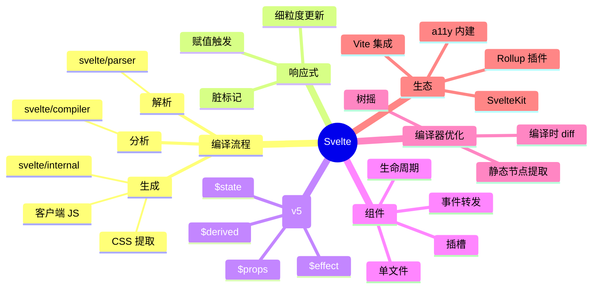

# Svelte

> 编译时框架 — Rich Harris 开源，把工作从运行时移到编译时，零运行时开销

## 一、前言

**定位**：编译时优先的 UI 框架，生成的代码是"消失的框架"

**核心价值**：
1. **零运行时** — 编译成原生 JS，没有 VDOM/diff 开销
2. **真响应式** — 用 `$:` 声明自动响应（类似 Excel 公式）
3. **包体积小** — Hello World 仅 ~2KB（React ~40KB）
4. **性能强** — 编译时静态分析，运行时无 diff
5. **写起来像 HTML** — `.svelte` 文件 = HTML + JS + CSS

**应用场景**：性能敏感的 Web 应用、嵌入式 / IoT、博客、营销页（SvelteKit）

**版本演进**：
- **Svelte 1/2**（2016-2018）— 初版，编译时框架概念验证
- **Svelte 3**（2019）— 重写 API，runes 前的稳定版本
- **Svelte 4**（2023）— 体积优化、Web 兼容性
- **Svelte 5**（2024）— 引入 Runes（$state / $derived / $effect），细粒度响应式

---

## 二、架构思维导图



---

## 三、关键代码

### 1. .svelte 文件 — 编译输入

```svelte
<!-- 文件: Counter.svelte -->
<script>
  // Svelte 5 Runes 模式
  let count = $state(0);
  let doubled = $derived(count * 2);

  $effect(() => {
    console.log('count changed:', count);
    document.title = `Count: ${count}`;
  });
</script>

<button onclick={() => count++}>
  Clicked {count} times (doubled: {doubled})
</button>

<style>
  button {
    color: tomato;  /* 编译时自动 scope */
  }
</style>
```

### 2. 编译后 — 客户端 JS（伪代码）

```js
// 文件: compiled-Counter.js (Svelte 编译产物，简化)
function create_fragment(ctx) {
  let button;
  let t0;
  let t1;
  let t2;
  let mounted;
  let dispose;

  return {
    c() {
      // create：创建 DOM
      button = element('button');
      button.textContent = '';
      t0 = text('Clicked ');
      t1 = text(/*count*/ ctx[0]);  // 动态插值
      t2 = text(' times (doubled: ');
      t3 = text(/*doubled*/ ctx[1]);
      t4 = text(')');
    },
    m(target, anchor) {
      // mount：插入 DOM
      insert(target, button, anchor);
      append(button, t0);
      append(button, t1);
      // ...
      if (!mounted) {
        dispose = [
          listen(button, 'click', /*onclick*/ ctx[2]),
        ];
        mounted = true;
      }
    },
    p(ctx, dirty) {
      // patch：脏值检查，只更新变化的
      if (dirty & /*count*/ 1) set_data(t1, /*count*/ ctx[0]);
      if (dirty & /*doubled*/ 2) set_data(t3, /*doubled*/ ctx[1]);
    },
    d(detaching) {
      // destroy
      if (detaching) detach(button);
      mounted = false;
      run_all(dispose);
    }
  };
}

function instance($$self, $$props, $$invalidate) {
  // 响应式变量
  let { $$props, $$slots } = $$props;
  let count = 0;
  let doubled = count * 2;

  function onclick() {
    $$invalidate(0, count++, count);  // 标记脏值 + 调度更新
  }

  return [count, doubled, onclick];
}
```

### 3. Runes 内部 — $state 实现

```js
// 文件: svelte/internal/client/runtime.js
function $state(initial) {
  // 1. 创建 source 节点
  const s = $.source(initial);
  // 2. 返回 getter/setter（用闭包模拟细粒度响应）
  let value = initial;
  return function get() {
    $.get(s);  // 依赖收集
    return value;
  };
}

function $derived(fn) {
  // 类似 Vue computed / Solid createMemo
  const d = $.derived(fn);
  return function get() {
    $.get(d);
    return $.get(d);  // 二次取计算结果
  };
}

// 编译后：
//   let count = $state(0);
//   // 编译为：
//   let count = $.state(0);
//   count = function() { $.get(s_count); return s_count.v; };

// 赋值 count = count + 1 编译为：
//   $.set(s_count, $.get(s_count) + 1);
```

---

## 四、核心洞察

1. **编译时 vs 运行时**：React/Vue 运行时做 diff，Svelte 编译时静态分析，运行时只更新"脏节点"
2. **真响应式 vs VDOM**：Svelte 编译器追踪每个变量的依赖，运行时直接更新对应 DOM 节点，无 diff
3. **包体积优势**：Svelte 4 hello world ~2KB，React 18 ~40KB（10x+），SvelteKit + adapter-static 适合边缘部署
4. **CSS 作用域**：编译时给每个组件 CSS 加唯一 hash（`.svelte-xyz123`），无需 BEM/CSS Modules
5. **Svelte 5 Runes 革命**：$state / $derived / $effect 借鉴 Solid.js，把"隐式响应"变"显式声明"
6. **学习曲线**：Svelte 上手最简单（HTML + JS），Runes 后复杂度略升
7. **生态局限**：相比 React/Vue 库生态小（图表/UI 库少），但够用
8. **性能基准**：Svelte 在 JS Framework Benchmark 中常居榜首（启动 + 渲染最快）

## 五、跨项目引用

- [[./react|React]] — 同样组件化，运行时差异巨大
- [[./vue|Vue]] — 都支持响应式，路径不同
- [[./solid|Solid.js]] — Svelte 5 Runes 直接借鉴 Solid 的细粒度响应式

---

**项目地址**：`G:\实战案例\GitHub顶尖项目\svelte`
**类型**：前端框架 | **Stars**: 78k+ | **License**: MIT
