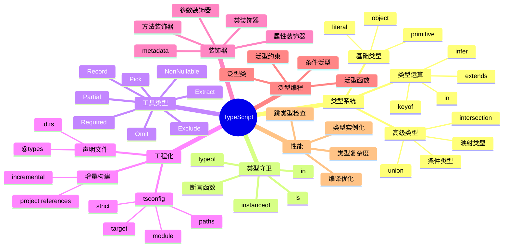

# TypeScript

> 微软开发的 JavaScript 超集 — 静态类型 + 现代语法 + 工程化能力

## 一、前言

**定位**：为 JavaScript 添加可选的静态类型系统和最新 ECMAScript 特性，编译时类型检查 + 零运行时开销（类型擦除）

**核心价值**：
1. 静态类型检查 — 编译期捕获错误，IDE 智能提示
2. 现代语法支持 — 装饰器、可选链、空值合并、Top-level await
3. 工程化基石 — 声明文件、模块解析、project references、增量构建
4. 重构友好 — 重命名、提取函数、查找引用都有类型支撑
5. 渐进式采用 — 允许 `any` 逃生，逐步迁移 JS → TS

**应用场景**：中大型前端项目、Node.js 后端、跨端框架（RN/Flutter Web）、库与 SDK 开发、Monorepo 工程

**同类对比**：

| 语言 | 类型系统 | 编译产物 | 生态 | 学习曲线 |
|------|---------|---------|------|---------|
| TypeScript | 结构化类型 | JS | 极大 | 中 |
| Flow | 结构化类型 | JS | 小 | 中 |
| JSDoc + checkJs | 注释式 | JS | 极大 | 低 |
| ReScript | 名义类型 | JS | 小 | 高 |
| Kotlin | 名义类型 | JS/JVM | 中 | 中 |

---

## 二、架构思维导图



---

## 三、关键代码

### 1. 基础类型 — primitive 与字面量

```typescript
// 基础原始类型
const str: string = "hello";
const num: number = 42;
const bool: boolean = true;
const nul: null = null;
const undef: undefined = undefined;
const sym: symbol = Symbol("key");
const big: bigint = 100n;

// 字面量类型 — 收窄到具体值
type Direction = "up" | "down" | "left" | "right";
type HttpMethod = "GET" | "POST" | "PUT" | "DELETE";
type Dice = 1 | 2 | 3 | 4 | 5 | 6;

const d: Direction = "up"; // 仅允许四个值
const roll: Dice = 7; // ❌ Type '7' is not assignable to type 'Dice'
```

### 2. 对象类型 — interface vs type

```typescript
// interface — 声明合并、面向对象
interface User {
  id: number;
  name: string;
  email?: string; // 可选
  readonly createdAt: Date; // 只读
  [key: string]: unknown; // 索引签名
}

// type — 联合、交叉、条件
type Admin = User & { permissions: string[] };
type Result<T> = { ok: true; value: T } | { ok: false; error: Error };

// 声明合并
interface User { age: number; }
const u: User = { id: 1, name: "A", age: 18, createdAt: new Date() };
```

### 3. 联合类型与类型守卫

```typescript
type Shape = Circle | Square | Triangle;
type Circle = { kind: "circle"; radius: number };
type Square = { kind: "square"; side: number };
type Triangle = { kind: "triangle"; base: number; height: number };

// 区分联合（discriminated union）— 最佳实践
function area(s: Shape): number {
  switch (s.kind) {
    case "circle": return Math.PI * s.radius ** 2;
    case "square": return s.side ** 2;
    case "triangle": return 0.5 * s.base * s.height;
  }
}

// 用户自定义类型守卫
function isCircle(s: Shape): s is Circle {
  return s.kind === "circle";
}
```

### 4. 泛型函数

```typescript
// 通用 identity
function identity<T>(value: T): T {
  return value;
}
const n = identity<number>(42);     // 显式
const s = identity("hello");         // 推断 string

// 泛型约束
interface HasLength { length: number }
function logLength<T extends HasLength>(item: T): T {
  console.log(item.length);
  return item;
}
logLength("hi");         // string 有 length
logLength([1, 2, 3]);    // array 有 length
logLength({ length: 5 });// 对象有 length
```

### 5. 异步与 Promise

```typescript
// Promise<T> 泛型
async function fetchUser(id: number): Promise<User> {
  const res = await fetch(`/api/users/${id}`);
  if (!res.ok) throw new Error(`HTTP ${res.status}`);
  return res.json() as Promise<User>;
}

// Awaited<T> — 解开 Promise
type U = Awaited<Promise<User>>; // User

// async 函数的返回值总是 Promise<T>
const f = async (): Promise<number> => 42;
type R = ReturnType<typeof f>; // Promise<number>
type V = Awaited<R>;          // number
```

### 6. 枚举 — 数字与字符串

```typescript
// 数字枚举（默认从 0 开始）
enum Direction { Up, Down, Left, Right }
const d: Direction = Direction.Up; // 0

// 字符串枚举（推荐，可读性强）
enum Status {
  Pending = "pending",
  Active = "active",
  Done = "done",
}

// 常量枚举（编译期内联，零运行时开销）
const enum LogLevel { Info, Warn, Error }
console.log(LogLevel.Info); // 编译为 0
```

### 7. 模块系统

```typescript
// ES Module 语法
export interface User { id: number; name: string; }
export type ID = string | number;
export default class UserService {}

// 命名空间导入
import * as fs from "fs";
import type { Request, Response } from "express"; // 仅类型
import { type Config, loadConfig } from "./config"; // 混合导入

// CommonJS 互操作
// tsconfig: "esModuleInterop": true
import express from "express";
```

---

## 四、TypeScript 高级类型

### 1. 联合类型（Union Types）

联合类型表示"值可以是这些类型中的任意一个"，通过 `|` 组合。

```typescript
// 简单联合
type ID = string | number;
type Status = "idle" | "loading" | "success" | "error";

// 区分联合（discriminated union）— 模式匹配核心
interface LoadingState { status: "loading" }
interface SuccessState { status: "success"; data: User[] }
interface ErrorState { status: "error"; error: Error }
type AsyncState = LoadingState | SuccessState | ErrorState;

function render(state: AsyncState) {
  switch (state.status) {
    case "loading": return "加载中...";
    case "success": return `共 ${state.data.length} 条`;
    case "error":   return `错误: ${state.error.message}`;
  }
}
```

**表格：联合类型使用场景**

| 场景 | 示例 | 收益 |
|------|------|------|
| 状态机 | loading/success/error | 编译期穷尽性检查 |
| 字符串字面量 | API 端点、事件名 | IDE 自动补全 |
| 多类型参数 | string \| number | 灵活 API |
| 可空值 | T \| null \| undefined | 显式表达"无" |

### 2. 交叉类型（Intersection Types）

交叉类型将多个类型合并为一个，常用于 mixin 和对象扩展。

```typescript
// 对象合并
type A = { a: number };
type B = { b: string };
type C = A & B; // { a: number; b: string }

// Mixin 模式
type Timestamp = { createdAt: Date; updatedAt: Date };
type SoftDeletable = { deletedAt: Date | null };
type Entity = { id: string } & Timestamp & SoftDeletable;

// 函数交叉
type Getter<T> = () => T;
type Setter<T> = (v: T) => void;
type Accessor<T> = Getter<T> & Setter<T>;

function makeAccessor<T>(initial: T): Accessor<T> {
  let v = initial;
  return () => v, (next: T) => { v = next; };
}
```

**注意**：原始类型交叉会被自动归一化 — `string & number` 等于 `never`，因为没有值同时是两者。

### 3. 条件类型（Conditional Types）

条件类型是 TypeScript 类型编程的核心，形如 `T extends U ? X : Y`。

```typescript
// 基础形式
type IsString<T> = T extends string ? true : false;
type A = IsString<"hello">; // true
type B = IsString<42>;      // false

// 实用工具
type NonNullable<T> = T extends null | undefined ? never : T;
type ReturnType<T> = T extends (...args: any[]) => infer R ? R : never;

// 分布式条件类型（Distributive）
type ToArray<T> = T extends any ? T[] : never;
type T1 = ToArray<string | number>; // string[] | number[]（分布式展开）

// 过滤联合类型
type Filter<T, U> = T extends U ? T : never;
type F = Filter<"a" | "b" | "c", "a" | "b">; // "a" | "b"
```

**表格：条件类型常用模式**

| 模式 | 形式 | 用途 |
|------|------|------|
| 类型提取 | `T extends X ? A : B` | 收窄 |
| infer 推断 | `T extends Array<infer U> ? U : never` | 解构 |
| 分布式 | `T extends any ? ...` | 联合处理 |
| 递归 | `T extends [infer H, ...infer R] ? ...` | 列表操作 |

### 4. 映射类型（Mapped Types）

映射类型基于已有类型创建新类型 — 转换键或值。

```typescript
// 基础映射
type Readonly<T> = {
  readonly [K in keyof T]: T[K];
};

type Optional<T> = {
  [K in keyof T]?: T[K];
};

// 键重映射（TypeScript 4.1+）
type Getters<T> = {
  [K in keyof T as `get${Capitalize<string & K>}`]: () => T[K];
};

interface Person { name: string; age: number; }
type PersonGetters = Getters<Person>;
// { getName: () => string; getAge: () => number }

// 过滤键
type PickByValueType<T, V> = {
  [K in keyof T as T[K] extends V ? K : never]: T[K]
};
type StringKeys = PickByValueType<Person, string>; // { name: string }
```

**表格：内置映射类型**

| 类型 | 作用 |
|------|------|
| `Partial<T>` | 全部属性可选 |
| `Required<T>` | 全部属性必填 |
| `Readonly<T>` | 全部属性只读 |
| `Pick<T, K>` | 选取键 |
| `Omit<T, K>` | 排除键 |
| `Record<K, V>` | 构造对象类型 |

### 5. infer 关键字

`infer` 在条件类型中声明一个待推断的类型变量，是类型编程的核心武器。

```typescript
// 解包 Promise
type Awaited<T> = T extends Promise<infer U> ? U : T;
type A = Awaited<Promise<string>>; // string

// 提取函数参数
type Parameters<T> = T extends (...args: infer P) => any ? P : never;
type P = Parameters<(a: number, b: string) => void>; // [number, string]

// 提取数组元素
type ElementOf<T> = T extends (infer E)[] ? E : never;
type E = ElementOf<string[]>; // string

// 提取 Promise 解包 + 数组
type DeepAwaited<T> = T extends Promise<infer U>
  ? DeepAwaited<U>
  : T extends Array<infer V>
  ? Array<DeepAwaited<V>>
  : T;

type X = DeepAwaited<Promise<string[]>>; // string[]
```

**实战案例：路由参数提取**

```typescript
type RouteParams<Path extends string> =
  Path extends `${infer _Start}:${infer Param}/${infer Rest}`
    ? { [K in Param | keyof RouteParams<`/${Rest}`>]: string }
    : Path extends `${infer _Start}:${infer Param}`
    ? { [K in Param]: string }
    : {};

type P1 = RouteParams<"/users/:id">;               // { id: string }
type P2 = RouteParams<"/users/:id/posts/:postId">; // { id: string; postId: string }
```

### 6. 模板字面量类型

```typescript
type EventName = "click" | "focus" | "blur";
type Handler = `on${Capitalize<EventName>}`; // "onClick" | "onFocus" | "onBlur"

type CSSUnit = `${number}${"px" | "em" | "rem" | "%"}`;
type Padding = `${CSSUnit} ${CSSUnit} ${CSSUnit} ${CSSUnit}`;

// 解析 URL
type ParseQuery<T extends string> =
  T extends `${infer _K}=${infer V}&${infer Rest}`
    ? { [K in _K]: V } & ParseQuery<Rest>
    : T extends `${infer _K}=${infer V}`
    ? { [K in _K]: V }
    : {};

type Q = ParseQuery<"a=1&b=2&c=3">; // { a: "1"; b: "2"; c: "3" }

---

## 五、类型守卫（Type Guards）

类型守卫是在运行时检查类型并让 TypeScript 编译器在特定代码块中将变量收窄到更精确类型的表达式。

### 1. 内置类型守卫

```typescript
// typeof — 原始类型
function padLeft(value: string, padding: string | number) {
  if (typeof padding === "number") {
    return " ".repeat(padding) + value; // padding: number
  }
  return padding + value;               // padding: string
}

// instanceof — 类实例
function logDate(d: Date | string) {
  if (d instanceof Date) {
    console.log(d.toISOString()); // d: Date
  } else {
    console.log(d.toUpperCase()); // d: string
  }
}

// in — 属性存在性
interface Bird { fly(): void; layEggs(): void }
interface Fish { swim(): void; layEggs(): void }

function move(animal: Bird | Fish) {
  if ("fly" in animal) {
    animal.fly(); // Bird
  } else {
    animal.swim(); // Fish
  }
}
```

### 2. 自定义类型谓词（is）

```typescript
interface User { id: number; name: string }
interface Admin extends User { permissions: string[] }

// 形如 `param is Type` 的返回值声明谓词
function isAdmin(user: User | Admin): user is Admin {
  return (user as Admin).permissions !== undefined;
}

function greet(user: User | Admin) {
  if (isAdmin(user)) {
    console.log(`Admin: ${user.permissions.join(", ")}`);
  } else {
    console.log(`User: ${user.name}`);
  }
}
```

### 3. 断言函数（Assertion Functions）

```typescript
// assert 形式 — 不满足时抛错，并让后续代码收窄类型
function assertDefined<T>(value: T | null | undefined, name: string): asserts value is T {
  if (value === null || value === undefined) {
    throw new Error(`${name} is required`);
  }
}

function processUser(user: User | null) {
  assertDefined(user, "user");
  // 此后 user 已被收窄为 User
  console.log(user.id, user.name);
}

// assert 后跟条件，不满足抛错但不做类型收窄
function assertTrue(condition: boolean, msg: string): asserts condition {
  if (!condition) throw new Error(msg);
}
```

### 4. 穷尽性检查（Exhaustiveness）

```typescript
type Status = "pending" | "success" | "error";

function handle(s: Status): string {
  switch (s) {
    case "pending": return "...";
    case "success": return "OK";
    case "error":   return "FAIL";
    default: {
      const _exhaustive: never = s; // ❌ 编译错误如果漏掉分支
      throw new Error(`Unknown status: ${_exhaustive}`);
    }
  }
}
```

**表格：类型守卫对比**

| 守卫 | 语法 | 适用场景 |
|------|------|---------|
| `typeof` | `typeof x === "string"` | 原始类型 |
| `instanceof` | `x instanceof Date` | 类实例 |
| `in` | `"prop" in x` | 属性存在性 |
| 自定义 `is` | `x is T` | 复杂逻辑 |
| `asserts` | `asserts x is T` | 不满足抛错 |
| 字面量相等 | `x.kind === "circle"` | 区分联合 |

---

## 六、工具类型深度

### 1. 必知必会的内置工具

```typescript
interface Todo {
  title: string;
  description: string;
  completed: boolean;
  createdAt: Date;
}

// Partial<T> — 全部可选
type PartialTodo = Partial<Todo>;
// { title?: string; description?: string; completed?: boolean; createdAt?: Date; }

// Required<T> — 全部必填（去掉 ?）
type RequiredTodo = Required<PartialTodo>;

// Readonly<T> — 全部只读
type ReadonlyTodo = Readonly<Todo>;

// Pick<T, K> — 选取键
type TodoPreview = Pick<Todo, "title" | "completed">;

// Omit<T, K> — 排除键
type TodoInfo = Omit<Todo, "completed" | "createdAt">;

// Record<K, V> — 构造对象
type TodoMap = Record<string, Todo>;
type PageRole = Record<"admin" | "user" | "guest", string[]>;

// Exclude<T, U> — 联合差集
type T1 = Exclude<"a" | "b" | "c", "a">; // "b" | "c"

// Extract<T, U> — 联合交集
type T2 = Extract<"a" | "b" | "c", "a" | "b">; // "a" | "b"

// NonNullable<T> — 去掉 null/undefined
type T3 = NonNullable<string | null | undefined>; // string
```

### 2. 工具类型的实现原理

```typescript
// 理解每个工具类型背后的映射
type MyPartial<T> = {
  [K in keyof T]?: T[K];
};

type MyRequired<T> = {
  [K in keyof T]-?: T[K]; // -? 移除可选
};

type MyReadonly<T> = {
  readonly [K in keyof T]: T[K];
};

type MyPick<T, K extends keyof T> = {
  [P in K]: T[P];
};

type MyRecord<K extends keyof any, V> = {
  [P in K]: V;
};

type MyExclude<T, U> = T extends U ? never : T;
type MyExtract<T, U> = T extends U ? T : never;
type MyNonNullable<T> = T extends null | undefined ? never : T;
```

### 3. 高级工具类型

```typescript
// DeepPartial — 递归可选
type DeepPartial<T> = T extends object
  ? { [K in keyof T]?: DeepPartial<T[K]> }
  : T;

interface NestedConfig {
  db: { host: string; port: number; auth: { user: string; pwd: string } };
  cache: { ttl: number };
}
const partial: DeepPartial<NestedConfig> = {
  db: { auth: { user: "admin" } } // 其他字段可选
};

// DeepReadonly — 递归只读
type DeepReadonly<T> = T extends object
  ? { readonly [K in keyof T]: DeepReadonly<T[K]> }
  : T;

// Mutable — 解除只读
type Mutable<T> = {
  -readonly [K in keyof T]: T[K];
};

// Nullable — 加 null
type Nullable<T> = T | null;
```

### 4. 函数工具类型

```typescript
// Parameters<T> — 提取函数参数元组
type P = Parameters<(a: number, b: string) => void>; // [number, string]

// ReturnType<T> — 提取返回类型
type R = ReturnType<() => Promise<number>>; // Promise<number>

// ConstructorParameters<T> — 构造函数参数
class Foo { constructor(public x: number, public y: string) {} }
type CP = ConstructorParameters<typeof Foo>; // [number, string]

// InstanceType<T> — 构造函数的实例类型
type I = InstanceType<typeof Foo>; // Foo

// ThisParameterType<T> / OmitThisParameter<T>
function greet(this: Window, name: string) { return `Hello, ${name}`; }
type T = ThisParameterType<typeof greet>; // Window
type G = OmitThisParameter<typeof greet>; // (name: string) => string
```

---

## 七、泛型编程

### 1. 泛型基础

```typescript
// 泛型函数
function first<T>(arr: T[]): T | undefined {
  return arr[0];
}

// 泛型接口
interface ApiResponse<T = unknown> {
  code: number;
  data: T;
  message: string;
}

// 泛型类
class Container<T> {
  private value: T;
  constructor(v: T) { this.value = v; }
  get(): T { return this.value; }
  set(v: T): void { this.value = v; }
}

// 泛型别名
type Nullable<T> = T | null;
type AsyncData<T> = { loading: boolean; data?: T; error?: Error };
```

### 2. 泛型约束

```typescript
// extends 约束
function getProperty<T, K extends keyof T>(obj: T, key: K): T[K] {
  return obj[key];
}
getProperty({ a: 1, b: "x" }, "a"); // 1

// 多重约束
interface Lengthwise { length: number }
interface Nameable { name: string }
function log<T extends Lengthwise & Nameable>(x: T): void {
  console.log(x.length, x.name);
}

// 类型参数约束
type TreeNode<T> = {
  value: T;
  children: TreeNode<T>[];
};

// keyof 约束
function pluck<T, K extends keyof T>(items: T[], key: K): T[K][] {
  return items.map(item => item[key]);
}
```

### 3. 条件泛型

```typescript
// 条件泛型 — 根据输入类型决定输出
type ApiResult<T> = T extends Error
  ? { ok: false; error: T }
  : { ok: true; data: T };

// 默认泛型
interface Pagination<T = unknown> { items: T[]; total: number }

// 条件默认值
type ApiResponse<T, E = Error> = {
  data: T;
  error: E | null;
};
```

### 4. 递归泛型

```typescript
// 深度 Readonly
type DeepReadonly<T> = {
  readonly [K in keyof T]: T[K] extends object ? DeepReadonly<T[K]> : T[K];
};

// Promise 深度解包
type DeepAwaited<T> = T extends Promise<infer U> ? DeepAwaited<U> : T;

// JSON 类型
type Json = string | number | boolean | null | Json[] | { [k: string]: Json };

// Tuple 转 Union
type TupleToUnion<T extends readonly any[]> = T[number];
type U = TupleToUnion<[string, number, boolean]>; // string | number | boolean

// 字符串字符分割
type Split<S extends string, D extends string> =
  S extends `${infer A}${D}${infer B}` ? [A, ...Split<B, D>] : [S];
type R = Split<"a,b,c", ",">; // ["a", "b", "c"]
```

### 5. 泛型与函数重载

```typescript
// 重载签名
function process(x: string): string;
function process(x: number): number;
function process(x: boolean): boolean;
function process(x: string | number | boolean): string | number | boolean {
  return x;
}

// 泛型 + 约束
function merge<T extends object, U extends object>(a: T, b: U): T & U {
  return { ...a, ...b };
}
```

---

## 八、装饰器（Decorators）

装饰器是 TypeScript 5.0 前的实验性特性（与 Stage 3 提案略有不同），用于类与成员的元编程。

### 1. 类装饰器

```typescript
// 1. 简单日志装饰器
function Logger(constructor: Function) {
  console.log(`[Logger] class created: ${constructor.name}`);
}

@Logger
class UserService {
  constructor() { console.log("UserService instantiated"); }
}

// 2. 装饰器工厂 — 接收参数
function Component(selector: string) {
  return function <T extends { new(...args: any[]): {} }>(constructor: T) {
    (constructor as any).selector = selector;
    return class extends constructor {
      // 可选：替换类
    };
  };
}

@Component("app-user")
class UserComponent {}

// 3. 替代构造函数
function WithTimestamp<T extends { new(...args: any[]): {} }>(Base: T) {
  return class extends Base {
    createdAt = new Date();
  };
}
```

### 2. 方法装饰器

```typescript
// 方法装饰器签名 (target, propertyKey, descriptor)
function Log(_target: any, propertyKey: string, descriptor: PropertyDescriptor) {
  const original = descriptor.value;
  descriptor.value = function (...args: any[]) {
    console.log(`[${propertyKey}] called with`, args);
    const result = original.apply(this, args);
    console.log(`[${propertyKey}] returned`, result);
    return result;
  };
  return descriptor;
}

class Calculator {
  @Log
  add(a: number, b: number): number {
    return a + b;
  }
}
```

### 3. 装饰器实战 — 性能监控

```typescript
// 性能监控装饰器
function Measure(target: any, key: string, descriptor: PropertyDescriptor) {
  const original = descriptor.value;
  descriptor.value = function (...args: any[]) {
    const start = performance.now();
    const result = original.apply(this, args);
    const cost = performance.now() - start;
    console.log(`${key} took ${cost.toFixed(2)}ms`);
    return result;
  };
}

// 缓存装饰器
function Memoize(target: any, key: string, descriptor: PropertyDescriptor) {
  const original = descriptor.value;
  const cache = new Map<string, any>();
  descriptor.value = function (...args: any[]) {
    const cacheKey = JSON.stringify(args);
    if (cache.has(cacheKey)) return cache.get(cacheKey);
    const result = original.apply(this, args);
    cache.set(cacheKey, result);
    return result;
  };
}

class Fibonacci {
  @Memoize
  fib(n: number): number {
    if (n < 2) return n;
    return this.fib(n - 1) + this.fib(n - 2);
  }
}
```

### 4. 属性装饰器

```typescript
function Min(limit: number) {
  return function (target: any, propertyKey: string) {
    let value: number;
    const getter = () => value;
    const setter = (newVal: number) => {
      if (newVal < limit) {
        throw new Error(`${propertyKey} must be >= ${limit}`);
      }
      value = newVal;
    };
    Object.defineProperty(target, propertyKey, { get: getter, set: setter });
  };
}

class User {
  @Min(0)
  age: number = 0;
}
```

### 5. 参数装饰器

```typescript
function Param(_target: any, _key: string, index: number) {
  console.log(`parameter at index ${index} decorated`);
}

class Service {
  greet(@Param name: string) { return `Hello, ${name}`; }
}
```

### 6. Reflect Metadata

```typescript
// tsconfig: "experimentalDecorators": true, "emitDecoratorMetadata": true
import "reflect-metadata";

function Role(role: string): MethodDecorator {
  return (target, key, descriptor: PropertyDescriptor) => {
    Reflect.defineMetadata("role", role, descriptor.value);
  };
}

class AdminService {
  @Role("admin")
  delete() {}
}
```

**表格：装饰器执行顺序**

| 装饰器 | 顺序 |
|--------|------|
| 参数 | 从右到左，从下到上 |
| 方法 | 从下到上 |
| 访问器 | 从下到上 |
| 属性 | 从下到上 |
| 类 | 从下到上 |

---

## 九、命名空间（Namespaces）

命名空间用于组织代码，避免全局污染，常见于声明文件和 SDK。

### 1. 基本语法

```typescript
// 内部模块
namespace Validation {
  export interface StringValidator { isValid(s: string): boolean }
  export class LettersOnlyValidator implements StringValidator {
    isValid(s: string) { return /^[A-Za-z]+$/.test(s); }
  }
  export class ZipCodeValidator implements StringValidator {
    isValid(s: string) { return /^\d{5}$/.test(s); }
  }
}

const v: Validation.StringValidator = new Validation.ZipCodeValidator();
```

### 2. 嵌套命名空间

```typescript
namespace App {
  export namespace Models {
    export interface User { id: number; name: string; }
    export class UserRepo {
      getById(id: number): Models.User { return { id, name: "x" }; }
    }
  }
  export namespace Services {
    export class AuthService { login() { /* ... */ } }
  }
}

const user = new App.Models.UserRepo().getById(1);
```

### 3. 别名与合并

```typescript
// 别名
import Val = Validation; // ts 特有：import = 命名空间

// 跨文件命名空间
// a.ts
namespace A { export const x = 1; }
// b.ts
/// <reference path="./a.ts" />
namespace A { export const y = 2; }
A.x; A.y; // 合并
```

---

## 十、声明文件（Declaration Files）

`.d.ts` 文件描述 JavaScript 代码的类型信息，让 JS 库获得 TS 体验。

### 1. 声明文件结构

```typescript
// types/myLib/index.d.ts
declare module "myLib" {
  export function greet(name: string): string;
  export class Logger {
    log(msg: string): void;
  }
  export const version: string;
  export default { greet, Logger, version };
}
```

### 2. UMD 声明

```typescript
// 全局 UMD 库
export as namespace myLib;
export function greet(name: string): string;
export class Logger { log(msg: string): void; }
```

### 3. 模块声明（无源文件）

```typescript
// 直接为已有 JS 写声明
declare module "*.css" {
  const content: { [className: string]: string };
  export default content;
}

declare module "*.svg" {
  const src: string;
  export default src;
}

declare module "*.png" {
  const src: string;
  export default src;
}
```

### 4. 全局声明

```typescript
// 全局变量
declare const VERSION: string;
declare function ajax(url: string, config?: any): Promise<any>;

// 全局命名空间
declare namespace MySDK {
  interface Config { apiKey: string; }
  function init(c: Config): void;
}

// 全局类
declare class ExternalWidget {
  constructor(el: HTMLElement);
  render(): void;
}
```

### 5. DefinitelyTyped 与 @types

```bash
# 安装社区维护的类型定义
npm i -D @types/react @types/node @types/lodash

# 自有包发布类型
# 1. 与 npm 包同源（types 字段）
{
  "name": "my-lib",
  "types": "dist/index.d.ts",
  "main": "dist/index.js"
}

# 2. DefinitelyTyped 仓库（社区贡献）
# types/my-lib/index.d.ts 提交到 DefinitelyTyped
```

### 6. 编写高质量声明文件

```typescript
// 1. 使用泛型提升复用性
declare function get<T>(url: string): Promise<T>;

// 2. 准确的函数重载
declare function parse(s: string): object;
declare function parse<T>(s: string, reviver: (k: string, v: any) => T): T;

// 3. 完整的命名空间和模块
declare namespace MyLib {
  export interface Options { debug?: boolean }
  export class Client {
    constructor(opts: Options);
    request<T = unknown>(path: string): Promise<T>;
  }
}
```

---

## 十一、TypeScript 与 React 集成

### 1. 组件类型

```typescript
import { FC, ReactNode, PropsWithChildren, ReactElement } from "react";

// 函数组件：FC<P> 或 直接 (props: P) => ReactElement
interface ButtonProps {
  onClick: () => void;
  disabled?: boolean;
  children: ReactNode;
}

const Button: FC<ButtonProps> = ({ onClick, disabled, children }) => (
  <button onClick={onClick} disabled={disabled}>{children}</button>
);

// PropsWithChildren — 自动包含 children
const Card: FC<PropsWithChildren<{ title: string }>> = ({ title, children }) => (
  <div><h2>{title}</h2>{children}</div>
);
```

### 2. Hooks 类型

```typescript
import { useState, useEffect, useRef, useMemo, useCallback } from "react";

// useState — 显式类型或自动推断
const [count, setCount] = useState(0);              // number
const [user, setUser] = useState<User | null>(null); // User | null

// useRef — 可变引用
const inputRef = useRef<HTMLInputElement>(null);
inputRef.current?.focus();

// useEffect — 自动推断清理函数
useEffect(() => {
  const id = setInterval(() => console.log("tick"), 1000);
  return () => clearInterval(id); // 推断为 () => void
}, []);

// 自定义 Hook
function useLocalStorage<T>(key: string, initial: T): [T, (v: T) => void] {
  const [value, setValue] = useState<T>(() => {
    const stored = localStorage.getItem(key);
    return stored ? JSON.parse(stored) : initial;
  });
  useEffect(() => {
    localStorage.setItem(key, JSON.stringify(value));
  }, [key, value]);
  return [value, setValue];
}
```

### 3. 事件类型

```typescript
// 鼠标事件
const handleClick = (e: React.MouseEvent<HTMLButtonElement>) => { /* ... */ };

// 输入事件
const handleChange = (e: React.ChangeEvent<HTMLInputElement>) => {
  console.log(e.target.value);
};

// 表单提交
const handleSubmit = (e: React.FormEvent<HTMLFormElement>) => {
  e.preventDefault();
};

// 键盘事件
const handleKeyDown = (e: React.KeyboardEvent<HTMLInputElement>) => {
  if (e.key === "Enter") { /* ... */ }
};
```

### 4. 泛型组件

```typescript
// 列表组件 — 泛型
interface ListProps<T> {
  items: T[];
  renderItem: (item: T) => ReactNode;
  keyExtractor: (item: T) => string;
}

function List<T>({ items, renderItem, keyExtractor }: ListProps<T>) {
  return (
    <ul>
      {items.map(item => (
        <li key={keyExtractor(item)}>{renderItem(item)}</li>
      ))}
    </ul>
  );
}

// 使用
<List<User>
  items={users}
  renderItem={u => <span>{u.name}</span>}
  keyExtractor={u => String(u.id)}
/>
```

### 5. forwardRef 与 useImperativeHandle

```typescript
import { forwardRef, useImperativeHandle, useRef } from "react";

interface InputRef { focus: () => void; clear: () => void; }
interface InputProps { placeholder?: string }

const FancyInput = forwardRef<InputRef, InputProps>((props, ref) => {
  const inputRef = useRef<HTMLInputElement>(null);
  useImperativeHandle(ref, () => ({
    focus: () => inputRef.current?.focus(),
    clear: () => { if (inputRef.current) inputRef.current.value = ""; },
  }));
  return <input ref={inputRef} placeholder={props.placeholder} />;
});
```

### 6. Context 类型

```typescript
import { createContext, useContext, ReactNode } from "react";

interface AuthState { user: User | null; login: () => void; logout: () => void; }
const AuthContext = createContext<AuthState | null>(null);

function useAuth(): AuthState {
  const ctx = useContext(AuthContext);
  if (!ctx) throw new Error("useAuth must be inside <AuthProvider>");
  return ctx;
}

function AuthProvider({ children }: { children: ReactNode }) {
  const [user, setUser] = useState<User | null>(null);
  return (
    <AuthContext.Provider value={{
      user, login: () => setUser({ id: 1, name: "x" }),
      logout: () => setUser(null),
    }}>{children}</AuthContext.Provider>
  );
}
```

### 7. HOC 与 Render Props

```typescript
// HOC
function withLoading<P extends object>(
  Component: React.ComponentType<P>
): React.FC<P & { loading: boolean }> {
  return ({ loading, ...props }) =>
    loading ? <div>Loading...</div> : <Component {...(props as P)} />;
}

// Render Props
interface MouseTrackerProps {
  render: (pos: { x: number; y: number }) => ReactNode;
}
const MouseTracker: FC<MouseTrackerProps> = ({ render }) => {
  const [pos, setPos] = useState({ x: 0, y: 0 });
  return <div onMouseMove={e => setPos({ x: e.clientX, y: e.clientY })}>
    {render(pos)}
  </div>;
};

// Render Props 类型
interface MouseTrackerProps2 {
  children: (pos: { x: number; y: number }) => ReactNode;
}
const MouseTracker2: FC<MouseTrackerProps2> = ({ children }) => {
  const [pos, setPos] = useState({ x: 0, y: 0 });
  return <div onMouseMove={e => setPos({ x: e.clientX, y: e.clientY })}>
    {children(pos)}
  </div>;
};
```

---

## 十二、性能优化

### 1. 编译性能

```jsonc
// tsconfig.json 性能关键选项
{
  "compilerOptions": {
    "incremental": true,                  // 增量编译
    "tsBuildInfoFile": "./node_modules/.cache/tsbuildinfo",  // 缓存目录
    "skipLibCheck": true,                 // 跳过 d.ts 检查（重要！）
    "isolatedModules": true,              // 单文件转译（ESBuild/SWC 必需）
    "composite": true,                    // 项目引用
    "assumeChangesOnlyAffectDirectDependencies": true,  // 假设改动只影响直接依赖
  }
}
```

**表格：性能选项影响**

| 选项 | 提速 | 风险 |
|------|------|------|
| `skipLibCheck: true` | 大 | 类型 bug 隐藏（一般安全） |
| `incremental: true` | 中 | 需清理缓存 |
| `isolatedModules` | 编译加速 | 限制部分类型操作 |
| `disableSourceOfProjectReferenceRedirect` | 中 | 需手动管理 |
| `assumeChangesOnlyAffectDirectDependencies` | 大 | 误判需 `--force` |

### 2. 避免类型实例化爆炸

```typescript
// ❌ 反模式 — 递归展开导致性能崩溃
type Path<T, K extends keyof T = keyof T> =
  K extends K
  ? T[K] extends object
    ? T[K] | `${K & string}.${Path<T[K]>}`
    : `${K & string}`
  : never;

// ✅ 限制深度
type Path<T, Depth extends number[] = []> =
  Depth["length"] extends 5
    ? never
    : T extends object
    ? { [K in keyof T]: `${K & string}${T[K] extends object ? `.${Path<T[K], [...Depth, 0]>}` : ""}` }[keyof T]
    : never;
```

### 3. 类型复杂度优化技巧

```typescript
// 1. 避免联合类型过度展开
// ❌ 慢
type AllKeys<T> = T extends any ? keyof T : never;
type R1 = AllKeys<A | B | C | D>; // O(联合大小)

// ✅ 快
type AllKeysAlt<T> = keyof T;

// 2. 缓存中间类型
type A = SomeHugeUnion;
type B = SomeOp<A>;
type C = SomeOp<B>; // 引用 B 而不是重新计算
```

### 4. 项目引用（Project References）

```jsonc
// packages/core/tsconfig.json
{
  "compilerOptions": {
    "composite": true,
    "declaration": true,
    "outDir": "./dist"
  },
  "include": ["src"]
}

// packages/app/tsconfig.json
{
  "references": [{ "path": "../core" }],
  "include": ["src"]
}

// 根 tsconfig.json
{
  "files": [],
  "references": [
    { "path": "./packages/core" },
    { "path": "./packages/app" }
  ]
}
```

```bash
# 仅构建引用的项目
tsc --build

# 监听模式
tsc --build --watch
```

### 5. 类型跳过技巧

```typescript
// 1. 类型断言（最后手段）
const data = JSON.parse(raw) as User;

// 2. 双重断言
const x = (input as any) as User;

// 3. // @ts-expect-error — 必须有错误才能用
// @ts-expect-error: 第三方库类型有 bug
import { SomeType } from "bad-lib";

// 4. declare module 增强
declare module "bad-lib" {
  export function fixed(): void;
}
```

### 6. 编译时性能诊断

```bash
# 1. 启用诊断
tsc --diagnostics

# 2. 详细输出
tsc --extendedDiagnostics

# 3. 仅类型检查（不生成文件）
tsc --noEmit

# 4. 单独检查文件
tsc --noEmit src/problem-file.ts
```

**表格：编译性能瓶颈**

| 现象 | 原因 | 解决方案 |
|------|------|---------|
| 内存爆掉 | 联合类型过大 | 拆分类型 |
| 编译慢 5x+ | 递归类型 | 加深度限制 |
| .d.ts 错误 | skipLibCheck 关闭 | 开启 |
| 大项目全量 | 没用 incremental | 开启增量 |
| Monorepo 卡 | 没用 project references | 配置引用 |

---

## 十三、编译选项（tsconfig.json）

### 1. 核心配置

```jsonc
{
  "compilerOptions": {
    // 目标与模块
    "target": "ES2022",            // 编译目标
    "module": "ESNext",            // 模块系统
    "moduleResolution": "Bundler", // 解析策略
    "lib": ["ES2022", "DOM"],      // 包含的库
    "jsx": "react-jsx",            // JSX 模式

    // 严格性
    "strict": true,                // 总开关
    "noImplicitAny": true,
    "strictNullChecks": true,      // null/undefined 严格区分
    "strictFunctionTypes": true,
    "strictBindCallApply": true,
    "strictPropertyInitialization": true,
    "noImplicitThis": true,
    "useUnknownInCatchVariables": true,
    "alwaysStrict": true,

    // 模块解析
    "esModuleInterop": true,
    "allowSyntheticDefaultImports": true,
    "forceConsistentCasingInFileNames": true,
    "resolveJsonModule": true,

    // 输出
    "outDir": "./dist",
    "rootDir": "./src",
    "sourceMap": true,
    "declaration": true,
    "declarationMap": true,

    // 性能
    "incremental": true,
    "skipLibCheck": true,
    "isolatedModules": true,

    // 体验
    "noUnusedLocals": true,
    "noUnusedParameters": true,
    "noFallthroughCasesInSwitch": true,
    "noImplicitReturns": true,
    "noUncheckedIndexedAccess": true,  // 数组越界返回 undefined
    "exactOptionalPropertyTypes": true // 严格可选属性
  }
}
```

### 2. 路径映射

```jsonc
{
  "compilerOptions": {
    "baseUrl": ".",
    "paths": {
      "@/*": ["src/*"],
      "@components/*": ["src/components/*"],
      "@utils/*": ["src/utils/*"]
    }
  }
}
```

### 3. 严格模式详解

```typescript
// strictNullChecks — null 与 undefined 严格区分
function f(x: string | null) {
  console.log(x.toUpperCase());  // ❌ 可能是 null
  if (x !== null) {
    console.log(x.toUpperCase()); // ✅ 收窄为 string
  }
}

// noUncheckedIndexedAccess — arr[i] 推断为 T | undefined
const arr = [1, 2, 3];
const item = arr[10]; // number | undefined
if (item !== undefined) {
  console.log(item * 2); // ✅ number
}

// exactOptionalPropertyTypes
interface Cfg { name?: string }
const c1: Cfg = { name: "x" };      // ✅
const c2: Cfg = { name: undefined }; // ❌ exactOptionalPropertyTypes 开启时
```

### 4. 实用编译选项

```jsonc
{
  "compilerOptions": {
    // 检查时机
    "noEmit": true,                  // 只检查不输出（CI 用）

    // 互操作
    "allowJs": true,                 // 允许 .js 文件
    "checkJs": false,                // 是否检查 .js

    // 装饰器
    "experimentalDecorators": true,
    "emitDecoratorMetadata": true,

    // 类型根
    "typeRoots": ["./node_modules/@types", "./types"],

    "types": ["node", "jest"],

    // 跳过文件
    "exclude": ["node_modules", "dist"]
  },
  "include": ["src/**/*"]
}
```

---

## 十四、工程实践

### 1. 项目结构

```
src/
├── types/                  # 全局类型
│   ├── env.d.ts            # 环境变量声明
│   └── api.d.ts            # API 响应类型
├── utils/                  # 工具函数
│   ├── index.ts
│   └── validation.ts
├── hooks/                  # React Hooks
├── components/             # 业务组件
├── services/               # 业务服务
│   ├── api.ts
│   └── auth.ts
├── store/                  # 状态管理
├── constants/              # 常量
├── config/                 # 配置
└── App.tsx
```

### 2. ESLint 集成

```jsonc
// .eslintrc.json
{
  "extends": [
    "eslint:recommended",
    "plugin:@typescript-eslint/recommended",
    "plugin:@typescript-eslint/recommended-requiring-type-checking"
  ],
  "parser": "@typescript-eslint/parser",
  "parserOptions": {
    "project": "./tsconfig.json"
  },
  "rules": {
    "@typescript-eslint/no-explicit-any": "warn",
    "@typescript-eslint/no-unused-vars": "error",
    "@typescript-eslint/explicit-function-return-type": "off",
    "@typescript-eslint/no-floating-promises": "error",
    "@typescript-eslint/await-thenable": "error",
    "@typescript-eslint/no-misused-promises": "error"
  }
}
```

### 3. 常用代码规范

```typescript
// 1. 显式标注 public API 返回类型
export function fetchUser(id: number): Promise<User> { /* ... */ }

// 2. 避免 any，使用 unknown + 类型守卫
function process(data: unknown): User {
  if (isUser(data)) return data;
  throw new Error("Invalid data");
}

// 3. 命名空间、枚举用 PascalCase
enum OrderStatus { Pending, Shipped, Delivered }

// 4. 类型导入用 import type
import type { User, Post } from "./models";

// 5. 工具类型集中管理
// src/types/utils.ts
export type Nullable<T> = T | null;
export type Optional<T> = { [K in keyof T]?: T[K] };
```

### 4. 类型生成自动化

```bash
# OpenAPI → TS 类型
npx openapi-typescript ./openapi.yaml -o ./src/types/api.d.ts

# GraphQL → TS
npx graphql-codegen

# Prisma → TS
npx prisma generate
```

### 5. 提交前检查

```jsonc
// package.json
{
  "scripts": {
    "typecheck": "tsc --noEmit",
    "lint": "eslint src --ext .ts,.tsx",
    "pre-commit": "pnpm typecheck && pnpm lint"
  }
}
```

### 6. 错误处理规范

```typescript
// 1. Result 类型代替抛错
type Result<T, E = Error> = { ok: true; value: T } | { ok: false; error: E };

function parseUser(input: string): Result<User> {
  try {
    return { ok: true, value: JSON.parse(input) };
  } catch (e) {
    return { ok: false, error: e as Error };
  }
}

// 2. 类型化 Error
class AppError extends Error {
  constructor(public code: string, message: string, public status: number = 500) {
    super(message);
    this.name = "AppError";
  }
}

// 3. 全局错误捕获
window.addEventListener("unhandledrejection", (event) => {
  console.error("Unhandled:", event.reason);
});
```

---

## 十五、真实案例

### 案例 1：API 客户端完整类型化

```typescript
// src/api/client.ts
interface RequestConfig {
  url: string;
  method: "GET" | "POST" | "PUT" | "DELETE" | "PATCH";
  params?: Record<string, string | number>;
  data?: unknown;
  headers?: Record<string, string>;
  signal?: AbortSignal;
}

class ApiError extends Error {
  constructor(public status: number, public body: unknown, message: string) {
    super(message);
    this.name = "ApiError";
  }
}

async function request<T = unknown>(config: RequestConfig): Promise<T> {
  const { url, method, params, data, headers, signal } = config;
  const qs = params ? "?" + new URLSearchParams(params as Record<string, string>).toString() : "";
  const res = await fetch(url + qs, {
    method,
    headers: { "Content-Type": "application/json", ...headers },
    body: data ? JSON.stringify(data) : undefined,
    signal,
  });
  if (!res.ok) {
    const body = await res.text();
    throw new ApiError(res.status, body, `HTTP ${res.status}`);
  }
  return res.json() as Promise<T>;
}

// 类型化端点
interface Endpoints {
  "GET /users": { params: { page: number }; response: User[] };
  "GET /users/:id": { params: { id: number }; response: User };
  "POST /users": { body: Omit<User, "id">; response: User };
  "DELETE /users/:id": { params: { id: number }; response: void };
}

type Method = "GET" | "POST" | "PUT" | "DELETE" | "PATCH";
type ParsePath<P extends string> =
  P extends `${Method} ${infer _}` ? _ : never;

function api<K extends keyof Endpoints>(endpoint: K, opts: Endpoints[K] extends { params: infer P } ? P : never extends never ? {} : Endpoints[K]): Promise<Endpoints[K]["response"]> {
  // 实现
  return request({} as any);
}
```

### 案例 2：Redux Toolkit 完整模式

```typescript
import { createSlice, PayloadAction, createAsyncThunk } from "@reduxjs/toolkit";

interface Todo { id: string; text: string; done: boolean }
interface TodosState { items: Todo[]; loading: boolean; error: string | null }

// 异步 thunk
export const fetchTodos = createAsyncThunk<Todo[], void, { rejectValue: string }>(
  "todos/fetch",
  async (_, { rejectWithValue }) => {
    try {
      const res = await fetch("/api/todos");
      if (!res.ok) return rejectWithValue(`HTTP ${res.status}`);
      return await res.json();
    } catch (e) {
      return rejectWithValue((e as Error).message);
    }
  }
);

const todosSlice = createSlice({
  name: "todos",
  initialState: { items: [], loading: false, error: null } as TodosState,
  reducers: {
    addTodo: (state, action: PayloadAction<Omit<Todo, "id">>) => {
      state.items.push({ id: crypto.randomUUID(), ...action.payload });
    },
    toggle: (state, action: PayloadAction<string>) => {
      const t = state.items.find(x => x.id === action.payload);
      if (t) t.done = !t.done;
    },
  },
  extraReducers: (builder) => {
    builder
      .addCase(fetchTodos.pending, (s) => { s.loading = true; })
      .addCase(fetchTodos.fulfilled, (s, a) => {
        s.loading = false; s.items = a.payload;
      })
      .addCase(fetchTodos.rejected, (s, a) => {
        s.loading = false; s.error = a.payload ?? "Unknown";
      });
  },
});
```

### 案例 3：类型化事件总线

```typescript
// src/utils/eventBus.ts
type EventMap = {
  "user:login": { userId: string };
  "user:logout": undefined;
  "cart:add": { productId: string; qty: number };
  "order:placed": { orderId: string; amount: number };
};

type EventKey = keyof EventMap;
type Handler<K extends EventKey> = (payload: EventMap[K]) => void;

class EventBus {
  private listeners: { [K in EventKey]?: Set<Handler<K>> } = {};

  on<K extends EventKey>(event: K, handler: Handler<K>): () => void {
    if (!this.listeners[event]) this.listeners[event] = new Set() as any;
    (this.listeners[event] as Set<Handler<K>>).add(handler);
    return () => this.off(event, handler);
  }

  off<K extends EventKey>(event: K, handler: Handler<K>): void {
    (this.listeners[event] as Set<Handler<K>> | undefined)?.delete(handler);
  }

  emit<K extends EventKey>(event: K, payload: EventMap[K]): void {
    (this.listeners[event] as Set<Handler<K>> | undefined)?.forEach(h => h(payload));
  }
}

export const bus = new EventBus();

// 使用
bus.on("user:login", ({ userId }) => console.log("login", userId));
bus.emit("user:logout", undefined);
bus.emit("cart:add", { productId: "1", qty: 2 });
```

### 案例 4：表单库类型化

```typescript
import { useState, ChangeEvent, FormEvent } from "react";

type FormErrors<T> = Partial<Record<keyof T, string>>;
type Validator<T> = (values: T) => FormErrors<T>;

function useForm<T extends Record<string, any>>(
  initial: T,
  validator: Validator<T>
) {
  const [values, setValues] = useState<T>(initial);
  const [errors, setErrors] = useState<FormErrors<T>>({});
  const [touched, setTouched] = useState<Partial<Record<keyof T, boolean>>>({});

  const handleChange = <K extends keyof T>(field: K) =>
    (e: ChangeEvent<HTMLInputElement | HTMLTextAreaElement>) => {
      setValues(v => ({ ...v, [field]: e.target.value }));
    };

  const handleBlur = (field: keyof T) => () => {
    setTouched(t => ({ ...t, [field]: true }));
    setErrors(validator(values));
  };

  const handleSubmit = (onSubmit: (v: T) => void | Promise<void>) =>
    async (e: FormEvent) => {
      e.preventDefault();
      const errs = validator(values);
      setErrors(errs);
      if (Object.keys(errs).length === 0) await onSubmit(values);
    };

  return { values, errors, touched, handleChange, handleBlur, handleSubmit, setValues };
}

interface LoginForm { email: string; password: string }
const { values, handleChange, handleSubmit } = useForm<LoginForm>(
  { email: "", password: "" },
  (v) => ({
    email: v.email.includes("@") ? undefined : "邮箱不合法",
    password: v.password.length >= 6 ? undefined : "密码太短",
  })
);
```

### 案例 5：TypeScript 与 Node.js

```typescript
// src/server.ts
import http from "node:http";
import { readFile } from "node:fs/promises";
import { join, extname } from "node:path";

const PORT = Number(process.env.PORT) || 3000;
const MIME: Record<string, string> = {
  ".html": "text/html",
  ".css": "text/css",
  ".js": "application/javascript",
  ".json": "application/json",
};

const server = http.createServer(async (req, res) => {
  try {
    if (!req.url) throw new Error("no url");
    const path = req.url === "/" ? "/index.html" : req.url;
    const file = await readFile(join("./public", path));
    res.setHeader("Content-Type", MIME[extname(path)] ?? "application/octet-stream");
    res.end(file);
  } catch (e) {
    res.statusCode = 404;
    res.end("Not Found");
  }
});

server.listen(PORT, () => console.log(`http://localhost:${PORT}`));
```

### 案例 6：装饰器实战 — DI 容器

```typescript
// 简易依赖注入
const INJECTIONS = new Map<string, any>();

function Inject(token: string) {
  return (target: any, key: string) => {
    Object.defineProperty(target, key, {
      get: () => INJECTIONS.get(token),
    });
  };
}

function Service(token: string) {
  return (constructor: Function) => {
    const instance = new (constructor as any)();
    INJECTIONS.set(token, instance);
  };
}

@Service("logger")
class Logger {
  log(msg: string) { console.log(msg); }
}

class UserService {
  @Inject("logger")
  logger!: Logger;

  createUser(name: string) {
    this.logger.log(`creating user: ${name}`);
  }
}
```

---

## 十六、常见面试题

### Q1：interface vs type 区别？

| 维度 | interface | type |
|------|-----------|------|
| 合并 | 支持声明合并 | 不支持 |
| 联合/交叉 | 不支持 | 支持 |
| 映射类型 | 不支持 | 支持 |
| 索引签名 | 支持 | 支持 |
| 性能 | 更优（编译器优化） | 较慢 |
| 用途 | 对象形状、面向对象 | 工具类型、联合 |

**实战建议**：描述对象用 interface，工具类型用 type。

### Q2：any vs unknown 区别？

```typescript
// any — 完全跳过类型检查
const a: any = "x";
a.foo.bar.baz; // ✅ 编译通过，运行可能崩

// unknown — 类型安全的 any
const u: unknown = "x";
u.foo;          // ❌ Object is of type 'unknown'
if (typeof u === "string") u.toUpperCase(); // ✅ 收窄后可用

// unknown 是 any 的安全替代品
function process(value: unknown) {
  if (value instanceof Date) value.toISOString();
}
```

### Q3：什么是协变与逆变？

```typescript
// 协变（Covariant） — 子类型关系保持方向
// Animal → Cat，则 List<Animal> → List<Cat>
type Animal = { name: string };
type Cat = Animal & { meow(): void };
const cats: Cat[] = [];
const animals: Animal[] = cats; // ✅ 数组协变

// 逆变（Contravariant） — 子类型关系反转
// 用在函数参数位置
type Handler<T> = (x: T) => void;
let catHandler: Handler<Cat> = (c) => c.meow();
let animalHandler: Handler<Animal> = catHandler; // ✅ Handler<Animal> 是 Handler<Cat> 的子类型

// TS 函数参数默认 bivariant（双向协变）
// strictFunctionTypes: true 开启后参数变逆变
```

### Q4：如何实现 DeepReadonly？

```typescript
// 递归版本
type DeepReadonly<T> = {
  readonly [K in keyof T]: T[K] extends (infer U)[]
    ? DeepReadonly<U>[]
    : T[K] extends object
    ? DeepReadonly<T[K]>
    : T[K];
};

// 限制深度版本（防类型爆炸）
type DeepReadonly2<T, Depth extends any[] = []> = Depth["length"] extends 5
  ? T
  : T extends object
  ? { readonly [K in keyof T]: DeepReadonly2<T[K], [...Depth, 0]> }
  : T;
```

### Q5：什么是声明合并？

```typescript
// interface 多次声明自动合并
interface Box { height: number }
interface Box { width: number }
const b: Box = { height: 1, width: 2 }; // ✅

// 命名空间 + 接口
interface Lib { version: string }
namespace Lib {
  export const v = "1.0";
}

// 合并冲突：非函数属性必须类型一致
// 函数重载：合并时取并集
```

### Q6：keyof 和 typeof 区别？

```typescript
// keyof — 类型的键联合
type K = keyof { a: 1; b: 2 }; // "a" | "b"

// typeof — 值的类型
const config = { api: "/v1", timeout: 5000 };
type Config = typeof config; // { api: string; timeout: number }

// 组合
type ConfigKey = keyof typeof config; // "api" | "timeout"
```

### Q7：never 类型的使用场景？

```typescript
// 1. 穷尽性检查
function f(x: "a" | "b") {
  switch (x) {
    case "a": return 1;
    case "b": return 2;
    default: const _: never = x; // 漏 case 时报错
  }
}

// 2. 函数返回类型（永不到达）
function throwError(msg: string): never {
  throw new Error(msg);
}

// 3. 联合类型穷尽
type Exclude<T, U> = T extends U ? never : T;
```

### Q8：如何为已有 JS 模块添加类型？

```typescript
// 1. 创建 types/xxx.d.ts
declare module "xxx" {
  export function f(x: string): void;
}

// 2. 在 tsconfig 中加 typeRoots 或 include

// 3. 函数级声明
declare function globalFn(x: number): string;

// 4. 全局变量
declare const MY_GLOBAL: string;
```

### Q9：泛型约束 vs 默认值？

```typescript
// 约束（必须满足）
function f<T extends number>(x: T) { return x * 2; }

// 默认值（可选）
function g<T = string>(x: T) { return x; }

// 组合
function h<T extends number = number>(x: T) { return x; }
```

### Q10：协变与逆变在 TS 中如何体现？

```typescript
// strictFunctionTypes: false（默认） — bivariant
// strictFunctionTypes: true — 参数逆变

interface Animal { name: string }
interface Dog extends Animal { bark(): void }

type Callback<T> = (t: T) => void;
let dogCb: Callback<Dog> = (d) => d.bark();
let animalCb: Callback<Animal> = dogCb; // ✅ 逆变
// 反之不允许：let dogCb2: Callback<Dog> = animalCb; // ❌
```

### Q11：TypeScript 5.0 新特性？

```typescript
// 1. const 类型参数
function identity<const T>(x: T) { return x; }
const arr = identity([1, 2, 3]); // readonly [1, 2, 3] 而非 number[]

// 2. 多重 extends 简写
type T = A extends B ? C : D; // 之前
// type T = A extends (B extends C ? D : E) ? F : G; // 多重复杂

// 3. 装饰器标准化（Stage 3）
// 4. satisfies 关键字
const palette = { red: [255, 0, 0] } satisfies Record<string, readonly number[]>;
// palette.red 是 [255, 0, 0]，而不是 readonly number[]
```

### Q12：satisfies vs as 区别？

```typescript
// as — 类型断言（强制）
const x = "1" as number; // ❌ 但不报错
const y = "1" as unknown as number; // 强制

// satisfies — 满足类型检查但保留推断
const colors = { red: "#f00", blue: "#00f" } satisfies Record<string, `#${string}`>;
// colors.red 类型仍是 "#f00"，不是 string
```


---

## 十七、踩坑指南

### 踩坑 1：strictNullChecks 的 NPE 之痛

```typescript
// 场景：嵌套对象属性访问
interface User { profile?: { avatar?: { url: string } } }
const user: User = {};

// ❌ 编译报错
const url = user.profile.avatar.url;

// ✅ 解决：可选链
const url2 = user.profile?.avatar?.url ?? "/default.png";

// ✅ 解决：非空断言（不推荐，可能崩）
const url3 = user.profile!.avatar!.url;
```

### 踩坑 2：React 组件 children 类型

```typescript
// ❌ 错误
function Card({ children }: { children: string }) {
  return <div className="card">{children}</div>;
}
<Card>
  <h1>标题</h1>  // ❌ children 不是 string
</Card>

// ✅ 解决：children: ReactNode
function Card2({ children }: { children: React.ReactNode }) {
  return <div className="card">{children}</div>;
}
```

### 踩坑 3：枚举的运行时开销

```typescript
// ❌ 数字枚举编译后是对象
enum Status { Active, Inactive }
console.log(Status.Active); // 0 — 但有反向映射
console.log(Status[0]);     // "Active" — 反向查找

// ✅ 推荐：使用字符串字面量联合
type Status2 = "active" | "inactive";
const s: Status2 = "active"; // 零运行时

// ✅ 真正需要枚举时：用 const enum
const enum Color { Red, Green, Blue }
const c: Color = Color.Red; // 编译期内联
```

### 踩坑 4：this 上下文丢失

```typescript
// ❌ 错误
class Counter {
  count = 0;
  increment() { this.count++; }
  start() {
    setInterval(function() { this.increment(); }, 1000);
    // 这里的 this 在严格模式下是 undefined
  }
}

// ✅ 解决 1：箭头函数
start() {
  setInterval(() => this.increment(), 1000);
}

// ✅ 解决 2：bind
start() {
  setInterval(function() { this.increment(); }.bind(this), 1000);
}
```

### 踩坑 5：泛型推断失败

```typescript
// 场景：函数返回类型依赖参数，TS 推断不出
function zip<T, U>(a: T[], b: U[]): Array<[T, U]> {
  return a.map((x, i) => [x, b[i]]);
}

// ❌ 返回类型推断为 Array<[T, any]>
const z = zip([1, 2], ["a", "b"]); // Array<[number, string]> ✅

// ❌ 推断失败时显式标注
const z2 = zip<number, string>([1, 2], ["a", "b"]);
```

### 踩坑 6：模块解析失败

```typescript
// 错误：Cannot find module 'foo' or its corresponding type declarations
// 解决 1：安装 @types/foo
// npm i -D @types/foo

// 解决 2：模块声明
// types/foo.d.ts
declare module "foo" {
  export const bar: string;
}

// 解决 3：paths 映射
// tsconfig.json
{
  "compilerOptions": {
    "paths": {
      "@/components/*": ["src/components/*"]
    }
  }
}
```

### 踩坑 7：useEffect 依赖数组

```typescript
// ❌ 依赖项不完整
const [count, setCount] = useState(0);
useEffect(() => {
  document.title = `Count: ${count}`;
}, []); // 警告：缺少 count

// ✅ 补全依赖
useEffect(() => {
  document.title = `Count: ${count}`;
}, [count]);

// ❌ 引用了外部变量
const options = { name: "x" };
useEffect(() => {
  fetchData(options);
}, []); // 警告：options 是新建对象

// ✅ 提取依赖
const name = "x";
useEffect(() => {
  fetchData({ name });
}, [name]);
```

### 踩坑 8：Promise 错误吞噬

```typescript
// ❌ 静默失败
async function loadData() {
  try {
    const data = await fetch("/api");
    return data;
  } catch (e) {
    console.log(e); // 没向上抛
  }
}

// ✅ 显式返回或重抛
async function loadData2(): Promise<Data> {
  const res = await fetch("/api");
  if (!res.ok) throw new Error(`HTTP ${res.status}`);
  return res.json();
}
```

### 踩坑 9：交叉类型与同名属性

```typescript
// ❌ 冲突
type A = { x: number };
type B = { x: string };
type C = A & B; // { x: number & string } = { x: never }

// 实际使用会报错
const c: C = { x: 1 }; // ❌ Type 'number' is not assignable to type 'never'
```

### 踩坑 10：可选属性与 undefined

```typescript
interface Config { debug?: boolean }
const c: Config = { debug: undefined }; // 默认允许

// exactOptionalPropertyTypes: true 后
const c2: Config = { debug: undefined }; // ❌

// ✅ 解决
const c3: Config = {}; // 省略属性
const c4: Config = { debug: true };
```

### 踩坑 11：递归类型爆栈

```typescript
// ❌ 死循环
type Infinite<T> = T extends object ? { [K in keyof T]: Infinite<T[K]> } : T;

// ✅ 加深度限制
type BoundedDeep<T, N extends number[] = []> =
  N["length"] extends 10 ? T :
  T extends object ? { [K in keyof T]: BoundedDeep<T[K], [...N, 0]> } : T;
```

### 踩坑 12：第三方库类型缺失

```bash
# 1. 安装 @types 包
npm i -D @types/lodash

# 2. 没有 @types 时，编写本地声明
# types/external-lib.d.ts
declare module "external-lib" {
  export function someMethod(x: string): number;
}

# 3. tsconfig.json 包含声明
{
  "include": ["src/**/*", "types/**/*"]
}
```

### 踩坑 13：import 类型与值的混淆

```typescript
// ❌ 错误：混入 import 值，编译报错
import { User, fetchUser } from "./api";
// User 编译时擦除，但 import 还会打包
const u: User = { id: 1, name: "x" };

// ✅ 显式 type import
import { fetchUser } from "./api";
import type { User } from "./api";
```

### 踩坑 14：枚举与字面量混淆

```typescript
enum Color { Red, Green }
type ColorT = "red" | "green";

function paint(c: Color) {}
paint(Color.Red);
paint("red"); // ❌ Type '"red"' is not assignable to type 'Color'

// 字面量接受字符串
function paintT(c: ColorT) {}
paintT("red"); // ✅
```

### 踩坑 15：装饰器与继承

```typescript
function Log() { return (target: any) => console.log(target); }

@Log()
class A {}
class B extends A {} // B 不会再次触发 Log

// 如需子类也触发，在装饰器内遍历原型链
```

---

## 十八、大厂实践

### 1. 阿里 — 飞猪 / 淘宝

```typescript
// 1. 业务复杂状态用区分联合
// 2. 内部库如 ahooks 完全 TS 化
// 3. 强约束 strict 模式
// 4. monorepo + project references

// 内部工具：状态机生成器
type Machine<S, E> = {
  state: S;
  transitions: { [K in E]?: (s: S) => S };
};
```

### 2. 字节 — ByteDance Web Infra

```typescript
// 1. arco-design 组件库严格 TS 类型
// 2. @byted/... 内部包统一类型
// 3. ESLint + ts 严格规则
// 4. 增量迁移 JS → TS：先允许 .js，类型补完后再严格化
```

### 3. 腾讯 — TDesign

```typescript
// 1. 组件 props 默认值用 defaultProps + TS 推导
// 2. 复杂泛型组件用类型参数继承
// 3. 文档站用 TS 自动生成 prop 文档
```

### 4. 美团 — 内部实践

```typescript
// 1. TS 错误码分级：error、warn
// 2. 性能监控：tsc 类型检查时间
// 3. 强制覆盖率：每个 .js 都有 .d.ts
// 4. Code Owner 审核 .d.ts 改动
```

### 5. 微软 — TypeScript 编译器

```typescript
// 1. 完整 strict 模式
// 2. 项目本身就是 TS 最佳实践样本
// 3. nightly 构建验证 4 万 + 测试用例
```

### 6. Google — strict TypeScript

```typescript
// 1. 2017 年开始大规模采用 TS
// 2. Angular 完全 TS 化
// 3. 内部规则包：ts-style-guide
// 4. 强制类型覆盖率指标
```

### 7. 大厂通用最佳实践

```typescript
// 1. tsconfig.base.json 集中管理
{
  "extends": "@tsconfig/node20/tsconfig.json",
  "compilerOptions": {
    "strict": true,
    "noUncheckedIndexedAccess": true,
    "exactOptionalPropertyTypes": true
  }
}

// 2. CI 检查：tsc --noEmit + type-coverage 报告
// 3. 强制 code review 类型变更
// 4. 内部类型中心：types.company.com
// 5. 定期升级 TS 版本（每 6 个月）
```

**表格：大厂 TS 应用对比**

| 公司 | 主要场景 | 特殊实践 |
|------|---------|---------|
| 阿里 | 业务中后台、UI 库 | 类型生成工具链 |
| 字节 | 跨端、组件库 | 增量迁移方案 |
| 腾讯 | 微信生态、组件库 | props 默认值推导 |
| 美团 | 业务系统 | 错误码分级 |
| 微软 | TS 编译器本身 | nightly 测试 |
| Google | Angular、Closure | 风格统一指南 |

---

## 十九、核心洞察

### 1. 类型即文档

TypeScript 类型不只是约束，更是活的文档。一个好的类型签名能让 IDE 直接告诉你函数的输入输出、可选性、可能抛错。

```typescript
// 差的命名 + 类型
function process(data: any): any { /* 内部未知 */ }

// 好的命名 + 类型（自文档化）
async function fetchUserOrderHistory(
  userId: UserId,
  options?: { limit?: number; since?: Date }
): Promise<Result<Order[], HttpError | ValidationError>> {
  // ...
}
```

### 2. 类型驱动开发

```typescript
// 1. 先定义类型，再写实现
// types/api.ts
interface ProductAPI {
  getProduct(id: string): Promise<Product>;
  listProducts(filter?: ProductFilter): Promise<Product[]>;
  createProduct(input: CreateProductInput): Promise<Product>;
}

// 2. 实现
const productAPI: ProductAPI = {
  getProduct: async (id) => { /* ... */ },
  listProducts: async (filter) => { /* ... */ },
  createProduct: async (input) => { /* ... */ },
};

// 3. 测试时类型即断言
function assertAPI<T>(api: T, type: T): void {}
assertAPI(productAPI, {} as ProductAPI); // 编译期强制 API 一致
```

### 3. 渐进式严格化

```typescript
// 阶段 1：新项目 — strict: true
// 阶段 2：迁移老项目 — 关闭最严规则
{
  "compilerOptions": {
    "strict": true,
    "noUncheckedIndexedAccess": false, // 阶段 2 关闭
    "exactOptionalPropertyTypes": false  // 阶段 3 关闭
  }
}

// 阶段 3：补完类型后逐步开启
// 阶段 4：完全 strict
```

### 4. 不可变优先

```typescript
// 推荐
const config: Readonly<Config> = { ... };
const items: readonly Item[] = [];
function update<T extends object>(obj: T, patch: Partial<T>): T {
  return { ...obj, ...patch };
}

// 不可变 + 结构共享
import { produce } from "immer";
const next = produce(state, draft => {
  draft.user.name = "new name";
});
```

### 5. 错误处理类型化

```typescript
// ❌ 抛错是反类型
async function f() { throw new Error("..."); }

// ✅ 错误在签名中表达
type Result<T, E> = { ok: true; value: T } | { ok: false; error: E };

async function f(): Promise<Result<Data, NetworkError | ParseError>> {
  try { return { ok: true, value: await fetchData() }; }
  catch (e) { return { ok: false, error: e as NetworkError }; }
}

// 调用方必须处理错误
const r = await f();
if (!r.ok) {
  // r.error 自动收窄
  if (r.error instanceof NetworkError) showRetry();
  else if (r.error instanceof ParseError) showBug();
}
```

### 6. 泛型是为复用，但不要过度

```typescript
// ❌ 过度泛型化
function identity<T, U, V, W>(a: T, b: U, c: V, d: W): [T, U, V, W] {
  return [a, b, c, d]; // 5 个类型参数，没人看得懂
}

// ✅ 适度泛型
function zip<T, U>(a: T[], b: U[]): Array<[T, U]> { /* ... */ }
// 只有真正跨类型时才泛型化
```

### 7. 类型是边界协议

```typescript
// 库的公共 API = 它的类型签名
// 函数即接口：参数 = 输入，返回 = 输出
// 内部实现可以乱写，但类型签名必须严谨

// 内部
function internalLogic(data: any): any {
  // 几百行实现
}

// 对外
export function publicAPI(input: StrictInput): Result<StrictOutput, StrictError> {
  return internalLogic(input) as any; // 边界处断言
}
```

### 8. 类型擦除的认知

```typescript
// 类型在编译后完全消失，运行时不携带类型信息
interface User { name: string }
const u: User = { name: "x" };
// 编译后：
const u = { name: "x" };

// 所以：
// 1. 不能用 typeof 在运行时判断类型
// 2. 联合类型收窄靠类型守卫
// 3. 性能 = JS 性能，类型零成本
```

### 9. 不可信输入与不可信数据

```typescript
// API 响应、外部数据永远是 unknown
async function fetchUser(id: string): Promise<User> {
  const data: unknown = await (await fetch(`/api/users/${id}`)).json();
  return parseUser(data); // 必须验证
}

function parseUser(data: unknown): User {
  if (typeof data !== "object" || data === null) throw new Error("not object");
  const u = data as Record<string, unknown>;
  if (typeof u.id !== "number") throw new Error("invalid id");
  if (typeof u.name !== "string") throw new Error("invalid name");
  return { id: u.id, name: u.name };
}

// 库推荐：zod、valibot、io-ts
import { z } from "zod";
const UserSchema = z.object({ id: z.number(), name: z.string() });
const user: User = UserSchema.parse(data);
```

### 10. 类型是契约，测试是验证

```typescript
// 类型告诉你函数承诺什么
// 测试验证它真的做到了

// 编译期：类型正确
// 运行期：行为正确

// 强类型不替代测试
// 弱类型 + 测试 = 不安全
// 强类型 + 测试 = 可靠
```

---

## 二十、跨项目引用

### 1. 与 React 协同

```typescript
// 1. 组件 props 复用
type CardProps = Pick<UserCardProps, "title" | "footer"> & { extra?: string };

// 2. Hook 状态共享
interface AppState {
  user: User | null;
  theme: "light" | "dark";
  cart: CartItem[];
}

// 3. Context 跨组件
const ThemeContext = createContext<"light" | "dark">("light");
const UserContext = createContext<UserState | null>(null);
```

### 2. 与 Node.js 后端协同

```typescript
// 共享类型：types/api.ts
// 前端
import type { ApiResponse, UserDTO } from "@shared/types/api";
async function getUser(id: number): Promise<UserDTO> {
  const r: ApiResponse<UserDTO> = await fetch(`/api/users/${id}`).then(r => r.json());
  if (!r.ok) throw new Error(r.error);
  return r.data;
}

// 后端（Express）
import type { Request, Response } from "express";
app.get<UserDTO>("/api/users/:id", (req, res) => {
  const id = Number(req.params.id);
  res.json({ ok: true, data: getUserFromDB(id) });
});
```

### 3. 与 Vue 集成

```typescript
// Vue 3 完美支持 TS
import { defineComponent, ref, computed, PropType } from "vue";

export default defineComponent({
  props: {
    user: { type: Object as PropType<User>, required: true },
    size: { type: String as PropType<"small" | "medium" | "large">, default: "medium" },
  },
  setup(props) {
    const fullName = computed(() => `${props.user.firstName} ${props.user.lastName}`);
    return { fullName };
  },
});

// Composition API + script setup
<script setup lang="ts">
import { ref } from 'vue';
const count = ref<number>(0);
</script>
```

### 4. 与 Next.js 集成

```typescript
// pages/api/users.ts
import type { NextApiRequest, NextApiResponse } from "next";
import type { ApiResponse, UserDTO } from "@/types/api";

export default async function handler(
  req: NextApiRequest,
  res: NextApiResponse<ApiResponse<UserDTO[]>>
) {
  if (req.method !== "GET") return res.status(405).json({ ok: false, error: "Method not allowed" });
  const users = await db.users.find();
  res.status(200).json({ ok: true, data: users });
}

// pages/index.tsx
import type { GetServerSideProps, InferGetServerSidePropsType } from "next";

export const getServerSideProps: GetServerSideProps<{ users: UserDTO[] }> = async () => {
  const users = await fetch("/api/users").then(r => r.json());
  return { props: { users: users.data } };
};

export default function Page(props: InferGetServerSidePropsType<typeof getServerSideProps>) {
  return <UserList users={props.users} />;
}
```

### 5. 与 Nest.js 集成

```typescript
// user.controller.ts
import { Controller, Get, Post, Body, Param } from "@nestjs/common";
import { CreateUserDto, UserDto } from "./user.dto";

@Controller("users")
export class UserController {
  @Get(":id")
  async getUser(@Param("id") id: string): Promise<UserDto> {
    return this.userService.findById(Number(id));
  }

  @Post()
  async create(@Body() dto: CreateUserDto): Promise<UserDto> {
    return this.userService.create(dto);
  }
}
```

### 6. 与 Prisma / TypeORM 集成

```typescript
// Prisma 自动生成类型
import { PrismaClient, User, Post } from "@prisma/client";
const prisma = new PrismaClient();

async function getUserWithPosts(id: number): Promise<User & { posts: Post[] }> {
  return prisma.user.findUnique({
    where: { id },
    include: { posts: true },
  }) as Promise<User & { posts: Post[] }>;
}

// TypeORM
import { Entity, PrimaryGeneratedColumn, Column } from "typeorm";
@Entity()
export class User {
  @PrimaryGeneratedColumn() id: number;
  @Column() name: string;
  @Column({ nullable: true }) email?: string;
}
```

### 7. 与 Webpack / Vite 协同

```typescript
// vite.config.ts
import { defineConfig } from "vite";
import react from "@vitejs/plugin-react";

export default defineConfig({
  plugins: [react()],
  resolve: {
    alias: { "@": "/src" },
  },
  build: {
    target: "es2022",
  },
});

// 自定义模块声明
declare module "*.module.css" {
  const classes: { readonly [key: string]: string };
  export default classes;
}
```

### 8. 跨项目类型共享方案

```typescript
// 1. 公共包 monorepo
// packages/shared-types/src/index.ts
export interface User { id: number; name: string }
export interface Order { id: string; userId: number; amount: number }

// packages/web/src/api.ts
import type { User, Order } from "@myorg/shared-types";

// 2. 路径映射（不推荐跨包）
// tsconfig.json
{
  "compilerOptions": {
    "paths": {
      "@shared/*": ["../shared-types/src/*"]
    }
  }
}

// 3. OpenAPI 自动生成
// yarn openapi-typescript
// 4. GraphQL codegen
// 5. Protocol Buffers
// protoc --ts_out=src/types proto/*.proto
```

### 9. 跨项目实战

```typescript
// 场景：React Native 共享业务类型
// shared/types/order.ts
export interface Order {
  id: string;
  total: number;
  status: "pending" | "paid" | "shipped" | "delivered";
}

// web/src/hooks/useOrder.ts
import type { Order } from "@shared/types/order";

// mobile/src/screens/OrderScreen.tsx
import type { Order } from "@shared/types/order";

// 同一类型，多端复用
```

---

## 二十一、参考资源

### 1. 官方文档

- [TypeScript 官方文档](https://www.typescriptlang.org/docs/) — 最权威的参考
- [TypeScript Handbook](https://www.typescriptlang.org/docs/handbook/intro.html) — 系统学习
- [TypeScript Playground](https://www.typescriptlang.org/play) — 在线编辑运行
- [TypeScript Release Notes](https://www.typescriptlang.org/docs/handbook/release-notes/overview.html) — 每个版本的变更
- [TypeScript 源码 GitHub](https://github.com/microsoft/TypeScript) — 编译器实现

### 2. 中文资源

- [TypeScript 入门教程 - 阮一峰](https://wangdoc.com/typescript/) — 通俗易懂
- [深入理解 TypeScript](https://jkchao.github.io/typescript-book-chinese/) — 类型系统深入
- [TypeScript 中文网](https://www.tslang.cn/) — 翻译版文档
- [冴羽的 TypeScript 深入学习](https://github.com/mqyqingfeng/Blog) — 进阶系列

### 3. 推荐书籍

- 《Programming TypeScript》— Boris Cherny，O'Reilly 出品
- 《Effective TypeScript》— Dan Vanderkam，62 个具体建议
- 《TypeScript 编程艺术》— Nathan Rozentals
- 《深入理解 TypeScript》— 开源中文版
- 《Learning TypeScript》— Josh Goldberg

### 4. 视频教程

- [TypeScript 入门到精通 - 慕课网](https://www.imooc.com/) — 中文实战
- [TypeScript Full Course - freeCodeCamp](https://www.youtube.com/watch?v=BCg4U1FzODs) — 英文系统
- [Anders Hejlsberg - TypeScript Design Goals](https://www.youtube.com/watch?v=ETNph2Gs_vQ) — 设计哲学
- [TypeScript 5.0 - Microsoft](https://devblogs.microsoft.com/typescript/) — 官方博客

### 5. 类型挑战

- [Type Challenges](https://github.com/type-challenges/type-challenges) — 习题库
- [type-challenges 中文](https://github.com/Ashinch/type-challenges) — 中文版
- [Type Hero](https://typehero.dev/) — 互动学习平台
- [Total TypeScript](https://www.totaltypescript.com/) — Matt Pocock 教学

### 6. 工具库

- **类型校验**：zod、valibot、yup、io-ts
- **类型生成**：openapi-typescript、graphql-codegen、prisma
- **类型工具**：type-fest、ts-essentials、utility-types
- **JSON Schema** → TS：json-schema-to-typescript
- **GraphQL** → TS：graphql-codegen
- **Protobuf** → TS：ts-proto
- **状态机**：xstate、robot3

### 7. 实战项目

- [RealWorld](https://github.com/gothinkster/realworld) — 全栈示例
- [Next.js Examples](https://github.com/vercel/next.js/tree/canary/examples) — Next.js + TS
- [Vue 3 + TS 示例](https://github.com/vuejs/core) — 官方
- [React + TS 模板](https://github.com/typescript-cheatsheets/react) — 速查表

### 8. 类型速查表

```typescript
// 速查表：常用类型操作
type Partial<T> = { [P in keyof T]?: T[P] };
type Required<T> = { [P in keyof T]-?: T[P] };
type Readonly<T> = { readonly [P in keyof T]: T[P] };
type Pick<T, K extends keyof T> = { [P in K]: T[P] };
type Record<K extends keyof any, T> = { [P in K]: T };

type Exclude<T, U> = T extends U ? never : T;
type Extract<T, U> = T extends U ? T : never;
type Omit<T, K extends keyof any> = Pick<T, Exclude<keyof T, K>>;
type NonNullable<T> = T extends null | undefined ? never : T;

type Parameters<T extends (...args: any) => any> = T extends (...args: infer P) => any ? P : never;
type ReturnType<T extends (...args: any) => any> = T extends (...args: any) => infer R ? R : any;
type Awaited<T> = T extends Promise<infer U> ? Awaited<U> : T;
```

### 9. 配置模板

```jsonc
// 1. 现代 Node.js 项目
{
  "extends": "@tsconfig/node20/tsconfig.json",
  "compilerOptions": {
    "outDir": "./dist",
    "rootDir": "./src",
    "baseUrl": ".",
    "paths": { "@/*": ["src/*"] }
  }
}

// 2. 现代浏览器项目
{
  "extends": "@tsconfig/browser/tsconfig.json",
  "compilerOptions": {
    "lib": ["ES2022", "DOM", "DOM.Iterable"],
    "jsx": "react-jsx"
  }
}

// 3. 库开发
{
  "compilerOptions": {
    "target": "ES2020",
    "module": "ESNext",
    "moduleResolution": "Bundler",
    "declaration": true,
    "declarationMap": true,
    "sourceMap": true,
    "outDir": "./dist"
  }
}
```

### 10. 学习路径

```typescript
// 阶段 1：基础（1 周）
// - 类型注解、接口、联合、交叉
// - 函数类型、泛型基础
// - 模块、import/export

// 阶段 2：进阶（2 周）
// - 条件类型、映射类型、infer
// - 工具类型实现原理
// - 类型守卫与收窄

// 阶段 3：高级（2 周）
// - 模板字面量类型
// - 递归类型
// - 装饰器

// 阶段 4：工程化（1 周）
// - tsconfig 配置
// - 声明文件编写
// - 性能优化

// 阶段 5：实战（持续）
// - 在项目中应用
// - 阅读优秀开源类型
// - 解决实际问题
```

---

## 二十二、TypeScript 高级模式深度

### 1. 类型编程心法

类型编程本质是"在类型层面写算法"。理解以下几个核心思想，能让你写出强大的类型工具。

**核心思想一：类型即数据**
在 TypeScript 中，类型是值的集合，类型运算就是集合运算。联合类型对应并集，交集类型对应交集，`never` 对应空集，`unknown` 对应全集。

```typescript
// 值与类型对应
type T1 = string | number;          // 联合 = 并集
type T2 = { a: number } & { b: string }; // 交叉 = 交集（属性合并）
type T3 = string & number;          // 空集 = never
```

**核心思想二：分布式条件类型**
当条件类型作用于联合类型时，会自动分布到每个成员上。这是从联合中筛选的关键机制。

```typescript
// 分布式示例
type ToArray<T> = T extends any ? T[] : never;
type R = ToArray<string | number>; // string[] | number[]

// 关闭分布式：用 [] 包裹
type ToArrayNonDist<T> = [T] extends [any] ? T[] : never;
type R2 = ToArrayNonDist<string | number>; // (string | number)[]
```

**核心思想三：infer 解构**
`infer` 让你在条件类型中"声明"待推断的类型变量，本质是从已知结构中提取未知部分。

```typescript
// 提取数组第一个元素
type First<T extends any[]> = T extends [infer F, ...any[]] ? F : never;
type F = First<[1, 2, 3]>; // 1

// 提取 Promise 内层
type UnwrapPromise<T> = T extends Promise<infer U> ? U : T;
type U = UnwrapPromise<Promise<string>>; // string

// 提取函数返回
type FnReturn<T> = T extends (...args: any[]) => infer R ? R : never;
type R = FnReturn<() => number>; // number
```

**核心思想四：协变与逆变**
类型系统中，子类型关系在不同位置有不同方向。理解这一点能避免很多类型错误。

```typescript
// 数组是协变的：Cat[] 是 Animal[] 的子类型
type Animal = { name: string };
type Cat = Animal & { meow(): void };
const cats: Cat[] = [];
const animals: Animal[] = cats; // ✅ 协变

// 函数参数是逆变的：Handler<Animal> 是 Handler<Cat> 的子类型
type Handler<T> = (t: T) => void;
let catHandler: Handler<Cat> = (c) => c.meow();
let animalHandler: Handler<Animal> = catHandler; // ✅ 逆变
```

### 2. 模板字面量类型深度

模板字面量类型（Template Literal Types）是 TypeScript 4.1 引入的强大特性，允许你在类型层面做字符串拼接、解析和转换。

```typescript
// 1. 基础模板字面量
type Greeting = `hello, ${string}`;
const g1: Greeting = "hello, world"; // ✅
const g2: Greeting = "hi, world";    // ❌ 不是 hello, 开头

// 2. 联合的笛卡尔积
type Size = "small" | "medium" | "large";
type Color = "red" | "green" | "blue";
type Variant = `${Size}-${Color}`;
// "small-red" | "small-green" | "small-blue" | "medium-red" | ...

// 3. 内置字符串工具类型
type A = Uppercase<"hello">;        // "HELLO"
type B = Lowercase<"HELLO">;        // "hello"
type C = Capitalize<"hello world">; // "Hello world"
type D = Uncapitalize<"HelloWorld">;// "helloWorld"

// 4. 解析路径
type ParseRoute<T extends string> =
  T extends `${infer _}:${infer Param}/${infer Rest}`
    ? { [K in Param | keyof ParseRoute<Rest>]: string }
    : T extends `${infer _}:${infer Param}`
    ? { [K in Param]: string }
    : {};

type P = ParseRoute<"/users/:id/posts/:postId">;
// { id: string; postId: string }
```

**实战：类型化的事件系统**

```typescript
// 事件名到载荷的映射
interface EventMap {
  "user:login": { userId: string };
  "user:logout": undefined;
  "cart:update": { items: CartItem[] };
}

type EventName = keyof EventMap;
type Payload<K extends EventName> = EventMap[K];

// 严格类型化的 emit
function emit<K extends EventName>(event: K, ...args: Payload<K> extends undefined ? [] : [Payload<K>]): void {
  // ...
}

emit("user:login", { userId: "1" });     // ✅
emit("user:logout");                       // ✅ 不需要参数
emit("user:logout", { userId: "1" });      // ❌ 多余参数
emit("user:login");                        // ❌ 缺少参数
```

### 3. 复杂泛型场景

```typescript
// 1. 类型级链表
type Node<T> = { value: T; next: Node<T> } | null;
type Tuple = [1, 2, 3, 4];

// 2. 类型级斐波那契
type Fib<N extends number> = N extends 0 | 1
  ? N
  : Fib<Subtract<N, 1>> extends infer A
  ? A extends number
    ? Fib<Subtract<N, 2>> extends infer B
      ? B extends number
        ? Add<A, B>
        : never
      : never
    : never
  : never;

// 3. 类型级比较
type GreaterThan<A extends number, B extends number, C extends any[] = []> =
  A extends C["length"] ? false :
  B extends C["length"] ? true :
  GreaterThan<A, B, [0, ...C]>;
```

### 4. 高阶类型工具

```typescript
// 1. 路径类型（对象 key 的点路径）
type Path<T> = T extends object
  ? { [K in keyof T]: K extends string
    ? T[K] extends object
      ? `${K}` | `${K}.${Path<T[K]>}`
      : `${K}`
    : never
  }[keyof T]
  : never;

type P = Path<{ a: number; b: { c: string; d: { e: boolean } } }>;
// "a" | "b" | "b.c" | "b.d" | "b.d.e"

// 2. 通过路径获取值类型
type Get<T, P extends string> =
  P extends `${infer K}.${infer Rest}`
    ? K extends keyof T ? Get<T[K], Rest> : never
    : P extends keyof T ? T[P] : never;

type V = Get<{ a: { b: { c: number } } }, "a.b.c">; // number

// 3. 路径设值
type Set<T, P extends string, V> = /* 复杂实现 */;
```

### 5. 类型与运行时验证协同

```typescript
// zod — 运行时验证 + 静态类型
import { z } from "zod";

const UserSchema = z.object({
  id: z.number().int().positive(),
  name: z.string().min(1).max(100),
  email: z.string().email().optional(),
  roles: z.array(z.enum(["admin", "user", "guest"])),
});

type User = z.infer<typeof UserSchema>;
// 自动推断类型，等同于手写 interface

// 验证
function parseUser(data: unknown): User {
  return UserSchema.parse(data);
}

// API 边界
async function getUser(id: number): Promise<User> {
  const r = await fetch(`/api/users/${id}`);
  const data: unknown = await r.json();
  return UserSchema.parse(data);
}
```

### 6. 类型化构建工具

```typescript
// 1. 链式调用类型
class QueryBuilder<T> {
  where<K extends keyof T>(key: K, value: T[K]): this {
    /* ... */ return this;
  }
  select<K extends keyof T>(...keys: K[]): QueryBuilder<Pick<T, K>> {
    /* ... */ return this;
  }
  orderBy<K extends keyof T>(key: K, dir: "asc" | "desc"): this {
    /* ... */ return this;
  }
  execute(): Promise<T[]> { /* ... */ return Promise.resolve([]); }
}

const q = new QueryBuilder<User>()
  .where("name", "Alice")
  .select("id", "name")  // 返回 Pick<User, "id" | "name">
  .orderBy("id", "asc")
  .execute();

// 2. 类型安全的事件订阅
class TypedEmitter<T extends Record<string, any>> {
  on<K extends keyof T>(event: K, handler: (data: T[K]) => void): () => void {
    /* ... */ return () => {};
  }
  emit<K extends keyof T>(event: K, data: T[K]): void { /* ... */ }
}

const e = new TypedEmitter<{
  change: number;
  update: { id: string; value: string };
}>();
e.on("change", n => console.log(n * 2));  // n: number
e.on("update", ({ id, value }) => console.log(id, value));
```

### 7. 类型测试

```typescript
// tsd 或 expect-type 库
import { expectType, expectError, expectAssignable } from "tsd";

expectType<string>(someFunction());       // 必须返回 string
expectError(invalidCall());                // 必须报错
expectAssignable<{ name: string }>(obj);  // 必须是子类型

// 在测试文件中使用
// types.test-d.ts
import { MyType } from "./types";

declare const t: MyType;
expectType<"a" | "b">(t.kind);
```

### 8. 类型迁移策略

```typescript
// 阶段 1：JSDoc 注释（最轻量）
// @ts-check
/**
 * @param {string} name
 * @returns {Promise<User>}
 */
async function getUser(name) { /* ... */ }

// 阶段 2：允许 JS + 局部 .ts
// tsconfig.json
{
  "allowJs": true,
  "checkJs": false,  // 先不检查 .js
  "strict": true    // 新代码 .ts 严格
}

// 阶段 3：开启 checkJs
// 阶段 4：rename .js → .ts
// 阶段 5：删除 any，添加完整类型
```

### 9. 类型与设计模式

```typescript
// 1. 单例
class Singleton {
  private static instance: Singleton;
  private constructor() {}
  static getInstance(): Singleton {
    if (!Singleton.instance) Singleton.instance = new Singleton();
    return Singleton.instance;
  }
}

// 2. 工厂
interface Product { use(): void }
abstract class Creator {
  abstract createProduct(): Product;
  operation(): void { const p = this.createProduct(); p.use(); }
}

// 3. 策略
interface Strategy { execute(a: number, b: number): number }
const add: Strategy = { execute: (a, b) => a + b };
const sub: Strategy = { execute: (a, b) => a - b };
function applyStrategy(s: Strategy, x: number, y: number) { return s.execute(x, y); }

// 4. 装饰器模式
function withCache(target: any, key: string, desc: PropertyDescriptor) {
  const original = desc.value;
  const cache = new Map();
  desc.value = function (...args: any[]) {
    const k = JSON.stringify(args);
    if (cache.has(k)) return cache.get(k);
    const r = original.apply(this, args);
    cache.set(k, r);
    return r;
  };
}
```

### 10. 类型化常见业务场景

```typescript
// 1. 分页
interface Pagination<T> {
  items: T[];
  total: number;
  page: number;
  pageSize: number;
}
interface PageRequest { page: number; pageSize: number; sortBy?: string; order?: "asc" | "desc" }

// 2. 列表过滤
interface Filter<T> {
  field: keyof T;
  op: "eq" | "ne" | "gt" | "lt" | "contains";
  value: T[keyof T];
}

// 3. 树形数据
interface TreeNode<T> {
  data: T;
  children: TreeNode<T>[];
  parent?: TreeNode<T>;
}
function flattenTree<T>(node: TreeNode<T>): T[] {
  return [node.data, ...node.children.flatMap(flattenTree)];
}

// 4. 权限控制
type Permission = "read" | "write" | "delete" | "admin";
type Role = "guest" | "user" | "admin";
const ROLE_PERMISSIONS: Record<Role, Permission[]> = {
  guest: ["read"],
  user: ["read", "write"],
  admin: ["read", "write", "delete", "admin"],
};
function can(role: Role, perm: Permission): boolean {
  return ROLE_PERMISSIONS[role].includes(perm);
}

// 5. 工作流
type StepState = "pending" | "running" | "completed" | "failed";
interface WorkflowStep {
  id: string;
  name: string;
  state: StepState;
  result?: unknown;
}
interface Workflow {
  id: string;
  steps: WorkflowStep[];
  currentStep?: string;
}
```

### 11. 高级模式 — 状态机

```typescript
// 1. 用类型表达状态机
type State = "idle" | "loading" | "success" | "error";
type Event = "FETCH" | "RESOLVE" | "REJECT" | "RESET";

type Transition<S extends State, E extends Event> =
  E extends "FETCH" ? S extends "idle" | "error" ? "loading" : never :
  E extends "RESOLVE" ? S extends "loading" ? "success" : never :
  E extends "REJECT" ? S extends "loading" ? "error" : never :
  E extends "RESET" ? S extends "success" | "error" ? "idle" : never :
  never;

// 2. 类型安全的状态转换
function transition<S extends State, E extends Event>(state: S, event: E): Transition<S, E> {
  // 实现
  return "idle" as Transition<S, E>;
}

const s1: "idle" = "idle";
const s2 = transition(s1, "FETCH"); // "loading"

// 3. XState 库
import { createMachine } from "xstate";
const machine = createMachine({
  id: "fetch",
  initial: "idle",
  states: {
    idle: { on: { FETCH: "loading" } },
    loading: { on: { RESOLVE: "success", REJECT: "error" } },
    success: { on: { FETCH: "loading" } },
    error: { on: { FETCH: "loading" } },
  },
});
```

### 12. 性能优化的工程化

```typescript
// 1. 拆分类型到独立文件
// types/api-user.ts
export interface UserAPI { /* ... */ }

// types/api-order.ts
export interface OrderAPI { /* ... */ }

// 优势：单文件类型小，编译时类型实例化代价低

// 2. 避免循环引用
// ❌ A → B → A
// fileA.ts: import { B } from "./B"
// fileB.ts: import { A } from "./A"

// ✅ 用 type-only 引用
// fileA.ts: import type { B } from "./B"

// 3. 用 satisfies 代替 as
// ❌ 类型扩张
const colors: Record<string, string> = { red: "#f00" };
// colors.red 类型为 string

// ✅ 满足类型但保留字面量
const colors2 = { red: "#f00" } satisfies Record<string, `#${string}`>;
// colors2.red 类型为 "#f00"
```

---

## 二十三、TypeScript 编程哲学

### 1. 类型即规约

类型系统本质上是一种规约语言（contract language），它规定了函数能接收什么、必须返回什么、不能做什么。一个好的类型签名就是一份精炼的规约文档。

**原则 1：让非法状态不可表达**

这是类型编程的最高境界。如果某个状态在业务逻辑中不可能存在，那么类型系统应该让你根本无法表达它。

```typescript
// ❌ 用 boolean 表示状态（可能非法组合）
interface UserForm {
  isLoading: boolean;
  user?: User;
  error?: Error;
}
// 可能同时 isLoading=true 和 user 已存在？不合理

// ✅ 用区分联合（状态机友好）
type UserForm =
  | { state: "idle" }
  | { state: "loading" }
  | { state: "success"; user: User }
  | { state: "error"; error: Error };

function render(f: UserForm) {
  switch (f.state) {
    case "loading": return <Spinner />;
    case "success": return <UserCard user={f.user} />;
    case "error":   return <ErrorMsg error={f.error} />;
    case "idle":    return <Placeholder />;
  }
}
```

**原则 2：显式优于隐式**

在 TypeScript 中，类型应当显式声明，让代码的意图清晰可读。隐式的类型推断虽然方便，但应谨慎使用。

```typescript
// ❌ 隐式 any
function process(data) { /* data 是什么？ */ }

// ✅ 显式 unknown 强制验证
function process(data: unknown) {
  if (isUser(data)) { /* data: User */ }
}

// ❌ 推断过于宽松
const config = { host: "localhost" }; // { host: string }

// ✅ 显式收紧
interface AppConfig { host: string; port: number }
const config: AppConfig = { host: "localhost", port: 3000 };
```

**原则 3：边界处验证**

类型是开发期的约束，运行时的数据来自不可信世界。在边界处必须做严格验证。

```typescript
// API 边界
async function fetchUser(id: string): Promise<User> {
  const r = await fetch(`/api/users/${id}`);
  if (!r.ok) throw new HttpError(r.status);
  const data: unknown = await r.json();
  return UserSchema.parse(data); // zod 验证
}

// URL 参数
function getQuery(name: string): string | null {
  return new URLSearchParams(window.location.search).get(name);
}

// localStorage
function getStored<T>(key: string, schema: ZodType<T>): T | null {
  const raw = localStorage.getItem(key);
  if (!raw) return null;
  return schema.parse(JSON.parse(raw));
}
```

**原则 4：不可变优先**

默认数据不可变，能避免大量 bug，也利于并发安全。

```typescript
// 推荐
const user: Readonly<User> = { ... };
const items: readonly Item[] = [];
const config: Readonly<Config> = Object.freeze({ ... });

// 变更时返回新对象
function updateName(user: User, name: string): User {
  return { ...user, name };
}

// immer
import { produce } from "immer";
const next = produce(state, draft => {
  draft.user.name = "new";
});
```

**原则 5：让类型反映领域**

类型应该反映业务领域，而不是技术实现。一个好的类型让业务人员都能看懂。

```typescript
// ❌ 技术导向
interface UserTableRow {
  col1: string;
  col2: number;
  col3: Date;
  col4: boolean;
}

// ✅ 领域导向
interface Customer {
  id: CustomerId;
  name: string;
  email: Email;
  registeredAt: Date;
  isVip: boolean;
}

// 用品牌类型（branded types）增强语义
type CustomerId = string & { __brand: "CustomerId" };
type Email = string & { __brand: "Email" };
type PositiveNumber = number & { __brand: "PositiveNumber" };
```

### 2. 类型与业务建模

**模式 1：实体-值对象**

```typescript
// 实体（有标识，可变）
interface UserEntity {
  readonly id: UserId;
  name: string;
  email: string;
  updateName(name: string): UserEntity;
}

// 值对象（无标识，不可变）
interface Money {
  readonly amount: number;
  readonly currency: "CNY" | "USD" | "EUR";
}
function addMoney(a: Money, b: Money): Money {
  if (a.currency !== b.currency) throw new Error("currency mismatch");
  return { amount: a.amount + b.amount, currency: a.currency };
}
```

**模式 2：聚合根**

```typescript
// 聚合根：订单
interface Order {
  readonly id: OrderId;
  readonly userId: UserId;
  items: readonly OrderItem[];
  status: OrderStatus;
  readonly total: Money;
  readonly createdAt: Date;

  addItem(item: OrderItem): void;
  removeItem(itemId: ItemId): void;
  confirm(): void;
  cancel(): void;
}

// OrderItem 只能通过 Order 修改
type OrderItem = { id: ItemId; productId: ProductId; qty: number; price: Money };
```

**模式 3：领域事件**

```typescript
interface DomainEvent<T = unknown> {
  readonly eventId: string;
  readonly occurredAt: Date;
  readonly aggregateId: string;
  readonly eventType: string;
  readonly payload: T;
}

interface UserRegisteredEvent extends DomainEvent<{ userId: UserId; email: Email }> {
  readonly eventType: "UserRegistered";
}
interface OrderPlacedEvent extends DomainEvent<{ orderId: OrderId; amount: Money }> {
  readonly eventType: "OrderPlaced";
}

type AppEvent = UserRegisteredEvent | OrderPlacedEvent;
```

### 3. 类型驱动测试

```typescript
// 类型即测试用例
type Equals<A, B> = (<T>() => T extends A ? 1 : 2) extends (<T>() => T extends B ? 1 : 2) ? true : false;

type Test1 = Equals<MyType<"a">, { kind: "a"; value: string }>;  // true
type Test2 = Equals<MyType<"b">, { kind: "b"; count: number }>;  // true

// 编译期断言
type Assert<T extends true> = T;
type _ = Assert<Equals<string, string>>; // ✅
// type _2 = Assert<Equals<string, number>>; // ❌ 编译失败
```

### 4. 渐进式类型化

迁移 JS → TS 不是一蹴而就，应该分阶段进行：

**阶段 1：环境准备**
- 安装 TypeScript：`npm i -D typescript`
- 创建 `tsconfig.json`
- 保留 JS 文件，开启 `allowJs: true`

**阶段 2：新文件用 TS**
- 新功能直接写 `.ts`/`.tsx`
- 设置 `strict: true` 但只对新文件生效

**阶段 3：核心模块迁移**
- 业务核心、工具函数优先迁移
- 添加类型定义，处理 any

**阶段 4：开启 checkJs**
- `checkJs: true` 验证 JS 文件
- 修复能修复的，对外部库用声明文件

**阶段 5：完全 strict**
- 开启 `noUncheckedIndexedAccess`、`exactOptionalPropertyTypes`
- 全代码 TS 化
- 性能调优

```typescript
// 阶段 3 示例：把 JS 改 TS
// Before (user.js)
/**
 * @param {number} id
 * @returns {Promise<User>}
 */
function getUser(id) {
  return fetch(`/api/users/${id}`).then(r => r.json());
}

// After (user.ts)
interface User { id: number; name: string; email: string }
async function getUser(id: number): Promise<User> {
  const r = await fetch(`/api/users/${id}`);
  if (!r.ok) throw new Error(`HTTP ${r.status}`);
  return r.json() as Promise<User>;
}
```

### 5. 类型与可维护性

**原则 6：避免大联合类型**

```typescript
// ❌ 100+ 成员联合
type Status = "a" | "b" | "c" | ... | "z"; // 50+ 个

// ✅ 分组
type BasicStatus = "active" | "inactive" | "pending";
type AdvancedStatus = "verified" | "suspended" | "banned";
type Status = BasicStatus | AdvancedStatus;
```

**原则 7：避免深度嵌套**

```typescript
// ❌ 嵌套过深
interface Config {
  db: { primary: { connection: { host: { name: string; port: number } } } };
}

// ✅ 扁平化
interface DbConnection { host: string; port: number }
interface DbConfig { primary: DbConnection }
interface AppConfig { db: DbConfig }
```

**原则 8：避免循环引用**

```typescript
// ❌ 循环
interface A { b: B }
interface B { a: A }

// ✅ 弱化引用
interface A { b?: B }
interface B { a?: A }
```

### 6. 常见误用与纠偏

**误用 1：过度使用 any**

```typescript
// ❌ 危险
function process(data: any): any {
  return data.foo.bar.baz; // 任何错误都不会被发现
}

// ✅ 替代
function process(data: unknown): ProcessedResult {
  if (!isProcessable(data)) throw new Error("Invalid data");
  return processInternal(data);
}
```

**误用 2：滥用 enum**

```typescript
// ❌ 数字 enum 编译后是双向对象，体积大
enum Status { Active, Inactive }

// ✅ 字面量联合
type Status = "active" | "inactive";

// ✅ 真的需要 enum 时用 const enum
const enum LogLevel { Info, Warn, Error } // 编译期内联
```

**误用 3：类型断言滥用**

```typescript
// ❌ 频繁断言
const user = data as User;

// ✅ 类型守卫
function isUser(x: unknown): x is User {
  return typeof x === "object" && x !== null && "id" in x && "name" in x;
}
```

**误用 4：忽视 never**

```typescript
// ❌ 不写穷尽检查
function handle(s: Status) {
  if (s === "active") return 1;
  if (s === "inactive") return 0;
  // 漏掉 "pending" 怎么办？
}

// ✅ 穷尽性
function handle(s: Status) {
  switch (s) {
    case "active": return 1;
    case "inactive": return 0;
    default: {
      const _: never = s;
      throw new Error(`Unknown status: ${_}`);
    }
  }
}
```

### 7. 团队协作规范

```typescript
// 1. 公共类型集中管理
// src/types/index.ts
export * from "./api";
export * from "./user";
export * from "./order";

// 2. 业务模块按领域划分
// src/domain/user/types.ts
// src/domain/order/types.ts
// src/domain/payment/types.ts

// 3. 跨模块共享用 shared
// src/shared/types/
// - common.ts (基础类型)
// - pagination.ts
// - api.ts

// 4. 内部 API 用 internal 前缀
// src/api/internal/users.ts
export interface InternalUserAPI { /* ... */ }

// 5. 类型版本控制
// types/v1/user.ts
// types/v2/user.ts
```

### 8. 类型与文档

```typescript
// 用 JSDoc 补充类型不能表达的信息
/**
 * 获取用户信息
 * @param id 用户 ID
 * @param options 配置
 * @param options.includeDeleted 是否包含已删除用户，默认 false
 * @returns 用户信息
 * @throws {UserNotFoundError} 用户不存在
 * @throws {NetworkError} 网络错误
 * @example
 * const user = await getUser("123");
 * console.log(user.name);
 */
async function getUser(
  id: string,
  options?: { includeDeleted?: boolean }
): Promise<User> {
  // ...
}
```

### 9. 类型安全的字符串操作

```typescript
// 1. 路径类型
type Path<T> = T extends object
  ? { [K in keyof T]: K extends string
    ? T[K] extends object ? `${K}` | `${K}.${Path<T[K]>}` : `${K}`
    : never
  }[keyof T]
  : never;

// 2. 字符串分割
type Split<S extends string, D extends string> =
  S extends `${infer A}${D}${infer B}` ? [A, ...Split<B, D>] : [S];

// 3. 字符串替换
type Replace<S extends string, From extends string, To extends string> =
  S extends `${infer A}${From}${infer B}` ? `${A}${To}${B}` : S;

// 4. 查询字符串解析
type ParseQuery<T extends string> =
  T extends `${infer K}=${infer V}&${infer R}`
    ? { [P in K]: V } & ParseQuery<R>
    : T extends `${infer K}=${infer V}`
    ? { [P in K]: V }
    : {};

// 5. URL 路径参数提取
type ExtractParams<T extends string> =
  T extends `${infer _}:${infer P}/${infer R}`
    ? P | ExtractParams<R>
    : T extends `${infer _}:${infer P}`
    ? P
    : never;

type P = ExtractParams<"/users/:id/posts/:postId">; // "id" | "postId"
```

### 10. 高级类型体操

```typescript
// 1. Promise.all 推导
type AwaitedAll<T extends readonly unknown[]> = {
  [K in keyof T]: T[K] extends Promise<infer U> ? U : T[K];
};

const results = await Promise.all([Promise.resolve(1), Promise.resolve("x")]);
// results: [number, string]
type R = typeof results; // [number, string]

// 2. 元组转对象
type TupleToObject<T extends readonly (string | number)[]> = {
  [K in T[number]]: K;
};
type O = TupleToObject<["a", "b", "c"]>; // { a: "a"; b: "b"; c: "c" }

// 3. 联合转交叉
type UnionToIntersection<U> =
  (U extends any ? (x: U) => void : never) extends (x: infer I) => void ? I : never;

type I = UnionToIntersection<{ a: 1 } | { b: 2 }>; // { a: 1 } & { b: 2 }

// 4. 字符串字面量转数字
type ToNumber<S extends string> = S extends `${infer N extends number}` ? N : never;
type N = ToNumber<"123">; // 123

// 5. 字符翻转
type Reverse<S extends string> = S extends `${infer A}${infer B}` ? `${Reverse<B>}${A}` : S;
type R = Reverse<"hello">; // "olleh"
```

---

## 二十四、TypeScript 工程化全景

### 1. 构建工具链

TypeScript 项目的构建工具链通常包含以下几层：

**第一层：转译（Transpile）**
- tsc：官方编译器，最完整
- esbuild：极速 Go 实现的转译器（不做类型检查）
- swc：Rust 实现的转译器，Jest 已内置
- babel + @babel/preset-typescript：生态丰富

**第二层：类型检查**
- tsc --noEmit：完整类型检查
- 独立于构建流程，在 CI 中执行

**第三层：打包**
- Webpack + ts-loader 或 babel-loader
- Vite（esbuild + Rollup）
- esbuild 直接打包
- tsup（基于 esbuild 的库打包工具）

**第四层：测试**
- Jest + ts-jest
- Vitest（Vite 原生）
- Mocha + ts-node

**实战推荐组合**

| 场景 | 工具链 |
|------|--------|
| 中大型业务项目 | Vite + tsc --noEmit + Vitest |
| 微前端子应用 | Vite + Module Federation |
| 库开发 | tsup + tsc + Vitest |
| Node.js 后端 | tsx (开发) + tsc (生产) + Vitest |
| 桌面应用 | Electron + tsc + Vite |

### 2. 库开发最佳实践

```typescript
// 推荐的项目结构
my-lib/
├── src/
│   ├── index.ts          # 公共 API
│   ├── types.ts          # 类型定义
│   ├── utils.ts          # 内部工具
│   └── core/
│       └── engine.ts
├── tests/
│   └── types.test-d.ts   # 类型测试
├── dist/                 # 构建产物
├── package.json
├── tsconfig.json
├── tsup.config.ts
└── README.md
```

**tsup 配置**

```typescript
// tsup.config.ts
import { defineConfig } from "tsup";

export default defineConfig({
  entry: ["src/index.ts"],
  format: ["esm", "cjs"],
  dts: true,            // 生成 .d.ts
  sourcemap: true,
  clean: true,
  external: ["react", "react-dom"],
  banner: { js: "'use client'" }, // RSC 标记
});
```

**package.json 关键字段**

```jsonc
{
  "name": "my-lib",
  "version": "1.0.0",
  "type": "module",
  "main": "./dist/index.cjs",
  "module": "./dist/index.js",
  "types": "./dist/index.d.ts",
  "exports": {
    ".": {
      "import": {
        "types": "./dist/index.d.mts",
        "default": "./dist/index.mjs"
      },
      "require": {
        "types": "./dist/index.d.cts",
        "default": "./dist/index.cjs"
      }
    }
  },
  "files": ["dist"],
  "sideEffects": false,
  "scripts": {
    "build": "tsup",
    "test": "vitest run",
    "typecheck": "tsc --noEmit",
    "prepublishOnly": "npm run build && npm test"
  }
}
```

### 3. Monorepo 类型管理

```typescript
// pnpm-workspace.yaml
packages:
  - "packages/*"

// packages/shared/src/index.ts
export interface User { id: number; name: string }
export interface Order { id: string; userId: number; total: number }

// packages/web/src/api.ts
import type { User, Order } from "@myorg/shared";

// packages/web/tsconfig.json
{
  "references": [
    { "path": "../shared" }
  ]
}

// packages/shared/package.json
{
  "name": "@myorg/shared",
  "main": "./src/index.ts",
  "types": "./src/index.ts"
}
```

### 4. 类型与版本管理

```typescript
// 1. 语义化版本
// major.minor.patch
// - 不兼容的类型变更 = major
// - 兼容的新增 = minor
// - 修复 = patch

// 2. 类型破坏性变更
// 移除字段、重命名字段、改变字段类型
// → major 版本

// 3. 类型新增
// 新增可选字段、添加新方法
// → minor 版本

// 4. deprecated 标记
/** @deprecated since 2.0, use newMethod */
oldMethod() { /* ... */ }
```

### 5. 类型与 CI/CD

```yaml
# .github/workflows/ci.yml
name: CI

on: [push, pull_request]

jobs:
  test:
    runs-on: ubuntu-latest
    steps:
      - uses: actions/checkout@v3
      - uses: actions/setup-node@v3
      - run: npm ci
      - run: npm run typecheck    # tsc --noEmit
      - run: npm run lint
      - run: npm test
      - run: npm run build

      # 类型覆盖率
      - name: Type Coverage
        run: npx type-coverage --strict
```

### 6. 类型覆盖率

```bash
# 安装 type-coverage
npm i -D type-coverage

# 报告
npx type-coverage

# 严格模式（要求 100%）
npx type-coverage --strict

# 排除文件
npx type-coverage --ignore-files "src/legacy"
```

### 7. 类型与代码质量

```typescript
// 1. 类型注释率指标
// 目标：>95% 函数有显式返回类型
// 公共 API 100%

// 2. any 使用率
// 目标：<1% 的代码使用 any
// 0% 是理想状态

// 3. 类型复杂度
// 单个类型嵌套深度 < 5

// 4. ts-ignore 使用
// 应该用 ts-expect-error（必须有错）
// 尽量减少
```

### 8. 团队类型规范

```typescript
// .eslintrc.cjs
module.exports = {
  rules: {
    // 必须显式标注的函数
    "@typescript-eslint/explicit-function-return-type": ["error", {
      allowExpressions: true,
      allowTypedFunctionExpressions: true,
    }],

    // 禁止 any
    "@typescript-eslint/no-explicit-any": "error",

    // 禁止不安全的断言
    "@typescript-eslint/no-unsafe-argument": "error",
    "@typescript-eslint/no-unsafe-assignment": "error",
    "@typescript-eslint/no-unsafe-call": "error",
    "@typescript-eslint/no-unsafe-member-access": "error",
    "@typescript-eslint/no-unsafe-return": "error",

    // 强制一致的类型导入
    "@typescript-eslint/consistent-type-imports": "error",

    // 禁止未使用变量
    "@typescript-eslint/no-unused-vars": ["error", { argsIgnorePattern: "^_" }],

    // 数组方法
    "@typescript-eslint/no-floating-promises": "error",
    "@typescript-eslint/await-thenable": "error",
    "@typescript-eslint/no-misused-promises": "error",
  },
};
```

### 9. 性能监控

```bash
# 1. tsc 性能诊断
tsc --extendedDiagnostics

# 输出：
# Files:          1234
# Lines:          567890
# Nodes:          12345678
# Identify time:  1.2s
# Parse time:     2.3s
# Bind time:      1.5s
# Check time:     8.7s
# Emit time:      4.2s
# Total time:     17.9s

# 2. 增量构建
tsc --incremental

# 3. 监视模式
tsc --watch --preserveWatchOutput

# 4. 生成性能报告
tsc --generateTrace trace.json
# 用 chrome://tracing 打开
```

### 10. 常见性能瓶颈与解决

| 瓶颈 | 表现 | 解决 |
|------|------|------|
| 循环类型 | 编译 30s+ | 加深度限制 |
| 巨型联合 | 类型实例化慢 | 拆分成多个小类型 |
| 嵌套泛型 | 内存占用高 | 简化泛型签名 |
| 缺少 skipLibCheck | d.ts 检查慢 | 开启 |
| 缺少 incremental | 每次全量编译 | 开启增量 |
| Monorepo | 跨包类型慢 | project references |

---

## 二十五、TypeScript 在不同场景的应用

### 1. 命令行工具（CLI）

```typescript
#!/usr/bin/env node
import { Command } from "commander";
import { readFile, writeFile } from "fs/promises";
import { resolve } from "path";

interface CLIOptions {
  input: string;
  output?: string;
  format: "json" | "yaml";
  verbose: boolean;
}

const program = new Command();
program
  .name("mycli")
  .description("TypeScript CLI 示例")
  .version("1.0.0")
  .requiredOption("-i, --input <path>", "输入文件")
  .option("-o, --output <path>", "输出文件")
  .option("-f, --format <type>", "输出格式 (json|yaml)", "json")
  .option("-v, --verbose", "详细输出", false);

program.parse();
const opts = program.opts<CLIOptions>();

async function main() {
  const data = await readFile(resolve(opts.input), "utf-8");
  const parsed = JSON.parse(data);
  // 处理...
  if (opts.output) {
    await writeFile(resolve(opts.output), JSON.stringify(parsed, null, 2));
  }
}

main().catch(e => { console.error(e); process.exit(1); });
```

### 2. Express 后端

```typescript
import express, { Request, Response, NextFunction } from "express";

interface AuthRequest extends Request {
  user?: { id: number; name: string };
}

const app = express();

app.use((req: AuthRequest, _res: Response, next: NextFunction) => {
  const token = req.headers.authorization;
  if (token) req.user = { id: 1, name: "x" };
  next();
});

app.get("/api/users/:id", async (req, res) => {
  const id = Number(req.params.id);
  if (Number.isNaN(id)) return res.status(400).json({ error: "Invalid id" });
  const user = await db.user.findUnique({ where: { id } });
  if (!user) return res.status(404).json({ error: "Not found" });
  res.json(user);
});

app.use((err: Error, _req: Request, res: Response, _next: NextFunction) => {
  console.error(err);
  res.status(500).json({ error: "Internal error" });
});
```

### 3. WebSocket 实时通信

```typescript
import { WebSocketServer, WebSocket } from "ws";

interface ServerMessage {
  type: "chat" | "system" | "error";
  data: unknown;
}

interface ClientMessage {
  type: "join" | "leave" | "message";
  payload: { userId: string; text?: string };
}

const wss = new WebSocketServer({ port: 8080 });

wss.on("connection", (ws: WebSocket) => {
  ws.on("message", (raw) => {
    try {
      const msg: ClientMessage = JSON.parse(raw.toString());
      handleMessage(ws, msg);
    } catch (e) {
      ws.send(JSON.stringify({ type: "error", data: { message: "Invalid JSON" } } satisfies ServerMessage));
    }
  });
});

function handleMessage(ws: WebSocket, msg: ClientMessage) {
  switch (msg.type) {
    case "join": /* ... */ break;
    case "leave": /* ... */ break;
    case "message": /* ... */ break;
  }
}
```

### 4. 数据库操作

```typescript
// Prisma — 类型安全的 ORM
import { PrismaClient } from "@prisma/client";
const prisma = new PrismaClient();

// 类型自动推断
async function getUserWithOrders(id: number) {
  return prisma.user.findUnique({
    where: { id },
    include: { orders: { include: { items: true } } },
  });
  // 返回: (User & { orders: (Order & { items: Item[] })[] }) | null
}

// 自定义查询
const users = await prisma.$queryRaw<Array<{ id: number; name: string }>>`
  SELECT id, name FROM users WHERE active = true
`;
```

### 5. GraphQL 客户端

```typescript
// graphql-request + 类型生成
import { GraphQLClient, gql } from "graphql-request";

const client = new GraphQLClient("https://api.example.com/graphql");

const query = gql`
  query GetUser($id: ID!) {
    user(id: $id) { id name email }
  }
`;

interface UserResponse { user: { id: string; name: string; email: string } }

async function getUser(id: string): Promise<UserResponse["user"]> {
  const data = await client.request<UserResponse>(query, { id });
  return data.user;
}
```

### 6. 浏览器扩展

```typescript
// types/chrome.d.ts
declare namespace chrome {
  export namespace storage {
    export interface StorageArea {
      get<T = unknown>(keys: string | string[]): Promise<Record<string, T>>;
      set(items: Record<string, unknown>): Promise<void>;
    }
    export const local: StorageArea;
  }
  export namespace runtime {
    export interface MessageSender { tab?: { id?: number } }
    export function sendMessage<T>(message: T): Promise<unknown>;
  }
}

// background.ts
chrome.runtime.onMessage.addListener((msg, _sender, sendResponse) => {
  if (msg.type === "FETCH") {
    fetch(msg.url).then(r => r.json()).then(sendResponse);
    return true; // 异步响应
  }
});
```

### 7. Electron 桌面应用

```typescript
// main.ts
import { app, BrowserWindow, ipcMain } from "electron";

interface IpcChannels {
  "user:login": (creds: { email: string; pwd: string }) => Promise<{ token: string }>;
  "user:logout": () => Promise<void>;
}

ipcMain.handle("user:login", async (_e, creds) => {
  return { token: "x" };
});

// preload.ts
import { contextBridge, ipcRenderer } from "electron";

const api = {
  login: (email: string, pwd: string) =>
    ipcRenderer.invoke("user:login", { email, pwd }),
  logout: () => ipcRenderer.invoke("user:logout"),
};

contextBridge.exposeInMainWorld("api", api);
```

### 8. 跨端框架

```typescript
// React Native
import { View, Text, Pressable } from "react-native";

interface ButtonProps {
  title: string;
  onPress: () => void;
  disabled?: boolean;
}

const Button: React.FC<ButtonProps> = ({ title, onPress, disabled }) => (
  <Pressable onPress={onPress} disabled={disabled}>
    <View><Text>{title}</Text></View>
  </Pressable>
);

// Taro (多端小程序)
import { View, Text } from "@tarojs/components";
interface Props { title: string }
const Card: React.FC<Props> = ({ title }) => (
  <View className="card"><Text>{title}</Text></View>
);
```

### 9. 微前端

```typescript
// 子应用入口
import { registerMicroApps, start } from "qiankun";
import type { FrameworkLifeCycles } from "qiankun";

interface SubAppConfig {
  name: string;
  entry: string;
  container: string;
  activeRule: string;
  loader?: (loading: boolean) => void;
}

const apps: SubAppConfig[] = [
  { name: "react-app", entry: "//localhost:7100", container: "#subapp", activeRule: "/react" },
  { name: "vue-app", entry: "//localhost:7200", container: "#subapp", activeRule: "/vue" },
];

registerMicroApps(apps, {
  beforeLoad: [app => console.log("loading", app.name)],
});
start();
```

### 10. 状态管理

```typescript
// Zustand
import { create } from "zustand";

interface BearState {
  bears: number;
  increase: (by: number) => void;
  reset: () => void;
}

const useBearStore = create<BearState>()((set) => ({
  bears: 0,
  increase: (by) => set((s) => ({ bears: s.bears + by })),
  reset: () => set({ bears: 0 }),
}));

// Jotai (原子化)
import { atom } from "jotai";

const countAtom = atom(0);
const doubledAtom = atom(get => get(countAtom) * 2);
```

---

## 二十六、TypeScript 进阶学习指南

### 1. 学习曲线解析

TypeScript 的学习曲线大致分为五个阶段，每个阶段都有其核心挑战和突破点。

**第一阶段：基础类型（1-2 周）**
这一阶段的目标是熟悉 TypeScript 的基本语法和类型注解能力。学习内容包括：原始类型（string、number、boolean、null、undefined、symbol、bigint）、数组类型、对象类型、函数类型、接口（interface）和类型别名（type）的使用、联合类型和交叉类型、字面量类型、枚举类型（enum）、模块导入导出语法。这一阶段的核心挑战是从 JavaScript 的思维转向类型思维，习惯为变量、函数参数和返回值显式标注类型。

**第二阶段：泛型与高级类型（2-3 周）**
这一阶段开始接触 TypeScript 的类型系统编程能力。学习内容包括：泛型函数、泛型接口、泛型类、泛型约束（extends）、泛型默认值、泛型条件类型、映射类型（mapped types）、keyof 关键字、typeof 关键字、infer 关键字、模板字面量类型、工具类型（Partial、Required、Pick、Omit、Record、Exclude、Extract、NonNullable 等）。这一阶段的核心挑战是理解类型作为值的概念，开始在类型层面进行运算。

**第三阶段：类型编程（3-4 周）**
这一阶段进入类型编程的深水区。学习内容包括：递归类型、条件类型的高级用法、分布式条件类型、类型守卫（typeof、instanceof、in、自定义 is 谓词）、断言函数（asserts）、穷尽性检查、never 类型的使用、字面量类型推断（const assertions、as const）、satisfies 操作符的使用场景。这一阶段的核心挑战是培养"在类型层面思考"的能力，能够用类型表达复杂的业务约束。

**第四阶段：工程化实践（2-3 周）**
这一阶段关注 TypeScript 在真实项目中的应用。学习内容包括：tsconfig.json 各项配置的含义和最佳实践、声明文件（.d.ts）的编写、模块解析机制、命名空间的使用、装饰器（实验性特性）、项目引用（project references）、增量编译、性能优化、TypeScript 与构建工具的集成（Webpack、Vite、esbuild）、TypeScript 与测试框架的集成（Jest、Vitest）、TypeScript 与代码质量工具的集成（ESLint、Prettier）。这一阶段的核心挑战是处理大型项目的类型管理、性能调优和团队协作。

**第五阶段：大师之路（持续）**
这一阶段没有终点。学习内容包括：阅读 TypeScript 编译器源码、研究社区优秀开源项目的类型设计、参与 TypeScript 社区贡献、关注 TypeScript 每个新版本的特性、深入理解类型系统的数学基础（系统 F、子类型、协变逆变）、研究类型驱动开发（TDD 的类型版本）。这一阶段的核心挑战是形成自己的类型设计哲学，能够用类型表达业务领域的本质。

### 2. 核心概念详解

**协变与逆变**

协变（Covariance）和逆变（Contravariance）是类型系统中的重要概念，理解它们对于编写正确的类型代码至关重要。

协变指的是子类型关系在类型构造器中保持方向。如果 Cat 是 Animal 的子类型，那么 List<Cat> 也是 List<Animal> 的子类型，这就是协变。在 TypeScript 中，数组是协变的，函数返回值的位置也是协变的。

逆变指的是子类型关系在类型构造器中反转。如果 Cat 是 Animal 的子类型，那么 Handler<Animal> 是 Handler<Cat> 的子类型，这就是逆变。在 TypeScript 中，函数参数的位置是逆变的（在 strictFunctionTypes 开启时）。

不变（Bivariance）指的是既不允许协变也不允许逆变。TypeScript 默认情况下函数参数是双向协变的（bivariant），这是为了 JavaScript 兼容性而做的妥协。开启 strictFunctionTypes 后会变成严格的逆变。

理解这些概念有助于避免一些常见的类型错误。例如，如果你有一个接受 Animal 数组的函数，传入 Cat 数组是允许的（协变），但如果有一个接受 Animal 回调的函数，传入 Cat 回调则需要谨慎（可能不安全）。

**结构化类型 vs 名义类型**

TypeScript 使用的是结构化类型系统（Structural Type System），也叫鸭子类型（duck typing）。这意味着类型的兼容性是基于结构（属性和方法）而不是声明（类名或接口名）。

```typescript
// 结构化类型
interface Point { x: number; y: number }
class Vector {
  constructor(public x: number, public y: number) {}
}

const p: Point = new Vector(1, 2); // ✅ 结构匹配
```

这与 Java、C# 等语言使用的名义类型系统（Nominal Type System）不同。在名义类型系统中，即使两个类有完全相同的结构，它们也不能互相赋值，除非显式声明继承或实现关系。

结构化类型的优点是灵活、易于组合；缺点是有时会出现"意外"兼容，比如你写了一个包含某个形状的函数，别人传入了一个长得一样但语义完全不同的对象。

**类型擦除**

TypeScript 在编译时会擦除所有类型信息，生成的 JavaScript 代码不包含任何类型。这意味着：
1. 运行时无法获取类型信息
2. 类型不会影响运行时性能（零成本抽象）
3. 不能用 typeof 在运行时判断类型（typeof 仍然可用，但返回的是 JS 类型）

```typescript
// TypeScript
function greet(name: string): string { return `Hello, ${name}`; }

// 编译后
function greet(name) { return `Hello, ${name}`; }
```

**类型推断**

TypeScript 拥有强大的类型推断能力，很多情况下不需要显式标注类型。推断的优先级从高到低是：上下文推断（contextual typing）、赋值推断、最佳通用类型推断、默认推断。

```typescript
// 上下文推断
window.addEventListener("click", e => { /* e: MouseEvent */ });

// 赋值推断
const x = 42; // number

// 最佳通用类型
const arr = [1, 2, 3]; // number[]
const mixed = [1, "x"]; // (string | number)[]
```

### 3. 思维模型转变

从 JavaScript 转向 TypeScript，最大的挑战不是语法，而是思维模型。

**JavaScript 思维：运行时验证**

在 JavaScript 中，我们通常在运行时检查数据：
- 用 if 判断类型
- 用 try/catch 处理错误
- 写大量 defensive code

```javascript
function processUser(user) {
  if (!user) throw new Error("No user");
  if (typeof user.name !== "string") throw new Error("Invalid name");
  return user.name.toUpperCase();
}
```

**TypeScript 思维：编译时约束**

在 TypeScript 中，约束尽量在编译期完成：
- 用类型表达约束
- 用类型守卫处理边界
- 用类型系统消除非法状态

```typescript
interface User { id: number; name: string }

function processUser(user: User): string {
  return user.name.toUpperCase(); // 直接使用，无需检查
}

// 边界处验证
function processUserSafe(data: unknown): string {
  if (isUser(data)) return data.name.toUpperCase();
  throw new Error("Invalid user");
}

function isUser(x: unknown): x is User {
  return typeof x === "object" && x !== null && "name" in x && typeof (x as any).name === "string";
}
```

**类型即设计**

TypeScript 鼓励你先用类型思考，再用代码实现。这与 TDD（测试驱动开发）有异曲同工之处。

```typescript
// 1. 设计类型
interface Order {
  id: string;
  items: OrderItem[];
  status: "pending" | "confirmed" | "shipped";
}

// 2. 设计函数签名
function createOrder(items: OrderItem[]): Order;
function confirmOrder(id: string): Order;
function shipOrder(id: string): Order;

// 3. 实现
function createOrder(items: OrderItem[]): Order {
  return { id: crypto.randomUUID(), items, status: "pending" };
}
```

### 4. 常见误区

**误区 1：类型越多越好**

过度类型化会让代码难以理解和维护。类型应该表达约束，而不是堆砌。

```typescript
// ❌ 过度类型化
type Number = number;
type StringNumber = Number;
type UserId = StringNumber;

// ✅ 适度类型
type UserId = string;
```

**误区 2：完全禁止 any**

any 在某些场景下是合理的：与未类型化的 JS 库交互、处理真正动态的数据、迁移过程中的临时方案。关键是隔离和标注。

```typescript
// 合理使用 any
// @ts-expect-error: 第三方库类型错误
const data: any = lib.doSomething();

// 或者
const data = lib.doSomething() as unknown as User;
```

**误区 3：interface 一定优于 type**

interface 在对象类型上有一些优势（声明合并、性能），但在联合类型、工具类型、映射类型等场景下，type 是唯一选择。

```typescript
// interface 做不了的事
type Result<T> = T extends Error ? { ok: false; error: T } : { ok: true; data: T };
type EventMap = Record<string, unknown>;
type Path<T> = T extends object ? { [K in keyof T]: K extends string ? `${K}` : never }[keyof T] : never;
```

**误区 4：泛型越多越灵活**

过度泛型化会让 API 难以使用。泛型应该有明确的目的。

```typescript
// ❌ 过度泛型
function zip<A, B, C, D, E, F>(a: A[], b: B[], c: C[], d: D[], e: E[], f: F[]): [A, B, C, D, E, F] {
  // 谁会用这个？
}

// ✅ 适度泛型
function zip<A, B>(a: A[], b: B[]): Array<[A, B]> {
  return a.map((x, i) => [x, b[i]]);
}
```

**误区 5：类型断言能解决一切**

类型断言是绕过类型检查，应该谨慎使用。优先使用类型守卫。

```typescript
// ❌ 强制断言
const user = data as User;

// ✅ 类型守卫
function isUser(x: unknown): x is User { /* ... */ }
if (isUser(data)) {
  // data: User
}
```

### 5. 实战技巧

**技巧 1：用品牌类型防止 ID 混淆**

```typescript
type Brand<T, B> = T & { __brand: B };
type UserId = Brand<string, "UserId">;
type OrderId = Brand<string, "OrderId">;

function getUserById(id: UserId): User { /* ... */ }
const userId = "u123" as UserId;
const orderId = "o456" as OrderId;

getUserById(userId);  // ✅
getUserById(orderId); // ❌ Type 'OrderId' is not assignable to 'UserId'
```

**技巧 2：用 builder 模式构造复杂对象**

```typescript
class UserBuilder {
  private user: Partial<User> = {};
  setId(id: number) { this.user.id = id; return this; }
  setName(name: string) { this.user.name = name; return this; }
  setEmail(email: string) { this.user.email = email; return this; }
  build(): User {
    if (!this.user.id || !this.user.name) throw new Error("Missing fields");
    return this.user as User;
  }
}

const user = new UserBuilder()
  .setId(1)
  .setName("Alice")
  .setEmail("alice@example.com")
  .build();
```

**技巧 3：用 Proxy 增强类型安全**

```typescript
function createSafeObject<T extends object>(obj: T): T {
  return new Proxy(obj, {
    get(target, key) {
      if (!(key in target)) {
        console.warn(`Property ${String(key)} not in object`);
        return undefined;
      }
      return target[key as keyof T];
    },
  });
}
```

**技巧 4：用 satisfies 平衡灵活与安全**

```typescript
type Config = Record<string, { url: string; timeout: number }>;

// 灵活：字面量保留
const config = {
  api: { url: "/api", timeout: 5000 },
  cdn: { url: "/cdn", timeout: 3000 },
} satisfies Config;

// config.api.timeout 类型是 5000，不是 number
```

**技巧 5：用 const 断言保留字面量**

```typescript
const routes = [
  { path: "/", component: "Home" },
  { path: "/about", component: "About" },
] as const;

type Route = typeof routes[number];
// { readonly path: "/" | "/about"; readonly component: "Home" | "About" }
```

### 6. 类型与设计模式

TypeScript 让许多经典设计模式更加类型安全。

**单例模式**

```typescript
class Database {
  private static instance: Database;
  private constructor(private url: string) {}
  static getInstance(): Database {
    if (!Database.instance) Database.instance = new Database("postgres://...");
    return Database.instance;
  }
  query(sql: string): Promise<unknown[]> { /* ... */ return Promise.resolve([]); }
}
```

**工厂模式**

```typescript
interface Animal { speak(): string }
class Dog implements Animal { speak() { return "Woof"; } }
class Cat implements Animal { speak() { return "Meow"; } }

function createAnimal(type: "dog" | "cat"): Animal {
  switch (type) {
    case "dog": return new Dog();
    case "cat": return new Cat();
  }
}
```

**策略模式**

```typescript
interface SortStrategy<T> { sort(arr: T[]): T[] }
const quickSort: SortStrategy<number> = { sort: (arr) => arr.sort((a, b) => a - b) };
const bubbleSort: SortStrategy<number> = { sort: (arr) => { /* ... */ return arr; } };

class Sorter<T> {
  constructor(private strategy: SortStrategy<T>) {}
  sort(arr: T[]): T[] { return this.strategy.sort(arr); }
}
```

**观察者模式**

```typescript
type Listener<T> = (data: T) => void;

class EventEmitter<T> {
  private listeners = new Set<Listener<T>>();
  subscribe(fn: Listener<T>): () => void {
    this.listeners.add(fn);
    return () => this.listeners.delete(fn);
  }
  emit(data: T): void { this.listeners.forEach(l => l(data)); }
}
```

**装饰器模式**

```typescript
function withRetry<T extends (...args: any[]) => Promise<any>>(
  fn: T, times = 3
): T {
  return (async (...args: any[]) => {
    let lastError: unknown;
    for (let i = 0; i < times; i++) {
      try { return await fn(...args); }
      catch (e) { lastError = e; }
    }
    throw lastError;
  }) as T;
}
```

### 7. 性能优化清单

**编译性能**

1. 开启 `skipLibCheck: true`，跳过 d.ts 文件检查
2. 开启 `incremental: true`，增量编译
3. 合理使用 `project references`，拆分大型项目
4. 避免循环类型依赖
5. 限制递归类型深度
6. 用 `interface` 替代复杂 `type` 对象（编译器优化更好）
7. 用 `as const` 避免重复推断

**运行时性能**

1. 避免在 hot path 中创建大量临时对象
2. 用 readonly 数组代替普通数组（V8 优化）
3. 避免深度可选链（必要时缓存中间值）
4. 用 Map 代替对象（大量键时）
5. 用 Set 代替数组去重
6. 用 Object.freeze 保护大对象

### 8. 类型与可访问性

类型系统是文档，但也要考虑不同读者的需求：
- 新人：类型签名要清晰
- 资深：类型能体现业务约束
- 工具：类型要利于自动补全

```typescript
// ❌ 难以理解
type Fn = (...a: any[]) => any;

// ✅ 自文档
type AsyncDataFetcher<T> = (id: string) => Promise<T>;
```

### 9. 持续学习资源

**必读官方**

- TypeScript Handbook：系统性入门
- TypeScript Deep Dive（开源书）：深入类型系统
- TypeScript 编译原理：编译器源码

**视频教程**

- Matt Pocock 的 Total TypeScript：现代 TS 实战
- Boris Cherny 的 Programming TypeScript 课程
- TypeScript 官方 YouTube 频道

**实战练习**

- type-challenges GitHub 仓库
- TS Playground 在线实验
- 自己项目中的类型改进

**社区**

- TypeScript GitHub Discussions
- TypeScript Discord
- Stack Overflow 标签

### 10. 总结：TypeScript 之"道"

TypeScript 之"道"在于理解类型系统的本质——它不是限制，而是表达。好的类型代码应该让正确的事情容易做，错误的事情难以做到。

**核心理念：表达意图**

类型应该清晰地表达你想要的业务约束。如果一个类型不能表达某个约束，要么是类型设计有问题，要么是业务规则需要重新审视。

**核心理念：渐进严谨**

不要追求一次性完美，而是逐步提高类型严谨度。从宽松到严格，从局部到全局。

**核心理念：测试类型**

类型即测试，编译通过不代表运行正确。要结合单元测试、集成测试、端到端测试。

**核心理念：拥抱变化**

TypeScript 本身在不断进化，每个版本都有新特性。保持学习，跟上发展。

**核心理念：团队协作**

类型是团队沟通的桥梁。要建立团队的类型规范，让所有人写出风格一致的代码。

**结语**

TypeScript 不只是一个工具，更是一种思维方式。它教会我们用结构化、严谨、可组合的方式思考代码。当你真正掌握了 TypeScript 的精髓，你会发现，编写类型的过程，本身就是一种设计——它让你在写下第一行实现代码之前，就已经想清楚了接口、边界和约束。

这就是 TypeScript 的价值：让你的代码更可靠，让你的团队更高效，让你的项目更长寿。

---

## 二十八、TypeScript 进阶案例研究

### 案例研究 1：实现类型安全的事件总线

事件总线是前端常见的设计模式，但 JavaScript 实现往往缺乏类型安全。下面我们用 TypeScript 实现一个完全类型安全的事件总线。

需求分析：
- 支持多种事件，每种事件有不同的载荷类型
- 监听、取消监听、触发都有类型检查
- 支持一次性监听
- 支持异步载荷

实现思路：
- 用泛型约束事件名到载荷的映射
- 用函数重载提供友好的 API
- 用 Set 存储监听器以便去重和取消

```typescript
// src/utils/TypedEventBus.ts
type EventMap = Record<string, any>;
type EventKey<M extends EventMap> = keyof M & string;
type Payload<M extends EventMap, K extends EventKey<M>> = M[K];

type AsyncOrSync<T> = T | Promise<T>;

interface Listener<T> {
  (data: T): void;
  once?: boolean;
}

class TypedEventBus<M extends EventMap = EventMap> {
  private listeners: Map<EventKey<M>, Set<Listener<unknown>>> = new Map();

  on<K extends EventKey<M>>(event: K, listener: Listener<Payload<M, K>>): () => void {
    if (!this.listeners.has(event)) {
      this.listeners.set(event, new Set());
    }
    this.listeners.get(event)!.add(listener as Listener<unknown>);
    return () => this.off(event, listener);
  }

  once<K extends EventKey<M>>(event: K, listener: Listener<Payload<M, K>>): () => void {
    const wrapped: Listener<Payload<M, K>> = (data) => {
      this.off(event, wrapped);
      listener(data);
    };
    return this.on(event, wrapped);
  }

  off<K extends EventKey<M>>(event: K, listener: Listener<Payload<M, K>>): void {
    this.listeners.get(event)?.delete(listener as Listener<unknown>);
  }

  emit<K extends EventKey<M>>(event: K, payload: AsyncOrSync<Payload<M, K>>): void {
    const set = this.listeners.get(event);
    if (!set) return;
    set.forEach(listener => {
      if (typeof payload === "object" && payload !== null && "then" in payload) {
        (payload as Promise<Payload<M, K>>).then(data => listener(data));
      } else {
        listener(payload as Payload<M, K>);
      }
    });
  }

  clear<K extends EventKey<M>>(event?: K): void {
    if (event) this.listeners.delete(event);
    else this.listeners.clear();
  }
}

// 使用
interface AppEvents {
  "user:login": { userId: string; timestamp: number };
  "user:logout": { userId: string };
  "cart:update": { items: number; total: number };
  "system:ready": void;
}

const bus = new TypedEventBus<AppEvents>();

// 类型安全的监听
bus.on("user:login", ({ userId, timestamp }) => {
  console.log(`User ${userId} logged in at ${timestamp}`);
});

// 类型安全的触发
bus.emit("user:login", { userId: "1", timestamp: Date.now() });
bus.emit("user:logout", { userId: "1" });
bus.emit("system:ready", undefined);
```

这个实现的核心要点是：
- 事件名必须是 AppEvents 的键
- 每个事件的载荷类型由映射决定
- TypeScript 编译器保证 emit 和 on 的载荷类型一致
- 一次性监听通过包装函数实现

### 案例研究 2：类型安全的 React Hook 库

React Hook 是现代 React 开发的核心，类型化的 Hook 库能极大提升开发体验。

```typescript
// src/hooks/useLocalStorage.ts
import { useState, useEffect, useCallback, useRef } from "react";

type Setter<T> = (value: T | ((prev: T) => T)) => void;

function useLocalStorage<T>(
  key: string,
  initialValue: T | (() => T)
): [T, Setter<T>, () => void] {
  const readValue = useRef((): T => {
    if (typeof window === "undefined") {
      return initialValue instanceof Function ? initialValue() : initialValue;
    }
    try {
      const raw = window.localStorage.getItem(key);
      return raw ? (JSON.parse(raw) as T) :
        initialValue instanceof Function ? initialValue() : initialValue;
    } catch (error) {
      console.warn(`Error reading localStorage key "${key}":`, error);
      return initialValue instanceof Function ? initialValue() : initialValue;
    }
  });

  const [value, setValue] = useState<T>(readValue.current);

  const setStoredValue: Setter<T> = useCallback((next) => {
    setValue(prev => {
      const valueToStore = next instanceof Function ? next(prev) : next;
      try {
        window.localStorage.setItem(key, JSON.stringify(valueToStore));
      } catch (error) {
        console.warn(`Error setting localStorage key "${key}":`, error);
      }
      return valueToStore;
    });
  }, [key]);

  const remove = useCallback(() => {
    window.localStorage.removeItem(key);
    setValue(initialValue instanceof Function ? initialValue() : initialValue);
  }, [key]);

  useEffect(() => {
    const handleStorageChange = (e: StorageEvent) => {
      if (e.key === key && e.newValue !== null) {
        try { setValue(JSON.parse(e.newValue) as T); }
        catch (error) { console.warn(error); }
      }
    };
    window.addEventListener("storage", handleStorageChange);
    return () => window.removeEventListener("storage", handleStorageChange);
  }, [key]);

  return [value, setStoredValue, remove];
}

// 使用
const [user, setUser, removeUser] = useLocalStorage<User | null>("user", null);
setUser({ id: 1, name: "Alice" });
setUser(prev => prev ? { ...prev, name: "Bob" } : null);
```

### 案例研究 3：类型化的表单库

表单是 Web 应用最常见的需求之一，类型化能显著减少错误。

```typescript
// src/forms/useForm.ts
import { useState, useCallback, ChangeEvent, FormEvent } from "react";

type FormValues = Record<string, any>;
type FormErrors<T> = Partial<Record<keyof T, string>>;
type Validator<T> = (values: T) => FormErrors<T>;
type FieldPath<T> = keyof T;

interface UseFormOptions<T> {
  initialValues: T;
  validate?: Validator<T>;
  onSubmit: (values: T) => void | Promise<void>;
}

interface UseFormReturn<T> {
  values: T;
  errors: FormErrors<T>;
  touched: Partial<Record<keyof T, boolean>>;
  isSubmitting: boolean;
  isValid: boolean;
  handleChange: <K extends keyof T>(field: K) =>
    (e: ChangeEvent<HTMLInputElement | HTMLTextAreaElement | HTMLSelectElement>) => void;
  handleBlur: (field: keyof T) => void;
  setFieldValue: <K extends keyof T>(field: K, value: T[K]) => void;
  setFieldTouched: (field: keyof T, touched?: boolean) => void;
  handleSubmit: (e?: FormEvent) => Promise<void>;
  reset: () => void;
}

export function useForm<T extends FormValues>({
  initialValues, validate, onSubmit,
}: UseFormOptions<T>): UseFormReturn<T> {
  const [values, setValues] = useState<T>(initialValues);
  const [errors, setErrors] = useState<FormErrors<T>>({});
  const [touched, setTouched] = useState<Partial<Record<keyof T, boolean>>>({});
  const [isSubmitting, setIsSubmitting] = useState(false);

  const handleChange = useCallback(<K extends keyof T>(field: K) =>
    (e: ChangeEvent<HTMLInputElement | HTMLTextAreaElement | HTMLSelectElement>) => {
      const value = e.target.type === "checkbox"
        ? (e.target as HTMLInputElement).checked
        : e.target.value;
      setValues(prev => ({ ...prev, [field]: value as T[K] }));
    }, []);

  const handleBlur = useCallback((field: keyof T) => {
    setTouched(prev => ({ ...prev, [field]: true }));
    if (validate) setErrors(validate(values));
  }, [validate, values]);

  const setFieldValue = useCallback(<K extends keyof T>(field: K, value: T[K]) => {
    setValues(prev => ({ ...prev, [field]: value }));
  }, []);

  const setFieldTouched = useCallback((field: keyof T, t: boolean = true) => {
    setTouched(prev => ({ ...prev, [field]: t }));
  }, []);

  const handleSubmit = useCallback(async (e?: FormEvent) => {
    e?.preventDefault();
    if (validate) {
      const validationErrors = validate(values);
      setErrors(validationErrors);
      if (Object.keys(validationErrors).length > 0) return;
    }
    setIsSubmitting(true);
    try { await onSubmit(values); }
    finally { setIsSubmitting(false); }
  }, [values, validate, onSubmit]);

  const reset = useCallback(() => {
    setValues(initialValues);
    setErrors({});
    setTouched({});
  }, [initialValues]);

  const isValid = Object.keys(errors).length === 0;

  return {
    values, errors, touched, isSubmitting, isValid,
    handleChange, handleBlur, setFieldValue, setFieldTouched,
    handleSubmit, reset,
  };
}
```

### 案例研究 4：类型化的 API SDK

```typescript
// src/api/types.ts
export interface ApiConfig {
  baseUrl: string;
  timeout: number;
  headers?: Record<string, string>;
  retries?: number;
}

export interface RequestOptions {
  signal?: AbortSignal;
  params?: Record<string, string | number | boolean>;
  headers?: Record<string, string>;
}

export interface ApiResponse<T> {
  data: T;
  status: number;
  headers: Headers;
}

// src/api/client.ts
import type { ApiConfig, RequestOptions, ApiResponse } from "./types";

export class ApiError extends Error {
  constructor(
    public status: number,
    public body: unknown,
    message: string
  ) {
    super(message);
    this.name = "ApiError";
  }
}

class ApiClient {
  constructor(private config: ApiConfig) {}

  private async request<T>(
    method: string,
    path: string,
    body?: unknown,
    options?: RequestOptions
  ): Promise<ApiResponse<T>> {
    const url = new URL(path, this.config.baseUrl);
    if (options?.params) {
      Object.entries(options.params).forEach(([k, v]) => {
        url.searchParams.append(k, String(v));
      });
    }

    const controller = new AbortController();
    const timeout = setTimeout(() => controller.abort(), this.config.timeout);

    try {
      const res = await fetch(url.toString(), {
        method,
        headers: { "Content-Type": "application/json", ...this.config.headers, ...options?.headers },
        body: body ? JSON.stringify(body) : undefined,
        signal: options?.signal ?? controller.signal,
      });

      if (!res.ok) {
        const errorBody = await res.text();
        throw new ApiError(res.status, errorBody, `HTTP ${res.status}`);
      }

      const data = (res.status === 204 ? null : await res.json()) as T;
      return { data, status: res.status, headers: res.headers };
    } finally {
      clearTimeout(timeout);
    }
  }

  get<T>(path: string, options?: RequestOptions) {
    return this.request<T>("GET", path, undefined, options);
  }
  post<T>(path: string, body?: unknown, options?: RequestOptions) {
    return this.request<T>("POST", path, body, options);
  }
  put<T>(path: string, body?: unknown, options?: RequestOptions) {
    return this.request<T>("PUT", path, body, options);
  }
  delete<T>(path: string, options?: RequestOptions) {
    return this.request<T>("DELETE", path, undefined, options);
  }
  patch<T>(path: string, body?: unknown, options?: RequestOptions) {
    return this.request<T>("PATCH", path, body, options);
  }
}

export const api = new ApiClient({
  baseUrl: process.env.API_BASE_URL ?? "/api",
  timeout: 10000,
});
```

### 案例研究 5：状态机驱动的 UI

```typescript
// src/machines/traffic.ts
type State = "red" | "yellow" | "green";
type Event = "TIMER" | "EMERGENCY" | "RESET";

type Transitions = {
  red:    { TIMER: "green";  EMERGENCY: "red";    RESET: "red" };
  yellow: { TIMER: "red";   EMERGENCY: "yellow"; RESET: "red" };
  green:  { TIMER: "yellow"; EMERGENCY: "red";    RESET: "red" };
};

type Machine = {
  [S in State]: {
    on: { [E in Event]?: Transitions[S][E] };
  };
};

const trafficMachine: Machine = {
  red:    { on: { TIMER: "green",  EMERGENCY: "red",    RESET: "red" } },
  yellow: { on: { TIMER: "red",   EMERGENCY: "yellow", RESET: "red" } },
  green:  { on: { TIMER: "yellow", EMERGENCY: "red",    RESET: "red" } },
};

function transition<S extends State, E extends keyof Machine[S]["on"]>(
  state: S, event: E
): Machine[S]["on"][E] {
  return trafficMachine[state].on[event]!;
}

const next1 = transition("red", "TIMER"); // "green"
const next2 = transition("green", "TIMER"); // "yellow"
```

### 案例研究 6：依赖注入容器

```typescript
// src/di/Container.ts
type Constructor<T = any> = new (...args: any[]) => T;
type ServiceIdentifier<T = any> = string | symbol | Constructor<T>;
type Factory<T> = (container: Container) => T;

interface ServiceDescriptor<T> {
  factory: Factory<T>;
  singleton: boolean;
  instance?: T;
}

class Container {
  private services = new Map<ServiceIdentifier, ServiceDescriptor<any>>();

  register<T>(id: ServiceIdentifier<T>, factory: Factory<T>, options: { singleton?: boolean } = {}): void {
    this.services.set(id, { factory, singleton: options.singleton ?? true });
  }

  resolve<T>(id: ServiceIdentifier<T>): T {
    const desc = this.services.get(id);
    if (!desc) throw new Error(`Service ${String(id)} not registered`);
    if (desc.singleton && desc.instance) return desc.instance;
    const instance = desc.factory(this);
    if (desc.singleton) desc.instance = instance;
    return instance;
  }
}

// 使用
const container = new Container();

container.register("logger", () => ({
  log: (msg: string) => console.log(`[${new Date().toISOString()}] ${msg}`),
}));

container.register("userRepo", (c) => ({
  findById: async (id: number) => ({ id, name: "Alice" }),
  logger: c.resolve("logger"),
}), { singleton: false });

const repo = container.resolve<{ findById: (id: number) => Promise<{ id: number; name: string }> }>("userRepo");
```

### 案例研究 7：可观察状态

```typescript
// src/utils/observable.ts
type Listener<T> = (value: T) => void;
type Unsubscribe = () => void;

class Observable<T> {
  private listeners = new Set<Listener<T>>();
  private currentValue: T;

  constructor(initial: T) { this.currentValue = initial; }

  get value(): T { return this.currentValue; }

  set(next: T): void {
    if (Object.is(this.currentValue, next)) return;
    this.currentValue = next;
    this.listeners.forEach(l => l(next));
  }

  subscribe(listener: Listener<T>): Unsubscribe {
    this.listeners.add(listener);
    listener(this.currentValue); // 立即通知
    return () => { this.listeners.delete(listener); };
  }

  map<U>(fn: (value: T) => U): Observable<U> {
    const next = new Observable<U>(fn(this.currentValue));
    this.subscribe(v => next.set(fn(v)));
    return next;
  }
}

// 使用
const count = new Observable(0);
count.subscribe(v => console.log("count:", v));
count.set(1); // 1
count.set(2); // 2

const doubled = count.map(v => v * 2);
doubled.subscribe(v => console.log("doubled:", v));
```

---

## 二十九、TypeScript 业务场景实战

### 1. 权限系统类型化

```typescript
// src/auth/permissions.ts
type Permission = 
  | "user:read" | "user:write" | "user:delete"
  | "order:read" | "order:write" | "order:refund"
  | "admin:all";

type Role = "guest" | "user" | "admin" | "superadmin";

const ROLE_PERMISSIONS: Record<Role, readonly Permission[]> = {
  guest: ["user:read"],
  user: ["user:read", "user:write", "order:read", "order:write"],
  admin: [
    "user:read", "user:write", "user:delete",
    "order:read", "order:write", "order:refund",
  ],
  superadmin: ["admin:all"],
} as const;

function hasPermission(role: Role, perm: Permission): boolean {
  if (role === "superadmin") return true;
  return ROLE_PERMISSIONS[role].includes(perm);
}

function can(role: Role, perm: Permission): boolean {
  return hasPermission(role, perm);
}

// 类型守卫
function isAdmin(role: Role): role is "admin" | "superadmin" {
  return role === "admin" || role === "superadmin";
}

const role: Role = "admin";
if (isAdmin(role)) {
  // role 收窄为 "admin" | "superadmin"
}
```

### 2. 路由系统类型化

```typescript
// src/router/types.ts
type Method = "GET" | "POST" | "PUT" | "DELETE" | "PATCH";
type Handler = (req: Request) => Response | Promise<Response>;

interface Route {
  method: Method;
  path: string;
  handler: Handler;
  middleware?: Handler[];
}

class Router {
  private routes: Route[] = [];

  add(method: Method, path: string, handler: Handler, middleware?: Handler[]): this {
    this.routes.push({ method, path, handler, middleware });
    return this;
  }

  get(path: string, handler: Handler, middleware?: Handler[]) {
    return this.add("GET", path, handler, middleware);
  }
  post(path: string, handler: Handler, middleware?: Handler[]) {
    return this.add("POST", path, handler, middleware);
  }

  async handle(req: Request): Promise<Response> {
    const route = this.routes.find(r => r.method === req.method && r.matchPath(req.url));
    if (!route) return new Response("Not Found", { status: 404 });
    // ...
    return route.handler(req);
  }
}
```

### 3. 缓存系统类型化

```typescript
// src/cache/typedCache.ts
class TypedCache<K extends string, V> {
  private store = new Map<K, { value: V; expires: number }>();
  
  constructor(private defaultTTL: number = 60000) {}

  set(key: K, value: V, ttl?: number): void {
    const expires = Date.now() + (ttl ?? this.defaultTTL);
    this.store.set(key, { value, expires });
  }

  get(key: K): V | undefined {
    const entry = this.store.get(key);
    if (!entry) return undefined;
    if (Date.now() > entry.expires) {
      this.store.delete(key);
      return undefined;
    }
    return entry.value;
  }

  has(key: K): boolean {
    return this.get(key) !== undefined;
  }

  delete(key: K): boolean {
    return this.store.delete(key);
  }

  clear(): void {
    this.store.clear();
  }
}

const userCache = new TypedCache<"current" | "byId", User>();
userCache.set("current", { id: 1, name: "Alice" });
const u = userCache.get("current"); // User | undefined
```

### 4. 国际化类型化

```typescript
// src/i18n/types.ts
type Locale = "en" | "zh" | "ja" | "ko";

type TranslationKeys = {
  welcome: string;
  goodbye: string;
  userCount: (count: number) => string;
  greeting: { morning: string; afternoon: string; evening: string };
};

const translations: Record<Locale, TranslationKeys> = {
  en: {
    welcome: "Welcome",
    goodbye: "Goodbye",
    userCount: (n) => `${n} users`,
    greeting: { morning: "Good morning", afternoon: "Good afternoon", evening: "Good evening" },
  },
  zh: {
    welcome: "欢迎",
    goodbye: "再见",
    userCount: (n) => `${n} 位用户`,
    greeting: { morning: "早上好", afternoon: "下午好", evening: "晚上好" },
  },
  // ... 其他语言
};

class I18n {
  constructor(private locale: Locale) {}

  t<K extends keyof TranslationKeys>(key: K): TranslationKeys[K] {
    return translations[this.locale][key];
  }
}

const i18n = new I18n("zh");
i18n.t("welcome"); // "欢迎"
i18n.t("userCount")(5); // "5 位用户"
```

### 5. 日志系统类型化

```typescript
// src/logger/typedLogger.ts
type LogLevel = "debug" | "info" | "warn" | "error";

interface LogContext {
  userId?: string;
  requestId?: string;
  component?: string;
  [key: string]: unknown;
}

interface LogEntry {
  level: LogLevel;
  message: string;
  timestamp: Date;
  context?: LogContext;
  error?: Error;
}

class TypedLogger {
  private context: LogContext = {};

  withContext(ctx: LogContext): this {
    this.context = { ...this.context, ...ctx };
    return this;
  }

  debug(message: string, context?: LogContext): void {
    this.log("debug", message, context);
  }

  info(message: string, context?: LogContext): void {
    this.log("info", message, context);
  }

  warn(message: string, context?: LogContext): void {
    this.log("warn", message, context);
  }

  error(message: string, error?: Error, context?: LogContext): void {
    this.log("error", message, context, error);
  }

  private log(level: LogLevel, message: string, context?: LogContext, error?: Error): void {
    const entry: LogEntry = {
      level,
      message,
      timestamp: new Date(),
      context: { ...this.context, ...context },
      error,
    };
    this.output(entry);
  }

  private output(entry: LogEntry): void {
    // 发送到日志服务
  }
}

const logger = new TypedLogger().withContext({ component: "UserService" });
logger.info("User created", { userId: "123" });
```

### 6. 任务调度类型化

```typescript
// src/scheduler/cron.ts
type CronExpression = string;

interface Task<T = unknown> {
  name: string;
  schedule: CronExpression;
  handler: () => T | Promise<T>;
  enabled: boolean;
  retries?: number;
}

class TaskScheduler {
  private tasks: Task[] = [];
  private intervals = new Map<string, NodeJS.Timeout>();

  register<T>(task: Task<T>): void {
    this.tasks.push(task as Task);
  }

  start(): void {
    this.tasks.forEach(task => {
      if (!task.enabled) return;
      // 简化：实际需要 cron 解析
      const id = setInterval(() => this.runTask(task), 60000);
      this.intervals.set(task.name, id);
    });
  }

  stop(): void {
    this.intervals.forEach(id => clearInterval(id));
    this.intervals.clear();
  }

  private async runTask(task: Task): Promise<void> {
    try {
      await task.handler();
    } catch (error) {
      console.error(`Task ${task.name} failed:`, error);
    }
  }
}
```

### 7. 数据库查询类型化

```typescript
// src/db/queryBuilder.ts
type Operator = "=" | "!=" | ">" | "<" | ">=" | "<=" | "LIKE" | "IN";

interface WhereClause<T> {
  field: keyof T;
  op: Operator;
  value: T[keyof T] | T[keyof T][];
}

interface OrderBy<T> {
  field: keyof T;
  direction: "ASC" | "DESC";
}

class QueryBuilder<T> {
  private wheres: WhereClause<T>[] = [];
  private orderBy: OrderBy<T> | null = null;
  private limitCount: number | null = null;
  private offsetCount: number = 0;

  where(field: keyof T, op: Operator, value: T[keyof T] | T[keyof T][]): this {
    this.wheres.push({ field, op, value });
    return this;
  }

  orderBy(field: keyof T, direction: "ASC" | "DESC" = "ASC"): this {
    this.orderBy = { field, direction };
    return this;
  }

  limit(n: number): this {
    this.limitCount = n;
    return this;
  }

  offset(n: number): this {
    this.offsetCount = n;
    return this;
  }

  toSQL(): string {
    let sql = "SELECT * FROM table";
    if (this.wheres.length > 0) {
      sql += " WHERE " + this.wheres
        .map(w => `${String(w.field)} ${w.op} ${this.formatValue(w.value)}`)
        .join(" AND ");
    }
    if (this.orderBy) {
      sql += ` ORDER BY ${String(this.orderBy.field)} ${this.orderBy.direction}`;
    }
    if (this.limitCount !== null) {
      sql += ` LIMIT ${this.limitCount} OFFSET ${this.offsetCount}`;
    }
    return sql;
  }

  private formatValue(value: unknown): string {
    if (Array.isArray(value)) return `(${value.map(v => `'${v}'`).join(", ")})`;
    if (typeof value === "string") return `'${value}'`;
    return String(value);
  }
}

// 使用
interface User { id: number; name: string; email: string; age: number }
const q = new QueryBuilder<User>()
  .where("age", ">", 18)
  .where("name", "LIKE", "%Alice%")
  .orderBy("id", "DESC")
  .limit(10)
  .toSQL();
// SELECT * FROM table WHERE age > 18 AND name LIKE '%Alice%' ORDER BY id DESC LIMIT 10 OFFSET 0
```

### 8. 中间件系统类型化

```typescript
// src/middleware/types.ts
type Middleware<T = unknown> = (context: T, next: () => Promise<void>) => Promise<void>;

class MiddlewareChain<T> {
  private middlewares: Middleware<T>[] = [];

  use(mw: Middleware<T>): this {
    this.middlewares.push(mw);
    return this;
  }

  async execute(context: T): Promise<void> {
    let index = -1;
    const next = async (): Promise<void> => {
      index++;
      if (index >= this.middlewares.length) return;
      const mw = this.middlewares[index];
      await mw(context, next);
    };
    await next();
  }
}

// 使用
interface RequestContext { user?: User; data: unknown }
const chain = new MiddlewareChain<RequestContext>();

chain.use(async (ctx, next) => {
  console.log("before");
  await next();
  console.log("after");
});

chain.use(async (ctx, next) => {
  if (!ctx.user) throw new Error("Unauthorized");
  await next();
});

await chain.execute({ user: { id: 1, name: "x" }, data: null });
```

### 9. 装饰器元数据应用

```typescript
// src/decorators/metadata.ts
import "reflect-metadata";

const METADATA_KEY = "custom:metadata";

function Tag(tag: string): ClassDecorator {
  return (target) => {
    Reflect.defineMetadata(METADATA_KEY, tag, target);
  };
}

function getTag(target: Function): string | undefined {
  return Reflect.getMetadata(METADATA_KEY, target);
}

@Tag("service")
class UserService {
  getUser(id: number) { return { id, name: "x" }; }
}

const tag = getTag(UserService); // "service"
```

### 10. 模板字面量类型实战

```typescript
// 事件系统
type EventName<T extends string> = `on${Capitalize<T>}`;

interface ComponentProps {
  onClick: () => void;
  onHover: () => void;
  onFocus: () => void;
}

type EventHandlers = EventName<"click" | "hover" | "focus">;
// "onClick" | "onHover" | "onFocus"

// CSS 工具
type CSSUnit = `${number}${"px" | "em" | "rem" | "%" | "vh" | "vw"}`;

const width: CSSUnit = "100px";
const height: CSSUnit = "50%";

// API 路径
type ApiPath = `/api/${"users" | "orders" | "products"}/${string}`;
const p1: ApiPath = "/api/users/123";
// const p2: ApiPath = "/api/unknown/123"; // ❌
```

---

## 三十、TypeScript 测试与质量保障

### 1. 类型测试（Type Testing）

类型测试是确保类型正确性的重要手段，编译通过不代表类型符合预期。

```typescript
// 用 expect-type 库
import { expectType, expectError, expectAssignable, expectNotAssignable } from "expect-type";

// 验证类型
expectType<string>(someValue);          // someValue 必须是 string
expectAssignable<User>(someValue);      // someValue 必须是 User 的子类型
expectNotAssignable<User>(otherValue);  // 不能赋值给 User

// 期望错误
expectError(() => invalidCall());

// 实际使用
function getUser(id: number): Promise<User> { /* ... */ }

declare const someValue: unknown;
expectType<Promise<User>>(getUser(1));
```

### 2. 类型覆盖率检查

```bash
# 安装
npm i -D type-coverage

# 运行
npx type-coverage

# 严格模式（要求 100%）
npx type-coverage --strict

# 输出示例
# 1234 / 1300 (94.92%)
```

### 3. 单元测试

```typescript
// src/utils/math.test.ts
import { describe, it, expect } from "vitest";
import { add, multiply } from "./math";

describe("math", () => {
  it("add returns sum", () => {
    expect(add(1, 2)).toBe(3);
  });

  it("multiply returns product", () => {
    expect(multiply(2, 3)).toBe(6);
  });

  it("handles negative numbers", () => {
    expect(add(-1, 1)).toBe(0);
  });
});
```

### 4. 集成测试

```typescript
// src/api/users.test.ts
import { describe, it, expect, beforeEach } from "vitest";
import { setupServer } from "msw/node";
import { rest } from "msw";
import { api } from "./client";

const server = setupServer(
  rest.get("/api/users/:id", (req, res, ctx) => {
    return res(ctx.json({ id: 1, name: "Alice" }));
  })
);

describe("users API", () => {
  beforeEach(() => server.listen());

  it("fetches user", async () => {
    const { data } = await api.get<User>("/users/1");
    expect(data).toEqual({ id: 1, name: "Alice" });
  });
});
```

### 5. 端到端测试

```typescript
// e2e/login.test.ts
import { test, expect } from "@playwright/test";

test("user can log in", async ({ page }) => {
  await page.goto("/login");
  await page.fill('input[name="email"]', "alice@example.com");
  await page.fill('input[name="password"]', "password");
  await page.click('button[type="submit"]');
  await expect(page).toHaveURL("/dashboard");
  await expect(page.locator("h1")).toContainText("Welcome");
});
```

### 6. 持续集成中的类型检查

```yaml
# .github/workflows/ci.yml
name: CI
on: [push, pull_request]

jobs:
  check:
    runs-on: ubuntu-latest
    steps:
      - uses: actions/checkout@v3
      - uses: actions/setup-node@v3
      - run: npm ci
      - run: npm run typecheck
      - run: npm run lint
      - run: npm test
      - run: npm run type-coverage
```

### 7. 类型变更的影响评估

```bash
# 在 monorepo 中用 API Extractor
npm i -D @microsoft/api-extractor

# api-extractor.json
{
  "mainEntryPointFilePath": "dist/index.d.ts",
  "apiReport": {
    "enabled": true,
    "reportFolder": "./api-reports"
  }
}

# 运行
api-extractor run --local

# 输出类型变更报告，便于 code review
```

### 8. 类型性能监控

```bash
# 编译耗时分析
tsc --extendedDiagnostics 2>&1 | tee perf.log

# 生成火焰图
tsc --generateTrace trace --extendedDiagnostics
# chrome://tracing 打开 trace.json
```

### 9. 类型变更审查清单

每次修改公共类型时，应检查：
1. 是否破坏向后兼容
2. 是否需要更新版本号
3. 是否需要更新文档
4. 是否影响依赖此类型的下游代码
5. 是否新增了导出符号
6. 是否删除或重命名了已有符号
7. 是否改变了函数签名

### 10. 类型系统设计原则

原则 1：明确性
类型签名应明确表达函数的输入、输出、可能抛错。不要让使用者猜测。

原则 2：稳定性
公共类型一旦发布应保持稳定。破坏性变更应慎重。

原则 3：可组合
类型应支持组合，便于构造复杂场景。

原则 4：可推断
尽量让 TypeScript 推断类型，减少冗余标注。

原则 5：可演进
类型设计应考虑未来扩展，避免过早固化。


```

```

